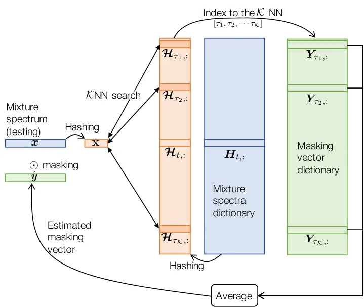
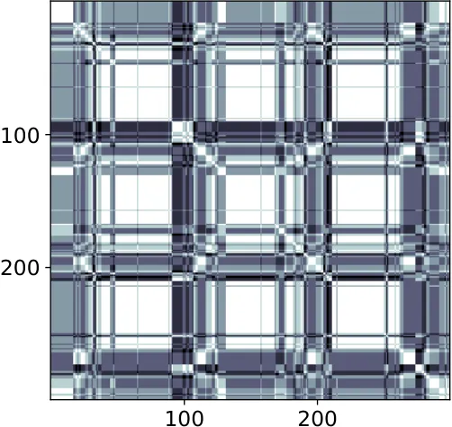
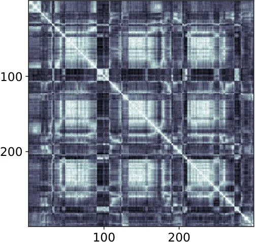
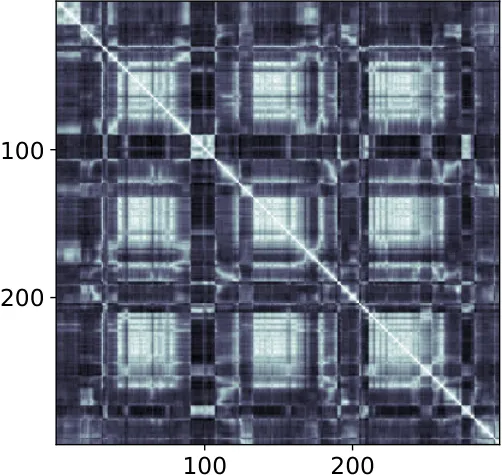
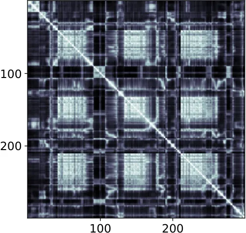

# Boosted Locality Sensitive Hashing: Discriminative Binary Codes for Source Separation

Sunwoo Kim    Haici Yang    Minje Kim ^(†)^(†)thanks: This material is
based upon work supported by the National Science Foundation under Award
Number:1909509.

###### Abstract

Speech enhancement tasks have seen significant improvements with the
advance of deep learning technology, but with the cost of increased
computational complexity. In this study, we propose an adaptive boosting
approach to learning locality sensitive hash codes, which represent
audio spectra efficiently. We use the learned hash codes for
single-channel speech denoising tasks as an alternative to a complex
machine learning model, particularly to address the resource-constrained
environments. Our adaptive boosting algorithm learns simple logistic
regressors as the weak learners. Once trained, their binary
classification results transform each spectrum of test noisy speech into
a bit string. Simple bitwise operations calculate Hamming distance to
find the $`{\mathcal{K}}`$-nearest matching frames in the dictionary of
training noisy speech spectra, whose associated ideal binary masks are
averaged to estimate the denoising mask for that test mixture. Our
proposed learning algorithm differs from AdaBoost in the sense that the
projections are trained to minimize the distances between the
self-similarity matrix of the hash codes and that of the original
spectra, rather than the misclassification rate. We evaluate our
discriminative hash codes on the TIMIT corpus with various noise types,
and show comparative performance to deep learning methods in terms of
denoising performance and complexity.

###### Index Terms: 

Speech Enhancement, Locality Sensitive Hashing, AdaBoost

^(†)^(†)address: Indiana University  
Department of Intelligent Systems Engineering  
Bloomington, IN 47408  
kimsunw@indiana.edu,  hy17@iu.edu,  minje@indiana.edu

## 1 Introduction

Deep learning-based source separation models have improved the
single-channel speech denoising performance, nearing the ideal ratio
masking results (IRM) \[1, 2\], or sometimes exceeding them \[3\].
However, as the model size gets bigger, challenges grow for deploying
such large models into resource-constrained devices, even just for
feedforward inferences. Solving this issue is critical in real life
scenarios for devices that require speaker separation and noise
cancellation for quality speech communication.

There is an ongoing research in considering the tradeoff between
complexity and accuracy, which is a priority for mobile and embedded
applications. Optimization of convolutional operations have been
explored to build small, low latency models \[4, 5\]. Pruning less
active weights \[6\] and filters \[7\] is another popular approach to
reducing the network complexity, too. The other dimension of network
compression is to reduce the number of bits to represent the network
parameters, sometimes down to just one bit \[8, 9\] , one of its kind
has shown promising performances in speech denoising \[10\].

In this paper we take another route to source separation by redefining
the problem as a $`{\mathcal{K}}`$-nearest neighborhood
($`{\mathcal{K}}`$NN) search task: for a given test mixture, the
separation is done by finding the nearest mixture spectra in the
training set, and consequently their corresponding ideal binary mask
vectors. However, the complexity of the search process linearly
increases with the size of the training data. We expedite this tedious
process by converting the query and database spectra into a hash code to
exploit bitwise matching operations. To this end, we start from locality
sensitive hashing (LSH), which is to construct hash functions such that
similar data points are more probable to collide in the hashed space,
or, in other words, more similar in terms of Hamming distance \[11,
12\]. While simple and effective, the random projection-based nature of
the LSH process is not trainable, thus limiting its performance when one
uses it for a specific problem.

We propose a learnable, but still projection-based hash function,
Boosted LSH (BLSH), so that the separation is done in the binary space
learned in a data-driven way \[13\]. BLSH reduce the redundancy in the
randomly generated LSH codes by relaxing the independence assumption
among the projection vectors and learn them sequentially in a boosting
manner such that they complement one another, an idea shown in search
applications \[14, 15\]. BLSH learns a set of linear classifiers (i.e.
perceptrons), whose binary classification results serve as a hash code.
To learn the sequence of binary classifiers we employ the adaptive
boosting (AdaBoost) technique \[16\], while we redefine the original
classification-based AdaBoost algorithm so that it works on our hashing
problem for separation. Since the binary representation is to improve
the quality of the hash code-based $`{\mathcal{K}}`$NN search during the
separation, the objective of our training algorithm is to maximize the
representativeness of the hash codes by minimizing the loss between the
two self-similarity matrices (SSM) constructed from the original spectra
and from the hash codes.

We evaluate BLSH on the single-channel denoising task and empirically
show that with respect to the efficiency, our system compares favorably
to deep learning architectures and generalizes well over unseen speakers
and noises. Since binary codes can be cheaply stored and the
$`{\mathcal{K}}`$NN search is expedited with bitwise operations, we
believe this to be a good alternative for the speaker enhancement task
where efficiency matters.

BLSH can be seen as an embedding technique with a strong constraint that
the embedding has to be binary. Finding embeddings that preserve the
semantic similarity is a popular goal in many disciplines. In natural
language processing, Word2Vec \[17\] or GloVe \[18\] methods use
pairwise metric learning to retrieve a distributed contextual
representation that retains complex syntactic and semantic relationships
within documents. Another model that trains on similarity information is
the Siamese networks \[19, 20\] which learn to discriminate a pair of
examples. Utilizing similarity information has also been explored in the
source separation community by posing denoising as a segmentation
problem in the time-frequency plane with an assumption that the
affinities between time-frequency regions could condense complex
auditory features together \[21\]. Inspired by studies of perceptual
grouping \[22\], in \[21\] local affinity matrices were constructed out
of cues specific to that of speech. Then, spectral clustering segments
the weighted combination of similarity matrices to unmix speech
mixtures. On the other hand, deep clustering learned a neural network
encoder that produces discriminant spectrogram embeddings, whose
objective is to approximate the ideal pairwise affinity matrix induced
from ideal binary masks (IBM) \[23\]. ChimeraNet extended the work by
utilizing deep clustering as a regularizer for TF-mask approximation
\[24\].

1: Input: $`\bm{x}`$, $`\bm{H}`$, $`\bm{Y}`$ $`\triangleright`$ A test
mixture vector and the dictionary

2: Output: $`\hat{\bm{y}}`$ $`\triangleright`$ A denoising mask vector

3: Initialize an empty set $`{\mathcal{N}}=`$ $`\varnothing`$ and
$`\mathcal{A}_{\text{min}}=0`$

4: for $`t\leftarrow 1`$ to $`T`$ do

5:   if
$`{\mathcal{S}}_{\text{cos}}(\bm{x},\bm{H}_{t,:})>\mathcal{A}_{\text{min}}`$
then

6:    Replace the farthest neighbor index in $`{\mathcal{N}}`$ with
$`t`$

7:    Update
$`\mathcal{A}_{\text{min}}\leftarrow\min_{k\in{\mathcal{N}}}{\mathcal{S}}_{\text{cos}}(\bm{x},\bm{H}_{k,:})`$

  

8: return
$`\hat{\bm{y}}\leftarrow\frac{1}{{\mathcal{K}}}\sum_{k\in\mathcal{N}}\bm{Y}_{k,:}`$

Algorithm 1 $`\mathcal{K}`$NN source separation

## 2 The $`{\mathcal{K}}`$NN Search-Based Source Separation

### 2.1 Baseline 1: Direct Spectral Matching

Suppose a masking-based source separation method by maintaining a large
dictionary of training examples and searching for only
$`{\mathcal{K}}`$NN to infer the mask. We assume that if the mixture
frames are similar, so are the sources in the mixture as well as their
IBMs.

Let $`\bm{H}\in\mathbb{R}^{T\times D}`$ be the normalized feature
vectors from $`T`$ frames of training mixture examples, e.g., noisy
speech spectra. $`T`$ can be a potentially very large number as it
exponentially grows with the number of sources. Out of many potential
choices, we are interested in short-time Fourier transform (STFT) and
mel-spectra as the feature vectors. For example, if $`\bm{H}`$ is from
STFT on the training mixture signals, $`D`$ corresponds to the number of
subbands $`F`$ in each spectrum, while for mel-spectra $`D<F`$.
$`\bm{H}`$ is normalized with the L2 norm. We also prepare their
corresponding IBM matrix, $`\bm{Y}\in\{0,1\}^{T\times F}`$, whose
dimension $`F`$ matches that of STFT. For a test mixture spectrum out of
STFT, $`\bar{\bm{x}}\in\mathbb{C}^{F}`$, our goal is to estimate a
denoising mask, $`\hat{\bm{y}}\in\mathbb{R}^{F}`$, to recover the source
by masking, $`\hat{\bm{y}}\odot\bar{\bm{x}}`$. While masking is applied
to the complex STFT spectrum $`\bar{\bm{x}}`$, the $`{\mathcal{K}}`$NN
search can be done in the $`D`$-dimensional feature space
$`\bm{x}\in\mathbb{R}^{D}`$, e.g., $`D<F`$ for mel-spectra.

Algorithm 1 describes the $`{\mathcal{K}}`$NN source separation
procedure. We use notation $`\mathcal{S}_{\text{cos}}`$ as the affinity
function, e.g., the cosine similarity function. For each frame
$`\bm{x}`$ in the mixture signal, we find the $`\mathcal{K}`$ closest
frames in the dictionary (line 4 to 7), which forms the set of indices
of $`{\mathcal{K}}`$NN,
$`{\mathcal{N}}=\{\tau_{1},\tau_{2},\cdots,\tau_{\mathcal{K}}\}`$. Using
them, we find the corresponding IBM vectors from $`\bm{Y}`$ and take
their average (line 8).

Complexity: The search procedure requires a linear scan of all
real-valued feature vectors in $`\bm{H}`$, giving $`O(QDT)`$, where
$`Q`$ stands for the floating-point precision (e.g., $`Q=64`$ for double
precision). This procedure is restrictive since $`T`$ needs to be large
for quality source separation.



Figure 1: The $`\mathcal{K}`$NN-based source separation process using
LSH codes.

### 2.2 Baseline 2: LSH with Random Projections

We can reduce the storage overhead and expedite Algorithm 1 using hashed
spectra and the Hamming similarity between them. We define $`L`$ random
projection vectors as $`\bm{P}\in\mathbb{R}^{L\times D}`$, where the
$`l`$-th bits in the codes is in the form of

```math
\bm{{\mathcal{H}}}_{:,l}=\text{sgn}(\bm{H}\bm{P}_{l,:}^{\top}+b_{l}) \tag{1}
```

with $`b_{l}`$ as a bias term. Applying the same $`\bm{P}`$ onto
$`\bm{H}`$ and $`\bm{x}`$, we obtain bipolar binary
$`\bm{{\mathcal{H}}}\in\{-1,+1\}^{T\times L}`$ and
$`\mathbf{x}\in\{-1,+1\}^{L}`$, respectively. Now, we tweak Algorithm 1,
by having them take the binary feature vectors. Moreover, Hamming
similarity also replaces the similarity function, which counts the
number of matching bits in the pair of binary feature vectors:
$`{\mathcal{S}}_{\text{Ham}}(\bm{a},\bm{b})=\sum_{l}{\mathcal{I}}(a_{l},b_{l})/L`$,
where $`{\mathcal{I}}(x,y)=1\text{ iff }x=y`$. Otherwise, the algorithm
is the same. Fig. 1 overviews the separation process of the baseline 2.

Randomness in the projections, however, dampens the quality of the hash
bits, necessitating for longer codes. This is detrimental in terms of
query time, computational cost of projecting the query to hash codes,
and storage overhead from the large number of projections. The
lackluster quality of the codes originates from the data-blind nature of
random projections \[25, 26\]. BLSH addresses this issue by learning
each projection as a weak binary classifier.

Complexity: Since the same Algorithm 1 is used, the dependency to $`T`$
remains the same, while we can reduce the complexity from $`O(QDT)`$ to
$`O(LT)`$ if $`L<QD`$. The procedure can be significantly accelerated
with supporting hardware as the Hamming similarity calculation is done
through bitwise AND and pop counting.

1: Input: $`\bm{H}`$ $`\triangleright`$ Dictionary of training examples

2: Output: $`\bm{P}`$ $`\triangleright`$ Set of projections

3: $`\bm{W}\leftarrow`$ uniform vector of $`\frac{1}{T\times T}`$
$`\triangleright`$ $`\bm{W}\in\mathbb{R}^{L\times T\times T}`$

4: $`\bm{P}\leftarrow`$ random initialization $`\triangleright`$
$`\bm{P}\in\mathbb{R}^{L\times D}`$

5: $`\beta\leftarrow`$ vector of zeros $`\triangleright`$
$`\beta\in\mathbb{R}^{L}`$

6: for $`l\leftarrow 1`$ to $`L`$ do

7:   $`\bm{P}_{l}\leftarrow\min\limits_{\bm{P}_{l}}`$
$`\sum\limits_{t_{1},t_{2}}{\mathcal{D}}\Big(\big[\bm{{\mathcal{H}}}_{:,l}\bm{{\mathcal{H}}}^{\top}_{:,l}\big]_{t_{1},t_{2}},\;\big[\bm{H}\bm{H}^{\top}\big]_{t_{1},t_{2}}\Big)\bm{W}_{l,t_{1},t_{2}}`$

8:
  $`\varepsilon_{l}=\sum\limits_{t_{1},t_{2}}{\mathcal{D}}\Big(\big[\bm{{\mathcal{H}}}_{:,l}\bm{{\mathcal{H}}}^{\top}_{:,l}\big]_{t_{1},t_{2}},\;\big[\bm{H}\bm{H}^{\top}\big]_{t_{1},t_{2}}\Big)\bm{W}_{l,t_{1},t_{2}}`$

9:
  $`\beta_{l}\leftarrow\frac{1}{2}\text{ln}\frac{1-\varepsilon_{l}}{\varepsilon_{l}}`$

10:
  $`\bm{W}_{l,:,:}=\bm{W}_{l-1,:,:}\odot\exp\big(\beta_{l}{\mathcal{D}}(\bm{{\mathcal{H}}}_{:,l-1}\bm{{\mathcal{H}}}^{\top}_{:,l-1},\;\bm{H}\bm{H}^{\top})\big)`$

11: return $`\bm{P}`$

Algorithm 2 BLSH training

## 3 The proposed Boosted LSH training algorithm for Source Separation

We set up our optimization problem with an objective to enrich the
quality of the hash codes. Since the code vector is a collection of the
binary classification results, during training the projection vectors
are directed to minimize the discrepancies between the pairwise affinity
relationships among the original spectra in $`\bm{H}`$ and those we
construct from their corresponding hash codes $`\bm{{\mathcal{H}}}`$.

Hence, given $`\bm{{\mathcal{H}}}_{:,l}`$ hash string from the $`l`$-th
projection, we express the loss function in terms of the dissimilarity
between the self-similarity matrices (SSM) as follows:

```math
\sum_{t_{1},t_{2}}{\mathcal{D}}\Big(\big[\bm{{\mathcal{H}}}_{:,l}\bm{{\mathcal{H}}}^{\top}_{:,l}\big]_{t_{1},t_{2}},\;\big[\bm{H}\bm{H}^{\top}\big]_{t_{1},t_{2}}\Big) \tag{2}
```

for a given distance metric $`{\mathcal{D}}`$, such as element-wise
cross-entropy. We scale the bipolar binary SSM to ranges of the ground
truth’s such that
$`\bm{{\mathcal{H}}}_{:,l}\bm{{\mathcal{H}}}^{\top}_{:,l}\in\{0,1\}^{T\times T}`$.
With this objective the learned binary hash codes can be more compact
and representative than the ones from a random projection. There can be
potentially many different solutions to this optimization problem, such
as solving this optimization directly for the set of projection vectors
$`\bm{P}`$ or spectral hashing that learns the hash codes directly with
no assumed projection process \[26\]. The proposed BLSH algorithm
employs an adaptive boosting mechnism to learn the projection vectors
one by one.

We reformulate AdaBoost \[16\], an adaptive boosting strategy for
classification, which is to learn efficient weak learners in the form of
linear classifiers that complement those learned in previous iterations.
It is an adaptive basis function model whose weak learners form a
weighted sum to achieve the final prediction, in our case an
approximation of the original self-similarity that minimizes the total
error as follows:

```math
\sum_{t_{1},t_{2}}{\mathcal{D}}\bigg(\Big[\sum_{l=1}^{L}\beta_{l}\bm{{\mathcal{H}}}_{:,l}\bm{{\mathcal{H}}}_{:,l}^{\top}\Big]_{t_{1},t_{2}},\;\;\Big[\bm{H}\bm{H}^{\top}\Big]_{t_{1},t_{2}}\bigg), \tag{3}
```

where $`\beta_{l}`$ is the weight for the $`l`$-th weak learner.



(a) $`L=5`$



(b) $`L=50`$



(c) $`L=200`$



(d) Ground Truth SSM

Figure 2: Self-affinity matrices of varying $`L`$ hash codes and
original time-frequency bins

In AdaBoost, the $`l`$-th projection is trained to focus more on the
previously misclassified examples by assigning an exponentially larger
weight to them. We redesign this part by making the sample weights
exponentially large for the too different pairs of SSM elements as in
(2). The SSM weights $`\bm{W}\in\mathbb{R}^{L\times T\times T}`$ are
initialized with uniform values over all $`(t_{1},t_{2})`$ pairs, and
then updated after adding every projection, such that each pairwise
location in the SSM is weighted element-wise based on the exponentiated
discrepancy made by the current weak learner as follows:

```math
\bm{W}_{l,:,:}=\bm{W}_{l-1,:,:}\odot\exp\big(\beta_{l}{\mathcal{D}}(\bm{{\mathcal{H}}}_{:,l-1}\bm{{\mathcal{H}}}^{\top}_{:,l-1},\;\bm{H}\bm{H}^{\top})\big) \tag{4}
```

The effect of this update rule is to tune the weights with respect to
the distances between the bitwise and original SSMs on a given metric.
Weights of the elements with the largest distance computed from the
$`(l-1)`$-th projection are amplified, and vice versa on close pairs.
The $`l`$-th weak learner can then use these weights to concentrate on
harder examples. This approach pursues a complementary $`l`$-th
projection; thus, overall rapidly increasing the approximation quality
in (3) with relatively smaller $`L`$ projections. The final boosted
objective for the $`l`$-th projection is formulated as

```math
\varepsilon_{l}=\sum_{t_{1},t_{2}}{\mathcal{D}}\Big(\big[\bm{{\mathcal{H}}}_{:,l}\bm{{\mathcal{H}}}^{\top}_{:,l}\big]_{t_{1},t_{2}},\;\big[\bm{H}\bm{H}^{\top}\big]_{t_{1},t_{2}}\Big)\bm{W}_{l,t_{1},t_{2}} \tag{5}
```

Under this objective, the first few projections index the majority of
the original features, thereby dramatically reducing the overall storage
of projections, computation from projecting elements, and the length of
hashed bit strings. Given the learned $`l`$-th projection and sample
weights, we obtain the weights over the projections as

```math
\beta_{l}=\frac{1}{2}\text{ln}\frac{1-\varepsilon_{l}}{\varepsilon_{l}} \tag{6}
```

Algorithm 2 summarizes the procedure. Fig. 2 shows the complementary
nature of the projections and their convergence behavior. After learning
the projection matrix $`\bm{P}`$, the rest of the test-time source
separation process is the same with Algorithm 1.

Complexity: BLSH does not change the run-time complexity $`O(LT)`$ of
baseline 2. However, we expect that BLSH can outperform LSH with smaller
$`L`$ thanks to the boosting mechanism.

Figure 3: SDR over number of projections on the open set.

## 4 Experiments

### 4.1 Experimental Setup

To investigate the effectiveness of BLSH for the speech enhancement job,
we evaluate our model on the TIMIT dataset. A training set consisting of
10 hours of noisy utterances was generated by randomly selecting 160
speakers from the train set, and by mixing each utterance with different
non-stationary noise signals with 0 dB signal-to-noise ratio (SNR),
namely $`\{`$birds, casino, cicadas, computer keyboard, eating chips,
frogs, jungle, machine guns, motorcycles, ocean$`\}`$ \[27\]. For both
subsamples, we select half of the speakers as male and the other half as
female. There are 10 short utterances per speaker recorded with a 16kHz
sampling rate. The projections are learned on the training set and the
output hash codes saved as the dictionary. 2 hours of cross validation
set were generated similarly from the training set, which is used to
evaluate the source separation performance of the closed speaker and
noise experiments (closed mixture set). One hour of evaluation data set
was mixed from 110 unseen speakers in the TIMIT test set and unseen
noise sources from the DEMAND database, which consists of domestic,
office, indoor public places, transportation, nature, and street (open
mixture set) \[28\]. The test set mixtures are with a 0 dB SNR and
gender-balanced. We apply a Short-Time Fourier Transform (STFT) with a
Hann window of 1024 and hop size of 256. During projection training, the
mixture speech was segmented with the length of 1000 frames as a
minibatch, such that the self-similarity matrices are of reasonable
size. For evaluation, calculate the SDR, SIR, and SAR from BSS_Eval
toolbox \[29\].

### 4.2 Discussion

Fig. 3 shows the improvements in performance over the number of
projections on the open mixture set. For our evaluation, all
$`{\mathcal{K}}`$NN-based approaches were performed with
$`{\mathcal{K}}=10`$ to narrow the focus on BLSH behavior with respect
to number of projections. We compare two sub-sampled dictionaries, 10%
and 1%, respectively, to expedite the $`{\mathcal{K}}`$NN search process
and to reduce the spatial requirement of the hashed dictionary. We
repeat the test ten times on different randomly sampled subsets. Fig. 3
shows the average and respective standard deviations (shades). First of
all, we see that larger dictionaries with 10% of data generally
outperforms smaller dictionaries. Enlarging the length of the hash code
$`L`$ also generally improves the performance until it saturates. More
importantly, BLSH consistently outperforms the random projection method
even with less data utilization (BLSH learned from 1% of data always
outperforms LSH with 10% subset), showcasing the merit of the boosting
mechanism. Also, random projections show a noticeable sensitivity to the
randomness in the sub-sampling procedure: the standard deviation is
significantly larger especially in the 1% case, whereas that of BLSH
remains tighter.

For comparison, we show the results in Table 1 at $`L=150`$ in the 10%
case. In the table, the proposed BLSH method consistently outperforms
the random projection approach and also $`{\mathcal{K}}`$NN on the raw
STFT magnitudes in the open mixture case. Although the oracle IRM was
higher in the open case, all systems perform worse than in the closed
case. It suggests that the unseen DEMAND noise sources are actually
easier to separate, yet difficult to generalize for models trained on
mixtures with ten noise types. In particular, we found that for unseen
noise types, such as public cafeteria sounds, the $`{\mathcal{K}}`$NN
systems on the raw STFT magnitudes generalize poorly. Regardless, the
proposed BLSH shows more robust generalization for the open mixture set
than both the random projection method and the direct
$`{\mathcal{K}}`$NN on the raw STFT case. It demonstrates the better
representativeness of the learned hash codes than the raw Fourier
coefficients or the basic LSH codes.

We compare the BLSH system with some deep neural network models as well,
a 3-layer fully connected network (FC) and a bi-directional long
short-term memory (LSTM) network \[30\] with two layers. Both networks
are with 1024 hidden units per layer. Unsurprisingly, both networks
outperform BLSH. However, considering the significantly the faster
bitwise inference process of BLSH, more than 10dB SDR improvement is
still a promising performance.

|                            |        |       |        |       |        |       |
| -------------------------- | ------ | ----- | ------ | ----- | ------ | ----- |
| Method                     | SDR    |       | SAR    |       | SIR    |       |
|                            | Closed | Open  | Closed | Open  | Closed | Open  |
| Oracle                     | 15.79  | 21.92 | 17.19  | 23.13 | 25.22  | 28.48 |
| BLSH                       | 10.20  | 10.04 | 11.57  | 12.12 | 17.22  | 18.20 |
| Random                     | 9.69   | 8.75  | 11.14  | 11.31 | 16.60  | 15.02 |
| $`{\mathcal{K}}`$NN (STFT) | 10.72  | 9.66  | 11.76  | 12.11 | 18.77  | 16.81 |
| FC                         | 12.17  | 12.04 | 13.39  | 13.67 | 19.37  | 21.22 |
| LSTM                       | 13.37  | 12.65 | 14.79  | 14.31 | 19.68  | 21.77 |

Table 1: Evaluation metrics for different separation methods.

Given these preliminary results, we believe further improvements can
come from several areas. For example, by combining each $`\beta_{l}`$
values with the computed Hamming similarity from the $`l`$-th hash
codes, the separation could take into account the relative contributions
of the learned projections. In addition, our approach does not employ
information on the time axis since each projections are applied on a
frame-by-frame basis. This could be enhanced with using projections on
multiple frames and windowing. Finally, enriching the dictionary to
include more disparate noise types as well as optimizing training using
kernel methods are potential candidates for future work.

## 5 Conclusion

In this paper, we proposed an adaptive boosted hashing algorithm called
Boosted LSH for the source separation problem using nearest neighbor
search. The model trains linear classifiers sequentially under a
boosting paradigm, culminating to a better approximation of the original
self-similarity matrix with shorter hash strings. With learned
projections, the $`{\mathcal{K}}`$-nearest matching frames in the hashed
dictionary to the test frame codes are found with efficient bitwise
operations, and a denoising mask estimated by the average of associated
IBMs. We showed through the experiments that our proposed framework
achieves comparable performance against deep learning models in terms of
denoising quality and complexity¹¹ 1 The code is open-sourced on
[https://github.com/sunwookimiub/BLSH](https://github.com/sunwookimiub/BLSH).²²
2 Audio examples can be found:
[https://saige.sice.indiana.edu/research-projects/BWSS-BLSH](https://saige.sice.indiana.edu/research-projects/BWSS-BLSH).

## References

- \[1\] A. Narayanan and D. L. Wang, “Ideal ratio mask estimation using
  deep neural networks for robust speech recognition,” in 2013 IEEE
  International Conference on Acoustics, Speech and Signal Processing.
  IEEE, 2013, pp. 7092–7096.
- \[2\] D. L. Wang and J. Chen, “Supervised speech separation based on
  deep learning: An overview,” IEEE/ACM Transactions on Audio, Speech,
  and Language Processing, vol. 26, no. 10, pp. 1702–1726, 2018.
- \[3\] K. Zhen, M. S. Lee, and M. Kim, “Efficient context aggregation
  for end-to-end speech enhancement using a densely connected
  convolutional and recurrent network,” arXiv preprint
  arXiv:1908.06468, 2019.
- \[4\] A. G. Howard, M. Zhu, B. Chen, D. Kalenichenko, W. Wang,
  T. Weyand, M. Andreetto, and H. Adam, “Mobilenets: Efficient
  convolutional neural networks for mobile vision applications,” arXiv
  preprint arXiv:1704.04861, 2017.
- \[5\] M. Wang, B. Liu, and H. Foroosh, “Factorized convolutional
  neural networks,” in Proceedings of the IEEE International Conference
  on Computer Vision, 2017, pp. 545–553.
- \[6\] S. Han, H. Mao, and W. J. Dally, “Deep compression: Compressing
  deep neural networks with pruning, trained quantization and Huffman
  coding,” in Proceedings of the International Conference on Learning
  Representations (ICLR), 2016.
- \[7\] H. Li, A. Kadav, I. Durdanovic, H. Samet, and H. P. Graf,
  “Pruning filters for efficient convnets,” arXiv preprint
  arXiv:1608.08710, 2016.
- \[8\] M. Rastegari, V. Ordonez, J. Redmon, and A. Farhadi, “Xnor-net:
  Imagenet classification using binary convolutional neural networks,”
  arXiv preprint arXiv:1603.05279, 2016.
- \[9\] D. Soudry, I. Hubara, and R. Meir, “Expectation backpropagation:
  Parameter-free training of multilayer neural networks with continuous
  or discrete weights,” in Advances in Neural Information Processing
  Systems (NIPS), 2014.
- \[10\] M. Kim and P. Smaragdis, “Bitwise neural networks for efficient
  single-channel source separation,” in Proceedings of the IEEE
  International Conference on Acoustics, Speech, and Signal Processing
  (ICASSP), 2018.
- \[11\] P. Indyk and R. Motwani, “Approximate nearest neighbor –
  towards removing the curse of dimensionality,” in Proceedings of the
  Annual ACM Symposium on Theory of Computing (STOC), 1998, pp. 604–613.
- \[12\] M. Datar, N. Immorlica, P. Indyk, and V. S. Mirrokni,
  “Locality-sensitive hashing scheme based on p-stable distributions,”
  in Proceedings of the twentieth annual symposium on Computational
  geometry. ACM, 2004, pp. 253–262.
- \[13\] Z. Li, H. Ning, L. Cao, T. Zhang, Y. Gong, and T. S. Huang,
  “Learning to search efficiently in high dimensions,” in Advances in
  Neural Information Processing Systems, 2011, pp. 1710–1718.
- \[14\] X. Liu, C. Deng, Y. Mu, and Z. Li, “Boosting complementary hash
  tables for fast nearest neighbor search,” in Thirty-First AAAI
  Conference on Artificial Intelligence, 2017.
- \[15\] H. Xu, J. Wang, Z. Li, G. Zeng, S. Li, and N. Yu,
  “Complementary hashing for approximate nearest neighbor search,” in
  2011 International Conference on Computer Vision. IEEE, 2011, pp.
  1631–1638.
- \[16\] Y. Freund and R. E. Schapire, “Experiments with a new boosting
  algorithm,” in icml. Citeseer, 1996, vol. 96, pp. 148–156.
- \[17\] Tomas Mikolov, Kai Chen, Greg Corrado, and Jeffrey Dean,
  “Efficient estimation of word representations in vector space,” arXiv
  preprint arXiv:1301.3781, 2013.
- \[18\] Jeffrey Pennington, Richard Socher, and Christopher D. Manning,
  “Glove: Global vectors for word representation,” in Empirical Methods
  in Natural Language Processing (EMNLP), 2014, pp. 1532–1543.
- \[19\] Gregory Koch, Richard Zemel, and Ruslan Salakhutdinov, “Siamese
  neural networks for one-shot image recognition,” in ICML deep learning
  workshop, 2015, vol. 2.
- \[20\] J. Bromley, I. Guyon, Y. LeCun, E. Säckinger, and R. Shah,
  “Signature verification using a “siamese” time delay neural network,”
  in Advances in Neural Information Processing Systems (NIPS), 1994, pp.
  737–744.
- \[21\] Francis R Bach and Michael I Jordan, “Learning spectral
  clustering, with application to speech separation,” Journal of Machine
  Learning Research, vol. 7, no. Oct, pp. 1963–2001, 2006.
- \[22\] Martin Cooke and Daniel PW Ellis, “The auditory organization of
  speech and other sources in listeners and computational models,”
  Speech communication, vol. 35, no. 3-4, pp. 141–177, 2001.
- \[23\] John R. Hershey, Zhuo Chen, Jonathan Le Roux, and Shinji
  Watanabe, “Deep clustering: Discriminative embeddings for segmentation
  and separation,” in Proceedings of the IEEE International Conference
  on Acoustics, Speech, and Signal Processing (ICASSP), Mar. 2016.
- \[24\] Y. Luo, Z. Chen, J. R. Hershey, J. Le Roux, and N. Mesgarani,
  “Deep clustering and conventional networks for music separation:
  Stronger together,” in Proceedings of the IEEE International
  Conference on Acoustics, Speech, and Signal Processing (ICASSP), March
  2017, pp. 61–65.
- \[25\] R. Salakhutdinov and G. Hinton, “Semantic hashing,”
  International Journal of Approximate Reasoning, vol. 50, no. 7, pp.
  969–978, 2009.
- \[26\] Y. Weiss, A. Torralba, and R. Fergus, “Spectral hashing,” in
  Advances in neural information processing systems, 2009, pp.
  1753–1760.
- \[27\] Z. Duan, G. J. Mysore, and P. Smaragdis, “Online PLCA for
  real-time semi-supervised source separation,” in International
  Conference on Latent Variable Analysis and Signal Separation.
  Springer, 2012, pp. 34–41.
- \[28\] J. Thiemann, N. Ito, and E. Vincent, “The diverse environments
  multi-channel acoustic noise database (demand): A database of
  multichannel environmental noise recordings,” in Proceedings of
  Meetings on Acoustics ICA2013. ASA, 2013, p. 035081.
- \[29\] E. Vincent, R. Gribonval, and C. Févotte, “Performance
  measurement in blind audio source separation,” IEEE transactions on
  audio, speech, and language processing, vol. 14, no. 4, pp.
  1462–1469, 2006.
- \[30\] M. Schuster and K. K. Paliwal, “Bidirectional recurrent neural
  networks,” IEEE Transactions on Signal Processing, vol. 45, no. 11,
  pp. 2673–2681, 1997.
