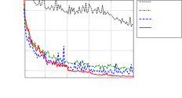
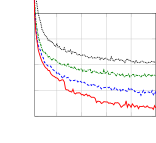
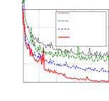
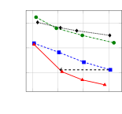
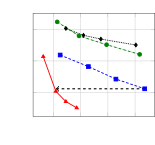

# Deep Residual-Dense Lattice Network for Speech Enhancement

Mohammad Nikzad, Aaron Nicolson, Yongsheng Gao Affiliation: Institute
for Integrated and Intelligent Systems, Griffith University, Australia
Email: <m.nikzadehaji@griffithuni.edu.au>    Jun Zhou, Kuldip K.
Paliwal, Fanhua Shang Email: [\${\$yongsheng.gao, jun.zhou,
k.paliwal\$}\$@griffith.edu.au](mailto:%24%7B%24yongsheng.gao,%20jun.zhou,%20k.paliwal%24%7D%24@griffith.edu.au)
Affiliation: Institute for Integrated and Intelligent Systems, Griffith
University, Australia Affiliation:  School of Artificial Intelligence,
Xidian University, China Email: <aaron.nicolson@griffithuni.edu.au>
Email: <fhshang@xidian.edu.cn>

###### Abstract

Convolutional neural networks (CNNs) with residual links (ResNets) and
causal dilated convolutional units have been the network of choice for
deep learning approaches to speech enhancement. While residual links
improve gradient flow during training, feature diminution of shallow
layer outputs can occur due to repetitive summations with deeper layer
outputs. One strategy to improve feature re-usage is to fuse both
ResNets and densely connected CNNs (DenseNets). DenseNets, however,
over-allocate parameters for feature re-usage. Motivated by this, we
propose the residual-dense lattice network (RDL-Net), which is a new CNN
for speech enhancement that employs both residual and dense aggregations
without over-allocating parameters for feature re-usage. This is managed
through the topology of the RDL blocks, which limit the number of
outputs used for dense aggregations. Our extensive experimental
investigation shows that RDL-Nets are able to achieve a higher speech
enhancement performance than CNNs that employ residual and/or dense
aggregations. RDL-Nets also use substantially fewer parameters and have
a lower computational requirement. Furthermore, we demonstrate that
RDL-Nets outperform many state-of-the-art deep learning approaches to
speech enhancement.  
Availability: https://github.com/nick-nikzad/RDL-SE.

## Introduction

Deep learning approaches to speech enhancement represent a significant
leap in performance over previous approaches, such as the
decision-directed (DD) approach \[\citeauthoryearEphraim and
Malah1984\]. Multi-layer perceptrons (MLPs) were amongst the first
artificial neural networks (ANNs) used for speech enhancement
\[\citeauthoryearXu et al.2017\]. Recurrent neural networks (RNNs)
employing long short-term memory (LSTM) cells provided a higher
performance at the cost of parameter inefficiency and extensive training
times \[\citeauthoryearChen and Wang2017\]. Convolutional neural
networks (CNNs) were able to match the performance of LSTM networks,
with fewer parameters and a reduction in training time
\[\citeauthoryearPark and Lee2017\]. LSTM networks were not outperformed
until the introduction of residual \[\citeauthoryearHe et al.2016,
\citeauthoryearRethage, Pons, and Serra2018\] and densely connected
\[\citeauthoryearHuang et al.2017, \citeauthoryearLi et al.2019\] CNNs,
as well as causal dilated convolutional units \[\citeauthoryearBai,
Kolter, and Koltun2018\]. A residual CNN (ResNet) aggregates layer
outputs via a summation operation, which is given as input to deeper
layers. A densely connected CNN (DenseNet) differs by aggregating layer
outputs via a concatenation operation. Other ANNs that have been
successfully applied to speech enhancement include generative
adversarial networks (GANs) and encoder-decoder CNNs
\[\citeauthoryearPascual, Bonafonte, and Serra2017\].

Residual and dense aggregations of layer outputs have been found to
benefit training. Residual links improve gradient flow during
backpropagation \[\citeauthoryearHe et al.2016\] and prevent the
vanishing and exploding gradient problems \[\citeauthoryearBengio,
Simard, and Frasconi1994\]. This allows the training of very deep neural
networks. Dense aggregations offer direct feature re-usage, as deeper
layers have access to the outputs of shallower layers
\[\citeauthoryearHuang et al.2017\]. This allows a layer to explore a
larger set of features during training. Despite the success of both
ResNets and DenseNets, both aggregation types have drawbacks. For
ResNets, information from the outputs of shallower layers can be lost
after multiple summations with deeper layer outputs \[\citeauthoryearZhu
et al.2018\]. This restricts feature re-usage and limits feature
exploration during training. For DenseNets, while the concatenation of
all previous layer outputs yields total feature re-usage, a significant
number of parameters are unexploited due to large input sizes
\[\citeauthoryearWang et al.2018\]. This is exemplified in Figure 1 (a),
where the input size increases with the depth of the block.

Combining the benefits of both aggregation types has also been
investigated. Mixed link networks (MLNs) are CNNs that employ both
residual and dense aggregations \[\citeauthoryearWang et al.2018\]. A
network that employs densely connected residual blocks (DenseRNet) was
able to outperform both ResNets and DenseNets on a speech recognition
task \[\citeauthoryearTang et al.2018\]. As shown in
\[\citeauthoryearWang et al.2018\], MLNs such as DenseRNets follow a
similar dense aggregation strategy to DenseNets. For example, DenseRNet
blocks have total feature re-usage between residual blocks. This
indicates that current MLNs possess the same drawback inherent with
DenseNets: too many parameters are allocated for feature re-usage in
each block.


Figure 1: Comparison of (a) the dense topology and (b) the proposed RDL
topology. The number of input features to each convolutional unit is
indicated. Given identical kernel and output sizes, more parameters are
consumed for a larger input size. ⓒ represents the concatenation
operation.

In this paper, we propose a new CNN for speech enhancement that takes
advantage of both aggregation types, without over-allocating parameters
for feature re-usage. This is achieved by using a topology that differs
from the chain-structure of MLNs, such as DenseRNet. The topology is a
triangular lattice of convolutional units, as illustrated in Figure 2.
Local dense aggregations of convolutional unit outputs are formed
strictly over the height of the lattice. As can be seen by comparing
Figure 1 (b) to Figure 1 (a), this reduces the maximum input size to a
convolutional unit within a block. While RDL blocks do not allow for
total feature re-usage, densely aggregating only a subset of previous
outputs has been shown to be beneficial \[\citeauthoryearZhu et
al.2018\]. Local residual and global dense links are also adopted, to
improve intra block gradient flow, and inter block feature re-usage,
respectively. We refer to the framework of applying residual and dense
aggregations over a triangular lattice of convolutional units as a
residual-dense lattice (RDL). Moreover, we show that the proposed RDL
network (RDL-Net) is able to produce a higher speech enhancement
performance than networks that employ residual and/or dense
aggregations. An ablation study of RDL-Nets is also performed over
multiple aggregation configurations. We also show that RDL-Nets
outperform many state-of-the-art deep learning approaches to speech
enhancement.

## Related works

ANNs have been used for enhancing speech in both the time- and
frequency-domain. In the time-domain, ANNs estimate clean speech frames
from given noisy speech frames. A GAN was employed for speech
enhancement in the time-domain (SEGAN), which used encoder-decoder CNNs
for both the generator and discriminator \[\citeauthoryearPascual,
Bonafonte, and Serra2017\]. A CNN employing non-causal dilated
convolutional units and residual links was also used for speech
enhancement in the time-domain (Wavenet) \[\citeauthoryearRethage, Pons,
and Serra2018\].

In the frequency-domain, ANNs are employed to estimate either the clean
speech magnitude spectra, a time-frequency mask, or the a priori SNR
from given noisy speech magnitude spectra. An MLP was used to estimate
the clean speech log-power spectra (LPS) \[\citeauthoryearXu et
al.2015\], with the framework later incorporating multi-objective
learning, and ideal binary mask (IBM) post-processing (Xu2017)
\[\citeauthoryearXu et al.2017\]. A DenseNet was also used to estimate
the clean speech LPS in \[\citeauthoryearLi et al.2019\], and was able
to outperform both MLP and LSTM networks in the same framework.
Time-frequency masks, such as the ideal ratio mask (IRM), are applied as
a suppression function to the noisy speech magnitude spectra. An LSTM
network was used to estimate the IRM (LSTM-IRM) \[\citeauthoryearChen
and Wang2017\], which was able to generalise to unseen speakers. A GAN
with a regularised loss function was also used to estimate the IRM
(MMSE-GAN), and was able to outperform SEGAN \[\citeauthoryearSoni,
Shah, and Patil2018\]. This was outperformed by another GAN IRM
estimator that used multiple objective measures during optimisation
(Metric-GAN) \[\citeauthoryearFu et al.2019\].

A priori SNR estimates are used by minimum mean-square error (MMSE)
estimators of the clean speech magnitude spectra
\[\citeauthoryearEphraim and Malah1984\]. Recently, a deep learning
approach to a priori SNR estimation was proposed (Deep Xi)
\[\citeauthoryearNicolson and Paliwal2019\]. It used a residual LSTM
network (ResLSTM) to estimate the a priori SNR directly from noisy
speech magnitude spectra. By estimating the a priori SNR, different MMSE
approaches can be used such as the MMSE log-spectral amplitude
(MMSE-LSA) estimator \[\citeauthoryearEphraim and Malah1985\] and the
square-root Wiener filter (SRWF) \[\citeauthoryearLim and
Oppenheim1979\]. RDL-Nets are examined within the Deep Xi framework, due
to its flexibility of MMSE estimator choice.


Figure 2: An RDL block with a length of 5 and height of 3. The two
coloured triangles indicate the left and right halves of the lattice.
Here, the kernel size is denoted by $`k`$.


Figure 3: The proposed RDL-Net for speech enhancement. The RDL-Net
estimates the a priori SNR from the given noisy speech magnitude
spectrum. The estimated a priori SNR is then used by an MMSE clean
speech magnitude spectrum estimator.

## Residual-dense lattice networks

The proposed RDL-Net is used to estimate the a priori SNR from given
noisy speech magnitude spectra, as shown in Figure 3. The network
consists of $`B`$ RDL blocks, and a sigmoidal fully-connected output
layer, O. The block topology is a triangular lattice of convolutional
units, as shown in Figure 2. The location of each convolutional unit
within the lattice, $`C_{hl}`$, is specified by a height and length
co-ordinate $`(h,l)`$, where $`h=1,2,...,H`$, and, $`l=1,2,...,L`$. The
number of convolutional units in each block is denoted by $`N`$, where
$`N`$ is a square number, and $`N\geq 4`$. The height of the lattice is
$`H=\sqrt{N}`$, and the length is $`L=2\sqrt{N}-1`$. The following
notation is used to indicate in which section of the lattice a
convolutional unit exists:

```math
C_{hl}=\begin{cases}C^{\lrtriangle}_{hl},&\text{if }h\leq l,~l\leq H\\
C^{\lltriangle}_{hl},&\text{if }h\leq 2H-l,~H<l\leq L\\
\emptyset,&\text{otherwise},\\
\end{cases} \tag{1}
```

where $`C^{\lrtriangle}_{hl}`$ and $`C^{\lltriangle}_{hl}`$ are
convolutional units that exist in the left and right triangles of the
lattice, respectively. $`\emptyset`$ indicates that the convolutional
unit does not exist.

### Convolutional units

Each convolutional unit is a composite function, $`f(\cdot)`$,
consisting of three operations, including layer normalisation
\[\citeauthoryearBa, Kiros, and Hinton2016\], followed by ReLU
activation \[\citeauthoryearGlorot, Bordes, and Bengio2011\], and 1D
causal dilated convolution \[\citeauthoryearBai, Kolter, and
Koltun2018\]. The output of a convolutional unit is given by
$`f(x_{hl},W_{hl})`$, where $`W_{hl}`$ denotes the weights (and biases).
Convolutional units within the RDL-Net are connected by both local and
global links (i.e. intra and inter block links).

### Local dense aggregations

The input to a convolutional unit in the left triangle of the lattice,
$`x^{\lrtriangle}_{hl}`$, is the dense aggregation of the outputs at
length $`l-1`$, and heights $`h,h-1,...,1`$:

```math
\displaystyle x^{\lrtriangle}_{hl} \displaystyle=\begin{cases}x_{11},&\text{if }l=h=1\\
y_{h(l-1)},&\text{if }C^{\lrtriangle}_{hl},~l>1,h=1\\
[y_{h(l-1)},x_{(h-1)l}],&\text{if }C^{\lrtriangle}_{hl},~l>h,h>1\\
x_{(h-1)l},&\text{if }C^{\lrtriangle}_{hl},~l=h,h>1,\end{cases} \tag{2}
```

where $`[.]`$ denotes the concatenation operation, and $`y_{hl}`$ is the
local residual aggregation at $`(h,l)`$. The local dense aggregations in
the left triangle of the lattice allow for multiple concise outputs to
be progressively formed. The input to a convolutional unit in the right
triangle of the lattice, $`x^{\lltriangle}_{hl}`$, is the dense
aggregation of the outputs at length $`l-1`$, and heights
$`h,h+1,...,H`$:

```math
\displaystyle x^{\lltriangle}_{hl} \displaystyle=\begin{cases}[y_{h(l-1)},y_{(h+1)(l-1)}],&\text{if }C^{\lltriangle}_{hl},~h=2H-l\\
[y_{h(l-1)},x_{(h+1)l}],&\text{if }C^{\lltriangle}_{hl},~h<2H-l.\end{cases} \tag{3}
```

In the right triangle of the lattice, the outputs are progressively
amalgamated into a single output. By densely aggregating outputs over
the height of the lattice, the input size to deeper convolutional units
within the block is limited. This enables RDL-Nets to avoid the drawback
associated with other densely connected residual networks: the
over-allocation of parameters for feature re-usage.

### Local residual aggregations

To improve the flow of gradients over the length of the lattice, local
residual links are adopted:

```math
y_{hl}=\begin{cases}f(x_{hl},W_{hl})+x_{h(l-1)},&\text{if }C^{\lrtriangle}_{hl}\text{ or }C^{\lltriangle}_{hl},~l>h\\
f(x_{hl},W_{hl}),&\text{if }C^{\lrtriangle}_{hl}\text{ or }C^{\lltriangle}_{hl},~l\leq h.\\
\end{cases} \tag{4}
```

When the size of $`y_{hl}`$ and $`x_{h(l-1)}`$ are non-identical, the
residual link is weighted so that $`x_{h(l-1)}`$ is the same size as
$`y_{hl}`$. Local residual links also help to stabilise the training
process \[\citeauthoryearHe et al.2016\].

### Global dense aggregations

Global dense links are adopted, to further enhance the propagation of
information between RDL blocks:

```math
x^{b+1}_{11}=[x^{b}_{11},y^{b}_{1L}], \tag{5}
```

where the superscript is added to the notation to indicate the block
index, $`b=1,2,...,B`$. Utilising global dense links also enables
feature re-usage between the RDL blocks.

### Implementation details

The receptive field of an RDL block is controlled via the dilatation
rate, $`d=2^{h-1}`$, and the kernel size, $`k=2h-1`$. However, this
strategy can expend a large number of parameters. Hence, we alternate
the kernel size of $`k=2h-1`$, with $`k=1`$ at each length, as depicted
in Figure 2. Moreover, we set the convolutional unit output size at each
height to $`m_{h}=\frac{m_{1}}{2^{h-1}}`$, where $`m_{1}`$ is the output
size at $`h=1`$. This policy ensures that a reduced number of parameters
are used for feature re-usage. In this work, the total number of
convolutional units for each RDL block was set to $`N=16`$ (hence,
$`H=4`$ and $`L=7`$). The output size of the first level ($`h=1`$) was
$`m_{1}=64`$. RDL-Nets with sizes of 0.53, 1.08, 1.48, 1.87, and 3.91
million parameters were formed by cascading 3, 6, 8, 10, and 18 blocks,
respectively.

## Experiment setup

### Network Configurations

The aforementioned RDL-Net configurations and the following network
configurations were tasked with estimating the a priori SNR within the
Deep Xi framework \[\citeauthoryearNicolson and Paliwal2019\]. The
estimated a priori SNR is then used by MMSE approaches to speech
enhancement.

ResNet:  
Each residual block contained 2 causal dilated convolutional units with
an output size of 64, and a kernel size of 3. For each block, $`d`$ was
cycled from 1 to 8 (increasing by a power of 2). ResNets of sizes 0.53,
1.03, 1.53, and 2.03 million parameters were formed by cascading 20, 40,
60, and 80 residual blocks, respectively.

DenseNet:  
Each dense block contained 4 causal dilated convolutional units with an
output size of 24, and a kernel size of 3. For each convolutional unit,
$`d`$ was cycled from 1 to 8 (increasing by a power of 2). DenseNets of
sizes 0.57, 0.97, 1.48, and 2.10 million parameters were formed by
cascading 5, 7, 9, and 11 dense blocks, respectively.

DenseRNet:  
Each denseR block was composed of 4 densely connected residual blocks.
Each residual block contained 2 causal dilated convolutional units with
an output size of 24 and a kernel size of 3. For each residual block,
$`d`$ was cycled from 1 to 8 (increasing by a power of 2). DenseRNets of
sizes 0.60, 1.05, 1.44, and 2.02 million parameters were formed by
cascading 2, 3, 4, and 6 denseR blocks, respectively.

ResLSTM:  
The cell size and number of residual blocks were 170 and 4, 188 and 5,
and 200 and 6, for the ResLSTMs of sizes 1.02, 1.51, and 2.03 million
parameters, respectively. This was the original network used in the Deep
Xi framework \[\citeauthoryearNicolson and Paliwal2019\].

### Speech enhancement

For each frame of noisy speech, the 257-point single-sided magnitude
spectrum was computed, which included both the DC frequency component
and the Nyquist frequency component, forming the input to each of the
five previously described networks. The estimated a priori SNR was used
by an MMSE approach (MMSE-LSA estimator or SRWF approach) to estimate
the clean speech magnitude spectrum. The short-time Fourier analysis,
modification, and synthesis (AMS) framework was used to produce the
final enhanced speech \[\citeauthoryearNicolson and Paliwal2019\]. The
Hamming window function was used for analysis and synthesis, with a
frame length of 32 ms and a frame shift of 16 ms.

### Training set

The train-clean-100 set from the Librispeech corpus
\[\citeauthoryearPanayotov et al.2015\], the CSTR VCTK corpus
(recordings from speakers $`p232`$ and $`p257`$ were excluded as they
are used in Test Set 2) \[\citeauthoryearVeaux et al.2017\], and the
$`si^{*}`$ and $`sx^{*}`$ training sets from the TIMIT corpus
\[\citeauthoryearGarofolo et al.1993\] were included in the training set
($`73\,404`$ clean speech recordings). $`5\%`$ of the clean speech
recordings ($`3\,667`$) were randomly selected and used as the
validation set. The $`2\,382`$ recordings adopted in
\[\citeauthoryearNicolson and Paliwal2019\] were used for the noise
training set. All clean speech and noise recordings were single-channel,
with a sampling frequency of 16 kHz. The noise corruption procedure for
the training set is described in the next subsection.

### Training strategy

Cross-entropy was used as the loss function. The Adam algorithm
\[\citeauthoryearKingma and Ba2014\] with default hyper-parameters was
used for stochastic gradient descent optimisation. A mini-batch size of
$`10`$ noisy speech signals was used. The noisy speech signals were
generated as follows: each clean speech recording selected for a
mini-batch was mixed with a random section of a randomly selected noise
recording at a randomly selected SNR level (-10 to 20 dB, in 1 dB
increments). A total of 100 epochs were use to train all CNN
architectures. A total of 10 epochs were used for the ResLSTM networks
and the LSTM-IRM estimator \[\citeauthoryearChen and Wang2017\], as each
epoch required eight hours of training.

### Test sets

The following two datasets were used for testing:

- •
  Test set 1: The first test set was used to obtain the results in
  Figures 4 and 5, and Tables 1, 2, and 3. The four noise sources
  included voice babble, F16, and factory from the RSG-10 noise dataset
  \[\citeauthoryearSteeneken and Geurtsen1988\] and street music
  (recording no. $`26\,270`$) from the Urban Sound dataset
  \[\citeauthoryearSalamon, Jacoby, and Bello2014\]. 10 clean speech
  recordings were randomly selected (without replacement) from the TSP
  speech corpus \[\citeauthoryearKabal2002\] for each of the four noise
  recordings. To generate the noisy speech, a random section of the
  noise recording was mixed with the clean speech at the following SNR
  levels: -5 to 15 dB, in 5 dB increments. This created a test set of
  200 noisy speech signals. The noisy speech was single channel, with a
  sampling frequency of 16 kHz.
- •
  Test set 2: The second test set was used to obtain the results in
  Table 4. In order to make a direct comparison, the second test set is
  identical to those used in previous works. The test set included 824
  clean speech recordings of two speakers from the Voice Bank corpus
  (393 from $`p232`$ and 431 from $`p257`$) \[\citeauthoryearVeaux,
  Yamagishi, and King2013\]. A total of 20 different conditions were
  used to create the noisy speech, including five noise types from the
  DEMAND dataset \[\citeauthoryearThiemann, Ito, and Vincent2013\], and
  four SNR levels: 2.5, 7.5, 12.5, and 17.5 dB. This corresponds to
  approximately 20 different sentences per condition for each speaker
  (824 noisy speech signals in the second test set).

## Results and discussion

### Local and global aggregation study

In this section we conduct an ablation study on the effects of two
aggregation types used in the RDL-Net topology, including local residual
links (LR) and global dense links (GD). To this end, four RDL-Net
configurations are examined, as shown in Table 1. The convergence of
each configuration during training is also depicted in Figure 4. The
four configurations were formed using the aforementioned
hyper-parameters, with 5 blocks. By adding either LR or GD to the
baseline (no LR or GD), it can be seen that a lower validation error can
be attained. While GD aggregations add more trainable parameters (0.23M)
to the baseline, it achieved a lower validation error than LR (141.82
vs. 142.14). However, the GD configuration caused obvious fluctuations
in the validation error during training. Utilising both LR and GD
produced the lowest validation error, without the fluctuations in
validation error exhibited by the GD configuration. This demonstrates
that enhanced intra block gradient flow and inter block feature re-usage
are both highly beneficial to the training of an RDL-Net.

|                                  |        |        |        |        |
| -------------------------------- | ------ | ------ | ------ | ------ |
| Different combinations of LR, GD |        |        |        |        |
| LR                               | ✕      | ✓      | ✕      | ✓      |
| GD                               | ✕      | ✕      | ✓      | ✓      |
| \# params.                       | 0.39M  | 0.53M  | 0.62M  | 0.86M  |
| Val. error                       | 146.37 | 142.14 | 141.82 | 141.43 |

Table 1: Ablation study of local residual (LR) and global dense (GD)
aggregations.



Figure 4: Validation error attained by four RDL-Net configuration types:
Baseline, LR, GD, and LR-GD.

|               |                                           |                |      |      |      |      |              |      |      |      |      |      |      |      |      |      |         |      |      |      |      |       |
| ------------- | ----------------------------------------- | -------------- | ---- | ---- | ---- | ---- | ------------ | ---- | ---- | ---- | ---- | ---- | ---- | ---- | ---- | ---- | ------- | ---- | ---- | ---- | ---- | ----- |
| Network       | \# params. $`\boldsymbol{\times 10^{6}}`$ | SNR level (dB) |      |      |      |      |              |      |      |      |      |      |      |      |      |      |         |      |      |      |      | SE    |
|               |                                           | Voice babble   |      |      |      |      | Street music |      |      |      |      | F16  |      |      |      |      | Factory |      |      |      |      |       |
|               |                                           | -5             | 0    | 5    | 10   | 15   | -5           | 0    | 5    | 10   | 15   | -5   | 0    | 5    | 10   | 15   | -5      | 0    | 5    | 10   | 15   |       |
| Noisy speech  | \-                                        | 1.04           | 1.07 | 1.15 | 1.35 | 1.71 | 1.04         | 1.06 | 1.11 | 1.27 | 1.58 | 1.03 | 1.06 | 1.11 | 1.25 | 1.52 | 1.04    | 1.04 | 1.09 | 1.24 | 1.54 | 0.016 |
| ResLSTM       | 1.02                                      | 1.07           | 1.20 | 1.51 | 1.96 | 2.49 | 1.10         | 1.23 | 1.50 | 1.92 | 2.47 | 1.13 | 1.28 | 1.49 | 1.80 | 2.33 | 1.09    | 1.22 | 1.54 | 1.86 | 2.31 | 0.035 |
| DenseNet      | 0.97                                      | 1.08           | 1.20 | 1.54 | 2.01 | 2.50 | 1.09         | 1.24 | 1.51 | 1.86 | 2.36 | 1.14 | 1.35 | 1.64 | 2.05 | 2.45 | 1.07    | 1.25 | 1.55 | 1.97 | 2.43 | 0.037 |
| DenseRNet     | 1.05                                      | 1.07           | 1.21 | 1.50 | 1.92 | 2.43 | 1.11         | 1.22 | 1.48 | 1.87 | 2.37 | 1.14 | 1.34 | 1.57 | 1.93 | 2.34 | 1.07    | 1.21 | 1.44 | 1.85 | 2.36 | 0.035 |
| ResNet        | 1.03                                      | 1.08           | 1.22 | 1.58 | 2.10 | 2.67 | 1.11         | 1.30 | 1.58 | 2.04 | 2.53 | 1.19 | 1.44 | 1.78 | 2.17 | 2.58 | 1.11    | 1.29 | 1.60 | 2.03 | 2.46 | 0.040 |
| Prop. RDL-Net | 1.08                                      | 1.10           | 1.29 | 1.65 | 2.15 | 2.62 | 1.13         | 1.32 | 1.66 | 2.11 | 2.53 | 1.25 | 1.48 | 1.73 | 2.17 | 2.62 | 1.15    | 1.39 | 1.73 | 2.10 | 2.54 | 0.039 |
| ResLSTM       | 1.51                                      | 1.09           | 1.25 | 1.56 | 2.03 | 2.47 | 1.09         | 1.26 | 1.56 | 1.95 | 2.44 | 1.16 | 1.35 | 1.60 | 1.87 | 2.19 | 1.11    | 1.30 | 1.60 | 1.94 | 2.35 | 0.037 |
| DenseNet      | 1.41                                      | 1.06           | 1.19 | 1.51 | 1.96 | 2.49 | 1.10         | 1.23 | 1.50 | 1.87 | 2.31 | 1.14 | 1.35 | 1.63 | 1.99 | 2.43 | 1.09    | 1.30 | 1.63 | 2.00 | 2.44 | 0.036 |
| DenseRNet     | 1.37                                      | 1.07           | 1.22 | 1.54 | 2.00 | 2.50 | 1.12         | 1.29 | 1.59 | 1.99 | 2.45 | 1.20 | 1.41 | 1.71 | 2.10 | 2.53 | 1.06    | 1.24 | 1.57 | 2.00 | 2.45 | 0.038 |
| ResNet        | 1.53                                      | 1.08           | 1.25 | 1.61 | 2.12 | 2.64 | 1.10         | 1.28 | 1.56 | 2.00 | 2.48 | 1.18 | 1.41 | 1.72 | 2.15 | 2.61 | 1.10    | 1.30 | 1.64 | 2.07 | 2.53 | 0.040 |
| Prop. RDL-Net | 1.48                                      | 1.12           | 1.31 | 1.67 | 2.20 | 2.75 | 1.17         | 1.41 | 1.75 | 2.09 | 2.59 | 1.28 | 1.52 | 1.85 | 2.25 | 2.61 | 1.17    | 1.40 | 1.74 | 2.12 | 2.59 | 0.040 |
| ResLSTM       | 2.03                                      | 1.09           | 1.23 | 1.51 | 2.02 | 2.48 | 1.13         | 1.30 | 1.59 | 2.06 | 2.50 | 1.19 | 1.37 | 1.61 | 1.92 | 2.29 | 1.14    | 1.35 | 1.64 | 2.01 | 2.48 | 0.036 |
| DenseNet      | 1.94                                      | 1.07           | 1.21 | 1.54 | 2.04 | 2.47 | 1.09         | 1.21 | 1.46 | 1.86 | 2.33 | 1.16 | 1.36 | 1.65 | 1.98 | 2.44 | 1.09    | 1.27 | 1.64 | 2.03 | 2.49 | 0.037 |
| DenseRNet     | 2.02                                      | 1.08           | 1.20 | 1.48 | 1.83 | 2.24 | 1.10         | 1.21 | 1.42 | 1.77 | 2.23 | 1.19 | 1.37 | 1.60 | 1.93 | 2.29 | 1.06    | 1.18 | 1.42 | 1.81 | 2.29 | 0.033 |
| ResNet        | 2.03                                      | 1.10           | 1.28 | 1.59 | 2.08 | 2.59 | 1.14         | 1.30 | 1.60 | 1.98 | 2.43 | 1.21 | 1.46 | 1.75 | 2.09 | 2.52 | 1.11    | 1.30 | 1.61 | 2.02 | 2.54 | 0.038 |
| Prop. RDL-Net | 1.87                                      | 1.10           | 1.30 | 1.67 | 2.23 | 2.73 | 1.18         | 1.44 | 1.80 | 2.20 | 2.62 | 1.23 | 1.48 | 1.80 | 2.30 | 2.62 | 1.18    | 1.43 | 1.75 | 2.13 | 2.63 | 0.040 |
| LSTM-IRM      | 30.7                                      | 1.07           | 1.20 | 1.46 | 1.88 | 2.31 | 1.08         | 1.17 | 1.40 | 1.71 | 2.13 | 1.09 | 1.24 | 1.46 | 1.71 | 2.00 | 1.06    | 1.18 | 1.40 | 1.72 | 2.12 | 0.030 |
| Xu2017        | 19.1                                      | 1.18           | 1.43 | 1.78 | 2.20 | 2.66 | 1.15         | 1.33 | 1.58 | 1.94 | 2.35 | 1.17 | 1.43 | 1.80 | 2.25 | 2.65 | 1.09    | 1.23 | 1.47 | 1.87 | 2.34 | 0.040 |
| Prop. RDL-Net | 3.91                                      | 1.13           | 1.36 | 1.79 | 2.46 | 2.98 | 1.19         | 1.42 | 1.83 | 2.27 | 2.74 | 1.26 | 1.53 | 1.86 | 2.31 | 2.78 | 1.19    | 1.46 | 1.83 | 2.26 | 2.74 | 0.045 |

Table 2: Enhanced speech objective quality scores. The mean opinion
score of the listening quality objective (MOS-LQO) was used as the
metric, where the wideband perceptual evaluation of quality (Wideband
PESQ) was the objective model used to obtain the MOS-LQO score
\[\citeauthoryearRec2005\]. The tested conditions include clean speech
mixed with real-world non-stationary (voice babble and street music) and
coloured (F16 and factory) noise sources at multiple SNR levels. The
highest MOS-LQO score attained at each condition and for each parameter
size is shown in boldface. The standard error (SE) over all conditions
for each network is provided in the last column.

|               |                                           |                |       |      |      |      |              |      |      |      |      |      |      |      |      |      |         |      |      |      |      |       |
| ------------- | ----------------------------------------- | -------------- | ----- | ---- | ---- | ---- | ------------ | ---- | ---- | ---- | ---- | ---- | ---- | ---- | ---- | ---- | ------- | ---- | ---- | ---- | ---- | ----- |
| Network       | \# params. $`\boldsymbol{\times 10^{6}}`$ | SNR level (dB) |       |      |      |      |              |      |      |      |      |      |      |      |      |      |         |      |      |      |      | SE    |
|               |                                           | Voice babble   |       |      |      |      | Street music |      |      |      |      | F16  |      |      |      |      | Factory |      |      |      |      |       |
|               |                                           | -5             | 0     | 5    | 10   | 15   | -5           | 0    | 5    | 10   | 15   | -5   | 0    | 5    | 10   | 15   | -5      | 0    | 5    | 10   | 15   |       |
| Noisy speech  | \-                                        | 60.2           | 72.4  | 83.0 | 90.7 | 95.5 | 59.0         | 70.9 | 81.9 | 90.3 | 95.6 | 60.4 | 71.8 | 82.4 | 90.5 | 95.7 | 57.8    | 69.9 | 80.9 | 89.2 | 94.5 | 0.010 |
| ResLSTM       | 1.02                                      | 58.1           | 73.8  | 85.4 | 92.7 | 96.5 | 64.3         | 76.9 | 87.6 | 93.6 | 96.9 | 64.8 | 77.6 | 86.6 | 92.1 | 95.8 | 60.0    | 73.6 | 84.8 | 91.2 | 95.3 | 0.010 |
| DenseNet      | 0.97                                      | 56.5           | 72.5  | 85.8 | 93.5 | 96.8 | 62.8         | 74.1 | 85.4 | 92.5 | 96.3 | 64.8 | 78.6 | 87.7 | 93.2 | 96.4 | 59.3    | 74.8 | 85.9 | 92.4 | 96.0 | 0.010 |
| DenseRNet     | 1.05                                      | 58.6           | 73.9  | 85.4 | 92.3 | 96.1 | 64.0         | 75.5 | 85.7 | 92.2 | 96.3 | 65.7 | 78.2 | 87.2 | 93.1 | 96.8 | 58.1    | 74.3 | 84.3 | 91.1 | 95.6 | 0.010 |
| ResNet        | 1.03                                      | 59.8           | 75.4  | 87.4 | 94.0 | 97.0 | 65.4         | 77.2 | 88.0 | 94.0 | 97.2 | 68.0 | 80.3 | 88.7 | 94.1 | 97.1 | 62.5    | 76.9 | 86.7 | 92.9 | 96.4 | 0.009 |
| Prop. RDL-Net | 1.08                                      | 60.2           | 77.9  | 88.6 | 94.3 | 97.2 | 67.2         | 80.4 | 89.9 | 94.8 | 97.4 | 69.6 | 82.7 | 90.1 | 94.6 | 97.3 | 63.3    | 79.4 | 88.4 | 93.4 | 96.5 | 0.009 |
| ResLSTM       | 1.51                                      | 60.3           | 76.1  | 87.0 | 93.9 | 96.9 | 63.5         | 77.3 | 87.9 | 94.0 | 97.0 | 66.4 | 79.3 | 87.7 | 93.0 | 96.0 | 62.1    | 78.3 | 87.5 | 92.8 | 96.2 | 0.009 |
| DenseNet      | 1.41                                      | 59.4           | 75.1  | 86.6 | 93.3 | 96.6 | 64.1         | 76.3 | 86.6 | 92.9 | 96.4 | 65.9 | 79.8 | 88.0 | 93.5 | 96.6 | 60.0    | 77.9 | 87.1 | 92.7 | 96.1 | 0.009 |
| DenseRNet     | 1.37                                      | 59.7           | 74.6  | 86.1 | 93.0 | 96.5 | 62.8         | 75.8 | 85.9 | 92.4 | 96.3 | 67.1 | 79.2 | 87.8 | 93.3 | 96.8 | 59.9    | 75.1 | 86.0 | 92.3 | 96.0 | 0.009 |
| ResNet        | 1.53                                      | 60.9           | 76.5  | 87.9 | 94.0 | 97.1 | 66.0         | 77.9 | 88.2 | 93.8 | 97.0 | 67.9 | 80.9 | 89.3 | 94.3 | 97.3 | 63.2    | 78.3 | 87.8 | 93.1 | 96.5 | 0.009 |
| Prop. RDL-Net | 1.48                                      | 61.0           | 77.3  | 88.9 | 94.5 | 97.4 | 66.8         | 80.0 | 89.2 | 94.4 | 97.4 | 69.4 | 82.6 | 89.7 | 94.3 | 97.2 | 64.6    | 80.0 | 88.7 | 93.5 | 96.7 | 0.009 |
| ResLSTM       | 2.03                                      | 61.1           | 74.6  | 87.0 | 93.7 | 96.9 | 66.4         | 78.8 | 88.8 | 94.2 | 97.1 | 67.6 | 80.3 | 88.6 | 93.6 | 96.5 | 64.1    | 79.1 | 87.8 | 93.1 | 96.4 | 0.009 |
| DenseNet      | 1.94                                      | 60.1           | 75.3  | 86.9 | 93.9 | 96.9 | 64.8         | 77.1 | 86.9 | 93.2 | 96.8 | 66.7 | 79.9 | 88.3 | 93.3 | 96.5 | 60.4    | 77.2 | 87.4 | 92.8 | 96.3 | 0.009 |
| DenseRNet     | 2.02                                      | 59.3           | 73.4  | 84.8 | 92.0 | 95.8 | 64.0         | 74.8 | 84.4 | 91.2 | 95.5 | 66.5 | 77.8 | 86.4 | 92.4 | 96.1 | 58.6    | 73.4 | 84.1 | 91.2 | 95.4 | 0.009 |
| ResNet        | 2.03                                      | 62.7           | 77.3  | 87.6 | 93.8 | 97.0 | 66.7         | 78.0 | 88.1 | 94.0 | 97.1 | 69.0 | 81.1 | 88.6 | 93.8 | 97.0 | 62.1    | 77.1 | 86.9 | 92.5 | 96.3 | 0.009 |
| Prop. RDL-Net | 1.87                                      | 61.5           | 77.8  | 89.0 | 94.7 | 97.4 | 68.5         | 81.2 | 90.1 | 94.8 | 97.4 | 69.3 | 82.5 | 90.4 | 94.9 | 97.4 | 64.8    | 80.6 | 88.6 | 93.5 | 96.6 | 0.009 |
| LSTM-IRM      | 30.7                                      | 64.2           | 78.5  | 88.0 | 93.5 | 96.5 | 66.1         | 77.4 | 86.6 | 92.6 | 96.0 | 67.3 | 79.1 | 87.3 | 92.5 | 95.8 | 62.3    | 76.7 | 86.6 | 92.5 | 95.9 | 0.009 |
| Xu2017        | 19.1                                      | 62.5           | 74.8  | 83.8 | 90.1 | 94.7 | 64.0         | 77.9 | 86.7 | 92.4 | 95.5 | 68.3 | 79.0 | 86.7 | 92.8 | 95.5 | 61.0    | 74.2 | 83.9 | 90.5 | 94.7 | 0.009 |
| Prop. RDL-Net | 3.91                                      | 64.2           | 80.82 | 89.0 | 94.7 | 97.4 | 71.6         | 82.9 | 90.7 | 95.0 | 97.5 | 72.6 | 83.9 | 91.0 | 95.4 | 97.8 | 67.1    | 81.7 | 89.5 | 93.9 | 96.8 | 0.008 |

Table 3: Enhanced speech objective intelligibility scores (in $`\%`$) as
given by the short-time objective intelligibility (STOI) metric
\[\citeauthoryearTaal et al.2010\]. The tested conditions include clean
speech mixed with real-world non-stationary (voice babble and street
music) and coloured (F16 and factory) noise sources at multiple SNR
levels. The highest STOI score attained at each condition and for each
parameter size is shown in boldface. The standard error (SE) over all
conditions for each network is provided in the last column.

|                                                                    |      |      |      |      |           |
| ------------------------------------------------------------------ | ---- | ---- | ---- | ---- | --------- |
| Method                                                             | CSIG | CBAK | COVL | PESQ | STOI      |
| Noisy speech                                                       | 3.35 | 2.44 | 2.63 | 1.97 | 92 (91.5) |
| Wiener \[\citeauthoryearScalart and J.V1996\]                      | 3.23 | 2.68 | 2.67 | 2.22 | \-        |
| SEGAN \[\citeauthoryearPascual, Bonafonte, and Serra2017\]         | 3.48 | 2.94 | 2.80 | 2.16 | 93        |
| Wavenet \[\citeauthoryearRethage, Pons, and Serra2018\]            | 3.62 | 3.23 | 2.98 | \-   | \-        |
| MMSE-GAN \[\citeauthoryearSoni, Shah, and Patil2018\]              | 3.80 | 3.12 | 3.14 | 2.53 | 93        |
| Deep Feature Loss \[\citeauthoryearGermain, Chen, and Koltun2018\] | 3.86 | 3.33 | 3.22 | \-   | \-        |
| Metric-GAN \[\citeauthoryearFu et al.2019\]                        | 3.99 | 3.18 | 3.42 | 2.86 | \-        |
| Proposed RDL-Net 1.87M (Deep Xi - MMSE-LSA)                        | 4.29 | 3.32 | 3.62 | 2.93 | 93 (93.4) |
| Proposed RDL-Net 1.87M (Deep Xi - SRWF)                            | 4.27 | 3.23 | 3.56 | 2.84 | 93 (93.5) |
| Proposed RDL-Net 3.91M (Deep Xi - MMSE-LSA)                        | 4.38 | 3.43 | 3.72 | 3.02 | 94 (93.8) |
| Proposed RDL-Net 3.91M (Deep Xi - SRWF)                            | 4.36 | 3.35 | 3.67 | 2.94 | 94 (93.8) |

Table 4: Comparison to recent deep learning approaches to speech
enhancement using the second test set. As in previous works, the
objective scores are averaged over all tested conditions. CSIG, CBAK,
and COVL are mean opinion score (MOS) predictors of the signal
distortion, background-noise intrusiveness, and overall signal quality,
respectively \[\citeauthoryearHu and Loizou2008\]. PESQ is the
perceptual evaluation of speech quality measure \[\citeauthoryearHu and
Loizou2008\]. STOI is the short-time objective intelligibility measure
(in %) \[\citeauthoryearTaal et al.2010\]. The highest scores attained
for each measure are indicated in boldface.

### Training and validation error

The training and validation error curves for the RDL-Net, ResNet,
DenseNet, and DenseRNet at a parameter sizes of approximately 2 million
are shown in Figures 5 (a) and (b), respectively. The RDL-Net was able
to converge to a lower training and validation error than the other
networks. This suggests that the proposed RDL-Net allocated an efficient
number of parameters for feature re-usage. Conversely, the DenseNet and
DenseRNet struggled at a parameter size of 2 million, indicating that
too many parameters were wasted on feature re-usage.

### Parameter and computational efficiency

The lowest validation error as a function of the number of parameters
and computations for RDL-Nets, ResNets, DenseNets, and DenseRNets are
shown in Figures5 (c) and (d), respectively. RDL-Nets were able to
achieve the same validation error as ResNets that employed significantly
more parameters. For example, at a parameter size of 1 million, the
RDL-Net attained the same lowest validation error as the ResNet with
double the amount of parameters. A similar trend can be seen for the
lowest validation error as a function of the number of FLOPs, (where
FLOPs refers to the number of multiplication-addition operations during
inference). For example, the RDL-Net that requires 2 million FLOPs
achieved a lowest validation error similar to that of the ResNet that
requires $`4\times`$ as many FLOPs.









Figure 5: Training plots for RDL-Nets, ResNets, DenseNets and
DenseRNets: (a) training error, (b) validation error, and lowest
validation error as a function of the number of (c) parameters and (d)
FLOPs.

### Speech enhancement performance

The enhanced speech objective quality scores attained by each of the
networks in the Deep Xi framework are presented in Table 2. Each network
estimated the a priori SNR for the MMSE-LSA estimator. It can be seen
that RDL-Nets were able to achieve the highest objective quality scores
for most of the tested conditions. The performance capability of
RDL-Nets was demonstrated at a parameter size of 2 million for street
music at 10 dB, where the RDL-Net achieved a MOS-LQO improvement of 0.22
over the ResNet. Table 3 shows the objective intelligibility scores
obtained by each of the networks. It can be seen that RDL-Nets were able
to achieve the highest objective intelligibility scores for most of the
tested conditions. RDL-Nets demonstrated its performance at a parameter
size of 2 million for factory noise at 0 dB, attaining an STOI
improvement of $`3.5\%`$ when compared to the equivalent ResNet.
RDL-Nets in the Deep Xi framework were also able to produce enhanced
speech with higher objective quality and intelligibility scores than two
other widely known deep learning speech enhancement frameworks (LSTM-IRM
and Xu2017) \[\citeauthoryearXu et al.2017, \citeauthoryearChen and
Wang2017\].

We also compare RDL-Nets to recent deep learning approaches to speech
enhancement. Here, RDL-Nets were used to estimate the a priori SNR for
the SRWF approach and the MMSE-LSA estimator. As shown in Table 4,
RDL-Nets were able to attain the highest CSIG, CBAK, COVL, PESQ and STOI
scores. The RDL-Net demonstrated an improvement of 0.39, 0.25, 0.3, and
0.16 over Metric-GAN for CSIG, CBAK, COVL, and PESQ, respectively. The
RDL-Net also demonstrated an improvement of $`1\%`$ over MMSE-GAN for
STOI. The enhanced speech produced by RDL-Net 3.91M is illustrated in
Figure 6 (d). It can be seen that the RDL-Net demonstrated superior
noise suppression with little formant distortion. As illustrated in
Figure 6 (c), Deep Feature Loss over- and under-estimated multiple
spectral components.¹¹ 1 Enhanced speech recordings and additional
results are available at: https://github.com/nick-nikzad/RDL-SE.


Figure 6: (a) Clean speech magnitude spectrogram ($`|\textbf{S}|`$) of
female $`p257`$ uttering sentence $`70`$, “The price cuts are really
exciting”. (b) Crowd noise mixed with (a) at an SNR level of 2.5 dB
($`|\textbf{X}|`$). Enhanced speech ($`|\hat{\textbf{S}}|`$) produced by
(c) Deep Feature Loss and (d) RDL-Net 3.91M (Deep Xi-MMSE-LSA).

## Conclusion

In this paper, we propose a novel convolutional neural network (CNN) for
speech enhancement, called a residual-dense lattice (RDL) network.
Unlike other CNNs that use both residual and dense aggregations,
RDL-Nets take advantage of both aggregation types without
over-allocating parameters for feature re-usage. This enables RDL-Nets
to produce a higher speech enhancement performance than other networks,
such as ResLSTM networks, ResNets, DenseNets, and DenseRNets. We also
show that RDL-Nets are able to outperform many state-of-the-art deep
learning approaches to speech enhancement. In future work, the RDL-Net
topology will be investigated for speech separation, speech recognition,
computer vision, and image denoising.

## References

- \[\citeauthoryearBa, Kiros, and Hinton2016\] Ba, J. L.; Kiros, J. R.;
  and Hinton, G. E. 2016. Layer normalization. arXiv preprint
  arXiv:1607.06450.
- \[\citeauthoryearBai, Kolter, and Koltun2018\] Bai, S.; Kolter, J. Z.;
  and Koltun, V. 2018. An empirical evaluation of generic convolutional
  and recurrent networks for sequence modeling. arXiv preprint
  arXiv:1803.01271.
- \[\citeauthoryearBengio, Simard, and Frasconi1994\] Bengio, Y.;
  Simard, P.; and Frasconi, P. 1994. Learning long-term dependencies
  with gradient descent is difficult. IEEE Transactions on Neural
  Networks 5(2):157–166.
- \[\citeauthoryearChen and Wang2017\] Chen, J., and Wang, D. 2017.
  Long short-term memory for speaker generalization in supervised speech
  separation. The Journal of the Acoustical Society of America
  141(6):4705–4714.
- \[\citeauthoryearEphraim and Malah1984\] Ephraim, Y., and Malah, D. 1984. Speech enhancement using a minimum-mean square error short-time
  spectral amplitude estimator. IEEE Transactions on Acoustics, Speech,
  and Signal Processing 32(6):1109–1121.
- \[\citeauthoryearEphraim and Malah1985\] Ephraim, Y., and Malah, D. 1985. Speech enhancement using a minimum mean-square error
  log-spectral amplitude estimator. IEEE Transactions on Acoustics,
  Speech, and Signal Processing 33(2):443–445.
- \[\citeauthoryearFu et al.2019\] Fu, S.-W.; Liao, C.-F.; Tsao, Y.; and
  Lin, S.-D. 2019. MetricGAN: Generative adversarial networks based
  black-box metric scores optimization for speech enhancement. In ICML,
  2031–2041.
- \[\citeauthoryearGarofolo et al.1993\] Garofolo, J. S.; Lamel, L. F.;
  Fisher, W. M.; Fiscus, J. G.; and Pallett, D. S. 1993. DARPA TIMIT
  acoustic-phonetic continuous speech corpus CD-ROM. NIST speech disc
  1-1.1. NASA STI/Recon Technical Report N 93.
- \[\citeauthoryearGermain, Chen, and Koltun2018\] Germain, F. G.; Chen,
  Q.; and Koltun, V. 2018. Speech denoising with deep feature losses.
  arXiv preprint arXiv:1806.10522.
- \[\citeauthoryearGlorot, Bordes, and Bengio2011\] Glorot, X.; Bordes,
  A.; and Bengio, Y. 2011. Deep sparse rectifier neural networks. In
  AISTATS, 315–323.
- \[\citeauthoryearHe et al.2016\] He, K.; Zhang, X.; Ren, S.; and
  Sun, J. 2016. Identity mappings in deep residual networks. In ECCV,
  630–645. Springer.
- \[\citeauthoryearHu and Loizou2008\] Hu, Y., and Loizou, P. C. 2008.
  Evaluation of objective quality measures for speech enhancement. IEEE
  Transactions on Audio, Speech, and Language Processing 16(1):229–238.
- \[\citeauthoryearHuang et al.2017\] Huang, G.; Liu, Z.; Van
  Der Maaten, L.; and Weinberger, K. Q. 2017. Densely connected
  convolutional networks. In CVPR, 4700–4708.
- \[\citeauthoryearKabal2002\] Kabal, P. 2002. TSP speech database.
  McGill University, Database Version.
- \[\citeauthoryearKingma and Ba2014\] Kingma, D. P., and Ba, J. 2014.
  Adam: A method for stochastic optimization. arXiv preprint
  arXiv:1412.6980.
- \[\citeauthoryearLi et al.2019\] Li, Y.; Li, X.; Dong, Y.; Li, M.; Xu,
  S.; and Xiong, S. 2019. Densely connected network with time-frequency
  dilated convolution for speech enhancement. In ICASSP, 6860–6864.
- \[\citeauthoryearLim and Oppenheim1979\] Lim, J. S., and Oppenheim,
  A. V. 1979. Enhancement and bandwidth compression of noisy speech.
  Proceedings of the IEEE 67(12):1586–1604.
- \[\citeauthoryearNicolson and Paliwal2019\] Nicolson, A., and Paliwal,
  K. K. 2019. Deep learning for minimum mean-square error approaches to
  speech enhancement. Speech Communication 111:44 – 55.
- \[\citeauthoryearPanayotov et al.2015\] Panayotov, V.; Chen, G.;
  Povey, D.; and Khudanpur, S. 2015. Librispeech: an ASR corpus based
  on public domain audio books. In ICASSP, 5206–5210.
- \[\citeauthoryearPark and Lee2017\] Park, S. R., and Lee, J. W. 2017.
  A fully convolutional neural network for speech enhancement. In
  INTERSPEECH, 1993–1997.
- \[\citeauthoryearPascual, Bonafonte, and Serra2017\] Pascual, S.;
  Bonafonte, A.; and Serra, J. 2017. SEGAN: Speech enhancement
  generative adversarial network. In INTERSPEECH.
- \[\citeauthoryearRec2005\] Rec, I. 2005. P. 862.2: Wideband
  extension to recommendation P. 862 for the assessment of wideband
  telephone networks and speech codecs. International Telecommunication
  Union, CH–Geneva.
- \[\citeauthoryearRethage, Pons, and Serra2018\] Rethage, D.; Pons, J.;
  and Serra, X. 2018. A Wavenet for speech denoising. In ICASSP,
  5069–5073. IEEE.
- \[\citeauthoryearSalamon, Jacoby, and Bello2014\] Salamon, J.; Jacoby,
  C.; and Bello, J. P. 2014. A dataset and taxonomy for urban sound
  research. In ACM ICM, 1041–1044.
- \[\citeauthoryearScalart and J.V1996\] Scalart, P., and J.V, F. 1996.
  Speech enhancement based on a priori signal to noise estimation. In
  ICASSP, volume 2, 629–632.
- \[\citeauthoryearSoni, Shah, and Patil2018\] Soni, M. H.; Shah, N.;
  and Patil, H. A. 2018. Time-frequency masking-based speech
  enhancement using generative adversarial network. In ICASSP,
  5039–5043. IEEE.
- \[\citeauthoryearSteeneken and Geurtsen1988\] Steeneken, H. J., and
  Geurtsen, F. W. 1988. Description of the RSG-10 noise database.
  Report IZF 1988-3, TNO Institute for Perception, Soesterberg, The
  Netherlands.
- \[\citeauthoryearTaal et al.2010\] Taal, C. H.; Hendriks, R. C.;
  Heusdens, R.; and Jensen, J. 2010. A short-time objective
  intelligibility measure for time-frequency weighted noisy speech. In
  ICASSP, 4214–4217.
- \[\citeauthoryearTang et al.2018\] Tang, J.; Song, Y.; Dai, L.; and
  McLoughlin, I. V. 2018. Acoustic modeling with densely connected
  residual network for multichannel speech recognition. In INTERSPEECH,
  1783–1787.
- \[\citeauthoryearThiemann, Ito, and Vincent2013\] Thiemann, J.; Ito,
  N.; and Vincent, E. 2013. The diverse environments multi-channel
  acoustic noise database: A database of multichannel environmental
  noise recordings. The Journal of the Acoustical Society of America
  133(5):3591–3591.
- \[\citeauthoryearVeaux et al.2017\] Veaux, C.; Yamagishi, J.;
  MacDonald, K.; et al. 2017. CSTR VCTK corpus: English multi-speaker
  corpus for CSTR voice cloning toolkit. University of Edinburgh. The
  Centre for Speech Technology Research (CSTR).
- \[\citeauthoryearVeaux, Yamagishi, and King2013\] Veaux, C.;
  Yamagishi, J.; and King, S. 2013. The voice bank corpus: Design,
  collection and data analysis of a large regional accent speech
  database. In O-COCOSDA/CASLRE, 1–4.
- \[\citeauthoryearWang et al.2018\] Wang, W.; Li, X.; Lu, T.; and
  Yang, J. 2018. Mixed link networks. In IJCAI, 2819–2825.
- \[\citeauthoryearXu et al.2015\] Xu, Y.; Du, J.; Dai, L.-R.; and Lee,
  C.-H. 2015. A regression approach to speech enhancement based on deep
  neural networks. IEEE/ACM Transactions on Audio, Speech, and Language
  Processing 23(1):7–19.
- \[\citeauthoryearXu et al.2017\] Xu, Y.; Du, J.; Huang, Z.; Dai,
  L.-R.; and Lee, C.-H. 2017. Multi-objective learning and mask-based
  post-processing for deep neural network based speech enhancement.
  arXiv preprint arXiv:1703.07172.
- \[\citeauthoryearZhu et al.2018\] Zhu, L.; Deng, R.; Maire, M.; Deng,
  Z.; Mori, G.; and Tan, P. 2018. Sparsely aggregated convolutional
  networks. In ECCV, 186–201.
