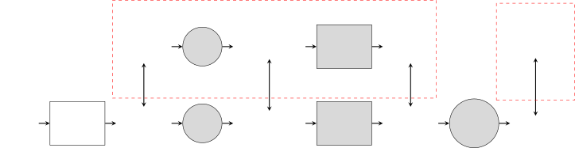
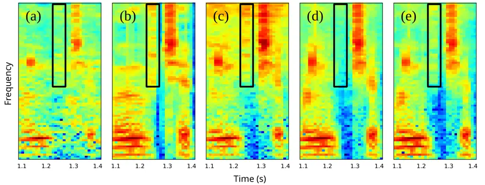

# Phonetic Feedback for Speech Enhancement With and Without Parallel Speech Data

Peter Plantinga    Deblin Bagchi    Eric Fosler-Lussier

###### Abstract

While deep learning systems have gained significant ground in speech
enhancement research, these systems have yet to make use of the full
potential of deep learning systems to provide high-level feedback. In
particular, phonetic feedback is rare in speech enhancement research
even though it includes valuable top-down information. We use the
technique of mimic loss to provide phonetic feedback to an off-the-shelf
enhancement system, and find gains in objective intelligibility scores
on CHiME-4 data. This technique takes a frozen acoustic model trained on
clean speech to provide valuable feedback to the enhancement model, even
in the case where no parallel speech data is available. Our work is one
of the first to show intelligibility improvement for neural enhancement
systems without parallel speech data, and we show phonetic feedback can
improve a state-of-the-art neural enhancement system trained with
parallel speech data.

###### Index Terms: 

speech intelligibility, phonetic feedback, mimic loss, CHiME-4, parallel
data

^(†)^(†)address: The Ohio State University

## 1 Introduction

Typical speech enhancement techniques focus on local criteria for
improving speech intelligibility and quality. Time-frequency prediction
techniques use local spectral quality estimates as an objective
function; time domain methods directly predict clean output with a
potential spectral quality metric \[1\]. Such techniques have been
extremely successful in predicting a speech denoising function, but also
require parallel clean and noisy speech for training. The trained
systems implicitly learn the phonetic patterns of the speech signal in
the coordinated output of time-domain or time-frequency units. However,
our hypothesis is that directly providing phonetic feedback can be a
powerful additional signal for speech enhancement. For example, many
local metrics will be more attuned to high-energy regions of speech, but
not all phones of a language carry equal energy in production (compare
/v/ to /ae/).

Our proxy for phonetic intelligibility is a frozen automatic speech
recognition (ASR) acoustic model trained on clean speech; the loss
functions we incorporate into training encourage the speech enhancement
system to produce output that is interpretable to a fixed acoustic model
as clean speech, by making the output of the acoustic model mimic its
behavior under clean speech. This mimic loss \[2\] provides key
linguistic insights to the enhancement model about what a recognizable
phoneme looks like.

When no parallel data is available, but transcripts are available, a
loss is easily computed against hard senone labels and backpropagated to
the enhancement model trained from scratch. Since the clean acoustic
model is frozen, the only way for the enhancement model to improve the
loss is to make a signal that is more recognizable to the acoustic
model. The improvement by this model demonstrates the power of phonetic
feedback; very few neural enhancement techniques until now have been
able to achieve improvements without parallel data.

When parallel data is available, mimic loss works by comparing the
outputs of the acoustic model on clean speech with the outputs of the
acoustic model on denoised speech. This is a more informative loss than
the loss against hard senone labels, and is complimentary to local
losses. We show that mimic loss can be applied to an off-the-shelf
enhancement system and gives an improvement in intelligibility scores.
Our technique is agnostic to the enhancement system as long as it is
differentiably trainable.

Mimic loss has previously improved performance on robust ASR tasks
\[2\], but has not yet demonstrated success at enhancement metrics, and
has not been used in a non-parallel setting. We seek to demonstrate
these advantages here:

1.  1.  We show that using hard targets in the mimic loss framework leads to
        improvements in objective intelligibility metrics when no parallel
        data is available.
2.  2.  We show that when parallel data is available, training the
        state-of-the-art method with mimic loss improves objective
        intelligibility metrics.

Figure 1: Operations are listed inside shapes, the circles are
operations that are not parameterized, the rectangles represent
parameterized operations. The gray operations are not trained, meaning
the loss is backpropagated without any updates until the front-end
denoiser is reached.

## 2 Related Work

Speech enhancement is a rich field of work with a huge variety of
techniques. Spectral feature based enhancement systems have focused on
masking approaches \[3\], and have gained popularity with deep learning
techniques \[4\] for ideal ratio mask and ideal binary mask estimation
\[5\].

### 2.1 Perceptual Loss

Perceptual losses are a form of knowledge transfer \[6\], which is
defined as the technique of adding auxiliary information at train time,
to better inform the trained model. The first perceptual loss was
introduced for the task of style transfer \[7\]. These losses depends on
a pre-trained network that can disentangle relevant factors. Two
examples are fed through the network to generate a loss at a high level
of the network. In style transfer, the perceptual loss ensures that the
high-level contents of an image remain the same, while allowing the
texture of the image to change.

For speech-related tasks a perceptual loss has been used to denoise
time-domain speech data \[8\], where the loss was called a ”deep feature
loss”. The perceiving network was trained for acoustic environment
detection and domestic audio tagging. The clean and denoised signals are
both fed to this network, and a loss is computed at a higher level.

Perceptual loss has also been used for spectral-domain data, in the
mimic loss framework. This has been used for spectral mapping for robust
ASR in \[2\] and \[9\]. The perceiving network in this case is an
acoustic model trained with senone targets. Clean and denoised spectral
features are fed through the acoustic model, and a loss is computed from
the outputs of the network. These works did not evaluate mimic loss for
speech enhancement, nor did they develop the framework for use without
parallel data.

### 2.2 Enhancement Without Parallel Data

One approach for enhancement without parallel data introduces an
adversarial loss to generate realistic masks \[10\]. However, this work
is only evaluated for ASR performance, and not speech enhancement
performance.

For the related task of voice conversion, a sparse representation was
used by \[11\] to do conversion without parallel data. This wasn’t
evaluated on enhancement metrics or ASR metrics, but would prove an
interesting approach.

Several recent works have investigated jointly training the acoustic
model with a masking speech enhancement model \[12, 13, 14\], but these
works did not evaluate their system on speech enhancement metrics.
Indeed, our internal experiments show that without access to the clean
data, joint training severely harms performance on these metrics.

## 3 Mimic Loss for Enhancement

Figure 2: Comparison of a short segment of the log-mel filterbank
features of utterance M06_441C020F_STR from the CHiME-4 corpus. The
generation procedure for the features are as follows: (a) noisy,
(b) clean, (c) non-parallel mimic, (d) local losses, (e) local + mimic
loss. Highlighted is a region enhanced by mimic loss but ignored by
local losses.

As noted before, we build on the work by Pandey and Wang that denoises
the speech signal in the time domain, but computes a mapping loss on the
spectral magnitudes of the clean and denoised speech samples. This is
possible because the STFT operation for computing the spectral features
is fully differentiable. This framework for enhancement lends itself to
other spectral processing techniques, such as mimic loss.

In order to train this off-the-shelf denoiser using the mimic loss
objective, we first train an acoustic model on clean spectral
magnitudes. The training objective for this model is cross-entropy loss
against hard senone targets. Crucially, the weights of the acoustic
model are frozen during the training of the enhancement model. This
prevents passing information from enhancement model to acoustic model in
a manner other than by producing a signal that behaves like clean
speech. This is in contrast to joint training, where the weights of the
acoustic model are updated at the same time as the denoising model
weights, which usually leads to a degradation in enhancement metrics.

Without parallel speech examples, we apply the mimic loss framework by
using hard senone targets instead of soft targets. The loss against
these hard targets is cross-entropy loss ($`L_{CE}`$). The senone labels
can be gathered from a hard alignment of the transcripts with the noisy
or denoised features; the process does not require clean speech samples.
Since this method only has access to phone alignments and not clean
spectra, we do not expect it to improve the speech quality, but expect
it to improve intelligibility.

We also ran experiments on different formats for the mimic loss when
parallel data is available. Setting the mapping losses to be $`L_{1}`$
was determined to be most effective by Pandey and Wang. For the mimic
loss, we tried both teacher-student learning with $`L_{1}`$ and
$`L_{2}`$ losses, and knowledge-distillation with various temperature
parameters on the softmax outputs. We found that using $`L_{1}`$ loss on
the pre-softmax outputs performed the best, likely due to the fact that
the other losses are also $`L_{1}`$. When the loss types are different,
one loss type usually comes to dominate, but each loss serves an
important purpose here.

We provide an example of the effects of mimic loss, both with and
without parallel data, by showing the log-mel filterbank features, seen
in Figure 2. A set of relatively high-frequency and low-magnitude
features is seen in the highlighted portion of the features. Since local
metrics tend to emphasize regions of high energy differences, they miss
this important phonetic information. However, in the mimic-loss-trained
systems, this information is retained.

## 4 Experiments

For all experiments, we use the CHiME-4 corpus, a popular corpus for
robust ASR experiments, though it has not often been used for
enhancement experiments. During training, we randomly select a channel
for each example each epoch, and we evaluate our enhancement results on
channel 5 of et05.

Before training the enhancement system, we train the acoustic model used
for mimic loss on the clean spectral magnitudes available in CHiME-4.
Our architecture is a Wide-ResNet-inspired model, that takes a whole
utterance and produces a posterior over each frame. The model has 4
blocks of 3 layers, where the blocks have 128, 256, 512, 1024 filters
respectively. The first layer of each block has a stride of 2,
down-sampling the input. After the convolutional layers, the filters are
divided into 16 parts, and each part is fed to a fully-connected layer,
so the number of output posterior vectors is the same as the input
frames. This is an utterance-level version of the model in \[9\].

In the case of parallel data, the best results were obtained by training
the network for only a few epochs (we used 5). However, when using hard
targets, we achieved better results from using the fully-converged
network. We suspect that the outputs of the converged network more
closely reflect the one-hot nature of the senone labels, which makes
training easier for the enhancement model when hard targets are used. On
the other hand, only lightly training the acoustic model generates
softer targets when parallel data is available.

For our enhancement model, we began with the state-of-the-art framework
introduced by Pandey and Wang in \[1\], called AECNN. We reproduce the
architecture of their system, replacing the PReLU activations with leaky
ReLU activations, since the performance is similar, but the leaky ReLU
network has fewer parameters.

### 4.1 Without parallel data

We first train this network without the use of parallel data, using only
the senone targets, and starting from random weights in the AECNN. In
Table 1 we see results for enhancement without parallel data: the
cross-entropy loss with senone targets given a frozen clean-speech
network is enough to improve eSTOI by 4.3 points. This is a surprising
improvement in intelligibility given the lack of parallel data, and
demonstrates that phonetic information alone is powerful enough to
provide improvements to speech intelligibility metrics. The degradation
in SI-SDR performance, a measure of speech quality, is expected, given
that the denoising model does not have access to clean data, and may
corrupt the phase.

We compare also against joint training of the enhancement model with the
acoustic model. This is a common technique for robust ASR, but has not
been evaluated for enhancement. With the hard targets, joint training
performs poorly on enhancement, due to co-adaptation of the enhancement
and acoustic model networks. Freezing the acoustic model network is
critical since it requires the enhancement model to produce speech the
acoustic model sees as “clean.”

| Features             | SI-SDR | eSTOI |
| -------------------- | ------ | ----- |
| Noisy speech         | 7.5    | 68.3  |
| Mimic - hard targets | 1.6    | 72.6  |
| Joint training       | 0.6    | 47.0  |

Table 1: Speech enhancement scores for the state-of-the-art architecture
trained from scratch without the parallel clean speech data from the
CHiME-4 corpus. Evaluation is done on channel 5 of the simulated et05
data. The joint training is done with an identical setup to the mimic
system.

### 4.2 With parallel data

In addition to the setting without any parallel data, we show results
given parallel data. In Table 2 we demonstrate that training the AECNN
framework with mimic loss improves intelligibility over both the model
trained with only time-domain loss (AECNN-T), as well as the model
trained with both time-domain and spectral-domain losses (AECNN-T-SM).
We only see a small improvement in the SI-SDR, likely due to the fact
that the mimic loss technique is designed to improve the recognizablity
of the results. In fact, seeing any improvement in SI-SDR at all is a
surprising result.

We also compare against joint training with an identical setup to the
mimic setup (i.e. a combination of three losses: teacher-student loss
against the clean outputs, spectral magnitude loss, and time-domain
loss). The jointly trained acoustic model is initialized with the
weights of the system trained on clean speech. We find that joint
training performs much better on the enhancement metrics in this setup,
though still not quite as well as the mimic setup. Compared to the
previous experiment without parallel data, the presence of the spectral
magnitude and time-domain losses likely keep the enhancement output more
stable when joint training, at the cost of requiring parallel training
data.

|                |        |       |
| -------------- | ------ | ----- |
| Features       | SI-SDR | eSTOI |
| Noisy speech   | 7.5    | 68.3  |
| AECNN-T        | 11.5   | 77.0  |
| \+ Mimic loss  | 11.9   | 79.1  |
| AECNN-T-SM     | 11.7   | 78.9  |
| \+ Mimic loss  | 11.9   | 79.8  |
| Joint training | 11.7   | 79.5  |

Table 2: Speech enhancement scores for the state-of-the-art system
trained with the parallel data available in the CHiME-4 corpus.
Evaluation is done on channel 5 of the simulation et05 data. Mimic loss
is applied to the AECNN model trained with time-domain mapping loss
only, as well as time-domain and spectral magnitude mapping losses. The
joint training system is done with an identical setup to the mimic
system with all three losses.

## 5 Conclusion

We have shown that phonetic feedback is valuable for speech enhancement
systems. In addition, we show that our approach to this feedback, the
mimic loss framework, is useful in many scenarios: with and without the
presence of parallel data, in both the enhancement and robust ASR
scenarios. Using this framework, we show improvement on a
state-of-the-art model for speech enhancement. The methodology is
agnostic to the enhancement technique, so may be applicable to other
differentiably trained enhancement modules.

In the future, we hope to address the reduction in speech quality scores
when training without parallel data. One approach may be to add a GAN
loss to the denoised time-domain signal, which may help with introduced
distortions. In addition, we could soften the cross-entropy loss to an
$`L_{1}`$ loss by generating ”prototypical” posterior distributions for
each senone, averaged across the training dataset.

Mimic loss as a framework allows for a rich space of future
possibilities. To that end, we have made our code available at
[http://github.com/OSU-slatelab/mimic-enhance](http://github.com/OSU-slatelab/mimic-enhance).

## References

- \[1\] Ashutosh Pandey and DeLiang Wang, “A new framework for CNN-based
  speech enhancement in the time domain,” IEEE/ACM Transactions on
  Audio, Speech and Language Processing (TASLP), vol. 27, no. 7, pp.
  1179–1188, 2019.
- \[2\] Deblin Bagchi, Peter Plantinga, Adam Stiff, and Eric
  Fosler-Lussier, “Spectral feature mapping with mimic loss for robust
  speech recognition,” in 2018 IEEE International Conference on
  Acoustics, Speech and Signal Processing (ICASSP). IEEE, 2018, pp.
  5609–5613.
- \[3\] Nathalie Virag, “Single channel speech enhancement based on
  masking properties of the human auditory system,” IEEE Transactions on
  speech and audio processing, vol. 7, no. 2, pp. 126–137, 1999.
- \[4\] Arun Narayanan and DeLiang Wang, “Ideal ratio mask estimation
  using deep neural networks for robust speech recognition,” in 2013
  IEEE International Conference on Acoustics, Speech and Signal
  Processing. IEEE, 2013, pp. 7092–7096.
- \[5\] DeLiang Wang, “On ideal binary mask as the computational goal of
  auditory scene analysis,” in Speech separation by humans and machines,
  pp. 181–197. Springer, 2005.
- \[6\] Vladimir Vapnik and Rauf Izmailov, “Learning using privileged
  information: similarity control and knowledge transfer.,” Journal of
  machine learning research, vol. 16, no. 2023-2049, pp. 2, 2015.
- \[7\] Justin Johnson, Alexandre Alahi, and Li Fei-Fei, “Perceptual
  losses for real-time style transfer and super-resolution,” in European
  conference on computer vision. Springer, 2016, pp. 694–711.
- \[8\] Francois Germain, Qifeng Chen, and Vladlen Koltun, “Speech
  denoising with deep feature losses,” arXiv preprint
  arXiv:1806.10522, 2018.
- \[9\] Peter Plantinga, Deblin Bagchi, and Eric Fosler-Lussier, “An
  exploration of mimic architectures for residual network based spectral
  mapping,” in 2018 IEEE International Conference on Speech and Language
  Technologies (SLT). IEEE, 2018.
- \[10\] Takuya Higuchi, Keisuke Kinoshita, Marc Delcroix, and Tomohiro
  Nakatani, “Adversarial training for data-driven speech enhancement
  without parallel corpus,” in 2017 IEEE Automatic Speech Recognition
  and Understanding Workshop (ASRU). IEEE, 2017, pp. 40–47.
- \[11\] Berrak Çişman, Haizhou Li, and Kay Chen Tan, “Sparse
  representation of phonetic features for voice conversion with and
  without parallel data,” in 2017 IEEE Automatic Speech Recognition and
  Understanding Workshop (ASRU). IEEE, 2017, pp. 677–684.
- \[12\] Zhong-Qiu Wang and DeLiang Wang, “A joint training framework
  for robust automatic speech recognition,” IEEE/ACM Transactions on
  Audio, Speech, and Language Processing, vol. 24, no. 4, pp.
  796–806, 2016.
- \[13\] Tobias Menne, Ralf Schlüter, and Hermann Ney, “Investigation
  into joint optimization of single channel speech enhancement and
  acoustic modeling for robust ASR,” in ICASSP 2019-2019 IEEE
  International Conference on Acoustics, Speech and Signal Processing
  (ICASSP). IEEE, 2019, pp. 6660–6664.
- \[14\] Meet Soni and Ashish Panda, “Label driven time-frequency
  masking for robust continuous speech recognition,” Proc. Interspeech
  2019, pp. 426–430, 2019.
