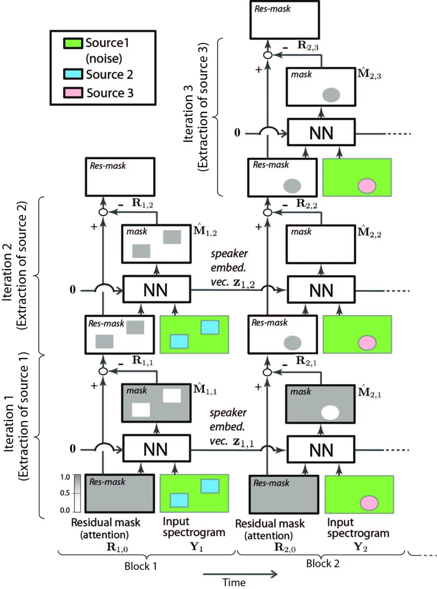
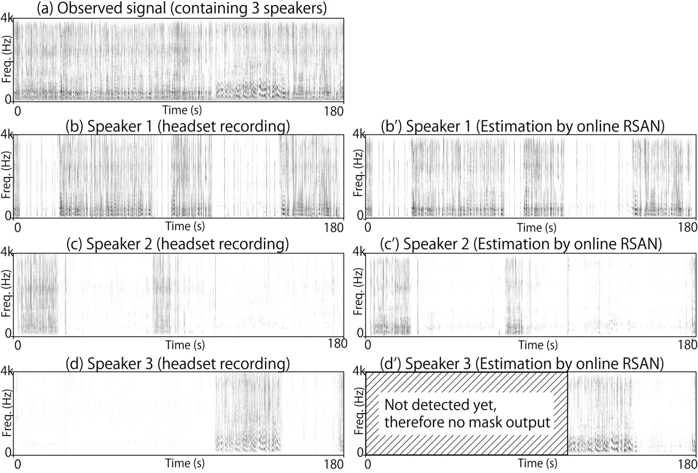

# Tackling real noisy reverberant meetings with all-neural source separation, counting, and diarization system

Keisuke Kinoshita    Marc Delcroix    Shoko Araki    Tomohiro Nakatani

###### Abstract

Automatic meeting analysis is an essential fundamental technology
required to let, e.g. smart devices follow and respond to our
conversations. To achieve an optimal automatic meeting analysis, we
previously proposed an all-neural approach that jointly solves source
separation, speaker diarization and source counting problems in an
optimal way (in a sense that all the 3 tasks can be jointly optimized
through error back-propagation). It was shown that the method could well
handle simulated clean (noiseless and anechoic) dialog-like data, and
achieved very good performance in comparison with several conventional
methods. However, it was not clear whether such all-neural approach
would be successfully generalized to more complicated real meeting data
containing more spontaneously-speaking speakers, severe noise and
reverberation, and how it performs in comparison with the
state-of-the-art systems in such scenarios. In this paper, we first
consider practical issues required for improving the robustness of the
all-neural approach, and then experimentally show that, even in real
meeting scenarios, the all-neural approach can perform effective speech
enhancement, and simultaneously outperform state-of-the-art systems.

###### Index Terms: 

Source separation, source number counting, speaker tracking, diarization

^(†)^(†)address: NTT Communication Science Labs, NTT corporation

## 1 Introduction

Automatic meeting/spoken-conversation analysis is one of essential
fundamental technologies required for realizing, e.g. communication
robots that can follow and respond to our conversations. The meeting
analysis comprises several tasks, namely (a) diarization, i.e.,
determining who is speaking when, (b) source counting, i.e., estimating
the number of speakers in the conversation, (c) source separation, and
(d) automatic speech recognition (ASR), i.e., transcribing the separated
streams corresponding to each person. While ideally these tasks should
be jointly accomplished to realize optimal meeting analysis, most
studies focus on one of the aforementioned tasks, since each task itself
is already very challenging in general.

For example, a considerable number of research has been carried out for
developing reliable diarization systems \[1, 2, 3\]. Most of the
conventional diarization approaches perform block or block-online
processing with the following two steps \[1, 4, 5, 6, 7\]. First, at
each block, they perform source separation (if necessary) and obtain
speaker identity features concerning each speaker, in the form of, e.g.
i-vector \[8\], x-vector \[9\], or spatial signature \[4, 5, 10\]. Then,
the correct association of speaker identity information among blocks,
i.e., diarization results, is estimated by clustering these features by
using e.g. agglomerative hierarchical clustering \[7\]. Although these
conventional algorithms can achieve reasonable diarization performance,
the results are not guaranteed to be optimal, because the steps
concerning speaker identity feature extraction and clustering are done
independently. Focusing on this limitation, \[11\] recently proposed a
neural network (NN)-based diarization approach that directly outputs
diarization results (without any clustering stage), and showed that it
can outperform a conventional two-stage approach \[7\] in CALLHOME task
where two people speak over a phone channel. Note that, although some
diarization systems can deal with overlapped speech, it does not mean
that they can perform speech enhancement, i.e., separation and
denoising, which is eventually required for the meeting analysis.

Another key challenge for automatic meeting analysis is the separation
of overlapped speech. Perhaps surprisingly, even in professional
meetings, the percentage of overlapped speech, i.e., time segments where
more than one person is speaking, is in the order of 5 to 10%, while in
informal get-togethers it can easily exceed 20% \[12\]. To address the
source separation problem, recently, many NN-based single-channel
approaches have been proposed, such as Deep Clustering (DC)\[13\], and
Permutation Invariant Training (PIT)\[14, 15\]. DC can be viewed as
two-stage algorithms, where in the first stage embedding vectors are
estimated for each time-frequency (T-F) bin. In the second stage, these
embedding vectors are clustered to obtain separation masks, given the
correct number of clusters, i.e., sources. PIT, on the contrary, is a
single-stage algorithm, because it lets NNs directly estimate source
separation masks. In PIT, however, the NN architecture depends on the
maximum number of sources to be extracted.

To lift this constraint on the number of sources, we proposed Recurrent
Selective Attention Network (RSAN) that is a purely NN-based mask
estimator capable of separating an arbitrary number of speakers and
simultaneously counting the number of speakers in a mixture \[16\]. It
extracts one source at a time from a mixture and recursively performs
this process until all sources are extracted. The RSAN framework is
based on a recurrent NN (RNN) which can learn and determine how many
computational steps/iterations have to be performed \[17\]. Following
the idea of the recursive source extraction, \[18\] proposed to
incorporate a time-domain audio separation network (TasNet) \[19\] into
the RSAN framework.

To go one step further toward ideal meeting analysis that deals with
aforementioned tasks (a)(b)(c) simultaneously, in \[12\], RSAN was
extended to an all-neural block-online approach (hereafter, online RSAN)
that simultaneously performs source separation, source number counting
and even speaker tracking from a block to a block, i.e., performing the
diarization-like process. It was shown that online RSAN can handle
well-controlled scenarios such as clean (noiseless and anechoic)
simulated dialog-like data of 30 seconds, and outperform conventional
systems in terms of source separation and diarization performance.

However, it was not clear from our past studies whether such all-neural
approach, i.e., online RSAN, can be generalized to realistic meeting
scenarios containing more spontaneously-speaking speakers, severe noise
and reverberation, and how it performs in comparison with the
state-of-the-art systems. To this end, this paper focuses on the
application of the online RSAN model to the realistic situations, and
its evaluation in comparison with state-of-the-art diarization
algorithms. We first review the online RSAN model (in Section 2) and
introduces practical techniques to increase robustness against real
meeting data, such as a decoding scheme that mitigates over-estimation
error in source counting (in Section 3.3). We then carry out experiments
with real and simulated meeting data involving up to 6 speakers,
containing a significant amount of noise and reverberation. Then,
finally, it will be shown that, even in such difficult scenarios, online
RSAN can still perform effective speech enhancement, i.e., source
separation and denoising, and simultaneously outperform a
state-of-the-art diarization system \[20\] developed for a recent
challenge \[2\]. This finding is the main contribution of this paper.
Before concluding this paper, we also discuss the challenges that
remain.

## 2 Overall Structure of online RSAN

Figure 1 summarizes how online RSAN works on the first 2 blocks of an
example mixture containing three sources. Since the model works in a
block-online manner, we first split the input magnitude spectrogram
$`\mathbf{Y}`$ into $`B`$ consecutive blocks of equal time length,
$`[\mathbf{Y}_{1},\ldots,\mathbf{Y}_{b},\ldots,\mathbf{Y}_{B}]`$, before
feeding it to the system.

Online RSAN estimates a source extraction mask
$`\hat{\mathbf{M}}_{b,i}`$ in each $`b`$-th block recursively to extract
all source signals therein, while judging at each $`i`$-th source
extraction iteration whether or not to proceed to the next iteration to
extract more source signals. The same neural network “NN” is repeatedly
used for each block and iteration. At every iteration in $`b`$-th block,
NN receives three inputs, a residual mask $`\mathbf{R}_{b,i}`$ (res-mask
in the figure), an input spectrogram $`\mathbf{Y}_{b}`$, and an
auxiliary feature $`\mathbf{z}_{b-1,i}`$ (speaker embed. vec. in the
figure) to estimate a mask for a specific speaker
$`\hat{\mathbf{M}}_{b,i}`$ and a speaker embedding vector representing
that specific speaker $`\mathbf{z}_{b,i}`$ as:

```math
\hat{\mathbf{M}}_{b,i},\mathbf{z}_{b,i}=\textrm{NN}(\mathbf{Y}_{b},\mathbf{R}_{b,i},\mathbf{z}_{b-1,i}). \tag{1}
```

The residual mask can be seen as an attention map that informs the
network where to attend to extract a speaker that was not extracted in
previous iterations in the current block. At every first iteration in
the $`b`$-th block, the residual mask is initialized with
$`\mathbf{R}_{b,0}=\mathbf{1}`$.



Figure 1: Overview of online RSAN framework

In the first processing block, $`b=1`$, where we have two sources,
online RSAN performs two source extraction iterations to extract all
sources. Since it is the first block, no speaker information is
available from the previous block. Therefore, the input speaker
information is set to zero, $`\mathbf{z}_{0,i}=\mathbf{0}`$. Without
guidance, the network decides on its own in which order it extracts the
source signals. Fig. 1 shows a situation where source 1 is extracted at
the first iteration. Then, the first iteration is finished after
generating another residual mask for the next iteration by subtracting
the estimated source extraction mask from the input residual mask as
$`\mathbf{R}_{1,1}=\mathbf{R}_{1,0}-\hat{\mathbf{M}}_{1,1}`$. At the
second iteration, the network receives the residual mask
$`\mathbf{R}_{1,1}`$ and input spectrogram $`\mathbf{Y}_{1}`$ to
estimate a mask for another source. Then, it follows the same procedure
as the first iteration. The network decides to stop the iteration by
examining how empty the updated residual mask is. Specifically, the
source extraction process is stopped in iteration $`i`$ if
$`\frac{1}{TF}\sum_{tf}\mathbf{R}_{i,tf}<t_{\text{res-mask}}`$ where
$`T`$ and $`F`$ correspond to the total number of time frames and
frequency bins in the block, and $`t_{\text{res-mask}}`$ is an
appropriate threshold.

Note that the speaker embedding vector $`\mathbf{z}_{b,i}`$ is passed to
the next time block, $`b+1`$, and guides the $`i`$-th iteration on that
block to extract the same speaker as in $`(b,i)`$. In the figure, it can
be seen that the green source (source 1) is always extracted in the
first, the blue in the second and the pink in the third iterations. If a
source happens to be silent in a particular block (see the 2nd iteration
in block 2), the estimated mask is to be filled with zeros
($`\hat{\mathbf{M}}_{b,i}=\mathbf{0}`$), and the residual mask is to
stay unmodified ($`\mathbf{R}_{b,i}=\mathbf{R}_{b,i-1}`$).

At the second iteration of block 2, the criterion to stop the source
extraction iteration is not met because the residual mask is not empty.
In such a case, the model increases the number of iterations to extract
any new speaker until the stopping criterion is finally met. Overall, by
having this structure, the model can perform jointly source separation,
counting and speaker tracking.

To deal with background noise, in this study, we force online RSAN to
estimate a mask for the noise always at the first source extraction
iteration in each block (see Fig. 1). With this scheme, we can easily
identify signals corresponding to background noise among separated
streams and discard them if necessary.

## 3 Summary of practical techniques required to handle real meeting data

This section summarizes techniques that we incorporated into online RSAN
to cope with noisy reverberant real meeting data. They are divided into
categories of input feature, training schemes, and decoding scheme and
summarized in the following dedicated subsections.

### 3.1 Input feature: Multichannel feature

As in much past literature, e.g. \[21\], our preliminary experiments
confirmed that a multichannel feature as an additional input helps
improve separation performance in reverberant environments. In this
study, therefore, the inter-microphone phase difference (IPD) feature
proposed in \[21\] is concatenated by default to the magnitude
spectrogram and used as input to online RSAN.

### 3.2 Training scheme

To train online RSAN, we used training data comprising a pair of noisy
reverberant meeting-like mixtures, and corresponding noiseless
reverberant single-speaker signals.

#### 3.2.1 Cost function for model training

During training, the network is unrolled over multiple blocks and
iterations and was trained with back-propagation using the following
multi-task cost function:

```math
\mathcal{L}={{\cal L}^{(\text{MMSE})}}+\alpha{{\cal L}^{(\text{res-mask})}}+\beta{{\cal L}^{(\text{TRIPLET})}} \tag{2}
```

In the following, we explain each term on the right-hand side of the
above equation, starting from $`{{\cal L}^{(\text{MMSE})}}`$.

At each iteration, the network is required to output a mask for a
certain source, but the order of source extraction when they first
appear is not predictable. In such a case, a permutation-invariant loss
function is required. Once a source was extracted and the permutation
was chosen to minimize the error on its first appearance, its position
in the iteration process is fixed for any following blocks, as the
embedding vectors are passed and thus the desired output order is known.
Consequently, a partially permutation-invariant utterance-level mean
square error (MSE) loss can be used for online RSAN as:

```math
{{\cal L}^{(\text{MMSE})}}=\frac{1}{IB}\sum_{i,b}|\hat{\mathbf{M}}_{i,b}\odot\mathbf{Y}-\mathbf{A}_{\phi_{b}}|^{2}, \tag{3}
```

where $`\mathbf{A}_{\phi_{b}}`$ is a target reverberant single-speaker
signal. ¹¹ 1 To handle reverberant mixture, it was found in our
preliminary investigation that the target signal $`mat{A}_{\phi_{b}}`$
has to be magnitude spectrum of reverberant (not anechoic clean) speech.
When a source was active before, but is silent on the current block, a
silent signal $`\mathbf{A}_{b,i}=\mathbf{0}`$ are inserted as a target.
The permutation $`\phi_{b}`$ for $`b`$-th block is formed by
concatenating the permutation used for the last block $`\phi_{b-1}`$
with the permutation $`\phi^{*}_{b}`$ that minimizes the utterance-level
separation error for the newly discovered sources in block $`b`$. To
force the network to estimate a mask for the noise always at the first
source extraction iteration, we always inserted noise magnitude
spectrogram as a target at the first iteration, and from the second
iteration, we used the above partially permutation-invariant loss.

$`{{\cal L}^{(\text{res-mask})}}`$ is a cost function related closely to
the source counting performance. To meet the speaker counting and
iteration stopping criterion when all sources are extracted from a
mixture, we minimize this cost and pushes the values of the residual
mask to $`0`$ if no speaker is remaining (see \[16\] for more details).
we minimize the following $`{{\cal L}^{(\text{res-mask})}}`$ and pushes
the values of the residual mask to $`0`$ if no speaker is remaining.

```math
{{\cal L}^{(\text{res-mask})}}=\sum_{b,tf}\left[\max\left(1-\sum_{i}\hat{\mathbf{M}}_{b,i},0\right)\right]_{tf} \tag{4}
```

$`{{\cal L}^{(\text{TRIPLET})}}`$ is a triplet loss that is shown to
help increase speaker discrimination capability, by ensuring the cosine
similarity between each pair of embedding vectors for the same speaker
is greater than for any pair of vectors of differing speakers. It is
formed by first choosing one anchor vector $`\mathbf{a}`$, a positive
vector $`\mathbf{p}`$ belonging to the same speaker as $`\mathbf{a}`$,
and a negative vector $`\mathbf{n}`$ belonging to a different speaker
from $`\mathbf{a}`$, from a set of speaker embedding vectors within one
minibatch. Based on the cosine similarities between the anchor and
negative vectors $`s_{i}^{an}`$, and the anchor and the positive vectors
$`s_{i}^{ap}`$, the triplet loss for $`N`$ triplets can be calculated as
\[22\]:

```math
{{\cal L}^{(\text{TRIPLET})}}=\sum_{i=0}^{N}\max(s_{i}^{an}-s_{i}^{ap}+\delta,0). \tag{5}
```

where $`\delta`$ is a small positive constant. Interestingly, in this
study, this loss was found to improve not only speaker discrimination
capability but also speaker tracking capability of online RSAN. When
training with meeting-like data where people speaks intermittently, one
minibatch is usually formed with only a part of a meeting, in which very
often certain speaker speaks only one time and remains silent to the end
of this meeting excerpt (although he/she may start speaking again in a
later part of the meeting). If we do not use the triplet loss, the
network is not encouraged to keep remembering such a person to the end
of the meeting, and eventually, it starts estimating a speaker embedding
vector irrelevant to the speaker. To circumvent such issue and make the
network ready always for a situation when he/she starts speaking again,
we can use the triplet loss and make the network always output speaker
embedding vectors that are consistent over frames no matter whether the
speaker is speaking or not.

#### 3.2.2 Noise mask

To deal with background noise in the mixture, we let the network to
estimate a mask for background noise always at the first source
extraction iteration in each block. To force such behavior to the
network, we used the following permutation variant loss (as oppose to
permutation invariant loss) for the mask for background noise:

```math
{{\cal L}^{(\text{MMSE})}}=\frac{1}{B}|\hat{\mathbf{M}}_{1,b}\odot\mathbf{Y}-\mathbf{A}_{b}^{(\textrm{noise})}|^{2}, \tag{6}
```

where $`\mathbf{A}_{b}^{(\textrm{noise})}`$ is the magnitude spectrum of
background noise. With this scheme, we can easily find and discard
signals corresponding to background noise from enhancement results.

#### 3.2.3 Teacher forcing for iterative source extraction

During training, when calculating residual mask $`\mathbf{R}_{b,i+1}`$
at $`b`$-th block for the $`(i+1)`$ -th iteration, instead of using the
estimated source extraction mask at the $`i`$-th iteration, we can
calculate it by using an oracle source extraction mask
$`\hat{\mathbf{M}}_{b,i}^{\textrm{(oracle)}}`$ based on the estimated
permutation \[16\], i.e.,
$`\mathbf{R}_{b,i+1}=\mathbf{R}_{b,i}-\mathbf{M}_{b,i}^{\textrm{(oracle)}}`$.
In RNN literature, this form of training is known as teacher forcing.
While the effectiveness of this scheme was not so clear in the previous
study \[16\], we found it mandatory when we cope with noise and many
speakers, both of which are inevitable during training with meeting-like
data.

### 3.3 Decoding scheme: decoding with consistency check

Real meeting data contains a lot of unexpected sound events that are
hardly observed in the training data, such as laughing sounds, a sudden
change in tone of voice, coughing sound, and rustling sounds from e.g.
papers, to name a few. All of these sounds can be a cause for online
RSAN to mistakenly detect a new spurious speaker and increase the number
of source count. When it increases the source count by mistake because
of such unexpected unseen sounds, it tends to wrongly split a speaker
into two; the new embedding vector and an embedding vector already
associated with the speaker. It causes over-estimation errors in the
source counting, and degrades embedding vector representation of the
speaker, leading to degradation in overall performance.

Let us denote the speaker embedding vector set at $`b^{\prime}`$-th
block as $`\{\mathbf{z}_{b^{\prime},i}\}_{1\leq i\leq I_{b^{\prime}}}`$
where $`I_{b^{\prime}}`$ corresponds to the total number of iteration in
$`b^{\prime}`$-th block. Then, to reduce such over-estimation error in
source counting, we propose to perform the following consistency check
for the speaker embedding vector set,
$`\{\mathbf{z}_{b^{\prime},i}\}_{1\leq i\leq I_{b^{\prime}}}`$, when
online RSAN increases the speaker count. Specifically, we propose to
decode all the past blocks with the embedding vector set
$`\{\mathbf{z}_{b^{\prime},i}\}_{1\leq i\leq I_{b^{\prime}}}`$. Then, if
masks estimated with $`\mathbf{z}_{b^{\prime},I_{b^{\prime}}}`$,
$`\{\hat{\mathbf{M}}_{b,I_{b^{\prime}}}\}_{1\leq b\leq b^{\prime}}`$,
does not exceed $`t_{\text{res-mask}}`$, it indicates that a speaker
corresponding to $`\mathbf{z}_{b^{\prime},I_{b^{\prime}}}`$ did not
indeed appear in the past blocks and appeared for the first time at
$`b^{\prime}`$-th block. And thus, we accept the increase in the source
count and keep using
$`\{\mathbf{z}_{b^{\prime},i}\}_{1\leq i\leq I_{b^{\prime}}}`$ for
further process. Otherwise, we do not accept the increase in the speaker
count, and discard
$`\{\mathbf{z}_{b^{\prime},i}\}_{1\leq i\leq I_{b^{\prime}}}`$ and
replace the set of embedding vectors with ones from the previous block
$`\{\mathbf{z}_{b^{\prime}-1,i}\}_{1\leq i\leq I_{b^{\prime}-1}}`$ for
further process.

## 4 Experiments

In this section, we evaluate online RSAN in comparison with
state-of-the-art diarization methods, and shows its effectiveness.

### 4.1 Experimental conditions

#### 4.1.1 Data

We generated three sets of noisy reverberant multi-speaker datasets for
training; (dataset A) 20000 mixtures each of which is 10 seconds in
length, and contains 1 or 2 speakers’ speech signals, (dataset B) 10000
mixtures each of which is 60 seconds in length, and contains 1 to 6
speakers’ speech signals, and (dataset C) 2372 mixtures each of which is
60 seconds in length, and contains 1 to 6 speakers’ speech signals. To
all dataset, we added CHiME4 noise with SNR of 10 to 20 dB, and
reverberation of $`\textrm{RT}_{\textrm{60}}`$ of 300 to 700 ms.
Utterances for dataset A and B are taken from WSJ0 \[23\], i.e., read
speech, while those for dataset C are taken from headset recordings of
real meetings recorded in our office, i.e., spontaneous speech. In
dataset A, each mixture was generated such that the first
$`5\text{\,}\mathrm{s}`$ contain one or two speakers with a probability
of $`50\text{\,}\mathrm{\%}`$ each, while the second half contains zero,
one or two speakers with a probability of $`15\text{\,}\mathrm{\%}`$,
$`55\text{\,}\mathrm{\%}`$ and $`30\text{\,}\mathrm{\%}`$, respectively.
Similarly, in dataset B, the first $`5\text{\,}\mathrm{s}`$ of the test
utterance contains zero or one speaker with a probability of
$`50\text{\,}\mathrm{\%}`$ each, while the mixture in the remaining time
is generated such that it contains zero, one, two or three speakers with
a probability of $`5\text{\,}\mathrm{\%}`$, $`75\text{\,}\mathrm{\%}`$
and $`15\text{\,}\mathrm{\%}`$ and $`5\text{\,}\mathrm{\%}`$
respectively.

Evaluation was done with two datasets; (1) simulated meeting-like data
comprising 1000 mixtures similar to dataset B but with unseen speakers,
and (2) real meeting data recorded at our office with a distant
microphone-array \[24\]. Real meeting dataset consists of 8 meetings,
each of which is 15 to 20 minutes in length. The number of meeting
participants varies from 4 to 6, all of who are unseen during training.
The meeting recording contains a significant amount of babble noise (SNR
of 3 to 15 dB), and reverberation of $`\textrm{RT}_{\textrm{60}}`$ of
500 ms. The percentage of overlapped speech in these meetings is found
to be $`25.7`$ % on average.

#### 4.1.2 Implementation details of online RSAN

NN architecture and hyper-parameters for online RSAN was same as \[12\].
It consists of one fully connected layer on top of two BLSTM layers.
Multichannel input feature was calculated based on signals observed at 2
microphones, and thus overall online RSAN model in this study is a
2-channel system. For the evaluation based on the simulated meeting-like
data, the online RSAN model was first trained with the training dataset
A for 300 epochs, and then further trained with dataset B for 50 epochs.
Then, to cope with real meeting data, the model was further trained with
dataset C for 5 epochs. The block size of online RSAN was set at 10
seconds. $`t_{\text{res-mask}}`$ was set at 0.2. To obtain diarization
results with online RSAN, we performed power-based voice activity
detection (VAD) on extracted streams based on a threshold value common
to one meeting.

#### 4.1.3 Methods to be compared with

In the evaluation with the simulated meeting-like data, the performance
of online RSAN was compared with a system similar to a top-performing
system \[7\] in DIHARD-1 challenge \[2\]. For this, we used
off-the-shelf implementation and model from \[20\]. Since it is based on
clustering of x-vectors \[9\], it will be referred to as “x-vector
clustering” hereafter. It is a single-channel system.

For the real meeting data evaluation, the performance of online RSAN was
compared with “x-vector clustering” and a multi-channel diarization
method based on online clustering of Time-Difference-Of-Arrival (TDOA)
feature \[25\], which will be referred to as “TDOA clustering”. The TDOA
feature was calculated based on signals observed at 8 microphones.
Diarization performance was evaluated in terms of diarization error rate
(DER) \[26\] including speaker overlapped segments, while the speech
enhancement performance was evaluated in terms of signal-to-distortion
ratio (SDR) in BSSeval \[27\]. The sampling frequency was 8k Hz for all
the methods.

### 4.2 Experiment 1: Evaluation with simulated meeting-like data

Before proceeding to evaluation with real meeting data, we briefly
examine the performance of online RSAN and whether it is ever possible
to cope with noisy reverberant mixtures containing many speakers. Table
1 shows DERs of online RSAN and x-vector clustering, averaged over 1000
mixtures. It was found that online RSAN works for noisy reverberant
data, and outperformed the state-of-the-art x-vector clustering. SDR
improvement obtained with online RSAN was 10.01 dB, which we believe is
reasonably high.

[TABLE]

Table 1: DERs for simulated meeting-like data (%)



Figure 2: Spectrograms of 3 minute excerpt from real meeting data:
observed signal (a), headset recordings of each speaker (b,c,d), and
signals estimated by online RSAN (b’,c’,d’)

### 4.3 Experiment 2: Real meeting data

Now we evaluate the performance of online RSAN with real data. We first
evaluate effect of consistency-checking decoding (proposed in section
3.3). Also, since it may not be clear how much and what kind of training
data would be necessary for online RSAN to cope with real data, we
examined the effect of training with dataset C, i.e., spontaneous
speech. Table 2 suggests that both training with spontaneous speech and
decoding with the consistency check is important. Note that, although
one may think that DERs here are very high, it is in a similar range as
DIHARD2 as you can see in \[20\].

| system                                      | DER (%) |
| ------------------------------------------- | ------- |
| Online RSAN trained only with dataset A & B | 73.9    |
|    + dataset C                              | 56.3    |
|    +decoding with consistency checking      | 49.6    |

Table 2: Effect of model training with spontaneous speech, and decoding
with consistency check when dealing with real meeting data

Now, let us compare, with the other methods, the performance of online
RSAN model trained on dataset A, B, and C and decoded with the
consistency check. While we use a different threshold for power-based
VAD for each meeting for table 2 to take a closer look at the difference
between each setting, we reran the experiments with a common threshold
for all meetings to make a fair comparison with the other methods. The
threshold was determined based on the validation dataset. Table 3 shows
DERs of online RSAN, x-vector clustering and TDOA clustering. While
there are some sessions where deep learning-based algorithms, i.e.
x-vector clustering and online-RSAN did not work well, on average, even
in the real meeting scenario, online RSAN can outperform these
conventional approaches.

Figure 2 shows spectrograms of unprocessed real meeting data (3-minute
excerpt from one of the meetings used for the evaluation), corresponding
headset recording of each speaker, and signals estimated by online RSAN.
Noise signals estimated by online RSAN are omitted from the figure.
Audio examples corresponding to the spectrograms are available on our
web-page \[28\]. As it can be seen, the headset recordings and the
estimated signals look quite similar, which suggests that online RSAN
extracted each speaker’s voice clearly, and counted the number of
speakers correctly. Note that, as the third speaker did not speak for
the first 2 minutes, online RSAN did not output masks for that speaker
in that period, and once that speaker starts speaking, it correctly
increased the number of source extraction iteration to 4 (i.e., 3
speakers + noise) and started tracking that speaker.

[TABLE]

Table 3: DERs for noisy reverberant real meetings for each system

### 4.4 Discussion

Although online RSAN could cope with real meeting data to some extent,
its performance was far from “perfect”. We found that most errors in the
online RSAN process are due to its insufficient performance in source
separation and tracking. It sometimes confidently extracts or tracks two
different speakers’ signals with one speaker embedding vector
$`\{\mathbf{z}_{b,i}\}_{1\leq b\leq B}`$, probably because their voice
characteristics are similar from the system’s point of view. This type
of error should be reduced by, for example, employing more advanced NN
architecture \[18\], and increasing the number of speakers in training
data like we propose in \[29\].

## 5 Conclusion

This paper proposed several practical techniques required for all-neural
diarization, source separation and source counting model called online
RSAN to cope with real meeting data. It was shown that incorporation of
the proposed consistency-checking decoding and training with spontaneous
speech is effective. Based on the experiments with real meeting
recordings, online RSAN was shown to perform effective speech
enhancement, and simultaneously outperform state-of-the-art diarization
systems. Our future work includes incorporation of advanced source
separation NNs into online RSAN, and evaluation in terms of ASR
accuracy.

## References

- \[1\] X. Anguera, S. Bozonnet, N. Evans, C. Fredouille, G. Friedland,
  and O. Vinyals, “Speaker diarization: A review of recent research,”
  IEEE Transactions on Audio, Speech, and Language Processing, vol. 20,
  no. 2, pp. 356–370, Feb 2012.
- \[2\] N. Ryant, K. Church, C. Cieri, A. Cristia, J. Du, S. Ganapathy,
  and M. Liberman, First DIHARD Challenge Evaluation Plan, 2018,
  https://zenodo.org/record/1199638.
- \[3\] J. Carletta, S. Ashby, S. Bourban, M. Flynn, M. Guillemot,
  T. Hain, J. Kadlec, V. Karaiskos, W. Kraaij, M. Kronenthal,
  G. Lathoud, M. Lincoln, A. Lisowska, I. McCowan, W. Post, D. Reidsma,
  , and P. Wellner, “The AMI meeting corpus: A pre-announcement,” in The
  Second International Conference on Machine Learning for Multimodal
  Interaction, ser. MLMI’05, 2006, pp. 28–39.
- \[4\] S. Araki, H. Sawada, and S. Makino, “Blind speech separation in
  a meeting situation with maximum SNR beamformers,” in Proc. 2007 IEEE
  International Conference on Acoustics, Speech and Signal Processing
  (ICASSP), April 2007, vol. 1, pp. I–41–I–44.
- \[5\] S. Araki, M. Fujimoto, K. Ishizuka, H. Sawada, and S. Makino, “A
  DOA based speaker diarization system for real meetings,” in Proc.
  Hands-Free Speech Communication and Microphone Arrays, 2008, pp.
  29–32.
- \[6\] M. Diez, F. Landini, L. Burget, J. Rohdin, A. Silnova,
  K. Zmolikova, O. Novotný, K. Veselý, O. Glembek, O. Plchot, L. Mošner,
  and P. Matějka, “BUT system for DIHARD speech diarization challenge
  2018,” in Proc. Interspeech 2018, 2018, pp. 2798–2802.
- \[7\] G. Sell, D. Snyder, A. McCree, D. Garcia-Romero, J. Villalba,
  M. Maciejewski, V. Manohar, N. Dehak, D. Povey, S. Watanabe, and
  S. Khudanpur, “Diarization is hard: Some experiences and lessons
  learned for the JHU team in the inaugural DIHARD challenge,” in Proc.
  Interspeech 2018, 2018, pp. 2808–2812.
- \[8\] N. Dehak, P. Kenny, R. Dehak, P. Dumouchel, , and P. Ouellet,
  “Front-end factor analysis for speaker verification,” IEEE Trans.
  Audio, Speech, and Language Processing, vol. 19(4), pp. 788–798, 2011.
- \[9\] D. Snyder, P. Ghahremani, D. Povey, D. Garcia-Romero,
  Y. Carmiel, , and S. Khudanpur, “Deep neural network-based speaker
  embeddings for end-to-end speaker verification,” in Proc. IEEE Spoken
  Language Technology Workshop, 2016.
- \[10\] L. Drude, T. Higuchi, K. Kinoshita, T. Nakatani, and
  R. Haeb-Umbach, “Dual frequency- and block-permutation alignment for
  deep learning based block-online blind source separation,” in Proc.
  2018 IEEE International Conference on Acoustics, Speech and Signal
  Processing (ICASSP), 2018, pp. 691–695.
- \[11\] Y. Fujita, N. Kanda, S. Horiguchi, K. Nagamatsu, and
  S. Watanabe, “End-to-end neural speaker diarization with
  permutation-free objectives,” in Proc. Interspeech 2019, 2019, pp.
  4300–4304.
- \[12\] T. von Neumann and S. Araki T. Nakatani R. Haeb-Umbach
  K. Kinoshita, M. Delcroix, “All-neural online source separation,
  counting, and diarization for meeting analysis,” in Proc. 2018 IEEE
  International Conference on Acoustics, Speech and Signal Processing
  (ICASSP), May 2019, pp. 91–95.
- \[13\] J. Hershey, Z. Chen, J. Le Roux, and S. Watanabe, “Deep
  clustering: Discriminative embeddings for segmentation and
  separation,” in Proc. 2016 IEEE International Conference on Acoustics,
  Speech and Signal Processing (ICASSP), 2016, pp. 31–35.
- \[14\] D. Yu, M. Kolbæk, Z. Tan, and J. Jensen, “Permutation invariant
  training of deep models for speaker-independent multi-talker speech
  separation,” in Proc. 2017 IEEE International Conference on Acoustics,
  Speech and Signal Processing (ICASSP), March 2017, pp. 241–245.
- \[15\] M. Kolbæk, D. Yu, Z. Tan, and J. Jensen, “Multitalker speech
  separation with utterance-level permutation invariant training of deep
  recurrent neural networks,” IEEE/ACM Transactions on Audio, Speech,
  and Language Processing, vol. 25, no. 10, pp. 1901–1913, Oct 2017.
- \[16\] K. Kinoshita, L. Drude, M. Delcroix, and T. Nakatani,
  “Listening to each speaker one by one with recurrent selective hearing
  networks,” in Proc. 2018 IEEE International Conference on Acoustics,
  Speech and Signal Processing (ICASSP), April 2018, pp. 5064–5068.
- \[17\] A. Graves, “Adaptive computation time for recurrent neural
  networks,” 2016, arXiv:1603.08983.
- \[18\] N. Takahashi, S. Parthasaarathy, N. Goswami, and Y. Mitsufuji,
  “Recursive speech separation for unknown number of speakers,” in Proc.
  Interspeech 2019, 2019, pp. 1348–1352.
- \[19\] Yi Luo and Nima Mesgarani, “Conv-TasNet: Surpassing ideal
  time–frequency magnitude masking for speech separation,” IEEE/ACM
  Transactions on Audio, Speech, and Language Processing (TASLP), vol.
  27, no. 8, pp. 1256–1266, 2019.
- \[20\] https://github.com/iiscleap/DIHARD-2019-baseline.
- \[21\] T. Yoshioka, H. Erdogan, Z. Chen, and F. Alleva,
  “Multi-microphone neural speech separation for far-field multi-talker
  speech recognition,” in Proc. 2018 IEEE International Conference on
  Acoustics, Speech and Signal Processing (ICASSP), May 2018, pp.
  5739–5743.
- \[22\] C. Li, X. Ma, B. Jiang, X. Li, X. Zhang, X. Liu, Y. Cao,
  A. Kannan, and Z. Zhu, “Deep Speaker: an end-to-end neural speaker
  embedding system,” 2017, arXiv:1705.02304v1.
- \[23\] J. Garofolo, D. Graff, P. Doug, and D. Pallett, CSR-I (WSJ0)
  Complete LDC93s6a, Linguistic Data Consortium, Philadelphia, New
  Jersey, 1993.
- \[24\] S. Araki et al., “Online meeting recognition in noisy
  environments with time-frequency mask based mvdr beamforming,” in 2017
  Hands-free Speech Communications and Microphone Arrays (HSCMA), March
  2017, pp. 16–20.
- \[25\] T. Hori, S. Araki, T. Yoshioka, M. Fujimoto, S. Watanabe,
  T. Oba, A. Ogawa, K. Otsuka, D. Mikami, K. Kinoshita, T. Nakatani,
  A. Nakamura, and J. Yamato, “Low-latency real-time meeting recognition
  and understanding using distant microphones and omni-directional
  camera,” IEEE Transactions on Audio, Speech, and Language Processing,
  vol. 20, no. 2, pp. 499–513, Feb 2012.
- \[26\] NIST Speech Group, “Spring 2007 (rt-07) rich transcription
  meeting recognition evaluation plan,” 2007.
- \[27\] E. Vincent, R. Gribonval, and C. Fevotte, “Performance
  measurement in blind audio source separation,” IEEE Trans. Audio,
  Speech and Lang. Process., vol. 14, pp. 1462–1469, 2006.
- \[28\] http://www.kecl.ntt.co.jp/icl/signal/kinoshita/publications/  
  ICASSP20/onlineRSAN/index.html.
- \[29\] M. Delcroix, T. Ochiai, K. Zmolikova, K. Kinoshita, N. Tawara,
  T. Nakatani, and S. Araki, “Improving speaker discrimination of target
  speech extraction with time-domain speakerbeam,” in Proc. 2020 IEEE
  International Conference on Acoustics, Speech and Signal Processing
  (ICASSP) (submitted), 2020.
