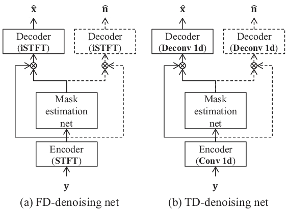

# Improving noise robust automatic speech recognition with single-channel time-domain enhancement network

Keisuke Kinoshita     Tsubasa Ochiai     Marc Delcroix     Tomohiro
Nakatani

###### Abstract

With the advent of deep learning, research on noise-robust automatic
speech recognition (ASR) has progressed rapidly. However, ASR
performance in noisy conditions of single-channel systems remains
unsatisfactory. Indeed, most single-channel speech enhancement (SE)
methods (denoising) have brought only limited performance gains over
state-of-the-art ASR back-end trained on multi-condition training data.
Recently, there has been much research on neural network-based SE
methods working in the time-domain showing levels of performance never
attained before. However, it has not been established whether the high
enhancement performance achieved by such time-domain approaches could be
translated into ASR. In this paper, we show that a single-channel
time-domain denoising approach can significantly improve ASR
performance, providing more than 30 % relative word error reduction over
a strong ASR back-end on the real evaluation data of the single-channel
track of the CHiME-4 dataset. These positive results demonstrate that
single-channel noise reduction can still improve ASR performance, which
should open the door to more research in that direction.

###### Index Terms: 

Single-channel speech enhancement, time-domain network, robust ASR

^(†)^(†)address: NTT Communication Science Laboratories, NTT
Corporation, Kyoto, Japan

## 1 Introduction

Recently, the development of deep learning technologies has led to great
progress in the field of automatic speech recognition (ASR). Current
state-of-the-art ASR systems are approaching human recognition
performance levels \[1, 2\], when speech is recorded with a
close-talking microphone. However, recognition of speech recorded by
distant microphones remains challenging because of acoustic interference
such as noise, reverberation and interference speakers.

The problem of distant ASR has attracted increasing attention. When a
microphone array is available, ASR performance can be greatly improved
by employing multi-channel speech enhancement (SE) pre-processing with
an ASR back-end trained on multi-condition training (MCT) data. For
example, the combination of neural-network (NN) based time-frequency
mask estimation with beamforming has been employed by all top systems in
recent distant ASR challenges \[3, 4\]. It is worth mentioning that
multi-channel SE can improve ASR performance even without any retraining
of the ASR back-end on the enhanced speech, which may be possible
because they introduce only a few distortions to the processed signals.
However, there are many situations where only a single microphone is
available. In such cases, the ASR performance remains far behind that
obtained with a microphone array \[4\]. Therefore, there is a need for
more research on effective single-channel SE front-ends for ASR.

There has been much research on single-channel SE for noise reduction
and speech separation \[5\]. Early deep learning-based approaches used
NNs that operate in the frequency-domain to predict a time-frequency
mask that reduces noise when applied to the microphone signal\[6, 7, 8,
9, 10\]. Although these frequency-domain approaches have successfully
improved SE evaluation metrics, e.g., signal-to-distortion ratio (SDR),
this improvement did not lead to better ASR performance. For example,
NN-based masking \[11, 12\] and other conventional single-channel
enhancement techniques \[13\] did not contribute to the ASR performance
improvement, when used with a state-of-the-art ASR back-end \[12\]. This
suggests that most single-channel SE approaches tend to introduce
distortions that create a mismatch with the ASR back-end, therefore
limiting their effect on ASR.

Recently, SE operating directly in the time domain has received
increased interest. There has been much research proposing time-domain
NNs for noise reduction \[14, 15, 16\] and speech separation \[17, 18\].
These approaches have achieved a level of SE performance never attained
before \[18\]. However, time-domain approaches have not been
sufficiently investigated in the context of noise-robust ASR.

In this paper, we investigate the use of time-domain NN for noise
reduction to examine whether the great SE performance improvement can be
translated into ASR. Motivated by the success of temporal convolutional
NN-based architecture in speech separation \[18\] and various sequence
modeling tasks \[19\], we base the NN architecture for our investigation
on the recently proposed convolutional time-domain audio separation
network (Conv-TasNet) \[18\], which has achieved state-of-the-art
performance surpassing even frequency-domain ideal masking. We adapt
Conv-TasNet for the noise reduction task and call it Denoising-TasNet. A
similar network has been used in \[20\]. We investigate two variants of
Denoising-TasNet, one predicting only the enhanced speech and one with
two outputs predicting speech and noise. The latter enables defining a
multi-task loss, which can regularize the network training and is shown
to achieve better ASR performance.

We perform experiments on CHiME-4 data \[21\], which includes real noisy
recordings that are particularly relevant to our investigation. The
findings of this paper are that (1) Denoising-TasNet does not only
achieve high SE performance but also significantly reduces ASR word
error rates (WERs) on real recordings even when used with a strong ASR
back-end trained on MCT data ( more than 30% relative WER reduction);
(2) it can improve ASR performance even without retraining the ASR
back-end; (3) interestingly, by augmenting the amount of training data
for the SE front-end, we could improve the performance of Denoising
TasNet, but also of a frequency-domain BLSTM-based masking approach; (4)
Finally, we show that the performance improvement can be generalized to
a different task, i.e. AURORA-4 \[22\]. These positive results
demonstrate that single-channel noise reduction can still improve ASR
performance, which should open the door to more research in that
direction.

## 2 Denoising network

In this section, we first introduce the notations and then describe the
frequency-domain and time-domain denoising networks that we use in our
experiments. Finally, we discuss the loss functions used to train the
networks.



Figure 1: Block diagrams of denoising NNs investigated in this study.
Parts of the systems shown with dashed line are optional network
branches to perform multi-task training mentioned in 2.3.

### 2.1 Problem formulation

Let us consider a single-channel microphone signal, $`y(t)`$,

```math
y(t)=x(t)+n(t), \tag{1}
```

where $`x(t)`$ is the target speech signal, $`n(t)`$ is background
noise, and $`t`$ is a time index. In this paper, the background noise
does not include obvious interfering speakers. We define the vector
representation of the time-domain signals as
$`\mathbf{y}=[y(1),\ldots,y(T)]`$, where $`T`$ is the length of the
microphone signal. We aim at recovering the speech signal $`\mathbf{x}`$
from the microphone signal $`\mathbf{y}`$.

### 2.2 Time-domain and frequency-domain denoising networks

Figure 1 is a schematic diagram of the denoising NN framework that we
investigate in (a) the frequency-domain and (b) the time-domain. The
denoising process is performed in 3 steps, (1) encoding, (2) mask
estimation, (3) decoding.

(1) Encoding: First, in the encoding step, we obtain an encoded version
of the microphone signal, $`\mathbf{e}_{y}`$, using an encoder module
as,

```math
\mathbf{e}_{y}=\text{encoder}(\mathbf{y}), \tag{2}
```

where $`\text{encoder}(\cdot)`$ represents the encoder function. For
frequency-domain networks, the encoder function consists of the
short-time Fourier transform (STFT). For time-domain network, the
encoder function consists of a learnable 1D convolution layer, followed
by a ReLu activation function. The encoded domain learned through the NN
training may be less interpretable compared to STFT, but allows a signal
representation optimized for denoising.

(2) Mask estimation: Second, we estimate a denoising mask using a mask
estimation network. The mask estimation NN should account for the time
context of the signal to distinguish speech from noise. This can be
achieved by using BLSTM layers or dilated-convolution layers as in
TasNet. The output of the mask estimation network can be either a single
mask used to predict speech or two masks, one for speech and another for
noise prediction as,

```math
[\mathbf{m}_{x},\mathbf{m}_{n}]=\text{MEnet}(\mathbf{e}_{y}), \tag{3}
```

where $`\text{MEnet}(\cdot)`$ is a mask estimation network, and
$`\mathbf{m}_{x}`$ and $`\mathbf{m}_{n}`$ are the masks associated with
speech and noise, respectively.

When working in the frequency-domain, we usually compute the amplitude
of the STFT coefficients to work on real numbers before inputting them
to the mask estimation network. In the case of frequency-domain
denoising, the masks are conventional time-frequency soft masks that
indicate to what degree the target speech is dominant. For time-domain
networks, the masks are defined in the encoded domain of the encoder.

(3) Decoding: Finally, we obtain the enhanced speech signal
$`\hat{\mathbf{x}}`$ by applying the speech mask, $`\mathbf{m}_{x}`$ to
the encoded microphone signal, $`\mathbf{e}_{y}`$, and applying a
decoding function as,

```math
\hat{\mathbf{x}}=\text{decoder}(\mathbf{m}_{x}\odot\mathbf{e}_{y}), \tag{4}
```

where $`\text{decoder}(\cdot)`$ is the decoder function, $`\odot`$ is an
element-wise multiplication. For frequency-domain denoising, the decoder
consists of inverse STFT. For time-domain, it consists of a learnable 1D
deconvolution layer.

Note that when the mask estimation network also outputs a noise mask, it
is possible to obtain an estimate of the noise signal as,

```math
\hat{\mathbf{n}}=\text{decoder}(\mathbf{m}_{n}\odot\mathbf{e}_{y}). \tag{5}
```

In this paper, the estimated noise is used only during training to
derive a multi-task training loss as described below.

### 2.3 Training losses

Time-domain loss (TDL): For time-domain networks, we employ the classic
signal-to-noise ratio (SNR) \[23\] as time-domain loss,

```math
L(\theta)=-\text{SNR}(\mathbf{x},\hat{\mathbf{x}}), \tag{6}
```

where $`\theta`$ are the model parameters,
$`\text{SNR}=-10\log_{10}(\frac{||\mathbf{x}||^{2}}{||\mathbf{x}-\hat{\mathbf{x}}||^{2}})`$
is the SNR between the clean speech and the enhanced speech, and
$`||\cdot||^{2}`$ is the $`L^{2}`$ norm. We decided to use the classic
SNR loss \[23\] instead of the scale-invariant SNR (SiSNR) used in the
original TasNet \[17\], because training the network with SiSNR let the
network freely change the level of the enhanced signal. With the SNR
loss, the scale of the signals is preserved avoiding any scaling
requirement when passing the signal to ASR. Moreover, we confirmed in
preliminary experiments that using the SNR instead of SiSNR lead to
slightly better SE performance.

We can also train the frequency-domain denoising networks with a TDL by
computing the loss on the reconstructed time-domain signals, i.e. after
the inverse STFT decoder.

Frequency-domain loss (FDL): For frequency-domain networks, we use the
log mean square error loss (log-MSE) as frequency-domain loss,

```math
L(\theta)=-10\log_{10}(||\ |\mathbf{e}_{x}|-|\mathbf{m}_{x}\odot\mathbf{e}_{y}|\ ||^{2}), \tag{7}
```

where $`|\mathbf{e}_{x}|`$ is the amplitude spectrum of the target
speech signal. The FDL is computed before the decoder (iSTFT). Note that
the log-MSE is equivalent to the SNR loss computed on the amplitude
spectrum.

Noise reconstruction loss (NR-loss): In addition to the above losses, we
investigate using a multi-task loss by adding a second noise
reconstruction loss similar to \[24\]. For example, in the case of the
time-domain loss, the multi-task loss is defined as,

```math
L(\theta)=-(\text{SNR}(\mathbf{x},\hat{\mathbf{x}})+\text{SNR}(\mathbf{n},\hat{\mathbf{n}})). \tag{8}
```

Forcing the network to predict the noise signal may act as a regularizer
enabling to train more robust models.

Note that TasNet was originally proposed for speech separation, and thus
requires permutation invariant training (PIT) \[25\] to solve a
permutation ambiguity of the output speech sources. Here, since the NN
output is speech and noise, we can fix the output order of the network
and avoid using permutation invariant training \[25\].

## 3 Related works

There have been several works combining single-channel frequency-domain
SE for noise-robust ASR. GAN-based training for SE \[14\] has received
increased attention. GAN is employed to constrain the estimated signals
close to the clean signals, which was shown to improve objective and
subjective SE criterion, but it did not contribute to improvement in
terms of ASR \[26\].

Several recent works have also tackled the single-channel CHiME-4 task.
In \[13\], several legacy noise reduction approaches were evaluated for
online ASR. Although the SE front-ends did not improve ASR when used
individually, about 20 % relative WER reduction was possible when used
in multi-branch network architecture (from 22.6 % to 19.4 % WER on
CHiME-4 eval real without and with SE front-end, respectively). However,
this study used an online ASR system, which resulted in a much worse
baseline than ours.

Another work proposed to use a parametric Wiener Filter \[27\] with a
mask estimation network as front-end and reported performance gains with
a strong ASR back-end when the hyper-parameters of the Wiener filter
were optimized based on the acoustic-level criterion \[28\]. They
achieved about 8% relative WER reduction (from 11.6 % to 10.6 % WER on
CHiME-4 eval real without and with SE front-end, respectively).

Compared to these previous studies, we focus on comparing
frequency-domain and time-domain SE. Tighter integration of time-domain
SE front-end with the ASR back-end such as \[28, 13\] is one of our
future research directions.

## 4 Experiments

We perform extensive experiments on CHiME-4 data to evaluate the
performance difference between frequency domain and time domain
approaches, and the effect of the loss functions, i.e. TDL, FDL and
NR-loss. We evaluated the performance in terms of SDR \[29\] and WER.
All experiments were performed on speech sampled at 16kHz.

For evaluation, we use the official evaluation set of the CHiME-4
corpus, which consists of a noisy version of WSJ0 utterances recorded in
4 environments, street, cafe, bus, and pedestrian at average SNR of
about 5 dB \[30\]. The corpus consists of simulated and real noisy
recordings based on a microphone array attached to a tablet. The test
set includes 1320 simulated and 1320 real recordings.

### 4.1 SE systems: network configurations and training data

In this experiment, we compared the following 3 different network
configurations.

Denoising-TasNet: We investigated the performance of the
Denoising-TasNet that uses a similar configuration to the original
Conv-TasNet \[18\]. Our implementation is based on the open-source
implementation of Conv-TasNet \[31\]. In particular, following the
hyper-parameter notations in the original paper \[18\], we set the
hyper-parameters to N=256, L=20, B=256, H=512, P=3, X=8, R=4. We used
Adam optimizer \[32\] to train the network with a learning rate of 1e-3.

Frequency-domain BLSTM network: We compared Denoising-TasNet with a
frequency-domain BLSTM (FD-BLSTM) network, which uses a mask estimation
network consisting of 3 BLSTM layers with 896 units followed by a linear
layer with ReLU activation \[25\]. The input of the mask estimation
network consists of amplitude spectrum coefficients computed with an
STFT with a hanning window of 32 msec and a shift of 8 msec. We trained
two versions of the FD-BLSTM denoising network, one with FD loss
(FD-BLSTM-FDL) and one with TD loss (FD-BLSTM-TDL). We based our
implementation on \[31\]. We set the learning rate of Adam to 1e-3.

Frequency-domain Convolutional network: We also compared
Denoising-TasNet with another frequency-domain network that replaces the
BLSTM-based mask estimation network with a convolutional architecture
similar to that of the Denoising-TasNet. We employed the same training
strategy as for Denoising-TasNet. We trained an FD-Conv denoising
network with FD loss (FD-Conv-FDL).

Our preliminary experiments confirmed that using the official training
set of the CHiME-4 corpus to train the SE systems always leads to poorer
results. This is probably because it does not contain
reverberation \[30\]. Thus, for the training of the SE systems, we
created an alternative noisy and reverberant training set based on the
image method \[33\]. For each utterance, we randomly generated a
simulated room impulse responses (RIRs) and selected a noise signal from
the CHiME-4’s official noise recordings. Here, we set the T60s between
0.2 and 0.7 s, and the speaker-microphone distance between 10 and 60 cm
randomly. Based on the RIRs and noises, we created the same number of
utterances as the official training set, i.e., the 35690 simulated
training utterances (referred to as ‘‘35k set’’ hereafter), at SNR
randomly selected between 0 and 5 dB¹¹ 1 Our setting was found to
slightly diverge from the CHiME-4 challenge regulation because the
challenge did not allow random selection of noise samples and SNRs for
training data generation..

### 4.2 ASR back-end configurations and training data

We used Kaldi to build a hybrid DNN-HMM ASR back-end. It consists of a
time-delayed NN-based AM trained with the lattice-free MMI (LF-MMI)
objective function. We use a forward-backward LSTM-LM for language model
rescoring. This back-end follows the standard Kaldi recipe.

We trained two types of acoustic models (AMs) that differ in training
data; One AM, referred to as Org-AM, is trained on data including the
aforementioned 35k set and the official training data of CHiME-4
comprising 52428 utterances. Another AM, referred to as Enh-AM, was
trained on data including the aforementioned 35k set, its enhanced
version and the official training data of CHiME4. Enh-AMs are created to
simulate the effect of retraining on enhanced signals.

### 4.3 Results

#### 4.3.1 Effect of NR-loss

|                  | NR-loss | WER   |       | SDR   |
| ---------------- | ------- | ----- | ----- | ----- |
| System           |         | Simu  | Real  | Simu  |
| FD-BLSTM-FDL     | —       | 15.13 | 13.91 | 11.84 |
|                  | ✓       | 13.89 | 12.89 | 11.96 |
| Denoising-TasNet | —       | 12.31 | 10.64 | 14.13 |
|                  | ✓       | 11.87 | 9.75  | 14.21 |

Table 1: Effect of NR-loss on two representative SE front-ends.

We first examine the effect of NR-loss described in 2.3 to determine if
it is beneficial for ASR. Table 1 shows the WERs with and without
NR-loss. Interestingly, we observed that although using NR-loss did not
improve SDR significantly, it consistently led to improved ASR
performance. Here we show the results of only two representative
methods, but we observed the same tendency for all the SE front-end
variants we tested. Therefore, we use NR-loss in all following
experiments.

#### 4.3.2 Effect of different SE systems

Table 2 shows the results for the four SE front-end systems
investigated, with Org-AM and Enh-AM. “No process” in the table refers
to the results obtained with unprocessed noisy observation.

The table shows that FD-BLSTM-FDL improves SDR but not WER compared to
the baseline system (“No process”). This result is consistent with the
finding of the conventional studies \[11, 12\]. However, in case the
acoustic model knows the artifacts that the SE front-end may induce,
i.e., the Enh-AM case, we could achieve a moderate relative WER
reduction of up to 10 %.

FD-BLSTM-TDL and FD-Conv-FDL succeeded to further improve the SDR by
utilizing TDL and convolution-based architecture, respectively. However,
the ASR performance dropped significantly. We hypothesize that although
more noise could be removed, these systems introduced more distortions
that reduced ASR performance even for the Enh-AM case.

On the other hand, Denoising-TasNet achieved not only the highest SDR
but also improved ASR performance significantly. Interestingly,
Denoising-TasNet improved ASR even without retraining the back-end,
i.e., the Org-AM case. With the Enh-AM, we achieved more than 30%
relative error rate reduction on the real recordings, which is a
significantly higher improvement than conventional FD-BLSTM-based
approaches.

|                  |        |       |       |       |
| ---------------- | ------ | ----- | ----- | ----- |
|                  | AM     | WER   |       | SDR   |
| System           |        | Simu  | Real  | Simu  |
| No process       | Org-AM | 12.53 | 12.23 | 5.09  |
| FD-BLSTM-FDL     | Org-AM | 13.89 | 12.89 | 11.96 |
|                  | Enh-AM | 11.66 | 11.11 | —"—   |
| FD-BLSTM-TDL     | Org-AM | 18.46 | 18.34 | 13.52 |
|                  | Enh-AM | 13.39 | 13.28 | —"—   |
| FD-Conv-FDL      | Org-AM | 22.96 | 24.32 | 12.74 |
|                  | Enh-AM | 15.91 | 16.48 | —"—   |
| Denoising-TasNet | Org-AM | 11.87 | 9.75  | 14.21 |
|                  | Enh-AM | 9.88  | 8.19  | —"—   |

Table 2: SDR \[dB\] and WER \[%\] for CHiME-4 corpus

|                  | AM     | WER   |       | SDR   |
| ---------------- | ------ | ----- | ----- | ----- |
| System           |        | Simu  | Real  | Simu  |
| FD-BLSTM-FDL     | Org-AM | 12.25 | 10.50 | 11.87 |
|                  | Enh-AM | 10.40 | 8.88  | —"—   |
| Denoising-TasNet | Org-AM | 10.82 | 8.33  | 14.24 |
|                  | Enh-AM | 9.67  | 7.68  | —"—   |

Table 3: Effect of data augmentation for CHiME-4 corpus.

#### 4.3.3 Effect of data augmentation on SE systems

We augmented the variation of the noisy and reverberant training data to
create up to 100000 utterances (100k set) and trained the SE systems on
this 100k set to see the effect of data augmentation.

Table 3 shows the WERs and SDRs of the CHiME-4 test set obtained with
two representative SE systems trained on the 100k set. For this
experiment, we used the same ASR backend configurations as in Table 2.
Augmenting training data from 35k to 100k for the SE systems appears to
significantly improve the ASR performance, while it has only a little
impact on SDRs. Interestingly, although these results still support the
superiority of Denoising-TasNet over FD-BLSTM, they also show the great
potential of single-channel SE systems themselves, since even FD-BLSTM
could greatly improve ASR performance when trained on the augmented
dataset. Note that we found that adding the same 100k set to the
training data for AMs did not yield any improvement in the baseline ASR
performance.

#### 4.3.4 Generalization to a different task

We examine the generalization capability of the SE systems to different
noise conditions and different ASR back-ends. For this experiment, we
used the Aurora-4 dataset, which also consists of a noisy version of WSJ
with different types and levels of noise than CHiME-4. The noise types
include street traffic, train terminals, and stations, cars, babble,
restaurants, and airports. SNRs for the test data ranges from 5 to 15
dB. As we focus on denoising, we only report the results of the test
sets A (clean speech) and B (noisy speech). For these experiments, we
use a CTC-attention hybrid end-to-end ASR back-end from the open-source
toolkit \[34, 35\] to build the ASR back-end. The details of the
configuration can be found in \[36\].

Table 4 shows the results of FD-BLSTM and Denoising-TasNet on the
Aurora-4 dataset. We used the SE systems trained with the 100k set. We
confirmed that both SE systems could successfully generalize to this
task, and the superiority of denoising TasNet is still maintained. Note
that the degradation in set-A by denoising TasNet is not significant.

| System           | set-A (clean) | set-B (noisy) |
| ---------------- | ------------- | ------------- |
| No process       | 4.3           | 8.5           |
| FD-BLSTM-FDL     | 4.2           | 7.7           |
| Denoising-TasNet | 4.4           | 6.3           |

Table 4: WER \[%\] for Aurora-4 corpus.

## 5 Conclusion

We have experimented different configurations of frequency-domain and
time-domain denoising NNs. We observed that Denoising-TasNet
significantly improved ASR performance by more than 30% on real
recordings with a strong ASR back-end. Interestingly, we also found that
not only Denoising TasNet but also FD-BLSTM could significantly improve
the ASR performance, when these SE systems were trained with a large
training dataset, i.e., 100k set. Such a large improvement demonstrates
that single-channel denoising still has the potential for improving the
noise robustness of ASR systems.

## References

- \[1\] W. Xiong, L. Wu, F. Alleva, J. Droppo, X. Huang, and A.
  Stolcke, “The microsoft 2017 conversational speech recognition
  system,” in Proc. of IACSSP’18, 2018, pp. 5934–5938.
- \[2\] G. Saon, G. Kurata, T. Sercu, K. Audhkhasi, S. Thomas, D.
  Dimitriadis, X. Cui, B. Ramabhadran, M. Picheny, L.-L. Lim, B. Roomi,
  and P. Hall, “English conversational telephone speech recognition by
  humans and machines,” in Proc. of Interspeech’17, 2017, pp. 132–136.
- \[3\] J. Heymann, L. Drude, C. Boeddeker, P. Hanebrink, and R.
  Haeb-Umbach, “Beamnet: End-to-end training of a beamformer-supported
  multi-channel asr system,” in Proc. of ICASSP’17, 2017, pp. 5325–5329.
- \[4\]
  “http://spandh.dcs.shef.ac.uk/chime_challenge/chime2016/results.html,”
  Cited October 21 2019.
- \[5\] M. Kolbaek, “Single-microphone speech enhancement and
  separation using deep learning,” Ph.D. dissertation, Aalborg
  Universitetsforlag, 2018.
- \[6\] S.-W. Fu, Y. Tsao, X. Lu, and H. Kawai, “Raw waveform-based
  speech enhancement by fully convolutional networks,” in Proc. of
  APSIPA’17, 2017, pp. 006–012.
- \[7\] J. Chen and D. Wang, “Long short-term memory for speaker
  generalization in supervised speech separation,” The Journal of the
  Acoustical Society of America, vol. 141, no. 6, pp. 4705–4714, 2017.
- \[8\] Y. Wang, A. Narayanan, and D. Wang, “On training targets for
  supervised speech separation,” IEEE/ACM transactions on audio, speech,
  and language processing, vol. 22, no. 12, pp. 1849–1858, 2014.
- \[9\] H. Erdogan, J. R. Hershey, S. Watanabe, and J. L. Roux,
  “Phase-sensitive and recognition-boosted speech separation using deep
  recurrent neural networks,” in Proc. of ICASSP’15, 2015, pp. 708–712.
- \[10\] D. S. Williamson, Y. Wang, and D. Wang, “Complex ratio masking
  for monaural speech separation,” IEEE/ACM Transactions on Audio,
  Speech and Language Processing (TASLP), vol. 24, no. 3, pp.
  483–492, 2016.
- \[11\] T. Yoshioka, N. Ito, M. Delcroix, A. Ogawa, K. Kinoshita, M.
  Fujimoto, C. Yu, W. J. Fabian, M. Espi, T. Higuchi, et al., “The NTT
  chime-3 system: Advances in speech enhancement and recognition for
  mobile multi-microphone devices,” in 2015 IEEE Workshop on Automatic
  Speech Recognition and Understanding (ASRU). IEEE, 2015, pp. 436–443.
- \[12\] S.-J. Chen, A. S. Subramanian, H. Xu, and S. Watanabe,
  “Building state-of-the-art distant speech recognition using the
  chime-4 challenge with a setup of speech enhancement baseline,” in
  Proc. of Interspeech’18, 2018, pp. 1571–1575.
- \[13\] M. Fujimoto and H. Kawai, “One-pass single-channel noisy
  speech recognition using a combination of noisy and enhanced
  features,” in Proc. of Interspeech’19, 2019, pp. 486–490.
- \[14\] S. Pascual, A. Bonafonte, and J. Serrà, “SEGAN: Speech
  enhancement generative adversarial network,” in Proc. of
  Interspeech’17, 2017, pp. 3642–3646.
- \[15\] D. Rethage, J. Pons, and X. Serra, “A Wavenet for speech
  denoising,” in Proc. of ICASSP’18, 2018, pp. 5069–5073.
- \[16\] S.-W. Fu, T.-W. Wang, Y. Tsao, X. Lu, and H. Kawai, “End-to-end
  waveform utterance enhancement for direct evaluation metrics
  optimization by fully convolutional neural networks,” IEEE/ACM Trans.
  ASLP, vol. 26, no. 9, pp. 1570–1584, 2018.
- \[17\] Y. Luo and N. Mesgarani, “TasNet: Surpassing ideal
  time-frequency masking for speech separation,” in Proc. of
  ICASSP’18, 2018.
- \[18\] Y. Luo and N. Mesgarani, “Conv-TasNet: Surpassing ideal
  time–frequency magnitude masking for speech separation,” IEEE/ACM
  Trans. ASLP, vol. 27, no. 8, pp. 1256–1266, 2019.
- \[19\] S. Bai, J. Z. Kolter, and V. Koltun, “An empirical evaluation
  of generic convolutional and recurrent networks for sequence
  modeling,” arXiv preprint arXiv:1803.01271, 2018.
- \[20\] J.-H. Kim, J. Yoo, S. Chun, A. Kim, and J.-W. Ha, “Multi-domain
  processing via hybrid denoising networks for speech
  enhancement,” 2018.
- \[21\] E. Vincent, S. Watanabe, A. Nugraha, J. Barker, and R. Marxer,
  “An analysis of environment, microphone and data simulation mismatches
  in robust speech recognition,” Computer Speech and Language, 4 2016.
- \[22\] P. N. and P. J., “DSR front-end large vocabulary continuous
  speech recognition evaluation,” Tech. Rep., Technische Universiteit
  Eindhoven, 2002.
- \[23\] J. Le Roux, S. Wisdom, H. Erdogan, and J. R. Hershey,
  “SDR-half-baked or well done?,” in Proc. of ICASSP’19, 2019, pp.
  626–630.
- \[24\] H. Erdogan and T. Yoshioka, “Investigations on data
  augmentation and loss functions for deep learning based
  speech-background separation,” in Proc. of Interspeech’18, 2018, pp.
  3499–3503.
- \[25\] M. Kolbæk, D. Yu, Z.-H. Tan, and J. Jensen, “Multitalker
  speech separation with utterance-level permutation invariant training
  of deep recurrent neural networks,” IEEE/ACM Trans. ASLP, vol. 25, no.
  10, pp. 1901–1913, 2017.
- \[26\] C. Donahue, B. Li, and R. Prabhavalkar, “Exploring speech
  enhancement with generative adversarial networks for robust speech
  recognition,” in Proc. of ICASSP’18, 2018, pp. 5024–5028.
- \[27\] J. S. Lim and A. V. Oppenheim, “Enhancement and bandwidth
  compression of noisy speech,” Proceedings of the IEEE, vol. 67, no.
  12, pp. 1586–1604, 1979.
- \[28\] T. Menne, R. Schlüter, and H. Ney, “Investigation into joint
  optimization of single channel speech enhancement and acoustic
  modeling for robust asr,” in Proc. of ICASSP’19, 2019, pp. 6660–6664.
- \[29\] E. Vincent, R. Gribonval, and C. Févotte, “Performance
  measurement in blind audio source separation,” IEEE trans. ASLP, vol.
  14, no. 4, pp. 1462–1469, 2006.
- \[30\] J. Barker, R. Marxer, E. Vincent, and S. Watanabe, “The third
  CHiME speech separation and recognition challenge: Dataset, task and
  baselines,” in Proc. of ASRU’15, 2015, pp. 504–511.
- \[31\] “https://github.com/funcwj/conv-tasnet,” Cited October 21 2019.
- \[32\] D. P. Kingma and J. Ba, “Adam: A method for stochastic
  optimization,” arxiv, vol. abs/1412.6980, 2014.
- \[33\] J. B. Allen and D. A. Berkley, “Image method for efficiently
  simulating small-room acoustics,” The Journal of the Acoustical
  Society of America, vol. 65, no. 4, pp. 943–950, 1979.
- \[34\] S. Watanabe, T. Hori, S. Karita, T. Hayashi, J. Nishitoba, Y.
  Unno, N. Enrique Yalta Soplin, J. Heymann, M. Wiesner, N. Chen, A.
  Renduchintala, and T. Ochiai, “ESPnet: End-to-End Speech Processing
  Toolkit,” in Proc. Interspeech’18, 2018, pp. 2207–2211.
- \[35\] “https://github.com/espnet/espnet,” Cited October 21 2019.
- \[36\]
  “https://github.com/espnet/espnet/tree/master/egs/aurora4/asr1,” Cited
  October 21 2019.
