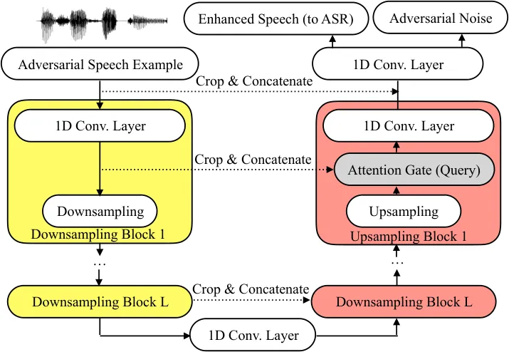
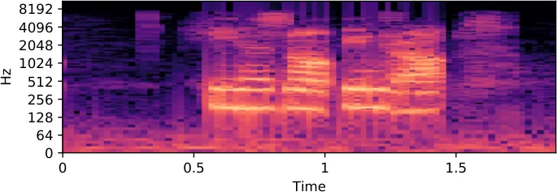
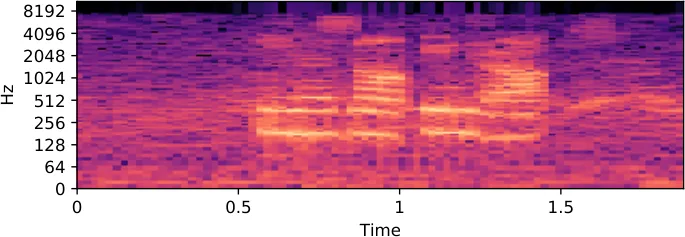
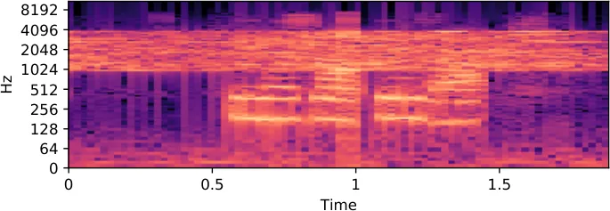
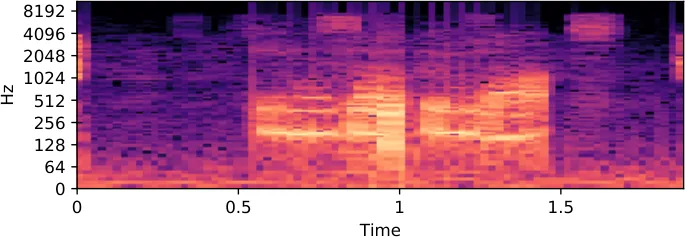
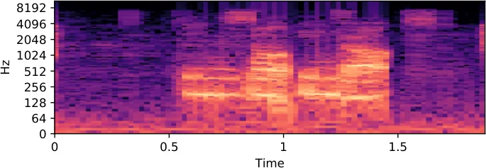
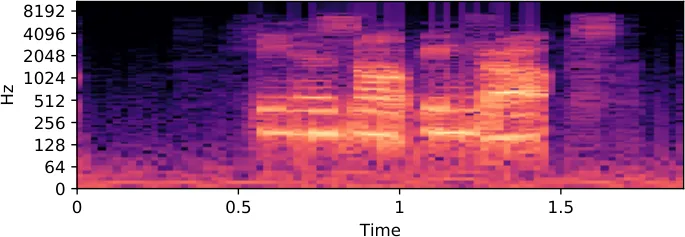

# Characterizing Speech Adversarial Examples Using Self-Attention U-Net Enhancement

Chao-Han Huck Yang    Jun Qi    Pin-Yu Chen    Xiaoli Ma    Chin-Hui Lee

###### Abstract

Recent studies have highlighted adversarial examples as ubiquitous
threats to the deep neural network (DNN) based speech recognition
systems. In this work, we present a U-Net based attention model,
U-Net*(At), to enhance adversarial speech signals. Specifically, we
evaluate the model performance by interpretable speech recognition
metrics and discuss the model performance by the augmented adversarial
training. Our experiments show that our proposed U-Net*(At) improves the
perceptual evaluation of speech quality (PESQ) from 1.13 to 2.78, speech
transmission index (STI) from 0.65 to 0.75, short-term objective
intelligibility (STOI) from 0.83 to 0.96 on the task of speech
enhancement with adversarial speech examples. We conduct experiments on
the automatic speech recognition (ASR) task with adversarial audio
attacks. We find that (i) temporal features learned by the attention
network are capable of enhancing the robustness of DNN based ASR models;
(ii) the generalization power of DNN based ASR model could be enhanced
by applying adversarial training with an additive adversarial data
augmentation. The ASR metric on word-error-rates (WERs) shows that there
is an absolute 2.22 $`\%`$ decrease under gradient-based perturbation,
and an absolute 2.03 $`\%`$ decrease, under evolutionary-optimized
perturbation, which suggests that our enhancement models with
adversarial training can further secure a resilient ASR system.

###### Index Terms:

Adversarial Examples, Adversarial Robustness, Robust Speech Recognition,
Speech Recognition Safety

^(†)^(†)address: ¹Electrical and Computer Engineering, Georgia Institute
of Technology, Atlanta, GA, USA  
²IBM Research, Yorktown Heights, NY, USA

## 1 Introduction

Deep neural networks (DNNs) on many audio and multimedia recognition
tasks have attained many state-of-the-art benchmark results \[1, 2\].
However, DNNs have been shown to be vulnerable to small additive noises
upon inputs with adversarial examples \[3\]. In particular, audio
adversarial examples \[4\] were proposed based on the gradient \[4\] or
gradient-free \[5\] optimization on a targeted loss function, which
induces DNN models to make incorrect classification (e.g., a malicious
text output, as ”open-the-door”) or degraded performance.

As a new challenge on ASR \[4, 6\], adversarial examples for ASR are
generated with a small maximum-distortion constrained in magnitude
(e.g., SNR) that they could be hard to be detected or noticed upon
evaluation metrics and listening. Unfortunately, effective model defense
and denoising approaches against audio adversarial examples are still
under exploration. Yang et al. \[7\] proposed a detection method by
using temporal dependency (TD) with a high detection rate (93.6%) on
audio adversarial examples. However, an ASR system with a TD-framework
is not capable of correcting adversarial inputs and thus has to abandon
many real-time audio examples under a continuous adversarial noise
generator.

Our study is built on DNN-based speech enhancement, which can transform
adversarial speech examples into enhanced speech. As shown in Fig. 1,
the self-attention enhancement methods are adopted to improve the ASR
performance under adversarial perturbation. We summarize the related
generative and defense works on audio adversarial examples and speech
enhancement as follows:

Audio Adversarial Examples. To craft adversarial examples against
DNN-based ASR systems, security challenges, including speech-to-text and
speech classification, have been recently studied by adversary loss
optimization. Cisse _et al._ \[8\] introduced a probabilistic loss
function to degrade ASR performance. Carlini and Wagner \[4\] applied a
two-step adversarial optimization with an $`l_{\infty}`$ norm
constrains, which attained a 100% attacking success rate on ASR. Iter
_et al._ \[9\] leveraged specific extracted audio features like Mel
Frequency Cepstral Coefficients (MFCCs) to improve the attacking
effectiveness of adversarial examples. Alzantotet _et al._ \[10\] and
Khare et al. \[5\] proposed evolutionary algorithms in a black-box
adversarial security setting without accessing the model information of
DNN based ASR. However, the previous works did not consider the
over-the-air effects in ASR settings as a threat model in the physical
world. Qin _et al._ \[11\] proposed an unbounded max-norm optimization
to improve the imperceptibility of audio adversarial examples but did
not play over-the-air (the experiment works on a room-simulator).



Figure 1: The proposed a self-attention U-Net (U-Net\_(At)) structure for
improving the adversarial robustness by processing before ASR.

In recent work, H.Yakura and J. Sakuma \[6\] put forth a method to
generate a robust adversarial example that could attack DeepSpeech
\[12\] under the over-the-air condition (e.g., the given adversarial
example played by speaker and radio.) In our work, we employ both the
gradient and gradient-free adversarial algorithms in our enhancement
methods, and try to minimize physical threats of robust adversarial
examples in the over the air setting \[6\].

Speech Enhancement and Denoising Methods. A speech enhancement system
aims to improve the speech quality and intelligibility \[2, 13, 14\].
Several DNN-based vector-to-vector regression architectures \[15, 1\]
for single-channel speech enhancement have attained many
state-of-the-art results under non-stationary noises. However, audio
adversarial examples, which are taken as new threats to environments,
are not sufficiently discussed whether the deep learning based speech
enhancement models can overcome them. Thus, the recent work have started
to attempt data augmentation approaches based on adversarial examples to
improve the model robustness against adversarial perturbations \[16,
17\]. One major weakness of the adversarial training is that they are
highly model-dependent, which means that they may become unstable when
there is a strong adversarial perturbation (e.g., an increased magnitude
in the gradient-based attacks). In this work, we combine
enhancement-based method with temporal features \[7\].

To further understand the effects of adversarial examples, we introduce
a novel self-attention DNN model, which is sensitive to
temporal-sequence segments, and design experiments based on an ASR
system to conduct speech enhancement particularly against adversarial
perturbations.

Our contributions include:

- •
  We introduce speech enhancement-based methods to characterize the
  properties of audio adversarial examples and improve the robustness of
  the ASR systems. Specifically, a self-attention U-Net model,
  U-Net\_(At), is introduced to extract the temporal information from the
  speech with adversarial perturbations, and then to reconstruct speech
  examples.
- •
  We investigate interpretable effects of adversarial examples for
  speech processing in terms of major speech quality measurement index,
  including perceptual evaluation of speech quality (PESQ), short-term
  objective intelligibility (STOI), and speech transmission index (STI).
- •
  We further study the generalization capability of DNN models for
  exploring the difference of performance among ASR systems via applying
  both gradient and gradient-free generative models training by
  adversarial speech data augmentation.

## 2 Audio Adversarial Examples

This section briefly introduces how to use adversarial examples to
attack ASR models, which include gradient based \[4\], evolutionary
\[5\], and over-the-air adversarial optimization methods \[6\].

### 2.1 Generating Gradient based Audio Adversarial Examples

An adversarial example is defined as follows: given a well-trained
prediction model $`f:\mathbb{R}^{n}\rightarrow\{1,2,\cdots,k\}`$ and an
input sample $`\boldsymbol{x}\in\mathbb{R}^{n}`$, an attacker expects to
modify x such that the model can recognize the sample as having a
specified output $`y\in\{1,2,\cdots,k\}`$ and the modification does not
change the sample significantly. The work \[3\] proposed
$`\boldsymbol{v}=\tilde{\boldsymbol{x}}-\boldsymbol{x}\leq\delta`$ be
the perturbation, where $`\delta`$ is a parameter with an upper-bounded
magnitude of distortion. The distortion is imposed to the input x that
humans cannot notice the difference between a legitimate input x and the
distorted example $`\tilde{\textbf{x}}`$. Besides, adversarial examples
can be generated by optimizing an objective function as shown in Eq.
(1), where $`Loss(\textbf{x}+\textbf{v},y)`$ refers to a loss function
by calculating an attacked prediction and the ground truth, and
$`\epsilon`$ is the noise-level:

```math
\underset{\boldsymbol{v}}{\operatorname{argmin}}\operatorname{Loss}(\boldsymbol{x}+\boldsymbol{v},y)+\epsilon\|\boldsymbol{v}\| \tag{1}
```

Baseline Audio Adversarial Example. Particularly, for audio and speech
adversarial examples, Mel-Frequency Cepstrum Ceofficient (MFCC) \[4, 6,
11\] is used for temporal feature extraction, MFCC can be generated in a
gradient-based optimization from an entire waveform using Adam \[18\].
In detail, the perturbation $`v`$ for MFCC can be obtained against the
input sample $`x`$ and the target output of phrase $`y`$ using the loss
function of a ASR system (e.g., DeepSpeech \[12\]) as follows:

```math
\underset{\boldsymbol{v}}{\operatorname{argmin}}\operatorname{Loss}(MFCC(\boldsymbol{x}+\boldsymbol{v}),\boldsymbol{y})+\epsilon\|\boldsymbol{v}\| \tag{2}
```

$`MFCC(\textbf{x}+\textbf{v})`$ represents the MFCC extraction from
speech signals of $`\textbf{x}+\textbf{v}`$. In the previous work \[4\],
this attacking model attains a 100% success rate on maliciously
manipulate the output of speech processing in the non-over-the air
condition.

Audio Adversarial Examples by Evolutionary Optimization. Khare _et al._
\[5\] proposed a multi-objective evolutionary optimization method to
craft adversarial examples on ASR systems instead of gradient-based
approaches \[4, 6\]. The proposed evolutionary-based method \[5\] focus
on maximizing a fitness function, which decomposes the adversarial audio
quality metric into two objectives: (a) an Euclidean similarity distance
of MFCC features; (b) an edit similarity distance of generated texts. In
our experiment, we use the evolutionary optimization combined with the
over-the-air loss function in \[6\] as a gradient-free comparison
(Evo\_(adv).)

Over-the-Air Adversarial Example. H.Yakura & J. Sakuma \[6\] proposed a
method to generate an over-the-air adversarial example in the
real-world. The main modification is to incorporate transformations
caused by playback and recording into the generation process, and adapt
to three constrains: a band-pass filter, impulse response, and white
Gaussian noise to minimize loss function:

```math
\begin{array}[]{l}{\underset{\boldsymbol{v}}{\operatorname{argmin}}\mathbb{E}_{h\sim\mathcal{H},\boldsymbol{w}\sim\mathcal{N}\left(0,\sigma^{2}\right)}[\operatorname{Loss}(MFCC(\tilde{\boldsymbol{x}}),\boldsymbol{y})+\epsilon\|\boldsymbol{v}\|]}\\
{\text{where }\overline{\boldsymbol{x}}=\operatorname{Conv}(\boldsymbol{x}+\underset{1000\sim 4000\mathrm{Hz}}{\operatorname{BPF}}(\boldsymbol{v}))+\boldsymbol{w}}\end{array} \tag{3}
```

where the set of collected impulse responses is $`H`$ and the
convolution using impulse response $`h`$ is $`Conv`$, white Gaussian
noise is given by $`N(0,\sigma^{2})`$, and an empirical band-pass filter
from 1,000 to 4,000Hz exhibited less distortion.

In this work, we testify the adversarial generating models like the
gradient based \[6\] (Grad*(adv)) and evolutionary generated \[5\]
(Evo*(adv)) examples in the over-the-air filtering setting \[6\]. In a
more serious adversarial setting, we study the adversarial robustness
under adaptive attacks where an ASR model is highly relied on a speech
enhancement model, which follows the two-step attack setting in Qin et
al. \[11\].

## 3 Model Defense by U-Net Based Speech Enhancement

U-Net \[19\] refers to deep feature contracting networks by successive
layers, where pooling blocks are replaced by up-sampling blocks and
large number of feature channels. U-Net was first introduced on image
segmentation and attained several state-of-the-art results \[19\].
Recently, Wave-U-Net was proposed by \[20\] to improve audio source
separation and speech enhancement \[21\]. However, the previous
U-Net-based methods did not consider the sequence-to-sequence mechanism
such as temporal dependency. Especially, with the recent evidence \[7\]
on the adversarial defense, most audio adversarial examples are with the
specific temporal dependency, which indicate that the deep
regression-based method \[7\] would remain challenges in correcting or
enhancement the adversarial speech examples. Our proposed self-attention
speech U-Net (U-Net\_(At)) is a one-dimensional U-Net with down-sampling
blocks and a sequential attention gate embedded up-sampling blocks to
improve the adversarial robustness as the framwork in Fig. 1.

### 3.1 Self-Attention U-Net for Adversarial Speech Enhancement

As to a deployment of the U-Net \[20\] architecture for speech
enhancement, we aim to separate a mixture waveform
$`m\in[-1,1]^{L\times C}`$, as shown in Figure 1, into source waveform
$`S_{1}`$ and the adversarial waveform $`S_{adv}`$
$`\in[-1,1]^{L\times C}`$ for all $`k\in{1,2}`$, where C refers to the
number of audio channels and $`L`$ denotes the number of audio samples.
For two sources to be reconstructed, a 1D convolution, zero padded
before convolving, of filter size 1 with $`2\times 1`$ filters is
utilized to convert the stack loss of features of (i) the clean speech
example and reconstructed waveform; (ii). We use a block number
$`L=17,C=1`$ for our experiments as the validated results in \[21\].  
Attention Gate. The attention gate in the upsampling block(s) extracts a
high-level feature representation $`h`$ from the input speech feature
$`x`$, where the $`h_{t}^{Q}`$ and $`H_{t}^{K}`$ are the query and key,
respectively:

```math
\mathbf{h}_{t}^{Q},\mathbf{H}^{K}=\text{ Encoder }(\mathbf{x_{t}});\quad\mathbf{c}_{t}=\operatorname{Attention}\left(\mathbf{h}_{t}^{Q},\mathbf{H}^{K},\mathbf{x_{c}}\right), \tag{4}
```

where the attention mechanism takes the query $`h_{t}^{Q}`$ and key
$`H_{t}^{k}=[h_{0},...,h_{t}]`$ as input and devise a fixed-length
context vector, $`c_{t}`$. The enhanced speech is $`\mathbf{y}_{t}`$,
which takes the context vector $`c_{t}`$, the upcoming channel input
$`x_{t}`$, and the symmetry downsamping channel block cropping
concatenation input $`x_{c}`$. We adopt the scaled dot-product softmax
function for self-attention transformation in \[22\].

### 3.2 Speech Enhancement Baseline

We use the publicly available benchmark LibriSpeech dataset \[23\].
Firstly, we down-sample the speech sampling rate to 16kHz as previous
studies \[20\]. The clean data consists of $`30`$ hours training data
and $`5`$ hours testing data, which were from 73 male and female
English-speakers with various accents. The noisy data were generated by
mixing the clean data with the noise source from the DEMAND noise
database \[24\]. To be consistent with the baseline results in \[21\],
we used 40 different noise to corrupt clean speech to generate noisy
speech with 4 SNR levels (15, 10, 5, and 0 dB). In sum, there were 8,345
training data and 1,242 test data in our dataset.

| Metric | Noisy\_(D) | DNN  | U-Net\_(W) | U-Net\_(At) |
| ------ | ---------- | ---- | ---------- | ----------- |
| PESQ   | 1.97       | 2.62 | 2.86       | 2.88        |
| STI    | 0.65       | 0.73 | 0.81       | 0.81        |
| STOI   | 0.82       | 0.90 | 0.93       | 0.92        |
| SNR    | -1.63      | 7.67 | 9.83       | 9.85        |

Table 1: We evaluate the untreated noisy signal (Noist*(D)) in \[24\],
and the enhanced signals based on DNN, wave U-Net (as U-Net*(W)), and
self -attention U-Net (as U-Net\_(At)). The experimental results show
that the U-Net based methods attain higher scores compared with
DNN-based methods on the noisy speech.

### 3.3 Performance Analysis

To validate the general enhancement performance, we evaluate the
baseline performance by major objective indexes as follows:  
SNR. We first used the signal-to-noise ratio (SNR) of the perturbation,
which could be generated by adding noisy samples \[24\] or adversarial
noise as the Sec. 2. The SNR is given by $`10log_{10}P_{x}/P_{v}`$ for
the power of the input sample,
$`P_{x}=\frac{1}{T}\sum_{t=1}^{T}x_{t}^{2}`$ , and the power of
perturbation, $`P_{v}=\frac{1}{T}\sum_{t=1}^{T}v_{t}^{2}`$ as the
previous setting \[6\].  
PSEQ. PESQ \[25\] score is computed as a sum value of the average
disturbance $`d_{sym}`$ and the average asymmetrical disturbance
$`d_{asym}`$:

```math
PESQ=a_{0}+a_{1}\cdot d_{sym}+a_{2}\cdot d_{asym} \tag{5}
```

where $`a_{0}=4.5`$, $`a_{1}=-0.1`$ and $`a_{2}=-0.0309`$ for
interpretability.  
STI. STI \[26\] is an objective method for prediction and measurement of
speech intelligibility, which has been not covered in the previous
adversarial studies \[11, 6, 5\] for analyzing speech quality.  
STOI. STOI \[27\] could be used as a robust measurement index for
nonlinear processing to noisy speech, e.g., noise reduction on speech
intelligibility, but it has been yet evaluated on the adversarial
examples.  
Enhancement Effects on Adversarial Examples After having a well-trained
DNN-based SE models, we test the enhancement effects on the generated
over-the-air audio adversarial examples \[6\] against Deep Speech
\[12\]. Although SNR scores of all models are increased after speech
enhancement, the performance in terms of PESQ, STI, and STOI are
consistently decreased, which suggests the necessity of conducting a
resilient ASR accessibility in Table. 1 and Table. 2.

| Metric | Noisy\_(adv) | DNN  | U-Net\_(W) | U-Net\_(At) |
| ------ | ------------ | ---- | ---------- | ----------- |
| PESQ   | 1.31         | 1.21 | 1.16       | 1.18        |
| STI    | 0.67         | 0.66 | 0.62       | 0.64        |
| STOI   | 0.84         | 0.81 | 0.80       | 0.81        |
| SNR    | -1.52        | 7.23 | 7.43       | 7.68        |

Table 2: We repeat the experiments of speech enhancement in Table 1
where the over-the-air adversarial speech examples (Noisy*(adv)) \[6\]
were imposed to the ASR loss function. The evaluation results show that
although all of the SNR scores increase by the speech enhancement, the
other metric indexes are even lower than the Noisy*(adv) before
conducting speech enhancement.

Robust Enhancement by Adversarial Training. Goodfellow et al. \[3\]
showed that by training on a mixture of adversarial and clean examples,
a neural network could be regularized and robust enough against to
adversarial examples. We adopt the adversarial training with an
objective function based on the fast gradient sign method as an
effective regularizer for a loss function $`\tilde{J}`$:

```math
\tilde{J}(\boldsymbol{\theta},\boldsymbol{x},y)=\alpha J(\boldsymbol{\theta},\boldsymbol{x},y)+(1-\alpha)J\left(\boldsymbol{\theta},\boldsymbol{x}+\epsilon\operatorname{sign}\left(\nabla_{\boldsymbol{x}}J(\boldsymbol{\theta},\boldsymbol{x},y)\right),\right. \tag{6}
```

where $`x`$ and $`y`$ separately denote the noisy input and the clean
output, and model parameters are represented as $`\theta`$. In all of
our experiments, we used an empirically fin-tinning setting as
$`\alpha=0.34`$ to conduct the enhancement results training on the
generated adversarial examples. As Table. 4, all the models shows an
improved performance with adversarial training.

| Metric | Noisy\_(adv) | DNN\_(T) | U-Net\_(T,W) | U-Net\_(T,At) |
| ------ | ------------ | -------- | ------------ | ------------- |
| PESQ   | 1.31         | 2.55     | 2.72         | 2.78          |
| STI    | 0.67         | 0.69     | 0.72         | 0.75          |
| STOI   | 0.84         | 0.86     | 0.88         | 0.90          |
| SNR    | -1.52        | 7.45     | 7.67         | 7.92          |

Table 3: To further improve the model generalization capability, we add
adversarial examples into the dataset for the adversarial training. We
observe that the model obtains a further improvement in terms of the
intellectual speech quality based on the methods of the adversarial
training on DNN (DNN*(T)), wave U-Net (U-Net*(T,W)), and self-attention
U-Net (U-Net\_(T,At)) with slightly improved SNRs.

## 4 Experiment Results

### 4.1 ASR Experiment Setting

We applied the proposed U-Net\_(At) to enhance adversarial speech
examples as the same reproducible settings and configurations in \[6\].
The first clip was the same as the publicly released samples of \[4\].
For the target phrase $`y`$, we prepared the target text: “open the
door”. Since the previous works \[4, 6\] tested the methods with
randomly chosen 1,000 phrases. We follow the over-the-air \[6\]
evaluation setting with the LibriSpeech dataset \[23\] which involves a
number of playback cycles in the physical world.

### 4.2 ASR Performance Discussion

The success rate of the attack is the ratio of the times that Mozilla
DeepSpeech \[12\] ¹¹ 1 The Mozilla DeepSpeech ASR is the current audio
adversarial robustness benchmark \[11, 4, 6\] and shows coherent
performance including Kaldi \[5, 11\] under adversarial attacks from the
previous studies. transcribed the recorded adversarial example as the
target phrases among all trials. The success rate becomes non-zero only
when Mozilla DeepSpeech transcribes adversarial examples as the target
phrases perfectly. The generated audio with high adversarial examples
remain a SNR of $`10.12`$ (dB) for all the experiments. In Table. 4, the
model trained on Noisy*(G) could not attain a high WER and RoSA under
Grad*(adv) and Evo\_(adv) without the improved performance from the
adaptive training with related adversarial examples. Fig 2. shows the
spectrogram difference in the recovered detail of speech enhancement and
adversarial training.

| Gradient-based \[6\]                  | w/o $`\mathbf{SE}`$ | $`\mathbf{SE}`$ \[15\] | $`\mathbf{SE}`$ \[21\]          | $`\mathbf{SE}_{U_{At}}`$ |
| ------------------------------------- | ------------------- | ---------------------- | ------------------------------- | ------------------------ |
| RoSA$`{}_{\textbf{DeepSpeech}}`$      | 90.23               | 84.86                  | 83.43                           | 83.11                    |
| RoSA$`{}_{\textbf{DeepSpeech+AdvT}}`$ | 27.34               | 22.21                  | 19.29                           | 18.23                    |
| WER$`{}_{\textbf{DeepSpeech}}`$       | 85.90               | 72.97                  | 67.46                           | 66.12                    |
| WER$`{}_{\textbf{DeepSpeech+AdvT}}`$  | 19.37               | 18.92                  | 17.64                           | 17.15                    |
| Evolution-based \[5\]                 | w/o $`\mathbf{SE}`$ | $`\mathbf{SE}`$ \[15\] | $`\mathbf{SE}\penalty\ `$\[21\] | $`\mathbf{SE}_{U_{At}}`$ |
| RoSA$`{}_{\textbf{DeepSpeech}}`$      | 91.21               | 85.67                  | 82.03                           | 79.35                    |
| RoSA$`{}_{\textbf{DeepSpeech+AdvT}}`$ | 20.47               | 18.45                  | 17.81                           | 16.14                    |
| WER$`{}_{\textbf{DeepSpeech}}`$       | 87.90               | 83.12                  | 79.20                           | 71.12                    |
| WER$`{}_{\textbf{DeepSpeech+AdvT}}`$  | 19.45               | 19.42                  | 18.44                           | 17.42                    |

Table 4: To improve the adversarial robustness of the ASR, we utilize
adversarial training (AdvT) on the proposed self-attention U-Net
($`U_{At}`$) speech enhancement ($`\mathbf{SE}`$). From our experimental
results, the use of augmented gradient-based adversarial examples (AEs)
can improve the performance in terms of the rate of success attack
(RoSA) and the word error rate (WER %). The evolutionary-optimized \[5\]
AEs exhibit severe error rate without AdvT, but WER under AdvT can
obtain more gains than the gradient-based adversarial settings \[6\].
The deployed adversarial text output is “open-the-door” to evaluate WER
based targeted attack scenarios.



(a) Clean



(b) Noisy



(c) Adversarial



(d) U-Net\_(At)-Enhanced



(e) AdvT-U-Net\_(W)-Enhanced



(f) AdvT-U-Net\_(At)-Enhanced

Figure 2: The log-power spectrogram of (a) clean; (b) noisy; (c)
adversarial; (d) pre-trained U-Net*(At) enhanced adversarial examples;
(e) DNN enhancement results adopted adversarial training, and (f)
proposed U-Net*(At) using adversarial training (AdvT.)

Figure 3: In a more strict adversarial security setting, we evaluate the
SNR magnitude of the Grad*(Adv) and Evo*(Adv) under U-Net\_(At) SE.

Characterising the Adaptive Adversarial Robustness. In more strict
adversarial security setting \[11\], an attacker could observe the input
$`\hat{x}`$ and output $`\hat{y}`$ of both speech enhancement and ASR
system²² 2 In our case, the system is equal to pre-processing U-Net*(At)
model and Deep Speech ASR for adaptive adversarial attack as \[11\], to
craft a two-step adversarial examples in an existence of defense model.
When this theoretical adaptive attack exist, we aim to enlarge the cost
of attack in terms of additive noise (dB) injected into the clean speech
example to access a targeted attack successful rate (TASR.) In Fig. 3,
the results show that an attacker need to give additive noise from 7.63
dB (w/o enhancement) to -2.23 dB (w/ U-Net*(At)) for the Grad*(adv) and
7.82 dB (w/o enhancement) -3.21 dB (w/ U-Net*(At)) on the Evo\_(adv) on
the Deep Speech-based ASR system to attain 100% TASR, which increase the
empirical difficulty for attackers to manipulate an attack without
notice in the real world and improve the adversarial robustness of ASR
system.

## 5 Conclusions

We demonstrate the power of adversarial speech enhancement by proposed
self-attention U-Net, U-Net\_(At), for characterizing adversarial
examples generated by two state-of-the-art audio adversarial attacks
\[6, 5\] in the over-the-air setting. The proposed enhancement method is
different from previous detection based methods. Our results highlight
the importance of ASR and speech processing safety on exploiting unique
data properties toward adversarial robustness. Our future works included
more acoustic properties analysis.

## References

- \[1\] Y. Xu, J. Du, L.-R. Dai, and C.-H. Lee, “A regression approach
  to speech enhancement based on deep neural networks,” IEEE/ACM
  Transactions on Audio, Speech and Language Processing (TASLP), vol.
  23, no. 1, pp. 7–19, 2015.
- \[2\] Yong Xu, Jun Du, Li-Rong Dai, and Chin-Hui Lee, “An experimental
  study on speech enhancement based on deep neural networks,” IEEE
  Signal processing letters, vol. 21, no. 1, pp. 65–68, 2013.
- \[3\] Ian J Goodfellow, Jonathon Shlens, and Christian Szegedy,
  “Explaining and harnessing adversarial examples,” in International
  Conference on Learning Representations (ICLR),, 2015.
- \[4\] Nicholas Carlini and David Wagner, “Audio adversarial examples:
  Targeted attacks on speech-to-text,” in 2018 IEEE Security and Privacy
  Workshops (SPW). IEEE, 2018, pp. 1–7.
- \[5\] Shreya Khare, Rahul Aralikatte, and Senthil Mani, “Adversarial
  black-box attacks on automatic speech recognition systems using
  multi-objective evolutionary optimization,” Proc. Interspeech 2019,
  pp. 3208–3212, 2019.
- \[6\] Hiromu Yakura and Jun Sakuma, “Robust audio adversarial example
  for a physical attack,” Proceedings of the 28th International Joint
  Conference on Artificial Intelligence, P 5334-5341, 2019.
- \[7\] Zhuolin Yang, Bo Li, Pin-Yu Chen, and Dawn Song, “Characterizing
  audio adversarial examples using temporal dependency,” in
  International Conference on Learning Representations (ICLR),, 2019.
- \[8\] Moustapha M Cisse, Yossi Adi, Natalia Neverova, and Joseph
  Keshet, “Houdini: Fooling deep structured visual and speech
  recognition models with adversarial examples,” in Advances in neural
  information processing systems, 2017, pp. 6977–6987.
- \[9\] Dan Iter, Jade Huang, and Mike Jermann, “Generating adversarial
  examples for speech recognition,” Stanford Technical Report, 2017.
- \[10\] Moustafa Alzantot, Bharathan Balaji, and Mani Srivastava, “Did
  you hear that? adversarial examples against automatic speech
  recognition,” arXiv preprint arXiv:1801.00554, 2018.
- \[11\] Yao Qin, Nicholas Carlini, Garrison Cottrell, Ian Goodfellow,
  and Colin Raffel, “Imperceptible, robust, and targeted adversarial
  examples for automatic speech recognition,” in International
  Conference on Machine Learning, 2019, pp. 5231–5240.
- \[12\] Awni Hannun, Carl Case, Jared Casper, Bryan Catanzaro, Greg
  Diamos, Erich Elsen, Ryan Prenger, Sanjeev Satheesh, Shubho Sengupta,
  Adam Coates, et al., “Deep speech: Scaling up end-to-end speech
  recognition,” arXiv preprint arXiv:1412.5567, 2014.
- \[13\] A Graves, AR Mohamed, and G Hinton, “Speech recognition with
  deep recurrent neural networks, 2013 ieee int,” in Conf., Acoustics,
  Speech and Signal Processing (ICASSP), 2013, pp. 6645–6649.
- \[14\] D. Wang and J. Chen, “Supervised speech separation based on
  deep learning: An overview,” IEEE/ACM Transactions on Audio, Speech,
  and Language Processing, vol. 26, no. 10, pp. 1702–1726, 2018.
- \[15\] J. Qi, J. Du, S.M. Siniscalchi, and C.-H. Lee, “A theory on
  deep neural network based vector-to-vector regression with an
  illustration of its expressive power in speech enhancement,” IEEE/ACM
  Transactions on Audio, Speech, and Language Processing (TASLP), vol.
  27, no. 12, pp. 1932–1943, 2019.
- \[16\] Daniel Michelsanti and Zheng-Hua Tan, “Conditional generative
  adversarial networks for speech enhancement and noise-robust speaker
  verification,” arXiv preprint arXiv:1709.01703, 2017.
- \[17\] Sining Sun, Ching-Feng Yeh, Mari Ostendorf, Mei-Yuh Hwang, and
  Lei Xie, “Training augmentation with adversarial examples for robust
  speech recognition,” arXiv preprint arXiv:1806.02782, 2018.
- \[18\] Diederik P Kingma and Jimmy Ba, “Adam: A method for stochastic
  optimization,” arXiv preprint arXiv:1412.6980, 2014.
- \[19\] Olaf Ronneberger, Philipp Fischer, and Thomas Brox, “U-net:
  Convolutional networks for biomedical image segmentation,” in
  International Conference on Medical image computing and
  computer-assisted intervention. Springer, 2015, pp. 234–241.
- \[20\] Andreas Jansson, Eric Humphrey, Nicola Montecchio, Rachel
  Bittner, Aparna Kumar, and Tillman Weyde, “Singing voice separation
  with deep u-net convolutional networks,” 2017.
- \[21\] Craig Macartney and Tillman Weyde, “Improved speech enhancement
  with the wave-u-net,” arXiv preprint arXiv:1811.11307, 2018.
- \[22\] Ashish Vaswani, Noam Shazeer, Niki Parmar, Jakob Uszkoreit,
  Llion Jones, Aidan N Gomez, Lukasz Kaiser, and Illia Polosukhin,
  “Attention is all you need,” in Advances in neural information
  processing systems, 2017, pp. 5998–6008.
- \[23\] Vassil Panayotov, Guoguo Chen, Daniel Povey, and Sanjeev
  Khudanpur, “Librispeech: an asr corpus based on public domain audio
  books,” in 2015 IEEE International Conference on Acoustics, Speech and
  Signal Processing (ICASSP). IEEE, 2015, pp. 5206–5210.
- \[24\] Joachim Thiemann, Nobutaka Ito, and Emmanuel Vincent, “The
  diverse environments multi-channel acoustic noise database (demand): A
  database of multichannel environmental noise recordings,” in
  Proceedings of Meetings on Acoustics ICA2013. ASA, 2013, vol.
  19, p. 035081.
- \[25\] Antony W Rix, John G Beerends, Michael P Hollier, and Andries P
  Hekstra, “Perceptual evaluation of speech quality (pesq)-a new method
  for speech quality assessment of telephone networks and codecs,” in
  2001 IEEE International Conference on Acoustics, Speech, and Signal
  Processing. Proceedings (Cat. No. 01CH37221). IEEE, 2001, vol. 2, pp.
  749–752.
- \[26\] Herman Jacobus Marie Steeneken and Tammo Houtgast, “A physical
  method for measuring speech-transmission quality,” The Journal of the
  Acoustical Society of America, vol. 67, no. 1, pp. 318–326, 1980.
- \[27\] Cees H Taal, Richard C Hendriks, Richard Heusdens, and Jesper
  Jensen, “A short-time objective intelligibility measure for
  time-frequency weighted noisy speech,” in 2010 IEEE International
  Conference on Acoustics, Speech and Signal Processing. IEEE, 2010, pp.
  4214–4217.
- \[28\] Chao-Han Huck Yang, Yi-Chieh Liu, Pin-Yu Chen, Xiaoli Ma, and
  Yi-Chang James Tsai, “When causal intervention meets adversarial
  examples and image masking for deep neural networks,” in 2019 IEEE
  International Conference on Image Processing (ICIP). IEEE, 2019, pp.
  3811–3815.
