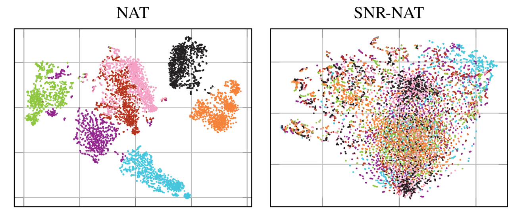
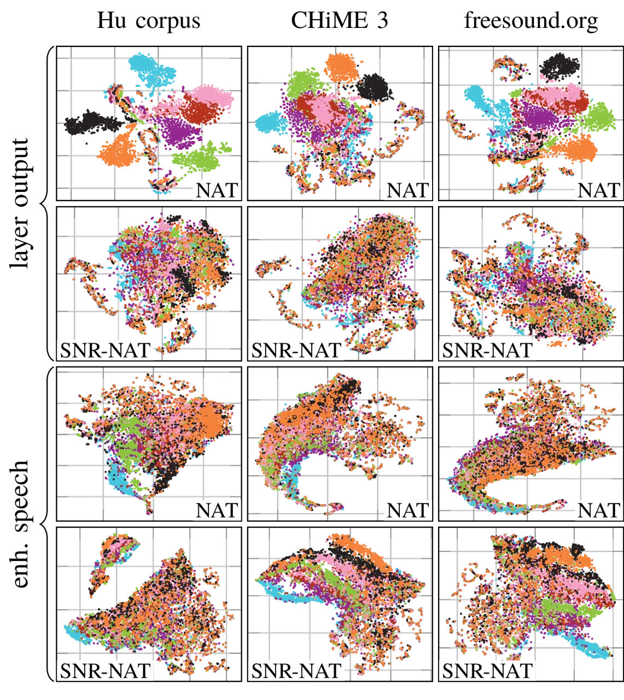
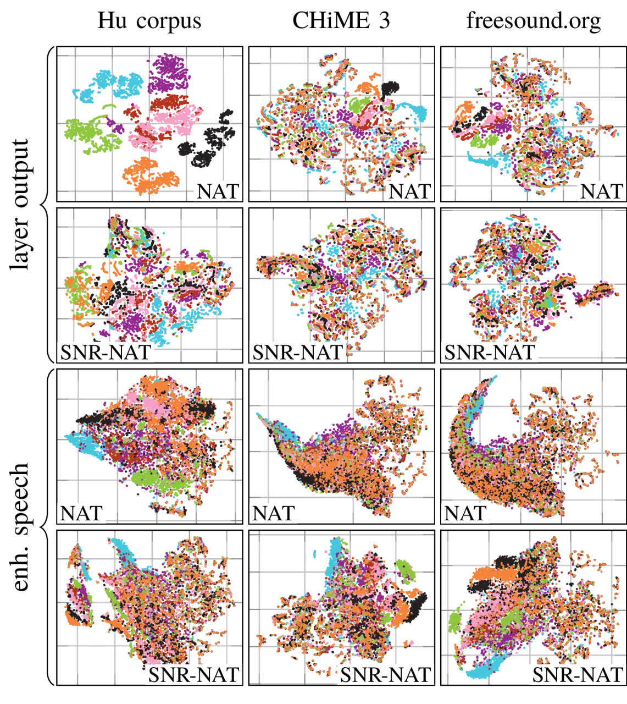
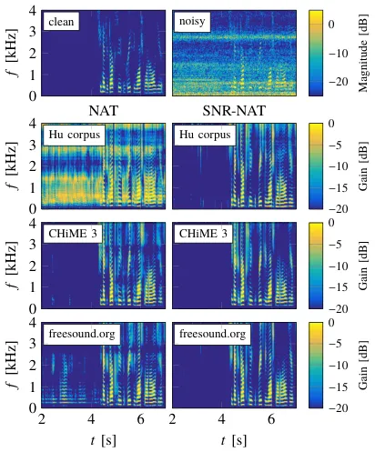
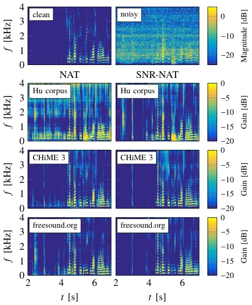

# SNR-Based Features and Diverse Training Data for Robust DNN-Based Speech Enhancement

Robert Rehr and Timo Gerkmann

###### Abstract

In this paper, we address the generalization of deep neural network
based speech enhancement to unseen noise conditions for the case that
training data is limited in size and diversity. To gain more insights,
we analyze the generalization with respect to (1) the size and diversity
of the training data, (2) different network architectures, and (3) the
chosen features. To address (1), we train networks on the Hu noise
corpus (limited size), the CHiME 3 noise corpus (limited diversity) and
also propose a large and diverse dataset collected based on freely
available sounds. To address (2), we compare a fully-connected
feed-forward and a long short-term memory architecture. To address (3),
we compare three input features, namely logarithmized noisy
periodograms, noise aware training and the proposed signal-to-noise
ratio based noise aware training. We confirm that rich training data and
improved network architectures help deep neural networks to generalize.
Furthermore, we show via experimental results and an analysis using
t-distributed stochastic neighbor embedding that the proposed
signal-to-noise ratio based noise aware training features yield robust
and level independent results in unseen noise even with simple network
architectures and when trained on only small datasets, which is the key
contribution of this paper.

###### Index Terms: 

Deep neural networks, generalization, speech enhancement, noise
reduction, input features

## I Introduction

Speech is used by humans for communication, e.g., to exchange ideas and
emotions. Speech is therefore an essential component of many
applications that have emerged from increasingly powerful personal
electronic devices such as hearing aids, mobile phones and virtual
assistants. Many devices are mobile and are therefore often used in
noisy environments. As a consequence, the microphones do not only
capture the desired speech signal but also unwanted background noises.
Background noises are known to degrade the perceived quality of speech
and are able to deteriorate the speech intelligibility. To restore the
quality and potentially also the intelligibility, speech enhancement
algorithms are leveraged. In this paper, we consider single-channel
speech enhancement algorithms that allow the enhancement of noisy
recordings obtained from a single microphone or the output of a spatial
filter.

Single-channel speech enhancement has been a topic of research for many
decades and various approaches have been introduced in the
literature \[1, 2, 3, 4, 5, 6, 7\]. Many approaches use a time-frequency
representation, e.g., the short-time Fourier transform, to enhance noisy
input signals. Often, the enhancement can be represented by a
multiplication of the noisy Fourier coefficients with a real-valued gain
function. Conventional speech enhancement algorithms are often derived
in a statistical framework. The complex Fourier coefficients are modeled
by parametric probability density functions whose parameters are given
by the speech power spectral density and the noise power spectral
density. The statistical framework then allows the derivation of
statistically optimal estimators of the clean speech coefficients.
Depending on the statistical assumptions about speech and noise,
different gain functions are obtained \[2, 8, 9, 10\]. The unknown
parameters of the speech probability density function and the noise
probability density function, i.e., the speech power spectral density
and the noise power spectral density, are estimated using algorithms
based on statistical and signal processing models \[2, 11, 12, 13, 14\].
Most of these algorithms are based on the assumption that the background
noise changes more slowly than speech. This makes conventional speech
enhancement algorithms robust to many acoustic conditions, which is why
they provide good results in moderately varying noise types, i.e.,
noises where the amplitude changes slowly in the short-time Fourier
transform bands. This applies for example for passing cars on a busy
street. However, they lack the ability to track very fast changes of the
background noise such as the cutlery in a restaurant or sudden speech
bursts in a babble scene. Consequently, transient noises are often not
suppressed by conventional approaches.

The shortcomings of conventional speech enhancement algorithms motivated
the use of machine-learning algorithms for speech enhancement. Various
machine-learning algorithms have been considered, e.g., codebooks \[15,
16, 17\], hidden Markov models and Gaussian mixture models \[3, 18, 19,
20, 21\] and non-negative matrix factorization \[4, 5, 22, 23\]. Today,
deep neural networks have become a widely used tool for speech
enhancement \[24, 6, 25, 7, 26, 27, 28, 29\]. Deep neural networks
potentially allow the approximation of any non-linear function on a
limited range of the input space \[30\]. This flexibility allows deep
neural networks to be used in various ways for speech enhancement.
In \[31, 32, 33, 34\], parts of conventional speech enhancement
algorithms, e.g., the speech power spectral density estimator or the
noise power spectral density estimator, have been replaced by deep
neural networks. Other approaches try to find a mapping from the noisy
observation or features extracted from it to a masking function \[35,
36, 37\]. Suitable target functions and their effect on the enhancement
performance have been analyzed in \[35, 37, 38\]. Instead of using a
masking function, the clean speech coefficients have also been used as
target of a deep neural network in many approaches \[6, 36, 7, 39\]. For
this, various architectures of deep neural networks have been employed,
e.g., feed-forward networks \[6, 7\], recurrent neural networks \[24\]
including long short-term memory cells \[40, 37, 41, 42\], generative
adversarial networks \[43, 44\], convolutional neural networks \[45, 27,
29\] and WaveNet based approaches \[46, 28\].

Many studies show that deep neural network based approaches yield higher
performance than conventional speech enhancement approaches. One of the
concerns is however the generalization to unknown acoustic
conditions \[47, 48, 49, 26, 50, 51\]. On the one hand, the issue of
generalization is encountered by leveraging large or diverse training
data \[7, 52, 51, 53\]. On the other hand, estimations of the background
noise have been included as inputs to a deep neural network to improve
the robustness in unseen acoustic conditions \[48, 7, 49, 50\]. Inspired
by noise aware training proposed in \[54\], a fixed noise estimate has
been used in \[7\] which is obtained from the first part of the noisy
input signal. The fixed estimate is replaced in dynamic noise aware
training \[48, 49\] by a time-varying noise estimate which is obtained
from a conventional noise power spectral density estimator. Also deep
neural network based noise estimators have been considered to improve
the robustness in unseen acoustic conditions \[48, 34\]. Further
extensions of the approach in \[48\] are presented in \[50\]. Here,
additional input features such as the ideal ratio mask \[35\], which are
estimated using a deep neural network, are used to increase the
robustness.

1. Periodogram

2. NAT

3. SNR-NAT

Fig. 1: Block diagrams of the speech enhancement algorithms considered
in this paper. Blocks with a dashed border indicate conventional
algorithms.

In this paper, we focus on the generalization of deep neural network
based speech enhancement algorithms and consider the three approaches
depicted in Fig. 1. All approaches predict a gain function, i.e.,
regression approaches as proposed in \[7\] are not considered. The input
features are different though. The approach depicted in the first row of
Fig. 1 serves as a baseline and uses only the periodogram of the noisy
input as feature. The second approach is similar to dynamic noise aware
training presented in \[48, 49\]. As shown in Fig. 1, an estimate of the
noise power spectral density is appended to the noisy periodogram
features. Similar to \[49\], we use the conventional noise power
spectral density estimator proposed in \[14\] to continuously update the
noise power spectral density estimate. Last, we propose signal-to-noise
ratio based noise aware training features, which are related to the _a
priori_ signal-to-noise ratio and the _a posteriori_ signal-to-noise
ratio as defined in \[2\]. The corresponding signal-to-noise ratios are
based on speech and noise power spectral density estimates obtained from
noisy speech using conventional enhancement approaches \[14, 13\] as
shown in the third row of Fig. 1. We show that noise datasets such as
the Hu noise corpus \[55\] or the CHiME 3 noise corpus \[56, 57\] are
either not sufficiently large or diverse to train a general model using
the standard logarithmized periodogram or noise aware training features.
We propose a larger and more diverse training corpus using sounds from
freesound.org. It is used to confirm that increasing the size and the
diversity of the noise data increases the robustness of deep neural
network based enhancement models. The key contribution of this paper is
that the generalization to unseen noise can also be addressed by using
more informed features based on conventional signal processing
approaches, i.e., using the proposed signal-to-noise ratio based noise
aware training features. We show that using the signal-to-noise ratio
based noise aware training features, the training is more robust to
insufficient training such that even a small and less diverse dataset
allows the model to generalize to unseen acoustic conditions. Further,
we show that the deep neural network based enhancement scheme becomes
independent of the input’s signal level if signal-to-noise ratio based
noise aware training features are employed.

For better understanding, we analyze and compare the statistics of the
logarithmized periodogram, the noise aware training features and the
signal-to-noise ratio based noise aware training features. For this
analysis, we use histograms and t-distributed stochastic neighbor
embedding for visualization \[58\]. The results show that the
signal-to-noise ratio based noise aware training features are less
dependent on changes of the overall level and the background noise.
Further, also the internal representation of the deep neural network is
less dependent on the background noise if signal-to-noise ratio based
noise aware training features are employed instead of noise aware
training features.

This paper extends our previous papers \[59, 60\] and provides for a
more in depth analysis and evaluation. It has the following structure.
In Section II, we recapitulate the conventional speech and noise power
spectral density estimators presented in \[13, 61, 14\] that are used to
extract speech power spectral density and noise power spectral density
as shown in the second and third row of Fig. 1. These estimates are
later used in the noise aware training and signal-to-noise ratio based
noise aware training features which are described in Section III.
Furthermore, the deep neural network based enhancement methods and the
used network architectures are also presented in Section III. Section IV
describes the evaluation and the training data which is used for the
evaluation in Section V and the analysis in Section VI. Section VII
concludes this paper.

## II Conventional Speech and Noise PSD Estimation

This section gives an overview of conventional speech enhancement in the
short-time Fourier transform domain. The first part describes the steps
required to enhance a signal in the short-time Fourier transform domain
and the following sections consider conventional speech and noise power
spectral density estimation algorithms. Here, the conventional noise
power spectral density estimator which is based on \[61, 14\] is
recapitulated first. Last, the speech power spectral density estimator
is considered which uses cepstral smoothing as described in \[13\]. The
speech and the noise power spectral density estimates of these
conventional algorithms also form the basis of the noise aware training
and signal-to-noise ratio based noise aware training features used for
the deep neural network-based enhancement scheme discussed in
Section III.

### II-A Speech enhancement in the STFT domain

This section describes how speech can be enhanced in the short-time
Fourier transform domain which is leveraged by various speech
enhancement algorithms. The presented procedure also applies to the deep
neural network based enhancement method presented in Section III. The
short-time Fourier transform of a time-domain signal is obtained by
splitting it into overlapping segments and taking the Fourier transform
of each segment after a tapered spectral analysis window has been
applied. This procedure results in the time-frequency representation of
the clean speech signal $`S_{{k,\ell}}`$, the noise signal
$`N_{{k,\ell}}`$ and the noisy input signal $`Y_{{k,\ell}}`$. Here,
$`k`$ is the frequency index and $`\ell`$ is the segment index. In this
work, a segment length of 32 ms is used and the segment shift is set to
16 ms, i.e., the segments overlap by 50 %. The considered input signals
are sampled using a sampling rate of 8 kHz and consequently, the segment
length corresponds to 256 samples and the segment shift to 128 samples.
Further, we use a square-root Hann window for spectral analysis.

The enhancement takes place in the spectral domain and can be expressed
using a gain function $`G_{{k,\ell}}`$ which is applied to the noisy
spectra. Mathematically, the estimated clean speech coefficients are
given by

```math
\hat{S}_{{k,\ell}}=\max(G_{{k,\ell}}Y_{{k,\ell}},G_{\text{min}}), \tag{1}
```

where $`G_{\text{min}}`$ is a lower limit of the gain function. This
lower limit has been found helpful to reduce artifacts and disturbances
in the enhanced speech signal \[62\]. In this work, we choose to set
$`G_{\text{min}}`$ to $`-20~\text{dB}`$. A well known gain function is
the Wiener filter

```math
G^{\text{Wiener}}_{{k,\ell}}=\frac{\Lambda^{\text{s}}_{k,\ell}}{\Lambda^{\text{s}}_{k,\ell}+\Lambda^{\text{n}}_{k,\ell}}, \tag{2}
```

where $`\Lambda^{\text{s}}_{k,\ell}`$ and
$`\Lambda^{\text{n}}_{k,\ell}`$ denote the speech power spectral density
and the noise power spectral density, respectively. The Wiener filter is
the minimum mean-squared error optimal estimator of the clean speech
coefficients if the speech coefficients $`S_{{k,\ell}}`$ and the noise
coefficients $`N_{{k,\ell}}`$ are additive, uncorrelated and follow a
complex circular-symmetric Gaussian distribution. The former two
assumptions are based on the physical properties of the interaction of
multiple sound sources, i.e., speech and noise. The latter assumption is
often justified by the central limit theorem which can be applied due to
the Fourier sum which needs to be evaluated for obtaining the spectral
coefficients \[63, Chapter 4\]. The speech power spectral
density $`\Lambda^{\text{s}}_{k,\ell}`$ and the noise power spectral
density $`\Lambda^{\text{n}}_{k,\ell}`$ are estimated blindly from the
noisy observation using \[13, 61, 14\]. Both algorithms are summarized
in the following sections.

After estimating the clean speech coefficients, the clean speech spectra
$`\hat{S}_{{k,\ell}}`$ are transformed back to the time-domain. A
synthesis window is applied to the resulting time-domain segments where
again a square-root Hann window is employed. After that, the enhanced
clean speech signal is obtained using an overlap-add procedure.

### II-B Noise PSD Estimation

In this work, we use the algorithm presented in \[61, 14\] to estimate
the noise power spectral density. This estimator allows the tracking of
moderate changes in the background noise such as passing cars. However,
it cannot track transient disturbances like the cutlery noise in a
restaurant. In the remainder of this section, the algorithm is briefly
introduced.

The noise power spectral density estimator in \[61, 14\] models the
complex noisy coefficients under the hypotheses of speech
presence $`\mathcal{H}_{1}`$ and speech absence $`\mathcal{H}_{0}`$
using parametric distributions. Given $`\mathcal{H}_{0}`$, the noisy
observations equal $`Y_{{k,\ell}}=N_{{k,\ell}}`$ while under
$`\mathcal{H}_{1}`$ the noisy coefficients are given by
$`Y_{{k,\ell}}=S_{{k,\ell}}+N_{{k,\ell}}`$ which is a physically
plausible assumption. The speech coefficients $`S_{{k,\ell}}`$ and the
noise coefficients $`N_{{k,\ell}}`$ are assumed to follow a complex
circular-symmetric Gaussian distribution. Accordingly, the likelihoods
under the hypotheses $`\mathcal{H}_{0}`$ and $`\mathcal{H}_{1}`$,
i.e., $`f(Y_{{k,\ell}}|\mathcal{H}_{0})`$ and
$`f(Y_{{k,\ell}}|\mathcal{H}_{1})`$, are also modeled using Gaussian
distributions. The speech presence probability is defined as the
posterior probability $`P(\mathcal{H}_{1}|Y_{{k,\ell}})`$ which can be
obtained using Bayes’ theorem. The posterior used in \[61, 14\]

```math
P(\mathcal{H}_{1}|Y_{{k,\ell}})={\left(1+(1+\xi_{\mathcal{H}_{1}})\exp\left(-\frac{|Y_{{k,\ell}}|^{2}}{\hat{\Lambda}^{n}_{k,\ell-1}}\frac{\xi_{\mathcal{H}_{1}}}{1+\xi_{\mathcal{H}_{1}}}\right)\right)}^{-1}, \tag{3}
```

has been derived under the assumption that the prior
$`P(\mathcal{H}_{1})=P(\mathcal{H}_{0})=1/2`$. Here, a fixed
signal-to-noise ratio $`\xi_{\mathcal{H}_{1}}`$ is used which is
interpreted as the local signal-to-noise ratio that is expected if the
hypothesis $`\mathcal{H}_{1}`$ holds \[61, 14\]. The likelihood
models $`f(Y_{{k,\ell}}|\mathcal{H}_{0})`$
and $`f(Y_{{k,\ell}}|\mathcal{H}_{1})`$ have been used to formulate a
speech detection problem in \[14\]. By minimizing the total risk of
error \[14\], the optimal value $`\xi_{\mathcal{H}_{1}}=-15~\text{dB}`$
has been found.

The posterior probability $`P(\mathcal{H}_{1}|Y_{{k,\ell}})`$ is used to
estimate the noise periodogram as

```math
|\hat{N}_{{k,\ell}}|^{2}=(1-P(\mathcal{H}_{1}|Y_{{k,\ell}}))|Y_{{k,\ell}}|^{2}+P(\mathcal{H}_{1}|Y_{{k,\ell}})\hat{\Lambda}^{n}_{k,\ell-1}. \tag{4}
```

The estimated noise periodogram $`|\hat{N}_{{k,\ell}}|^{2}`$ is smoothed
temporally to obtain an estimate of the noise power spectral density as

```math
\hat{\Lambda}^{n}_{k,\ell}=(1-\alpha^{\text{(fix)}}_{\text{SPP}})|\hat{N}_{{k,\ell}}|^{2}+\alpha^{\text{(fix)}}_{\text{SPP}}\hat{\Lambda}^{n}_{k,\ell-1}, \tag{5}
```

where $`\alpha^{\text{(fix)}}_{\text{SPP}}`$ is a fixed smoothing
constant. This estimator can be implemented in a speech enhancement
framework by evaluating (3), (4) and (5) for each frequency band $`k`$
when a new segment $`\ell`$ is processed. If the noise power spectral
density is strongly underestimated, the speech presence probability
in (3) is overestimated, i.e., it is close to 1. As a result, the noise
periodogram in (4) may no longer be updated. To avoid such stagnations,
the speech presence probability is set to a lower value if it has been
stuck at 1 for a longer period of time \[61, 14\].

### II-C Speech PSD Estimation

For estimating the speech power spectral
density $`\Lambda^{\text{s}}_{k,\ell}`$, the temporal cepstrum smoothing
approach described in \[13\] is employed. In contrast to the commonly
used decision-directed approach \[2\], this approach causes less
isolated estimation errors, which may be perceived as annoying musical
tones. In this section, we recapitulate the main concepts of this
algorithm.

Under the assumption that the spectral speech and noise coefficients
follow a complex circular-symmetric Gaussian distribution, the limited
maximum likelihood estimator is given by \[2\]

```math
\hat{\Lambda}^{s,\text{ml}}_{k,\ell}=\hat{\Lambda}^{n}_{k,\ell}\max\left(\frac{|Y_{{k,\ell}}|^{2}}{\hat{\Lambda}^{n}_{k,\ell}}-1,\xi^{\text{ml}}_{\text{min}}\right), \tag{6}
```

where the $`\max(\cdot)`$ operator in combination
with $`\xi^{\text{ml}}_{\text{min}}`$ is used to avoid negative speech
power spectral densitys and numerical issues in the following steps. For
the practical applicability, $`\Lambda^{\text{n}}_{k,\ell}`$ has been
replaced by its estimate $`\hat{\Lambda}^{n}_{k,\ell}`$.

The maximum likelihood estimate is transformed to the cepstral domain
via

```math
\hat{\Lambda}^{s,\text{ml}}_{q,\ell}=\text{IDFT}\{\log(\hat{\Lambda}^{s,\text{ml}}_{k,\ell})\}, \tag{7}
```

where $`q`$ is the quefrency index and $`\text{IDFT}(\cdot)`$ denotes
the inverse discrete Fourier transform. In the cepstral domain, speech
can be represented by using only a few coefficients: The speech spectral
envelope, which reflects the impact of the vocal tract filter, is
represented by the lower coefficients with $`q<2.5~\text{ms}`$ whereas
the speech spectral fine structure, i.e., the fundamental frequency and
its harmonics, is approximated by a single peak among the high cepstral
coefficients. This peak is also referred to as pitch peak. The compact
representation of speech is exploited by the temporal cepstrum smoothing
approach by using a quefrency and time dependent smoothing factor
$`\alpha_{q,\ell}`$ to smooth $`\hat{\Lambda}^{s,\text{ml}}_{q,\ell}`$
as

```math
\hat{\Lambda}^{s}_{q,\ell}=(1-\alpha_{q,\ell})\hat{\Lambda}^{s,\text{ml}}_{q,\ell}+\alpha_{q,\ell}\hat{\Lambda}^{s}_{q,\ell-1}. \tag{8}
```

For the cepstral coefficients that are associated with speech only
little smoothing is applied while the remaining cepstral coefficients
are strongly smoothed. Accordingly, $`\alpha_{q,\ell}`$ is set close to
0 for the lower cepstral coefficients and close to 1 for the high
coefficients. In voiced segments, the $`\alpha_{q,\ell}`$ in close
vicinity to the cepstral pitch peak are changed to values close to 0.

The cepstrally smoothed speech power spectral
density $`\hat{\Lambda}^{s}_{q,\ell}`$ is transformed back to the
spectral domain as

```math
\hat{\Lambda}^{\text{s}}_{k,\ell}=\exp\left(\text{DFT}\{\hat{\Lambda}^{s}_{q,\ell}\}+\frac{\gamma}{2}\right). \tag{9}
```

As the smoothing in the cepstral domain results in a biased
estimate \[64\], the correction term $`\gamma/2`$ is added where
$`\gamma\approx 0.5772\dots`$ is the Euler constant. In \[13\], it has
been argued that the bias of computing the expected value of a spectral
quantity following a Gaussian distribution in the logarithmic domain
amounts to the Euler constant. Due to the smoothing, the estimate in the
cepstral domain is between an instantaneous value and the expected
value. A more rigorous analysis of the bias is given in \[64\].

## III DNN Based Speech Enhancement

In this section, the deep neural network based speech enhancement
algorithms used in this paper are presented. The first part of this
section, considers the two deep neural network architectures analyzed in
this paper. We consider a feed-forward network and an long short-term
memory based network \[40\]. After that, the input features are
considered, which are used for both networks.

### III-A Network Architectures

Similar to the conventional speech enhancement scheme described in
Section II-A, the deep neural network based enhancement schemes also
operate in the short-time Fourier transform domain. In this paper, the
deep neural network’s task is to estimate an ideal ratio mask \[35\]
using the features $`v_{k,\ell}`$ extracted from the noisy input signal.
The ideal ratio mask has been proposed in \[35\] and depends on the
speech periodogram $`|S_{{k,\ell}}|^{2}`$ and the noise periodogram
$`|N_{{k,\ell}}|^{2}`$. It can be defined as

```math
G^{\text{IRM}}_{{k,\ell}}=\frac{|S_{{k,\ell}}|^{2}}{|S_{{k,\ell}}|^{2}+|N_{{k,\ell}}|^{2}}. \tag{10}
```

While during training the actual speech and noise periodogram are
available to compute the ideal ratio mask, a trained deep neural network
is used to predict the ideal ratio mask during processing. The predicted
ideal ratio mask is used to estimate the clean speech
coefficients $`\hat{S}_{{k,\ell}}`$ as in (1). Other targets such as
ideal binary masks \[35\] or complex ideal ratio masks \[39\] are not
considered and could potentially exhibit a different behavior than the
employed ideal ratio mask target.

Feed-forward network

LSTM network

Fig. 2: Block diagram of the DNN architectures employed in this study.
The upper diagram shows the feed-forward network, while the lower
diagram shows the LSTM network.

The ideal ratio mask is estimated using two different network
architectures. Both networks differ in size and style to make it
possible to provide an analysis on how the proposed features perform for
different neural networks. The first architecture has a feed-forward
structure. The input features are passed through three fully-connected
hidden layers where each layer comprises 1024 rectifying linear
units \[65\] as shown in the upper diagram Fig. 2. The last layer
contains 129 units to match the dimensionality of the short-time Fourier
transform spectra after removing the mirror spectrum. Sigmoid
non-linearities are used to enforce the output to be in the same range
as the ideal ratio mask, i.e., between zero and one.

The second architecture uses recurrent layers and is based on long
short-term memory cells \[40\]. Here, the input features are passed
through three layers comprising 512 long short-term memory cells.
Similar to the feed-forward network, the final layer is a fully
connected layer with 129 sigmoid units. The architecture is shown in the
lower diagram of Fig. 2.

The parameter choice has been inspired by other networks used in the
literature, e.g., \[7, 37, 42, 66\], and resembles loosely the
structures of those architectures.

### III-B Features

In this section, the input features that are used in combination with
both deep neural network architectures are considered.

First, the logarithmized noisy periodogram features are tackled. This
feature forms the basis of the noise aware training features, which are
described afterwards. The feature vector for the logarithmized
periodogram of the noisy input coefficients has also been employed in
various other studies \[48, 36, 7, 34\]. It is defined as

```math
\mathbf{v}^{(\text{Per})}_{\ell}={[\log(|Y_{1,\ell}|^{2}),\ldots,\log(|Y_{K,\ell}|^{2})]}^{T}. \tag{11}
```

The vector transpose is denoted by $`\cdot^{T}`$ and $`K`$ is the number
sampling points of the discrete Fourier transform after omitting the
mirror spectrum, i.e., $`K=129`$. Please note that sometimes also
(linear) transforms of logarithmized periodograms are used \[67, 68\],
e.g., to obtain cepstral representations \[69, 70\], which may change
results slightly. However, in this study we focus on the presented
compact features for conciseness.

Given only the log-spectral coefficients of the noisy observation, the
deep neural network learns from the training data to distinguish between
the desired speech signal and the background noise. As this is a
potentially challenging task, noise aware training has been proposed to
improve the robustness of deep neural network based speech enhancement
in unseen acoustic conditions \[54, 48, 49, 50\]. For this, noise aware
training appends a logarithmized noise power spectral density estimate
to the logarithmized noisy periodogram. The feature vector of the
logarithmized noisy power spectral density is given by

```math
\mathbf{v}^{(\text{PSD}_{\text{n}})}_{\ell}={[\log(\Lambda^{\text{n}}_{1,\ell}),\ldots,\log(\Lambda^{\text{n}}_{K,\ell})]}^{T}. \tag{12}
```

The noise aware training features are then given by the concatenation of
$`\mathbf{v}^{(\text{Per})}`$ and
$`\mathbf{v}^{(\text{PSD}_{\text{n}})}`$ for each frame $`\ell`$ as

```math
\mathbf{v}^{(\text{NAT})}_{\ell}={\left[{(\mathbf{v}^{(\text{Per})}_{\ell})}^{T},{(\mathbf{v}^{(\text{PSD}_{\text{n}})}_{\ell})}^{T}\right]}^{T}. \tag{13}
```

Using noise aware training features, i.e., appending the noise power
spectral density to the noisy log-spectra, doubles the dimensionality of
the input features which results in a 258-dimensional vector. In our
experiments, the noise power spectral density is estimated using the
approach described in Section II-B, i.e., based on \[61, 14\]. The noise
power spectral density is estimated from noisy data both during training
and testing such that the network learns the estimation characteristics
of the employed noise power spectral density estimator.

In contrast to the noise aware training features, where the noise power
spectral density is appended to the noisy input periodogram, we proposed
to use the noise power spectral density for normalization to obtain
so-called signal-to-noise ratio based noise aware training
features \[59, 60\]. The signal-to-noise ratio based noise aware
training features correspond to logarithmized versions of the _a priori_
signal-to-noise ratio
$`\xi_{{k,\ell}}=\Lambda^{\text{s}}_{k,\ell}/\Lambda^{\text{n}}_{k,\ell}`$
and the _a posteriori_ signal-to-noise ratio
$`\gamma_{{k,\ell}}=|Y_{{k,\ell}}|^{2}/\Lambda^{\text{n}}_{k,\ell}`$.
Both features can also be stacked in feature vectors as

```math
\displaystyle\mathbf{v}^{(\text{prior})}_{\ell} \displaystyle={[\log(\xi_{1,\ell}),\ldots,\log(\xi_{K,\ell})]}^{T}, \tag{14}
```

```math
\displaystyle\mathbf{v}^{(\text{post})}_{\ell} \displaystyle={[\log(\gamma_{1,\ell}),\ldots,\log(\gamma_{K,\ell})]}^{T}. \tag{15}
```

Further, also the combination of both signal-to-noise ratio based
features is considered which yields the signal-to-noise ratio based
noise aware training features

```math
\mathbf{v}^{(\text{SNR-NAT})}_{\ell}={\left[{(\mathbf{v}^{(\text{prior})}_{\ell})}^{T},{(\mathbf{v}^{(\text{post})}_{\ell})}^{T}\right]}^{T} \tag{16}
```

The noise power spectral density $`\Lambda^{\text{n}}_{k,\ell}`$ is
estimated again using the approach from Section II-B \[61, 14\]. The
speech power spectral density is estimated as described in \[13\] and
Section II-C. For similar reasons to the noise aware training features,
the speech and the noise power spectral density are estimated from noisy
data both during training and testing. The _a priori_ signal-to-noise
ratio and the _a posteriori_ signal-to-noise ratio have been previously
used in data-driven speech enhancement approaches \[71, 72, 73, 74\],
but these approaches did not use deep neural networks. More
interestingly, we show in \[59, 60\] that the signal-to-noise ratio
based noise aware training features result in more robust deep neural
network based speech enhancement algorithms especially if the size or
the diversity of the training data is limited.

For the feed-forward architecture described in Section III-A, a temporal
context is added to all input features. For this, a super-vector
$`\tilde{\mathbf{v}}_{\ell}`$ is created which stacks the features of
the current frame and the features from three previous frames

```math
\tilde{\mathbf{v}}_{\ell}={\left[\mathbf{v}_{\ell}^{T},\ldots,\mathbf{v}_{\ell-3}^{T}\right]}^{T}. \tag{17}
```

This increases the dimensionality of the input features by a factor
four, i.e., the dimensionality is raised from 129 to 516 (logarithmized
periodogram) or from 258 to 1032 (noise aware training and
signal-to-noise ratio based noise aware training), respectively. The
resulting feed-forward network has 2.7 million weights, if the log
periodogram features are used, and 3.3 million weights, if noise aware
training or signal-to-noise ratio based noise aware training is used.

Due to their recurrent structure, long short-term memory networks are
able to include context on their own and therefore, no additional
context is used for this network type. Hence, the input dimensionality
for the long short-term memory networks remains 129 (logarithmized
perdiogram) or 258 (noise aware training and signal-to-noise ratio based
noise aware training), respectively. The long short-term memory network
has 5.6 million weights, if the log periodogram features are used, and
5.8 million weights, if noise aware training or signal-to-noise ratio
based noise aware training features are used.

## IV Experimental Setup

The deep neural network based speech enhancement algorithm described in
Section III is trained using three noise corpora: the Hu noise
corpus \[55\] with the extension presented in \[75\], the CHiME 3 noise
corpus \[56, 57\] and a custom noise set which has been created from
sound packs available from the freesound.org website. We refer to the Hu
corpus and its extension just as Hu corpus to keep the naming scheme
simple. The noise sets vary in the amount of audio data and the variety
of the noise material as described below.

The Hu noise corpus \[55\] comprises 100 non-speech sounds and the
extension \[75\] adds another 15 sounds. The sounds cover many different
acoustic environments, but the recordings are generally short and their
duration often does not exceed ten seconds. The total duration of the
sound material included in this corpus is about 14 minutes.

The background noises included in the CHiME 3 challenge \[56, 57\]
comprise four different acoustic environments: a ride on a bus, the
interior of a cafe, a pedestrian area and a street junction. These
scenarios have been captured using a tablet equipped with six
microphones. As we consider single-channel speech enhancement algorithms
in this work, only the recordings of the first microphone are employed.
Due to the low number of acoustic environments included in the CHiME 3
noise corpus, also the diversity of the noise corpus is rather limited.
However, the duration of the recordings is long and the total amount of
noise data in this corpus amount to about 8.5 hours.

| username     | list of ids                                                                                                            |
| ------------ | ---------------------------------------------------------------------------------------------------------------------- |
| Robinhood76  | 3238, 3246, 3667, 3668, 3729, 3830, 3870, 3873, 3971, 3979, 3980, 4024, 4025, 4026, 4036, 4058, 4065, 4149, 4364, 5589 |
| rutgermuller | 20158                                                                                                                  |

TABLE I: Sound packs that form the large and diverse freesound.org noise
dataset. The packs can be downloaded by replacing ¡username¿ and ¡id¿ in
freesound.org/people/\<username\>/packs/\<id\> by the data below.

The last dataset is constructed from freely available sounds taken from
the freesound.org website. The links to the sound packs used to create
this data set are given in Table I. From the sound recordings in these
packs, we discard all sounds whose duration is less than 30 seconds.
This results in 282 sound files from many different acoustic
environments with a total duration of about 13.5 hours. In contrast to
the Hu noise corpus \[55, 75\], which is limited in size, and the
CHiME 3 corpus, which is limited in diversity, this dataset exhibits a
large amount of data and a high diversity.

The training data is generated by artificially corrupting sentences from
the TIMIT training corpus \[76\] by the noise data given in the datasets
above. For training, 3992 sentences from 462 speakers are used where the
number of sentences spoken by male and female speakers is the same.
Further, we use only the compact and diverse sentences to ensure
phonetic diversity. The duration of the clean speech data is about two
hours. From these sentences, a training set of 100 hours is generated
for each of the noise datasets given above. For this, the sentences from
TIMIT data set are allowed to be reused 49 times. Each sentence, also
the reused ones, is randomly embedded in one of the background noises of
the respective training data set. Furthermore, also the excerpt of the
noise is randomly chosen for each sentence. To allow the noise power
spectral density estimator described in Section II-B \[61, 14\] to adapt
to the background noise, a two second long initialization period is
added in the beginning of the noisy sentence. After the feature
extraction, the initialization period is removed from the training data.
Using the first two seconds for initialization is not an issue in many
speech communication applications like hearing aids or
telecommunications. In contrast, the training would be strongly impacted
by initialization artifacts, if the initialization period is not
excluded from the training data. As a consequence, the training data
would not be representative for real-world data. To make the deep neural
network aware of different levels of corruption, the input
signal-to-noise ratio of each sentence is varied between
$`-10~\text{dB}`$ and $`15~\text{dB}`$. Additionally, also level
variations are included in the training data to allow the deep neural
network to adapt to different overall levels of the input signal. For
this, the time-domain peak level of the clean speech signal is varied
between $`-26~\text{dB}`$ and $`-3~\text{dB}`$ before being corrupted by
the background noise which also affects the overall level of the noisy
signal. It is ensured that about $`10~\%`$ of the training data contain
only noise to enable the deep neural network to reject noise only
regions.

The data described above is split into a training set and a validation
set. A portion of $`15~\%`$ of the data is used as a validation set and
the remaining data is used for training. To initialize the parameters of
the respective deep neural networks, the Glorot method described
in \[77\] is used. After that, the parameters are trained by minimizing
the squared-error between the true and the predicted ideal ratio mask
using stochastic gradient descent. The error function is given by the
squared error

```math
J=\sum_{k}\sum_{\ell}\left|\hat{G}^{\text{IRM}}_{{k,\ell}}-G^{\text{IRM}}_{{k,\ell}}\right|^{2}. \tag{18}
```

The learning rate is reduced from 0.4 to 0.1 over the training epochs
using an exponential decay as
$`\text{LR}=\max(0.4\cdot 0.95^{E-1},0.1)`$. The symbols LR and $`E`$
denote the learning rate and the current epoch, respectively. The
feed-forward networks have been trained for a maximum of 50 epochs while
for the long short-term memory networks the maximum number of epochs was
set to 20. Only the model with the lowest validation error is used for
testing which is similar to using an early stopping strategy. All
networks have been trained using Keras 2.2.4 and Tensorflow 1.13.1.

## V Instrumental Evaluation

In this section, we analyze how the input features affect the
performance of the deep neural network based speech enhancement
algorithms using instrumental measures. For this, we employ extended
short-time objective intelligibility \[78\], perceptual objective
listening quality analysis \[79\], as well as, segmental speech SNR and
segmental noise reduction described in \[80\]. Extended Short-time
objective intelligibility is an instrumental measure of the speech
quality, while perceptual objective listening quality analysis is a
measure of the speech quality. Generally, the difference between the
enhanced signal and the noisy signal, i.e., the improvement over the
noisy signal, is shown for extended short-time objective intelligibility
and perceptual objective listening quality analysis to simplify the
comparison of the algorithms. Segmental speech SNR and segmental noise
reduction are used to measure the amount of speech distortion and noise
reduction of the respective processing scheme.

For testing, we use noises taken from NOISEX-92 database \[81\] and
freesound.org. We ensure that none of these noise types have been used
during training, i.e., all noise types used for testing are unseen in
terms of the noise realization. Depending on the used training data also
some of the realizations can be different. From the NOISEX-92 database,
we include the “factory 1”, “f16” and “destroyerops” environment.
Additionally, amplitude modulated versions of NOISEX-92’s white and the
pink noise are included. Both noises are sinusoidally modulated with a
frequency of $`0.5~\text{Hz}`$ and a modulation depth of $`0.5`$. From
the freesound.org database we include the last four noise types. These
are an aircraft interior noise (freesound.org/s/188810), a babble
noise (freesound.org/s/88653), an overpassing propeller
plane (freesound.org/s/115387), traffic noise (freesound.org/s/252216)
and a vacuum cleaner (freesound.org/s/67421).

The speech material is taken from the TIMIT test set \[76\] which also
ensures that the speech material is different from the training. We
select 64 sentences spoken by male speakers and 64 sentences spoken by
female speakers. The 128 sentences have been recorded from 20 different
speakers. The sentences are artificially corrupted by the noises
described above. This is done in two different ways.

First, we analyze how the overall level of the input signal influences
the performance of the deep neural network based speech enhancement
approaches. For this, we keep the input signal-to-noise ratio fixed at a
level of $`5~\text{dB}`$ and set the peak-level of all 128 sentences to
different fixed values. Each sentence hence appears with a peak level of
$`-40~\text{dB}`$, $`-24~\text{dB}`$, $`-18~\text{dB}`$,
$`-12~\text{dB}`$ and $`-6~\text{dB}`$ in the test set. Again, the peak
level is adjusted before the sentence is corrupted by the background
noise. Most levels are in the range that has also been used in the
training data, whereas the peak level $`-40~\text{dB}`$ is an extreme
case which has not been seen during training. The results for this
evaluation are discussed in Section V-A.

Second, we conduct an experiment where all sentences are corrupted by
all noise types at input signal-to-noise ratios ranging from
$`-5~\text{dB}`$ to $`20~\text{dB}`$. For this experiment the peak level
of each sentence randomly varied between $`-26~\text{dB}`$ and
$`-3~\text{dB}`$, i.e., the same range used for training. The results of
this experiment are shown in Section V-B.

### V-A Evaluation Over the Input Level

Fig. 3: POLQA improvements, ESTOI improvements, SegSSNR and SegNR for
feed-forward networks based (left columns) and LSTM based (right
columns) speech enhancement algorithms in dependence of the speech peak
level, input feature and training dataset. The SNR of the input signal
is fixed at $`5~\text{dB}`$. The results of a conventional speech
enhancement approach are shown for comparison.

In this section, we analyze the influence of the input level on the
performance of the considered speech enhancement methods. Fig. 3 depicts
the results for both deep neural network architectures, three different
trainings sets and three different input features. Additionally, the
results for a conventional speech enhancement algorithm are shown which
is based on Wiener filtering and the speech and noise power spectral
density estimations methods described in Section II-A.

The left three columns in Fig. 3, show the results for the feed-forward
network. Both extended short-time objective intelligibility and
perceptual objective listening quality analysis show that the
performance of the deep neural network based enhancement schemes depends
on the overall level of the input signal if periodogram features or
noise aware training features are used. In general, the performance of
these two enhancement schemes degrades with lower input levels.
Furthermore, the segmental noise reduction indicates that the noise
reduction becomes worse with decreasing level of the input signal. At
the same time, also the speech distortion decreases as indicated by the
increasing segmental speech SNR. This indicates that the deep neural
network based speech enhancement algorithms reduce less noise if the
periodogram and noise aware training features are employed. The scores
for the conventional enhancement scheme and the proposed signal-to-noise
ratio based noise aware training features are virtually the same over
all input levels. This indicates that in contrast to the periodogram and
noise aware training features, the proposed signal-to-noise ratio based
noise aware training features are virtually independent of the overall
level.

If long short-term memory networks are employed, the level dependence
becomes weaker if periodogram and noise aware training features are
employed. However, this dependency is still measurable and results in
lower performance if the level of the input signal drops. Especially,
for an input level of $`-40~\text{dB}`$ that has not been included in
the training data, a small decrease in performance can be observed. For
the proposed signal-to-noise ratio based noise aware training features,
the performance is again virtually the same, i.e., independent of the
input level.

These results also give a preview on the general performance of the
considered algorithms, which we will discuss in more detail next.

### V-B Evaluation Over the Input SNR

Fig. 4: POLQA improvements, ESTOI improvements, SegSSNR and segmental
noise reduction for feed-forward based (left columns) and LSTM based
(right columns) speech enhancement algorithms in dependence of the input
SNR, input feature and training dataset. The input level is randomly
varied between $`-24~\text{dB}`$ and $`-3~\text{dB}`$. The results of a
conventional speech enhancement approach are shown for comparison.

Similar to Section V-A also here, the artificially corrupted sentences
are enhanced by the deep neural network based speech enhancement
algorithms which are trained using different features. In contrast to
Section V-A, we analyze the performance of the approaches in dependence
of the input signal-to-noise ratio. Figure 4 shows the improvements in
perceptual objective listening quality analysis and extended short-time
objective intelligibility in dependence of the input signal-to-noise
ratio, the employed training dataset and the employed input feature.
Further, also the absolute values for the segmental speech SNR and
segmental noise reduction measures are shown again. All measures are
averaged over all noise types and again, the conventional approach is is
included as a baseline.

Figure 4 shows that the performance of the deep neural network based
approach depends on the training dataset. If the logarithmized
periodogram or noise aware training is used as input feature, the
performance is considerably lower for the Hu noise corpus \[55\] (low
amount of data) is employed. In general, the segmental noise reduction
is lower in comparison to the signal-to-noise ratio based noise aware
training features and at the same time the segmental speech SNR is
slightly higher. This indicates again that the deep neural network based
speech enhancement schemes suppress less noise, if non-robust features
are used in combination with a low amount of noise training data. Using
the larger and more diverse training datasets such as CHiME 3 or the
proposed collection from freesound.org, improves the performance of the
periodogram and noise aware training features in terms of perceptual
objective listening quality analysis and extended short-time objective
intelligibility. If the feed-forward deep neural network is considered,
the performance of noise aware training and signal-to-noise ratio based
noise aware training features are about the same, while the periodogram
features yield slightly lower scores. If the long short-term memory
network is used, both the periodogram and noise aware training features
yield slightly higher scores in perceptual objective listening quality
analysis and extended short-time objective intelligibility than the
proposed signal-to-noise ratio based noise aware training features.

This analysis shows that for the proposed signal-to-noise ratio based
noise aware training features, the performance of the deep neural
network based speech enhancement approach is more robust for the
considered features and training methods when only limited training data
are available. In fact, the performance using signal-to-noise ratio
based noise aware training is comparable for all three considered
training datasets. A dataset with limited diversity, i.e., the CHiME 3
noise corpus, has a smaller negative impact on instrumental measures.
Hence, it is possible to train well performing deep neural networks
using a dataset with limited diversity if sufficiently powerful features
are used, e.g., noise aware training or signal-to-noise ratio based
noise aware training, or if sufficiently complex network types are used,
e.g., long short-term memorys. From these observations, we conclude that
(1) a well performing model in terms of instrumental measures can be
trained independently of the feature if appropriate training data are
available and (2) that the normalization considerably improves the
robustness of the deep neural network based speech enhancement approach
in unseen acoustic conditions if insufficient training data are
available.

These findings are analyzed in more depth in the next section. There, we
will also show that a network that performs well in terms of averaged
instrumental measures, still might struggle in unseen noise conditions.

## VI Analysis

In this section, we analyze and discuss the results obtained in
Section V. First, we apply t-distributed stochastic neighbor
embedding \[58\] on the input features, the output of the internal of
the internal representation of the second last layer and the enhanced
speech signals. The resulting plots are used to analyze the effect of
the different training data and features on the generalization of deep
neural network based speech enhancement algorithms. Further, we consider
the masks predicted by the deep neural network based speech enhancement
methods for some examples taken from the test signals used in Section V,
i.e., for unseen noise conditions.

### VI-A T-SNE Analysis

In this section, we analyze the input features noise aware training and
signal-to-noise ratio based noise aware training and the internal
representation of the feed-forward and long short-term memory networks
using t-distributed stochastic neighbor embedding \[58\]. T-distributed
stochastic neighbor embedding is a method that embeds high dimensional
vectors in a low dimensional space. For this experiment, we extract
noise aware training features $`\mathbf{v}^{(\text{NAT})}`$ and
signal-to-noise ratio based noise aware training features
$`\mathbf{v}^{(\text{SNR-NAT})}`$ from artificially corrupted speech
signals, where no additional context is added to the feature vectors.
Two sentences of a male speaker and a female speaker are used where the
speech signals are normalized to a maximum peak level of
$`-6~\text{dB}`$. After this, the sentences are corrupted by seven
different background noise types at an signal-to-noise ratio of
$`5~\text{dB}`$ which have not been seen during training. T-distributed
stochastic neighbor embeddings have been obtained using the original
implementation of the tree-based accelerated t-distributed stochastic
neighbor embedding algorithm described in \[82\] with a perplexity of 50
and a threshold $`\theta=0.5`$. For all datasets the algorithm was run
for 1000 iterations and the t-distributed stochastic neighbor embedding
embedding converged for all datasets. The result of the t-distributed
stochastic neighbor embedding analysis is depicted in the scatter plot
shown in Fig. 5. Each point in the figure corresponds to a high
dimensional feature vector embedded in a low dimensional space.



Fig. 5: T-SNE of different input features

As one part of the noise aware training feature vector contains the
noise power spectral density estimate, the features highly depend on the
noise type. This can also be seen from the embeddings in Fig. 5, where
vectors extracted from the same noise type end up in the same cluster.
The overlap between the cluster is quite small and most of the clusters
are easily separable. In contrast to the noise aware training features,
the embeddings for the signal-to-noise ratio based noise aware training
features do not show strong clusters depending on the noise type.
Instead all embeddings are mixed together and it is not easily possible
to separate the data points based on the background noise type. From
this, we conclude that the signal-to-noise ratio based noise aware
training features are considerably less dependent on the background
noise type. This independence of the background noise may be an
important property of the signal-to-noise ratio based noise aware
training features to train data driven speech enhancements models that
generalize well to unseen noise types.



Fig. 6: T-SNE for feed-forward networks



Fig. 7: T-SNE for LSTM networks

The same audio files have been used to extract the embeddings shown in
Fig. 6 and Fig. 7. In contrast to Fig. 5, the embeddings have been
computed from the second last layer of a trained network, i.e., an
internal representation of the neural network, and the absolute
magnitudes of the enhanced speech coefficients. Fig. 6 shows the results
for the feed-forward network, while Fig. 7 shows the results for the
long short-term memory network. In both figures, the upper two rows show
the embeddings for the internal representation and the last two rows
depict the embedding for the enhanced speech signal. Furthermore, both
figures depict the embeddings for different training data sets, which
are shown in the different columns.

The first row of Fig. 6 shows the embeddings of the internal
representations of the feed-forward network, which has been trained
using noise aware training features. Interestingly, also the deep
internal representation of the network appears to be dependent on the
noise type as indicated by clusters that form for each noise type
similar to Fig. 5. Contrarily, the internal representation that is
obtained when using the signal-to-noise ratio based noise aware training
features, depicted in the second row of Fig. 6, does not show this
behaviors and no clustering can be observed. These observations can be
made for all training data sets.

The third and the fourth row in Fig. 6 shows the embeddings for the
estimated clean speech coefficients. A strong clustering of the enhanced
speech coefficients with respect to the noise type is thought to be an
undesired effect because the estimated clean speech coefficient should
be independent of the background noise. Still, some dependence on the
noise type is to be expected as the noise is only attenuated and not
completely suppressed in our experiments. The embeddings of estimated
speech coefficients shown in the third row, which result when using the
noise aware training features, show some dependence on the training
data. Some noise type dependent clustering is observable if the Hu
corpus \[55\] is employed for training, but the data points are much
more mixed as compared to the layer output. Still, the somewhat stronger
dependence of the estimated clean speech coefficients on the noise type
might explain the lower scores in extended short-time objective
intelligibility and perceptual objective listening quality analysis
shown in Fig. 4. The embeddings for the CHiME 3 dataset \[57\] and the
freesound.org dataset are quite similar. In general, no obvious
dependence on the noise type is visible and the scores obtained for both
training datasets are similarly high. The embedding of the enhanced
speech coefficients obtained when using the signal-to-noise ratio based
noise aware training features are generally mixed. Interestingly, the
embeddings seem to be more clustered when using the CHiME 3
dataset \[57\] and the freesound.org dataset for training. However, this
type of clustering does not appear to have a relationship to the
extended short-time objective intelligibility and perceptual objective
listening quality analysis scores shown in Fig. 4.

Fig. 7 shows similar embeddings as Fig. 6 but here the long short-term
memory network has been used instead of the feed-forward network. One of
the most clearly visible differences to Fig. 6 is shown in the first
row. The embeddings of the internal representations are less clustered
if the network is trained on the CHiME 3 dataset \[57\] or the
freesound.org dataset using noise aware training features. If the Hu
corpus is used in combination with noise aware training features for
training, the internal representation is still clustered similar to the
feed-forward network. This indicates that the long short-term memory
networks are able to find an internal representation that is more
independent of the noise type. Looking at the embeddings of the
estimated clean speech coefficients that have been obtained using noise
aware training features, it appears that these are more clustered if the
network is trained on the Hu corpus \[55\] in comparison to the other
training datasets. Again, this is in line with the observation that the
network yields the lowest scores in extended short-time objective
intelligibility and perceptual objective listening quality analysis as
shown in Fig. 4. For the signal-to-noise ratio based noise aware
training features, the observations obtained from the long short-term
memory network are similar to the feed-forward network.

From these observations, we follow that noise aware training features
are noise dependent. Further, their usage also leads to a noise
dependent internal representation for feed-forward networks. If an long
short-term memory network is used and the training data is sufficiently
diverse, i.e., the CHiME 3 corpus \[57\] or the freesound.org is used, a
noise independent internal representation can be learnt. Contrarily, the
proposed signal-to-noise ratio based noise aware training features are
independent of the noise type and hence, also lead to a internal
representation that is independent of the background noise. This can be
observed for both the employed feed-forward network and long short-term
memory network. Therefore, the signal-to-noise ratio based noise aware
training are more robust to issues in the design of the training data
and applications with small amounts of data available. Further,
signal-to-noise ratio based noise aware training features are
scale-invariant.

### VI-B Predicted Masks in Unseen Noise Conditions

In this section, examples are used to demonstrate the advantages and
disadvantages of the different input features. For this, a single speech
signal is corrupted by F16 noise and vacuum cleaner noise at an
signal-to-noise ratio of $`0~\text{dB}`$. The first four seconds of the
noisy input signals contain only noise. The signal is processed using
the long short-term memory based speech enhancement networks that have
been trained using the previously described input features. Figure 8
and 9 shows the resulting masks that result from the respective
networks.



Fig. 8: Masks $`\hat{G}^{\text{IRM}}_{{k,\ell}}`$ obtained for a speech
signal corrupted by F16 noise at $`0~\text{dB}`$ SNR using the LSTM
based speech enhancement network for three different training data sets
and two different input features. The first row shows the clean and the
noisy data.



Fig. 9: Masks $`\hat{G}^{\text{IRM}}_{{k,\ell}}`$ obtained for a speech
signal corrupted by vacuum cleaner noise at $`0~\text{dB}`$ SNR using
the LSTM based speech enhancement network for three different training
data sets and two different input features. The first row shows the
clean and the noisy data.

Both noise types are relatively stationary and should not pose a problem
to the speech enhancement algorithms. But the masks clearly show that
these noise types can be challenging for the deep neural network based
speech enhancement algorithms. If the Hu corpus and noise aware training
features are used for training, the resulting network is unable to cope
with these unseen noise types. Instead of reducing the noise, the mask
shows values close to $`0~\text{dB}`$ at random positions in the noise
only region at the beginning of the signals. This behavior is in line
with the reduced noise reduction and increased SegSSNR, which has been
observed in Section V for the networks trained with the Hu corpus. The
random behavior of the mask in noise regions is clearly audible and
degrades the signal quality in noise only regions drastically. Using the
proposed signal-to-noise ratio based noise aware training features, the
network correctly reduces the noise in regions where only noise is
present. Consequently, a lot less artifacts and random openings of the
mask are observable in the enhanced signal and, as a result, the quality
of the processed signal is considerably better with the proposed
signal-to-noise ratio based noise aware training features.

Even though the behavior is not as extreme as for the Hu corpus, such
errors can also be observed for more complex training datasets when the
noise aware training features are used. Despite the high scores in
perceptual objective listening quality analysis and extended short-time
objective intelligibility for networks trained on the CHiME 3 dataset
and the proposed freesound.org dataset with noise aware training
features, there are still artifacts observable in the noise only
regions. If trained on the freesound.org corpus, the network modulates
speech-like sounds into the noise as shown in Figure 8 if noise aware
training features are used. In the vacuum cleaner noise shown in
Figure 9, several spots can be observed in lower frequencies for the
mask of the network trained on the CHiME 3 dataset despite only noise
being present. Even though the modulations are less extreme, it can be
verified using sound examples, that the observed artifacts are still
audible. Contrarily, the background noise is much smoother when the
proposed signal-to-noise ratio based noise aware training features are
employed leading to robust results in practical use cases.

The examples used in Fig. 8 and Fig. 9 are also available as sound
examples¹¹ 1
https://www.inf.uni-hamburg.de/en/inst/ab/sp/publications/tasl2021-robust-se-rr.html.
Additionally, the website contains excerpts of the real evaluation set
of the CHiME 3 challenge \[56, 57\] and a video recording from our lab,
which have been processed using the algorithms considered here. In
contrast to the signals used here, the CHiME 3 and the lab video
examples on the website are real recordings, i.e., speech and noise have
not been artificially mixed. The sound examples show that the
conclusions from Section V and this section also apply to real signals.

## VII Conclusions

In this paper, we addressed the generalization of deep neural network
based speech enhancement algorithms to unseen noise. For this, we
analyzed the impact of different input features, different training data
sets and different network architectures. Furthermore, we propose
signal-to-noise ratio based noise aware training features and a noise
dataset based on sounds collected from freesound.org to improve the
robustness of deep neural network based speech enhancement algorithms.

Our findings indicate that diverse training data that are severely
limited in size, e.g., the Hu corpus \[55\], may severly limit the
generalization of speech enhancement networks, especially if simplistic
features are used. Contrarily, a large dataset results in a better
generalization, even if the diversity is limited, as for the CHiME 3
corpus \[57\] which consists of only four noise environments. However,
we showed that for noise sounds that do not follow the typical spectral
envelope of the CHiME 3 noise environments, like a vacuum cleaner or F16
noise, the performance may still be unsatisfactory. Generally, a large
and diverse dataset such as the proposed dataset constructed from sounds
from freesound.org is required to train a speech enhancement network
that generalizes well to unseen conditions.

Further, we show that the proposed signal-to-noise ratio based noise
aware training features lead to more robust networks even if training
data limited in size and diversity are used. This result is confirmed
also by an analysis via t-distributed stochastic neighbor embedding
which shows less noise-specific clustering for signal-to-noise ratio
based noise aware training features than for periodogram or noise aware
training features. The t-distributed stochastic neighbor embedding
analysis shows that the long short-term memory network is able to
disentangle the dependency on the noise type of periodgram and noise
aware training features if sufficient training data are available. Using
signal-to-noise ratio based noise aware training features as input
feature, however, the internal representation becomes noise independent
also for less complex network types such as the feed-forward network.
The examples in Fig. 8 and Fig. 9 further show, that also long
short-term memory networks benefit from signal-to-noise ratio based
noise aware training features especially in noise only regions and
ensure that also unseen noises are correctly suppressed.

## References

- \[1\] S. Boll, “Suppression of acoustic noise in speech using spectral
  subtraction,” _IEEE Transactions on Acoustics, Speech, and Signal
  Processing_, vol. 27, no. 2, pp. 113–120, Apr. 1979.
- \[2\] Y. Ephraim and D. Malah, “Speech enhancement using a
  minimum-mean square error short-time spectral amplitude estimator,”
  _IEEE Transactions on Acoustics, Speech, and Signal Processing_,
  vol. 32, no. 6, pp. 1109–1121, Dec. 1984.
- \[3\] Y. Ephraim, “A Bayesian estimation approach for speech
  enhancement using hidden Markov models,” _IEEE Transactions on Signal
  Processing_, vol. 40, no. 4, pp. 725–735, Apr. 1992.
- \[4\] M. N. Schmidt and J. Larsen, “Reduction of non-stationary noise
  using a non-negative latent variable decomposition,” in _IEEE Workshop
  on Machine Learning for Signal Processing (MLSP)_, Cancun, Mexico,
  Oct. 2008, pp. 486–491.
- \[5\] N. Mohammadiha, P. Smaragdis, and A. Leijon, “Supervised and
  unsupervised speech enhancement using nonnegative matrix
  factorization,” _IEEE Transactions on Audio, Speech, and Language
  Processing_, vol. 21, no. 10, pp. 2140–2151, Oct. 2013.
- \[6\] X. Lu, Y. Tsao, S. Matsuda, and C. Hori, “Speech enhancement
  based on deep denoising autoencoder,” in _Interspeech_, Lyon, France,
  Aug. 2013.
- \[7\] Y. Xu, J. Du, L. R. Dai, and C. H. Lee, “A regression approach
  to speech enhancement based on deep neural networks,” _IEEE/ACM
  Transactions on Audio, Speech, and Language Processing_, vol. 23,
  no. 1, pp. 7–19, Jan. 2015.
- \[8\] C. Breithaupt, M. Krawczyk, and R. Martin, “Parameterized MMSE
  spectral magnitude estimation for the enhancement of noisy speech,” in
  _IEEE International Conference on Acoustics, Speech and Signal
  Processing (ICASSP)_, Las Vegas, NV, USA, Apr. 2008, pp. 4037–4040.
- \[9\] J. Erkelens and R. Heusdens, “Tracking of nonstationary noise
  based on data-driven recursive noise power estimation,” _Audio,
  Speech, and Language Processing, IEEE Transactions on_, vol. 16,
  no. 6, pp. 1112–1123, Aug. 2008.
- \[10\] R. C. Hendriks, R. Heusdens, and J. Jensen, “Log-spectral
  magnitude MMSE estimators under super-Gaussian densities,” in
  _Interspeech_, Brighton, United Kingdom, 2009, pp. 1319–1322.
- \[11\] I. Cohen and B. Berdugo, “Noise estimation by minima controlled
  recursive averaging for robust speech enhancement,” _IEEE Signal
  Processing Letters_, vol. 9, no. 1, pp. 12–15, Jan. 2002.
- \[12\] R. Martin, “Noise power spectral density estimation based on
  optimal smoothing and minimum statistics,” _IEEE Transactions on
  Speech and Audio Processing_, vol. 9, no. 5, pp. 504–512, Jul. 2001.
- \[13\] C. Breithaupt, T. Gerkmann, and R. Martin, “A novel a priori
  SNR estimation approach based on selective cepstro-temporal
  smoothing,” in _IEEE International Conference on Acoustics, Speech and
  Signal Processing (ICASSP)_, Las Vegas, NV, USA, Apr. 2008, pp.
  4897–4900.
- \[14\] T. Gerkmann and R. C. Hendriks, “Unbiased MMSE-based noise
  power estimation with low complexity and low tracking delay,” _IEEE
  Transactions on Audio, Speech, and Language Processing_, vol. 20,
  no. 4, pp. 1383–1393, May 2012.
- \[15\] S. Srinivasan, J. Samuelsson, and W. B. Kleijn, “Codebook
  driven short-term predictor parameter estimation for speech
  enhancement,” _IEEE Transactions on Audio, Speech, and Language
  Processing_, vol. 14, no. 1, pp. 163–176, Jan. 2006.
- \[16\] T. Rosenkranz and H. Puder, “Improving robustness of
  codebook-based noise estimation approaches with delta codebooks,”
  _IEEE Transactions on Audio, Speech, and Language Processing_,
  vol. 20, no. 4, pp. 1177–1188, May 2012.
- \[17\] Q. He, F. Bao, and C. Bao, “Multiplicative update of
  auto-regressive gains for codebook-based speech enhancement,”
  _IEEE/ACM Transactions on Audio, Speech, and Language Processing_,
  vol. 25, no. 3, pp. 457–468, Mar. 2017.
- \[18\] H. Sameti, H. Sheikhzadeh, L. Deng, and R. L. Brennan,
  “HMM-based strategies for enhancement of speech signals embedded in
  nonstationary noise,” _IEEE Transactions on Speech and Audio
  Processing_, vol. 6, no. 5, pp. 445–455, Sep. 1998.
- \[19\] D. Burshtein and S. Gannot, “Speech enhancement using a
  mixture-maximum model,” _IEEE Transactions on Speech and Audio
  Processing_, vol. 10, no. 6, pp. 341–351, Sep. 2002.
- \[20\] D. Y. Zhao and W. B. Kleijn, “HMM-based gain modeling for
  enhancement of speech in noise,” _IEEE Transactions on Audio, Speech,
  and Language Processing_, vol. 15, no. 3, pp. 882–892, Mar. 2007.
- \[21\] A. Aroudi, H. Veisi, and H. Sameti, “Hidden Markov model-based
  speech enhancement using multivariate Laplace and Gaussian
  distributions,” _IET Signal Processing_, vol. 9, no. 2, pp.
  177–185(8), Apr. 2015.
- \[22\] N. Mohammadiha and S. Doclo, “Transient noise reduction using
  nonnegative matrix factorization,” in _Joint Workshop on Hands-Free
  Speech Communication and Microphone Arrays (HSCMA)_,
  Villers-les-Nancy, France, May 2014, pp. 27–31.
- \[23\] U. Şimşekli, J. Le Roux, and J. R. Hershey, “Non-negative
  source-filter dynamical system for speech enhancement,” in _IEEE
  International Conference on Acoustics, Speech and Signal Processing
  (ICASSP)_, Florence, Italy, May 2014, pp. 6206–6210.
- \[24\] A. L. Maas, Q. V. Le, T. M. O’Neil, O. Vinyals, P. Nguyen, and
  A. Y. Ng, “Recurrent neural networks for noise reduction in robust
  ASR,” in _Interspeech_, Portland, OR, USA, Sep. 2012, pp. 22–25.
- \[25\] F. Weninger, S. Watanabe, Y. Tachioka, and B. Schuller, “Deep
  recurrent de-noising auto-encoder and blind de-reverberation for
  reverberated speech recognition,” in _IEEE International Conference on
  Acoustics, Speech and Signal Processing (ICASSP)_, Florence, Italy,
  May 2014, pp. 4623–4627.
- \[26\] S. E. Chazan, J. Goldberger, and S. Gannot, “A hybrid approach
  for speech enhancement using MoG model and neural network phoneme
  classifier,” _IEEE/ACM Transactions on Audio, Speech, and Language
  Processing_, vol. 24, no. 12, pp. 2516–2530, Dec. 2016.
- \[27\] S. R. Park and J. W. Lee, “A fully convolutional neural network
  for speech enhancement,” in _Interspeech_, Stockholm, Sweden, Aug.
  2017, pp. 1993–1997.
- \[28\] K. Qian, Y. Zhang, S. Chang, X. Yang, D. Florêncio, and
  M. Hasegawa-Johnson, “Speech enhancement using Bayesian wavenet,” in
  _Interspeech_, Stockholm, Sweden, Aug. 2017, pp. 2013–2017.
- \[29\] H. Zhao, S. Zarar, I. Tashev, and C.-H. Lee,
  “Convolutional-recurrent neural networks for speech enhancement,” in
  _IEEE International Conference on Acoustics Speech and Signal
  Processing (ICASSP)_, Calgary, AB, Canada, Apr. 2018, pp. 2401–2405.
- \[30\] K. Hornik, “Approximation capabilities of multilayer
  feedforward networks,” _Neural Networks_, vol. 4, no. 2, pp. 251–257,
  Jan. 1991.
- \[31\] S. Suhadi, C. Last, and T. Fingscheidt, “A data-driven approach
  to a priori SNR estimation,” _IEEE Transactions on Audio, Speech, and
  Language Processing_, vol. 19, no. 1, pp. 186–195, Jan. 2011.
- \[32\] B. Xia and C. Bao, “Wiener filtering based speech enhancement
  with weighted denoising auto-encoder and noise classification,”
  _Speech Communication_, vol. 60, no. Supplement C, pp. 13–29,
  May 2014.
- \[33\] A. Chinaev and R. Haeb-Umbach, “On optimal smoothing in minimum
  statistics based noise tracking,” in _Interspeech_, Dresden, Germany,
  Sep. 2015.
- \[34\] S. Mirsamadi and I. Tashev, “Causal speech enhancement
  combining data-driven learning and suppression rule estimation,” in
  _Interspeech_, San Francisco, CA, USA, Sep. 2016, pp. 2870–2874.
- \[35\] Y. Wang, A. Narayanan, and D. Wang, “On training targets for
  supervised speech separation,” _IEEE/ACM Transactions on Audio,
  Speech, and Language Processing_, vol. 22, no. 12, pp. 1849–1858,
  Dec. 2014.
- \[36\] F. Weninger, J. R. Hershey, J. Le Roux, and B. Schuller,
  “Discriminatively trained recurrent neural networks for single-channel
  speech separation,” in _IEEE Global Conference on Signal and
  Information Processing (GlobalSIP)_, Atlanta, GA, USA, Dec. 2014, pp.
  577–581.
- \[37\] H. Erdogan, J. R. Hershey, S. Watanabe, and J. le Roux,
  “Phase-sensitive and recognition-boosted speech separation using deep
  recurrent neural networks,” in _IEEE International Conference on
  Acoustics, Speech and Signal Processing (ICASSP)_, Brisbane, QLD,
  Australia, Apr. 2015, pp. 708–712.
- \[38\] Z. Wang, X. Wang, X. Li, Q. Fu, and Y. Yan, “Oracle performance
  investigation of the ideal masks,” in _IEEE International Workshop on
  Acoustic Signal Enhancement (IWAENC)_, Xi’an, China, Sep. 2016, pp.
  1–5.
- \[39\] D. S. Williamson, Y. Wang, and D. Wang, “Complex ratio masking
  for monaural speech separation,” _IEEE/ACM Transactions on Audio,
  Speech, and Language Processing_, vol. 24, no. 3, pp. 483–492,
  Mar. 2016.
- \[40\] S. Hochreiter and J. Schmidhuber, “Long Short-Term Memory,”
  _Neural Computation_, vol. 9, no. 8, pp. 1735–1780, Nov. 1997.
- \[41\] F. Weninger, H. Erdogan, S. Watanabe, E. Vincent, J. L. Roux,
  J. R. Hershey, and B. Schuller, “Speech enhancement with LSTM
  recurrent neural networks and its application to noise-robust ASR,” in
  _International Conference on Latent Variable Analysis and Signal
  Separation (LVA/ICA)_, ser. Lecture Notes in Computer
  Science. Liberec, Czech Republic: Springer, Cham, Aug. 2015, pp.
  91–99.
- \[42\] J. Chen and D. Wang, “Long short-term memory for speaker
  generalization in supervised speech separation,” _The Journal of the
  Acoustical Society of America_, vol. 141, no. 6, pp. 4705–4714,
  Jun. 2017.
- \[43\] S. Pascual, A. Bonafonte, and J. Serrà, “SEGAN: Speech
  enhancement generative adversarial network,” in _Interspeech_,
  Stockholm, Sweden, Aug. 2017, pp. 3642–3646.
- \[44\] D. Michelsanti and Z.-H. Tan, “Conditional generative
  adversarial networks for speech enhancement and noise-robust speaker
  verification,” in _Interspeech_, Stockholm, Sweden, Aug. 2017, pp.
  2008–2012.
- \[45\] L. Hui, M. Cai, C. Guo, L. He, W. Q. Zhang, and J. Liu,
  “Convolutional maxout neural networks for speech separation,” in _IEEE
  International Symposium on Signal Processing and Information
  Technology (ISSPIT)_, Abu Dhabi, United Arab Emirates, Dec. 2015, pp.
  24–27.
- \[46\] A. van den Oord, S. Dieleman, H. Zen, K. Simonyan, O. Vinyals,
  A. Graves, N. Kalchbrenner, A. Senior, and K. Kavukcuoglu, “WaveNet: A
  generative model for raw audio,” _arXiv:1609.03499 \[cs\]_, Sep. 2016.
- \[47\] T. May and T. Gerkmann, “Generalization of supervised learning
  for binary mask estimation,” in _International Workshop on Acoustic
  Signal Enhancement (IWAENC)_, Juan-les-Pins, France, Sep. 2014, pp.
  154–158.
- \[48\] Y. Xu, J. Du, L.-R. Dai, and C.-H. Lee, “Dynamic noise aware
  training for speech enhancement based on deep neural networks,” in
  _Interspeech_, Singapore, Singapore, Sep. 2014, pp. 2670–2674.
- \[49\] A. Kumar and D. Florencio, “Speech enhancement in
  multiple-noise conditions using deep neural networks,” in
  _Interspeech_, San Francisco, CA, USA, Sep. 2016, pp. 3738–3742.
- \[50\] Q. Wang, J. Du, L. R. Dai, and C. H. Lee, “Joint noise and mask
  aware training for DNN-based speech enhancement with sub-band
  features,” in _Hands-Free Speech Communications and Microphone Arrays
  (HSCMA)_, San Francisco, CA, USA, Mar. 2017, pp. 101–105.
- \[51\] M. Kolbæk, Z. H. Tan, and J. Jensen, “Speech intelligibility
  potential of general and specialized deep neural network based speech
  enhancement systems,” _IEEE/ACM Transactions on Audio, Speech, and
  Language Processing_, vol. 25, no. 1, pp. 149–163, Jan. 2017.
- \[52\] J. Chen, Y. Wang, S. E. Yoho, D. Wang, and E. W. Healy,
  “Large-scale training to increase speech intelligibility for
  hearing-impaired listeners in novel noises,” _The Journal of the
  Acoustical Society of America_, vol. 139, no. 5, pp. 2604–2612, 2016.
- \[53\] A. Pandey and D. Wang, “On Cross-Corpus Generalization of Deep
  Learning Based Speech Enhancement,” _arXiv:2002.04027 \[cs, eess\]_,
  Feb. 2020.
- \[54\] M. L. Seltzer, D. Yu, and Y. Wang, “An investigation of deep
  neural networks for noise robust speech recognition,” in _IEEE
  International Conference on Acoustics, Speech and Signal Processing
  (ICASSP)_, Vancouver, BC, Canada, May 2013, pp. 7398–7402.
- \[55\] G. Hu, “A corpus of nonspeech sounds,”
  http://web.cse.ohio-state.edu/pnl/corpus/HuNonspeech/HuCorpus.html, 2005.
- \[56\] J. Barker, R. Marxer, E. Vincent, and S. Watanabe, “The third
  ‘CHiME’ speech separation and recognition challenge: Dataset, task and
  baselines,” in _IEEE Workshop on Automatic Speech Recognition and
  Understanding (ASRU)_, Scottsdale, AZ, USA, Dec. 2015, pp. 504–511.
- \[57\] ——, “The third ‘CHiME’ speech separation and recognition
  challenge: Analysis and outcomes,” _Computer Speech & Language_,
  vol. 46, pp. 605–626, Nov. 2017.
- \[58\] L. van der Maaten and G. Hinton, “Visualizing Data using
  t-SNE,” _Journal of Machine Learning Research_, vol. 9, pp. 2579–2605,
  Nov. 2008.
- \[59\] R. Rehr and T. Gerkmann, “Robust DNN-based speech enhancement
  with limited training data,” in _ITG Conference on Speech
  Communication_, Oldenburg, Germany, Oct. 2018.
- \[60\] ——, “An analysis of noise-aware features in combination with
  the size and diversity of training data for DNN-based speech
  enhancement,” in _IEEE International Conference on Acoustics, Speech
  and Signal Processing (ICASSP)_, Brighton, United Kingdom, May 2019.
- \[61\] T. Gerkmann and R. C. Hendriks, “Noise power estimation based
  on the probability of speech presence,” in _IEEE Workshop on
  Applications of Signal Processing to Audio and Acoustics (WASPAA)_,
  New Paltz, NY, USA, 2011, pp. 145–148.
- \[62\] M. Berouti, R. Schwartz, and J. Makhoul, “Enhancement of speech
  corrupted by acoustic noise,” in _IEEE International Conference on
  Acoustics, Speech, and Signal Processing (ICASSP)_, Washington, D.C.,
  USA, Apr. 1979, pp. 208–211.
- \[63\] D. Brillinger, _Time Series: Data Analysis and Theory_, ser.
  Classics in Applied Mathematics. Society for Industrial and Applied
  Mathematics, Jan. 2001.
- \[64\] T. Gerkmann and R. Martin, “On the statistics of spectral
  amplitudes after variance reduction by temporal cepstrum smoothing and
  cepstral nulling,” _IEEE Transactions on Signal Processing_, vol. 57,
  no. 11, pp. 4165–4174, 2009.
- \[65\] X. Glorot, A. Bordes, and Y. Bengio, “Deep sparse rectifier
  neural networks,” in _Proceedings of the Fourteenth International
  Conference on Artificial Intelligence and Statistics_, Jun. 2011, pp.
  315–323.
- \[66\] L. Sun, J. Du, L. R. Dai, and C. H. Lee, “Multiple-target deep
  learning for LSTM-RNN based speech enhancement,” in _Hands-Free Speech
  Communications and Microphone Arrays (HSCMA)_, San Francisco, CA, USA,
  Mar. 2017, pp. 136–140.
- \[67\] Y. Wang, K. Han, and D. Wang, “Exploring monaural features for
  classification-based speech segregation,” _IEEE Transactions on Audio,
  Speech, and Language Processing_, vol. 21, no. 2, pp. 270–279,
  Feb. 2013.
- \[68\] Q. Wang, J. Du, L. R. Dai, and C. H. Lee, “A multiobjective
  learning and ensembling approach to high-performance speech
  enhancement with compact neural network architectures,” _IEEE/ACM
  Transactions on Audio, Speech, and Language Processing_, vol. 26,
  no. 7, pp. 1181–1193, Jul. 2018.
- \[69\] S. Davis and P. Mermelstein, “Comparison of parametric
  representations for monosyllabic word recognition in continuously
  spoken sentences,” _IEEE Transactions on Acoustics, Speech, and Signal
  Processing_, vol. 28, no. 4, pp. 357–366, 1980.
- \[70\] Y. Shao, S. Srinivasan, and D. Wang, “Incorporating Auditory
  Feature Uncertainties in Robust Speaker Identification,” in _IEEE
  International Conference on Acoustics, Speech and Signal Processing
  (ICASSP)_. Honolulu, HI: IEEE, Apr. 2007, pp. IV–277–IV–280.
- \[71\] J. Erkelens, J. Jensen, and R. Heusdens, “A general
  optimization procedure for spectral speech enhancement methods,” in
  _European Signal Processing Conference (EUSIPCO)_, Florence, Italy,
  Sep. 2006.
- \[72\] ——, “A data-driven approach to optimizing spectral speech
  enhancement methods for various error criteria,” _Speech
  Communication_, vol. 49, no. 7, pp. 530–541, Jul. 2007.
- \[73\] T. Fingscheidt and S. Suhadi, “Data-driven speech enhancement,”
  in _ITG Conference on Speech Communication_, Kiel, Germany, Apr. 2006.
- \[74\] T. Fingscheidt, S. Suhadi, and S. Stan, “Environment-optimized
  speech enhancement,” _IEEE Transactions on Audio, Speech, and Language
  Processing_, vol. 16, no. 4, pp. 825–834, May 2008.
- \[75\] Y. Xu, J. Du, Z. Huang, D. Li-Rong, and C.-H. Lee,
  “Multi-Objective Learning and Mask-Based Post-Processing for Deep
  Neural Network Based Speech Enhancement,” in _Interspeech_, Dresden,
  Germany, Sep. 2015.
- \[76\] J. S. Garofolo, L. F. Lamel, W. M. Fisher, J. G. Fiscus, D. S.
  Pallett, N. L. Dahlgren, and V. Zue, “TIMIT acoustic-phonetic
  continuous speech corpus,” 1993.
- \[77\] X. Glorot and Y. Bengio, “Understanding the difficulty of
  training deep feedforward neural networks,” in _International
  Conference on Artificial Intelligence and Statistics (AISTATS)_, Chia
  Laguna Resort, Sardinia, Italy, May 2010, pp. 249–256.
- \[78\] J. Jensen and C. H. Taal, “An Algorithm for Predicting the
  Intelligibility of Speech Masked by Modulated Noise Maskers,”
  _IEEE/ACM Transactions on Audio, Speech, and Language Processing_,
  vol. 24, no. 11, pp. 2009–2022, Nov. 2016.
- \[79\] “P.863 : Perceptual objective listening quality prediction,”
  International Telecommunication Union, ITU-T Recommendation,
  Mar. 2018.
- \[80\] T. Lotter and P. Vary, “Speech enhancement by MAP spectral
  amplitude estimation using a super-Gaussian speech model,” _EURASIP
  Journal on Advances in Signal Processing_, vol. 2005, no. 7, pp.
  1–17, 2005.
- \[81\] A. Varga and H. J. M. Steeneken, “Assessment for automatic
  speech recognition: II. NOISEX-92: A database and an experiment to
  study the effect of additive noise on speech recognition systems,”
  _Speech Communication_, vol. 12, no. 3, pp. 247–251, 1993.
- \[82\] L. van der Maaten, “Accelerating t-SNE using Tree-Based
  Algorithms,” _Journal of Machine Learning Research_, vol. 15, no. 93,
  pp. 3221–3245, 2014.
