# WaveCRN: An Efficient Convolutional Recurrent Neural Network for End-to-end Speech Enhancement

Tsun-An Hsieh    Hsin-Min Wang    Xugang Lu    Yu Tsao ^(†)^(†)thanks:
Thanks to MOST of Taiwan for funding.

###### Abstract

Due to the simple design pipeline, end-to-end (E2E) neural models for
speech enhancement (SE) have attracted great interest. In order to
improve the performance of the E2E model, the local and sequential
properties of speech should be efficiently taken into account when
modelling. However, in most current E2E models for SE, these properties
are either not fully considered or are too complex to be realized. In
this paper, we propose an efficient E2E SE model, termed WaveCRN.
Compared with models based on convolutional neural networks (CNN) or
long short-term memory (LSTM), WaveCRN uses a CNN module to capture the
speech locality features and a stacked simple recurrent units (SRU)
module to model the sequential property of the locality features.
Different from conventional recurrent neural networks and LSTM, SRU can
be efficiently parallelized in calculation, with even fewer model
parameters. In order to more effectively suppress noise components in
the noisy speech, we derive a novel restricted feature masking approach,
which performs enhancement on the feature maps in the hidden layers;
this is different from the approaches that apply the estimated ratio
mask to the noisy spectral features, which is commonly used in speech
separation methods. Experimental results on speech denoising and
compressed speech restoration tasks confirm that with the SRU and the
restricted feature map, WaveCRN performs comparably to other
state-of-the-art approaches with notably reduced model complexity and
inference time.

###### Index Terms: 

Compressed speech restoration, simple recurrent unit, raw waveform
speech enhancement, convolutional recurrent neural networks

## I Introduction

Speech related applications, such as automatic speech recognition (ASR),
voice communication, and assistive hearing devices, play an important
role in modern society. However, most of these applications are not
robust when noises are involved. Therefore, speech enhancement (SE) \[1,
2, 3, 4, 5, 6, 7, 8\], which aims to improve the quality and
intelligibility of the original speech signal, has been widely used in
these applications.

In recent years, deep learning algorithms have been widely used to build
SE systems. A class of SE systems carry out enhancement on the
frequency-domain acoustic features, which is generally called
spectral-mapping-based SE approaches. In these approaches, speech
signals are analyzed and reconstructed using the short-time Fourier
transform (STFT) and inverse STFT, respectively \[9, 10, 11, 12, 13\].
Then, the deep learning models, such as fully connected deep denoising
auto-encoder \[3\], convolutional neural networks (CNNs) \[14\], and
recurrent neural networks (RNNs) and long short-term memory (LSTM) \[15,
16\], are used as a transformation function to convert noisy spectral
features to clean ones. In the meanwhile, some approaches are derived by
combining different types of deep learning models (e.g., CNN and RNN) to
more effectively capture the local and sequential correlations \[17, 18,
19, 20\]. More recently, a SE system that was built based on stacked
simple recurrent units (SRUs) \[21, 22\] has shown denoising performance
comparable to that of the LSTM-based SE system, while requiring much
less computational costs for training. Although the above-mentioned
approaches can already provide outstanding performance, the enhanced
speech signal cannot reach its perfection owing to the lack of accurate
phase information. To tackle this problem, some SE approaches adopt
complex-ratio-masking and complex-spectral-mapping to enhance distorted
speech \[23, 24, 25\]. In \[26\], the phase estimation was formulated as
a classification problem and was used in a source separation task.

Another class of SE methods proposes to directly perform enhancement on
the raw waveform \[27, 28, 29, 30, 31\], which are generally called
waveform-mapping-based approaches. Among the deep learning models, fully
convolutional networks (FCNs) have been widely used to directly perform
waveform mapping \[28, 32, 33, 34\]. The WaveNet model, which was
originally proposed for text-to-speech tasks, was also used in the
waveform-mapping-based SE systems \[35, 36\]. Compared to a fully
connected architecture, fully convolution layers retain better local
information, and thus can more accurately model the frequency
characteristics of speech waveforms. More recently, a temporal
convolutional neural network (TCNN) \[29\] was proposed to accurately
model temporal features and perform SE in the time domain. In addition
to the point-to-point loss (such as $`l_{1}`$ and $`l_{2}`$ norms) for
optimization, some waveform-mapping based SE approaches \[37, 38\]
utilized adversarial loss or perceptual loss to capture high-level
distinctions between predictions and their targets.

For the above waveform-mapping-based SE approaches, an effective
characterization of sequential and local patterns is an important
consideration for the final SE performance. Although the combination of
CNN and RNN/LSTM may be a feasible solution, the computational cost and
model size of RNN/LSTM are high, which may considerably limit its
applicability. In this study, we propose an E2E waveform-mapping-based
SE method using an alternative CRN, termed WaveCRN¹¹ 1 The
implementation of WaveCRN is available at
[https://github.com/aleXiehta/WaveCRN](https://github.com/aleXiehta/WaveCRN).,
which combines the advantages of CNN and SRU to attain improved
efficiency. As compared to spectral-mapping-based CRN \[17, 18, 19,
20\], the proposed WaveCRN directly estimates feature masks from
unprocessed waveforms through highly parallelizable recurrent units. Two
tasks are used to test the proposed WaveCRN approach: (1) speech
denoising and (2) compressed speech restoration. For speech denoising,
we evaluate our method using an open-source dataset \[39\] and obtain
high perceptual evaluation of speech quality (PESQ) scores \[40\] which
is comparable to the state-of-the-art method while using a relatively
simple architecture and $`l_{1}`$ loss function. For compressed speech
restoration, unlike in \[41, 42\] that used acoustic features, we simply
pass the speech to a sign function for compression. This task is
evaluated on the TIMIT database \[43\]. The proposed WaveCRN model
recovers extremely compressed speech with a notable relative short-time
objective intelligibility (STOI) \[44\] improvement of 75.51% (from 0.49
to 0.86).

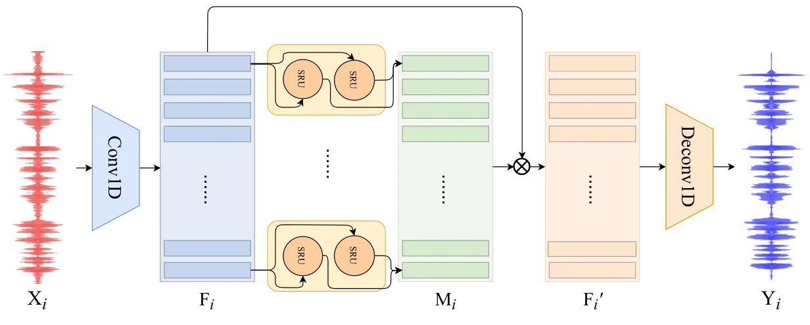

Fig. 1: The architecture of the proposed WaveCRN model. Unlike spectral
CRN, WaveCRN integrates 1D CNN with bidirectional SRU.

## II Methodology

In this section, we describe the details of our WaveCRN-based SE system.
The architecture is a fully differentiable E2E neural network that does
not require pre-processing and handcrafted features. Benefiting from the
advantages of CNN and SRU, it jointly models local and sequential
information. The overall architecture of WaveCRN is shown in Fig. 1.

### II-A 1D Convolutional Input Module

As mentioned in the previous section, for the spectral-mapping-based SE
approaches, speech waveforms are first converted to spectral-domain by
STFT. To implement waveform-mapping SE, WaveCRN uses a 1D CNN input
module to replace the STFT processing. Benefiting from the nature of
neural networks, the CNN module is fully trainable. For each batch, the
input noisy audio X (X $`\in R^{N\times 1\times L}`$) is convolved with
a two-dimensional tensor W (W $`\in R^{C\times K}`$) to extract the
feature map F $`\in R^{N\times C\times T}`$, where $`N,C,K,T,L`$ are the
batch size, number of channels, kernel size, time steps, and audio
length, respectively. Notably, to reduce the sequence length for
computational efficiency, we set the convolution stride to half the size
of the kernel, so that the length of F is reduced from $`L`$ to
$`T=2L/K+1`$.

### II-B Temporal Encoder

We used a bidirectional SRU (Bi-SRU) to capture the temporal correlation
of the feature maps extracted by the input module in both directions.
For each batch, the feature map $`\mathbf{F}\in R^{N\times C\times T}`$
is passed to the SRU-based recurrent feature extractor. The hidden
states extracted in both directions are concatenated to form the encoded
features.

### II-C Restricted Feature Mask

The optimal ratio mask (ORM) has been widely used in SE and speech
separation tasks \[45\]. As ORM is a time-frequency mask, it cannot be
directly applied to waveform-mapping-based SE approaches. In this study,
an alternative mask restricted feature mask (RFM) with all elements in
the range of -1 to 1 is applied to mask the feature map F:

```math
\textbf{F}^{\prime}=\textbf{M}\circ\textbf{F}. \tag{1}
```

where $`\textbf{M}\in R^{N\times C\times T}`$, is the RFM,
$`\textbf{F}^{\prime}`$ is the masked feature map estimated by
element-wise multiplying the mask M and the feature map F. It should be
noted that the main difference between ORM and RFM is that the former is
applied to spectral features, whereas the latter is used to transform
the feature maps.

### II-D Waveform Generation

As described in Section II-A, the sequence length is reduced from $`L`$
(for the waveform) to $`T`$ (for the feature map) due to the stride in
the convolution process. Length restoration is essential for generating
an output waveform with the same length as the input. Given the input
length, output length, stride, and padding as $`L_{in}`$, $`L_{out}`$,
$`S`$, and $`P`$, the relationship between $`L_{in}`$ and $`L_{out}`$
can be formulated as:

```math
\displaystyle L_{out}=(L_{in}-1)\times S-2\times P+(K-1)+1. \tag{2}
```

Let $`L_{in}=T`$, $`S=K/2`$, $`P=K/2`$, we have $`L_{out}=L`$. That is,
the output waveform and the input waveform are guaranteed to have the
same length.

### II-E Model Structure Overview

As shown in Fig. 1, our model leverages the benefits of CNN and SRU.
Given the $`i`$-th noisy speech utterance
$`\mathbf{X}_{i}\in R^{1\times L}`$, $`i=0,...,N-1`$, in a batch, a 1D
CNN first maps $`\mathbf{X}_{i}`$ into a feature map $`\mathbf{F}_{i}`$
for local feature extraction. Bi-SRU then computes an RFM
$`\mathbf{M}_{i}`$, which element-wisely multiplies $`\mathbf{F}_{i}`$
to generate a masked feature map $`\mathbf{F}_{i}^{\prime}`$. Finally, a
transposed 1D convolution layer recovers the enhanced speech waveforms,
$`\mathbf{X}_{i}`$, from the masked features,
$`\mathbf{F}_{i}^{\prime}`$.

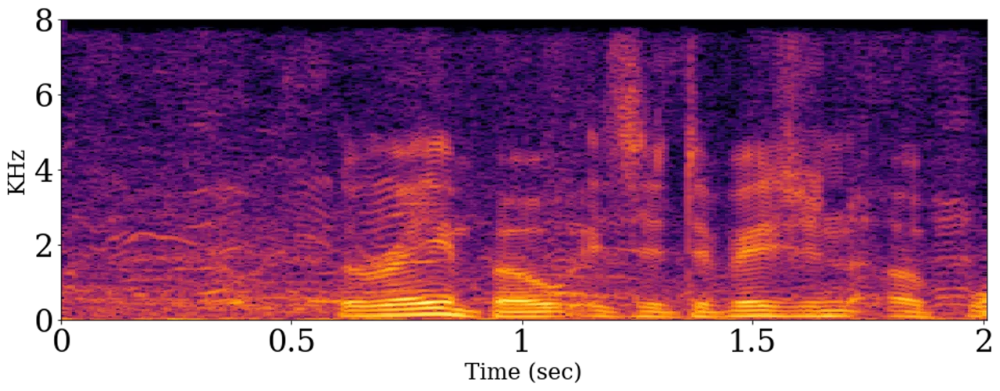

(a) Noisy

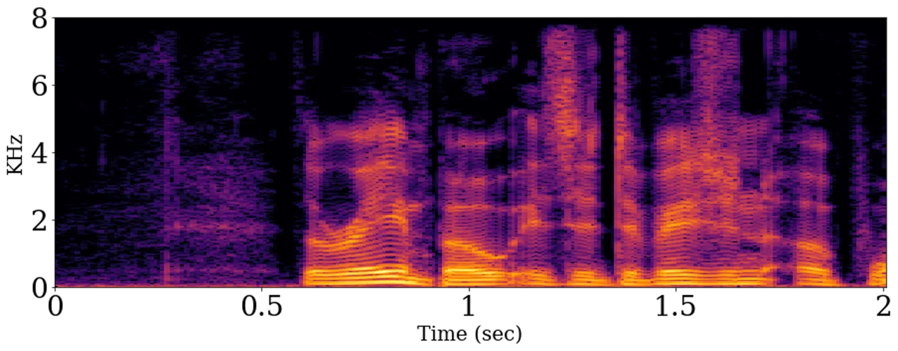

(b) Clean


(c) LPS–SRU\*

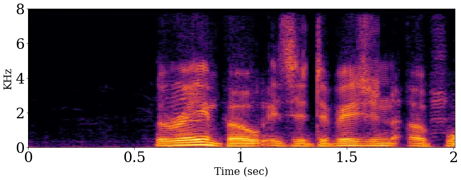

(d) LPS–SRU

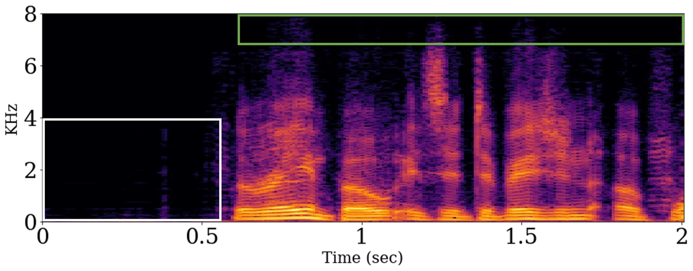

(e) WaveCBLSTM\*

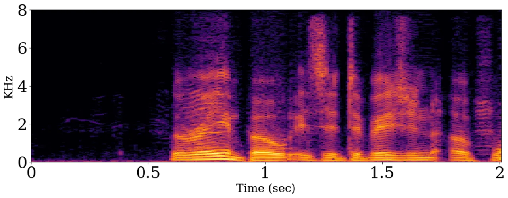

(f) WaveCBLSTM

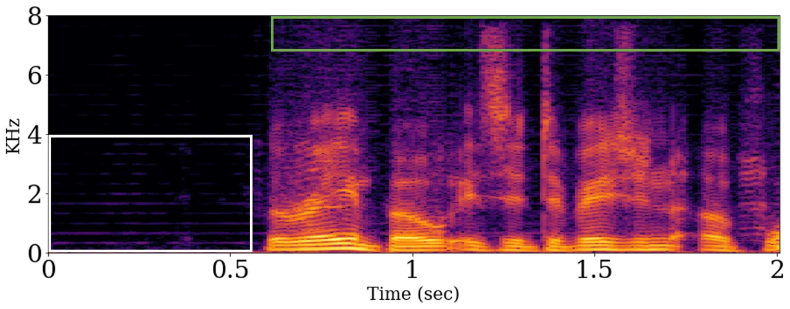

(g) WaveCRN\*

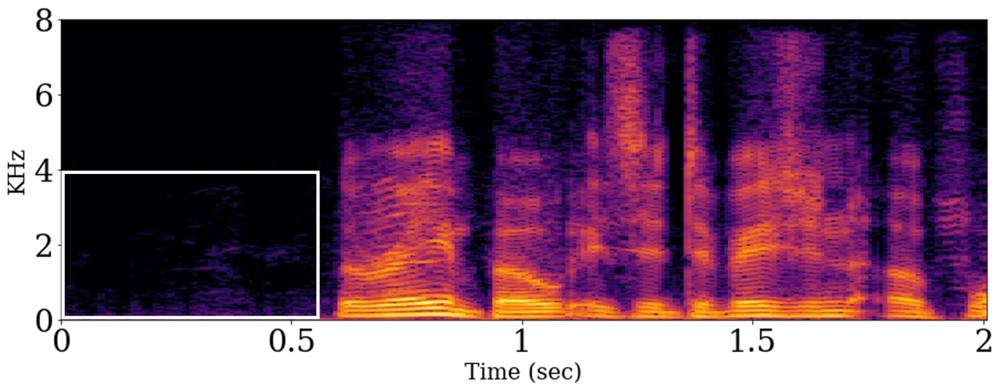

(h) WaveCRN

Fig. 2: Magnitude spectrograms of noisy, clean and enhanced speech by
LPS–SRU, LPS–SRU\*, WaveCBLSTM, WaveCBLSTM\*, WaveCRN, and WaveCRN\*,
where models marked with \* directly generate enhanced speech without
using RFM. The improvements of WaveCRN over other methods are
highlighted with green (high-frequency parts) and white blocks
(silence).

In \[21\], SRU has been proved to yield a performance comparable to that
of LSTM, but with better parallelism. The dependency between gates in
LSTM leads to slow training and inference. In contrast, all gates in SRU
depend only on the input of the current time, and the sequential
correlation is captured by adding highway connections between recurrent
layers. Therefore, the gates in SRU are computed simultaneously. In the
forward pass, the time complexity of SRU and LSTM are
$`O(T\cdot N\cdot C)`$ and $`O(T\cdot N\cdot C^{2})`$, respectively. The
above-mentioned advantages make SRU appropriate to combine it with CNN.
Some studies \[46, 47\] depict ResNet as an ensemble of relatively
shallow paths of its sub-nets. Since SRU has highway connections and
recurs over time, it can be regarded as an ensemble for discrete
modeling of dependency within a sub-sequence.

## III Experiments

### III-A Experimental Setup

#### III-A1 Speech Denoising

For the speech denoising task, an open-source dataset \[39\] was used,
which combines the voice bank corpus \[48\] and the DEMAND corpus
\[49\]. Similar to previous works \[33, 36, 35, 25, 38, 37\], we
downsampled the speech data to 16 kHz for training and testing. In the
voice bank corpus, 28 out of the 30 speakers were used for training, and
2 speakers were used for testing. For the training set, the clean speech
was contaminated with 10 types of noise at 4 SNR levels (0, 5, 10, and
15 dB). For the testing set, the clean speech was contaminated with 5
types of unseen noise at the other 4 SNR levels (2.5, 7.5, 12.5, and
17.5 dB).

#### III-A2 Compressed (2-bit) Speech Restoration

For the compressed speech restoration task, we used the TIMIT corpus
\[43\]. The original speech samples were recorded in a 16 kHz and 16-bit
format. In this set of experiments, each sample was compressed into a
2-bit format (represented by -1, 0, or +1). In this way, we save 87.5%
of the bits, thereby reducing the data transmission and storage
requirements. We believe that this compression scheme is potentially
applicable to real-world internet of things (IoT) scenarios. Note that
the same model architecture was used in both denoising and restoration
tasks. The +1, 0, or -1 value of each compressed sample was first mapped
to a floating-point representation, and thus the waveform-domain SE
system could be readily applied to restore the original uncompressed
speech. Expressing the original speech as $`\hat{y}`$ and the compressed
speech as $`\mathrm{sgn}(\hat{y})`$, the optimization process becomes

```math
\arg\min_{\theta}\lVert\hat{y}-g_{\theta}(\mathrm{sgn}(\hat{y}))\rVert_{1}, \tag{3}
```

where $`g_{\theta}`$ denotes the SE process.

|                   |      |      |      |      |       |
| ----------------- | ---- | ---- | ---- | ---- | ----- |
| Model             | PESQ | CSIG | CBAK | COVL | SSNR  |
| Noisy             | 1.97 | 3.35 | 2.44 | 2.63 | 1.68  |
| Wiener            | 2.22 | 3.23 | 2.68 | 2.67 | 5.07  |
| SEGAN \[33\]      | 2.16 | 3.48 | 2.94 | 2.80 | 7.73  |
| Wavenet \[35\]    | -    | 3.62 | 3.23 | 2.98 | -     |
| Wave-U-Net \[36\] | 2.62 | 3.91 | 3.35 | 3.27 | 10.05 |
| LPS–SRU\*         | 2.21 | 3.28 | 2.86 | 2.73 | 6.18  |
| WaveCBLSTM\*      | 2.39 | 3.19 | 3.08 | 2.76 | 8.78  |
| WaveCRN\*         | 2.46 | 3.43 | 3.04 | 2.89 | 8.43  |
| LPS–SRU           | 2.49 | 3.73 | 3.20 | 3.10 | 9.17  |
| WaveCBLSTM        | 2.54 | 3.83 | 3.25 | 3.18 | 9.33  |
| WaveCRN           | 2.64 | 3.94 | 3.37 | 3.29 | 10.26 |

TABLE I: Results of the speech denoising task. A higher score indicates
better performance. Bold values indicate the best performance for a
specific metric. Models marked with \* directly generate enhanced speech
without using RFM.

#### III-A3 Model Architecture

In the input module, the number of channels, kernel size, and stride
size was set to 256, 0.006 s, and 0.003 s, respectively. The input audio
was padded to make it divisible by the stride size. The size of the
hidden state of Bi-SRU was set to the number of channels (with 6
stacks). Next, all the hidden states were linearly mapped to half
dimension to form a mask and element-wisely multiplied by the feature
map. Finally, in the waveform generation step, a transposed
convolutional layer was used to map the 2D feature map into a 1D
sequence, which was passed through a hyperbolic tangent activation
function to generate the predicted waveform. The $`l_{1}`$ norm was used
as the objective function for training WaveCRN. For a fairer comparison
of the model architectures, we mainly compare WaveCRN with other SE
systems also trained using the $`l_{1}`$ norm.

### III-B Experimental Results

#### III-B1 Speech Denoising

For the speech denoising task, we used five evaluation metrics from
\[50\]: CSIG (signal distortion), CBAK (background intrusiveness), COVL
(overall quality using the scale of the mean opinion score) and PESQ
that reveal the speech quality, and SSNR (segmental signal-to-noise
ratio). Table I presents the results. The proposed model was compared
with Wiener filtering, SEGAN, two well-known SE models that use the same
$`l_{1}`$ loss (i.e., Wavenet and Wave-U-Net), LPS–SRU that uses the LPS
feature as input, and WaveCBLSTM that combines CNN and BLSTM. LPS–SRU
was implemented by replacing the 1D convolutional input module and the
transposed 1D convolutional output module in Fig. 1 with STFT and
inverse STFT modules. WaveCBLSTM was implemented by replacing the SRU in
Fig. 1 with LSTM. The combination of CNN and LSTM for processing speech
signals has been widely investigated \[19, 20, 30\]. In this study, we
aim to show that SRU is superior to LSTM in terms of the denoising
capability and computational efficiency, when applied to waveform-based
SE. As can be clearly seen from Table I, WaveCRN outperforms other
models in terms of all perceptual and signal-level evaluation metrics.

We first investigated the effect of RFM. As shown in Table I, LPS–SRU,
WaveCBLSTM, and WaveCRN are better than their counterparts without RFM
(LPS–SRU\*, WaveCBLSTM\*, and WaveCRN\*). Notably, unlike WaveCBLSTM and
WaveCRN that use waveforms as input, LPS–SRU enhances the audio in the
spectral domain. Fig. 2 shows the magnitude spectrograms of noisy,
clean, and enhanced speech utterances. Two observations can be drawn
from the figure. First, RFM notably eliminates noise components in the
high-frequency region (green blocks) and silence parts (white blocks).
This observation is consistent with the results in Table I: the models
with RFM achieve higher SSNR scores and speech quality. Second, as shown
in Fig. 2(e), without RFM, the high-frequency region cannot be
completely restored. Comparing Fig. 2(e) and Fig. 2(g), WaveCBLSTM\* has
a cleaner estimation than WaveCRN\* in the silence parts, but the loss
of the high-frequency region deteriorates the audio quality, which can
be found in Table I. Compared with WaveCRN\*, WaveCBLSTM\* has a higher
CBAK score but lower PESQ and SSNR scores. Next, Table II presents a
comparison of the execution time and parameters of the WaveCRN and
WaveCBLSTM. Under the same hyper-parameter settings (number of layers,
dimension of hidden states, number of channels, etc.), the training
process of WaveCRN is 15.45 ($`(38.1+59.86)/(2.07+4.27)`$) times faster
than that of WaveCBLSTM, and the number of parameters is only 51%. The
forward pass is 18.41 times faster, which means 18.41 times faster in
inference.

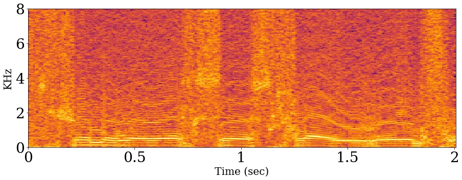

(a) Compressed

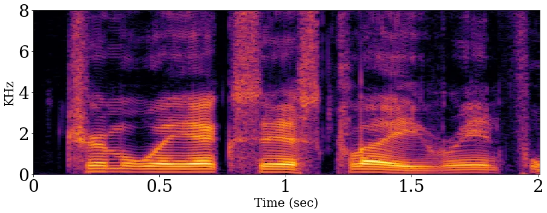

(b) Ground Truth

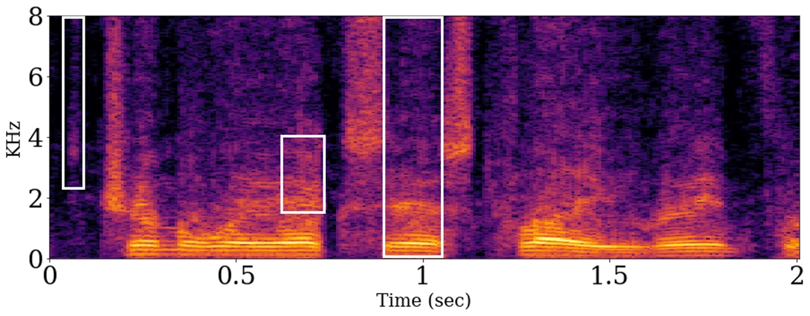

(c) LPS–SRU

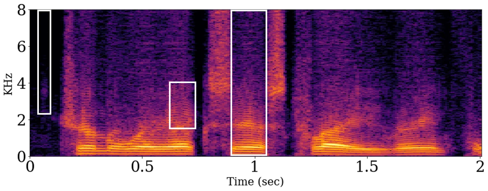

(d) WaveCRN

Fig. 3: Magnitude spectrograms of original, compressed, and restored
speech by LPS–SRU and WaveCRN.

| Model                             | WaveCBLSTM         | WaveCRN           |
| --------------------------------- | ------------------ | ----------------- |
| Forward ($`10^{-3}`$sec)          | 38.1 $`\pm`$ 2.1   | 2.07 $`\pm`$ 0.07 |
| Back-propagation ($`10^{-3}`$sec) | 59.86 $`\pm`$ 1.13 | 4.27 $`\pm`$ 0.09 |
| \#parameters (K)                  | 9093               | 4655              |

TABLE II: A comparison of execution time and number of parameters of
WaveCRN and WaveCBLSTM with same hyper-parameters. This experiment was
performed in an environment setting that used a 48-core CPU at 2.20 GHz
and a Titan Xp GPU with 12 GB VRAM. The first row and the second row
show the execution time of the forward and the back-propagation passes
for a 1-second waveform input in a batch of 16, and the third row
presents the number of parameters.

#### III-B2 Compressed Speech Restoration

For the compressed speech restoration task, we applied WaveCRN and
LPS–SRU to transform the compressed speech to the uncompressed one. In
LPS–SRU, the SRU structure was identical to that used in WaveCRN, but
the input was the LPS, and the STFT and inverse STFT were used for
speech analysis and reconstruction, respectively. The performance was
evaluated in terms of the PESQ and STOI scores. From Table III, we can
see that WaveCRN and LPS–SRU improve the PESQ score from 1.39 to 2.41
and 1.97, and the STOI score from 0.49 to 0.86 and 0.79. Both the
approaches achieve significant improvements, while WaveCRN clearly
outperforms LPS–SRU. We can observe from Fig. 3(a) and 3(b) that the
speech quality is notably reduced in 2-bit format, especially in the
silence part and the high-frequency region. However, the spectrograms of
speech restored by WaveCRN and LPS–SRU present a clearer structure, as
shown in Fig. 3(c) and 3(d). In addition, the white-block regions show
that WaveCRN can restore speech patterns more effectively than LPS–SRU.
Fig. 4 shows the instantaneous frequency spectrograms. As expected, the
LPS–SRU recovers the waveform through the compressed phase spectrogram;
hence, WaveCRN preserves more details of the phase spectrogram by
directly using the waveform as input without losing phase information.

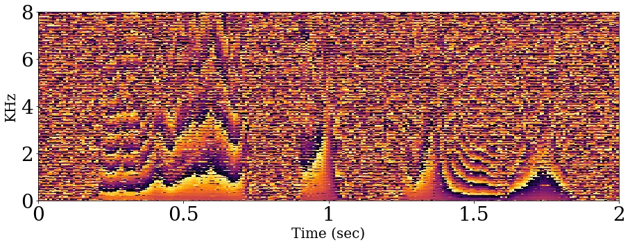

(a) Ground Truth

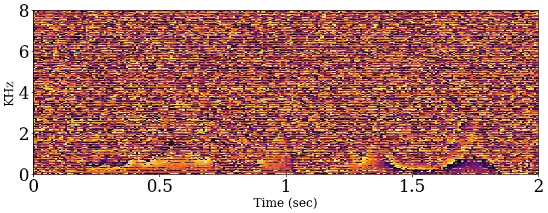

(b) LPS–SRU

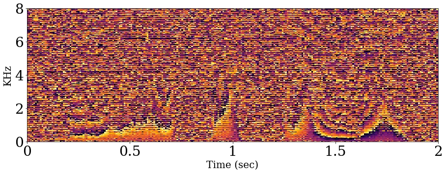

(c) WaveCRN

Fig. 4: Instantaneous frequency spectrograms of uncompressed and
restored speech by LPS–SRU and WaveCRN.

| Model      | PESQ | STOI |
| ---------- | ---- | ---- |
| Compressed | 1.39 | 0.49 |
| LPS–SRU    | 1.97 | 0.79 |
| WaveCRN    | 2.41 | 0.86 |

TABLE III: The results of the compressed speech restoration task.

## IV Conclusions

This paper proposed the WaveCRN E2E SE model. WaveCRN uses a
bi-directional architecture to model the sequential correlation of
extracted features. The experimental results show that WaveCRN achieves
outstanding denoising capability and computational efficiency compared
with related works using $`l_{1}`$ loss. The contributions of this study
are fourfold: (a) WaveCRN is the first work that combines SRU and CNN to
perform E2E SE; (b) a novel RFM approach was derived to directly
transform the noisy features to enhanced ones; (c) the SRU model is
relatively simple yet yield comparable performance to other up-to-date
SE models that use the same $`l_{1}`$ loss; (d) a new practical
application (compressed speech restoration) was designed and its
performance was tested; WaveCRN obtained promising results on this task.
This study focused on comparing the SE model architecture with the
conventional $`l_{1}`$ norm loss. Our future work will explore adopting
alternative perceptual and adversarial losses in the WaveCRN system.

## References

- \[1\] P. C. Loizou, Speech Enhancement: Theory and Practice, CRC
  Press, Inc., 2nd edition, 2013.
- \[2\] M. Kolbk, Z.-H. Tan, and J. Jensen, “Speech intelligibility
  potential of general and specialized deep neural network based speech
  enhancement systems,” IEEE/ACM TASLP, vol. 25, no. 1, pp.
  153–167, 2017.
- \[3\] X. Lu, Y. Tsao, S. Matsuda, and C. Hori, “Speech enhancement
  based on deep denoising autoencoder.,” in Proc. Interspeech, 2013.
- \[4\] B. Xia and C. Bao, “Wiener filtering based speech enhancement
  with weighted denoising auto-encoder and noise classification,” Speech
  Communication, vol. 60, pp. 13–29, 2014.
- \[5\] D. Wang and J. Chen, “Supervised speech separation based on deep
  learning: An overview,” IEEE/ACM TASLP, vol. 26, no. 10, pp.
  1702–1726, 2018.
- \[6\] Z. Meng, J. Li, and Y. Gong, “Adversarial feature-mapping for
  speech enhancement,” in Proc. Interspeech, 2017.
- \[7\] M. H. Soni, N. Shah, and H. A. Patil, “Time-frequency
  masking-based speech enhancement using generative adversarial
  network,” in Proc. ICASSP, 2018.
- \[8\] L. Chai, J. Du, Q.-F. Liu, and C.-H. Lee, “Using generalized
  gaussian distributions to improve regression error modeling for deep
  learning-based speech enhancement,” IEEE/ACM TASLP, vol. 27, no. 12,
  pp. 1919–1931, 2019.
- \[9\] Y. Xu, J. Du, L.-R. Dai, and C.-H. Lee, “A regression approach
  to speech enhancement based on deep neural networks,” IEEE/ACM TASLP,
  vol. 23, no. 1, pp. 7–19, 2015.
- \[10\] F. Xie and D. Van Compernolle, “A family of MLP based nonlinear
  spectral estimators for noise reduction,” in Proc. ICASSP, 1994.
- \[11\] S. Wang, K. Li, Z. Huang, S. M. Siniscalchi, and C.-H. Lee, “A
  transfer learning and progressive stacking approach to reducing deep
  model sizes with an application to speech enhancement,” in Proc.
  ICASSP, 2017.
- \[12\] D. Liu, P. Smaragdis, and M. Kim, “Experiments on deep learning
  for speech denoising,” in Proc. Interspeech, 2014.
- \[13\] L. Sun, J. Du, L.-R. Dai, and C.-H. Lee, “Multiple-target deep
  learning for lstm-rnn based speech enhancement,” in Proc. HSCMA, 2017.
- \[14\] S.-W. Fu, Y. Tsao, and X. Lu, “SNR-aware convolutional neural
  network modeling for speech enhancement,” in Proc. Interspeech, 2016.
- \[15\] F. Weninger, H. Erdogan, S. Watanabe, E. Vincent, J. Le Roux,
  J. R. Hershey, and B. Schuller, “Speech enhancement with LSTM
  recurrent neural networks and its application to noise-robust ASR,” in
  Proc. LVA/ICA, 2015.
- \[16\] A. L. Maas, Q. V. Le, T. M. O’Neil, O. Vinyals, P. Nguyen, and
  A. Y. Ng, “Recurrent neural networks for noise reduction in robust
  ASR.,” in Proc. Interspeech, 2012.
- \[17\] H. Zhao, S. Zarar, I. Tashev, and C.-H. Lee,
  “Convolutional-recurrent neural networks for speech enhancement,” in
  Proc. ICASSP, 2018.
- \[18\] K. Tan and D. Wang, “Learning complex spectral mapping with
  gated convolutional recurrent networks for monaural speech
  enhancement,” IEEE/ACM TASLP, vol. 28, pp. 380–390, 2019.
- \[19\] K. Tan and D. Wang, “A convolutional recurrent neural network
  for real-time speech enhancement,” in Proc. Interspeech, 2018.
- \[20\] K. Tan, X. Zhang, and D. Wang, “Real-time speech enhancement
  using an efficient convolutional recurrent network for dual-microphone
  mobile phones in close-talk scenarios,” in Proc. ICASSP, 2019.
- \[21\] T. Lei, Y. Zhang, S. I. Wang, H. Dai, and Y. Artzi, “Simple
  recurrent units for highly parallelizable recurrence,” in Proc.
  EMNLP, 2018.
- \[22\] X. Cui, Z. Chen, and F. Yin, “Speech enhancement based on
  simple recurrent unit network,” Applied Acoustics, vol. 157, pp.
  107019, 2020.
- \[23\] S.-W. Fu, T.-y. Hu, Y. Tsao, and X. Lu, “Complex spectrogram
  enhancement by convolutional neural network with multi-metrics
  learning,” in Proc. MLSP, 2017.
- \[24\] D. S. Williamson and D. Wang, “Time-frequency masking in the
  complex domain for speech dereverberation and denoising,” IEEE/ACM
  TASLP, vol. 25, no. 7, pp. 1492–1501, 2017.
- \[25\] J. Yao and A. Al-Dahle, “Coarse-to-fine optimization for speech
  enhancement,” in Proc. Interspeech, 2019.
- \[26\] N. Takahashi, P. Agrawal, N. Goswami, and Y. Mitsufuji,
  “PhaseNet: Discretized phase modeling with deep neural networks for
  audio source separation,” in Proc. Interspeech, 2018.
- \[27\] S.-W. Fu, Y. Tsao, X. Lu, and H. Kawai, “Raw waveform-based
  speech enhancement by fully convolutional networks,” in Proc. APSIPA
  ASC, 2017.
- \[28\] T. N. Sainath, R. J. Weiss, A. Senior, K. W. Wilson, and
  O. Vinyals, “Learning the speech front-end with raw waveform CLDNNs,”
  in Proc. Interspeech, 2015.
- \[29\] A. Pandey and D. Wang, “TCNN: Temporal convolutional neural
  network for real-time speech enhancement in the time domain,” in Proc.
  Interspeech, 2019.
- \[30\] J. Li, H. Zhang, X. Zhang, and C. Li, “Single channel speech
  enhancement using temporal convolutional recurrent neural networks,”
  in Proc. APSIPA ASC, 2019.
- \[31\] M. Kolbæk, Z.-H. Tran, Sø. H. Jensen, and J. Jensen, “On loss
  functions for supervised monaural time-domain speech enhancement,”
  IEEE/ACM TASLP, vol. 28, pp. 825–838, 2020.
- \[32\] S.-W. Fu, T. Wang, Y. Tsao, X. Lu, and H. Kawai, “End-to-end
  waveform utterance enhancement for direct evaluation metrics
  optimization by fully convolutional neural networks,” IEEE/ACM TASLP,
  vol. 26, no. 9, pp. 1570–1584, 2018.
- \[33\] S. Pascual, A. Bonafonte, and J. Serra, “SEGAN: Speech
  enhancement generative adversarial network,” in Proc.
  Interspeech, 2017.
- \[34\] K. Qian, Y. Zhang, S. Chang, X. Yang, D. Florêncio, and
  M. Hasegawa-Johnson, “Speech enhancement using Bayesian Wavenet,” in
  Proc. Interspeech, 2017.
- \[35\] D. Rethage, J. Pons, and X. Serra, “A Wavenet for speech
  denoising,” in Proc. Interspeech, 2017.
- \[36\] R. Giri, U. Isik, and A. Krishnaswamy, “Attention Wave-U-Net
  for speech enhancement,” in Proc. WASPAA, 2019.
- \[37\] S. Pascual, J. Serra, and A. Bonafonte, “Time-domain speech
  enhancement using generative adversarial networks,” Speech
  Communication, vol. 114, pp. 10–21, 2019.
- \[38\] F. G. Germain, Q. Chen, and V. Koltun, “Speech Denoising with
  Deep Feature Losses,” in Proc. Interspeech, 2019.
- \[39\] C. Valentini-Botinhao, X. Wang, S. Takaki, and J. Yamagishi,
  “Investigating RNN-based speech enhancement methods for noise-robust
  text-to-speech,” in Proc. SSW, 2016.
- \[40\] A. W. Rix, J. G. Beerends, M. P. Hollier, and A. P. Hekstra,
  “Perceptual evaluation of speech quality (PESQ)-a new method for
  speech quality assessment of telephone networks and codecs,” in Proc.
  ICASSP, 2001.
- \[41\] M. Cernak, A. Lazaridis, A. Asaei, and P. N. Garner,
  “Composition of deep and spiking neural networks for very low bit rate
  speech coding,” IEEE/ACM TASLP, vol. 24, no. 12, pp. 2301–2312, 2016.
- \[42\] L. Deng, M. L. Seltzer, D. Yu, A. Acero, A. rahman Mohamed, and
  G. E. Hinton, “Binary coding of speech spectrograms using a deep
  auto-encoder.,” in Proc. Interspeech, 2010.
- \[43\] J. S. Garofolo, L. F. Lamel, W. M. Fisher, J. G. Fiscus, D. S.
  Pallett, and N. L. Dahlgren, “DARPA TIMIT acoustic-phonetic continuous
  speech corpus cd-rom. NIST speech disc 1-1.1,” NASA STI/Recon
  Technical Report, vol. 93, 1993.
- \[44\] C. H. Taal, R. C. Hendriks, R. Heusdens, and J. Jensen, “An
  algorithm for intelligibility prediction of time–frequency weighted
  noisy speech,” IEEE/ACM TASLP, vol. 19, no. 7, pp. 2125–2136, 2011.
- \[45\] S. Liang, W. Liu, W. Jiang, and W. Xue, “The optimal ratio
  time-frequency mask for speech separation in terms of the
  signal-to-noise ratio,” JASA, vol. 134, no. 5, pp. EL452–EL458, 2013.
- \[46\] A. Veit, M. J Wilber, and S. Belongie, “Residual networks
  behave like ensembles of relatively shallow networks,” in Proc.
  NeurIPS, 2016.
- \[47\] S. De and S. L. Smith, “Batch normalization biases deep
  residual networks towards shallow paths.,” CoRR, vol.
  abs/2002.10444, 2020.
- \[48\] C. Veaux, J. Yamagishi, and S. King, “The voice bank corpus:
  Design, collection and data analysis of a large regional accent speech
  database,” in Proc. O-COCOSDA/CASLRE, 2013.
- \[49\] J. Thiemann, N. Ito, and E. Vincent, “Demand: a collection of
  multi-channel recordings of acoustic noise in diverse environments,”
  in Proc. Meetings Acoust, 2013.
- \[50\] Y. Hu and P. C. Loizou, “Evaluation of objective quality
  measures for speech enhancement,” IEEE TSAP, vol. 16, pp.
  229–238, 2008.
