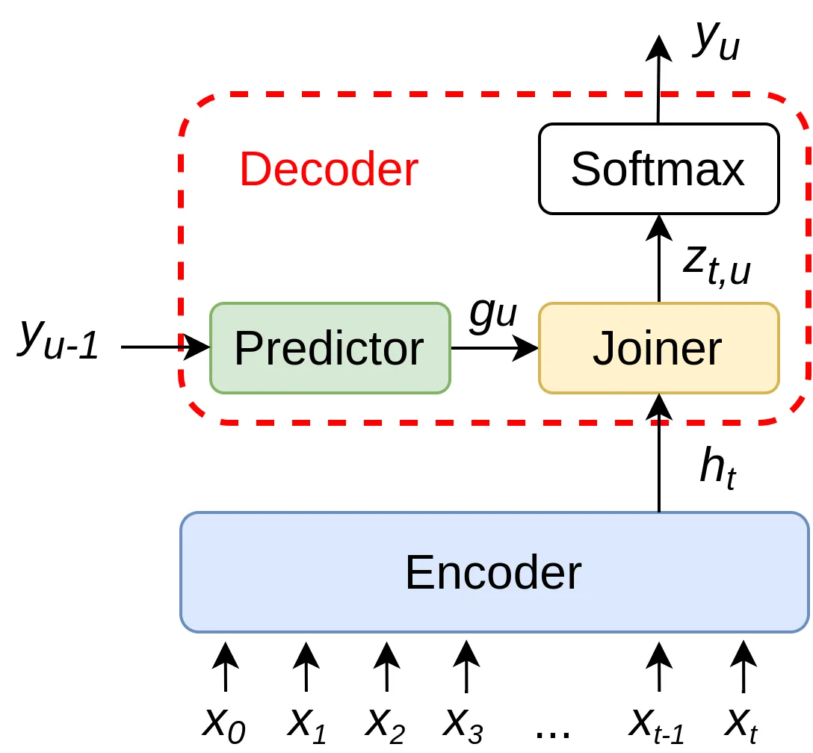

# Towards a Competitive End-to-End Speech Recognition for CHiME-6 Dinner Party Transcription

^(∗)Equal contribution.

###### Abstract

While end-to-end ASR systems have proven competitive with the
conventional hybrid approach, they are prone to accuracy degradation
when it comes to noisy and low-resource conditions. In this paper, we
argue that, even in such difficult cases, some end-to-end approaches
show performance close to the hybrid baseline. To demonstrate this, we
use the CHiME-6 Challenge data as an example of challenging environments
and noisy conditions of everyday speech. We experimentally compare and
analyze CTC-Attention versus RNN-Transducer approaches along with RNN
versus Transformer architectures. We also provide a comparison of
acoustic features and speech enhancements. Besides, we evaluate the
effectiveness of neural network language models for hypothesis
re-scoring in low-resource conditions. Our best end-to-end model based
on RNN-Transducer, together with improved beam search, reaches quality
by only 3.8% WER abs. worse than the LF-MMI TDNN-F CHiME-6 Challenge
baseline. With the Guided Source Separation based training data
augmentation, this approach outperforms the hybrid baseline system by
2.7% WER abs. and the end-to-end system best known before by 25.7% WER
abs.

Andrei Andrusenko^(1,∗), Aleksandr Laptev^(1,∗), Ivan Medennikov^(1,2)

¹ITMO University, St. Petersburg, Russia  
²STC-innovations Ltd, St. Petersburg, Russia

{andrusenko, laptev, medennikov}@speechpro.com

Index Terms: End-to-end speech recognition, CHiME-6 Challenge,
RNN-Transducer.

## 1 Introduction

In recent years, the active development of deep learning techniques has
allowed researchers to make a great performance improvement of Automatic
Speech Recognition (ASR) systems. Although conventional hybrid ASR
systems \[1\] have been remaining preferred for a long time, their
ever-increasing difficulty of construction and training \[2\] has led to
an interest in end-to-end approaches \[3, 4\]. Unlike HMM-DNN-based,
these methods are trained to directly map an input acoustic feature
sequence to a sequence of characters with a single objective function
that is highly relevant to the final evaluation criteria, in particular,
Word Error Rate (WER). The freedom from the necessity of intermediate
modeling, such as acoustic and language models with pronunciation
lexicons, makes the process of building the system clearer and more
straightforward.

Also, there is an informal competition in accuracy between these systems
\[5\]. In most speech recognition tasks with good sound conditions and
speech quality (e.g. LibriSpeech \[6\]), end-to-end models’ performance
is great \[7, 8, 9\]. However, in case of robust far-field speech
recognition in noisy environments and with low resources, such models
face problems \[10\]. There is a series of CHiME Challenges, which task
is to encourage researchers to solve the problem of speech recognition
in such conditions. According to the previous CHiME-5 Challenge \[11\]
reports, the leading positions in quality can be reached only by
conventional hybrid systems \[12, 13, 14\]. Attempts to get a somehow
comparable result for end-to-end systems have not shown any notable
success \[15\].

There is a new line of research aimed at solving a similar problem of
the multichannel robust speech recognition task using the end-to-end
approaches. Works such as \[16, 17, 18\] demonstrate the effectiveness
of joint training of neural-network-based front-end (speech enhancement)
and back-end (speech recognition) models compared to the use of separate
models. However, if the utterance boundaries are given, currently, the
most effective approach is the speech enhancement technique based on
spatial GMM blind source separation, named Guided Source Separation
(GSS) \[19\]. Thus, while maintaining the flexibility of end-to-end
modeling, combining the same GSS front-end and end-to-end models might
be capable of achieving the quality of conventional hybrid systems for a
difficult CHiME-6 dinner party recognition task.

This paper describes an investigation of the aforementioned conjunction
of techniques. We used the sixth CHiME Challenge ^(†)^(†)
[https://chimechallenge.github.io/chime6/](https://chimechallenge.github.io/chime6/)
data, as it has an additional accurate array synchronization, and the
baselines for speech enhancement and recognition. Our experimental setup
was focused on the replacement of the hybrid recognition system from the
baseline with an end-to-end system. We explored the effectiveness of RNN
and Transformer architectures along with CTC-Attention and
RNN-Transducer (RNN-T) training-decoding approaches.

This study also considers some extensions for the basic RNN-T model:

- •
  Transformer-transducer \[20, 21\]. The idea behind this approach is to
  replace conventional LSTM/BLSTM encoder and predictor modules of the
  basic RNN-T implementation with the Transformer networks, which have
  proven effective in sequence modeling tasks.
- •
  Improved beam search for RNN-T decoding \[22\]. This is a modification
  of the standard beam search algorithm aimed at improving the
  computational decoding efficiency by using several hypothesis pruning
  heuristics.
- •
  ASGD Weight-Dropped LSTM language model (AWD-LSTM-LM) \[23\] for
  hypotheses re-scoring. This approach is to apply various
  regularization strategies to address overfitting caused by a low text
  data amount.
- •
  The use of GSS-based speech enhancement for training and testing data
  \[24, 25\].

Our main findings are available as an ESPnet CHiME-6 recipe^(†)^(†)
[https://github.com/espnet/espnet/tree/master/egs/chime6/asr1](https://github.com/espnet/espnet/tree/master/egs/chime6/asr1).

The rest of the paper is organized as follows. Section 2 provides an
overview of common end-to-end ASR approaches. The CHiME-6 data and
baseline are described in Section 3. Section 4 provides an experimental
setup for the data and the strategies along with a discussion of our
findings. Finally, Section 5 presents our conclusions and future work.

## 2 End-to-end ASR overview

### 2.1 CTC-Attention

Connectionist temporal classification (CTC), originally introduced in
\[3\], in the ASR field is implied as a type of neural network output
and an associated scoring function for training sequence-to-sequence
(Seq2Seq) models. This approach is intended to relax the requirement of
one-to-one mapping (alignment) between the input and output sequences.
It uses an intermediate label representation with a special “blank”
symbol indicating that no label is seen. It is also used when the label
is repeated. One of the key features worth mentioning is the conditional
label independence at the inference process, which hinders the effective
usage of CTC models without an external language model.

The attention-based encoder-decoder approach, in contrast to CTC,
incorporates contextual information by using both the input frames and
the history of the target label for the inference process \[4\]. It
learns to predict the alignment between frames and labels using the
attention mechanism. While generally performing better than CTC,
attention-based approaches are more susceptible to noise and require
more effort to train. It is proven effective to combine these approaches
to alleviate their shortcomings and improve recognition quality \[26\].

Typical CTC-Attention architecture contains a deep RNN (mostly, bi- or
unidirectional LSTM) encoder and a unidirectional RNN decoder with the
optional use of an external language model (LM).

### 2.2 Transformer

Examining ASR Seq2Seq models, it is worth mentioning the Transformer
architecture. Originally proposed for neural machine translation (NMT)
\[27\], it delivers generally better accuracy compared to RNN \[28\].
The Transformer incorporates self-attention to utilize sequential
information in contrast to the recurrent connection employed in RNN.
Similar to traditional CTC-Attention, it uses joint CTC- and
attention-based decoding.

The transformer architecture consists of both deep Multi-head attention
(MHA) encoder and decoder. To represent the time location, linear or
convolutional positional encoding is applied before the encoder and
decoder modules.

### 2.3 Neural Transducer

Figure 1: Neural Transducer.

The main alternative to the CTC-Attention approach is the neural
transducer \[29\]. In many details, this approach is similar to the CTC.
They both use the “blank” label and compute the probability of all
possible alignment paths during training to obtain the probability of
the entire target transcription. Architecturally, having essentially the
same encoder, the decoder of the neural transducer is different from the
attention-based. It consists of:

- •
  A prediction network, which plays the role of a language model.
- •
  A joint network, intended for aligning audio and label sequences.

The standard neural transducer structure is presented in Figure 1. An
input acoustic feature sequence
$`\mathbf{x}=(x_{0},x_{1},x_{2},...,x_{t})`$ is passed to the Encoder
and converted to a sequence of embeddings
$`\mathbf{h}=(h_{0},h_{1},h_{2},...,h_{T^{{}^{\prime}}})`$. In most
cases, the Encoder performs subsampling by using convolutional layers,
therefore $`T\leq{T^{{}^{\prime}}}`$. Next, the Joiner, which is a
shallow fully connected (FC) neural network, receives the current
Encoder embedding $`h_{t}`$ and predictor embedding $`g_{u}`$ to yield
logits $`z_{t,u}`$. The most probable label $`y_{u}`$ is determined by
the Softmax. It is important that, since the Predictor practically works
like a neural LM, it accepts only a non-blank $`y_{u-1}`$. For the blank
$`y_{u-1}`$, it yields $`g_{u}`$ as if for the last non-blank
$`y_{u-1}`$.

Traditionally, most neural transducer studies investigate
RNN-transducer. It consists of deep bi- or unidirectional LSTM encoder
and a unidirectional LSTM predictor. According to \[20\], the neural
transducer is able to reach better accuracy with the use of the
Transformer as an architecture of encoder or predictor. Also, the
Transformer-Transducer from \[21\] outperformed the basic RNN-T model
for the Librispeech task.

Apart from architecture improvement, the neural transducer beam search
is also can be improved. Work \[22\] introduces expand_beam and
state_beam parameters to explicitly limit the beam size in the decoding
process, and thus, to increase decoding efficiency. These parameters
allow the search to reject “bad” hypotheses and to choose only the most
probable, in terms of confidence, in the predictions of the neural
network.

## 3 CHiME-6 dinner party transcription

The previous CHiME-5 Challenge featured fully transcribed speech
materials collected with multiple 4-channel microphone arrays from real
dinner parties that have taken place in real homes. Conversational
speech with a large amount of overlapped segments recorded in
reverberant and noisy conditions significantly complicates recognition.
Details on the Challenge can be found in \[11\].

CHiME-6 Challenge \[30\] used the same recordings as the previous one,
but improved initial data preparation and established the following
strong baselines:

- •
  Two stages array synchronization by frame-dropping and clock-drift.
  This allowed to obtain utterances with the same start and end time on
  every device.
- •
  GSS-based speech enhancement \[19\] applied to multiple arrays.
- •
  Factorized time-delayed neural network (TDNN-F) acoustic model,
  trained with lattice-free maximum mutual information (LF-MMI), from
  Kaldi^(†)^(†)
  [https://github.com/kaldi-asr/kaldi](https://github.com/kaldi-asr/kaldi)
  toolkit.

This baseline demonstrated 51.76% WER on the development set by using
train_worn_simu_u400k_cleaned_rvb training set, which was obtained by
various augmentations of 40 unique training data. Specific rooms
simulation, speed, and volume perturbation increased the total amount of
data to about 1400 hours.

## 4 Experimental Setup

We used the ESPnet^(†)^(†)
[https://github.com/espnet/espnet](https://github.com/espnet/espnet)
speech recognition toolkit \[31\] as the main framework for our
experiments. It supports most of the basic end-to-end models and
training pipelines.

### 4.1 End-to-end modeling

The first step of our investigation was to discover the most suitable
end-to-end architecture for solving the task under consideration.
Approaches like joint CTC-Attention, RNN-Transducer, and Transformer are
the most popular for ASR tasks. Quasi-optimal configurations of
end-to-end architectures for our task are presented in Table 1. “T-T”
and “dp” stand for Transformer-Transducer and dropout, respectively. The
Transformer network is used only in the Encoder in this architecture.

|               |                                      |
| ------------- | ------------------------------------ |
| CTC-Attention |                                      |
| Encoder       | VGG-BLSTM, 6-layer 512-units, dp 0.4 |
| Attention     | 1-head 256-units, dp 0.4             |
| Decoder       | LSTM, 2-layer 256 units, dp 0.4      |
| RNN-T         |                                      |
| Encoder       | VGG-BLSTM, 6-layer 512-units, dp 0.4 |
| Predictor     | LSTM, 2-layer 256-units, dp 0.4      |
| Joiner        | FC 256 units                         |
| T-T           |                                      |
| Encoder       | MHA, 12-layer 1024-units, dp 0.4     |
| Attention     | 8-head 512-units, dp 0.4             |
| Predictor     | LSTM, 2-layer 256-units, dp 0.4      |
| Joiner        | FC 256 units                         |
| Transformer   |                                      |
| Encoder       | MHA, 12-layer 1024-units, dp 0.5     |
| Attention     | 4-head 256-units, dp 0.5             |
| Decoder       | MHA, 2-layer 1024 units, dp 0.5      |

Table 1: Models configuration

For all the presented approaches, we used a convolutional network (CNN)
in front of the encoder. It consists of four Visual Geometry Group (VGG)
CNN layers designed to compress the input frames in time scale by the
factor of 4. Thus, after applying this network, the output features
represent the transformed information from 4 initial frames. Although
not originally intended, this approach allowed the model to converge
more stably.

### 4.2 Experimental evaluation

We used the official data from the Kaldi baseline recipe:
train_worn_simu_u400k_cleaned_rvb and dev_gss_multiarray (or dev_gss12
in our simplified notation) as the training and development sets,
respectively.

Characters (26 letters of the English alphabet and 7 auxiliary symbols)
were used as acoustic units. Other versions of word units, namely
position-depending letters, Byte Pair Encoding (BPE) \[32\] with
different numbers of units 500, 1000, 2000 led only to performance
degradation. This might be due to the lack of training data for such
large unit numbers.

The next step was to choose the input acoustic features. The hybrid
baseline model used 40-dimensional high-resolution MFCC vectors (hires)
concatenated with 100-dimensional i-vectors. However, such features may
not be the best option for an end-to-end model. We considered the
following features: 80-dimensional log-Mel filterbank coefficients
(fbank) with or without 3-dimensional pitch features and 512-dimensional
wav2vec context network output vectors \[33\]. A comparison of these
acoustic features with the RNN-T model configured as in Table 1 is shown
in Table 2. All decoding results were obtained using the beam size of 10.

| Feats                      | Dimension | WER(%) |
| -------------------------- | --------- | ------ |
| wav2vec                    | 512       | 68.3   |
| hires+i-vectors (baseline) | 40+100    | 64.1   |
| hires                      | 40        | 63.6   |
| fbank                      | 80        | 60.4   |
| fbank+pitch                | 80+3      | 59.7   |

Table 2: RNN-T features comparison

Limited computing power did not allow us to train the wav2vec features
extractor for a sufficient number of epochs (the model was trained only
in 6 epochs), which apparently caused such a bad result. The
underperforming of hires+i-vectors against the single hires might be due
to the VGG network usage. All further experiments were carried out using
fbank+pitch features.

Having settled on 33 character acoustics units and the fbank+pitch
acoustics features, we compared the end-to-end architectures from the
Table 1. We also used SpecAugment \[34\] to further augment the training
data. The results of this comparison are presented in Table 3.

|        |         |       |      |         |
| ------ | ------- | ----- | ---- | ------- |
|        | CTC-Att | RNN-T | T-T  | Transf. |
| WER(%) | 73.8    | 55.5  | 60.3 | 86.8    |

Table 3: Comparison of end-to-end models

The results show that the RNN-T demonstrates the best WER in this task.
It is worth noting the great positive impact of SpecAugment. The
applying of this augmentation reduced WER by 4.2% for the RNN-T model.
This suggests the importance of augmentation methods for low-resource
tasks. Models that utilize the Transformer architecture (T-T,
Transformer) perform worse than LSTM due to severe overfitting.

We also faced a problem in the re-scoring process using external
RNN-based language models. Character and word-based LSTM LMs (1-layer
1024-units) were trained on the training data transcriptions only.
However, the use of these LMs for hypothesis re-scoring in the beam
search algorithm for RNN-T only resulted in reduced recognition
accuracy. We also used the pre-trained AWD-LSTM-LM, which showed a
significant WER improvement for lattice re-scoring in the STC CHiME-6
system \[25\]. Unfortunately, none of these models improved accuracy.
Apart from the beam search rescoring, we tried to use the n-best
rescoring approach, but the n-best hypotheses produced from the
development set utterances did not have significant variability in
words. Thus, this rescoring method did not improve the result either. We
have two assumptions for this to happen. The first one is that in case
of a low-resource task, with properly tuned Predictor network parameters
can perform sufficiently good without using any re-scoring techniques.
The second one is that the beam search algorithm we used is not optimal
for the hypothesis re-scoring. For example, in the case of a hybrid
system decoding, there are separate acoustic and language model scores
of a word unit. And in the corresponding re-scoring algorithm, the
language score is re-weighted according to the external LSTM LM. But in
the case of RNN-T, there is only one single score for word unit. The
default ESPnet re-scoring is simply a weighted sum of the external LSTM
LM and RNN-T scores. The results of hypothesis re-scoring with an
external NNLM are demonstrated in Table 4. We used the beam size of 10
and the NNLM weight of 0.3 for all experiments.

| NNLM      | WER(%) |
| --------- | ------ |
| -         | 55.5   |
| Char NNLM | 57.5   |
| Word NNLM | 57.4   |
| AWD-LSTM  | 56.3   |

Table 4: External NNLM for RNN-T beam search

The improved beam search algorithm, implemented according to \[22\],
demonstrated results beyond expectations. Values expand_beam and
state_beam handpicked as 2 and 1, respectively, allowed to accelerate
the decoding process by an average of 15-20% with a simultaneous
improvement in the recognition quality by 0.5 absolute WER, thus
delivering 55.00 WER for the dev_gss12. We assume that the WER
improvement was due to a decrease in the impact of the Predictor
overfitting.

|                                    |        |
| ---------------------------------- | ------ |
| Model                              | WER(%) |
| Joint CTC/Attention E2E \[15\]     | 82.1   |
| CNN-based Multichannel E2E \[16\]  | 80.7   |
| CHiME-6 TDNN-F baseline \[30\]     | 51.7   |
| RNN-T + dev_gss12                  | 55.0   |
| RNN-T + train_gss + dev_gss12      | 52.6   |
| RNN-T + train_gss + dev_gss24      | 49.0   |
| Hybrid system (n-gram LM) \[25\]   | 36.8   |
| Hybrid system (AWD-LSTM-LM) \[25\] | 33.8   |

Table 5: The final models’ performance comparison on the development
set.

We also applied additional GSS-based speech enhancement for the training
(train_gss) data according to \[25\] as well as improved 24-microphone
GSS enhancement for the development data (dev_gss24).

The final comparison of some of the currently published end-to-end
models, the official baseline, and our RNN-T models is presented in
Table 5 (only the CHiME-6 development data WER results were considered).
Note that results from \[15\] and \[16\] are obtained for the CHiME-5
data, i.e. without improvements mentioned in Section 3. To demonstrate a
gap between our system and one of the best hybrid systems known to us at
the moment, we also placed in the comparison the best single model from
the STC CHiME-6 system \[25\].

## 5 Conclusion

In this work, we presented an end-to-end systems exploration of the
robust far-field speech recognition in noisy environments and low
resources such as the CHiME-6 dinner party transcription task. We showed
that the combination of powerful GSS-based speech enhancement and the
use of the RNN-Transducer model is able to achieve competitive results
with hybrid systems. With the improved beam search algorithm and
addition speech enhancement, our system outperformed the hybrid baseline
system by 2.7% WER abs.

Further research might be the study on how, for the task under
consideration, to achieve a recognition accuracy improvement when
re-scoring hypotheses using external NNLM. Also, it would be interesting
to incorporate GSS-based enhancement in the end-to-end pipeline to train
the system jointly.

## 6 Acknowledgements

We would like to show our sincere gratitude to A. Mitrofanov, I.
Podluzhny, and A. Romanenko for sharing their developments in external
NNLM modeling for CHiME-6 data. We also want to thank the ESPnet
development team for the excellent open-source ASR toolkit that helped
us doing this research.

This work was partially financially supported by the Government of the
Russian Federation (Grant 08-08).

## References

- \[1\] G. Hinton, l. Deng, D. Yu, G. Dahl _et al._, “Deep neural
  networks for acoustic modeling in speech recognition: The shared views
  of four research groups,” _Signal Processing Magazine, IEEE_, vol. 29,
  pp. 82–97, 11 2012.
- \[2\] I. Medennikov, Y. Khokhlov, A. Romanenko, I. Sorokin _et al._,
  “The stc asr system for the voices from a distance challenge 2019,” in
  _Proc. ICASSP_, 2019.
- \[3\] A. Graves, S. Fernández, F. Gomez, and J. Schmidhuber,
  “Connectionist temporal classification: Labelling unsegmented sequence
  data with recurrent neural networks,” in _Proceedings of the 23rd
  international conference on Machine learning - ICML_. Pittsburgh,
  Pennsylvania: ACM Press, 2006, pp. 369–376.
- \[4\] W. Chan, N. Jaitly, Q. V. Le, and O. Vinyals, “Listen, attend
  and spell: A neural network for large vocabulary conversational speech
  recognition,” in _IEEE International Conference on Acoustics, Speech
  and Signal Processing (ICASSP)_. IEEE, 2016, pp. 4960–4964.
- \[5\] C. Lüscher, E. Beck, K. Irie, M. Kitza _et al._, “Rwth asr
  systems for librispeech: Hybrid vs attention,” _Interspeech_,
  Sep 2019.
- \[6\] V. Panayotov, G. Chen, D. Povey, and S. Khudanpur, “Librispeech:
  An ASR corpus based on public domain audio books,” in _IEEE
  International Conference on Acoustics, Speech and Signal Processing
  (ICASSP)_. IEEE, Apr. 2015, pp. 5206–5210.
- \[7\] G. Synnaeve, Q. Xu, J. Kahn, E. Grave _et al._, “End-to-end asr:
  From supervised to semi-supervised learning with modern
  architectures,” _arXiv:1911.08460_, 2019.
- \[8\] J. Li, V. Lavrukhin, B. Ginsburg, R. Leary _et al._, “Jasper: An
  end-to-end convolutional neural acoustic model,” in
  _Interspeech_. ISCA, Sep. 2019, pp. 71–75.
- \[9\] A. Zeyer, K. Irie, R. Schlüter, and H. Ney, “Improved training
  of end-to-end attention models for speech recognition,” _Interspeech_,
  Sep 2018.
- \[10\] V. Bataev, M. Korenevsky, I. Medennikov, and A. Zatvornitskiy,
  “Exploring end-to-end techniques for low-resource speech recognition,”
  _International Conference on Speech and Computer_, p. 32–41, 2018.
- \[11\] J. Barker, S. Watanabe, E. Vincent, and J. Trmal, “The fifth
  ’CHiME’ speech separation and recognition challenge: Dataset, task and
  baselines,” in _Interspeech_. ISCA, Sep. 2018, pp. 1561–1565.
- \[12\] J. Du, T. Gao, L. Sun, F. Ma _et al._, “The USTC-iFlytek
  systems for CHiME-5 challenge,” in _CHiME 2018 Workshop on Speech
  Processing in Everyday Environments_. ISCA, Sep. 2018, pp. 11–15.
- \[13\] N. Kanda, R. Ikeshita, S. Horiguchi, Y. Fujita _et al._, “The
  Hitachi/JHU CHiME-5 system: Advances in speech recognition for
  everyday home environments using multiple microphone arrays,” in
  _CHiME 2018 Workshop on Speech Processing in Everyday
  Environments_. ISCA, Sep. 2018, pp. 6–10.
- \[14\] I. Medennikov, I. Sorokin, A. Romanenko, D. Popov _et al._,
  “The STC system for the CHiME 2018 challenge,” in _CHiME 2018 Workshop
  on Speech Processing in Everyday Environments_. ISCA, Sep. 2018.
- \[15\] S. Dalmia, S. Kim, and F. Metze, “Situation informed end-to-end
  ASR for noisy environments,” in _CHiME 2018 Workshop on Speech
  Processing in Everyday Environments_. ISCA, Sep. 2018, pp. 49–52.
- \[16\] N. Yalta, S. Watanabe, T. Hori, K. Nakadai, and T. Ogata,
  “CNN-based multichannel end-to-end speech recognition for everyday
  home environments,” in _27th European Signal Processing Conference
  (EUSIPCO)_. IEEE, Sep. 2019, pp. 1–5.
- \[17\] A. S. Subramanian, X. Wang, S. Watanabe, T. Taniguchi _et al._,
  “An investigation of end-to-end multichannel speech recognition for
  reverberant and mismatch conditions,” _arXiv:1904.09049_, 2019.
- \[18\] X. Chang, W. Zhang, Y. Qian, J. L. Roux, and S. Watanabe,
  “Mimo-speech: End-to-end multi-channel multi-speaker speech
  recognition,” _IEEE Automatic Speech Recognition and Understanding
  Workshop (ASRU)_, pp. 237–244, 2019.
- \[19\] C. Boeddecker, J. Heitkaemper, J. Schmalenstroeer, L. Drude
  _et al._, “Front-end processing for the CHiME-5 dinner party
  scenario,” in _CHiME 2018 Workshop on Speech Processing in Everyday
  Environments_. ISCA, Sep. 2018, pp. 35–40.
- \[20\] Z. Tian, J. Yi, J. Tao, Y. Bai, and Z. Wen, “Self-attention
  transducers for end-to-end speech recognition,” in
  _Interspeech_. ISCA, Sep 2019.
- \[21\] C.-F. Yeh, J. Mahadeokar, K. Kalgaonkar, Y. Wang _et al._,
  “Transformer-transducer: End-to-end speech recognition with
  self-attention,” _arXiv:1910.12977_, 2019.
- \[22\] M. Jain, K. Schubert, J. Mahadeokar, C.-F. Yeh _et al._, “Rnn-t
  for latency controlled asr with improved beam search,”
  _arXiv:1911.01629_, 2019.
- \[23\] S. Merity, N. S. Keskar, and R. Socher, “Regularizing and
  optimizing LSTM language models,” in _International Conference on
  Learning Representations_, 2018.
- \[24\] C. Zorila, C. Boeddeker, R. Doddipatla, and R. Haeb-Umbach, “An
  investigation into the effectiveness of enhancement in ASR training
  and test for CHiME-5 dinner party transcription,” in _IEEE Automatic
  Speech Recognition and Understanding Workshop (ASRU)_. SG, Singapore:
  IEEE, Dec. 2019, pp. 47–53.
- \[25\] I. Medennikov, M. Korenevsky, T. Prisyach, Y. Khokhlov
  _et al._, “The stc system for the chime-6 challenge,” in _CHiME 2020
  Workshop on Speech Processing in Everyday Environments_, 2020.
- \[26\] S. Kim, T. Hori, and S. Watanabe, “Joint CTC-attention based
  end-to-end speech recognition using multi-task learning,” in _IEEE
  International Conference on Acoustics, Speech and Signal Processing
  (ICASSP)_. New Orleans, LA: IEEE, Mar. 2017, pp. 4835–4839.
- \[27\] A. Vaswani, N. Shazeer, N. Parmar, J. Uszkoreit _et al._,
  “Attention is all you need,” in _Advances in Neural Information
  Processing Systems 30_, 2017, pp. 5998–6008.
- \[28\] S. Karita, X. Wang, S. Watanabe, T. Yoshimura _et al._, “A
  comparative study on Transformer vs RNN in speech applications,” in
  _IEEE Automatic Speech Recognition and Understanding Workshop
  (ASRU)_. SG, Singapore: IEEE, Dec. 2019, pp. 449–456.
- \[29\] A. Graves, “Sequence transduction with recurrent neural
  networks,” in _Proceedings of the 29th International Conference on
  Machine Learning_, 2012.
- \[30\] S. Watanabe, M. Mandel, J. Barker, and E. Vincent, “CHiME-6
  challenge: Tackling multispeaker speech recognition for unsegmented
  recordings,” _arXiv:2004.09249_, 2020.
- \[31\] S. Watanabe, T. Hori, S. Karita, T. Hayashi _et al._, “ESPnet:
  End-to-end speech processing toolkit,” in _Interspeech 2018_. ISCA,
  Sep. 2018, pp. 2207–2211.
- \[32\] R. Sennrich, B. Haddow, and A. Birch, “Neural machine
  translation of rare words with subword units,” in _Proceedings of the
  54th Annual Meeting of the Association for Computational Linguistics
  (Volume 1: Long Papers)_. Association for Computational Linguistics,
  2016, pp. 1715–1725.
- \[33\] S. Schneider, A. Baevski, R. Collobert, and M. Auli, “Wav2vec:
  Unsupervised pre-training for speech recognition,” in
  _Interspeech_. ISCA, Sep. 2019, pp. 3465–3469.
- \[34\] D. S. Park, W. Chan, Y. Zhang, C.-C. Chiu _et al._,
  “Specaugment: A simple data augmentation method for automatic speech
  recognition,” _Interspeech_, Sep 2019.
