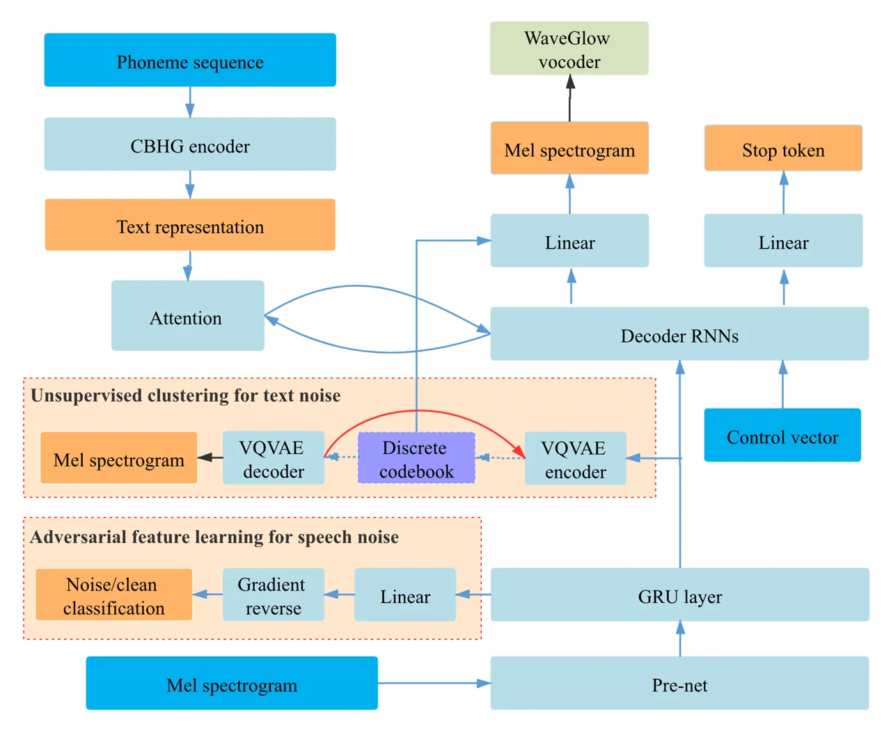

# Adversarial Feature Learning and Unsupervised Clustering based Speech Synthesis for Found Data with Acoustic and Textual Noise

Shan Yang ^(†)^(†)thanks: Shan Yang and Lei Xie are with the Audio,
Speech and Language Processing Group, Northwestern Polytechnical
University, China.    Yuxuan Wang ^(†)^(†)thanks: Yuxuan Wang is with
Bytedance AI Lab, Mountain View, USA Affiliation: Lei Xie,

###### Abstract

Attention-based sequence-to-sequence (seq2seq) speech synthesis has
achieved extraordinary performance. But a studio-quality corpus with
manual transcription is necessary to train such seq2seq systems. In this
paper, we propose an approach to build high-quality and stable seq2seq
based speech synthesis system using challenging found data, where
training speech contains noisy interferences (acoustic noise) and texts
are imperfect speech recognition transcripts (textual noise). To deal
with text-side noise, we propose a VQVAE based heuristic method to
compensate erroneous linguistic feature with phonetic information
learned directly from speech. As for the speech-side noise, we propose
to learn a noise-independent feature in the auto-regressive decoder
through adversarial training and data augmentation, which does not need
an extra speech enhancement model. Experiments show the effectiveness of
the proposed approach in dealing with text-side and speech-side noise.
Surpassing the denoising approach based on a state-of-the-art speech
enhancement model, our system built on noisy found data can synthesize
clean and high-quality speech with MOS close to the system built on the
clean counterpart.

###### Index Terms: 

Speech synthesis, Sequence to sequence, Adversarial training, Found
data.

## I Introduction

Recently, text-to-speech (TTS) has been significantly advanced with the
wide use of deep neural networks (DNN). With the success of
attention-based sequence-to-sequence (seq2seq) approach in machine
translation \[1, 2\], DNN based speech synthesis has evolved into an
end-to-end (E2E) framework, which unifies acoustic and duration modeling
in a compact seq2seq paradigm, discarding frame-wise linguistic-acoustic
mapping \[3, 4, 5, 6, 7\]. To achieve the best performance from a
seq2seq system, studio-quality speech recordings with manual transcripts
are necessary. Leveraging huge amount of speech resources available in
public domain, or so-called found data, has drawn much interests lately.
However, it is challenging to build a TTS system on low-quality found
data as 1) speech may be contaminated by channel and environmental
noises – acoustic noise and 2) transcripts generated by an automatic
speech recognizer (ASR) contain inevitable errors – textual noise.

There are several recent studies addressing acoustic noise for
seq2seq-based E2E TTS. A straightforward idea is to use de-noised audio
from speech enhancement to build the acoustic model \[8\]. But the
inevitable distortion on training speech will propagate to the
synthesized speech, resulting in clear quality deterioration. This
conclusion has been further confirmed by another unsupervised source
separation approach \[9\], where multi-node variational auto-encoder
(VAE) was introduced to remove background music from the found speech
for speech synthesis. The unstable separation directly affects the TTS
quality. Another solution is to disentangle the speaker and noise
attributes directly in the speech synthesis model. The approach
in \[10\] first encodes the reference audio to disentangle speaker and
noise, where adversarial factorization is used to encourage such
disentanglement, and then inject the encodings into an acoustic decoder
to produce clean speech. This approach can generate clean speech with
the help of a clean reference audio, but there is a strong assumption to
conduct domain adversarial training– the audio of one speaker has a
fixed type of acoustic noise, which greatly limits its application. In
more practical situation, recording conditions may vary and the
collected data for the target speaker may come from different sources
with different noise interferences.

We only find one recent study investigating the textual noise.
In \[11\], the robustness of E2E systems to textual noise has been
studied by manually corrupting text and using erronous ASR transcripts.
Results suggest that E2E systems only partially robust to training on
imperfectly-transcribed data, and substitutions and deletions pose a
serious problem. To the best our knowledge, there is still no solution
to deal with textual noise in E2E TTS. Moreover, in many circumstances,
building TTS systems on noisy found data has to deal with both textual
and acoustic noise simultaneously – noisy speech transcribed by an ASR
system with text errors.

This paper addresses both acoustic and textual noise interferences for
building seq2seq-based speech synthesis system on noisy found data. To
deal with textual noise, we propose a heuristic method to compensate the
erroneous linguistic feature with phonetic information learned directly
from speech. Specifically, VQVAE-based unsupervised clustering on the
training speech is adopted to obtain latent phonetic representation,
which is combined with the context vector from the text encoder output
to produce synthesized speech. As for the acoustic noise, we propose to
learn a noise-independent feature in the auto-regressive decoder through
adversarial training and data augmentation, which does not need an extra
speech enhancement model or strong assumption for noise conditions
in \[10\]. Specifically, with the help of the clean data from another
speaker, we adopt a domain classification network with a gradient
reversal layer in the auto-regressive decoder to disentangle the noise
conditions in latent feature space. Experiments show the effectiveness
of the proposed approaches in dealing with textual and acoustic noise.
Surpassing the denoising approach based on a state-of-the-art speech
enhancement model, our system built on noisy data (speech SNR = 4dB,
text CER=23.3%) can synthesize clean and high-quality speech with MOS
close to the system built on the clean counterpart.

## II Proposed methods for found data

Fig. 1 illustrates our seq2seq-based speech synthesis framework, which
shares the similar architecture with Tacotron \[3, 4\]. It is composed
of a CBHG-based text encoder \[3\] and an auto-regressive decoder for
mel-spectrogram generation, while attention mechanism serves as the
bridge. The WaveGlow \[12\] vocoder is used to reconstruct the waveforms
from Mel-spectrogram. Our approaches dealing with text and speech noise
are built on this baseline system. Below we briefly describe the
seq2seq-based speech synthesis.



Fig. 1: Proposed methods for found data

For seq2seq TTS framework, suppose each speech utterance with $`M`$
frames of acoustic features $`\mathbf{y}=(y_{1},y_{2},...,y_{M})`$ has
corresponding $`N`$ frames of golden character- or phoneme-level
transcript $`\mathbf{x}=(x_{1},x_{2},...,x_{N})`$. The goal is to
maximize the log probability $`P(\mathbf{y}|\mathbf{x})`$. And in the
basic attention-based seq2seq framework \[3\], the decoder output
$`\hat{y}_{t}`$ is computed from

```math
\hat{y}_{t}=f(y_{t-1},c_{t})\quad\mbox{where $c_{t}=g(y_{t-1},\mathbf{x})$}, \tag{1}
```

where $`y_{t-1}`$ is the ground-truth acoustic frame at time $`t-1`$,
and $`c_{t}`$ is the context vector computed from the attention function
$`g(\cdot)`$, which includes a content- or non-content based score
function to measure the contribution of each memory $`x_{i}`$ \[1, 13,
14\]. The objective function is to minimize the distance between
predicted $`\mathbf{\hat{y}}`$ and target $`\mathbf{y}`$.

### II-A Unsupervised clustering for textual noise

In the found data scenario, the golden transcript $`\mathbf{x}`$ is
unavailable for model training. Thus we need an extra speech recognizer
conducting auto-transcription to get
$`\mathbf{\hat{x}}=(\hat{x}_{1},\hat{x}_{2},...,\hat{x}_{K})`$. Compared
to the reference $`\mathbf{x}`$, $`\mathbf{\hat{x}}`$ may have irregular
insertion, deletion or substitution errors. So the key problem is how to
model the relations between unmatched speech $`\mathbf{y}`$ and text
$`\mathbf{\hat{x}}`$. As described in Eq (1), given a previous speech
frame $`y_{t-1}`$, the attention mechanism computes the contribution of
each $`\hat{x}_{i}`$ in hidden space to generate $`\hat{y}_{t}`$. Due to
the recognition error of ASR and the monotonic nature of speech
generation, the speech $`y_{t}`$ may focus on the unrelated
$`\hat{x}_{i}`$ rather than the correct $`x_{i}`$, which mostly causes
the mispronunciation problem according to our experiments.

It’s almost impossible to directly handle the text noise in the speech
synthesis task as the supervision labels for text and speech are totally
unavailable. Our approach dealing with text noise is motivated by recent
works on unsupervised speech unit discovery, which has shown that
phoneme-like clusterings can be automatically learned from speech in an
unsupervised manner \[15, 16\]. Specifically, similar latent features
from waveforms tend to be categorized into different clusterings that
act as a high-level speech descriptors closely related to
phonemes \[15\]. To deal with text noise in found-data TTS, we propose a
heuristic approach to conduct unsupervised clustering in the
auto-regressive decoder to guide the speech generation with learnable
latent phoneme representation, as shown in the unsupervised clustering
module in Fig. 1.

In details, the context vector in the basic seq2seq framework is only
computed from the output of text encoder, which inevitably contains text
noise due to the inaccurate speech recognizer. In the proposed method,
we compensate such errors with phonetic representation learned directly
from speech. The context vector and the phonetic latent features are
both injected to the decoder to produce synthesized speech, reducing the
mismatch between speech and noisy text. There are several ways to learn
the above discrete phonetic space \[15, 17\]. In our work, we adopt
vector quantized variational autoencoder (VQVAE) to obtain a learnable
discrete clusterings space $`e`$, which we assume is related to
phoneme-like units \[15\].

Along with the basic auto-regressive process, the latent representation
of $`y`$ is also fed into the VQVAE encoder to obtain latent
$`z_{e}(y)`$. we can obtain the discrete latent feature
$`z_{q}(y)\in e`$ through

```math
z_{q}(y)=e_{k},\quad\mbox{where $k=\arg\min_{i}{||z_{e}(y)-e_{i}||_{2}}$}. \tag{2}
```

Here $`z_{q}(y)`$ is treated as the latent phoneme representation
clustered from speech and can be utilized to reconstruct back to speech
through the VQVAE decoder.

Besides, the selected latent clustering $`z_{q}(y)`$ is also fed into
the auto-regressive decoder along with the context vector $`c_{t}`$.
Therefore Eq. (1) is updated to

```math
\hat{y}_{t}=f(y_{t-1},c_{t},z_{q}(y_{t-1})). \tag{3}
```

The objective function of the whole network is:

```math
\displaystyle Loss \displaystyle= \displaystyle Loss_{recons}+||sg[z_{e}(y)]-e||_{2} \tag{4}
```

```math
\displaystyle+\alpha*||z_{e}(y)-sg[e]||_{2}
```

where $`Loss_{recons}`$ includes the reconstruction loss of both
auto-regressive decoder and the VQVAE model, and $`sg[\cdot]`$ is a
stop-gradient operator which has zero partial derivatives at the
$`\cdot`$ operation. $`\alpha`$ is the weight of the commitment loss to
make sure the encoder commits to an embedding \[15\]. Since there is no
real gradient defined for Eq. (2), we copy the gradient from VQVAE
decoder input to the encoder output, as shown in the red line in Fig. 1.

### II-B Adversarial feature learning for acoustic noise

Speech utterance $`\mathbf{y}`$ in found data may contain different
types of background noise, which directly affects the performance of
attention function $`g(\cdot)`$ and the whole model. We can apply an
external speech enhancement module to obtain de-noised speech feature
$`\mathbf{\overline{y}}`$ from $`\mathbf{y}`$ for downstream speech
synthesis model training, but it may cause distortion problem in the
generated speech \[8, 9\] .

In order to mitigate the negative effects from speech noise in
$`\mathbf{y}`$, we propose to use adversarial training to obtain the
noise-independent latent feature $`z_{s}=G_{adv}(\mathbf{y})`$, where
$`G_{adv}(\cdot)`$ is the proposed adversarial module. As shown in
Fig. 1, the adversarial module contains a pre-net, a single
unidirectional gated recurrent unit (GRU) network, and a classification
network with a gradient reverse layer (GRL) \[18\]. The classification
task is designed to classify the speech sample into clean/noisy. Here,
since we do no have clean samples, similar to the data augmentation
strategy in \[10\], we use another clean speech dataset along with the
noisy samples to train the classification network. For a common
classification network, the logistics of the last latent layer often
represent the classification information (noise/clean condition in this
work). When conducting the gradient reverse operation, its aim becomes
disentangling the noise information to obtain the noise-independent
features \[18\], or encouraging $`z_{s}`$ not to be informative about
the acoustic condition (noisy or clean). In  \[10\], GRL is also adopted
to disentangle noise from a reference audio to control the condition of
speech synthesis. But we learn the noise-independent features $`z_{s}`$
directly from the input speech $`\mathbf{y}`$. Therefore, in the speech
synthesis stage, we do not need a clean reference audio to generate
clean speech. With the GRL, the context vector $`c_{t}`$ in Eq. (1)
becomes

```math
c_{t}=g(G_{adv}(y_{t-1}),\mathbf{x}). \tag{5}
```

Since there is an extra classification network, the final objective
function is

```math
\displaystyle Loss \displaystyle= \displaystyle Mel_{rmse}+\beta*Noise_{ce}, \tag{6}
```

where $`Mel_{rmse}`$ denotes the Mel-spectrogram reconstruction loss,
$`Noise_{ce}`$ is the cross entropy loss for noise classification, and
$`\beta`$ is the weight for the classification loss.

## III Experiments

In our experiments, we use an open-source Chinese corpus, which contains
10 hours speech of a female speaker. To obtain the target noisy dataset,
we mix the clean speech with random types of noises from the CHiME-4
challenge \[19\]. We use a speech recognition module to transcribe the
noisy speech, where the character error rate (CER) depends on the
signal-to-noise ratio (SNR). In order to do the adversarial training, we
use another clean corpus with 11 hours speech from another Chinese
female speaker as the clean data. Another copy of this corpus is mixed
with random noise from CHiME-4, together with the target noisy corpus
above to form the noisy data. We use an internal speech recognition
system to obtain transcripts. The CER is 8.9% for the clean target
speaker. As for the speech enhancement baselines, we test an
unsupervised model Separabl \[9\] and a state-of-the-art supervised
model DCUnet \[20\]. The Perceptual Evaluation of Speech Quality (PESQ)
for Separabl and DCUnet are 2.02 and 3.00.

We mainly analyze the phone, tone and prosody information through our
text analysis module to obtain text representation. For the speech
representation, 80-band mel-scale spectrogram is treated as $`y`$ for
attention based decoder. For evaluation, we reserve 400 sentences from
the target corpus to conduct objective and subjective testing. There are
20 listeners attending the mean opinion score (MOS) test as subjective
evaluation¹¹ 1 Samples can be found at
https://syang1993.github.io/found-data. Since the length of predicted
acoustic features is different from the target one, we conduct dynamic
time warping (DTW) to align the two sequences and then compute the
mel-cepstral distortion (MCD) for objective evaluation.

### III-A Model details

#### III-A1 Basic architecture

For the basic seq2seq system, we follow the architecture of Tacotron and
Tacotron2 \[3, 4\]. In the encoder, we adopt three feed-forward layers
as pre-net followed by a CBHG module \[3\]. As for the decoder, the
acoustic feature $`y`$ is firstly fed into the decoder pre-net. And a
unidirectional LSTM with GMM based attention mechanism \[14\] is adopted
on the latent features. The basic architecture is applied to the
baseline systems for noisy found data and the topline system for the
original clean recordings.

#### III-A2 Unsupervised clustering

In the proposed unsupervised clustering for dealing with textual noise,
the output of decoder pre-net is fed into the VQVAE encoder, which
contains two layers feed-forward networks with 256 units followed by
ReLu activation. The VQVAE decoder shares the similar architecture with
the above encoder. For the vector quantization module, there are 256
code vectors with 128 dimensions in the code book. The weight of commit
loss is set to 0.25.

#### III-A3 Adversarial feature learning

For the noise-independent feature learning to deal with the acoustic
noise, we add a 256-unit unidirectional GRU layer on the top of pre-net
in the decoder. The output of GRU layer is fed into the following
decoder LSTM layer with controllable speaker and noise condition, as
well as the classification network.

### III-B Experimental results

#### III-B1 Basic systems

We first evaluate the effects of textual and acoustic noise in training
data on the baseline systems. Table I shows the objective and subjective
results, where CGER means the character-level generation error. There
are 7338 Chinese characters in total in the 400 test sentences.

|       |         |       |     |      |      |          |
| ----- | ------- | ----- | --- | ---- | ---- | -------- |
| Index | CER (%) | SNR   | ATT | MOS  | MCD  | CGER (%) |
| R     | \-      | \-    | \-  | 4.41 | \-   | \-       |
| A     | 0       | clean | GMM | 4.21 | 3.08 | 0.05     |
| B     | 8.8     | clean | GMM | 3.62 | 4.29 | 0.07     |
| C     | 11.7    | clean | GMM | 3.51 | 4.34 | 0.10     |
| D     | 23.3    | clean | GMM | 3.04 | 4.55 | 3.24     |
| E     | 23.3    | clean | LSA | 2.63 | 4.63 | 9.69     |
| F     | 0       | 8 dB  | GMM | 2.10 | 7.16 | 0.05     |
| G     | 0       | 4 dB  | GMM | 1.79 | 8.78 | 0.04     |
| H     | 23.3    | 4 dB  | GMM | 0.78 | \-   | \-       |

TABLE I: The performance of basic architecture for different types of
found data, where R means recordings.

System A is the topline trained using golden transcripts and clean
speech. We use System B to E to examine the test noise only, while using
clean speech data to train the model. Compared to the topline, System B
to D get worse as the WER increases in both objective and subjective
tests, which confirms the negative effects of textual noise. Comparing
System A, B and C, although the text noise affects both objective and
subjective results, we find the seq2seq based model has few
pronunciation errors when CER$`<10\%`$. Since there is no punctuation in
the noisy ASR transcription, the prosody of generated speech of system B
and C is unsatisfactory, which causes the worse MOS values. This can be
further solved through a more robust prosody model. For more noisy text,
the generated speech of System D suffers from the mispronunciation
problem. Since the context vector $`c_{t}`$ directly depends on the
attention alignment, we also compare the content and non-content score
function. In System E, we conduct content-based location sensitive
attention (LSA) \[13\], where text memory is taken into account. System
D with non-content-based GMM attention outperforms the LSA-based System
E. This is because noisy text is used to obtain the alignments in LSA,
which affects the attention accuracy.

As for the acoustic noise, we use the golden transcripts to build System
F and G with noisy training speech at 8dB and 4dB SNR, respectively.
It’s obvious that System F outperforms System G since the speech data
used in F contains less noise. But the synthesized speech of both
systems is noisy. System H represents the real found data condition
without correct transcription and clean speech, which achieves the
lowest MOS of 0.78. Note that we do not have MCD for system H, since it
always crashes during generation.

#### III-B2 Unsupervised clustering

To overcome the textual noise, we then build a system with proposed
unsupervised clustering to mitigate the mispronunciation problem caused
by wrong transcriptions. Table II shows the performance, where VQVAE
based unsupervised clustering is used in the topline System A and
baseline System D. Table II shows that the proposed VQVAE*D
significantly outperforms System D in both subjective and objective
metrics. The proposed method decreases the character generation error
rate from 3.24% to 1.29%. It’s because that each output $`\hat{y}*{t}`$
also depends on the unsupervisedly discovered units from speech, which
can mitigate the textual noise during training. Besides, comparing
System A with VQVAE_A, we find that unsupervised clustering will not
degrade the performance of the topline system with golden transcription.

|         |         |      |      |          |
| ------- | ------- | ---- | ---- | -------- |
| Index   | CER (%) | MOS  | MCD  | CGER (%) |
| A       | 0       | 4.21 | 3.08 | 0.05     |
| VQVAE_A | 0       | 4.25 | 3.10 | 0.06     |
| D       | 23.3    | 3.04 | 4.55 | 3.24     |
| VQVAE_D | 23.3    | 3.47 | 4.42 | 1.29     |

TABLE II: The performance for individual textual noise.

#### III-B3 Adversarial feature clustering

In real applications, we may have to deal with both acoustic and textual
noises. Here we use adversarial feature clustering to improve System H.
The performances of different approaches are summarized in Table III. We
can see that the two systems that use speech enhancement to remove
noises before TTS model training can obviously improve TTS performance.
In System Separabl, we do not need external data for speech enhancement
model training, where the de-noised speech is directly obtained through
the pre-trained unsupervised multi-node VAE model from noisy data \[9\].
For System DCUnet, we need extra multi-speaker speech data and noise
data to train the speech enhancement model. We notice that the proposed
adversarial feature learning method significantly outperforms the speech
enhancement methods. System Separabl indeed decreases the noise
interference in the generated speech, but the performance of such
unsupervised speech enhancement is not stable, which causes obvious
speech distortions in the synthesized speech. Although System DCUnet,
which adopts supervised speech enhancement, shows better ability of
de-noising, it also suffers a lot from mispronunciation errors. Besides,
there are also some noticable distortions in the generated speech. Note
that for the proposed adversarial feature clustering method, we need
extra clean speech data from another speaker as augmentation, but speech
enhancement model is not needed.

| Index          | CER (%) | SNR  | MOS  | MCD  | CGER  |
| -------------- | ------- | ---- | ---- | ---- | ----- |
| H              | 23.3    | 4 dB | 0.78 | \-   | \-    |
| Separabl \[9\] |         |      | 2.35 | 8.70 | 3.67% |
| DCUnet \[20\]  |         |      | 3.23 | 5.32 | 2.11% |
| Adv-sen        |         |      | 3.50 | 6.51 | 0.88% |
| Adv-frame      |         |      | 4.05 | 5.03 | 0.23% |

TABLE III: The performance for textual and acoustic noise.

With the help of another clean speech synthesis dataset, we conduct
adversarial training to obtain noise-independent features in both
sentence- and frame-level, named Adv-sen and Adv-frame respectively. For
System Adv-sen, classification is conducted on the mean and variance of
latent features to obtain sentence-level representation. We find
although it can produce clean speech with good prosody, generated speech
is not stable on pronunciations. With frame-level adversarial feature
learning, System Adv-frame achieves the best performance among all
systems. We assume the result benefits from two aspects: 1) the
auxiliary dataset decreases the CER in the whole training texts and
guides the model how to generate clean speech, 2) the adversarial
feature learning can disentangle the noise information from speech,
hence the control vector can directly control the generation process for
producing clean speech.

## IV Conclusions and Future Work

This paper proposes an unsupervised clustering method to handle textual
noise in found data, and an adversarial feature learning method to
generate clean synthesized speech with noisy training speech. Experiment
shows that the proposed methods are effective to build high-quality and
stable seq2seq based speech synthesis model for noisy found data. Future
work will try more robust methods to handle textual noise and for
multi-speaker found data.

## References

- \[1\] D. Bahdanau, K. Cho, and Y. Bengio, “Neural machine translation
  by jointly learning to align and translate,” _arXiv preprint
  arXiv:1409.0473_, 2014.
- \[2\] I. Sutskever, O. Vinyals, and Q. V. Le, “Sequence to sequence
  learning with neural networks,” in _Proc. NIPS_, 2014, pp. 3104–3112.
- \[3\] Y. Wang, R. Skerry-Ryan, D. Stanton, Y. Wu, R. J. Weiss,
  N. Jaitly, Z. Yang _et al._, “Tacotron: Towards end-to-end speech
  synthesis,” in _Proc. INTERSPEECH_, 2017, pp. 4006–4010.
- \[4\] J. Shen, R. Pang, R. J. Weiss, M. Schuster, N. Jaitly, Z. Yang,
  Z. Chen, Y. Zhang, Y. Wang, R. Skerry-Ryan _et al._, “Natural TTS
  synthesis by conditioning wavenet on mel spectrogram predictions,”
  _arXiv preprint arXiv:1712.05884_, 2017.
- \[5\] H. Tachibana, K. Uenoyama, and S. Aihara, “Efficiently Trainable
  Text-to-Speech System Based on Deep Convolutional Networks with Guided
  Attention,” in _Proc. ICASSP_. IEEE, 2018, pp. 4784–4788.
- \[6\] N. Li, S. Liu, Y. Liu, S. Zhao, M. Liu, and M. Zhou, “Close to
  Human Quality TTS with Transformer,” in _Proc. AAAI_, 2019.
- \[7\] S. Yang, H. Lu, S. Kang, L. Xue, J. Xiao, D. Su, L. Xie, and
  D. Yu, “On the localness modeling for the self-attention based
  end-to-end speech synthesis.” _Neural networks_, vol. 125, pp.
  121–130, 2020.
- \[8\] C. Valentini-Botinhao, X. Wang, S. Takaki, and J. Yamagishi,
  “Investigating rnn-based speech enhancement methods for noise-robust
  text-to-speech.” in _SSW_, 2016, pp. 146–152.
- \[9\] N. Gurunath, S. K. Rallabandi, and A. Black, “Disentangling
  speech and non-speech components for building robust acoustic models
  from found data,” _arXiv preprint arXiv:1909.11727_, 2019.
- \[10\] W.-N. Hsu, Y. Zhang, R. J. Weiss, Y.-A. Chung, Y. Wang, Y. Wu,
  and J. Glass, “Disentangling correlated speaker and noise for speech
  synthesis via data augmentation and adversarial factorization,” in
  _ICASSP 2019-2019 IEEE International Conference on Acoustics, Speech
  and Signal Processing (ICASSP)_. IEEE, 2019, pp. 5901–5905.
- \[11\] J. Fong, P. O. Gallegos, Z. Hodari, and S. King, “Investigating
  the robustness of sequence-to-sequence text-to-speech models to
  imperfectly-transcribed training data,” in _Proc. Interspeech_, 2019.
- \[12\] R. Prenger, R. Valle, and B. Catanzaro, “Waveglow: A flow-based
  generative network for speech synthesis,” in _ICASSP 2019-2019 IEEE
  International Conference on Acoustics, Speech and Signal Processing
  (ICASSP)_. IEEE, 2019, pp. 3617–3621.
- \[13\] J. K. Chorowski, D. Bahdanau, D. Serdyuk, K. Cho, and
  Y. Bengio, “Attention-based models for speech recognition,” in _Proc.
  NPIS_, 2015, pp. 577–585.
- \[14\] E. Battenberg, R. Skerry-Ryan, S. Mariooryad, D. Stanton,
  D. Kao, M. Shannon, and T. Bagby, “Location-relative attention
  mechanisms for robust long-form speech synthesis,” _arXiv preprint
  arXiv:1910.10288_, 2019.
- \[15\] A. van den Oord, O. Vinyals _et al._, “Neural discrete
  representation learning,” in _Advances in Neural Information
  Processing Systems_, 2017, pp. 6306–6315.
- \[16\] E. Dunbar, R. Algayres, J. Karadayi, M. Bernard, J. Benjumea,
  X.-N. Cao, L. Miskic, C. Dugrain, L. Ondel, A. W. Black _et al._, “The
  zero resource speech challenge 2019: Tts without t,” _arXiv preprint
  arXiv:1904.11469_, 2019.
- \[17\] N. Dilokthanakul, P. A. Mediano, M. Garnelo, M. C. Lee,
  H. Salimbeni, K. Arulkumaran, and M. Shanahan, “Deep unsupervised
  clustering with gaussian mixture variational autoencoders,” _arXiv
  preprint arXiv:1611.02648_, 2016.
- \[18\] S. Sun, B. Zhang, L. Xie, and Y. Zhang, “An unsupervised deep
  domain adaptation approach for robust speech recognition,”
  _Neurocomputing_, vol. 257, pp. 79–87, 2017.
- \[19\] E. Vincent, S. Watanabe, A. A. Nugraha, J. Barker, and
  R. Marxer, “An analysis of environment, microphone and data simulation
  mismatches in robust speech recognition,” _Computer Speech &
  Language_, vol. 46, pp. 535–557, 2017.
- \[20\] H.-S. Choi, J.-H. Kim, J. Huh, A. Kim, J.-W. Ha, and K. Lee,
  “Phase-aware speech enhancement with deep complex u-net,” _arXiv
  preprint arXiv:1903.03107_, 2019.
