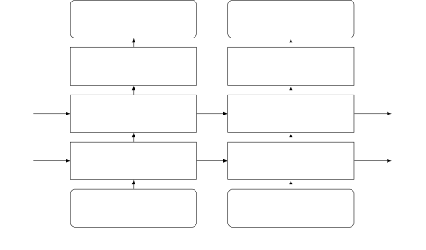

# Online Monaural Speech Enhancement Using Delayed Subband LSTM

###### Abstract

This paper proposes a delayed subband LSTM network for online monaural
(single-channel) speech enhancement. The proposed method is developed in
the short time Fourier transform (STFT) domain. Online processing
requires frame-by-frame signal reception and processing. A paramount
feature of the proposed method is that the same LSTM is used across
frequencies, which drastically reduces the number of network parameters,
the amount of training data and the computational burden. Training is
performed in a subband manner: the input consists of one frequency,
together with a few context frequencies. The network learns a
speech-to-noise discriminative function relying on the signal
stationarity and on the local spectral pattern, based on which it
predicts a clean-speech mask at each frequency. To exploit future
information, i.e. look-ahead, we propose an output-delayed subband
architecture, which allows the unidirectional forward network to process
a few future frames in addition to the current frame. We leverage the
proposed method to participate to the DNS real-time speech enhancement
challenge. Experiments with the DNS dataset show that the proposed
method achieves better performance-measuring scores than the DNS
baseline method, which learns the full-band spectra using a gated
recurrent unit network.

Xiaofei Li¹ and Radu Horaud²

¹Westlake University, Hangzhou, China  
²Inria Grenoble Rhône-Alpes, Montbonnot Saint-Martin, France

lixiaofei@westlake.edu.cn, Radu.Horaud@inria.fr

Index Terms: Online monaural speech enhancement, denoising, subband
LSTM, output-delayed network

## 1 Introduction

This paper addresses the problem of online single-channel speech
enhancement/denoising, where ’online’ means that the signal is received
and processed frame by frame. Deep-learning-based speech enhancement has
widely been studied and has largely surpassed the traditional noise
estimation and Bayesian-filtering-based methods \[1, 2\], An overview of
deep-learning-based speech enhancement methods can be found in \[3\].
These methods are often conducted in the time-frequency (TF) domain, and
use a neural network to map noisy speech spectral feature onto clean
speech targets. The input features, e.g. (logarithm) signal spectra,
cepstral coefficients and linear prediction based features, generally
represent the frame-wise full-band spectral structure of noisy speech.
The output target consists of either the clean speech (logarithm)
spectral vector or an TF mask vector to be applied to the corresponding
noisy speech frame. Various training targets are summarized in \[4\].
Recurrent neural network (RNN), especially memory enhanced RNNs, such as
long short-term memory (LSTM) \[5\] and gated recurrent units (GRUs)
\[6\], are widely used for speech enhancement to model the temporal
dynamics of the signal spectra. \[7\], one of the first works using LSTM
to perform speech enhancement, takes the logarithmic Mel-scale
spectrograms of noisy signal and clean speech as input and output,
respectively. It was shown in \[8\] that LSTM outperforms the generic
multilayer perceptron network. In \[9\], multiple-target learning was
proposed for LSTM based speech enhancement. A recent work \[10\] used
GRU to improve the computational efficiency compared to LSTM. Instead of
directly using signal features as input to RNNs, convolutional-recurrent
neural networks \[11, 12\] employ several convolutional layers prior to
the RNN layer to extract more abstract spectral representations. All
these RNN-based methods process the frame-wise full-band spectra. When
only forward RNN is used, these methods are naturally suitable for
online processing.

In this work, we propose a speech enhancement method based on an
output-delayed subband LSTM network. For each frequency, a sequence of
STFT (short-time Fourier transform) magnitude of this frequency
(together with some context frequencies) of a noisy signal input is fed
into the LSTM network, which outputs the corresponding sequence of clean
speech target at this frequency. A unique LSTM network is trained across
all frequencies, and hence is shared by all frequencies during
inference. With the aim of discriminating between speech and noise, this
subband LSTM network is designed and expected to perform on the
following grounds. First, it learns the frequency-wise signal
stationarity to discriminate between speech and stationary noise. It is
known that speech is non-stationary, while many types of noise are
relatively stationary. The temporal evolution of frequency-wise STFT
magnitude reflects the stationarity, which is the foundation for the
conventional noise power estimators \[13, 14\] and speech enhancement
methods \[1, 2\]. In our previous work \[15\], it was demonstrated that
the subband LSTM network is able to be trained as a good noise power
estimator for relatively stationary noise. In this work, we train the
subband LSTM network to directly estimate clean speech. Second, it
learns the local spectral pattern presented in the current and context
frequencies to discriminate between speech and
non-stationary/instantaneous noise. There was one attempt to use subband
feature in \[16\] to perform TF-wise speech/noise classification, which
testifies that local spectral pattern is informative for discriminating
between speech and other signals.

Exploiting a look-ahead is able to improve the performance. This causes
a processing latency, but a small latency is normally tolerable for many
applications. Bidirectional RNN is usually used for exploiting future
information, which however is difficult to use for online processing. In
this work, we adopt a simple yet effective network, i.e. output-delayed
LSTM network \[17\], to exploit the look-ahead with forward LSTM. When
training the forward LSTM network, the output sequence is set to be
delayed relative to the input sequence. To do this, the network learns
to store the future information used for inferring one frame in the
memory cell and hidden units of the forward LSTM. During inference, at
one frame, the network receives the input vector of this frame, and
predicts the speech target for one previous frame. Experiments show that
this network achieves a speech enhancement performance close to the one
of bidirectional LSTM.

Unlike the subband method of \[16\] and the aforementioned full-band
methods, the proposed one shares the same network parameters across
subbands, i.e. frequencies. This results in a drastic reduction of the
number of network parameters as well as of the size of the training
dataset. The proposed method focuses on the subband information and has
a low-dimensional input vector, which makes the proposed network less
subject to the _curse of dimensionality_ relative to the full-band
networks. The network training procedure converges normally in a few
epochs, and overfitting rarely happens, which leads to a good
generalization performance. In our previous work \[18\], we proposed to
preform multichannel speech enhancement based on subband LSTM. In this
work, we study the online single-channel (monaural) speech enhancement
problem based on subband LSTM. We experimentally testify the
effectiveness of subband LSTM for monaural speech enhancement. We
exploit the subband spectral patterns to discriminate between speech and
instantaneous noise, as \[18\] only adopts the frequency-wise
information. We develop the output-delayed LSTM network with look-ahead,
for online speech enhancement.

## 2 The Proposed Method

We consider single-channel signal in the STFT domain:

```math
x(k,t)=s(k,t)+u(k,t), \tag{1}
```

where $`k=0,\dots,K-1`$ and $`t=1,\dots,T`$ denote the frequency and
frame indices, respectively, $`x(k,t)`$, $`s(k,t)`$ and $`u(k,t)`$ are
the (complex-valued) STFT coefficients of the microphone, speech and
noise signals, respectively. The noise-free speech $`s(k,t)`$ represents
the reverberant image signal received at the microphone. This work
focuses only on the denoising task, and the target is to suppress noise
$`u(k,t)`$ and recover the reverberant speech signal $`s(k,t)`$.

### 2.1 Target and Input

To recover the speech STFT coefficients $`s(k,t)`$, one popular way is
to first predict a magnitude-based mask, such as ideal ratio mask or
magnitude ratio mask \[4\], and then reconstruct the complex-valued
coefficients using the phase of noisy signal $`x(k,t)`$. In order to
also estimate the phase of clean speech, \[19\] proposed a complex ideal
ratio mask (cIRM), defined as the ratio of the STFT coefficients between
the speech and noisy signals. The cIRM was shown in \[19\] in the
full-band framework, and is verified by our preliminary experiments in
our subband framework, to outperform the magnitude-based mask. In this
work, we directly adopt cIRM as the training target, and compute cIRM
exactly following the equations presented in \[19\]. For one TF bin, we
denote cIRM as $`\mathbf{y}(k,t)\in\mathbb{R}^{2}`$. For each frequency
bin, we aim to predict the cIRM sequence

```math
\tilde{\mathbf{y}}(k)=\big(\mathbf{y}(k,1),\dots,\mathbf{y}(k,t),\dots,\mathbf{y}(k,T)\big). \tag{2}
```

Different from the full-band framework, e.g. \[3\], (the network is
trained to learn a regression from a full-band noisy spectrum to a
full-band clean-speech target), in this work we devise a network to
learn an speech-to-noise discrimination function based on signal
stationarity and on the local spectral pattern, and then to predict the
frequency-wise clean-speech target. For one TF bin, the STFT magnitude
of the current frequency and the neighbor frequencies are concatenated
to form the input,

```math
\displaystyle\mathbf{x}(k,t)=[ \displaystyle|x(k,t)|,|x(k-1,t)|,\dots,|x(k-N,t)|,
```

```math
\displaystyle|x(k+1,t)|,\dots,|x(k+N,t)|]^{T}\in\mathbb{R}^{2N+1}, \tag{3}
```

where $`|\cdot|`$ and ^(T) denote the absolute value and transpose
operators, respectively, and $`N`$ is the number of neighbour
frequencies considered on each side. For boundary frequencies, with
$`k-N<0`$ or $`k+N>K-1`$, circular Fourier frequencies are used. For
frequency $`k`$, the input sequence is then

```math
\displaystyle\tilde{\mathbf{x}}(k)=\big(\mathbf{x}(k,1),\dots,\mathbf{x}(k,t),\dots,\mathbf{x}(k,T)\big). \tag{4}
```

In this sequence, the temporal evolution of $`|x(k,t)|`$ in (3) reflects
the signal stationarity, which is an efficient cue to discriminate
between speech and relatively stationary noise. To some extend, the
local spectral pattern encoded in $`\mathbf{x}(k,t)`$ and its temporal
dynamics is able to discriminate between speech from other
non-stationary or instantaneous noise signals.

As for training, input-target sequence pairs are generated with a
constant-length sequence. To facilitate network training, the input
sequence has to be normalized to equalize the input levels. We
empirically normalize the input sequence with the mean STFT magnitude of
the present frequency, i.e. $`\frac{1}{T}\sum_{t=1}^{T}|x(k,t)|`$.

### 2.2 Output-Delayed LSTM Network

RNN transmits the hidden units along the time steps. To avoid the
problem of exponential weight decay (or explosion) along time, LSTM
introduces an extra memory cell allowing to learn long-term dependencies
\[5\].

For online processing, the network receives and processes data one time
step at a time. A look-ahead causes a processing latency. Many of the
speech applications can tolerate tens to hundreds of milliseconds of
latency. In this work, we adopt a simple yet effective network, i.e. an
output delayed LSTM network, to exploit the look-ahead advantages.
Fig. 1 shows the network diagram used in the present work. Two layers of
unidirectional forward LSTM networks are stacked, followed by a dense
layer to output the prediction. The network input is the noisy signal
sequence defined in (4), while the network output is the cIRM sequence
defined in (2), but with a delay $`\tau`$ relative to the input
sequence. Note that the frequency index $`k`$ is omitted, since all the
frequencies share the same network with the same parameters, and is
equivalently taken as training/inference samples by the network. The
LSTM layers are trained to learn a speech/noise discriminative function
based on the signal stationarity and on the local spectral pattern, and
then to predict the target. To infer $`\mathbf{y}(t-\tau)`$, the input
of the future time steps, i.e.
$`\mathbf{x}(t-\tau+1),\dots,\mathbf{x}(t)`$, are provided. To exploit
the future time steps, instead of adopting extra backward LSTMs, this
network stores future information, used for inferring
$`\mathbf{y}(t-\tau)`$ in the memory cell and hidden units of the
forward LSTM. At inference time, the network behaves the same as the
standard LSTM, namely unrolling the forward LSTM once per time step, and
automatically exploiting the future time steps $`\tau`$.

The proposed output-delayed subband network is of relatively small in
size, namely approximatively 1.3 millions learnable parameters, due to
the fact that we focus on learning the subband information with a
relatively low-dimensional input vector. The mean squared error (MSE),
i.e. $`|\mathbf{y}(k,t)-\hat{\mathbf{y}}(k,t)|^{2}`$, is used as the
training loss, where $`\hat{\mathbf{y}}(k,t)`$ represents the
prediction.



Figure 1: Diagram of the proposed output-delayed subband LSTM network.

### 2.3 Online Inference

During inference, the signal is received and processed frame by frame,
and each frequency is processed independently and sequentially. First,
the raw input signal is normalized using the mean of the STFT magnitude,
which is recursively updated:

```math
\displaystyle\mu(k,t)=\alpha\mu(k,t-1)+(1-\alpha)|x(k,t)|, \tag{5}
```

where $`\alpha=\frac{L-1}{L+1}`$ is a smoothing parameter, with $`L`$
being the desired number of frames to be smoothed. Then the network
predicts the cIRM for bin $`(k,t-\tau)`$, using the normalized input
vector together with the memory cell and hidden units from $`t-1`$, i.e.
$`c(k,t-1)`$ and $`h(k,t-1)`$. Let $`\text{LSTM}()`$ denote one LSTM
inference, formally we have:

```math
\displaystyle\hat{y}(k,t-\tau)=\text{LSTM}\Big(\frac{\mathbf{x}(k,t)}{\mu(k,t)},c(k,t-1),h(k,t-1)\Big). \tag{6}
```

Finally, the STFT coefficients of the enhanced speech are computed using
the predicted cIRM following the equations presented in \[19\].

## 3 Experiments

### 3.1 Experimental Setup

We took part to the INTERSPEECH 2020 Deep Noise Suppression (DNS)
challenge \[20\] whose objective is real-time single-channel speech
enhancement. The clean speech dataset for training is extracted from the
audio book dataset Librivox by selecting good quality recordings, with
more than 500 hours of speech from 2,150 speakers. The noise dataset
consists of about 150 audio classes and 60,000 clips extracted from
Audioset, and 10,000 noise clips from Freesound and DEMAND databases.

| $`N`$    | noisy | 7    | 9    | 11   | 13   | 15   |
| -------- | ----- | ---- | ---- | ---- | ---- | ---- |
| PESQ     | 2.34  | 2.93 | 2.97 | 2.98 | 2.98 | 2.99 |
| STOI (%) | 89.1  | 91.3 | 91.7 | 91.7 | 91.7 | 91.7 |
| SDR (dB) | 9.1   | 14.0 | 14.4 | 14.4 | 14.6 | 14.6 |

| $`\tau`$ | 0    | 2    | 4    | 6    | 8    | 10   | bi   |
| -------- | ---- | ---- | ---- | ---- | ---- | ---- | ---- |
| PESQ     | 2.99 | 3.10 | 3.12 | 3.13 | 3.16 | 3.13 | 3.20 |
| STOI (%) | 91.7 | 92.6 | 92.7 | 93.0 | 93.1 | 93.0 | 93.3 |
| SDR (dB) | 14.6 | 15.4 | 15.4 | 15.5 | 15.6 | 15.7 | 16.5 |

Table 1: Speech enhancement results as a function of $`N`$ with
$`\tau=0`$ (_up_) and $`\tau`$ with $`N=15`$ (_bottom_). The scores are
averaged over the test sets _no_reverb_ and _with_reverb_, with SNR of
0-20 dB. ’bi’ denotes bidirectional LSTM.

|                    |                |              |
| ------------------ | -------------- | ------------ |
|                    | NSNet          | prop.        |
| Input dimension    | 771            | 31           |
| Network            | 1 Dense (500)  | 1 LSTM (384) |
|                    | 3 GRUs (500)   | 1 LSTM (256) |
|                    | 1 Dense (514)  | 1 Dense (2)  |
| Output dimension   | 514            | 2            |
| \# Parameters      | 5.1 M          | 1.3 M        |
| Training data      | 500 hours      | 20 hours     |
| \# Training epochs | $`\approx`$150 | $`\approx`$8 |

Table 2: Brief comparison between NSNet and of the proposed network.

|          |                        |       |       |                          |       |       |                     |       |       |                       |       |       |
| -------- | ---------------------- | ----- | ----- | ------------------------ | ----- | ----- | ------------------- | ----- | ----- | --------------------- | ----- | ----- |
|          | no_reverb, SNR 0-20 dB |       |       | with_reverb, SNR 0-20 dB |       |       | no_reverb, SNR 0 dB |       |       | with_reverb, SNR 0 dB |       |       |
|          | noisy                  | NSNet | prop. | noisy                    | NSNet | prop. | noisy               | NSNet | prop. | noisy                 | NSNet | prop. |
| PESQ     | 2.16                   | 2.67  | 2.84  | 2.52                     | 2.94  | 3.26  | 1.56                | 1.93  | 2.19  | 1.75                  | 2.10  | 2.40  |
| STOI (%) | 91.5                   | 94.5  | 94.4  | 86.6                     | 90.4  | 90.9  | 80.9                | 87.8  | 86.7  | 72.2                  | 80.4  | 80.0  |
| SDR (dB) | 9.1                    | 15.9  | 15.8  | 9.2                      | 15.3  | 15.1  | 0.0                 | 10.6  | 9.2   | 0.2                   | 9.8   | 8.7   |

Table 3: Speech enhancement results obtained with NSNet and with the
proposed method (with $`\tau=2`$).

Training data generation. To generate reverberant speech, two
real-recorded multichannel room impulse response (RIR) datasets are
used: (i) the Multichannel Impulse Response Database \[21\], with three
reverberation times (T60) 0.16 s, 0.36 s and 0.61 s, and (ii) the Reverb
challenge \[22\] dataset with three reverberation times 0.3 s, 0.6 s and
0.7 s. The two datasets are recorded with two different eight-channel
microphone arrays, with various microphone-to-speaker distances and
speaker directions. Single-channel RIRs are randomly selected from these
multichannel RIRs and convoluted with the clean speech clips to generate
reverberant speech. Then the reverberant speech and randomly selected
noise clips are added to generate noisy speech, with a
signal-to-noise-ratio (SNR) randomly selected from the set of
$`\{-5,0,5,10,15\}`$ dB. Using the properly modified DNS signal
generation script, a total of 20 hours of noisy speech signals are
generated for training, from which 5 hours of data are
reverberation-free speech. The signals are transformed to the STFT
domain using a 512-sample (32 ms) Hanning window with a frame step of
256 samples. The sequence length for training is set to $`T=192`$ frames
(about 3 s). The training sequences are picked out from the clip-level
signals with 50% overlap for two adjacent sequences. In total, about
11.1 million training sequences are generated. It is obvious that the
amount of training data, i.e. 20 hours, is way less than the amount
provided in the DNS dataset, which means that only a small part of the
DNS data are used. Such a small amount of training data is already able
to provide a rich set of subband spectral patterns.

Test data. The DNS challenge provides a publicly available test set
including two categories of synthetic clips, i.e. without and with
reverberations. Each category has 150 noisy clips with SNR levels
distributed between 0 dB to 20 dB. In addition to these data, for each
category, we generate one new group of noisier speech by remixing the
test clean speech and noise, all with SNR of 0 dB.

Implementation details. We use Keras \[23\] to implement the proposed
method. The Adam optimizer \[24\] is used with a learning rate of 0.001.
The batch size is set to 512. The training sequences were shuffled. The
number of train epochs is empirically set to 8. For speech enhancement,
one clip of test data is processed frame by frame. The online inference
is implemented using the stateful LSTM to transmit the memory cell and
hidden units. The function ’predict_on_batch’ is used to process all
frequencies. The smoothing factor $`\alpha`$ is set with $`L=192`$.

### 3.2 Experimental Results

Three performance metrics are used, i) perceptual evaluation of speech
quality (PESQ) \[25\]; ii) short-time objective intelligibility (STOI)
\[26\]; and iii) signal-to-distortion ratio (SDR) \[27\] in dB. For all
metrics, the larger the better. ¹¹ 1 Please visit
https://team.inria.fr/perception/research/onlinese-lstm/ for subjective
test on audio clips.

Setting the number of context frequencies. To predict the mask for one
single frequency, $`N`$ neighbour frequencies for each side are adopted
as the network input to exploit the subband spectral pattern that is
able to discriminate between speech and noise. Table 1 (up) shows the
performance as a function of $`N`$. It is seen that, with the increasing
of $`N`$, the performance measures increase and converge until $`N=15`$.
This means, in the present framework, the network needs $`2N+1=31`$
frequencies (about 969 Hz) to fully exploit the subband spectral
pattern. $`N`$ is set to 15 for the following experiments.

Experiments with output delay. The network output is set as a delayed
sequence relative to the input sequence. This allows the unidirectional
forward LSTM to exploit future information, and to facilitate the online
processing with a look-ahead. Table 1 (bottom) shows the performance as
a function of $`\tau`$. It is seen that the performance measures
noticeably increase with increasing $`\tau`$, until $`\tau=8`$. When a
larger $`\tau`$ is set, e.g. $`\tau=10`$, the performance measures
decrease, which is possibly due to the fact that more look-ahead frames
do not provide more useful information, but increase the training
difficulty. The last column in this table presents the results of
bidirectional LSTM which is only suitable for offline applications. It
is unsurprising that the performance measures of the output delayed LSTM
are lower the ones of bidirectional LSTM, but the performance gap is
small, especially for PESQ and STOI. This indicates that even if the
output-delayed LSTM can not fully exploit the future information, it is
still very efficient.

Comparison with the DNS baseline method. The DNS challenge baseline
method, i.e. NSNet \[10\], is similar with the proposed method in the
sense that both methods use RNN to perform the so-called single-frame-in
and single-frame-out online speech enhancement. The main difference is
that NSNet takes as input the full-band noisy spectra and outputs the
full-band speech mask, while the proposed network takes as input the
subband noisy spectra and outputs the frequency-wise speech mask. Thence
NSNet provides a perfect comparison method that can demonstrate the
difference between the full-band and subband frameworks. We use the
_dns_challenge_ recipe provided in the asteroid toolkit ²² 2
https://github.com/mpariente/asteroid/tree/master/egs/dns_challenge to
implement NSNet. The configurations provided in the recipe are used,
except that the training data are generated with reverberations and SNRs
following the principles used for the proposed method. A complex network
is trained, which takes as input the complex and magnitude spectra and
output the complex mask. Table 2 briefly summarizes NSNet and the
proposed network. Since NSNet learns the full-band spectra, it requires
a larger network and more training resources than the proposed subband
network.

According to the rule of the DNS challenge that a maximum of 40 ms
look-ahead can be used, we submitted enhanced signals yielded by the
proposed method with $`\tau=2`$, which exploits two future frames to
enhance the current frame, and uses a $`16\times 2=32`$ ms look-ahead.
Table 3 shows the performance of NSNet and of our submissions. The
comparison between NSNet and the proposed method is quite consistent
across the four different reverberant and noisy conditions. NSNet
slightly outperforms the proposed method in terms of SDR and STOI, and
the superiority is more noticeable for the low SNR cases (with SNR=0
dB). This indicates that the full-band spectra is indeed more
discriminative than the subband spectra in the aspect of suppressing the
noise level. The proposed method yields higher PESQ scores than NSNet by
a large margin. The reasons for this could be that (i) the proposed
method discriminates between speech and noise highly relying on the
signal stationarity, and thus is especially superior to suppress
relatively stationary/continuous noise, and that (ii) NSNet predicts the
speech mask of all frequencies together, for which the prediction errors
are correlated and structured along frequencies, which leads to
noticeable speech or noise distortion. By contrast, the proposed method
processes frequencies independently, hence the prediction errors are
likely to be independent as well. By some informal listening test, the
enhanced signals of the proposed method sound smoother and more natural
than NSNet. Moreover, the suppressed noise is rarely distorted by the
proposed method. By the listening test, the proposed method suppresses
the noise level and does not introduce other unpleasant sound effects.

Inference was run on an Intel i5-1035G1 quad core CPU with a base
frequency of 1.0 GHz. The computation of per STFT frame takes 7.0 ms,
which is in real-time. The DNS Challenge has announced the P.808
subjective evaluation results on a blind noisy test set (consists of
both synthetic and real data). The Mean Opinion Scores (MOS) of the
noisy set is 3.01, and the one of the proposed method is 3.32, which
ranks the 4th place out of the 16 Real-Time track submissions.

## 4 Conclusion

We proposed an online monaural speech enhancement method based on a
delayed subband LSTM network. Focusing on one frequency at a time, the
proposed network requires a small amount of training data and of
resources. Promising speech denoising results were achieved, which
testifies that subband information, i.e. signal stationarity and local
spectral patterns, is indeed discriminative for the task at hand. The
output-delayed scheme provides a computationally efficient yet
performant way to exploit the look-ahead potential.

## References

- \[1\] Y. Ephraim and D. Malah, “Speech enhancement using a
  minimum-mean square error short-time spectral amplitude estimator,”
  _IEEE Transactions on Acoustics, Speech and Signal Processing_,
  vol. 32, no. 6, pp. 1109–1121, 1984.
- \[2\] I. Cohen and B. Berdugo, “Speech enhancement for non-stationary
  noise environments,” _Signal processing_, vol. 81, no. 11, pp.
  2403–2418, 2001.
- \[3\] D. Wang and J. Chen, “Supervised speech separation based on deep
  learning: An overview,” _IEEE/ACM Transactions on Audio, Speech, and
  Language Processing_, vol. 26, no. 10, pp. 1702–1726, 2018.
- \[4\] Y. Wang, A. Narayanan, and D. Wang, “On training targets for
  supervised speech separation,” _IEEE/ACM Transactions on Audio,
  Speech, and Language Processing_, vol. 22, no. 12, pp.
  1849–1858, 2014.
- \[5\] S. Hochreiter and J. Schmidhuber, “Long short-term memory,”
  _Neural computation_, vol. 9, no. 8, pp. 1735–1780, 1997.
- \[6\] K. Cho, B. Van Merriënboer, C. Gulcehre, D. Bahdanau,
  F. Bougares, H. Schwenk, and Y. Bengio, “Learning phrase
  representations using RNN encoder-decoder for statistical machine
  translation,” _arXiv:1406.1078_, 2014.
- \[7\] F. Weninger, F. Eyben, and B. Schuller, “Single-channel speech
  separation with memory-enhanced recurrent neural networks,” in _IEEE
  International Conference on Acoustics, Speech and Signal Processing
  (ICASSP)_, 2014, pp. 3709–3713.
- \[8\] J. Chen and D. Wang, “Long short-term memory for speaker
  generalization in supervised speech separation,” _The Journal of the
  Acoustical Society of America_, vol. 141, no. 6, pp. 4705–4714, 2017.
- \[9\] L. Sun, J. Du, L.-R. Dai, and C.-H. Lee, “Multiple-target deep
  learning for lstm-rnn based speech enhancement,” in _2017 Hands-free
  Speech Communications and Microphone Arrays_. IEEE, 2017, pp. 136–140.
- \[10\] Y. Xia, S. Braun, C. K. A. Reddy, H. Dubey, R. Cutler, and
  I. Tashev, “Weighted speech distortion losses for neural-network-based
  real-time speech enhancement,” in _IEEE International Conference on
  Acoustics, Speech and Signal Processing_, 2020, pp. 871–875.
- \[11\] K. Tan and D. Wang, “A convolutional recurrent neural network
  for real-time speech enhancement.” in _Interspeech_, vol. 2018, 2018,
  pp. 3229–3233.
- \[12\] A. Li, C. Zheng, and X. Li, “Convolutional recurrent neural
  network based progressive learning for monaural speech enhancement,”
  _arXiv preprint arXiv:1908.10768_, 2019.
- \[13\] T. Gerkmann and R. C. Hendriks, “Unbiased MMSE-based noise
  power estimation with low complexity and low tracking delay,” _IEEE
  Transactions on Audio, Speech, and Language Processing_, vol. 20,
  no. 4, pp. 1383–1393, 2012.
- \[14\] X. Li, L. Girin, S. Gannot, and R. Horaud, “Non-stationary
  noise power spectral density estimation based on regional statistics,”
  in _IEEE International Conference on Acoustics, Speech and Signal
  Processing_, 2016, pp. 181–185.
- \[15\] X. Li, S. Leglaive, L. Girin, and R. Horaud, “Audio-noise power
  spectral density estimation using long short-term memory,” _IEEE
  Signal Processing Letters_, 2019.
- \[16\] Y. Wang, K. Han, and D. Wang, “Exploring monaural features for
  classification-based speech segregation,” _IEEE Transactions on Audio,
  Speech, and Language Processing_, vol. 21, no. 2, pp. 270–279, 2013.
- \[17\] J. S. Turek, S. Jain, M. Capota, A. G. Huth, and T. L. Willke,
  “A single-layer RNN can approximate stacked and bidirectional RNNs,
  and topologies in between,” _arXiv:1909.00021_, 2019.
- \[18\] X. Li and R. Horaud, “Multichannel speech enhancement based on
  time-frequency masking using subband long short-term memory,” in _IEEE
  Workshop on Applications of Signal Processing to Audio and Acoustics_,
  2019, pp. 298–302.
- \[19\] D. S. Williamson, Y. Wang, and D. Wang, “Complex ratio masking
  for monaural speech separation,” _IEEE/ACM Transactions on Audio,
  Speech, and Language Processing_, vol. 24, no. 3, pp. 483–492, 2016.
- \[20\] C. K. A. Reddy, E. Beyrami, H. Dubey, V. Gopal, R. Cheng,
  R. Cutler, S. Matusevych, R. Aichner, A. Aazami, S. Braun, P. Rana,
  S. Srinivasan, and J. Gehrke, “The Interspeech 2020 deep noise
  suppression challenge: Datasets, subjective speech quality and testing
  framework,” 2020.
- \[21\] E. Hadad, F. Heese, P. Vary, and S. Gannot, “Multichannel audio
  database in various acoustic environments,” in _IEEE International
  Workshop on Acoustic Signal Enhancement_, 2014, pp. 313–317.
- \[22\] K. Kinoshita, M. Delcroix, S. Gannot, E. A. Habets,
  R. Haeb-Umbach, W. Kellermann, V. Leutnant, R. Maas, T. Nakatani,
  B. Raj _et al._, “A summary of the reverb challenge: state-of-the-art
  and remaining challenges in reverberant speech processing research,”
  _EURASIP Journal on Advances in Signal Processing_, vol. 2016, no. 1,
  p. 7, 2016.
- \[23\] F. Chollet _et al._, “Keras,”
  https://github.com/fchollet/keras, 2015.
- \[24\] D. P. Kingma and J. Ba, “Adam: A method for stochastic
  optimization,” in _International Conference on Learning
  Representations_, 2015.
- \[25\] A. W. Rix, J. G. Beerends, M. P. Hollier, and A. P. Hekstra,
  “Perceptual evaluation of speech quality (PESQ)-a new method for
  speech quality assessment of telephone networks and codecs,” in _IEEE
  International Conference on Acoustics, Speech, and Signal Processing_,
  vol. 2, 2001, pp. 749–752.
- \[26\] C. H. Taal, R. C. Hendriks, R. Heusdens, and J. Jensen, “An
  algorithm for intelligibility prediction of time–frequency weighted
  noisy speech,” _IEEE Transactions on Audio, Speech, and Language
  Processing_, vol. 19, no. 7, pp. 2125–2136, 2011.
- \[27\] E. Vincent, R. Gribonval, and C. Févotte, “Performance
  measurement in blind audio source separation,” _IEEE Transactions on
  Audio, Speech, and Language Processing_, vol. 14, no. 4, pp.
  1462–1469, 2006.
