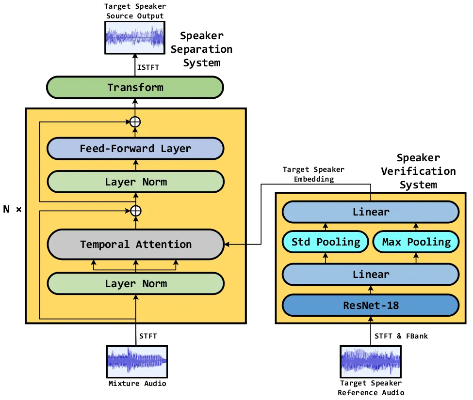
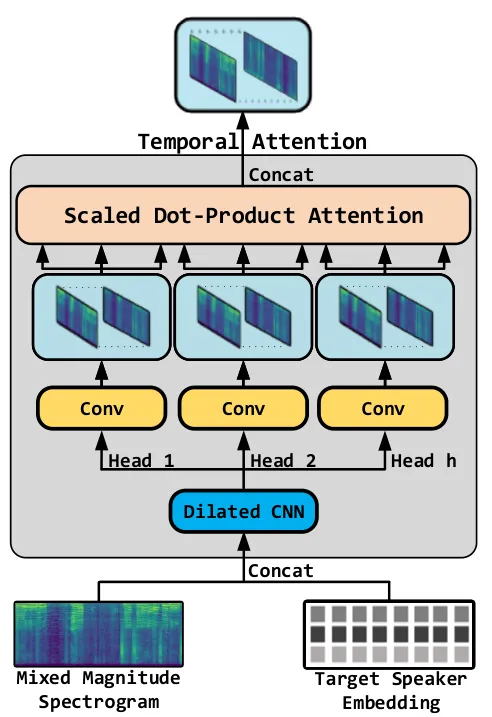

# Atss-Net: Target Speaker Separation via Attention-based Neural Network

###### Abstract

Recently, Convolutional Neural Network (CNN) and Long short-term memory
(LSTM) based models have been introduced to deep learning-based target
speaker separation. In this paper, we propose an Attention-based neural
network (Atss-Net) in the spectrogram domain for the task. It allows the
network to compute the correlation between each feature parallelly, and
using shallower layers to extract more features, compared with the
CNN-LSTM architecture. Experimental results show that our Atss-Net
yields better performance than the VoiceFilter, although it only
contains half of the parameters. Furthermore, our proposed model also
demonstrates promising performance in speech enhancement.

Tingle Li^(1,3), Qingjian Lin¹, Yuanyuan Bao¹, Ming Li^(1,2)

¹Data Science Research Center, Duke Kunshan University, Kunshan, China  
²School of Computer Science, Wuhan University, Wuhan, China  
³School of Computer Science and Technology, Tiangong University,
Tianjin, China

ming.li369@dukekunshan.edu.cn

Index Terms: Attention Mechanism, Target Speaker Separation, Speech
Enhancement, Speaker Verification

## 1 Introduction

We humans have the ability to focus on a target voice in the room where
the noises are all around \[1\], namely “cocktail party effect”, but
machines have great difficulties in this task. However, this capability
is essential in many back-end application, e.g. speaker verification
\[2\], speaker diarization \[3\] and speech recognition \[4, 5, 6\].

Recently, a technique called blind speech separation was proposed to
solve the aforementioned problem. Given a mixed utterance, this
technique can automatically separate it into several different clean
utterances that make it up. Specifically, the current DNN-based blind
speech separation methods, such as Time-domain Audio Source Separation
(Tas-Net) \[7, 8, 9\], Dual-path RNN (DPRNN) \[10\], which directly
model in the time-domain, have achieved good separation performance.
However, these methods require the number of speakers to be known in
advance, making it difficult to be applied in real world applications.
In order to aggregate the exact number of speaker clusters using the
K-Means algorithm, such methods like Deep clustering (DPCL) \[11, 12\]
and Deep Attractor Network (DANet) \[13\], need to be given the number
of speakers in advance while in the inference phase.

Target speaker separation is one of the methods that address the above
problem \[2, 14\]. Given a reference utterance of the target speaker,
and a mixed utterance containing the target speaker, the target speaker
separation system aims at filtering out the target speaker’s voice from
the mixed utterance. This technique is very useful when the back-end
tasks only need the utterance of the target speaker. For example, in the
keyword spotting task, supposing the user wakes up the devices in a
restaurant, this technique can easily separate the speaker from
background babble noise, if the speaker’s voice is recorded in advance.

How to utilize the reference speech of the target speaker to handle the
mixed signals is still a very challenging task. Recent successful
studies \[2, 14\] extract speaker embeddings like i-vector \[15\] from
the target utterance and concatenate with acoustic features in each
frame. And then feed it into an LSTM layer together with the mixed
spectrogram that passing through CNNs. However, this method has some
limitations. First, it is difficult for LSTM to perform parallelized
computation. Second, deeper CNN layers are used to acquire a wider
receptive field, which means the number of model parameters is large.

The attention mechanism \[16\] is a recent advance in neural network
modeling. It learns one coefficient for every feature, which enables
feature interactions that contribute differently to the final
prediction. Besides, the importance of the feature interaction is
automatically learned from data without any human domain knowledge.
Recently, the attention-based methods \[17, 18\] have been proposed for
the source separation task, which outperforms most of the
state-of-the-art methods. Experimental results in \[18\] show that the
attention mechanism is suitable for processing spectrogram, because it
can be easily computed parallelly and solves long-term dependency
problems well. Also, the attention mechanism allows us to use shallower
CNNs for even better separation performance, compared with the CNN-LSTM
architecture.

In this work, we try to explore the attention mechanism in the target
speaker separation task, and propose an attention-based neural network
model named Atss-Net. Experimental results show that Atss-Net has
achieved a new state-of-the-art result, on the same dataset as in
\[14\]. Moreover, in order to evaluate the potential speech enhancement
performance of our Atss-Net, we also added noise data such as pure
music, songs (contain the voice of singers), TV noise, and so on.

## 2 Target Speaker Separation

The target speaker separation system consists of two parts: (1) speaker
verification system, where we extract the deep speaker embedding of the
target speaker from the reference speech signal; (2) speaker separation
system, where we input the target speaker’s embedding and the mixed
spectrogram to generate the separated target speaker’s spectrogram from
the mixed one. These two systems are trained separately. The flow chart
is shown in Figure 1.

Figure 1: The flow chart of our separation system.

### 2.1 Speaker Verification System

In our system, text-independent speaker verification serves as a
discriminator, which judges which speaker’s utterance should be
separated out from the mixed utterance. Given a clean reference
utterance of the target speaker, we extract 64-dimensional
log-Mel-filterbank features (Fbank) with 25 ms frame length and 10 ms
frameshift and use a frame-level energy-based voice activity detector
(VAD) to filter out non-speech frames. Finally, we feed the features to
a speaker verification system and get the target speaker embedding
$`\bm{e}_{j}\in\mathbb{R}^{1\times\ddot{F}}`$, where $`\ddot{F}`$ is the
dimension of the frequency bins, and $`j`$ denotes the source of the
target speaker.

### 2.2 Target Speaker Separation System

Our network operates in the spectrogram domain as the baseline \[14\]
did. The mixed utterance can be defined as a linear combination of C
speaker sources $`s_{1}(t),...,s_{c}(t)`$, where
$`s_{i}\in\mathbb{R}^{1\times\widetilde{T}}`$, and $`\widetilde{T}`$ is
the duration of the utterance.

```math
x(t)=\sum_{i=1}^{c}s_{i}(t) \tag{1}
```

Then we perform the short-time Fourier transform (STFT) to get the
spectrograms, so the sum of each source spectrogram $`S_{i}(t,f)`$
combines into mixed spectrogram
$`X(t,f)\in\mathbb{R}^{T\times\bar{F}}`$, where $`T`$ and $`\bar{F}`$
are the dimension of time and frequency bin axes respectively.

```math
X(t,f)=\sum_{i=1}^{c}S_{i}(t,f) \tag{2}
```

Besides, we need to input the target speaker embedding
$`\bm{e}_{j}\in\mathbb{R}^{1\times\ddot{F}}`$ to the model
($`1\!\leq\!j\!\leq\!c`$). So we duplicate the speaker embedding for
$`T`$ times to get the extended target speaker embedding
$`E_{j}(t,f)\in\mathbb{R}^{T\times\ddot{F}}`$.

Similar to the baseline \[14\], we assume the phase of the mixture is
the same as that of the separated utterance, so we only input the
magnitude spectrogram $`|X(t,f)|`$ to the model together with the
extended target speaker embedding $`E_{j}(t,f)`$ to estimate the
time-frequency mask $`M_{j}`$.

```math
M_{j}(t,f)=g(|X(t,f)|,E_{j}(t,f)) \tag{3}
```

where $`g(t,f)`$ is the target speaker separation system.

Therefore, the estimated magnitude spectrogram
$`|\widehat{X}_{j}(t,f)|`$ is calculated by performing the element-wise
product between the mixed magnitude spectrogram and the estimated
time-frequency mask.

```math
|\widehat{X}_{j}(t,f)|=|X(t,f)|\odot M_{j}(t,f)) \tag{4}
```

where $`\odot`$ denotes the element-wise product operation.

So this task can be denoted as minimizing the squared $`l_{2}`$-norm
between the ground truth and the estimated magnitude:

```math
\mathcal{L}=\underset{M}{\arg\min}\left\||X_{j}(t,f)|-|\widehat{X}_{j}(t,f)|\right\|_{2}^{2} \tag{5}
```

In addition, the reconstruction of time domain target speaker signal
$`\widehat{s}_{j}`$ is accomplished by combining the estimated magnitude
spectrogram and the mixed phase to perform inverse short-time Fourier
transform (ISTFT), which is:

```math
\widehat{s}_{j}(t)=\mathrm{ISTFT}(|\widehat{X}_{j}(t,f)|\times e^{\angle X(t,f)i}) \tag{6}
```

where $`\angle X(t,f)`$ is the phase of mixed utterance.

## 3 The proposed Atss-Net

As shown in Figure 2, the speaker verification system in our Atss-Net is
based on \[19\]. And the speaker separation system consists of $`N`$
Attention blocks and a Transform block. Specifically, each Attention
block consists of a Multi-Head Temporal Scaled Dot-Product Attention
layer (Section 3.2-3.4), a Feed-Forward layer (Section 3.5), and two
Layer Normalization layers (Section 3.6). The Transform block includes a
dense layer and a CNN layer with the kernel size $`3\times 3`$, which
aims to compress the channel dimension of the feature maps form
$`d_{k}`$ to $`1`$ and generate the estimated mask.



Figure 2: Model architecture of the Atss-Net.

### 3.1 Deep ResNet-based Speaker Embedding

Our deep speaker embedding extraction module includes a ResNet-18 front
end \[20\], two parallelized pooling layers and two linear layers.
First, the ResNet-18 module transforms L-frames Fbanks to feature maps,
with the channel settings of {16, 32, 64, 128}, the kernel size of
$`3\times 3`$ and the padding size of 1. For each channel, the
mean-pooling and standard-pooling are applied respectively, and the
outputs are concatenated together. Then, we feed the output into two
linear layers and the softmax function sequentially, generating speaker
likelihoods. The size of the second linear layer equals the number of
speakers in the training data. While in the inference phase, the second
linear layer will be removed and the output of the first linear layer
will be used as the target speaker embedding.

### 3.2 Scaled Dot-Product Attention

Self-Attention is a mechanism that can relate different time steps of
each magnitude feature map to compute their representations. There are
many types of attention mechanisms \[21, 22, 23\], and here we use the
dot-product \[23\]. In our model, the magnitude feature maps are
separately input to three different CNN layers with the kernel size
$`1\times 1`$, to get the query $`Q`$, keys $`K`$, and values $`V`$
respectively. Then, we compute the dot products of the query $`Q`$ with
keys $`K`$, divide each by $`\sqrt{d_{k}}`$, where $`d_{k}`$ is the
channel dimension of the magnitude feature maps. Finally, a softmax
function is applied to obtain the weights on the values V. The output of
dot-product attention is computed as:

```math
\mathrm{Attention}({Q},{K},{V})=\mathrm{softmax}\left({\frac{{{Q}{{K}^{T}}}}{{\sqrt{{d_{k}}}}}}\right){V} \tag{7}
```

where $`1/\sqrt{d_{k}}`$ is used to prevent softmax function into
regions that have very small gradients.

### 3.3 Multi-Head Attention

Since the duration of each utterance is short, we need to find a way to
make full use of sampling features and compute the attention value more
precisely. Multi-Head Attention is a good option. Specifically, it
performs Scaled Dot-Product Attention for $`h`$ times repeatedly, then
concatenates all the results following the channel axis, and finally
performs convolution to restore the origin shapes. The formula is as
follows:

```math
\begin{split}\mathrm{MultiHead}({Q},{K},{V})=\mathrm{Concat}(\mathrm{head}_{1},\mathrm{head}_{2},\\
\cdots,\mathrm{head}_{i},\cdots,\mathrm{head}_{h})\cdot W^{O}\end{split} \tag{8}
```

where
$`\mathrm{head}_{i}=\mathrm{Attention}(Q\!\cdot\!{W_{i}}^{Q},K\!\cdot\!{W_{i}}^{K},V\!\cdot\!{W_{i}}^{V})`$,
$`W^{Q},W^{K},W^{V}`$ are there different CNN layers with the kernel
size $`1\times 1`$ and $`W^{O}`$ is a CNN layer with the kernel size
$`3\times 3`$.

### 3.4 Temporal Attention

The architecture of Temporal Attention (TA) is shown in Figure 3.
Specifically, we first concatenate the mixed magnitude spectrogram
$`|X(t,f)|\in\mathbb{R}^{T\times\bar{F}}`$and the extended target
speaker embedding $`E_{j}(t,f)\in\mathbb{R}^{T\times\ddot{F}}`$
following the frequency bin axis to get the output
$`R(t,f)\in\mathbb{R}^{T\times F}`$, and $`F=\bar{F}+\ddot{F}`$:

```math
R(t,f)=\mathrm{Concat}(|X(t,f)|,E_{j}(t,f)) \tag{9}
```

where $`|X(t,f)|`$ and $`E_{j}(t,f)`$ are the magnitude of the mixed
spectrogram and extended speaker embedding respectively.

Then, a group of Dilated CNN (DCNN) layers \[24\] is employed as the
feature extractor, where details can be seen in Table 1. After that,
Multi-Head Attention is performed on the frequency bin axis, and each
head stores the complete temporal information. The formulas are as
follows:

```math
\displaystyle Q^{\prime},K^{\prime},V^{\prime}=\mathrm{DCNN}(R(t,f)) \tag{10}
```

```math
\displaystyle\mathrm{TA}=\mathrm{MultiHead}(Q^{\prime},K^{\prime},V^{\prime}) \tag{11}
```



Figure 3: Model architecture of the Temporal Attention.

| Layer | Kernel Size   | Dilation       | Output Channel |
| ----- | ------------- | -------------- | -------------- |
| CNN 1 | $`5\times 5`$ | $`1\times 1`$  | 64             |
| CNN 2 | $`5\times 5`$ | $`2\times 1`$  | 64             |
| CNN 3 | $`5\times 5`$ | $`4\times 1`$  | 64             |
| CNN 4 | $`5\times 5`$ | $`8\times 1`$  | 64             |
| CNN 5 | $`5\times 5`$ | $`16\times 1`$ | 64             |
| CNN 6 | $`1\times 1`$ | $`1\times 1`$  | 64             |

Table 1: Parameters of Dilated CNN.

### 3.5 Feed-Forward Layer

Feed-Forward layer is another core module of our Atss-Net. It contains
two linear transformations with a ReLU activation \[25\] in between. The
dimensions of input and output magnitude feature maps are
$`\mathbb{R}^{d_{k}\times T\times F}`$, and the dimension of the hidden
layer is $`\mathbb{R}^{d_{k}\times T\times\widetilde{F}}`$, where
$`\widetilde{F}`$ is four times as much as $`F`$. The computing formula
is as follows:

```math
\mathrm{FFN}(x)=\max\left(0,xW_{1}+b_{1}\right)W_{2}+b_{2} \tag{12}
```

where x is the output of Temporal Attention (TA) module ,
$`W_{1}\in\mathbb{R}^{F\times\widetilde{F}}`$,
$`W_{2}\in\mathbb{R}^{\widetilde{F}\times F}`$ and the biases
$`b_{1}\in\mathbb{R}^{\widetilde{F}}`$, $`b_{2}\in\mathbb{R}^{F}`$.

### 3.6 Layer Norm

Layer Normalization and residual connection are employed to each
sub-block for effective training. So the output of each sublayer is:

```math
x+\mathrm{Sublayer}(\mathrm{LayerNorm}(x)) \tag{13}
```

where $`\mathrm{Sublayer}(x)`$ could be the Temporal Attention module,
and the Feed-Forwawrd layer module.

## 4 Experiment Setup

### 4.1 Data Description

#### 4.1.1 Voxcelab Dataset

Voxceleb \[26\] is a large text-independent speaker verification dataset
that includes more than 100,000 words from 1251 celebrities “in the
wild”. We use the official split training and validation set together as
our development dataset. Specifically, there are 1211 celebrities in the
training dataset, while the test dataset contains 4715 utterances from
the rest 40 celebrities. Also, there are 37720 pairs of trials in total,
where 18860 are true trials. And our system has a 2.97% equal error rate
(EER) on this test dataset.

#### 4.1.2 Librispeech Dataset

The Librispeech dataset \[27\] is used for the target speaker separation
task as the baseline \[14\] did, where the training set contains 2338
speakers, and the test set contains 73 speakers. Also, each utterance
contains the voice of one speaker.

In detail, the training set and test set are generated on-the-fly as
follows: (1) randomly select two speakers from the speaker list that
\[14\] provided; (2) for each speaker, randomly sample utterances with
3s. (3) use the FFmpeg¹¹ 1
[https://github.com/FFmpeg/FFmpeg/](https://github.com/FFmpeg/FFmpeg/)
to normalize the volume of selected utterances and mix them.

#### 4.1.3 AISHELL-2 Dataset

AISHELL-2 \[28\] is a Chinese Mandarin dataset that contains 1991
speakers and 87456 utterances in total, and the duration of each
utterance is varied from 2s to 10s. And we use it for speech enhancement
experiments here. Specifically, we randomly selected 1951 speakers and
85000 utterances for training, and the others for testing. When it comes
to the background noise, we picked 50 pure music from the CCMixter
dataset \[29\], 150 English songs from the MUSDB18 dataset \[30\], 25
Chinese songs and 200 far-field TV utterances from the Internet, in a
total of 425 utterances.

The mixed utterances are simulated on-the-fly in 3 steps: (1) randomly
select one speaker from the speaker list, and then randomly select two
utterances of that speaker; utterance one is used as a referenced
utterance, and utterance two is used to mix with background noise; (2)
randomly select one utterance from the noise list, then randomly cut it
to the same dimension as the selected speaker’s utterance two; (3) mix
these two utterances using the signal-to-noise ratio (SNR) uniformly
sampled from 5dB to 20dB.

### 4.2 Training Setup

We train the model using PyTorch \[31\] with 4 NVIDIA TITAN RTX GPU. In
order to compare our model with the baseline \[14\], the hyperparameters
of our model are roughly consistent with \[14\]. Specifically, the frame
length and frame step of the STFT are set to 400 and 160 respectively
and a 512-point discrete Fourier transform is performed. Also, the
networks are trained to estimate the magnitude spectrogram using the
Adam optimizer \[32\], with an initial learning rate of 0.0001. Also,
due to the limitation of the GPU memory, we can only train Atss-Net with
3 Temporal Attention modules, 2 heads and 64 channel dimensions.
Besides, we set the batch size to 16 and set the maximum epoch to 50. If
the validation loss does not descend after 10 epoch, the early stop will
be performed and the training phase will stop. Last but not least, we
use signal-to-distortion ratio (SDR) \[33\] as the evaluation metric for
target speaker separation, and use the perceptual evaluation of speech
quality (PESQ) ITU-T P.862 \[34\] to evaluate the speech enhancement
performance. For both PESQ and SDR metrics, the higher number indicates
the better performance.

## 5 Results

### 5.1 Target Speaker Separation Experiment

Since the baseline \[14\] is not open source, we try to build this
system ourselves. In our implementation of \[14\], the initial SDR value
(1.26dB) and the evaluated result (9.04dB) are different from that in
\[14\], which are 10.1dB and 17.9dB respectively. However, the
improvement of SDR value (7.78dB) in our implementation is the same as
in \[14\] (7.8dB). As shown in Table 3, VoiceFilter \[14\] is the
baseline that we implemented, and the Atss-Net is the model we proposed.
Specifically, the SDR value that our model improved is 9.30dB, while the
baseline is 7.78dB. Therefore, our proposed model outperforms the
baseline method. Moreover, the parameters of our model (4.68M) are
nearly 50% less than the baseline (9.45M).

Furthermore, compared with using attention blocks (9.30dB), the SDR gain
of Atss-Net without them (3.88dB) is relatively low, which indicates the
effectiveness of the attention mechanism used here. Meanwhile, we
compare our model with the model using the permutation invariant
training (PIT) loss \[35\]. This model has the same architecture as the
Atss-Net, except that there is no speaker embedding as input. In this
case, this PIT architecture needs to know the exact number of speakers
in advance, and chooses the output that is the closest to the ground
truth, i.e., with the lowest loss value. As shown in Table 3, using PIT
loss to train the model (8.57dB) is not as good as directly using the
target speaker embedding too.

| Evaluation Metric  |                     PESQ |      |      |      |
| ------------------ | ------------------------ | ---- | ---- | ---- |
| Test SNR           | 5                        | 10   | 15   | 20   |
| Origin             | 1.23                     | 1.45 | 1.84 | 2.45 |
| VoiceFilter \[14\] | 1.83                     | 2.13 | 2.41 | 2.62 |
| Atss-Net           | 2.06                     | 2.42 | 2.87 | 3.22 |

Table 2: System performance in the speech enhancement experiment on
AISHELL-2 dataset.

|                    |          |                      |       |          |
| ------------------ | -------- | -------------------- | ----- | -------- |
| Model              | \# Param |             Mean SDR |       |          |
|                    |          | Before               | After | Improved |
| VoiceFilter \[14\] | 9.45M    | 1.26                 | 9.04  | 7.78     |
| Atss-Net (w/o Att) | 0.65M    | 1.26                 | 5.14  | 3.88     |
| Atss-Net (PIT)     | 4.68M    | 1.26                 | 9.83  | 8.57     |
| Atss-Net           | 4.68M    | 1.26                 | 10.56 | 9.30     |

Table 3: System performance in the target speaker separation experiment
on Librispeech dataset.

### 5.2 The Speech Enhancement Experiment

Table 2 summarizes the PESQ²² 2
[https://github.com/ludlows/python-pesq](https://github.com/ludlows/python-pesq)
performance of our method under different SNR conditions for speech
enhancement. Besides, some listening samples are available online³³ 3
[https://tinglok.netlify.com/files/interspeech2020/](https://tinglok.netlify.com/files/interspeech2020/).
From the samples we can see that our Atss-Net can achieve good speech
enhancement performance, even there is a singer’s voice and music in the
background. This supports our claim that adding the target speaker
embedding as an auxiliary input to the separation network can
effectively extract the target speaker’s voice from various kinds of
vocal background noises for speech enhancement.

## 6 Conclusions

In this paper, we propose an Attention-based neural network for target
speaker separation, namely the Atss-Net, which achieves better SDR
performance compared with the baseline VoiceFilter. Besides, we do an
experiment to prove that adding speaker embedding as an auxiliary input
can potentially gain good speech enhancement performance with vocal
background noises. For future works, we plan to model the task directly
in the time-domain, so that the difference of the phase between the
mixed and clean utterance will not be mismatched.

## 7 Acknowledgements

This research is funded in part by the National Natural Science
Foundation of China (61773413), Key Research and Development Program of
Jiangsu Province (BE2019054), Six talent peaks project in Jiangsu
Province (JY-074), Science and Technology Program of Guangzhou, China
(202007030011, 201903010040).

## References

- \[1\] E. C. Cherry, “Some experiments on the recognition of speech,
  with one and with two ears,” _The Journal of the acoustical society of
  America_, vol. 25, no. 5, pp. 975–979, 1953.
- \[2\] W. Rao, C. Xu, E. S. Chng, and H. Li, “Target speaker extraction
  for overlapped multi-talker speaker verification,” in _Interspeech_,
  2019, pp. 1273–1277.
- \[3\] G. Sell, D. Snyder, A. McCree, D. Garcia-Romero, J. Villalba,
  M. Maciejewski, V. Manohar, N. Dehak, D. Povey, S. Watanabe _et al._,
  “Diarization is hard: Some experiences and lessons learned for the jhu
  team in the inaugural dihard challenge.” in _Interspeech_, 2018, pp.
  2808–2812.
- \[4\] J. Li, L. Deng, R. Haeb-Umbach, and Y. Gong, _Robust automatic
  speech recognition: a bridge to practical applications_. Academic
  Press, 2015.
- \[5\] S. Watanabe, M. Delcroix, F. Metze, and J. R. Hershey, _New Era
  for Robust Speech Recognition_. Springer, 2017.
- \[6\] X. Xiao, C. Xu, Z. Zhang, S. Zhao, S. Sun, S. Watanabe, L. Wang,
  L. Xie, D. L. Jones, E. S. Chng _et al._, “A study of learning based
  beamforming methods for speech recognition,” in _CHiME workshop_,
  2016, pp. 26–31.
- \[7\] Y. Luo and N. Mesgarani, “Tasnet: time-domain audio separation
  network for real-time, single-channel speech separation,” in
  _ICASSP_. IEEE, 2018, pp. 696–700.
- \[8\] Y. Luo and N. Mesgarani, “Conv-tasnet: Surpassing ideal
  time–frequency magnitude masking for speech separation,” _IEEE/ACM
  Transactions on Audio, Speech, and Language Processing_, vol. 27,
  no. 8, pp. 1256–1266, 2019.
- \[9\] Y. Luo and N. Mesgarani, “Real-time single-channel
  dereverberation and separation with time-domain audio separation
  network.” in _Interspeech_, 2018, pp. 342–346.
- \[10\] Y. Luo, Z. Chen, and T. Yoshioka, “Dual-path rnn: efficient
  long sequence modeling for time-domain single-channel speech
  separation,” in _ICASSP_. IEEE, 2020, pp. 46–50.
- \[11\] J. R. Hershey, Z. Chen, J. Le Roux, and S. Watanabe, “Deep
  clustering: Discriminative embeddings for segmentation and
  separation,” in _ICASSP_. IEEE, 2016, pp. 31–35.
- \[12\] Y. Isik, J. L. Roux, Z. Chen, S. Watanabe, and J. R. Hershey,
  “Single-channel multi-speaker separation using deep clustering,” in
  _Interspeech_, 2016, pp. 545–549.
- \[13\] Z. Chen, Y. Luo, and N. Mesgarani, “Deep attractor network for
  single-microphone speaker separation,” in _ICASSP_. IEEE, 2017, pp.
  246–250.
- \[14\] Q. Wang, H. Muckenhirn, K. Wilson, P. Sridhar, Z. Wu,
  J. Hershey, R. A. Saurous, R. J. Weiss, Y. Jia, and I. L. Moreno,
  “Voicefilter: Targeted voice separation by speaker-conditioned
  spectrogram masking,” in _Interspeech_, 2019, pp. 2728–2732.
- \[15\] D. Garcia-Romero and C. Y. Espy-Wilson, “Analysis of i-vector
  length normalization in speaker recognition systems,” in
  _Interspeech_, 2011, pp. 249–252.
- \[16\] D. Bahdanau, K. Cho, and Y. Bengio, “Neural machine translation
  by jointly learning to align and translate,” in _ICLR_, 2015.
- \[17\] Z. Shi, R. Liu, and J. Han, “La furca: Iterative context-aware
  end-to-end monaural speech separation based on dual-path deep parallel
  inter-intra bi-lstm with attention,” _arXiv preprint
  arXiv:2001.08998_, 2020.
- \[18\] Y. Liu, B. Thoshkahna, A. Milani, and T. Kristjansson, “Voice
  and accompaniment separation in music using self-attention
  convolutional neural network,” _arXiv preprint
  arXiv:2003.08954_, 2020.
- \[19\] W. Cai, J. Chen, J. Zhang, and M. Li, “On-the-fly data loader
  and utterance-level aggregation for speaker and language recognition,”
  _IEEE/ACM Transactions on Audio, Speech, and Language
  Processing_, 2020.
- \[20\] K. He, X. Zhang, S. Ren, and J. Sun, “Deep residual learning
  for image recognition,” in _CVPR_, 2016, pp. 770–778.
- \[21\] P. Anderson, X. He, C. Buehler, D. Teney, M. Johnson, S. Gould,
  and L. Zhang, “Bottom-up and top-down attention for image captioning
  and visual question answering,” in _CVPR_, 2018, pp. 6077–6086.
- \[22\] O. Oktay, J. Schlemper, L. L. Folgoc, M. Lee, M. Heinrich,
  K. Misawa, K. Mori, S. McDonagh, N. Y. Hammerla, B. Kainz _et al._,
  “Attention u-net: Learning where to look for the pancreas,” in
  _MIDL_, 2018.
- \[23\] A. Vaswani, N. Shazeer, N. Parmar, J. Uszkoreit, L. Jones,
  A. N. Gomez, Ł. Kaiser, and I. Polosukhin, “Attention is all you
  need,” in _NeurIPS_, 2017, pp. 5998–6008.
- \[24\] F. Yu and V. Koltun, “Multi-scale context aggregation by
  dilated convolutions,” _ICLR_, 2015.
- \[25\] A. F. Agarap, “Deep learning using rectified linear units
  (relu),” _arXiv preprint arXiv:1803.08375_, 2018.
- \[26\] A. Nagrani, J. S. Chung, and A. Zisserman, “Voxceleb: a
  large-scale speaker identification dataset,” _Interspeech_, pp.
  2616–2620, 2017.
- \[27\] V. Panayotov, G. Chen, D. Povey, and S. Khudanpur,
  “Librispeech: an asr corpus based on public domain audio books,” in
  _ICASSP_. IEEE, 2015, pp. 5206–5210.
- \[28\] J. Du, X. Na, X. Liu, and H. Bu, “Aishell-2: transforming
  mandarin asr research into industrial scale,” _arXiv preprint
  arXiv:1808.10583_, 2018.
- \[29\] A. Liutkus, D. Fitzgerald, and Z. Rafii, “Scalable audio
  separation with light kernel additive modelling,” in _ICASSP_. IEEE,
  2015, pp. 76–80.
- \[30\] Z. Rafii, A. Liutkus, F.-R. Stöter, S. I. Mimilakis, and
  R. Bittner, “Musdb18-a corpus for music separation,” HAL, Tech. Rep.
  02190845v1, 2017.
- \[31\] A. Paszke, S. Gross, F. Massa, A. Lerer, J. Bradbury,
  G. Chanan, T. Killeen, Z. Lin, N. Gimelshein, L. Antiga _et al._,
  “Pytorch: An imperative style, high-performance deep learning
  library,” in _NeurIPS_, 2019, pp. 8024–8035.
- \[32\] D. P. Kingma and J. Ba, “Adam: A method for stochastic
  optimization,” in _ICLR_, 2014.
- \[33\] E. Vincent, R. Gribonval, and C. Févotte, “Performance
  measurement in blind audio source separation,” _IEEE Transactions on
  Audio, Speech, and Language Processing_, vol. 14, no. 4, pp.
  1462–1469, 2006.
- \[34\] A. W. Rix, J. G. Beerends, M. P. Hollier, and A. P. Hekstra,
  “Perceptual evaluation of speech quality (pesq)-a new method for
  speech quality assessment of telephone networks and codecs,” in
  _ICASSP_. IEEE, 2001, pp. 749–752.
- \[35\] D. Yu, M. Kolbæk, Z.-H. Tan, and J. Jensen, “Permutation
  invariant training of deep models for speaker-independent multi-talker
  speech separation,” in _ICASSP_. IEEE, 2017, pp. 241–245.
