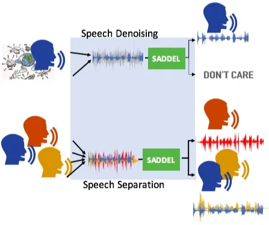
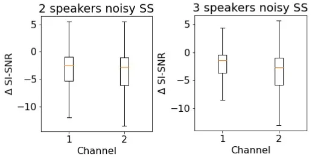

# SADDEL: Joint Speech Separation and Denoising Model based on Multitask Learning

^(⋆)The two first authors made equal contributions

###### Abstract

Speech data collected in real-world scenarios often encounters two
issues. First, multiple sources may exist simultaneously, and the number
of sources may vary with time. Second, the existence of background noise
in recording is inevitable. To handle the first issue, we refer to
speech separation approaches, that separate speech from an unknown
number of speakers. To address the second issue, we refer to speech
denoising approaches, which remove noise components and retrieve pure
speech signals. Numerous deep learning based methods for speech
separation and denoising have been proposed that show promising results.
However, few works attempt to address the issues simultaneously, despite
speech separation and denoising tasks having similar nature. In this
study, we propose a joint speech separation and denoising framework
based on the multitask learning criterion to tackle the two issues
simultaneously. The experimental results show that the proposed
framework not only performs well on both speech separation and denoising
tasks, but also outperforms related methods in most conditions.

Yuan-Kuei Wu^(1⋆)   Chao-I Tuan^(2⋆)   Hung-Yi Lee¹   Yu Tsao³

¹Graduate Institute of Communication Engineering, National Taiwan
University  
²Data Science Degree Program, National Taiwan University  
³Research Center for Information Technology Innovation, Academia
Sinica

{ywk991112, chaoi111.t, tlkagkb93901106}@gmail.com,
yu.tsao@citi.sinica.edu.tw

Index Terms: source separation, speech denoising, multitask learning

## 1 Introduction

In recent years, deep learning has made substantial progress in speech
separation (SS) \[1, 2, 3\] and speech denoising (SD) tasks \[4, 5, 6\].
By using high-performance SS and SD approaches as front-end units, the
performances of automatic speech recognition (ASR) \[7, 8\], speaker
recognition \[9, 10\] and emotion recognition \[11, 12\] have been
improved considerably. However, in real-world scenarios, multiple
sources and background noise often occur at the same time. Thus,
deriving a unified SS and SD framework that can address the issues
simultaneously is an important task and with practical applications.

A major challenge in combining SS and SD tasks into a unified framework
is that noise signals have diverse and unpredictable patterns. For
example, unwanted environmental sounds, machine sounds, traffic sounds,
etc. have rather different patterns, but they are all considered noise
when the target is human speech.

One approach is to cascade SD and SS to first remove noise components,
and then perform speech separation \[13, 14, 15, 16\]. Such cascade
approaches have proven effective and exhibit notable improvements in ASR
performance under challenging conditions \[14, 15\].

In contrast to the cascade approach, we propose a joint SS and SD
framework based on the multitask learning criterion named separation and
denoising model (SADDEL). The main concept of multitask learning is to
simultaneously process two tasks that have shared properties using a
unified model \[17\]. We argue that although the SS and SD tasks aim to
tackle different issues, they share the same intrinsic concept of
extracting specific signals from a mixed one. Therefore, the multitask
learning criterion is specially suitable. Moreover, SADDEL adopts
recursive separation, and thus, is able to carry out SD (separating
speech and noise) and SS (separating distinct sources from a mixture)
without knowing the exact number of source. The experimental results
show that SADDEL achieves better separation and denoising as compared to
individual SS and SD approaches and presents high robustness among
different datasets. To the best of our knowledge, this is the first
method that combines the SS and SD tasks based on the multitask learning
criterion. As compared to previous methods that may have imbalanced
performance (poor separation or denoising results \[18\] \[19\]), SADDEL
can perform well without performance sacrifice in individual tasks.

## 2 Related Work

In this section, we discuss related works that unify the SS and SD tasks
into a single framework. A popular approach is to directly cascade the
SD and SS models \[13, 14, 15, 16\], where the input speech is first
processed by an SD model to remove noise components. The denoised
signals are considered as having multiple sources, and subsequently
processed by an SS model to separate the individual sources. Another
approach is building a unified model to perform both tasks using one
model \[20\]. However, the models are usually speaker-dependent, meaning
that a target speaker must be specified beforehand, and speech from
other speakers are considered as noise. SADDEL is based on a similar
concept of the unified model approach, but it does not require a target
speaker or knowledge of the number of sources.

Multi-scenario training was first introduced in \[21\], where it was
proven to be beneficial in training scenarios with multiple sources.
Subsequent studies \[18\] have adopted the framework in \[21\] and
achieved improved SS and SD performance. Kavale rov \[19\] proposed
universal SS, which incorporates different window sizes and input
feature designs into a separation module for speech and arbitrary sound
separation. The proposed framework differs from previous methods in the
following aspects. First, environmental noise is introduced in our data
to simulate real world situations. Second, \[19\] treats SD as an SS
task, and considers noise as speech sound in order to unify two tasks.
In our work, we assume the noise to be unpredictable and without any
learnable pattern. This may be harmful to the separator module and lead
to confusing results. Therefore, we introduced keep the SD task in the
training scheme to tackle the universal sound separation problem. In
other words, only the speech signal is separated in the SD task.

We adopt the recursive separation model from \[22\] as the main
separator module. Based on the recent success of the recursive model in
separating varying numbers of speech sources \[19, 22, 23\], we extend
this idea to tackle the universal separation problem. The main
difference between our work and \[22\] is that we combine speech
denoising task into the speech separation task in the training stage. In
addition to the recursive separation model, another stream of approaches
to tackle various number of sources is assuming a maximum number. A
fault tolerance mechanism is proposed to alleviate misleading training
by wrong estimations of actual speaker number in \[18\]. Our preliminary
experiments show a notable limitation of this stream of approaches,
i.e., the performance in single speaker denoising task is significantly
lower than the performance of existing denoising methods. Moreover,
another drawback of these approaches is the requirement of setting a
maximum speaker number of speakers. The classifying performance may be
dynamically affected by such an upper bound.



Figure 1: Our paradigm for universal separation via Multitask Learning
method

## 3 Proposed SADDEL Approach

The main objective of the multitask methodology \[17\] is to train a
single network to solve a one task in parallel with other auxiliary
tasks. Notably, sharing information among several tasks leads to better
performance compared to processing each task independently. Multitask
training has been long explored in ASR, speaker adaptation, etc.
Nevertheless, its applicability has the following constraint: joint
training tasks share at least one degree of similarity. We infer that SS
and SD are similar in nature and perfectly suitable to be used as paired
tasks for multitask learning.

The proposed joint SS and SD framework based on multitasking training to
tackle the universal separation problem is Figure 1. To the best of our
knowledge, this is the first work that combines these two tasks via
multitask learning. The overall architecture of SADDEL consists of two
parts: The first part is the basis transform module that encodes and
decodes the sound signals, and the second part is a separation module
that is formed by stacked blocks of dilated convolutions similar to the
one in \[2\]. All networks are trained using the negative
scale-invariant signal-to-noise ratio (SI-SNR) \[24\] as the loss
function between the outputs and targets. We consider the SS and SD
scenarios to achieve universal source separation. For the SS scenario,
SADDEL aims to extract pure speech sources from a 2-speaker mixture and
3-speaker mixture, with and without noise components. For the SD
scenario, SADDEL aims to extract pure speech from a 1-speaker source
with noise components. The data for the SS and SD scenarios are combined
to form the training set. During training, speech utterances from the
training set are randomly sampled to form a batch. For each step, the
model run over separation and denoising tasks (e.g., separation on a
2-speaker mixture and 3-speaker mixture with or without noise, and
denoising on 1-speaker source with noise components), and the objective
loss is average among all tasks and then update the model once.

We follow the recursive separation process \[22\] to apply our framework
for separating varying number of speakers. In single channel SS, we aim
to separate N speaker sources $`s_{1}(t),s_{2}(t),\cdots,s_{N}(t)`$ from
the mixture signal $`m(t)`$, where $`m(t)`$ can be denoted as
$`m(t)=\sum_{i=1}^{N}{s_{i}(t)}`$. Iterative separation separates a
single desired source at a time, and the remaining mixture becomes the
input of the next separation process. At the $`j`$-th recursive step,
our model generates two separated outputs $`\hat{s}^{j}(t)`$ and
$`\hat{r}^{j}(t)`$. The first output, $`\hat{s}^{j}(t)`$, should be
close to one speaker source in $`\hat{r}^{j-1}(t)`$, and the second
output, $`\hat{r}^{j}(t)`$, should be the remainder of
$`\hat{r}^{j-1}(t)`$. This is formulated as:

```math
\hat{s}^{j}(t),\hat{r}^{j}(t)=F(\hat{r}^{j-1}(t)), \tag{1}
```

where $`F`$ denotes the separation model. Permutation invariant training
(PIT) \[25, 26\] is generally used to solve the label permutation
problem in speaker-independent SS. Instead of generating masks for
specific speakers, PIT calculates the loses for all ($`N!`$) possible
permutations of the speakers in the outputs, and selects the order that
generates the minimum loss as the label assignment. However, in our
problem setting, only one speaker source is separated from the remainder
of the mixture. Consequently, there are only $`N`$ possible permutations
rather than $`N!`$ (i.e., only $`N`$ sources can be separated at a
time).

We adopted the one-and-rest PIT (OR-PIT) \[22\] to train the separation
module in SADDEL. OR-PIT was proposed to solve a multiple source problem
by reforming the conventional PIT calculation into one and the rest
assignment. We argue that the SI-SNR loss won’t be scaled by the number
of speakers in the source due to the scale invariant characteristic.
Therefore, we modify the equation and our objective function is
formulated as,

```math
L=\min_{i}l(\hat{s}(t),s_{i}(t))+l(\hat{r}(t),\sum_{n\neq i}(s_{n}(t)) \tag{2}
```

where $`l(\cdot)`$ denotes SADDEL.

## 4 Experiments

In this section, we first introduce the datasets for evaluation, and
then present the experimental setup and finally the results.

### 4.1 Experimental Setup

#### 4.1.1 Dataset

Four datasets were used to evaluate the proposed SADDEL approach:
WSJ0-mix, MUSAN, WHAM!, 100 Nonspeech, and Librispeech-mix. In the
following, we will discuss the details of these datasets.  
WSJ0-mix We train and evaluate our proposed method on the publicly
available datasets WSJ0-2mix and WSJ0-3mix \[27\], which were derived
from the WSJ0 corpus. From the si_tr_s dataset, 30 hours of training
data and 10 hours of validation data were generated. Following the
approach in \[27, 22\], the speech utterances were randomly sampled and
mixed up between SNR from -2.5 dB to 2.5dB. All waveforms were
downsampled to 8KHz in the pre-processing step.  
MUSAN The noisy data used in for training and testing comes from the
MUSAN dataset \[28\], which includes various technical and non-technical
noises profiles such as DTMF tones, dial tones, and fax machine noises,
are included. Additionally, ambient sounds such as idling cars, thunder,
and animal noises, are included. Although previous works \[19, 23\]
exclude ambience and environmental sounds when considering the universal
separation problem, we believe they are present in most real-world
conditions. The noise was sampled between SNR -5 dB and 20 dB, and mixed
for training.  
WHAM! We perform testing experiments on the noisy data recorded in
public areas by \[29\], called WHAM!.  
100 Nonspeech This is a collection of 100 sound tracks of 20 different
types of non-speech sounds \[30\]. , which is used in our testing.  
Librispeech-mix We simulate another single-channel SS dataset for
testing with the Librispeech dataset \[31\], where test data is
generated from a 100-hour test set. All utterances are 6 seconds long
with a sample rate of 8 KHz.

#### 4.1.2 Implementation Details

Our methods can be applied to any type of separation model, so the main
focus of the present study is to verify the effectiveness of the
multitask learning criteria, rather than comparing different model
types. The ConvTasnet \[2\] model has shown to provide promising results
for both SS and SD tasks, and thus, it was selected to build the
separation module in SADDEL.

All of the models presented in this work were implemented in Pytorch.
Each model was trained for 100 epochs on 4 parallel NVIDIA Tesla v100
GPUs, using the Adam optimizer. We followed the best configurations for
ConvTasnet \[2\] to build the separator module. Our initial learning
rate was set to $`1e-3`$, and the weight decay was applied thereafter.
The performance was measured in SI-SNRi \[32\].

#### 4.1.3 Comparative Model I: Cascade Learning

In this study, we implemented a cascade learning model as a comparative
approach. To train this cascade model, we used the noisy 2-speaker and
noisy 3-speaker as the training dataset. In the first stage, SD is
applied to the noisy mixture, which is then used as the input for the SS
step in the second stage. The SD and SS modules are simultaneously
trained to minimize the overall loss.

#### 4.1.4 Comparative Model II: Auxiliary Autoencoding PIT

In addition to the cascade learning approach, we prepared another
comparative model with the setting proposed in \[18\]. This method
separates varying numbers of speakers in a mixture with ”fault
tolerance” ability. Aside from the recursive methods, they follow the
”fix-output-number” method proposed in \[25, 33\], where a maximum
number of speakers is required in advance. The main objective is to add
autoencoding in the PIT. Since the number of the speaker sources in the
mixture is possibly smaller than the maximum number setting, the input
mixture speech is set to be the output target for the redundant output
channel, which performs a null separation process. To achieve a
reasonable comparison, we implement the autoencoding setting in our
experiment under the same separation module and other environmental
condition.

|         |         |       |       |       |       |
| ------- | ------- | ----- | ----- | ----- | ----- |
|         | SI-SNRi |       |       |       |       |
|         | SD      | CSS   |       | NSS   |       |
|         | 1sp+n   | 2sp   | 3sp   | 2sp+n | 3sp+n |
| SADDEL  | 10.74   | 15.22 | 11.95 | 14.31 | 11.6  |
| bl_SS   | 0.15    | 12.99 | 10.82 | 12.83 | 11.14 |
| bl_SD   | 9.9     | -1.48 | -1.97 | 0.38  | -0.3  |
| A2PIT   | 8.35    | 13.04 | 10.23 | 12.79 | 10.5  |
| cascade | 7.99    | 13.1  | 10.13 | 13.44 | 10.67 |

Table 1: Average SI-SNRi scores on SD, SS without noise (CSS) and SS
under noise (NSS) between SADDEL and the comparative models. We colored
the results in gray to denote which specific configuration was used in
training phase.

### 4.2 Experimental Results

There are five training and testing set configurations in our
experiments: one speaker source with real-world noise (SD scenario,
denoted as 1sp+n), multiple speakers without noise (SS in clean
scenario, denoted as 2sp and 3sp for 2-speaker and 3-speaker mixtures,
respectively), and multiple speakers with noise (SS in noise scenario,
denoted as 2sp+n and 3sp+n for 2-speaker and 3-speaker mixtures in
noise, respectively). The three comparative models are the cascade model
(termed cascade), conventional ConvTasnet models(used to build
baseline_SS and baseline_SD), and the auxiliary autoencoding PIT
ConvTasnet model (termed A2PIT). SADDEL used the combined {1sp+n, 2sp,
3sp, 2sp+n, and 3sp+n} training set, and the baseline_SD model (denoted
as bl_SD) was trained with the 1sp+n set. Moreover, the baseline_SS
model (denoted as bl_SS) was trained with the combined {2sp+n and 3sp+n}
set. For A2PIT, we used the combined {1sp+n, 2sp+n and 3sp+n} set, and
for cascade, we used the combined {2sp+n and 3sp+n} set.

Table 1 compares our multitask learning model with other comparative
models on the WSJ0-mix dataset. We note that SADDEL outperforms
comparative systems across all testing sets, indicating that training
with data in all tasks improves generalization by sharing useful
information for the SD and SS tasks. Moreover, we note that the number
of parameters of SADDEL is only half to the cascade model while still
achieves better performance. This is advantageous in integrating n
additional advantage that the proposed model SADDEL can be more suitably
installed with in edge devices. It has been noted in \[18\] that A2PIT
performs poorly in the single speaker denoising task. In our opinion,
selecting invalid estimated sources due to a wrongly predicted speaker
count causes performance degradation in the single speaker denoising
task. SADDEL has better performance in one speaker denoising tasks, and
separation tasks with multiple speakers.

|         |        |         |       |       |       |       |
| ------- | ------ | ------- | ----- | ----- | ----- | ----- |
|         |        | SI-SNRi |       |       |       |       |
|         |        | SD      | CSS   |       | NSS   |       |
|         |        | 1sp+n   | 2sp   | 3sp   | 2sp+n | 3sp+n |
|         | L^(\*) | 4.51    | 9.33  | 7.18  | 9.69  | 7.99  |
| SADDEL  | W^(\*) | -       | -     | -     | 11.97 | -     |
|         | L      | -1.90   | 8.28  | 6.18  | 8.91  | 7.23  |
| bl_SS   | W      | -       | -     | -     | 6.4   | -     |
|         | L      | 5.25    | -1.24 | -1.59 | 0.32  | -0.07 |
| bl_SD   | W      | -       | -     | -     | -2.96 | -     |
|         | L      | -1.27   | 7.79  | 6.27  | 8.94  | 7.65  |
| cascade | W      | -       | -     | -     | 11.12 | -     |
|         | L      | 3.51    | 7.49  | 6.53  | 8.36  | 7.34  |
| A2PIT   | W      | -       | -     | -     | 10.9  | -     |

Table 2: Average SI-SNRi scores of SADDEL and comparative approahces on
Librispeech-mix (denoted as L) and WHAM! (denoted as W).

|         |         |          |         |       |       |
| ------- | ------- | -------- | ------- | ----- | ----- |
|         |         |          | SI-SNRi |       |       |
|         |         |          | SD      | NSS   |       |
|         | Dataset | Noise    | 1sp+n   | 2sp+n | 3sp+n |
| SADDEL  | wsj0    | M_C^(\*) | 10.74   | 14.31 | 11.6  |
| bl_SS   | wsj0    | M_C      | 0.15    | 12.83 | 11.14 |
| bl_SD   | wsj0    | M_C      | 9.9     | 0.38  | -0.3  |
| A2PIT   | wsj0    | M_C      | 8.35    | 12.79 | 10.5  |
| cascade | wsj0    | M_C      | 7.99    | 13.4  | 11.6  |
| SADDEL  | wsj0    | M_L^(\*) | 15      | 14.57 | 12.08 |
| A2PIT   | wsj0    | M_L      | 13.06   | 13.58 | 11.3  |
| cascade | wsj0    | M_L      | 13.52   | 14.16 | 11.97 |
| SADDEL  | wsj0    | N_H^(\*) | 8.03    | 13.37 | 10.53 |
| bl_SS   | wsj0    | N_H      | -6.19   | 11.76 | 10    |
| bl_SD   | wsj0    | N_H      | 7.5     | -1.01 | -1.55 |
| A2PIT   | wsj0    | N_H      | 2.77    | 11.92 | 9.74  |
| cascade | wsj0    | N_H      | 6.37    | 12.34 | 9.57  |
| SADDEL  | Libri   | N_H      | 1.91    | 8.58  | 6.58  |
| bl_SS   | Libri   | N_H      | -5.72   | 7.42  | 5.88  |
| bl_SD   | Libri   | N_H      | 3.56    | -0.8  | -1.2  |
| A2PIT   | Libri   | N_H      | -0.18   | 7.04  | 6.27  |
| cascade | Libri   | N_H      | -3.11   | 7.87  | 6.42  |

Table 3: Average SI-SNRi scores of SADDEL and comparative approaches on
Librispeech-mix (denoted as L) and wsj0 with different SNR levels, where
M_C denotes Musan dataset at middle SNR level (SNR= -5 to - 25 dB), M_L
denotes Musan dataset at low SNR level (SNR= -5 to - 5 dB). and N_H
denotes 100Nonspeech dataset with high SNR level (SNR= 10 to 20 dB)

### 4.3 Robustness

To further examine the performance robustness, we tested SADDEL in
different scenarios. In Table 2, we present the results of SADDEL and
the comparative models on two testing datasets (formed by
Librispeech-mix and WHAM!). The test set in Librispeech-mix is mixed
with random sampled noise from the MUSAN dataset at the SNR level for
training. Additionally, WHAM! is already a noisy SS task and requires no
such additional mixing. As shown in Table 2, SADDEL outperforms almost
all the comparative approaches, but it slightly underperforms the
baseline_SD model in the SD task. Moreover for the WHAM! test set,
SADDEL surpasses all the comparative models by nearly one SI-SNR
improvement.

In Table 3, we present the results of SADDEL and comparative models with
noise types proposed in \[18\] at three SNR levels. From the results in
Table 3, we note that when switching to higher/lower SNR levels and
different noise types, SADDEL retains better performance than
comparative models, where the SS performance notably dropped when unseen
noises are involved. Furthermore, We observed a severe performance drop
for A2PIT. A potential explanation is that A2PIT needs to define a
threshold to identify a valid speaker count, and an optimal threshold
may not be easily defined when unseen noises are involved. The
comparable performance of the A2PIT model on the WHAM! dataset may be
due to the high similarity between the noise data collected from the
WHAM! and MUSAN dataset. When testing on unseen test data and noise,
SADDEL outperforms all the comparative models in all test conditions.



Figure 2: Performance degradation between SS without noise and SS with
noise on the WSJ0-mix dataset.

### 4.4 Noise Impact on Channel

Since the output from the first channel in our model is considered as a
pure source, we assume that noise components have been entirely removed.
The output of the second channel can have a higher noise tolerance level
due to the reduction of noise is able to apply in the following
recursive step. To analyze this, we first sent two mixtures (a clean
mixture and noisy mixture) into the SADDEL model, and measured the
SI-SNR scores of the outputs. We subtract the SI-SNR results
channel-wise, and a larger value indicates that the noise causes less
impact. Figure 2 shows that the performance degradation in the first
channel is less than that in the second channel. Furthermore, the means
of SI-SNR degradation are -3.4822 and -3.9743 for the first and second
channels, respectively, in the 2-speaker noisy SS, and -2.3738 and
-3.8146 for the first and second channels, respectively, in 3-speaker
noisy SS. Our recursive SS approach should be benefit from this
phenomenon.

## 5 Conclusion

In this study, we propose a novel SADDEL approach to perform noisy SS
with an unknown number of speakers. In contrast to existing methods,
SADDEL is derived based on the multitask learning criterion, and thus, a
unified model is used to carry out SD and SS simultaneously. This design
notably reduces the hardware cost as compared to conventional cascade
methods. The experimental results demonstrate that SADDEL outperforms
comparative SD and SS models, and exhibits promising results on various
noisy SS tasks. Moreover, SADDEL can provide high performance robustness
across different datasets, noise types, and SNR levels.

## 6 Acknowledgements

We are grateful to the National Center for High-performance Computing
for computer time and facilities.

## References

- \[1\] Y. Liu and D. Wang, “Divide and conquer: A deep casa approach to
  talker-independent monaural speaker separation,” _IEEE/ACM
  Transactions on Audio, Speech, and Language Processing_, vol. 27, pp.
  2092–2102, 2019.
- \[2\] Y. Luo and N. Mesgarani, “Conv-tasnet: Surpassing ideal
  time–frequency magnitude masking for speech separation,” _IEEE/ACM
  Transactions on Audio, Speech, and Language Processing_, vol. 27, pp.
  1256–1266, 2019.
- \[3\] Y. Wang, A. Narayanan, and D. Wang, “On training targets for
  supervised speech separation,” _IEEE/ACM transactions on audio,
  speech, and language processing_, vol. 22, no. 12, pp.
  1849–1858, 2014.
- \[4\] X. Lu, Y. Tsao, S. Matsuda, and C. Hori, “Speech enhancement
  based on deep denoising autoencoder.” in _Proc. Interspeech_, 2013.
- \[5\] D. Liu, P. Smaragdis, and M. Kim, “Experiments on deep learning
  for speech denoising,” in _Fifteenth Annual Conference of the
  International Speech Communication Association_, 2014.
- \[6\] Y. Xu, J. Du, L.-R. Dai, and C.-H. Lee, “A regression approach
  to speech enhancement based on deep neural networks,” _IEEE/ACM
  Transactions on Audio, Speech and Language Processing (TASLP)_,
  vol. 23, no. 1, pp. 7–19, 2015.
- \[7\] Z.-Q. Wang and D. Wang, “A joint training framework for robust
  automatic speech recognition,” _IEEE/ACM Transactions on Audio,
  Speech, and Language Processing_, vol. 24, no. 4, pp. 796–806, 2016.
- \[8\] J. Li, L. Deng, R. Haeb-Umbach, and Y. Gong, _Robust automatic
  speech recognition: a bridge to practical applications_. Academic
  Press, 2015.
- \[9\] D. Michelsanti and Z.-H. Tan, “Conditional generative
  adversarial networks for speech enhancement and noise-robust speaker
  verification,” _arXiv preprint arXiv:1709.01703_, 2017.
- \[10\] S. Shon, H. Tang, and J. Glass, “Voiceid loss: Speech
  enhancement for speaker verification,” _arXiv preprint
  arXiv:1904.03601_, 2019.
- \[11\] Z. Zhang, F. Ringeval, J. Han, J. Deng, E. Marchi, and
  B. Schuller, “Facing realism in spontaneous emotion recognition from
  speech: Feature enhancement by autoencoder with LSTM neural networks,”
  in _Proc. Interspeech_, 2016.
- \[12\] A. Triantafyllopoulos, G. Keren, J. Wagner, I. Steiner, and
  B. W. Schuller, “Towards robust speech emotion recognition using deep
  residual networks for speech enhancement,” in _Proc.
  Interspeech_, 2019.
- \[13\] Y. Liu, M. Delfarah, and D. Wang, “Deep casa for
  talker-independent monaural speech separation,” in _ICASSP 2020 - 2020
  IEEE International Conference on Acoustics, Speech and Signal
  Processing (ICASSP)_, 2020, pp. 6354–6358.
- \[14\] J. Du, Y.-H. Tu, L. Sun, F. Ma, H.-K. Wang, J. Pan, C. Liu,
  J.-D. Chen, and C.-H. Lee, “The ustc-iflytek system for chime-4
  challenge,” _Proc. CHiME_, pp. 36–38, 2016.
- \[15\] X. Wang, J. Du, A. Cristia, L. Sun, and C.-H. Lee, “A study of
  child speech extraction using joint speech enhancement and separation
  in realistic conditions,” in _ICASSP 2020-2020 IEEE International
  Conference on Acoustics, Speech and Signal Processing (ICASSP)_. IEEE,
  2020, pp. 7304–7308.
- \[16\] C. Ma, D. Li, and X. Jia, “Two-stage model and optimal si-snr
  for monaural multi-speaker speech separation in noisy environment,”
  _arXiv preprint arXiv:2004.06332_, 2020.
- \[17\] R. Caruana, “Multitask learning,” _Machine learning_, vol. 28,
  no. 1, pp. 41–75, 1997.
- \[18\] Y. Luo and N. Mesgarani, “Separating varying numbers of sources
  with auxiliary autoencoding loss,” _arXiv preprint
  arXiv:2003.12326_, 2020.
- \[19\] I. Kavalerov, S. Wisdom, H. Erdogan, B. Patton, K. Wilson,
  J. Le Roux, and J. R. Hershey, “Universal sound separation,” in _2019
  IEEE Workshop on Applications of Signal Processing to Audio and
  Acoustics (WASPAA)_. IEEE, 2019, pp. 175–179.
- \[20\] T. Gao, J. Du, L.-R. Dai, and C.-H. Lee, “A unified dnn
  approach to speaker-dependent simultaneous speech enhancement and
  speech separation in low snr environments,” _Speech Communication_,
  vol. 95, pp. 28–39, 2017.
- \[21\] J. Zegers, K. Leuven _et al._, “Multi-scenario deep learning
  for multi-speaker source separation,” in _2018 IEEE International
  Conference on Acoustics, Speech and Signal Processing (ICASSP)_. IEEE,
  2018, pp. 5379–5383.
- \[22\] N. Takahashi, S. Parthasaarathy, N. Goswami, and Y. Mitsufuji,
  “Recursive speech separation for unknown number of speakers,” _arXiv
  preprint arXiv:1904.03065_, 2019.
- \[23\] E. Tzinis, S. Wisdom, J. R. Hershey, A. Jansen, and D. P. W.
  Ellis, “Improving universal sound separation using sound
  classification,” in _ICASSP 2020 - 2020 IEEE International Conference
  on Acoustics, Speech and Signal Processing (ICASSP)_, 2020, pp.
  96–100.
- \[24\] J. Le Roux, S. Wisdom, H. Erdogan, and J. R. Hershey,
  “Sdr–half-baked or well done?” in _ICASSP 2019-2019 IEEE International
  Conference on Acoustics, Speech and Signal Processing (ICASSP)_. IEEE,
  2019, pp. 626–630.
- \[25\] M. Kolbaek, D. Yu, Z. Tan, and J. Jensen, “Multitalker speech
  separation with utterance-level permutation invariant training of deep
  recurrent neural networks,” _IEEE/ACM Transactions on Audio, Speech
  and Language Processing (TASLP)_, vol. 25, no. 10, pp.
  1901–1913, 2017.
- \[26\] D. Yu, M. Kolbæk, Z. Tan, and J. Jensen, “Permutation invariant
  training of deep models for speaker-independent multi-talker speech
  separation,” in _2017 IEEE International Conference on Acoustics,
  Speech and Signal Processing (ICASSP)_. IEEE, 2017, pp. 241–245.
- \[27\] Y. Luo, Z. Chen, J. Hershey, J. Roux, and N. Mesgarani, “Deep
  clustering and conventional networks for music separation: Stronger
  together,” in _2017 IEEE International Conference on Acoustics, Speech
  and Signal Processing (ICASSP)_. IEEE, 2017, pp. 61–65.
- \[28\] D. Snyder, G. Chen, and D. Povey, “MUSAN: A music, speech, and
  noise corpus,” _CoRR_, vol. abs/1510.08484, 2015.
- \[29\] G. Wichern, J. Antognini, M. Flynn, L. R. Zhu, E. McQuinn,
  D. Crow, E. Manilow, and J. L. Roux, “Wham!: Extending speech
  separation to noisy environments,” _arXiv preprint
  arXiv:1907.01160_, 2019.
- \[30\] G. Hu and D. Wang, “A tandem algorithm for pitch estimation and
  voiced speech segregation,” _Audio, Speech, and Language Processing,
  IEEE Transactions on_, vol. 18, pp. 2067 – 2079, 12 2010.
- \[31\] V. Panayotov, G. Chen, D. Povey, and S. Khudanpur,
  “Librispeech: an asr corpus based on public domain audio books,” in
  _2015 IEEE International Conference on Acoustics, Speech and Signal
  Processing (ICASSP)_. IEEE, 2015, pp. 5206–5210.
- \[32\] E. Vincent, R. Gribonval, and C. Fevotte, “Performance
  measurement in blind audio source separation,” _IEEE Transactions on
  Audio, Speech, and Language Processing_, vol. 14, no. 4, pp.
  1462–1469, 2006.
- \[33\] Y. Luo, Z. Chen, and N. Mesgarani, “Speaker-independent speech
  separation with deep attractor network,” _IEEE/ACM Transactions on
  Audio, Speech, and Language Processing_, vol. 26, no. 4, pp.
  787–796, 2018.
