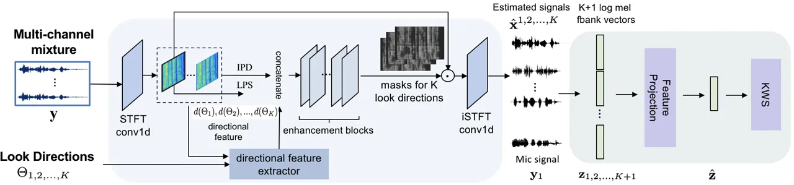
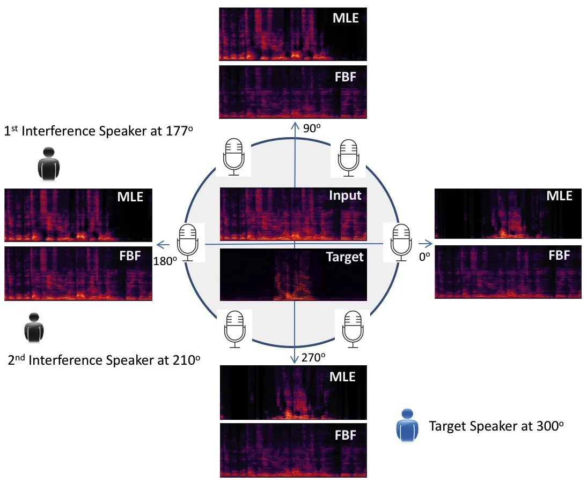
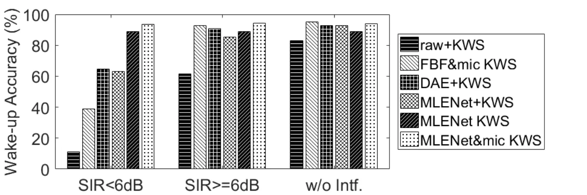

# End-to-End Multi-Look Keyword Spotting

^(∗)X. Ji contributed to this work when she was with Tencent

###### Abstract

The performance of keyword spotting (KWS), measured in false alarms and
false rejects, degrades significantly under the far field and noisy
conditions. In this paper, we propose a multi-look neural network
modeling for speech enhancement which simultaneously steers to listen to
multiple sampled look directions. The multi-look enhancement is then
jointly trained with KWS to form an end-to-end KWS model which
integrates the enhanced signals from multiple look directions and
leverages an attention mechanism to dynamically tune the model’s
attention to the reliable sources. We demonstrate, on our large noisy
and far-field evaluation sets, that the proposed approach significantly
improves the KWS performance against the baseline KWS system and a
recent beamformer based multi-beam KWS system.

Meng Yu¹, Xuan Ji^(2∗), Bo Wu², Dan Su², Dong Yu¹

¹Tencent AI Lab, Bellevue, WA, USA  
²Tencent AI Lab, Shenzhen, China

{raymondmyu, lambowu, dansu, dyu}@tencent.com, mrvsyzb@163.com

Index Terms: keyword spotting, multi-look, end-to-end

## 1 Introduction

With the proliferation of smart homes and mobile and automotive devices,
speech-based human-machine interaction becomes prevailing. To achieve
hands-free speech recognition experience, the system continuously
listens for specific wake-up words, a process often called keyword
spotting (KWS)\[1\], to initiate speech recognition. For the privacy
concern, the wake-up KWS typically happens completely on the device with
low footprint and power consumption requirement.

The KWS systems usually perform well under clean-speech conditions.
However, their performance degrades significantly under noisy
conditions, particularly in multi-talker environments. A variety of
front-end enhancement methods have been proposed in recent years, which
filter out the signals of interference from the noisy stream before
passing it to the KWS system. Beyond the conventional speech denoising
approaches \[2, 3\] and the recent deep learning based techniques for
speech enhancement \[4, 5, 6, 7, 8, 9\], a neural network based
text-dependent speech enhancement technique for recovering the original
clean speech signal of a specific content has been recently proposed and
applied to KWS as a front-end processing component \[10\]. However, the
far field speech processing suffers from the reverberation and multiple
sources of interference which blurs speech spectral cues and degrades
the single-channel speech enhancement. Since the microphone array is
more widely deployed than before, multi-channel techniques become more
and more important. An array of microphones provides multiple
recordings, which contain information indicative of the spatial origin
of a sound source. When sound sources are spatially separated, with
microphone array inputs one may localize sound sources and then extract
the source from the target direction.

The well established spatial features, such as inter-channel phase
difference (IPD), have been proven efficient when combined with monaural
spectral features at the input level for time-frequency (T-F) masking
based speech separation methods \[11, 12, 13\]. Furthermore, in order to
enhance the source signal from a desired direction, elaborately designed
directional features associated with a certain direction that indicate
the directional source’s dominance in each T-F bin have been presented
in \[14, 15, 16\]. Nevertheless, the knowledge of the true target
speaker direction is not available in real applications. It is hence
very difficult to accurately estimate the target speaker’s direction of
arrival (DOA) in multi-talker environments. In other words, the systems
don’t even know which one is the target speaker among multiple acoustic
sources. A multi-channel processing approach handled by fixed
beamformers with multiple fixed beams has been presented in \[17\].
Instead of detecting keywords by evaluating 4 beamformed channels in
consequence and indicating a successful detection if any of the 4 trials
triggers the threshold, the authors developed to train a KWS model with
all beamformed signals at multiple look directions as the input. The
system optimizes the multi-beam feature mapping and the keywords
detection model to improve the keyword recognition accuracy.

The beamforming based multi-look approach \[17\] motivates us to work
towards a neural network modeling of multi-look speech enhancement,
which thus enables the joint training with KWS model to form a
completely end-to-end multi-look KWS modeling. We solve the major
difficulty on assigning supervised training targets to the multi-look
enhancement modeling. The presented multi-look enhancement incorporates
spectral features, IPDs and directional features associated with
multiple sampled look directions for source enhancement in multiple
directions simultaneously. It shows significant advantage compared to
the conventional beamformers for the purpose of KWS with no prior
information of the target speaker’s location. The rest of the paper is
organized as follows. In Section 2, we first recap the direction-aware
enhancement modeling, and then present the multi-look speech enhancement
model followed by the end-to-end multi-look KWS model. We describe our
experimental setups and evaluate the effectiveness of the proposed
system in Section 3. We conclude this work in Section 4.



Figure 1: Block diagram of the proposed multi-look enhancement and
end-to-end multi-look KWS model

## 2 Multi-Look KWS

### 2.1 Direction-Aware Enhancement Overview

In this section, we review the task of separating the target speaker
from a multi-channel speech mixture by making use of target speaker’s
direction information. Previous work in \[11, 15, 16, 18\] have proposed
to leverage a proper designed directional feature of the target speaker
to perform the target speaker separation. The work in both \[16\] and
\[18\] implemented the enhancement network by a dilated convolutional
neural network (CNN) similar as conv-TasNet \[19\] but through a
short-time Fourier transform (STFT) for signal encoding. Such network
structure supports a long reception field to capture more sufficient
contextual information and is thus adopted in our model.

Similar as the diagram in Figure 1, the direction-aware enhancement
(DAE) framework starts from an encoder that maps the multi-channel input
waveforms to complex spectrograms by a STFT 1-D convolution layer. Based
on the complex spectrograms, the single-channel spectral feature,
logarithm power spectrum (LPS) and multi-channel spatial features are
extracted. A reference channel, e.g. the first channel complex
spectrogram $`\mathbf{Y}_{1}`$, is used to compute LPS by
$`\text{LPS}=\log(|\mathbf{Y}_{1}|^{2})\in\mathbb{R}^{T\times F}`$,
where $`T`$ and $`F`$ are the total number of frames and frequency bands
of the complex spectrogram, respectively. One of the spatial features,
IPD, is computed by the phase difference between channels of complex
spectrograms as:

```math
\text{IPD}^{(m)}(t,f)=\angle\mathbf{Y}_{m_{1}}(t,f)-\angle\mathbf{Y}_{m_{2}}(t,f) \tag{1}
```

where $`m_{1}`$ and $`m_{2}`$ are two microphones of the $`m`$-th
microphone pair out of $`M`$ selected microphone pairs. A directional
feature (DF) is incorporated as a target speaker bias. This feature was
originally introduced in \[11\], which computes the averaged cosine
distance between the target speaker steering vector and IPD on all
selected microphone pairs as

```math
\vskip-5.69046pt\text{d}_{\theta}(t,f)=\overset{M}{\underset{m=1}{\sum}}\left<\mathbf{e}^{\angle\mathbf{v}_{\theta}^{(m)}(f)},\mathbf{e}^{\text{IPD}^{(m)}(t,f)}\right> \tag{2}
```

where
$`\angle\mathbf{v}_{\theta}^{(m)}(f):=2\pi f\varDelta^{(m)}\cos{\theta^{(m)}}/c`$
is phase of the steering vector for target speaker from $`\theta`$ at
frequency _f_ with respect to $`m`$-th microphone pair,
$`\varDelta^{(m)}`$ is the distance between the $`m`$-th microphone
pair, $`c`$ is the sound velocity, and vector
$`\mathbf{e}^{(\cdot)}:=[\cos(\cdot),\sin(\cdot)]^{T}`$. If the T-F bin
$`(t,f)`$ is dominated by the source from $`\theta`$, then
$`d_{\theta}(t,f)`$ will be close to 1, otherwise close to 0. As a
result, $`\text{d}_{\theta}(t,f)`$ indicates if a speaker from a desired
direction $`\theta`$ dominates in each T-F bin, which drives the network
to extract the target speaker from the mixture. All of the features
above are then concatenated and passed to the enhancement blocks, which
consist of stacked dilated convolutional layers with exponentially
growing dilation factors \[19\]. The predicted target speaker mask is
multiplied by the complex spectrogram of reference channel
$`\mathbf{Y}_{1}`$. At the end, an inverse STFT (iSTFT) 1-D convolution
layer converts the estimated target speaker complex spectrogram to the
waveform.

Furthermore, the scale-invariant signal-to-noise (SI-SNR) is used as the
objective function to optimize the enhancement network which is defined
as:

```math
\text{SI-SNR}(\hat{\mathbf{x}},\mathbf{x}):=10\log_{10}\frac{\left\|\mathbf{x}_{\sf target}\right\|_{2}^{2}}{\left\|\mathbf{e}_{\sf noise}\right\|_{2}^{2}} \tag{3}
```

where
$`\mathbf{x}_{\sf target}=\left(\left<\hat{\mathbf{x}},\mathbf{x}\right>\mathbf{x}\right)/\left\|\mathbf{x}\right\|_{2}^{2}`$,
$`\mathbf{e}_{\sf noise}=\hat{\mathbf{x}}-\mathbf{x}_{\sf target}`$, and
$`\hat{\mathbf{x}}`$ and $`\mathbf{x}`$ are the estimated and
reverberant target speech waveforms, respectively. The zero-mean
normalization is applied to $`\hat{\mathbf{x}}`$ and $`\mathbf{x}`$ for
scale invariance. This loss function has been proven superior to MSE
loss in \[16\].

### 2.2 Multi-Look Enhancement Network

The DAE model in Section 2.1 relies on the correct estimation of the
desired speaker’s DOA information. However, the target direction
estimation is infeasible under noisy conditions, particularly when the
interfering sources are competing talkers. The idea of “multi-look
direction” has been applied to speech separation \[17, 20, 21\] and
multi-channel acoustic model \[22, 23, 24\], respectively, where a small
number of spatial look directions cover all possible target speaker
directions. Since beamforming shows its advantage for speech
preservation through its linear spatial filter design and processing
\[25, 26, 27, 28\], a set of beamformers of different main lobe
directions is thus used for multi-look enhancement in \[17, 20, 21\].
Neural network based multi-look filtering in \[22, 23, 24\] implicitly
learns filters for enhancing sources from different spatial look
directions and passes all the filtered signals to an acoustic model for
joint training. The multi-look enhancement layers are not trained by
enhancement loss in a supervised mode. Such multi-look learning is not
well controllable and thereby is hard to enhance and reconstruct the
target speaker waveform at any look direction. Based on the target
speaker enhancement architecture in Section 2.1, we present a novel
supervised multi-look neural enhancement model.

As shown in Figure 1, a set of $`K`$ directions in the horizontal plane
is sampled. The azimuths of look directions $`\Theta_{1,2,...,K}`$
result in $`K`$ directional feature vectors
$`d(\Theta_{k}),k=1,2,...,K`$. Per discussion in Section 2.1, the value
of directional feature in a T-F bin is close to 1 if the source from the
desired direction is dominant in this bin. Furthermore, this value
decreases as the source deviates from the desired look direction. To be
more specific, under the free field assumption, i.e. only direct path of
the acoustic sound is considered, we have
$`\text{IPD}^{(m)}(t,f)\approx\angle\mathbf{v}_{\theta}^{(m)}(f)`$,
assuming the T-F bin is occupied by a source from direction $`\theta`$.
Therefore, at such T-F bin the directional feature of look direction
$`\Theta_{k},k=1,2,...,K`$ can be approximated by

```math
\vskip-5.69046pt\text{d}_{\Theta_{k}}(t,f)\approx\overset{M}{\underset{m=1}{\sum}}\left<\mathbf{e}^{\angle\mathbf{v}_{\Theta_{k}}^{(m)}(f)},\mathbf{e}^{\angle\mathbf{v}_{\theta}^{(m)}(f)}\right> \tag{4}
```

Obviously, $`\text{d}_{\Theta_{k}}(t,f)`$ is determined by the actual
source direction $`\theta`$ and look direction $`\Theta_{k}`$. As a
result, $`\text{d}_{\Theta_{k}}`$ for those T-F bins dominated by the
source that is closest to the look direction $`\Theta_{k}`$ will be
larger than that for other T-F bins. Such directional features enable
the network to predict $`K`$ output channels
$`\hat{\mathbf{x}}^{k},k=1,2,...,K`$, corresponding to the closest
source to each look direction, respectively. The supervised assignment
are expressed as $`\mathbf{x}^{k}=\mathbf{x}_{\tilde{k}}`$ with

```math
\vskip-2.84544pt\tilde{k}=\mathop{\arg\min}_{j}|\Theta_{k}-\theta_{j}|, \tag{5}
```

where $`\theta_{j}`$ is the DOA of source $`x_{j}`$ in the mixture
waveform, and $`j=1,2,...,N`$

In other words, the multi-look enhancement network simultaneously
predicts the most nearby source for each look direction. The loss
function thereby becomes

```math
\vskip-2.84544pt\mathcal{L}=\overset{K}{\underset{k=1}{\sum}}\text{SI-SNR}(\hat{\mathbf{x}}^{k},\mathbf{x}^{k}) \tag{6}
```

In our experiments, based on a uniform circular array of 6 microphones,
we empirically use 4 look directions, targeting at $`0^{\circ}`$,
$`90^{\circ}`$, $`180^{\circ}`$ and $`270^{\circ}`$, respectively, to
cover the whole horizontal plane of $`360^{\circ}`$. An output example
of multi-look enhancement network (MLENet) and fixed beamformers (FBF)
is shown in Figure 2. MLENet enhances the target speaker at the look
direction $`0^{\circ}`$ and $`270^{\circ}`$, respectively, as the target
speaker is closer to the two directions than other two speakers. Due to
the capability of fixed beamformer, interference speakers are not well
attenuated in any look direction. Based on this example, we emphasize
that the target speaker may not be predicted which happens on the 2nd
speaker of interference in this case. We call it “off-target” as the 2nd
speaker of interference is not closer to any look direction compared to
other speakers. We will discuss improved solutions in Section 2.3 and
3.4.



Figure 2: Example of MLENet outputs on 4 look directions and comparison
to FBF. The circular microphone array records sounds from one target
speaker and two speakers of interference. The two spectrograms in the
middle are input mixture and target speaker reference, respectively.

### 2.3 Joint Training with KWS Model

The more look directions we have, the more likely the target speaker is
closer to at least one look direction compared to other speakers of
interference and thus exists in the output channels. Unfortunately, this
may complicate the KWS model by performing keyword detection on each of
the output channels. Therefore, we propose to integrate the output
channels from multiple look directions into a single KWS model by
jointly training the KWS and MLENet. Since the space resolution of the
sampled look directions is not necessarily sufficient enough to cover
the target direction, the mismatch between the target speaker direction
and the look-direction causes either speech distortion in the output or
even “off-target” in the output channels. An extra channel from one
reference microphone is thereby leveraged to preserve target speech
quality in those extremely difficult scenarios. A schematic diagram of
the proposed system is shown in Figure 1.

Inspired by the application of attention mechanism in speech recognition
\[29\], speaker verification \[30\] and single channel keyword spotting
\[31\], following \[17\] we incorporate a soft self-attention for
projecting $`K+1`$ channels’ fbank feature vectors to one channel, so
that KWS still takes one channel input vector similarly as the baseline
single channel model. For each time-step, we compute a $`K+1`$
dimensional attention weight vector $`\bm{\alpha}`$ for input fbank
feature vectors
$`\mathbf{z}=\left[\mathbf{z}_{1},\mathbf{z}_{2},\dots,\mathbf{z}_{K},\mathbf{z}_{K+1}\right]`$
as:

```math
\displaystyle e_{i} \displaystyle=v^{T}tanh(W\mathbf{z}_{i}+b) \tag{7}
```

```math
\displaystyle\alpha_{i} \displaystyle=\frac{exp(e_{i})}{\sum_{k=1}^{K+1}exp(e_{k})} \tag{8}
```

where a shared-parameter non-linear attention with the same $`W`$, $`b`$
and $`v`$ is used for each channel $`i`$ of all $`K+1`$ channels.
$`\mathbf{z}`$ is a 5-channel input fbank feature tensor in our
implementation, corresponding to 4 multi-look enhanced signals and 1
reference microphone signal. $`W`$ is a $`128\times D`$ weight matrix
where $`D`$ is the input feature size defined in Section 3.1, $`b`$ is a
128-dimension bias vector, and $`v`$ is a 128-dimension vector. A
weighted sum of the multi-channel inputs is computed as

```math
\hat{\mathbf{z}}=\sum_{i=1}^{K+1}\alpha_{i}\mathbf{z}_{i} \tag{9}
```

The KWS network and MLENet are then jointly optimized towards the
improved keyword recognition accuracy.

## 3 Experiments

### 3.1 KWS Pre-training

Our baseline KWS model uses a Limited weight sharing (LWS) scheme based
CNN \[32\], which consists of a convolutional layer (eight $`4\times 1`$
non-overlapping kernels for eight different regions of frequency bands),
a pooling layer, three fully connected layers each with 384 units, a
fully connected layer with 128 units, and a softmax layer. 40
dimensional log-mel filterbank features are computed every 25ms with a
10ms frame shift and their delta and delta-delta features are appended.
At each frame, we stack 10 frames to the left and 5 frames to the right
as the input feature to the convolutional layer. The baseline KWS model
is trained on large internal training sets to detect the keyword
“ni-hao-wei-ling” in Mandarin. The interested reader is referred to
\[10, 33\] for more details on modeling and decoding.

A 200-hour keyword specific data set was used as positive training
examples. It is from 337 human speakers and includes 45K utterances from
headset recordings (relatively clean data) and 179K utterances from a
distant microphone (far-field noisy data). A 139-hour dataset of 100K
negative examples from a Mandarin speech database served as negative
training examples.

### 3.2 MLENet Pre-training

The window size is 32 ms and the hop size is 16 ms. We apply 512-point
FFT to extract 257-dimensional LPS and spatial features (IPD and DF) for
MLENet training. IPDs are extracted from 6 microphone pairs,
($`0^{\circ}`$, $`180^{\circ}`$), ($`60^{\circ}`$, $`240^{\circ}`$),
($`120^{\circ}`$, $`300^{\circ}`$), ($`0^{\circ}`$, $`60^{\circ}`$),
($`120^{\circ}`$, $`180^{\circ}`$) and ($`240^{\circ}`$,
$`300^{\circ}`$), where the angle values indicate the microphone
positions illustrated in Figure 2. The design of enhancement blocks
follows \[19\], including 4 times’ repeats of 8 convolutional blocks
with dilation factors $`1,2,4,...,2^{7}`$.

We simulate a multi-channel dataset of reverberant mixtures with up to
three speakers in each utterance by AISHELL-2 corpus \[34\]. The room
simulator based on the image method \[35\] generates 10K rooms with
random room characteristics, speaker and array locations. A 6-element
uniform circular array of radius 0.035 m is simulated as the receiver.
The corresponding room sizes (length$`\times`$width$`\times`$height)
range from $`3m\times 3m\times 2.5m`$ to $`8m\times 10m\times 6m`$. The
reverberation time $`T_{60}`$s range from 0 to 600 ms, with an average
$`T_{60}`$ of 300 ms. The simulated room impulse responses (RIRs) are
randomly selected for creating waveform mixtures of random number of
speakers. The signal-to-interference-ratio (SIR) of one speaker with
respect to other overlapped speakers is randomly drawn from -12 dB to
12dB. Extra environmental noise sources are mixed with the simulated
utterances with signal-to-noise-ratio (SNR) randomly sampled from 12dB
to 30dB. We generate 95K utterances and 3K utterances for training and
validation, respectively.

| Front-end            | $`<`$ 6dB | $`>=`$ 6dB | w/o Intf. |
| -------------------- | --------- | ---------- | --------- |
| raw Input            | -9.46     | 7.78       | 17.66     |
| DAE                  | 4.01      | 16.33      | 22.42     |
| MLENet (pre-train)   | 0.87      | 14.59      | 21.72     |
| MLENet (joint train) | 4.50      | 14.97      | 24.53     |

Table 1: SI-SNR (dB) evaluation in different SIR conditions

### 3.3 Multi-Look KWS Joint Training

The pre-trained MLENet and KWS network are jointly finetuned by the
mixture waveforms in 6-microphone circular array. Similar as the way we
create the dataset for pre-training MLENet, a target speaker of keyword
utterance is mixed with up to two speakers of interference in each
mixture. The SIR at overlapped periods is randomly drawn from -12 dB to
30dB. The environmental noise is added with SNR randomly sampled from
12dB to 30dB. A total number of 154K and 15K simulated utterances served
as positive samples for training and evaluation, respectively. 28K and
47K (about 60 hours) negative samples are used for training and false
alarm test, respectively.

### 3.4 Results and Discussion

We first prove the effectiveness of the proposed MLENet on the task of
target speaker enhancement. The 15K evaluation mixture utterances of
target spoken wake-up words, speakers of interference and environmental
noises are used for SI-SNR evaluation in Table 1. The evaluations are
grouped to three conditions, multi-talker (up to two speakers of
interference) with SIR below 6dB, multi-talker with SIR above 6dB and
none interference conditions, respectively. Environmental noises are
applied to all three far-field sets with SNR above 12dB. Direction-aware
enhancement described in Section 2.1 performs very well with the oracle
DOA of target speaker and thus serves as an up-bound for the multi-look
enhancement. For the MLENet’s 4 output channels, the best SI-SNR is
presented in this table as the target speaker is not predicted in a
certain output channel. The pre-trained MLENet performs reasonably well
in all conditions. Due to the discussed speech distortion and
“off-target” issues, there are about 3dB, 2dB and less than 1dB gaps to
the DAE with oracle DOA in three categories, respectively. The last row
of Table 1 shows that MLENet in the jointly trained multi-look KWS model
significantly improves the its robustness and reduces the target speech
distortion.

Figure 3 shows KWS performance measured by wake-up accuracy under the
setup that up to one time false alarm triggered in 12 hours’ exposure to
continuous speech, TV, and a variety of noises. Compared to finding the
equal error rate from the receiver operating characteristic curve, this
evaluation metric conforms better to industry assessment. Compared to
the baseline KWS (raw+KWS), the improvement by MLENet front-end
processing (MLENet+KWS) are quite significant, especially in
multi-talker conditions. We can see that MLENet achieves comparable
wake-up accuracy as DAE with oracle DOA. The jointly trained multi-look
KWS (MLENet KWS) shows enhanced performance compared to KWS with
front-end MLENet processing (MLENet+KWS). Furthermore, MLENet&mic KWS
outperforms the one without using microphone channel (MLENet KWS),
indicating the contribution from the microphone channel for handling
target speaker distortion and “off-target” cases. Although beamformer
based multi-beam KWS achieves fairly good performance, particularly in
moderate to high SIR and SNR conditions, the proposed multi-look KWS
proves a great advantage in low SIR conditions. The wake-up accuracies
for MLENet&mic KWS are 93.4%, 94.5% and 94.0%, showing promising steady
performance in all three conditions, respectively. We counted the
percentage of “off-target” cases in the two evaluation categories with
speakers of interference (SIR$`<`$6dB & SIR$`>=`$ 6dB) where the target
speaker may be absent in the output channels. The value is about 9% in
each category. By looking at the multi-look KWS accuracy that is around
94%, it proves that the extra microphone channel and end-to-end joint
training improve the robustness of MLENet and the whole system.



Figure 3: Wake-up accuracy with one time false alarm in 12 hours. The
evaluated methods are baseline KWS with no front-end processing
(raw+KWS), fixed beamformer based multi-beam KWS with an extra
microphone channel in the KWS input\[17\] (FBF&mic KWS), front-end DAE
with oracle target DOA followed by baseline KWS, front-end MLENet
followed by baseline KWS on each individual MLENet output channel
(MLENet+KWS), multi-look KWS without using extra microphone channel
(MLENet KWS), and multi-look KWS by incorporating an extra microphone
channel (MLENet&mic KWS).

## 4 Conclusions

In this paper, we proposed a multi-look enhancement network (MLENet),
which simultaneously enhances the acoustic sources from multiple look
directions. The key idea is to utilize a directional feature on multiple
look directions as the input features. Such directional features solves
the output assignment difficulty and enables the supervised training of
MLENet. The formulation of multi-look enhancement in a neural network
allows us to perform end-to-end training. Experimental results show that
the proposed approach significantly outperforms the baseline KWS system
and the beamforming based multi-beam KWS system. We observe that MLENet
will be easily generalized to work with speaker verification and speech
recognition in future work.

## References

- \[1\] J. Rohlicek, W. Russell, S. Roukos, and H. Gish, “Continuous
  hidden markov modeling for speaker-independent word spotting,” in _the
  Proceedings of ICASSP_, 1989, pp. 627–630.
- \[2\] Y. Ephraim and D. Malah, “Speech enhancement using a minimum
  mean-square error log-spectral amplitude estimator,” _IEEE
  Transactions on Acoustics, Speech, and Signal Processing_, vol. 33,
  no. 2, pp. 443–445, 1985.
- \[3\] D. Wang and G. Brown, _Computational Auditory Scene Analysis:
  Principles, Algorithms, and Applications_. Wiley-IEEE Press, 2006.
- \[4\] Y. Wang, A. Narayanan, and D. Wang, “On training targets for
  supervised speech separation,” _IEEE Transactions on Audio, Speech,
  and Language Processing_, vol. 22, no. 12, pp. 1849–1858, 2014.
- \[5\] Y. Xu, J. Du, L. Dai, and C. Lee, “A regression approach to
  speech enhancement based on deep neural networks,” _IEEE/ACM
  Transactions on Audio, Speech, and Language Processing_, vol. 23,
  no. 1, pp. 1849–1858, 2015.
- \[6\] F. Weninger, H. Erdogan, S. Watanabe, E. Vincent, J. L. Roux,
  J. R. Hershey, and B. Schuller, “Speech enhancement with lstm
  recurrent neural networks and its application to noise-robust asr,”
  _in Latent Variable Analysis and Signal Separation, Springer_, pp.
  91–99, 2015.
- \[7\] J. R. Hershey, Z. Chen, J. L. Roux, and S. Watanabe, “Deep
  clustering: Discriminative embeddings for segmentation and
  separation,” in _the Proceedings of International Conference on
  Acoustics, Speech and Signal Processing (ICASSP). IEEE_, 2016, pp.
  31–35.
- \[8\] Z. Chen, Y. Luo, and N. Mesgarani, “Deep attractor network for
  single-microphone speaker separation.” pp. 246–250.
- \[9\] M. Kolbak, D. Yu, Z.-H. Tan, and J. Jensen, “Multitalker speech
  separation with utterance-level permutation invariant training of deep
  recurrent neural networks,” _IEEE/ACM Transactions on Audio, Speech
  and Language Processing_, vol. 25, no. 10, pp. 1901–1913, 2017.
- \[10\] M. Yu, X. Ji, Y. Gao, L. Chen, J. Chen, J. Zheng, D. Su, and
  D. Yu, “Text-dependent speech enhancement for small-footprint robust
  keyword detection,” in _Interspeech_, 2018, pp. 2613–2617.
- \[11\] Z. Chen, X. Xiao, T. Yoshioka, H. Erdogan, J. Li, and Y. Gong,
  “Multi-channel overlapped speech recognition with location guided
  speech extraction network,” in _IEEE Spoken Language Technology
  Workshop (SLT)_, 2018, pp. 558–565.
- \[12\] Z.-Q. Wang, J. Le Roux, and J. R. Hershey, “Multi-channel deep
  clustering: Discriminative spectral and spatial embeddings for
  speaker-independent speech separation,” in _IEEE International
  Conference on Acoustics, Speech and Signal Processing (ICASSP)_, 2018,
  pp. 1–5.
- \[13\] L. Chen, M. Yu, D. Su, and D. Yu, “Multi-band pit and model
  integration for improved multi-channel speech separation,” in _IEEE
  International Conference on Acoustics, Speech and Signal Processing
  (ICASSP)_. IEEE, 2019.
- \[14\] Z. Wang and D. Wang, “Combining spectral and spatial features
  for deep learning based blind speaker separation,” _IEEE/ACM
  Transactions on Audio, Speech, and Language Processing_, vol. 27,
  no. 2, pp. 457–468, 2019.
- \[15\] R. Gu, L. Chen, S.-X. Zhang, J. Zheng, Y. Xu, M. Yu, D. Su,
  Y. Zou, and D. Yu, “Neural spatial filter: Target speaker speech
  separation assisted with directional information,” in _Proc.
  Interspeech_, 2019.
- \[16\] F. Bahmaninezhad, J. Wu, R. Gu, S.-X. Zhang, Y. Xu, M. Yu, and
  D. Yu, “A comprehensive study of speech separation: spectrogram vs
  waveform separation,” _Proc. Interspeech_, 2019.
- \[17\] X. Ji, M. Yu, J. Chen, J. Zheng, D. Su, and D. Yu, “Integration
  of multi-look beamformers for multi-channel keyword spotting,” in _the
  Proceedings of ICASSP_, 2020, pp. 7464–7468.
- \[18\] R. Gu, S.-X. Zhang, Y. Xu, L. Chen, Y. Zou, , and D. Yu,
  “Multi-modal multi-channel target speech separation,” _IEEE Journal of
  Selcted Topics in Signal Processing,_, 2020.
- \[19\] Y. Luo and N. Mesgarani, “Conv-tasnet: Surpassing ideal
  time–frequency magnitude masking for speech separation,” _IEEE/ACM
  Transactions on Audio, Speech, and Language Processing_, vol. 27,
  no. 8, pp. 1256–1266, Aug 2019.
- \[20\] Z. Chen, J. Li, X. Xiao, T. Yoshioka, H. Wang, Z. Wang, and
  Y. Gong, “Cracking the cocktail party problem by multi-beam deep
  attractor network,” in _IEEE Workshop on ASRU_, 2017.
- \[21\] Z. Chen, T. Yoshioka, X. Xiao, J. Li, M. L. Seltzer, and
  Y. Gong, “Efficient integration of fixed beamformers and speech
  separation networks for multi-channel far-field speech separation,” in
  _the Proceedings of ICASSP_, 2018.
- \[22\] T. N. Sainath, R. J. Weiss, K. W. Wilson, A. Senior, and
  O. Vinyals, “Learning the speech front-end with raw waveform cldnns,”
  in _Proc. Interspeech_, 2015.
- \[23\] T. N. Sainath, R. J. Weiss, K. W. Wilson, A. Narayanan, and
  M. Bacchiani, “Factored spatial and spectral multichannel raw waveform
  cldnns,” in _IEEE International Conference on Acoustics, Speech and
  Signal Processing (ICASSP)_. IEEE, 2016.
- \[24\] T. N. Sainath, R. J. Weiss, K. W. Wilson, B. Li, A. Narayanan,
  E. Variani, M. Bacchiani, I. Shafran, A. Senior, K. Chin, A. Misra,
  and C. Kim, “Multichannel signal processing with deep neural networks
  for automatic speech recognition,” _IEEE/ACM Transactions on Audio,
  Speech, and Language Processing_, 2017.
- \[25\] T. Higuchi, N. Ito, T. Yoshioka, and T. Nakatani, “Robust mvdr
  beamforming using time-frequency masks for online/offline asr in
  noise,” in _ICASSP_. IEEE, 2016, pp. 5210–5214.
- \[26\] J. Heymann, L. Drude, and R. Haeb-Umbach, “Neural network based
  spectral mask estimation for acoustic beamforming,” in _ICASSP_. IEEE,
  2016, pp. 196–200.
- \[27\] H. Erdogan, J. R. Hershey, S. Watanabe, M. I. Mandel, and
  J. Le Roux, “Improved mvdr beamforming using single-channel mask
  prediction networks.” in _Interspeech_, 2016, pp. 1981–1985.
- \[28\] X. Xiao, C. Xu, Z. Zhang, S. Zhao, S. Sun, S. Watanabe,
  L. Wang, L. Xie, D. L. Jones, E. S. Chng _et al._, “A study of
  learning based beamforming methods for speech recognition,” in _CHiME
  2016 workshop_, 2016, pp. 26–31.
- \[29\] S. Kim and I. Lane, “End-to-end speech recognition with
  auditory attention for multi-microphone distance speech recognition,”
  in _Interspeech_, 2017, pp. 3867–3871.
- \[30\] F. Chowdhury, Q. Wang, I. L. Moreno, and L. Wan, “Attention
  based models for text-dependent speaker verification,” _arXiv preprint
  arXiv:1710.10470_, 2017.
- \[31\] C. Shan, J. Zhang, Y. Wang, and L. Xie, “Attention-based
  end-to-end models for small-footprint keyword spotting,” in
  _Interspeech_, 2018, pp. 1571–1575.
- \[32\] O. Abdel-Hamid, A.-R. Mohamed, H. Jiang, L. Deng, G. Penn, and
  D. Yu, “Convolutional neural networks for speech recognition,”
  _IEEE/ACM Trans. Audio, Speech, Lang. Process._, vol. 22, no. 10, pp.
  1533–1545, 2014.
- \[33\] G. Chen, C. Parada, and G. Heigold, “Small-footprint keyword
  spotting using deep neural networks,” in _the Proceedings of ICASSP_,
  2014, pp. 4087–4091.
- \[34\] J. Du, X. Na, X. Liu, and H. Bu, “Aishell-2: Transforming
  mandarin asr research into industrial scale,”
  _arXiv:1808.10583_, 2018.
- \[35\] J. B. Allen and D. A. Berkley, “Image method for efficiently
  simulation room-small acoustic,” _Journal of the Acoustical Society of
  America_, vol. 65, no. 4, pp. 943–950, 1979.
