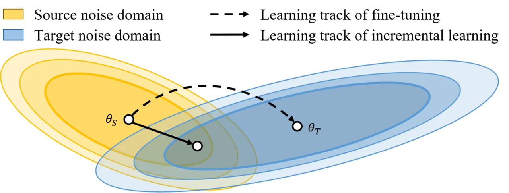
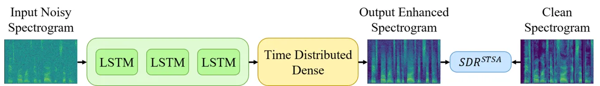
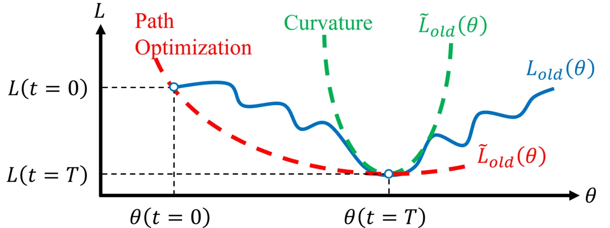
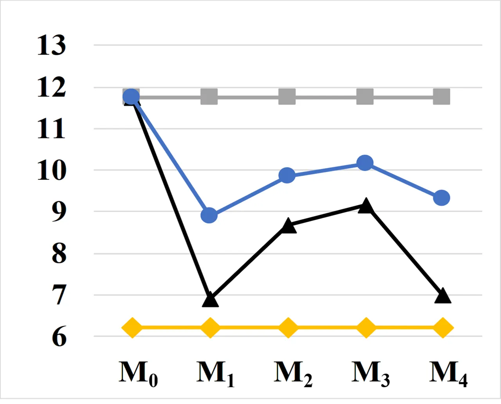
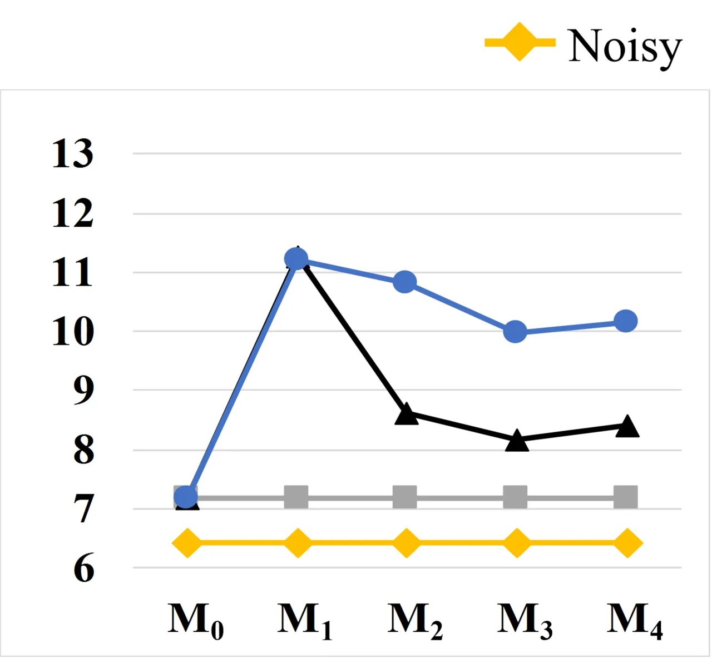
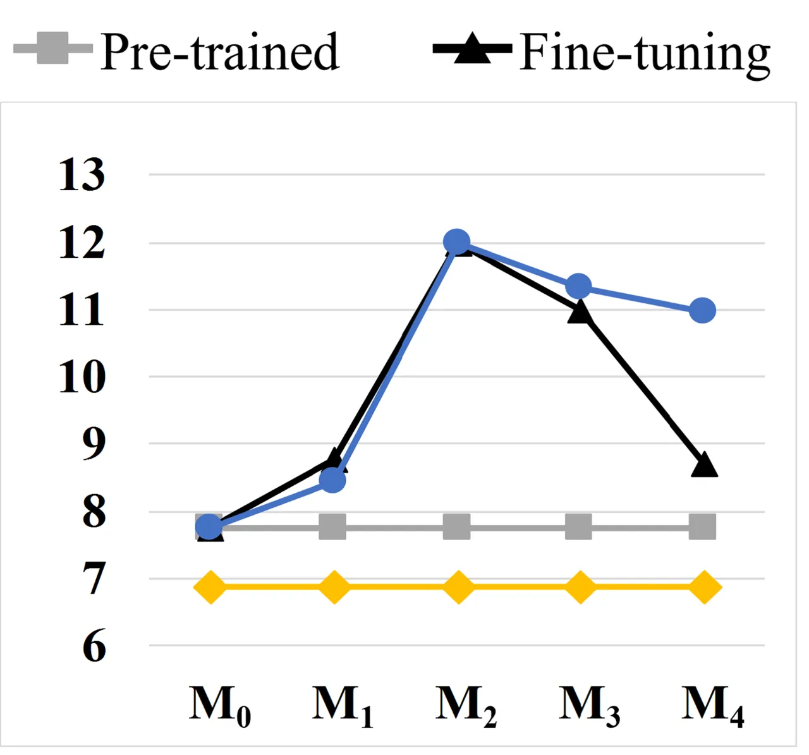
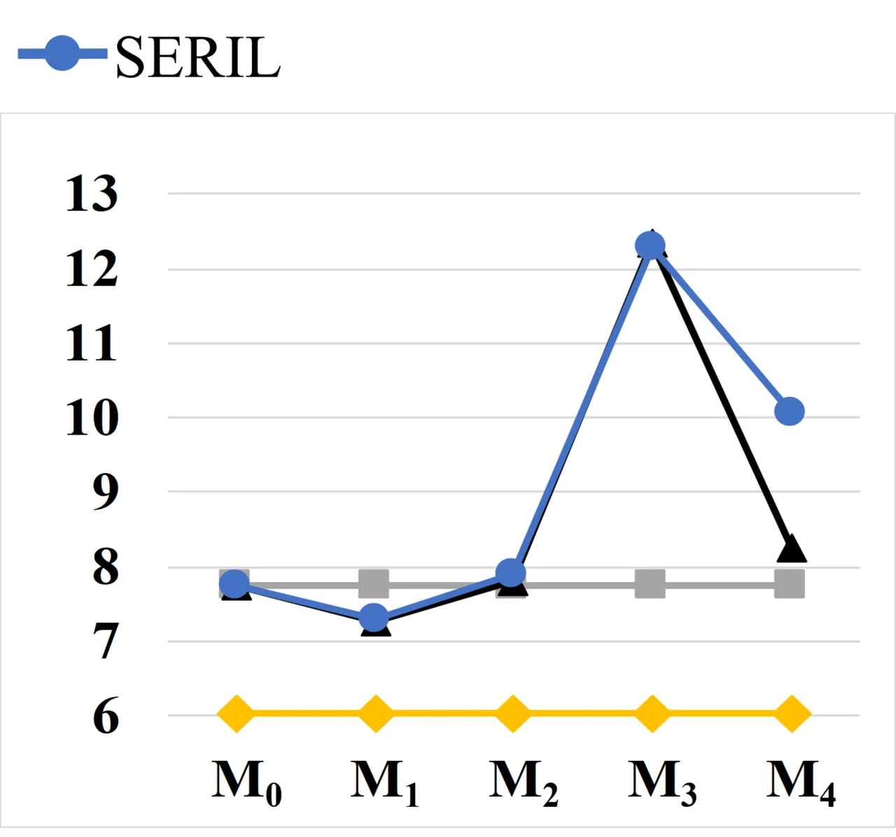
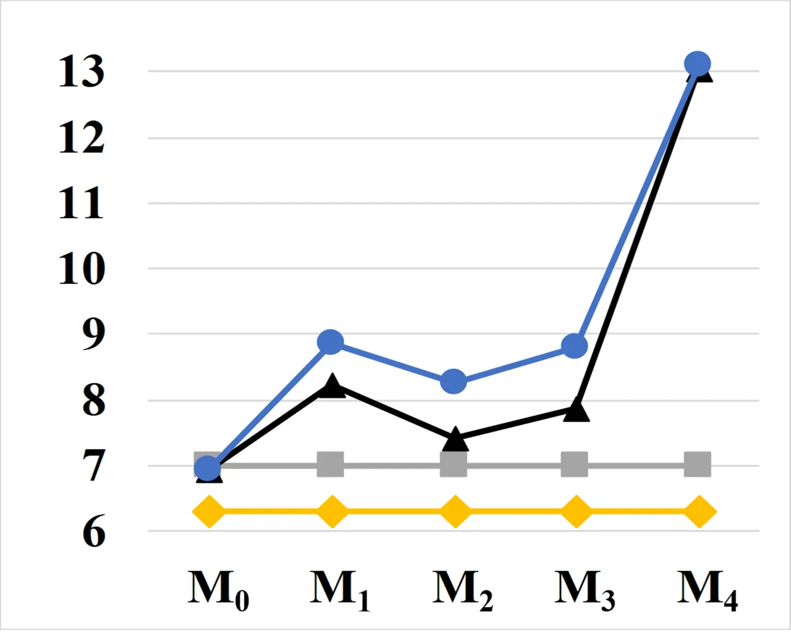

# SERIL: Noise Adaptive Speech Enhancement using Regularization-based Incremental Learning

###### Abstract

Numerous noise adaptation techniques have been proposed to fine-tune
deep-learning models in speech enhancement (SE) for mismatched noise
environments. Nevertheless, adaptation to a new environment may lead to
catastrophic forgetting of the previously learned environments. The
catastrophic forgetting issue degrades the performance of SE in
real-world embedded devices, which often revisit previous noise
environments. The nature of embedded devices does not allow solving the
issue with additional storage of all pre-trained models or earlier
training data. In this paper, we propose a regularization-based
incremental learning SE (SERIL) strategy, complementing existing noise
adaptation strategies without using additional storage. With a
regularization constraint, the parameters are updated to the new noise
environment while retaining the knowledge of the previous noise
environments. The experimental results show that, when faced with a new
noise domain, the SERIL model outperforms the unadapted SE model.
Meanwhile, compared with the current adaptive technique based on
fine-tuning, the SERIL model can reduce the forgetting of previous noise
environments by 52%. The results verify that the SERIL model can
effectively adjust itself to new noise environments while overcoming the
catastrophic forgetting issue. The results make SERIL a favorable choice
for real-world SE applications, where the noise environment changes
frequently.

Chi-Chang Lee^(1,2), Yu-Chen Lin^(1,2), Hsuan-Tien Lin¹, Hsin-Min Wang³,
Yu Tsao²

¹Department of Computer Science and Information Engineering, National
Taiwan University, Taiwan

²Research Center for Information Technology Innovation, Academia Sinica,
Taiwan

³Institute of Information Science, Academia Sinica, Taiwan

r08922a27@csie.ntu.edu.tw, f04922077@csie.ntu.edu.tw,
htlin@csie.ntu.edu.tw, whm@iis.sinica.edu.tw, yu.tsao@citi.sinica.edu.tw

Index Terms: Speech enhancement, incremental learning, life-long
learning, noise adaptation, catastrophic forgetting

## 1 Introduction

The objective of speech enhancement (SE) is to transform low-quality
speech signals into enhanced-quality speech signals \[1\]. In many
speech-related applications such as automatic speech recognition (ASR)
\[2\] and speech emotion recognition \[3\], SE is used as a preprocessor
to remove noise components from speech signals. In many portable or
assistive-hearing devices, such as mobile phones \[4\], hearing aids
\[5\], and cochlear implants \[6\], SE is crucial for increasing speech
intelligibility and quality in noise environments.

In the past few years, deep learning (DL)-based models have been widely
used for SE \[7, 8, 9, 10, 11, 12, 13, 14, 15\]. Various deep neural
networks such as convolutional neural networks (CNNs), recurrent neural
networks (RNNs), and long short-term memory (LSTM) have been used as
fundamental models in SE systems. In these systems, some metrics are
defined to measure the distance between the enhanced output and the
clean reference, and the DL models are trained to minimize the distance.
The _L1_ and _L2_ (mean-square-error) losses are commonly used because
of their ease of computation and differentiability. However, these two
losses may not be optimal for specific tasks, and thus other metrics
have been used as the loss to train the DL models \[16, 17\].

In addition to model types and loss functions, another important
consideration for the success of an SE system is its ability to adapt to
new environments, particularly when deployed in embedded devices. In
real-world situations, the noise in the testing environment is unseen in
the training set; moreover, the noise types often vary over time. The
mismatch between training and testing environments can significantly
degrade the performance of SE. Therefore, identifying an approach that
can efficiently and effectively adapt DL models to new testing
conditions and improve the performance of SE is necessary. Thus far,
several domain adaptation approaches \[18, 19, 20, 21\] have been
proposed to address the training-testing acoustic mismatch issue, which
is also known as the _domain shift_ problem. Although noise-adapted
models can provide improved SE results for these conventional
approaches, they often suffer from a _catastrophic forgetting_
effect\[22, 23\]. In other words, when DL models adapt to a new noise
environment, they usually perform poorly when dealing with previously
adapted noise environments.

In this paper, we propose a regularization-based incremental learning
strategy for adapting DL-based SE models to new environments (speakers
and noise types) while handling the catastrophic forgetting issue. The
proposed method is termed SERIL. SERIL exploits the advantages of two
well-known incremental learning algorithms: (1) whole past optimization
path information\[24\] and (2) curvature-based strategy\[25\]. We
evaluated SERIL using two datasets: the Voice Corpus Bank corpus (VCB)
\[26\] and the TIMIT corpus \[27\], which were used to form the training
and testing sets, respectively. The overall SERIL included two phases:
offline and online. In the offline phase, we first trained the DL model
on the utterances from the VCB corpus with 13 different types of noise.
In the online phase, SERIL first adapted the pre-trained model based on
a small amount of adaptation data; then, the adapted model was used for
SE. A direct fine-tuning model adaptation approach was implemented for
comparison. Experimental results show that SERIL and the direct
fine-tuning approach both effectively adapt the SE model to new
environments and improve SE performance, compared with the pre-trained
DL model without adaptation. Moreover, compared to the direct
fine-tuning approach, SERIL maintained high SE performance against all
previously learned types of noise, thus effectively addressing the
catastrophic forgetting problem.

The remainder of this paper is organized as follows. Section 2 presents
some related work and explains the motivation of using incremental
learning strategy to help noise adaptation issue on speech enhancement.
In Section 3, we detail the philosophies of the proposed SERIL system.
The experimental setup and results are then reported in Section 4.
Finally, Section 5 presents some concluding remarks.

## 2 Related Work and Motivation

An intuitive SE method to overcome the mismatch problem is to collect as
many types of noise as possible to increase the generalization
ability\[14\]. However, it is impractical to cover the infinite types of
noise that may be encountered in real situations. Several researches
\[20, 21\] have been proposed to directly fine-tune a pre-trained model
to improve the performance in a target domain. When entering a new
circumstance, these algorithms only focus on the current noise domain,
and ignore the memory of the previously learned noise types. In many
applications, such as edge-devices, the type of noise changes
frequently, and it is common to re-encounter learned types of noise.
However, the adapted SE model cannot perform well in the previously
learned noise types. This effect is called catastrophic forgetting \[22,
23\]. Although the SE model can be fine-tuned every time the environment
is changed, the repeated model adaptation process will result in high
computation and time costs.



Figure 1: Relationship between fine-tuning and incremental learning from
source noise domain to unseen target domain.

The above limitations of adaptive methods based on direct fine-tuning
motivated us to apply the incremental learning algorithm to SE.
Incremental learning is also known as _continuous learning_ or
_life-long learning_. Figure 1 illustrates the relationship between
direct fine-tuning and incremental learning. Training trajectories are
illustrated in a schematic parameter space, with parameter regions
leading to good performance on the source (yellow region) and target
(blue region), denoted as tasks $`S`$ and $`T`$, respectively. After
learning in task $`S`$, the parameters are located in $`\theta_{S}`$. As
shown by the dashed arrow in Figure 1, when the SE model is adapted by
taking gradient steps to minimize the loss based on task $`T`$ alone,
the resulting $`\theta_{T}`$ is beyond the good performance area of Task
$`S`$, i.e., what is already learned in Task $`S`$ is forgotten. In
contrast, in incremental learning, the SE model weights are updated to
the target domain while retaining the knowledge learned from the source
domain. This is often realized by finding the overlapping region of the
source and target domains. The learning trajectory of incremental
learning shown by the solid arrow in Figure 1 illustrates this concept.
In this way, incremental learning can help the resulting model provide
good SE results in the target domain while maintaining satisfactory
performance in the source domain.

## 3 The SERIL System

### 3.1 Architecture and loss function of the SERIL system

The architecture of the SERIL system is depicted in Figure 2. The system
performs SE in the spectral domain. Speech waveforms are first converted
into time-frequency features using a 512-point short-time Fourier
transform (STFT) with a hamming window size of 32 ms and a hop size of
16 ms. Each feature vector consists of 257 elements. The enhanced
spectral features are then converted into the waveform domain by inverse
STFT with an overlap-add method. In the SERIL system, the first 3 layers
are LSTM layers (one-directional LSTM was used for achieving real-time
inference). The hidden dimension of each LSTM is 257. A fully connected
layer is concatenated to the output of the last LSTM layer for scaling.



Figure 2: Architecture of the SERIL system using the short-time spectral
amplitude SDR ($`SDR^{STSA}`$) as the loss function.

As mentioned earlier, the L1 and L2 norms are commonly used as the loss
function to train DL-based SE models. In this study, we derived another
loss function based on the short-time spectral amplitude SDR
($`SDR^{STSA}`$), which was shown to provide better results than L1 and
L2 norms in our preliminary experiments. In a previous study, Kolbæk et
al. \[28\] reported that using the time-domain SDR \[29, 30\] as the
loss can help the SE models to achieve improved performance. Because the
input and output of SERIL are both spectral features, we need to modify
the original SDR loss to use it in the spectral domain. We note that SDR
can be regarded as the energy ratio of enhanced speech projected on the
clean speech space over enhanced speech projected on the orthogonal
space of clean speech. By Parseval’s theorem \[31\] and the linear
property of Fourier transform, the energy ratio in the time domain is
equivalent to that in the time-frequency domain. Therefore, we define
the ($`SDR^{STSA}`$) as follows:

```math
{SDR^{STSA}(\hat{X},X)=10log_{10}\frac{\|\alpha X\|^{2}}{\|\alpha X-\hat{X}\|^{2}}.} \tag{1}
```

Given the noisy spectral features, $`Y`$, the SE model aims to generate
enhanced spectral features, $`\hat{X}`$. $`\alpha`$ is computed by
$`(X\cdot\hat{X})/\|X\|^{2}`$, where $`X`$ is the target clean spectral
features. In addition, $`f_{\theta}(.)`$ is equal to $`\hat{X}`$; thus,
we denote our loss function $`-SDR^{STSA}(f_{\theta}(Y),X)`$ as
$`l_{\theta}(Y)`$.

### 3.2 Curvature-based regularization strategy

Considering the losses in the previous and new acoustic environments,
$`L_{old}`$ and $`L_{new}`$, respectively, the total loss can be
formulated as:

```math
{L(\theta)=L_{new}(\theta)+L_{old}(\theta).} \tag{2}
```

Because the training data of the previous environment is usually not
accessible online, we cannot calculate $`L_{old}(\theta)`$. Instead, we
can assume that the loss of the previous environment can be revealed
from the learned SE model, $`\theta`$. By approximating $`L_{old}`$
using the second-order Taylor expansion at $`\theta=\theta^{*}`$, we
have

```math
{L_{old}(\theta)\approx L_{old}(\theta^{*})+{\delta\theta}^{T}\nabla_{\theta}L_{old}(\theta^{*})+\frac{1}{2}{\delta\theta}^{T}H(\theta^{*}){\delta\theta},} \tag{3}
```

where $`\delta\theta`$ is $`\theta-\theta^{*}`$; $`H(\theta^{*})`$ is
the Hessian matrix of $`L_{old}`$ at $`\theta=\theta^{*}`$; and
$`L_{old}(\theta^{*})`$ is a constant. Because the elements in
$`\nabla_{\theta}L_{old}(\theta^{*})`$ are generally small enough to be
ignored, we can obtain the approximate form as
$`L_{old}(\theta)\approx\frac{1}{2}{\delta\theta}^{T}H(\theta^{*}){\delta\theta}`$.
Similar to the elastic weight consolidation \[25, 32\], we ignore the
cross terms in $`H(\theta^{*})`$ to improve computational efficiency.
The approximate form becomes

```math
{H(\theta^{*})\approx diag(\mathbb{E}_{Y\sim D_{old}}[(\nabla_{\theta}l_{\theta}(Y))(\nabla_{\theta}l_{\theta}(Y))^{T}])|_{\theta=\theta^{*}},} \tag{4}
```

where $`Y`$ is the speech sample from the previous environment
$`D_{old}`$. Finally, substituting (3) and (4) into (2), we have

```math
{L(\theta)\approx L_{new}(\theta)+\lambda\sum_{i}F_{\theta_{i}}(\theta_{i}-\theta_{i}^{*})^{2},} \tag{5}
```

where $`\lambda`$ is a hyperparameter; $`i`$ is the index of the
parameters in the model; $`\theta_{i}`$ and $`\theta^{*}_{i}`$ are the
$`i`$-th parameters in the current and previous environments,
respectively; and $`F_{\theta_{i}}`$ is the diagonal element of
$`H(\theta^{*})`$. The intuitive interpretation of $`F_{\theta_{i}}`$ is
the local curvature, which indicates the sensitivity that affects the
performance of the previous acoustic environment.

Kolouri et al. \[33\] provided a different explanation for the geometric
view of the regularization term, which can be applied to our scenario.
As $`\theta\to\theta^{*}`$,
$`\frac{1}{2}\|\theta-\theta^{*}\|^{2}_{F_{\theta_{i}}}`$ can be
interpreted as the expectation of the squared difference of the loss
values of the training samples of the previous environment, i.e.,
$`\mathbb{E}_{Y\sim D_{old}}[\frac{1}{2}(l_{\theta}(Y)-l_{\theta^{*}}(Y))^{2}]`$.
Similar to (3), the distance can be approximated by
$`\sum_{i}F_{\theta_{i}}(\theta_{i}-\theta_{i}^{*})^{2}`$, which is also
derived by the second-order Taylor expansion of
$`\mathbb{E}_{Y\sim D_{old}}[\frac{1}{2}(l_{\theta}(Y)-l_{\theta^{*}}(Y))^{2}]`$
at $`\theta=\theta^{*}`$. Referring to \[32, 34, 33\], we apply the
interpolation approach to the case of multiple tasks. Given
$`\tilde{F}_{\theta}^{t-1}`$ derived by all previous tasks,
$`\tilde{F}_{\theta}^{t}`$ is updated as

```math
{\tilde{F}_{\theta}^{t}=\alpha F_{\theta}^{t}+(1-\alpha)\tilde{F}_{\theta}^{t-1},} \tag{6}
```

where $`t`$ is the index of the task; $`\alpha`$ is a hyperparameter in
\[0,1\]; $`F_{\theta}^{t}`$ denotes $`F_{\theta}`$ derived from the
($`t-1`$)-th task; and $`\tilde{F}_{\theta}^{t}`$ is the interpolation
result of $`\tilde{F}_{\theta}^{t-1}`$ and $`F_{\theta}^{t}`$,
corresponding to the information of past accumulations and curvatures.

### 3.3 Path optimization augmenting approach

Although $`F_{\theta}`$ is equipped with rationality to avoid
catastrophic forgetting, the commonly used curvature-based methods \[25,
32\] of deriving $`F_{\theta}`$ rely on point estimation, which only
capture local curvature information around $`\theta^{*}`$. In contrast,
the path optimization-based method \[24\] considers the information over
the optimization path on the loss surface. In particular, the importance
score is determined by accumulating over the entire training trajectory,
as illustrated in Figure 3.



Figure 3: Relationship between the real loss (blue), curvature-based
approximate loss (green), and path optimization-based approximate loss
(red) while adapting the SE model. $`t=0`$ and $`t=T`$ are the start and
end times, respectively.

By using the first-order Taylor approximation and setting $`t_{s}`$ and
$`t_{e}`$ as the start and end steps of the $`t`$-th task, the change in
loss $`L`$ over the time from $`t_{s}`$ to $`t_{e}`$ can be written as

```math
\displaystyle L(\theta(t_{e}))-L(\theta(t_{s})) \displaystyle\approx\int_{t_{s}}^{t_{e}}(\nabla_{\theta}L(\theta(t))\cdot\frac{\theta(t)}{dt})dt \tag{7}
```

```math
\displaystyle=\sum_{i}(\int_{t_{s}}^{t_{e}}\frac{\partial L}{\partial\theta_{i}}\frac{d\theta_{i}}{dt}dt),
```

where $`i`$ is the index of the SE model parameter. To simplify the
description, we denote
$`(\int_{t_{s}}^{t_{e}}\frac{\partial L}{\partial\theta_{i}}\frac{d\theta_{i}}{dt}dt)`$
as $`-\Delta L_{i}^{t}`$. Therefore, the change in the total loss can be
represented as the summation of the individual loss $`\Delta L_{i}^{t}`$
associated with each parameter. We put a minus sign on the left side of
$`\Delta L_{i}^{t}`$ to make the sign consistent with the regularization
term. Practically, we replace
$`\int_{t_{s}}^{t_{e}}\frac{\partial L}{\partial\theta_{i}}\frac{d\theta_{i}}{dt}dt`$
with
$`\sum_{\tau=t_{s}}^{t_{e}-1}\frac{\partial L}{\partial\theta_{i}}(\theta_{i}(\tau+1)-\theta_{i}(\tau))`$,
where $`\tau`$ is the index of iteration. From \[24\], the definition of
importance scores as we begin to train the $`t`$-th task can be defined
as

```math
{S_{\theta_{i}}^{t}=\sum_{t^{\prime}<t}\frac{\Delta L_{i}^{t^{\prime}}}{(\Delta\theta_{i}^{t^{\prime}})^{2}+\epsilon},} \tag{8}
```

where $`t^{\prime}`$ is the index of the task before the $`t`$-th task;
$`\theta_{i}^{t^{\prime}}`$ is the $`i`$-th parameter of the SE model
derived from training the $`t^{\prime}`$-th task;
$`\Delta\theta_{i}^{t^{\prime}}`$ is
$`\theta_{i}^{t^{\prime}}-\theta_{i}^{t^{\prime}-1}`$; and $`\epsilon`$
is a hyperparameter with a positive value.

Similar to \[34\], we combined the advantages of curvature-based\[25,
32\] and path optimization-based\[24\] approaches. The importance of
parameter $`\theta_{i}`$ when training the $`t`$-th task can be written
as $`((1-\beta)\tilde{F}_{\theta_{i}}^{t}+\beta S_{\theta_{i}}^{t})`$.
Therefore, the training loss is defined as:

```math
{\tilde{L}^{t}(\theta)=L^{t}(\theta)+\lambda\sum_{i}((1-\beta)\tilde{F}_{\theta_{i}}^{t}+\beta S_{\theta_{i}}^{t})(\theta_{i}-\theta_{i}^{t-1})^{2},} \tag{9}
```

where $`t`$ is the index of the task (if $`t`$ is zero,
$`\tilde{L}^{t}(\theta)`$ is equivalent to $`L^{t}(\theta)`$);
$`\theta_{i}^{t-1}`$ is the $`i`$-th parameter after training the
($`t-1`$)-th task; and $`\beta`$ is a scalar with the value in \[0,1\],
which determines the weight of the two strategies.



(a) $`E_{0}`$: original



(b) $`E_{1}`$: cough



(c) $`E_{2}`$: door moving



(d) $`E_{3}`$: footsteps



(e) $`E_{4}`$: clap

Figure 4: $`SDR^{STSA}`$ scores of incrementally learned models
evaluated on five testing sets. The x-axis lists incrementally learned
models $`M_{0}`$, $`M_{1}`$, $`M_{2}`$, $`M_{3}`$, and $`M_{4}`$. The
y-axis presents the $`SDR^{STSA}`$ score. The scores of the unprocessed
noisy speech, baseline model, direct fine-tuning approach, and proposed
SERIL are represented by yellow, gray, black, and blue lines,
respectively.

## 4 Experiment and Analysis

### 4.1 Experimental Setup

We evaluated the proposed SERIL system on two speech corpora: VCB\[26\]
and TIMIT \[27\]. Three data sets were prepared, namely, the training,
adaptation, and testing sets. For the training set, 2,000 utterances
were randomly selected from the VCB corpus. Each utterance was
contaminated with 13 types of noise (obtained from the NOISEX-92
database\[35\]) at 6 signal-to-noise (SNR) levels (ranging from -3 dB to
12 dB with a step of 3 dB), amounting to 156,000
(=2000$`\times`$13$`\times`$6) paired noisy-clean utterances in total.
This training set is termed $`T_{0}`$. To prepare the adaptation sets,
we randomly selected another 300 utterances from the VCB corpus. These
300 utterances were contaminated with other 4 types of noise (obtained
from the Nonspeech database \[36\]): _cough_, _door moving_,
_footsteps_, and _clap_, at 6 SNR levels (from -3 dB to 12 dB with a
step of 3 dB) to form 4 adaptation sets, termed $`T_{1}`$, $`T_{2}`$,
$`T_{3}`$, and $`T_{4}`$. Each set contained 1,800 (=300$`\times`$6)
paired noisy-clean utterances.

For the testing set, we selected 1,680 utterances from the TIMIT data
set. There were a total of five testing sets. The first testing set,
$`E_{0}`$, corresponded to the training set $`T_{0}`$. The other four
testing sets $`E_{1}`$ to $`E_{4}`$ corresponded to the adaptation sets
$`T_{1}`$ to $`T_{4}`$. For the testing set $`E_{0}`$, there were 1,680
noisy utterances, and the noise types and SNR levels were the same as
those used in $`T_{0}`$. Each utterance was contaminated with one of the
13 noise types at a particular SNR level (one out of 6 SNR levels was
randomly specified). For each of the testing sets $`E_{1}`$ to
$`E_{4}`$, there were also 1,680 noisy utterances, and each utterance
was contaminated with one noise type at a particular SNR level (one out
of the 6 SNR levels was randomly specified). Our implementation is
publicly available for reproducibility¹¹ 1
[https://github.com/ChangLee0903/SERIL](https://github.com/ChangLee0903/SERIL).

Three standardized evaluation metrics were used to measure the
performance: perceptual evaluation of speech quality (PESQ) \[37\],
short-time objective intelligibility measure (STOI) \[38\], and extended
STOI (eSTOI) \[39\]. PESQ was designed to evaluate the quality of
processed speech. The higher the PESQ, the better the speech quality.
Both STOI and eSTOI were designed to compute the speech intelligibility.
The higher STOI and eSTOI scores, the better the speech intelligibility.
In addition, we also reported the $`SDR^{STSA}`$ scores to illustrate
the learning process. The higher the $`SDR^{STSA}`$ score, the smaller
the distortion of the spectral features.

### 4.2 Experimental Results

First, we compared SERIL and the direct fine-tuning approach in terms of
the adaptation capability and the degree of catastrophic forgetting. We
used the training set $`T_{0}`$ to train one baseline model, termed
$`M_{0}`$. Then, based on the four adaptation sets, we sequentially
adapted the model from $`M_{0}`$ to $`M_{1}`$ using $`T_{1}`$, $`M_{1}`$
to $`M_{2}`$ using $`T_{2}`$, $`M_{2}`$ to $`M_{3}`$ using $`T_{3}`$,
and $`M_{3}`$ to $`M_{4}`$ using $`T_{4}`$. The five models ($`M_{0}`$
to $`M_{4}`$) were then tested on the five testing sets ($`E_{0}`$ to
$`E_{4}`$). The $`SDR^{STSA}`$ scores of the five models tested on the
five testing sets are shown in Figure 4. The results of the baseline
model without adaptation and the scores of unprocessed noisy speech are
also given for comparison.

From the figure, we note that although the baseline model $`M_{0}`$
performs well on $`E_{0}`$, where the noise types and SNR levels are
matched during the training and testing stages, notable degradation is
observed for the mismatched conditions (cf. the gray lines on $`E_{1}`$
to $`E_{4}`$). Further, both SERIL and the direct fine-tuning approach
effectively adapt the SE model to each target domain and achieve good
performance. For example, in Figure 4(b), $`M_{1}`$ achieves the best
performance on $`E_{1}`$ for both SERIL and the direct fine-tuning
approach. The model trained by direct fine-tuning tends to forget the
previously learned SE capability, whereas the model trained by SERIL can
maintain good SE performance for previously learned noise types. For
instance, in Figure 4(b), the performance of $`M_{4}`$ trained by direct
fine-tuning is considerably reduced in $`E_{1}`$, showing that the
adapted model has “forgotten” the SE capability for the previously
learned noise type. This is because each noise type has different
structural characteristics in different frequency bands, so direct
fine-tuning without proper constraints can severely distort the modeling
of previous noise environments. In contrast, the performance drop of the
SERIL system for the same training-testing case is relatively minor.
Consistent trends can be observed for all testing sets.

| Metric         | M   | original | cough | door   | foot- | clap  |
| -------------- | --- | -------- | ----- | ------ | ----- | ----- |
|                |     |          |       | moving | steps |       |
| $`SDR^{STSA}`$ | N   | 6.23     | 6.43  | 6.87   | 6.05  | 6.31  |
|                | P   | 11.75    | 7.17  | 7.75   | 7.74  | 7.03  |
|                | F   | 6.99     | 8.39  | 8.72   | 8.27  | 13.05 |
|                | R   | 9.31     | 10.15 | 10.97  | 10.07 | 13.11 |
| PESQ           | N   | 2.266    | 2.041 | 1.864  | 1.868 | 1.474 |
|                | P   | 2.708    | 2.118 | 2.059  | 2.015 | 1.603 |
|                | F   | 2.406    | 2.204 | 2.339  | 2.133 | 2.948 |
|                | R   | 2.461    | 2.375 | 2.581  | 2.381 | 2.936 |
| STOI           | N   | 0.816    | 0.788 | 0.743  | 0.778 | 0.789 |
|                | P   | 0.869    | 0.798 | 0.779  | 0.799 | 0.801 |
|                | F   | 0.811    | 0.816 | 0.825  | 0.829 | 0.923 |
|                | R   | 0.826    | 0.839 | 0.859  | 0.855 | 0.931 |
| eSTOI          | N   | 0.624    | 0.692 | 0.648  | 0.744 | 0.782 |
|                | P   | 0.721    | 0.695 | 0.661  | 0.745 | 0.788 |
|                | F   | 0.638    | 0.698 | 0.687  | 0.745 | 0.853 |
|                | R   | 0.664    | 0.717 | 0.731  | 0.763 | 0.853 |

Table 1: $`SDR^{STSA}`$, PESQ, STOI, and eSTOI scores of model $`M_{4}`$
trained by the fine-tuning method (F) and SERIL (R). The results of
unprocessed noisy speech (N) and the baseline model $`M_{0}`$ without
adaptation (P) are listed for comparison.

Table 1 shows the $`SDR^{STSA}`$, PESQ, STOI, and eSTOI scores of the
final model ($`M_{4}`$) learned using the fine-tuning method and SERIL
on the five testing sets. The scores of unprocessed noisy speech and the
baseline model without adaptation ($`M_{0}`$) are also listed for
comparison. Several observations can be drawn from the table. First,
SERIL performs as well as direct fine-tuning in the current noise
environment in terms of all metrics (cf. the “clap” column in Table 1).
Second, SERIL always outperforms direct fine-tuning for previous
environments in terms of all metrics (cf. the “original” to “footsteps”
columns in Table 1). Third, SERIL performs better than the baseline
model in all testing environments except for “original”, which is under
a matched training-testing condition for the baseline model. It is worth
noting that compared with the direct fine-tuning approach, SERIL
requires only a small amount of additional computational cost and
storage to set the constraints when performing model adaptation.
However, SERIL can produce performance comparable to the direct
fine-tuning approach in each new environment while overcoming the
catastrophic forgetting problem in old environments.

## 5 Concluding Remarks

When deploying an SE system in real-world applications, it is common to
encounter a new noisy environment and re-visit to previous noisy
environments. Although the direct fine-tuning approach can effectively
adapt SE models to new environments, the adapted SE model may suffer
from the catastrophic forgetting problem. The proposed SERIL model not
only yields comparable performance to the direct fine-tuning approach
but also effectively overcomes the catastrophic forgetting problem. To
the best of our knowledge, this paper is the first work that
incorporates incremental learning into SE tasks. Our experimental
results confirmed the effectiveness of the proposed SERIL system for SE
model adaptation and avoiding catastrophic forgetting. Based on the
promising results, we believe that the proposed SERIL model can be used
in various edge-computing devices, where the acoustic condition changes
frequently and the cost of online retraining is high. In addition, we
note that using an appropriate weight, $`\lambda`$, to combine the
curvature-based and path optimization-based strategies can provide
better SE performance in most tasks. Derivation of an algorithm that can
automatically determine the optimal $`\lambda`$ is worthy of further
study.

## References

- \[1\] P. C. Loizou, _Speech Enhancement: Theory and Practice_,
  2nd ed. USA: CRC Press, Inc., 2013.
- \[2\] K.-Y. Chen, S.-H. Liu, B. Chen, H.-M. Wang, and H.-H. Chen,
  “Exploring the use of unsupervised query modeling techniques for
  speech recognition and summarization,” _Speech Communication_,
  vol. 80, pp. 49–59, 2016.
- \[3\] A. Triantafyllopoulos, G. Keren, J. Wagner, I. Steiner, and
  B. W. Schuller, “Towards robust speech emotion recognition using deep
  residual networks for speech enhancement,” in _Proc.
  Interspeech_, 2019.
- \[4\] K. Tan, X. Zhang, and D. Wang, “Real-time speech enhancement
  using an efficient convolutional recurrent network for dual-microphone
  mobile phones in close-talk scenarios,” in _Proc. ICASSP_, 2019.
- \[5\] C.-H. Lee, K.-L. Chen, F. Harris, B. D. Rao, and H. Garudadri,
  “On Mitigating Acoustic Feedback in Hearing Aids with Frequency
  Warping by All-Pass Networks,” in _Proc. Interspeech_, 2019.
- \[6\] Y. Lai, F. Chen, S. Wang, X. Lu, Y. Tsao, and C. Lee, “A deep
  denoising autoencoder approach to improving the intelligibility of
  vocoded speech in cochlear implant simulation,” _IEEE Transactions on
  Biomedical Engineering_, vol. 64, pp. 1568–1578, 2017.
- \[7\] M. Kolbæk, Z. Tan, and J. Jensen, “Speech intelligibility
  potential of general and specialized deep neural network based speech
  enhancement systems,” _IEEE/ACM Transactions on Audio, Speech, and
  Language Processing_, vol. 25, pp. 153–167, 2017.
- \[8\] Z. Chen, S. Watanabe, H. Erdogan, and J. R. Hershey, “Speech
  enhancement and recognition using multi-task learning of long
  short-term memory recurrent neural networks,” in _INTERSPEECH_, 2015.
- \[9\] B. Xia and C. Bao, “Wiener filtering based speech enhancement
  with weighted denoising auto-encoder and noise classification,”
  _Speech Communication_, vol. 60, pp. 13 – 29, 2014.
- \[10\] K. Qian, Y. Zhang, S. Chang, X. Yang, D. Florêncio, and
  M. Hasegawa-Johnson, “Speech enhancement using bayesian wavenet,” in
  _Proc. Interspeech_, 2017.
- \[11\] J. Qi, J. Du, S. M. Siniscalchi, and C. Lee, “A theory on deep
  neural network based vector-to-vector regression with an illustration
  of its expressive power in speech enhancement,” _IEEE/ACM Transactions
  on Audio, Speech, and Language Processing_, vol. 27, 2019.
- \[12\] S. Wang, W. Li, S. M. Siniscalchi, and C. Lee, “A cross-task
  transfer learning approach to adapting deep speech enhancement models
  to unseen background noise using paired senone classifiers,” in _Proc.
  ICASSP_, 2020.
- \[13\] X. Lu, Y. Tsao, S. Matsuda, and C. Hori, “Speech enhancement
  based on deep denoising autoencoder.” in _Proc. Interspeech_, 2013.
- \[14\] Y. Xu, J. Du, L. Dai, and C. Lee, “A regression approach to
  speech enhancement based on deep neural networks,” _IEEE/ACM
  Transactions on Audio, Speech, and Language Processing_, vol. 23, pp.
  7–19, 2015.
- \[15\] Y.-C. Lin, Y.-T. Hsu, S.-W. Fu, Y. Tsao, and T.-W. Kuo,
  “IA-NET: Acceleration and compression of speech enhancement using
  integer-adder deep neural network,” in _Proc. Interspeech_, 2019.
- \[16\] S. Fu, C. Liao, Y. Tsao, and S. Lin, “MetricGAN: Generative
  adversarial networks based black-box metric scores optimization for
  speech enhancement,” in _Proc. ICML_, 2019.
- \[17\] Q. Wang, J. Du, L. Chai, L.-R. Dai, and C.-H. Lee, “A maximum
  likelihood approach to masking-based speech enhancement using deep
  neural network,” in _Proc. ISCSLP_, 2018.
- \[18\] Y. Ganin, E. Ustinova, H. Ajakan, P. Germain, H. Larochelle,
  F. Laviolette, M. Marchand, and V. Lempitsky, “Domain-Adversarial
  training of neural networks,” _J. Mach. Learn. Res._, vol. 17, pp.
  2096––2030, 2016.
- \[19\] C.-F. Liao, Y. Tsao, H.-Y. Lee, and H.-M. Wang, “Noise adaptive
  speech enhancement using domain adversarial training,” in _Proc.
  Interspeech_, 2019.
- \[20\] J. Yosinski, J. Clune, Y. Bengio, and H. Lipson, “How
  transferable are features in deep neural networks?” in _Proc.
  NeurIPS_, 2014.
- \[21\] J. Donahue, Y. Jia, O. Vinyals, J. Hoffman, N. Zhang, E. Tzeng,
  and T. Darrell, “DeCAF: A deep convolutional activation feature for
  generic visual recognition,” in _Proc. ICML_, 2014.
- \[22\] M. C. Choy, D. Srinivasan, and R. L. Cheu, “Neural networks for
  continuous online learning and control,” _IEEE Transactions on Neural
  Networks_, vol. 17, pp. 1511–1531, 2006.
- \[23\] I. J. Goodfellow, M. Mirza, D. Xiao, A. Courville, and
  Y. Bengio, “An empirical investigation of catastrophic forgetting in
  gradient-based neural networks,” in _Proc. ICLR_, 2014.
- \[24\] F. Zenke, B. Poole, and S. Ganguli, “Continual learning through
  synaptic intelligence,” in _Proc. ICML_, 2017.
- \[25\] J. Kirkpatrick, R. Pascanu, N. Rabinowitz, J. Veness,
  G. Desjardins, A. A. Rusu, K. Milan, J. Quan, T. Ramalho,
  A. Grabska-Barwinska, D. Hassabis, C. Clopath, D. Kumaran, and
  R. Hadsell, “Overcoming catastrophic forgetting in neural networks,”
  _Proc. of the National Academy of Sciences_, pp. 3521–3526, 2017.
- \[26\] C. Veaux, J. Yamagishi, and S. King, “The voice bank corpus:
  Design, collection and data analysis of a large regional accent speech
  database,” in _Proc. O-COCOSDA/CASLRE_, 2013.
- \[27\] J. S. Garofolo, L. F. Lamel, W. M. Fisher, J. G. Fiscus, D. S.
  Pallett, and N. Y. Dahlgren, “DARPA TIMIT acoustic-phonetic continous
  speech corpus CD-ROM. NIST speech disc 1-1.1,” _NASA STI/Recon
  Technical Report N_, vol. 93, p. 27403, 1993.
- \[28\] M. Kolbæk, Z. Tan, S. H. Jensen, and J. Jensen, “On loss
  functions for supervised monaural time-domain speech enhancement,”
  _IEEE/ACM Transactions on Audio, Speech, and Language Processing_,
  vol. 28, pp. 825–838, 2020.
- \[29\] E. Vincent, R. Gribonval, and C. Fevotte, “Performance
  measurement in blind audio source separation,” _IEEE/ACM Transactions
  on Audio, Speech, and Language Processing_, vol. 14, pp.
  1462–1469, 2006.
- \[30\] J. Le Roux, S. Wisdom, H. Erdogan, and J. R. Hershey,
  “SDR-half-baked or well done?” in _Proc. ICASSP_, 2019.
- \[31\] F. de Parseval, _Les Parseval et leurs alliances pendant trois
  siècles (1594-1900): Par Frédéric de Parseval Parseval Généalogies et
  Souvenirs de Famille_. J. Castanet, 1901.
- \[32\] J. Schwarz, W. Czarnecki, J. Luketina, A. Grabska-Barwinska,
  Y. W. Teh, R. Pascanu, and R. Hadsell, “Progress $`\&`$ Compress: A
  scalable framework for continual learning,” in _Proc. ICML_, 2018.
- \[33\] S. Kolouri, N. A. Ketz, A. Soltoggio, and P. K. Pilly, “Sliced
  cramer synaptic consolidation for preserving deeply learned
  representations,” in _Proc. ICLR_, 2020.
- \[34\] A. Chaudhry, P. K. Dokania, T. Ajanthan, and P. H. Torr,
  “Riemannian walk for incremental learning: Understanding forgetting
  and intransigence,” in _Proc. ECCV_, 2018.
- \[35\] A. Varga and H. J. M. Steeneken, “Assessment for automatic
  speech recognition: II. NOISEX-92: A database and an experiment to
  study the effect of additive noise on speech recognition systems.”
  _Speech Communication_, vol. 12, pp. 247–251, 1993.
- \[36\] G. Hu and D. Wang, “A tandem algorithm for pitch estimation and
  voiced speech segregation,” _IEEE/ACM Transactions on Audio, Speech,
  and Language Processing_, vol. 18, pp. 2067–2079, 2010.
- \[37\] A. W. Rix, J. G. Beerends, M. P. Hollier, and A. P. Hekstra,
  “Perceptual evaluation of speech quality (PESQ)-a new method for
  speech quality assessment of telephone networks and codecs,” in _Proc.
  ICASSP_, 2001.
- \[38\] C. H. Taal, R. C. Hendriks, R. Heusdens, and J. Jensen, “A
  short-time objective intelligibility measure for time-frequency
  weighted noisy speech,” in _Proc. ICASSP_, 2010.
- \[39\] J. Jensen and C. H. Taal, “An algorithm for predicting the
  intelligibility of speech masked by modulated noise maskers,”
  _IEEE/ACM Transactions on Audio, Speech, and Language Processing_,
  vol. 24, pp. 2009–2022, 2016.
