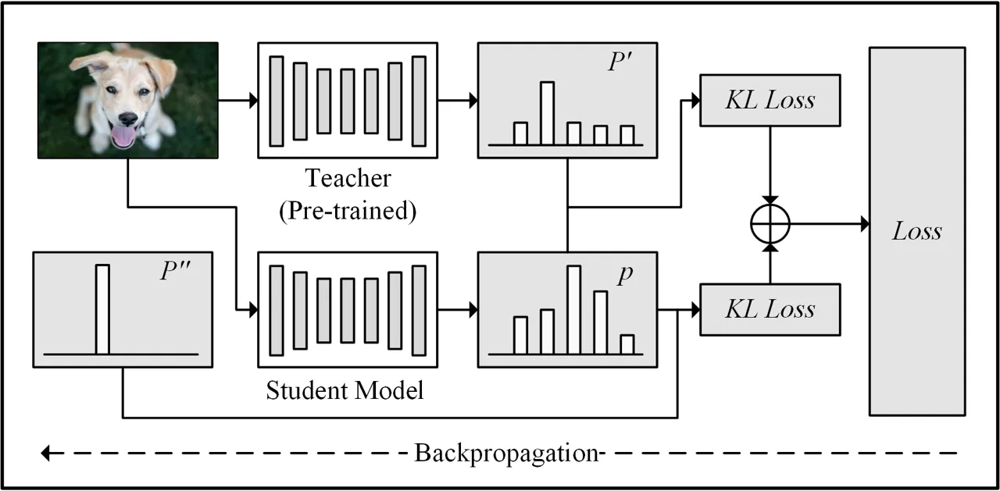
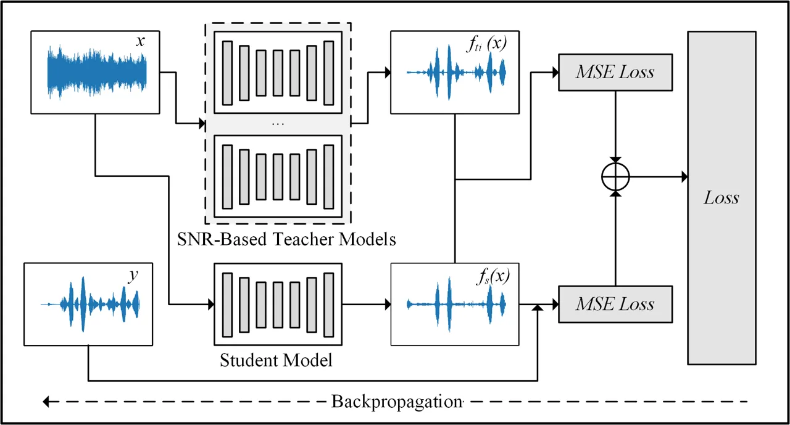
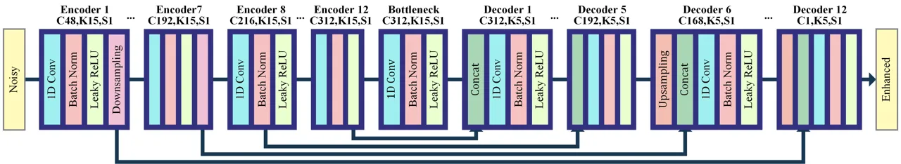
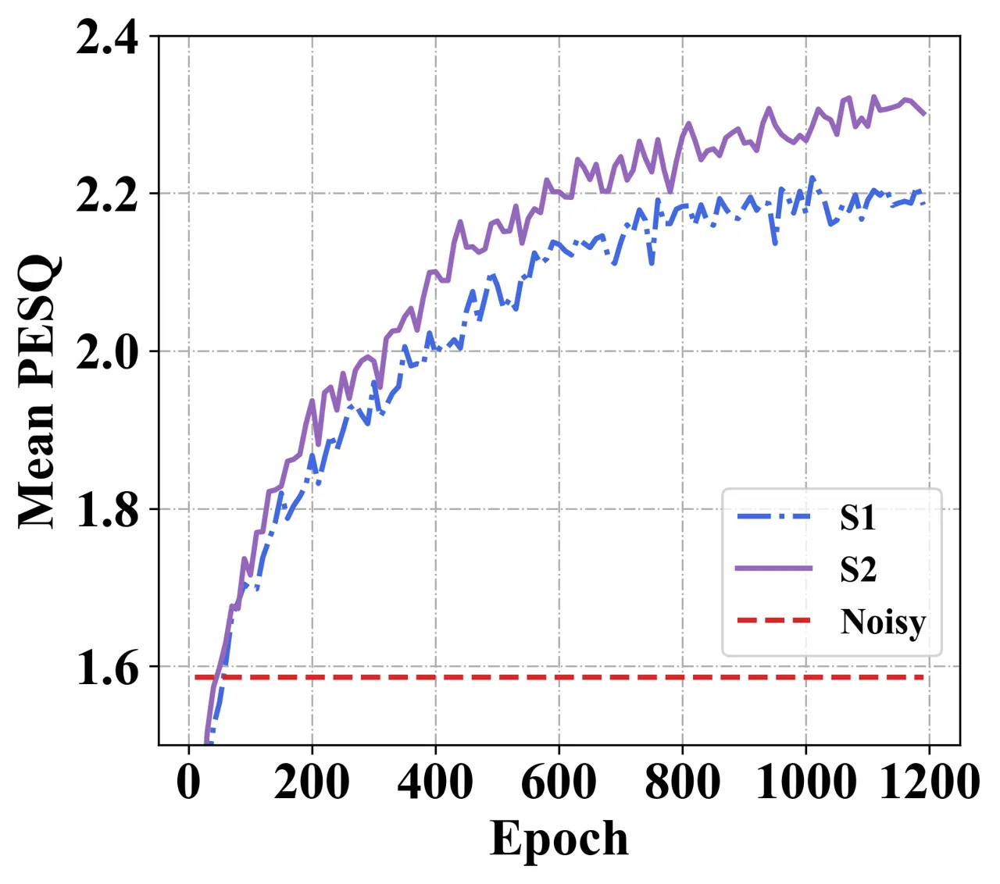
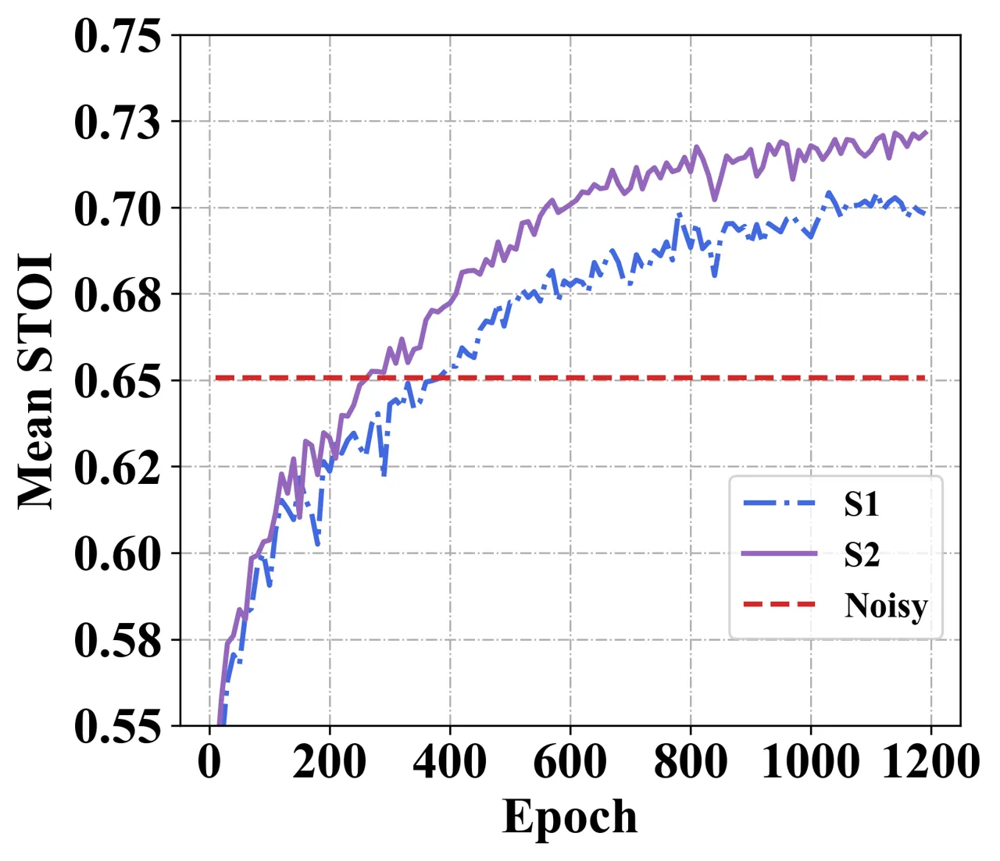

# SNR-based teachers-student technique for speech enhancement

###### Abstract

It is very challenging for speech enhancement methods to achieves robust
performance under both high signal-to-noise ratio (SNR) and low SNR
simultaneously. In this paper, we propose a method that integrates an
SNR-based teachers-student technique and time-domain U-Net to deal with
this problem. Specifically, this method consists of multiple teacher
models and a student model. We first train the teacher models under
multiple small-range SNRs that do not coincide with each other so that
they can perform speech enhancement well within the specific SNR range.
Then, we choose different teacher models to supervise the training of
the student model according to the SNR of the training data. Eventually,
the student model can perform speech enhancement under both high SNR and
low SNR. To evaluate the proposed method, we constructed a dataset with
an SNR ranging from -20dB to 20dB based on the public dataset. We
experimentally analyzed the effectiveness of the SNR-based
teachers-student technique and compared the proposed method with several
state-of-the-art methods.

|                                                                                 |
| ------------------------------------------------------------------------------- |
| Xiang Hao, Xiangdong Su^(∗), Zhiyu Wang, Qiang Zhang, Huali Xu and Guanglai Gao |
| Inner Mongolia Key Laboratory of Mongolian Information Processing Technology,   |
| College of Computer Science, Inner Mongolia Univeristy, Hohhot, China           |
| haoxiangsnr@gmail.com, cssxd@imu.edu.cn                                         |

Index Terms—  speech enhancement, knowledge distillation,
teacher-student technique, low SNR

## 1 Introduction

Speech enhancement is to separate clean speech from noisy speech \[1\].
It is an essential branch of speech signal processing and has been
widely studied in the past few decades. It can be used in hearing aids,
voice recorders, and smart speakers, as well as the front end of tasks
such as speech recognition \[2\] and speaker recognition \[3\]. In
recent years, a large number of speech enhancement methods based on deep
learning have been proposed \[4\] \[5\] \[6\] \[7\] \[8\], showing
stronger robustness than traditional signal-based methods. These methods
can generally be divided into time-domain methods and frequency-domain
methods. The time-domain methods \[9\] \[10\] use the neural network to
directly map noisy speech waveform to clean speech waveform and usually
do not require any preprocessing. The frequency-domain methods generally
use short-term Fourier transform (STFT) to convert the noisy speech from
the time domain to the frequency domain. They then use the neural
network to map the magnitude spectrum of the noisy speech to some
masking \[11\] or the magnitude spectrum of the clean speech \[5\].
Compared with the chaotic time-domain sampling points, the magnitude
spectrum contains more geometric information, which makes it easier to
calculate losses and analyze frequency components. As the SNR of noisy
speech decreases, the correct phase becomes more and more important for
speech intelligibility and quality \[12\]. However, since the mapping of
the phase spectrum is complicated (no obvious geometric structure), the
speech enhancement methods in the time domain are also widely used.

With the increasing demand for speech-related services in recent years,
the scenarios that need to be addressed for speech enhancement are
becoming more and more challenging. A noticeable trend is that the range
of SNR of the noisy speech is significantly expanded. Typical scenarios
include stations, factories, subways, and shopping malls. The increased
range of SNR means that speech enhancement needs to have the ability to
enhance a wide range of background noises of different intensities. When
the background noise is low, the main goal of the speech enhancement is
to improve the hearing sense of the speech. When the background noise is
high (in extreme cases (below -10dB), noisy speech is even hard to be
heard), the speech enhancement needs to enhance the speech that is
difficult to be heard to a clearer speech.

To better perform speech enhancement in the above scenarios, this paper
proposes a speech enhancement method based on knowledge
distillation \[13\] and time-domain U-Net. Our motivation is as follows.
Speech enhancement can be viewed as a particular task of speech
separation. In speech separation, Wave-U-Net \[14\], a model in the time
domain, has achieved state-of-the-art performance. It can perform
feature mapping directly in the time domain to avoid processing the
phase. Inspired by it, we built a powerful time-domain model suitable
for speech enhancement.

To enable the speech enhancement model to handle both high SNR and low
SNR, there are usually two solutions. The first solution is providing a
large amount of training data at each SNR and training a large-scale
neural network. The second solution is to integrate multiple different
models for a specific SNR range to process the noisy speech in parallel
or serially. However, the disadvantage of the former is that large-scale
neural networks will consume a lot of computing resources, memories, and
times. The problem of the latter is that it needs to train multiple
models, which is very troublesome to deploy and severely limits the
application. To deal with the above problems, we introduce the knowledge
distillation, which has been widely used in image recognition \[15\] and
speech recognition \[16\]. Knowledge distillation can extract knowledge
from a large teacher model and improve the performance of a small
student model. It is also called the teacher-student technique. In this
paper, we extend the traditional teacher-student technique and propose
an SNR-based teachers-student technique. We first build multiple teacher
speech enhancement models and train them independently with the datasets
of small SNR range. Then we build a student model. To make the student
model have the ability to handle both high SNR and low SNR, we will use
different teacher models to guide its training according to the SNR of
the training data.

To evaluate the proposed method, we construct a challenging speech
enhancement dataset that covers a wide range of SNR (-20dB to 20dB). We
experimentally analyzed the effectiveness of the SNR-based
teachers-student technique and compared the proposed method with several
state-of-the-art (SOTA) methods.

### 1.1 Method

### 1.2 SNR-based teachers-student technique



Fig. 1: An illustration of the standard knowledge distillation.



Fig. 2: An illustration of the SNR-based teachers-student technique.

We show the standard knowledge distillation in Figure 1. The idea behind
knowledge distillation is that the soft probability output
$`p^{\prime}`$ of a pre-trained teacher model contains more information
than the correct class label $`p^{\prime\prime}`$. If the teacher model
gives higher probabilities for specific categories, then this indicates
that the categories of the input image should be near these categories.
Knowledge distillation forces the student model to minimize the
difference between its probability output $`p`$ and the teacher’s
probability output $`p^{\prime}`$ to extract the additional knowledge
that the teacher model obtained when calculating the correct
probability. We usually use knowledge distillation to distill the
information learned by large networks and pass it to networks with small
parameters and weak learning capabilities. In this paper, we extend the
standard knowledge distillation. The workflow are shown in Figure 2.
First, we train multiple teacher models who are proficient in speech
enhancement at a specific small SNR range. Then we use the teacher
models to guide the training of the student model so that the student
model can perform speech enhancement under both high SNR and low SNR.
Below we describe the entire process.

Train the teacher models. We use $`f_{T}=\{f_{t_{1}},f_{t_{2}},...\}`$
to represent the set of teacher models. We use $`f_{t_{i}}`$ represents
the $`i`$-th teacher model. The dataset of each teacher model covers
only a small range of SNRs, and the range of SNRs covered by each
teacher’s dataset does not overlap each other. After sufficient
training, we get multiple teacher models that are good at dealing with
the SNR covered by their dataset. We fixed the weights of the teacher
models.

Forward calculation. We use $`x`$ to represent a noisy speech, and $`y`$
to represent the clean speech corresponding to the $`x`$. We input the
$`x`$ to the SNR-based teacher models. According to the SNR of $`x`$,
the training algorithm will select a teacher model $`f_{t_{i}}`$ to
obtain the enhanced speech $`f_{t_{i}}(x)`$. We also input $`x`$ to the
student model $`f_{s}`$ to get the enhanced speech $`f_{s}(x)`$.

Distill knowledge from the teacher model. We use a $`L_{2}`$ loss
function to minimize the difference between the output of the student
model and the teacher model. This loss can extract additional knowledge
from the teacher model during the student training process, and
strengthen the student model’s ability to enhance speech at a specific
SNR. We still need to preserve the loss between the enhanced speech of
the student model $`f_{s}(x)`$ and the clean speech $`y`$. The overall
loss $`L`$ is as follows:

```math
\displaystyle L=\alpha\frac{1}{2}{||f_{s}(x)-f_{t_{i}}(x)||}^{2}+(1-\alpha)\frac{1}{2}{||f_{s}(x)-y||}^{2} \tag{1}
```

where $`\alpha`$ is the weight of the knowledge obtained from the
teachers, which is determined based on the validation dataset.



Fig. 3: The network structure of the time-domain U-Net model. $`C`$
represents the number of convolution kernels, $`K`$ represents the size
of the convolution kernels, and $`S`$ represents the stride. All
convolutional layers of the model use same-padding.

### 1.3 Model structure

As the SNR of noisy speech decreases, the correct phase becomes more and
more critical for speech enhancement. However, since the phase spectrum
mapping is complicated, we conduct speech enhancement in the time
domain. Inspired by Wave-U-Net \[14\], we designed a time-domain speech
enhancement model based on one-dimensional (1D) convolutional neural
networks. The teacher models and student model both take such the
network structure. The input of the model is a fixed-length noisy speech
signal, and the output is an enhanced speech signal. The model contains
three parts: Encoder, Bottleneck, and Decoder, and its structure is
shown in Figure 3. Below we describe it in detail.

The Encoder part consists of 12 consecutive encoder blocks. The first
seven encoder blocks use the same structure: “1D convolutional layer +
batch normalization + leaky ReLU + downsampling layer”. 1D convolutional
layers can be used for feature extraction and integration. The
parameters of the convolutional layers are listed above each encoder
block. These seven encoder blocks all contain a downsampling layer,
which can select one sampling point from two adjacent sampling points as
output. After their processing, the size of the input signal in the time
dimension will gradually become smaller. The structure of the remaining
five encoder blocks in the Encoder is similar to that of the previous
seven encoder blocks, but they do not contain a downsampling layer. For
the time-domain model, since the first convolution layer of the model
plays a critical role \[17\], we set the number of convolution kernels
in the first convolution layer to a larger value (48), so that the model
can better extract the features of the speech waveform. The number of
convolution kernels in the remaining convolutional layers increases with
the step size of 24 as the number of layers of the network increases.
The structure of the Bottleneck section is the same as that of the
Encoder.

The Decoder part contains 12 consecutive decoder blocks. The beginning
of each decoder block contains the concatenation operation, which is
used to concatenate the underlying features passed through the
skip-connection. In order to maintain symmetry, the last seven decoder
blocks in the decoder part all include the upsampling layer. The
upsampling layer doubles the size of the feature map in the time
dimension by linear interpolation, and finally restores the size
corresponding to the input speech waveform. The remaining structure of
the decoder blocks are similar to the encoder blocks.

|                 |          |       |       |       |       |       |        |       |       |       |       |       |       |       |       |        |       |       |       |
| --------------- | -------- | ----- | ----- | ----- | ----- | ----- | ------ | ----- | ----- | ----- | ----- | ----- | ----- | ----- | ----- | ------ | ----- | ----- | ----- |
| Noise           | Target   | PESQ  |       |       |       |       |        |       |       |       | STOI  |       |       |       |       |        |       |       |       |
|                 |          | Seen  |       |       |       |       | Unseen |       |       |       | Seen  |       |       |       |       | Unseen |       |       |       |
|                 |          | -20dB | -10dB | 0dB   | 10dB  | 20dB  | -15dB  | -5dB  | 5dB   | 15dB  | -20dB | -10dB | 0dB   | 10dB  | 20dB  | -15dB  | -5dB  | 5dB   | 15dB  |
| Babble          | Noisy    | 0.973 | 1.025 | 1.438 | 2.215 | 2.900 | 0.703  | 1.079 | 1.823 | 2.573 | 0.326 | 0.443 | 0.641 | 0.815 | 0.912 | 0.362  | 0.547 | 0.740 | 0.871 |
|                 | Enhanced | 1.410 | 1.495 | 2.258 | 2.816 | 3.227 | 1.084  | 1.783 | 2.577 | 3.018 | 0.336 | 0.552 | 0.808 | 0.901 | 0.941 | 0.377  | 0.671 | 0.861 | 0.923 |
| Destroyer       | Noisy    | 0.924 | 0.886 | 1.326 | 2.087 | 2.777 | 0.783  | 1.050 | 1.716 | 2.442 | 0.361 | 0.462 | 0.646 | 0.839 | 0.937 | 0.399  | 0.548 | 0.750 | 0.894 |
| engine          | Enhanced | 1.230 | 1.727 | 2.400 | 2.790 | 3.143 | 1.315  | 2.083 | 2.574 | 2.966 | 0.423 | 0.637 | 0.831 | 0.899 | 0.941 | 0.482  | 0.739 | 0.868 | 0.923 |
| Destroyer       | Noisy    | 0.411 | 0.844 | 1.525 | 2.285 | 2.997 | 0.432  | 1.077 | 1.926 | 2.640 | 0.355 | 0.472 | 0.669 | 0.817 | 0.908 | 0.400  | 0.572 | 0.753 | 0.868 |
| ops             | Enhanced | 1.140 | 1.762 | 2.471 | 2.941 | 3.342 | 1.461  | 2.169 | 2.727 | 3.130 | 0.449 | 0.644 | 0.840 | 0.904 | 0.941 | 0.498  | 0.754 | 0.872 | 0.928 |
| Factory floor 1 | Noisy    | 0.855 | 0.831 | 1.338 | 2.137 | 2.894 | 0.906  | 0.989 | 1.744 | 2.516 | 0.322 | 0.437 | 0.624 | 0.817 | 0.920 | 0.373  | 0.525 | 0.727 | 0.874 |
|                 | Enhanced | 1.070 | 1.631 | 2.322 | 2.811 | 3.191 | 1.296  | 1.993 | 2.538 | 2.975 | 0.368 | 0.577 | 0.803 | 0.898 | 0.941 | 0.415  | 0.708 | 0.857 | 0.921 |
| Speech shaped   | Noisy    | 0.640 | 0.547 | 1.307 | 2.116 | 2.850 | 0.424  | 0.921 | 1.724 | 2.490 | 0.349 | 0.443 | 0.628 | 0.817 | 0.922 | 0.384  | 0.525 | 0.733 | 0.877 |
| noise           | Enhanced | 0.995 | 1.588 | 2.356 | 2.820 | 3.152 | 1.232  | 1.989 | 2.591 | 2.984 | 0.444 | 0.553 | 0.804 | 0.896 | 0.943 | 0.460  | 0.700 | 0.860 | 0.922 |
| Pedestrian      | Noisy    | 0.924 | 0.774 | 1.407 | 2.178 | 2.902 | 0.616  | 1.061 | 1.813 | 2.518 | 0.333 | 0.461 | 0.646 | 0.815 | 0.909 | 0.390  | 0.550 | 0.737 | 0.873 |
| area            | Enhanced | 1.185 | 1.370 | 2.222 | 2.802 | 3.235 | 1.244  | 1.803 | 2.534 | 2.965 | 0.341 | 0.523 | 0.796 | 0.898 | 0.937 | 0.407  | 0.681 | 0.856 | 0.924 |
| On the bus      | Noisy    | 0.636 | 1.377 | 2.038 | 2.906 | 3.608 | 0.859  | 1.753 | 2.474 | 3.198 | 0.513 | 0.703 | 0.784 | 0.860 | 0.907 | 0.610  | 0.751 | 0.832 | 0.885 |
|                 | Enhanced | 1.242 | 2.277 | 2.746 | 3.287 | 3.728 | 1.835  | 2.569 | 3.039 | 3.457 | 0.517 | 0.785 | 0.874 | 0.910 | 0.938 | 0.643  | 0.839 | 0.892 | 0.924 |
| Cafe            | Noisy    | 0.665 | 0.911 | 1.645 | 2.404 | 3.234 | 0.704  | 1.211 | 2.049 | 2.775 | 0.344 | 0.495 | 0.691 | 0.853 | 0.934 | 0.422  | 0.577 | 0.783 | 0.894 |
|                 | Enhanced | 0.981 | 1.584 | 2.378 | 2.954 | 3.445 | 1.185  | 1.934 | 2.721 | 3.140 | 0.357 | 0.619 | 0.819 | 0.909 | 0.948 | 0.477  | 0.722 | 0.875 | 0.929 |
| Street          | Noisy    | 0.806 | 0.776 | 1.715 | 2.453 | 3.139 | 0.492  | 1.205 | 2.106 | 2.799 | 0.399 | 0.545 | 0.726 | 0.841 | 0.919 | 0.508  | 0.634 | 0.800 | 0.878 |
|                 | Enhanced | 1.286 | 1.844 | 2.589 | 3.044 | 3.489 | 1.591  | 2.179 | 2.851 | 3.217 | 0.402 | 0.675 | 0.857 | 0.908 | 0.941 | 0.554  | 0.778 | 0.888 | 0.927 |

Table 1: The PESQ and STOI of the proposed method at different SNRs and
different noises.

## 2 Experiment

### 2.1 Dataset

We use public datasets to evaluate the proposed method.

For SNR-based teacher models: In this paper, we set up four teacher
models. In order to train the teacher models for different SNR ranges,
we randomly select 950 clean speeches from the TIMIT \[18\] training
dataset, and mixed speech shaped noise, babble, destroy engine,
destroyer ops and factory floor 1 (from NoiseX-92 dataset \[19\]) under
different SNRs to generate the noisy speech dataset. The SNRs of the
four teacher models are {-20, -17, -13, -11}dB, {-10, -7, -3, 1}dB, {0,
3, 7, 9}dB, and {10, 13, 17, 20}dB. In the end, we generated 19,000
noisy speeches for each teacher model, of which 18,000 speeches were
used as the training dataset and the rest were used as the validation
dataset.

For student model: We randomly selected 950 speeches from the TIMIT
training dataset and mixed them with the five noises that appeared in
the training dataset of the teacher models at {-20, -10, 0, 10, 20}dB.
This produces 23,750 noisy speeches. Among them, 22,000 were used as the
training dataset, and 1,750 were used the validation dataset. To
evaluate the student model, we randomly selected 100 speeches from the
TIMIT test dataset, mixing with five noises that appeared in the above
two datasets and four noises from the CHiME-4 \[20\] dataset (pedestrian
area noise, on the bus noise, cafe noise, and street noise) at {-20,
-15, -10, -5, 0, 5, 10, 15, 20}dB. The resulting 8,100 noisy speeches
act as the test dataset. It is worth mentioning that the test dataset of
the student model contains noises, SNRs, and speakers that have not
appeared in the training dataset, which makes speech enhancement very
challenging.

We use PESQ \[21\] and STOI \[22\] to measure speech quality and
intelligibility, respectively.

### 2.2 Implementation and training details

The sampling rate of all speeches is 16,000Hz. The input length of all
models is fixed. Before the beginning of each training epoch, we will
select consecutive 16,384 sampling points (1.024 seconds) from the
random position of noisy speech as the input of the model. Except for
the learning rate, other experimental parameters are the same for all
models. We use Adam optimizer \[23\] (decay rates $`\beta_{1}=0.9`$,
$`\beta_{2}=0.999`$) and set the batch size to 16. we set $`\alpha`$ of
leaky ReLU to 0.1. We set the learning rate of the teacher models to a
small constant of 0.0002. We set the initial learning rate of the
student model to 0.002, which is reduced twice by every 300 epochs until
the validation loss does not decrease. According to the validation
dataset, we set $`\alpha`$ in Equation 1 to $`0.5`$.

### 2.3 Baseline methods

We compared with the three methods, which are Wavenet-denoising \[7\],
PSM-BiLSTM \[24\], and CRN \[6\]. The first one is to mapping features
on the time domain, and the last two are mapping features on the
frequency domain.

- •
  Wavenet-denoising: It is an end-to-end method for speech denoising
  based on wavenet \[25\]. It retains wavenet’s powerful acoustic
  modeling capabilities, while significantly reducing time complexity by
  eliminating its autoregressive nature. We used its official
  implementation.
- •
  PSM-BiLSTM: It is a bidirectional LSTM network for speech enhancement,
  using a phase-sensitive spectrum approximation (PSA) cost function. We
  implemented it and used the same hyperparameters as that in the paper.
- •
  CRN: It contains a convolutional encoder-decoder and a LSTM
  bottleneck. We implemented it and used the same hyperparameters as
  that in the original paper.

## 3 Result

### 3.1 Performance of the proposed method

Table 1 presents the noisy speech and the enhanced speech from -20dB to
20dB in terms of PESQ and STOI. The “Noisy” lines in the table represent
the noisy speech, and the “Enhanced” lines represent the enhanced speech
using the proposed method. The “Seen” columns mean the SNRs exist in the
training dataset of the student model while the “Unseen” columns
indicate the SNRs that do not exist in the training dataset of the
student model.

When comparing the noisy and enhanced speech, we can found that the PESQ
and STOI are improved after speech enhancement with the proposed method
even some noises do not appear in the training dataset (the last four
noises). It is also clear that our method improves the PESQ and STOI for
both “Seen” SNR and “Unseen” SNRs. The SNRs lower than -5dB are
generally considered as extremely low SNRs, and the speech enhancement
under such conditions is very challenging. However, our method works
well, even if the range of the SNR of the dataset is so wide (-20dB to
20dB). The average improvement of the PESQ and STOI is 38.71% and
12.73%, respectively. This improvement indicates that the proposed
method is effective.

### 3.2 Effectiveness of SNR-based teachers

To demonstrate the effectiveness of the SNR-based teacher models,
Table 2 lists the performance of the four SNR-based teacher models (T1,
T2, T3, T4), the student model trained without teacher supervision (S1),
and the proposed method (S2). As shown in Table 2, we only test the
teacher models on the trained small range of SNRs. For clarity, the PESQ
and STOI of the noisy speech are also listed in the table.

Comparing with the noisy speech, there are notable improvements on the
PESQ and STOI for the teacher models on their corresponding SNRs. This
suggests that the teacher models can perform well on a small range of
SNRs. The S1 and the S2 use the same training dataset and network
structure. Compared to all the above models, the S1 performs the worst
no matter which SNR. We guess that this is because the SNR range of the
dataset is too large. With the learning ability of the S1, it is very
difficult to consider all the SNRs from low to high.

The PESQ and STOI of the proposed method S2 approximate those of the
teacher models at the corresponding SNR, and are far better than the S1
at all SNRs. These results indicate that the proposed SNR-based
teachers-student technique can help the student model improve its
ability to handle high SNR and low SNR at the same time.

We calculated the PESQ and STOI on the validation dataset for every ten
epochs during the training process of the S1 and S2. The growth curves
are shown in Figure 4. The horizontal axis indicates the epoch of
training, and the vertical axis is the average metric. We can clearly
notice that from about the 200th epoch, the PESQ and STOI of S2 exceed
the PESQ and STOI of S1. In the subsequent training process, the
performance gap between the two models is still increasing.

|      |       |       |       |       |       |       |       |       |       |       |
| ---- | ----- | ----- | ----- | ----- | ----- | ----- | ----- | ----- | ----- | ----- |
|      |       | -20dB | -15dB | -10dB | -5dB  | 0dB   | 5dB   | 10dB  | 15dB  | 20dB  |
| PESQ | Noisy | 0.761 | 0.660 | 0.892 | 1.155 | 1.531 | 1.936 | 2.314 | 2.666 | 3.039 |
|      | T1    | 1.132 | 1.400 | 1.720 | -     | -     | -     | -     | -     | -     |
|      | T2    | -     | -     | 1.719 | 2.121 | 2.461 | -     | -     | -     | -     |
|      | T3    | -     | -     | -     | -     | 2.387 | 2.761 | 3.109 | -     | -     |
|      | T4    | -     | -     | -     | -     | -     | -     | 2.891 | 3.228 | 3.561 |
|      | S1    | 1.018 | 1.177 | 1.581 | 1.957 | 2.324 | 2.642 | 2.885 | 3.016 | 3.257 |
|      | S2    | 1.172 | 1.360 | 1.700 | 2.057 | 2.417 | 2.686 | 2.921 | 3.098 | 3.332 |
| STOI | Noisy | 0.367 | 0.428 | 0.497 | 0.582 | 0.674 | 0.762 | 0.831 | 0.879 | 0.919 |
|      | T1    | 0.414 | 0.498 | 0.626 | -     | -     | -     | -     | -     | -     |
|      | T2    | -     | -     | 0.639 | 0.755 | 0.833 | -     | -     | -     | -     |
|      | T3    | -     | -     | -     | -     | 0.827 | 0.888 | 0.918 | -     | -     |
|      | T4    | -     | -     | -     | -     | -     | -     | 0.964 | 0.982 | 0.987 |
|      | S1    | 0.312 | 0.441 | 0.586 | 0.693 | 0.810 | 0.865 | 0.901 | 0.915 | 0.935 |
|      | S2    | 0.404 | 0.480 | 0.619 | 0.733 | 0.826 | 0.876 | 0.903 | 0.925 | 0.941 |

Table 2: An Illustration of average performance on noisy speech (Noisy),
the SNR-based teacher models (T1, T2, T3, and T4), the student without
teacher (S1), and the student with SNR-based teachers (S2).





Fig. 4: The effectiveness of the SNR-based teachers-student technique.

### 3.3 Comparison of our method with the baselines

Table 3 reports the performances of the proposed method and the baseline
methods on the test dataset (-20dB to 20dB). We can easily notice that
the proposed method (S2) achieves the best performance, whether it is
PESQ or STOI. Compared to the most robust method CRN in the baseline
methods, we still improved 0.143 on PESQ and 0.021 on STOI. In the
scenario that contains both high SNR and low SNR noisy speeches, our
proposed method based on SNR-based teachers-student technique and
time-domain U-Net is undoubtedly more advantageous.

|                   |       |       |
| ----------------- | ----- | ----- |
| Method            | PESQ  | STOI  |
| Noisy             | 1.661 | 0.660 |
| Wavenet-denoising | 1.948 | 0.711 |
| PSA-BiLSTM        | 2.020 | 0.719 |
| CRN               | 2.161 | 0.723 |
| S2                | 2.304 | 0.744 |

Table 3: Comparison of the proposed method and the baselines.

## 4 Conclusion

Speech enhancement for both low SNR and high SNR is a very challenging
task. This paper proposes a method that integrates an SNR-based
teachers-student technique and time-domain U-Net to deal with this
problem. The student model is trained with the supervision of multiple
teacher models. Each teacher model is well trained in an SNR-based way,
which means they are only responsible for speech enhancement of a small
SNR range. The experimental result shows that our method achieves
state-of-the-art performance and suggests the effectiveness of SNR-based
knowledge distillation in speech enhancement. The result also proves
that our method is robust on “Seen” and “Unseen” noise and SNRs. To our
best knowledge, this is the first time that knowledge distillation is
investigated in speech enhancement.

## 5 ACKNOWLEDGMENTS

This work was funded by National Natural Science Foundation of China
(Grant No.61762069, 61773224), Natural Science Foundation of Inner
Mongolia Autonomous Region (Grant No. 2017BS0601), and Inner Mongolia
University Research and Innovation Project (Grant No. 10000-15010109).

## References

- \[1\] Philipos C Loizou, Speech enhancement: theory and practice, CRC
  press.
- \[2\] John HL Hansen and Mark A Clements, “Constrained iterative
  speech enhancement with application to speech recognition,” vol. 39,
  no. 4, pp. 795–805.
- \[3\] Javier Ortega-García and Joaquín González-Rodríguez, “Overview
  of speech enhancement techniques for automatic speaker recognition,”
  vol. 2, pp. 929–932, IEEE.
- \[4\] DeLiang Wang and Jitong Chen, “Supervised speech separation
  based on deep learning: An overview,” vol. 26, no. 10, pp. 1702–1726.
- \[5\] Yong Xu, Jun Du, Li-Rong Dai, and Chin-Hui Lee, “A regression
  approach to speech enhancement based on deep neural networks,” vol.
  23, no. 1, pp. 7–19.
- \[6\] Ke Tan and DeLiang Wang, “A convolutional recurrent neural
  network for real-time speech enhancement,” pp. 3229–3233.
- \[7\] Dario Rethage, Jordi Pons, and Xavier Serra, “A wavenet for
  speech denoising,” pp. 5069–5073, IEEE.
- \[8\] Xiangdong Su, Xiang Hao, Zhiyu Wang, Yun Liu, Huali Xu, Tongyang
  Liu, Guanglai Gao, and Feilong, “Learning an Adversarial Network for
  Speech Enhancement Under Extremely Low Signal-to-Noise Ratio
  Condition,” in Neural Information Processing, Cham, 2019, pp. 86–97.
- \[9\] Xiang Hao, Xiangdong Su, Zhiyu Wang, Hui Zhang, and
  A Batushiren, “UNetGAN: A robust speech enhancement approach in time
  domain for extremely low signal-to-noise ratio condition,” in
  Interspeech 2019. pp. 1786–1790, ISCA.
- \[10\] Ashutosh Pandey and DeLiang Wang, “TCNN: Temporal convolutional
  neural network for real-time speech enhancement in the time domain,”
  pp. 6875–6879, IEEE.
- \[11\] DeLiang Wang, “On Ideal Binary Mask As the Computational Goal
  of Auditory Scene Analysis,” in Speech Separation by Humans and
  Machines, Pierre Divenyi, Ed., pp. 181–197. Kluwer Academic
  Publishers, Boston, 2005.
- \[12\] Kuldip Paliwal, Kamil Wójcicki, and Benjamin Shannon, “The
  importance of phase in speech enhancement,” vol. 53, no. 4, pp.
  465–494.
- \[13\] Geoffrey Hinton, Oriol Vinyals, and Jeff Dean, “Distilling the
  knowledge in a neural network,” arXiv preprint arXiv:1503.02531, 2015.
- \[14\] Daniel Stoller, Sebastian Ewert, and Simon Dixon, “WaveU-net: A
  multi-scale neural network for end-to-end audio source separation,” .
- \[15\] Guobin Chen, Wongun Choi, Xiang Yu, Tony Han, and Manmohan
  Chandraker, “Learning efficient object detection models with knowledge
  distillation,” in Advances in Neural Information Processing Systems,
  2017, pp. 742–751.
- \[16\] Vimal Manohar, Pegah Ghahremani, Daniel Povey, and Sanjeev
  Khudanpur, “A teacher-student learning approach for unsupervised
  domain adaptation of sequence-trained asr models,” in 2018 IEEE Spoken
  Language Technology Workshop (SLT). IEEE, 2018, pp. 250–257.
- \[17\] Mirco Ravanelli and Yoshua Bengio, “Speaker recognition from
  raw waveform with sincnet,” pp. 1021–1028, IEEE.
- \[18\] John S Garofolo, Lori F Lamel, William M Fisher, Jonathan G
  Fiscus, and David S Pallett, “DARPA TIMIT acoustic-phonetic continous
  speech corpus CD-ROM. NIST speech disc 1-1.1,” vol. 93.
- \[19\] Andrew Varga and Herman JM Steeneken, “Assessment for automatic
  speech recognition: II. NOISEX-92: A database and an experiment to
  study the effect of additive noise on speech recognition systems,”
  vol. 12, no. 3, pp. 247–251.
- \[20\] Emmanuel Vincent, S Watanabe, Jon Barker, and Ricard Marxer,
  “The 4th CHiME speech separation and recognition challenge,” .
- \[21\] Antony W Rix, John G Beerends, Michael P Hollier, and Andries P
  Hekstra, “Perceptual evaluation of speech quality (PESQ)-a new method
  for speech quality assessment of telephone networks and codecs,”
  vol. 2, pp. 749–752, IEEE.
- \[22\] Cees H Taal, Richard C Hendriks, Richard Heusdens, and Jesper
  Jensen, “A short-time objective intelligibility measure for
  time-frequency weighted noisy speech,” pp. 4214–4217, IEEE.
- \[23\] Diederik P Kingma and Jimmy Ba, “Adam: A method for stochastic
  optimization,” arXiv preprint arXiv:1412.6980, 2014.
- \[24\] H. Erdogan, J. R. Hershey, S. Watanabe, and J. Le Roux,
  “Phase-sensitive and recognition-boosted speech separation using deep
  recurrent neural networks,” in 2015 IEEE International Conference on
  Acoustics, Speech and Signal Processing (ICASSP), pp. 708–712.
- \[25\] Aäron van den Oord, Sander Dieleman, Heiga Zen, Karen Simonyan,
  Oriol Vinyals, Alex Graves, Nal Kalchbrenner, Andrew Senior, and Koray
  Kavukcuoglu, “Wavenet: A generative model for raw audio,” in 9th ISCA
  Speech Synthesis Workshop, pp. 125–125.
