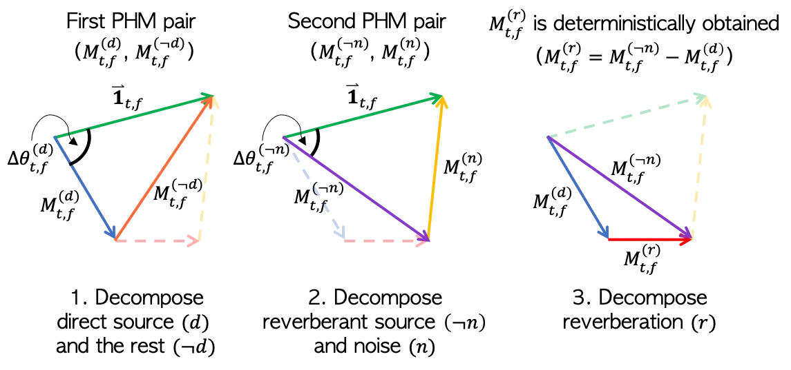
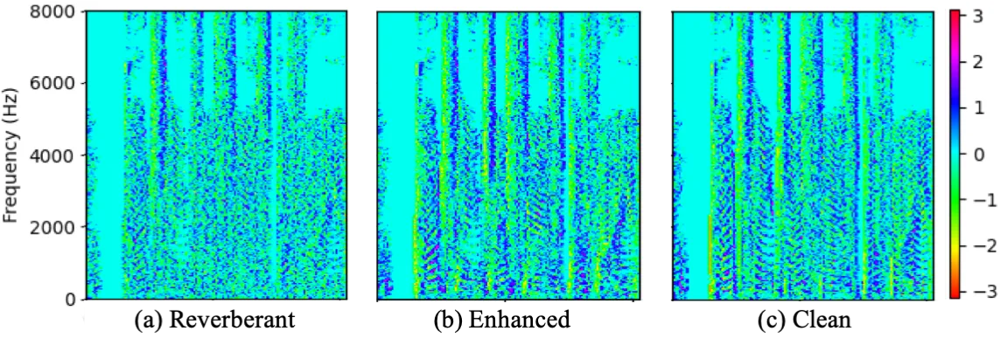

# Phase-aware Single-stage Speech Denoising and Dereverberation with U-Net

###### Abstract

In this work, we tackle a denoising and dereverberation problem with a
single-stage framework. Although denoising and dereverberation may be
considered two separate challenging tasks, and thus, two modules are
typically required for each task, we show that a single deep network can
be shared to solve the two problems. To this end, we propose a new
masking method called phase-aware $`\beta`$-sigmoid mask (PHM), which
reuses the estimated magnitude values to estimate the clean phase by
respecting the triangle inequality in the complex domain between three
signal components such as mixture, source and the rest. Two PHMs are
used to deal with direct and reverberant source, which allows
controlling the proportion of reverberation in the enhanced speech at
inference time. In addition, to improve the speech enhancement
performance, we propose a new time-domain loss function and show a
reasonable performance gain compared to MSE loss in the complex domain.
Finally, to achieve a real-time inference, an optimization strategy for
U-Net is proposed which significantly reduces the computational overhead
up to 88.9% compared to the naïve version¹¹ 1 Audio samples link:
[https://tinyurl.com/ycndlmfm](https://tinyurl.com/ycndlmfm).

Hyeong-Seok Choi^(1,2), Hoon Heo², Jie Hwan Lee^(1,2), Kyogu Lee^(1,2)

¹Music and Audio Research Group (MARG), Seoul National University  
²Supertone Inc.

{kekepa15, wiswisbus, kglee}@snu.ac.kr, hoon@supertone.ai

Index Terms: speech enhancement, phase, denoising, dereverberation,
U-Net

## 1 Introduction

Corrupted speech signal by noise and reverberation is one of the most
common signals we hear in our everyday life. The desire to listen to
clean speech signal, therefore, is strong let alone its usage for
machine such as speech recognition system. While there has been numerous
studies to address the problem of single channel denoising and
dereverberation, only few have tried to solve this problem with a single
deep learning model \[1\]. This motivates us to tackle this real-world
problem using a single-stage deep learning model. We address this
problem by dissecting the elements that compose the noisy-reverberant
mixture, that is, noise, direct source, and reverberation. By dissecting
each part of the mixture, one could handle each element at hand and even
mix them with a desired proportion. Note that this is a desirable
property for users as the effective amount of reverberation is important
to achieve better speech intelligibility for both impaired and
nonimpaired listeners \[2, 3\].

The key contributions of our proposed approach are three folds. First,
to suppress the noise and reverberation, we propose a new type of
complex-valued mask called phase-aware $`\beta`$-sigmoid mask (PHM).
While the complex-valued mask suggested by \[4\] separately estimates
the real and imaginary part of a complex spectrogram, we believe the
phase part of it can be effectively estimated by reusing an estimated
magnitude value of it in a trigonometric perspective as suggested in
\[5\]. The major difference between PHM and the suggested approach in
\[5\] is that PHM is designed to respect the triangular relationship
between mixture, source and the rest, and hence the sum of the estimated
source and the rest is always equal to the mixture. By exploiting this
property, we train the deep network to output two different PHMs
simultaneously to effectively deal with both denoising and derverbration
problem. Second, we propose a new time-domain loss function, an
emphasized multi-scale cos similarity loss function. A time-domain loss
function has recently been used as a popular loss function \[6, 7, 8, 9,
10\]. To better design the time-domain cos similarity loss function
proposed in \[6\], we change it into a multi-scale version of it with
proper emphasis functions and show the effectiveness of it. Finally, we
suggest an optimization strategy for two-dimensional U-Net to
significantly reduce the computational inefficiency in runtime.

## 2 Related Works

Recently, there has been an increasing interests in phase-aware speech
enhancement because of the sub-optimality of reusing the phase of
mixture signal. The first work that tried to address this problem was by
using phase-sensitive mask (PSM) \[11\]. PSM estimates the real-part of
the signal which is still sub-optimal. As a more direct remedy for this,
a complex masking \[4, 6, 5\] or complex spectral mapping \[12\] has
also been proposed to estimate a clean phase part. Another line of
research is to sequentially estimate the clean phase part using an
additional sub-module \[13, 14, 15\]. This, however, is limited in that
it requires an additional module resulting in inefficient computation.
While most of these works tried to estimate the clean phase by using
phase mask or an additional network, the absolute phase difference
between mixture and source can be actually computed using the law of
cosines using the estimated magnitude values as the three sides of a
triangle \[16, 17\]. Inspired by this, \[18\] proposed to estimate a
rotational direction of the absolute phase difference using a
sign-prediction network.

The efforts to deal with denoising or dereverberation using deep
networks have been tried in many works. Recently, \[19, 20\] tried to
address this problem with two modules for each task. We believe,
however, a two-stage framework is not necessary and can be achieved
using a single deep network.

## 3 Single-stage Denoising and Dereverberation

A noisy-reverberant mixture signal $`\bm{x}`$ is commonly modeled as the
sum of additive noise $`\bm{y}^{(n)}`$ and reverberant source
$`\tilde{\bm{y}}`$, where $`\tilde{\bm{y}}`$ is a result of convolution
between room impulse response (RIR) $`\bm{h}`$ and dry source $`\bm{y}`$
as follows,
$`\bm{x}=\tilde{\bm{y}}+\bm{y}^{(n)}=\bm{h}\circledast\bm{y}+\bm{y}^{(n)}`$.
More concretely, we can break down $`\bm{h}`$ into two parts, that is,
direct path part $`\bm{h}^{(d)}`$ which does not includes the reflection
path and the rest of the part $`\bm{h}^{(r)}`$ that includes all the
reflection paths as follows,
$`\bm{x}=(\bm{h}^{(d)}+\bm{h}^{(r)})\circledast\bm{y}+\bm{y}^{(n)}=\bm{h}^{(d)}\circledast\bm{y}+\bm{h}^{(r)}\circledast\bm{y}+\bm{y}^{(n)}=\bm{y}^{(d)}+\bm{y}^{(r)}+\bm{y}^{(n)}`$,
where $`\bm{y}^{(d)}`$ and $`\bm{y}^{(r)}`$ denotes direct path source
and reverberation, respectively. In this setting, our goal is to
separate $`\bm{x}`$ into three elements $`\bm{y}^{(d)}`$,
$`\bm{y}^{(r)}`$, and $`\bm{y}^{(n)}`$. Each of the corresponding
time-frequency $`(t,f)`$ representations computed by STFT is denoted as
$`X_{t,f}\in\mathbb{C}`$, $`Y^{(d)}_{t,f}\in\mathbb{C}`$,
$`Y^{(r)}_{t,f}\in\mathbb{C}`$, $`Y^{(n)}_{t,f}\in\mathbb{C}`$, and the
estimated values will be denoted by the hat operator
$`\hat{\,\cdot\,}`$.

### 3.1 Phase-aware $`\beta`$-sigmoid mask

Designing a mask that is not limited to output the optimal value of
ideal mask requires two conditions to satisfy. First, the range of
magnitude mask should not be limited. Second, the mask has to be
complex-valued so that it can correct both the magnitude part and phase
part of the mixture signal. The proposed phase-aware $`\beta`$-sigmoid
mask (PHM) is designed to handle both conditions while systemically
restricting the sum of estimated complex values to be exactly the value
of mixture, $`X_{t,f}=Y^{(k)}_{t,f}+Y^{(\lnot k)}_{t,f}`$. The PHM
separates the mixture $`X_{t,f}`$ in STFT domain into two parts as
one-vs-rest approach, that is, the signal $`Y^{(k)}_{t,f}`$ and the sum
of the rest of the signals
$`Y^{(\lnot k)}_{t,f}=X_{t,f}-Y^{(k)}_{t,f}`$, where index $`k`$ could
be one of direct path source ($`d`$), reverberation ($`r`$), and noise
($`n`$) in our setting, $`k\in\{d,r,n\}`$. The complex-valued mask
$`M^{(k)}_{t,f}\in\mathbb{C}`$ estimates the magnitude and phase value
of the source of interest $`k`$. The mask is composed of two parts, (1)
magnitude mask estimation, (2) phase estimation by reusing the magnitude
estimation from (1) and two-class sign prediction.

First, the network outputs the magnitude part of two masks
$`\mathinner{\!\left\lvert M^{(k)}_{t,f}\right\rvert}`$ and
$`\mathinner{\!\left\lvert M^{(\lnot k)}_{t,f}\right\rvert}`$ with
sigmoid function $`\sigma^{(k)}(\bm{z}_{t,f})`$ multiplied by
coefficient $`\beta_{t,f}`$ as follows,

```math
\mathinner{\!\left\lvert M^{(k)}_{t,f}\right\rvert}=\beta_{t,f}\cdot\sigma^{(k)}(\bm{z}_{t,f})=\beta_{t,f}\cdot\frac{1}{1+e^{-(z^{(k)}_{t,f}-z^{(\lnot k)}_{t,f})}} \tag{1}
```

where $`z^{(k)}_{t,f}`$ is the output located at $`(t,f)`$ from the last
layer of neural-network function $`\psi^{(k)}(\phi)`$, and $`\phi`$ is a
function composed of network layers before the last layer.
$`\mathinner{\!\left\lvert M^{(k)}_{t,f}\right\rvert}`$ serves as a
magnitude mask to estimate source $`k`$ and the value of it ranges from
0 to $`\beta_{t,f}`$. The role of $`\beta_{t,f}`$ is to design a mask
that is close to the optimal mask with a flexible magnitude range so
that the value is not bounded between 0 and 1 unlike the typically used
sigmoid mask. In addition, because the sum of the complex valued masks
$`M^{(k)}_{t,f}`$ and $`M^{(\lnot k)}_{t,f}`$ must compose a triangle,
it is reasonable to design a mask that satisfies the triangle
inequalities, that is,
$`\mathinner{\!\left\lvert M^{(k)}_{t,f}\right\rvert}+\mathinner{\!\left\lvert M^{(\lnot k)}_{t,f}\right\rvert}`$
$`\geq 1`$ and
$`\mathinner{\!\left\lvert\,\mathinner{\!\left\lvert M^{(k)}_{t,f}\right\rvert}-\mathinner{\!\left\lvert M^{(\lnot k)}_{t,f}\right\rvert}\right\rvert}\leq 1`$.
To address the first inequality we designed the network to output
$`\beta_{t,f}`$ from the last layer with a softplus activation function
as follows,
$`\beta_{t,f}=1+\texttt{softplus}((\psi_{\beta}(\phi))_{t,f})`$, where
$`\psi_{\beta}`$ denotes an additional network layer to output
$`\beta_{t,f}`$. The second inequality can be satisfied by clipping the
upper bound of the $`\beta_{t,f}`$ by
$`1\mathbin{/}\mathinner{\!\left\lvert\,\sigma^{(k)}(\bm{z}_{t,f})-\sigma^{(\lnot k)}(\bm{z}_{t,f})\right\rvert}`$.

Once the magnitude masks are decided, we can construct a phase mask
$`e^{j\theta_{t,f}^{(k)}}`$. Given the magnitudes as three sides of a
triangle, we can compute the cosine of absolute phase difference
$`\Delta\theta_{t,f}^{(k)}`$ between the mixture and source $`k`$ as
follows,
$`\cos(\Delta\theta_{t,f}^{(k)})=\nicefrac{{(1+\mathinner{\!\left\lvert M_{t,f}^{(k)}\right\rvert}^{2}-\mathinner{\!\left\lvert M_{t,f}^{(\lnot k)}\right\rvert}^{2})}}{{(2\,\mathinner{\!\left\lvert M_{t,f}^{(k)}\right\rvert})}}`$.
Next, the rotational direction (clockwise or counterclockwise) for phase
correction can be decided by estimating sign value
$`\xi_{t,f}\in\{-1,1\}`$ as follows,

```math
e^{j\theta_{t,f}^{(k)}}=\cos(\Delta\theta_{t,f}^{(k)})+j\xi_{t,f}\sin(\Delta\theta_{t,f}^{(k)}). \tag{2}
```

Two-class straight-through Gumbel-softmax estimator was used to estimate
$`\xi_{t,f}`$ \[21\]. It allows us to discretize the output of the
Gumbel-softmax function $`\gamma^{(i)}`$ with $`\argmax`$ and still be
able to train the network in an end-to-end manner using a continuous
approximation in the backward pass. $`\xi_{t,f}`$ is defined as follows,

```math
\xi_{t,f}=\begin{cases}-1,&\gamma^{(0)}(\bm{q}_{t,f})>\gamma^{(1)}(\bm{q}_{t,f})\\
1,&\text{otherwise}\end{cases} \tag{3}
```

where $`\gamma^{(i)}(\bm{q}_{t,f})`$ is defined as follows,

```math
\gamma^{(i)}(\bm{q}_{t,f})=\frac{e^{q^{(i)}_{t,f}}}{\sum_{i}{e^{q^{(i)}_{t,f}}}}=\frac{e^{((\psi_{i}(\phi))_{t,f}+g_{i})\mathbin{/}\tau}}{\sum_{i}{e^{((\psi_{i}(\phi))_{t,f}+g_{i})\mathbin{/}\tau}}}, \tag{4}
```

and $`g_{0}`$ and $`g_{1}`$ are samples from Gumbel$`\left(0,1\right)`$,
$`\psi_{i}`$ is an additional network layer to output logit value
$`q^{(i)}_{t,f}`$, and $`\tau`$ is a temperature parameter for
Gumbel-softmax. Finally, $`M^{(k)}_{t,f}`$ is defined as follows,

```math
M^{(k)}_{t,f}=\mathinner{\!\left\lvert M^{(k)}_{t,f}\right\rvert}e^{j\theta_{t,f}^{(k)}}. \tag{5}
```

### 3.2 Masking from the perspective of quadrangle



Figure 1: The illustration of masks on quadrangle

As we desire to extract both direct source and reverberant source, two
pairs of PHMs are used for each of them. The first pair of masks
separates direct source and the rest of the component, denoted as
$`M^{(d)}_{t,f}`$ and $`M^{(\lnot d)}_{t,f}`$. The second pair of masks
separates noise and reverberant source component, denoted as
$`M^{(n)}_{t,f}`$ and $`M^{(\lnot n)}_{t,f}`$. Since PHM guarantees the
mixture and separated components to construct a triangle in the complex
STFT domain, the outcome of the separation can be seen from the
perspective of quadrangle as in Fig 1. In this setting, as the three
sides and two side angles are already determined by the two pairs of
PHMs, the last fourth side of quadrangle, the reverberation component
$`\hat{Y}^{(r)}_{t,f}`$, is uniquely decided.

### 3.3 Emphasized multi-scale cosine similarity loss

Learning to maximize cosine similarity can be regarded as maximizing the
signal-to-distortion ratio (SDR) \[6\]. Cosine similarity loss $`C`$
between estimated signal $`\hat{\bm{y}}^{(k)}\in\mathbb{R}^{N}`$ and
ground truth signal $`\bm{y}^{(k)}\in\mathbb{R}^{N}`$ is defined as
follows,

```math
C(\bm{y}^{(k)},\hat{\bm{y}}^{(k)})=-\frac{<\bm{y}^{(k)},\hat{\bm{y}}^{(k)}>}{\mathinner{\!\left\lVert\bm{y}^{(k)}\right\rVert}\mathinner{\!\left\lVert\hat{\bm{y}}^{(k)}\right\rVert}}, \tag{6}
```

where $`N`$ denotes the temporal dimensionality of a signal and $`k`$
denotes the type of signal ($`k\in\{d,r,n\}`$). Consider a sliced signal
$`\bm{y}^{(k)}_{[\frac{N}{M}(i-1)\mathrel{\mathop{\ordinarycolon}}\frac{N}{M}i]}`$,
where $`i`$ denotes the segment index and $`M`$ denotes the number of
segment. By slicing the signal and normalize it by its norm, each sliced
segment is considered as an unit for computing $`C`$. Therefore, we
hypothesize that it is important to choose a proper segment length unit
$`\frac{N}{M}`$ when computing $`C`$. In our case, we used multiple
settings of segment lengths $`g_{j}=\frac{N}{M_{j}}`$ as follows,

```math
\mathcal{L}(\bm{y}^{(k)},\hat{\bm{y}}^{(k)})=\sum_{j}\frac{1}{M_{j}}\sum_{i=1}^{M_{j}}C(\bm{y}^{(k)}_{[g_{j}(i-1)\mathrel{\mathop{\ordinarycolon}}g_{j}i]},\hat{\bm{y}}^{(k)}_{[g_{j}(i-1)\mathrel{\mathop{\ordinarycolon}}g_{j}i]}), \tag{7}
```

where $`M_{j}`$ denotes the number of sliced segments. In our case the
set of $`g_{j}`$'s was chosen as follows,
$`g_{j}\in\{4064,2032,1016,508\}`$, assuming they moderately cover the
range of duration of phonemes in speech.

To further improve the design of the loss function, we applied two
simple techniques — 1. pre-emphasis ($`\pi`$) and 2. $`\mu`$-law
encoding ($`\mu`$) — on signals. As most of the speech signal components
are concentrated in the lower frequency bands, we found that applying
pre-emphasis on loss function can help penalize high frequency
components. In addition, since the samples of speech signals are usually
centered around zero, we found that it is helpful to use 16-bit
$`\mu`$-law encoding as it distributes samples more uniformly by the
nature of continuous logarithmic transform. The proposed loss function
$`\mathcal{L}^{+}`$ is defined as follows,

```math
\begin{split}\mathcal{L}^{+}(\bm{y}^{(k)},\hat{\bm{y}}^{(k)})&=\mathcal{L}(\bm{y}^{(k)},\hat{\bm{y}}^{(k)})+\mathcal{L}(\pi(\bm{y}^{(k)}),\pi(\hat{\bm{y}}^{(k)}))\\
&+\mathcal{L}(\mu(\pi(\bm{y}^{(k)})),\mu(\pi(\hat{\bm{y}}^{(k)})))\end{split} \tag{8}
```

Finally, we used the proposed loss function for every $`k`$ and
$`\lnot k`$ combinations as follows,

```math
\mathcal{L}_{\text{final}}=\sum_{k}(\mathcal{L}^{+}(\bm{y}^{(k)},\hat{\bm{y}}^{(k)})+\mathcal{L}^{+}(\bm{y}^{(\lnot k)},\hat{\bm{y}}^{(\lnot k)})). \tag{9}
```

## 4 Optimization for Real-Time U-Net

To connect each encoder layer with its corresponding decoder, U-Net is
often composed of convolutional layers with zero padding for dynamic
input sizes. Without zero padding, the valid size of input and output is
uniquely determined by the kernel sizes and strides. This obviously
takes less computation and allows to keep only the essential part. In
our real-time setting, the input spectrogram has 253 frequency bins and
65 frames by discarding the four lowest bins from the original
spectrogram with a 512-point FFT, assuming that 16 kHz speech signals
have no significant spectral component below 93.75 Hz. We followed the
network architecture of the real-valued U-Net proposed in \[6\] (model10
and model20 specifically) with the modification of the last layer to
output PHM. All the batch normalizations were fused into convolution
filters.

In the encoder, the naïve implementation of U-Net repeatedly performs
the same computation that has already been computed previously. This
redundancy can be efficiently reduced by caching the pre-computed values
using queues. Likewise, we utilized a similar concept with 2D
convolution, but more than one queues are needed for the strided
convolution in each layer. The number of required queues for depth $`d`$
is derived by $`\prod_{l=1}^{d}{s_{l}}`$, where $`s_{l}`$ denotes the
temporal stride of the $`l`$-th encoder layer.

Most computation of the naïve U-Net is concentrated on a few decoder
layers before the output. Fortunately, only a single frame of the output
mask is needed for real-time inference. Although using the latest frame
can achieve the shortest latency, it is better to preview a few
milliseconds for performance. It is computationally less efficient to
use a longer lookahead because more frames should be calculated in the
previous decoder layer. Our real-time implementation previews 32ms which
is shorter than allowed in the DNS challenge \[22\]. The schematic
details are shown in Fig. 2.

Figure 2: A graphical illustration of U-Net optimization for real-time
inference. As a schematic view of 2D feature map, the number in the box
indicates the relative index to the latest frame. $`LA`$ and $`T`$
denote the lookahead and the frame length respectively. The number of
multiplications reduced from the naïve one is shown at the bottom of the
box (in millions). The overall reduction reached 88.9%.

## 5 Experiments

### 5.1 Dataset

We used the DNS challenge dataset \[22\] and internally collected
dataset for training. The former is a large scale dataset where the
speech samples were collected from Librivox \[23\], and noise samples
from Audioset \[24\] and Freesound \[25\]. Note that we did not use the
provided noisy speech data from the DNS dataset but used on-the-fly
augmentation with the clean speech and noise in the two datasets during
the training phase. Since our goal is to perform both denoising and
dereverberation, we used pyroomacoustics \[26\] to simulate an
artificial reverberation with randomly sampled absorption, room size,
location of source and microphone distance. We also trimmed random
segments of 2 seconds from speech and noise data, and mixed them with
uniformly distributed source-to-noise ratio (SNR) ranging from -10 dB to
30 dB.

For test, we used two datasets such as the synthesized testset in the
DNS challenge (DNS) and WHAMR \[20\]. The DNS synthesized testset
provides noisy-reverberant mixtures and noisy mixtures without reverb.
DNS was used only to test the denoising performance since it does not
provide the direct source signal of synthesized mixture samples.
Therefore, a reverberant source was given as ground truth when the model
is tested on noisy-reverberant mixtures. Both the denoising and
dereverberation performance were tested on the min subset of WHAMR
dataset which contains 3,000 audio files. To test the denoising and
dereverberation performances both simultaneously and separately, we
tested our models on four scenarios: 1) nr2d: noisy-reverberant mixture
to direct source 2) nr2r: noisy-reverberant mixture to reverberant
source 3) n2d: noisy mixture to direct source 4) r2d: reverberant source
to direct source. The corresponding four pair of test subsets, denoted
in a following way (mixture, ground_truth), were used as follows, 1.
nr2d: (mix_single_reverb, s1_anechoic), 2. nr2r: (mix_single_reverb,
s1_reverb), 3. n2d: (mix_single_anechoic, s1_anechoic), 4. r2d:
(s1_reverb, s1_anechoic).

### 5.2 Implementation

Input features were used as a channel-wise concatenation of
log-magnitude spectrogram, real and imaginary part of demodulated phase
\[13\], group delay, and delta-phase \[27\]. The window size of model20
was 1024 with 256 hop size and the window size of model10 was 512 with
128 hop size. All models were trained for 125k iterations with AdamW
optimizer \[28\]. The learning rate was set to 0.0004 and halved at
62.5k iteration. Every test was done with a non-causal inference using
model20 except the experiments in subsection 5.5.

### 5.3 Ablation studies

| DNS-challenge |                   |       |             |       |            |       |             |       |
| ------------- | ----------------- | ----- | ----------- | ----- | ---------- | ----- | ----------- | ----- |
| Loss          | $`\mathbb{C}`$MSE |       | SingleScale |       | MultiScale |       | MultiScale+ |       |
| Reverb        | w/o               | w/    | w/o         | w/    | w/o        | w/    | w/o         | w/    |
| Si-SDR        | 15.63             | 14.21 | 17.47       | 15.79 | 17.57      | 15.93 | 17.91       | 16.22 |
| PESQ          | 2.22              | 2.59  | 2.57        | 2.90  | 2.63       | 2.97  | 2.71        | 3.01  |
| WHAMR         |                   |       |             |       |            |       |             |       |
| Loss          | $`\mathbb{C}`$MSE |       | SingleScale |       | MultiScale |       | MultiScale+ |       |
| Task          | nr2d              | r2d   | nr2d        | r2d   | nr2d       | r2d   | nr2d        | r2d   |
| Si-SDR        | 4.21              | 8.87  | 5.08        | 9.88  | 5.24       | 10.13 | 5.33        | 10.40 |
| PESQ          | 1.38              | 2.58  | 1.45        | 2.96  | 1.54       | 3.09  | 1.52        | 3.16  |

Table 1: The effect of proposed loss function. The denoising performance
was tested on the DNS challenge synthesized testset (w/o and w/ reverb)
and both denoising and dereverberation performance was tested on WHAMR
dataset (nr2d: noisy-reverberant mixture to direct source, r2d:
reverberant source to direct source).

To show the effect of loss functions we observed SI-SDR \[10\] and PESQ
\[29\] while changing four different loss functions. Complex MSE
($`\mathbb{C}`$MSE) and three different cosine similarity based loss
functions — SingleScale, MultiScale, and MultiScale+ — were compared
each of which corresponds to Eq. 6, Eq. 7, and Eq. 8, respectively. The
quantitative results in Table 1 show that the proposed multi-scale and
emphasis functions are beneficial for both denoising and dereverberation
tasks in most of the cases.

### 5.4 Analysis on phase enhancement

| Task                                 | nr2r  | n2d   | nr2d  | r2d   |
| ------------------------------------ | ----- | ----- | ----- | ----- |
| $`PD`$($`\bm{Y}`$, $`\bm{X}`$)       | 21.1° | 23.3° | 36.3° | 24.7° |
| $`PD`$($`\bm{Y}`$, $`\hat{\bm{Y}}`$) | 20.2° | 21.9° | 29.5° | 15.0° |
| $`PhaseGain`$                        | 4.5%  | 6%    | 17.6% | 64%   |

Table 2: Phase distance and gain under four different tasks.



Figure 3: Group delay of enhanced phase

Here, we used the phase distance defined in \[6\] to quantitatively
measure the phase enhancement performance. Phase distance ($`PD`$)
between spectrogram $`A`$ and $`B`$ is formulated as follows,

```math
\displaystyle PD(\bm{A},\bm{B})=\sum_{t,f}\frac{\mathinner{\!\left\lvert A_{t,f}\right\rvert}}{\sum_{t^{\prime},f^{\prime}}\mathinner{\!\left\lvert A_{t^{\prime},f^{\prime}}\right\rvert}}\angle(A_{t,f},B_{t,f}), \tag{10}
```

where $`\angle(A_{t,f},B_{t,f})`$ is the angle between $`A_{t,f}`$ and
$`B_{t,f}`$, ranging from 0°to 180°. We measured $`PD`$ between ground
truth $`\bm{Y}`$ and mixture $`\bm{X}`$, and $`PD`$ between ground truth
$`\bm{Y}`$ and estimation $`\bm{\hat{Y}}`$, and checked how much
$`PhaseGain(\%)`$ was obtained. This was tested on all four scenarios of
WHAMR testset and shown in Table 2. We found that the network is able to
give a reasonable $`PhaseGain`$ in tasks including dereverberation
(nr2d, nr2r). However, $`PhaseGain`$ was marginal for
only-denoising-tasks (nr2r, n2d). We conjecture that this is because the
network is not able to estimate a precise magnitude value for noisy
mixture and this issue is left for futurework. A visualization of
enhanced phase group delay tested on a reverberant source is shown in
Fig. 3. Fig. 3 (b) shows the enhanced harmonic structure of phase group
delay.

### 5.5 Computation of real-time U-Net

| Causal/Model | ✗/NRT | ✓/NRT | ✗/RT | ✓/RT |
| ------------ | ----- | ----- | ---- | ---- |
| SI-SDR       | 5.33  | 4.60  | 3.42 | 2.33 |
| PESQ         | 1.52  | 1.43  | 1.39 | 1.34 |

Table 3: The effect of causality and the model size.

Following the constraint for real-time model suggested by the DNS
challenge, we measured the elapsed time to compute a single frame.
model20 that took 40 ms to compute a frame will be denoted as
non-real-time (NRT) model, and model10 that took 4.32 ms to compute a
frame will be denoted as real-time (RT) model. To compare the two models
and how causal inference affects the model performance, we compare four
combinations in nr2d task. Table 3 shows that both non-causal inference
and model size are significant factors for performance.

Finally, we report the Mean Opinion Score (MOS) results from the DNS
challenge based on the online subjective evaluation framework ITU-T
P.808 \[30\]. For better perceptual quality, we linearly added the
estimated direct source and reverberant source with a 15 dB ratio, and
implemented a simple and zero-delay dynamic range compression to apply
on it. Our causal-NRT and causal-RT model achieved a mean opinion score
of 3.36 and 3.24, respectively.

## 6 Conclusions

We proposed a new mask and loss function to improve the performance of
single-stage denoising and dereverberation. As the proposed PHM and loss
function are orthogonal to the network structure, we believe that a
better performance can be achieved using the variant of U-Net
architectures such as \[31, 32\].

## References

- \[1\] Y. Sun, W. Wang, J. A. Chambers, and S. M. Naqvi, “Enhanced
  time-frequency masking by using neural networks for monaural source
  separation in reverberant room environments,” in _2018 26th European
  Signal Processing Conference (EUSIPCO)_. IEEE, 2018, pp. 1647–1651.
- \[2\] J. S. Bradley, H. Sato, and M. Picard, “On the importance of
  early reflections for speech in rooms,” _The Journal of the Acoustical
  Society of America_, vol. 113, no. 6, pp. 3233–3244, 2003.
- \[3\] Y. Hu and K. Kokkinakis, “Effects of early and late reflections
  on intelligibility of reverberated speech by cochlear implant
  listeners,” _The Journal of the Acoustical Society of America_, vol.
  135, no. 1, pp. EL22–EL28, 2014.
- \[4\] D. S. Williamson, Y. Wang, and D. Wang, “Complex ratio masking
  for monaural speech separation,” _IEEE/ACM Transactions on Audio,
  Speech and Language Processing (TASLP)_, vol. 24, no. 3, pp.
  483–492, 2016.
- \[5\] X. Wang and C. Bao, “Masking estimation with phase restoration
  of clean speech for monaural speech enhancement,” _Proc. Interspeech
  2019_, pp. 3188–3192, 2019.
- \[6\] H.-S. Choi, J.-H. Kim, J. Huh, A. Kim, J.-W. Ha, and K. Lee,
  “Phase-aware speech enhancement with deep complex u-net,” _arXiv
  preprint arXiv:1903.03107_, 2019.
- \[7\] J. Yao and A. Al-Dahle, “Coarse-to-fine optimization for speech
  enhancement,” _arXiv preprint arXiv:1908.08044_, 2019.
- \[8\] Z.-Q. Wang, J. L. Roux, D. Wang, and J. R. Hershey, “End-to-end
  speech separation with unfolded iterative phase reconstruction,”
  _arXiv preprint arXiv:1804.10204_, 2018.
- \[9\] Y. Koizumi, K. Yaiabe, M. Delcroix, Y. Maxuxama, and
  D. Takeuchi, “Speech enhancement using self-adaptation and multi-head
  self-attention,” in _ICASSP 2020-2020 IEEE International Conference on
  Acoustics, Speech and Signal Processing (ICASSP)_. IEEE, 2020, pp.
  181–185.
- \[10\] J. Le Roux, S. Wisdom, H. Erdogan, and J. R. Hershey,
  “Sdr–half-baked or well done?” in _ICASSP 2019-2019 IEEE International
  Conference on Acoustics, Speech and Signal Processing (ICASSP)_. IEEE,
  2019, pp. 626–630.
- \[11\] H. Erdogan, J. R. Hershey, S. Watanabe, and J. Le Roux,
  “Phase-sensitive and recognition-boosted speech separation using deep
  recurrent neural networks,” in _2015 IEEE International Conference on
  Acoustics, Speech and Signal Processing (ICASSP)_. IEEE, 2015, pp.
  708–712.
- \[12\] K. Tan and D. Wang, “Complex spectral mapping with a
  convolutional recurrent network for monaural speech enhancement,” in
  _ICASSP 2019-2019 IEEE International Conference on Acoustics, Speech
  and Signal Processing (ICASSP)_. IEEE, 2019, pp. 6865–6869.
- \[13\] N. Takahashi, P. Agrawal, N. Goswami, and Y. Mitsufuji,
  “Phasenet: Discretized phase modeling with deep neural networks for
  audio source separation,” _Proc. Interspeech 2018_, pp.
  2713–2717, 2018.
- \[14\] T. Afouras, J. S. Chung, and A. Zisserman, “The conversation:
  Deep audio-visual speech enhancement,” _Proc. Interspeech 2018_, pp.
  3244–3248, 2018.
- \[15\] D. Yin, C. Luo, Z. Xiong, and W. Zeng, “Phasen: A
  phase-and-harmonics-aware speech enhancement network,” _arXiv preprint
  arXiv:1911.04697_, 2019.
- \[16\] P. Mowlaee, R. Saeidi, and R. Martin, “Phase estimation for
  signal reconstruction in single-channel source separation,” in
  _Thirteenth Annual Conference of the International Speech
  Communication Association_, 2012.
- \[17\] P. Mowlaee and R. Saeidi, “Time-frequency constraints for phase
  estimation in single-channel speech enhancement,” in _2014 14th
  International Workshop on Acoustic Signal Enhancement (IWAENC)_. IEEE,
  2014, pp. 337–341.
- \[18\] Z.-Q. Wang, K. Tan, and D. Wang, “Deep learning based phase
  reconstruction for speaker separation: A trigonometric perspective,”
  in _ICASSP 2019-2019 IEEE International Conference on Acoustics,
  Speech and Signal Processing (ICASSP)_. IEEE, 2019, pp. 71–75.
- \[19\] Y. Zhao, Z.-Q. Wang, and D. Wang, “Two-stage deep learning for
  noisy-reverberant speech enhancement,” _IEEE/ACM transactions on
  audio, speech, and language processing_, vol. 27, no. 1, pp.
  53–62, 2018.
- \[20\] M. Maciejewski, G. Wichern, E. McQuinn, and J. L. Roux,
  “Whamr!: Noisy and reverberant single-channel speech separation,”
  _arXiv preprint arXiv:1910.10279_, 2019.
- \[21\] E. Jang, S. Gu, and B. Poole, “Categorical reparameterization
  with gumbel-softmax,” _arXiv preprint arXiv:1611.01144_, 2016.
- \[22\] C. K. Reddy, E. Beyrami, H. Dubey, V. Gopal, R. Cheng,
  R. Cutler, S. Matusevych, R. Aichner, A. Aazami, S. Braun _et al._,
  “The interspeech 2020 deep noise suppression challenge: Datasets,
  subjective speech quality and testing framework,” _arXiv preprint
  arXiv:2001.08662_, 2020.
- \[23\] H. McGuire, “Librivox: Free public domain audiobooks,” _URL
  https://librivox. org_.
- \[24\] J. F. Gemmeke, D. P. Ellis, D. Freedman, A. Jansen,
  W. Lawrence, R. C. Moore, M. Plakal, and M. Ritter, “Audio set: An
  ontology and human-labeled dataset for audio events,” in _2017 IEEE
  International Conference on Acoustics, Speech and Signal Processing
  (ICASSP)_. IEEE, 2017, pp. 776–780.
- \[25\] E. Fonseca, J. Pons Puig, X. Favory, F. Font Corbera,
  D. Bogdanov, A. Ferraro, S. Oramas, A. Porter, and X. Serra,
  “Freesound datasets: a platform for the creation of open audio
  datasets,” in *Hu X, Cunningham SJ, Turnbull D, Duan Z, editors.
  Proceedings of the 18th ISMIR Conference; 2017 oct 23-27; Suzhou,
  China.\[Canada\]: International Society for Music Information
  Retrieval; 2017. p. 486-93.* International Society for Music
  Information Retrieval (ISMIR), 2017.
- \[26\] R. Scheibler, E. Bezzam, and I. Dokmanić, “Pyroomacoustics: A
  python package for audio room simulation and array processing
  algorithms,” in _2018 IEEE International Conference on Acoustics,
  Speech and Signal Processing (ICASSP)_. IEEE, 2018, pp. 351–355.
- \[27\] I. McCowan, D. Dean, M. McLaren, R. Vogt, and S. Sridharan,
  “The delta-phase spectrum with application to voice activity detection
  and speaker recognition,” _IEEE Transactions on Audio, Speech, and
  Language Processing_, vol. 19, no. 7, pp. 2026–2038, 2011.
- \[28\] S. J. Reddi, S. Kale, and S. Kumar, “On the convergence of adam
  and beyond,” _arXiv preprint arXiv:1904.09237_, 2019.
- \[29\] A. W. Rix, J. G. Beerends, M. P. Hollier, and A. P. Hekstra,
  “Perceptual evaluation of speech quality (pesq)-a new method for
  speech quality assessment of telephone networks and codecs,” in _2001
  IEEE International Conference on Acoustics, Speech, and Signal
  Processing. Proceedings (Cat. No. 01CH37221)_, vol. 2. IEEE, 2001, pp.
  749–752.
- \[30\] “Itu-t recommendation p.808, subjective evaluation of speech
  quality with a crowdsourcing approach.” _Geneva: International
  Telecommunication Union_, 2018.
- \[31\] N. Takahashi and Y. Mitsufuji, “Multi-scale multi-band
  densenets for audio source separation,” in _2017 IEEE Workshop on
  Applications of Signal Processing to Audio and Acoustics
  (WASPAA)_. IEEE, 2017, pp. 21–25.
- \[32\] B. Tolooshams, R. Giri, A. H. Song, U. Isik, and
  A. Krishnaswamy, “Channel-attention dense u-net for multichannel
  speech enhancement,” _arXiv preprint arXiv:2001.11542_, 2020.
