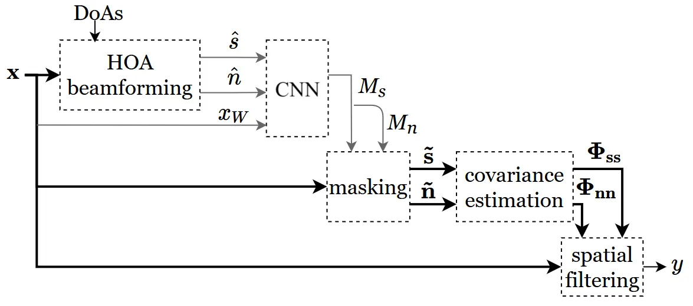
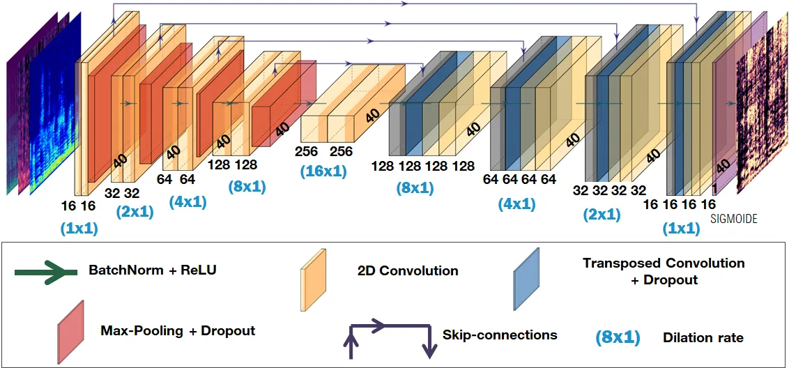
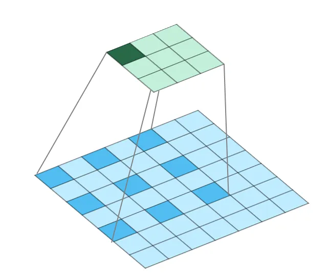
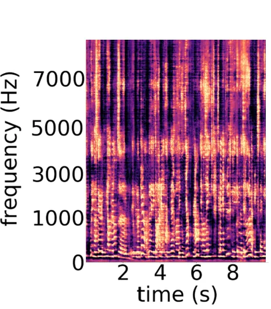
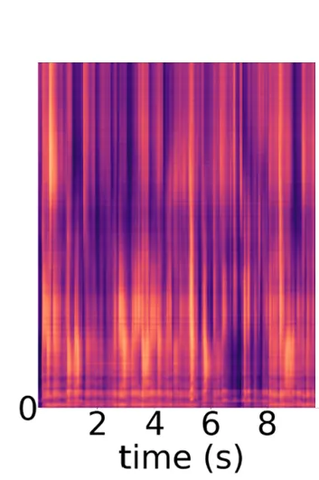
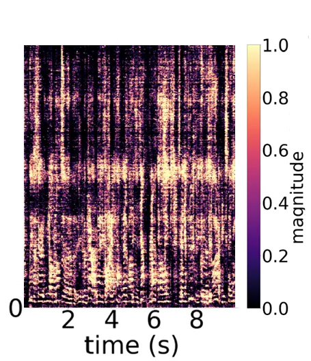

# Dilated U-net based approach for multichannel speech enhancement from First-Order Ambisonics recordings

Amélie Bosca Affiliation: Orange Labs    Alexandre Guérin
Affiliation: Orange Labs    Lauréline Perotin Affiliation: Orange Labs
   Srđan Kitić Affiliation: Orange Labs Affiliation:  Cesson-Sévigné,
France Affiliation:  Cesson-Sévigné, France Affiliation: 
Cesson-Sévigné, France Affiliation:  Cesson-Sévigné, France
Affiliation:  amelie.bosca@gmail.com Affiliation: 
alexandre.guerin@orange.com Affiliation:  laureline.perotin@gmail.com
Affiliation:  srdan.kiticgmail.com

###### Abstract

We present a CNN architecture for speech enhancement from multichannel
first-order Ambisonics mixtures. The data-dependent spatial filters,
deduced from a mask-based approach, are used to help an automatic speech
recognition engine to face adverse conditions of reverberation and
competitive speakers. The mask predictions are provided by a neural
network, fed with rough estimations of speech and noise amplitude
spectra, under the assumption of known directions of arrival. This study
evaluates the replacing of the recurrent LSTM network previously
investigated by a convolutive U-net under more stressing conditions with
an additional second competitive speaker. We show that, due to more
accurate short-term masks prediction, the U-net architecture brings some
improvements in terms of word error rate. Moreover, results indicate
that the use of dilated convolutive layers is beneficial in difficult
situations with two interfering speakers, and/or where the target and
interferences are close to each other in terms of the angular distance.
Moreover, these results come with a two-fold reduction in the number of
parameters.

###### Index Terms: 

multichannel speech separation, first-order Ambisonics, U-net, dilated
convolution

## I Introduction

Speech enhancement is an audio signal processing task which aims to
recover a given speech signal from a noisy mixture. This step is very
important for applications involving voice commands, especially in
far-field conditions where automatic speech recognition (ASR) may suffer
from noise and interferences, such as radio, television or other
speakers \[1\]. Enhancement can be achieved by directly predicting the
desired signal \[2\] or alternatively, by deriving a ratio mask from the
magnitude of a time-frequency representation of the mixture \[3\].
Recent literature shows that combining spatial information and DNN is
highly efficient in enhancing signals corrupted by noise and
interference \[4, 5, 6, 7\].

Recurrent neural networks (RNNs), in virtue of their memory capacity,
have firstly been preferred for time series processing: for waveform
generation for instance \[8\], or for speech enhancement \[9, 10\].
However, recent works reported that convolutional neural networks (CNNs)
were able to perform equally well, if not better, than more complex
RNNs, even for audio signals tasks \[11, 12\]. In particular, the U-net
architecture, based on an encoding-decoding structure to catch embedded
patterns in the input features, has been succesfully applied to audio
source separation \[2, 13\]. Very recently, dilated convolution showed
interesting results with time series, demonstrating capability to
capture long-term information, without increasing network complexity
\[14, 15\].

We use spherical microphone arrays, which yield the Ambisonics
representation of a sound scene \[16, 17\]. Due to its capacity to
efficiently embed 3D-spatial information, this format has been
succesfully exploited for source localization \[18, 19\] and source
separation \[20, 21\]. This paper depicts a mask-based Ambisonics speech
enhancement system of noisy mixtures based on previous works where masks
are estimated via a Long Short-Term Memory (LSTM) recursive network
\[20\]. The current study investigates the added value of two distinct
CNN architectures in place of the LSTM one: a classical U-net and a
U-net combined with dilated layers. We generalize their use to the
three-speaker scenario.

Section 2 presents the signal model and the Ambisonics speech
enhancement system. In Section 3, we detail our U-net architectures.
Experiments are presented in Section 4, results in Section 5 and
conclusion in Section 6.

## II Speech enhancement

### II-A Mixture model

Let us consider a multichannel audio mixture $`\textbf{\text{x}}(t,f)`$,
in the short-time Fourier transform domain, where $`t`$ and $`f`$ are
the time frame and frequency bin indexes. The mixture
$`\textbf{\text{x}}(t,f)`$ is composed of the target speech signal
$`\textbf{\text{s}}(t,f)`$ to be transcripted by the ASR, and some noise
$`\textbf{\text{n}}(t,f)`$:

```math
\textbf{\text{x}}(t,f)=\textbf{\text{s}}(t,f)+\textbf{\text{n}}(t,f). \tag{1}
```

The noise component n gathers some spatially diffuse noise and up to two
competitive speakers called interference and named
$`\textbf{\text{n}}_{1}`$ and $`\textbf{\text{n}}_{2}`$. All speakers
$`s`$, $`n_{1}`$ and $`n_{2}`$ are considered motionless and identified
by their spherical coordinates $`(\theta,\phi)`$, which are supposed to
be a priori known.

### II-B First-Order Ambisonics

The general Ambisonics format decomposes a 3D sound field on the
infinite basis of spherical harmonics functions. A First-Order
Ambisonics (FOA) signal is the $`1^{st}`$ order truncature of such
representation and is composed of four channels $`(W,X,Y,Z)`$: $`W`$
corresponds to the recording of the sound field by an omnidirectional
microphone and $`(X,Y,Z)`$ are the bidirectionnal captures towards the
three cartesian axis. In such formalism, the ideal FOA recording of a
plane wave $`p(t,f)`$ with direction of arrival $`(\theta,\phi)`$, may
be written using the steering vector $`\textbf{d}_{\theta,\phi}`$:

```math
\left[\begin{array}[]{c}W(t,f)\\
X(t,f)\\
Y(t,f)\\
Z(t,f)\\
\end{array}\right]=\textbf{d}_{\theta,\phi}\,\,p(t,f)=\left[\begin{array}[]{c}1\\
\sqrt{3}\,\text{cos}(\theta)\text{cos}(\phi)\\
\sqrt{3}\,\text{sin}(\theta)\text{cos}(\phi)\\
\sqrt{3}\,\text{sin}(\phi)\\
\end{array}\right]p(t,f) \tag{2}
```

### II-C Speech enhancement system



Fig. 1: Multichannel speech enhancement system based on masks
estimation.

The studied enhancement system is based on the same approach described
in \[20\], and depicted on Fig. 1: first, the neural network provides a
real continous mask $`M_{s}(t,f)`$ which emphasises the time-frequency
points where the target source $`s`$ is predominant. Then, this mask is
used to estimate the covariance matrices of target and noise
$`\mathbf{\Phi}_{\textbf{ss}}(f)`$ and
$`\mathbf{\Phi}_{\textbf{nn}}(f)`$ by temporal integration:

```math
\left\{\begin{array}[]{l}\mathbf{\Phi}_{\textbf{ss}}(f)=\frac{1}{T}\sum_{t=0}^{T-1}M_{s}^{2}(t,f)\textbf{x}(t,f)\textbf{x}^{H}(t,f)\\
\mathbf{\Phi}_{\textbf{nn}}(f)=\frac{1}{T}\sum_{t=0}^{T-1}(1-M_{s}(t,f))^{2}\textbf{x}(t,f)\textbf{x}^{H}(t,f)\par\end{array}\right. \tag{3}
```

where $`(.)^{H}`$ is the conjugate transposition and $`T`$ is the number
of frames. These matrices are used to derive a time-independent
multichannel Wiener filter (MWF):

```math
\textbf{w}(f)=[\mathbf{\Phi}_{\textbf{ss}}(f)+\mathbf{\Phi}_{\textbf{nn}}(f)]^{-1}\mathbf{\Phi}_{\textbf{ss}}(f)\textbf{u}_{1} \tag{4}
```

where $`\textbf{u}_{\mathbf{1}}`$ is the operator which selects the
first column. The estimated target signal $`y(t,f)`$ is finally deduced
by:

```math
y(t,f)=\textbf{w}^{\text{H}}(f)\textbf{x}(t,f) \tag{5}
```

In pratice, this MWF filter is approximated by a rank-1 version using
the generalized eigenvalue decomposition (GEVD) and named
$`\textbf{w}_{\text{GEVD-MWF}}(f)`$ \[20\]. This filter revealed to be
robust to errors in covariance matrix estimation \[22, 23\].

## III Mask estimation by U-net

We proposed a U-net architecture to replace prior work that leveraged an
LSTM-based network to predict ratio masks $`M_{s}`$ \[20\]. As input to
our network, we first compute full-band beamformer source estimates
based on the ideal FOA plane wave formulation.

### III-A Which masks $`M_{s},M_{n}`$ to estimate?

There exists many different masks emphasizing a specific signal: binary
masks, Wiener masks, instantaneous ratio masks. The choice of the masks
$`M_{s}`$ and $`M_{n}`$ is driven by our use-case: associated with the
spatial filter $`\textbf{w}_{\text{GEVD-MWF}}(f)`$, they shall maximize
the ASR performance by minimizing its WER.

In our experiments, the instantaneous energy ratio masks
$`M_{s,n}^{\text{id}}(t,f)`$:

```math
\left\{\begin{array}[]{l}M_{s}^{\text{id}}(t,f)=\frac{\lVert s_{W}(t,f)\rVert^{2}}{\lVert s_{W}(t,f)\rVert^{2}+\lVert n_{W}(t,f)\rVert^{2}}\\
M_{n}^{\text{id}}(t,f)=1-M_{s}^{\text{id}}(t,f)\end{array}\right. \tag{6}
```

where $`\text{.}_{W}`$ is the omnidirectional channel, revealed to be
good candidates. Indeed, we observed that the enhanced signal $`y`$ by
the combination of eq.(3,4,6), produces the same WER as the one enhanced
by the oracle multichannel GEVD filter, i.e. using the exact covariance
matrices.

### III-B Input features

The input features are the same as those of our previous works \[20\],
i.e. approximations of the magnitude spectra of speech $`\hat{s}(t,f)`$
and interference $`\hat{n}_{1,2}(t,f)`$, and the magnitude of the
mixture itself $`W(t,f)`$. These features are “correlated” with the
quantities necessary to compute the ideal mask $`M_{s}^{id}(f,t)`$. The
speech and interferences estimations are obtained by full-band ambisonic
beamforming, using the a priori known direction of arrival (DOA) of the
sources. For instance, the beamformer pointing towards
$`(\theta_{s},\phi_{s})`$ and canceling
$`(\theta_{n_{1}},\phi_{n_{1}})`$ and $`(\theta_{n_{2}},\phi_{n_{2}})`$
is given by:

```math
\textbf{b}_{0}=[\textbf{d}_{\theta_{s},\phi_{s}}~\textbf{d}_{\theta_{n_{1}},\phi_{n_{1}}}~\textbf{d}_{\theta_{n_{2}},\phi_{n_{2}}}]^{\dagger}\textbf{u}_{\mathbf{1}} \tag{7}
```

where $`(.)^{\dagger}`$ is the pseudo-inverse. The estimation of the
$`i^{\text{th}}`$ interference, $`i\in[1,2]`$ is obtained in the same
way by selecting the $`(i+1)^{\text{th}}`$ column. Beamforming is
applied to the mixture using:

```math
\left\{\begin{array}[]{lcl}\hat{s}(t,f)&=&\textbf{b}_{0}^{\text{H}}\textbf{x}(t,f)\\
\hat{n}_{i}(t,f)&=&\textbf{b}_{i}^{\text{H}}\textbf{x}(t,f),\;\;\forall i\in[1,2]\end{array}\right. \tag{8}
```

In the single interference scenario, inputs of the network are composed
of the magnitudes of the spectrograms of the omnidirectional channel of
the mixture $`|\text{x}_{W}(t,f)|`$, and of the estimations
$`|\hat{s}(t,f)|`$ and $`|\hat{n}_{1}(t,f)|`$ defined by (8). The
addition of $`|\hat{n}_{1}(t,f)|`$ has shown significant improvements
\[20\].

The two interfering speakers case is more complicated. If choosing the
interference feature as $`|\hat{n}_{1}(t,f)+\hat{n}_{2}(t,f)|`$ seems
natural, preliminary results have shown some dramatic drop of
performance when using the same network as for the one interfering
speaker case. Reason lies in the directivity diagrams of the beamformers
which may exhibit some very large sidelobes, especially when sources are
close, hence producing amplified output signals. As a result, the
standardization applied to the input features is no longer effective. To
circumvent this, we chose to apply a sequence-dependent normalization to
each feature before computing its statistics, by dividing each feature
$`q=|\hat{s}|,|\hat{n}_{1}|,|\hat{n}_{2}|`$ in each frequency band by
its maximum over the whole input sequence:

```math
\tilde{q}(t,f)=\frac{q(t,f)}{\max\limits_{t}q(t,f)} \tag{9}
```

This resulted in improving the overall WER performance by uniformizing
the scores for every item of the database, even when beamformers are
ill-conditioned.

### III-C U-net architecture



Fig. 2: U-net architecture. Dilation rates for the second version of the
network are indicated in blue.

Our CNN, depicted on Fig. 2, is a U-net composed of nine encoder-decoder
blocks. Five encoder blocks provide the compressed representation of the
inputs, each block being composed of two 2D convolutions each followed
by batch normalization and ReLU activation. After the second
convolution, max-pooling is applied in the frequency dimension: this
operation may take advantage of speech characteristics (particularly,
harmonic structures), to identify the mask patterns highly related to
these features. No max-pooling is applied along the time dimension.
Indeed, the stationnarity of speech signals, hence of the predicted
masks as well, is about 60 ms: with a 30 ms resolution, tests confirmed
that applying such max-pooling would result in definitly losing some
local patterns (see section IV for details). The fifth block (the
central one) is free from max-pooling. Four decoder blocks re-extend the
deep representation: in each block, a transposed convolution layer,
performing the deconvolution operation, is concatenated with the output
of the encoder block at the same depth using the skip-connections. Two
2D convolutions with batch normalizations and ReLU activations are
executed at the end of each decoder block.

To capture local information, the size of the 2D-convolution filters is
chosen as (3,3). The number of filters in the first feature map is set
to 16 and multiplied by two at each encoding block. Symmetrically, it is
divided by two at each decoding block. Max-pooling is chosen of size 2
in the frequency dimension, time dimension remaining unchanged.

The final 2D convolution corresponds to a learned weighted average of
the features computed, in order to get the ability of each bin to
discriminate the target source between noise and interfering source(s).
This layer is followed by a sigmoidal activation to produce the
estimated ratio mask.

### III-D Dilated layers

In this paper, we also investigate the added value of dilated
convolution layers (Fig. 3). Such convolutions are commonly used to
increase the receptive field of a neural network, without increasing its
complexity: for instance, WaveNet integrates such layers to enlarge the
time scope taken into account \[11\]. In our use-case, as the target
$`M^{id}_{s}(f,t)`$ is a short-term mask, increasing the time field does
not seem to be of great importance: this has been confirmed by some
tests which exhibited some loss of performance when applying dilation in
the time dimension. The use of dilated convolutions was rather motivated
by “encouraging” the network to exploit the harmonic structure of speech
signals. Indeed, at a given time, different speech signals have
quasi-surely different pitches. Hence, if the frequency resolution is
sufficient high, forcing the network to use this spectral structure may
reveal beneficial to identify the mask patterns.



Fig. 3: Dilated Convolution principle with rate 2

In order to compare networks with same complexity, we keep the U-net
architecture described in Section III-C, and just change one of the two
convolution layers of each block to a dilated one. As stated before,
dilation is only applied in the frequency dimension. The dilation rate
is increased/decreased by a factor of 2 across each consecutive
compression/decompression block, as it optimizes the receptive field
with respect to the computational efficiency \[11\].

## IV Experiments

|                                  |                                         |                                   |        |        |                                   |
| -------------------------------- | --------------------------------------- | --------------------------------- | ------ | ------ | --------------------------------- |
|                                  |                                         | 2 speakers: SIR = 0 dB (SNR=20dB) |        |        | 3 speakers: SIR = 6 dB (SNR=20dB) |
|                                  |                                         | 25^(∘)                            | 45^(∘) | 90^(∘) | \[40 ; 50\]^(∘)                   |
| Reverberated speech $`s_{W}`$    |                                         | 13.8                              |        |        |                                   |
| Mixture $`x_{W}`$                |                                         | 85.0                              | 82.4   | 78.2   | 64.0                              |
| Ideal mask $`M_{s}^{\text{id}}`$ |                                         | 20.5                              | 18.7   | 19.3   | 19.0                              |
| Filter from ideal mask           |                                         | 17.5                              | 18.2   | 15.5   | 18.8                              |
| Beamformer $`\hat{s}`$           |                                         | 79.7                              | 57.9   | 25.4   | 53.7                              |
| LSTM                             | Mask $`M_{s}`$                          | 77.3                              | 69.5   | 59.7   | 65.3                              |
|                                  | Filter $`\textbf{w}_{\text{GEVD-MWF}}`$ | 29.2                              | 23.8   | 16.7   | 28.8                              |
| U-net                            | Mask $`M_{s}`$                          | 70.3                              | 40.3   | 29.2   | 58.0                              |
|                                  | Filter $`\textbf{w}_{\text{GEVD-MWF}}`$ | 23.7                              | 18.9   | 14.9   | 25.7                              |
| Dilated U-net                    | Mask $`M_{s}`$                          | 63.1                              | 39.2   | 29.7   | 60.9                              |
|                                  | Filter $`\textbf{w}_{\text{GEVD-MWF}}`$ | 20.8                              | 19.1   | 15.1   | 22.5                              |

TABLE I: WERs (%) computed on reference signals (top), at the output of
each network (‘mask’) and after the MWF-GEVD (‘filter’). The best
enhancement systems are shown in bold.

In our experiments, speech and noises come from the same datasets as the
ones described in \[20\] (speech from BREF database \[24\], noise from
http://freesound.org), but we used simulated Spatial Room Impulse
Responses (SRIRs) instead of real recorded SRIRs for the training
dabatase. The main advantage of synthesized SRIRs lies in the huge
acoustic diversity of room configurations and dimensions. While such
signals are generated from a simplified model of acoustics propagation,
recent works we conducted on source localization reveal that neural
networks optimized with synthetic SRIRs generalize well to real
conditions \[19\]. The SRIRs database for training comprises rooms of
various dimensions, with $`RT_{60}`$ between 200 and 800 ms. The minimum
angle between two sources is set at 25^(∘). In the single interference
scenario, the signal-to-interference ratio (SIR) is set at 0 dB. With
two interferent speakers, the SIR, defined as the ratio of the target to
each interferent speaker, is set to 6 dB, to keep the target source
predominant in the mixture: simulations showed no advantage in training
the network with more adverse conditions. Some diffuse noise - generated
in the same way as \[20\] - is added to the mixture, with SNR (target
signal to noise ratio) chosen in the interval \[0 ; 20\] dB. In total,
network is trained with a 5-hour database, containing 1801 different
rooms.



(a) Dilated U-net



(b) LSTM



(c) Ideal

Fig. 4: Examples of reconstructed ratio masks.

Two sets of real SRIRs are used for validation and test, with same SIR
as for training and SNR set at 20 dB. Test SRIRs are recorded in a room
with strong reflexions and a $`\text{RT}_{60}`$ around 500 ms: 32
microphone positions and 16 sources positions and orientations lead to
512 possible SRIRs.

The signal sampling rate is 16 kHz. We compute the Short Time Fourier
Transform on 50 % overlapped 1024-points frames, weighted by a
sinusoidal window. Inputs are presented to the networks in sequences of
40 frames. The networks are trained independently for each experiment
(2-3 speakers), with the least squares cost function, the Nadam
optimizer, a $`10^{-3}`$ initial learning rate and 5% dropout after each
block. The maximum number of epochs is 50, with early stopping based on
the cost function on the validation set.

## V Results

Performance is evaluated by the word error rate (WER) metric computed on
the Cobalt Speech Recognition system developed by Orange. All WERs are
given with a variability of $`\pm 0.5`$%, on the basis of a test we have
done, computing WER 50 times on the same speech corpus at the output of
the filter. WER scores are computed at the mask and filter outputs.
U-nets (resp. LSTM) are composed of  2 million (resp. 4 million)
trainable parameters; the best model from 10 trainings is kept.

Fig.4 shows the accuracy of the U-nets for the mask estimation: the
‘fuzzy’ aspect of the LSTM masks has been replaced by sharper
segmentations, revealing the mask sparsity and the harmonic structure of
the target spectrogram. Accordingly, the WER scores at the output of the
mask (‘Mask’ lines in Table I) are greatly improved: for the easiest
tasks, i.e. two speakers and 45^(∘)-90^(∘), the U-nets WERs are about
50% of the LSTM version. For the 25^(∘) case, the improvement is still
noticeable with  63% for the dilated U-net against 77% for the LSTM.

Scores at the output of the MWF filters show that the U-nets give the
best results, regardless the configuration. For the two-speaker/90^(∘)
condition - the easiest-, both U-nets reach the ideal filter score, with
little but statistically significant improvement over LSTM. The gap
increases with the task difficulty. For the 25^(∘) case, the WER
improvement reaches 29% (resp. 19%) with the dilated U-net (resp.
U-net). In the three-speaker case, the improvement is of same order of
magnitude at about 22% with the dilated U-net. The added value of the
dilated convolution is pronounced in the difficult cases, _e.g._ when
the beamformer is less efficient (close sources), and when the mask
sparsity is lower (two interfering speakers). In these conditions, the
dilated U-net outperforms the classical U-net, almost reaching the ideal
filter performance.

## VI Conclusion

In this work, we investigated U-net architectures, as a replacement for
LSTM, to estimate short-term ratio masks in a speech enhancement system
applied to Ambisonics contents. Tests on signals convolved by real SRIRs
exhibit more precise masks, enhancing the speech harmonic structure and
being more selective to interfering sources. We also show that dilated
convolutions are helpful in difficult cases, including nearby sources or
multiple interfering speakers, where the input features of the network
appear more noisy. This is confirmed by the WER scores, where U-nets
outperform LSTM in all conditions, and even reach, in the most simple
cases, the performance of the oracle multichannel filter.

## References

- \[1\] Z. Zhang, J. Geiger, J. Pohjalainen, A. Mousa, W. Jin, and
  B. Schuller, “Deep learning for environmentally robust speech
  recognition: an overview of recent developments,” _ACM Trans. Intell.
  Syst. Technol._, vol. 9, no. 5, pp. 1–28, 2018. \[Online\]. Available:
  http://doi.acm.org/10.1145/3178115
- \[2\] D. Stoller, S. Ewert, and S. Dixon, “Wave-U-Net: a multi-scale
  neural network for end-to-end audio source separation,” in _Proc. of
  Int. Soc. for Music Inf. Retrieval_, 2018, pp. 334–340.
- \[3\] A. Narayanan and D. Wang, “Ideal ratio mask estimation using
  deep neural networks for robust speech recognition,” in _Proc. of Int.
  Conf. on Acoustic, Speech, and Signal Proc._, 2013, pp. 7092–7096.
- \[4\] P. Pertila and J. Nikunen, “Distant speech separation using
  predicted time-frequency masks from spatial features,” _Speech
  Communication_, vol. 68, pp. 97–106, 2015.
- \[5\] J. Heymann, L. Drude, and R. Haeb-Umbach, “Neural network based
  spectral mask estimation for acoustic beamforming,” in _Proc. of Int.
  Conf. on Acoustic, Speech, and Signal Proc._, 2016, pp. 196–200.
- \[6\] S. Gannot, E. Vincent, S. Markovich-Golan, and A. Ozerov, “A
  consolidated perspective on multi-microphone speech enhancement and
  source separation,” _IEEE/ACM Trans. Audio, Speech and Lang. Proc._,
  vol. 25, no. 4, pp. 692–730, 2017.
- \[7\] J. Barker, R. Marxer, E. Vincent, and S. Watanabe, “The CHiME
  challenges: robust speech recognition in everyday environments,” in
  _New ere for robust speech recognition - Exploiting deep
  learning_. Springer, 2017, pp. 327–344.
- \[8\] K. Tokuday and H. Zen, “Directly modeling speech waveforms by
  neural networks for statistical parametric speech synthesis,” in
  _Proc. of Int. Conf. on Acoustic, Speech, and Signal Proc._, 2015, pp.
  4215–4219.
- \[9\] P. S. Huang, M. Kim, M. Hasegawa-Johnson, and P. Smaragdis,
  “Deep learning for monaural speech separation,” in _Proc. of Int.
  Conf. on Acoustic, Speech, and Signal Proc._, 2014, pp. 1562–1566.
- \[10\] F. Weninger, H. Erdogan, S. Watanabe, E. Vincent, J. Le Roux,
  J. Hershey, and B. Schuller, “Speech enhancement with LSTM recurrent
  neural networks and its application to noise-robust ASR,” in
  _LVA-ICA_. Springer, 2015, pp. 91–99.
- \[11\] A. V. D. Oord, S. Dieleman, H. Zen, K. Simonyan, O. Vinyals,
  A. Graves, N. Kalchbrenner, A. Senior, and K. Kavukcuoglu, “WaveNet: a
  generative model for raw audio,” _arXiv:1609.03499_, 2016.
- \[12\] S. Bai, J. Z. Kolter, and V. Koltun, “An empirical evaluation
  of generic convolutional and recurrent networks for sequence
  modeling,” _arXiv:1803.01271_, 2018.
- \[13\] A. Jansson, E. Humphrey, N. Montecchio, R. Bittner, A. Kumar,
  and T. Weyde, “Singing voice separation with deep U-net convolutional
  networks,” in _Proc. of Int. Soc. for Music Inf. Retrieval_, 2017, pp.
  745–751.
- \[14\] Y. Luo and N. Mesgarani, “Conv-TasNet: surpassing ideal
  time-frequency magnitude masking for speech separation,” _IEEE/ACM
  Trans. Audio, Speech and Lang. Proc._, vol. 27, no. 8, pp.
  1256–1266, 2019.
- \[15\] O. Yazdanbakhsh and S. Dick, “Multivariate time series
  classification using dilated convolutional neural network,”
  _arXiv:1905.01697_, 2019. \[Online\]. Available:
  http://arxiv.org/abs/1905.01697
- \[16\] M. A. Gerzon, “Periphony: with-height sound reproduction,”
  _Journal of the Audio Eng. Society_, vol. 21, no. 1, pp. 2–10, 1973.
- \[17\] V. Pulkki, S. Delikaris-Manias, and A. Politis, _Parametric
  time-frequency domain spatial audio_. Wiley, 2017.
- \[18\] S. Adavanne, A. Politis, J. Nikunen, and T. Virtanen, “Sound
  Event Localization and Detection of Overlapping Sources Using
  Convolutional Recurrent Neural Networks,” _IEEE Journal of Sel. Topics
  in Signal Proc._, vol. 13, no. 1, pp. 34–48, Mar. 2019.
- \[19\] L. Perotin, R. Serizel, E. Vincent, and A. Guérin, “CRNN-based
  multiple DoA estimation using acoustic intensity features for
  Ambisonics recordings,” _IEEE Journal of Sel. Topics in Signal Proc._,
  vol. 13, no. 1, pp. 22–33, 2019.
- \[20\] ——, “Multichannel speech separation with recurrent neural
  networks from high-order Ambisonics recordings,” in _Proc. of Int.
  Conf. on Acoustic, Speech, and Signal Proc._, 2018, pp. 36–40.
- \[21\] N. Epain and C. Jin, “Independent component analysis using
  spherical microphones arrays,” _Acta Acustica united with Acustica_,
  vol. 1, no. 98, pp. 91–102, 2012.
- \[22\] R. Serizel, M. Moonen, B. V. Dijk, and J. Wouters, “Low-rank
  approximation based multichannel Wiener filter algorithms for noise
  reduction with application in cochlear implants,” _IEEE/ACM Trans.
  Audio, Speech and Lang. Proc._, vol. 22, no. 4, pp. 785–799, 2014.
- \[23\] Z. Wang, E. Vincent, R. Serizel, and Y. Yan, “Rank-1
  constrained multichannel Wiener filter for speech recognition in noisy
  environments,” _Computer Speech & Language_, vol. 49, pp. 37–51, 2018.
- \[24\] L. F. Lamel, J.-L. Gauvain, and M. Eskénazi, “BREF, a large
  vocabulary spoken corpus for French,” in _Proc. of Eurospeech_, 1991,
  pp. 505–508.
