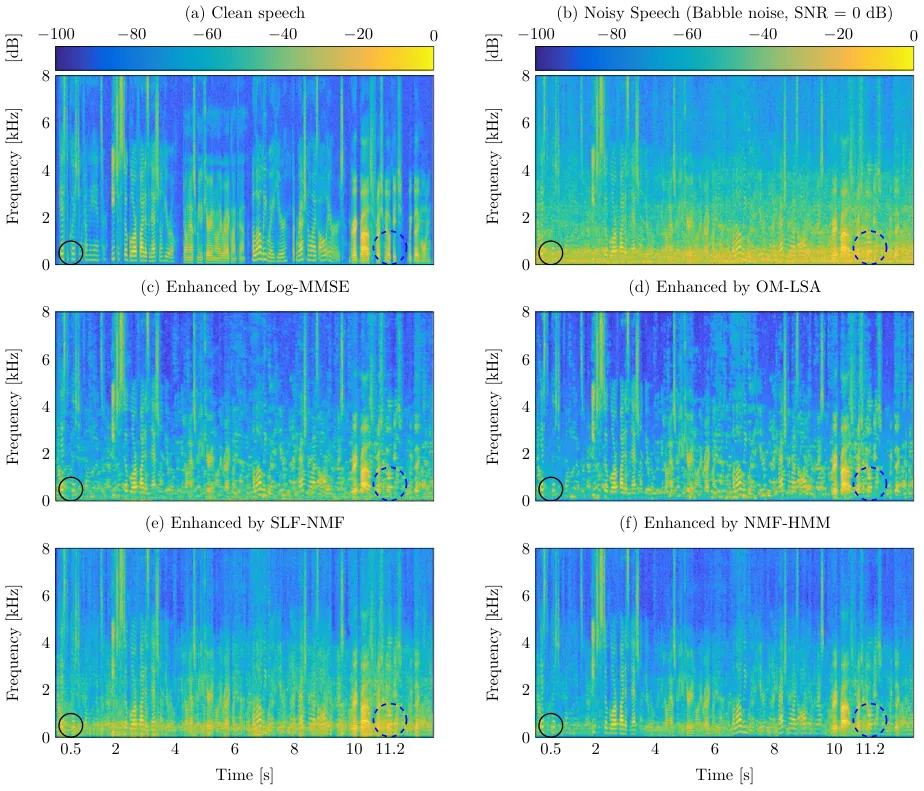

# A Speech Enhancement Algorithm based on Non-negative Hidden Markov Model and Kullback-Leibler Divergence

Yang Xiang    Liming Shi    Jesper Lisby Højvang   
Morten Højfeldt Rasmussen    and Mads Græsbøll Christensen
^(†)^(†)thanks: Y. Xiang is an industrial PhD student. He is with the
Audio Analysis Lab, CREATE, Aalborg University, Aalborg, Denmark and
Capturi A/S, Aarhus, Denmark, e-mail: yaxi@create.aau.dk^(†)^(†)thanks:
L. Shi and M. G. Christensen are with the Audio Analysis Lab, CREATE,
Aalborg University, Aalborg, Denmark,
e-mail:{ls,mgc}@create.aau.dk^(†)^(†)thanks: J. L. Højvang and M. H.
Rasmussen are with Capturi A/S, Aarhus, Denmark, e-mail:
{jlh,mhr}@capturi.com^(†)^(†)thanks: This work was supported by Capturi
and Innovation FundDenmark (Grant No.9065-00046).

###### Abstract

In this paper, we propose a novel supervised single-channel speech
enhancement method combing the the Kullback-Leibler divergence-based
non-negative matrix factorization (NMF) and hidden Markov model
(NMF-HMM). With the application of HMM, the temporal dynamics
information of speech signals can be taken into account. In the training
stage, the sum of Poisson, leading to the KL divergence measure, is used
as the observation model for each state of HMM. This ensures that a
computationally efficient multiplicative update can be used for the
parameter update of the proposed model. In the online enhancement stage,
we propose a novel minimum mean-square error (MMSE) estimator for the
proposed NMF-HMM. This estimator can be implemented using parallel
computing, saving the time complexity. The performance of the proposed
algorithm is verified by objective measures. The experimental results
show that the proposed strategy achieves better speech enhancement
performance than state-of-the-art speech enhancement methods. More
specifically, compared with the traditional NMF-based speech enhancement
methods, our proposed algorithm achieves a 5% improvement for short-time
objective intelligibility (STOI) and 0.18 improvement for perceptual
evaluation of speech quality (PESQ).

###### Index Terms: 

speech enhancement, non-negative matrix factorization (NMF), hidden
Markov model (HMM), minimum mean-square error (MMSE), Kullback-Leibler
(KL) divergence.

## I Introduction

Single-channel speech enhancement technology has been widely used in our
daily lives, such as speech coding, teleconferencing, hearing aids,
mobile communication, and automated robust speech recognition (ASR) \[1,
2\]. In general, the purpose of speech enhancement is to remove
background noise from noisy speech while preserving clean speech. It
aims to improve the quality and intelligibility of noisy speech \[3\].
Currently, single-channel speech enhancement is an active topic of
research.

During the past decades, many different monaural speech enhancement
approaches have been proposed \[2, 4\]. In an environment with additive
noise, the simplest approach to conduct speech enhancement is the
spectral subtraction algorithm \[5\], which subtracts the estimated
noise spectrum from the observed noisy speech in order to acquire the
desired clean speech. Additionally, other unsupervised methods such as
signal subspace algorithm \[6, 7, 8, 9\], Wiener filtering \[10\],
minimum mean-square error (MMSE) spectral amplitude estimator \[11\],
and log-MMSE spectral amplitude estimator \[12\] are effective
strategies to conduct speech enhancement when the noise is stationary.
These methods have low computational complexity, so they have been
widely applied in various areas. However, these approaches cannot always
achieve satisfactory performance for non-stationary noise and usually
introduce musical noise because they do not make best use of the prior
information of speech and noise \[13\]. Moreover, most of unsupervised
methods are based the statistical properties of the speech and noise
signals. However, it is difficult to meet these properties in real-world
noisy scenarios \[14\].

Therefore, supervised speech enhancement approaches have been developed.
For instance, Srinivasan \[15\] proposed a codebook-driven speech
enhancement algorithm for non-stationary noise. In this work, the
auto-regressive (AR) spectrum shape codebooks of speech and noise were
pre-trained. In the enhancement stage, the codebooks could be used to
build a Wiener filter to conduct speech enhancement. Inspired by this
research, many other codebook-based speech enhancement approaches have
been developed \[16, 17\]. Furthermore, auto-regressive hidden Markov
model (ARHMM) \[18, 19\] is also an effective supervised speech
enhancement method because it considers the temporal information of
speech signal.

In recent years, with the advance of hardware and deep learning
technologies \[20, 21\], deep neural networks (DNNs) have significantly
promoted to the development of speech enhancement \[22\]. These methods
usually rely on fewer assumptions \[3, 14, 22\] between noise and clean
speech, so they have huge potential to achieve better speech enhancement
performance. Xu \[3, 14\] applied a feedforward multilayer perceptron
(MLP) to map log-power spectrum (LPS) features of clean speech given
noisy LPS input. The enhanced speech could be obtained directly by
waveform reconstruction. Compared with the MMSE estimator \[12\], this
method achieved better performance in various noisy environments. Wang
\[23, 24\] also utilized the MLP to estimate the ideal ratio mask (IRM)
and ideal binary mask (IBM) to conduct speech enhancement, which also
achieved satisfactory performance. Motivated by this work, different DNN
structures have been used to conduct speech enhancement, such as fully
convolutional neural network (FCN) \[25\], deep recurrent neural
networks \[26, 27\] and generative adversarial networks (GANs)\[28,
29\]. These methods could help ASR systems achieve higher recognition
accuracy in noisy environments. However, generalization is always a
problem that needs to be considered for these DNN-based algorithms \[30,
31\].

Non-negative matrix factorization (NMF)-based \[32, 33, 34\] speech
enhancement algorithms can be also viewed as a kind of supervised speech
enhancement method. In \[35\], a mask-based NMF speech enhancement
method was proposed. In the offline stage, the basis matrix of clean
speech and noise was trained. In the enhancement stage, the activation
matrix could be acquired by combining the trained basis matrix and noisy
signal. Then, the mask was estimated to conduct speech enhancement.
Additionally, an NMF-based denoising scheme was described in \[36, 37\],
which added a heuristic term to the cost function, so the NMF
coefficient could be adjusted according to the long-term levels of
signals. A parametric NMF method for speech enhancement was proposed in
\[16\]. This method applied the AR coefficient and codebook to build the
basis matrix. This strategy effectively improved speech intelligibility.
Moreover, some DNN-based NMF methods represent an effective strategy to
conduct speech enhancement \[38\]. In general, the basis matrix could be
acquired using the traditional NMF method and the activation matrix
could be estimated by applying the DNN \[39\], which improved the
accuracy of the estimated activation matrix. Thus, it could achieve
higher perceptual evaluation of speech quality (PESQ) \[40\] and
short-time objective intelligibility (STOI) \[41\] scores than
traditional NMF-based speech enhancement methods. The combination of DNN
and NMF could also help the ASR system achieve a lower word error rate
(WER) in noisy environments. In \[42\], a DNN-NMF-based method achieved
excellent performance in the CHiME-3 challenge. To capture temporal
information, some HMM-based NMF speech enhancement methods have been
proposed. Mohammadiha \[43\] proposed a supervised and unsupervised NMF
speech enhancement method. In \[43\], HMM is used for modeling the
temporal change of different noise types. In \[44\], a non-negative
factorial HMM was used to model sound mixtures and showed superior
performance in source separation tasks. In \[45\], an HMM-DNN NMF speech
enhancement algorithm was proposed, which applied clustering method to
acquire the HMM-based basis matrix and used Viterbi algorithm to obtain
the ideal state label for the DNN training. In the enhancement stage,
the DNN was used to find the corresponding state to conduct speech
enhancement. This strategy achieved satisfactory speech enhancement
performance.

Inspired by previous studies, in this paper, we propose a novel NMF-HMM
speech enhancement method based on the Kullback-Leibler (KL) divergence.
This method uses the HMM to capture the temporal dynamics of speech
signal. Moreover, we use the sum of Poisson distribution as the
state-conditioned likelihood for the HMM, rather than the general
gaussian mixture Model (GMM), because the sum of Poisson distribution
leads to the KL divergence measure, which is a mainstream measure in
NMF, and its parameter update rule is identical to the multiplicative
update rule. This ensures that the parameter update is computationally
efficient during the training stage. In the enhancement stage, we
propose a novel NMF-HMM-based MMSE estimator to conduct the online
speech enhancement. Another benefit of the proposed algorithm is that
the activation matrix can be updated by parallel computing in the online
stage. This can effectively reduce computational time. The proposed
method is evaluated by PESQ and STOI.

The rest of this paper is organized as follows. First, we will briefly
review the general NMF-based speech enhancement method with KL
divergence in Section II. The HMM-based signal model will be introduced
in Section III and the offline parameter learning will be explained in
Section IV. The details of proposed MMSE estimator and online speech
enhancement process will be given in Section V. The experimental
comparison and analysis of results will be illustrated in Section VI and
we will draw conclusions in Section VII.

## II NMF-based speech enhancement method with KL divergence

In this section, we will briefly review the NMF-based speech enhancement
with KL divergence. Assuming additive noise, the noisy signal model can
be expressed as

```math
y(t)=s(t)+m(t), \tag{1}
```

where $`y(t)`$, $`s(t)`$ and $`m(t)`$ denote the noisy signal, clean
speech and noise, respectively, and $`t`$ is the time index. Using (1),
the short-time Fourier transform (STFT) of $`y(t)`$ can be written as

```math
Y(f,n)=S(f,n)+M(f,n), \tag{2}
```

where $`Y(f,n)`$, $`S(f,n)`$, and $`M(f,n)`$ denotes the frequency
spectrums of $`y(t)`$, $`s(t)`$, and $`m(t)`$, respectively. Here,
$`f\in[1,F]`$ and $`n\in[1,N]`$ denote the frequency bin and time frame
indices, respectively. Collecting $`F`$ frequency bins and $`N`$ time
frames, we define the magnitude spectrum matrices $`\mathbf{Y}_{N}`$,
$`\mathbf{S}_{N}`$ and $`\mathbf{M}_{N}`$, where
$`{\mathbf{Y}}_{N}=[\mathbf{y}_{1},\cdots,\mathbf{y}_{n},\cdots,\mathbf{y}_{N}]`$
and $`\mathbf{y}_{n}=[|Y(1,n)|,\cdots,|Y(f,n)|,\cdots,|Y(F,n)|]^{T}`$,
$`\mathbf{s}_{n}`$ and $`\mathbf{m}_{n}`$ are defined similarly to
$`\mathbf{y}_{n}`$. And $`\mathbf{S}_{N}`$ and $`\mathbf{M}_{N}`$ are
defined similarly to $`\mathbf{Y}_{N}`$. Additionally, we assume that
there is $`\mathbf{Y}_{N}=\mathbf{S}_{N}+\mathbf{M}_{N}`$. The classical
NMF-based speech enhancement has two stages: training and enhancement.
In the training stage, the clean speech basis matrix
$`\overline{\bf{W}}`$ and noise basis matrix $`\ddot{\bf{W}}`$ are
trained using clean speech and noise databases, respectively. Many cost
functions have been proposed for NMF, such as the KL divergence \[33\],
IS divergence \[46\], $`\beta`$ divergence and Euclidian distance
\[47\]. In this paper, we focus on using the KL divergence measure.
There are two reasons for this choice. First, compared with other types
of cost functions, the best speech enhancement performance can be
achieved using the KL divergence-based NMF with the magnitude spectrum
\[48\]. Second, the efficient multiplicative update (MU) rule of the KL
divergence-based NMF can be also derived statistically using the
expectation maximization (EM) algorithm \[49\]. For two matrices
$`\bf{B}`$ and $`\hat{\bf{B}}`$, the KL divergence measure is defined as

```math
{{\rm KL}(\bf{B|\hat{B})}}=\sum_{i,j}(b_{i,j}{\rm log}(b_{i,j}/\hat{b}_{i,j})-b_{i,j}+\hat{b}_{i,j}), \tag{3}
```

where $`b_{i,j}`$ and $`{\hat{b}}_{i,j}`$ denote the elements from the
$`i^{\mathrm{th}}`$ row and $`j^{\mathrm{th}}`$ column of the matrices
$`\bf{B}`$ and $`\bf\hat{B}`$, respectively. Using speech basis matrix
training as an example, the the cost function of the KL divergence-based
NMF for training $`\overline{\bf{W}}`$ can be written as

```math
(\overline{\bf{W}},\overline{\bf{H}})={\mathop{\arg\min}_{\overline{\bf{W}},\overline{\bf{H}}}}{\ }{{\mathrm{KL}}(\mathbf{S}_{N}|\overline{\bf{W}}\times\overline{\bf{H}})}. \tag{4}
```

The noise basis matrix training is similar to the speech basis matrix
training. In \[33\], it is derived that $`\overline{\bf{W}}`$ and
$`\overline{\bf{H}}`$ can be obtained iteratively using the following
multiplicative update rules:

```math
{\overline{\bf{W}}}\leftarrow{\overline{\bf{W}}}\odot{\cfrac{\cfrac{\mathbf{S}_{N}}{\overline{\bf{W}}\times\overline{\bf{H}}}\overline{\bf{H}}^{\mathit{T}}}{\bf{1}{\overline{\bf{H}}}^{\mathit{T}}}}, \tag{5}
```

```math
{\overline{\bf{H}}}\leftarrow{\overline{\bf{H}}}\odot{\cfrac{\overline{\bf{W}}^{\mathit{T}}\cfrac{\mathbf{S}_{N}}{\overline{\bf{W}}\times\overline{\bf{H}}}}{\overline{\bf{W}}^{\mathit{T}}\bf{1}}}, \tag{6}
```

where $`\odot`$ and all divisions are element-wise multiplication and
division operations, respectively, $`\bf{1}`$ is a matrix of ones with
the same size as $`\mathbf{S}_{N}`$. In the enhancement stage, the noisy
speech basis matrix $`\bf{W}`$ can be constructed by concatenating the
speech and noise basis matrices, i.e.,
$`{{\bf{W}}=[\overline{\bf{W}},\ddot{\bf{W}}]}`$. The activation matrix
$`{\bf{H}}`$ of the noisy speech can be estimated iteratively using (6)
but replacing $`\mathbf{S}_{N}`$, $`\overline{\bf{W}}`$ and
$`\overline{\bf{H}}`$ in (6) with $`\mathbf{Y}_{N}`$, $`\mathbf{W}`$ and
$`\mathbf{H}`$, respectively. The enhanced signal can be obtained using
various algorithms \[35, 36, 43, 44\]. One popular approach is to use
the following Wiener-filtering like spectral gain
$`\mathbf{g}_{n}^{\text{NMF}}`$ function:

```math
\displaystyle\mathbf{g}_{n}^{\text{NMF}} \displaystyle=\frac{\overline{\mathbf{W}}\,\overline{\mathbf{h}}_{n}}{{\overline{\mathbf{W}}\,\overline{\mathbf{h}}_{n}}+{\ddot{\mathbf{W}}\,\ddot{\mathbf{h}}_{n}}}, \tag{7}
```

```math
\displaystyle\mathbf{h}_{n} \displaystyle=\left[\overline{\mathbf{h}}_{n}^{T},\ddot{\mathbf{h}}_{n}^{T}\right]^{T}
```

```math
\displaystyle=\arg\min_{\mathbf{h}_{n}}\mathrm{KL}(\mathbf{y}_{n}|\mathbf{W}\mathbf{h}_{n}), \tag{8}
```

where (8) can be solved iteratively by using (6). Apart from the
gradient descent derivation of the MU update rules (5) and (6) presented
in \[33\], it is further shown in \[49\] that the MU update rules can be
derived from a statistical perspective. More specifically, the KL
divergence-based NMF can be motivated from the following hierarchical
statistical model:

```math
{{\bf{S}}_{N}=\sum_{k=1}^{K}{\bf{C}}(k),} \tag{9}
```

```math
{c_{f,n}(k)}\sim\mathcal{PO}(c_{f,n}(k);\overline{W}_{f,k}\overline{H}_{k,n}), \tag{10}
```

where
$`\small{\mathcal{PO}(x;\lambda)=\cfrac{\lambda^{x}e^{-\lambda}}{\Gamma(x+1)}}`$
is the Poisson distribution, $`\Gamma(x+1)=x!`$ denotes the gamma
function for positive integer $`x`$, $`K`$ denotes the number of basis
vectors, $`\mathbf{C}(k)`$ is the latent matrix and $`c_{f,n}(k)`$
denotes the element of $`\mathbf{C}(k)`$ in the $`f^{\mathrm{th}}`$ row
and $`n^{\mathrm{th}}`$ column. Note that $`{c_{f,n}(k)}`$ is assumed to
have a Poisson distribution which can only be used for discrete
variable. However, in practice, this hierarchical statistical model is
not limited for discrete variables since the gamma function for
continuous variable can be used to replace the factorial calculation
\[49\]. It has been shown in \[49\] that the iterative update of the
parameters $`\overline{\bf{H}}`$ and $`\overline{\bf{W}}`$ using the
expectation maximization (EM) algorithm is identical to the
multiplicative update rules shown in (5) and (6).

One of the advantages of the classical NMF-based method for speech
enhancement is that the computational efficient MU rules can be applied.
However, the temporal dynamical aspects of speech and noise are not
taken into account. To incorporate the temporal dynamical information of
audio signal, the HMM model is used in \[44\] for source separation.
However, the parameter update rules are computational complex. Moreover,
only off-line enhancement approach is presented. In speech enhancement
application, to consider the change of the noise types over time, the
HMM model is used in \[43\] to model the transition of the noise types
over time. In this paper, we propose a NMF-based speech enhancement
algorithm using the HMM to take the temporal aspects of both the speech
and noise into account. Moreover, an online MMSE estimator for speech
enhancement is derived.

## III HMM-based signal models with the KL divergence

In this section, we present the proposed signal models, i.e., the speech
and noise signal models, and the noisy signal model.

### III-A Speech and Noise Signal Models

In this work, the same signal model is used for both the clean speech
and the noise signal, so we will illustrate them using only the clean
speech signal. Additionally, we use the overbar ($`\overline{\cdot}`$)
and double dots ($`\ddot{\cdot}`$) to represent the clean speech and the
noise, respectively. To consider the temporal dynamics information of
the speech and noise, we use the HMM. Following the conditional
independence property of the standard HMM \[50\], the likelihood
function can be expressed as follows:

```math
p({\bf{S}}_{N};{\bm{\Phi}})=\sum_{\bf{\overline{x}}_{N}}\prod_{n=1}^{N}p({\bf s}_{n}|\overline{x}_{n})p(\overline{x}_{n}|\overline{x}_{n-1}), \tag{11}
```

where
$`{\bf{\overline{x}}_{N}}=[\overline{x}_{1},\cdots,\overline{x}_{n},\cdots,\overline{x}_{N}]^{T}`$
is a collection of states,
$`\overline{x}_{n}\in\{1,2,\cdots,\overline{J}\}`$ denote the state at
the $`n^{\mathrm{th}}`$ frame and $`\overline{J}`$ denotes the total
number of states. $`p(\overline{x}_{n}|\overline{x}_{n-1})`$ denotes the
state transition probability from state $`\overline{x}_{n-1}`$ to
$`\overline{x}_{n}`$ with $`p(\overline{x}_{1}|\overline{x}_{0})`$ being
the initial state probability. $`p({\bf S}_{n}|\overline{x}_{n})`$ is
the state-conditioned likelihood function, $`\bm{\Phi}`$ is a collection
of modeling parameters. Next, we describe the state transition
probability and the state-conditioned likelihood function, respectively,
for the proposed signal model.  
The state transition probability
$`p(\overline{x}_{n}|\overline{x}_{n-1})`$: Following the standard HMM,
we use the first-order-Markov-chain to model the state transition, that
is

```math
p(\overline{x}_{n}|\overline{x}_{n-1})=\prod_{i=1}^{\overline{J}}\prod_{j=1}^{\overline{J}}{\overline{A}_{i,j}^{l(\overline{x}_{n}=j,\overline{x}_{n-1}=i)}}, \tag{12}
```

```math
p(\overline{x}_{1}|\overline{x}_{0})=p(\overline{x}_{1})=\prod_{j=1}^{\overline{J}}{\overline{\pi}_{j}^{l(\overline{x}_{1}=j)}}, \tag{13}
```

where $`l(\cdot)`$ denotes an indicator function, which is 1 when the
logic expression in the parentheses is true and 0 otherwise. In
addition, $`\overline{A}_{i,j}`$ and $`\overline{\pi}_{j}`$ denote the
transition probability from the state $`i`$ to the state $`j`$ and the
initial probability for the first frame’s state $`\overline{x}_{1}`$
being state $`j`$, respectively. Collecting all the initial and
transition probabilities, we can write them into matrix forms, i.e.,
$`\overline{\bm{\pi}}=[\overline{\pi}_{1},\cdots,\overline{\pi}_{j},\cdots,\overline{\pi}_{\overline{J}}]^{T}`$
and $`\overline{\mathbf{A}}`$ with $`\overline{A}_{i,j}`$ being the
element at the $`i^{\mathrm{th}}`$ row and $`j^{\mathrm{th}}`$ column.
Therefore, the modeling parameters of the HMM can be expressed as
$`\bm{\Phi}_{\text{hmm}}=\{\overline{\mathbf{A}},\overline{\bm{\pi}},\overline{J}\}`$.
The modeling parameters $`\overline{\mathbf{A}}`$ and
$`\overline{\bm{\pi}}`$ with a predefined $`\overline{J}`$ can be
trained through the EM algorithm shown in the next section. In the
experiments, we investigate the impact of the total number of states
$`\overline{J}`$.  
The state-conditioned likelihood function
$`p({\bf s}_{n}|\overline{x}_{n})`$: Next, we present the the proposed
state-conditioned likelihood function. Motived by the good speech
enhancement performance, the computational efficient MU rule, and the
equivalence between the gradient descent derivation and the EM algorithm
for the KL divergence-based NMF, we propose to use the statistical model
(9) and (10) to build the state-conditioned likelihood function, that is

```math
{\bf s}_{n}=\sum_{k=1}^{\overline{K}}{{\overline{\bf{c}}_{n}}}(k), \tag{14}
```

```math
{p(\overline{\bf c}_{n}(k)|\overline{x}_{n})}=\prod_{f=1}^{F}\mathcal{PO}({\overline{c}}_{f,n}(k);\overline{W}_{f,k}^{\overline{x}_{n}}\overline{H}_{k,n}^{\overline{x}_{n}}), \tag{15}
```

where $`\overline{K}`$ is the number of basis vectors,
$`\overline{\bf c}_{n}(k)`$ contains the hidden variables,
$`\overline{W}_{k,n}^{\overline{x}_{n}}`$ and
$`\overline{H}_{k,n}^{\overline{x}_{n}}`$ correspond to the elements of
the basis and activation matrices. Writing
$`\overline{\mathbf{c}}_{n}=[\overline{\mathbf{c}}_{n}(1)^{T},\overline{\mathbf{c}}_{n}(2)^{T},\cdots,\overline{\mathbf{c}}_{n}(\overline{K})^{T}]^{T}`$
and integrating $`\overline{\mathbf{c}}_{n}`$ out, the state conditioned
likelihood function can be written as

```math
\displaystyle{\displaystyle p({\bf s}_{n}|\overline{x}_{n})}=\int{p({\bf s}_{n}|{\overline{\bf{c}}_{n}})}{p(\overline{\bf{c}}_{n}|{\overline{{x}}_{n}})}\,d{\overline{\bf{c}}_{n}} \tag{16}
```

```math
\displaystyle=\prod_{f=1}^{F}\mathcal{PO}(|S(f,n)|;\sum_{k=1}^{\overline{K}}\overline{W}_{f,k}^{\overline{x}_{n}}\overline{H}_{k,n}^{\overline{x}_{n}}),
```

where we use the superposition property of the Poisson random variable
\[49\]. Collecting the unknown parameters
$`\{\overline{W}_{f,k}^{\overline{x}_{n}}\}`$ and
$`\{\overline{H}_{k,n}^{\overline{x}_{n}}\}`$, we can write them into
matrix forms, i.e., $`\{\overline{\mathbf{W}}^{j}\}`$ and
$`\{\overline{\mathbf{H}}^{j}\}`$. Therefore, unlike the traditional NMF
using only one basis matrix, the proposed model have $`\overline{J}`$
basis matrices to be trained. Each basis matrix is intended to capture a
specific feature (e.g., phoneme) of the speech signal. The modeling
parameters of the proposed state-conditioned likelihood function can be
expressed as
$`\bm{\Phi}_{\text{like}}=\{\{\overline{\mathbf{W}}^{j}\},\{\overline{\mathbf{H}}^{j}\},\overline{K},\overline{J}\}`$.
The modeling parameters $`\{\overline{\mathbf{W}}^{j}\}`$ and
$`\{\overline{\mathbf{H}}^{j}\}`$ with predefined $`\overline{J}`$ and
$`\overline{K}`$ can be trained through the EM algorithm shown in the
next section. In the experiments, we investigate the impact of the
number of basis vectors $`\overline{K}`$ and $`\overline{J}`$. It will
also be shown that a multiplicative update rule can be derived for the
basis and activation matrices update of the proposed state-conditioned
likelihood function.

To summarize, five types of parameters in the parameter set
$`\bm{\Phi}`$=$`\bm{\Phi}_{\text{hmm}}\cup\bm{\Phi}_{\text{like}}`$ can
be identified. They are the transition matrix $`\overline{\bf{A}}`$,
initial state probabilities in $`\overline{\bm{\pi}}`$, basis matrices
of different states $`\{\overline{\bf{W}}^{j}\}`$, activation matrices
of different states $`\{{\overline{\bf{H}}}^{j}\}`$, and modeling
parameters $`\overline{K}`$ and $`\overline{J}`$. In this paper, the
modeling parameters $`\overline{K}`$ and $`\overline{J}`$ are
predefined, the activation matrices $`\{\overline{\bf{H}}^{j}\}`$ is
estimated by online speech enhancement and the other three types of
parameters are obtained using offline learning.

### III-B Noisy Speech Model

Based on the proposed clean speech and noise signal models, (1) and (2),
the noisy speech model can be defined. We assume that there are a total
of $`\ddot{J}`$ hidden states for the noise and the hidden state of the
noise is $`\ddot{x}_{n}(\ddot{x}_{n}\in{\{1,2,\cdots,\ddot{J}\}})`$. The
$`\ddot{\bm{\pi}}`$ and $`\ddot{\bf{A}}`$ correspond to the initial
state probability and transition probability matrix of the noise. Thus,
there are a total of $`\overline{J}\times\ddot{J}`$ hidden states for
the noisy speech. Each composite state consists of a pair of states of
clean speech $`{\overline{x}_{n}}`$ and noise $`\ddot{x}_{n}`$. Thus, if
we list the state space for noisy signal, we have
$`(\overline{x}_{n}=1,\ddot{x}_{n}=1),(\overline{x}_{n}=1,\ddot{x}_{n}=2),\cdots,(\overline{x}_{n}=1,\ddot{x}_{n}=\ddot{J});(\overline{x}_{n}=2,\ddot{x}_{n}=1),(\overline{x}_{n}=2,\ddot{x}_{n}=2),\cdots,(\overline{x}_{n}=2,\ddot{x}_{n}=\ddot{J});\cdots;(\overline{x}_{n}=\overline{J},\ddot{x}_{n}=1),(\overline{x}_{n}=\overline{J},\ddot{x}_{n}=2),\cdots,(\overline{x}_{n}=\overline{J},\ddot{x}_{n}=\ddot{J})`$.
Moreover, the initial state and transition probabilities matrices of the
noisy speech can be expressed as
$`\overline{\bm{\pi}}\otimes\ddot{\bm{\pi}}`$ and
$`\overline{\bf{A}}\otimes\ddot{\bf{A}}`$, where the $`{\otimes}`$
denotes the Kronecker product. Finally, the state conditioned likelihood
function of the noisy speech can be written as follows:

```math
\displaystyle{\displaystyle p({\bf y}_{n}|\overline{x}_{n},\ddot{x}_{n})}= \tag{17}
```

```math
\displaystyle\prod_{f=1}^{F}\mathcal{PO}{(}|(Y(f,n)|;\sum_{k=1}^{\overline{K}}\overline{W}_{f,k}^{\overline{x}_{n}}\overline{H}_{k,n}^{\overline{x}_{n}}+\sum_{k=1}^{\ddot{K}}\ddot{W}_{f,k}^{\ddot{x}_{n}}\ddot{H}_{k,n}^{\ddot{x}_{n}}),
```

where $`\ddot{K}`$, $`\{\ddot{W}_{f,k}^{\ddot{x}_{n}}\}`$, and
$`\{\ddot{H}_{f,k}^{\ddot{x}_{n}}\}`$ represent the number of basis
vectors, elements of the basis matrices and the activation matrices for
the noise, respectively. We can write
$`\{\ddot{W}_{f,k}^{\ddot{x}_{n}}\}`$ and
$`\{\ddot{H}_{k,n}^{\ddot{x}_{n}}\}`$ into matrix forms
$`\{{\ddot{\bf{W}}}^{j}\}`$ and $`\{{\ddot{\bf{H}}}^{j}\}`$. Note that,
we also used the superposition property of Poisson random variables to
obtain (17).

## IV Offline NMF-HMM-based parameter learning

In the offline training stage, the objective is to find the parameter
set $`\bm{\Phi}`$ that maximizes the likelihood function (11). In
general, the EM algorithm \[50\] can be used to address this problem.
Since we used the same model for the speech and the noise, we here use
the clean speech as the example to illustrate the offline parameter
learning process. First, we define the complete data set
$`({\bf S}_{N},{\bf{\overline{x}}}_{N},{\bf{\overline{C}}}_{N})`$, where
$`{\bf{\overline{C}}}_{N}=[\overline{\bf c}_{1},\overline{\bf c}_{2},\cdots,\overline{\bf c}_{N}]`$.
Thus, using the conditional independence property, the complete data
likelihood function can be written as

```math
\displaystyle{\displaystyle p({\bf{S}}_{N},{\bf{\overline{x}}}_{N},{\bf{\overline{C}}}_{N})}=\prod_{n=1}^{N}p({\bf s}_{n}|\overline{\bf c}_{n})p(\overline{\bf c}_{n}|\overline{x}_{n})p(\overline{x}_{n}|\overline{x}_{n-1}). \tag{18}
```

Next, we show how the parameter set can be obtained iteratively using
the EM algorithm. Moreover, we propose a speeding up strategy to lower
the computational and memory complexities. The traditional MU update
algorithm for the KL divergence-based NMF can be seen as a special case
of the proposed algorithm.  
Expectation step: We first calculate the posterior state probability and
the joint posterior probability, which can be written as

```math
q(\overline{x}_{n})=p(\overline{x}_{n}|{\bf{S}}_{N};{\bm{\Phi}}^{i-1}), \tag{19}
```

```math
q(\overline{x}_{n},\overline{x}_{n-1})=p(\overline{x}_{n},\overline{x}_{n-1}|{\bf{S}}_{N};{\bm{\Phi}}^{i-1}), \tag{20}
```

where $`i`$ is the iteration number. The calculation of (19) and (20)
can be performed using the forward-backward algorithm \[50\]. Apart from
this, we also need to evaluate the posterior expectation
$`{\mathbb{E}}_{\overline{\bf c}_{n}|{\bf{S}}_{N},{\overline{x}_{n}};{{\bm{\Phi}}}^{i-1}}(\overline{\bf c}_{n})`$,
which will be used in the maximization-step. By using the Bayes rule and
the conditional independence property of the proposed model, we have

```math
q(\overline{\bf c}_{n}|\overline{x}_{n})=p({\overline{\bf c}_{n}|{\bf{S}}_{N},{\overline{x}_{n}};{{\bm{\Phi}}}^{i-1}})=\cfrac{{p(\bf s}_{n}|{\overline{\bf{c}}_{n}}){p(\overline{\bf{c}}_{n}|{\overline{{x}}_{n}})}}{p({\bf{S}}_{N},{\overline{x}_{n})}}{.} \tag{21}
```

Combining (14) and (15) and following the derivation in \[49\], we have

```math
\displaystyle q(\overline{\bf c}_{n}|\overline{x}_{n})= \tag{22}
```

```math
\displaystyle\prod_{f=1}^{F}{\mathcal{M}}({\overline{c}}_{f,n}(1),\cdots,{\overline{c}}_{f,n}({\overline{K}});|S(f,n)|,p_{f,n}^{{\overline{x}}_{n}}(1),\cdots,p_{f,n}^{{\overline{x}}_{n}}{(\overline{K})}),
```

where $`{\mathcal{M}}(\cdot)`$ denotes the multinomial distribution and

```math
p_{f,n}^{{\overline{x}}_{n}}(k)=\cfrac{\overline{W}_{f,k}^{\overline{x}_{n}}\overline{H}_{k,n}^{\overline{x}_{n}}}{\sum_{l=1}^{\overline{K}}\overline{W}_{f,l}^{\overline{x}_{n}}\overline{H}_{l,n}^{\overline{x}_{n}}}. \tag{23}
```

Using the properties of the multinomial distribution, the mean can be
written as

```math
{\mathbb{E}}({\overline{c}}_{f,n}({k})|{\bf{S}}_{N},{\overline{x}_{n}})=|S(f,n)|\cfrac{\overline{W}_{f,k}^{\overline{x}_{n}}\overline{H}_{k,n}^{\overline{x}_{n}}}{\sum_{l=1}^{K}\overline{W}_{f,l}^{\overline{x}_{n}}\overline{H}_{l,n}^{\overline{x}_{n}}}. \tag{24}
```

Maximization step: In this step, our objective is to find parameters to
maximize the expectation of the logarithm of the complete data
likelihood, that is,

```math
{{\bm{\Phi}}}^{i}={\mathop{\arg\max}_{\bm{\Phi}}}{\mathbb{E}}_{{\bf{\overline{x}}}_{N},{\bf{\overline{C}}}_{N}|{\bf{S}}_{N};{{\bm{\Phi}}}^{i-1}}[\log{p({\bf{S}}_{N},{\bf{\overline{x}}}_{N},{\bf{\overline{C}}}_{N})}]. \tag{25}
```

The estimators for the $`\overline{\bf{A}}`$ and $`\overline{\bm{\pi}}`$
are the same as the traditional HMM \[50\]. For completeness, the
results are shown below

```math
{\overline{\pi}}_{j}=\cfrac{q(\overline{x}_{1}=j)}{\sum_{o=1}^{\overline{J}}q(\overline{x}_{1}=o)}, \tag{26}
```

```math
{\overline{A}}_{o,j}=\cfrac{\sum_{n=2}^{\overline{N}}q(\overline{x}_{n}=j,\overline{x}_{n-1}=o)}{\sum_{j=1}^{\overline{J}}\sum_{n=2}^{\overline{N}}q(\overline{x}_{n}=j,\overline{x}_{n-1}=o)}, \tag{27}
```

where $`1\leq o,j\leq\overline{J}`$. The estimated basis and activation
matrices can be derived by setting the derivatives of (25) to zeros, and
we can obtain

```math
W_{f,k}^{j}=\cfrac{\sum_{n=1}^{{N}}q(\overline{x}_{n}=j){\mathbb{E}}({\overline{c}}_{f,n}(k)|{\bf{S}}_{N},{\overline{x}_{n}}=j)}{\sum_{n=1}^{{N}}q(\overline{x}_{n}=j)H_{k,n}^{j}}, \tag{28}
```

```math
H_{k,n}^{j}=\cfrac{\sum_{f=1}^{{F}}{\mathbb{E}}({\overline{c}}_{f,n}(k)|{\bf{S}}_{N},{\overline{x}_{n}}=j)}{\sum_{f=1}^{{F}}W_{f,k}^{j}}. \tag{29}
```

Speeding up strategy: Although we can directly use the above EM
algorithm to update the parameter set, saving the conditional
expectation of $`{\overline{c}}_{f,n}({k})`$ in (24) requires a lot of
memory. Like \[49\], we substitute (24) into (28) and (29), and we can
obtain:

```math
W_{f,k}^{j}\leftarrow\cfrac{\displaystyle{\sum_{n=1}^{{N}}q(\overline{x}_{n}=j)\cfrac{|S(f,n)|\overline{H}_{k,n}^{j}}{\sum_{l=1}^{\overline{K}}\overline{W}_{f,l}^{j}\overline{H}_{l,n}^{j}}}}{\sum_{n=1}^{{N}}q(\overline{x}_{n}=j)H_{k,n}^{j}}, \tag{30}
```

```math
H_{k,n}^{j}\leftarrow\cfrac{\displaystyle{\sum_{f=1}^{{F}}\cfrac{\overline{W}_{f,k}^{j}|S(f,n)|}{\sum_{l=1}^{K}\overline{W}_{f,l}^{j}\overline{H}_{l,n}^{j}}}}{\sum_{f=1}^{{F}}H_{k,n}^{j}}. \tag{31}
```

We can further write (30) and (31) in matrix forms

```math
{\overline{\bf{W}}}^{j}\leftarrow{\overline{\bf{W}}}^{j}\odot{\cfrac{\cfrac{{\bf{S}}_{N}}{{\overline{\bf{W}}}^{j}{\overline{\bf{H}}}^{j}}{{\bm{\Lambda}}(j)}({\overline{\bf{H}}}^{j})^{\mathit{T}}}{{\bf{1}}({\overline{\bf{H}}}^{j})^{\mathit{T}}}}, \tag{32}
```

```math
{\overline{\bf{H}}}^{j}\leftarrow{\overline{\bf{H}}}^{j}\odot{\cfrac{({{\overline{\bf{W}}}^{j}})^{\mathit{T}}\cfrac{{\bf{S}}_{N}}{{\overline{\bf{W}}}^{j}{\overline{\bf{H}}}^{j}}}{({\overline{\bf{W}}}^{j})^{\mathit{T}}\bf{1}}}, \tag{33}
```

where
$`{\bm{\Lambda}}(j)={\rm diag}(q(\overline{x}_{1}=j),q(\overline{x}_{2}=j),\cdots,q(\overline{x}_{N}=j))`$.
Using the proposed speeding up strategy, the computing and saving of the
conditional expectation of $`{\overline{c}}_{f,n}({k})`$ in (24) is not
required. Moreover, the multiplicative update rules for the basis and
activation matrices can be obtained, leading to fast computing.
Comparing the update rules of the proposed method (32), (33) and the
traditional NMF-based method (5), (6), the difference is that the basis
vectors update rule (32) for the proposed method takes the posterior
state information $`{\bm{\Lambda}}(j)`$ into account. In fact, if the
number of state is set to 1 (i.e., $`\overline{J}=1`$), the proposed
training method is identical to the traditional KL divergence-based NMF
approach. The entire flow of the offline parameter learning is shown in
Algorithm 1. Note that, for stability reasons, each column of
$`{\overline{\bf{W}}}^{j}`$ is normalized to have unit norm during
training.

|                                                                                                                             |
| --------------------------------------------------------------------------------------------------------------------------- | ------------------------------------------------------- |
| Algorithm 1: Offline NMF-HMM-based parameter learning                                                                       |
| 1: Randomly initiate $`{\overline{\bf{W}}}^{j}`$ and $`{\overline{\bf{H}}}^{j},\overline{j}\in\{1,2,\cdots,\overline{J}\}`$ |
| 2: for $`i=1,2,3,\cdots,I`$ do                                                                                              |
|    Expectation step:                                                                                                        |
| 3: Calculate $`{p({\bf s}\_{n}                                                                                              | \overline{x}\_{n})}`$, $`1\leq n\leq{N}`$ based on (16) |
| 4: Obtain (19) and (20) using the forward-backward algorithm \[50\]                                                         |
|    Maximization step:                                                                                                       |
| 5: Re-estimate $`\overline{\bm{\pi}}`$ and $`\overline{\bf{A}}`$ based on (26) and (27)                                     |
| 6: Re-estimate $`{\overline{\bf{W}}}^{j}`$ and $`{\overline{\bf{H}}}^{j}`$ based on (32) and (33)                           |
| 7: end for                                                                                                                  |

## V Online speech enhancement using the MMSE estimator

### V-A MMSE Estimator for the NMF-HMM

In this section, we propose a MMSE-based online speech enhancement
algorithm for the proposed NMF-HMM model. The objective is to obtain the
MMSE estimate of the desired clean speech signal from noisy observation,
i.e.,

```math
{{\hat{\bf{s}}}}_{n}={\mathbb{E}}_{{\bf s}_{n}|{\bf{Y}}_{n}}({\bf s}_{n})=\int{{\bf s}_{n}}p({{\bf s}_{n}|{\bf{Y}}_{n}})\,d{{\bf s}_{n}}, \tag{34}
```

In (34), the posterior probability $`p({{\bf s}_{n}|{\bf{Y}}_{n}})`$ can
be derived as

```math
\displaystyle p({{\bf s}_{n}|{\bf{Y}}_{n}})=\cfrac{p({\bf{s}}_{n},{\bf{y}}_{n}|{\bf{Y}}_{n-1})}{p({\bf{y}}_{n}|{\bf{Y}}_{n-1})} \tag{35}
```

```math
\displaystyle=\cfrac{\sum_{\overline{x}_{n},\ddot{x}_{n}}p({\bf{s}}_{n},{\bf{y}}_{n}|{\overline{x}_{n},\ddot{x}_{n}})p({\overline{x}_{n},\ddot{x}_{n}}|{\bf{Y}}_{n-1})}{p({\bf{y}}_{n}|{\bf{Y}}_{n-1})},
```

where we use the conditional independence property of the HMM. The term
$`p({\overline{x}_{n},\ddot{x}_{n}}|{\bf{Y}}_{n-1})`$ in (35) can be
expressed as

```math
\displaystyle p({\overline{x}_{n},\ddot{x}_{n}}|{\bf{Y}}_{n-1}) \tag{36}
```

```math
\displaystyle=\sum_{\overline{x}_{n-1},\ddot{x}_{n-1}}p({\overline{x}_{n},\ddot{x}_{n}}|{\overline{x}_{n-1},\ddot{x}_{n-1}})p({\overline{x}_{n-1},\ddot{x}_{n-1}}|{\bf{Y}}_{n-1}),
```

where the first term after the summation is the state transition
probability for noisy signal and the second term is the forward
probability that can be acquired using the well-known forward algorithm
\[50\]. By applying the Bayes rule, the term
$`p({\bf{s}}_{n},{\bf{y}}_{n}|{\overline{x}_{n},\ddot{x}_{n}})`$ in (35)
can be further written as

```math
p({\bf{s}}_{n},{\bf{y}}_{n}|{\overline{x}_{n},\ddot{x}_{n}})=p({\bf{s}}_{n}|{\bf{y}}_{n},{\overline{x}_{n},\ddot{x}_{n}})p({\bf{y}}_{n}|{\overline{x}_{n},\ddot{x}_{n}}). \tag{37}
```

Substituting (37) to (35), the posterior probability can be re-written
as

```math
p({{\bf s}_{n}|{\bf{Y}}_{n}})=\sum_{\overline{x}_{n-1},\ddot{x}_{n-1}}\omega_{\overline{x}_{n},\ddot{x}_{n}}p({\bf{s}}_{n}|{\bf{y}}_{n},{\overline{x}_{n},\ddot{x}_{n}}), \tag{38}
```

where the weight $`0\leq\omega_{\overline{x}_{n},\ddot{x}_{n}}\leq 1`$
is defined as

```math
{\omega_{\overline{x}_{n},\ddot{x}_{n}}}=\cfrac{{p({\bf y}_{n}|\overline{x}_{n},\ddot{x}_{n})}{p(\overline{x}_{n},\ddot{x}_{n}|{\bf Y}_{n-1}})}{\sum_{\overline{x}_{n},\ddot{x}_{n}}{p({\bf y}_{n}|\overline{x}_{n},\ddot{x}_{n})}{p(\overline{x}_{n},\ddot{x}_{n}|{\bf Y}_{n-1}})}. \tag{39}
```

Thus, by combining (34) and (38), the proposed HMM-based MMSE estimator
can be expressed as

```math
{{\hat{\bf{s}}}}_{n}=\sum_{\overline{x}_{n},\ddot{x}_{n}}\omega_{\overline{x}_{n},\ddot{x}_{n}}\int{{\bf s}_{n}}p({\bf{s}}_{n}|{\bf{y}}_{n},{\overline{x}_{n},\ddot{x}_{n}})\,d{{\bf s}_{n}}. \tag{40}
```

Instead of obtaining the posterior probability density function (PDF)
$`p({\bf{s}}_{n}|{\bf{y}}_{n},{\overline{x}_{n},\ddot{x}_{n}})`$
directly, we derive the formula for the joint posterior PDF of the clean
speech and noise first, that is,

```math
\displaystyle p({{\bf s}_{n},{\bf m}_{n}|{\bf y}_{n}},{\overline{x}_{n},\ddot{x}_{n}}) \tag{41}
```

```math
\displaystyle=\cfrac{p({{\bf y}_{n}|{\bf s}_{n},{\bf m}_{n}})p({{\bf s}_{n},{\bf m}_{n}|}{\overline{x}_{n},\ddot{x}_{n}})}{p({{\bf y}_{n}}|{\overline{x}_{n},\ddot{x}_{n}})}
```

```math
\displaystyle=\cfrac{p({{\bf y}_{n}|{\bf s}_{n},{\bf m}_{n}})p({{\bf s}_{n}|}{\overline{x}_{n}})p({{\bf m}_{n}|}{\ddot{x}_{n}})}{p({{\bf y}_{n}}|{\overline{x}_{n},\ddot{x}_{n}})}.
```

By using (1), we can express the likelihood function
$`p({{\bf y}_{n}|{\bf s}_{n},{\bf m}_{n}})`$ as
$`p({{\bf y}_{n}|{\bf s}_{n},{\bf m}_{n}})=\delta({{\bf y}_{n}-{\bf s}_{n}-{\bf m}_{n}})`$,
where $`\delta(\cdot)`$ denotes the Dirac delta function, which is
defined by $`\delta(0)=+\infty`$ and $`\delta(x)=0`$ when $`x\neq 0`$.
Furthermore, there is $`\int_{-\infty}^{+\infty}\delta(x)\,dx=1`$. The
prior probability $`p({{\bf s}_{n}|}{\overline{x}_{n}})`$ and
$`p({{\bf m}_{n}|}{\ddot{x}_{n}})`$ can be estimated by using (16).
Following the derivation in \[49\], we can verify that the joint
posterior PDF can be expressed in terms of the multinomial distribution
as

```math
\displaystyle p({{\bf s}_{n},{\bf m}_{n}|{\bf y}_{n}},{\overline{x}_{n},\ddot{x}_{n}})= \tag{42}
```

```math
\displaystyle\prod_{f=1}^{F}{\mathcal{M}}(|S(f,n)|,|M(f,n)|;|Y(f,n)|,p_{f,n}(\overline{x}_{n},\ddot{x}_{n}),q_{f,n}(\overline{x}_{n},\ddot{x}_{n})),
```

where $`p_{f,n}(\overline{x}_{n},\ddot{x}_{n})`$ and
$`q_{f,n}(\overline{x}_{n},\ddot{x}_{n})`$ are defined as

```math
\displaystyle p_{f,n}(\overline{x}_{n},\ddot{x}_{n})= \tag{43}
```

```math
\displaystyle\cfrac{\sum_{k=1}^{\overline{K}}\overline{W}_{f,k}^{\overline{x}_{n}}\overline{H}_{k,n}^{\overline{x}_{n}}}{\sum_{k=1}^{\overline{K}}\overline{W}_{f,k}^{\overline{x}_{n}}\overline{H}_{k,n}^{\overline{x}_{n}}+\sum_{k=1}^{\ddot{K}}\ddot{W}_{f,k}^{\ddot{x}_{n}}\ddot{H}_{k,n}^{\ddot{x}_{n}}},
```

where
$`q_{f,n}(\overline{x}_{n},\ddot{x}_{n})=1-p_{f,n}(\overline{x}_{n},\ddot{x}_{n})`$.
Therefore, the integral term in (40) can be expressed as

```math
\displaystyle\int{{\bf s}_{n}}p({\bf{s}}_{n}|{\bf{y}}_{n},{\overline{x}_{n},\ddot{x}_{n}})\,d{{\bf s}_{n}} \tag{44}
```

```math
\displaystyle=\int{{\bf s}_{n}}\int{p({\bf{s}}_{n},{\bf{m}}_{n}|{\bf{y}}_{n},{\overline{x}_{n},\ddot{x}_{n}})}\,d{{\bf m}_{n}}\,d{{\bf s}_{n}}
```

```math
\displaystyle={{\bf{y}}_{n}}\odot{{\bf p}_{n}}({\overline{x}_{n},\ddot{x}_{n}}),
```

where
$`{{\bf p}_{n}}({\overline{x}_{n},\ddot{x}_{n}})=[p_{1,n}(\overline{x}_{n},\ddot{x}_{n}),\cdots,p_{F,n}(\overline{x}_{n},\ddot{x}_{n})]^{T}`$,
and we used the marginal mean property of the multinomial distribution.
Combing (40) and (44), the MMSE estimator can be expressed as:

```math
{{\hat{\bf{s}}}}_{n}={{\bf y}_{n}}\odot{{\bf g}_{n}}, \tag{45}
```

```math
{{\bf g}_{n}}={\sum_{\overline{x}_{n},\ddot{x}_{n}}\omega_{\overline{x}_{n},\ddot{x}_{n}}{{\bf p}_{n}}({\overline{x}_{n},\ddot{x}_{n}}}), \tag{46}
```

where $`{\bf g}_{n}`$ can be viewed as the spectral gain vector for the
proposed model. Comparing the proposed gain vector $`{\bf g}_{n}`$ and
the traditional NMF-based gain vector \[35\], we find that the proposed
gain vector is a weighted sum of each state’s gain, which is in the
Wiener filtering form as the traditional NMF gain (7).

### V-B Online Estimation of Activation Matrices

After obtaining the trained basis matrices
$`\overline{W}_{f,k}^{\overline{x}_{n}}`$ and
$`\ddot{W}_{f,k}^{\ddot{x}_{n}}`$ for both the clean speech and noise in
the training stage, we need to obtain the online estimates of the
activation parameters $`\overline{H}_{f,k}^{\overline{x}_{n}}`$ and
$`\ddot{H}_{f,k}^{\ddot{x}_{n}}`$ to acquire the gain in (45) and (46).
The activation matrices are estimated by maximizing the logarithm of the
state-conditioned likelihood function (17), which is equivalent to

```math
{\bf{h}}_{n}({\overline{x}_{n},\ddot{x}_{n}})={\mathop{\arg\min}_{{\bf{h}}_{n}}}\ \ {\rm KL}({{\bf y}}_{n}|[{\overline{\bf{W}}}^{\overline{x}_{n}},{\ddot{\bf{W}}}^{\ddot{x}_{n}}]{\bf{h}}_{n}), \tag{47}
```

```math
{\bf{h}}_{n}({\overline{x}_{n},\ddot{x}_{n}})=[{\overline{\bf{h}}_{n}}({\overline{x}_{n},\ddot{x}_{n}})^{T},{\ddot{\bf{h}}_{n}}({\overline{x}_{n},\ddot{x}_{n}})^{T}]^{T}, \tag{48}
```

where the clean and noise activation matrices for the state
$`({\overline{x}_{n},\ddot{x}_{n}})`$ are defined as
$`{\overline{\bf{h}}_{n}}({\overline{x}_{n},\ddot{x}_{n}})=[\overline{H}_{1,n}^{\overline{x}_{n}},\overline{H}_{2,n}^{\overline{x}_{n}},\cdots,{H}_{\overline{K},n}^{\overline{x}_{n}}]^{T}`$
and
$`{\ddot{\bf{h}}_{n}}({\overline{x}_{n},\ddot{x}_{n}})=[\ddot{H}_{1,n}^{\ddot{x}_{n}},\ddot{H}_{2,n}^{\ddot{x}_{n}},\cdots,{H}_{\ddot{K},n}^{\ddot{x}_{n}}]^{T}`$.
The activation matrix (48) can be obtained iteratively by using the
multiplicative update rule in equation (6). Note that, to obtain the
activation matrices for different states, parallel computing can be used
to reduce the time complexity. It can be readily shown that when
$`\overline{J}=\ddot{J}=1`$, the gain vectors for the proposed algorithm
(46) and the standard NMF (7) are identical, that is
$`\mathbf{g}_{n}=\mathbf{g}_{n}^{\text{NMF}}`$. The entire flow of
proposed MMSE-based online speech enhancement algorithm is illustrated
by Algorithm 2.

|                                                                                                             |
| ----------------------------------------------------------------------------------------------------------- | ---------------------------------------------- |
| Algorithm 2: MMSE-based online speech enhancement                                                           |
| 1: Input magnitude spectrum: $`{\bf{Y}}_{n}`$                                                               |
| 2: Initiate $`\overline{\bm{\pi}}\otimes\ddot{\bm{\pi}}`$ and $`\overline{\bf{A}}\otimes\ddot{\bf{A}}`$     |
| 3: for $`n=1,2,3,\cdots,N`$ do                                                                              |
| 4: Initiate $`{\bf{h}}_{n}({\overline{x}_{n},\ddot{x}_{n}})`$                                               |
| 5: Based on (6) and (48), obtain the iterative estimation $`{\bf{h}}_{n}({\overline{x}_{n},\ddot{x}_{n}})`$ |
| 6: Calculate $`p({\bf y}\_{n}                                                                               | \overline{x}_{n},\ddot{x}_{n})`$ based on (17) |
| 7: Apply the forward algorithm and combine (36) and (39) to acquire                                         |
|    $`{\omega_{\overline{x}_{n},\ddot{x}_{n}}}`$                                                             |
| 7: Obtain $`{{\bf p}_{n}}({\overline{x}_{n},\ddot{x}_{n}})`$ using (43)                                     |
| 8: Calculate the spectral gain $`{\bf g}_{n}`$ using (46)                                                   |
| 9: By equation(45), estimate the clean speech $`{{\hat{\bf{s}}}}_{n}`$                                      |
| 10: end for                                                                                                 |

## VI Analysis of experiments and results

In this section, we investigate and evaluate the proposed algorithm
using various experiments. First, we investigate the effect of different
parameter settings for the proposed model, that is the number of states
and basis vectors of clean speech and noise, respectively. Second, we
compare the proposed NMF-HMM with other state-of-the-art speech
enhancement methods to demonstrate the effectiveness of the proposed
algorithm. In this work, the PESQ \[40\], ranging from -0.5 to 4.5, is
used to quantify the enhanced speech quality. The STOI \[41\], ranging
from 0 to 1, is used to measure the speech intelligibility.

### VI-A Experimental data preparation

In this study, the proposed algorithm is evaluated using the TIMIT
\[51\] and NOISEX-92 \[52\] databases. During the training stage, all
4620 utterances from the TIMIT training database are used to train the
proposed NMF-HMM model for the clean speech. The Babble, F16, Factory
and White noise from the NOISEX-92 database are used to train the
NMF-HMM model for the noise. For the experiments in Section VI-B, 200
utterances from the TIMIT test set, including 1680 utterances, are
randomly chosen to build the test database. Then, four types of noise
are added at four different SNR levels (i.e., -5, 0, 5, and 10 dB). The
noise types of the testing set are the same as the training set, but no
overlap between the signals in the two sets. In total,
$`200\times 4\times 4=3200`$ utterances are used for evaluation. For the
experiments in Section VI-C, apart from the aforementioned four types of
noise, we further add the destroyerengine and destroyerops noise (from
the NOISEX-92 database) to the test set to evaluate the performance of
various speech enhancement algorithms. Note that, these two noise types
are not included in the training set. In all experiments, the sound
signals are down-sampled to 16 kHz. The frame length is set to 1024
samples (64 ms) with a frame shift of 512 samples (32 ms). The size of
STFT is 1024 points with a Hanning window. Furthermore, the maximum
number of iterations is set to 30 in the training stage and 15 in the
online speech enhancement stage for the proposed NMF-HMM algorithm.

### VI-B Number of states and basis vectors analysis

Fig. 1: Performance of the NMF-HMM and T-NMF using different numbers of
clean speech basis vectors.

As explained in Sections III and IV, four parameters need to be
pre-defined in our proposed NMF-HMM-based speech enhancement algorithm.
These parameters are number of states ($`\overline{J}`$ and
$`\ddot{J}`$) and basis vectors ($`\overline{K}`$ and $`\ddot{K}`$) for
the clean speech and noise. In this part, we investigate the effects of
these parameters in our proposed method and choose suitable parameters
for the later experiments.

First, we investigate the effect of total numbers of clean speech basis
vectors ($`\overline{K}\times\overline{J}`$) for the NMF-HMM and T-NMF.
In this experiment, we use the average STOI and PESQ scores of 3200
utterances as the performance metrics. In this experiment, the number of
noise basis vectors for both the proposed NMF-HMM and T-NMF is fixed to
70 and the number of noise states for the NMF-HMM is fixed to 1. For the
T-NMF, the number of clean speech basis vectors $`{\overline{K}}`$ is
varied as 25, 125, 250, 500 and 1000. For the NMF-HMM, the
$`\overline{K}`$ is fixed to 25 and $`\overline{J}`$ is varied as 1, 5,
10, 20 and 40 . This parameter setting ensures that the total number of
clean speech basis vectors is the same for the T-NMF and NMF-HMM. The
experimental results are shown in Figure 1. As can be seen, the T-NMF
can achieve the best performance when $`\overline{K}=25.`$ However, its
performance degraded with the increasing of number of basis vectors due
to overfitting. By contrast, NMF-HMM achieves higher PESQ and STOI
scores with an increasing number of clean speech basis vectors by taking
the temporal dynamics into account using the HMM model. Furthermore, it
can be found that NMF-HMM can achieve a 5% improvement for STOI and 0.18
improvement for PESQ than T-NMF.

#### VI-B1 Number of states analysis

Then, we investigate the effect of the number of clean speech states
(i.e., $`\overline{J}`$) to the proposed model. The number of noise
states is set to 2 (i.e., $`\ddot{J}=2`$) for the proposed NMF-HMM. The
number of basis vectors for the clean speech and noise is fixed to
$`{\overline{K}}=25`$ and $`{\ddot{K}}=70`$, respectively. The number of
clean speech states is chosen as 1, 5, 10, 20 and 40. The traditional
NMF-based speech enhancement (T-NMF) method
$`(\ddot{J}=1,\overline{J}=1,{\overline{K}}=25,{\ddot{K}}=70)`$ \[35\]
is used as the reference method. The enhancement performance is
evaluated by the PESQ and STOI.

Fig. 2: Average PESQ scores of proposed algorithm with different number
of clean states ($`{\overline{K}}=25,\ddot{J}=2,{\ddot{K}}=70`$).

| SNR(dB)                        | -5                      | 0                     | 5                     | 10                    |
| ------------------------------ | ----------------------- | --------------------- | --------------------- | --------------------- |
| Noisy                          | 51.59 ($`\pm\,{0.50}`$) | 64.26 ($`\pm\,0.52)`$ | 76.30 ($`\pm\,0.47`$) | 85.86 ($`\pm\,0.36)`$ |
| T-NMF                          | 55.85 ($`\pm\,0.76`$)   | 68.96 ($`\pm\,0.73`$) | 79.51 ($`\pm\,0.59`$) | 86.78 ($`\pm\,0.40`$) |
| NMF-HMM, $`{\overline{J}}=1`$  | 56.14 ($`\pm\,0.76`$)   | 69.21 ($`\pm\,0.72`$) | 79.29 ($`\pm\,0.57`$) | 85.80 ($`\pm\,0.39`$) |
| NMF-HMM, $`{\overline{J}}=5`$  | 57.32 ($`\pm\,0.80`$)   | 71.00 ($`\pm\,0.74`$) | 81.16 ($`\pm\,0.58`$) | 87.94 ($`\pm\,0.38`$) |
| NMF-HMM, $`{\overline{J}}=10`$ | 58.54 ($`\pm\,0.83`$)   | 72.35 ($`\pm\,0.74`$) | 82.23 ($`\pm\,0.56`$) | 88.80 ($`\pm\,0.37`$) |
| NMF-HMM, $`{\overline{J}}=20`$ | 59.56 ($`\pm\,0.84`$)   | 73.24 ($`\pm\,0.74`$) | 82.92 ($`\pm\,0.54`$) | 89.10 ($`\pm\,0.36`$) |
| NMF-HMM, $`{\overline{J}}=40`$ | 59.84 ($`\pm\,0.87`$)   | 73.46 ($`\pm\,0.75`$) | 83.17 ($`\pm\,0.55`$) | 89.33 ($`\pm\,0.36`$) |

TABLE I: Average STOI scores (%) of different clean speech state
($`{\overline{K}}=25,\ddot{J}=2,{\ddot{K}}=70`$)

Fig. 3: Average PESQ scores of proposed algorithm with different numbers
of noise state ($`\overline{J}=10,{\overline{K}}=25,{\ddot{K}}=70`$).

| SNR(dB)                    | -5                      | 0                     | 5                     | 10                    |
| -------------------------- | ----------------------- | --------------------- | --------------------- | --------------------- |
| Noisy                      | 51.59 ($`\pm\,{0.50}`$) | 64.26 ($`\pm\,0.52)`$ | 76.30 ($`\pm\,0.47`$) | 85.86 ($`\pm\,0.36)`$ |
| T-NMF                      | 55.85 ($`\pm\,0.76`$)   | 68.96 ($`\pm\,0.73`$) | 79.51 ($`\pm\,0.59`$) | 86.78 ($`\pm\,0.40`$) |
| NMF-HMM, $`{\ddot{J}}=1`$  | 57.71 ($`\pm\,0.83`$)   | 71.50 ($`\pm\,0.75`$) | 81.79 ($`\pm\,0.59`$) | 88.62 ($`\pm\,0.38`$) |
| NMF-HMM, $`{\ddot{J}}=2`$  | 58.54 ($`\pm\,0.83`$)   | 72.35 ($`\pm\,0.74`$) | 82.23 ($`\pm\,0.56`$) | 88.80 ($`\pm\,0.37`$) |
| NMF-HMM, $`{\ddot{J}}=5`$  | 58.86 ($`\pm\,0.82`$)   | 72.74 ($`\pm\,0.73`$) | 82.73 ($`\pm\,0.55`$) | 89.13 ($`\pm\,0.37`$) |
| NMF-HMM, $`{\ddot{J}}=10`$ | 59.42 ($`\pm\,0.82`$)   | 73.08 ($`\pm\,0.73`$) | 82.78 ($`\pm\,0.55`$) | 89.20 ($`\pm\,0.37`$) |

TABLE II: Average STOI scores (%) of different noise state
($`\overline{J}=10,{\overline{K}}=25,{\ddot{K}}=70`$)

Figure 2 shows the average PESQ score for different number of clean
speech states $`\overline{J}`$ in different SNRs. It can be seen that
$`\overline{J}=1,\ddot{J}=2`$ has a slightly better PESQ score than the
T-NMF ($`\overline{J}=1,\ddot{J}=1`$) in the low-SNR environment. In
addition, with an increasing $`\overline{J}`$, the proposed NMF-HMM
method has a consistently increasing PESQ score. In the present setting,
the highest PESQ score is achieved when the $`\overline{J}`$ is 40.
TABLE I indicates the average STOI scores with 95% confidence interval
in different SNRs. As shown in TABLE I, the NMF-HMM with
$`\overline{J}=1`$ and $`\ddot{J}=2`$ has a similar performance to the
T-NMF. Moreover, for the proposed NMF-HMM, the STOI improvement from
$`\overline{J}=1`$ to $`\overline{J}=10`$ is larger than from
$`\overline{J}=10`$ to $`\overline{J}=40`$. Furthermore, by taking the
temporal dynamics of the speech signal into account, the proposed
NMF-HMM with $`\overline{J}>1`$ (it also increases the total number of
basis vectors) has a consistently better STOI score than the T-NMF. The
proposed method with $`\overline{J}=40`$ has the best performance in all
SNRs.

Next, we investigate the influence of the number of noise states. The
number of clean speech states is set to $`\overline{J}=10`$. The number
of noise states $`{\ddot{J}}`$ is chosen as 1, 2, 5 and 10. All the
other settings are the same as the previous experiment. Figure  3 shows
the average PESQ scores for different number of noise states
$`{\ddot{J}}`$ in different SNRs. It can be seen that using a larger
$`{\ddot{J}}`$ tends to slightly improve the PESQ score, especially in
high SNR scenarios (e.g., 5-10 dB). Table II illustrates the average
STOI scores with 95% confidence interval in different SNRs. In general,
a larger number of noise states helps the NMF-HMM achieve higher STOI
score. The highest STOI score is achieved when $`{\ddot{J}=10}`$.
However, the STOI improvement from increasing $`{\ddot{J}}`$ is limited.
For example, there is no significant difference between $`\ddot{J}=2`$
and $`\ddot{J}=10`$. Therefore, we can conclude that the influence of
number of noise states $`\ddot{J}`$ is less sensitive than the influence
of clean speech states $`\overline{J}`$ for the proposed NMF-HMM method.
This might be due to the noise being fairly stationary in this
experiment and there are more changes for clean speech.

Fig. 4: Average PESQ scores of different numbers of clean speech basis
vectors $`(\ddot{J}=2,\overline{J}=40,{\ddot{K}}=70)`$.

Fig. 5: Average PESQ scores of different numbers of noise basis vectors
$`(\ddot{J}=2,\overline{J}=40,{\overline{K}}=25)`$.

#### VI-B2 Number of basis vector analysis

| SNR(dB)                        | -5                      | 0                     | 5                     | 10                    |
| ------------------------------ | ----------------------- | --------------------- | --------------------- | --------------------- |
| Noisy                          | 51.59 ($`\pm\,{0.50}`$) | 64.26 ($`\pm\,0.52)`$ | 76.30 ($`\pm\,0.47`$) | 85.86 ($`\pm\,0.36)`$ |
| T-NMF                          | 55.85 ($`\pm\,0.76`$)   | 68.96 ($`\pm\,0.73`$) | 79.51 ($`\pm\,0.59`$) | 86.78 ($`\pm\,0.40`$) |
| NMF-HMM, $`{\overline{K}}=5`$  | 59.27 ($`\pm\,0.85`$)   | 69.98 ($`\pm\,0.69`$) | 77.53 ($`\pm\,0.54`$) | 82.81 ($`\pm\ 0.44`$) |
| NMF-HMM, $`{\overline{K}}=10`$ | 59.98 ($`\pm\,0.87`$)   | 71.94 ($`\pm\,0.71`$) | 80.42 ($`\pm\,0.53`$) | 86.20 ($`\pm\,0.38`$) |
| NMF-HMM, $`{\overline{K}}=25`$ | 59.84 ($`\pm\,0.87`$)   | 73.46 ($`\pm\,0.75`$) | 83.17 ($`\pm\,0.55`$) | 89.33 ($`\pm\,0.36`$) |
| NMF-HMM, $`{\overline{K}}=50`$ | 57.41 ($`\pm\,0.83`$)   | 71.08 ($`\pm\,0.77`$) | 81.79 ($`\pm\,0.59`$) | 89.11 ($`\pm\,0.38`$) |

TABLE III: STOI scores (%) of different numbers of clean speech basis
vectors $`(\ddot{J}=2,\overline{J}=40,{\ddot{K}}=70)`$

| SNR(dB)                    | -5                      | 0                     | 5                     | 10                    |
| -------------------------- | ----------------------- | --------------------- | --------------------- | --------------------- |
| Noisy                      | 51.59 ($`\pm\,{0.50}`$) | 64.26 ($`\pm\,0.52)`$ | 76.30 ($`\pm\,0.47`$) | 85.86 ($`\pm\,0.36)`$ |
| T-NMF                      | 55.85 ($`\pm\,0.76`$)   | 68.96 ($`\pm\,0.73`$) | 79.51 ($`\pm\,0.59`$) | 86.78 ($`\pm\,0.40`$) |
| NMF-HMM, $`{\ddot{K}=10}`$ | 55.74 ($`\pm\,0.79`$)   | 69.40 ($`\pm\,0.77`$) | 80.80 ($`\pm\,0.60`$) | 88.85 ($`\pm\ 0.39`$) |
| NMF-HMM, $`{\ddot{K}=20}`$ | 57.28 ($`\pm\,0.82`$)   | 70.86 ($`\pm\,0.77`$) | 81.69 ($`\pm\,0.58`$) | 89.20 ($`\pm\,0.37`$) |
| NMF-HMM, $`{\ddot{K}=40}`$ | 58.57 ($`\pm\,0.85`$)   | 71.99 ($`\pm\,0.76`$) | 82.23 ($`\pm\,0.57`$) | 89.22 ($`\pm\,0.36`$) |
| NMF-HMM, $`{\ddot{K}=70}`$ | 59.84 ($`\pm\,0.87`$)   | 73.46 ($`\pm\,0.75`$) | 83.17 ($`\pm\,0.55`$) | 89.33($`\pm\,0.36`$)  |

TABLE IV: STOI scores (%) of different numbers of noise basis vectors
$`(\ddot{J}=2,\overline{J}=40,{\overline{K}}=25)`$

| SNR(dB) | Noise Type      | Noisy                 | Log-MMSE              | OMLSA                 | SLF-NMF               | NMF-HMM               |
| ------- | --------------- | --------------------- | --------------------- | --------------------- | --------------------- | --------------------- |
| -5      | Babble          | 48.28                 | 44.64                 | 43.89                 | 47.81                 | 49.95                 |
|         | F16             | 49.03                 | 52.71                 | 49.29                 | 57.17                 | 61.95                 |
|         | Factory         | 55.07                 | 55.29                 | 52.11                 | 58.98                 | 62.67                 |
|         | destroyerengine | 51.37                 | 57.01                 | 51.62                 | 50.83                 | 51.81                 |
|         | destroyerops    | 54.09                 | 55.00                 | 52.23                 | 54.18                 | 56.99                 |
|         | White           | 53.97                 | 55.76                 | 48.95                 | 58.38                 | 64.79                 |
|         | Average         | 51.97 ($`\pm\,0.08`$) | 53.41 ($`\pm\,0.09`$) | 49.68 ($`\pm\,0.09`$) | 54.56 ($`\pm\,0.09`$) | 58.03 ($`\pm\,0.11`$) |
| 0       | Babble          | 60.54                 | 58.02                 | 57.96                 | 61.72                 | 66.14                 |
|         | F16             | 62.09                 | 66.15                 | 63.05                 | 69.75                 | 75.25                 |
|         | Factory         | 67.64                 | 67.85                 | 66.15                 | 71.69                 | 75.48                 |
|         | destroyerengine | 64.03                 | 69.95                 | 65.22                 | 63.36                 | 67.26                 |
|         | destroyerops    | 65.49                 | 66.71                 | 64.34                 | 66.24                 | 70.75                 |
|         | White           | 66.79                 | 68.39                 | 63.64                 | 69.61                 | 76.97                 |
|         | Average         | 66.43 ($`\pm\,0.08`$) | 66.17 ($`\pm\,0.08`$) | 63.39 ($`\pm\,0.09`$) | 67.06 ($`\pm\,0.09`$) | 71.97 ($`\pm\,0.09`$) |
| 5       | Babble          | 72.57                 | 71.48                 | 71.95                 | 73.75                 | 78.72                 |
|         | F16             | 74.55                 | 77.59                 | 76.32                 | 79.28                 | 83.96                 |
|         | Factory         | 78.83                 | 78.70                 | 78.38                 | 79.81                 | 84.23                 |
|         | destroyerengine | 76.67                 | 80.86                 | 78.29                 | 75.95                 | 80.43                 |
|         | destroyerops    | 75.72                 | 76.84                 | 74.98                 | 76.98                 | 80.89                 |
|         | White           | 79.27                 | 79.76                 | 77.89                 | 80.44                 | 85.78                 |
|         | Average         | 76.27 ($`\pm\,0.07`$) | 77.54 ($`\pm\,0.07`$) | 76.31 ($`\pm\,0.08`$) | 77.70 ($`\pm\,0.07`$) | 82.34 ($`\pm\,0.07`$) |
| 10      | Babble          | 82.66                 | 81.98                 | 83.08                 | 83.05                 | 86.96                 |
|         | F16             | 84.88                 | 86.40                 | 86.53                 | 86.49                 | 89.43                 |
|         | Factory         | 87.02                 | 86.40                 | 87.16                 | 87.31                 | 89.38                 |
|         | destroyerengine | 86.92                 | 88.80                 | 88.17                 | 85.99                 | 88.30                 |
|         | destroyerops    | 84.18                 | 84.76                 | 83.86                 | 84.63                 | 87.58                 |
|         | White           | 88.88                 | 88.14                 | 87.95                 | 89.05                 | 91.51                 |
|         | Average         | 85.76 ($`\pm\,0.05`$) | 86.08 ($`\pm\,0.05`$) | 86.13 ($`\pm\,0.06`$) | 86.09 ($`\pm\,0.05`$) | 88.87 ($`\pm\,0.04`$) |

TABLE V: Comparison of STOI scores (%) for various algorithms under
different SNRs using six types of noise.

The number of basis vectors is another important parameter for proposed
NMF-HMM algorithm. In this part, we investigate its influence to the
PESQ and STOI performance. The number of clean speech states and noise
states are set to $`\overline{J}=40`$ and $`\ddot{J}=2`$, respectively.
First, we investigate the influence of the number of clean speech basis
vectors. The number of noise basis vectors is set to $`\ddot{K}=70`$.
The number of clean speech basis vectors $`{\overline{K}}`$ is set to 5,
10, 25, 50. The other settings are set to the same as the previous
experiment. Figure 4 shows the average PESQ scores for different number
of clean speech basis vectors. As can be seen, the proposed NMF-HMM
method achieves a higher PESQ score than T-NMF in most cases. However,
higher $`{\overline{K}}`$ cannot ensure better PESQ scores for the
proposed algorithm probably due to the models overfitting to the limited
training set. Additionally, the proposed method achieves the highest
PESQ score when $`{\overline{K}}=10`$ at 0 and 5 dB SNRs. Table III
compares STOI scores for different $`{\overline{K}}`$. As can be seen,
when $`{\overline{K}}=25`$, the proposed NMF-HMM achieves the highest
STOI score under 0 to 10 dB scenarios. In -5 dB SNR, the NMF-HMM with
$`\overline{K}=10`$ has the best performance. However, the STOI scores
of the NMF-HMM with $`\overline{K}=25`$ and $`\overline{K}=10`$ are
comparable in -5 db scenario. From the PESQ and STOI results, it can be
concluded that that a better PESQ can be obtained for the proposed
NMF-HMM with $`{\overline{K}}=10`$ but a high STOI when
$`{\overline{K}}=25`$. We set $`{\overline{K}}=25`$ for the subsequent
experiments.

In the next experiment, the effect of number of noise basis vectors is
investigated. Here, we set $`\overline{J}=40`$, $`\ddot{J}=2`$,
$`{\overline{K}}=25`$ and $`\ddot{K}`$ is set to 10, 20 ,40, and 70. The
T-NMF is used as the reference method. Figure 5 shows the average PESQ
scores for different $`\ddot{K}`$. It can be seen that the a higher
number of noise basis vectors leads to a higher PESQ score for both the
T-NMF and NMF-HMM. In all SNR scenarios, the NMF-HMM with
$`\ddot{K}=70`$ has the best PESQ performance. The average STOI scores
with different $`\ddot{K}`$ are given in Table IV. As can be seen, the
highest STOI score is obtained when $`{\ddot{K}}=70`$. Finally, based on
the PESQ and STOI test results, we set $`{\ddot{K}}=70`$ for the
subsequent experiments.

Combining above results and analysis, for the proposed NMF-HMM, we set
$`{\overline{J}=40,\ddot{J}=2,\overline{K}=25,\ddot{K}=70}`$ to conduct
the rest of experiments. It should be noted that this parameter settings
may not be appropriate for a different training or test database. A good
choice of parameters for the proposed algorithm is to balance the errors
of overfitting and underfitting.

### VI-C Overall Evaluation

In this section, we compare the proposed NMF-HMM speech enhancement
method with state-of-the-art speech enhancement methods. We choose the
optimally-modified log-spectral amplitude (OM-LSA) method \[53\] with
IMCRA noise estimator \[54\], span linear filters method \[7\]
(SLF-NMF), which applied the parametric NMF\[16\] and Log-MMSE \[55\]
algorithm as the reference methods. For the SLF-NMF, the maximum SNR
filter is applied. The codebook size of clean speech and noise is set to
64 and 8, respectively.



Fig. 6: Spectrograms of the clean speech, noisy speech and enhanced
signals by various speech enhancement algorithms under 0 dB babble
noise.

First, the enhancement algorithms are used to process a noisy speech
signal in babble noise under 0 dB SNR. The spectrograms of the clean
speech, noisy signal and enhanced signals are shown in Figure 6. It can
be seen that all the methods enhances the speech efficiently. However,
the unsupervised methods (OMLSA and Log-MMSE) remove more background
noise, but they also introduce musical noise, degrading the
intelligibility. The supervised NMF-based methods (SLF-NMF and NMF-HMM)
can recover more speech characteristics than the unsupervised methods,
especially in the low-frequency area. Comparing NMF-HMM with other
methods, it can be found that NMF-HMM can recover a better harmonic
structure. For example, a better recovery of the harmonic structure of
the proposed NMF-HMM can be seen at 0.5 and 11.2 seconds (inside the
black and blue circles). Moreover, compared with the SLF-NMF, the
NMF-HMM removes more noise between the harmonic bands (e.g., the area
inside the black circle). Furthermore, the proposed NMF-HMM does not
generate musical noise. Therefore, comparing with the reference methods,
the best speech enhancement performance can be obtained using the
proposed NMF-HMM.

Second, the performance of the proposed NMF-HMM, SLF-NMF, Log-MMSE, and
OM-LSA are evaluated using the test set. It should be noted that the
destroyerengine and destroyerops noise, not in the training set, are
included in the test set to evaluate the performance. Figure 7 shows the
average PESQ scores with 95% confidence interval of these algorithms. As
can be seen, the SLF-NMF has the worst performance among these
algorithms. This is due to its poor performance for dealing with unseen
noise types. Moreover, the proposed NMF-HMM outperforms other
enhancement algorithms in all SNR scenarios, except that the Log-MMSE
and NMF-HMM have a similar performance when SNR=10. Furthermore, in low
SNR scenarios (e.g., -5–5 dB), the average PESQ score improvement of the
proposed NMF-HMM is larger than 0.05 against the other algorithms. The
results of the STOI scores with 95% confidence interval for various
algorithms are given in Table V. As can be seen, the SLF-NMF has a
better performance than the Log-MMSE and OMLSA when the noise types are
in the training set. However, under unseen noise cases, that is
destroyerengine and destroyerops noise, the performance of the SLF-NMF
is comparable to the OMLSA. The Log-MMSE has the best performance in all
cases for the destroyerengine noise. The proposed NMF-HMM achieves the
best speech enhancement performance in all the other cases. Moreover, in
high SNRs (e.g, 5-10 dB) under destroyerengine noise, the STOI scores of
the proposed NMF-HMM and Log-MMSE are comparable. Furthermore, compared
with the reference methods, the NMF-HMM has the highest average STOI
score.

Fig. 7: Average PESQ scores of different algorithms using six types of
noise under different SNRs.

## VII Conclusion

In this work, we propose a NMF-HMM-based speech enhancement algorithm
that applies the sum of Poisson, leading to the KL divergence measure,
as the observation model for each state of HMM. The computationally
efficient multiplicative update rule can be used to conduct parameter
updates during the training stage for the proposed method. Moreover,
using the HMM, the temporal dynamic information of speech signals can be
captured. Furthermore, we also propose a novel NMF-HMM-based MMSE
estimator to conduct online speech enhancement. The parallel computation
can be applied for the proposed estimator, so we can effectively reduce
the time complexity during the online speech enhancement stage. By
experiments, suitable number of states basis vectors for the proposed
NMF-HMM are found. Our experimental results also indicate that the
proposed algorithm can outperform state-of-the-art NMF-based and
unsupervised speech enhancement methods. In addition, the NMF-HMM can
achieve the better performance than SLF-NMF in the tested unseen noise
cases (destroyerengine and destroyerops). The generalization ability of
the proposed method in other unseen noise cases is expected to be
investigated in the future work.

## References

- \[1\] J. Li, L. Deng, Y. Gong, and R. Haeb-Umbach, “An overview of
  noise-robust automatic speech recognition,” _IEEE/ACM Trans. Audio,
  Speech, and Lang. Process._, vol. 22, no. 4, pp. 745–777, 2014.
- \[2\] P. C. Loizou, _Speech enhancement: theory and practice_. CRC
  press, 2013.
- \[3\] Y. Xu, J. Du, L.-R. Dai, and C.-H. Lee, “An experimental study
  on speech enhancement based on deep neural networks,” _IEEE Signal
  Process. Lett._, vol. 21, no. 1, pp. 65–68, 2013.
- \[4\] I. Cohen and S. Gannot, “Spectral enhancement methods,” in
  _Springer Handbook of Speech Processing_. Springer, 2008, pp. 873–902.
- \[5\] S. Boll, “Suppression of acoustic noise in speech using spectral
  subtraction,” _IEEE Trans. Acoust., Speech, Signal Process._, vol. 27,
  no. 2, pp. 113–120, 1979.
- \[6\] K. B. Christensen, M. G. Christensen, J. B. Boldt, and F. Gran,
  “Experimental study of generalized subspace filters for the cocktail
  party situation,” in *Proc. IEEE Int. Conf. Acoust., Speech, Signal
  Process.* IEEE, 2016, pp. 420–424.
- \[7\] J. R. Jensen, J. Benesty, and M. G. Christensen, “Noise
  reduction with optimal variable span linear filters,” _IEEE/ACM Trans.
  Audio, Speech, and Lang. Process._, vol. 24, no. 4, pp. 631–644, 2015.
- \[8\] Y. Ephraim and H. L. Van Trees, “A signal subspace approach for
  speech enhancement,” _IEEE Trans. Speech Audio Process._, vol. 3,
  no. 4, pp. 251–266, 1995.
- \[9\] F. Jabloun and B. Champagne, “Incorporating the human hearing
  properties in the signal subspace approach for speech enhancement,”
  _IEEE Trans. Speech Audio Process._, vol. 11, no. 6, pp.
  700–708, 2003.
- \[10\] J. Lim and A. Oppenheim, “All-pole modeling of degraded
  speech,” _IEEE Trans. Acoust., Speech, Signal Process._, vol. 26,
  no. 3, pp. 197–210, 1978.
- \[11\] Y. Ephraim and D. Malah, “Speech enhancement using a
  minimum-mean square error short-time spectral amplitude estimator,”
  _IEEE Trans. Acoust., Speech, Signal Process._, vol. 32, no. 6, pp.
  1109–1121, 1984.
- \[12\] ——, “Speech enhancement using a minimum mean-square error
  log-spectral amplitude estimator,” _IEEE Trans. Acoust., Speech,
  Signal Process._, vol. 33, no. 2, pp. 443–445, 1985.
- \[13\] A. Hussain, M. Chetouani, S. Squartini, A. Bastari, and
  F. Piazza, “Nonlinear speech enhancement: An overview,” in _Progress
  in nonlinear speech processing_. Springer, 2007, pp. 217–248.
- \[14\] Y. Xu, J. Du, L.-R. Dai, and C.-H. Lee, “A regression approach
  to speech enhancement based on deep neural networks,” _IEEE/ACM Trans.
  Audio, Speech, and Lang. Process._, vol. 23, no. 1, pp. 7–19, 2014.
- \[15\] S. Srinivasan, J. Samuelsson, and W. B. Kleijn, “Codebook-based
  bayesian speech enhancement for nonstationary environments,” _IEEE
  Trans. Audio, Speech, and Lang. Process._, vol. 15, no. 2, pp.
  441–452, 2007.
- \[16\] M. S. Kavalekalam, J. K. Nielsen, L. Shi, M. G. Christensen,
  and J. Boldt, “Online parametric NMF for speech enhancement,” in
  *Proc. European Signal Processing Conf.* IEEE, 2018, pp. 2320–2324.
- \[17\] Q. He, F. Bao, and C. Bao, “Multiplicative update of
  auto-regressive gains for codebook-based speech enhancement,”
  _IEEE/ACM Trans. Audio, Speech, and Lang. Process._, vol. 25, no. 3,
  pp. 457–468, 2016.
- \[18\] D. Y. Zhao and W. B. Kleijn, “HMM-based gain modeling for
  enhancement of speech in noise,” _IEEE Trans. Audio, Speech, and Lang.
  Process._, vol. 15, no. 3, pp. 882–892, 2007.
- \[19\] F. Deng, C. Bao, and W. B. Kleijn, “Sparse Hidden Markov Models
  for speech enhancement in non-stationary noise environments,”
  _IEEE/ACM Trans. Audio, Speech, and Lang. Process._, vol. 23, no. 11,
  pp. 1973–1987, 2015.
- \[20\] Y. Bengio _et al._, “Learning deep architectures for ai,”
  _Foundations and trends® in Machine Learning_, vol. 2, no. 1, pp.
  1–127, 2009.
- \[21\] G. E. Hinton, S. Osindero, and Y.-W. Teh, “A fast learning
  algorithm for deep belief nets,” _Neural Comput._, vol. 18, no. 7, pp.
  1527–1554, 2006.
- \[22\] D. Wang and J. Chen, “Supervised speech separation based on
  deep learning: An overview,” _IEEE/ACM Trans. Audio, Speech, and Lang.
  Process._, vol. 26, no. 10, pp. 1702–1726, 2018.
- \[23\] Y. Wang, A. Narayanan, and D. Wang, “On training targets for
  supervised speech separation,” _IEEE/ACM Trans. Audio, Speech, and
  Lang. Process._, vol. 22, no. 12, pp. 1849–1858, 2014.
- \[24\] A. Narayanan and D. Wang, “Ideal ratio mask estimation using
  deep neural networks for robust speech recognition,” in *Proc. IEEE
  Int. Conf. Acoust., Speech, Signal Process.* IEEE, 2013, pp.
  7092–7096.
- \[25\] S. R. Park and J. Lee, “A fully convolutional neural network
  for speech enhancement,” _arXiv preprint arXiv:1609.07132_, 2016.
- \[26\] H. Jacobsson, “Rule extraction from recurrent neural networks:
  Ataxonomy and review,” _Neural Comput._, vol. 17, no. 6, pp.
  1223–1263, 2005.
- \[27\] P.-S. Huang, M. Kim, M. Hasegawa-Johnson, and P. Smaragdis,
  “Joint optimization of masks and deep recurrent neural networks for
  monaural source separation,” _IEEE/ACM Trans. Audio, Speech, and Lang.
  Process._, vol. 23, no. 12, pp. 2136–2147, 2015.
- \[28\] I. Goodfellow, J. Pouget-Abadie, M. Mirza, B. Xu,
  D. Warde-Farley, S. Ozair, A. Courville, and Y. Bengio, “Generative
  adversarial nets,” in _Proc. Advances in Neural Inform. Process.
  Syst._, 2014, pp. 2672–2680.
- \[29\] S. Pascual, A. Bonafonte, and J. Serra, “Segan: Speech
  enhancement generative adversarial network,” _arXiv preprint
  arXiv:1703.09452_, 2017.
- \[30\] M. Kolbæk, Z.-H. Tan, and J. Jensen, “Speech intelligibility
  potential of general and specialized deep neural network based speech
  enhancement systems,” _IEEE/ACM Trans. Audio, Speech, and Lang.
  Process._, vol. 25, no. 1, pp. 153–167, 2016.
- \[31\] Y. Xiang and C. Bao, “A parallel-data-free speech enhancement
  method using multi-objective learning cycle-consistent generative
  adversarial network,” _IEEE/ACM Trans. Audio, Speech, and Lang.
  Process._, pp. 1–1, 2020.
- \[32\] D. D. Lee and H. S. Seung, “Learning the parts of objects by
  non-negative matrix factorization,” _Nature_, vol. 401, no. 6755, pp.
  788–791, 1999.
- \[33\] ——, “Algorithms for non-negative matrix factorization,” in
  _Proc. Advances in Neural Inform. Process. Syst._, 2001, pp. 556–562.
- \[34\] K. Shimada, Y. Bando, M. Mimura, K. Itoyama, K. Yoshii, and
  T. Kawahara, “Unsupervised speech enhancement based on multichannel
  nmf-informed beamforming for noise-robust automatic speech
  recognition,” _IEEE/ACM Trans. Audio, Speech, and Lang. Process._,
  vol. 27, no. 5, pp. 960–971, 2019.
- \[35\] E. M. Grais and H. Erdogan, “Single channel speech music
  separation using nonnegative matrix factorization and spectral masks,”
  in *Int. Conf. Digital Signal Process.* IEEE, 2011, pp. 1–6.
- \[36\] K. W. Wilson, B. Raj, and P. Smaragdis, “Regularized
  non-negative matrix factorization with temporal dependencies for
  speech denoising,” in _Proc. Interspeech_, 2008.
- \[37\] S. Nie, S. Liang, H. Li, X. Zhang, Z. Yang, W. J. Liu, and
  L. K. Dong, “Exploiting spectro-temporal structures using NMF for
  DNN-based supervised speech separation,” in *Proc. IEEE Int. Conf.
  Acoust., Speech, Signal Process.* IEEE, 2016, pp. 469–473.
- \[38\] Y. Bando, M. Mimura, K. Itoyama, K. Yoshii, and T. Kawahara,
  “Statistical speech enhancement based on probabilistic integration of
  variational autoencoder and non-negative matrix factorization,” in
  *Proc. IEEE Int. Conf. Acoust., Speech, Signal Process.* IEEE, 2018,
  pp. 716–720.
- \[39\] T. G. Kang, K. Kwon, J. W. Shin, and N. S. Kim, “NMF-based
  target source separation using deep neural network,” _IEEE Signal
  Process. Lett._, vol. 22, no. 2, pp. 229–233, 2014.
- \[40\] A. W. Rix, J. G. Beerends, M. P. Hollier, and A. P. Hekstra,
  “Perceptual evaluation of speech quality (PESQ)-a new method for
  speech quality assessment of telephone networks and codecs,” in _Proc.
  IEEE Int. Conf. Acoust., Speech, Signal Process._, vol. 2. IEEE, 2001,
  pp. 749–752.
- \[41\] C. H. Taal, R. C. Hendriks, R. Heusdens, and J. Jensen, “An
  algorithm for intelligibility prediction of time–frequency weighted
  noisy speech,” _IEEE Trans. Audio, Speech, and Lang. Process._,
  vol. 19, no. 7, pp. 2125–2136, 2011.
- \[42\] T. T. Vu, B. Bigot, and E. S. Chng, “Combining non-negative
  matrix factorization and deep neural networks for speech enhancement
  and automatic speech recognition,” in *Proc. IEEE Int. Conf. Acoust.,
  Speech, Signal Process.* IEEE, 2016, pp. 499–503.
- \[43\] N. Mohammadiha, P. Smaragdis, and A. Leijon, “Supervised and
  unsupervised speech enhancement using nonnegative matrix
  factorization,” _IEEE Trans. Audio, Speech, and Lang. Process._,
  vol. 21, no. 10, pp. 2140–2151, 2013.
- \[44\] G. J. Mysore, P. Smaragdis, and B. Raj, “Non-negative Hidden
  Markov modeling of audio with application to source separation,” in
  _International Conference on Latent Variable Analysis and Signal
  Separation_. Springer, 2010, pp. 140–148.
- \[45\] Z. Wang, X. Li, X. Wang, Q. Fu, and Y. Yan, “A DNN-HMM approach
  to non-negative matrix factorization based speech enhancement.” in
  _Proc. Interspeech_, 2016, pp. 3763–3767.
- \[46\] C. Févotte, N. Bertin, and J.-L. Durrieu, “Nonnegative matrix
  factorization with the itakura-saito divergence: With application to
  music analysis,” _Neural Comput._, vol. 21, no. 3, pp. 793–830, 2009.
- \[47\] C. Févotte and J. Idier, “Algorithms for nonnegative matrix
  factorization with the $`\beta`$-divergence,” _Neural Comput._,
  vol. 23, no. 9, pp. 2421–2456, 2011.
- \[48\] D. FitzGerald, M. Cranitch, and E. Coyle, “On the use of the
  beta divergence for musical source separation,” 2009.
- \[49\] A. T. Cemgil, “Bayesian inference for nonnegative matrix
  factorisation models,” _Computational intelligence and neuroscience_,
  vol. 2009, 2009.
- \[50\] L. E. Baum, “An inequality and associated maximization
  technique in statistical estimation for probabilistic functions of
  Markov processes,” _Inequalities_, vol. 3, no. 1, pp. 1–8, 1972.
- \[51\] J. S. Garofolo, L. F. Lamel, W. M. Fisher, J. G. Fiscus, and
  D. S. Pallett, “DARPA TIMIT acoustic-phonetic continous speech corpus
  CD-ROM. NIST speech disc 1-1.1,” _NASA STI/Recon technical report n_,
  vol. 93, 1993.
- \[52\] A. Varga and H. J. Steeneken, “Assessment for automatic speech
  recognition: II. NOISEX-92: A database and an experiment to study the
  effect of additive noise on speech recognition systems,” _Speech
  Commun._, vol. 12, no. 3, pp. 247–251, 1993.
- \[53\] I. Cohen and B. Berdugo, “Speech enhancement for non-stationary
  noise environments,” _Signal Process._, vol. 81, no. 11, pp.
  2403–2418, 2001.
- \[54\] I. Cohen, “Noise spectrum estimation in adverse environments:
  Improved minima controlled recursive averaging,” _IEEE Trans. Speech
  Audio Process._, vol. 11, no. 5, pp. 466–475, 2003.
- \[55\] T. Gerkmann and R. C. Hendriks, “Unbiased MMSE-based noise
  power estimation with low complexity and low tracking delay,” _IEEE
  Trans. Audio, Speech, and Lang. Process._, vol. 20, no. 4, pp.
  1383–1393, 2011.
