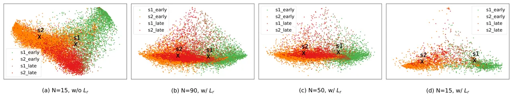
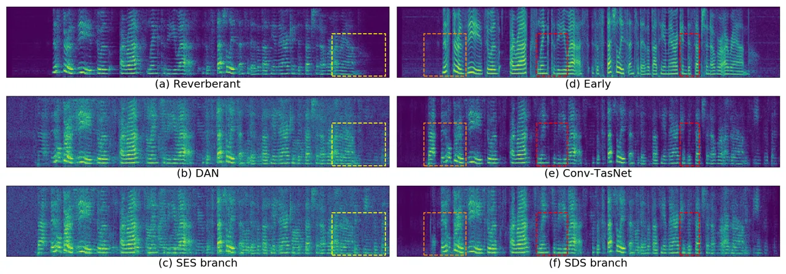

\[style=chinese, orcid=0000-0002-4085-4364\]

\[style=chinese\]

# Exploring the time-domain deep attractor network with two-stream architectures in a reverberant environment

Hangting Chen chenhangting@hccl.ioa.ac.cn    Pengyuan Zhang
zhangpengyuan@hccl.ioa.ac.cn Address: Key Laboratory of Speech Acoustics
& Content Understanding, Institute of Acoustics, CAS, China
Address: University of Chinese Academy of Sciences, Beijing, China

###### Abstract

Deep attractor networks (DANs) perform speech separation with
discriminative embeddings and speaker attractors. Compared with methods
based on the permutation invariant training (PIT), DANs define a deep
embedding space and deliver a more elaborate representation on each
time-frequency (T-F) bin. However, it has been observed that the DANs
achieve limited improvement on the signal quality if directly deployed
in a reverberant environment. Following the success of time-domain
separation networks on the clean mixture speech, we propose a
time-domain DAN (TD-DAN) with two-streams of convolutional networks,
which efficiently perform both dereverberation and separation tasks
under the condition of a variable number of speakers. The speaker
encoding stream (SES) of the TD-DAN is trained to model the speaker
information in the embedding space. The speech decoding stream (SDS)
accepts speaker attractors from the SES and learns to estimate early
reflections from the spectro-temporal representations. Meanwhile,
additional clustering losses are used to bridge the gap between the
oracle and the estimated attractors. Experiments were conducted on the
Spatialized Multi-Speaker Wall Street Journal (SMS-WSJ) dataset. The
early reflection was compared with the anechoic and reverberant signals
and then was chosen as the learning targets. The experimental results
demonstrated that the TD-DAN achieved scale-invariant
source-to-distortion ratio (SI-SDR) gains of $`9.79/7.47`$ dB on the
reverberant $`2/3`$-speaker evaluation set, exceeding the baseline DAN
and convolutional time-domain audio separation network (Conv-TasNet) by
$`1.92/0.68`$ dB and $`0.91/0.47`$ dB, respectively.

###### keywords

Speech separation ,Dereverberation ,Deep attractor network ,Time-domain
network

^(†)^(†)corresponding: Corresponding author

## 1 Introduction

Speech signals captured by distant microphones often present with
reverberation, noise and multiple speakers, rendering low speech
intelligibility for human listeners. In such situations, obtaining the
single-speaker close-talk signal requires the ability to perform
dereverberation and source separation, with noise being viewed as a
particular source.

Despite the great success of speech separation on clean close-talk
utterances, blind source separation remains challenging in a reverberant
environment. Some researchers have designed more sophisticated network
architectures by directly mapping the reverberant signals to anechoic
signals (Nachmani et al. (2020)Shi et al. (2020)). Some studies have
performed dereverberation and separation with tandem systems, each part
of which is designed for a single task. The framework in (Nakatani
et al. (2020)) integrates deep learning-based speech separation,
statistical model-based dereverberation and beamforming. Another study
(Maciejewski et al. (2019)) cascades networks to learn different targets
and outperforms the spectral mapping from the reverberant mixture to the
anechoic signal. Fan et al. (2020) proposed deep embedding methods to
capture the difference between the anechoic and the residual reverberant
signals, which inspired us to train discriminative embeddings for both
speaker separation and dereverberation under a unified architecture.

More recently, the time-domain audio separation network (TasNet) has
provided a novel separation scheme that works on time-domain
representations with a time-domain convolutional encoder and decoder
(Luo & Mesgarani (2018)). The subsequent Conv-TasNet (Luo & Mesgarani
(2019)) and other works (Shi et al. (2019); Bahmaninezhad et al. (2019))
have demonstrated significant separation performance that even exceeds
that of the ideal time-frequency (T-F) masks. The classic Conv-TasNet
uses permutation invariant training (PIT) to generate enhanced signals
from different speakers. On the other hand, the deep attractor network
(DAN) (Luo et al. (2018)) presents another paradigm, which calculates
the masks with deep embedding features. Compared with PIT-based methods,
the output of DAN forms a deep embedding space and delivers a more
elaborate representation on each T-F bin. However, the original DAN is
trained in the T-F domain under clean mixture signals, which limits its
performance and application under reverberant environments.

In this study, we propose a novel time-domain DAN (TD-DAN) to
simultaneously perform dereverberation and separation tasks. The
designed architecture consists of $`2`$ parallel streams, a speaker
encoding stream (SES) for speaker embedding modelling and a speech
decoding stream (SDS) for speech separation and dereverberation. The SES
is trained with a reconstruction loss and clustering losses, resulting
in speaker embeddings that are discriminative and suitable for
clustering. Moreover, the SDS serves as an inference module that first
models the deep embeddings on the spectro-temporal representations and
then interacts with the SES to generate enhanced signals. The proposed
scheme makes the following contributions:

- •
  Different learning targets are compared using the clean signal as the
  reference. We have demonstrated that the early reflection is a
  favorable choice for models to learn the mapping from reverberant
  mixtures to dereverberated single-speaker signals.
- •
  The DAN is extended to the time domain with a two-stream architecture,
  which generates the embeddings defined on the spectro-temporal
  representations and performs dereverberation and separation
  simultaneously. On the 2/3-speaker evaluation (Eval.) set, the TD-DAN
  achieved scale-invariant source-to-distortion ratios (SI-SDRs)
  exceeding the DAN and Conv-TasNet by $`1.92/0.68`$ dB and
  $`0.91/0.47`$ dB, respectively.
- •
  Clustering losses are employed to bridge the gap between the oracle
  attractor and K-means clustering under the reverberant environment.

The rest of the paper is organized as follows. In Section 2, we briefly
introduce the techniques related to the proposed method. In Section 3,
we describe the proposed TD-DAN and the auxiliary clustering loss.
Section 4 presents and discusses the experimental results of the
proposed methods. Section 5 concludes this work.

## 2 Related work

Previous work on far-field speech separation focused on the following
$`3`$ issues: dereverberation, speech separation and unified frameworks.

Dereverberation: Many algorithms have been proposed, such as beamforming
(Schwartz et al. (2016); Kodrasi & Doclo (2017); Nakatani & Kinoshita
(2019a)) and blind inverse filtering (Schmid et al. (2012); Yoshioka &
Nakatani (2012)), to address the dereverberation problem. The weighted
prediction error (WPE) was developed under the paradigm of blind inverse
filtering, which rose to prominence in the REverberant Voice Enhancement
and Recognition Benchmark (REVERB) challenge (Kinoshita et al. (2016)).
It aims to minimize the prediction error by optimizing the delayed
linear filters to eliminate the detrimental late reverberation (Nakatani
et al. (2010)). Deep neural networks (DNNs) have been used to learn the
spectral mapping from reverberant signals to anechoic signals (Geetha &
AYATHRI (2017)). In practice, mask estimation is preferred for its
superior performance compared with the spectral mapping (Wang et al.
(2014)). Moreover, complex ideal ratio masks (cIRMs) are proposed to
overcome the drawback that real-valued masks cannot reconstruct the
phase information of the target signal (Williamson & Wang (2017)). Some
researchers attempt to combine DNNs with WPE by deep learning-based
energy variance estimation, leading to a non-iterative WPE algorithm
(Heymann et al. (2019)).

Paradigms of speech separation: Most architectures adopt $`2`$
paradigms, PIT and embedding clustering-based methods. PIT (Kolbaek
et al. (2017)) directly optimizes the reconstruction loss with possible
permutations. PIT can deal with the condition of variable speakers by
iterative separation (Takahashi et al. (2019)), model selection
(Nachmani et al. (2020)) or assuming a maximum number of sources (Luo &
Mesgarani (2020)). Speaker clustering methods such as deep clustering
(DC) (Hershey et al. (2016); qiu Wang et al. (2018)) are trained to
generate discriminative deep embeddings on each T-F bin, and use
clustering algorithms to obtain speaker assignment during the test
phase. The DAN is developed following DC, but it directly optimizes the
reconstruction of the spectrogram (Luo et al. (2018)). DC and DANs can
deal with a variable number of speakers by setting the cluster number.

Learning objects of speech separation: Most previous approaches have
been formulated by predicting T-F masks of the mixture signal. Commonly
used masks are ideal binary masks (IBMs), ideal ratio masks (IRMs) and
Wiener filter-like masks (WFMs) (Wang et al. (2014)). Some approaches
directly predict the spectrogram of each source (Du et al. (2016)). Both
mask estimation and spectrum prediction use the inverse short-time
Fourier transform (iSTFT) of the estimated magnitude spectrogram of each
source together with the original or the modified phase. Recently,
TasNet have introduced a novel method of separating signals from the raw
waveform. It utilizes $`1`$-D convolutional filters to encode the raw
waveform and decode the generated spectro-temporal representations. A
speech separation module accepts the representation and predicts source
masks. Unlike the fixed weights of the short-time Fourier transform
(STFT), TasNet learns the transformation weight by optimizing SI-SDRs
between the estimated and target source signals.

Unified frameworks: Speech separation in a reverberant environment is a
difficult task by simultaneously addressing the dereverberation and
separation problems. Some systems adopt algorithms in tandem, for
example, the framework in (Nakatani et al. (2020)) combines weighted
power minimization distortion-less response (WPD) (Nakatani & Kinoshita
(2019b)), noisy complex Gaussian mixture Model (noisyCGMM) (Ito et al.
(2018)), and convolutional neural network (CNN)-based PIT. A purely deep
learning-based network is introduced for denoising and dereverberation
by learning the noise-free deep embeddings firstly and then performing
mask-based dereverberation (Fan et al. (2020)). The Conv-TasNet achieved
a low SI-SDR to perform both the dereverberation and separation tasks,
compared with its performance on the clean WSJ0-2MIX dataset
(Maciejewski et al. (2019)). Some researchers have designed
sophisticated architectures and modules to improve the performance
(Nachmani et al. (2020)Shi et al. (2020)). Zeghidour & Grangier (2020)
proposes a clustering method to capture the long-term representation,
but the number of speakers is fixed and the separation is conducted by
feature-wise linear modulation (Perez et al. (2018)) instead of the
similarity between deep embeddings.

## 3 Methods

In this section, we first formulate the problem and introduce the
baseline DAN and Conv-TasNet. Following the design of the speaker
attractor and time convolutional network (TCN), 2 types of two-stream
TD-DANs are proposed, one with hybrid encoders and another with fully
time-domain waveform encoders. Additionally, clustering losses are
proposed to improve the performance of the attractors obtained by the
K-means clustering algorithm.

### 3.1 Problem formulation

Assume that speech signals from $`K`$ speakers are captured by a distant
microphone in a noisy reverberant environment. The captured signal is

```math
\displaystyle y=\sum_{k=1}^{K}y^{(k)}+n=\sum_{k=1}^{K}d^{(k)}+\sum_{k=1}^{K}r^{(k)}+n, \tag{1}
```

where $`n`$ is the noise and $`y^{(k)}`$ is the reverberant source
signal, which is decomposed as $`d^{(k)}`$ representing the direct sound
and early reflection and $`r^{(k)}`$ representing the late
reverberation. For simplicity, $`d^{(k)}`$ is referred to as the early
reflection in the rest of the paper. The STFT transforms the signal to
T-F representations, reformulating Eq.(1) as

```math
\displaystyle y_{t,f}=\sum_{k=1}^{K}y_{k,t,f}+n_{t,f}=\sum_{k=1}^{K}d_{k,t,f}+\sum_{k=1}^{K}r_{k,t,f}+n_{t,f}, \tag{2}
```

with $`T`$ frames, maximum frequency index $`F`$, frame index
$`t=1,...,T`$ and frequency index $`f=0,...,F`$. The early reflection
$`d_{k,t,f}`$ and the late part $`r_{k,t,f}`$ are generated by
convolution,

```math
\displaystyle d_{k,t,f}=\sum_{\tau=0}^{D-1}a_{k,\tau,f}s_{k,t-\tau,f}, \tag{3}
```

```math
\displaystyle r_{k,t,f}=\sum_{\tau=D}^{L_{a}-1}a_{k,\tau,f}s_{k,t-\tau,f}, \tag{4}
```

where $`a_{k,f}=[a_{k,0,f},a_{k,1,f},...,a_{k,L_{a}-1,f}]`$ is the
transfer function with late reverberation starting from frame $`D`$ and
ending at frame $`L_{a}`$ for frequency $`f`$, and $`s_{k,t,f}`$ is the
source signal for speaker $`k`$ on bin $`t,f`$. As indicated in (Bradley
et al. (2003)), the early reflections increase the speech
intelligibility scores for both impaired and non-impaired listeners.
Moreover, it is indicated in Section 5.1 that the early reflection is a
favorable learning target for networks to conduct the dereverberation
and separation tasks. Thus, in this study, dereverberation is to
eliminate the late part $`r_{k,t,f}`$.

The ideal masks are defined in the T-F domain. The IRM for speech
separation only is expressed as

```math
\displaystyle m^{\text{IRM(sepr)}}_{k,t,f}=\frac{|y_{k,t,f}|}{\sum_{k}|y_{k,t,f}|+|n_{t,f}|}, \tag{5}
```

where $`|\cdot|`$ is a modulus operation. In the reverberant
environment, the IRM for the dereverberated source $`k`$ is defined as

```math
\displaystyle m^{\text{IRM(sepr+derevb)}}_{k,t,f}=\frac{|d_{k,t,f}|}{|y_{t,f}-d_{k,t,f}|+|d_{k,t,f}|}, \tag{6}
```

where the interference signal is obtained by removing the early part of
source $`d_{k,t,f}`$, i.e., it includes both the late reverberation of
the target source and other interference signals. Similarly, WFM is
formulated as

```math
\displaystyle m^{\text{WFM(sepr)}}_{k,t,f}=\sqrt{\frac{|y_{k,t,f}|^{2}}{\sum_{k}|y_{k,t,f}|^{2}+|n_{t,f}|^{2}}}, \tag{7}
```

```math
\displaystyle m^{\text{WFM(sepr+derevb)}}_{k,t,f}=\sqrt{\frac{|d_{k,t,f}|^{2}}{|y_{t,f}-d_{k,t,f}|^{2}+|d_{k,t,f}|^{2}}}. \tag{8}
```

### 3.2 Baseline DAN and Conv-TasNet

Figure 1: The architecture of the DAN, where the attractor is obtained
by oracle assignment and K-means clustering in the training and testing
phases, respectively.

Our TD-DAN is inspired by the design of the deep embedding and TCN,
which is originally proposed in DAN (Luo et al. (2018)) and Conv-TasNet
(Luo & Mesgarani (2019)), respectively. We briefly introduce these 2
networks in this section.

#### 3.2.1 Deep attractor network

The attractor is a speaker embedding indicating speaker information. As
shown in Fig.1, the DAN accepts the log power spectrum (LPS) and
generates $`D`$-dimensional speaker embeddings $`\mathbf{a}_{t,f}`$,

```math
\displaystyle\{\mathbf{a}_{t,f}\}_{t,f}=\text{DAN}(\text{Enc}_{\text{DAN}}^{\text{LPS}}(y)), \tag{9}
```

where $`\{\cdot\}_{\{\cdot\}}`$ denotes the matrix form with subscripts
representing the axes and $`\text{Enc}_{\{\cdot\}}^{\text{LPS}}`$ is the
LPS feature extractor. During training, the attractor vector
$`\mathbf{a}_{k}`$ for speaker $`k`$ is obtained by averaging over the
T-F bins,

```math
\displaystyle\mathbf{a}_{k}=\frac{\sum_{t,f}m^{\text{IBM}}_{k,t,f}v_{t,f}\mathbf{a}_{t,f}}{\sum_{t,f}m^{\text{IBM}}_{k,t.f}v_{t,f}}, \tag{10}
```

where $`v_{t,f}\in\{0,1\}`$ denotes the absence/presence of speech
calculated by a threshold of power and $`m^{\text{IBM}}_{k,t,f}`$ is the
binary speaker assignment. Here, we use early reflections to calculate
$`m^{\text{IBM}}_{k,t,f}`$:

```math
\displaystyle m^{\text{IBM}}_{k,t,f}=\begin{cases}0,\text{if $|d_{k,t,f}|\leqslant\sum_{q\neq k}|d_{q,t,f}|$}\\
1,\text{if $|d_{k,t,f}|>\sum_{q\neq k}|d_{q,t,f}|$}\end{cases}, \tag{11}
```

where $`\mathbf{a}_{t,f}`$ is expected to indicate the source
information and can be used to perform both separation and
dereverberation. During the testing phase, the attractors are obtained
by K-means clustering with prior knowledge of the number of speakers,

```math
\displaystyle\{\mathbf{a}_{k}\}_{k}=\text{KMeans}(\{\mathbf{a}_{t,f}|\text{if }v_{t,f}=1\}). \tag{12}
```

The masks are estimated with Sigmoid activation,

```math
\displaystyle\hat{m}^{\text{MRM}}_{k,t,f}=\text{Sigmoid}(\mathbf{a}_{k}^{T}\mathbf{a}_{t,f}), \tag{13}
```

where $`\mathbf{a}_{k}\in\mathbb{R}^{D\times 1}`$ is the
$`D`$-dimensional attractor of speaker $`k`$. The DAN is trained by
minimizing the reconstruction loss for both separation and
dereverberation,

```math
\displaystyle L_{\text{r}}=\sum_{k,t,f}(y_{t,f}\hat{m}^{\text{MRM}}_{k,t,f}-d_{k,t,f})^{2}. \tag{14}
```

The optimization leads to an embedding pattern that the vectors from the
same speakers become more similar and those from different speakers
become more discriminative. However, due to
$`y_{t,f}\neq\sum_{k}d_{k,t,f}`$, Eq.(14) may lead to performance
degradation in clustering, which can be relieved by adding extra
clustering losses (Section 3.4).

Figure 2: The architecture of Conv-TasNet, where the separation module
generates masks $`\{\hat{m}_{k,t,f}\}_{k,t,f}`$ for a predefined number
of speakers.

#### 3.2.2 Conv-TasNet

Conv-TasNet is a fully convolutional time-domain audio separation
network, composed of a $`1`$-D convolutional encoder, a separation
module and a $`1`$-D convolutional decoder. Multiple sequential TCN
blocks with various dilation factors are stacked as the separation
module. The fully convolutional architectures result in a small-sized
model. As plotted in Fig.2, the encoder encodes the input mixture
signal,

```math
\displaystyle\{y_{t,f}\}_{t,f}=\text{Enc}^{\text{Free}}_{\text{TasNet}}(y), \tag{15}
```

where $`\text{Enc}^{\text{Free}}_{\{\cdot\}}`$ is a $`1`$-D time
convolutional kernel and $`y_{t,f}`$ is the spectro-temporal
representation. We use “Free” to indicate that the kernel parameters are
learnable. The TCN-based separation module is trained to predict masks,

```math
\displaystyle\{\hat{m}^{\text{TD}}_{k,t,f}\}_{k,t,f}=\text{TCN}(\{y_{t,f}\}_{t,f}), \tag{16}
```

where $`\hat{m}_{k,t,f}^{\text{TD}}`$ is the estimated mask defined on
the spectro-temporal representation. The decoder decodes the masked
spectro-temporal representation and generates the enhanced waveforms,

```math
\displaystyle\{\hat{d}_{k}\}_{k}=\text{Dec}^{\text{Free}}_{\text{TasNet}}(\{y_{t,f}\hat{m}^{\text{TD}}_{k,t,f}\}_{k,t,f}), \tag{17}
```

where $`\text{Dec}^{\text{Free}}_{\text{TasNet}}`$ is a $`1`$-D
time-domain kernel. Conv-TasNet uses utterance-level PIT (uPIT) to
optimize the SI-SDR (Kolbaek et al. (2017)).

### 3.3 Time-domain deep attractor network

The TD-DAN has a two-stream architecture composed of an SES for
embedding modelling and an SDS for dereverberation and speaker
extraction. We creatively separate the task into $`2`$ parts and jointly
train the $`2`$ streams with a multi-task loss. We first describe the
two-stream architecture together with the hybrid waveform encoders and
then step into the fully time-domain encoders.

#### 3.3.1 TD-DAN with hybrid encoders

Figure 3: The architecture of TD-DAN, which is composed of an SES and an
SDS. The waveform encoder of the SES can adopt frequency-domain LPS
transform, time-domain stacked STFT kernels or free kernels.

As plotted in Fig.3, the SES is similar to the DAN network, which
accepts the LPS with $`\text{Enc}_{\text{SES}}^{\text{LPS}}`$ and
calculates the masks with speaker embeddings and attractors. The whole
feed-forward procedure follows Eqs.(9)-(14).

The SDS models the input signal with a $`1`$-D convolutional encoder and
stacked TCNs,

```math
\displaystyle\{\mathbf{e}_{t,f}\}_{t,f}=\text{TCN}(\text{Enc}_{\text{SDS}}^{\text{Free}}(y)). \tag{18}
```

where $`\mathbf{e}_{t,f}\in\mathbb{R}^{E\times 1}`$ is the
$`E`$-dimensional high-level representation. The SDS accepts the
transformed attractor to calculate the masks and finally generates the
dereverberated and separated signal,

```math
\displaystyle\hat{m}_{k,t,f}^{\text{TD}}=\text{ReLU}((\mathbf{a}_{k})^{T}\mathbf{e}_{t,f}), \tag{19}
```

```math
\displaystyle\hat{d}_{k}=\text{Dec}_{\text{SDS}}^{\text{Free}}(\{\hat{m}_{k,t,f}^{TD}\mathbf{e}_{t,f}\}_{t,f}), \tag{20}
```

The model is trained to optimize a multi-task loss,

```math
\displaystyle L_{\text{TD-DAN}}=L_{\text{SI-SDR}}+\alpha_{r}L_{\text{r}}, \tag{21}
```

where $`L_{\text{SI-SDR}}`$ is calculated by comparing $`d_{k}`$ with
$`\hat{d}_{k}`$, $`\alpha_{r}`$ is the loss balance factor.

This TD-DAN is with hybrid encoders because the SES is encoded by the
STFT, while the SDS is encoded by a $`1`$-D convolutional encoder with
free kernels. Nevertheless, it is regarded as a time-domain DAN since it
is trained to predict waveforms directly.

#### 3.3.2 TD-DAN with fully time-domain encoders

Here, we replace the waveform encoder
$`\text{Enc}_{\text{SES}}^{\text{LPS}}`$ in the TD-DAN SES with
time-domain convolutional kernels. The problem is the definition of the
IBMs in the spectro-temporal representations, which are originally
computed based on the spectrogram (Eq.(11)). The time-domain SES encoder
$`\text{Enc}_{\text{SES}}^{\text{TD}}`$ encodes the mixture signal into
$`y_{t,f}`$, formulated as

```math
\displaystyle\{y_{t,f}\}_{t,f}=\text{Enc}_{\text{SES}}^{\text{TD}}(y). \tag{22}
```

By setting the magnitude of the signal as $`|y_{t,f}|`$, its IBM is
formulated similarly,

```math
\displaystyle m_{k,t,f}^{\text{IBM}}=\begin{cases}0,\text{if $|\text{Enc}_{\text{SES}}^{\text{TD}}(d_{k,t,f})|\leqslant\sum_{q\neq k}|\text{Enc}_{\text{SES}}^{\text{TD}}(d_{q,t,f})|$}\\
1,\text{if $|\text{Enc}_{\text{SES}}^{\text{TD}}(d_{k,t,f})|>\sum_{q\neq k}|\text{Enc}_{\text{SES}}^{\text{TD}}(d_{q,t,f})|$}\end{cases} \tag{23}
```

We introduce $`2`$ time-domain kernels, namely, the stacked time-domain
STFT kernel and the free kernel :

- 1.  The stacked STFT encoder $`\text{Enc}_{\text{SES}}^{\text{STFT}}`$:
      The STFT is split into real and the imaginary parts with a stacked
      convolutional kernel expressed as follows,

  ```math
  \displaystyle K^{cos}_{f}[n]=w[n]cos(2\pi nf/N), \tag{24}
  ```

  ```math
  \displaystyle K^{sin}_{f}[n]=w[n]sin(2\pi nf/N), \tag{25}
  ```

  ```math
  \displaystyle\mathbf{K^{STFT}}=[\mathbf{K}^{cos}_{0},...,\mathbf{K}^{cos}_{F-1},\mathbf{K}^{cos}_{F},\mathbf{K}^{sin}_{1},...,\mathbf{K}^{sin}_{F-1}], \tag{26}
  ```

  where $`F`$ usually equals $`N/2`$, columns of $`\mathbf{K^{STFT}}`$
  are $`1`$-D convolutional kernels, $`n`$ is the sample index in a
  convolutional kernel of size $`N`$, $`f=0,1,...,F`$ is the kernel
  index corresponding to the frequency of the STFT, and $`w`$ is the
  pre-designed analysis window. This kernel is different from STFT since
  it stacks real and imaginary part of the spectrum, which can be
  conducted with real-valued convolutional operations.

- 2.  The free convolutional encoder
      $`\text{Enc}_{\text{SES}}^{\text{Free}}`$: $`1`$-D convolutional
      kernel $`\mathbf{K^{Free}}`$ is trained together with the whole
      network.

The whole procedure with fully time-domain encoders follows Fig.3, where
the attractor is obtained by masks defined by
$`\text{Enc}_{\text{SES}}^{\text{TD}}`$ and is calculated by
Eqs.(10)-(14); the dereverberation and separation are conducted
following Eqs.(18)-(20). Speech presence $`v_{t,f}`$ is obtained by a
threshold of the magnitude of the spectro-temporal representations. The
network is trained to optimize the multi-task loss (Eq.(21)).

### 3.4 Auxiliary clustering loss

Figure 4: The histogram of the IRM calculated on the clean and
reverberant multi-speaker mixtures. The clean mixture is mixed with
early reflections, while the reverberant mixture is mixed with early and
late reflections. The IRM is calculated with Eq.(6).

The reconstruction loss (Eq.(14)) indicates that the mask will be near
$`1`$ if the T-F bin embeddings are close to the speaker attractor,
otherwise close to $`0`$. The sparsity assumption declares that the
observed signal contains at most one source on each T-F bin, which
ensures the clustering performance in the DAN since most embeddings are
optimized so that they are close to some attractor to achieve
binary-like masks. However, the reverberant signal may not follow the
sparsity assumption. The distribution of the IRM in the mixture signal
is plotted in Fig.4. Notably, approximately $`20\%`$ T-F bins have an
IRM value larger than $`0.95`$ in the mixture of early reflections,
while in the reverberant signal, the percentage declines significantly
to approximate $`6\%`$. The reason is that the IRM of early reflections
is the ratio of the target early part to the interference early parts,
while Eq.(6) is the ratio of the target early reflection to the target
late reverberation, the interference early and late reverberation. The
lack of high-value T-F masks causes difficulty in embedding clustering.

Figure 5: The diagram of the reconstruction loss and the clustering
loss. The arrows of the clustering losses represent the optimization
direction. The reconstruction loss with the mask constrains the
attractors and the T-F embeddings. The category plane determines the
dominated speaker on the embedding.

To achieve a better clustering performance, we introduce the clustering
loss, including the concentration loss and the discrimination loss. The
concentration loss is designed for all DAN-based models,

```math
\displaystyle L_{c}=\sum_{k,t,f}||\mathbf{a}_{k}-m^{\text{IBM}}_{k,t,f}v_{t,f}\mathbf{a}_{t,f}||_{2}^{2}. \tag{27}
```

Its gradient is

```math
\displaystyle\frac{\partial L_{c}}{\mathbf{a}_{t,f}}=\begin{cases}-2(1-\frac{1}{\sum_{t,f}m^{\text{IBM}}_{k,t,f}v_{t,f}})(\mathbf{a}_{k}-\mathbf{a}_{t,f}),\text{if $m^{\text{IBM}}_{k,t,f}v_{t,f}=1$}\\
0,\text{if $m^{\text{IBM}}_{k,t,f}v_{t,f}=0$}\end{cases} \tag{28}
```

which enforces embedding $`\mathbf{a}_{t,f}`$ to be close to the
attractor $`\mathbf{a}_{k}`$ when dominated by speaker $`k`$.

Another inter-class discrimination loss maximizes the distance among
different attractors,

```math
\displaystyle L_{d}=\text{max}(0,l_{d}^{2}-\sum_{k,q}^{k\neq q}||\mathbf{a}_{k}-\mathbf{a}_{q}||_{2}^{2}), \tag{29}
```

where the maximum distance $`l_{d}`$ is to avoid the network achieving a
large distance by generating attractors with large norms. In fact,
Eq.(14) includes the optimization of discrimination, whereby the
attractor distance will be enlarged if $`m^{\text{MRM}}_{t,f}`$ is close
to $`0`$. The discrimination loss here is designed for free
convolutional kernel $`\mathbf{K^{Free}}`$ in the SES where small
$`|\text{Enc}_{\text{SES}}^{\text{Free}}(y)|`$ may result in small
$`L_{r}`$ as well as the small inter-class distance. The training loss
is updated to,

```math
\displaystyle L_{\text{TD-DAN}}=L_{\text{SI-SDR}}+\alpha_{r}L_{\text{r}}+\alpha_{c}L_{\text{c}}+\alpha_{d}L_{\text{d}}, \tag{30}
```

where $`\alpha_{c}`$ and $`\alpha_{d}`$ are factors for the
concentration and the discrimination losses.

Fig.5 presents a diagram to illustrate different losses. The intra-class
concentration loss may conflict with Eq.(14) to some degree, i.e., the
loss pushes the embeddings concentrated around the attractors, which
results in large-valued estimated masks and may lead to a suboptimal
reconstruction loss, which was observed on DAN as described in Section
5.2. For TD-DAN, the concentration loss might make the output of
$`\mathbf{K^{Free}}`$ lose discrimination. But this problem will not
occur on the TD-DAN with fixed SES encoders. Due to the proposed
$`2`$-stream architecture, the clustering loss is applied on the SES
branch, while the time-domain signal reconstruction is conducted on the
SDS branch by using the attractors from the SES branch. The precision of
the attractor plays an important role on the quality of the estimated
signals. In practice, the joint optimization of the reconstruction and
the concentration loss leads to a narrowed performance gap between the
oracle and estimated attractors. The detailed experiments will be
presented in Section 5.3.2.

## 4 Experimental configuration

### 4.1 Dataset

The experiments were conducted on the Spatialized Multi-Speaker Wall
Street Journal (SMS-WSJ) (Drude et al. (2019)). The performance was
evaluated on the test sets of the datasets. We used K-means to obtain
the attractor and $`3`$ measurement methods, SI-SDR, SDR and WER, to
evaluate the performance. Without special annotation, the SI-SDR uses
the corresponding learning target as the reference signal (early
reflections), the SDR uses the clean signal as the reference signal, the
signal was estimated by attractors from K-means clustering algorithm.
The measurement methods are also discussed in detail in Section 5.1.

The SMS-WSJ dataset artificially spatialized and mixed utterances taken
from WSJ. The dataset was split into the training, validation and test
sets, which contained $`33561`$, $`982`$ and $`1332`$ utterances,
respectively. The room impulse response (RIR) was randomly sampled with
different room sizes, array centers, array rotation, and source
positions. The sound decay time (T60) was sampled uniformly from $`200`$
ms to $`500`$ ms. The simulated $`6`$-channel audios contained early
reflections ($`<50\text{ms}`$), late reverberation ($`>50\text{ms}`$),
and white noise. The start sample of the room impulse response (RIR) was
determined by finding the first sample which was larger than the maximum
divided by ten. The end of the early part of the RIR was set to be
$`50`$ ms after the start sample. The signal-to-interference ratio (SIR)
and signal-to-noise ratio (SNR) for mixtures were randomly drawn from
$`-5`$ dB to $`5`$ dB and from $`20`$ dB to $`30`$ dB, respectively.
Moreover, we simulated a $`3`$-speaker dataset as a more challenging
task, which used the same RIRs and utterance split as the SMS-WSJ
dataset. The official automatic speech recognition (ASR) system was used
to evaluate the word error rate (WER). In our experiments, we used only
the first channel of the multi-channel signal. As demonstrated in
Section 5.1, the networks were trained to map the reverberant
multi-speaker signal to early reflections.

### 4.2 Training settings

The experiments were conducted with Asteroid (Pariente et al. (2020)),
an audio source separation toolkit based on PyTorch (Paszke et al.
(2017)). We changed the DAN architecture from bi-directional long
short-term memory (BLSTM) to TCN blocks, which allowed for fair
comparison among different frameworks.

The two-stream TD-DAN was composed of the SES and the SDS, which adopted
the architecture corresponding to the baseline DAN and Conv-TasNet,
respectively. By following the hyper-parameter notations in (Luo &
Mesgarani (2019)), we list the architectures in Table 1, where all
models repeated TCN blocks $`4`$ times. The power threshold was set to
keep the top $`15\%`$ bins of the mixture spectrogram.

|                |          |             |                                 |
| -------------- | -------- | ----------- | ------------------------------- |
| Hyper-params.  | DAN      | Conv-TasNet | TD-DAN                          |
| $`B`$          | $`128`$  | $`128`$     | $`128`$                         |
| $`H`$          | $`512`$  | $`512`$     | $`512`$                         |
| $`P`$          | $`3`$    | $`3`$       | $`3`$                           |
| $`X`$          | $`4`$    | $`8`$       | $`8`$                           |
| $`R`$          | $`4`$    | $`4`$       | $`1\text{(SES)}+3\text{(SDS)}`$ |
| $`\mathbf{a}`$ | $`20`$   | $`-`$       | $`20`$                          |
| $`\mathbf{e}`$ | $`20`$   | $`-`$       | $`20`$                          |
| $`\alpha_{r}`$ | $`1.0`$  | $`-`$       | $`1.0`$                         |
| $`\alpha_{c}`$ | $`0.05`$ | $`-`$       | $`1.0`$                         |
| $`\alpha_{d}`$ | $`0.0`$  | $`-`$       | $`0.0`$                         |
| $`l_{d}`$      | $`-`$    | $`-`$       | $`\sqrt{5}`$                    |

Table 1: The model architectures with TCN hyper-parameter $`B/H/P/X/R`$,
the embedding dimension of $`\mathbf{a}_{t,f}/\mathbf{e}_{t,f}`$ in the
SES/SDS, and default loss factor $`\alpha_{r/c/d}`$.

We used the Adam optimizer (Kingma & Ba (2015)) with a learning rate
starting from $`10^{-3}`$ and then halved if the best validation model
was not found within $`3`$ epochs. The maximum number of epochs was set
to $`50`$. The TD-DANs were trained with $`4`$-second segments and a
batch size of $`16`$.

## 5 Results and discussion

In this section, we will explore and discuss the performance of TD-DANs.
Our goal is to improve the model’s separation and dereverberation
ability in a reverberant environment. The experiments will be presented
in the following $`4`$ parts. First, we think that a reasonable learning
target can ease the learning difficulty. Thus, choosing early
reflections as learning targets was demonstrated by comparing different
signals on the SMS-WSJ dataset. Second, DANs showed different
characteristics when deployed under the reverberant environment. Thus,
the model settings were adjusted in terms of the losses and power
thresholds. Third, the TD-DAN model was explored by extending the DAN
from the T-F domain to the time domain where the SES encoder and the
clustering loss were studied in detail. Fourth, the TD-DAN was tested
under the condition of a variable number of speakers and was compared
with PIT-based multi-speaker separation paradigms.

### 5.1 Learning target comparison

The SMS-WSJ dataset provided the original clean signal, early
reflections and reverberant signals for each mixture utterance. We
simulated the anechoic signal additionally. These signals were chosen as
the learning targets to demonstrate their difference. It was believed
that the learning target should be close to the original clean signal
and easy to be learned for the deep learning-based model. Thus, the
comparison was conducted in $`2`$ aspects, signal measurement against
the clean signal and training difficulty under the baseline Conv-TasNet.

|                 |             |                    |                   |                   |                   |
| --------------- | ----------- | ------------------ | ----------------- | ----------------- | ----------------- |
| Learning target | SI-SDR (dB) | SDR (dB)           | PESQ              | STOI              | WER (%)           |
| Anechoic        | $`-15.04`$  | $`49.15`$          | $`\mathbf{4.53}`$ | $`\mathbf{1.00}`$ | $`\mathbf{6.38}`$ |
| Early           | $`-18.31`$  | $`\mathbf{49.46}`$ | $`2.35`$          | $`0.86`$          | $`7.04`$          |
| Reverberation   | $`-18.74`$  | $`14.86`$          | $`2.0`$           | $`0.83`$          | $`8.17`$          |

Table 2: Comparison of different learning targets in terms of SI-SDR,
SDR, PESQ and STOI measurements, where the clean signal was used as the
reference. The WER was measured with the official ASR baseline.

Table 2 compares different learning targets with the original clean
signal. Following messages were obtained:

- •
  SI-SDRs were low for all learning targets due to the convolution of
  the clean signal and the RIRs,

  ```math
  \displaystyle s_{\text{reverberant/early/anechoic}}=s_{\text{clean}}*\text{rir}, \tag{31}
  ```

  where the convolution operator $`*`$ shifted and rescaled the signal,
  while the SI-SDR is sensitive to the shift.

- •
  Source-to-distortion ratio (SDR, Vincent et al. (2006)) allows the
  target signal located in a subspace spanned by the delayed version of
  clean signals. The filter length here was set to $`512`$ ($`64`$ ms
  with sample rate $`8000`$ Hz). The anechoic signals and early
  reflections could perfectly match the projected clean signal in the
  subspace. The reverberant signal, however, had a lower SDR since its
  RIR filter was longer than $`200`$ ms.
- •
  The perceptual evaluation of subjective quality (PESQ, Rix et al.
  (2001)) and the short-time objective intelligibility (STOI, Taal
  et al. (2011)) were calculated based on the power spectrum. On the one
  hand, the RIR length of the anechoic signal was short. The convolution
  operator mainly changed the phase in each frame. The power spectra of
  the anechoic and clean signals were nearly the same, resulting in the
  highest scores. On the other hand, late reverberation caused “spectral
  smearing” (Maciejewski et al. (2019)), resulting in the lowest scores.
- •
  WER is another objective measurement. Our acoustic model was trained
  using reverberant single-speaker signals following the baseline of
  SMS-WSJ. We found that the anechoic signal achieved the best
  performance, $`0.66\%`$ and $`1.79\%`$ lower than early and
  reverberant signals, respectively.

In conclusion, the early reflections could achieve a similar SDR and a
slightly higher WER than the anechoic signal. The SI-SDR, PESQ and STOI
were sensitive to distortions caused by the time-invariant filters.
However, the deep learning-based model needed a loss function to learn
the signal mapping. The SI-SDR was easy to implement. It represented the
similarity between the estimated signal and the training target. Thus,
we chose $`3`$ measurement methods: SI-SDR, SDR and WER. In the rest of
the paper, without special annotations, the SI-SDR uses the
corresponding learning target as the reference signal, the SDR uses the
clean signal as the reference signal. In most experiments, we tested
only the SI-SDRs to evaluate the performance of the models quickly.

|                 |                   |                   |                    |
| --------------- | ----------------- | ----------------- | ------------------ |
| Learning target | SI-SDR (dB)       | SDR (dB)          | WER (%)            |
| Anechoic        | $`5.25`$          | $`7.36`$          | $`45.09`$          |
| Early           | $`8.04`$          | $`\mathbf{9.39}`$ | $`\mathbf{36.01}`$ |
| Reverberant     | $`\mathbf{9.28}`$ | $`8.39`$          | $`37.38`$          |

Table 3: The performance of Conv-TasNet by using different learning
targets. The “SI-SDR” was calculated by comparing the estimated signal
with the learning targets. The “SDR” was calculated by comparing the
estimated signal with the clean signal.

Table 3 indicates that learning the mask from the reverberant signal to
the early reflection was a preferred choice. The early reflection made
the estimated signals have high signal quality (SDR: $`9.39`$ dB) and
relatively low ASR error (WER: $`36.01\%`$). Since the acoustic model
(AM) was trained on the reverberant signals, the high WER indicated that
time-domain mapping introduced much distortion, which was unseen for the
AM. Early reflections were chosen as the learning target for models to
perform both separation and dereverberation tasks.

### 5.2 Exploring DANs in a reverberant environment

|                     |          |             |                   |                   |
| ------------------- | -------- | ----------- | ----------------- | ----------------- |
| Model               | Hop size | Top $`N\%`$ | SI-SDR (dB)       |                   |
|                     | (ms)     | bins        | K-means           | Oracle            |
| Conv-TasNet         | \-       | \-          | $`6.58`$          |                   |
| DAN (w/o $`L_{c}`$) | $`16`$   | $`50`$      | $`6.51`$          | $`6.96`$          |
| DAN (w/ $`L_{c}`$)  | $`16`$   | $`50`$      | $`6.77`$          | $`6.77`$          |
| DAN (w/ $`L_{c}`$)  | $`32`$   | $`50`$      | $`6.92`$          | $`6.97`$          |
| DAN (w/ $`L_{c}`$)  | $`64`$   | $`50`$      | $`6.22`$          | $`6.23`$          |
| DAN (w/ $`L_{c}`$)  | $`8`$    | $`50`$      | $`6.03`$          | $`6.05`$          |
| DAN (w/ $`L_{c}`$)  | $`32`$   | $`15`$      | $`\mathbf{6.95}`$ | $`\mathbf{6.98}`$ |
| DAN (w/ $`L_{c}`$)  | $`32`$   | $`90`$      | $`6.76`$          | $`6.97`$          |

Table 4: Experiments on DAN models with various hop size (ms) and power
percentages (top $`N\%`$ T-F bins). The hop size was set as the half of
the window size. The performance of the oracle attractor (Oracle) is
also listed. All models employed $`R(4)\times X(4)\times H(512)`$ TCN
blocks.

The DAN was evaluated to perform both separation and dereverberation
tasks (Table 4). The performance of the DAN surpassed that of the
Conv-TasNet in a small-size model setting ($`X=4`$ here instead of
$`X=8`$). Adding the concentration loss narrowed the performance gap
between K-means clustering and oracle attractor. However, as we have
stated in Section 3.4, the concentration loss resulted in a suboptimal
model with a lower signal measurement under oracle attractors (w/o
$`L_{c}`$: $`6.96`$ dB vs w/ $`L_{c}`$: $`6.77`$ dB).



Figure 6: Visualization of embedding features from DAN models with
different power thresholds (top N% T-F bins) and $`L_{c}=0.0/1.0`$.

The window settings and power percentage were tuned to be a hop size of
$`32`$ ms and the top $`15\%`$ T-F bins. The embedding features are
visualized in Fig.6. According to Figs.6(a)-(b), the concentration loss
concentrated the embeddings into a more compact pattern, resulting in
higher SI-SDRs for the attractors calculated by K-means clustering.
Since the late reverberation usually exhibited lower energy than the
early reflections, lowering the power thresholds excluded the embeddings
generated by late reverberation (Figs.6(b)-(d)). A more accurate
attractor was obtained by aggregating more embeddings from the T-F bins
dominated by early reflections.

### 5.3 Exploring TD-DANs in a reverberant environment

#### 5.3.1 Extending DAN to TD-DAN

[TABLE]

Table 5: Experiments on TD-DAN models under different hop sizes, SES
encoders and architectures. The hop size of the SES was set to the half
of the window size. The default architecture settings for models were
$`R(4)\times X(8)\times H(512)`$ TCN blocks. The DANs/TD-DANs were
trained with a combination of the losses
($`\alpha_{r}/\alpha_{c}/\alpha_{d}=1.0/1.0/0.0`$ for the LPS and STFT
encoders, $`\alpha_{r}/\alpha_{c}/\alpha_{d}=1.0/1.0/1.0`$ for the free
encoders). The SES and SDS had $`1`$ and $`3`$ TCN blocks, respectively.
TD-DAN ($`1`$-stream) merged the SES and SDS module into $`1`$ stream,
whose input and output are the concatenated features of the ones of the
SES and the SDS.

The $`1`$st part of Table 5 displays the results of our baseline models,
Conv-TasNet and DAN. The Conv-TasNet achieved an SI-SDR of $`8.04`$ dB,
$`1.21`$ dB better than that of the DAN on the Eval. set. Compared with
Table 4, the performance of Conv-TasNet was vastly improved after
increasing the convolutional layer number ($`X=8`$). The reason might be
that the deep model benefit the time-domain modelling and had a larger
reception field, which helped the model to conduct dereverberation and
separation tasks. The DAN model did not exhibit performance improvement
due to its large window size and the T-F domain representation.

The TD-DAN was designed following the architectures of DAN and TasNet.
As listed in the $`2`$nd part of Table 5, the TD-DAN gave an SI-SDR of
$`7.97`$ dB with the LPS encoder combined with the SDS, slightly lower
than the SI-SDRs of Conv-TasNet. Since the deep embeddings from the SDS
branch were from the time domain with a small hop size, the model could
achieve better performance by eliminating the mismatch between the
attractors and the time-domain embeddings. The TD-DAN could achieve an
SI-SDR of $`8.53`$ dB by setting the hop size to $`2`$ ms and using STFT
encoders. Predefined SES encoders were a preferred choice in the task as
the free encoder achieved an SI-SDR of only $`8.08`$ dB.

As listed in the $`3`$rd part of Table 5, the TD-DAN was compared with
the $`1`$-stream model. The $`1`$-stream TD-DAN accepted the
concatenated features from the SES and SDS encoders and then processed
the representation with the $`1`$-stream TCN model. The generated deep
embeddings were split into SES and SDS parts. The SI-SDR of the
$`1`$-stream model was $`0.47`$ dB lower than that of the best TD-DAN,
implying the effectiveness of using $`2`$ separate modules for different
embeddings.

Fig.7 plots the enhanced STFT spectra estimated by different models. The
DAN and the SES branch could perform dereverberation tasks
(Figs.7(a)-(c)). However, the spectrum reconstruction exhibited lower
signal quality than the early reflections and the one from the
time-domain Conv-TasNet. The TD-DAN achieved better performance by
removing more interference signals and preserving the target speech
(Figs.7(d)-(f)).



Figure 7: Enhanced spectra with different models under the 2-speaker
condition. The enhanced spectra from (b) DAN model and (c) SES branch in
TD-DAN exhibited low signal quality but they performed both the
dereverberation and separation tasks (yellow boxes). Compared with (e)
Conv-TasNet, (f) SDS branch in TD-DAN achieved a better performance in
removing interference signals (orange boxes) and preserving the target
signals (red boxes).

#### 5.3.2 Analysis of the clustering loss

|           |           |           |                   |                   |                   |                   |
| --------- | --------- | --------- | ----------------- | ----------------- | ----------------- | ----------------- |
| $`L_{r}`$ | $`L_{c}`$ | $`L_{d}`$ | STFT              |                   | Free              |                   |
|           |           |           | K-means           | Oracle            | K-means           | Oracle            |
| ✓         | ✗         | ✗         | $`8.47`$          | $`\mathbf{8.95}`$ | $`6.86`$          | $`\mathbf{8.47}`$ |
| ✓         | ✓         | ✗         | $`\mathbf{8.69}`$ | $`8.94`$          | $`7.30`$          | $`8.23`$          |
| ✗         | ✓         | ✓         | $`7.74`$          | $`8.14`$          | $`7.93`$          | $`8.30`$          |
| ✓         | ✓         | ✓         | $`7.86`$          | $`8.21`$          | $`\mathbf{8.08}`$ | $`8.42`$          |

Table 6: The SI-SDR (dB) results of TD-DAN models with STFT/free SES
encoders.

An ablation study was conducted to validate the effectiveness of the
clustering loss with the stacked STFT and free SES encoders (Table 6).
For STFT encoders, the concentration loss helped the embedding much more
concentrated, resulting in a smaller gap of the oracle attractors and
the ones from K-means (Oracle: $`0.48`$ dB vs K-means: $`0.25`$ dB). The
concentration loss made a little effect on the performance under the
oracle attractors since the SDS branch only needed the estimated
attractors. We observed a performance degradation by replacing the
reconstruction loss with the discrimination loss ($`L_{c}+L_{r}`$:
$`8.69`$ dB vs $`L_{c}+L_{d}`$: $`7.74`$ dB). The reconstruction loss
here played the role of enlarging the inter-class distance implicitly by
constraining the estimated masks. Yet the discrimination loss delivered
a more straightforward way. It was thought that the reconstruction loss
was preferred since it offered more detailed distance information with
the reconstructed masks. The discrimination loss was unnecessary here as
the reconstruction loss already provided considerable inter-class
distance in our observation. Applying all the $`3`$ losses led to
performance degradation since the discrimination loss might change the
optimal pattern of the embeddings with the fixed STFT encoders.

For free encoders, the concentration helped the clustering process.
Meanwhile, it made the SES encoder generate representations less
discriminative, which might explain performance degradation on the
oracle attractors ($`L_{r}`$: $`8.47`$ dB vs $`L_{c}+L_{r}`$: $`8.23`$
dB). This phenomenon was not observed on the STFT encoder because the
STFT weights were fixed and covered the whole frequencies. The
discrimination loss delivered a narrow gap of the SI-SDRs between the
oracle attractor and K-means. The reason was that the reconstruction
loss could be lowered by generating small-valued spectro-temporal
representations, as indicated in Eq.(14). The discrimination loss and
the concentration loss explicitly optimized the inter- and intra-class
distance, forcing the network to generate embeddings easy to perform
clustering. Combining all the $`3`$ losses offered a slight performance
improvement, where both the clustering loss and the reconstruction loss
assisted the free encoders in forming the pattern of the deep
embeddings.

### 5.4 Exploring TD-DANs with a variable number of speakers

|             |              |                    |                    |                   |                    |                    |                    |                   |                   |                    |
| ----------- | ------------ | ------------------ | ------------------ | ----------------- | ------------------ | ------------------ | ------------------ | ----------------- | ----------------- | ------------------ |
| Model       | Training set | 1 speaker          |                    |                   | 2 speakers         |                    |                    | 3 speakers        |                   |                    |
|             | Speaker \#   | SI-SDR(dB)         | SDR(dB)            | WER(%)            | SI-SDR(dB)         | SDR(dB)            | WER(%)             | SI-SDR(dB)        | SDR(dB)           | WER(%)             |
| DAN         | 2            | $`12.75`$          | $`15.43`$          | $`11.06`$         | $`6.95`$           | $`8.42`$           | $`47.08`$          | $`-0.50`$         | $`0.05`$          | $`80.87`$          |
| DAN         | 1+2+3        | $`12.93`$          | $`15.68`$          | $`10.62`$         | $`7.03`$           | $`8.24`$           | $`48.18`$          | $`3.02`$          | $`3.86`$          | $`76.94`$          |
| TD-DAN      | 2            | $`14.25`$          | $`16.74`$          | $`11.38`$         | $`8.69`$           | $`9.90`$           | $`35.57`$          | $`0.20`$          | $`0.83`$          | $`77.56`$          |
| TD-DAN      | 1+2+3        | $`\mathbf{14.64}`$ | $`\mathbf{17.08}`$ | $`\mathbf{9.00}`$ | $`\mathbf{8.95}`$  | $`\mathbf{10.22}`$ | $`\mathbf{33.03}`$ | $`\mathbf{3.70}`$ | $`\mathbf{4.82}`$ | $`\mathbf{66.04}`$ |
| Conv-TasNet | 1/2/3        | $`\mathbf{14.53}`$ | $`\mathbf{16.89}`$ | $`9.38`$          | $`\mathbf{8.04}`$  | $`9.31`$           | $`\mathbf{36.01}`$ | $`\mathbf{3.23}`$ | $`\mathbf{4.29}`$ | $`70.96`$          |
| A2PIT       | 1+2+3        | $`13.89`$          | $`16.52`$          | $`\mathbf{9.14}`$ | $`8.01`$           | $`\mathbf{9.33}`$  | $`36.30`$          | $`2.36`$          | $`3.34`$          | $`76.05`$          |
| ORPIT       | 1+2+3        | $`13.64`$          | $`16.27`$          | $`9.20`$          | $`9.20`$           | $`9.10`$           | $`37.95`$          | $`2.91`$          | $`4.26`$          | $`\mathbf{67.73}`$ |
| Mixture     | \-           | $`11.75`$          | $`14.52`$          | $`8.90`$          | $`-0.84`$          | $`-0.41`$          | $`78.36`$          | $`-3.77`$         | $`-3.37`$         | $`91.46`$          |
| IRM(Eq.(5)) | \-           | \-                 | \-                 | \-                | $`8.61`$           | $`10.25`$          | $`8.63`$           | $`7.20`$          | $`8.62`$          | $`9.21`$           |
| IRM(Eq.(6)) | \-           | $`\mathbf{15.30}`$ | $`17.72`$          | $`7.77`$          | $`\mathbf{10.53}`$ | $`\mathbf{11.69}`$ | $`\mathbf{7.52}`$  | $`\mathbf{8.69}`$ | $`\mathbf{9.69}`$ | $`7.90`$           |
| WFM(Eq.(7)) | \-           | \-                 | \-                 | \-                | $`8.37`$           | $`9.84`$           | $`8.70`$           | $`6.94`$          | $`8.17`$          | $`9.16`$           |
| WFM(Eq.(8)) | \-           | $`15.19`$          | $`\mathbf{18.02}`$ | $`\mathbf{7.74}`$ | $`10.27`$          | $`11.37`$          | $`7.74`$           | $`8.44`$          | $`9.32`$          | $`\mathbf{7.79}`$  |

Table 7: Performance measurement of SI-SDR/SDR/WER under $`1`$-, $`2`$-
and $`3`$-speaker conditions. “1/2/3” means that we trained $`1`$-,
$`2`$- and $`3`$-speaker Conv-TasNet on the $`1`$-, $`2`$- and
$`3`$-speaker dataset individually.

The merit of the TD-DAN is that it can deal with mixture signals with
variable numbers of speakers. To validate this feature, we further
trained the DAN/TD-DAN on $`2`$ and $`3`$-speaker datasets. Besides,
approximate $`10\%`$ samples were chosen as the $`1`$-speaker condition,
i.e., the input and learning target were $`1`$-speaker reverberant
signals and early reflections, respectively. The experiment results are
listed in the $`1`$st part of Table 7. The DAN/TD-DAN only trained on
the $`2`$-speaker dataset could deal with $`1`$-speaker reverberant
signals and $`3`$-speaker mixture signal with SI-SDR gains of
$`1.00/2.50`$ dB and $`3.27/3.97`$ dB compared with the reverberant
input signals, respectively. After trained on the concatenated dataset,
the DAN/TD-DAN achieved higher SI-SDR gains of $`1.18/2.89`$ dB,
$`7.87/9.79`$ dB and $`6.79/7.47`$ dB on the $`1`$-, $`2`$- and
$`3`$-speaker datasets, respectively.

We compared the TD-DAN with PIT-based models under the condition of a
variable number of speakers, including individual Conv-TasNet trained on
the 1-/2-/3-speaker datasets, trained with auxiliary autoencoding
permutation invariant training (A2PIT, Luo & Mesgarani (2020)) and
trained with one-and-rest permutation invariant training (ORPIT,
Takahashi et al. (2019)). The output of the ORPIT was the single-speaker
early reflection and the mixture of the residual reverberant signals. It
needed $`K`$ iteration to estimate early reflections from $`K`$
speakers, while other models could output the estimated early
reflections in $`1`$ pass. In most cases, the individually trained
Conv-TasNet obtained the best performance. The ORPIT presented a large
gap between the SI-SDR and the SDR and a lower WER. The reason might be
that the signal shift might occur when the early reflection was obtained
based on the estimated reverberant mixture. The low WER indicated that
iterative separation could preserve more speech details than the
Conv-TasNet on the $`3`$-speaker condition.

It was observed that the TD-DAN could achieve the best performance,
surpassing Conv-TasNet/A2PIT/ORPIT by an SDR of $`0.47/1.34/0.79`$ dB on
the $`3`$-speaker dataset. All models exhibited speech distortion,
resulting in high WERs tested on the AM trained only on the reverberant
signals. The TD-DAN model achieved the lowest WERs by preserving more
speech cues on the spectrum, presented in Fig.7.

The performance of ideal masks is listed in the $`3`$rd part of Table 7.
The SI-SDR gap of $`4.99`$ dB between IRM (Eq.(6)) and the TD-DAN on the
$`3`$-speaker dataset indicates that performing multi-speaker separation
and dereverberation remains a challenging task.

## 6 Conclusion

In this paper, we explored a framework of TD-DANs for speech separation
tasks in a reverberant environment. We used different waveform encoders,
including the LPS encoder, the stacked STFT and free convolutional
kernels. The experimental results implied that the TD-DAN with the
stacked STFT encoder achieved the best performance, surpassing the
baseline Conv-TasNet and DAN model in terms of SI-SDR, SDR and WER on
the 1-, 2- and 3-speaker dataset. We anticipate further exploring the
TD-DAN architecture with the multi-channel information for better
dereverberation and separation in future work.

## Acknowledgment

This work is partially supported by the Strategic Priority Research
Program of Chinese Academy of Sciences (No. XDC08010300), the National
Natural Science Foundation of China (Nos. 11590772, 11590774, 11590770,
11774380).

## References

- Bahmaninezhad et al. (2019) Bahmaninezhad, F., Wu, J. Y., Gu, R.,
  Zhang, S.-X., Xu, Y., Yu, M., & Yu, D. (2019). A comprehensive study
  of speech separation: spectrogram vs waveform separation. In
  INTERSPEECH.
- Bradley et al. (2003) Bradley, J. S., Sato, H., & Picard, M. (2003).
  On the importance of early reflections for speech in rooms. The
  Journal of the Acoustical Society of America, 113 6, 3233–44.
- Drude et al. (2019) Drude, L., Heitkaemper, J., Böddeker, C., &
  Haeb-Umbach, R. (2019). Sms-wsj: Database, performance measures, and
  baseline recipe for multi-channel source separation and recognition.
  ArXiv, abs/1910.13934.
- Du et al. (2016) Du, J., Tu, Y., Dai, L.-R., & Lee, C.-H. (2016). A
  regression approach to single-channel speech separation via
  high-resolution deep neural networks. IEEE/ACM Transactions on Audio,
  Speech, and Language Processing, 24, 1424–1437.
- Fan et al. (2020) Fan, C., hua Tao, J., Liu, B., Yi, J., & Wen, Z.
  (2020). Simultaneous denoising and dereverberation using deep
  embedding features. ArXiv, abs/2004.02420.
- Geetha & AYATHRI (2017) Geetha, K., & AYATHRI (2017). Learning
  spectral mapping for speech dereverberation and denoising.
- Hershey et al. (2016) Hershey, J. R., Chen, Z., Roux, J. L., &
  Watanabe, S. (2016). Deep clustering: Discriminative embeddings for
  segmentation and separation. 2016 IEEE International Conference on
  Acoustics, Speech and Signal Processing (ICASSP), (pp. 31–35).
- Heymann et al. (2019) Heymann, J., Drude, L., Haeb-Umbach, R.,
  Kinoshita, K., & Nakatani, T. (2019). Joint optimization of neural
  network-based wpe dereverberation and acoustic model for robust online
  asr. ICASSP 2019 - 2019 IEEE International Conference on Acoustics,
  Speech and Signal Processing (ICASSP), (pp. 6655–6659).
- Ito et al. (2018) Ito, N., Schymura, C., Araki, S., & Nakatani, T.
  (2018). Noisy cgmm: Complex gaussian mixture model with non-sparse
  noise model for joint source separation and denoising. 2018 26th
  European Signal Processing Conference (EUSIPCO), (pp. 1662–1666).
- Kingma & Ba (2015) Kingma, D. P., & Ba, J. (2015). Adam: A method for
  stochastic optimization. CoRR, abs/1412.6980.
- Kinoshita et al. (2016) Kinoshita, K., Delcroix, M., Gannot, S.,
  Habets, E. A. P., Haeb-Umbach, R., Kellermann, W., Leutnant, V., Maas,
  R., Nakatani, T., Raj, B., Sehr, A., & Yoshioka, T. (2016). A summary
  of the reverb challenge: state-of-the-art and remaining challenges in
  reverberant speech processing research. EURASIP Journal on Advances in
  Signal Processing, 2016, 1–19.
- Kodrasi & Doclo (2017) Kodrasi, I., & Doclo, S. (2017). Evd-based
  multi-channel dereverberation of a moving speaker using different retf
  estimation methods. 2017 Hands-free Speech Communications and
  Microphone Arrays (HSCMA), (pp. 116–120).
- Kolbaek et al. (2017) Kolbaek, M., Yu, D., Tan, Z.-H., & Jensen, J.
  (2017). Multitalker speech separation with utterance-level permutation
  invariant training of deep recurrent neural networks. IEEE/ACM
  Transactions on Audio, Speech, and Language Processing, 25, 1901–1913.
- Luo et al. (2018) Luo, Y., Chen, Z., & Mesgarani, N. (2018).
  Speaker-independent speech separation with deep attractor network.
  IEEE/ACM Transactions on Audio, Speech, and Language Processing, 26,
  787–796.
- Luo & Mesgarani (2018) Luo, Y., & Mesgarani, N. (2018). Tasnet:
  Surpassing ideal time-frequency masking for speech separation.
- Luo & Mesgarani (2019) Luo, Y., & Mesgarani, N. (2019). Conv-tasnet:
  Surpassing ideal time-frequency magnitude masking for speech
  separation. IEEE/ACM Transactions on Audio, Speech, and Language
  Processing, 27, 1256–1266.
- Luo & Mesgarani (2020) Luo, Y., & Mesgarani, N. (2020). Separating
  varying numbers of sources with auxiliary autoencoding loss. In
  INTERSPEECH.
- Maciejewski et al. (2019) Maciejewski, M., Wichern, G., McQuinn, E., &
  Roux, J. L. (2019). Whamr!: Noisy and reverberant single-channel
  speech separation. ArXiv, abs/1910.10279.
- Nachmani et al. (2020) Nachmani, E., Adi, Y., & Wolf, L. (2020). Voice
  separation with an unknown number of multiple speakers. In ICML.
- Nakatani & Kinoshita (2019a) Nakatani, T., & Kinoshita, K. (2019a).
  Maximum likelihood convolutional beamformer for simultaneous denoising
  and dereverberation. 2019 27th European Signal Processing Conference
  (EUSIPCO), (pp. 1–5).
- Nakatani & Kinoshita (2019b) Nakatani, T., & Kinoshita, K. (2019b). A
  unified convolutional beamformer for simultaneous denoising and
  dereverberation. IEEE Signal Processing Letters, 26, 903–907.
- Nakatani et al. (2020) Nakatani, T., Takahashi, R., Ochiai, T.,
  Kinoshita, K., Ikeshita, R., Delcroix, M., & Araki, S. (2020).
  Dnn-supported mask-based convolutional beamforming for simultaneous
  denoising, dereverberation, and source separation. In ICASSP 2020.
- Nakatani et al. (2010) Nakatani, T., Yoshioka, T., Kinoshita, K.,
  Miyoshi, M., & Juang, B.-H. (2010). Speech dereverberation based on
  variance-normalized delayed linear prediction. IEEE Transactions on
  Audio, Speech, and Language Processing, 18, 1717–1731.
- Pariente et al. (2020) Pariente, M., Cornell, S., Cosentino, J.,
  Sivasankaran, S., Tzinis, E., Heitkaemper, J., Olvera, M., Stöter,
  F.-R., Hu, M., Martín-Doñas, J. M., Ditter, D., Frank, A., Deleforge,
  A., & Vincent, E. (2020). Asteroid: the PyTorch-based audio source
  separation toolkit for researchers. In Proc. Interspeech.
- Paszke et al. (2017) Paszke, A., Gross, S., Chintala, S., Chanan, G.,
  Yang, E., Devito, Z., Lin, Z., Desmaison, A., Antiga, L., & Lerer, A.
  (2017). Automatic differentiation in pytorch.
- Perez et al. (2018) Perez, E., Strub, F., Vries, H. D., Dumoulin, V.,
  & Courville, A. C. (2018). Film: Visual reasoning with a general
  conditioning layer. ArXiv, abs/1709.07871.
- Rix et al. (2001) Rix, A., Beerends, J., Hollier, M., & Hekstra, A. P.
  (2001). Perceptual evaluation of speech quality (pesq)-a new method
  for speech quality assessment of telephone networks and codecs. 2001
  IEEE International Conference on Acoustics, Speech, and Signal
  Processing. Proceedings (Cat. No.01CH37221), 2, 749–752 vol.2.
- Schmid et al. (2012) Schmid, D., Malik, S., & Enzner, G. (2012). An
  expectation-maximization algorithm for multichannel adaptive speech
  dereverberation in the frequency-domain. 2012 IEEE International
  Conference on Acoustics, Speech and Signal Processing (ICASSP), (pp.
  17–20).
- Schwartz et al. (2016) Schwartz, O., Gannot, S., & Habets, E. A. P.
  (2016). Joint maximum likelihood estimation of late reverberant and
  speech power spectral density in noisy environments. 2016 IEEE
  International Conference on Acoustics, Speech and Signal Processing
  (ICASSP), (pp. 151–155).
- Shi et al. (2019) Shi, Z., Lin, H., Liu, L., Liu, R., Hayakawa, S., &
  Han, J. (2019). Furcax: End-to-end monaural speech separation based on
  deep gated (de)convolutional neural networks with adversarial example
  training. ICASSP 2019 - 2019 IEEE International Conference on
  Acoustics, Speech and Signal Processing (ICASSP), (pp. 6985–6989).
- Shi et al. (2020) Shi, Z., Liu, R., & Han, J. (2020). Lafurca:
  Iterative refined speech separation based on context-aware dual-path
  parallel bi-lstm.
- Taal et al. (2011) Taal, C., Hendriks, R., Heusdens, R., & Jensen, J.
  (2011). An algorithm for intelligibility prediction of time–frequency
  weighted noisy speech. IEEE Transactions on Audio, Speech, and
  Language Processing, 19, 2125–2136.
- Takahashi et al. (2019) Takahashi, N., Parthasaarathy, S., Goswami,
  N., & Mitsufuji, Y. (2019). Recursive speech separation for unknown
  number of speakers. ArXiv, abs/1904.03065.
- Vincent et al. (2006) Vincent, E., Gribonval, R., & Févotte, C.
  (2006). Performance measurement in blind audio source separation. IEEE
  Transactions on Audio, Speech, and Language Processing, 14, 1462–1469.
- Wang et al. (2014) Wang, Y., Narayanan, A., & Wang, D. (2014). On
  training targets for supervised speech separation. IEEE/ACM
  Transactions on Audio, Speech, and Language Processing, 22, 1849–1858.
- qiu Wang et al. (2018) qiu Wang, Z., Roux, J. L., & Hershey, J. R.
  (2018). Alternative objective functions for deep clustering. 2018 IEEE
  International Conference on Acoustics, Speech and Signal Processing
  (ICASSP), (pp. 686–690).
- Williamson & Wang (2017) Williamson, D. S., & Wang, D. (2017).
  Time-frequency masking in the complex domain for speech
  dereverberation and denoising. IEEE/ACM Transactions on Audio, Speech,
  and Language Processing, 25, 1492–1501.
- Yoshioka & Nakatani (2012) Yoshioka, T., & Nakatani, T. (2012).
  Generalization of multi-channel linear prediction methods for blind
  mimo impulse response shortening. IEEE Transactions on Audio, Speech,
  and Language Processing, 20, 2707–2720.
- Zeghidour & Grangier (2020) Zeghidour, N., & Grangier, D. (2020).
  Wavesplit: End-to-end speech separation by speaker clustering. ArXiv,
  abs/2002.08933.
