# Resource-Efficient Speech Mask Estimation for Multi-Channel Speech Enhancement

Lukas Pfeifenberger    Matthias Zöhrer    Günther Schindler    Wolfgang
Roth    Holger Fröning    Franz Pernkopf ^(†)^(†)thanks:
L.˜Pfeifenberger, M.˜Zöhrer, W. Roth and F. Pernkopf are with the
Intelligent Systems Group at the Signal Processing and Speech
Communication Laboratory, Graz University of Technology, Graz, Austria.
^(†)^(†)thanks: G. Schindler and H. Fröning are with the Institute of
Computer Engineering, Ruperts Karls University, Heidelberg,
Germany.^(†)^(†)thanks: This work was supported by the Austrian Science
Fund (FWF) under the project number I2706-N31. We acknowledge Ognios
GmbH for supporting Lukas Pfeifenberger. Furthermore, we acknowledge
NVIDIA for providing GPU computing resources.

###### Abstract

While machine learning techniques are traditionally resource intensive,
we are currently witnessing an increased interest in hardware and energy
efficient approaches. This need for resource-efficient machine learning
is primarily driven by the demand for embedded systems and their usage
in ubiquitous computing and IoT applications. In this article, we
provide a resource-efficient approach for multi-channel speech
enhancement based on Deep Neural Networks (DNNs). In particular, we use
reduced-precision DNNs for estimating a speech mask from noisy,
multi-channel microphone observations. This speech mask is used to
obtain either the _Minimum Variance Distortionless Response_ (MVDR) or
_Generalized Eigenvalue_ (GEV) beamformer. In the extreme case of binary
weights and reduced precision activations, a significant reduction of
execution time and memory footprint is possible while still obtaining an
audio quality almost on par to single-precision DNNs and a slightly
larger _Word Error Rate_ (WER) for single speaker scenarios using the
WSJ0 speech corpus.

###### Index Terms: 

Resource-efficient machine learning, multi-channel speech enhancement,
speech mask estimation, binary neural networks

## I Introduction

Deep Neural Networks (DNNs), the workhorse of speech-based user
interaction systems, prove particularly effective when big amounts of
data and plenty of computing resources are available. However, in many
real-world applications the limited computing infrastructure, latency
and the power constraints during the operation phase effectively suspend
most of the current resource-hungry DNN approaches. Therefore, there are
several key challenges which have to be jointly considered to facilitate
the usage of DNNs when it comes to edge-computing implementations:

- •
  Efficient representation: The model complexity measured by the number
  of model parameters should match the limited resources of the
  computing hardware, in particular regarding memory footprint.
- •
  Computational efficiency: The model should be computationally
  efficient during inference, exploiting the available hardware
  optimally with respect to time and energy. Power constraints are key
  for embedded systems, as the device lifetime for a given battery
  charge needs to be maximized.
- •
  Prediction quality: The focus is usually on optimizing the prediction
  quality of the models. For embedded devices, model complexity versus
  prediction quality trade-offs must be considered to achieve good
  prediction performance while simultaneously reducing computational
  complexity and memory requirements.

DNN models use GPUs to enable efficient processing, where single
precision floating-point numbers are common for parameter representation
and arithmetic operations. To facilitate deep models in today’s consumer
electronics, the model usually has to be scaled down to be implemented
efficiently on embedded or low power systems. Most research emphasizes
one of the following two techniques: (i) reduce model size in terms of
number of weights and/or neurons \[1, 2, 3, 4, 5, 6\], or (ii) reduce
arithmetic precision of parameters and/or computational units \[7, 8, 9,
10\]. Evidently, these two basic techniques are almost “orthogonal
directions” towards efficiency in DNNs, and they can be naturally
combined, e.g. one can do both sparsify the model and reduce arithmetic
precision. Both strategies reduce the memory footprint accordingly and
are vital for the deployment of DNNs in many real-world applications.
This is especially important as reduced memory requirements are one of
the main contributing factors reducing the energy consumption \[2, 11,
12\]. Apart from that, model size reduction and sparsification
techniques such as weight pruning \[13, 1, 2\], weight sharing \[14\],
knowledge distillation \[15\] of special weight matrix structures \[16,
17, 18\] also impacts the computational demand measured in terms of
number of arithmetic operations. Unfortunately, this reduction usually
does not directly translate into savings of wall-clock time, as current
hardware and software are not well-designed to exploit model sparseness
\[19\]. Instead, reducing parameter precision proves quite effective for
improving execution time on CPUs \[20, 21\] and specialized hardware
such as FPGAs \[22\]. When the precision of the inference process is
driven to the extreme, i.e. assuming binary weights
$`\bm{W}\in\{-1,1\}`$ or ternary weights $`\bm{W}\in\{-1,0,1\}`$ in
conjunction with binary inputs and binary activation functions
$`\sigma(x)\in\{-1,1\}`$, floating or fixed point multiplications are
replaced by hardware-friendly logical XNOR and bitcount operations, i.e.
DNNs essentially reduce to a logical circuit. Training such
discrete-valued DNNs¹¹ 1 Due to finite precision, in fact any DNN is
discrete valued. However, we use this term here to highlight the
extremely low number of values. is delicate as they cannot be directly
optimized using gradient based methods. However, the obtained
computational savings on today’s computer architectures are of great
interest, especially when it comes to human-machine interaction (HMI)
systems where latency and energy efficiency plays an important role.

Due to steadily decreasing cost of consumer electronics, many
state-of-the-art HMI systems include _multi-channel speech enhancement_
(MCSE) as a pre-processing stage. In particular, beamformers (BF)
spatially separate background noise from the desired speech signal.
Common BF methods include the _Minimum Variance Distortionless Response_
(MVDR) beamformer \[23\] and the _Generalized Eigenvalue_ (GEV)
beamformer \[24\]. Both MVDR and GEV beamformers are frequently combined
with DNN-based _mask estimators_, estimating a gain-mask to obtain the
spatial _Power Spectral Density_ (PSD) matrices of the desired and
interfering sound sources. Mask-based BFs are amongst state-of-the-art
beamforming approaches \[25, 26, 27, 28, 29, 30, 31, 32, 33\]. However,
they are computational demanding and need to be trimmed down to
facilitate the usage in low-resource applications.

In this paper, we investigate the trade-off between performance and
resources in MCSE systems. We exploit Bi-directional Long Short-Term
Memory (BLSTM) architectures to estimate a gain mask from noisy speech
signals, and combine it with both the GEV and MVDR beamformers \[29\].
We analyze the computational demands of the overall system and highlight
techniques to reduce the computational load. In particular, we observe
that the computational effort for mask estimation is by orders of
magnitude larger compared to subsequent beamforming. Hence, we
concentrate on efficient mask estimation in the remainder of the paper.
We limit the numerical precision of the mask estimation DNN’s weights
and after each processing step in the forward pass (i.e. inference) to
either 8, 4 or 1 bits. This makes the MCSE system both resource and
memory efficient. We report both perceptual audio quality and speech
intelligibility of the overall MCSE system in terms of SNR improvement
and _Word Error Rate_ (WER) using the Google Speech-to-Text API \[34\].
In particular, we use the WSJ0 corpus \[35\] in conjunction with
simulated room acoustics to obtain 6 channel data of multiple, moving
speakers \[36\]. When reducing the numerical precision in the forward
pass, the system still yields competitive results for single speaker
scenarios with a slightly decreased WER. Additionally, we show that
reduced-precision DNNs can be readily exploited on today’s hardware, by
benchmarking the core operation of binary DNNs (BNNs), i.e. binary
matrix multiplication, on NVIDIA Tesla K80 and ARM Cortex-A57
architectures.

The paper is structured as follows. In Section II we introduce the MCSE
system. We highlight both MVDR and GEV beamformers and introduce
DNN-based mask estimators. Section III provides details about the
computational complexity of the MCSE system. We introduce
reduced-precision LSTMs and discuss efficient representations in detail.
In Section IV we present experiments of the MCSE system. In particular,
the experimental setup and the results in terms of SNR and WER accuracy
are discussed. Section V concludes the paper.

## II Multi-Channel Speech Enhancement System

The acoustic environment of our MCSE system consists of up to $`C`$
independent sound sources, i.e. human speech or ambient noise. The sound
sources may be non-stationary, due to moving speakers, and their spatial
and temporal characteristics are unknown.

The speech enhancement system itself is composed of a circular
microphone array with $`M`$ microphones, a DNN to estimate gain masks
from the noisy microphone observations, and a _broadband beamformer_ to
isolate the desired signal as shown in Figure (1).

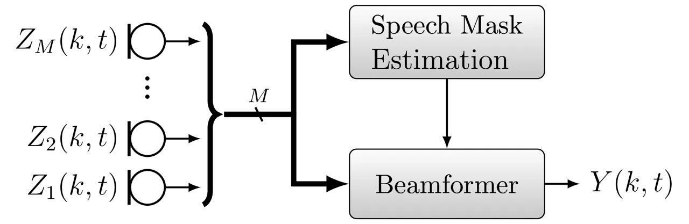

Fig. 1: System overview, showing the microphone signals $`Z_{m}(k,t)`$
and the beamformer output $`Y(k,t)`$ in frequency domain.

The signal at the microphones is a mixture of all $`C`$ sources, i.e. in
_short-time Fourier transform_ (STFT) domain

```math
\bm{Z}(k,t)=\sum_{c=1}^{C}\bm{X}_{c}(k,t), \tag{1}
```

where the time-frequency bins of all $`M`$ microphones are stacked into
a $`M\times 1`$ vector
$`\bm{Z}(k,t)=\big[Z_{1}(k,t),\ldots,Z_{M}(k,t)\big]^{T}`$. The vector
$`\bm{X}_{c}(k,t)`$ represents the $`c`$^(th) sound source at all $`M`$
microphones at frequency bin $`k=1,\ldots,K`$ and time frame $`t`$.²² 2
For the sake of brevity, the frequency and time frame indices will be
omitted where the context is clear. Each sound source is composed of a
monaural recording $`X_{c}(k,t)`$ convolved with the _Acoustic Transfer
Function_ (ATF) $`\bm{A}_{c}(k,t)`$, i.e.

```math
\bm{X}_{c}(k,t)=\bm{A}_{c}(k,t)X_{c}(k,t), \tag{2}
```

where $`\bm{A}_{c}(k,t)`$ models the acoustic path from the $`c`$^(th)
sound source to the microphones, including all reverberations and
reflections caused by the room acoustics \[37\]. In the near field of
the array, the ATFs can be modeled by a _finite impulse response_ (FIR)
filter \[38\]. The filter characteristics varies with the movement of
the speaker, i.e. it is non-stationary. Without loss of generality, we
specify the first source $`c=1`$ to be the desired source, i.e.
$`\bm{S}(k,t)=\bm{X}_{1}(k,t)`$, and the interfering signal as the sum
of the remaining sources, i.e.
$`\bm{N}(k,t)=\sum_{c=2}^{C}\bm{X}_{c}(k,t)`$. The spatial PSD matrix
for the desired signal is given as \[39\]

```math
\bm{\Phi}_{SS}(k)=\mathbb{E}\{\bm{S}(k,t)\bm{S}^{H}(k,t)\}, \tag{3}
```

and for the interfering signal

```math
\bm{\Phi}_{NN}(k)=\mathbb{E}\{\bm{N}(k,t)\bm{N}^{H}(k,t)\}. \tag{4}
```

The aim of beamforming is to recover the desired source $`\bm{S}(k,t)`$
while suppressing the interfering sources $`\bm{N}(k,t)`$ at the same
time. We use a _filter and sum_ beamformer \[40\], where each microphone
signal $`Z_{m}(k,t)`$ is weighted with the beamforming weights
$`W_{m}(k)`$, prior to summation into the result $`Y(k,t)`$, i.e.

```math
Y(k,t)=\bm{W}^{H}(k)\bm{Z}(k,t), \tag{5}
```

where $`\bm{W}(k)=\big[W_{1}(k),\ldots,W_{M}(k)\big]^{T}`$.

### II-A MVDR Beamformer

The MVDR beamformer \[38, 41\] minimizes the signal energy at the output
of the beamformer, while maintaining an undistorted response with
respect to the _steering vector_ $`\bm{v}_{S}(k)`$, i.e. its weights
$`\bm{W}_{MVDR}`$ are

```math
\bm{W}_{MVDR}=\frac{\bm{\Phi}^{-1}_{NN}\bm{v}_{S}}{\bm{v}_{S}^{H}\bm{\Phi}^{-1}_{NN}\bm{v}_{S}}. \tag{6}
```

The steering vector $`\bm{v}_{S}(k)`$ guides the beamformer towards the
direction of the desired signal. This direction can be determined using
_Direction Of Arrival_ (DOA) estimation algorithms \[42, 43, 44, 45\].
However, In real-world application this is sub-optimal, as it does not
consider reverberations and multi-path propagations. Assuming that the
PSD matrix of the desired source is known, the steering vector can be
obtained in signal subspace \[41\] using Eigenvalue decomposition (EVD)
of the PSD matrix $`\bm{\Phi}_{SS}(k)`$. In particular, the eigenvector
belonging to the largest eigenvalue is used as steering vector
$`\bm{v}_{S}(k)`$.

### II-B GEV Beamformer

An alternative to the MVDR beamformer is the GEV beamformer \[24, 46\].
It determines the filter weights $`\bm{W}`$ to maximize the SNR $`\xi`$
at the beamformer output, i.e.

```math
\bm{W}_{GEV}=\underset{\bm{W}}{\arg\max}\,\xi, \tag{7}
```

where

```math
\xi=\frac{\bm{W}^{H}\bm{\Phi}_{SS}\bm{W}}{\bm{W}^{H}\bm{\Phi}_{NN}\bm{W}}. \tag{8}
```

Eq. (7) can be rewritten as a generalized Eigenvalue problem \[46\]:

```math
\bm{\Phi}_{SS}\bm{W}=\xi\bm{\Phi}_{NN}\bm{W}, \tag{9}
```

where $`\bm{W}`$ is the eigenvector belonging to the largest eigenvalue
of $`\bm{\Phi}_{NN}^{-1}\bm{\Phi}_{SS}`$. To compensate for the
amplitude distortions  \[24\] of the beamforming filter
$`\bm{W}_{GEV}`$, we choose the two reference implementations from
 \[29\], i.e. the GEV-PAN, GEV-BAN postfilters.

### II-C PSD Matrix Estimation

The spatial PSD matrix $`\bm{\Phi}_{SS}(k)`$ can be approximated using

```math
\bm{\hat{\Phi}}_{SS}(k,t)=\frac{1}{L}\sum\limits_{l=t-L/2}^{t+L/2}\bm{Z}(k,l)\bm{Z}^{H}(k,l)p(k,l), \tag{10}
```

and the gain mask $`p(k,t)`$ for the speech signal. Analogously,
$`\bm{\hat{\Phi}}_{NN}(k,t)`$ can be estimated using the gain mask
$`q(k,t)`$ for the interfering signal. Note that the window length $`L`$
defines the number of time frames used for estimating the PSD matrices.
For moving sources, $`L`$ has to be sufficiently large to obtain well
estimated PSD matrices. If $`L`$ is too large, the estimated PSD
matrices might fail to adapt quickly enough to changes in the spatial
characteristics of the moving sources. An alternative is provided by
recursive estimation, i.e.

```math
\displaystyle\bm{\hat{\Phi}}_{SS}(k,t) \displaystyle\leftarrow\bm{\hat{\Phi}}_{SS}(k,t-1)\big[1-p(k,t)\big] \tag{11}
```

```math
\displaystyle+\bm{Z}(k,t)\bm{Z}^{H}(k,t)p(k,t).
```

This _online processing_ \[47\] allows to adapt the MVDR or GEV
beamformer at each time frame $`t`$. This recursive estimation is
initialized using Eq. (10).

### II-D Recursive Eigenvector Tracking

If Eq. (10) is used, the generalized Eigenvalue decomposition in Eq. (9)
has to be performed for every time-frequency bin. This expensive
operation can be circumvented by _recursive Eigenvector tracking_ using
Oja’s method \[48\]; i.e.

```math
\displaystyle\bm{W}^{\prime}(k,t) \displaystyle\leftarrow\bm{W}^{\prime}(k,t-1) \tag{12}
```

```math
\displaystyle-\alpha\bm{\hat{\Phi}}_{NN}(k,t)\bm{W}^{\prime}(k,t-1)
```

```math
\displaystyle+\alpha\bm{\hat{\Phi}}_{SS}(k,t)\bm{W}(k,t-1)\quad\mbox{, and}
```

```math
\displaystyle\bm{W}(k,t) \displaystyle\leftarrow\frac{\bm{W}^{\prime}(k,t)}{||\bm{W}^{\prime}(k,t)||_{2}}.
```

Note that the GEV-PAN and GEV-BAN postfilters from \[29\] are not
affected by the normalization operation in Eq. (12). When using the MVDR
beamformer, tracking the largest eigenvector of
$`\bm{\hat{\Phi}}_{SS}(k,t)`$ is done in a similar fashion.

### II-E DNN-based Speech Mask Estimation

The DNN used to estimate the gain mask for the beamformer uses the noisy
microphone observations $`\bm{Z}(k,t)`$ as features. In particular, the
features per time-frequency-bin are defined as
$`x(t,k)=[\text{Re}\!\left\{\bm{\bar{Z}}(k,t)\right\},\text{Im}\!\left\{\bm{\bar{Z}}(k,t)\right\}]`$,
where $`\bm{\bar{Z}}(k,t)`$ is a whitened and phase-normalized version
of $`\bm{Z}(k,t)`$. Further details on whitening can be found in \[29\].
For $`M`$ microphones, $`x(t,k)`$ contains $`2M`$ real-valued elements.
The DNN processes $`K`$ frequency bins at a time, hence each time frame
$`t`$ uses the feature vector
$`\bm{x}(t)=[x(t,0),x(t,1),\ldots,x(t,K-1)]`$ as input. It contains
$`2MK`$ elements.

Figure 2 shows the architecture of the DNN consisting of _Dense layers_
and BLSTM units. Similar architectures for speech mask estimation can be
found in \[49, 26, 50, 31\].

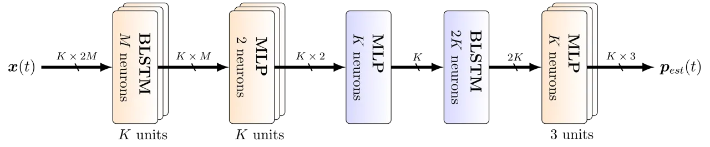

Fig. 2: Mask estimation DNN.

The first BLSTM layer consists of two separate LSTM units \[51\], each
with $`2M`$ neurons for each frequency bin. While the first LSTM
processes the data in forward direction (i.e. one time frame after
another), the second LSTM operates in backward direction. The output of
both LSTMs is then concatenated to an intermediate vector with $`2K`$
elements. The second and third layer consists of a Dense layer. The
first three layers reduce the feature vector size from $`2M`$ elements
per time-frequency bin down to 1. Note that those layers have very few
weights, as they consist of $`K`$ independent units with $`M`$ neurons
each. The fourth layer is a BLSTM processing all $`K`$ frequency bins at
a time. Finally, three separate Dense layers are used. The first dense
layer estimates the mask for the desired source, the second estimates
the mask for the interfering sources, and the third estimates the mask
for time-frequency bins which are not assigned to the other two classes.
The activation function of this layer is a softmax, so that the sum of
each of the three masks is 1 for each time-frequency bin, i.e.
$`\sum_{i=1}^{3}p_{est}(k,t,i)\overset{!}{=}1`$.

## III Computational Efficiency of the MCSE System

### III-A Complexity analysis of MCSE system

Table I shows both the computational complexity and the number of
_multiply-and-accumulate_ (MAC) operations for the proposed DNN-based
mask estimator (cf. Section 2). Overall, 5562e6 MAC operations are
needed to compute a gain-mask given a multi-channel signal with $`M=6`$
microphones, $`K=513`$ frequency bins and $`T=500`$ frames. Table II
shows the MAC operations of a static and dynamic beamformer, needed to
infer the target speech. Static beamformers, which do not track moving
targets have a reduced computational overhead compared to dynamic
variants, computing the beamforming weight for every time-step. However,
the overall computational complexity is orders of magnitude lower
compared to the DNN-based mask estimator. This indicates that
significant computational savings can be obtained when optimizing DNNs
with respect to resource efficiency.

|             |                                 |          |        |
| ----------- | ------------------------------- | -------- | ------ |
| Layer       | Shape                           | Weights  | MAC    |
| BLSTM       | $`16\times K\times 2M\times M`$ | 590976   | 295e6  |
| Dense layer | $`K\times M\times 2`$           | 6156     | 3e6    |
| Dense layer | $`2K\times K`$                  | 526338   | 263e6  |
| BLSTM       | $`16\times K\times 2K`$         | 8421408  | 4211e6 |
| Dense layer | $`3\times 2K\times K`$          | 1579014  | 790e6  |
| Total       |                                 | 11123892 | 5562e6 |

TABLE I: Computational complexity for the DNN-based mask estimator.

|         |        |                              |        |
| ------- | ------ | ---------------------------- | ------ |
| Mode    | Layer  | Complexity                   | MAC    |
| static  | Eq. 10 | $`\mathcal{O}(T*2*K*M^{2})`$ | 18e6   |
| static  | Eq. 9  | $`\mathcal{O}(K*M^{3})`$     | 0.1e6  |
| Total   |        |                              | 18.1e6 |
| dynamic | Eq. 10 | $`\mathcal{O}(T*2*K*M^{2})`$ | 18e6   |
| dynamic | Eq. 9  | $`\mathcal{O}(T*K*M^{3})`$   | 55e6   |
| Total   |        |                              | 73e6   |

TABLE II: Computational complexity of a static- and dynamic GEV
beamformer.

Reducing the precision of the DNN-based mask estimators reduces the
computational complexity and memory consumption of the overall MCSE
system. Reduced precision DNNs can be realized via bit-packing³³ 3
https://github.com/google/gemmlowp schemes, with the help of processor
specific GEMM instructions \[52\] or can be implemented on a DSP or
FPGA.

Computational savings for various 8-bit DNN models on both ARM
processors and GPUs have been reported in \[53, 54, 55, 52\]. In
particular, \[20\] reported that speech recognition performance is
maintained when quantizing the neural network parameters to 8 bit
fixed-point, while the system runs 3 times faster on a x86 architecture.

In order to demonstrate the advantages that binary computations achieve
on other general-purpose processors, we implemented
matrix-multiplication operators for NVIDIA GPUs and ARM CPUs. BNNs can
be implemented very efficiently as 1-bit scalar products,
i.e. multiplications of two vectors $`\mathbf{x}`$ and $`\mathbf{y}`$ of
length $`N`$ reduce to bit-wise xnor() operation, followed by counting
the number of set bits with popc(), i.e.

```math
\mathbf{x}\cdot\mathbf{y}=N-2*popc(xnor(\mathbf{x},\mathbf{y})),x_{i},y_{i}\in\{-1,+1\}\quad\forall{i}, \tag{13}
```

where $`x_{i}`$ and $`y_{i}`$ denote the $`i\textsuperscript{th}`$
element of $`\mathbf{x}`$ and $`\mathbf{y}`$, respectively. We use the
matrix-multiplication algorithms of the MAGMA and Eigen libraries and
replace float multiplications by xnor() operations, as depicted in
Equation (13). Our CPU implementation uses NEON vectorization in order
to fully exploit SIMD instructions on ARM processors. We report
execution time of GPUs and ARM CPUs in Table III. As can be seen, binary
arithmetic offers considerable speed-ups over single-precision with
manageable implementation effort. This also affects energy consumption
since binary values require less off-chip accesses and operations.
Performance results of x86 architectures are not reported because
neither SSE nor AVX ISA extensions support vectorized popc().

|      |             |                |               |          |
| ---- | ----------- | -------------- | ------------- | -------- |
| arch | matrix size | time (float32) | time (binary) | speed-up |
| GPU  | 256         | 0.14ms         | 0.05ms        | 2.8      |
| GPU  | 513         | 0.34ms         | 0.06ms        | 5.7      |
| GPU  | 1024        | 1.71ms         | 0.16ms        | 10.7     |
| GPU  | 2048        | 12.87ms        | 1.01ms        | 12.7     |
| ARM  | 256         | 3.65ms         | 0.42ms        | 8.7      |
| ARM  | 513         | 16.73ms        | 1.43ms        | 11.7     |
| ARM  | 1024        | 108.94ms       | 8.13ms        | 13.4     |
| ARM  | 2048        | 771.33ms       | 58.81ms       | 13.1     |

TABLE III: Performance metrics for matrix $`\cdot`$ matrix
multiplications on a NVIDIA Tesla K80 and ARM Cortex-A57.

### III-B Reduced Precision DNNs

We exploit reduced-precision weights and limit the numerical precision
of a DNN-based mask estimator to either 8- or 4 bit fixed-point
representations or to binary weights. Recently, there has been numerous
extensions to train DNNs with limited precision  \[8, 56, 57, 58\].

#### III-B1 DNN with Low-precision Weights

The weights and activations of a DNN often lie within a small range,
making it possible to introduce quantization schemes. Implementations
like \[9, 21\] use reduced precision for their DNN’s weights. In \[20\],
an improvement of inference speed of factor 3 for fixed-point
implementation on a general purpose hardware has been reported. Hence,
we consider a fixed-point representation of the computed values in the
_forward pass_ of our DNN \[58\]. In particular, we use 8- and 4 bit
weights, which represent the Q2.6 and Q2.2 fractional formats,
respectively. After each layer, we use batch normalization to ensure the
activations to fit within $`\in{[-2,+2]}`$. The accumulation of the
values in the dot products and the batch normalization are performed
with high precision, while the multiplication is performed at lower
precision.

During training we compute the gradient and update the weights using
float32, while the precision is only reduced accordingly in the forward
pass⁴⁴ 4 The derivative is computed with respect to the quantized
weights as in \[7, 8, 9\].. This is known as _straight through
estimator_ (STE) \[7, 8\], where the parameter update is performed in
full-precision. Usually, when deploying the DNN in an application, only
the forward-pass calculations are required. Hence, the reduced-precision
weights can be used, reducing memory requirements by a factor of 4 or 8
compared to 32-bit weight representations. Figure 3 shows a
reduced-precision LSTM cell. Besides the well-known gating and
vector$`\cdot`$matrix computations of LSTMs, bit clipping operations are
introduced after each mathematical operation. Details of the LSTM cell
can be found in \[51\].

Fig. 3: Reduced precision LSTM cell, using bit-clipping to either 4- or
8 bit fixed-point representation after each mathematical operation.

#### III-B2 DNN with Binary Weights

In \[7\], binary-weight DNNs are trained using the STE, i.e.
deterministic and stochastic rounding is used during forward
propagation, and the full-precision weights are updated based on the
gradients of the quantized weights. In \[59\], STE is used to quantize
both the weights and the activations to a single bit and sign functions
respectively.  \[60\] trained ternary weights $`\bm{W}\in\{-a,0,a\}`$ by
setting weights below or above a certain threshold $`\Delta`$ to
$`\pm a`$, or zero otherwise. This has been extended in \[61\] to
ternary weights $`w\in\{-a,0,b\}`$ by learning the factors $`a>0`$ and
$`b>0`$ using gradient updates and a different threshold $`\Delta`$ has
been applied.

Fig. 4: Binary LSTM, using both binary weights and binary activation
functions and scaling parameters $`\{s_{hi},s_{ho},s_{hc},s_{hf}\}`$.

When dealing with recurrent architectures such as LSTMs,  \[9\] observed
that recent reduced-precision techniques for BNNs \[7, 59\] cannot be
directly extended to recurrent layers. In particular, a simple reduction
of the precision of the forward pass to 1 bit in the LSTM layers suffers
from severe performance degradation as well as the vanishing gradient
problem. In \[61, 62\] batch-normalization and a weight-scaling is
applied to the recurrent weights to overcome this problem. We adopt this
approach, i.e. introducing a trainable scaling parameter $`s`$, which
maps the range of the recurrent activations to $`\{-s,s\}`$. Hence, each
of the recurrent weight matrices $`\bm{W}_{ho},\bm{W}_{hi},\bm{W}_{hc}`$
and $`\bm{W}_{hf}`$ has its own scaling factor, i.e.
$`\{s_{hi},s_{ho},s_{hc},s_{hf}\}`$. See also Fig. 4. This limits the
recurrent weights to small values, preventing the LSTM to reach unstable
states, i.e. avoids accumulating the cell states to large numbers. For
binary weights, the LSTM cell equations are given as:

```math
\displaystyle\mathbf{i}^{(t)} \displaystyle=\sigma_{b}(\mathbf{W}_{xi}\mathbf{x}^{(t)}+(\mathbf{W}_{hi}\mathbf{h}^{(t-1)})\odot s_{hi}+\mathbf{b}_{i}) \tag{14a}
```

```math
\displaystyle\mathbf{f}^{(t)} \displaystyle=\sigma_{b}(\mathbf{W}_{xf}\mathbf{x}^{(t)}+(\mathbf{W}_{hf}\mathbf{h}^{(t-1)})\odot s_{hf}+\mathbf{b}_{f}) \tag{14b}
```

```math
\displaystyle\mathbf{o}^{(t)} \displaystyle=\sigma_{b}(\mathbf{W}_{xo}\mathbf{x}^{(t)}+(\mathbf{W}_{ho}\mathbf{h}^{(t-1)})\odot s_{ho}+\mathbf{b}_{o}) \tag{14c}
```

```math
\displaystyle\mathbf{\tilde{c}}^{(t)} \displaystyle=\tanh_{b}(\mathbf{W}_{xc}\mathbf{x}^{(t)}+(\mathbf{W}_{hc}\mathbf{h}^{(t-1)})\odot s_{hc}+\mathbf{b}_{c}) \tag{14d}
```

```math
\displaystyle\mathbf{c}^{(t)} \displaystyle=\mathbf{f}^{(t)}\odot\mathbf{c}^{(t-1)}+\mathbf{i}^{(t)}\odot\mathbf{\tilde{c}}^{(t)} \tag{14e}
```

```math
\displaystyle\mathbf{h}^{(t)} \displaystyle=\mathbf{o}^{(t)}\odot\tanh_{b}(\mathbf{c}^{(t)}), \tag{14f}
```

where $`\sigma_{b}(\cdot)`$ and $`\tanh_{b}(\cdot)`$ are a binary
version (i.e. hard sigmoid and sign function \[7\]) of the well-known
sigmoid and tanh activation functions. The weights $`\bm{W}`$ and biases
$`\bm{b}`$ are the binary network parameters (i.e. with values of
$`\{-1,1\}`$), and $`\{s_{hi},s_{ho},s_{hc},s_{hf}\}`$ are the scaling
parameters for the recurrent network weights.

## IV Experiments

### IV-A Experimental Setup

The performance of the multi-channel speech enhancement system is
demonstrated by simulating a typical living room scenario with two
static speakers S₁ and S₂, two moving speakers D₁ and D₂, and an
isotropic background noise source I similar as in \[29\]. The floor plan
of the setup is shown in Figure 5. The circular microphone array with
$`M=6`$ microphones and a diameter of $`86mm`$ is shown in red labeled
as _Mic_. Head movements of the static speakers S₁ and S₂ are simulated
by random 3D position changes within $`20cm`$. The trajectory of the
moving speakers D₁ and D₂ random within a region of 2m $`\times`$ 4m on
both sides of the microphone array. The movement velocity is constant at
$`0.5\frac{m}{s}`$.

Fig. 5: Shoebox model of a living room showing two stationary sound
sources S₁ and S₂, and two dynamic sound sources D₁ and D₂. The
microphone array (Mic) is visualized as red circle.

We specify five scenarios for our experiments using this shoebox model:

1.  1.  Random vs. isotropic (R-I): A static speaker with head movements is
        the _random_ source. The position is randomly selected in the room
        for each new utterance to prevent the model from learning the
        position of the speaker.
2.  2.  Static1 vs. isotropic (S₁-I): A stationary speaker at fixed position
        S₁ and an isotropic background noise are used in this scenario. The
        head movements cause a varying phase especially at higher
        frequencies.
3.  3.  Static1 vs. static2 + isotropic (S₁-S₂I): Two simultaneously talking
        speakers at position S₁ and S₂ embedded in isotropic background
        noise are used in this scenario.
4.  4.  Dynamic1 vs. isotropic (D₁-I): The speaker moving in region D₁ has
        to be tracked in the presence of ambient background noise. This
        challenges the tracking capabilities of the DNN mask estimation.
5.  5.  Dynamic1 vs. dynamic2 + isotropic (D₁-D₂I): The separation
        capabilities of two speakers moving in D₁ and D₂ embedded in
        background noise is analysed.

These experimental setups are summarized in Table IV:

|               |                |                       |
| ------------- | -------------- | --------------------- |
| Experiment \# | Desired source | Interfering source(s) |
| 1             | random R       | isotropic I           |
| 2             | S₁             | isotropic I           |
| 3             | S₁             | S₂, isotropic I       |
| 4             | D₁             | isotropic I           |
| 5             | D₁             | D₂, isotropic I       |

TABLE IV: Experimental setups using a virtual shoebox model.

### IV-B Data Generation

We use the _Image Source Method_ (ISM) \[36, 63\] to simulate the ATFs
in Eq. (2). This enables to generate multi-channel recordings from a
monaural source. The room is modeled as shoebox with a reflection
coefficient of $`\beta=0.85`$ for each wall. The reflection order is
$`10`$ which results in a reverberation time of $`~500ms`$. We generate
a new set of ATFs every $`32ms`$ for the moving sources. The isotropic
background noise is determined as

```math
\bm{X}_{n}(k,t)=\bm{U}(k,t)X_{n}(k,t), \tag{15}
```

where $`X_{n}(k,t)`$ is the monaural noise source,
$`\bm{U}(k,t)=\bm{E}(k)\bm{\Lambda}(k)^{0.5}\phantom{.}\text{e}^{i\bm{\varphi}(k,t)}`$,
$`\bm{\Lambda}(k)`$ and $`\bm{E}(k)`$ denotes the eigenvalue and
eigenvector matrices of the spatial coherence matrix $`\bm{\Gamma}(k)`$
for a spherical sound field \[37\]. The $`M\times 1`$ vector
$`\bm{\varphi}(k,t)`$ denotes a uniformly distributed phase between
$`-\pi,\dots,\pi`$.

### IV-C Training and Testing

We use 12776 utterances from the si_tr_s set of the WSJ0 \[35\] corpus
for the speech sources in Eq. (2) for training. Additionally, 20 hours
of different sound categories from YouTube \[64\] are used as isotropic
background noise. All recordings are sampled at 16kHz and converted to
the frequency domain with $`K=513`$ bins and 75% overlapping blocks. The
sources are mixed with equal volume. For testing, we use 2907 utterances
from the si_et_05 set of the WSJ0 corpus mixed with Youtube noise.

The ground truth gain masks required for training can be obtained for
the desired signal as:

```math
p_{opt}(k,l,1)=||\bm{S}(k,t)||_{2}>\max\big(||\bm{N}(k,t)||_{2},\epsilon(k)\big). \tag{16}
```

The mask for the interfering signals is given as:

```math
p_{opt}(k,l,2)=||\bm{N}(k,t)||_{2}>\max\big(||\bm{S}(k,t)||_{2},\epsilon(k)\big). \tag{17}
```

The weak signal components, which do not contribute to any of the PSD
matrices, are obtained as:

```math
p_{opt}(k,l,3)=1-p(k,l,1)-p(k,l,2). \tag{18}
```

Parameter $`\epsilon(k)`$ specifies the amount of energy per frequency
bin $`k`$ required for the signal to be assigned to either the desired
or interfering class label. Note that the calculation of the ground
truth masks requires the corresponding signal energies
$`||\bm{S}(k,t)||_{2}`$ and $`||\bm{N}(k,t)||_{2}`$ to be known, which
is why we used the ISM rather than existing multi-channel speech
databases such as \[65\].

By setting $`\sum_{i=1}^{3}p_{est}(k,t,i)=1`$ for each time-frequency
bin, we can use the _cross-entropy_ as loss function. For each (B)LSTM
or dense layer a tanh activation and batch normalization \[66\] is
applied. We train for each of the five scenarios in Table IV a separate
DNN. Model optimization is done using stochastic gradient descent with
ADAM \[67\] using the cross-entropy between the optimal binary mask
$`p_{opt}`$ and the estimated mask $`p_{est}`$ of the respective model.
To avoid overfitting, we use early stopping by observing the error on
the validation set every 20 epochs.

### IV-D Performance evaluation

We use three different beamformers: the MVDR, GEV-BAN and GEV-PAN (see
Section II) for each gain mask. The estimates of the PSD matrices are
obtained using Eq. (10), where $`L=32`$ blocks. We apply the
_BeamformIt_ toolkit \[68\] as baseline. It uses DOA estimation \[42\]
followed by a MVDR beamformer. To evaluate the performance of the
enhanced signals $`Y(k,t)`$, we use the Google Speech-to-Text API \[34\]
to perform _Automatic Speech Recognition_ (ASR). Furthermore, we
determine the SNR improvement as:

```math
\Delta SNR=10log_{10}\frac{\sum_{K,L}|Y(k,t)p_{opt}(k,l,1)|^{2}}{\sum_{K,L}|Y(k,t)p_{opt}(k,l,2)|^{2}}\phantom{=}-10log_{10}\frac{\sum_{K,L}||\bm{Z}(k,t)p_{opt}(k,l,1)||^{2}_{2}}{\sum_{K,L}||\bm{Z}(k,t)p_{opt}(k,l,2)||^{2}_{2}}, \tag{19}
```

where the optimal _binary_ mask $`p_{opt}`$ is used to measure the
energy of the desired and interfering components in the beamformer
output $`Y(k,t)`$ and the noisy inputs $`\bm{Z}(k,t)`$, respectively.
The $`\Delta SNR`$ can be computed without having access to the
beamforming weights $`\bm{W}(k,t)`$, as is the case of the BeamformIt
toolkit.

### IV-E Results

While improvements of memory footprint and computation time are
independent of the underlying tasks, the prediction accuracy highly
depends on the complexity of the data and the used neural network.
Simple data sets allow for aggressive quantization without affecting
prediction performance significantly, while binary quantization results
in severe prediction degradation on more complex data sets.

Figure 6 shows speech mask estimations $`p_{est}(k,l,1)`$ using (a) 32-,
(b) 8- (c) 4- and (d) 1-bit DNNs from the mixture of scenario (S₁-I) of
the WSJ0 utterance “When its initial public offering is completed
Ashland is expected to retain a 46% stake” from si_et_05. As noted in
Section II-E, the activation function of the output layer is a
full-precision softmax function. The reduction of the weight precision
introduces artifacts in (b), (c) and (d).

|       |                                                             |
| ----- | ----------------------------------------------------------- |
| \(a\) | 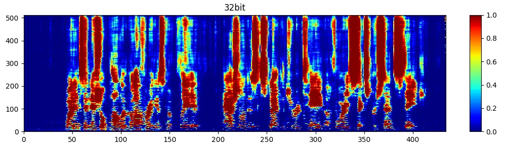 |
| \(b\) | 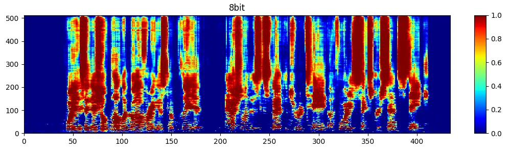 |
| \(c\) | 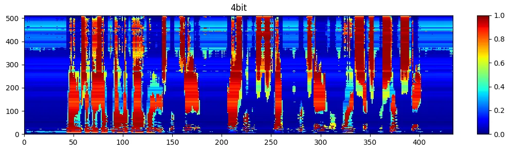 |
| \(d\) | 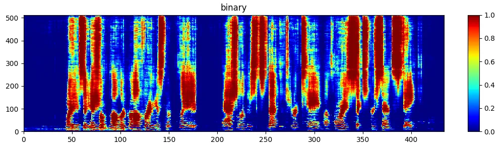 |

Fig. 6: Speech mask estimation $`p_{est}(k,l,1)`$ using (a) 32-, (b) 8-,
(c) 4-, and (d) 1-bit DNNs.

|       |                                                              |
| ----- | ------------------------------------------------------------ |
| \(a\) | 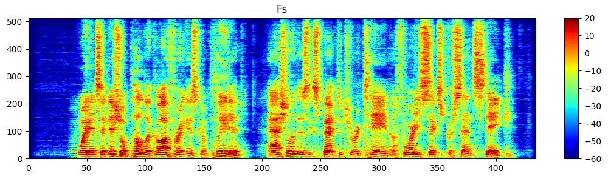  |
| \(b\) | 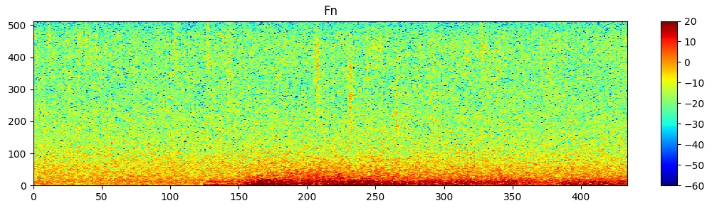  |
| \(c\) | 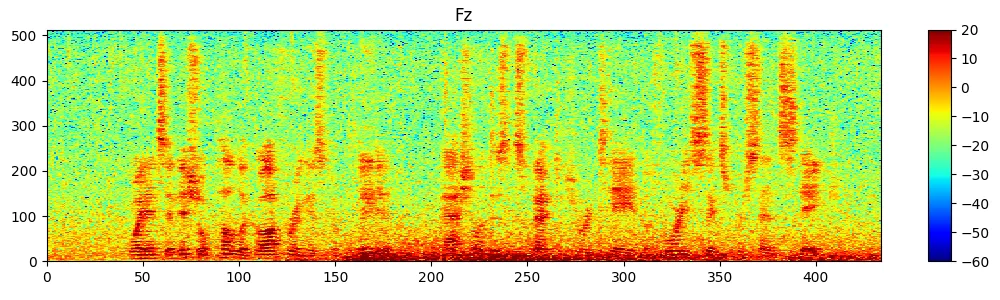  |
| \(d\) | 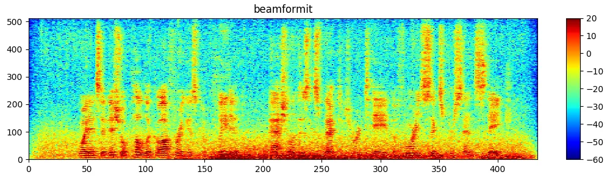 |
| \(e\) | 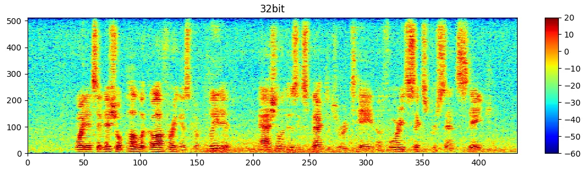 |
| \(f\) | 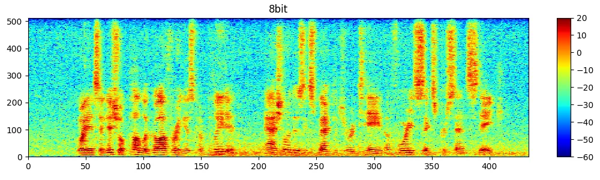 |
| \(g\) | 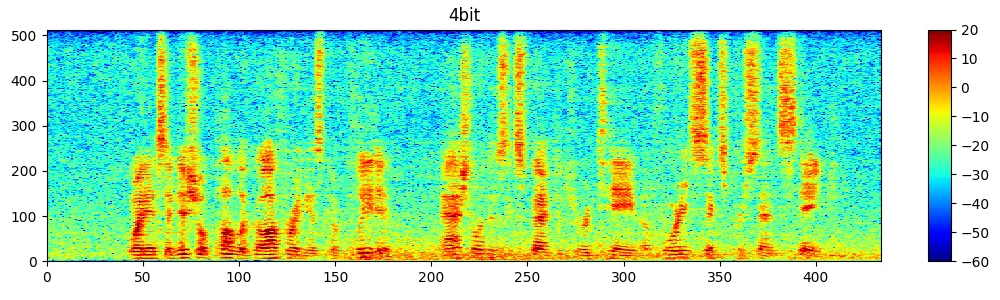 |
| \(h\) |  |

Fig. 7: (a) Original WSJ0 utterance “When its initial public offering is
completed Ashland is expected to retain a 46% stake”, (b) background car
noise, (c) mixture, (d) reconstructed speech using BeamformIt, (e-h)
speech estimates using 32-, 8-, 4, and 1-bit DNNs and a GEV-BAN
beamformer, respectively.

Figure 7 shows the corresponding log-spectrograms. In particular, (a)
shows the original source signal, (b) the noise, and (c) the mixture,
(d-h) shows the reconstructed source signals using BeamformIt and 32-,
8-, 4-, and 1-bit DNNs using a GEV-BAN beamformer, respectively. Reduced
precision DNNs generate reasonable predictions compared to the
single-precision baseline. BeamformIt is not able to remove the low
frequency components of the car noise. The reduced-precision DNNs are
able to attenuate the car noise in the background in a similar way as
the 32-bit baseline DNN.

This is also reflected in Table V, showing the SNR improvement on the
test set for experiment 1 - 5. Mask-based beamformers outperform
BeamformIt in all five experiments. Reducing the bit-width slightly
degrades the SNR performance. However this reduces the memory footprint
of the models. There is a small difference between the mask-based
beamformers, i.e. GEV performs slightly better than MVDR. In general,
8-bit mask-based estimators achieve competitive SNR scores, comparable
to the full precision baseline.

|      |              |         |         |       |
| ---- | ------------ | ------- | ------- | ----- |
| bits | experiment 1 | GEV BAN | GEV PAN | MVDR  |
| 32   | BeamformIt   | -       | -       | -0.57 |
| 32   | DNN          | 8.09    | 8.37    | 7.36  |
| 8    | DNN          | 7.61    | 8.00    | 6.77  |
| 4    | DNN          | 4.36    | 5.81    | 4.17  |
| 1    | DNN          | 5.47    | 6.30    | 4.96  |
| bits | experiment 2 | GEV BAN | GEV PAN | MVDR  |
| 32   | BeamformIt   | -       | -       | -0.46 |
| 32   | DNN          | 8.57    | 8.76    | 7.95  |
| 8    | DNN          | 8.43    | 8.63    | 7.87  |
| 4    | DNN          | 7.50    | 8.05    | 6.21  |
| 1    | DNN          | 7.60    | 8.03    | 6.72  |
| bits | experiment 3 | GEV BAN | GEV PAN | MVDR  |
| 32   | BeamformIt   | -       | -       | -0.20 |
| 32   | DNN          | 11.69   | 11.96   | 10.48 |
| 8    | DNN          | 10.09   | 10.53   | 10.88 |
| 4    | DNN          | 10.29   | 10.96   | 6.65  |
| 1    | DNN          | 10.71   | 11.21   | 8.83  |
| bits | experiment 4 | GEV BAN | GEV PAN | MVDR  |
| 32   | BeamformIt   | -       | -       | -0.19 |
| 32   | DNN          | 8.44    | 8.72    | 7.63  |
| 8    | DNN          | 8.11    | 8.46    | 7.27  |
| 4    | DNN          | 7.01    | 7.78    | 5.49  |
| 1    | DNN          | 6.62    | 7.30    | 5.76  |
| bits | experiment 5 | GEV BAN | GEV PAN | MVDR  |
| 32   | BeamformIt   | -       | -       | 0.35  |
| 32   | DNN          | 12.73   | 13.15   | 10.72 |
| 8    | DNN          | 12.09   | 12.62   | 9.50  |
| 4    | DNN          | 10.26   | 11.09   | 4.60  |
| 1    | DNN          | 11.25   | 12.01   | 7.31  |

TABLE V: SNR improvement of GEV- and MVDR beamformers for various
experiments conducted on WSJ0 test sets.

Table VI reports the word error rate (WER). We use the 6 channel data
processed with 32-, 8-, 4-, and 1-bit DNNs for speech mask estimation
using GEV-PAN, GEV-BAN and MVDR beamformers. Groundtruth transcriptions
were generated using original WSJ0 recordings. Single-precision networks
obtained the best overall WER in all experiments. In case of reduced
precision networks, 8-bit DNNs produce competitive results, when using
MVDR beamformers. For the 4- and 1-bit variants the performance
degrades. For experiments with more than one dominant source BeamformIt
fails. In general, results for single speaker scenarios (experiment 1, 2
and 4) are better.

|      |              |         |         |       |
| ---- | ------------ | ------- | ------- | ----- |
| bits | experiment 1 | GEV BAN | GEV PAN | MVDR  |
| 32   | BeamformIt   | -       | -       | 21.38 |
| 32   | DNN          | 9.14    | 11.71   | 9.69  |
| 8    | DNN          | 12.13   | 16.57   | 10.62 |
| 4    | DNN          | 22.14   | 21.89   | 15.24 |
| 1    | DNN          | 29.97   | 40.23   | 15.07 |
| bits | experiment 2 | GEV BAN | GEV PAN | MVDR  |
| 32   | BeamformIt   | -       | -       | 22.77 |
| 32   | DNN          | 8.15    | 11.10   | 9.64  |
| 8    | DNN          | 8.89    | 10.67   | 10.17 |
| 4    | DNN          | 12.79   | 17.56   | 12.21 |
| 1    | DNN          | 10.88   | 15.57   | 11.20 |
| bits | experiment 3 | GEV BAN | GEV PAN | MVDR  |
| 32   | BeamformIt   | -       | -       | 84.68 |
| 32   | DNN          | 15.38   | 17.48   | 16.24 |
| 8    | DNN          | 24.84   | 26.02   | 24.69 |
| 4    | DNN          | 21.94   | 29.18   | 25.76 |
| 1    | DNN          | 20.78   | 26.79   | 21.89 |
| bits | experiment 4 | GEV BAN | GEV PAN | MVDR  |
| 32   | BeamformIt   | -       | -       | 22.95 |
| 32   | DNN          | 13.99   | 19.12   | 14.63 |
| 8    | DNN          | 16.00   | 21.72   | 16.47 |
| 4    | DNN          | 27.66   | 37.00   | 20.08 |
| 1    | DNN          | 26.69   | 38.37   | 19.68 |
| bits | experiment 5 | GEV BAN | GEV PAN | MVDR  |
| 32   | BeamformIt   | -       | -       | 80.90 |
| 32   | DNN          | 19.80   | 27.01   | 21.04 |
| 8    | DNN          | 24.33   | 33.23   | 23.81 |
| 4    | DNN          | 37.21   | 49.52   | 43.03 |
| 1    | DNN          | 31.92   | 44.09   | 31.18 |

TABLE VI: Word error rates on enhanced speech data of WSJ0 corpus.
Speech has been processed with GEV-PAN, GEV-BAN and MVDR beamformers
using 32-, 8-, 4-, and 1-bit DNNs for speech mask estimation.

## V Conclusion

We introduced a resource-efficient approach for multi-channel speech
enhancement using DNNs for speech mask estimation. In particular, we
reduce the precision to 8-, 4- and 1-bit. We use a recurrent neural
network structure capable of learning long-term relations. Limiting the
bit-width of the DNNs reduces the memory footprint and improves the
computational efficiency while the degradation in speech mask estimation
performance is marginal. When deploying the DNN in speech processing
front-ends only the reduced-precision weights and forward-pass
calculations are required. This supports speech enhancement on low-cost,
low-power and limited-resource front-end hardware. We conducted five
experiments simulating various cocktail party scenarios using the WSJ0
corpus. In particular, different beamforming architectures, i.e. MVDR,
GEV-BAN, and GEV-PAN, which are combined with low bit-width mask
estimators have been evaluated. MVDR beamformers, using 8-bit
reduced-precision DNNs for estimating the speech mask, obtain
competitive SNR scores compared to the single-precision baselines.
Furthermore, the same architecture achieve competitive WERs in single
speaker scenarios, measured with the Google Speech-to-Text API. If
multiple speakers are introduced, the performance degrades. In the case
of binary DNNs, we show a significant reduction of memory footprint
while still obtaining an audio quality which is only slightly lower
compared to single-precision DNNs. We show that these trade-offs can be
readily exploited on today’s hardware, by benchmarking the core
operation of binary DNNs on NVIDIA and ARM architectures.

In future, we aim to implement the system on a target hardware and
measure the resource consumption and run time.

## References

- \[1\] S. Han, J. Pool, J. Tran, and W. J. Dally, “Learning both
  weights and connections for efficient neural network,” in _Advances in
  Neural Information Processing Systems (NIPS)_, 2015, pp. 1135–1143.
- \[2\] S. Han, H. Mao, and W. J. Dally, “Deep compression: Compressing
  deep neural network with pruning, trained quantization and Huffman
  coding,” in _International Conference on Learning Representations
  (ICLR)_, 2016.
- \[3\] A. Gordon, E. Eban, O. Nachum, B. Chen, H. Wu, T. Yang, and
  E. Choi, “Morphnet: Fast & simple resource-constrained structure
  learning of deep networks,” in _2018 IEEE Conference on Computer
  Vision and Pattern Recognition, CVPR 2018, Salt Lake City, UT, USA,
  June 18-22, 2018_, 2018, pp. 1586–1595.
- \[4\] C. W. Wu, “Prodsumnet: reducing model parameters in deep neural
  networks via product-of-sums matrix decompositions,” _CoRR_, vol.
  abs/1809.02209, 2018.
- \[5\] A. G. Howard, M. Zhu, B. Chen, D. Kalenichenko, W. Wang,
  T. Weyand, M. Andreetto, and H. Adam, “Mobilenets: Efficient
  convolutional neural networks for mobile vision applications,” _CoRR_,
  vol. abs/1704.04861, 2017.
- \[6\] B. Zoph, V. Vasudevan, J. Shlens, and Q. V. Le, “Learning
  transferable architectures for scalable image recognition,” _CoRR_,
  vol. abs/1707.07012, 2017.
- \[7\] M. Courbariaux, Y. Bengio, and J.-P. David, “BinaryConnect:
  Training deep neural networks with binary weights during
  propagations,” in _Advances in Neural Information Processing Systems
  (NIPS)_, 2015, pp. 3123–3131.
- \[8\] S. Zhou, Z. Ni, X. Zhou, H. Wen, Y. Wu, and Y. Zou, “Dorefa-net:
  Training low bitwidth convolutional neural networks with low bitwidth
  gradients,” _CoRR_, vol. abs/1606.06160, 2016. \[Online\]. Available:
  http://arxiv.org/abs/1606.06160
- \[9\] J. Ott, Z. Lin, Y. Zhang, S. Liu, and Y. Bengio, “Recurrent
  neural networks with limited numerical precision,” _CoRR_, vol.
  abs/1608.06902, 2016.
- \[10\] W. Roth, G. Schindler, M. Zöhrer, L. Pfeifenberger,
  S. Tschiatschek, R. Peharz, H. Fröning, F. Pernkopf, and
  Z. Ghahramani, “Resource-efficient neural networks for embedded
  systems,” _JMLR_, vol. submitted, 2019.
- \[11\] Y.-H. Chen, J. Emer, and V. Sze, “Eyeriss: A spatial
  architecture for energy-efficient dataflow for convolutional neural
  networks,” in _Proceedings of the 43rd International Symposium on
  Computer Architecture_, ser. ISCA ’16. Piscataway, NJ, USA: IEEE
  Press, 2016, pp. 367–379. \[Online\]. Available:
  https://doi.org/10.1109/ISCA.2016.40
- \[12\] M. Horowitz, “1.1 computing’s energy problem (and what we can
  do about it),” in _2014 IEEE International Solid-State Circuits
  Conference Digest of Technical Papers (ISSCC)_, Feb 2014, pp. 10–14.
- \[13\] Y. LeCun, J. S. Denker, and S. A. Solla, “Optimal brain
  damage,” in _Advances in Neural Information Processing Systems
  (NIPS)_, 1989, pp. 598–605.
- \[14\] K. Ullrich, E. Meeds, and M. Welling, “Soft weight-sharing for
  neural network compression,” in _International Conference on Learning
  Representations (ICLR)_, 2017.
- \[15\] G. Hinton, O. Vinyals, and J. Dean, “Distilling the knowledge
  in a neural network,” in _Deep Learning and Representation Learning
  Workshop @ NIPS_, 2015.
- \[16\] F. N. Iandola, M. W. Moskewicz, K. Ashraf, S. Han, W. J. Dally,
  and K. Keutzer, “SqueezeNet: AlexNet-level accuracy with 50x fewer
  parameters and \<1mb model size,” _CoRR_, vol. abs/1602.07360, 2016.
- \[17\] Y. Cheng, F. X. Yu, R. S. Feris, S. Kumar, A. N. Choudhary, and
  S. Chang, “An exploration of parameter redundancy in deep networks
  with circulant projections,” in _International Conference on Computer
  Vision (ICCV)_, 2015, pp. 2857–2865.
- \[18\] Z. Yang, M. Moczulski, M. Denil, N. de Freitas, A. J. Smola,
  L. Song, and Z. Wang, “Deep fried convnets,” in _International
  Conference on Computer Vision (ICCV)_, 2015, pp. 1476–1483.
- \[19\] S. Zhang, Z. Du, L. Zhang, H. Lan, S. Liu, L. Li, Q. Guo,
  T. Chen, and Y. Chen, “Cambricon-X: An accelerator for sparse neural
  networks,” in _International Symposium on Microarchitecture (MICRO)_,
  2016, pp. 20:1–20:12.
- \[20\] V. Vanhoucke, A. Senior, and M. Z. Mao, “Improving the speed of
  neural networks on cpus,” in _Deep Learning and Unsupervised Feature
  Learning Workshop @ NIPS_, 2011.
- \[21\] S. Shin, K. Hwang, and W. Sung, “Fixed-point performance
  analysis of recurrent neural networks,” in _International Conference
  on Acoustics, Speech and Signal Processing (ICASSP)_, 2016, pp.
  976–980.
- \[22\] Y. Umuroglu, N. J. Fraser, G. Gambardella, M. Blott, P. H. W.
  Leong, M. Jahre, and K. A. Vissers, “FINN: A framework for fast,
  scalable binarized neural network inference,” in _ACM/SIGDA
  International Symposium on Field-Programmable Gate Arrays (ISFPGA)_,
  2017, pp. 65–74.
- \[23\] B. D. V. Veen and K. M. Buckley, “Beamforming: a versatile
  approach to spatial filtering,” _IEEE International Conference on
  Acoustics, Speech, and Signal Processing_, vol. 5, no. 5, pp. 4–24,
  Apr. 1988.
- \[24\] E. Warsitz and R. Haeb-Umbach, “Blind acoustic beamforming
  based on generalized eigenvalue decomposition,” in _IEEE Transactions
  on Audio, Speech, and Language Processing_, vol. 15, 2007, pp.
  1529–1539.
- \[25\] T. Higuchi, N. Ito, T. Yoshioka, and T. Nakatani, “Robust MVDR
  beamforming using time-frequency masks for online/offline ASR in
  noise,” in _IEEE International Conference on Acoustics, Speech, and
  Signal Processing (ICASSP)_, vol. 4, 2016, pp. 5210–5214.
- \[26\] J. Heymann, L. Drude, and R. Haeb-Umbach, “Neural network based
  spectral mask estimation for acoustic beamforming,” in _2016 IEEE
  International Conference on Acoustics, Speech and Signal Processing
  (ICASSP)_, March 2016, pp. 196–200.
- \[27\] J. Heymann, L. Drude, A. Chinaev, and R. Haeb-Umbach, “BLSTM
  supported GEV beamformer front-end for the 3RD CHiME challenge,” in
  _2015 IEEE Workshop on Automatic Speech Recognition and Understanding
  (ASRU)_, 2015, pp. 444–451.
- \[28\] H. Erdogan, J. Hershey, S. Watanabe, M. Mandel, and J. L. Roux,
  “Improved MVDR beamforming using single-channel mask prediction
  networks,” in _Interspeech_, 2016.
- \[29\] L. Pfeifenberger, M. Zöhrer, and F. Pernkopf,
  “Eigenvector-based speech mask estimation for multi-channel speech
  enhancement,” _IEEE/ACM Transactions on Audio, Speech, and Language
  Processing_, vol. 27, no. 12, pp. 2162–2172, Dec 2019.
- \[30\] T. Schrank, L. Pfeifenberger, M. Zöhrer, J. Stahl, P. Mowlaee,
  and F. Pernkopf, “Deep beamforming and data augmentation for robust
  speech recognition: Results of the 4th CHiME challenge,” in _Proc. of
  the 4th Intl. Workshop on Speech Processing in Everyday Environments
  (CHiME 2016)_, 2016.
- \[31\] L. Pfeifenberger, M. Zöhrer, and F. Pernkopf, “Dnn-based speech
  mask estimation for eigenvector beamforming,” in _2017 IEEE
  International Conference on Acoustics, Speech and Signal Processing,
  ICASSP 2017_, Mar. 2017, pp. 66–70.
- \[32\] ——, “Eigenvector-based speech mask estimation using logistic
  regression,” in _Interspeech 2017, 18th Annual Conference of the
  International Speech Communication Association, 2017_, Aug. 2017, pp.
  2660–2664.
- \[33\] M. Zöhrer, L. Pfeifenberger, G. Schindler, H. Fröning, and
  F. Pernkopf, “Resource efficient deep eigenvector beamforming,” in
  _2018 IEEE International Conference on Acoustics, Speech and Signal
  Processing, ICASSP 2018_, Apr. 2018.
- \[34\] “SpeechRecognition – a library for performing speech
  recognition, with support for several engines and apis, online and
  offline.” 2018. \[Online\]. Available:
  https://pypi.org/project/SpeechRecognition/
- \[35\] D. B. Paul and J. M. Baker, “The design for the wall street
  journal-based csr corpus,” in _Proceedings of the Workshop on Speech
  and Natural Language_, ser. HLT ’91. Stroudsburg, PA, USA: Association
  for Computational Linguistics, 1992, pp. 357–362.
- \[36\] E. A. P. Habets and S. Gannot, “Generating sensor signals in
  isotropic noise fields,” _The Journal of the Acoustical Society of
  America_, vol. 122, no. 6, pp. 3464–3470, 2007.
- \[37\] H. Kuttruff, _Room Acoustics_, 5th ed. London–New York: Spoon
  Press, 2009.
- \[38\] J. Benesty, M. M. Sondhi, and Y. Huang, _Springer Handbook of
  Speech Processing_. Berlin–Heidelberg–New York: Springer, 2008.
- \[39\] Y. Huang, J. Benesty, and J. Chen, _Acoustic MIMO Signal
  Processing_. Berlin–Heidelberg–New York: Springer, 2006.
- \[40\] M. Brandstein and D. Ward, _Microphone
  Arrays_. Berlin–Heidelberg–New York: Springer, 2001.
- \[41\] M. G. Shmulik, S. Gannot, and I. Cohen, “Multichannel
  eigenspace beamforming in a reverberant noisy environment with
  multiple interfering speech signals,” _IEEE Transactions on Audio,
  Speech, and Language Processing_, vol. 17, no. 6, Aug. 2009.
- \[42\] J. Benesty, J. Chen, and Y. Huang, _Microphone Array Signal
  Processing_. Berlin–Heidelberg–New York: Springer, 2008.
- \[43\] S. Gannot, D. Burshtein, and E. Weinstein, “Signal enhancement
  using beamforming and nonstationarity with applications to speech,”
  _IEEE Transactions on Signal Processing_, vol. 49, no. 8, Aug. 2001.
- \[44\] R. Talmon, I. Cohen, and S. Gannot, “Relative transfer function
  identification using convolutive transfer function approximation,”
  _IEEE Transactions on audio, speech, and language processing_,
  vol. 17, no. 4, May 2009.
- \[45\] L. Pfeifenberger and F. Pernkopf, “Blind source extraction
  based on a direction-dependent a-priori SNR,” in _Interspeech_,
  May 2014.
- \[46\] E. Warsitz, A. Krueger, and R. Haeb-Umbach, “Speech enhancement
  with a new generalized eigenvector blocking matrix for application in
  a generalized sidelobe canceller,” in _IEEE International Conference
  on Acoustics, Speech and Signal Processing (ICASSP)_, 2008, pp. 73–76.
- \[47\] C. Böddeker, H. Erdogan, T. Yoshioka, and R. Haeb-Umbach,
  “Exploring practical aspects of neural mask-based beamforming for
  far-field speech recognition,” in _2018 IEEE International Conference
  on Acoustics, Speech and Signal Processing_, 2018, pp. 6697–6701.
- \[48\] S. S. Haykin, _Neural networks and learning machines_,
  3rd ed. Pearson Education, 2009.
- \[49\] L. Deng, M. Seltzer, D. Yu, A. Acero, A. Mohamed, and
  G. Hinton, “Binary coding of speech spectrograms using a deep
  auto-encoder.” in _Interspeech_, 2010, pp. 1692–1695.
- \[50\] M. Zöhrer, R. Peharz, and F. Pernkopf, “Representation learning
  for single-channel source separation and bandwidth extension,”
  _IEEE/ACM Transactions on Audio, Speech, and Language Processing_,
  vol. 23, no. 12, pp. 2398–2409, 2015.
- \[51\] S. Hochreiter and J. Schmidhuber, “Long short-term memory,”
  _Neural computation_, vol. 9, no. 8, pp. 1735–1780, 1997.
- \[52\] A. Abdelfattah, S. Tomov, and J. Dongarra, “Fast batched matrix
  multiplication for small sizes using half-precision arithmetic on
  gpus,” in _2019 IEEE International Parallel and Distributed Processing
  Symposium (IPDPS)_, May 2019, pp. 111–122.
- \[53\] Y. Umuroglu and M. Jahre, “Streamlined deployment for quantized
  neural networks,” _CoRR_, vol. abs/1709.04060, 2017.
- \[54\] Y. Umuroglu, N. J. Fraser, G. Gambardella, M. Blott, P. Leong,
  M. Jahre, and K. Vissers, “Finn: A framework for fast, scalable
  binarized neural network inference,” in _Proceedings of the 2017
  ACM/SIGDA International Symposium on Field-Programmable Gate Arrays_,
  ser. FPGA ’17, 2017, pp. 65–74.
- \[55\] G. Schindler, M. Zöhrer, F. Pernkopf, and H. Fröning, “Towards
  efficient forward propagation on resource-constrained systems,” in
  _European Conference on Machine Learning (ECML)_, 2018.
- \[56\] S. Wu, G. Li, F. Chen, and L. Shi, “Training and inference with
  integers in deep neural networks,” 2018.
- \[57\] N. Wang, J. Choi, D. Brand, C.-Y. Chen, and K. Gopalakrishnan,
  “Training deep neural networks with 8-bit floating point numbers,” in
  _Advances in Neural Information Processing Systems 31_, 2018, pp.
  7675–7684.
- \[58\] M. Courbariaux, Y. Bengio, and J. David, “Training deep neural
  networks with low precision multiplications,” in _International
  Conference on Learning Representations (ICLR) Workshop_, vol.
  abs/1412.7024, 2015.
- \[59\] I. Hubara, M. Courbariaux, D. Soudry, R. El-Yaniv, and
  Y. Bengio, “Binarized neural networks,” in _Advances in Neural
  Information Processing Systems (NIPS)_, 2016, pp. 4107–4115.
- \[60\] F. Li, B. Zhang, and B. Liu, “Ternary weight networks,” _CoRR_,
  vol. abs/1605.04711, 2016.
- \[61\] C. Zhu, S. Han, H. Mao, and W. J. Dally, “Trained ternary
  quantization,” in _International Conference on Learning
  Representations (ICLR)_, 2017.
- \[62\] A. Ardakani, Z. Ji, S. C. Smithson, B. H. Meyer, and W. J.
  Gross, “Learning recurrent binary/ternary weights,” in _International
  Conference on Learning Representations_, 2019.
- \[63\] R. Scheibler, E. Bezzam, and I. Dokmanic, “Pyroomacoustics: A
  python package for audio room simulations and array processing
  algorithms,” _CoRR_, vol. abs/1710.04196, 2017.
- \[64\] “PyTube – a lightweight, pythonic, dependency-free, library for
  downloading youtube videos.” 2018. \[Online\]. Available:
  https://python-pytube.readthedocs.io/en/latest/
- \[65\] M. Lincoln, I. McCowan, J. Vepa, and H. K. Maganti, “The
  multi-channel wall street journal audio visual corpus (mc-wsj-av):
  specification and initial experiments,” in _IEEE Workshop on Automatic
  Speech Recognition and Understanding, 2005._, Nov 2005, pp. 357–362.
- \[66\] S. Ioffe and C. Szegedy, “Batch normalization: Accelerating
  deep network training by reducing internal covariate shift,” in
  _JMLR_, 2015, pp. 448–456.
- \[67\] D. Kingma and J. Ba, “Adam: A method for stochastic
  optimization,” in _International Conference on Learning
  Representations (ICLR)_, 2015.
- \[68\] X. Anguera, C. Wooters, and J. Hernando, “Acoustic beamforming
  for speaker diarization of meetings,” _IEEE Transactions on Audio,
  Speech, and Language Processing_, vol. 15, no. 7, pp. 2011–2021,
  September 2007.
