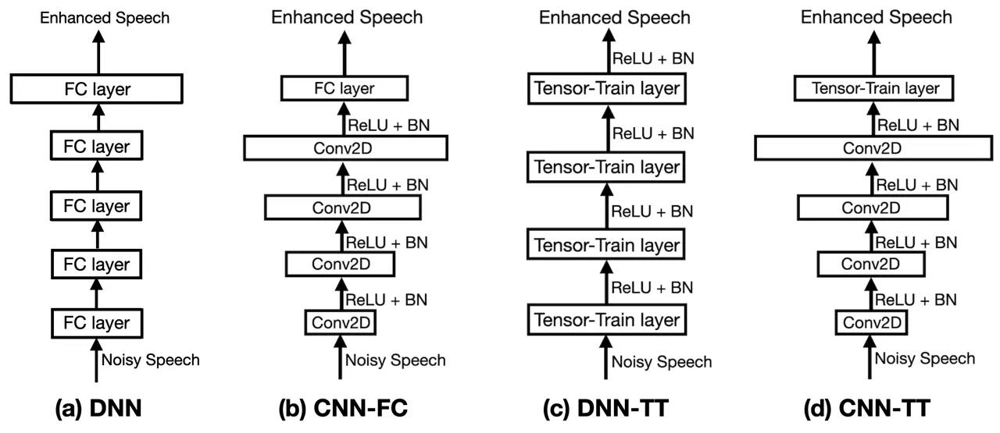
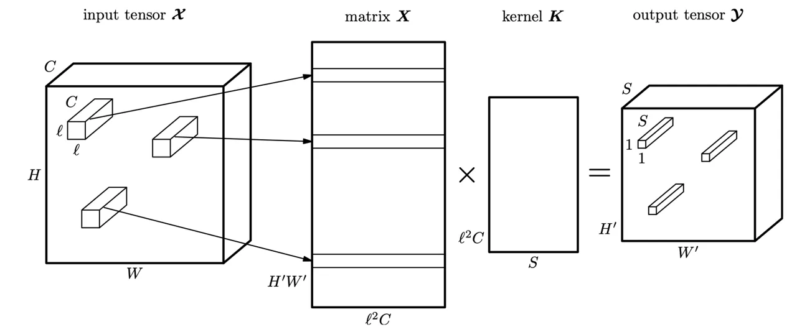
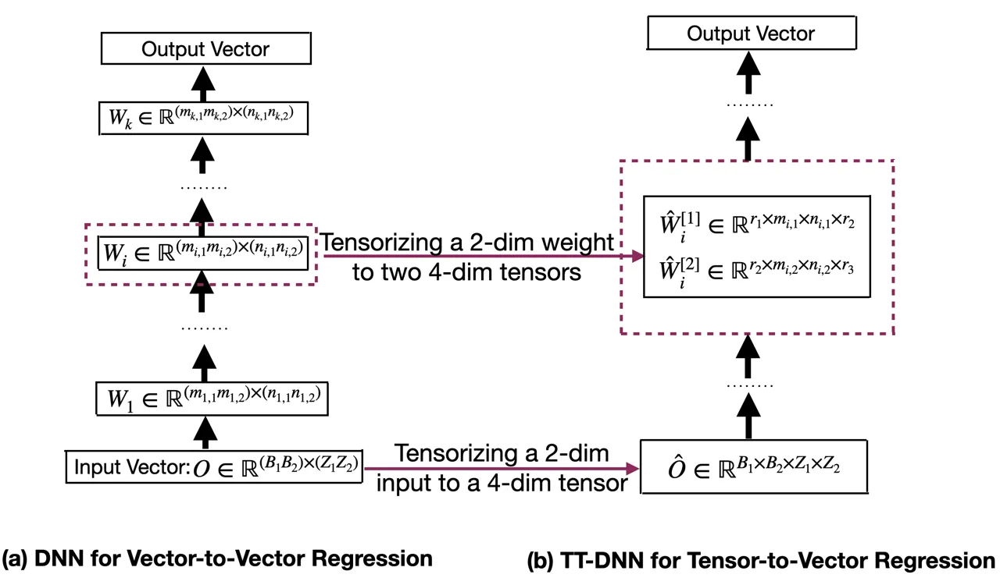

# Exploring Deep Hybrid Tensor-to-Vector Network Architectures for Regression Based Speech Enhancement

###### Abstract

This paper investigates different trade-offs between the number of model
parameters and enhanced speech qualities by employing several deep
tensor-to-vector regression models for speech enhancement. We find that
a hybrid architecture, namely CNN-TT, is capable of maintaining a good
quality performance with a reduced model parameter size. CNN-TT is
composed of several convolutional layers at the bottom for feature
extraction to improve speech quality and a tensor-train (TT) output
layer on the top to reduce model parameters. We first derive a new upper
bound on the generalization power of the convolutional neural network
(CNN) based vector-to-vector regression models. Then, we provide
experimental evidence on the Edinburgh noisy speech corpus to
demonstrate that, in single-channel speech enhancement, CNN outperforms
DNN at the expense of a small increment of model sizes. Besides, CNN-TT
slightly outperforms the CNN counterpart by utilizing only 32% of the
CNN model parameters. Besides, further performance improvement can be
attained if the number of CNN-TT parameters is increased to 44% of the
CNN model size. Finally, our experiments of multi-channel speech
enhancement on a simulated noisy WSJ0 corpus demonstrate that our
proposed hybrid CNN-TT architecture achieves better results than both
DNN and CNN models in terms of better-enhanced speech qualities and
smaller parameter sizes.

| Jun Qi¹, Hu Hu¹, Yannan Wang³, Chao-Han Huck Yang¹, Sabato Marco Siniscalchi^(1,2), Chin-Hui Lee¹ |
| ------------------------------------------------------------------------------------------------- |
| ¹Electrical and Computer Engineering, Georgia Institute of Technology, Atlanta, GA, USA           |
| ²Computer Engineering School, University of Enna, Italy                                           |
| ³Tencent Media Lab, Tencent Corporation, Shenzhen, Guangdong, China                               |

Index Terms: convolutional neural network, tensor-train network,
tensor-to-vector regression, speech enhancement

## 1 Introduction

A speech enhancement system aims at restoring the quality and
intelligibility of noisy speech. The state-of-the-art speech enhancement
systems are commonly built with deep neural network (DNN) based
vector-to-vector regression models, where inputs are context-dependent
log power spectrum (LPS) features of noisy speech and outputs correspond
to either clean or enhanced LPS features. Although deep neural network
(DNN) based speech enhancement \[1, 2\] has demonstrated the
state-of-the-art performance under a single-channel setting, it can also
be extended to scenarios of multi-channel speech enhancement with even
better-enhanced speech qualities \[3\]. The process of both single and
multi-channel speech enhancement can be taken as a DNN based
vector-to-vector regression aiming at bridging a functional relationship
$`f:\mathbb{Y}\rightarrow\mathbb{X}`$ such that the input noisy speech
$`y\in\mathbb{Y}`$ can be mapped to the corresponding clean speech
$`x\in\mathbb{X}`$. In \[1, 4\], DNNs with feed-forward fully-connected
(FC) hidden layers were proposed to attain the state-of-the-art
performance of speech enhancement on the target tasks and the related
theorems were later set up in \[5, 6, 7\]. In some follow-up studies,
recurrent neural networks (RNNs) \[8, 9\], and convolutional neural
networks (CNNs) \[10\] were further investigated to boost speech
enhancement quality \[11\]. Moreover, a deep bidirectional RNN with LSTM
gates was instead used in \[12\], and a generative adversarial network
(GAN) was attempted for speech enhancement tasks in \[13\]. In
particular, CNN is a tensor-to-vector regression model because it is
capable of dealing with 3D/4D tensorized input data. Besides, the recent
works \[10, 14\] suggest that CNN can outperform both DNN and RNN
counterparts for speech enhancement. Similarly, a tensor-to-vector
regression model can also be built by directly employing the proposed
tensor-train network (TTN) \[15\]. Besides, TT-DNN is a compact
representation for a fully-connected (FC) layers of DNN into a
tensor-train (TT) format \[16\]. In \[17\], we were the first to attempt
a tensor-train deep neural network (TT-DNN) to tackle the multi-channel
speech enhancement task and also demonstrate that the TT representation
of a DNN does not cause the quality degradation of the enhanced speech,
and it also results in a significant reduction of the model parameters.
More importantly, the quality of speech enhancement can be improved over
the DNN counterpart by allowing the TT-DNN parameters to grow.

A significant advantage of tensor-to-vector regression, such as CNN and
TT-DNN, is its compact architecture to observe stringent hardware
constraints, where computational resources are often limited. Therefore,
it is worth investigating the models in terms of the representation
power, and experimentally comparing them by considering the trade-off
between enhancement performance and the number of model parameters. On
one hand, CNN is a powerful model to learn spatial-temporal features and
extract semantically meaningful aspects in higher hidden layers. On the
other hand, TT-DNN can maintain baseline results of the corresponding
DNN by applying the TT transformation to the FC hidden layers. Hence, in
this work, we focus on a tensor-to-vector model to take advantage of
both CNN and TT-DNN. More specifically, we propose a novel hybrid
architecture, namely CNN-TT, with convolutional layers stacked at the
bottom and one TT hidden layer on the top. To highlight the advantages
of CNN-TT, we compare different deep tensor-to-vector models for speech
enhancement. The used models in this work include (a) DNN; (b) CNN; (c)
TT-DNN; (d) CNN-TT. In more detail, we first explain the fundamental
mechanisms of tensor-to-vector regression based on our theorems of DNN
based vector-to-vector regression \[5, 6, 18, 19\]. Then, we validate
our CNN-TT models in speech enhancement tasks.

Our experimental results show that in single-channel speech enhancement
on the Edinburgh noisy speech corpus \[20\], CNN outperforms the best
DNN with a small increment of parameter sizes. Moreover, our proposed
CNN-TT slightly outperforms CNN with only 32% of the CNN model size. A
further improvement can be attained if the size of the CNN-TT model is
increased up to 44% of the CNN model size. Finally, the experiments of a
multi-channel speech enhancement task on a simulated noisy WSJ0 corpus
\[21\] show the same trend that our proposed hybrid CNN-TT architecture
can be favorably compared to both DNN and CNN models to achieve
better-enhanced speech qualities and utilize much smaller model sizes.

## 2 Deep Tensor-to-vector Regression

Figure 1 shows all regression network architectures studied here: (a)
DNN, (b) CNN, (c) DNN-TT, and (d) CNN-TT.



Figure 1: Four tensor-to-vector regression models used in this study.

### 2.1 CNN Based Tensor-to-vector Regression

CNN follows a feed-forward architecture to transform a tensor input into
a vector output through a sequence of convolutional neural
layers \[22\]. The CNN based tensor-to-vector regression model has four
two-dimensional (2D) convolutional layers, each having twice the number
of channels of the previous layer. ReLU-based activation and Batch
normalization components are appended at the output of each
convolutional layer. A fully-connected (FC) layer is employed as the
last hidden layer of the neural architecture to generate the desired
enhanced speech vectors.

A typical convolutional layer transforms a 3-dimension input tensor
$`\mathcal{X}\in\mathbb{R}^{W\times H\times C}`$ into an output tensor
$`\mathcal{Y}\in\mathbb{R}^{(W-L+1)\times(H-L+1)\times S}`$ by
convolving $`\mathcal{X}`$ with a kernel tensor
$`\mathcal{K}\in\mathbb{R}^{L\times L\times C\times S}`$ as:

```math
\mathcal{Y}(x,y,s)=\sum\limits_{i=1}^{L}\sum\limits_{j=1}^{l}\sum\limits_{c=1}^{C}\mathcal{K}(i,j,c,s)\mathcal{X}(x+i-1,y+j-1,c).
```

In \[5\], we studied the representation power of DNN based
vector-to-vector regression and derived upper bounds on different DNN
architectures. That study allows us to better understand the successful
application of DNN for speech enhancement tasks observed in \[23\]. To
extend the theorems proposed in \[5\] to CNNs, we need to obtain a
matrix representation for both input and kernel of the CNN. Thus, we
introduce a matrix X of size $`W^{\prime}H^{\prime}\times L^{2}C`$, in
which the $`k`$-th row corresponds to the $`L\times L\times C`$ patch of
the input tensor that is used to compute the $`k`$-th row of the matrix
Y:

```math
\begin{split}&\hskip 11.38109pt\mathcal{X}(x+i-1,y+j-1,c)\\
&=\textbf{X}(x+W^{\prime}(y-1),i+L(j-1)+L^{2}(c-1)),\end{split}
```

where $`y=1,...,H^{\prime}`$, $`x=1,...,W^{\prime},i,j=1,...,L`$.

The kernel tensor $`\mathcal{K}`$ can be reshaped into a matrix K of the
size $`l^{2}C\times S`$ as follows:

```math
\mathcal{K}(i,j,c,s)=\textbf{K}(i+L(j-1)+L^{2}(c-1),s).
```

Finally, a convolutional layer can be rewritten in a matrix format as
$`\textbf{Y}=\textbf{X}\textbf{K}`$, and the process is illustrated as
Figure 2.



Figure 2: Convolution as a matrix-by-matrix multiplication.

We are now ready to link CNNs with our theorems for DNN-based
vector-to-vector regression in \[5\]. Let
$`\hat{f}:\mathbb{R}^{d}\rightarrow\mathbb{R}^{q}`$ refer to a
vector-to-vector smooth function, we can find a deep CNN $`f_{CNN}`$
with $`B`$ layers with ReLU activations such that Eq. (1) is satisfied,

```math
\begin{split}||\hat{f}-f_{CNN}||_{2}&\leq||\hat{f}-f_{CNN}||_{1}\\
&=\mathcal{O}\left(\frac{q}{(L_{B}^{2}C_{B}+B-1)^{\frac{1}{d}}}\right),\end{split} \tag{1}
```

where $`C_{B}`$ and $`L_{B}`$ denote the numbers of channel and width of
the $`B`$-th CNN layer.

### 2.2 DNN-TT Based Tensor-to-vector Regression

A DNN-TT based tensor-to-vector regression model relies on the TT
decomposition, which is described as follows: For a set of integer ranks
$`\textbf{r}=\{r_{1},r_{2},...,r_{K+1}\}`$, the TT decomposition
factorizes a tensor
$`\mathcal{W}\in\mathbb{R}^{(m_{1}n_{1})\times(m_{2}n_{2})\times\cdot\cdot\cdot\times(m_{K}n_{K})}`$,
$`\forall i\in\{1,...,K\},m_{i}\in\mathbb{R}^{+},n_{i}\in\mathbb{R}^{+}`$
into a multiplication of core tensors as:

```math
\mathcal{W}((i_{1},j_{1}),(i_{2},j_{2}),...,(i_{K},j_{K}))=\prod\limits_{k=1}^{K}\mathcal{C}^{[k]}(r_{k},i_{k},j_{k},r_{k+1}). \tag{2}
```

where for the given ranks $`r_{k}`$ and $`r_{k+1}`$, the $`k`$-th core
tensor
$`\mathcal{C}^{[k]}(r_{k},i_{k},j_{k},r_{k+1})\in\mathbb{R}^{m_{k}\times n_{k}}`$
in which $`i_{k}\in\{1,2,...,m_{K}\}`$ and
$`j_{k}\in\{1,2,...,n_{k}\}`$. Besides, $`r_{1}`$ and $`r_{K+1}`$ are
fixed to $`1`$. Since DNN-TT only stores the low-rank core tensors
$`\{\mathcal{C}_{k}\}_{k=1}^{K}`$ of the size
$`\sum_{k=1}^{K}m_{k}n_{k}r_{k}r_{k+1}`$, which is much less than the
size $`\prod_{k=1}^{K}m_{k}n_{k}`$ for the corresponding DNN.

Figure 3 shows the relationship between a traditional hidden layer of a
DNN and a tensor layer of a DNN-TT. The matrix associated with a DNN
hidden layer corresponds to two matrices given the ranks, and the DNN
input vector is reshaped into a higher-order input tensor. We have shown
that the TT decomposition can keep the representation power of DNN
\[17\]. In \[17\], we have also demonstrated that for a tensor-to-vector
function
$`\mathcal{\hat{T}}^{*}:\mathbb{R}^{J_{1}\times J_{2}\times\cdot\cdot\cdot\times J_{K}}\rightarrow\mathbb{R}^{I_{1}\cdot I_{2}\cdot\cdot\cdot I_{K}}`$,
there is a DNN-TT $`\mathcal{T}`$ with $`k`$ hidden tensor layers, such
that Eq. (3) is satisfied.

```math
\begin{split}||\mathcal{\hat{T}}-\mathcal{T}||_{2}&\leq||\mathcal{\hat{T}}-\mathcal{T}||_{1}\\
&=\mathcal{O}\left(\prod\limits_{k=1}^{K}\frac{I_{k}}{{(r_{k-1}r_{l}n_{k,B}}+B-1)^{\frac{1}{r_{k}r_{k-1}J_{k}}}}\right),\end{split} \tag{3}
```

where $`n_{k,B}`$ is the width of $`B^{th}`$ hidden layer for the
$`k`$-th core tensor. The Eq. (3) suggests that DNN-TT can maintain the
representation power of the corresponding DNN.



Figure 3: A conversion from a DNN to a DNN-TT.

### 2.3 CNN-TT Based Tensor-to-vector Regression

Figure 1(c) displays a hybrid tensor-to-vector regression model having
both convolutional and tensor-train layers. A key benefit of this hybrid
tensorized model is that the number of model parameters of the original
FC layer is significantly reduced with one TTN. Moreover, we can expect
that the representation power of input salient features can be preserved
because of the convolutional blocks in the lower layers.

The representation power of CNN-TT combines the characteristics of both
CNN and TT-DNN, and Eq. (4) demonstrates an upper bound on the
performance of CNN-TT based on tensor-to-vector regression. The
derivation of the upper bound is based on the combination of Eqs. (2)
and (3)  \[17\].

```math
\begin{split}||\mathcal{\hat{T}}-\mathcal{T}||_{2}&\leq||\mathcal{\hat{T}}-\mathcal{T}||_{1}\\
&=\mathcal{O}\left(\prod\limits_{k=1}^{K}\frac{I_{k}}{{(r_{k-1}r_{l}c_{k,B}}+B-1)^{\frac{1}{r_{k}r_{k-1}J_{k}}}}\right).\end{split} \tag{4}
```

where $`\prod_{k=1}^{K}c_{k,B}=L_{B}C_{B}`$ and other notations are the
same as Eqs. (2) and  (3).

## 3 Experiments and Result Analysis

### 3.1 Data Preparation

The proposed architectures were evaluated on two different speech
databases. One is based on the Edinburgh noisy speech database \[20\],
where clean utterances were recorded from $`56`$ speakers including
$`28`$ males and $`28`$ females from different accent regions both
Scotland and the United States. Clean data were randomly split into
$`23075`$ training and $`824`$ test waveforms, respectively. The noisy
training speech materials, at four SNR levels: 15dB, 10dB, 5dB, and 0dB,
were created from corrupting clean waveforms with the following noises:
a domestic noise (inside a kitchen), and office noise (in a meeting
room), three public space noises (cafeteria, restaurant, subway
station), two transportation noises (car and metro), and a street noise
(busy traffic intersection). In total, there were $`40`$ different noisy
backgrounds for synthesizing the noisy training data (ten noises
$`\times`$ four SNRs). As for the noisy test set, noise types included:
a domestic noise (living room), an office noise (office space), one
transport (bus), and two street noises (open area cafeteria and a public
square). SNR values were: 17.5dB, 12.5dB, 7.5dB, and 2.5dB. Therefore,
there were $`20`$ different noisy backgrounds for synthesizing the test
data.

The second one is a synthesized database with 30-hour simulated
materials obtained from the clean WSJ0 corpus \[21\] with
OSU-$`100`$-noise dataset \[24\], which allows us to obtain $`30`$ hours
of training waveforms and $`5`$ hours of test ones. To simulate the
noisy data, each waveform was corrupted with one kind of background
noise from the noise set. The target and additional interfering speech
with their corresponding RIRs were convolved to generate the final noisy
waveform. In doing so, the dataset contained additive noise, interfering
speakers, and reverberation.

Before we set up the training and testing sets, an improved image-source
method (ISM) \[25\] was used to generate RIRs of reverberation time
(RT$`60`$) (from $`0.2s`$ to $`0.3s`$) and the corresponding direct path
response for each microphone channel. For both training and test
datasets, the setting of RIRs was fixed to the same conditions, such as
the room size, RT$`60`$, and all of the distances and directions.
Additional detail about the data simulation procedure can be found in
\[3, 17\].

### 3.2 Experimental Setup

In all experiments, we use $`257`$-dimensional normalized log-power
spectral (LPS) feature vectors as inputs. LPS features were generated by
computing $`512`$ points Fourier transform on a speech segment of $`32`$
milliseconds. For each input frame, $`M`$ neighboring adjacent frames
were concatenated together, which results in a total
$`257\times(2M+1)\times B`$ dimensional feature, where $`B`$ is the
channel number of the input signal. As for the setup of TT-DNN, we
ignored the first dimension of the input LPS features because it
corresponded to the direct-current component. After the regression, the
first dimension of input was concatenated back to the
$`256`$-dimensional output without any change. The clean speech features
were assigned to the top layers of tensor-to-vector regression models as
the reference during the training stage.

The DNN based regression model was adopted as a baseline model. On the
Edinburgh data set, the DNN model consisted of $`4`$ hidden layers with
hidden dimensions configured to $`1024`$, $`1024`$, $`1024`$, $`2048`$,
respectively. As for the WSJ0 simulated data set, we set up a $`6`$
layer DNN model with a hidden dimension of $`2048`$. Moreover, the CNN
models kept similar deep tensor-to-vector structures in all experiments
and were composed of four convolutional layers with gradually increasing
the number of channels according to the setup of
$`32`$-$`64`$-$`128`$-$`128`$. Moreover, the ReLU activation function
and batch normalization were also utilized for each convolutional layer,
and two FC layers with $`2048`$ neurons were stacked on the top layer to
generate output vectors. Besides, we used different kernel sizes on the
two datasets to obtain two slightly different model sizes. Moreover, to
improve the subjective perception in the speech enhancement tasks, the
global variance equalization was applied to alleviate the problem of
over-smoothing by correcting a global variance between estimated
features and clean reference targets, and a technique of noise-aware
training (NAT) was also employed to enable non-stationary awareness.
Besides, the mean square error (MSE) loss was applied, which corresponds
to the upper bounds of $`L_{2}`$ norm in Eqs. (1), (3), and (4). Adam
optimizer \[26\] with an initial learning rate of $`0.002`$ was utilized
during the training process, and the back-propagation (BP) algorithm was
used to update the model parameters. The size of the context window at
the input layer is set to $`1`$ for DNN in Edinburgh data, $`5`$ for DNN
in WSJ0 simulated data, and $`8`$ for all CNN models. The perceptual
evaluation of speech quality (PESQ) \[27\], was employed in our
experimental validation.

### 3.3 Single-channel Speech Enhancement Experiments

Table 1 shows our experimental results on the Edinburgh noisy speech
data set. Tensor-to-vector regression based on CNN can outperform the
DNN baseline results in terms of a higher PESQ score ($`3.03`$ vs.
$`2.82`$). DNN-TT with much fewer parameters ($`0.55`$M vs. $`5.51`$M)
can maintain the same experimental performance of DNN, where the TT
transformation was applied to the fully-connected layers. More
importantly, compared with the combined convolutional and TT layers, the
proposed CNN-TT can attain the highest PESQ score. If we allow the size
of the CNN-TT model to increase up to 5.05M, a better speech enhancement
quality can be attained with a PESQ score of 3.13.

| Model        | Parameters \# | PESQ |
| ------------ | ------------- | ---- |
| DNN          | 5.5M          | 2.82 |
| CNN          | 9.1M          | 3.04 |
| DNN-TT       | 0.55M         | 2.81 |
| CNN-TT       | 0.73M         | 3.02 |
| CNN-TT       | 2.9M          | 3.09 |
| CNN-TT       | 5.1M          | 3.13 |
| CNN-Tucker-3 | 8.9M          | 2.89 |

Table 1: PESQ comparisons of single-channel deep speech enhancement
models on the Edinburgh noisy speech database. The average PESQ score
for unprocessed noisy speech is $`1.97`$.

### 3.4 Multi-channel Speech Enhancement Experiments

The evaluation results on the 30-hour WSJ0 simulated multi-channel data
are shown in Table 2. The experimental results of both DNN and DNN-TT
are in line with the results as shown in \[17\]. The usage of the DNN-TT
model can significantly reduce the number of parameters without
degrading the performance. Moreover, the CNN based tensor-to-vector
regression model outperforms the DNN based one. Thus, CNN takes
advantage of parameter reduction and the improvement of enhanced speech
quality over DNN. In more detail, as for the single-channel case, CNN-TT
attains a PESQ 3.04 using 2.8M parameters which correspond to CNN which
attains the same PESQ score at 3.03 but costs more than 9.4M parameters.
If the number of parameters is reduced to as small as 1.6M, the PESQ
score is decreased to $`2.99`$. For our two-channel experiments, the CNN
baseline has the same parameter numbers with a single channel one
because the convolutional layer can be properly adapted to the
multi-channel inputs. However, if the two fully connected layers in the
CNN-based architecture with tensor-train layers, the model parameters
can be significantly reduced from 9.4M to 2.8M without degrading the
system performance in terms of the PESQ scores (3.13 vs. 3.11).

| Model        | Channel \# | Parameter \# | PESQ |
| ------------ | ---------- | ------------ | ---- |
| DNN          | 1          | 27M          | 2.86 |
| DNN          | 2          | 33M          | 3.00 |
| CNN          | 1          | 9.4M         | 3.03 |
| CNN          | 2          | 9.4M         | 3.11 |
| CNN-TT       | 1          | 1.6M         | 2.99 |
| CNN-TT       | 1          | 2.8M         | 3.04 |
| CNN-TT       | 2          | 1.6M         | 3.08 |
| CNN-TT       | 2          | 2.8M         | 3.13 |
| CNN-Tucker-3 | 1          | 9.2M         | 2.63 |
| CNN-Tucker-3 | 2          | 9.2M         | 2.56 |

Table 2: PESQ comparisons of different deep models for multi-channel
speech enhancement on the WSJ0 corpus. The average PESQ score for
unprocessed ch-1 noisy speech is 2.02.

### 3.5 Experimental Comparison with Tucker Decomposition

Tucker decomposition \[28\] is a higher-order extension to the singular
value decomposition obtained by computing the orthonormal spaces
associated with the different modes of a tensor. It is also meaningful
to verify whether tucker decomposition applied to each CNN convolutional
layer can lead to the same parameter reduction with a small drop in the
PESQ value. We refer to this Tucker-reduced CNN as CNN-Tucker.
Particularly, CNN-Tucker-3 means that we apply Tucker decomposition to
the first three CNN hidden layers except the top one. The related
results by using CNN-Tucker-3 in Tables 1 and 2 demonstrate that
high-order singular value decomposition is not sufficient to obtain a
smaller size deep tensor-to-vector regression model without sacrificing
the speech quality.

## 4 Conclusion

We compare several tensor-to-vector regression models for speech
enhancement. These models include CNN, DNN-TT, and the hybrid models
composed of convolutional and TT layers, namely CNN-TT. We first discuss
the representation power by linking tensor-to-vector regression to our
earlier theories on DNN based vector-to-vector regression. Next, we
evaluate these models for single-channel speech enhancement on the
Edinburgh noisy speech database. Finally, we conduct multi-channel
speech enhancement on a synthesized WSJ noisy corpus. Our experimental
results suggest that CNN can outperform both DNN-TT and DNN with smaller
regression errors and higher PESQ scores. Moreover, when the
fully-connected output layer of CNN is replaced with a TT layer to
generate a hybrid regression network, we achieve even better
performances by gradually increasing the model size of the TT layer. In
future work, we will investigate different tensor representations to
reduce the parameters of the hidden convolutional layers.

## References

- \[1\] Y. Xu, J. Du, L.-R. Dai, and C.-H. Lee, “A regression approach
  to speech enhancement based on deep neural networks,” _IEEE/ACM
  Transactions on Audio, Speech and Language Processing (TASLP)_,
  vol. 23, no. 1, pp. 7–19, 2015.
- \[2\] D. Wang and J. Chen, “Supervised speech separation based on deep
  learning: An overview,” _IEEE/ACM Transactions on Audio, Speech, and
  Language Processing_, vol. 26, no. 10, pp. 1702–1726, 2018.
- \[3\] Q. Wang, S. Wang, F. Ge, C. W. Han, J. Lee, L. Guo, and C.-H.
  Lee, “Two-stage enhancement of noisy and reverberant microphone array
  speech for automatic speech recognition systems trained with only
  clean speech,” in _ISCSLP_, 2018, pp. 21–25.
- \[4\] C. Yu, K.-H. Hung, S.-S. Wang, Y. Tsao, and J.-w. Hung,
  “Time-domain multi-modal bone/air conducted speech enhancement,” _IEEE
  Signal Processing Letters_, 2020.
- \[5\] J. Qi, J. Du, S. M. Siniscalchi, and C.-H. Lee, “A theory on
  deep neural network based vector-to-vector regression with an
  illustration of its expressive power in speech enhancement,” _IEEE/ACM
  Transactions on Audio, Speech, and Language Processing (TASLP)_,
  vol. 27, no. 12, pp. 1932–1943, 2019.
- \[6\] J. Qi, J. Du, S. M. Siniscalchi, X. Ma, and C.-H. Lee,
  “Analyzing upper bounds on mean absolute errors for deep neural
  network based vector-to-vector regression,” _IEEE Transactions on
  Signal Processing (TSP)_, vol. 68, pp. 3411–3422, 2020.
- \[7\] J. Qi, J. Du, M. S. Siniscalchi, X. Ma, and C.-H. Lee, “On mean
  absolute error for deep neural network based vector-to-vector
  regression,” _accepted to IEEE Signal Processing Letters (SPL)_, 2020.
- \[8\] F. Weninger, H. Erdogan, S. Watanabe, E. Vincent, J. Le Roux,
  J. R. Hershey, and B. Schuller, “Speech enhancement with LSTM
  recurrent neural networks and its application to noise-robust ASR,” in
  _International Conference on Latent Variable Analysis and Signal
  Separation_. Springer, 2015, pp. 91–99.
- \[9\] H. Zhao, S. Zarar, I. Tashev, and C.-H. Lee,
  “Convolutional-recurrent neural networks for speech enhancement,” in
  _ICASSP_, 2018, pp. 2401–2405.
- \[10\] S. R. Park and J. Lee, “A fully convolutional neural network
  for speech enhancement,” _arXiv preprint arXiv:1609.07132_, 2016.
- \[11\] C.-H. Yang, J. Qi, P.-Y. Chen, X. Ma, and C.-H. Lee,
  “Characterizing speech adversarial examples using self-attention u-net
  enhancement,” in _ICASSP 2020-2020 IEEE International Conference on
  Acoustics, Speech and Signal Processing (ICASSP)_, 2020, pp.
  3107–3111.
- \[12\] L. Sun, S. Kang, K. Li, and H. Meng, “Voice conversion using
  deep bidirectional long short-term memory based recurrent neural
  networks,” in _ICASSP_, 2015, pp. 4869–4873.
- \[13\] S. Pascual, A. Bonafonte, and J. Serra, “Segan: Speech
  enhancement generative adversarial network,” _arXiv preprint
  arXiv:1703.09452_, 2017.
- \[14\] T. Kounovsky and J. Malek, “Single channel speech enhancement
  using convolutional neural network,” in _2017 IEEE International
  Workshop of Electronics, Control, Measurement, Signals and their
  Application to Mechatronics (ECMSM)_, 2017, pp. 1–5.
- \[15\] A. Novikov, D. Podoprikhin, A. Osokin, and D. P. Vetrov,
  “Tensorizing neural networks,” in _Advances in Neural Information
  Processing Systems_, 2015, pp. 442–450.
- \[16\] I. V. Oseledets, “Tensor-train decomposition,” _SIAM Journal on
  Scientific Computing_, vol. 33, no. 5, pp. 2295–2317, 2011.
- \[17\] J. Qi, H. Hu, Y. Wang, C. H. Yang, S. M. Siniscalchi, and C.-H.
  Lee, “Tensor-to-vector regression for multi-channel speech enhancement
  based on tensor-train network,” in _Proc. IEEE International
  Conference on Acoustics, Speech, and Signal Processing (ICASSP)_,
  2020, pp. 7504–7508.
- \[18\] J. Qi, X. Ma, S. M. Siniscalchi, and C.-H. Lee, “Upper bounding
  mean absolute errors for deep tensor regression based on tensor-train
  neworks,” _submitted to IEEE Transactions on Signal Processing (TSP)_.
- \[19\] J. Qi, X. Ma, C.-H. Lee, J. Du, and S. M. Siniscalchi,
  “Performance analysis for tensor-train decomposition to deep neural
  network based vector-to-vector regression,” in _54th Annual Conference
  on Information Sciences and Systems (CISS)_, 2020, pp. 1–6.
- \[20\] C. Valentini-Botinhao, X. Wang, S. Takaki, and J. Yamagishi,
  “Investigating rnn-based speech enhancement methods for noise-robust
  text-to-speech.” in _SSW_, 2016, pp. 146–152.
- \[21\] D. B. Paul and J. M. Baker, “The design for the wall street
  journal-based CSR corpus,” in _Proc. Workshop on Speech and Natural
  Language_, Banff, Canada, Oct. 1992, pp. 899–902.
- \[22\] T. Garipov, D. Podoprikhin, A. Novikov, and D. Vetrov,
  “Ultimate tensorization: compressing convolutional and FC layers
  alike,” _arXiv preprint arXiv:1611.03214_, 2016.
- \[23\] Y. Xu, J. Du, L.-R. Dai, and C.-H. Lee, “An experimental study
  on speech enhancement based on deep neural networks,” _IEEE Signal
  Processing Letters_, vol. 21, no. 1, pp. 65–68, 2013.
- \[24\] G. Hu and D. Wang, “A tandem algorithm for pitch estimation and
  voiced speech segregation,” _IEEE Transactions on Audio, Speech, and
  Language Processing_, vol. 18, no. 8, pp. 2067–2079, 2010.
- \[25\] E. A. Lehmann and A. M. Johansson, “Prediction of energy decay
  in room impulse responses simulated with an image-source model,” _The
  Journal of the Acoustical Society of America_, vol. 124, no. 1, pp.
  269–277, 2008.
- \[26\] D. P. Kingma and J. L. Ba, “Adam: A method for stochastic
  optimization,” _arXiv preprint arXiv:1412.6980_, 2014.
- \[27\] A. W. Rix, J. G. Beerends, M. P. Hollier, and A. P. Hekstra,
  “Perceptual evaluation of speech quality (PESQ)-a new method for
  speech quality assessment of telephone networks and codecs,” in _IEEE
  International Conference on Acoustics, Speech, and Signal Processing.
  Proceedings_, vol. 2, 2001, pp. 749–752.
- \[28\] Y.-D. Kim and S. Choi, “Nonnegative tucker decomposition,” in
  _2007 IEEE Conference on Computer Vision and Pattern Recognition_,
  2007, pp. 1–8.
