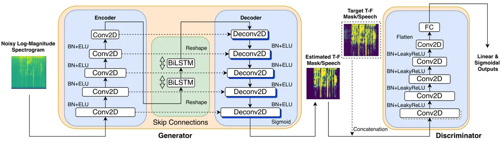

# On Loss Functions and Recurrency Training for GAN-based Speech Enhancement Systems

Part of the work was done while Z. Zhang was an intern at Didi AI Labs,
Beijing, China

###### Abstract

Recent work has shown that it is feasible to use generative adversarial
networks (GANs) for speech enhancement, however, these approaches have
not been compared to state-of-the-art (SOTA) non GAN-based approaches.
Additionally, many loss functions have been proposed for GAN-based
approaches, but they have not been adequately compared. In this study,
we propose novel convolutional recurrent GAN (CRGAN) architectures for
speech enhancement. Multiple loss functions are adopted to enable direct
comparisons to other GAN-based systems. The benefits of including
recurrent layers are also explored. Our results show that the proposed
CRGAN model outperforms the SOTA GAN-based models using the same loss
functions and it outperforms other non-GAN based systems, indicating the
benefits of using a GAN for speech enhancement. Overall, the CRGAN model
that combines an objective metric loss function with the mean squared
error (MSE) provides the best performance over comparison approaches
across many evaluation metrics.

Zhuohuang Zhang^(1,2) , Chengyun Deng³, Yi Shen¹, Donald S.
Williamson²,  
Yongtao Sha³, Yi Zhang³, Hui Song³, Xiangang Li³

¹ Department of Speech, Language and Hearing Sciences, Indiana
University, USA  
² Department of Computer Science, Indiana University, USA  
³ Didi Chuxing, Beijing, China

zhuozhan@iu.edu, $`\{`$shen2, williads$`\}`$@indiana.edu,  
$`\{`$dengchengyun, shayongtao, zhangyi, songhui,
lixiangang$`\}`$@didiglobal.com

Index Terms: speech enhancement, generative adversarial networks,
convolutional recurrent neural network

## 1 Introduction

Speech enhancement can be used in many communication systems, e.g., as
front-ends for speech recognition systems \[1, 2, 3\] or hearing aids
\[4, 5, 6\]. Many speech enhancement algorithms estimate a
time-frequency (T-F) mask that is applied to a noisy speech signal for
enhancement (e.g., ideal ratio mask \[7, 8\], complex ideal ratio mask
\[9, 10\]). Both deep neural network (DNN) and recurrent neural network
(RNN) structures have been utilized to estimate T-F masks. Recent RNN
approaches, such as long short-term memory (LSTM) \[11\] and
bidirectional LSTM (BiLSTM) \[12\] networks, have demonstrated superior
performance over DNN-based approaches \[5\], due to their ability to
better capture the long-term temporal dependencies of speech.

More recently, generative adversarial networks (GANs) have been
investigated for speech enhancement. A number of GAN-based speech
enhancement algorithms have been proposed, including end-to-end
approaches that directly map a noisy speech signal to an enhanced speech
signal in the time domain \[13, 14\]. Other GAN-based speech enhancement
algorithms operate in the T-F domain \[15, 16\] by estimating a T-F
mask. Current GAN-based end-to-end systems solely use convolutional
layers that have skip connections \[13, 14\], and those implemented in
the T-F domain either use only fully connected layers \[15\] or a
combination of recurrent and fully connected layers \[16\].
Convolutional and fully-connected architectures cannot leverage
long-term temporal information due to the small kernal size and
individual frame-level predictions, which is crucial for speech. On the
other hand, recurrent-only layers do not fully explore the local
correlations along the frequency axis \[17\]. Additionally, existing
GAN-based methods adopt different loss functions while using different
network architectures, so it is not clear what is the best performing
loss function for training such a system.

In this paper, we incorporate a convolutional recurrent network (CRN)
\[18\] into a GAN-based speech enhancement system, which has not been
previously done. This convolutional recurrent GAN (CRGAN) exploits the
advantages of both convolutional neural networks (CNNs) and RNNs, where
a CNN can utilize the local correlations in the T-F domain \[19\], and a
RNN can capture long-term time-dependent information. We further extend
the “memory direction” of the original CRN structure in \[18\] by
replacing the LSTM layers with BiLSTM layers \[20\]. We compare the
performance of our CRGAN-based models with several recently proposed
loss functions \[13, 14, 15, 16\], to determine the best performing loss
function for GANs. The influence of an adversarial training scheme is
also investigated by comparing the proposed CRGANs with a non-GAN based
CRN. Furthermore, results from previous studies revealed only a small
amount of improvement over some legacy approaches (i.e., Wiener
filtering, DNN-based method) when they are evaluated by objective
metrics \[13, 14, 15\]. To better understand the benefits of GAN-based
training, we additionally compare our model with recent state-of-the-art
(SOTA) non GAN-based speech enhancement approaches.

The rest of the paper is organized as follows. Section 2 provides
background information on speech enhancement using GANs. In Section 3
and 4, we describe the proposed framework and loss functions of our
CRGAN model. The experimental setup is presented in Section 5 and
results are provided in Section 6. Finally, conclusions are drawn in
Section 7.

## 2 Speech Enhancement Using GANs

GANs have gained much attention as an emerging deep learning
architecture \[21\]. Unlike conventional deep-learning systems, they
consist of two networks, a generator ($`G`$) and a discriminator
($`D`$). This forms a minimax game scenario, where $`G`$ generates fake
data to fool $`D`$, and $`D`$ discriminates between real

Figure 1: Training procedure for GANs. Discriminator $`D`$ and Generator
$`G`$ are trained alternately. $`x`$ denotes the noisy log-magnitude
spectrogram, $`y`$ represents the target (oracle) T-F mask and
$`\widehat{y}`$ is the estimated T-F mask generated by $`G`$.

and fake data. $`D`$’s output reflects the probability of the input
being real or fake and $`G`$ learns to map samples $`x`$ from prior
distribution $`\mathcal{X}`$ to samples $`y`$ from distribution
$`\mathcal{Y}`$.

A speech enhancement system operating in the T-F domain usually takes
the magnitude spectrogram of noisy speech as the input, predicts a
target T-F mask, and resynthesizes an audio signal from the enhanced
spectrogram. Let $`\mathcal{X}`$ denote the distribution of noisy
log-magnitude spectrograms $`x`$ and let $`\mathcal{Y}`$ represent the
distribution of target masks $`y`$. During adversarial training, $`G`$
will learn a mapping from $`\mathcal{X}`$ to $`\mathcal{Y}`$. A
depiction of the GAN-based training procedure is shown in Figure. 1. The
discriminator $`D`$ and generator $`G`$ are trained alternately. In the
first step of the iteration, $`D`$ updates its weights given the target
(oracle) T-F mask $`y`$ that is labeled as real. Then in the second
step, $`D`$ updates its weights again using predicted T-F mask
$`\widehat{y}`$ generated by $`G`$, which is labeled as fake. Eventually
in the ideal situation, given the log-magnitude noisy spectrogram as
input, $`G`$ should be able to generate an estimated T-F mask that can
fool $`D`$ (i.e., $`D(G(x))=\text{`real'}`$). Note that while $`D`$ is
being trained, the weights in $`G`$ remain frozen, and vice versa.

## 3 Convolutional Recurrent GAN

The network structure for the proposed CRGAN is depicted in Figure. 2,
where $`G`$ has an encoder-decoder structure that takes the noisy
log-magnitude spectrogram as the input and estimates a T-F mask. In the
encoder, we deploy five 2-D convolutional layers to extract the local
correlations of the speech signal. The encoded feature is then passed to
a reshape layer, which is followed by two BiLSTM layers in the middle of
the $`G`$ network. The recurrent layers capture long-term temporal
information. The decoder is simply a reversed version of the encoder,
which comprises five deconvolutional (i.e., transposed convolution)
layers. We apply batch normalization (BN) \[22\] after each
convolutional/deconvolutional layer. Exponential linear units (ELU)
\[23\] are used as the activation function in the hidden layers, while
we apply a sigmoid activation function in the output layer to estimate
the T-F mask. Moreover, the $`G`$ network incorporates skip connections,
which pass fine-grained spectrogram information to the decoder. The skip
connection concatenates the output of each convolutional-encoding layer
with the input of the corresponding deconvolutional-decoding layer. The
network is deterministic, where the output is solely dependent on the
input.

$`D`$ has a similar structure as $`G`$’s encoder, except that we adopt
leaky ReLU activation functions after the convolutional layers and there
is a flattening layer after the fifth convolutional layer, which is then
followed by a single-unit fully connected (FC) layer. Here $`D`$ gives
two types of outputs, $`D(y)`$ or $`D_{l}(y)`$, where $`D(y)`$ indicates
the sigmoidal output and $`D_{l}(y)`$ denotes the linear output such
that $`\sigma(D_{l}(y))=D(y)`$ with $`\sigma`$ being the sigmoid
non-linearity. These two forms of $`D`$’s output are needed for the loss
functions that are used to train the network.



Figure 2: CRGAN structure. The generator estimates a T-F mask. The
arrows between layers represent skip connections. The target T-F mask
and estimated mask are provided as inputs to the discriminator for all
proposed models except W-CRGAN.

## 4 Loss Functions

Existing GAN-based speech enhancement algorithms utilize different loss
functions to stabilize training and improve performance. These loss
functions have different benefits, but the best performing loss function
is unknown. We further investigate three different loss functions within
our CRGAN model to answer this question. Below, we describe three loss
functions that are implemented in our model, including Wasserstein loss
\[24\], relativistic loss \[25\], and a metric-based loss \[16\].

### 4.1 Wasserstein Loss

The Wasserstein loss function improves the stability and robustness of a
GAN model \[24\]. It is formulated as

```math
\displaystyle\mathcal{L}_{D} \displaystyle=-\mathbb{E}_{y\sim\mathcal{Y}}[D_{l}(y)]+\mathbb{E}_{x\sim\mathcal{X}}[D_{l}(G(x))] \tag{1}
```

```math
\displaystyle\mathcal{L}_{G} \displaystyle=-\mathbb{E}_{x\sim\mathcal{X}}[D_{l}(G(x))],
```

where $`\mathcal{L}_{D}`$ and $`\mathcal{L}_{G}`$ are the Wasserstein
losses for the discriminator and generator, respectively.
$`\mathcal{L}_{D}`$ maximizes the expectation of classifying the true
mask as real and it minimizes the expectation of classifying a fake mask
as a true one. $`\mathcal{L}_{G}`$ maximizes the expectation of
generating a fake mask that seems real. A gradient-penalty (GP) term is
included in $`D`$’s loss, since it prevents exploding and vanishing
gradients \[26\]:

```math
\mathcal{L}_{GP}=\underset{\tilde{y}\sim\tilde{\mathcal{Y}}}{\mathbb{E}}\left[\left(\left\|\nabla_{\tilde{y}}D_{l}(\tilde{y})\right\|_{2}-1\right)^{2}\right], \tag{2}
```

where $`\nabla_{\tilde{y}}D_{l}(\tilde{y})`$ is the gradient on $`D`$’s
linear output, $`\tilde{y}=\epsilon y+(1-\epsilon)\hat{y}`$,
$`\epsilon`$ is sampled from a uniform distribution from 0 to 1,
$`\hat{y}`$ denotes the generated mask from $`G`$, and
$`\tilde{\mathcal{Y}}`$ stands for the distribution of $`\tilde{y}`$. A
$`L1`$ loss term (i.e., $`||\hat{y}_{t,f}-y_{t,f}||`$) is added to $`G`$
to improve performance as reported in \[14\], where $`\{t,f\}`$
represent the time-frequency (T-F) point of the T-F mask, $`y`$. Thus,
the discriminator loss becomes
$`\mathcal{L}_{D}+\lambda_{GP}*\mathcal{L}_{GP}`$ and the generator loss
is $`\mathcal{L}_{G}+\lambda_{L1}*L1`$. $`\lambda_{GP}`$ and
$`\lambda_{L1}`$ serve as hyperparameters that control the weights of GP
and L1 losses. We use W-CRGAN to denote this model.

### 4.2 Relativistic Loss

A relativistic loss function is adopted in \[14\], since it considers
the probabilities of real data being real and fake data being real,
which is an important relationship that is not considered by
conventional GANs. The discriminator and generator are made relativistic
by taking the difference between the output of $`D`$ given fake and real
inputs \[25\]:

```math
\displaystyle\mathcal{L}_{D} \displaystyle=-\mathbb{E}_{(x,y)\sim(\mathcal{X},\mathcal{Y})}[\log(\sigma(D_{l}(y)-D_{l}(G(x))))] \tag{3}
```

```math
\displaystyle\mathcal{L}_{G} \displaystyle=-\mathbb{E}_{(x,y)\sim(\mathcal{X},\mathcal{Y})}[\log(\sigma(D_{l}(G(x))-D_{l}(y)))].
```

This loss, however, has high variance as $`G`$ influences $`D`$, which
makes the training process unstable \[14\]. Alternatively, the
relativistic average loss can be formulated as \[25\]:

```math
\displaystyle\mathcal{L}_{D} \displaystyle=-\mathbb{E}_{y\sim\mathcal{Y}}[\log(\overline{D}_{y})]-\mathbb{E}_{x\sim\mathcal{X}}[\log(1-\overline{D}_{G(x)})] \tag{4}
```

```math
\displaystyle\mathcal{L}_{G} \displaystyle=-\mathbb{E}_{x\sim\mathcal{X}}[\log(\overline{D}_{G(x)})]-\mathbb{E}_{y\sim\mathcal{Y}}[\log(1-\overline{D}_{y})],
```

where
$`\overline{D}_{y}=\sigma(D_{l}(y)-\mathbb{E}_{x\sim\mathcal{X}}[D_{l}(G(x))])`$
and
$`\overline{D}_{G(x)}=\sigma(D_{l}(G(x))-\mathbb{E}_{y\sim\mathcal{Y}}[D_{l}(y)])`$.
GP and L1 terms are also included to stabilize training for the
discriminator and generator, respectively. R-CRGAN and Ra-CRGAN denote
the models with relativistic and average relativistic loss,
respectively.

### 4.3 Metric Loss

Optimizing a network using traditional loss functions may not lead to
noticeable quality or intelligibility improvements. Recent approaches
have thus turned to optimizing objective metrics that strongly correlate
with subjective evaluations by human observers \[27, 28, 29\]. This is
adapted here, where the metric loss is defined as \[16\]:

```math
\displaystyle\mathcal{L}_{D} \displaystyle=\mathbb{E}_{(x,s)\sim(\mathcal{X},\mathcal{S})}[(D_{l}(s,s)-1)^{2} \tag{5}
```

```math
\displaystyle+(D_{l}(G(x),s)-Q^{\prime}(iSTFT(G(x)),iSTFT(s)))^{2}]
```

```math
\displaystyle\mathcal{L}_{G} \displaystyle=\mathbb{E}_{x\sim\mathcal{X}}[(D_{l}(G(x),s)-1)^{2}],
```

where $`s`$ stands for the target speech spectrogram and $`Q^{\prime}`$
stands for the normalized evaluation metric \[i.e., perceptual
evaluation of speech quality (PESQ)\] whose output range becomes \[0,1\]
(1 means the best). $`iSTFT`$ denotes the inverse short-time Fourier
transform that converts the spectrogram into a time-domain speech
signal. The first input of $`D`$ is the enhanced signal and the second
input is the clean reference signal (i.e., $`D`$ simulates the
evaluation metric).

When using metric loss, without defining the target mask explicitly,
$`G`$ learns a T-F mask-like representation and applies it (with an
additional multiplication layer) to the noisy speech spectrogram. The
generated enhanced spectrogram (i.e., $`G(x)`$) is then fed into $`D`$
to get the simulated metric scores as feedback to $`G`$. In such
settings, $`D`$ learns the distribution of the actual metric score and
$`G`$ should generate enhanced speech spectrograms with higher metric
scores. We use M-CRGAN to represent our model with metric loss.
Furthermore, we found that adding a mean squared error (MSE) term to
$`\mathcal{L}_{G}`$ leads to improvements for several evaluation
metrics. The generator loss becomes
$`\mathcal{L}_{G}+\lambda_{MSE}*||\hat{y}_{t,f}-y_{t,f}||^{2}`$, with
$`\lambda_{MSE}`$ being the hyperparameter that controls the MSE weight.
We use M-CRGAN-MSE to represent this model.

## 5 Experimental Setup

The proposed algorithm is evaluated on the speech dataset presented in
\[30\]. The dataset contains 30 native English speakers from the Voice
Bank corpus \[31\], from which 28 speakers (14 female speakers) are used
in the training set and 2 other speakers are used in the test set. There
are 10 different noises (2 artificial and 8 from the DEMAND database
\[32\]), each of which is mixed with the target speech at 4 different
signal-to-noise ratios (SNRs) (0, 5, 10, and 15 dB), resulting in a
total of 11572 speech-in-noise mixtures in the training set. The test
set includes 5 different noises mixed with the target speech at 4 SNRs
(2.5, 7.5, 12.5, and 17.5 dB), resulting in 824 mixtures. All mixtures
are resampled to 16 kHz.

The log-magnitude spectrogram is used as the input feature, where we use
a FFT size of 512 with 25 ms window length and 10 ms step size. For
W-CRGAN and R/Ra-CRGAN, the training target is the phase-sensitive mask
(PSM) defined as
$`M^{PSM}_{t,f}=\frac{|s_{t,f}|}{|n_{t,f}|}cos(\theta_{t,f})`$ \[12\],
where $`|s_{t,f}|`$ and $`|n_{t,f}|`$ denote magnitude spectrograms of
the clean and noisy speech, respectively. $`\theta_{t,f}`$ is the
difference between the clean and noisy phase spectrograms. PSM not only
estimates the magnitude but also takes phase into account.
Hyperparameters are empirically set to $`\lambda_{GP}=10`$ and
$`\lambda_{L1}=200`$ for W-CRGAN, R-CRGAN and Ra-CRGAN, selected based
on published papers \[13, 14\]. For M-CRGAN-MSE, $`\lambda_{MSE}`$ is
set to 4.

The number of feature maps in the respective convolutional layers of
$`G`$’s encoder are set to: 16, 32, 64, 128, and 256, respectively. The
kernel size for each layer is (1,3) for the first convolutional layer
and (2,3) for the remaining layers, with strides all set to (1,2). The
BiLSTM layers consist of 2048 neurons, with 1024 neurons in each
direction and a time step of 100 frames. The decoder of $`G`$ follows
the reverse parameter setting of the encoder. For the discriminator
$`D`$, the number of feature maps are 4, 8, 16, 32, and 64 for the
respective convolutional layers. Note that the number of input channels
changes when we apply the relativistic or metric loss, $`D`$ in this
case takes in input pairs (i.e., clean and noisy pairs). All models are
trained using the Adam optimizer \[33\] for 60 epochs with a learning
rate of 0.002 and a batch size of 60 except for M-CRGAN and M-CRGAN-MSE,
where we follow a similar setup as described in \[16\] and use a batch
size of 1. In M-CRGAN and M-CRGAN-MSE, the time step of the Bi-LSTM
layers changes with the number of frames per utterance and each epoch
contains 6000 randomly selected utterances from the training set.

We compare our proposed system with the same network structure that does
not have recurrent layers in the generator (i.e. remove the BiLSTM) to
quantify the impact that recurrent layers have on performance. These
systems are denoted as W-CGAN, R-CGAN, Ra-CGAN, M-CGAN and M-CGAN-MSE.
We also develop a CRN with MSE loss to investigate the influence of the
GAN training scheme, and a CNN-MSE model (i.e., remove the BiLSTM) to
test the influence of RNN layers on non GAN-based systems. We
additionally compare with state-of-the-art non GAN-based speech
enhancment systems to investigate whether it is beneficial to apply GAN
training for speech enhancement. We implemented two RNN-based systems,
including a LSTM-based approach and a BiLSTM-based approach. Both
RNN-based speech enhancement systems have two layers of RNN cells and a
third layer of fully connected neurons. In each recurrent layer, there
are 256 LSTM nodes or 128 BiLSTM nodes for each direction, with time
steps set to 100. The output layer has 257 nodes with sigmoid activation
functions that predict a PSM training target. The MSE is used as the
loss function and RMSprop \[34\] is applied as the optimizer. The other
settings are identical to the CRGAN approach. These two approaches share
similar network architectures and training schemes that were mentioned
in \[11, 12\], where these approaches utilize RNN-based structures and
achieve better performance than traditional DNN based approaches \[5\].

The enhanced speech signals are evaluated using several objective
metrics, including PESQ \[35\] (from -0.5 to 4.5), the short-term
objective intelligibility (STOI) \[36\] (from 0 to 1), CSIG (signal
distortion), CBAK (intrusiveness of background noise) and COVL (overall
effect) \[37\] (from 1 to 5).

## 6 Results

The results for the different systems^(†)^(†) We use author provided
source code, when available, for comparison approaches. The results for
\[16\] are different from the original results possibly due to
differences with training hyperparameters (e.g. the authors in \[16\]
use 400 epochs). We attach original results if code is not available.
are shown in Table 1, where all the algorithms are able to improve
speech quality over unprocessed noisy speech signals. We first compare
the performance of our model with state-of-the-art GAN-based systems.
The results indicate that our best approach achieves much better
performance in speech quality (e.g., PESQ: 2.92 in M-CRGAN-MSE) when
compared to the best performing GAN-based system (e.g. PESQ: 2.57 in
RaSGAN). Similar results occur for intelligibility (e.g. STOI). This
also occurs when the same loss function is used (e.g. MetricGAN). The
significant improvements in CSIG, CBAK and COVL also indicate that our
proposed systems better maintain speech integrity while removing the
background noise. We also include some non GAN-based systems (i.e.,
LSTM, BiLSTM, CRN-MSE and CNN-MSE) to verify that GAN-based systems are
beneficial. It is interesting to see that all the existing GAN-based
speech enhancement systems, when compared to non GAN-based systems,
achieve lower scores in both enhanced speech quality and intelligibility
(i.e., PESQ and STOI scores). Their enhanced speech also has a greater
degree of signal distortion (CSIG) and more intrusive noise (CBAK). By
comparing the performance of the proposed CRGAN models with these non
GAN-based systems, the proposed models (i.e., Ra-CRGAN, M-CRGAN and
M-CRGAN-MSE) tend to achieve better performance across nearly all
metrics (except that Ra-CRGAN achieves lower but similar performance
with BiLSTM and CRN-MSE in CSIG and COVL). This indicates that GAN-based
systems can outperform non GAN-based systems, when local and temporal
information are considered in conjunction with appropriate loss
functions. We also notice that superior performance can be achieved by
our proposed CRGAN models compared to the CRN model alone without the
GAN framework, which reveals that adversarial training is beneficial for
speech enhancement.

We provide results of the proposed CRGAN-based models with different
loss functions and results of these models without the recurrent layers,
to quantify the importance of recurrent layers. When comparing the
results, we observe a dramatic decrease in terms of speech quality
(e.g., PESQ: 2.38 in Ra-CGAN and 2.81 in Ra-CRGAN), intelligibility and
overall effect, which implies that recurrent layers are crucial and
beneficial to GAN-based systems. We also notice that for CRN, the
influence of recurrent layers is not as significant as our proposed
CRGAN-based systems, suggesting that the CRGAN-based systems are more
sensitive to the recurrent layers.

Among our proposed models, the CRGAN that is trained on metric loss with
an additional MSE term yields the best performance across nearly all
metrics (except that M-CRGAN achieve better performance in CBAK).
Suggesting that a metric loss is the most beneficial loss function among
the proposed ones for a CRGAN-based speech enhancement system. The CRGAN
with relativisitc average loss achieves comparable performance.

|                                         |      |       |      |      |      |
| --------------------------------------- | ---- | ----- | ---- | ---- | ---- |
| Setting                                 | PESQ | STOI  | CSIG | CBAK | COVL |
| Noisy                                   | 1.97 | 0.921 | 3.35 | 2.44 | 2.63 |
| GAN-based Systems                       |      |       |      |      |      |
| SEGAN \[13\]                            | 2.31 | 0.933 | 3.55 | 2.94 | 2.91 |
| MMSEGAN \[15\] \*                       | 2.53 | 0.930 | 3.80 | 3.12 | 3.14 |
| RSGAN                                   | 2.51 | 0.937 | 3.82 | 3.16 | 3.15 |
| RaSGAN \[14\]                           | 2.57 | 0.937 | 3.83 | 3.28 | 3.20 |
| MetricGAN \[16\]                        | 2.49 | 0.925 | 3.81 | 3.05 | 3.13 |
| Non GAN-based Systems                   |      |       |      |      |      |
| CNN-MSE                                 | 2.64 | 0.927 | 3.56 | 3.08 | 3.09 |
| LSTM \[11\]                             | 2.56 | 0.914 | 3.87 | 2.87 | 3.20 |
| BiLSTM \[12\]                           | 2.70 | 0.925 | 3.99 | 2.95 | 3.34 |
| CRN-MSE \[18\]                          | 2.74 | 0.934 | 3.86 | 3.14 | 3.30 |
| Proposed CRGAN without Recurrent Layers |      |       |      |      |      |
| W-CGAN                                  | 2.29 | 0.920 | 2.60 | 2.88 | 2.42 |
| R-CGAN                                  | 2.33 | 0.916 | 2.92 | 2.81 | 2.58 |
| Ra-CGAN                                 | 2.38 | 0.917 | 2.97 | 2.87 | 2.64 |
| M-CGAN                                  | 2.59 | 0.927 | 3.68 | 3.15 | 3.11 |
| M-CGAN-MSE                              | 2.66 | 0.926 | 3.89 | 3.05 | 3.27 |
| Proposed CRGAN with Different Losses    |      |       |      |      |      |
| W-CRGAN                                 | 2.60 | 0.930 | 3.35 | 3.09 | 2.97 |
| R-CRGAN                                 | 2.72 | 0.932 | 3.67 | 3.09 | 3.17 |
| Ra-CRGAN                                | 2.81 | 0.936 | 3.72 | 3.16 | 3.25 |
| M-CRGAN                                 | 2.87 | 0.938 | 4.11 | 3.32 | 3.48 |
| M-CRGAN-MSE                             | 2.92 | 0.940 | 4.16 | 3.24 | 3.54 |

Table 1: Results for the enhancement systems. Best scores are
highlighted in bold. (\* indicates previously reported results.)

## 7 Conclusions

In this study, we propose a novel GAN-based speech enhancement algorithm
with a convolutional recurrent structure that operates in the T-F
domain. Results show that our proposed models outperform other
state-of-the-art GAN-based and non GAN-based speech enhancement systems
across an array of evaluation metrics, indicating that it is promising
to use a GAN framework for speech enhancement. We conclude that the
introduction of recurrent layers is important for our CRGAN model. We
also investigate the influence of the GAN training scheme and different
loss functions. The metric loss greatly improves performance. By
combining metric and MSE loss functions, the CRGAN approach achieves
even greater performance.

## References

- \[1\] J. H. Hansen and M. A. Clements, “Constrained iterative speech
  enhancement with application to speech recognition,” _IEEE
  Transactions on Signal Processing_, vol. 39, no. 4, pp. 795–805, 1991.
- \[2\] F. Weninger, H. Erdogan, S. Watanabe, E. Vincent, J. Le Roux,
  J. R. Hershey, and B. Schuller, “Speech enhancement with lstm
  recurrent neural networks and its application to noise-robust asr,” in
  _LVA/ICA_. Springer, 2015, pp. 91–99.
- \[3\] Y. Xu, C. Weng, L. Hui, J. Liu, M. Yu, D. Su, and D. Yu, “Joint
  training of complex ratio mask based beamformer and acoustic model for
  noise robust asr,” in _2019 IEEE International Conference on
  Acoustics, Speech and Signal Processing (ICASSP)_. IEEE, 2019, pp.
  6745–6749.
- \[4\] L. P. Yang and Q. J. Fu, “Spectral subtraction-based speech
  enhancement for cochlear implant patients in background noise,”
  _JASA_, vol. 117, no. 3, pp. 1001–1004, 2005.
- \[5\] Z. Zhang, Y. Shen, and D. Williamson, “Objective comparison of
  speech enhancement algorithms with hearing loss simulation,” in
  _ICASSP_. IEEE, 2019, pp. 6845–6849.
- \[6\] Z. Zhang, D. Williamson, and Y. Shen, “Impact of amplification
  on speech enhancement algorithms using an objective evaluation
  metric.”
- \[7\] Y. Wang, A. Narayanan, and D. L. Wang, “On training targets for
  supervised speech separation,” _TASLP_, vol. 22, no. 12, pp.
  1849–1858, 2014.
- \[8\] R. Gu, L. Chen, S.-X. Zhang, J. Zheng, Y. Xu, M. Yu, D. Su,
  Y. Zou, and D. Yu, “Neural spatial filter: Target speaker speech
  separation assisted with directional information.” in _Interspeech_,
  2019, pp. 4290–4294.
- \[9\] D. Williamson, Y. Wang, and D. L. Wang, “Complex ratio masking
  for monaural speech separation,” _TASLP_, vol. 24, no. 3, pp.
  483–492, 2016.
- \[10\] Y. Li and D. S. Williamson, “A return to dereverberation in the
  frequency domain using a joint learning approach,” in _ICASSP_. IEEE,
  2020, pp. 7549–7553.
- \[11\] F. Weninger, J. R. Hershey, J. Le Roux, and B. Schuller,
  “Discriminatively trained recurrent neural networks for single-channel
  speech separation,” in _GlobalSIP_. IEEE, 2014, pp. 577–581.
- \[12\] H. Erdogan, J. R. Hershey, S. Watanabe, and J. Le Roux,
  “Phase-sensitive and recognition-boosted speech separation using deep
  recurrent neural networks,” in _ICASSP_. IEEE, 2015, pp. 708–712.
- \[13\] S. Pascual, A. Bonafonte, and J. Serra, “Segan: Speech
  enhancement generative adversarial network,” _arXiv preprint
  arXiv:1703.09452_, 2017.
- \[14\] D. Baby and S. Verhulst, “Sergan: Speech enhancement using
  relativistic generative adversarial networks with gradient penalty,”
  in _ICASSP_. IEEE, 2019, pp. 106–110.
- \[15\] M. H. Soni, N. Shah, and H. A. Patil, “Time-frequency
  masking-based speech enhancement using generative adversarial
  network,” in _ICASSP_. IEEE, 2018, pp. 5039–5043.
- \[16\] S. W. Fu, C. F. Liao, Y. Tsao, and S. D. Lin, “Metricgan:
  Generative adversarial networks based black-box metric scores
  optimization for speech enhancement,” _arXiv preprint
  arXiv:1905.04874_, 2019.
- \[17\] K. M. Nayem and D. Williamson, “Incorporating intra-spectral
  dependencies with a recurrent output layer for improved speech
  enhancement,” in _2019 IEEE 29th International Workshop on Machine
  Learning for Signal Processing (MLSP)_. IEEE, 2019, pp. 1–6.
- \[18\] K. Tan and D. L. Wang, “A convolutional recurrent neural
  network for real-time speech enhancement.” in _Interspeech_, 2018, pp.
  3229–3233.
- \[19\] Z. Zhang, Z. Sun, J. Liu, J. Chen, Z. Huo, and X. Zhang, “Deep
  recurrent convolutional neural network: Improving performance for
  speech recognition,” _arXiv preprint arXiv:1611.07174_, 2016.
- \[20\] A. Graves and J. Schmidhuber, “Framewise phoneme classification
  with bidirectional lstm and other neural network architectures,”
  _Neural networks_, vol. 18, no. 5-6, pp. 602–610, 2005.
- \[21\] I. Goodfellow, J. Pouget-Abadie, M. Mirza, B. Xu,
  D. Warde-Farley, S. Ozair, A. Courville, and Y. Bengio, “Generative
  adversarial nets,” in _NIPS_, 2014, pp. 2672–2680.
- \[22\] S. Ioffe and C. Szegedy, “Batch normalization: Accelerating
  deep network training by reducing internal covariate shift,” _arXiv
  preprint arXiv:1502.03167_, 2015.
- \[23\] D. A. Clevert, T. Unterthiner, and S. Hochreiter, “Fast and
  accurate deep network learning by exponential linear units (elus),”
  _arXiv preprint arXiv:1511.07289_, 2015.
- \[24\] M. Arjovsky, S. Chintala, and L. Bottou, “Wasserstein gan,”
  _arXiv preprint arXiv:1701.07875_, 2017.
- \[25\] A. Jolicoeur-Martineau, “The relativistic discriminator: a key
  element missing from standard gan,” _arXiv preprint
  arXiv:1807.00734_, 2018.
- \[26\] I. Gulrajani, F. Ahmed, M. Arjovsky, V. Dumoulin, and A. C.
  Courville, “Improved training of wasserstein gans,” in _NIPS_, 2017,
  pp. 5767–5777.
- \[27\] H. Zhang, X. Zhang, and G. Gao, “Training supervised speech
  separation system to improve stoi and pesq directly,” in _2018 IEEE
  International Conference on Acoustics, Speech and Signal Processing
  (ICASSP)_. IEEE, 2018, pp. 5374–5378.
- \[28\] M. Kolbæk, Z. H. Tan, and J. Jensen, “Monaural speech
  enhancement using deep neural networks by maximizing a short-time
  objective intelligibility measure,” in _2018 IEEE International
  Conference on Acoustics, Speech and Signal Processing (ICASSP)_. IEEE,
  2018, pp. 5059–5063.
- \[29\] Y. Zhao, B. Xu, R. Giri, and T. Zhang, “Perceptually guided
  speech enhancement using deep neural networks,” in _2018 IEEE
  International Conference on Acoustics, Speech and Signal Processing
  (ICASSP)_. IEEE, 2018, pp. 5074–5078.
- \[30\] C. Valentini-Botinhao, X. Wang, S. Takaki, and J. Yamagishi,
  “Investigating rnn-based speech enhancement methods for noise-robust
  text-to-speech,” in _SSW_, 2016, pp. 146–152.
- \[31\] C. Veaux, J. Yamagishi, and S. King, “The voice bank corpus:
  Design, collection and data analysis of a large regional accent speech
  database,” in _O-COCOSDA/CASLRE_. IEEE, 2013, pp. 1–4.
- \[32\] J. Thiemann, N. Ito, and E. Vincent, “The diverse environments
  multi-channel acoustic noise database: A database of multichannel
  environmental noise recordings,” _JASA_, vol. 133, no. 5, pp.
  3591–3591, 2013.
- \[33\] D. P. Kingma and J. Ba, “Adam: A method for stochastic
  optimization,” _arXiv preprint arXiv:1412.6980_, 2014.
- \[34\] T. Tieleman and G. Hinton, “Lecture 6.5-rmsprop: Divide the
  gradient by a running average of its recent magnitude,” _COURSERA:
  Neural networks for machine learning_, vol. 4, no. 2, pp. 26–31, 2012.
- \[35\] A. W. Rix, J. G. Beerends, M. P. Hollier, and A. P. Hekstra,
  “Perceptual evaluation of speech quality (pesq)-a new method for
  speech quality assessment of telephone networks and codecs,” in
  _ICASSP_, vol. 2. IEEE, 2001, pp. 749–752.
- \[36\] C. H. Taal, R. C. Hendriks, R. Heusdens, and J. Jensen, “A
  short-time objective intelligibility measure for time-frequency
  weighted noisy speech,” in _ICASSP_. IEEE, 2010, pp. 4214–4217.
- \[37\] Y. Hu and P. C. Loizou, “Evaluation of objective quality
  measures for speech enhancement,” _TASLP_, vol. 16, no. 1, pp.
  229–238, 2007.
