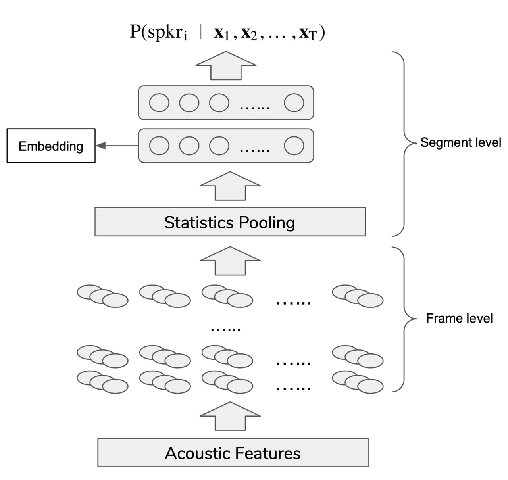

# A Comparative Re-Assessment of Feature Extractors for Deep Speaker Embeddings

###### Abstract

Modern automatic speaker verification relies largely on deep neural
networks (DNNs) trained on mel-frequency cepstral coefficient (MFCC)
features. While there are alternative feature extraction methods based
on phase, prosody and long-term temporal operations, they have not been
extensively studied with DNN-based methods. We aim to fill this gap by
providing extensive re-assessment of 14 feature extractors on VoxCeleb
and SITW datasets. Our findings reveal that features equipped with
techniques such as spectral centroids, group delay function, and
integrated noise suppression provide promising alternatives to MFCCs for
deep speaker embeddings extraction. Experimental results demonstrate up
to 16.3% (VoxCeleb) and 25.1% (SITW) relative decrease in equal error
rate (EER) to the baseline.

Xuechen Liu$`{}^{1}{}^{,}{}^{2}`$, Md Sahidullah², Tomi Kinnunen¹

¹School of Computing, University of Eastern Finland, Joensuu, Finland  
²Université de Lorraine, CNRS, Inria, LORIA, F-54000, Nancy, France

xuechen.liu@inria.fr, md.sahidullah@inria.fr, tkinnu@cs.uef.fi

Index Terms: Speaker verification, feature extraction, deep speaker
embeddings.

## 1 Introduction

_Automatic speaker verification_ (ASV) \[1\] aims to determine whether
two speech segments are from the same speaker or not. It finds
applications in forensics, surveillance, access control, and home
electronics.

While the field has long been dominated by approaches such as
_i-vectors_ \[2\], the focus has recently shifted to non-linear _deep
neural networks_ (DNNs). They have been found to surpass previous
solutions in many cases.

Representative DNN approaches include _d-vector_ \[3\], _deep speaker_
\[4\] and _x-vector_ \[5\]. As illustrated in Figure 1, DNNs are used to
extract fixed-sized _speaker embedding_ from each utterance. These
embeddings can then be used for speaker comparison with a back-end
classifier. The network input and output consist of a sequence of
acoustic feature vectors and a vector of speaker posteriors,
respectively. The DNN learns input-output mapping through a number of
intermediate layers, including temporal pooling (necessary for the
extraction of fixed-sized embedding). A number of improvements to this
core framework have been proposed, including _hybrid frame-level layers_
\[6\], use of _multi-task learning_ \[7\] and alternative _loss
functions_ \[8\], to name a few. In addition, practitioners often use
external data \[9, 10\] to augment training data. This enforces the DNN
to extract speaker-related attributes regardless of input perturbations.

Figure 1: X-vector speaker embedding extractor \[5\]. Speaker embeddings
are usually extracted from the first fully-connected layer after
statistics pooling.

While substantial amount of work has been devoted in improving DNN
architectures, loss functions, and data augmentation recipes, the same
cannot be said about acoustic features. There are, however, at least two
important reasons to study feature extraction. First, data-driven models
can only be as good as their input data — the features. Second, in
collaborative settings, it is customary to fuse several ASV systems.
These systems should not only perform well in isolation, but be
sufficiently _diverse_ as well. One way to achieve diversity is to train
systems with different features.

The acoustic features used to train deep speaker embedding extractors
are typically standard _mel-frequency cepstral coefficients_ (MFCCs) or
intermediate representations needed in MFCC extraction: raw spectrum
\[11\], mel-spectrum or mel-filterbank outputs. There are few exceptions
where feature extractor is also learnt as part of the DNN architecture
(_e.g._ \[12\]), although the empirical performance is often behind
hand-crafted feature extraction schemes. This raises a question whether
deep speaker embedding extractors might be improved by simple
plug-and-play of other _hand-crafted_ feature extractors in place of
MFCCs. Such methods are abundant in the past ASV literature \[13, 14,
15\], and in the context of related tasks such as spoofing attack
detection \[16, 17\]. An extensive study in the context of DNN-based ASV
is however missing. Our study aims to fill this gap.

MFCCs are obtained from the power spectrum of a specific time-frequency
representation, _short-term Fourier transform_ (STFT). MFCCs are
therefore subjected to certain shortcomings of the STFT. They also lack
specificity to the short-term phase of the signal. We therefore include
a number of alternative features based on short-term power spectrum and
short-term phase. Additionally, we also include fundamental frequency
and methods that leverage from long-term processing beyond a short-time
frame. Improvements over MFCCs are often motivated by robustness to
additive noise, improved statistical properties, or closer alignment
with human perception. The selected 14 features and their
categorization, detailed below, is inspired from \[16\] and \[17\]. For
generality, we carry experiments on two widely-adopted datasets,
VoxCeleb \[11\] and speakers-in-the-wild (SITW) \[18\]. To the best of
our knowledge, this is the first extensive re-assessment of acoustic
features for DNN-based ASV.

## 2 Feature Extraction Methods

In this section, we provide a comprehensive list of feature extractors
with brief description for each method. Table 1 summarizes the selected
feature extractors along with their parameter settings and references to
earlier ASV studies.

|                                               |                  |                                                                                                                                |                      |
| --------------------------------------------- | ---------------- | ------------------------------------------------------------------------------------------------------------------------------ | -------------------- |
| Category                                      | Feature (dim.)   | Configuration details                                                                                                          | Previous work on ASV |
| Short-term magnitude power spectral features  | MFCC (30)        | Baseline, No. of FFT coefficients=512                                                                                          | \[5, 6\]             |
|                                               | CQCC (60)        | CQCC_v2.0 package¹¹ 1 [http://www.audio.eurecom.fr/software/CQCC_v2.0.zip](http://www.audio.eurecom.fr/software/CQCC_v2.0.zip) | \[19\]               |
|                                               | LPCC (30)        | LP order=30                                                                                                                    | \[20\]               |
|                                               | PLPCC (30)       | LP order=30, bark-scale filterbank                                                                                             | \[21\]               |
|                                               | SCFC (30)        | No. filters=30                                                                                                                 | \[22\]               |
|                                               | SCMC (30)        | No. filters=30                                                                                                                 |                      |
|                                               | Multi-taper (30) | MFCC with SWCE windowing, no. tapers=8                                                                                         | \[13, 21\]           |
| Short-term phase spectral features            | MGDF(30)         | $`\alpha=0.4`$, $`\gamma=0.9`$, first 30 coeff. from DCT                                                                       | \[23, 24\]           |
|                                               | APGDF (30)       | LP order=30                                                                                                                    | \[14\]               |
|                                               | CosPhase (30)    | First 30 coeff. from DCT                                                                                                       | -                    |
|                                               | CMPOC (30)       | $`N=96`$, First 30 coeff. from DCT                                                                                             | -                    |
| Short-term features with long-term processing | MHEC (30)        | No. of filters in Gammatone filter bank=20                                                                                     | \[25\]               |
|                                               | PNCC (30)        | First 30 coeff. from DCT                                                                                                       | \[26\]               |
| Fundamental frequency features                | MFCC+pitch (33)  | Kaldi pitch extractor, MFCC (30) with pitch (3)                                                                                | \[27\]               |

Table 1: List of feature extractors that are addressed in this study,
with configuration details and references to exemplar earlier relevant
studies on ASV. As mentioned in Section 1 aside from MFCCs, previous
works noted here are ones on conventional models.

### 2.1 Short-term magnitude power spectral features

Mel frequency cepstral coefficients. MFCCs are computed by integrating
STFT power spectrum with overlapped band-pass filters on the mel-scale,
followed by log compression and _discrete cosine transform_ (DCT).
Following \[1\] a desired number of lower-order coefficients is
retained. Standard MFCCs form our baseline features.

Multi-taper mel frequency cepstral coefficients (Multi-taper). Viewing
each short-term frame of speech as a realization of a random processes,
the windowed STFT used in MFCC extraction is known to have high
variance. To alleviate this, _multi-taper_ spectrum estimator is adopted
\[13\]. It uses several window functions (tapers) to obtain a
low-variance power spectrum estimate, given by
$`\hat{S}(f)=\Sigma^{K}_{j=1}\lambda(j)|\Sigma^{N-1}_{t=0}w_{j}(t)x(t)e^{-i2{\pi}tf/N}|^{2}`$.
Here, $`w_{j}(t)`$ is the $`j`$-th taper (window) and $`\lambda(j)`$ is
its corresponding weight. The number of tapers, $`K`$, is an integer
(typically between 4 and 8). There are a number of alternative taper
sets to choose from: Thomson window \[28\], sinusoidal model (SWCE)
\[29\] and multi-peak \[30\]. In this study, we chose SWCE. A detailed
introduction of such spectrum estimator with experiments on conventional
ASV can be found in \[13\].

Linear prediction cepstral features. An alternative to MFCC in terms of
cepstral feature computation is from _all-pole_ \[31\] representation of
signal. _Linear prediction cepstral coefficients_ (LPCCs) are derived
from the linear prediction coefficients (LPCs) by a recursive operation
\[32\]. Similar method applies for perceptual LPCCs (PLPCCs) with
applying a series of perceptual processing at primary stage \[33\].

Spectral subband centroid features. Spectral subband centroid based
features were introduced and investigated in statistical ASV \[22\]. We
consider two types of spectral centroid features: _spectral centroid
magnitude_ (SCM) and _subband centroid frequency_ (SCF). They can be
computed from weighted average of normalized energy of subband magnitude
and frequency respectively. SCFs are then used directly as SCF
coefficients (SCFCs) while log compression and DCT are performed for
SCMs to obtain SCM coefficients (SCMCs). For more details one can refer
to \[22\].

Constant-Q cepstral coefficients (CQCCs). Constant-Q transform (CQT) was
introduced in \[34\]. It has been applied in music signal processing
\[35\], spoofing detection \[36\] as well in ASV \[37\]. Different from
STFT, CQT produces a time-frequency representation with variable
resolution. The resulting CQT power spectrum is log-compressed and
uniformly sampled, followed by DCT to yield CQCCs. Further details can
be found in \[36\].

### 2.2 Short-term phase features

Modified group delayed function (MGDF). MGDF was introduced in \[38\]
with application to phone recognition and further applied to speaker
recognition \[23\]. It is a parametric representation of the phase
spectrum, defined as
$`\tau(k)=\mathrm{sign.}|X_{\text{R}}(k)Y_{\text{R}}(k)+Y_{\text{I}}(k)X_{\text{I}}(k)/(S(k))^{2\gamma}|^{\alpha}`$,
where $`k`$ is the frequency index; $`X_{\text{R}}(k)`$ and
$`X_{\text{I}}(k)`$ are real and imaginary part of discrete Fourier
transform (DFT) from speech samples $`x(n)`$; $`Y_{\text{R}}(k)`$ and
$`Y_{\text{I}}(k)`$ are real and the imaginary parts of DFT of
$`nx(n)`$. $`\mathrm{sign.}`$ is the the sign of
$`X_{\text{R}}(k)Y_{\text{R}}(k)+Y_{\text{I}}(k)X_{\text{I}}(k)`$ while
$`\alpha`$ and $`\gamma`$ are the control parameters; $`S(k)`$ is a
smoothed magnitude spectrum. The cepstral-like coefficients which can be
used as features are then obtained from function outputs by
log-compression and DCT.

All-pole group delayed function (APGDF). An alternative phase
representation of signal was proposed for ASV in \[14\]. The group delay
function is computed by differentiating the unwrapped phase of all-pole
spectrum. The main advantage of APGDF compared to MGDF is a fewer number
of control parameters.

Cosine phase function (cosphase). Cosine of phase has been applied for
spoofing attack detection \[16, 39\]. The DFT-based unwrapped phase DFT
is first normalized to $`[-1,1]`$ using cosine operation, and then
processed with DCT to derive the cosphase coefficients.

Constant-Q magnitude–phase octave coefficients (CMPOCs). Unlike the
previous DFT-based features, CMPOCs utilize CQT. The _magnitude-phase
spectrum_ (MPS) from CQT is computed as
$`\sqrt{\text{ln}(|X(\omega))|^{2}+\phi(\omega)^{2}}`$, where
$`X(\omega)`$ and $`\phi(\omega)`$ denote magnitude and phase of CQT.
Then, MPS is segmented according to the octave, and processed with
log-compression and DCT to derive CMPOCs. The CMPOCs are studied so far
for playback attack detection \[40\].

### 2.3 Short-term features with long term processing

We use the term ‘long-term processing’ to refer methods that use
information across a longer context of consecutive frames.

Mean Hilbert envelope coefficients (MHECs). Proposed in \[25\] for
i-vector based ASV, MHEC applies _Gammatone_ filterbanks on the speech
signal. The output of each channel of the filterbank is then processed
to compute temporal envelopes as $`e_{s}(t,j)=s(t,j)+\hat{s}(t,j)`$,
where $`s(t,j)`$ is the so-called ‘analytical signal’ and
$`\hat{s}(t,j)`$ denotes its Hilbert transform \[41\]. $`t`$ and $`j`$
represent time and channel index respectively. The envelopes are
low-pass filtered, framed and averaged to compute energies. Finally, the
energies are transformed to cepstral-like coefficients by
log-compression and DCT. More details can be found in \[25\].

Power-normalized cepstral coefficients (PNCCs). To generate PNCCs input
waveform is first processed by Gammatone filterbanks and fed into a
cascade of non-linear time-varying operations, aimed at suppressing the
impact of noise and reverberation. Mean power normalization is performed
at the output of such operation series so as to minimize the potentially
detrimental effect on amplitude scaling. Cepstral features are then
obtained by power-law non-linearity and DCT. PNCCs have been applied to
speech recognition \[15\] as well as i-vector based ASV \[26\].

### 2.4 Fundamental frequency features

Aside from various type of features an initial investigation on the
effect of harmonic information was conducted. For simplicity and
comparability, the pitch extraction algorithm from \[42\] based on
_normalized cross correlation function_ (NCCF) was employed to extract
3-dimensional pitch vectors. They are then appended to MFCCs. In rest of
the paper, we refer this feature as MFCC+pitch.

| Feature               | EER(%) | minDCF |
| --------------------- | ------ | ------ |
| MFCC                  | 4.65   | 0.5937 |
| MFCC+$`\Delta`$       | 4.64   | 0.5517 |
| MFCC+$`\Delta\Delta`$ | 4.77   | 0.5553 |

Table 2: Result of prior experiment on investigating dynamic features on
Voxceleb1-E test set. Dimension of static part for all three cases were
set to be 30.

|                       |             |        |          |        |
| --------------------- | ----------- | ------ | -------- | ------ |
|                       | Voxceleb1-E |        | SITW-DEV |        |
| Feature               | EER(%)      | minDCF | EER(%)   | minDCF |
| MFCC                  | 4.65        | 0.5937 | 8.12     | 0.8531 |
| CQCC                  | 8.21        | 0.8310 | 9.43     | 0.9093 |
| LPCC                  | 6.42        | 0.7129 | 9.39     | 0.9109 |
| PLPCC                 | 7.06        | 0.7433 | 9.12     | 0.9178 |
| SCFC                  | 6.56        | 0.7173 | 7.82     | 0.8530 |
| SCMC                  | 4.57        | 0.5875 | 6.62     | 0.762  |
| Multi-Taper           | 4.84        | 0.5459 | 6.81     | 0.7776 |
| MGDF                  | 7.73        | 0.7718 | 9.70     | 0.8878 |
| APGDF                 | 5.96        | 0.6371 | 7.39     | 0.8449 |
| cosphase              | 6.03        | 0.6135 | 7.31     | 0.8436 |
| CMPOC                 | 5.95        | 0.6758 | 7.62     | 0.8613 |
| MHEC                  | 5.89        | 0.6777 | 7.66     | 0.8637 |
| PNCC                  | 5.11        | 0.5659 | 6.08     | 0.7614 |
| MFCC+pitch            | 4.67        | 0.5223 | 6.74     | 0.7983 |
| MFCC+SCMC+Multi-taper | 3.89        | 0.5396 | 6.58     | 0.7835 |
| MFCC+cosphase+PNCC    | 4.07        | 0.5103 | 6.24     | 0.7998 |

Table 3: Result of different features and fusion systems on Voxceleb1-E
test set and SITW development set (SITW-DEV).

¹¹footnotetext:
[http://www.audio.eurecom.fr/software/CQCC_v2.0.zip](http://www.audio.eurecom.fr/software/CQCC_v2.0.zip)

## 3 Experiments

### 3.1 Datasets

We conducted training of neural network on the _dev_ \[11\] part of
Voxceleb1 consisting 1211 speakers. We used two evaluation sets, one for
matched train-test condition and the other for relatively mismatched
condition. First one was from the _test_ part of the same VoxCeleb1
dataset consisting 40 speakers, and the other one was from the
_development_ part of SITW under “core-core” condition, consisting 119
speakers. The VoxCeleb1 evaluation consists of 18860 genuine trials and
same number of imposter trials. On the other hand, the corresponding
SITW partition has 2597 genuine and 335629 imposter trials. We will
refer the two datasets as ‘_Voxceleb1-E_’ and ‘_SITW-DEV_’ respectively.

### 3.2 Feature configuration

Before being fed into feature extractors, we extracted all the features
with a frame length of 25 ms and 10 ms shift. We apply Hamming \[43\]
window in all cases except for the multi-taper feature. In Table 1, we
describe the associated control parameters (if applicable) and the
implementation details for each feature extractor. As for
post-processing, we applied energy-based _speech activity detection_
(SAD) and utterance-level _cepstral mean normalization_ (CMN) \[1\]
except for MFCC+pitch, where the additional components contain
_probability of voicing_ (POV).

### 3.3 ASV system configuration

To compare different feature extractors, we trained x-vector system for
each of them, as illustrated in Figure 1. We replicated the DNN
configuration from \[5\]. We trained the model using data described
above without any data augmentation. This will help to assess the
inherent robustness of individual features. We extracted 512-dimensional
speaker embedding for each test utterance. The embeddings were
length-normalized and centered before being transformed using a
200-dimensional _linear discriminant analysis_ (LDA), followed by
scoring with a _probabilistic linear discriminant analysis_ (PLDA)
\[44\] classifier.

### 3.4 Evaluation

The verification accuracy was measured by _equal error rate_ (EER) and
_minimum detection cost function_ (minDCF) with target speaker prior
$`p=0.001`$ and two costs $`C_{\text{FA}}=C_{\text{miss}}=1.0`$.
_Detection error trade-off_ (DET) curves for all feature extraction
methods are also presented. We used Kaldi²² 2
[https://github.com/kaldi-asr/kaldi](https://github.com/kaldi-asr/kaldi)
for computing EER and minDCF. BOSARIS³³ 3
[https://sites.google.com/site/bosaristoolkit/](https://sites.google.com/site/bosaristoolkit/)
was called for DET illustration.

Figure 2: DET plots for evaluation sets. (top) Voxceleb1-E; (bottom)
SITW-DEV. Best viewed in color.

## 4 Results

We first conducted a preliminary experiment on investigating the
effectiveness of dynamic features with result reported in Table 2, as a
sanity check. We extended the baseline by adding delta and double-delta
coefficients along with the static MFCCs. According to the table adding
delta features did not improve performance. This might be because the
frame-level network layers already capture information across
neighboring frames. In the remainder, we utilize static features only.

Table 3 summarizes the results for both corpora. In experiment of
_Voxceleb1-E_, we found that MFCCs outperform most of alternative
features in terms of EER, with SCMCs as the only exception. This may
indicate the effectiveness of information related to subband energies.
However, SCFCs did not outperform SCMCs, which suggests that the subband
magnitudes may be more important than their frequencies. Concerning
phase spectral features, MGDFs were behind the other features. This
might be due to sub-optimal control parameter settings. CMPOCs reached
relatively 27.6% lower EER than CQCCs, which highlights the
effectiveness of phase features in CQT-based feature category. Moreover,
while competitive EER and best minDCF can be observed from MFCC+pitch,
LPCCs and PLPCCs did not perform as good. This indicates the potential
importance of explicit harmonic information. Such finding can be further
found in _SITW-DEV_ results. Similar observation can be found from
multi-taper MFCCs, which reclaims the efficacy of multi-taper windowing
from conventional ASV.

Focusing more on _SITW-DEV_, most competitive features include those
from the phase and ‘long-term’ categories. PNCCs reached best
performance in both metrics, outperforming baseline MFCCs by 25.1%
relative in terms of EER. This might be due to the robustness-enhancing
operations integrated in the pipeline, recalling that _SITW-DEV_
represents more challenging and mismatched data conditions. While not
outperforming the baseline in _Voxceleb1-E_, SCFCs yielded competitive
numbers along with SCMCs, which further indicates usefulness of subband
information. Best performance from cosphase under phase category
reflects the advantage of cosine normalizer relative to group delay
function. An additional benefit of cosphase over group delay features is
that it has lesser number of control parameters.

Next, we addressed simple equal-weighted linear score fusion. We
considered two sets of features: 1) MFCCs, SCMCs and Multi-taper; 2)
MFCCs, cosphase and PNCCs. The former set of extractors share similar
spectral operations while the latter cover more diverse speech
attributes. Results are presented at the bottom of Table 3. In
_Voxceleb1-E_, we can see further improvement for both fused systems,
especially for the first one which reached lowest overall EER,
outperforming baseline by 16.3% relatively. But under _SITW-DEV_ the
best performance was still held by single system. This indicates that
simple equal-weighted linear score-level fusion may be more effective
for relatively matched conditions.

Finally, the DET curves for all systems including fused ones are shown
in Figure 2, which agrees with the findings in Table 3. Concerning
_Voxceleb1-E_, the two fusion systems are closer to the origin than any
of the single systems in general, which corresponds to the indication
above. Concerning SITW, PNCCs confirms its superior performance on
_SITW-DEV_, but from right-bottom both spectral centroid features are
heading out, which may indicate their favor to systems that are less
strict on false alarms.

## 5 Conclusion

This paper presents an extensive re-assessment of various acoustic
feature extractors for DNN-based ASV systems. We evaluated them on
Voxceleb1 and SITW, covering matched and unmatched conditions. We
achieved improvements over MFCCs especially on SITW, which represents
more mismatched testing condition. We also found alternative methods
such as spectral centroids, group delay function, and integrated noise
suppression can be useful for DNN system. For future work they thus
shall be revisited and extended under more scenarios. Finally we gave an
initial attempt on score-level fused systems with competitive
performance, indicating the potential of such approach.

## 6 Acknowledgements

This work was partially supported by Academy of Finland (project 309629)
and Inria Nancy Grand Est.

## References

- \[1\] T. Kinnunen and H. Li, “An overview of text-independent speaker
  recognition: From features to supervectors,” _Speech Communication_,
  vol. 52, no. 1, pp. 12 – 40, 2010.
- \[2\] N. Dehak, P. J. Kenny, R. Dehak, P. Dumouchel, and P. Ouellet,
  “Front-end factor analysis for speaker verification,” _IEEE
  Transactions on Audio, Speech, and Language Processing_, vol. 19,
  no. 4, pp. 788–798, May 2011.
- \[3\] E. Variani _et al._, “Deep neural networks for small footprint
  text-dependent speaker verification,” in _Proc. ICASSP_, 2014, pp.
  4052–4056.
- \[4\] C. Li, X. Ma, B. Jiang, X. Li, X. Zhang, X. Liu, Y. Cao,
  A. Kannan, and Z. Zhu, “Deep speaker: an end-to-end neural speaker
  embedding system,” _CoRR_, vol. abs/1705.02304, 2017.
- \[5\] D. Snyder, D. Garcia-Romero, G. Sell, D. Povey, and
  S. Khudanpur, “X-vectors: Robust DNN embeddings for speaker
  recognition,” in _Proc. ICASSP_, 2018, pp. 5329–5333.
- \[6\] D. Snyder, D. Garcia-Romero, G. Sell, A. McCree, D. Povey, and
  S. Khudanpur, “Speaker recognition for multi-speaker conversations
  using x-vectors,” in _Proc. ICASSP_, 2019, pp. 5796–5800.
- \[7\] L. You, W. Guo, L. R. Dai, and J. Du, “Multi-Task learning with
  high-order statistics for X-vector based text-independent speaker
  verification,” in _Proc. INTERSPEECH_, 2019, pp. 1158–1162.
- \[8\] Y. Li, F. Gao, Z. Ou, and J. Sun, “Angular softmax loss for
  end-to-end speaker verification,” _2018 11th International Symposium
  on Chinese Spoken Language Processing (ISCSLP)_, pp. 190–194, 2018.
- \[9\] T. Ko, V. Peddinti, D. Povey, M. L. Seltzer, and S. Khudanpur,
  “A study on data augmentation of reverberant speech for robust speech
  recognition,” in _Proc. ICASSP_, 2017, pp. 5220–5224.
- \[10\] D. Snyder, G. Chen, and D. Povey, “MUSAN: A Music, Speech, and
  Noise Corpus,” 2015, arXiv:1510.08484v1.
- \[11\] A. Nagrani, J. S. Chung, and A. Zisserman, “VoxCeleb: A
  large-scale speaker identification dataset,” in _Proc. INTERSPEECH_,
  2017, pp. 2616–2620.
- \[12\] M. Ravanelli and Y. Bengio, “Speaker recognition from raw
  waveform with SincNet,” in _Proc. SLT_, 2018, pp. 1021–1028.
- \[13\] T. Kinnunen _et al._, “Low-variance multitaper MFCC features: A
  case study in robust speaker verification,” _IEEE Transactions on
  Audio, Speech, and Language Processing_, vol. 20, no. 7, pp.
  1990–2001, 2012.
- \[14\] P. Rajan, T. Kinnunen, C. Hanilçi, J. Pohjalainen, and P. Alku,
  “Using group delay functions from all-pole models for speaker
  recognition,” _Proc. INTERSPEECH_, pp. 2489–2493, 01 2013.
- \[15\] C. Kim and R. M. Stern, “Power-normalized cepstral coefficients
  (PNCC) for robust speech recognition,” _IEEE/ACM Transactions on
  Audio, Speech, and Language Processing_, vol. 24, no. 7, pp.
  1315–1329, 2016.
- \[16\] M. Sahidullah, T. Kinnunen, and C. Hanilçi, “A comparison of
  features for synthetic speech detection,” in _Proc. INTERSPEECH_, 09
  2015, pp. 2087–2091.
- \[17\] C. Hanilçi, “Features and classifiers for replay spoofing
  attack detection,” in _2017 10th International Conference on
  Electrical and Electronics Engineering (ELECO)_, 2017, pp. 1187–1191.
- \[18\] M. McLaren, L. Ferrer, D. Castán Lavilla, and A. Lawson, “The
  speakers in the wild (SITW) speaker recognition database,” in _Proc.
  INTERSPEECH_, 2016, pp. 818–822.
- \[19\] M. Todisco, H. Delgado, and N. Evans, “Articulation rate
  filtering of CQCC features for automatic speaker verification,” in
  _Proc. INTERSPEECH 2016_, 2016, pp. 3628–3632.
- \[20\] X. Jing, J. Ma, J. Zhao, and H. Yang, “Speaker recognition
  based on principal component analysis of LPCC and MFCC,” in _Proc.
  ICSPCC_, 2014, pp. 403–408.
- \[21\] M. J. Alam _et al._, “Multitaper MFCC and PLP features for
  speaker verification using i-vectors,” _Speech Communication_,
  vol. 55, no. 2, pp. 237 – 251, 2013.
- \[22\] J. M. K. Kua _et al._, “Investigation of spectral centroid
  magnitude and frequency for speaker recognition,” in _Proc. Odyssey_,
  2010, pp. 34–39.
- \[23\] P. Rajan, S. H. K. Parthasarathi, and H. A. Murthy, “Robustness
  of phase based features for speaker recognition,” in _Proc.
  INTERSPEECH_, 2009.
- \[24\] T. Thiruvaran, E. Ambikairajah, and J. Epps, “Group delay
  features for speaker recognition,” in _2007 6th International
  Conference on Information, Communications Signal Processing_, 2007,
  pp. 1–5.
- \[25\] S. Sadjadi and J. Hansen, “Mean hilbert envelope coefficients
  (MHEC) for robust speaker and language identification,” _Speech
  Communication_, vol. 72, pp. 138–148, 05 2015.
- \[26\] N. Wang and L. Wang, “Robust speaker recognition based on
  multi-stream features,” in _2016 IEEE International Conference on
  Consumer Electronics-China (ICCE-China)_, 2016, pp. 1–4.
- \[27\] A. G. Adami, “Modeling prosodic differences for speaker
  recognition,” _Speech Communication_, vol. 49, no. 4, pp. 277 –
  291, 2007.
- \[28\] D. J. Thomson, “Spectrum estimation and harmonic analysis,”
  _Proceedings of the IEEE_, vol. 70, no. 9, pp. 1055–1096, 1982.
- \[29\] M. Hansson-Sandsten and J. Sandberg, “Optimal cepstrum
  estimation using multiple windows,” in _Proc. ICASSP_, 2009, pp.
  3077–3080.
- \[30\] M. Hansson, T. Gansler, and G. Salomonsson, “A multiple window
  method for estimation of a peaked spectrum,” in _Proc. ICASSP_,
  vol. 3, 1995, pp. 1617–1620 vol.3.
- \[31\] J. Makhoul, “Linear prediction: A tutorial review,”
  _Proceedings of the IEEE_, vol. 63, no. 4, pp. 561–580, 1975.
- \[32\] L. Rabiner and B.-H. Juang, _Fundamentals of Speech
  Recognition_. USA: Prentice-Hall, Inc., 1993.
- \[33\] H. Hermansky, “Perceptual linear predictive (PLP) analysis of
  speech,” _The Journal of the Acoustical Society of America_, vol. 87,
  no. 4, pp. 1738–1752, 1990.
- \[34\] J. Youngberg and S. Boll, “Constant-q signal analysis and
  synthesis,” in _Proc. ICASSP_, vol. 3, April 1978, pp. 375–378.
- \[35\] A. Schörkhuber, Christian; Klapuri, “Constant-q transform
  toolbox for music processing,” in _7th Sound and Music Computing
  Conference. Barcelona_, 2010.
- \[36\] M. Todisco, H. Delgado, and N. W. D. Evans, “A new feature for
  automatic speaker verification anti-spoofing: Constant q cepstral
  coefficients,” in _Proc. Odyssey_, 2016, pp. 283–290.
- \[37\] H. Delgado _et al._, “Further optimisations of constant q
  cepstral processing for integrated utterance verification and
  text-dependent speaker verification,” in _Proc. SLT_, 12 2016.
- \[38\] H. A. Murthy and V. Gadde, “The modified group delay function
  and its application to phoneme recognition,” in _Proc. ICASSP_,
  vol. 1, 2003, pp. I–68.
- \[39\] Z. Wu, X. Xiao, E. S. Chng, and H. Li, “Synthetic speech
  detection using temporal modulation feature,” in _Proc. ICASSP_, 2013,
  pp. 7234–7238.
- \[40\] J. Yang and L. Liu, “Playback speech detection based on
  magnitude-phase spectrum,” _Electronics Letters_, vol. 54, 05 2018.
- \[41\] L. Cohen, _Time-Frequency Analysis: Theory and
  Applications_. USA: Prentice-Hall, Inc., 1995.
- \[42\] P. Ghahremani _et al._, “A pitch extraction algorithm tuned for
  automatic speech recognition,” in _Proc. ICASSP_, 2014, pp. 2494–2498.
- \[43\] F. J. Harris, “On the use of windows for harmonic analysis with
  the discrete Fourier transform,” _Proceedings of the IEEE_, vol. 66,
  no. 1, pp. 51–83, Jan 1978.
- \[44\] S. Ioffe, “Probabilistic linear discriminant analysis,” in
  _Computer Vision – ECCV 2006_, A. Leonardis, H. Bischof, and A. Pinz,
  Eds. Berlin, Heidelberg: Springer Berlin Heidelberg, 2006, pp.
  531–542.
