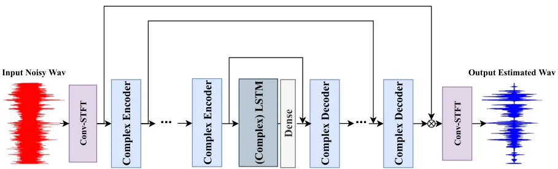

# DCCRN: Deep Complex Convolution Recurrent Network for Phase-Aware Speech Enhancement

\*: Equal contribution. The first author performed part of this work as
an intern at Sogou. Lei Xie is corresponding author.

###### Abstract

Speech enhancement has benefited from the success of deep learning in
terms of intelligibility and perceptual quality. Conventional
time-frequency (TF) domain methods focus on predicting TF-masks or
speech spectrum, via a naive convolution neural network (CNN) or
recurrent neural network (RNN). Some recent studies use complex-valued
spectrogram as a training target but train in a real-valued network,
predicting the magnitude and phase component or real and imaginary part,
respectively. Particularly, convolution recurrent network (CRN)
integrates a convolutional encoder-decoder (CED) structure and long
short-term memory (LSTM), which has been proven to be helpful for
complex targets. In order to train the complex target more effectively,
in this paper, we design a new network structure simulating the
complex-valued operation, called Deep Complex Convolution Recurrent
Network (DCCRN), where both CNN and RNN structures can handle
complex-valued operation. The proposed DCCRN models are very competitive
over other previous networks, either on objective or subjective metric.
With only 3.7M parameters, our DCCRN models submitted to the Interspeech
2020 Deep Noise Suppression (DNS) challenge ranked first for the
real-time-track and second for the non-real-time track in terms of Mean
Opinion Score (MOS).

Yanxin Hu^(1,∗), Yun Liu^(2,∗), Shubo Lv¹, Mengtao Xing¹, Shimin
Zhang¹,  
Yihui Fu¹, Jian Wu¹, Bihong Zhang², Lei Xie¹

¹Audio, Speech and Language Processing Group (ASLP@NPU), School of
Computer Science, Northwestern Polytechnical University, Xi'an, China  
²AI Interaction Division, Sogou Inc., Beijing, China

{yxhu, shblv, mtxing, shmzhang, yhfu}@npu-aslp.org,
{jianwu,lxie}@nwpu-aslp.org, liuyun.nogizaka@qq.com,
zhangbihong@sogou-inc.com

Index Terms: speech enhancement, denoise, deep learning, complex network

## 1 Introduction

Noise interference may severely decrease perceptual quality and
intelligibility in speech communication. Likewise, the related tasks,
such as automatic speech recognition (ASR), also can be heavily affected
by noise interference. Speech enhancement is thus a highly desired task
of taking noisy speech as input and producing an enhanced speech output
for better speech quality, intelligibility, and sometimes better
criterion in downstream tasks (e.g., lower error rate in ASR). Recently,
deep learning (DL) methods have achieved promising results in speech
enhancement, especially in dealing with non-stationary noises in
challenging conditions. DL can benefit both single-channel (monaural)
and multi-channel speech enhancement depending on specific applications.
In this paper, we focus on DL-based single-channel speech enhancement
for better perceptual quality and intelligibility, particularly
targeting to real-time processing with low model complexity. The
Interspeech 2020 deep noise suppression (DNS) challenge has provided a
common testbed for such purpose \[1\].

### 1.1 Related work

Formulated as a supervised learning problem, noisy speech can be
enhanced by neural networks either in time-frequency (TF) domain or
directly in time-domain. The time-domain approaches can further fall
into two categories — direct regression \[2, 3\] and adaptive front-end
approaches \[4, 5, 6\]. The former directly learns a regression function
from the waveform of a speech-noise mixture to the target speech without
an explicit signal front-end, typically by involving some form of 1-D
convolutional neural network (Conv1d). Taking time-domain signal in and
out, the latter adaptive front-end approaches usually adopt a
convolution encoder-decoder (CED) or a u-net framework, which resembles
the short-time Fourier transform (STFT) and its inversion (iSTFT). The
enhancement network is then inserted between the encoder and the
decoder, typically by using networks with the capacity of temporal
modeling, such as temporal convolutional network (TCN) \[4, 7\] and long
short-term memory (LSTM) \[8\].

As another main-stream, the TF-domain approaches \[9, 10, 11, 12, 13\]
work on the spectrogram with the belief that fine-detailed structures of
speech and noise can be more separable with TF representations after
STFT. Convolution recurrent network (CRN) \[14\] is a recent approach
that also employs a CED structure similar to the one in the time-domain
approaches but extracts high-level features for better separation by 2-D
CNN (Conv2d) from noisy speech spectrogram. Specifically, CED can take
complex-valued or real-valued spectrogram as input. A complex-valued
spectrogram can be decomposed into magnitude and phase in polar
coordinate or real and imaginary part in the Cartesian coordinate. For a
long time, it has been believed that phase is intractable to estimate.
Hence, early studies only focus on magnitude related training target
while ignoring phase \[15, 16, 17\], resynthesizing the estimated speech
by simply applying estimated magnitude with the noisy speech phase. This
thus limits the upper bound of performance, while the phase of estimated
speech will deviate significantly with serious interferences. Although
many recent approaches have been proposed for phase reconstruction to
address this issue \[18, 19\], the neural network remains real-valued.

Typically, training targets defined in the TF domain mainly fall into
two groups, i.e., masking-based targets, which describe the
time-frequency relationships between clean speech and background noise,
and mapping-based targets which correspond to the spectral
representations of clean speech. In the masking family, ideal binary
mask (IBM) \[20\], ideal ratio mask (IRM) \[10\] and spectral magnitude
mask (SMM) \[21\] only use the magnitude between clean speech and
mixture speech, ignoring the phase information. On the contrast,
phase-sensitive mask (PSM) \[22\] was the first one that utilizes phase
information showing the feasibility of phase estimation. Subsequently,
complex ratio mask (CRM) \[23\] was proposed, which can reconstruct
speech perfectly by enhancing both real and imaginary components of the
division of clean speech and mixture speech spectrogram simultaneously.
Later, Tan et al. \[24\] proposed a CRN with one encoder and two
decoders for complex spectral mapping (CSM) to estimate the real and
imaginary spectrogram of mixture speech simultaneously. It is worth
noting that CRM and CSM possess the full information of a speech signal
so that they can achieve the best oracle speech enhancement performance
in theory.

The above approaches have been learned under a real-valued network,
although the phase information has been taken into consideration.
Recently, deep complex u-net \[25\] has combined the advantages of both
a deep complex network \[26\] and a u-net \[27\] to deal with
complex-valued spectrogram. Particularly, DCUNET is trained to estimate
CRM and optimizes the scale-invariant source-to-noise ratio (SI-SNR)
loss \[4\] after transforming the output TF-domain spectrogram to a
time-domain waveform by iSTFT. While achieving state-of-the-art
performance with temporal modeling ability, many layers of convolution
are adopted to extract important context information, leading to large
model size and complexity, which limits its practical use in
efficiency-sensitive applications.

### 1.2 Contributions

In this paper, we build upon previous network architectures to design a
new complex-valued speech enhancement network, called deep complex
convolution recurrent network (DCCRN), optimizing an SI-SNR loss. The
network effectively combines both the advantages of DCUNET and CRN,
using LSTM to model temporal context with significantly reduced
trainable parameters and computational cost. Under the proposed DCCRN
framework, we also compare various training targets and the best
performance can be obtained by the complex network with the complex
target. In our experiments, we find that the proposed DCCRN outperforms
CRN \[24\] by a large margin. With only 1/6 computation complexity,
DCCRN achieves competitive performance with DCUNET \[25\] under the
similar configuration of model parameters. While targeting to real-time
speech enhancement, with only 3.7M parameters, our model achieves the
best MOS in real-time track and the second-best in non-real-time track
according to the P.808 subjective evaluation in the DNS challenge.

## 2 The DCCRN Model

### 2.1 Convolution recurrent network architecture

The convolution recurrent network (CRN), originally described in \[14\],
is an essentially causal CED architecture with two LSTM layers between
the encoder and the decoder. Here, LSTM is specifically used to model
the temporal dependencies. The encoder consists of five Conv2d blocks
aiming at extracting high-level features from the input features, or
reducing the resolution. Subsequently, the decoder reconstructs the
low-resolution features to the original size of the input, leading the
encoder-decoder structure to a symmetric design. In detail, the
encoder/decoder Conv2d block is composed of a convolution/deconvolution
layer followed by batch normalization and activation function.
Skip-connection is conducive to flowing the gradient by concentrating
the encoder and decoder.

Unlike the original CRN with magnitude mapping, Tan et al. \[24\]
recently proposed a modified structure with one encoder and two decoders
to model the real and imaginary parts of complex STFT spectrogram from
the input mixture to clean speech. Compared with the traditional
magnitude-only target, enhancing magnitude and phase simultaneously has
obtained remarkable improvement. However, they treat real and imaginary
parts as two input channels, only applying a real-valued convolution
operation with one shared real-valued convolution filter, which is not
confined with the complex multiply rules. Hence the networks may learn
the real and imaginary parts without prior knowledge. To address this
issue, in this paper, the proposed DCCRN modifies CRN substantially with
complex CNN and complex batch normalization layer in encoder/decoder,
and complex LSTM is also considered to replace the traditional LSTM.
Specifically, the complex module models the correlation between
magnitude and phase with the simulation of complex multiplication.



Figure 1: DCCRN network

### 2.2 Encoder and decoder with complex network

(a) complex convolution

(b) complex encoder

Figure 2: Complex module

The complex encoder block includes complex Conv2d, complex batch
normalization \[26\] and real-valued PReLU \[28\]. The complex batch
normalization and PReLU follow the implementation of the original paper.
We design the complex Conv2d block according to that in DCUNET\[25\].
Complex Conv2d consists of four traditional Conv2d operations, which
control the complex information flow throughout the encoder. The
complex-valued convolutional filter $`W`$ is defined as
$`W=W_{r}+jW_{i}`$, where the real-valued matrices $`W_{r}`$ and
$`W_{i}`$ represent the real and imaginary part of a complex convolution
kernel, respectively. At the same time, we define the input complex
matrix $`X=X_{r}+jX_{i}`$ . Therefore, we can get complex output $`Y`$
from the complex convolution operation $`X\circledast W`$:

```math
F_{out}=(X_{r}*W_{r}-X_{i}*W_{i})+j(X_{r}*W_{i}+X_{i}*W_{r}) \tag{1}
```

where $`F_{out}`$ denotes the output feature of one complex layer.

Similar to complex convolution, given the real and imaginary parts of
the complex input $`X_{r}`$ and $`X_{i}`$, complex LSTM output
$`F_{out}`$ can be defined as:

```math
\displaystyle F_{rr}=\text{LSTM}_{r}(X_{r});\hskip 9.24994ptF_{ir}=\text{LSTM}_{r}(X_{i}) \tag{2}
```

```math
\displaystyle F_{ri}=\text{LSTM}_{i}(X_{r});\hskip 9.24994ptF_{ii}=\text{LSTM}_{i}(X_{i}) \tag{3}
```

```math
\displaystyle F_{\text{out}}=(F_{rr}-F_{ii})+j(F_{ri}+F_{ir}) \tag{4}
```

where $`\text{LSTM}_{r}`$ and $`\text{LSTM}_{i}`$ represent two
traditional LSTMs of real part and imaginary part, and $`F_{ri}`$ is
caculated by input $`X_{r}`$ with $`\text{LSTM}_{i}`$.

### 2.3 Training target

When training, DCCRN estimates CRM and is optimized by signal
approximation (SA). Given the complex-valued STFT spectrogram of clean
speech $`S`$ and noisy speech $`Y`$, CRM can be defined as

```math
\text{CRM}=\frac{Y_{r}S_{r}+Y_{i}S_{i}}{Y_{r}^{2}+Y_{i}^{2}}+j\frac{Y_{r}S_{i}-Y_{i}S_{r}}{Y_{r}^{2}+Y_{i}^{2}} \tag{5}
```

where $`Y_{r}`$ and $`Y_{i}`$ denote the real and imaginary parts of the
noisy complex spectrogram, respectively. The real and imaginary parts of
the clean complex spectrogram are represented by $`S_{r}`$ and
$`S_{i}`$. Magnitude target SMM also can be used for comparison:
$`\text{SMM}=\frac{|S|}{|Y|}`$, where $`|S|`$ and $`|Y|`$ indicate the
magnitude of clean speech and noisy speech, respectively. We apply
signal approximation, which directly minimizes the difference between
the magnitude or complex spectrogram of clean speech and that of noisy
speech applied with mask. The loss function of SA becomes
$`\text{CSA}=Loss({\tilde{M}}\cdot{Y},S)`$ and
$`\text{MSA}=Loss(\tilde{|M|}\cdot|Y|,|S|)`$, where CSA and MSA denote
the CRM-based SA and SMM based SA, respectively. Alternatively, the
Cartesian coordinate representation
$`\tilde{M}=\tilde{M_{r}}+j\tilde{M_{i}}`$ can also be expressed in
polar coordinates:

```math
\left\{\begin{array}[]{lll}\tilde{M}_{\text{mag}}&=\sqrt{\tilde{M_{r}}^{2}+\tilde{M_{i}}^{2}},&\\
\tilde{M}_{\text{phase}}&=\arctan 2(\tilde{M_{i}},\tilde{M_{r}})&\end{array}\right. \tag{6}
```

We can use three multiplicative patterns for DCCRN, which will be
compared with experiments shortly. Specifically, the estimated clean
speech $`\tilde{S}`$ can be calculated as below.

- •
  DCCRN-R:

  ```math
  \tilde{S}=(Y_{r}\cdot\tilde{M}_{r})+j(Y_{i}\cdot\tilde{M}_{i}) \tag{7}
  ```

- •
  DCCRN-C:

  ```math
  \tilde{S}=(Y_{r}\cdot\tilde{M}_{r}-Y_{i}\cdot\tilde{M}_{i})+j(Y_{r}\cdot\tilde{M}_{i}+Y_{i}\cdot\tilde{M}_{r}) \tag{8}
  ```

- •
  DCCRN-E:

  ```math
  \tilde{S}=Y_{\text{mag}}\cdot\tilde{M}_{\text{mag}}\cdot e^{{Y}_{\text{phase}}+\tilde{M}_{\text{phase}}} \tag{9}
  ```

DCCRN-C obtains $`\tilde{S}`$ in the manner of CSA and DCCRN-R estimates
the mask of the real and imaginary parts of $`\tilde{Y}`$, respectively.
Moreover, DCCRN-E performs in polar coordinates, and it is
mathematically similar to DCCRN-C. The difference is that DCCRN-E uses
the $`tanh`$ activation function to limit the mask magnitude to 0 to 1.

### 2.4 Loss function

The loss function of model training is SI-SNR, which has been commonly
used as an evaluation metric to replace the mean square error (MSE).
SI-SNR is defined as:

```math
\begin{cases}\bm{s}_{\text{target}}&:=(<\tilde{\bm{s}},\bm{s}>\cdot\bm{s})/||\bm{s}||_{2}^{2}\\
\bm{e}_{\text{noise}}&:=\bm{\tilde{s}}-\bm{s_{\text{target}}}\\
\text{SI-SNR}&:=10\log 10(\dfrac{||\bm{s_{\text{target}}}||_{2}^{2}}{||\bm{e_{\text{noise}}}||_{2}^{2}})\\
\end{cases} \tag{10}
```

where $`\bm{s}`$ and $`\tilde{\bm{s}}`$ are the clean and estimated
time-domain waveform, respectively. $`<\cdot,\cdot>`$ denotes the dot
product between two vectors and $`||\cdot||_{2}`$ is Euclidean norm (L2
norm). In details, we use STFT kernel initialized
convolution/deconvolution module to analyze/synthesize waveform \[29\]
before sending to network and calculating the loss function.

## 3 Experiments

### 3.1 Datasets

In our experiments, we first evaluated the proposed models as well as
several baselines on a dataset simulated on WSJ0 \[30\], and then the
best-performed models were further evaluated on the Interspeech2020 DNS
Challenge dataset \[1\]. For the first dataset, we select 24500
utterances (about 50 hours) from WSJ0 \[30\], which includes 131
speakers (66 males and 65 females). We shuffle and split training,
validation, and evaluation sets to 20000, 3000 and 1500 utterances,
respectively. The noise dataset contains 6.2 hours free-sound noise and
42.6 hours music from MUSAN \[31\], which we use 41.8 hours for training
and validation, and the rest 7 hours for evaluation. The speech-noise
mixtures in training and validation are generated by randomly selecting
utterances from the speech set and the noise set and mixing them at
random SNR between -5 dB and 20 dB. The evaluation set is generated at 5
typical SNRs (0 dB, 5 dB, 10 dB, 15 dB, 20 dB).

The second big dataset is based on the data provided by the DNS
challenge. The 180-hour DNS challenge noise set includes 150 classes and
65,000 noise clips and the clean speech set includes over 500 hours of
clips from 2150 speakers. To make full use of the dataset, we simulate
the speech-noise mixture with dynamic mixing during model training. In
detail, at each training epoch, we first convolve speech and noise with a
room impulse response (RIR) randomly-selected from a simulated 3000-RIR
set by the image method \[32\], and then the speech-noise mixtures are
generated dynamically by mixing reverb speech and noise at random SNR
between -5 and 20 dB. The total data ‘seen’ by the model is over 5000
hours after 10 epochs of training. We use the official test set for
objective scoring and final model selection.

### 3.2 Training setup and baselines

For all of the models, the window length and hop size are 25 ms and 6.25
ms, and the FFT length is 512. We use Pytorch to train the models, and
the optimizer is Adam. The initial learning rate is set to 0.001, and it
will decay 0.5 when the validation loss goes up. All the waveforms are
resampled at 16k Hz. The models are selected by early stopping. In order
to choose the model for the DNS challenge, we compare several models on
the WSJ0 simulation dataset, described as follows.

LSTM: a semi-causal model contains two LSTM layers, and each layer has
800 units; we add one Conv1d layer in which kernel size is 7 in the time
dimension, and the look-ahead is 6 frames to achieve semi-causal. The
output layer is a 257-unit fully-connected layer. The input and output
are the noisy and estimated clean spectrogram with MSA, respectively.

CRN: a semi-causal model contains one encoder and two decoders with the
best configuration in \[24\]. The input and output are the real and
imaginary part of the noisy and estimated STFT complex spectrogram. Two
decoders process the real and imaginary parts separately. The kernel
size is also (3,2) in frequency and time dimension, and the stride is
set to (2,1). For the encoder, we concatenate real and imaginary parts
in the channel dimension, so the shape of the input feature is
\[BatchSize, 2, Frequency, Time\]. Moreover, the output channel of each
layer in encoder is {16,32,64,128,256,256}. The hidden LSTM units are
256, and a dense layer with 1280 units is after the last LSTM. On
account of skip connection, each layer in input channel of real or
imaginary decoder is {512,512,256,128,64,32}.

DCCRN: four models consist of DCCRN-R, DCCRN-C, DCCRN-E and DCCRN-CL
(masking like DCCRN-E). The direct current component of all these models
is removed. The number of channel for the first three DCCRN is
{32,64,128,128,256,256}, while the DCCRN-CL is {32,64,128,256,256,256}.
The kernel size and stride are set to (5,2) and (2,1), respectively. The
real LSTMs of the first three DCCRN are two layers with 256 units and
DCCRN-CL uses complex LSTM with 128 units for the real part and
imaginary part, respectively. And a dense layer with 1024 units is after
the last LSTM.

DCUNET: we use DCUNET-16 for comparison and the stride in time dimension
is set to 1 to fit with the DNS challenge rules. Moreover, the channels
in encoder is set to \[72,72,144,144,144,160,160,180\].

For the implementation of semi-causal convolution\[33\], there are only
two differences with commonly used causal convolution in practice.
First, we pad zeros in front of the time dimension at each Conv2ds in
the encoder. Second, for the decoder, we look ahead one frame in each
convolution layer. This eventually leads to 6 frames look-head, totally
$`6\times 6.25=37.5`$ ms, confined with the DNS challenge limit — 40 ms.

### 3.3 Experimental results and discussion

The model performance is first assessed by PESQ¹¹ 1
[https://www.itu.int/rec/T-REC-P.862-200102-I/en](https://www.itu.int/rec/T-REC-P.862-200102-I/en)
on the simulated WSJ0 dataset. Table 1 presents the PESQ score on the
test sets. In each case, the best result is highlighted by a boldface
number.

|          |          |       |       |       |       |       |       |
| -------- | -------- | ----- | ----- | ----- | ----- | ----- | ----- |
| Model    | Para.(M) | 0dB   | 5dB   | 10dB  | 15dB  | 20dB  | Ave.  |
| Noisy    | -        | 2.062 | 2.388 | 2.719 | 3.049 | 3.370 | 2.518 |
| LSTM     | 9.6      | 2.783 | 3.103 | 3.371 | 3.593 | 3.781 | 3.326 |
| CRN      | 6.1      | 2.850 | 3.143 | 3.374 | 3.561 | 3.717 | 3.329 |
| DCCRN-R  | 3.7      | 2.832 | 3.192 | 3.488 | 3.717 | 3.891 | 3.424 |
| DCCRN-C  | 3.7      | 2.832 | 3.187 | 3.477 | 3.707 | 3.840 | 3.409 |
| DCCRN-E  | 3.7      | 2.859 | 3.203 | 3.492 | 3.718 | 3.891 | 3.433 |
| DCCRN-CL | 3.7      | 2.972 | 3.301 | 3.559 | 3.755 | 3.901 | 3.498 |
| DCUNET   | 3.6      | 2.971 | 3.297 | 3.556 | 3.760 | 3.916 | 3.500 |

Table 1: PESQ on the simulated WSJ0 dataset

On the simulated WSJ0 test set, we can see that the four DCCRNs
outperform the baseline LSTM and CRN, which indicates the effectiveness
of complex convolution. DCCRN-CL achieves better performance than other
DCCRNs. This further shows that complex LSTM is also beneficial to
complex target training. Moreover, we can see that full-complex-value
network DCCRN and DCUNET are similar in PESQ. It worth noting that the
computational complexity of DCUNET is almost 6 times than that of
DCCRN-CL, according to our run-time test.

[TABLE]

|                         |             |          |           |        |         |      |
| ----------------------- | ----------- | -------- | --------- | ------ | ------- | ---- |
| Model                   |             | Para.(M) | no reverb | reverb | realrec | Ave. |
| Noisy                   |             | -        | 3.13      | 2.64   | 2.83    | 2.85 |
| NSNet (Baseline) \[34\] |             | 1.3      | 3.49      | 2.64   | 3.00    | 3.03 |
| Track 1                 | DCCRN-E     | 3.7      | 4.00      | 2.94   | 3.37    | 3.42 |
|                         | Team 9      | UNK      | 3.87      | 2.97   | 3.28    | 3.39 |
|                         | Team 17     | UNK      | 3.83      | 3.05   | 3.27    | 3.34 |
| Track 2                 | Team 9      | UNK      | 4.07      | 3.19   | 3.40    | 3.52 |
|                         | DCCRN-E-Aug | 3.7      | 3.90      | 2.96   | 3.34    | 3.38 |
|                         | Team 17     | UNK      | 3.83      | 3.15   | 3.28    | 3.38 |

Table 2: PESQ on DNS challenge test set (simulated data only). T1 and T2
denote track 1 (real-time-track) and track 2 (non-real-time-track).

Table 3: MOS on DNS challenge blind test set \[1\]

In the DNS challenge, we evaluate the two best DCCRN models and DCUNET
with the DNS dataset. Table 3 shows the PESQ scores on the test set.
Similarly, DCCRN-CL achieves a little bit better PESQ than DCCRN-E in
general. But after our internal subject listening, we find DCCRN-CL may
over-suppress the speech signal on some clips, leading to unpleasant
listening experiences. DCUNET obtains relatively good PESQ on the
synthetic non-reverb set, but its PESQ will drop significantly on the
synthetic reverb set. We believe that subjective listening becomes very
critical when the objective scores are close for different systems. For
these reasons, DCCRN-E was finally chosen for the real-time track. In
order to improve the performance on the reverb set, we add more RIRs in
the training set to result in a model called DCCRN-E-Aug, which was
chosen for the non-real-time track. According to the results on the
final blind test set in Table 3, the MOS of DCCRN-E-Aug has a small
improvement of 0.02 on the reverb set. Table 3 summarizes the final
P.808 subjective evaluation results for several top systems in both
tracks provided by the challenge organizer. We can see that our
submitted models perform well in general. DCCRN-E achieves an average
MOS of 3.42 on all sets and 4.00 on the non-reverb set. The one frame
processing time of our PyTorch implementation of DCCRN-E (exported by
ONNX) is 3.12 ms tested empirically on an Intel i5-8250U PC. Some of the
enhanced audio clips can be found from
[https://huyanxin.github.io/DeepComplexCRN](https://huyanxin.github.io/DeepComplexCRN).

## 4 Conclusions

In this study, we have proposed a deep complex convolution recurrent
network for speech enhancement. The DCCRN model utilizes a complex
network for complex-valued spectrum modeling. With the complex multiply
rule constraint, DCCRN can achieve better performance than others in
terms of PESQ and MOS in the similar configuration of model parameters.
In the future, we will try to deploy DCCRN in low computational
scenarios like edge devices. We will also enable DCCRN with improved
noise suppression ability in reverberation conditions.

## References

- \[1\] C. K. Reddy, V. Gopal, R. Cutler, E. Beyrami, R. Cheng,
  H. Dubey, S. Matusevych, R. Aichner, A. Aazami, S. Braun _et al._,
  “The interspeech 2020 deep noise suppression challenge: Datasets,
  subjective testing framework, and challenge results,” _arXiv preprint
  arXiv:2005.13981_, 2020.
- \[2\] S.-W. Fu, T.-W. Wang, Y. Tsao, X. Lu, and H. Kawai, “End-to-end
  waveform utterance enhancement for direct evaluation metrics
  optimization by fully convolutional neural networks,” _IEEE/ACM
  Transactions on Audio, Speech, and Language Processing_, vol. 26,
  no. 9, pp. 1570–1584, 2018.
- \[3\] D. Stoller, S. Ewert, and S. Dixon, “Wave-u-net: A multi-scale
  neural network for end-to-end audio source separation,” _arXiv
  preprint arXiv:1806.03185_, 2018.
- \[4\] Y. Luo and N. Mesgarani, “Conv-tasnet: Surpassing ideal
  time–frequency magnitude masking for speech separation,” _IEEE/ACM
  transactions on audio, speech, and language processing_, vol. 27,
  no. 8, pp. 1256–1266, 2019.
- \[5\] Y. Luo, Z. Chen, and T. Yoshioka, “Dual-path rnn: efficient long
  sequence modeling for time-domain single-channel speech separation,”
  _arXiv preprint arXiv:1910.06379_, 2019.
- \[6\] L. Zhang, Z. Shi, J. Han, A. Shi, and D. Ma, “Furcanext:
  End-to-end monaural speech separation with dynamic gated dilated
  temporal convolutional networks,” in _International Conference on
  Multimedia Modeling_. Springer, 2020, pp. 653–665.
- \[7\] S. Bai, J. Z. Kolter, and V. Koltun, “An empirical evaluation of
  generic convolutional and recurrent networks for sequence modeling,”
  _arXiv preprint arXiv:1803.01271_, 2018.
- \[8\] F. Weninger, H. Erdogan, S. Watanabe, E. Vincent, J. L. Roux,
  J. R. Hershey, and B. Schuller, “Speech enhancement with lstm
  recurrent neural networks and its application to noise-robust asr,”
  _Latent Variable Analysis and Signal Separation Lecture Notes in
  Computer Science_, p. 91–99, 2015.
- \[9\] S. Srinivasan, N. Roman, and D. Wang, “Binary and ratio
  time-frequency masks for robust speech recognition,” _Speech
  Communication_, vol. 48, no. 11, pp. 1486–1501, 2006.
- \[10\] A. Narayanan and D. Wang, “Ideal ratio mask estimation using
  deep neural networks for robust speech recognition,” in _2013 IEEE
  International Conference on Acoustics, Speech and Signal
  Processing_. IEEE, 2013, pp. 7092–7096.
- \[11\] Y. Zhao, D. Wang, I. Merks, and T. Zhang, “DNN-based
  enhancement of noisy and reverberant speech,” in _2016 IEEE
  International Conference on Acoustics, Speech and Signal Processing
  (ICASSP)_. IEEE, 2016, pp. 6525–6529.
- \[12\] Y. Xu, J. Du, L.-R. Dai, and C.-H. Lee, “An experimental study
  on speech enhancement based on deep neural networks,” _IEEE Signal
  processing letters_, vol. 21, no. 1, pp. 65–68, 2013.
- \[13\] D. Yin, C. Luo, Z. Xiong, and W. Zeng, “Phasen: A
  phase-and-harmonics-aware speech enhancement network,” _arXiv preprint
  arXiv:1911.04697_, 2019.
- \[14\] K. Tan and D. Wang, “A convolutional recurrent neural network
  for real-time speech enhancement.” in _Interspeech_, vol. 2018, 2018,
  pp. 3229–3233.
- \[15\] P.-S. Huang, M. Kim, M. Hasegawa-Johnson, and P. Smaragdis,
  “Deep learning for monaural speech separation,” in _2014 IEEE
  International Conference on Acoustics, Speech and Signal Processing
  (ICASSP)_. IEEE, 2014, pp. 1562–1566.
- \[16\] Y. Xu, J. Du, L.-R. Dai, and C.-H. Lee, “A regression approach
  to speech enhancement based on deep neural networks,” _IEEE/ACM
  Transactions on Audio, Speech, and Language Processing_, vol. 23,
  no. 1, pp. 7–19, 2014.
- \[17\] N. Takahashi, N. Goswami, and Y. Mitsufuji, “Mmdenselstm: An
  efficient combination of convolutional and recurrent neural networks
  for audio source separation,” in _2018 16th International Workshop on
  Acoustic Signal Enhancement (IWAENC)_. IEEE, 2018, pp. 106–110.
- \[18\] Y. Wang and D. Wang, “A deep neural network for time-domain
  signal reconstruction,” in _2015 IEEE International Conference on
  Acoustics, Speech and Signal Processing (ICASSP)_. IEEE, 2015, pp.
  4390–4394.
- \[19\] Y. Liu, H. Zhang, X. Zhang, and L. Yang, “Supervised speech
  enhancement with real spectrum approximation,” in _ICASSP 2019-2019
  IEEE International Conference on Acoustics, Speech and Signal
  Processing (ICASSP)_. IEEE, 2019, pp. 5746–5750.
- \[20\] D. Wang, “On ideal binary mask as the computational goal of
  auditory scene analysis,” in _Speech separation by humans and
  machines_. Springer, 2005, pp. 181–197.
- \[21\] Y. Wang, A. Narayanan, and D. Wang, “On training targets for
  supervised speech separation,” _IEEE/ACM transactions on audio,
  speech, and language processing_, vol. 22, no. 12, pp.
  1849–1858, 2014.
- \[22\] H. Erdogan, J. R. Hershey, S. Watanabe, and J. Le Roux,
  “Phase-sensitive and recognition-boosted speech separation using deep
  recurrent neural networks,” in _2015 IEEE International Conference on
  Acoustics, Speech and Signal Processing (ICASSP)_. IEEE, 2015, pp.
  708–712.
- \[23\] D. S. Williamson, Y. Wang, and D. Wang, “Complex ratio masking
  for monaural speech separation,” _IEEE/ACM transactions on audio,
  speech, and language processing_, vol. 24, no. 3, pp. 483–492, 2015.
- \[24\] K. Tan and D. Wang, “Complex spectral mapping with a
  convolutional recurrent network for monaural speech enhancement,” in
  _ICASSP 2019-2019 IEEE International Conference on Acoustics, Speech
  and Signal Processing (ICASSP)_. IEEE, 2019, pp. 6865–6869.
- \[25\] H.-S. Choi, J.-H. Kim, J. Huh, A. Kim, J.-W. Ha, and K. Lee,
  “Phase-aware speech enhancement with deep complex u-net,” _arXiv
  preprint arXiv:1903.03107_, 2019.
- \[26\] C. Trabelsi, O. Bilaniuk, Y. Zhang, D. Serdyuk, S. Subramanian,
  J. F. Santos, S. Mehri, N. Rostamzadeh, Y. Bengio, and C. J. Pal,
  “Deep complex networks,” _arXiv preprint arXiv:1705.09792_, 2017.
- \[27\] O. Ronneberger, P. Fischer, and T. Brox, “U-net: Convolutional
  networks for biomedical image segmentation,” in _International
  Conference on Medical image computing and computer-assisted
  intervention_. Springer, 2015, pp. 234–241.
- \[28\] K. He, X. Zhang, S. Ren, and J. Sun, “Delving deep into
  rectifiers: Surpassing human-level performance on imagenet
  classification,” in _Proceedings of the IEEE international conference
  on computer vision_, 2015, pp. 1026–1034.
- \[29\] R. Gu, J. Wu, S.-X. Zhang, L. Chen, Y. Xu, M. Yu, D. Su,
  Y. Zou, and D. Yu, “End-to-end multi-channel speech separation,”
  _arXiv preprint arXiv:1905.06286_, 2019.
- \[30\] J. Garofolo, D. Graff, D. Paul, and D. Pallett, “Csr-i (wsj0)
  complete ldc93s6a,” _Web Download. Philadelphia: Linguistic Data
  Consortium_, vol. 83, 1993.
- \[31\] D. Snyder, G. Chen, and D. Povey, “MUSAN: A Music, Speech, and
  Noise Corpus,” 2015, arXiv:1510.08484v1.
- \[32\] J. B. Allen and D. A. Berkley, “Image method for efficiently
  simulating small-room acoustics,” _The Journal of the Acoustical
  Society of America_, vol. 65, no. 4, pp. 943–950, 1979.
- \[33\] F. Bahmaninezhad, S.-X. Zhang, Y. Xu, M. Yu, J. H. Hansen, and
  D. Yu, “A unified framework for speech separation,” _arXiv preprint
  arXiv:1912.07814_, 2019.
- \[34\] Y. Xia, S. Braun, C. K. A. Reddy, H. Dubey, R. Cutler, and
  I. Tashev, “Weighted speech distortion losses for neural-network-based
  real-time speech enhancement,” in _ICASSP 2020 - 2020 IEEE
  International Conference on Acoustics, Speech and Signal Processing
  (ICASSP)_, 2020, pp. 871–875.
