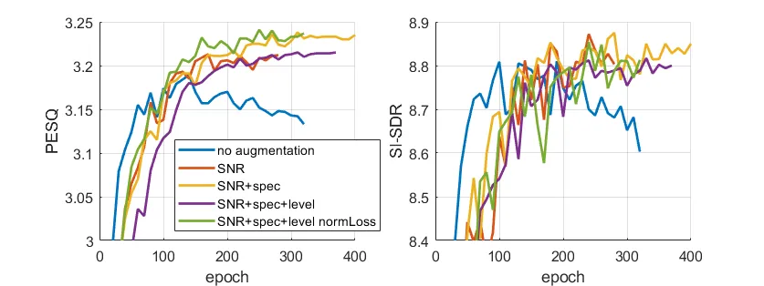

# Data augmentation and loss normalization for deep noise suppression

Sebastian Braun    Ivan Tashev Affiliation: Microsoft Research,Redmond,
WA, USA

https://www.microsoft.com/en-us/research/group/audio-and-acoustics-research-group
E-mail [{sebastian.braun,
ivantash}@microsoft.com](mailto:%7Bsebastian.braun,%20ivantash%7D@microsoft.com)

###### Abstract

Speech enhancement using neural networks is recently receiving large
attention in research and being integrated in commercial devices and
applications. In this work, we investigate data augmentation techniques
for supervised deep learning-based speech enhancement. We show that not
only augmenting SNR values to a broader range and a continuous
distribution helps to regularize training, but also augmenting the
spectral and dynamic level diversity. However, to not degrade training
by level augmentation, we propose a modification to signal-based loss
functions by applying sequence level normalization. We show in
experiments that this normalization overcomes the degradation caused by
training on sequences with imbalanced signal levels, when using a
level-dependent loss function.

###### Keywords: 

data augmentation speech enhancement deep noise suppression.

## 1 Introduction

Speech enhancement using neural networks has recently seen large
attention and success in research \[1, 2\] and is being implemented in
commercial applications also targeting real-time communication. An
exciting property of deep learning-based noise suppression is that it
also reduces highly non-stationary noise and background sounds such as
barking dogs, banging kitchen utensils, crying babys, construction or
traffic noise, etc. This has not been possible so far using
single-channel statistical model-driven speech enhancement techniques
that often only reduce quasi-stationary noise \[3, 4, 5\]. Notable
approaches towards real-time implementations have been proposed e. g. 
in \[6, 7, 8, 9, 10\].

The dataset is a key part of data-driven learning approaches, especially
for supervised learning. It is a challenge to build a dataset that is
large enough to generalize well, but still represents the expected
real-world data sufficiently. Data augmentation techniques can not only
help to control the amount of data, but is also necessary to synthesize
training data that represents all effects encountered in practice.

While in many publications, data corpus generation is only roughly
outlined due to lack of space, or often exclude several key practical
aspects, we direct this paper on showing contributions on several
augmentation techniques when synthesizing a noisy and target speech
corpus for speech enhancement. In particular, we show the effects of
increasing the SNR range and using a continuous instead of discrete
distribution, spectral augmentation by applying random spectral shaping
filters to speech and noise, and finally level augmentation to increase
robustness of the network against varying input signal levels.

As we found that level augmentation can decrease the performance when
using signal-level dependent losses, we propose a normalization
technique for the loss computation that can be generalized to any other
signal-based loss. We show in experiments on the CHIME-2 challenge
dataset that the augmentation techniques and loss normalization
substantially improve the training procedure and the results.

In this paper, we first introduce a the general noise suppression task
in Section 2. In Section 3, we describe the used real-time noise
suppression system based on a recurrent network, that works on a single
frame in - single frame out basis, i. e.  requires no look-ahead and
memory buffer, and describe the training setup. In Section 4, we
describe the used loss function and propose a normalization to remove
the signal level dependency of the loss. In Section 5, we describe
augmentation techniques for SNR (SNR), spectral shaping, and sequence
level dynamics. The experiments are shown in Section 6, and Section 7
concludes the paper.

## 2 Deep Learning Based Noise Suppression

In a pure noise reduction task, we assume that the observed signal is an
additive mixture of the desired speech and noise. We denote the observed
signal $`X(k,n)`$ directly in the STFT (STFT) domain, where $`k`$ and
$`n`$ are the frequency and time frame indices as

```math
X(k,n)=S(k,n)+N(k,n), \tag{1}
```

where $`S(k,n)`$ is the speech and $`N(k,n)`$ is the disturbing noise
signal. Note that the speech signal $`S(k,n)`$ can be reverberant, and
we only aim at reducing additive noise.

The objective is to recover an estimate $`\widehat{S}(k,n)`$ of the
speech signal by applying a filter $`G(k,n)`$ to the observed signal by

```math
\widehat{S}(k,n)=G(k,n)\,X(k,n). \tag{2}
```

The filter $`G(k,n)`$ can be either a real-valued suppression gain, or a
complex-valued filter. While the former option (also known as _mask_)
only recovers the speech amplitude, a complex filter could potentially
also correct the signal phase. In this work, we use a suppression gain.

## 3 Network and Training

We use a rather straightforward recurrent network architecture based on
GRU \[11\] and FF (FF) layers, similar to the core architecture of
\[12\] without convolutional encoder layers. Input features are the
logarithmic power spectrum $`P=\log_{10}(|X(k,n)|^{2}+\epsilon)`$,
normalized by the global mean and variance of the training set. We use a
STFT size of 512 with 32 ms square-root Hann windows and 16 ms frame
shift, but feed only the relevant 255 frequency bins into the network,
omitting 0th and highest (Nyquist) bins, which do not carry useful
information. The network consists of a FF embedding layer, two GRU, and
three FF mapping layers. All FF layers use ReLU (ReLU) activations,
except for the last output layer. When estimating a real-valued
suppression gain, a _Sigmoid_ activation is used to ensure positive
output. The network architecture is shown in Fig. 1, and has 2.8 M
parameters.

Figure 1: Network architecture and enhancement system and training
procedure.

The network was trained using the AdamW optimizer \[13\] with an initial
learning rate of $`10^{-4}`$, which was dropped by a factor of 0.9 if
the loss plateaued for 5 epochs. The training was monitored every 10
epochs using a validation subset. The best model was chosen based on the
highest PESQ (PESQ) \[14\] on the validation set. All hyper-parameters
were optimized by a grid search and choosing the best performing
parameter for PESQ on the validation set.

## 4 Level Invariant Normalized Loss Function

The speech enhancement loss function is typically a distance metric
between the enhanced and target spectral representations. The
dynamically compressed loss proposed in \[15, 16\] has been shown to be
very effective. A compression exponent of $`0<c\leq 1`$ is applied to
the magnitudes, while the compressed magnitudes are combined with the
phase factors again. Furthermore, the magnitude only loss is blended
with the complex loss with a factor $`0\leq\alpha\leq 1`$.

```math
\mathcal{L}=\alpha\sum_{k,n}\left||S|^{c}e^{j\varphi_{S}}-|\widehat{S}|^{c}e^{j\varphi_{\widehat{S}}}\right|^{2}+(1-\alpha)\sum_{k,n}\left||S|^{c}-|\widehat{S}|^{c}\right|^{2}. \tag{3}
```

We chose $`c=0.3`$ and $`\alpha=0.3`$.

A common drawback of all similar signal-based loss functions is the
dependency on the level of the signals $`S`$ and $`\widehat{S}`$. This
might have an impact on the loss when computing the loss over a batch of
several sequences, which exhibit large dynamic differences. It could be
that large signals dominate the loss, creating less balanced training.

Therefore, we propose to normalize the signals $`S`$ and $`X`$ by the
active signal level of each utterance, before computing the loss. The
normalized loss is computed as given by (3), but using the normalized
signals $`\tilde{S}=\frac{S}{\sigma_{S}}`$ and
$`\tilde{X}=\frac{X}{\sigma_{S}}`$, where $`\sigma_{S}`$ is the active
speech level per utterance, i.e. the target speech signal standard
deviation computed only for active speech frames. Note that this
normalization does not affect the input features of the network: they
still exhibit the original dynamic levels.

## 5 Data Augmentation Techniques

Especially for small and medium-scale datasets, augmentation is a
powerful tool to improve the results. In the case of supervised speech
enhancement training, where the actual noisy audio training data is
generated synthetically by mixing speech and noise, there are some
augmentation steps, which are essential to mimic effects on data
encountered in the wild. Disregarding reverberation, we need to be able
to deal with different SNR, audio levels, and filtering effects that can
be caused e.g. by acoustics (room, occlusion), or the recording device
(microphone, electronic transfer functions).

Figure 2: On-the-fly training augmented data generation.

Our augmentation pipeline is shown in Fig. 2. Before mixing speech with
noise, we applied random biquad filters \[7\] to each noise sequence and
speech sequences separately to mimic different acoustic transmission
effects. From these signals, active speech and noise levels are computed
using a level threshold-based VAD (VAD). Speech and noise sequences are
then mixed with a given SNR on-the-fly during training. After mixing,
the mixture is scaled using a given level distribution. The clean speech
target is scaled by the same factor as the mixture. The data generation
and augmentation procedure is depicted in Fig. 2.

## 6 Experiments

### 6.1 Dataset and Experimental Setup

We used the CHIME-2 WSJ-20k dataset \[17\], which is currently, while
only being of medium size, the only realistic self-contained public
dataset including matching reverberant speech and noise conditions. The
dataset contains 7138, 2418, and 1998 utterances for training,
validation and testing, respectively. The utterances are reverberant
using binaural room impulse responses, and noise from the same rooms was
added with SNR in the range of -6 to 9 dB in the validation and test
sets. We used only the left channel for our single-channel experiments.

The spectral augmentation filters are designed as proposed in \[7\] by

```math
H(z)=\frac{1+r_{1}z^{-1}+r_{2}z^{-2}}{1+r_{3}z^{-1}+r_{4}z^{-2}} \tag{4}
```

with $`r_{i}`$ being uniformly distributed in
$`[-\frac{3}{8},\frac{3}{8}]`$. For SNR augmentation, the mixing SNR
were drawn from a Gaussian distribution on the logarithmic scale with
mean 5 dB and standard deviation 10 dB. The signal levels for dynamic
range augmentation were drawn from a Gaussian distribution with mean
-28 dBFS and variance 10 dB.

We evaluate our experiments on the development and test set from the
CHIME-2 challenge. As objective metrics, we use PESQ \[14\], STOI (STOI)
\[18\], SI-SDR (SI-SDR) \[19\], CD (CD), and fwSegSNR (fwSegSNR) \[20\].

### 6.2 Results



Figure 3: Validation metrics for various augmentation techniques.

Fig. 3 shows the training progression in terms of PESQ and SI-SDR on the
validation set. The blue curve shows training on the original data
without any augmentation, mixed the 6 different SNR levels between -6
and 9 dB. We can see that the validation metrics decrease after 150
epochs. When applying SNR augmentation (red curve) with a broader and
continuous distribution, we prevent the early validation decrease and
can train for 280 epochs. Further, adding spectral augmentation
increases the validation PESQ slightly. However, the level augmentation
when training with standard loss (3) (purple curve) decreases the
performance compared to SNR and spectral augmentation only. We attribute
this effect to the large level imbalance per batch, which affects the
standard level-dependent loss function. When computing the loss from
normalized signals (green curve), this drawback is overcome and we
obtain similar or even slightly better results than the yellow curve,
but making the system robust to varying input signal levels.

| augmentation   | loss       | PESQ | STOI  | CD   | SI-SDR | fwSegSNR |
| -------------- | ---------- | ---- | ----- | ---- | ------ | -------- |
| \-             | noisy      | 2.29 | 81.39 | 5.46 | 1.92   | 16.96    |
| none           | standard   | 3.27 | 91.20 | 2.90 | 9.48   | 23.57    |
| SNR            | standard   | 3.31 | 91.40 | 2.85 | 9.45   | 23.30    |
| SNR+spec       | standard   | 3.32 | 91.57 | 2.89 | 9.55   | 23.30    |
| SNR+spec+level | standard   | 3.30 | 91.68 | 2.87 | 9.57   | 23.48    |
| SNR+spec+level | normalized | 3.31 | 91.55 | 2.89 | 9.52   | 23.41    |

Table 1: Evaluation metrics on CHIME-2 test set.

The validation SI-SDR shows similar behavior as PESQ.

Tab. 1 shows the results on the CHIME-2 test set. The enhancement
systems improve all results substantially over the noisy input. Adding
SNR augmentation adds a gain of 0.05 PESQ. As in the development set,
spectral augmentation adds an additional minor improvement.
Interestingly, on the test set, the normalized loss shows no influence
on the results. We assume this is due to that fact that the given test
set does not exhibit largely varying signal levels.

## 7 Conclusion

We have shown the effectivity of data augmentation techniques for
supervised deep learning-based speech enhancement by augmenting the SNR,
spectral shapes, and signal levels. As level augmentation degrades the
performance of the learning algorithm when using level-dependent losses,
we proposed a normalization technique for the loss, which is shown to
overcome this issue. The experiments were conducted using a real-time
capable recurrent neural network on the reverberant CHIME-2 dataset.
Future work will also investigate augmentation for acoustic conditions
with reverberant impulse responses.

## References

- \[1\] Wang, D., Chen, J.: Supervised speech separation based on deep
  learning: An overview. IEEE/ACM Trans. Audio, Speech, Lang. Process.
  26(10), 1702–1726 (Oct 2018)
- \[2\] Reddy, C.K.A., Beyrami, E., Dubey, H., V., G., Cheng, R.,
  Cutler, R., Matusevych, S., Aichner, R., Aazami, A., Braun, S., P.,
  R., Srinivasan, S., Gehrke, J.: The interspeech 2020 deep noise
  suppression challenge: Datasets, subjective speech quality and testing
  framework. In: to appear in Proc. Interspeech 2020
- \[3\] Ephraim, Y., Malah, D.: Speech enhancement using a minimum-mean
  square error short-time spectral amplitude estimator. IEEE Trans.
  Acoust., Speech, Signal Process. 32(6), 1109–1121 (Dec 1984)
- \[4\] Gerkmann, T., Hendriks, R.C.: Noise power estimation based on
  the probability of speech presence. In: Proc. IEEE Workshop on
  Applications of Signal Processing to Audio and Acoustics (WASPAA). pp.
  145–148 (Oct 2011)
- \[5\] Martin, R.: Noise power spectral density estimation based on
  optimal smoothing and minimum statistics. IEEE Trans. Speech Audio
  Process. 9, 504–512 (Jul 2001)
- \[6\] Tu, Y.H., Tashev, I., Zarar, S., Lee, C.: A hybrid approach to
  combining conventional and deep learning techniques for single-channel
  speech enhancement and recognition. In: Proc. IEEE Intl. Conf. on
  Acoustics, Speech and Signal Processing (ICASSP). pp. 2531–2535
  (April 2018)
- \[7\] Valin, J.: A hybrid DSP/deep learning approach to real-time
  full-band speech enhancement. In: 20th Intl. Workshop on Multimedia
  Signal Processing (MMSP). pp. 1–5 (Aug 2018)
- \[8\] Tan, K., Wang, D.: A convolutional recurrent neural network for
  real-time speech enhancement. In: Proc. Interspeech. pp.
  3229–3233 (2018)
- \[9\] Wichern, G., Lukin, A.: Low-latency approximation of
  bidirectional recurrent networks for speech denoising. In: Proc. IEEE
  Workshop on Applications of Signal Processing to Audio and Acoustics
  (WASPAA). pp. 66–70 (Oct 2017)
- \[10\] Xia, R., Braun, S., Reddy, C., Dubey, H., Cutler, R., Tahev,
  I.: Weighted speech distortion losses for neural-network-based
  real-time speech enhancement. In: Proc. IEEE Intl. Conf. on Acoustics,
  Speech and Signal Processing (ICASSP) (2020)
- \[11\] Cho, K., Merriënboer, B.V., Bahdanau, D., , Bengio, Y.: On the
  properties of neural machine translation: Encoder-decoder approaches.
  In: Proc. Eighth Workshop on Syntax, Semantics and Structure in
  Statistical Translation (SSST-8) (2014)
- \[12\] Wisdom, S., Hershey, J.R., Wilson, K., Thorpe, J., Chinen, M.,
  Patton, B., Saurous, R.A.: Differentiable consistency constraints for
  improved deep speech enhancement. In: Proc. IEEE Intl. Conf. on
  Acoustics, Speech and Signal Processing (ICASSP). pp. 900–904
  (May 2019)
- \[13\] Loshchilov, I., Hutter, F.: Decoupled weight decay
  regularization. In: International Conference on Learning
  Representations (2019), https://openreview.net/forum?id=Bkg6RiCqY7
- \[14\] ITU-T: Recommendation P.862: Perceptual evaluation of speech
  quality (PESQ), an objective method for end-to-end speech quality
  assessment of narrowband telephone networks and speech codecs
  (Feb 2001)
- \[15\] Ephrat, A., Mosseri, I., Lang, O., Dekel, T., Wilson, K.,
  Hassidim, A., Freeman, W.T., Rubinstein, M.: Looking to listen at the
  cocktail party: A speaker-independent audio-visual model for speech
  separation. ACM Trans. Graph. 37(4) (Jul 2018)
- \[16\] Wilson, K., Chinen, M., Thorpe, J., Patton, B., Hershey, J.,
  Saurous, R.A., Skoglund, J., Lyon, R.F.: Exploring tradeoffs in models
  for low-latency speech enhancement. In: Proc. Intl. Workshop Acoust.
  Signal Enhancement (IWAENC). pp. 366–370 (Sep 2018)
- \[17\] Vincent, E., Barker, J., Watanabe, S., Nesta, F.: The second
  ’CHIME’ speech separation and recognition challenge: datadata, tasks
  and baselines. In: Proc. IEEE Intl. Conf. on Acoustics, Speech and
  Signal Processing (ICASSP) (June 2012)
- \[18\] Taal, C.H., Hendriks, R.C., Heusdens, R., Jensen, J.: An
  Algorithm for Intelligibility Prediction of Time-Frequency Weighted
  Noisy Speech. IEEE Trans. Audio, Speech, Lang. Process. 19(7),
  2125–2136 (Sept 2011)
- \[19\] Roux, J.L., Wisdom, S., Erdogan, H., Hershey, J.R.: SDR -
  half-baked or well done? In: Proc. IEEE Intl. Conf. on Acoustics,
  Speech and Signal Processing (ICASSP). pp. 626–630 (May 2019)
- \[20\] Hu, K., Divenyi, P., Ellis, D., Jin, Z., Shinn-Cunningham,
  B.G., Wang, D.: Preliminary intelligibility tests of a monaural speech
  segregation system. In: Proc. Workshop on Statistical and Perceptual
  Audition. Brisbane (Sep 2008)
