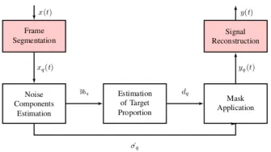
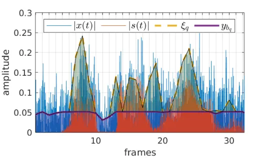
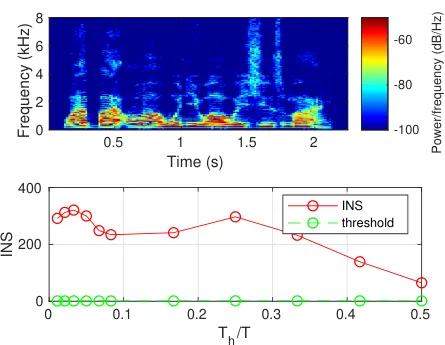
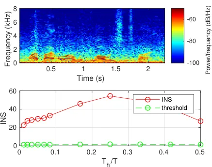
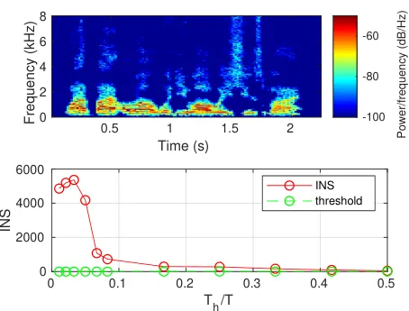
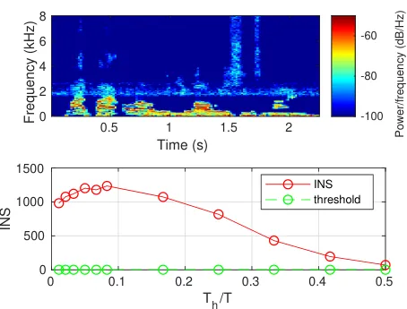
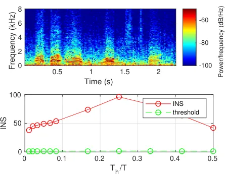

# Blind Mask to Improve Intelligibility of Non-Stationary Noisy Speech

F. Farias    R. Coelho ^(†)^(†)thanks: The authors are with the
Laboratory of Acoustic Signal Processing, Military Institute of
Engineering, Rio de Janeiro, RJ, Brazil. This work was partially
supported by the National Council for Scientific and Technological
Development (CNPq) under grant 308155/2019-0 and Fundação de Amparo à
Pesquisa do Estado do Rio de Janeiro (FAPERJ) under grant
26/203.075/2016. This work is also supported by the Coordenação de
Aperfeiçoamento de Pessoal de Nível Superior (CAPES)-Grant Code 001.
Email: coelho@ime.eb.br.

###### Abstract

This letter proposes a novel blind acoustic mask (BAM) designed to
adaptively detect noise components and preserve target speech segments
in time-domain. A robust standard deviation estimator is applied to the
non-stationary noisy speech to identify noise masking elements. The main
contribution of the proposed solution is the use of this noise
statistics to derive an adaptive information to define and select
samples with lower noise proportion. Thus, preserving speech
intelligibility. Additionally, no information of the target speech and
noise signals statistics is previously required to this non-ideal mask.
The BAM and three competitive methods, Ideal Binary Mask (IBM), Target
Binary Mask (TBM), and Non-stationary Noise Estimation for Speech
Enhancement (NNESE), are evaluated considering speech signals corrupted
by three non-stationary acoustic noises and six values of
signal-to-noise ratio (SNR). Results demonstrate that the BAM technique
achieves intelligibility gains comparable to ideal masks while
maintaining good speech quality.

###### Index Terms: 

acoustic mask, adaptive methods, speech intelligibility, nonstationarity

## I Introduction

Most everyday listening experiences are in the presence of acoustic
noise such as car noise, people talking in the background, construction
noise, rain and other natural phenomenons. These effects may add
unwanted content to a target speech signal while diminish its
intelligibility \[1\] and its quality \[2\]. Applications such as
speaker recognition, speech to text and source localization exhibit
lower accuracy when the signal is corrupted by additive noise. Thus, the
mitigation of this acoustic interference in noisy speech is an important
research topic. The solutions proposed in the literature are mainly
twofold: speech enhancement methods to increase quality, and binary
acoustic masks to improve intelligibility.

Speech enhancement schemes mitigate the masking interference to improve
the noisy signal quality, usually estimating the noise statistics. These
noise estimation approaches generally consider the frequency or the time
domain. Methods in the frequency domain, such as Spectral Subtraction
(SS) \[3\] and the Optimally Modified Log-Spectral Amplitude (OMLSA)
\[4\] use some transform to represent signals in the frequency domain
and then estimate the noise components. Methods in the time domain
usually estimate noise statistics with statistical estimators as the
present in Non-stationary Noise Estimation for Speech Enhancement
(NNESE) \[5\] or time-frequency decomposition, e.g. in the EMD-Based
filtering with Hurst exponent (EMDH) \[6, 7\]. Although speech
enhancement algorithms successfully improve speech quality, they are not
designed to achieve intelligibility gain. This is particularly
challenging in non-stationary environments. In some cases, the
suppression of noisy components causes a distortion that hinders
intelligibility \[8\].

Acoustic masks \[9, 10, 11\] are developed to reduce the perceptual
effects of noisy speech to increase intelligibility of a variety of
applications. These methods are devised to emulate the capacity of the
human auditory system to segregate a specific sound even in the presence
of many others, also known as the cocktail party effect \[12\]. Acoustic
binary masks can be classified as ideal or blind. Ideal masks are
constructed using information of the clean speech, as well as the noisy
speech. The Ideal Binary Mask (IBM) \[13\] is built comparing the energy
of the signal and of the noise in each Time-Frequency (T-F) region. The
Target Binary Mask (TBM) \[14\] builds its mask comparing the energy of
the clean signal with the Speech Shaped Noise (SSN). Blind masks are
made based on an estimation of clean speech characteristics from the
noisy signal \[15, 16\]. However, the accuracy of this estimation
usually depends on extensive training using neural networks and large
databases. Binary masked speech may present high objective quality
scores, but the abrupt difference between the retained and discarded
regions of a binary masked signal often cause musical noise, which can
lead to quality loss\[17\].

This letter proposes a blind acoustic mask in the time domain to improve
speech intelligibility. The main idea of this strategy is to estimate
noise components and the proportion of the speech signal in each
short-time frame. This information is used to delimit a set of samples
proportional to the presence of the target signal in each frame, so if
the frame is mostly comprised by the target signal, these samples take
most of the frame. While the frame is processed to mitigate the effects
of noise, the samples in the delimited set are preserved, thus
maintaining speech intelligibility. Additionally, as a blind mask it
avoids the usage of previous information from the clean speech and
noise.

Several experiments are conducted to evaluate the proposed mask in terms
of speech intelligibility and quality. The noisy scenario is composed by
three background acoustic noises with six different SNR values. Three
objective measures are adopted for intelligibility evaluation. While
Short Time Objective Intelligibility (STOI) \[18\] is the
state-of-the-art in intelligibility prediction, the Approximated
Short-Time Speech Intelligibility Index (ASII) \[19\] and Extended
Speech Intelligibility Index (ESII) \[20\] are designed to deal with
non-stationary distortions. Objective quality evaluation is also
performed using Perceptual Evaluation of Speech Quality (PESQ) \[21\]
measure. The Index of Non-Stationarity (INS) \[22\] is also selected to
analyse the effect of the proposed mask and the competing methods.

## II BAM: Blind Acoustic Mask

The schematic of the proposed blind acoustic mask is depicted in Figure

1. It consists of three main steps: First, the signal is separated into
   non-overlapping short-time frames. In each frame, the noise standard
   deviation is detected using a robust estimator. In the second step, this
   information is used to derive the parameter $`d_{q}`$ that refers to the
   proportion of speech that is present in the $`q`$-th frame. Then the
   adaptive mask is applied in each frame, according to the parameter
   $`d_{q}`$, and the processed frames are concatenated to reconstruct the
   processed signal. This mask employs the noise statistics estimation used
   in \[5\]. The aim is to improve intelligibility of speech corrupted by
   additive noise, while maintaining the quality gain obtained using a
   speech enhancement technique.



Fig. 1: Schematic of the proposed Blind Acoustic Mask.

### II-A Step 1: Noise Components Estimation

This step begins with the segmentation of the signal in non-overlapping
short-time frames. In each frame, the $`d`$-Dimensional Trimmed
Estimator (DATE) \[23\] is used to detect the noise standard deviation.
This estimator was first defined to work on signals mixed with Gaussian
noise over the entire signal. However, as shown in \[5\] it also works
with different noise distributions.

First, the samples $`x_{q}(t)`$ from the $`q`$-th frame are organized
from lower to higher amplitude $`Y_{1}\leq Y_{2}\leq...\leq Y_{T}`$.
Then a value $`t_{min}`$ is computed, such as the sample amplitudes
lower than $`Y_{t_{min}}`$ are considered as only noise. The value of
$`b_{q}`$ is the lowest value of $`t`$ that is higher than $`t_{min}`$
and obeys the relation
$`||Y_{t-1}||\leq\frac{c\sum_{i=1}^{T}||Y_{i}||}{t}\leq||Y_{t+1}||`$,
where $`c`$ is an adjustment factor that depends on the detection
threshold. The noise standard deviation for that frame is then estimated
as

```math
\hat{\sigma_{q}}=\frac{c\sum_{i=1}^{b_{q}}||Y_{i}||}{b_{q}}. \tag{1}
```

In this step it is also defined the value $`y_{b_{q}}`$, amplitude from
the vector $`Y_{i}`$ associated to the value $`b_{q}`$. Any sample lower
than $`y_{b_{q}}`$ is considered as noise.

### II-B Step 2: Estimation of Target Proportion $`d_{q}`$

The removal of samples with amplitude values below $`y_{b_{q}}`$ may
yield an improvement in quality. However, some of those frames are
mainly composed by the target signal. The modification of samples from
those frames usually compromises intelligibility. Thus, a parameter
$`d_{q}`$ is defined to identify frames where the target signal is
prevalent:

```math
d_{q}=\frac{|\sigma_{q_{ny}}-\hat{\sigma_{q}}|}{|\sigma_{q_{ny}}+\hat{\sigma_{q}}|} \tag{2}
```

where $`\hat{\sigma_{q}}`$ is the estimated noise standard deviation of
the frame $`q`$ and $`\sigma_{q_{ny}}`$ is the noisy signal standard
deviation.



Fig. 2: Clean speech signal $`|s(t)|`$, corresponding speech signal
corrupted with Babble noise at SNR = -6 dB $`|x(t)|`$, lower threshold
$`y_{bq}`$ and upper threshold $`\xi_{q}`$.

### II-C Step 3: Mask Application

The proposed mask defines which samples are left unaltered in each
frame. These samples correspond to a region where $`d_{q}`$ is greater
than the lower amplitude $`y_{b_{q}}`$. The lower bound of this region
is defined by $`y_{b_{q}}`$ and the upper bound is defined through an
adaptive threshold $`\xi_{q}`$.

```math
\xi_{q}=max(y_{b_{q}},d_{q}). \tag{3}
```

Each sample of the $`q`$-th frame of the processed signal is then given
by

```math
y_{q}(t)=\begin{cases}x_{q}(t),&\text{if }y_{b_{q}}<x_{q}(t)<\xi_{q};\\
x_{q}(t)-\alpha\cdot\hat{\sigma_{q}},&\text{if }x_{q}(t)\geq\xi_{q};\\
\beta\cdot x_{q}(t),&\text{otherwise}.\end{cases} \tag{4}
```

where $`\alpha`$ is the over-subtraction factor for the speech signal
reconstruction and $`\beta`$ is the flooring factor for negative
amplitude values. The frames are then concatenated to form the processed
signal $`y(t)`$.



(a) Clean



(b) Noisy



(c) IBM



(d) TBM



(e) BAM

Fig. 3: Spectrograms and INS of (a) clean speech, (b) unprocessed speech
corrupted with Factory noise at SNR = 3 dB, noisy speech processed with
(c) IBM, (d) TBM and (e) the proposed BAM.

The region in each frame is illustrated in Figure 2, which depicts the
clean signal $`s(t)`$, the noisy signal $`x(t)`$, the lower bound
$`y_{b_{q}}`$ and upper threshold $`\xi_{q}`$ of the masked region for
each frame $`q`$. Note that frames 23-27 are mainly composed by speech.
Thus, the mask preserves most of the signal in these frames.

## III Experiments and Discussion

|           |            |       |       |       |       |       |
| --------- | ---------- | ----- | ----- | ----- | ----- | ----- |
|           | STOI       |       |       |       |       |       |
| SNR (dB)  | -6         | -5    | -3    | 0     | 3     | 5     |
| Babble    | 0.355      | 0.356 | 0.388 | 0.447 | 0.499 | 0.529 |
| Cafeteria | 0.357      | 0.381 | 0.419 | 0.458 | 0.503 | 0.540 |
| Factory   | 0.436      | 0.476 | 0.506 | 0.557 | 0.601 | 0.654 |
|           | ASII\_(ST) |       |       |       |       |       |
| SNR (dB)  | -6         | -5    | -3    | 0     | 3     | 5     |
| Babble    | 0.348      | 0.365 | 0.391 | 0.433 | 0.497 | 0.519 |
| Cafeteria | 0.364      | 0.377 | 0.410 | 0.446 | 0.504 | 0.523 |
| Factory   | 0.398      | 0.415 | 0.446 | 0.501 | 0.555 | 0.586 |
|           | ESII       |       |       |       |       |       |
| SNR (dB)  | -6         | -5    | -3    | 0     | 3     | 5     |
| Babble    | 0.306      | 0.329 | 0.361 | 0.416 | 0.497 | 0.525 |
| Cafeteria | 0.327      | 0.344 | 0.386 | 0.432 | 0.505 | 0.528 |
| Factory   | 0.371      | 0.394 | 0.433 | 0.503 | 0.570 | 0.608 |

TABLE I: Intelligibility measures for UNP speech signals.

The proposed technique is evaluated in terms of intelligibility and
quality considering several noisy conditions. It is compared to baseline
speech enhancement NNESE \[5\], and acoustic masks TBM \[14\] and IBM
\[12\]. The speech enhancement is considered the baseline for quality
gain, as the IBM for intelligibility improvement. For the objective
evaluation, a subset of 20 utterances from the TIMIT database \[24\] is
randomly selected to compose each scenario, leading to 120 tests per
method. Each segment is sampled at 16 kHz and has average time duration
of 3 seconds. The acoustic noises Babble and Factory were selected from
the RSG-10 \[25\] database while Cafeteria noise was selected from
DEMAND \[26\] database.

Speech signals are corrupted considering six SNRs: -6 dB, -5 dB, -3 dB,
0 dB, 3 dB and 5 dB. NNESE and the proposed mask are applied on a 32 ms
frame-by-frame basis. Parameters $`\alpha`$ and $`\beta`$ are set to
$`\alpha=0.35`$ and $`\beta=0.65`$. IBM and TBM separate signals in 20
ms Time-Frequency regions, with 10 ms overlapping. Frequency separation
is performed through a 64-channel gammatone filterbank with center
frequencies ranging from 50 to 8000 Hz according to the Equivalent
Rectangular Bandwidth\[27\]. The IBM Relative Criterion is set to -5 dB,
as recommended in \[28\]. The TBM is set to detect $`99\%`$ of the
speech energy in each frame.

The intelligibility scores of the unprocessed signals are presented in
Table I. The SNR values were chosen such as the STOI score of the UNP
signals vary between 0.45 and 0.75, which are considered the threshold
of poor and good intelligibility, respectively \[29\].

Table II indicates the computational complexity, here represented by the
processing time required for each method evaluated for 512 samples per
frame. These values are normalized by the execution time of the proposed
BAM. Note that the proposed mask is almost 10 times faster than the
binary masks.

|       |     |     |     |
| ----- | --- | --- | --- |
| NNESE | IBM | TBM | BAM |
| 0.5   | 9.4 | 9.2 | 1.0 |

TABLE II: Normalized Mean Processing Time.

### III-A Index of Non-Stationarity

The Index of Non-Stationarity (INS) \[22\] is here adopted to
objectively evaluate the non-stationarity of noisy speech signals. This
measure is obtained comparing the target signal with a set of stationary
references called surrogates at different time scales $`T_{h}/T`$, where
$`T_{h}`$ is a short-time analysis window and $`T`$ is the total
duration of the signal. The surrogates are obtained from the signal,
maintaining the magnitude of the data spectrum and replacing the phase
by a random sequence uniformly distributed. A threshold $`\gamma`$ is
defined for each window length $`T_{h}`$, considering a confidence
degree of 95%.

```math
INS\begin{cases}\leq\gamma,\text{signal is stationary};\\
>\gamma,\text{signal is non-stationary}.\end{cases}
```

Figure 3 depicts spectrograms and INS values for a speech signal, the
corresponding signal with Factory noise at 3 dB, the noisy signal
processed by the IBM, TBM, and the proposed BAM. Note that the noise
modifies the temporal and spectral characteristics of the clean signal.
The non-stationary behavior of the speech is also softened by noise. The
maximum INS ($`INS_{max}`$) changes from 320 in speech signal to 55 in
noisy speech. The proposed BAM restores some of the spectral and
temporal characteristics of the signal. This can be seen near 0.5 s,
where the separation between formants is lost by the noise and recovered
processing with BAM. Additionally, the proposed mask restores some of
the non-stationary behavior of the signal, the $`INS_{max}`$ value is
increased to 95. Although the TBM and IBM repair some of the spectral
characteristics of the speech signal, they significantly increase the
non-stationarity degree. The $`INS_{max}`$ reaches values above 5000
using the IBM and above 1200 using the TBM. The $`INS_{max}`$ values
achieved for IBM and TBM are explained by its binary effect particularly
for zeroing masking condition. Table III presents the maximum INS for
speech with three studied additive noises. The effect of the proposed
BAM depicted in Figure 3 is also present in the Cafeteria noise, while
in Babble noise there is a slight decrease in INS.

| noise     | UNP  | IBM    | TBM    | BAM  |
| --------- | ---- | ------ | ------ | ---- |
| Babble    | 80.2 | 6200.4 | 1280.6 | 64.2 |
| Cafeteria | 35.3 | 5138.3 | 1290.7 | 56.0 |
| Factory   | 54.4 | 5368.8 | 1235.0 | 96.0 |

TABLE III: $`INS_{max}`$ for UNP and masked signal.

Fig. 4: Average improvement in intelligibility for noisy speech with
Babble, Cafeteria and Factory.

### III-B Objective Intelligibility Evaluation

Three objective measures are adopted to evaluate intelligibility gain of
the proposed mask and the competitive methods. STOI \[18\] is a measure
developed to predict the intelligibility of noisy speech processed by
T-F weighting masks, such as speech enhancement methods. The metric is
the correlation coefficient between the spectral envelopes of clean and
enhanced signal. ASII*(ST) \[19\] and ESII \[20\] are based on the
classic Speech Intelligibility Index (SII) \[30\], designed to deal with
the non-stationarity of speech and its distortions. The ESII score is
the average of the SII in each short-time frame of the signal. ASII*(ST)
is an adaptation of the ESII, modelling intelligibility after a function
of the SII. Both measures are based on the weighted SNR of the signal.
All measures vary between 0 and 1, in which 1 represents a fully
intelligible sentence. The STOI objective measure is normalized by the
intelligibility achieved for the target signal corrupted by SSN noise at
10 dB, considered here as a good intelligibility reference.

The average improvement in intelligibility is presented in Figure 4.
Considering $`\Delta`$STOI, in the top row figures, as the baseline for
speech intelligibility, IBM presents the highest average intelligibility
improvement, 0.25 for Babble noise, followed by 0.19 for the proposed
BAM and 0.17 for the proposed TBM. While in Cafeteria noise the
improvement is similar to the obtained in Babble, in Factory noise the
improvement by all methods is lower (0.19 by IBM, 0.15 by BAM and 0.14
by TBM). Though it can be noticed that speech with Factory noise
achieves the highest UNP intelligibility.

The improvement obtained by ASII*(ST) measure ($`\Delta`$ASII*(ST)) is
shown in the middle row. It can be seen that the proposed mask improves
intelligibility in almost every condition, but this effect is
accentuated in lower SNRs. The average ASII\_(ST) improvement of the mask
considering SNR = -3 dB is 0.08, while the improvement with SNR = 3 dB
is 0.02. It is also noted that the proposed mask achieves superior gain
when compared to TBM for SNR values above 0 dB.

The ESII improvement ($`\Delta`$ESII) is depicted in the bottom row
figures. Similarly to $`\Delta`$ASII\_(ST) results, the proposed BAM
shows interesting improvement for SNR values lower than 3 dB. Maximum
$`\Delta`$ESII is 0.08 for the Babble noise at SNR = -6 dB, 0.10 for
Cafeteria noise at SNR = -6 dB and 0.09 in Factory noise at the same
SNR. The average improvement is comparable to the achieved by the TBM.

Fig. 5: Average PESQ score for noisy speech with Babble, Cafeteria and
Factory.

### III-C Objective Quality Evaluation

Speech quality is evaluated using the objective PESQ measure \[21\],
developed to assess quality of narrow-banded speech and handset
telephony. The PESQ score varies from -0.5 to 4.5, in which 4.5 is the
maximum quality. A signal is considered of fair quality when its PESQ
score is above 2, given this objective metric aims to predict Mean
Opinion Scores (MOS) \[31\].

PESQ scores are presented in Figure 5. The best quality improvement is
obtained using the IBM in all SNR conditions. The BAM presents the
highest improvement among the remaining techniques. In the Babble noise,
the proposed mask achieves an average PESQ score of 2.64, against 2.60
of the NNESE and 1.80 of the TBM. In the Cafeteria noise, the proposed
mask achieves an average PESQ score of 3.10, against 3.04 of the NNESE
and 2.11 of the TBM. In the Factory noise, score achieved by the mask is
of 2.90, against 2.84 of the NNESE and 2.01 of the TBM.

## IV Conclusion

This letter introduced a time domain blind acoustic mask to improve
intelligibility of speech signals corrupted by non-stationary noises
with different INS and SNR values. The proposed mask is evaluated
considering the STOI, ASII\_(ST), ESII, and PESQ objective measures.
Results demonstrate that the proposed BAM outperforms baseline masks
with an overall gain of $`21.7\%`$ in terms of speech intelligibility
while keeping good quality gain when compared to the speech enhancement
competitive approach.

## References

- \[1\] D. Wang, U. Kjems, M. S. Pedersen, J. B. Boldt, and T. Lunner,
  “Speech intelligibility in background noise with ideal binary
  time-frequency masking,” _The Journal of the Acoustical Society of
  America_, vol. 125, no. 4, pp. 2336–2347, 2009.
- \[2\] Y. Hu and P. C. Loizou, “A comparative intelligibility study of
  single-microphone noise reduction algorithms,” _The Journal of the
  Acoustical Society of America_, vol. 122, no. 3, pp. 1777–1786, 2007.
- \[3\] S. Boll, “Suppression of acoustic noise in speech using spectral
  subtraction,” _IEEE Transactions on Acoustics, Speech, and Signal
  Processing_, vol. 27, no. 2, pp. 113–120, 1979.
- \[4\] I. Cohen, “Optimal speech enhancement under signal presence
  uncertainty using log-spectral amplitude estimator,” _IEEE Signal
  Processing Letters_, vol. 9, no. 4, pp. 113–116, 2002.
- \[5\] R. Tavares and R. Coelho, “Speech enhancement with nonstationary
  acoustic noise detection in time domain,” _IEEE Signal Processing
  Letters_, vol. 23, no. 1, pp. 6–10, 2016.
- \[6\] L. Zão, R. Coelho, and P. Flandrin, “Speech enhancement with emd
  and hurst-based mode selection,” _IEEE/ACM Transactions on Audio,
  Speech, and Language Processing_, vol. 22, no. 5, pp. 899–911, 2014.
- \[7\] R. Coelho and Zão, “Empirical mode decomposition theory applied
  to speech enhancement,” in _Signals and Images: Advances and Results
  in Speech, Estimation, Compression, Recognition, Filtering and
  Processing_. CRC Press, 2015, ch. 5.
- \[8\] P. C. Loizou and G. Kim, “Reasons why current speech-enhancement
  algorithms do not improve speech intelligibility and suggested
  solutions,” _IEEE Transactions on Audio, Speech, and Language
  Processing_, vol. 19, no. 1, pp. 47–56, 2011.
- \[9\] Y. Li and D. Wang, “On the optimality of ideal binary
  time–frequency masks,” _Speech Communication_, vol. 51, no. 3, pp.
  230–239, 2009.
- \[10\] G. Kim and P. C. Loizou, “Improving speech intelligibility in
  noise using a binary mask that is based on magnitude spectrum
  constraints,” _IEEE Signal Processing Letters_, vol. 17, no. 12, pp.
  1010–1013, 2010.
- \[11\] L. Zão, D. Cavalcante, and R. Coelho, “Time-frequency feature
  and ams-gmm mask for acoustic emotion classification,” _IEEE Signal
  Processing Letters_, vol. 21, no. 5, pp. 620–624, 2014.
- \[12\] D. Wang, “On ideal binary mask as the computational goal of
  auditory scene analysis,” in _Speech separation by Humans and
  Machines_. Springer, 2005, pp. 181–197.
- \[13\] G. J. Brown and M. Cooke, “Computational auditory scene
  analysis,” _Computer Speech & Language_, vol. 8, no. 4, pp.
  297–336, 1994.
- \[14\] M. C. Anzalone, L. Calandruccio, K. A. Doherty, and L. H.
  Carney, “Determination of the potential benefit of time-frequency gain
  manipulation,” _Ear and hearing_, vol. 27, no. 5, p. 480, 2006.
- \[15\] O. Yilmaz and S. Rickard, “Blind separation of speech mixtures
  via time-frequency masking,” _IEEE Transactions on Signal Processing_,
  vol. 52, no. 7, pp. 1830–1847, 2004.
- \[16\] O. Hazrati, J. Lee, and P. C. Loizou, “Blind binary masking for
  reverberation suppression in cochlear implants,” _The Journal of the
  Acoustical Society of America_, vol. 133, no. 3, pp. 1607–1614, 2013.
- \[17\] N. Li and P. C. Loizou, “Factors influencing intelligibility of
  ideal binary-masked speech: Implications for noise reduction,” _The
  Journal of the Acoustical Society of America_, vol. 123, no. 3, pp.
  1673–1682, 2008.
- \[18\] C. H. Taal, R. C. Hendriks, R. Heusdens, and J. Jensen, “An
  algorithm for intelligibility prediction of time–frequency weighted
  noisy speech,” _IEEE Transactions on Audio, Speech, and Language
  Processing_, vol. 19, no. 7, pp. 2125–2136, 2011.
- \[19\] C. H. Taal, J. Jensen, and A. Leijon, “On optimal linear
  filtering of speech for near-end listening enhancement,” _IEEE Signal
  Processing Letters_, vol. 20, no. 3, pp. 225–228, 2013.
- \[20\] K. S. Rhebergen and N. J. Versfeld, “A speech intelligibility
  index-based approach to predict the speech reception threshold for
  sentences in fluctuating noise for normal-hearing listeners,” _The
  Journal of the Acoustical Society of America_, vol. 117, no. 4, pp.
  2181–2192, 2005.
- \[21\] I.-T. Recommendation, “Perceptual evaluation of speech quality
  (pesq): An objective method for end-to-end speech quality assessment
  of narrow-band telephone networks and speech codecs,” _Rec. ITU-T P.
  862_, 2001.
- \[22\] P. Borgnat, P. Flandrin, P. Honeine, C. Richard, and J. Xiao,
  “Testing stationarity with surrogates: A time-frequency approach,”
  _IEEE Transactions on Signal Processing_, vol. 58, no. 7, pp.
  3459–3470, 2010.
- \[23\] D. Pastor and F.-X. Socheleau, “Robust estimation of noise
  standard deviation in presence of signals with unknown distributions
  and occurrences,” _IEEE Transactions on Signal Processing_, vol. 60,
  no. 4, pp. 1545–1555, 2012.
- \[24\] J. S. Garofolo, L. F. Lamel, W. M. Fisher, J. G. Fiscus, and
  D. S. Pallett, “DARPA TIMIT acoustic-phonetic continuous speech corpus
  CD-ROM. NIST speech disc 1-1.1,” _NASA STI/Recon technical report n_,
  vol. 93, 1993.
- \[25\] H. J. Steeneken and F. W. Geurtsen, “Description of the RSG-10
  noise database,” _report IZF_, vol. 3, p. 1988, 1988.
- \[26\] J. Thiemann, N. Ito, and E. Vincent, “Demand: a collection of
  multi-channel recordings of acoustic noise in diverse environments,”
  in _Proc. Meetings Acoust_, 2013.
- \[27\] R. D. Patterson, I. Nimmo-Smith, J. Holdsworth, and P. Rice,
  “An efficient auditory filterbank based on the gammatone function,” in
  _a meeting of the IOC Speech Group on Auditory Modelling at RSRE_,
  vol. 2, no. 7, 1987.
- \[28\] U. Kjems, J. B. Boldt, M. S. Pedersen, T. Lunner, and D. Wang,
  “Role of mask pattern in intelligibility of ideal binary-masked noisy
  speech,” _The Journal of the Acoustical Society of America_, vol. 126,
  no. 3, pp. 1415–1426, 2009.
- \[29\] B. Sauert and P. Vary, “Near end listening enhancement: Speech
  intelligibility improvement in noisy environments,” in _2006 IEEE
  International Conference on Acoustics Speech and Signal Processing
  Proceedings_, vol. 1. IEEE, 2006, pp. I–I.
- \[30\] American National Standards Institute, _American National
  Standard: Methods for Calculation of the Speech Intelligibility
  Index_, New York, MY, USA, 1997.
- \[31\] E. Rothauser, “IEEE recommended practice for speech quality
  measurements,” _IEEE Transactions on Audio and Electroacoustics_,
  vol. 17, pp. 225–246, 1969.
