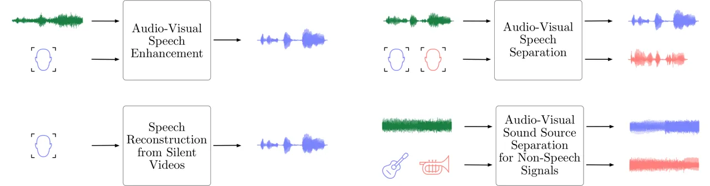

# An Overview of Deep-Learning-Based Audio-Visual Speech Enhancement and Separation

Daniel Michelsanti    Zheng-Hua Tan    Shi-Xiong Zhang    Yong Xu   
Meng Yu    Dong Yu    and Jesper Jensen ^(†)^(†)thanks: D. Michelsanti,
and Z.-H. Tan are with the Department of Electronic Systems, Aalborg
University, Aalborg 9220, Denmark (e-mail:
{danmi,zt}@es.aau.dk).^(†)^(†)thanks: Shi-Xiong˜Zhang, Yong˜Xu, Meng˜Yu,
and˜Dong˜Yu are with Tencent AI Lab, Bellevue, WA, USA (e-mail:
{auszhang, lucayongxu, raymondmyu, dyu}@tencent.com).^(†)^(†)thanks: J.
Jensen is with the Department of Electronic Systems, Aalborg University,
Aalborg 9220, Denmark, and also with Oticon A/S, Smørum 2765, Denmark
(e-mail: jje@es.aau.dk).

###### Abstract

_Speech enhancement_ and _speech separation_ are two related tasks,
whose purpose is to extract either one or more target speech signals,
respectively, from a mixture of sounds generated by several sources.
Traditionally, these tasks have been tackled using signal processing and
machine learning techniques applied to the available acoustic signals.
Since the visual aspect of speech is essentially unaffected by the
acoustic environment, _visual information_ from the target speakers,
such as lip movements and facial expressions, has also been used for
speech enhancement and speech separation systems. In order to
efficiently fuse acoustic and visual information, researchers have
exploited the flexibility of data-driven approaches, specifically _deep
learning_, achieving strong performance. The ceaseless proposal of a
large number of techniques to extract features and fuse multimodal
information has highlighted the need for an overview that
comprehensively describes and discusses audio-visual speech enhancement
and separation based on deep learning. In this paper, we provide a
systematic survey of this research topic, focusing on the main elements
that characterise the systems in the literature: _acoustic features_;
_visual features_; _deep learning methods_; _fusion techniques_;
_training targets_ and _objective functions_. In addition, we review
deep-learning-based methods for _speech reconstruction from silent
videos_ and _audio-visual sound source separation for non-speech
signals_, since these methods can be more or less directly applied to
audio-visual speech enhancement and separation. Finally, we survey
commonly employed _audio-visual speech datasets_, given their central
role in the development of data-driven approaches, and _evaluation
methods_, because they are generally used to compare different systems
and determine their performance.

###### Index Terms: 

Speech enhancement, speech separation, speech synthesis, sound source
separation, deep learning, audio-visual processing.

## I Introduction



Fig. 1: Audio-visual sound source separation tasks. In audio-visual
speech enhancement, the goal is to extract the target speech signal
using a noisy observation of the target speech signal and visual
information. Speech reconstruction from silent videos is a special case
of audio-visual speech enhancement, where the noisy acoustic input
signal is not provided. Audio-visual speech separation aims at
extracting multiple target speech signals from a mixture and visual
information of the target speakers. When the target sources are not
speakers, but, for example, musical instruments, we refer to the task as
audio-visual sound source separation for non-speech signals.

Speech is one of the primary ways in which humans share information. A
model that describes _human speech communication_ is the so-called
_speech chain_, which consists of two stages: _speech production_ and
_speech perception_ \[49\]. Speech production is the set of voluntary
and involuntary actions that allow a person, i.e. a _speaker_, to
convert an idea expressed through a linguistic structure into a sound
pressure wave. On the other hand, speech perception is the process
happening mostly in the auditory system of a _listener_, consisting of
interpreting the sound pressure wave coming from the speaker. Some
external factors, such as acoustic background noise, can have an impact
on the speech chain. Usually, normal-hearing listeners are able to focus
on a specific acoustic stimulus, in our case the _target speech_ or
_speech of interest_, while filtering out other sounds \[24, 233\]. This
well-known phenomenon is called the _cocktail party effect_ \[33\],
because it resembles the situation occurring at a cocktail party.

Generally, the presence of high-level acoustic environmental noise or
competing speakers poses several challenges to the speech communication
effectiveness, especially for hearing-impaired listeners. Similarly, the
performance of automatic speech recognition (ASR) systems can be
severely impacted by a high level of acoustic noise. Therefore, several
signal processing and machine learning techniques to be employed in e.g.
hearing aids and ASR front-end units have been developed to perform
*speech enhancement* (SE), which is the task of recovering the clean
speech of a target speaker immersed in a noisy environment. Especially
when the receiver of an enhanced speech signal is a human, SE systems
are often designed to improve two perceptual aspects: _speech quality_,
concerning how a speech signal sounds, and _speech intelligibility_,
concerning the linguistic content of a speech signal. Some applications
require the estimation of multiple target signals: this task is known in
the literature as _source separation_ or _speech separation_ (SS), when
the signals of interest are all speech signals.

Classical SE and SS approaches (cf. \[165, 263\] and references therein)
make assumptions regarding the statistical characteristics of the
signals involved and aim at estimating the underlying target speech
signal(s) according to mathematically tractable criteria. More recent
methods based on _deep learning_ tend to depart from this
_knowledge-based_ modelling, embracing a _data-driven_ paradigm. Most of
these approaches treat SE and SS as supervised learning problems¹¹ 1
Sometimes, the approaches used in this context are more properly denoted
as self-supervised or unsupervised learning techniques, since they do
not use human-annotated datasets to learn representations of the data.
\[264\].

The techniques mentioned above consider only acoustic signals, so we
refer to them as audio-only SE (AO-SE) and audio-only SS (AO-SS)
systems. However, speech perception is inherently multimodal, in
particular audio-visual (AV), because in addition to the acoustic speech
signal reaching the ears of the listeners, location and movements of
some articulatory organs that contribute to speech production, e.g.
tongue, teeth, lips, jaw and facial expressions, may also be visible to
the receiver. Studies in neuroscience \[206, 78\] and speech perception
\[239, 177\] have shown that the visual aspect of speech has a
potentially strong impact on the ability of humans to focus their
auditory attention on a particular stimulus. Even more importantly for
SE and SS, visual information is immune to acoustic noise and competing
speakers. This makes vision a reliable cue to exploit in challenging
acoustic conditions. These considerations inspired the first
audio-visual SE (AV-SE) and audio-visual SS (AV-SS) works \[47, 73\],
which demonstrated the benefit of using features extracted from the
video of a speaker. Later, more complex frameworks based on classical
statistical approaches have been proposed \[237, 236, 216, 217, 174, 14,
191, 158, 190, 138, 162, 2\], but they have very recently been
outperformed by deep learning methods, such as \[278, 99, 66, 55, 7,
199, 167, 181, 129, 168, 277, 247, 227, 77, 10, 85, 123, 12\]. In
particular, deep learning allowed to overcome the limitations of
knowledge-based approaches, making it possible to learn robust
representations directly from the data and to jointly process AV signals
with more flexibility.

Despite the large amount of recent research and the interest in AV
methods, no overview article currently focuses on deep-learning-based
AV-SE and AV-SS. The survey article by Wang and Chen \[264\] is the most
extensive overview on deep-learning-based AO-SE and AO-SS for both
single-microphone and multi-microphone settings, but it does not cover
AV methods. The overview article by Rivet et al. \[218\] surveys AV-SS
techniques, but it dates back to 2014, when deep learning was still not
adopted for the task. Multimodal methods are also covered by Taha and
Hussain \[245\] in their survey on SE techniques. However, six AV-SE
papers are discussed in total, and only one of these is based on deep
learning. A limited number of deep learning approaches for AV-SE and
AV-SS were described in \[215, 293\]. In the first case, Rincón-Trujillo
and Córdova-Esparza \[215\] performed an analysis of deep-learning-based
SS methods. They considered both AO-SS and AV-SS, with only five AV
papers discussed. In the second case, Zhu et al. \[293\] provided a
bird’s-eye view of several AV tasks, to which deep learning has been
applied. Although AV-SE and AV-SS are discussed, the presentation covers
only five approaches.

In this paper, we present an extensive survey of recent advances in AV
methods for SE and SS, with a specific focus on deep-learning-based
techniques. Our goal is to help the reader to navigate through the
different approaches in the literature. Given this objective, we try not
to recommend one approach over another based on its performance, because
a comparison of systems designed for a heterogeneous set of applications
might be unfair. Instead, we provide a systematic description of the
main ideas and components that characterise deep-learning-based AV-SE
and AV-SS systems, hoping to inspire and stimulate new research in the
field. This is also the reason why current challenges and possible
future directions are presented and discussed throughout the paper.
Furthermore, we provide an overview of _speech reconstruction from
silent videos_ and _audio-visual sound source separation for non-speech
signals_ because they are strongly related to AV-SE and AV-SS (cf.
Figure 1). Although other tasks may be considered related to AV-SE and
AV-SS, their goal is substantially different. For example, AV speech
recognition systems have some similarities with AV-SE and AV-SS, but
they aim at finding the transcription of a video, not the clean target
speech signal(s). We decide not to treat such methods in this overview.
Finally, we review AV datasets and evaluation methods, because they are
two important elements used to train and assess the performance of the
systems, respectively.

A list of resources for datasets, objective measures and several AV
approaches can be accessed at the following link:
https://github.com/danmic/av-se. There, we provide direct links to
available demos and source codes, that would not be possible to include
in this paper due to space limitations. Our goal is to allow both
beginners and experts in the fields to easily access a collection of
relevant resources.

The rest of this paper is organised as follows. Section II presents the
basic signal model to provide a formulation of the AV-SE and AV-SS
problems. Section III introduces deep-learning-based AV-SE and AV-SS
systems as a combination of several elements, described and discussed in
the following sections, specifically: acoustic features (in Section IV);
visual features (in Section V); deep learning methods (in Section VI);
fusion techniques (in Section VII); training targets and objective
functions (in Section VIII). Afterwards, Section IX deals with speech
reconstruction from silent videos and AV sound source separation for
non-speech signals. Section X surveys relevant AV speech datasets that
can be used to train deep-learning-based models. Section XI presents a
range of methodologies that may be considered for performance
assessment. Finally, Section XII provides a conclusion, summarising the
principal concepts and the potential future research directions
presented throughout the paper.

## II Signal Model and Problem Formulation

Let $`h_{s}[n]`$ denote the impulse response from the spatial position
of the $`s`$-th target source to the microphone, with $`n`$ indicating a
discrete-time index. Furthermore, let
$`h_{s}[n]=h_{s}^{e}[n]+h_{s}^{l}[n]`$, where $`h_{s}^{e}[n]`$ is the
early part of $`h_{s}[n]`$ (containing the direct sound and low-order
reflections) and $`h_{s}^{l}[n]`$ is the late part of $`h_{s}[n]`$.
Assuming a total number of $`S`$ target speech signals and a number of
$`C`$ additive noise sources, the observed acoustic mixture signal can
be modelled as:

```math
\displaystyle y[n]={\sum^{S}_{s=1}{x_{s}[n]}+d[n]} \tag{1}
```

with:

```math
\displaystyle x_{s}[n] \displaystyle={x^{\prime}_{s}[n]*h_{s}^{e}[n]}, \tag{2}
```

```math
\displaystyle d[n] \displaystyle={\sum^{S}_{s=1}{x^{\prime}_{s}[n]*h_{s}^{l}[n]}+\sum^{C}_{c=1}{d_{c}[n]}}, \tag{3}
```

where $`{x^{\prime}_{s}[n]}`$ is the speech signal emitted at the
$`s`$-th target speaker position, $`{x_{s}[n]}`$ is the clean speech
signal from the $`s`$-th target speaker at the microphone (including
low-order reflections), $`d_{c}[n]`$ is the signal from the $`c`$-th
noise source as observed at the microphone and $`d[n]`$ indicates the
total contribution from noise and late reverberations. Furthermore, let
$`v[m]`$ indicate the observed two-dimensional visual signal, with $`m`$
denoting a discrete-time index different from $`n`$, because the
acoustic and the visual signals are usually not sampled with the same
sampling rate.

Given $`y[n]`$ and $`v[m]`$, the task of AV-SS consists of determining
estimates $`\hat{x}_{s}[n]`$ of $`{x}_{s}[n]`$²² 2 While preserving
early reflections is important in some applications (e.g. hearing aids),
in other cases the goal is to determine only estimates of
$`x^{\prime}_{s}[n]`$. This observation does not have a big impact on
the formulation of the problem, therefore we are not going to make a
distinction between the two cases., with $`s=1,\dots,S`$. In some
setups, additional information is available, for example a speakers’
enrolment acoustic signal and a training set collected under time and
location different from the recordings of $`y[n]`$ and $`v[m]`$.

When $`S=1`$, we refer to the task as AV-SE and rewrite Eq. (1) as:

```math
y[n]=x[n]+d[n], \tag{4}
```

with $`x[n]`$ denoting $`x_{1}[n]`$.

Due to the linearity of the short-time Fourier transform (STFT), it is
possible to express the acoustic signal model of Eqs. (1) and (4) in the
time-frequency (TF) domain as:

```math
Y(k,l)=\sum^{S}_{s=1}{X_{s}(k,l)}+D(k,l), \tag{5}
```

for SS, and as:

```math
Y(k,l)=X(k,l)+D(k,l), \tag{6}
```

for SE, where $`k`$ denotes a frequency bin index, $`l`$ indicates a
time frame index, and $`Y(k,l)`$, $`X_{s}(k,l)`$ and $`D(k,l)`$ are the
short-time Fourier transform (STFT) coefficients of the mixture, the
$`s`$-th target signal, and the noise, respectively.

The definitions provided above are valid for single-microphone
single-camera AV-SE and AV-SS. It is possible to extend all the concepts
to the case of multiple acoustic and visual signals. Let $`F`$ and $`P`$
be the number of cameras and microphones of a system, respectively. We
denote as $`v_{f}[m]`$ the observed visual signal with the $`f`$-th
camera. Assuming S speakers to separate, then the acoustic mixture as
received by the $`p`$-th microphone can be modelled as:

```math
\displaystyle y_{p}[n]={\sum^{S}_{s=1}{x_{ps}}+d_{p}[n]}. \tag{7}
```

with:

```math
\displaystyle x_{ps}[n] \displaystyle={x^{\prime}_{s}[n]*h^{e}_{ps}[n]} \tag{8}
```

```math
\displaystyle d_{p}[n] \displaystyle={\sum^{S}_{s=1}{x^{\prime}_{s}[n]*h_{ps}^{l}[n]}+\sum^{C}_{c=1}{d_{pc}[n]}} \tag{9}
```

In this case, the SS task consists of determining estimates
$`\hat{x}_{s}[n]`$ of $`{x}_{p^{*}s}[n]`$ for $`s=1,\dots,S`$, given
$`v_{f}[m]`$ with $`f=1,\dots,F`$, $`y_{p}[n]`$ with $`p=1,\dots,P`$ and
any other additional information, assuming that the microphone with
index $`p=p^{*}`$ is a pre-defined reference microphone.

## III Audio-Visual Speech Enhancement and Separation Systems

The problems of AV-SE and AV-SS have recently been tackled with
supervised learning techniques, specifically deep learning methods.
Supervised deep-learning-based models can automatically learn how to
perform SE or SS after a training procedure, in which pairs of degraded
and clean speech signals, together with the video of the speakers, are
presented to them. Ideally, deep-learning-based systems should be
trained using data that is representative of the settings in which they
are deployed. This means that in order to have good performance in a
wide variety of settings, very large AV datasets for training and
testing need to be collected. In practice, the systems are trained using
a large number of complex acoustic scenes that are synthetically
generated using a mix-and-separate paradigm \[292\], where target speech
signals are added to signals from sources of interference at several
signal to noise ratios (SNRs). This way of generating synthetic training
material has empirically shown its effectiveness in both audio-only (AO)
and AV settings, since speech signals processed with systems trained in
this way improve in terms of both estimated speech quality and
intelligibility \[144, 286, 55, 7\].

In the following sections, we focus on the main elements of
deep-learning-based AV-SE and AV-SS systems, i.e.: acoustic features;
visual features; deep learning methods; fusion techniques; training
targets and objective functions³³ 3 Training targets and objective
functions are not used during inference.. Figure 2 provides a conceptual
block diagram illustrating the interconnections of these elements.

Fig. 2: Interconnections between the main elements of a generic
audio-visual speech enhancement/separation system based on deep
learning. White boxes represent data, while grey boxes represent
processing blocks.

## IV Acoustic Features

As represented in Figure 2, acoustic features are one of the main
elements of AV-SE and AV-SS systems. In this Section, we report which
features are used in the literature, following the list provided in
Table I.

### IV-A Single-Microphone Features

AV-SE and AV-SS systems process acoustic information (cf. Figure 2). As
can be seen in Table I, the predominant acoustic input feature is the
(potentially transformed) magnitude spectrogram of a single-microphone
recording, sometimes in the log mel domain, like in \[66\]. However, a
magnitude spectrogram is generally an incomplete representation of the
acoustic signal, because it is computed from STFT coefficients which are
complex-valued. Recent works have used as acoustic input to the AV
system either the magnitude spectrogram and the respective phase \[7,
10, 156\], the real and the imaginary parts of the complex spectrogram
\[55, 242, 172, 109, 107\], or directly the raw waveform \[277, 108\].
Although these approaches allow to incorporate and process the full
information of an acoustic signal, research in this area is still active
and suggests that there is still room for improvement by exploiting the
full information of the noisy speech signal \[171, 285\].

### IV-B Speaker Embeddings

Since Wang et al. \[265\] showed that an AO system can successfully
extract the speech of interest from a mixture signal when conditioned on
the _speaker embedding_ vector of an enrolment audio signal of the
target spreaker, several AV-SE and AV-SS systems have made use of a
similar idea. Luo et al. \[172\] showed that i-vectors \[48\], a
low-dimensional representation of a speech signal effective in speaker
verification, recognition and diarisation \[253\], were particularly
effective for AV-SS of same gender speakers, obtaining a large
improvement over an AV baseline model that did not incorporate speaker
embeddings. Afouras et al. \[10\] extracted a compact speaker
representation from an enrolment speech signal with the
deep-learning-based method in \[280\] and obtained good performance for
mixtures of two and three speakers, especially when face occlusions
occurred. In addition, their system could learn the speaker
representation on the fly by using the enhanced magnitude spectrogram
obtained from a first run of the algorithm without speaker embedding.
This essentially bypassed the need for enrolment audio, which is
cumbersome or even impossible to collect in certain applications. The
approach in \[85\] also used a pre-trained deep-learning-based model
\[288\] to extract a speaker representation from an additional audio
recording. The results indicate that visual information of the speaker’s
lips is more important than the information contained in the speaker
embedding vector, and that their combination led to a general
performance improvement. Instead of adopting a pre-trained model, Ochiai
et al. \[196\] decided to use a sequence summarising neural network
(SSNN) \[254\], which was jointly trained with the main separation
model. Their experiments showed that similar outcomes could be obtained
when the enrolment audio and the visual information were used as input
in isolation, but better performance was achieved when used at the same
time. In general, all these approaches show that speaker embeddings,
when extracted from an available additional speech utterance from the
target speaker, can be useful, confirming the results obtained in the AO
domain \[265\].

| Acoustic Features                                                         | AV-SE/SS papers                                       |
| ------------------------------------------------------------------------- | ----------------------------------------------------- | --------- | --------------------- | ---------------------- | ------------ |
| Magnitude spectrogram                                                     | \[4, 6, 5, 3, 7, 10, 12, 17, 36, 42, 66, 65, 76, 77\] |
|                                                                           | \[85, 99, 100, 107, 123, 129, 137, 157, 156\]         |
|                                                                           | \[167, 168, 179, 182, 181, 186, 196, 199\]            |
|                                                                           | \[207, 211, 225, 227, 226, 247, 266, 278, 283\]       |
| Phase^(a)                                                                 | \[7, 10, 156\]                                        |
| Complex spectrogram                                                       | \[55, 242, 172, 109, 107\]                            |
| Raw waveform                                                              | \[277, 108\]                                          |
| Speaker embeddings                                                        | \[196, 10, 172, 85, 211\]                             |
| IPD $`                                                                    | `$ cosIPD $`                                          | `$ sinIPD | \[85, 107, 283\]   $` | `$   \[247, 107\]   $` | `$   \[107\] |
| Angle feature                                                             | \[247, 85, 283\]                                      |
| ^(a)Only if it is used in processing, not just to reconstruct the signal. |                                                       |

TABLE I: List of acoustic features in audio-visual speech enhancement
and separation papers.

### IV-C Multi-Microphone Features

The spatial information contained in multi-channel acoustic recordings
provides an informative cue complementary to spectral information for
separating multiple speakers. Specifically, inter-channel phase
differences (IPDs) \[84\], inter-channel time differences (ITDs)
\[127\], inter-channel level differences (ILDs) \[127\], directional
statistics \[32\] or simply mixture STFT vectors \[197\] are used in
multi-channel deep-learning-based systems to perform SE or SS. Among
these features, IPDs are widely applied due to their robustness to
reverberation and microphone sensitivities \[85\]. However, because of
the well known issues of spatial aliasing and phase wrapping, IPDs can
be the same even for spatially separated sources with different time
delays in particular frequencies. This causes fundamental difficulties
in separating one source from another. Wang et al. \[270\] proposed to
concatenate cosine IPDs (cosIPDs) and sine IPDs (sinIPDs) with log
magnitudes as input of their AO system. With this strategy, spectral
features can help to resolve the IPDs ambiguity. In addition, the
combination of cosIPDs and sinIPDs is preferred over IPDs, because it
exhibits a continuous helix structure along frequency due to the Euler
formula \[269\], while IPDs suffer from abrupt discontinuities caused by
phase wrapping. In AV-SE and AV-SS, systems used IPDs \[85\], cosIPDs
\[107, 247\] and sinIPDs \[107\]. Some AV multi-microphone approaches
\[85, 247\] effectively included also an angle feature \[32\], which
computes the averaged cosine distance between the target speaker
steering vector and IPD on all selected microphone pairs.

### IV-D Shortcomings and Future Research

As reported above, the vast majority of AV-SE and AV-SS systems use a TF
representation of a single-channel acoustic signal as acoustic features.
Although a limited number of AV approaches adopt a time-domain signal
\[277, 108\] or multi-microphone cues \[85, 107, 247, 283\] as acoustic
features, there is still room to explore these aspects in future
research. In particular, the integration of multi-microphone features
with visual information still needs to be investigated further, for
example in order to correctly estimate the direction of arrival of the
target speech which is hard at low SNRs.

## V Visual Features

Besides acoustic information, AV-SE and AV-SS systems also exploit
visual information. In general, the use of vision allows AV systems to
obtain a performance improvement over AO systems. A more detailed
analysis regarding the actual contribution of vision for AV-SE was
conducted in \[12\]. In particular, visual features were shown to be
important to get not only high-level information about speech and
silence regions of an utterance, but also fine-grained information about
articulation. Although improvements were shown for all *visemes*⁴⁴ 4 A
viseme is the basic unit of visual speech and represents what a phoneme
is for acoustic speech \[176\]., sounds that are easier to distinguish
visually were the ones that improved the most with an AV-SE system.

The focus of this Section is on visual features, following the list in
Table II. Before talking about visual features, we provide information
about _face detection_ and _tracking_, because a solution of these
problems is critical in AV-SE and AV-SS systems.

### V-A Face Detection and Tracking

Given a video recording, the first step of most AV-SE and AV-SS systems
is to determine the number of speakers in it and track their faces
across the visual frames. This is usually performed by face detection
\[257, 141, 163\] and tracking \[169, 249\] algorithms. This approach
allows to considerably reduce the dimensionality of the input and, as a
consequence, the number of parameters of the SE and the SS models,
because only crops of the target faces are considered. In addition, face
detection is one way to determine the number of speakers in a scene, an
information that can be used by the SS systems that can handle only a
fixed number of target speech signals (e.g. \[55\]), because a priori
knowledge of the number of speakers is needed to choose a specific
trained multi-speaker model. From these considerations, we can
understand the critical importance of face detection and tracking
algorithms: if they fail, all the later modules would fail as well.
Therefore, robust face tracking, in particular under varying light
conditions, occlusions etc. is essential to guarantee high performance
in real-world scenarios.

### V-B Raw Visual Data

Once that the video frames of the speaker’s face are available, visual
features can be used by AV-SE and AV-SS approaches (cf. Table II). Many
systems, such as \[65\] and \[66\], directly use a crop around the face
or the mouth of the target speaker(s) as input, sometimes aligned using
an affine transformation \[123\]. This approach is not always
convenient: learning to perform a task from high-dimensional input
consisting of raw pixels with a neural network is usually challenging
and requires a large amount of data \[109, 172\]. Hence, several
approaches are employed to reduce the input dimensions by extracting
different types of features from the raw pixel input, as we report in
the following.

| Visual Features             | AV-SE/SS papers                            |
| --------------------------- | ------------------------------------------ |
| Raw pixels:                 |                                            |
|    - Mouth                  | \[12, 66, 76, 77, 85, 99, 123, 129, 167\]  |
|                             | \[168, 179, 182, 181, 278, 247, 227, 266\] |
|                             | \[226, 225, 283\]                          |
|    - Face                   | \[65\]                                     |
| AAM of mouth region         | \[137\]                                    |
| 2D-DCT of mouth region      | \[4, 6, 5, 3\]                             |
| Optical flow                | \[65, 167, 168, 157, 17\]                  |
| Landmark-based features     | \[100, 186, 207, 157\]                     |
| Multisensory features       | \[199\]                                    |
| Face recognition embedding  | \[55, 196, 242, 172, 109\]                 |
| VSR embedding               | \[277, 7, 109, 108, 107, 227, 156, 10\]    |
| Facial appearance embedding | \[42, 211\]                                |
| Compressed mouth frames     | \[36\]                                     |
| Speaker direction           | \[85, 247, 283\]                           |

TABLE II: List of visual features in audio-visual speech enhancement and
separation papers.

### V-C Low-Dimensional Visual Features

Khan et al. \[137\] reduced the dimensionality of the visual information
with an active appearance model (AAM) \[44\], which is a framework that
combines appearance-based and shape-based features through principal
component analysis (PCA). Other classical approaches have also been used
for visual feature extraction. For example, some works \[4, 6, 5, 3\]
produced a vector of pixel intensities from the lip region of the
speaker with a 2-D discrete cosine transform (DCT). Alternatively,
optical flow features were used as an additional input in \[65, 167,
168, 157\] to explicitly incorporate the motion information in the
system.

Research has also been conducted to investigate the use of _facial
landmark points_. Hou et al. \[100\] considered a representation of the
speaker’s mouth consisting of the coordinates of 18 points. Distances
for each pair of these points were computed and the 20 elements with the
highest variance across an utterance were provided to the SE network.
Instead of the distance for each pair of landmark points, Morrone et al.
\[186\] obtained a differential motion feature vector by subtracting the
face landmark points of a video frame with the points extracted from the
previous frame. Motion of landmarks points was also exploited by Li et
al. \[157\], who first computed the distance for every symmetric pair of
lip landmark points in the vertical and the horizontal directions, and
then defined a variation vector of the lip movements consisting of the
differences between the distance vectors of two contiguous video frames.
This distance-based motion vector was finally combined with aspect ratio
features.

A different approach consists of extracting embeddings, i.e. meaningful
representations in a typically low dimensional projected space, with a
neural network pre-trained on a related task. For example, Owens and
Efros \[199\] proposed to use multisensory features. They designed a
deep-learning-based system that could recognise whether the audio and
the video streams of a recording were synchronised. The features
extracted from such a network provided an AV representation that allows
to achieve superior performance compared to an AO-SE approach. Besides
multisensory features, embeddings extracted with models trained on face
recognition \[55\] or visual speech recognition (VSR) \[7\] tasks have
been shown to be effective. İnan et al. \[109\] performed a study to
evaluate the differences between these two kinds of embeddings. Their
results showed that VSR embeddings were able to separate voice activity
and silence regions better than face recognition embeddings, which could
provide a better distinction between speakers instead. Overall, the
performance obtained with VSR embeddings was superior, because they
allowed to easier characterise lip movements. Another study \[277\]
further investigated VSR embeddings, showing that the use of features
extracted with a model trained for phone-level classification led to
better results if compared to the adoption of word-level embeddings.

### V-D Still Images as Visual Input

Attempts \[42, 211\] have been made to exploit the information of a
still image of the target speaker instead of a video. This approach
outperformed a system that used only the audio signals, because there
exists a cross-modal relationship between the voice characteristics of a
speaker and their facial appearance \[140, 198\]. This explains why
facial features can guide the extraction of the target speech from a
mixture. The advantage of using a still image is the reduced complexity
of the overall system, although the dynamic information of the video is
lost, limiting the system performance considerably.

### V-E Visual Information in Multi-Microphone Approaches

When the information from _multiple microphones_ is available, the
location of the target speaker with respect to the microphone array can
be used for spatial filtering, i.e. beamforming. In \[85, 247\], the
target direction is estimated with a face detection method. In more
complicated scenarios, where people move and turn their heads, face
detection might fail over several visual frames. The use of features
from the speaker’s body might help in building a more robust target
source tracker.

### V-F Shortcomings and Future Research

Current AV-SE and AV-SS approaches only process the visual signal from a
single camera. However, previous research on VSR \[146, 150\] showed
that the use of a speaker’s profile view can outperform the frontal
view. We expect that combining the information from several cameras to
capture the different views of a talking face could improve current
AV-SE and AV-SS systems. Multi-view input signals were used in
approaches for speech reconstruction from silent videos and are reported
in Section IX.

Other future challenges include the extraction of features with low
complexity algorithms that can be robust to illumination changes,
occlusion and pose variations. At the moment, these robustness issues
are tackled with a noise-aware training, where the data is artificially
modified to include such perturbations \[10\]. New opportunities to
build low-latency systems that are energy-efficient and robust to light
changes are given by _event cameras_. In contrast to conventional
frame-based cameras, event cameras are asynchronous sensors that output
changes in brightness for each pixel only when they occur. They have low
latency, high dynamic range and very low power consumption \[159\].
Arriandiaga et al. \[17\] showed that the SE results obtained with
optical flow features, extracted from an event camera, are on par with a
frame-based approach. The main limitation of exploiting the full
potential of event cameras is that existing image processing algorithms
cannot be employed, due to the inherently different nature of the data
produced by them. Research in this area is expected to bring novel
algorithms and performance improvements.

## VI Deep Learning Methods

As illustrated in Figure 2, after the feature extraction stage, the
actual processing and fusion of acoustic and visual information is
performed with a combination of deep neural network models. The main
advantage of using these models instead of knowledge-based techniques is
the possibility to learn representations of the acoustic and visual
modalities at several levels of abstraction and flexibly combine them.
Although a detailed exposition of general deep learning architectures
and concepts \[79\] is outside of the scope of this paper, in this
Section, we provide a brief presentation of the deep neural network
models used in AV-SE and AV-SS systems, as listed in Table III.

| Deep Learning Methods | AV-SE/SS papers                                      |
| --------------------- | ---------------------------------------------------- |
| FFNN                  | \[5, 12, 10, 4, 6, 3, 36, 42, 55, 66, 65, 76, 77\]   |
|                       | \[99, 100, 107, 109, 137, 157, 167, 168, 156\]       |
|                       | \[172, 179, 182, 181, 186, 196, 211, 227, 226, 225\] |
|                       | \[242, 266, 278, 247\]                               |
| CNN                   | \[7, 10, 12, 3, 5, 36, 42, 55, 66, 76, 77\]          |
|                       | \[85, 99, 109, 108, 123, 107, 157, 156, 167, 168\]   |
|                       | \[172, 179, 182, 181, 196, 199, 211, 242, 247\]      |
|                       | \[266, 277, 278, 283\]                               |
| AE                    | \[36, 123, 107, 179, 182, 181, 199, 129, 66\]        |
|                       | \[227, 226, 225\]                                    |
| LSTM                  | \[12, 36, 266, 109, 129, 4, 6, 76, 5, 77, 3\]        |
| BiLSTM                | \[157, 123, 107, 17, 10, 172, 167, 168, 55\]         |
|                       | \[186, 196, 207, 211, 242, 247, 278\]                |
| Skip connections      | \[179, 182, 181, 199, 123, 107, 129\]                |
| Residual connections  | \[85, 42, 123, 107, 7, 10, 129, 108, 65, 156\]       |
|                       | \[277, 247, 283\]                                    |

TABLE III: List of deep learning methods in audio-visual speech
enhancement and separation papers.

### VI-A Feedforward Neural Networks

One of the most used architectures is the feedforward fully-connected
neural network (FFNN), also known as multilayer perceptron (MLP). A FFNN
consists of several artificial neurons, or _nodes_, organised into a
number of _layers_. The network is fully-connected because each node
shares a connection with every node belonging to the previous layer. In
addition, it is feedforward since the information flows only in one
direction from the input layer to the output layer, through the
intermediate layers, called _hidden layers_. In order to act as a
universal approximator \[98, 45, 97\], i.e. being able to approximate
arbitrarily well any function which maps intervals of real numbers to
some real interval, a FFNN needs also to include activation functions,
like sigmoid or ReLU, which allow to model potential non-linearities of
the function to approximate.

Another kind of feedforward network is the convolutional neural network
(CNN) \[154\]. While in FFNNs each node is connected with all the nodes
of the previous layer, CNNs are based on the _convolution operation_,
which leverages _sparse connectivity_, _parameter sharing_ and
_equivariance to translation_ \[79\]. Sometimes, a convolutional layer
is followed by a _pooling operation_, which performs a downsampling, for
example by local maximisation, to reduce the amount of parameters and
obtain _invariance to local transformations_. In AV-SE and AV-SS
systems, CNNs are generally used to process the visual frames and
automatically extract visual features \[278\]. They are also adopted for
the acoustic signals, to process either the spectrogram \[66\] or the
raw waveform \[277\]. Since in SE and SS the acoustic input and the
output shares a similar structure, some approaches, such as \[123, 179,
199\], adopted a convolutional autoencoder (AE) architecture, sometimes
including skip-connections like in U-Net \[221\] to allow the
information to flow despite the bottleneck.

The training of feedforward neural networks, i.e. the update of the
network parameters, is performed e.g. using stochastic gradient descent
(SGD) \[220, 139\] to minimise an objective function (see Section VIII
for further details) using the backpropagation algorithm \[224\] for
gradient computation. Variations of SGD are also adopted, in particular
RmsProp \[248\] and Adam \[142\]. Although increasing the number of
hidden layers, i.e. the network _depth_, usually leads to a performance
increase \[234\], two issues often arise: _vanishing/exploding gradient_
\[22, 74\] and _degradation problem_ \[91\]. These issues are generally
addressed with _batch normalisation_ \[111\] and _residual connections_
\[91\], respectively, both extensively adopted in AV-SE and AV-SS
systems.

### VI-B Recurrent Neural Networks

When dealing with speech signals, a different family of neural networks
is also used: recurrent neural networks (RNNs) \[224\]. The reason is
that RNNs were designed to process sequential data. Therefore, they are
particularly suitable for speech signals, in which the temporal
dimension is important. The training of RNNs is performed with
backpropagation through time \[273\] and, similarly to feedforward
neural networks, vanishing/exploding gradient issues are common. The
most effective solution to the problem is to introduce paths in which
the gradient could flow through time and regulate the propagation of
information with _gates_. This class of networks are called gated RNNs,
and among them the most adopted are long short-term memory (LSTM) \[96,
72\] and gated recurrent unit (GRU) \[34\]. Although these models have a
causal structure, architectures in which the output at a given time step
depends on the whole sequence, including past and future observations,
are also common, and they are known as bidirectional RNNs (BiRNNs)
\[230\], bidirectional LSTMs (BiLSTMs) and bidirectional GRUs (BiGRUs).

### VI-C Shortcomings and Future Research

Compared to knowledge-based approaches, deep learning methods have some
disadvantages that we expect to be addressed in future works. First of
all, neural network architectures need to be trained with a large amount
of data to generalise well to a wide variety of speakers, languages,
noise types, SNRs, illumination conditions and face poses. A big step in
the evolution of AV-SE and AV-SS systems occurred when researchers
started to train the models with large-scale AV datasets \[55, 199, 7\].
An interesting research direction would be to study the possibility of
training deep-learning-based systems with a smaller amount of data
without degrading the performance in unknown scenarios \[76, 77\]. In
this context, it would be relevant to explore unsupervised learning
techniques, such as the one proposed by Sadeghi et al. \[227, 226,
225\], who extended a previous work on AO-SE \[155\] and adopted
variational auto-encoders (VAEs) for AV-SE. In their approach, there is
no need of mixing many different noise types with the speech of interest
at several SNRs, because the system models directly the clean speech.
Despite this attempt, a supervised learning approach that learns a
mapping from noisy to clean speech or from a mixture to separated speech
signals is still the preferred way to tackle AV-SE and AV-SS, because it
allows to reach state-of-the-art performance.

Furthermore, typical paradigms employed for training AV-SE and AV-SS
systems assume that the sound sources of a scene are independent from
each other. This assumption is adopted for convenience, because
collecting actual speech in noise data is costly. However, it is often
wrong, since speakers tend to change the way they speak, when they are
immersed in a noisy environment, in order to make their speech more
intelligible. This phenomenon is known in the literature as _Lombard
effect_ \[166, 25\]. Recent work \[182, 181\] investigated the impact of
this effect on data-driven AV-SE models, showing that training a system
with Lombard speech is beneficial especially at low SNRs. Therefore, the
performance of most deep-learning-based AV-SE systems is affected by the
fact that data used for training does not match real conditions.

Another issue especially for low-resource devices is that deep learning
models are usually computationally expensive, because data needs to be
processed with an algorithm consisting of millions of parameters in
order to achieve satisfactory performance. It is important to explore
novel ways to reduce the model complexity without reducing the speech
quality and intelligibility of the processed signals.

## VII Fusion Techniques

As previously mentioned, AV-SE and AV-SS systems typically consist of a
combination of the neural network architectures presented above, which
allows to fuse the acoustic and visual information in several ways. In
this Section, we present several fusion strategies used in the
literature. However, we first introduce the problem of _AV
synchronisation_, which is relevant when acoustic and visual data need
to be integrated.

Fig. 3: AV fusion paradigms. (a) Early fusion. (b) Late fusion. (c)
Intermediate fusion. DNN model indicates a generic deep neural network
model.

### VII-A Audio-Visual Synchronisation

When acoustic and visual signals are recorded with different equipment,
an AV synchronisation problem might occur. In other words, audio and
video might not be temporally aligned. Humans can detect a lack of
synchronisation when the audio leads the video by more than 45 ms or
when the video is advanced with respect to the audio by more than 125 ms
\[114\]. AV synchronisation has an impact also on AV-SE and AV-SS
performance \[7\]. Since, in most existing works, the datasets used to
train and evaluate AV-SE and AV-SS approaches are properly synchronised,
the problem of temporal alignment for AV signals is usually not
addressed. In fact, when the audio leads the video or vice versa, it is
possible to pre-process the data using the approach proposed in \[40\].
However, this method might fail at low SNRs \[7\].

Even when AV signals are temporally aligned, there might still be a need
to synchronise acoustic and visual features because the two signals are
sampled at different rates. As reported in Section IV, most AV-SE and
AV-SS systems use a TF representation of the acoustic signals. In this
case, the audio frame rate is determined by the window size and the hop
length chosen for the STFT and usually differs from the video frame
rate. A common way to solve this problem is to upsample the video frames
to match the temporal dimension of the acoustic features \[10\]. In this
respect, the use of time-domain acoustic signals, as done in recent
end-to-end deep-learning-based systems, might be beneficial, since it
poses fewer constraints than the STFT.

### VII-B Traditional Fusion Paradigms

The traditional multimodal fusion approaches are generally grouped into
two classes, based on the processing level at which the fusion occurs
\[212, 161\]: _early fusion_ and _late fusion_.

As shown in Figure 3, early fusion consists of combining the information
of the different modalities into a joint representation at the feature
level. The main advantage is that the correlation between audio and
video can be exploited with a single model at a very early stage, making
the system more robust if compared to another one that processes the two
modalities separately and combines them only at a later stage. Evidence
in speech perception suggests that also in humans the AV integration
occurs at a very early stage \[231\]. The disadvantage of early fusion
is that usually the features of the two modalities are inherently
different. Therefore, appropriate techniques for feature normalisation,
transformation and synchronisation need to be developed.

Late fusion, on the other hand, consists of combining the modalities
only at the decision level, after that the acoustic and visual
information is processed separately with two different models (cf.
Figure 3). Although, from a theoretical perspective, early fusion would
be preferable for the reasons mentioned above, late fusion is often used
in practice for two reasons: it is possible to use unimodal models
designed and validated over the years to achieve the best performance
for each modality \[129\]; it is easy to perform late fusion, because
the data processed from the two modalities belongs to the same domain,
being different estimates of the same quantity.

### VII-C Fusion Paradigms with Deep Learning

Although some AV-SE and AV-SS works showed that deep learning offers the
possibility to perform both early \[186\] and late \[137, 65\] fusion,
the majority of existing systems (e.g. \[66, 55, 7, 129\]) exploited the
flexibility of deep learning techniques and fused the different unimodal
representations into a single hidden layer. This fusion strategy is
known as *intermediate fusion* \[212\] (cf. Figure 3).

| Fusion Techniques           | AV-SE/SS papers                              |
| --------------------------- | -------------------------------------------- |
| Concatenation-based         | \[12, 17, 7, 10, 5, 3, 42, 36, 55, 76\]      |
|                             | \[77, 85, 99, 100, 108, 107, 109, 156, 157\] |
|                             | \[167, 168, 172, 179, 181, 182, 186\]        |
|                             | \[207, 199, 211, 227, 226, 247, 242\]        |
|                             | \[278, 277, 283\]                            |
| Addition-based              | \[10, 137\]                                  |
| Product-based               | \[196, 266, 167\]                            |
| Squeeze-excitation fusion   | \[129, 123\]                                 |
| Attention-based             | \[156, 196, 42, 242, 85\]                    |
| Integration within a Wiener | \[4, 6, 5, 3\]                               |
| filtering framework         |                                              |

TABLE IV: List of fusion techniques in audio-visual speech enhancement
and separation papers.

Besides the level at which the AV integration occurs, it is important to
consider the way in which this integration is performed. Table IV
reports a list of the fusion techniques used in the literature, and the
most important ones are represented in Figure 4. The preferred way to
fuse the information in AV-SE and AV-SS systems is through
_concatenation_. Although this approach is easy to implement, it comes
with some potential problems. When two modalities are concatenated, the
system uses them simultaneously and treats them in the same way. This
means that although, in principle, a deep-learning-based system trained
with a very large amount of data should be able to distinguish the cases
in which the two modalities are complementary or in conflict \[161\], in
practice we often experience that one modality (not necessarily the most
reliable in a given scenario) tends to dominate over the other \[62,
66\], causing a performance degradation. In AV-SE and AV-SS the acoustic
modality is the one that dominates \[99, 66\]. This is something that
might happen also for the approaches that employ an _addition-based
fusion_, in which the representations of the multimodal signals are
added, with or without weights, not dealing explicitly with the
aforementioned issues. Research has been conducted to investigate
several possible methods to avoid that one modality dominates over the
other. We provide some examples in the following.

Fig. 4: Simplified graphical representation of the main fusion
techniques used in audio-visual speech enhancement and separation
systems. More details regarding the specific operations in
squeeze-excitation fusion and fusion with factorised attention can be
found in \[123\] and in \[85\], respectively. The symbols $`a`$ and
$`v`$ indicate acoustic and visual feature vectors, respectively.

Hou et al. \[99\] adopted two strategies. First, they forced the system
under development to use both modalities by learning the target speech
and the video frames of the speaker mouth at the same time. However,
this approach alone does not guarantee that the network discovers AV
correlations: it might happen that the network automatically learns to
use some hidden nodes to process only the audio modality, and other
nodes to process only the video modality. To avoid this selective
behaviour, the second strategy adopted in \[99\] was a multi-style
training approach \[192, 41\], in which one of the input modalities
could be randomly zeroed out. Gabbay et al. \[66\] introduced a new
training procedure, which consisted of including training samples, in
which the noise signal added to the target speech was, in fact, another
utterance from the target speaker. Since it is hard to separate
overlapping sentences from the same speaker using only the acoustic
modality, the network learned to exploit the visual features better.
Morrone et al. \[186\] proposed a two-stage training procedure: first, a
network was forced to use visual information because it was trained to
learn a mapping between the visual features and a target mask to be
applied to the noisy spectrogram; then, a new network used the acoustic
features together with the visually-enhanced spectrogram obtained from
the previous stage to further enhance the speech signal. Wang et al.
\[266\] trained two networks separately for each modality to learn
target masks and used a gating network to perform a _product-based_
fusion, keeping the system performance lower-bounded by the results of
the AO network. This approach guaranteed good performance also at high
SNRs, where many AV systems fail because acoustic information, which is
very strong, and visual information, which is rather weak, is strongly
coupled with early or intermediate fusion \[266\]. Joze et al. \[129\]
and Iuzzolino and Koishida \[123\] proposed the use of
squeeze-excitation blocks which generalised the work in \[102\] for
multimodal applications. In particular, each block consisted of two
units \[129\]: a squeeze unit that provided a joint representation of
the features from each modality; an excitation unit which emphasised or
suppressed the multimodal features from the joint representation based
on their importance.

In order to softly select the more informative modality for AV-SE and
AV-SS, _attention-based fusion_ mechanisms have also been investigated
in several works \[156, 196, 42, 242, 85\]. The attention mechanism
\[18\] was introduced in the field of natural language processing to
improve sequence-to-sequence models \[34, 243\] for neural machine
translation. A sequence-to-sequence architecture consists of RNNs
organised in an encoder, which reads an input sequence and compresses it
into a context vector of a fixed length, and a decoder, which produces
an output (i.e. the translated input sequence) considering the context
vector generated by the encoder. Such a model fails when the input
sequence is long, because the fixed-length context vector acts as a
bottleneck. Therefore, Bahdanau et al. \[18\] proposed to use a context
vector that preserved the information of all the encoder hidden cells
and allowed to align source and target sequences. In this case, the
model could attend to salient parts of the input. Besides neural machine
translation \[18, 173, 252\], attention was later successfully applied
to various tasks, like image captioning \[256, 281\], speech recognition
\[35\] and speaker verification \[289\]. In the context of AV-SE and
AV-SS, two representative works are \[42\] and \[85\]. In \[42\],
temporal attention \[160\] was used, motivated by the fact that
different acoustic frames need different degrees of separation. For
example, the frames where only the target speech is present should be
treated differently from the frames containing overlapped speech or only
the interfering speech. In \[85\], a rule-based attention mechanism
\[83\] was employed to take into account the fact that the significance
of each information cue depended on the specific situation that the
system needed to analyse. For example, when the speakers were close to
each other, spatial and directional features did not provide high
discriminability. Therefore, when the angle difference between the
speakers was small, the attention weights allowed the model to
selectively attend to the more salient cues, i.e. the spectral content
of the audio and the lip movements. In addition, a factorised attention
was adopted to fuse spatial information, speaker characteristics and lip
information at embedding level. The model first factorised the acoustic
embeddings into a set of subspaces (e.g., phone and speaker subspaces)
and then used information from other cues to fuse them with selective
attention.

|                                        |                                                       |                      |                 |
| -------------------------------------- | ----------------------------------------------------- | -------------------- | --------------- |
| Training Targets                       | AV-SE/SS papers                                       |                      |                 |
| Magnitude spectrogram (DM)             | \[4, 6, 5, 3, 36, 179, 207, 199, 100, 99, 247, 66\]   |                      |                 |
|                                        | \[278\]                                               |                      |                 |
| Phase                                  | \[156, 199, 7, 10\]                                   |                      |                 |
| Mask:                                  | MA:                                                   | IM:                  | Other:          |
|    - IBM                               |    \[76, 77\]                                         |      --              |    \[137, 65\]  |
|                                        |                                                       |                      |    \[167, 168\] |
|    - TBM                               |    \[186\]                                            |      --              |    \[65\]       |
|    - PBM                               |    \[266\]                                            |      --              |      --         |
|    - IRM                               |    \[12, 266\]                                        |      --              |    \[137, 65\]  |
|    - IAM                               |    \[179, 182\]                                       |    \[7, 10, 17, 42\] |      --         |
|                                        |    \[181\]                                            |    \[55, 123, 129\]  |                 |
|                                        |                                                       |    \[156, 179, 186\] |                 |
|                                        |                                                       |    \[196, 211\]      |                 |
|    - Ratio mask                        |      --                                               |      --              |    \[85, 247\]  |
|                                        |                                                       |                      |    \[283\]      |
|    - PSM                               |    \[179\]                                            |    \[157, 179, 107\] |      --         |
|    - CRM                               |    \[172\]                                            |    \[55, 107, 109\]  |    \[283\]      |
|                                        |                                                       |    \[242\]           |                 |
| Waveform                               | \[108, 277\]                                          |                      |                 |
| Mouth frames                           | \[99\]                                                |                      |                 |
| Compressed mouth frames                | \[36\]                                                |                      |                 |
| Objective Functions                    | AV-SE/SS papers                                       |                      |                 |
| MSE                                    | \[4, 6, 5, 3, 12, 17, 36, 42, 66, 100, 99, 107, 109\] |                      |                 |
|                                        | \[137, 157, 179, 182, 181, 186, 207, 196, 172\]       |                      |                 |
|                                        | \[266, 247, 242, 278\]                                |                      |                 |
| MAE                                    | \[123, 12, 202, 199, 7, 10, 129\]                     |                      |                 |
| Cosine distance/similarity             | \[12, 156, 7, 10\]                                    |                      |                 |
| Cross entropy                          | \[107, 266, 186, 77, 76\]                             |                      |                 |
| SI-SDR^(a)                             | \[85, 108, 277, 247, 283\]                            |                      |                 |
| Multitask learning                     | \[266, 42, 196, 207, 99\]                             |                      |                 |
| CTC loss                               | \[207\]                                               |                      |                 |
| Speaker representation loss            | \[42\]                                                |                      |                 |
| PIT                                    | \[107, 199\]                                          |                      |                 |
| Deep clustering                        | \[167, 168\]                                          |                      |                 |
| Triplet loss                           | \[167\]                                               |                      |                 |
| ^(a)Applied to the time-domain signal. |                                                       |                      |                 |

TABLE V: List of training targets and objective functions in
audio-visual speech enhancement and separation papers.

For completeness, it is relevant to mention approaches that tried to
leverage both deep-learning-based and knowledge-based models. For
example, Adeel et al. \[6\] used a deep-learning-based model to learn a
mapping between the video frames of the target speaker and the
filterbank audio features of the clean speech. The estimated speech
features were subsequently used in a Wiener filtering framework to get
enhanced short-time magnitude spectra of the speech of interest. This
approach was extended in \[5\], where both acoustic and visual
modalities were used to estimate the filterbank audio features of the
clean speech to be employed by the Wiener filter. The combination of
deep-learning-based and knowledge-based approaches was leveraged not
only in a single-microphone setup, but also for multi-microphone AV-SS.
In \[283\], a jointly trained combination of a deep learning model and a
beamforming module was used. Specifically, a multi-tap minimum variance
distortionless response (MVDR) was proposed with the goal of reducing
the nonlinear speech distortions that are avoided with a MVDR beamformer
\[27\], but inevitable for pure neural-network-based methods. With the
jointly trained multi-tap MVDR, significant improvements of ASR accuracy
could be achieved compared to the pure neural-network-based methods for
the AV-SS task.

### VII-D Shortcomings and Future Research

The fusion strategies and the design of neural network architectures
experimented by researchers still require a lot of expertise. This means
that, despite the number of works on AV-SE and AV-SS, researchers might
not have explored the best architectures for data fusion. A way to deal
with this issue is to investigate the possibility for a more general
learning paradigm that focuses not only on determining the parameters of
a model, but also on automatically exploring the space of the possible
fusion architectures \[212\].

In addition, future work should focus on techniques that take into
account possible temporal misalignments of AV signals, which might make
multimodality fusion critical.

## VIII Training Targets and Objective Functions

As shown in Figure 2, two other important elements of AV-SE and AV-SS
systems are training targets, i.e. the desired outputs of
deep-learning-based models, and objective functions, which provide a
measure of the distance between the training targets and the actual
outputs of the systems. Here, we discuss the adoption of the various
training targets and objective functions for AV-SE and AV-SS
comprehensively listed in Table V, using the taxonomy proposed in
\[179\].

Fig. 5: Illustration of direct mapping (DM), mask approximation (MA) and
indirect mapping (IM) approaches. In the specific case of IM, the figure
shows the estimation of the ideal amplitude mask. Similar illustrations
can be made for different masks.

### VIII-A Direct Mapping

Following the terminology of Eq. (6) introduced in Section II (the
extension to SS is straightforward), let
$`A_{k,l}=\left|X(k,l)\right|`$, $`V_{k,l}=\left|D(k,l)\right|`$ and
$`R_{k,l}=\left|Y(k,l)\right|`$ indicate the magnitude of the STFT
coefficients for the clean speech, the noise and the noisy speech
signals, respectively. A common way to perform the enhancement is by
_direct mapping_ (DM) \[241\] (cf. Figure 5): a system is trained to
minimise an objective function reflecting the difference between the
output, $`\widehat{A}_{k,l}`$, and the ground truth, $`A_{k,l}`$. The
most frequently used objective function is the _mean squared error_
(MSE), whose minimisation is equivalent to maximising the likelihood of
the data under the assumption of normal distribution of the errors.
Alternatively, some AV models, such as \[199\], have been trained with
the _mean absolute error_ (MAE), experimentally proved to increase the
spectral detail of the estimates and obtain higher performance if
compared to MSE \[202, 178\].

In order to reconstruct the time-domain signal, an estimate of the
target short-time phase is also needed. The noisy phase is usually
combined with $`\widehat{A}_{k,l}`$, since it is the optimal estimator
of the target short-time phase \[54\], under the assumption of Gaussian
distribution of speech and noise. However, choosing the noisy phase for
speech reconstruction poses limitations to the achievable performance of
a system. Iuzzolino and Koishida \[123\] reported a significant
improvement in terms of PESQ and STOI when their system used the target
phase instead of the noisy phase to reconstruct the signal. This
suggests that modelling the phase could be important in AV applications
and some research \[156, 199, 7, 10\] has moved towards this direction.
Specifically, Owens and Efros \[199\] predicted both the target
magnitude log spectrogram and the target phase with their model. Afouras
et al. \[7\] designed a sub-network to specifically predict a residual
which, when added to the noisy phase, allowed to estimate the target
phase. In this case, the phase sub-network was trained to maximise the
_cosine similarity_ between the prediction and the target phase, in
order to take into account the angle between the two. The experiments
showed that using the phase estimate was better than using the phase of
the input mixture, although there was still room for improvements to
match the performance obtained with the ground truth phase.

### VIII-B Mask Approximation

An alternative approach to DM consists of using a deep-learning-based
model to get an estimate $`\widehat{M}_{k,l}`$ of a _mask_, $`M_{k,l}`$.
To reconstruct the clean speech signal during inference,
$`\widehat{M}_{k,l}`$ needs to be element-wise multiplied with a TF
representation of the noisy signal \[267, 179\]. This approach is known
as _mask approximation_ (MA), and an illustration of it is shown in
Figure 5.

In the literature, several masks have been defined in the context of
AO-SE \[267, 264\] and then adopted for AV-SE and AV-SS. One way to
build a TF mask is by setting its TF units to binary values according to
some criterion. An example is the _ideal binary mask_ (IBM) \[267\],
defined as:

```math
M^{IBM}_{k,l}=\begin{cases}1&\frac{A_{k,l}}{V_{k},l}>\Gamma(k)\\[3.0pt]
0&\text{ otherwise }\end{cases} \tag{10}
```

where $`\Gamma(k)`$ indicates a predefined threshold. Later, other
binary masks have been defined, such as the _target binary mask_ (TBM)
\[143, 267\] and the _power binary mask_ (PBM) \[266\]. They have all
been adopted as training targets in AV approaches \[76, 77, 186, 266\]
using the _cross entropy loss_ as objective function.

Besides binary masks, which are based on the principle of classifying
each TF unit of a spectrogram as speech or noise dominated, continuous
masks have been introduced for soft decisions. An example is the _ideal
ratio mask_ (IRM) \[267\]:

```math
M^{IRM}_{k,l}=\left(\frac{A^{2}_{k,l}}{A^{2}_{k,l}+V^{2}_{k,l}}\right)^{\beta}, \tag{11}
```

where $`\beta`$ is a scaling parameter. It is worth mentioning that this
mask is heuristically motivated, although its form for $`\beta=1`$ has
some resemblance with the Wiener filter \[165, 264\]. IRM has been
adopted as training target for a few AV models \[266, 12\], using either
MSE or MAE as objective function. Aldeneh et al. \[12\] proposed the use
of a hybrid loss which combined MAE and cosine distance to overcome the
limitations of MSE, getting sharp results and bypassing the assumption
of statistical independence of the IRM components that the use of MSE or
MAE alone would imply.

The IRM does not allow to perfectly recover the magnitude spectrogram of
the target speech signal when multiplied with the noisy spectrogram.
Hence, the _ideal amplitude mask_ (IAM) \[267\] was introduced:

```math
M^{IAM}_{k,l}=\frac{A_{k,l}}{R_{k,l}}. \tag{12}
```

As we discussed previously, the noisy phase is often used to reconstruct
the time-domain speech signal. All the masks that we mentioned above do
not take the phase mismatch between noisy and target signals into
account. Therefore, the _phase sensitive mask_ (PSM) \[58, 264\] and the
_complex ratio mask_ (CRM) \[275, 264\] have been proposed. PSM is
defined as:

```math
M^{\text{PSM}}_{k,l}~=~\frac{A_{k,l}}{R_{k,l}}\cos(\theta_{k,l}), \tag{13}
```

and tries to compensate for the phase mismatch by introducing a factor,
$`\cos(\theta_{k,l})`$, which is the cosine of the phase difference
between the noisy and the clean signals. CRM is the only mask that
allows to perfectly reconstruct the complex spectrogram of the clean
speech when applied to the complex noisy spectrogram, i.e.:

```math
X(k,l)~=~M^{\text{CRM}}_{k,l}*Y(k,l), \tag{14}
```

where $`*`$ denotes the complex multiplication, and
$`M^{\text{CRM}}_{k,l}`$ indicates the CRM. IAM, PSM and CRM can be
found in several AV systems \[179, 182, 181, 172\], adopting MSE as
objective function.

MA is usually preferred to DM. The reason is that a mask is easier to
estimate with a neural network \[267, 59, 179\]. An exception is AV
speech dereverberation (SD), which is addressed only by Tan et al.
\[247\], although reverberations have an impact on the signal at the
receiver end (cf. the signal model presented in Section II). In this
case, the use of a mask, specifically a ratio mask, is discouraged for
the two reasons reported in \[247\]. First, as seen in Eq. (3),
reverberation is a convolutive distortion and as such it does not
justify the use of ratio masking, which assumes that target speech and
interference are uncorrelated \[264\]. In addition, if a system consists
of a cascade of SS and SD modules, such as \[247\], a ratio mask applied
in the SD stage would not be able to easily reduce the artefacts often
introduced by SS, because they are correlated with the target speech
signal \[247\].

### VIII-C Indirect Mapping

An attempt to exploit the advantages of DM and MA at the same time is
done by _indirect mapping_ (IM) \[272, 241\] (cf. Figure 5). In IM, the
model outputs a mask, as in MA, because it is easier to estimate than a
spectrogram as mentioned above, but the objective function is defined in
the signal domain, as in DM. A comparison between DM, MA and IM for
AV-SE was conducted in \[179\]. In contrast to what one might expect,
the results showed that IM did not obtain the best performance among the
three paradigms, as observed also in \[241, 272\] for AO systems.
Weninger et al. \[272\] experimentally showed for AO-SS that IM alone
performed worse than MA, but it was beneficial when used to fine-tune a
system previously trained with the MA objective. Despite these results,
AV-SE and AV-SS systems were often trained from scratch with the IM
paradigm (cf. Table V) obtaining good results. The reason is probably
the use of large-scale datasets, which allowed an optimal convergence of
the models.

### VIII-D Other Paradigms for Training Targets Estimation

Researchers experimented also with other ways than DM, MA and IM to
estimate training targets with a neural network model. For example,
Gabbay et al. \[65\] and Khan et al. \[137\] used an estimate of the
clean magnitude spectrogram, obtained from visual features with a
deep-learning-based model, to build a binary mask that could be applied
to the noisy spectrogram. The approaches in \[247, 85\] can be
considered an extension of IM for a time-domain objective. Specifically,
a system was trained to output a TF ratio mask using SI-SDR as objective
function applied to the reconstructed time-domain signals. The ratio
mask obtained with this approach was different from the IAM, because it
was not necessarily the one that allowed a perfect reconstruction of the
clean magnitude spectrogram. In \[247\], the system was also trained
with an objective that combined MSE on the magnitude spectrograms and
SI-SDR on the waveform signals. An objective function in the time domain
was also used in \[108, 277\]. In these cases, a system, inspired by
Conv-TasNet \[171\], was used to directly estimate the waveform of the
target speech signal with the SI-SDR training objective.

### VIII-E Multitask Learning

Other AV systems \[207, 42, 196, 99\] tried to improve SE and SS
performance with _multitask learning_ (MTL) \[28\], which consists of
training a learning model to perform multiple related tasks. Pasa et al.
\[207\] investigated MTL using a joint system for AV-SE and ASR. They
tried to either jointly minimise a SE objective, MSE, and an ASR
objective, _connectionist temporal classification_ (CTC) _loss_ \[80\],
or alternate the training between an AV-SE stage and an ASR stage. The
alternated training was reported to be the most effective. Chung et al.
\[42\] used two objective functions to train their system: one was the
MSE on magnitude spectrograms and the other was the _speaker
representation loss_ \[188\] on embeddings from a network that extracted
the speaker identity. Ochiai et al. \[196\] used a combination of losses
that allowed their system to work even when either acoustic or visual
cues of the speaker were not available. Finally, Hou et al. \[99\]
trained their system to both perform AV-SE and reconstruct visual
features. As we explained before in Section VII, this approach forces
the system to use visual information from the input.

### VIII-F Source Permutation

A typical issue for SS is the so-called _source permutation_ \[92,
286\]. This problem occurs in speaker-independent SS systems and it is
characterised by an inconsistent assignment over time of the separated
speech signals to the sources. Two solutions have been proposed in AO
settings: _permutation invariant training_ (PIT) \[286, 145\] and _deep
clustering_ (DC) \[92, 112, 31, 170\]. The idea behind PIT is to
calculate the objective function for all the possible permutations of
the sources and use the permutation associated with the lowest error to
update the model parameters. In DC, an embedding vector is learned for
each TF unit of the mixture spectrogram and is used to perform
clustering to learn an IBM for SS. An extension of DC is the _deep
attractor network_ \[31\], which creates attractor points in the
embedding space learned from the TF representation of the signal and
estimates a soft mask from the similarity between the attractor points
and the TF embeddings. Although some AV-SS systems used PIT or DC (cf.
Table V), source permutation is less of a problem in deep-learning-based
AV-SS, assuming that the target speakers are visible while they talk:
visual information is a strong guidance for the systems and allows to
automatically assign the separated speech signals to the correct
sources.

### VIII-G Shortcomings and Future Research

Although many training targets and objective functions have already been
investigated for AV-SE and AV-SS, we expect further improvements
following several research directions, such as: the use of perceptually
motivated objective functions; the estimation of binaural cues to
preserve the spatial dimension also at the receiver end; a greater
effort for designing and estimating time-domain training targets to
perform end-to-end training.

## IX Related Research

In this section, we consider two problems, _speech reconstruction from
silent videos_ and _audio-visual sound source separation for non-speech
signals_, because the first is a special case of AV-SE in which the
acoustic input is missing, while the second is the complementary task of
AV-SS within the AV sound source separation problem space, considering
that the target signals are not speech signals, but, for example, sounds
from musical instruments⁵⁵ 5 Sometimes, the target signals include
singing voices, which typically have different characteristics from
speech..

Models used for speech reconstruction from silent videos can easily be
adopted to estimate a mask for AV-SE and AV-SS. An example is the one
presented in \[65\], where TF masks, obtained by thresholding the
reconstructed speech spectrograms, are used to filter the noisy
spectrogram. On the other hand, sound source separation for non-speech
signals techniques can be adopted also for speech signals by re-training
the deep-learning-based models on an AV speech dataset. In some cases,
these techniques are domain-specific, such as \[67\], making the
adoption to the speech domain hard. Nevertheless, the ways in which
multimodal data is processed and fused can be of inspiration also for
AV-SE and AV-SS.

### IX-A Speech Reconstruction from Silent Videos

In some circumstances, the only reliable and accessible modality to
understand the speech of interest is the visual one. Real-world
scenarios of this kind include, for example: conversations in
acoustically demanding situations like the ones occurring during a
concert, where the sound from the loudspeakers tends to dominate over
the target speech; teleconferences, in which sound segments are missing,
e.g. due to audio packet loss \[187\]; surveillance videos, generally
recorded in a situation where the target speaker is acoustically
shielded (e.g. with a window) from camera(s) and microphone(s). All
these scenarios might be considered as an extreme case of AV-SE where
the goal is to estimate the speech of interest from the silent video of
a talking face.

In the literature, the problem of estimating speech from visual
information is known as speech reconstruction from silent videos. This
task is hard because the information that can be captured by a frontal
or a side camera is incomplete and cannot include: the excitation
signal, i.e. the airflow signal immediately after the vocal chords; most
of the the tongue movements. In particular, not having access to tongue
movements is critical for speech synthesis, because they are very
important for the generation of several speech sounds. For this reason,
attempts were made to exploit silent articulations not visible with
regular cameras using other sensors⁶⁶ 6 The data used in these works
include (but are not limited to) recordings obtained with
electromagnetic articulography, electropalatography and laryngography
sensors. \[136, 50, 128, 105\]. In this subsection we will not consider
such silent speech interfaces because they greatly differ from the main
topic of this overview. Instead, we focus on deep-learning-based
approaches, as listed in Table VI, that directly perform a mapping from
videos captured with regular cameras to speech signals.

| Paper   | Year | Input         | Output           | Model Info  | MV  | SI  | VSR |
| ------- | ---- | ------------- | ---------------- | ----------- | --- | --- | --- |
| \[151\] | 2015 | 2-D DCT / AAM | LPC or           | GMM / FFNN  | ✗   | ✗   | ✗   |
|         |      | mouth         | mel-filterbank   |             |     |     |     |
|         |      |               | amplitudes       |             |     |     |     |
| \[152\] | 2017 | AAM           | Codebook entries | FFNN / RNN  | ✗   | ✗   | ✗   |
|         |      | mouth         | (mel-filterbank  |             |     |     |     |
|         |      |               | amplitudes)      |             |     |     |     |
| \[57\]  | 2017 | Raw pixels    | LSP of LPC       | CNN, FFNN   | ✗   | ✗   | ✗   |
|         |      | face          |                  |             |     |     |     |
| \[56\]  | 2017 | Raw pixels,   | Mel-scale and    | CNN, FFNN,  | ✗   | ✗   | ✗   |
|         |      | optical flow  | linear-scale     | BiGRU       |     |     |     |
|         |      | face          | spectrograms     |             |     |     |     |
| \[11\]  | 2018 | Raw pixels    | AE features,     | CNN, LSTM,  | ✗   | ✗   | ✗   |
|         |      | face          | spectrogram      | FFNN, AE    |     |     |     |
| \[147\] | 2018 | Raw pixels    | LSP of LPC       | CNN, LSTM,  | ✓   | ✗   | ✗   |
|         |      | mouth         |                  | FFNN        |     |     |     |
| \[149\] | 2018 | Raw pixels    | LSP of LPC       | CNN, BiGRU, | ✓   | ✗   | ✗   |
|         |      | mouth         |                  | FFNN        |     |     |     |
| \[148\] | 2019 | Raw pixels    | LSP of LPC       | CNN, BiGRU, | ✓   | ✓   | ✓   |
|         |      | mouth         |                  | FFNN        |     |     |     |
| \[246\] | 2019 | Raw pixels    | WORLD            | CNN, FFNN   | ✗   | ✗   | ✗   |
|         |      | mouth         | spectrum         |             |     |     |     |
| \[259\] | 2019 | Raw pixels    | Raw waveform     | GAN, CNN,   | ✗   | ✓   | ✗   |
|         |      | mouth         |                  | GRU         |     |     |     |
| \[250\] | 2019 | Raw pixels    | AE features,     | CNN, LSTM   | ✓   | ✓   | ✗   |
|         |      | mouth         | spectrogram      | FFNN, AE    |     |     |     |
| \[180\] | 2020 | Raw pixels    | WORLD            | CNN, GRU,   | ✗   | ✓   | ✓   |
|         |      | mouth / face  | features         | FFNN        |     |     |     |
| \[209\] | 2020 | Raw pixels    | mel-scale        | CNN, LSTM   | ✓   | ✗   | ✗   |
|         |      | face          | spectrogram      |             |     |     |     |

TABLE VI: Chronological list of deep-learning-based approaches for
speech reconstruction from silent videos. MV: multi-view.
SI: speaker-independent. VSR: visual speech recognition.

Le Cornu and Milner \[151\] were the first to employ a neural network to
estimate a speech signal using only the silent video of a speaker’s
frontal face. They decided to base their system on STRAIGHT \[135\], a
vocoder which allows to perform speech synthesis from a set of
time-varying parameters describing fundamental aspects of a given speech
signal: fundamental frequency (F0), aperiodicity (AP) and spectral
envelope (SP). Supported by the results of some previous works \[284,
19, 15\], they assumed that only SP could be inferred from visual
features. Therefore, AP and F0 were not estimated from the silent video,
but artificially produced without taking the visual information into
account, while SP was estimated with a Gaussian mixture model (GMM) and
FFNN within a regression-based framework. As input to the models, two
different visual features were considered, 2-D DCT and AAM, while the
explored SP representations were linear predictive coding (LPC)
coefficients and mel-filterbank amplitudes. While the choice of visual
features did not have a big impact on the results, the use of
mel-filterbank amplitudes allowed to outperform the systems based on LPC
coefficients.

This work was extended in \[152\], where two improvements were proposed.
First, instead of adopting a regression framework, visual features were
used to predict a class label, which in turn was used to estimate audio
features from a codebook. Secondly, the influence of temporal
information was explored from a feature-level point of view, by grouping
multiple frames, and from a model-level point of view, by using RNNs.
The obtained improvement in terms of intelligibility was substantial,
but the speech quality was still low, mainly because the excitation
parameters, i.e. F0 and AP, were produced without exploiting visual
cues.

Ephrat and Peleg \[57\] moved away from a classification-based method as
the one presented in \[152\] and went back to a regression-based
framework. Their approach consisted of predicting a line spectrum pairs
(LSP) representation of LPC coefficients directly from raw visual data
with a CNN, followed by two fully connected layers. Their findings
demonstrated that: no hand-crafted visual features were needed to
reconstruct the speaker’s voice; using the whole face instead of the
mouth area as input improved the performance of the system; a
regression-based method was effective in reconstructing
out-of-vocabulary words. Although the results were promising in terms of
intelligibility, the signals sounded unnatural because Gaussian white
noise was used as excitation to reconstruct the waveform from LPC
features. Therefore, a subsequent study \[56\] focused on speech quality
improvements. In particular, the proposed system was designed to get a
linear-scale spectrogram from a learned mel-scale one with the
post-processing network in \[268\]. The time-domain signal was then
reconstructed combining an example-based technique similar to \[200\]
with the Griffin-Lim algorithm \[81\]. Furthermore, a marginal
performance improvement was obtained by providing not only raw video
frames as input, but also optical flow fields computed from the visual
feed.

Another system was developed by Akbari et. al. \[11\], who tried to
reconstruct natural sounding speech by learning a mapping between the
speaker’s face and speech-related features extracted by a pre-trained
deep AE. The approach was effective and outperformed the method in
\[57\] in terms of speech quality and intelligibility.

The main limitation of these techniques was that they were employed to
reconstruct speech of talkers observed by the model at training time.
The first step towards a system that could generate speech from various
speakers was taken by Takashima et al. \[246\]. They proposed an
exemplar-based approach, where a CNN was trained to learn a high-level
acoustic representation from visual frames. This representation was used
to estimate the target spectrogram with the help of an audio dictionary.
The approach could generate a different voice without re-training the
neural network model, but by simply changing the dictionary with that of
another speaker.

Prajwal et al. \[209\] developed a sequence-to-sequence system adapted
from Tacotron 2 \[232\]. Although their goal was to learn speech
patterns of a specific speaker from videos recorded on unconstrained
settings, obtaining state-of-the-art performance, they also proposed a
multi-speaker approach. In particular, they conditioned their system on
speaker embeddings extracted from a reference speech signal as in
\[126\]. Although they could synthesise speech of different speakers,
prior information was needed to get speaker embeddings. Therefore, this
method cannot be considered a speaker-independent approach, but a
speaker-adaptive one.

The challenge of building a speaker-independent system was addressed by
Vougioukas et al. \[259\], who developed a generative adversarial
network (GAN) that could directly estimate time-domain speech signals
from the video frames of the talker’s mouth region. Although this
approach was capable of reconstructing intelligible speech also in a
speaker independent scenario, the speech quality estimated with PESQ was
lower than that in \[11\]. The generated speech signals were
characterised by a low-power hum, presumably because the model output
was a raw waveform, for which suitable loss functions are hard to find
\[57\].

The method proposed in \[180\] intended to still be able to reconstruct
speech in a speaker independent scenario, but also to avoid artefacts
similar to the ones introduced by the model in \[259\]. Therefore,
vocoder features were used as training target instead of raw waveforms.
Differently from \[151, 152\], the system adopted WORLD vocoder \[185\],
which was proved to achieve better performance than STRAIGHT \[184\],
and was trained to predict all the vocoder parameters, instead of SP
only. In addition, it also provided a VSR module, useful for all those
applications requiring captions. The results showed that a MTL approach,
where VSR and speech reconstruction were combined, was beneficial for
both the estimated quality and the estimated intelligibility of the
generated speech signal.

Most of the systems described above assumed that the speaker constantly
faced the camera. This is reasonable in some applications, e.g.
teleconferences. Other situations may require a robustness to multiple
views and face poses. Kumar et al. \[147\] were the first to make
experiments in this direction. Their model was designed to take as input
multiple views of the talker’s mouth and to estimate a LSP
representation of LPC coefficients for the audio feed. The best results
in terms of estimated speech quality were obtained when two different
views were used as input. The work was extended in \[149\], where
results from extensive experiments with a model adopting several view
combinations were reported. The best performance was achieved with the
combination of three angles of view (0^(∘), 45^(∘) and 60^(∘)).

The systems in \[147\] and in \[149\] were personalised, meaning that
they were trained and deployed for a particular speaker. Multi-view
speaker-independent approaches were proposed in \[148\] and \[250\]. In
both cases, a classifier took as input the multi-view videos of a talker
and determined the angles of view from a discrete set of lip poses.
Then, a decision network chose the best view combination and the
reconstruction model to generate the speech signal. The main difference
between the two systems was the audio representation used. While Uttam
et al. \[250\] decided to work with features extracted by a pre-trained
deep AE, similarly to \[11\], the approach in \[148\] estimated a LSP
representation of LPC coefficients. In addition, Kumar et al. \[148\]
provided a VSR module, as in \[180\]. However, this module was trained
separately from the main system and was designed to provide only one
among ten possible sentence transcriptions, making it database-dependent
and not feasible for real-time applications.

Despite the research done in this area, several critical points need to
be addressed before speech reconstruction from silent videos reaches the
maturity required for a commercial deployment. All the approaches in the
literature except \[209\] presented experiments conducted in controlled
environments. Real-world situations pose many challenges that need to be
taken into account, e.g. the variety of lighting conditions and
occlusions. Furthermore, before a practical system can be employed for
unseen speakers, performance needs to improve considerably. At the
moment, the results for the speaker-independent case are unsatisfactory,
probably due to the limited number of speakers used in the training
phase.

### IX-B Audio-Visual Sound Source Separation for Non-Speech Signals

| Paper   | Year | Key Idea                                              | L   |
| ------- | ---- | ----------------------------------------------------- | --- |
| \[68\]  | 2018 | Guide source separation with audio frequency bases    | ✗   |
|         |      | learned with a framework that maps to visual objects. |     |
| \[292\] | 2018 | Separate audio sources into components that can be    | ✓   |
|         |      | localised in the video frames.                        |     |
| \[223\] | 2019 | Perform independent image co-segmentation and         | ✓   |
|         |      | sound source separation for not synchronised data.    |     |
| \[69\]  | 2019 | Use predicted binaural audio to aid sound source      | ✓   |
|         |      | separation.                                           |     |
| \[205\] | 2019 | Use of a multiple instance learning paradigm for      | ✓   |
|         |      | separation and localisation of weakly-labeled data.   |     |
| \[291\] | 2019 | Incorporate temporal motion information and employ    | ✓   |
|         |      | a curriculum learning scheme for training.            |     |
| \[282\] | 2019 | Do not separate the sounds independently to avoid     | ✓   |
|         |      | that acoustic components from the original mixture    |     |
|         |      | get lost.                                             |     |
| \[70\]  | 2019 | Devise a new paradigm to use videos with multiple     | ✗   |
|         |      | (correlated) sounds during training.                  |     |
| \[235\] | 2020 | Explore conditioning techniques with video stream     | ✗   |
|         |      | and weak labels.                                      |     |
| \[67\]  | 2020 | Use keypoint-based structured visual representations  | ✗   |
|         |      | to model human-object interactions.                   |     |
| \[295\] | 2020 | Refine the separated sounds with cascaded opponent    | ✓   |
|         |      | filtering.                                            |     |
| \[294\] | 2020 | Use an appearance attention module for separation.    | ✓   |

TABLE VII: Chronological list of deep-learning-based approaches for
audio-visual source separation for non-speech signals. L: Localisation.

Sound source separation might involve signals different from speech.
Imagine, for example, the task of extracting the individual sounds
coming from different music instruments playing together. Although the
signal of interest is not speech in this case, the approaches developed
in this area can provide useful insights also for AV-SE and AV-SS.

Several works addressed AV source separation for non-speech signals.
Similarly to other fields, classical methods \[20, 29, 204, 210, 203\]
were recently replaced by deep-learning-based approaches, that we listed
in Table VII. The first two works that concurrently proposed deep
processing stages for the task under analysis were \[68\] and \[292\].

In \[68\], a novel neural network for multi-instance multi-label
learning (MIML) was used to learn a mapping between audio frequency
bases and visual object categories. Disentangled audio bases were used
to guide a non-negative matrix factorisation (NMF) framework for source
separation. The method was successfully employed for in-the-wild videos
containing a broad set of object sounds, such as musical instruments,
animals and vehicles. NMF was also adopted in a later work by Parekh et
al. \[205\], where both audio frequency bases and their activations were
used, leveraging temporal information. In contrast to \[68\], the system
could also perform visual _localisation_, which is the task of detecting
the sound sources in the visual input.

In \[292\], audio and video information were jointly used by a deep
system called PixelPlayer to simultaneously localise the sound sources
in the visual frames and acoustically separate them. The results of this
technique sparked a particular interest in the research community,
causing the development of several methods aiming at improving it
further.

First of all, Rouditchenko et al. \[223\] extended the work in \[292\]
for unsynchronised audio and video data. Their approach consisted of a
network that learned disentangled acoustic and visual representations to
independently perform visual object co-segmentation and sound source
separation.

Then, PixelPlayer only considered semantic features extracted from the
video frames. Appearance information is important as highlighted in
\[294\], where the separation was guided with a single image, but higher
performance is expected to be achieved when also motion information is
exploited. Zhao et al. \[291\] proposed to combine trajectory and
semantic features to condition a source separation network. The system
was trained with a curriculum learning scheme, consisting of three
consecutive stages characterised by increasing levels of difficulty.
This approach showed its effectiveness even for separating sounds of the
same kind of musical instruments, an achievement not possible in
\[292\]. However, the trajectory motion cues are not able to accurately
model the interactions between a human and an object, e.g. a musical
instrument. For this reason, Gan et al. \[67\] proposed to use
keypoint-based structured visual representations together with the
visual semantic context. In this way, they were able to achieve
state-of-the-art performance. Motion information was also used in the
form of optical flow and dynamic image \[23\] by Zhu and Rahtu \[295\].
Their approach refined the separated sounds in multiple stages within a
framework called cascaded opponent filter (COF). In addition, they could
achieve accurate sound source localisation with a sound source location
masking (SSLM) network, following the idea in \[103\].

Especially when dealing with musical instruments, having a priori
knowledge of the presence or absence of a particular instrument in a
recording, i.e. weak labels, might be advantageous. Slizovskaia et al.
\[235\] studied the problem of source separation conditioned with
additional information, which included not only visual cues but also
weak labels. Their investigation covered, among other aspects, neural
network architectures (either U-Net \[221\] or multi-head U-Net
(MHU-Net) \[51\]), conditioning strategies (either feature-wise linear
modulation (FiLM) \[52\] or multiplicative conditioning), places of
conditioning (at the bottleneck, at all the encoder layers or at the
final decoder layer), context vectors (static visual context vector,
visual-motion context vector and binary indicator vector encoding the
instruments in the mixture) and training targets (binary mask or ratio
mask).

The audio signals used in these systems are generally monaural. Inspired
by the fact that humans benefit from binaural cues \[90\], Gao and
Grauman \[69\] proposed a method to exploit visual information with the
aim of converting monaural audio into binaural audio. This conversion
allowed to expose acoustic spatial cues that turned out to be helpful
for sound source separation.

Zhao et al. \[292\] separated the sound sources in the observed mixture
assuming that they were independent. This assumption can generate two
main issues. The first is that the sum of the separated sounds might be
different from the actual mixture, i.e. some acoustic components of the
actual mixture might not be found in any outputs of the separation
system. Therefore, Xu et al. \[282\] proposed a novel method called
MinusPlus network. The idea was to have a two-stage system in which: a
minus stage recursively identified the sound with the highest energy and
removed it from the mixture; a plus stage refined the removed sounds.
The recursive procedure based on sound energy allowed to automatically
handle a variable number of sound sources and made the sounds with less
energy emerge. The second issue is related to the fact that training is
usually performed following a paradigm in which distinct AV clips are
randomly mixed. However, sounds that appear in the same scene are
usually correlated, e.g. two musical instruments playing the same song.
The use of training materials consisting of independent videos might
hinder a deep network from capturing such correlations. Hence, Gao and
Grauman \[70\] introduced a new training paradigm, called co-separation,
in which an association between consistent sounds and visual objects
across pairs of training videos was learned. Exploring this aspect
further and possibly overcoming the supervision paradigm used in most of
the works in the literature by using real-world recordings and not only
synthetic mixtures for training is an interesting future research
direction that can easily be adopted also for AV-SE and AV-SS.

## X Audio-Visual Speech Corpora

One of the key aspects that allowed the recent progress and adoption of
deep learning techniques for a range of different tasks is the
availability of large-scale datasets. Therefore, the choice of a
database is critical and it is determined by the specific purpose of the
research that needs to be conducted. With this Section, our goal is to
provide a non-exhaustive overview of existing resources which will
hopefully help the reader to choose AV datasets that suit their purpose.
In Table VIII, we provide information regarding AV speech datasets, such
as: year of publication, number of speakers, linguistic content, video
resolution and frame rate, audio sample frequency, additional
characteristics (e.g. recording settings) and the AV-SE and AV-SS papers
in which the datasets are used for the experiments.

Most of the datasets provide clean signals of several speakers.
Researchers use these signals to create synthetic scenes with
overlapping speakers and/or acoustic background noise from the AV speech
databases or other sources. We expect that effort will be put in
providing AV datasets containing speaker mixtures combined with real
noise signals to have a benchmark for AV-SS in noise, like in AO-SS
\[274\].

### X-A Data in Controlled Environment

From Table VIII, we notice that the two most commonly used databases in
the area of deep-learning-based AV-SE and AV-SS are GRID \[43\] and
TCD-TIMIT \[89\]. GRID consists of audio and video recordings where 34
speakers (18 males and 16 females) pronounce 1000 sentences each. The
data was collected in a _controlled environment_: the speakers were
placed in front of a plain blue wall inside an acoustically isolated
booth and their face was uniformly illuminated. A GRID sentence has the
following structure: $`<`$command(4)$`>`$ $`<`$color(4)$`>`$
$`<`$preposition(4)$`>`$ $`<`$letter(25)$`>`$ $`<`$digit(10)$`>`$
$`<`$adverb(4)$`>`$, where the number of choices for each word is
indicated in parentheses. Although the number of possible command
combinations using such a sentence structure is high, the vocabulary is
small, with only 51 words. This may pose limitations to the
generalisation performance of a deep learning model trained with this
database. Similar to GRID, TCD-TIMIT consists of recordings in a
controlled environment, where the speaker is in front of a plain green
wall and their face is evenly illuminated. Compared to GRID, TCD-TIMIT
has more speakers, 62 in total (32 males and 30 females, three of which
are lipspeakers⁷⁷ 7 Lipspeakers are professionals trained to make their
mouth movements more distinctive. They silently repeat a spoken talk,
making lipreading easier for hearing impaired listeners \[89\].), and
they pronounce a phonetically balanced group of sentences from the TIMIT
corpus.

Other databases have characteristics similar to GRID and TCD-TIMIT (e.g.
\[208, 228, 1, 13, 16\]), but these two are still the most adopted ones,
probably for two reasons: the amount of data in them is suitable to
train reasonably large deep-learning-based models; their adoption in
early AV-SE and AV-SS techniques have made them benchmark datasets for
these tasks.

Datasets collected in controlled environments are a good choice for
training a prototype designed for a specific purpose or for studying a
particular problem. Examples of databases useful in this sense are:
TCD-TIMIT \[89\] and OuluVS2 \[16\], to study the influence of several
angles of view; MODALITY \[46\] and OuluVS2 \[16\], to determine the
effect of different video frame rates; Lombard GRID \[13\], to
understand the impact of the Lombard effect, also from several angles of
view; RAVDESS \[164\], to perform a study of emotions in the context of
SE and SS; KinectDigits \[229\] and MODALITY \[46\], to determine the
importance that supplementary information from the depth modality might
have; ASPIRE \[77\], to evaluate the systems in real noisy environments.

|                                                                                                                                                               |      |                                                                                                           |                           |                          |                   |                            |                                  |
| ------------------------------------------------------------------------------------------------------------------------------------------------------------- | ---- | --------------------------------------------------------------------------------------------------------- | ------------------------- | ------------------------ | ----------------- | -------------------------- | -------------------------------- |
| Dataset                                                                                                                                                       | Year | \# Speakers                                                                                               | Linguistic Content        | Video                    | Audio             | Additional Characteristics | AV-SE/SS Papers                  |
| CUAVE \[208\]                                                                                                                                                 | 2002 | 36 (19 males)                                                                                             | Connected and isolated    | 720$`\times`$480         | Stereo 44 kHz     | Controlled environment     | \[55\]                           |
|                                                                                                                                                               |      | and 20 pairs                                                                                              | digits (7,000 utterances) | 29.97 FPS                | Mono 16 kHz       | Speaker movements          |                                  |
|                                                                                                                                                               |      |                                                                                                           |                           |                          |                   | Simultaneous speakers      |                                  |
| GRID \[43\]                                                                                                                                                   | 2006 | 34 (18 males)                                                                                             | Command sentences         | 720$`\times`$576         | 50 kHz            | Controlled environment     | \[6, 5, 3, 17, 65, 66, 76, 77\]  |
|                                                                                                                                                               |      |                                                                                                           | (1,000 of 3 seconds       | 25 FPS                   |                   | Frontal face               | \[108, 137, 157, 167, 168, 266\] |
|                                                                                                                                                               |      |                                                                                                           | per speaker)              |                          |                   |                            | \[242, 199, 186, 207, 179\]      |
| OuluVS \[290\]                                                                                                                                                | 2009 | 20 (17 males)                                                                                             | 10 everyday greetings     | 720$`\times`$576         | 48 kHz            | Controlled environment     |   --                             |
|                                                                                                                                                               |      |                                                                                                           | (817 sequences)           | 25 FPS                   |                   | Rotating head movements    |                                  |
| LDC2009V01 \[214\]                                                                                                                                            | 2009 | 14 (4 males)                                                                                              | Single words and full     | 720$`\times`$480         | 48 kHz            | Controlled environment     | \[278\]                          |
|                                                                                                                                                               |      |                                                                                                           | sentences (7 hours)       | 29.97 FPS                |                   | Frontal face               |                                  |
| TCD-TIMIT \[89\]                                                                                                                                              | 2015 | 62 (32 males)                                                                                             | Phonetically rich         | 1920$`\times`$1080       | 48 kHz            | Controlled environment     | \[65, 66, 55, 77, 168, 186\]     |
|                                                                                                                                                               |      | 3 lipspeakers                                                                                             | sentences (13,826 clips)  | 30 FPS                   |                   | Straight and 30^(∘) camera | \[207\]                          |
| OuluVS2 \[16\]                                                                                                                                                | 2015 | 53 (40 males)                                                                                             | Continuous digits         | 1920$`\times`$1080       | 48 kHz            | Controlled environment     |   --                             |
|                                                                                                                                                               |      |                                                                                                           | and sentences             | 30 FPS                   |                   | Five views                 |                                  |
|                                                                                                                                                               |      |                                                                                                           |                           | 640$`\times`$480 (front) |                   |                            |                                  |
|                                                                                                                                                               |      |                                                                                                           |                           | 100 FPS (front)          |                   |                            |                                  |
| KinectDigits \[229\]                                                                                                                                          | 2016 | 30 (15 males)                                                                                             | English digits 0 – 9      | 104$`\times`$80          | Four-channel      | Controlled environment     |   --                             |
|                                                                                                                                                               |      |                                                                                                           |                           | 30 FPS                   | 16 kHz            | RGB and depth frames of    |                                  |
|                                                                                                                                                               |      |                                                                                                           |                           |                          |                   | the mouth region           |                                  |
|                                                                                                                                                               |      |                                                                                                           |                           |                          |                   | Mic. array recordings      |                                  |
| LRW \[39\]                                                                                                                                                    | 2016 | Hundreds                                                                                                  | Utterances of 500         | 256$`\times`$256         | 16 kHz            | Videos in the wild         | \[108, 107\]                     |
|                                                                                                                                                               |      |                                                                                                           | different words           | 25 FPS                   |                   | Recordings from BBC        |                                  |
|                                                                                                                                                               |      |                                                                                                           | (173 hours)               |                          |                   | Mostly frontal faces       |                                  |
| Small Mandarin Sentences                                                                                                                                      | 2016 | 1 male                                                                                                    | 40 utterances             | 320$`\times`$240         | 48 kHz            | Controlled environment     | \[100\]                          |
| Corpus \[100\]                                                                                                                                                |      |                                                                                                           | (3-4 seconds each)        |                          |                   | Frontal face               |                                  |
|                                                                                                                                                               |      |                                                                                                           |                           |                          |                   | Mandarin                   |                                  |
| MODALITY \[46\]                                                                                                                                               | 2017 | 35 (26 males)                                                                                             | Separated commands        | 1920$`\times`$1080       | Eight-channel     | Controlled environment     |   --                             |
|                                                                                                                                                               |      |                                                                                                           | Continuous sentences      | 100 FPS                  | \+ phone mic.     | RGB and depth frames       |                                  |
|                                                                                                                                                               |      |                                                                                                           | (31 hours)                | 320$`\times`$240 (ToF)   | 44.1 kHz          | Clean and noisy conditions |                                  |
|                                                                                                                                                               |      |                                                                                                           |                           | 60 FPS (ToF)             |                   | Mic. array recordings      |                                  |
| NTCD-TIMIT \[1\]                                                                                                                                              | 2017 | Extension of TCD-TIMIT obtained by adding six noise types to the corpus: white, babble, car, living room, |                           |                          |                   |                            | \[227, 226, 225, 157\]           |
|                                                                                                                                                               |      | street and cafe                                                                                           |                           |                          |                   |                            |                                  |
| LRS \[38\]                                                                                                                                                    | 2017 | Several                                                                                                   | Continuous sentences      | Not specified^(a)        | Not specified^(a) | Videos in the wild         |   --                             |
|                                                                                                                                                               |      | (Not specified^(a))                                                                                       | (75.5 hours)              |                          |                   | Recordings from BBC        |                                  |
|                                                                                                                                                               |      |                                                                                                           |                           |                          |                   | Mostly frontal faces       |                                  |
| MV-LRS \[41\]                                                                                                                                                 | 2017 | Several                                                                                                   | Continuous sentences      | Not specified^(a)        | Not specified^(a) | Videos in the wild         | \[10\]                           |
|                                                                                                                                                               |      | (Not specified^(a))                                                                                       | (777.2 hours)             |                          |                   | Recordings from BBC        |                                  |
|                                                                                                                                                               |      |                                                                                                           |                           |                          |                   | Multiview                  |                                  |
| VoxCeleb \[189\]                                                                                                                                              | 2017 | 1,251                                                                                                     | Continuous sentences      | Not specified^(b)        | Not specified^(b) | Videos in the wild from    | \[199\]                          |
|                                                                                                                                                               |      | (690 males)                                                                                               | (153,516 utterances,      |                          |                   | Youtube                    |                                  |
|                                                                                                                                                               |      |                                                                                                           | 352 hours)                |                          |                   | Challenging multi-speaker  |                                  |
|                                                                                                                                                               |      |                                                                                                           |                           |                          |                   | acoustic environments      |                                  |
| Mandarin Sentences                                                                                                                                            | 2018 | 1 male                                                                                                    | 320 utterances            | 1920$`\times`$1080       | 48 kHz            | Controlled environment     | \[99, 66, 55, 77\]               |
| Corpus \[99\]                                                                                                                                                 |      |                                                                                                           | (3-4 seconds each)        | 30 FPS                   |                   | Frontal face               |                                  |
|                                                                                                                                                               |      |                                                                                                           |                           |                          |                   | Mandarin                   |                                  |
| Obama Weekly Addresses \[66\]                                                                                                                                 | 2018 | 1 male                                                                                                    | Continuous sentences      | Not specified^(c)        | Not specified^(c) | Wide variety of lighting,  | \[66\]                           |
|                                                                                                                                                               |      |                                                                                                           | (300 videos of 2-3        |                          |                   | face pose, background,     |                                  |
|                                                                                                                                                               |      |                                                                                                           | minutes long)             |                          |                   | scaling and audio          |                                  |
|                                                                                                                                                               |      |                                                                                                           |                           |                          |                   | recording conditions       |                                  |
| Lombard GRID \[13\]                                                                                                                                           | 2018 | 54 (24 males)                                                                                             | Command sentences         | 720$`\times`$480 (front) | 48 kHz            | Controlled environment     | \[182, 181\]                     |
|                                                                                                                                                               |      |                                                                                                           | (50 Lombard and 50        | 24 FPS (front)           |                   | Frontal face               |                                  |
|                                                                                                                                                               |      |                                                                                                           | plain per speaker)        | 864$`\times`$480 (side)  |                   | Lombard effect recordings  |                                  |
|                                                                                                                                                               |      |                                                                                                           |                           | 30 FPS (side)            |                   | Straight and side camera   |                                  |
| RAVDESS \[164\]                                                                                                                                               | 2018 | 24 actors                                                                                                 | Continuous sentences      | 1920$`\times`$1080       | 48 kHz            | Controlled environment     |   --                             |
|                                                                                                                                                               |      | (12 males)                                                                                                | and songs (2452           | 30 FPS                   |                   | Emotional speech and       |                                  |
|                                                                                                                                                               |      |                                                                                                           | audio-visual clips)       |                          |                   | singing at two levels      |                                  |
|                                                                                                                                                               |      |                                                                                                           |                           |                          |                   | of intensity               |                                  |
| VoxCeleb2 \[37\]                                                                                                                                              | 2018 | 6,112                                                                                                     | Continuous sentences      | Not specified^(b)        | Not specified^(b) | Videos in the wild from    | \[7, 129, 172, 156, 123, 42\]    |
|                                                                                                                                                               |      | (3,761 males)                                                                                             | (1,128,246 utterances,    |                          |                   | Youtube                    |                                  |
|                                                                                                                                                               |      |                                                                                                           | 2,442 hours)              |                          |                   | Challenging visual and     |                                  |
|                                                                                                                                                               |      |                                                                                                           |                           |                          |                   | auditory environments      |                                  |
| LRS2 \[8\]                                                                                                                                                    | 2018 | Hundreds                                                                                                  | Continuous sentences      | Not specified^(b)        | Not specified^(b) | Videos in the wild         | \[7, 10, 277, 107, 156\]         |
|                                                                                                                                                               |      |                                                                                                           | (up to 100 characters     |                          |                   | Recordings from BBC        |                                  |
|                                                                                                                                                               |      |                                                                                                           | each - 224.5 hours)       |                          |                   |                            |                                  |
| LRS3 \[9\]                                                                                                                                                    | 2018 | Around 5,000                                                                                              | Continuous sentences      | 224$`\times`$224         | 16 kHz            | Videos from TED and        | \[10, 196, 211\]                 |
|                                                                                                                                                               |      |                                                                                                           | (438 hours)               | 25 FPS                   |                   | TEDx YouTube channels      |                                  |
| AVSpeech \[55\]                                                                                                                                               | 2018 | 150,000                                                                                                   | Continuous sentences      | Not specified^(b)        | Not specified^(b) | Videos in the wild         | \[55, 109\]                      |
|                                                                                                                                                               |      |                                                                                                           | (4,700 hours)             |                          |                   | Wide variety of people,    |                                  |
|                                                                                                                                                               |      |                                                                                                           |                           |                          |                   | languages and face poses   |                                  |
| AV Chinese Mandarin \[247\]                                                                                                                                   | 2019 | Several                                                                                                   | Continuous sentences      | Not specified^(b)        | Not specified^(b) | Mandarin lectures from     | \[85, 247, 283\]                 |
|                                                                                                                                                               |      | (Not specified)                                                                                           | (155 hours)               |                          |                   | YouTube                    |                                  |
|                                                                                                                                                               |      |                                                                                                           |                           |                          |                   | Grayscale frames of lips   |                                  |
| AVA-ActiveSpeaker \[82, 222\]                                                                                                                                 | 2019 | Several                                                                                                   | Continuous sentences      | Not specified^(b)        | Not specified^(b) | Movie and TV videos from   |   --                             |
|                                                                                                                                                               |      | (Not specified)                                                                                           | (38.5 hours)              |                          |                   | YouTube                    |                                  |
|                                                                                                                                                               |      |                                                                                                           |                           |                          |                   | Human-labelled frames      |                                  |
| ASPIRE \[77\]                                                                                                                                                 | 2019 | 3 (1 male)                                                                                                | Command sentences         | 1920$`\times`$1080       | 44.1 kHz          | Recordings in real noisy   | \[77, 75\]                       |
|                                                                                                                                                               |      |                                                                                                           | (6,000 utterances)        | 30 FPS                   | Binaural          | places and isolated booth  |                                  |
| ^(a)We could not get this information because the database is not available to the public due to license restrictions.                                        |      |                                                                                                           |                           |                          |                   |                            |                                  |
| ^(b)Since the material is from YouTube, we can expect variable video resolution and audio sample rate.                                                        |      |                                                                                                           |                           |                          |                   |                            |                                  |
| ^(c)Weekly addresses from The Obama White House YouTube channel. Original video resolution of 1920$`\times`$1080 at 30 FPS and audio sample rate of 44.1 kHz. |      |                                                                                                           |                           |                          |                   |                            |                                  |

TABLE VIII: Chronological list of the main audio-visual speech datasets.
The last column indicates the audio-visual speech enhancement and
separation articles where the database has been used.

### X-B Data in the Wild

More recently, an effort of the research community has been put to
gather _data in the wild_, in other words recordings from different
sources without the careful planning and setting of the controlled
environment used in conventional datasets, like the already mentioned
GRID and TCD-TIMIT. The goal of collecting such large-scale datasets,
characterised by a vast variety of speakers, sentences, languages and
visual/auditory environments, not necessarily in a controlled lab setup,
is to have data that resemble real-world recordings. One of the first AV
speech in-the-wild databases is LRW \[39\]. LRW was specifically
collected for VSR and consists of around 170 hours of AV material from
British television programs. The utterances in the dataset are spoken by
hundreds of speakers and are divided into 500 classes. Each sentence of
a class contains a non-isolated keyword between 5 and 10 characters. The
trend of collecting larger datasets has continued in subsequent
collections which consist of materials from British television programs
\[38, 41, 8\], generic YouTube videos \[189, 37\], TED talks \[9, 55\],
movies \[222\] or lectures \[247, 55\]. Among them, AVSpeech is the
largest dataset used for AV-SE and AV-SS, with its 4,700 hours of AV
material. It consists of a wide range of speakers (150,000 in total),
languages (mostly English, but also Portuguese, Russian, Spanish, German
and others) and head poses (with different pan and tilt angles). Each
video clip contains only one talking person and does not have acoustic
background interferences.

The large-scale in-the-wild databases, as opposed to the ones containing
recordings in controlled environments, are particularly suitable for
training deep models that must perform robustly in real-world
situations. However, although some in-the-wild datasets are more used
than others (as can be seen in the last column of Table VIII), there is
not a standard benchmark dataset used to perform the experiments in
unconstrained conditions.

## XI Performance Assessment

The main aspects generally of interest for SE and SS are _quality_ and
_intelligibility_. Speech quality is largely subjective \[165, 49\] and
can be defined as the result of the judgement based on the
characteristics that allow to perceive speech according to the
expectations of a listener \[124\]. Given the high number of dimensions
that the quality attribute possesses and the different subjective
concept of what is high and low quality for every person, a large
variability is usually observed in the results of speech quality
assessments \[165\]. On the other hand, intelligibility can be
considered a more objective attribute, because it refers to the speech
content \[165\]. Still, a variability in the results of intelligibility
assessments can be observed due to the individual speech perception,
which has an impact on the ability of recognising words and/or phonemes
in different situations.

In the rest of this Section, we review how AV-SE and AV-SS systems are
evaluated, with a particular focus on speech quality and speech
intelligibility. A summary of the different methods and measures used in
the literature are shown in Table X.

### XI-A Listening Tests

A proper assessment of SE and SS systems should be conducted on the
actual receiver of the signals. In many scenarios (e.g. hearing
assistive devices, teleconferences etc.), the receiver is a human user
and _listening tests_, performed with a population of the expected end
users, are the most reliable way for the evaluation.

The tests that are currently employed for the assessment of AV-SE and
AV-SS systems are typically adopted from the AO domain, i.e. they follow
procedures validated for AO-SE and AO-SS techniques. Although different
kinds of listening tests exist, some general recommendations include:

- •
  Several subjects are required to be part of the assessment. The number
  depends on the task, the listeners’ experience and the magnitude of
  the performance differences (e.g. between a system under development
  and its predecessor) that one wishes to detect. Generally, fewer
  subjects are required, if they are expert listeners.
- •
  Before the actual test, a training phase allows the subjects to
  familiarise themselves with the material and the task.
- •
  The speech signals are presented to the listeners in a random order.
- •
  To reduce the impact of listening fatigue, long test sessions are
  avoided.

The most common method used in SE \[165\] to assess speech quality is
the _mean opinion score_ (MOS) test \[113, 116, 117\]. This test is
characterised by a five-point rating scale (cf. the ‘OVRL’ column of
Table IX) and was adopted in three AV works \[6, 5, 3\]. However, the
MOS scale was originally designed for speech coders, which introduce
different distortions than the ones found in SE \[165\]. Therefore, an
extended standard \[119\] was proposed and five-point discrete scales
were used to rate not only the overall (OVRL) quality (like in the MOS
test), but also the signal (SIG) distortion and the background (BAK)
noise intrusiveness (cf. Table IX). This kind of assessment was adopted
to evaluate the AV system in \[99\].

| Rating | SIG                | BAK                          | OVRL      |
| ------ | ------------------ | ---------------------------- | --------- |
| 5      | Not distorted      | Not noticeable               | Excellent |
| 4      | Slightly distorted | Slightly noticeable          | Good      |
| 3      | Somewhat distorted | Noticeable but not intrusive | Fair      |
| 2      | Fairly distorted   | Somewhat intrusive           | Poor      |
| 1      | Very distorted     | Very intrusive               | Bad       |

TABLE IX: Signal (SIG), background (BAK) and overall (OVRL) quality
rating scales according to \[119\]. The overall quality scale is the
same as the mean opinion score scale.

|                              |                             |      |                                         |                                       |
| ---------------------------- | --------------------------- | ---- | --------------------------------------- | ------------------------------------- |
| Type                         | Evaluation Method           | Year | Main Characteristics                    | AV-SE/SS papers                       |
| Listening tests for speech   | MOS \[113, 116, 117\]       |   -- | Audio-only listening test with 5-point  | \[6, 5, 3\]                           |
| quality assessment           |                             |      | rating scale                            |                                       |
|                              | SIG / BAK / OVRL \[119\]    | 2003 | Extension of MOS considering signal     | \[99\]                                |
|                              |                             |      | distorsion and noise intrusiveness      |                                       |
|                              | MUSHRA \[115\]              | 2003 | Audio-only listening test with          | \[77, 75\]                            |
|                              |                             |      | continuous rating scale                 |                                       |
|                              | MUSHRA-like audio-visual    | 2019 | MUSHRA test using audio-visual          | \[181\]                               |
|                              | test \[115, 181\]           |      | stimuli                                 |                                       |
| Listening tests for speech   | DRT \[258\]                 | 1983 | Audio-only listening test using         |   --                                  |
| intelligibility assessment   |                             |      | rhyming words                           |                                       |
|                              | HINT \[195\]                | 1994 | Audio-only listening test using         |   --                                  |
|                              |                             |      | everyday sentences                      |                                       |
|                              | Matrix-like audio-visual    | 2019 | Matrix test using audio-visual          | \[181\]                               |
|                              | test \[181\]                |      | stimuli \[13\]                          |                                       |
| Estimators of speech quality | PESQ \[219, 118, 120, 121\] | 2001 | Designed to assess quality across a     | \[6, 5, 3, 7, 12, 17, 36, 55, 65\]    |
| based on perceptual models   |                             |      | wide range of codecs and network        | \[66, 77, 76, 85, 99, 107, 108\]      |
|                              |                             |      | conditions mostly for telephony         | \[109, 123, 129, 137, 157, 156\]      |
|                              |                             |      |                                         | \[179, 182, 181, 186, 227, 226, 225\] |
|                              |                             |      |                                         | \[242, 247, 278, 266, 283\]           |
|                              | CSIG / CBAK / COVRL \[104\] | 2007 | Composite measures which combine        | \[108\]                               |
|                              |                             |      | basic objective measures                |                                       |
|                              | HASQI \[132, 134\]          | 2010 | Specifically designed for hearing-      | \[100, 99\]                           |
|                              |                             |      | impaired listeners                      |                                       |
|                              | POLQA \[122\]               | 2011 | PESQ successor                          |   --                                  |
|                              | ViSQOL \[93, 94\]           | 2012 | Specifically designed for voice over    | \[55, 186\]                           |
|                              |                             |      | IP transmission                         |                                       |
| Estimators of speech quality | SNR                         |   -- | It does not provide a proper            | \[65, 66, 109, 12\]                   |
| based on energy ratios       | (Signal-to-Noise Ratio)     |      | estimation of speech distortion         |                                       |
|                              | SSNR / SSNRI                |   -- | Assessment of short-time                | \[108, 242, 100\]                     |
|                              | (Segmental SNR)             |      | behaviour                               |                                       |
|                              | (SSNR Improvement)          |      |                                         |                                       |
|                              | SDI \[30\]                  | 2006 | It provides a rough distortion          | \[100, 99\]                           |
|                              |                             |      | measure                                 |                                       |
|                              | SDR \[255\]                 | 2006 | Specifically designed for blind audio   | \[10, 7, 17, 42, 55, 65, 85\]         |
|                              |                             |      | source separation                       | \[108, 107, 109, 137, 156, 157, 172\] |
|                              |                             |      |                                         | \[167, 168, 196, 199, 186, 207\]      |
|                              |                             |      |                                         | \[211, 227, 226, 225\]                |
|                              | SIR \[255\]                 | 2006 | Specifically designed for blind audio   | \[65, 7, 167, 168, 107, 137\]         |
|                              |                             |      | source separation                       | \[199\]                               |
|                              | SAR \[255\]                 | 2006 | Specifically designed for blind audio   | \[65, 199, 167, 168, 107, 137\]       |
|                              |                             |      | source separation                       |                                       |
|                              | SI-SDR \[153\]              | 2019 | Extension of SDR to make it scale-      | \[77, 108, 85, 277, 247\]             |
|                              |                             |      | invariant                               |                                       |
| Estimators of speech         | SII \[110\]                 | 1997 | Used for additive stationary noise or   | \[108\]                               |
| intelligibility              |                             |      | bandwidth reduction                     |                                       |
|                              | CSII \[131\]                | 2004 | Extension of SII for broadband peak-    | \[108\]                               |
|                              |                             |      | clipping and center-clipping distortion |                                       |
|                              | ESII \[213\]                | 2005 | Extension of SII for fluctuating noise  | \[108\]                               |
|                              | STOI \[244\]                | 2011 | Able to predict quite accurately speech | \[55, 77, 108, 109, 7, 36, 85\]       |
|                              |                             |      | intelligibility in several situations   | \[123, 129, 137, 99\]                 |
|                              | HASPI \[133\]               | 2014 | Specifically designed for hearing-      | \[100, 99\]                           |
|                              |                             |      | impaired listeners                      |                                       |
|                              | ESTOI \[125\]               | 2016 | Extension of STOI for highly            | \[247, 179, 182, 181, 108, 107\]      |
|                              |                             |      | modulated noise sources                 |                                       |
| Automatic speech recognition | WER                         |   -- | Word-level comparison                   | \[7, 10, 157, 85, 211, 283\]          |
| performance                  | (Word Error Rate)           |      |                                         |                                       |
|                              | PER                         |   -- | Phone-level comparison                  | \[207\]                               |
|                              | (Phone Error Rate)          |      |                                         |                                       |
| Computational efficiency     | RTF                         |   -- | Ratio between GPU processing            | \[85\]                                |
|                              | (Real-Time Factor)          |      | time and audio time.                    |                                       |

TABLE X: List of the main performance assessment methods for
audio-visual speech enhancement and separation. The last column
indicates the audio-visual speech enhancement and separation articles
where the evaluation method has been used.

A distinct quality assessment procedure, the _multi stimulus test with
hidden reference and anchor_ (MUSHRA) \[115\], was used in \[77, 75,
181\]. In this case, the listeners are presented with speech signals to
be rated using a continuous scale from 0 to 100, consisting of 5 equal
intervals labelled as ‘bad’, ‘poor’, ‘fair’, ‘good’, and ‘excellent’.
The test is divided into several sessions. In each session, the subjects
are asked to rate a fixed number of signals under test (processed and/or
noisy speech signals), one hidden reference (the underlying clean speech
signal) and at least one hidden anchor (a low-quality version of the
reference). In addition, the clean speech signal (i.e. the unhidden
reference) is provided. The hidden reference allows to understand
whether the subject is able to detect the artefacts of the processed
signals, while the hidden anchor provides a lowest-quality fixed-point
in the MUSHRA scale, determining the dynamic range of the test. Having
the possibility to switch among the signals at will, the listeners can
make comparisons with a high degree of resolution.

Together with speech quality, also intelligibility should be assessed
with appropriate listening tests. It is possible to group the
intelligibility tests into three classes, based on the speech material
adopted \[165\]:

- •
  _Nonsense syllable tests_ - Listeners need to recognise nonsense
  syllables drawn from a list \[64, 183\]. Usually, it is hard to build
  such a list of syllables where each item is equally difficult to be
  identified by the subjects, hence these tests are not very common.
- •
  _Word tests_ - Listeners are asked to identify words drawn from a
  phonetically balanced list \[53\] or rhyming words \[60, 101, 258\].
  Among these tests, the _diagnostic rhyme test_ (DRT) \[258\] is
  extensively adopted to evaluate speech coders \[165\]. The main
  criticism about word tests is that they may be unable to predict the
  intelligibility in real-world scenarios, where a listener is usually
  exposed to sentences, not single words.
- •
  _Sentence tests_ - Listeners are presented with sentences and are
  asked to identify keywords or recognise the whole utterances. It is
  possible to distinguish these tests between the ones that use everyday
  sentences \[130, 195\] and the ones that use sentences with a fixed
  syntactical structure, known as _matrix tests_ \[86, 262, 260, 261,
  201, 95\]. One of the most commonly used sentence tests is the
  _hearing in noise test_ (HINT) \[195\], also adapted for different
  languages, including Canadian-French \[251\], Cantonese \[276\],
  Danish \[193, 194\] and Swedish \[87\].

A simple way to quantify the intelligibility for the previously
mentioned tests is by calculating the so-called _percentage
intelligibility_ \[165\]. This measure indicates the percentage of
correctly identified syllables, words or sentences at a fixed SNR. The
main drawback is that it might be hard to find the SNR at which the test
can be optimally performed, because floor or ceiling effects might occur
if the listeners’ task is too hard or too easy. This issue can be
mitigated by testing the system at several SNR within a pre-determined
range, at the expense of the time needed to conduct the listening
experiments. As an alternative, speech intelligibility can be measured
in terms of the so-called _speech reception threshold_ (SRT), which is
the SNR at which listeners correctly identify the material they are
exposed to with a 50% accuracy⁸⁸ 8 Variants exist where a different
percentage is used. \[165\]. The SRT is determined with an adaptive
procedure, where the SNR of the presented stimuli increases or decreases
by a fixed amount at every trial based on the subject’s previous
response. In this case, the main drawback is that the test is not
informative for SNRs that substantially differ from the determined SRT.

Speech intelligibility tests are yet to be adopted by the AV-SE and
AV-SS community. In fact, an intelligibility evaluation involving human
subjects for AV-SE can only be found in \[181\]. There, listeners were
exposed to speech signals from the Lombard GRID corpus \[13\] processed
with several systems and were asked to determine three keywords in each
sentence. The results were reported in terms of percentage
intelligibility for four different SNRs distributed in uniform steps
between $`-`$20 dB and $`-`$5 dB.

An important element to consider is the modality in which the stimuli
are presented. The listening tests conducted in AV-SE works, like \[99,
77, 75, 6, 5\], generally used AO signals. Although simpler to conduct,
this kind of setting has the disadvantage of completely ignoring the
visual information, which has an impact on speech perception \[239,
177\]. Moreover, it is important to perform tests under the same
conditions in which the systems are used in practice. In the situation
of human-receiver devices, the user is often exposed to both auditory as
well as visual stimuli. Consequently, such systems ought to be tested in
natural conditions with human subjects receiving both auditory and
corresponding visual stimuli. This is the reason why the tests in
\[181\] were performed with AV signals. However, an AV setup entails a
challenging interpretation of the results due to several factors, as
highlighted in \[106, 181\]:

- •
  There is a big difference among individuals in lip-reading abilities.
  This difference is not reflected in the variation in auditory
  perception skills \[240\].
- •
  The per-subject fusion response to discrepancies between the auditory
  and the visual syllables is large and unpredictable \[175\].
- •
  The availability of visual information makes ceiling effects more
  probable to occur.

These considerations suggest a strong need for exploration and
development of ecologically valid paradigms for AV listening tests
\[106\], which should reduce the variability of the results and provide
a robust and reliable estimation of the performance in real-world
scenarios. A first step towards achieving this goal is to perform tests
in which the subjects are carefully selected within a homogeneous group
and exposed to AV speech signals that resemble actual conversational
settings from a visual and an acoustic perspective.

### XI-B Objective Measures

Listening tests are ideal in the assessment performance of SE and SS
systems. However, conducting such tests can be time consuming and costly
\[165\], in addition to requiring access to a representative group of
end users. Therefore, researches developed algorithmic methods for
repeatable and fast evaluation, able to estimate the results of
listening tests without listening fatigue effects. Such methods are
often called _objective measures_ and most of them exploit the knowledge
from low-level (e.g. psychoacoustics) and high-level (e.g. linguistics)
human processing of speech \[165\] (cf. Table X).

The most widely used objective measure to assess speech quality for
AV-SE and AV-SS is the _perceptual evaluation of speech quality_ (PESQ)
measure \[219, 118, 120, 121\]. PESQ was originally designed for
telephone networks and codecs. It is a fairly complex algorithm
consisting of several components, including level equalisation,
pre-processing filtering, time alignment, perceptual filtering,
disturbance processing and time averaging. All these steps are used to
take into account relevant psychoacoustic principles:

- •
  The frequency resolution of the human auditory system is not uniform,
  showing a higher discrimination for low frequencies \[238\].
- •
  Human loudness perception is not linear, meaning that the ability to
  perceive changes in sound level varies with frequency \[296\].
- •
  Masking effects might hinder the perception of weak sounds \[71\].

The output of PESQ is supposed to approximate the MOS score and it is a
value generally ranging between 1 and 4.5, although a lower score can be
observed for extremely distorted speech signals. Rix et al. \[219\]
reported a high correlation with listening tests in several conditions,
i.e. mobile, fixed, voice over IP (VoIP) and multiple type networks. A
later study \[104\] showed that PESQ correlates well also with the
overall quality of signals processed with common SE algorithms.

As new network and headset technologies were introduced, PESQ was not
able to accurately predict speech quality. Therefore, a new measure, the
perceptual objective listening quality assessment (POLQA) \[122\], was
introduced. POLQA is considered the successor of PESQ and it is
particularly recommended in scenarios where its predecessor performs
poorly or cannot be used, e.g. for high background noise, super-wideband
speech, variable delay and time scaling. Although POLQA correlates well
with listening test results, outperforming PESQ \[122, 21\], it has not
been used to evaluate AV-SE and AV-SS systems yet.

For SS techniques, assessing the overall quality of the processed
signals might not be sufficient, because it is desirable to have
measures that characterise different speech quality degradation factors.
For this reason, the majority of AV-SS systems are evaluated using a set
of measures contained in the _blind source separation_ (BSS) _Eval_
toolkit \[255\]. The computation of these measures consists of two
steps. First, each of the processed signals is decomposed into four
terms, representing the components perceived as coming from: the desired
speaker, other target speakers (generating cross-talk artefacts), noise
sources and other causes (e.g. processing artefacts). The second step
provides performance criteria from the computation of energy ratios
related to the previous four terms: _source to distortion ratio_ (SDR),
_source to interferences ratio_ (SIR), _sources to noise ratio_ and
_sources to artefacts ratio_ (SAR). Although a reasonable correlation
was found between SIR and human ratings of interference \[271\], other
experiments \[26, 271\] showed that energy-based measures are not ideal
for determining perceptual sound quality for SS algorithms.

Besides speech quality estimators, objective intelligibility measures
have also been developed. Among them, the _short-time objective
intelligibility_ (STOI) measure \[244\] is the most commonly used for
AV-SE and AV-SS. STOI is based on the computation of a correlation
coefficient between the short-time overlapping temporal envelope
segments of the clean and the degraded/processed speech signals. It has
been shown that STOI correlates well with the results of intelligibility
listening experiments \[244, 61, 279\]. An extension of STOI, ESTOI, was
later proposed \[125\] to provide a more accurate prediction of speech
intelligibility in presence of highly modulated noise sources.

Table X indicates also other measures that we have not presented above,
because they are less adopted in AV-SE and AV-SS works. However, it is
worth mentioning some of them, since they can be used by researchers to
evaluate the systems for specific purposes. For example, the
_hearing-aid speech quality index_ (HASQI) \[132, 134\] and the
_hearing-aid speech perception index_ (HASPI) \[133\] are two measures
that have been specifically designed to evaluate speech quality and and
intelligibility as perceived by hearing-impaired listeners. Sometimes,
the evaluation of a system is expressed in terms of word error rate
(WER) as measured by an ASR system (cf. Table X). This measure assumes
that the receiver of the signals is a machine, not a human, and it
provides additional performance information for specific applications,
e.g. video captioning for teleconferences or augmented reality.

Most of the objective measures used to evaluate AV-SE and AV-SS systems
have two main limitations to be desirably addressed in future works.
First, they require the target speech signal(s) in order to produce a
quality or an intelligibility estimate of the degraded/processed
signal(s). These measures are known as _intrusive estimators_. For
algorithm development, where clean speech reference is readily
available, this assumption is reasonable. However, for in-the-wild
tests, it is not possible to collect reference signals and intrusive
estimators cannot be adopted.

The other limitation is the use of AO signals in all the objective
measures. As already pointed out for listening tests, ignoring the
visual component of speech may cause an erroneous estimation of the
system performance in many real-world situations, where the listener is
able to look at the speaker. In order to develop new predictors of
quality and intelligibility in an AV context, a substantial amount of
data from AV listening tests is required. When such AV data is
available, it would be possible to understand the factors influencing
human AV perception of processed speech and properly design and validate
new objective measures.

### XI-C Beyond Speech Quality and Intelligibility

When considering SE and SS systems, aspects other than speech quality
and intelligibility might be of interest to assess. Some systems, like
hearing assistive devices and teleconference systems, have a low-latency
requirement, because they need to deliver processed signals to allow
real-time conversations. In this case, it might be relevant to report a
measure of the _computational efficiency_ of the approach under
analysis. An example is the so-called real-time factor (RTF), used in
\[85\] and defined as the ratio between the processing time and the
duration of the signal.

Sometimes, a given processed speech signal could be fully intelligible,
but the effort that the listener must put into the listening task could
be substantial in order to be able to understand the speech content.
Therefore, it might be important to measure the energy that a subject
needs to invest in a listening task, i.e. the _listening effort_. As for
speech quality and intelligibility, the listening effort may be measured
with listening tests \[63, 287\].

Moreover, speech carries a lot of additional information, e.g. about the
speaker, including _gender_, _age_, _emotional state_, _mood_, their
_location_ in the scene, etc. These aspects might be important and SE or
SS systems should ideally preserve them even after the processing of a
heavily corrupted speech signal (cf. \[88\], in which the proposed
system is specifically tested for its ability to preserve spatial cues).
Standardised methods for the assessment of these aspects of AV speech
are currently lacking, but they would be important to develop in order
to guarantee high performance to the end users.

## XII Conclusion

In this paper, we presented an overview of deep-learning-based
approaches for audio-visual speech enhancement (AV-SE) and audio-visual
speech separation (AV-SS). As expected, visual information provides a
benefit for both speech enhancement and separation. In particular, AV-SE
systems either outperform their audio-only counterpart for very low
signal-to-noise ratios (SNRs) or show similar performance at high SNRs.
Performance improvements can be seen across all visemes, with better
results for sounds easier to be distinguished visually \[12\]. Regarding
speech separation, audio-visual systems not only outperform their
audio-only counterpart, but, since vision is a strong guidance, they are
also unaffected by the source permutation problem, occurring when the
separated speech signals are assigned inconsistently to the sources.

Throughout the paper, we surveyed a large number of approaches,
deliberately avoiding to advocate a method over another based on their
performance. This choice was motivated by the fact that a fair
comparison of AV-SE and AV-SS approaches is hard, given the wide range
of possible applications, each of them having different requirements
(e.g. regarding latency, computational complexity and real-time
processing). In addition, the lack of standardised audio-visual
evaluation procedures, either in the form of listening tests or
objective measures, makes the results obtained from such a comparison
hardly interpretable and not representative of actual real-world
conditions. The design of an audio-visual evaluation framework (cf. the
proposal in \[106\]) would be extremely valuable for the community, but
it is clearly outside of the scope of this overview. Instead, we leave
the reader to decide which methods to use and further investigate, based
on the provided description and discussion of the main elements
characterising state-of-the-art systems, namely: acoustic features;
visual features; deep learning methods; fusion techniques; training
targets and objective functions.

We saw that AV-SE and AV-SS systems generally use the short-time
magnitude spectrogram as acoustic input. Since the short-time magnitude
spectrogram is not a complete representation of the acoustic signal,
some methods exploit the phase information, the complex spectrogram or
directly the time-domain signal. Regarding the visual input, although
raw data is often used, low-dimensional features are preferred in
several works. This choice serves two purposes: first, it allows to
reduce the complexity of AV-SE and AV-SS algorithms, since the
dimensionality of the data to process is lower; secondly, it makes it
possible to train deep learning models for AV-SE and AV-SS with less
data, because the low-dimensional features usually adopted are already
somewhat robust to several factors, such as illumination conditions,
face poses, etc. Future systems, where development data and
computational resources may be abundant, might aim for end-to-end
training using directly raw visual and acoustic signals as input.

In state-of-the-art AV-SE and AV-SS systems, the actual data processing
is obtained with deep-learning-based techniques. Generally, acoustic and
visual features are processed separately using two neural network
models. Then, the output vectors of these models are fused, often by
concatenation, and, afterwards, used as input to another deep learning
model. This strategy is convenient, because it is very easy to
implement. However, it comes with a major drawback: a simple
concatenation does not allow to control how the information from the
acoustic and the visual modalities is treated. As a consequence, one of
the two modalities may dominate over the other, determining a decrease
in the system’s performance. Among the strategies adopted to tackle this
problem, attention-based mechanisms, which allow the systems to attend
to relevant parts of the input, mitigate the potential unbalance caused
by concatenation-based fusion.

The last two elements of AV-SE and AV-SS systems are training targets,
i.e. the desired output of a deep learning model, and objective
functions, i.e. functions that measure the distance between the desired
output of a model and its actual output. Although a few approaches tried
to directly approximate the target speech signal(s) in time domain, more
often a time-frequency (TF) representation of the signals is used. In
particular, the deep-learning-based systems are generally trained to
minimise the mean squared error (MSE) between the network output and the
(potentially transformed) TF coefficients of the training target, which
can be either the clean magnitude spectrogram or a mask that is applied
to the noisy spectrogram to obtain an enhanced speech signal. Among the
two training targets, the latter is usually preferred, because a mask
has been empirically found to be easier to estimate with deep learning
if compared to the clean magnitude spectrogram.

We also presented three other aspects related to AV-SE and AV-SS, since
they can provide additional insights. First, we described
deep-learning-based methods used to solve two related tasks: speech
reconstruction from silent videos and audio-visual sound source
separation for non-speech signals. In particular, we reported a
chronological evolution of these fields, because they influenced the
first AV-SE and AV-SS approaches and they may still provide a source of
inspiration for AV-SE and AV-SS research and vice versa.

Second, we surveyed audio-visual speech datasets, since data-driven
methods, like the ones based on deep learning, heavily rely on them. We
saw that AV-SE and AV-SS research can still benefit from data collected
in a controlled environment to study specific phenomena, like Lombard
effect. The general tendency, however, is to use large-scale in-the-wild
datasets to make the deep-learning-based systems robust to the variety
of conditions that may be present in real-world applications.

Third, we reviewed the principal methodologies used to assess the
performance of AV-SE and AV-SS. Specifically, we considered listening
tests and objective measures. The former represent the ideal way to
assess processed speech signals and must be employed eventually for a
realistic system evaluation. However, they are generally time-consuming
and costly to conduct. The latter allow to estimate some speech aspects,
like quality and intelligibility, in a quick and easily repeatable way,
which is highly desirable in the development phase of audio-visual
systems. Although many objective measures exist, it might be reasonable
to choose the ones that are widely adopted, to make comparisons with
previous approaches, and that are reported to correlate well with
listening test results. Examples include PESQ, STOI (or its extended
version, ESTOI), and SDR (or its scale-invariant definition, SI-SDR).
Currently, such objective measures are audio-only. This is in contrast
to human communication, which is generally audio-visual.

Finally, we identified several future research directions. Some of them
address aspects, such as robustness to a variety of acoustic and visual
conditions, to be applied e.g. in teleconferences, and reduction of the
computational complexity of deep learning algorithms, especially
relevant for low-resource devices like hearing aids. Others, like the
investigation of new paradigms for audio-visual fusion, are more focused
on a better exploitation of properties and constraints in multimodal
systems, and they could, for example, further affect audio-visual speech
recognition, audio-visual emotion recognition and audio-visual temporal
synchronisation.

## Acknowledgment

The authors would like to thank Laurent Girin and the anonymous
reviewers for their comments, which helped in improving the overall
quality of the article.

This research is partially funded by the William Demant Foundation.

## References

- \[1\] A. H. Abdelaziz, “NTCD-TIMIT: A new database and baseline for
  noise-robust audio-visual speech recognition.” in _Proc. of
  Interspeech_, 2017.
- \[2\] A. Abel and A. Hussain, “Novel two-stage audiovisual speech
  filtering in noisy environments,” _Cognitive Computation_, vol. 6,
  no. 2, 2014.
- \[3\] A. Adeel, J. Ahmad, H. Larijani, and A. Hussain, “A novel
  real-time, lightweight chaotic-encryption scheme for next-generation
  audio-visual hearing aids,” _Cognitive Computation_, vol. 12, no. 3,
  pp. 589–601, 2019.
- \[4\] A. Adeel, M. Gogate, and A. Hussain, “Towards next-generation
  lip-reading driven hearing-aids: A preliminary prototype demo,” in
  _Proc. of CHAT_, 2017.
- \[5\] ——, “Contextual deep learning-based audio-visual switching for
  speech enhancement in real-world environments,” _Information Fusion_,
  vol. 59, pp. 163–170, 2020.
- \[6\] A. Adeel, M. Gogate, A. Hussain, and W. M. Whitmer, “Lip-reading
  driven deep learning approach for speech enhancement,” _IEEE
  Transactions on Emerging Topics in Computational Intelligence_, 2019.
- \[7\] T. Afouras, J. S. Chung, and A. Zisserman, “The conversation:
  Deep audio-visual speech enhancement,” _Proc. of Interspeech_, 2018.
- \[8\] T. Afouras, J. S. Chung, A. Senior, O. Vinyals, and
  A. Zisserman, “Deep audio-visual speech recognition,” _IEEE
  Transactions on Pattern Analysis and Machine Intelligence_, 2018.
- \[9\] T. Afouras, J. S. Chung, and A. Zisserman, “LRS3-TED: a
  large-scale dataset for visual speech recognition,” _arXiv preprint
  arXiv:1809.00496_, 2018.
- \[10\] ——, “My lips are concealed: Audio-visual speech enhancement
  through obstructions,” in _Proc. of Interspeech_, 2019.
- \[11\] H. Akbari, H. Arora, L. Cao, and N. Mesgarani, “Lip2AudSpec:
  Speech reconstruction from silent lip movements video,” in _Proc. of
  ICASSP_, 2018.
- \[12\] Z. Aldeneh, A. P. Kumar, B.-J. Theobald, E. Marchi,
  S. Kajarekar, D. Naik, and A. H. Abdelaziz, “Self-supervised learning
  of visual speech features with audiovisual speech enhancement,” _arXiv
  preprint arXiv:2004.12031_, 2020.
- \[13\] N. Alghamdi, S. Maddock, R. Marxer, J. Barker, and G. J. Brown,
  “A corpus of audio-visual Lombard speech with frontal and profile
  views,” _The Journal of the Acoustical Society of America_, vol. 143,
  no. 6, pp. EL523–EL529, 2018.
- \[14\] I. Almajai and B. Milner, “Visually derived Wiener filters for
  speech enhancement,” _IEEE Transactions on Audio, Speech, and Language
  Processing_, vol. 19, no. 6, pp. 1642–1651, 2010.
- \[15\] I. Almajai, B. Milner, and J. Darch, “Analysis of correlation
  between audio and visual speech features for clean audio feature
  prediction in noise,” in _Proc. of Interspeech_, 2006.
- \[16\] I. Anina, Z. Zhou, G. Zhao, and M. Pietikäinen, “OuluVS2: A
  multi-view audiovisual database for non-rigid mouth motion analysis,”
  in _Proc. of FG_, 2015.
- \[17\] A. Arriandiaga, G. Morrone, L. Pasa, L. Badino, and
  C. Bartolozzi, “Audio-visual target speaker extraction on multi-talker
  environment using event-driven cameras,” _Proc. of ISCAS (to
  appear)_, 2021.
- \[18\] D. Bahdanau, K. Cho, and Y. Bengio, “Neural machine translation
  by jointly learning to align and translate,” in _Proc. of ICLR_, 2015.
- \[19\] J. P. Barker and F. Berthommier, “Evidence of correlation
  between acoustic and visual features of speech,” in _Proc. of
  ICPhS_, 1999.
- \[20\] Z. Barzelay and Y. Y. Schechner, “Harmony in motion,” in _Proc.
  of CVPR_, 2007.
- \[21\] J. G. Beerends, C. Schmidmer, J. Berger, M. Obermann,
  R. Ullmann, J. Pomy, and M. Keyhl, “Perceptual objective listening
  quality assessment (POLQA), the third generation ITU-T standard for
  end-to-end speech quality measurement Part II - Perceptual model,”
  _The Journal of the Audio Engineering Society_, vol. 61, no. 6, pp.
  385–402, 2013.
- \[22\] Y. Bengio, P. Simard, and P. Frasconi, “Learning long-term
  dependencies with gradient descent is difficult,” _IEEE Transactions
  on Neural Networks_, vol. 5, no. 2, pp. 157–166, 1994.
- \[23\] H. Bilen, B. Fernando, E. Gavves, A. Vedaldi, and S. Gould,
  “Dynamic image networks for action recognition,” in _Proc. of
  CVPR_, 2016.
- \[24\] A. W. Bronkhorst, “The cocktail party phenomenon: A review of
  research on speech intelligibility in multiple-talker conditions,”
  _Acta Acustica united with Acustica_, vol. 86, no. 1, pp.
  117–128, 2000.
- \[25\] H. Brumm and S. A. Zollinger, “The evolution of the Lombard
  effect: 100 years of psychoacoustic research,” _Behaviour_, vol. 148,
  no. 11-13, pp. 1173–1198, 2011.
- \[26\] E. Cano, D. FitzGerald, and K. Brandenburg, “Evaluation of
  quality of sound source separation algorithms: Human perception vs
  quantitative metrics,” in _Proc. of EUSIPCO_, 2016.
- \[27\] J. Capon, “High-resolution frequency-wavenumber spectrum
  analysis,” _Proceedings of the IEEE_, vol. 57, no. 8, pp.
  1408–1418, 1969.
- \[28\] R. Caruana, “Multitask learning,” _Machine learning_, vol. 28,
  no. 1, pp. 41–75, 1997.
- \[29\] A. L. Casanovas, G. Monaci, P. Vandergheynst, and R. Gribonval,
  “Blind audiovisual source separation based on sparse redundant
  representations,” _IEEE Transactions on Multimedia_, vol. 12, no. 5,
  pp. 358–371, 2010.
- \[30\] J. Chen, J. Benesty, Y. Huang, and S. Doclo, “New insights into
  the noise reduction Wiener filter,” _IEEE Transactions on Audio,
  Speech, and Language Processing_, vol. 14, no. 4, pp. 1218–1234, 2006.
- \[31\] Z. Chen, Y. Luo, and N. Mesgarani, “Deep attractor network for
  single-microphone speaker separation,” in _Proc. of ICASSP_, 2017.
- \[32\] Z. Chen, X. Xiao, T. Yoshioka, H. Erdogan, J. Li, and Y. Gong,
  “Multi-channel overlapped speech recognition with location guided
  speech extraction network,” in _Proc. of SLT_, 2018.
- \[33\] E. C. Cherry, “Some experiments on the recognition of speech,
  with one and with two ears,” _The Journal of the Acoustical Society of
  America_, vol. 25, no. 5, pp. 975–979, 1953.
- \[34\] K. Cho, B. van Merriënboer, C. Gulcehre, D. Bahdanau,
  F. Bougares, H. Schwenk, and Y. Bengio, “Learning phrase
  representations using RNN encoder–decoder for statistical machine
  translation,” in _Proc. of EMNLP_, 2014.
- \[35\] J. K. Chorowski, D. Bahdanau, D. Serdyuk, K. Cho, and
  Y. Bengio, “Attention-based models for speech recognition,” in _Proc.
  of NIPS_, 2015.
- \[36\] S.-Y. Chuang, Y. Tsao, C.-C. Lo, and H.-M. Wang, “Lite
  audio-visual speech enhancement,” in _Proc. of Interspeech_, 2020.
- \[37\] J. S. Chung, A. Nagrani, and A. Zisserman, “VoxCeleb2: Deep
  speaker recognition,” _Proc. of Interspeech_, 2018.
- \[38\] J. S. Chung, A. Senior, O. Vinyals, and A. Zisserman, “Lip
  reading sentences in the wild,” in _Proc. of CVPR_, 2017.
- \[39\] J. S. Chung and A. Zisserman, “Lip reading in the wild,” in
  _Proc. of ACCV_, 2016.
- \[40\] ——, “Out of time: Automated lip sync in the wild,” in _Proc. of
  ACCV_, 2016.
- \[41\] ——, “Lip reading in profile,” in _Proc. of BMVC_, 2017.
- \[42\] S.-W. Chung, S. Choe, J. S. Chung, and H.-G. Kang, “FaceFilter:
  Audio-visual speech separation using still images,” _Proc. of
  Interspeech_, 2020.
- \[43\] M. Cooke, J. Barker, S. Cunningham, and X. Shao, “An
  audio-visual corpus for speech perception and automatic speech
  recognition,” _The Journal of the Acoustical Society of America_, vol.
  120, no. 5, pp. 2421–2424, 2006.
- \[44\] T. F. Cootes, G. J. Edwards, and C. J. Taylor, “Active
  appearance models,” _IEEE Transactions on Pattern Analysis and Machine
  Intelligence_, vol. 23, no. 6, pp. 681–685, 2001.
- \[45\] G. Cybenko, “Approximation by superpositions of a sigmoidal
  function,” _Mathematics of Control, Signals and Systems_, vol. 2,
  no. 4, pp. 303–314, 1989.
- \[46\] A. Czyzewski, B. Kostek, P. Bratoszewski, J. Kotus, and
  M. Szykulski, “An audio-visual corpus for multimodal automatic speech
  recognition,” _Journal of Intelligent Information Systems_, vol. 49,
  no. 2, pp. 167–192, 2017.
- \[47\] T. Darrell, J. W. Fisher, and P. Viola, “Audio-visual
  segmentation and “the cocktail party effect”,” in _Proc. of
  ICMI_, 2000.
- \[48\] N. Dehak, P. J. Kenny, R. Dehak, P. Dumouchel, and P. Ouellet,
  “Front-end factor analysis for speaker verification,” _IEEE
  Transactions on Audio, Speech, and Language Processing_, vol. 19,
  no. 4, pp. 788–798, 2010.
- \[49\] J. R. Deller, J. H. L. Hansen, and J. G. Proakis,
  _Discrete-Time Processing of Speech Signals_. Wiley-IEEE Press, 2000.
- \[50\] B. Denby, T. Schultz, K. Honda, T. Hueber, J. M. Gilbert, and
  J. S. Brumberg, “Silent speech interfaces,” _Speech Communication_,
  vol. 52, no. 4, pp. 270–287, 2010.
- \[51\] C. S. Doire and O. Okubadejo, “Interleaved multitask learning
  for audio source separation with independent databases,” _arXiv
  preprint arXiv:1908.05182_, 2019.
- \[52\] V. Dumoulin, E. Perez, N. Schucher, F. Strub, H. d. Vries,
  A. Courville, and Y. Bengio, “Feature-wise transformations,”
  _Distill_, vol. 3, no. 7, p. e11, 2018.
- \[53\] J. P. Egan, “Articulation testing methods,” _The Laryngoscope_,
  vol. 58, no. 9, pp. 955–991, 1948.
- \[54\] Y. Ephraim and D. Malah, “Speech enhancement using a
  minimum-mean square error short-time spectral amplitude estimator,”
  _IEEE Transactions on Acoustics, Speech, and Signal Processing_,
  vol. 32, no. 6, pp. 1109–1121, 1984.
- \[55\] A. Ephrat, I. Mosseri, O. Lang, T. Dekel, K. Wilson,
  A. Hassidim, W. T. Freeman, and M. Rubinstein, “Looking to listen at
  the cocktail party: A speaker-independent audio-visual model for
  speech separation,” _ACM Transactions on Graphics_, vol. 37, no. 4,
  pp. 112:1–112:11, 2018.
- \[56\] A. Ephrat, T. Halperin, and S. Peleg, “Improved speech
  reconstruction from silent video,” in _Proc. of CVAVM_, 2017.
- \[57\] A. Ephrat and S. Peleg, “Vid2Speech: Speech reconstruction from
  silent video,” in _Proc. of ICASSP_, 2017.
- \[58\] H. Erdogan, J. R. Hershey, S. Watanabe, and J. Le Roux,
  “Phase-sensitive and recognition-boosted speech separation using deep
  recurrent neural networks,” in _Proc. of ICASSP_, 2015.
- \[59\] ——, “Deep recurrent networks for separation and recognition of
  single-channel speech in nonstationary background audio,” in _New Era
  for Robust Speech Recognition_. Springer, 2017, pp. 165–186.
- \[60\] G. Fairbanks, “Test of phonemic differentiation: The rhyme
  test,” _The Journal of the Acoustical Society of America_, vol. 30,
  no. 7, pp. 596–600, 1958.
- \[61\] T. H. Falk, V. Parsa, J. F. Santos, K. Arehart, O. Hazrati,
  R. Huber, J. M. Kates, and S. Scollie, “Objective quality and
  intelligibility prediction for users of assistive listening devices:
  Advantages and limitations of existing tools,” _IEEE Signal Processing
  Magazine_, vol. 32, no. 2, pp. 114–124, 2015.
- \[62\] C. Feichtenhofer, A. Pinz, and A. Zisserman, “Convolutional
  two-stream network fusion for video action recognition,” in _Proc. of
  CVPR_, 2016.
- \[63\] J. F. Feuerstein, “Monaural versus binaural hearing: Ease of
  listening, word recognition, and attentional effort,” _Ear and
  Hearing_, vol. 13, no. 2, pp. 80–86, 1992.
- \[64\] H. Fletcher and J. Steinberg, “Articulation testing methods,”
  _The Bell System Technical Journal_, vol. 8, no. 4, pp. 806–854, 1929.
- \[65\] A. Gabbay, A. Ephrat, T. Halperin, and S. Peleg, “Seeing
  through noise: Visually driven speaker separation and enhancement,” in
  _Proc. of ICASSP_, 2018.
- \[66\] A. Gabbay, A. Shamir, and S. Peleg, “Visual speech
  enhancement,” _Proc. of Interspeech_, 2018.
- \[67\] C. Gan, D. Huang, H. Zhao, J. B. Tenenbaum, and A. Torralba,
  “Music gesture for visual sound separation,” in _Proc. of CVPR_, 2020.
- \[68\] R. Gao, R. Feris, and K. Grauman, “Learning to separate object
  sounds by watching unlabeled video,” in _Proc. of ECCV_, 2018.
- \[69\] R. Gao and K. Grauman, “2.5D visual sound,” in _Proc. of
  CVPR_, 2019.
- \[70\] ——, “Co-separating sounds of visual objects,” in _Proc. of
  ICCV_, 2019.
- \[71\] S. A. Gelfand, _Hearing: An introduction to Psychological and
  Physiological Acoustics_. CRC Press, 2016.
- \[72\] F. A. Gers, J. Schmidhuber, and F. Cummins, “Learning to
  forget: Continual prediction with LSTM,” _Neural Computation_,
  vol. 12, no. 10, pp. 2451–2471, 2000.
- \[73\] L. Girin, J.-L. Schwartz, and G. Feng, “Audio-visual
  enhancement of speech in noise,” _The Journal of the Acoustical
  Society of America_, vol. 109, no. 6, pp. 3007–3020, 2001.
- \[74\] X. Glorot and Y. Bengio, “Understanding the difficulty of
  training deep feedforward neural networks,” in _Proc. of
  AISTATS_, 2010.
- \[75\] M. Gogate, A. Adeel, K. Dashtipour, P. Derleth, and A. Hussain,
  “AV speech enhancement challenge using a real noisy corpus,” _arXiv
  preprint arXiv:1910.00424_, 2019.
- \[76\] M. Gogate, A. Adeel, R. Marxer, J. Barker, and A. Hussain, “DNN
  driven speaker independent audio-visual mask estimation for speech
  separation,” in _Proc. of Interspeech_, 2018.
- \[77\] M. Gogate, K. Dashtipour, A. Adeel, and A. Hussain,
  “Cochleanet: A robust language-independent audio-visual model for
  speech enhancement,” _Information Fusion_, vol. 63, pp. 273–285, 2020.
- \[78\] E. Z. Golumbic, G. B. Cogan, C. E. Schroeder, and D. Poeppel,
  “Visual input enhances selective speech envelope tracking in auditory
  cortex at a “cocktail party”,” _Journal of Neuroscience_, vol. 33,
  no. 4, pp. 1417–1426, 2013.
- \[79\] I. Goodfellow, Y. Bengio, and A. Courville, _Deep
  learning_. MIT press, 2016.
- \[80\] A. Graves, S. Fernández, F. Gomez, and J. Schmidhuber,
  “Connectionist temporal classification: labelling unsegmented sequence
  data with recurrent neural networks,” in _Proc. of ICML_, 2006.
- \[81\] D. Griffin and J. Lim, “Signal estimation from modified
  short-time fourier transform,” _IEEE Transactions on Acoustics,
  Speech, and Signal Processing_, vol. 32, no. 2, pp. 236–243, 1984.
- \[82\] C. Gu, C. Sun, D. A. Ross, C. Vondrick, C. Pantofaru, Y. Li,
  S. Vijayanarasimhan, G. Toderici, S. Ricco, R. Sukthankar _et al._,
  “Ava: A video dataset of spatio-temporally localized atomic visual
  actions,” in _Proc. of CVPR_, 2018.
- \[83\] R. Gu, L. Chen, S.-X. Zhang, J. Zheng, Y. Xu, M. Yu, D. Su,
  Y. Zou, and D. Yu, “Neural spatial filter: Target speaker speech
  separation assisted with directional information,” in _Proc. of
  Interspeech_, 2019.
- \[84\] R. Gu, J. Wu, S.-X. Zhang, L. Chen, Y. Xu, M. Yu, D. Su,
  Y. Zou, and D. Yu, “End-to-end multi-channel speech separation,”
  _arXiv preprint arXiv:1905.06286_, 2019.
- \[85\] R. Gu, S.-X. Zhang, Y. Xu, L. Chen, Y. Zou, and D. Yu,
  “Multi-modal multi-channel target speech separation,” _IEEE Journal of
  Selected Topics in Signal Processing_, 2020.
- \[86\] B. Hagerman, “Sentences for testing speech intelligibility in
  noise,” _Scandinavian Audiology_, vol. 11, no. 2, pp. 79–87, 1982.
- \[87\] M. Hällgren, B. Larsby, and S. Arlinger, “A Swedish version of
  the hearing in noise test (HINT) for measurement of speech
  recognition,” _International Journal of Audiology_, vol. 45, no. 4,
  pp. 227–237, 2006.
- \[88\] C. Han, Y. Luo, and N. Mesgarani, “Real-time binaural speech
  separation with preserved spatial cues,” in _Proc. of ICASSP_, 2020.
- \[89\] N. Harte and E. Gillen, “TCD-TIMIT: An audio-visual corpus of
  continuous speech,” _IEEE Transactions on Multimedia_, vol. 17, no. 5,
  pp. 603–615, 2015.
- \[90\] M. L. Hawley, R. Y. Litovsky, and J. F. Culling, “The benefit
  of binaural hearing in a cocktail party: Effect of location and type
  of interferer,” _The Journal of the Acoustical Society of America_,
  vol. 115, no. 2, pp. 833–843, 2004.
- \[91\] K. He, X. Zhang, S. Ren, and J. Sun, “Deep residual learning
  for image recognition,” in _Proc. of the CVPR_, 2016.
- \[92\] J. R. Hershey, Z. Chen, J. Le Roux, and S. Watanabe, “Deep
  clustering: Discriminative embeddings for segmentation and
  separation,” in _Proc. of ICASSP_, 2016.
- \[93\] A. Hines, J. Skoglund, A. Kokaram, and N. Harte, “ViSQOL: The
  virtual speech quality objective listener,” in _proc. of
  IWAENC_, 2012.
- \[94\] A. Hines, J. Skoglund, A. C. Kokaram, and N. Harte, “ViSQOL: an
  objective speech quality model,” _EURASIP Journal on Audio, Speech,
  and Music Processing_, vol. 2015, no. 1, pp. 1–18, 2015.
- \[95\] S. Hochmuth, T. Brand, M. A. Zokoll, F. Z. Castro, N. Wardenga,
  and B. Kollmeier, “A spanish matrix sentence test for assessing speech
  reception thresholds in noise,” _International Journal of Audiology_,
  vol. 51, no. 7, pp. 536–544, 2012.
- \[96\] S. Hochreiter and J. Schmidhuber, “Long short-term memory,”
  _Neural Computation_, vol. 9, no. 8, pp. 1735–1780, 1997.
- \[97\] K. Hornik, “Approximation capabilities of multilayer
  feedforward networks,” _Neural Networks_, vol. 4, no. 2, pp.
  251–257, 1991.
- \[98\] K. Hornik, M. Stinchcombe, H. White _et al._, “Multilayer
  feedforward networks are universal approximators.” _Neural Networks_,
  vol. 2, no. 5, pp. 359–366, 1989.
- \[99\] J.-C. Hou, S.-S. Wang, Y.-H. Lai, Y. Tsao, H.-W. Chang, and
  H.-M. Wang, “Audio-visual speech enhancement using multimodal deep
  convolutional neural networks,” _IEEE Transactions on Emerging Topics
  in Computational Intelligence_, vol. 2, no. 2, pp. 117–128, 2018.
- \[100\] J.-C. Hou, S.-S. Wang, Y.-H. Lai, J.-C. Lin, Y. Tsao, H.-W.
  Chang, and H.-M. Wang, “Audio-visual speech enhancement using deep
  neural networks,” in _Proc. of APSIPA_, 2016.
- \[101\] A. S. House, C. E. Williams, M. H. Hecker, and K. D. Kryter,
  “Articulation-testing methods: consonantal differentiation with a
  closed-response set,” _The Journal of the Acoustical Society of
  America_, vol. 37, no. 1, pp. 158–166, 1965.
- \[102\] J. Hu, L. Shen, and G. Sun, “Squeeze-and-excitation networks,”
  in _Proc. of CVPR_, 2018.
- \[103\] J. Hu, Y. Zhang, and T. Okatani, “Visualization of
  convolutional neural networks for monocular depth estimation,” in
  _Proc. of ICCV_, 2019.
- \[104\] Y. Hu and P. C. Loizou, “Evaluation of objective quality
  measures for speech enhancement,” _IEEE Transactions on Audio, Speech,
  and Language Processing_, vol. 16, no. 1, pp. 229–238, 2007.
- \[105\] T. Hueber and G. Bailly, “Statistical conversion of silent
  articulation into audible speech using full-covariance HMM,” _Computer
  Speech & Language_, vol. 36, pp. 274–293, 2016.
- \[106\] A. Hussain, J. Barker, R. Marxer, A. Adeel, W. Whitmer,
  R. Watt, and P. Derleth, “Towards multi-modal hearing aid design and
  evaluation in realistic audio-visual settings: Challenges and
  opportunities,” in _Proc. of CHAT_, 2017.
- \[107\] E. Ideli, “Audio-visual speech processing using deep learning
  techniques.” MSc thesis, Applied Sciences: School of Engineering
  Science, 2019.
- \[108\] E. Ideli, B. Sharpe, I. V. Bajić, and R. G. Vaughan, “Visually
  assisted time-domain speech enhancement,” in _Proc. of
  GlobalSIP_, 2019.
- \[109\] B. İnan, M. Cernak, H. Grabner, H. P. Tukuljac, R. C. Pena,
  and B. Ricaud, “Evaluating audiovisual source separation in the
  context of video conferencing,” _Proc. of Interspeech_, 2019.
- \[110\] A. N. S. Institute, _American National Standard: Methods for
  Calculation of the Speech Intelligibility Index_. Acoustical Society
  of America, 1997.
- \[111\] S. Ioffe and C. Szegedy, “Batch normalization: Accelerating
  deep network training by reducing internal covariate shift,” in _Proc.
  of ICML_, 2015.
- \[112\] Y. Isik, J. Le Roux, Z. Chen, S. Watanabe, and J. R. Hershey,
  “Single-channel multi-speaker separation using deep clustering,”
  _Proc. of Interspeech_, 2016.
- \[113\] ITU-R, “Recommendation BS.562: Subjective assessment of sound
  quality,” 1990.
- \[114\] ——, “Recommendation BT.1359-1: Relative timing of sound and
  vision for broadcasting,” 1998.
- \[115\] ——, “Recommendation BS.1534-1: Method for the subjective
  assessment of intermediate quality levels of coding systems,” 2003.
- \[116\] ——, “Recommendation BS.1284-2: General methods for the
  subjective assessment of sound quality,” 2019.
- \[117\] ITU-T, “P.830 : Subjective performance assessment of
  telephone-band and wideband digital codecs,” 1996.
- \[118\] ——, “Recommendation P.862: Perceptual evaluation of speech
  quality (PESQ): an objective method for end-to-end speech quality
  assessment of narrow-band telephone networks and speech codecs,” 2001.
- \[119\] ——, “Recommendation P.835: Subjective test methodology for
  evaluating speech communication systems that include noise suppression
  algorithm,” 2003.
- \[120\] ——, “Recommendation P.862.1: Mapping function for transforming
  P.862 raw result scores to MOS-LQO,” 2003.
- \[121\] ——, “Recommendation P.862.2: Wideband extension to
  recommendation P.862 for the assessment of wideband telephone networks
  and speech codecs,” 2005.
- \[122\] ——, “Recommendation P.863: Perceptual objective listening
  quality assessment,” 2011.
- \[123\] M. L. Iuzzolino and K. Koishida, “AV(SE)²: Audio-visual
  squeeze-excite speech enhancement,” in _Proc. of ICASSP_, 2020.
- \[124\] U. Jekosch, _Voice and Speech Quality Perception: Assessment
  and Evaluation_. Springer Science & Business Media, 2006.
- \[125\] J. Jensen and C. H. Taal, “An algorithm for predicting the
  intelligibility of speech masked by modulated noise maskers,”
  _IEEE/ACM Transactions on Audio, Speech, and Language Processing_,
  vol. 24, no. 11, pp. 2009–2022, 2016.
- \[126\] Y. Jia, Y. Zhang, R. Weiss, Q. Wang, J. Shen, F. Ren,
  P. Nguyen, R. Pang, I. L. Moreno, Y. Wu _et al._, “Transfer learning
  from speaker verification to multispeaker text-to-speech synthesis,”
  in _Proc. of NeurIPS_, 2018.
- \[127\] Y. Jiang and R. Liu, “Binaural deep neural network for robust
  speech enhancement,” in _Proc. of ICSPCC_, 2014.
- \[128\] C. Jorgensen and S. Dusan, “Speech interfaces based upon
  surface electromyography,” _Speech Communication_, vol. 52, no. 4, pp.
  354–366, 2010.
- \[129\] H. R. V. Joze, A. Shaban, M. L. Iuzzolino, and K. Koishida,
  “MMTM: Multimodal transfer module for CNN fusion,” _Proc. of
  CVPR_, 2020.
- \[130\] D. N. Kalikow, K. N. Stevens, and L. L. Elliott, “Development
  of a test of speech intelligibility in noise using sentence materials
  with controlled word predictability,” _The Journal of the Acoustical
  Society of America_, vol. 61, no. 5, pp. 1337–1351, 1977.
- \[131\] J. Kates and K. Arehart, “Coherence and the speech
  intelligibility index,” _The Journal of the Acoustical Society of
  America_, vol. 115, no. 5, pp. 2604–2604, 2004.
- \[132\] J. M. Kates and K. H. Arehart, “The hearing-aid speech quality
  index (HASQI),” _Journal of the Audio Engineering Society_, vol. 58,
  no. 5, pp. 363–381, 2010.
- \[133\] ——, “The hearing-aid speech perception index (HASPI),” _Speech
  Communication_, vol. 65, pp. 75–93, 2014.
- \[134\] ——, “The hearing-aid speech quality index (HASQI) version 2,”
  _Journal of the Audio Engineering Society_, vol. 62, no. 3, pp.
  99–117, 2014.
- \[135\] H. Kawahara, I. Masuda-Katsuse, and A. De Cheveigne,
  “Restructuring speech representations using a pitch-adaptive
  time–frequency smoothing and an instantaneous-frequency-based F0
  extraction: Possible role of a repetitive structure in sounds,”
  _Speech Communication_, vol. 27, no. 3-4, pp. 187–207, 1999.
- \[136\] C. T. Kello and D. C. Plaut, “A neural network model of the
  articulatory-acoustic forward mapping trained on recordings of
  articulatory parameters,” _The Journal of the Acoustical Society of
  America_, vol. 116, no. 4, pp. 2354–2364, 2004.
- \[137\] F. U. Khan, B. P. Milner, and T. Le Cornu, “Using visual
  speech information in masking methods for audio speaker separation,”
  _IEEE/ACM Transactions on Audio, Speech, and Language Processing_,
  vol. 26, no. 10, pp. 1742–1754, 2018.
- \[138\] M. S. Khan, S. M. Naqvi, W. Wang, J. Chambers _et al._,
  “Video-aided model-based source separation in real reverberant rooms,”
  _IEEE Transactions on Audio, Speech, and Language Processing_,
  vol. 21, no. 9, pp. 1900–1912, 2013.
- \[139\] J. Kiefer, J. Wolfowitz _et al._, “Stochastic estimation of
  the maximum of a regression function,” _The Annals of Mathematical
  Statistics_, vol. 23, no. 3, pp. 462–466, 1952.
- \[140\] C. Kim, H. V. Shin, T.-H. Oh, A. Kaspar, M. Elgharib, and
  W. Matusik, “On learning associations of faces and voices,” in _Proc.
  of ACCV_, 2018.
- \[141\] D. E. King, “Dlib-ml: A machine learning toolkit,” _Journal of
  Machine Learning Research_, vol. 10, pp. 1755–1758, 2009.
- \[142\] D. P. Kingma and J. Ba, “Adam: A method for stochastic
  optimization,” in _Proc. of ICLR_, 2015.
- \[143\] U. Kjems, J. B. Boldt, M. S. Pedersen, T. Lunner, and D. Wang,
  “Role of mask pattern in intelligibility of ideal binary-masked noisy
  speech,” _The Journal of the Acoustical Society of America_, vol. 126,
  no. 3, pp. 1415–1426, 2009.
- \[144\] M. Kolbæk, Z.-H. Tan, and J. Jensen, “Speech intelligibility
  potential of general and specialized deep neural network based speech
  enhancement systems,” _IEEE/ACM Transactions on Audio, Speech, and
  Language Processing_, vol. 25, no. 1, pp. 153–167, 2017.
- \[145\] M. Kolbæk, D. Yu, Z.-H. Tan, and J. Jensen, “Multitalker
  speech separation with utterance-level permutation invariant training
  of deep recurrent neural networks,” _IEEE/ACM Transactions on Audio,
  Speech and Language Processing_, vol. 25, no. 10, pp. 1901–1913, 2017.
- \[146\] K. Kumar, T. Chen, and R. M. Stern, “Profile view lip
  reading,” in _Proc. of ICASSP_, 2007.
- \[147\] Y. Kumar, M. Aggarwal, P. Nawal, S. Satoh, R. R. Shah, and
  R. Zimmermann, “Harnessing AI for speech reconstruction using
  multi-view silent video feed,” in _Proc. of ACM-MM_, 2018.
- \[148\] Y. Kumar, R. Jain, K. M. Salik, R. R. Shah, Y. Yin, and
  R. Zimmermann, “Lipper: Synthesizing thy speech using multi-view
  lipreading,” in _Proc. of AAAI_, 2019.
- \[149\] Y. Kumar, R. Jain, M. Salik, R. R. Shah, R. Zimmermann, and
  Y. Yin, “MyLipper: A personalized system for speech reconstruction
  using multi-view visual feeds,” in _Proc. of ISM_, 2018.
- \[150\] Y. Lan, B.-J. Theobald, and R. Harvey, “View independent
  computer lip-reading,” in _Proc. of ICME_, 2012.
- \[151\] T. Le Cornu and B. Milner, “Reconstructing intelligible audio
  speech from visual speech features,” in _Proc. of Interspeech_, 2015.
- \[152\] ——, “Generating intelligible audio speech from visual speech,”
  _IEEE/ACM Transactions on Audio, Speech, and Language Processing_,
  vol. 25, no. 9, pp. 1751–1761, 2017.
- \[153\] J. Le Roux, S. Wisdom, H. Erdogan, and J. R. Hershey,
  “SDR–half-baked or well done?” in _Proc. of ICASSP_, 2019.
- \[154\] Y. LeCun, “Generalization and network design strategies,”
  _Connectionism in Perspective_, vol. 19, pp. 143–155, 1989.
- \[155\] S. Leglaive, L. Girin, and R. Horaud, “A variance modeling
  framework based on variational autoencoders for speech enhancement,”
  in _Proc. of MLSP_, 2018.
- \[156\] C. Li and Y. Qian, “Deep audio-visual speech separation with
  attention mechanism,” in _Proc. of ICASSP_, 2020.
- \[157\] Y. Li, Z. Liu, Y. Na, Z. Wang, B. Tian, and Q. Fu, “A
  visual-pilot deep fusion for target speech separation in multitalker
  noisy environment,” in _Proc. of ICASSP_, 2020.
- \[158\] Y. Liang, S. M. Naqvi, and J. A. Chambers, “Audio video based
  fast fixed-point independent vector analysis for multisource
  separation in a room environment,” _EURASIP Journal on Advances in
  Signal Processing_, vol. 2012, no. 1, p. 183, 2012.
- \[159\] P. Lichtsteiner, C. Posch, and T. Delbruck, “A
  128$`\times`$128 120 dB 15 $`\mu`$s latency asynchronous temporal
  contrast vision sensor,” _IEEE Journal of Solid-State Circuits_,
  vol. 43, no. 2, pp. 566–576, 2008.
- \[160\] Z. Lin, M. Feng, C. N. d. Santos, M. Yu, B. Xiang, B. Zhou,
  and Y. Bengio, “A structured self-attentive sentence embedding,”
  _Proc. of ICLR_, 2017.
- \[161\] K. Liu, Y. Li, N. Xu, and P. Natarajan, “Learn to combine
  modalities in multimodal deep learning,” _Proc. of KDD BigMine_, 2018.
- \[162\] Q. Liu, W. Wang, P. J. Jackson, M. Barnard, J. Kittler, and
  J. Chambers, “Source separation of convolutive and noisy mixtures
  using audio-visual dictionary learning and probabilistic
  time-frequency masking,” _IEEE Transactions on Signal Processing_,
  vol. 61, no. 22, pp. 5520–5535, 2013.
- \[163\] W. Liu, D. Anguelov, D. Erhan, C. Szegedy, S. Reed, C.-Y. Fu,
  and A. C. Berg, “SSD: Single shot multibox detector,” in _Proc. of
  ECCV_, 2016.
- \[164\] S. R. Livingstone and F. A. Russo, “The Ryerson audio-visual
  database of emotional speech and song (RAVDESS): A dynamic, multimodal
  set of facial and vocal expressions in North American English,” _PLOS
  ONE_, vol. 13, no. 5, 2018.
- \[165\] P. C. Loizou, _Speech Enhancement: Theory and Practice_. CRC
  press, 2013.
- \[166\] E. Lombard, “Le signe de l’elevation de la voix,” _Annales des
  Maladies de L’Oreille et du Larynx_, vol. 37, no. 2, pp.
  101–119, 1911.
- \[167\] R. Lu, Z. Duan, and C. Zhang, “Listen and look: Audio–visual
  matching assisted speech source separation,” _IEEE Signal Processing
  Letters_, vol. 25, no. 9, pp. 1315–1319, 2018.
- \[168\] ——, “Audio–visual deep clustering for speech separation,”
  _IEEE/ACM Transactions on Audio, Speech, and Language Processing_,
  vol. 27, no. 11, pp. 1697–1712, 2019.
- \[169\] B. D. Lucas and T. Kanade, “An iterative image registration
  technique with an application to stereo vision,” in _Proc. of
  IJCAI_, 1981.
- \[170\] Y. Luo, Z. Chen, and N. Mesgarani, “Speaker-independent speech
  separation with deep attractor network,” _IEEE/ACM Transactions on
  Audio, Speech, and Language Processing_, vol. 26, no. 4, pp.
  787–796, 2018.
- \[171\] Y. Luo and N. Mesgarani, “Conv-TasNet: Surpassing ideal
  time–frequency magnitude masking for speech separation,” _IEEE/ACM
  Transactions on Audio, Speech, and Language Processing_, vol. 27,
  no. 8, pp. 1256–1266, 2019.
- \[172\] Y. Luo, J. Wang, X. Wang, L. Wen, and L. Wang, “Audio-visual
  speech separation using i-Vectors,” in _Proc. of ICICSP_, 2019.
- \[173\] M.-T. Luong, H. Pham, and C. D. Manning, “Effective approaches
  to attention-based neural machine translation,” in _Proc. of
  EMNLP_, 2015.
- \[174\] H. K. Maganti, D. Gatica-Perez, and I. McCowan, “Speech
  enhancement and recognition in meetings with an audio–visual sensor
  array,” _IEEE Transactions on Audio, Speech, and Language Processing_,
  vol. 15, no. 8, pp. 2257–2269, 2007.
- \[175\] D. B. Mallick, J. F. Magnotti, and M. S. Beauchamp,
  “Variability and stability in the McGurk effect: Contributions of
  participants, stimuli, time, and response type,” _Psychonomic Bulletin
  & Review_, vol. 22, no. 5, pp. 1299–1307, 2015.
- \[176\] D. W. Massaro and J. A. Simpson, _Speech perception by ear and
  eye: A paradigm for psychological inquiry_. Psychology Press, 2014.
- \[177\] H. McGurk and J. MacDonald, “Hearing lips and seeing voices,”
  _Nature_, vol. 264, no. 5588, pp. 746–748, 1976.
- \[178\] D. Michelsanti and Z.-H. Tan, “Conditional generative
  adversarial networks for speech enhancement and noise-robust speaker
  verification,” in _Proc. of Interspeech_, 2017.
- \[179\] D. Michelsanti, Z.-H. Tan, S. Sigurdsson, and J. Jensen, “On
  training targets and objective functions for deep-learning-based
  audio-visual speech enhancement,” in _Proc. of ICASSP_, 2019.
- \[180\] D. Michelsanti, O. Slizovskaia, G. Haro, E. Gómez, Z.-H. Tan,
  and J. Jensen, “Vocoder-based speech synthesis from silent videos,” in
  _Proc. of Interspeech_, 2020.
- \[181\] D. Michelsanti, Z.-H. Tan, S. Sigurdsson, and J. Jensen,
  “Deep-learning-based audio-visual speech enhancement in presence of
  Lombard effect,” _Speech Communication_, vol. 115, pp. 38–50, 2019.
- \[182\] ——, “Effects of Lombard reflex on the performance of
  deep-learning-based audio-visual speech enhancement systems,” in
  _Proc. of ICASSP_, 2019.
- \[183\] G. A. Miller and P. E. Nicely, “An analysis of perceptual
  confusions among some English consonants,” _The Journal of the
  Acoustical Society of America_, vol. 27, no. 2, pp. 338–352, 1955.
- \[184\] M. Morise and Y. Watanabe, “Sound quality comparison among
  high-quality vocoders by using re-synthesized speech,” _Acoustical
  Science and Technology_, vol. 39, no. 3, pp. 263–265, 2018.
- \[185\] M. Morise, F. Yokomori, and K. Ozawa, “WORLD: A vocoder-based
  high-quality speech synthesis system for real-time applications,”
  _IEICE Transactions on Information and Systems_, vol. 99, no. 7, pp.
  1877–1884, 2016.
- \[186\] G. Morrone, S. Bergamaschi, L. Pasa, L. Fadiga, V. Tikhanoff,
  and L. Badino, “Face landmark-based speaker-independent audio-visual
  speech enhancement in multi-talker environments,” in _Proc. of
  ICASSP_, 2019.
- \[187\] G. Morrone, D. Michelsanti, Z.-H. Tan, and J. Jensen,
  “Audio-visual speech inpainting with deep learning,” _Proc. of ICASSP
  (to appear)_, 2021.
- \[188\] S. Mun, S. Choe, J. Huh, and J. S. Chung, “The sound of my
  voice: speaker representation loss for target voice separation,” in
  _Proc. of ICASSP_, 2020.
- \[189\] A. Nagrani, J. S. Chung, and A. Zisserman, “VoxCeleb: A
  large-scale speaker identification dataset,” _Proc. of
  Interspeech_, 2017.
- \[190\] S. M. Naqvi, W. Wang, M. S. Khan, M. Barnard, and J. A.
  Chambers, “Multimodal (audio–visual) source separation exploiting
  multi-speaker tracking, robust beamforming and time–frequency
  masking,” _IET Signal Processing_, vol. 6, no. 5, pp. 466–477, 2012.
- \[191\] S. M. Naqvi, M. Yu, and J. A. Chambers, “A multimodal approach
  to blind source separation of moving sources,” _IEEE Journal of
  Selected Topics in Signal Processing_, vol. 4, no. 5, pp.
  895–910, 2010.
- \[192\] J. Ngiam, A. Khosla, M. Kim, J. Nam, H. Lee, and A. Y. Ng,
  “Multimodal deep learning,” in _Proc. of ICML_, 2011.
- \[193\] J. B. Nielsen and T. Dau, “Development of a Danish speech
  intelligibility test,” _International Journal of Audiology_, vol. 48,
  no. 10, pp. 729–741, 2009.
- \[194\] ——, “The Danish hearing in noise test,” _International Journal
  of Audiology_, vol. 50, no. 3, pp. 202–208, 2011.
- \[195\] M. Nilsson, S. D. Soli, and J. A. Sullivan, “Development of
  the hearing in noise test for the measurement of speech reception
  thresholds in quiet and in noise,” _The Journal of the Acoustical
  Society of America_, vol. 95, no. 2, pp. 1085–1099, 1994.
- \[196\] T. Ochiai, M. Delcroix, K. Kinoshita, A. Ogawa, and
  T. Nakatani, “Multimodal SpeakerBeam: Single channel target speech
  extraction with audio-visual speaker clues,” _Proc.
  Interspeech_, 2019.
- \[197\] T. Ochiai, S. Watanabe, and S. Katagiri, “Does speech
  enhancement work with end-to-end ASR objectives?: Experimental
  analysis of multichannel end-to-end ASR,” in _Proc. of MLSP_, 2017.
- \[198\] T.-H. Oh, T. Dekel, C. Kim, I. Mosseri, W. T. Freeman,
  M. Rubinstein, and W. Matusik, “Speech2Face: Learning the face behind
  a voice,” in _Proc. of CVPR_, 2019.
- \[199\] A. Owens and A. A. Efros, “Audio-visual scene analysis with
  self-supervised multisensory features,” in _Proc. of ECCV_, 2018.
- \[200\] A. Owens, P. Isola, J. McDermott, A. Torralba, E. H. Adelson,
  and W. T. Freeman, “Visually indicated sounds,” in _Proc. of
  CVPR_, 2016.
- \[201\] E. Ozimek, A. Warzybok, and D. Kutzner, “Polish sentence
  matrix test for speech intelligibility measurement in noise,”
  _International Journal of Audiology_, vol. 49, no. 6, pp.
  444–454, 2010.
- \[202\] A. Pandey and D. Wang, “On adversarial training and loss
  functions for speech enhancement,” in _Proc. of ICASSP_, 2018.
- \[203\] S. Parekh, S. Essid, A. Ozerov, N. Q. Duong, P. Pérez, and
  G. Richard, “Guiding audio source separation by video object
  information,” in _Proc. of WASPAA_, 2017.
- \[204\] ——, “Motion informed audio source separation,” in _Proc. of
  ICASSP_, 2017.
- \[205\] S. Parekh, A. Ozerov, S. Essid, N. Q. Duong, P. Pérez, and
  G. Richard, “Identify, locate and separate: Audio-visual object
  extraction in large video collections using weak supervision,” in
  _Proc. of WASPAA_, 2019.
- \[206\] S. Partan and P. Marler, “Communication goes multimodal,”
  _Science_, vol. 283, no. 5406, pp. 1272–1273, 1999.
- \[207\] L. Pasa, G. Morrone, and L. Badino, “An analysis of speech
  enhancement and recognition losses in limited resources multi-talker
  single channel audio-visual ASR,” in _Proc. of ICASSP_, 2020.
- \[208\] E. K. Patterson, S. Gurbuz, Z. Tufekci, and J. N. Gowdy,
  “CUAVE: A new audio-visual database for multimodal human-computer
  interface research,” in _Proc. of ICASSP_, 2002.
- \[209\] K. Prajwal, R. Mukhopadhyay, V. P. Namboodiri, and C. Jawahar,
  “Learning individual speaking styles for accurate lip to speech
  synthesis,” in _Proc. of CVPR_, 2020.
- \[210\] J. Pu, Y. Panagakis, S. Petridis, and M. Pantic, “Audio-visual
  object localization and separation using low-rank and sparsity,” in
  _Proc. of ICASSP_, 2017.
- \[211\] L. Qu, C. Weber, and S. Wermter, “Multimodal target speech
  separation with voice and face references,” _Proc. of
  Interspeech_, 2020.
- \[212\] D. Ramachandram and G. W. Taylor, “Deep multimodal learning: A
  survey on recent advances and trends,” _IEEE Signal Processing
  Magazine_, vol. 34, no. 6, pp. 96–108, 2017.
- \[213\] K. S. Rhebergen and N. J. Versfeld, “A speech intelligibility
  index-based approach to predict the speech reception threshold for
  sentences in fluctuating noise for normal-hearing listeners,” _The
  Journal of the Acoustical Society of America_, vol. 117, no. 4, pp.
  2181–2192, 2005.
- \[214\] C. Richie, S. Warburton, and M. Carter, _Audiovisual database
  of spoken American English_. Linguistic Data Consortium, 2009.
- \[215\] J. Rincón-Trujillo and D. M. Córdova-Esparza, “Analysis of
  speech separation methods based on deep learning,” _International
  Journal of Computer Applications_, vol. 148, no. 9, pp. 21–29, 2019.
- \[216\] B. Rivet, L. Girin, and C. Jutten, “Mixing audiovisual speech
  processing and blind source separation for the extraction of speech
  signals from convolutive mixtures,” _IEEE transactions on audio,
  speech, and language processing_, vol. 15, no. 1, pp. 96–108, 2006.
- \[217\] ——, “Visual voice activity detection as a help for speech
  source separation from convolutive mixtures,” _Speech Communication_,
  vol. 49, no. 7-8, pp. 667–677, 2007.
- \[218\] B. Rivet, W. Wang, S. M. Naqvi, and J. A. Chambers,
  “Audiovisual speech source separation: An overview of key
  methodologies,” _IEEE Signal Processing Magazine_, vol. 31, no. 3, pp.
  125–134, 2014.
- \[219\] A. W. Rix, J. G. Beerends, M. P. Hollier, and A. P. Hekstra,
  “Perceptual evaluation of speech quality (PESQ) - A new method for
  speech quality assessment of telephone networks and codecs,” in _Proc.
  of ICASSP_, 2001.
- \[220\] H. Robbins and S. Monro, “A stochastic approximation method,”
  _The Annals of Mathematical Statistics_, pp. 400–407, 1951.
- \[221\] O. Ronneberger, P. Fischer, and T. Brox, “U-net: Convolutional
  networks for biomedical image segmentation,” in _MICCAI_, 2015.
- \[222\] J. Roth, S. Chaudhuri, O. Klejch, R. Marvin, A. Gallagher,
  L. Kaver, S. Ramaswamy, A. Stopczynski, C. Schmid, Z. Xi _et al._,
  “Ava active speaker: An audio-visual dataset for active speaker
  detection,” in _Proc. of ICASSP_, 2020.
- \[223\] A. Rouditchenko, H. Zhao, C. Gan, J. McDermott, and
  A. Torralba, “Self-supervised audio-visual co-segmentation,” in _Proc.
  of ICASSP_, 2019.
- \[224\] D. E. Rumelhart, G. E. Hinton, and R. J. Williams, “Learning
  representations by back-propagating errors,” _Nature_, vol. 323, no.
  6088, pp. 533–536, 1986.
- \[225\] M. Sadeghi and X. Alameda-Pineda, “Mixture of inference
  networks for VAE-based audio-visual speech enhancement,” _arXiv
  preprint arXiv:1912.10647_, 2019.
- \[226\] ——, “Robust unsupervised audio-visual speech enhancement using
  a mixture of variational autoencoders,” in _Proc. of ICASSP_, 2020.
- \[227\] M. Sadeghi, S. Leglaive, X. Alameda-Pineda, L. Girin, and
  R. Horaud, “Audio-visual speech enhancement using conditional
  variational auto-encoders,” _IEEE/ACM Transactions on Audio, Speech,
  and Language Processing_, vol. 28, pp. 1788–1800, 2020.
- \[228\] C. Sanderson and K. K. Paliwal, “Noise compensation in a
  person verification system using face and multiple speech features,”
  _Pattern Recognition_, vol. 36, no. 2, pp. 293–302, 2003.
- \[229\] L. Schönherr, D. Orth, M. Heckmann, and D. Kolossa,
  “Environmentally robust audio-visual speaker identification,” in
  _Proc. of SLT_, 2016.
- \[230\] M. Schuster and K. K. Paliwal, “Bidirectional recurrent neural
  networks,” _IEEE Transactions on Signal Processing_, vol. 45, no. 11,
  pp. 2673–2681, 1997.
- \[231\] J.-L. Schwartz, F. Berthommier, and C. Savariaux,
  “Audio-visual scene analysis: Evidence for a “very-early” integration
  process in audio-visual speech perception,” in _Proc. of ICSLP -
  Interspeech_, 2002.
- \[232\] J. Shen, R. Pang, R. J. Weiss, M. Schuster, N. Jaitly,
  Z. Yang, Z. Chen, Y. Zhang, Y. Wang, R. Skerrv-Ryan _et al._, “Natural
  TTS synthesis by conditioning WaveNet on mel spectrogram predictions,”
  in _Proc. of ICASSP_, 2018.
- \[233\] B. G. Shinn-Cunningham and V. Best, “Selective attention in
  normal and impaired hearing,” _Trends in Amplification_, vol. 12,
  no. 4, pp. 283–299, 2008.
- \[234\] K. Simonyan and A. Zisserman, “Very deep convolutional
  networks for large-scale image recognition,” in _Proc. of ICLR_, 2015.
- \[235\] O. Slizovskaia, G. Haro, and E. Gómez, “Conditioned source
  separation for music instrument performances,” _arXiv preprint
  arXiv:2004.03873_, 2020.
- \[236\] D. Sodoyer, L. Girin, C. Jutten, and J.-L. Schwartz,
  “Developing an audio-visual speech source separation algorithm,”
  _Speech Communication_, vol. 44, no. 1-4, pp. 113–125, 2004.
- \[237\] D. Sodoyer, J.-L. Schwartz, L. Girin, J. Klinkisch, and
  C. Jutten, “Separation of audio-visual speech sources: A new approach
  exploiting the audio-visual coherence of speech stimuli,” _EURASIP
  Journal on Advances in Signal Processing_, no. 11, pp.
  1165–1173, 2002.
- \[238\] S. S. Stevens, J. Volkmann, and E. B. Newman, “A scale for the
  measurement of the psychological magnitude pitch,” _The Journal of the
  Acoustical Society of America_, vol. 8, no. 3, pp. 185–190, 1937.
- \[239\] W. H. Sumby and I. Pollack, “Visual contribution to speech
  intelligibility in noise,” _The Journal of the Acoustical Society of
  America_, vol. 26, no. 2, 1954.
- \[240\] Q. Summerfield, “Lipreading and audio-visual speech
  perception,” _Philosophical Transactions of the Royal Society of
  London. Series B: Biological Sciences_, vol. 335, no. 1273, pp.
  71–78, 1992.
- \[241\] L. Sun, J. Du, L.-R. Dai, and C.-H. Lee, “Multiple-target deep
  learning for LSTM-RNN based speech enhancement,” in _HSCMA_, 2017.
- \[242\] Z. Sun, Y. Wang, and L. Cao, “An attention based
  speaker-independent audio-visual deep learning model for speech
  enhancement,” in _Proc. of MMM_, 2020.
- \[243\] I. Sutskever, O. Vinyals, and Q. V. Le, “Sequence to sequence
  learning with neural networks,” in _Proc. of NIPS_, 2014.
- \[244\] C. H. Taal, R. C. Hendriks, R. Heusdens, and J. Jensen, “An
  algorithm for intelligibility prediction of time–frequency weighted
  noisy speech,” _IEEE Transactions on Audio, Speech, and Language
  Processing_, vol. 19, no. 7, 2011.
- \[245\] T. M. F. Taha and A. Hussain, “A survey on techniques for
  enhancing speech,” _International Journal of Computer Applications_,
  vol. 179, no. 17, pp. 1–14, 2018.
- \[246\] Y. Takashima, T. Takiguchi, and Y. Ariki, “Exemplar-based
  lip-to-speech synthesis using convolutional neural networks,” in
  _Proc. of IW-FCV_, 2019.
- \[247\] K. Tan, Y. Xu, S.-X. Zhang, M. Yu, and D. Yu, “Audio-visual
  speech separation and dereverberation with a two-stage multimodal
  network,” _IEEE Journal of Selected Topics in Signal Processing_,
  vol. 14, no. 3, pp. 542–553, 2020.
- \[248\] T. Tieleman and G. Hinton, “Lecture 6.5 - RmsProp: Divide the
  gradient by a running average of its recent magnitude,” COURSERA:
  Neural Networks for Machine Learning, 2012.
- \[249\] C. Tomasi and T. Kanade, “Detection and tracking of point
  features,” _Technical Report CMU-CS-91-132_, 1991.
- \[250\] S. Uttam, Y. Kumar, D. Sahrawat, M. Aggarwal, R. R. Shah,
  D. Mahata, and A. Stent, “Hush-hush speak: Speech reconstruction using
  silent videos,” in _Proc. of Interspeech_, 2019.
- \[251\] V. Vaillancourt, C. Laroche, C. Mayer, C. Basque, M. Nali,
  A. Eriks-Brophy, S. D. Soli, and C. Giguère, “Adaptation of the HINT
  (hearing in noise test) for adult Canadian Francophone populations,”
  _International Journal of Audiology_, vol. 44, no. 6, pp.
  358–361, 2005.
- \[252\] A. Vaswani, N. Shazeer, N. Parmar, J. Uszkoreit, L. Jones,
  A. N. Gomez, Ł. Kaiser, and I. Polosukhin, “Attention is all you
  need,” in _Proc. of NIPS_, 2017.
- \[253\] P. Verma and P. K. Das, “i-Vectors in speech processing
  applications: A survey,” _International Journal of Speech Technology_,
  vol. 18, no. 4, pp. 529–546, 2015.
- \[254\] K. Veselỳ, S. Watanabe, K. Žmolíková, M. Karafiát, L. Burget,
  and J. H. Černockỳ, “Sequence summarizing neural network for speaker
  adaptation,” in _Proc. of ICASSP_, 2016.
- \[255\] E. Vincent, R. Gribonval, and C. Févotte, “Performance
  measurement in blind audio source separation,” _IEEE Transactions on
  Audio, Speech, and Language Processing_, vol. 14, no. 4, pp.
  1462–1469, 2006.
- \[256\] O. Vinyals, A. Toshev, S. Bengio, and D. Erhan, “Show and
  tell: A neural image caption generator,” in _Proc. of CVPR_, 2015.
- \[257\] P. Viola and M. J. Jones, “Robust real-time face detection,”
  _International Journal of Computer Vision_, vol. 57, no. 2, pp.
  137–154, 2004.
- \[258\] W. D. Voiers, “Evaluating processed speech using the
  diagnostic rhyme test,” _Speech Technology_, pp. 30–39, 1983.
- \[259\] K. Vougioukas, P. Ma, S. Petridis, and M. Pantic,
  “Video-driven speech reconstruction using generative adversarial
  networks,” in _Proc. of Interspeech_, 2019.
- \[260\] K. Wagener, T. Brand, and B. Kollmeier, “Entwicklung und
  evaluation eines satztests in deutscher sprache - Teil II: Optimierung
  des Oldenburger satztests,” _Zeitschrift für Audiologie_, no. 38, pp.
  44–56, 1999.
- \[261\] ——, “Entwicklung und evaluation eines satztests in deutscher
  sprache - Teil III: Evaluierung des Oldenburger satztests,”
  _Zeitschrift für Audiologie_, no. 38, pp. 86–95, 1999.
- \[262\] K. Wagener, V. Kühnel, and B. Kollmeier, “Entwicklung und
  evaluation eines satztests in deutscher sprache - Teil I: Design des
  Oldenburger satztests,” _Zeitschrift für Audiologie_, no. 38, pp.
  4–15, 1999.
- \[263\] D. L. Wang and G. J. Brown, _Computational Auditory Scene
  Analysis: Principles, Algorithms, and Applications_. Wiley-IEEE
  Press, 2006.
- \[264\] D. L. Wang and J. Chen, “Supervised speech separation based on
  deep learning: An overview,” _IEEE/ACM Transactions on Audio, Speech,
  and Language Processing_, 2018.
- \[265\] Q. Wang, H. Muckenhirn, K. Wilson, P. Sridhar, Z. Wu, J. R.
  Hershey, R. A. Saurous, R. J. Weiss, Y. Jia, and I. L. Moreno,
  “VoiceFilter: Targeted voice separation by speaker-conditioned
  spectrogram masking,” _Proc. Interspeech_, 2019.
- \[266\] W. Wang, C. Xing, D. Wang, X. Chen, and F. Sun, “A robust
  audio-visual speech enhancement model,” in _Proc. of ICASSP_, 2020.
- \[267\] Y. Wang, A. Narayanan, and D. L. Wang, “On training targets
  for supervised speech separation,” _IEEE/ACM Transactions on Audio,
  Speech and Language Processing_, vol. 22, no. 12, pp. 1849–1858, 2014.
- \[268\] Y. Wang, R. Skerry-Ryan, D. Stanton, Y. Wu, R. J. Weiss,
  N. Jaitly, Z. Yang, Y. Xiao, Z. Chen, S. Bengio _et al._, “Tacotron:
  Towards end-to-end speech synthesis,” _Proc. of Interspeech_, 2017.
- \[269\] Z.-Q. Wang, “Deep learning based array processing for speech
  separation, localization, and recognition,” Ph.D. dissertation, The
  Ohio State University, 2020.
- \[270\] Z.-Q. Wang, J. Le Roux, and J. R. Hershey, “Multi-channel deep
  clustering: Discriminative spectral and spatial embeddings for
  speaker-independent speech separation,” in _Proc. of ICASSP_, 2018.
- \[271\] D. Ward, H. Wierstorf, R. D. Mason, E. M. Grais, and M. D.
  Plumbley, “BSS Eval or PEASS? Predicting the perception of
  singing-voice separation,” in _Proc. of ICASSP_, 2018.
- \[272\] F. Weninger, J. R. Hershey, J. Le Roux, and B. Schuller,
  “Discriminatively trained recurrent neural networks for single-channel
  speech separation,” in _Proc. of GlobalSIP_, 2014.
- \[273\] P. J. Werbos, “Backpropagation through time: what it does and
  how to do it,” _Proceedings of the IEEE_, vol. 78, no. 10, pp.
  1550–1560, 1990.
- \[274\] G. Wichern, J. Antognini, M. Flynn, L. R. Zhu, E. McQuinn,
  D. Crow, E. Manilow, and J. Le Roux, “WHAM!: Extending speech
  separation to noisy environments,” _Proc. of Interspeech_, 2019.
- \[275\] D. S. Williamson, Y. Wang, and D. L. Wang, “Complex ratio
  masking for monaural speech separation,” _IEEE/ACM Transactions on
  Audio, Speech and Language Processing_, vol. 24, no. 3, pp.
  483–492, 2016.
- \[276\] L. L. Wong and S. D. Soli, “Development of the Cantonese
  hearing in noise test (CHINT),” _Ear and Hearing_, vol. 26, no. 3, pp.
  276–289, 2005.
- \[277\] J. Wu, Y. Xu, S.-X. Zhang, L.-W. Chen, M. Yu, L. Xie, and
  D. Yu, “Time domain audio visual speech separation,” in _Proc. of
  ASRU_, 2019.
- \[278\] Z. Wu, S. Sivadas, Y. K. Tan, M. Bin, and R. S. M. Goh,
  “Multi-modal hybrid deep neural network for speech enhancement,”
  _arXiv preprint arXiv:1606.04750_, 2016.
- \[279\] R. Xia, J. Li, M. Akagi, and Y. Yan, “Evaluation of objective
  intelligibility prediction measures for noise-reduced signals in
  Mandarin,” in _Proc. of ICASSP_, 2012.
- \[280\] W. Xie, A. Nagrani, J. S. Chung, and A. Zisserman,
  “Utterance-level aggregation for speaker recognition in the wild,” in
  _Proc. of ICASSP_, 2019.
- \[281\] K. Xu, J. Ba, R. Kiros, K. Cho, A. Courville, R. Salakhudinov,
  R. Zemel, and Y. Bengio, “Show, attend and tell: Neural image caption
  generation with visual attention,” in _Proc. of ICML_, 2015.
- \[282\] X. Xu, B. Dai, and D. Lin, “Recursive visual sound separation
  using minus-plus net,” in _Proc. of ICCV_, 2019.
- \[283\] Y. Xu, M. Yu, S.-X. Zhang, L. Chen, C. Weng, J. Liu, and
  D. Yu, “Neural spatio-temporal beamformer for target speech
  separation,” _Proc. of Interspeech_, 2020.
- \[284\] H. Yehia, P. Rubin, and E. Vatikiotis-Bateson, “Quantitative
  association of vocal-tract and facial behavior,” _Speech
  Communication_, vol. 26, no. 1, 1998.
- \[285\] D. Yin, C. Luo, Z. Xiong, and W. Zeng, “PHASEN: A
  phase-and-harmonics-aware speech enhancement network,” in _Proc. of
  AAAI_, 2020.
- \[286\] D. Yu, M. Kolbæk, Z.-H. Tan, and J. Jensen, “Permutation
  invariant training of deep models for speaker-independent multi-talker
  speech separation,” in _Proc. of ICASSP_, 2017.
- \[287\] A. A. Zekveld, S. E. Kramer, and J. M. Festen, “Pupil response
  as an indication of effortful listening: The influence of sentence
  intelligibility,” _Ear and Hearing_, vol. 31, no. 4, pp.
  480–490, 2010.
- \[288\] C. Zhang, K. Koishida, and J. H. Hansen, “Text-independent
  speaker verification based on triplet convolutional neural network
  embeddings,” _IEEE/ACM Transactions on Audio, Speech, and Language
  Processing_, vol. 26, no. 9, pp. 1633–1644, 2018.
- \[289\] S.-X. Zhang, Z. Chen, Y. Zhao, J. Li, and Y. Gong, “End-to-end
  attention based text-dependent speaker verification,” in _Proc. of
  SLT_, 2016.
- \[290\] G. Zhao, M. Barnard, and M. Pietikainen, “Lipreading with
  local spatiotemporal descriptors,” _IEEE Transactions on Multimedia_,
  vol. 11, no. 7, pp. 1254–1265, 2009.
- \[291\] H. Zhao, C. Gan, W.-C. Ma, and A. Torralba, “The sound of
  motions,” in _Proc. of ICCV_, 2019.
- \[292\] H. Zhao, C. Gan, A. Rouditchenko, C. Vondrick, J. McDermott,
  and A. Torralba, “The sound of pixels,” in _Proc. of ECCV_, 2018.
- \[293\] H. Zhu, M. Luo, R. Wang, A. Zheng, and R. He, “Deep
  audio-visual learning: A survey,” _arXiv preprint
  arXiv:2001.04758_, 2020.
- \[294\] L. Zhu and E. Rahtu, “Separating sounds from a single image,”
  _arXiv preprint arXiv:2007.07984_, 2020.
- \[295\] ——, “Visually guided sound source separation using cascaded
  opponent filter network,” _Proc. of ACCV_, 2020.
- \[296\] E. Zwicker and H. Fastl, _Psychoacoustics: Facts and
  Models_. Springer Science & Business Media, 2013, vol. 22.

|                                                                                |                                                                                                                                                                                                                                                                                                                                                                                                                                                                                                                                                                                                                                                           |
| ------------------------------------------------------------------------------ | --------------------------------------------------------------------------------------------------------------------------------------------------------------------------------------------------------------------------------------------------------------------------------------------------------------------------------------------------------------------------------------------------------------------------------------------------------------------------------------------------------------------------------------------------------------------------------------------------------------------------------------------------------- |
| ![[Uncaptioned image]](arxiv-2008-09586v2--f1af475c7ab2.figures/figure-2.webp) | Daniel Michelsanti (S’16 M’21) received the B.Sc. degree in computer science and electronic engineering (cum laude) at the University of Perugia, Italy, and the M.Sc. degree in vision, graphics and interactive systems at Aalborg University, Denmark, in 2014 and 2017, respectively. He also received his PhD degree from Aalborg University, Denmark, in 2021. He is currently a research assistant at the section for Artificial Intelligence and Sound, Department of Electronic Systems, Aalborg University, Denmark. His research interests are in the areas of multimodal speech enhancement and machine learning, specifically deep learning. |

|                                                                                |                                                                                                                                                                                                                                                                                                                                                                                                                                                                                                                                                                                                                                                                                                                                                                                                                                                                                                                                                                                                                                                                                                                                                                                                                                                                                                                                                                                                                                                           |
| ------------------------------------------------------------------------------ | --------------------------------------------------------------------------------------------------------------------------------------------------------------------------------------------------------------------------------------------------------------------------------------------------------------------------------------------------------------------------------------------------------------------------------------------------------------------------------------------------------------------------------------------------------------------------------------------------------------------------------------------------------------------------------------------------------------------------------------------------------------------------------------------------------------------------------------------------------------------------------------------------------------------------------------------------------------------------------------------------------------------------------------------------------------------------------------------------------------------------------------------------------------------------------------------------------------------------------------------------------------------------------------------------------------------------------------------------------------------------------------------------------------------------------------------------------- |
| ![[Uncaptioned image]](arxiv-2008-09586v2--f1af475c7ab2.figures/figure-3.webp) | Zheng-Hua Tan (M’00 SM’06) received the B.Sc. and M.Sc. degrees in electrical engineering from Hunan University, Changsha, China, in 1990 and 1996, respectively, and the Ph.D. degree in electronic engineering from Shanghai Jiao Tong University (SJTU), Shanghai, China, in 1999. He is a Professor in the Department of Electronic Systems and a Co-Head of the Centre for Acoustic Signal Processing Research at Aalborg University, Aalborg, Denmark. He was a Visiting Scientist at the Computer Science and Artificial Intelligence Laboratory, MIT, Cambridge, USA, an Associate Professor at SJTU, Shanghai, China, and a postdoctoral fellow at KAIST, Daejeon, Korea. His research interests include machine learning, deep learning, pattern recognition, speech and speaker recognition, noise-robust speech processing, multimodal signal processing, and social robotics. He has authored/coauthored over 200 refereed publications. He is the Chair of the IEEE Signal Processing Society Machine Learning for Signal Processing Technical Committee (MLSP TC). He is an Associate Editor for the IEEE/ACM TRANSACTIONS ON AUDIO, SPEECH AND LANGUAGE PROCESSING. He has served as an Editorial Board Member for Computer Speech and Language and was a Guest Editor for the IEEE JOURNAL OF SELECTED TOPICS IN SIGNAL PROCESSING and Neurocomputing. He was the General Chair for IEEE MLSP 2018 and a TPC Co-Chair for IEEE SLT 2016. |

|                                                                                |                                                                                                                                                                                                                                                                                                                                                                                                                                                                                                                                                                                                                                                                                                                                                                                                                                                                                                                                                                                                                                                                                                  |
| ------------------------------------------------------------------------------ | ------------------------------------------------------------------------------------------------------------------------------------------------------------------------------------------------------------------------------------------------------------------------------------------------------------------------------------------------------------------------------------------------------------------------------------------------------------------------------------------------------------------------------------------------------------------------------------------------------------------------------------------------------------------------------------------------------------------------------------------------------------------------------------------------------------------------------------------------------------------------------------------------------------------------------------------------------------------------------------------------------------------------------------------------------------------------------------------------ |
| ![[Uncaptioned image]](arxiv-2008-09586v2--f1af475c7ab2.figures/figure-4.webp) | Shi-Xiong Zhang (S’07 M’15) received the M.Phil. degree in Electronic and Information Engineering from The Hong Kong Polytechnic University in 2008 and the Ph.D. degree in the Machine Intelligence Laboratory, Engineering Department, Cambridge University in 2014. From 2014 to 2018, he was a senior speech scientist at Microsoft, speech group. Currently he is a principal researcher at Tencent America. His research interests include speech recognition, speaker verification, speech separation, multi-modal learning and machine learning (particularly structured prediction, graphical models, kernel methods and Bayesian non-parametric methods). He was granted the “IC Greatness award” in Microsoft in 2015. Shi-Xiong Zhang was nominated a 2011 Interspeech Best Student Paper Award for his paper “Structured Support Vector Machines for Noise Robust Continuous Speech Recognition”. He was awarded Best Paper Award in 2008 IEEE Signal Processing Postgraduate Forum for his paper “Articulatory-Feature based Sequence Kernel For High-Level Speaker Verification”. |

|                                                                                |                                                                                                                                                                                                                                                                                                                                                                                                                                                                                                                                                                                                                                                                                                                                              |
| ------------------------------------------------------------------------------ | -------------------------------------------------------------------------------------------------------------------------------------------------------------------------------------------------------------------------------------------------------------------------------------------------------------------------------------------------------------------------------------------------------------------------------------------------------------------------------------------------------------------------------------------------------------------------------------------------------------------------------------------------------------------------------------------------------------------------------------------- |
| ![[Uncaptioned image]](arxiv-2008-09586v2--f1af475c7ab2.figures/figure-5.webp) | Yong Xu (M’16) received his PhD degree from University of Science and Technology of China (USTC) in 2015. He is currently a senior researcher in Tencent AI lab, Bellevue, USA. Before joining Tencent, he was a research fellow in University of Surrey, UK from April 2016 to May 2018. He once studied in Georgia Institute of Technology, USA from Sept., 2014 to May, 2015. From 2015 to 2016, he worked in iFLYTEK as a researcher. His current research interests include deep learning based speech enhancement, speech separation, noise robust speech recognition, sound event detection, etc. He received the IEEE Signal Processing Society 2018 Best Paper award for the work on deep neural networks based speech enhancement. |

|                                                                                |                                                                                                                                                                                                                                                                                                                                                                                                                                                              |
| ------------------------------------------------------------------------------ | ------------------------------------------------------------------------------------------------------------------------------------------------------------------------------------------------------------------------------------------------------------------------------------------------------------------------------------------------------------------------------------------------------------------------------------------------------------ |
| ![[Uncaptioned image]](arxiv-2008-09586v2--f1af475c7ab2.figures/figure-6.webp) | Meng Yu received his B.S in computational mathematics at Peking University in 2007 and Ph.D in applied mathematics at University of California, Irvine in 2012. Currently he is a principal research scientist at Tencent AI Lab, working on far field frontend speech processing, deep learning based speech enhancement and separation, and their joint optimization with keyword spotting, speaker verification and acoustic model of speech recognition. |

|                                                                                |                                                                                                                                                                                                                                                                                                                                                                                                                                                                                                                                                                                                                                                                                                                                                                                                                                                                                                                                                                                                                                                                                                                                                                                                                                                                                                                                                    |
| ------------------------------------------------------------------------------ | -------------------------------------------------------------------------------------------------------------------------------------------------------------------------------------------------------------------------------------------------------------------------------------------------------------------------------------------------------------------------------------------------------------------------------------------------------------------------------------------------------------------------------------------------------------------------------------------------------------------------------------------------------------------------------------------------------------------------------------------------------------------------------------------------------------------------------------------------------------------------------------------------------------------------------------------------------------------------------------------------------------------------------------------------------------------------------------------------------------------------------------------------------------------------------------------------------------------------------------------------------------------------------------------------------------------------------------------------- |
| ![[Uncaptioned image]](arxiv-2008-09586v2--f1af475c7ab2.figures/figure-7.webp) | Dong Yu (M’97 SM’06 F’18) is a distinguished scientist and vice general manager at Tencent AI Lab. Prior to joining Tencent in 2017, he was a principal researcher at Microsoft Research (Redmond), Microsoft, where he joined in 1998. He has been focusing his research on speech recognition and processing and has published two monographs and 250+ papers. His works have been cited for over 30,000 times per Google Scholar and have been recognized by the prestigious IEEE Signal Processing Society 2013 and 2016 best paper award. Dr. Dong Yu is currently serving as the vice chair of the IEEE Speech and Language Processing Technical Committee (SLPTC). He has served as a member of the IEEE SLPTC (2013-2018), a distinguished lecturer of APSIPA (2017-2018), an associate editor of the IEEE/ACM transactions on audio, speech, and language processing (TransASLP) (2011-2015), an associate editor of the IEEE signal processing magazine (2008-2011), the lead guest editor of the IEEE TransASLP - special issue on deep learning for speech and language processing (2010-2011), a guest editor of the IEEE/CAA journal of automatica sinica - special issue on deep learning in audio, image, and text processing (2015-2016), and members of organization and technical committees of many conferences and workshops. |

|                                                                                |                                                                                                                                                                                                                                                                                                                                                                                                                                                                                                                                                                                                                                                                                                                                                                                                                                                                                                                                                                                                                                                                                                                                                                                                                                                                                                                                             |
| ------------------------------------------------------------------------------ | ------------------------------------------------------------------------------------------------------------------------------------------------------------------------------------------------------------------------------------------------------------------------------------------------------------------------------------------------------------------------------------------------------------------------------------------------------------------------------------------------------------------------------------------------------------------------------------------------------------------------------------------------------------------------------------------------------------------------------------------------------------------------------------------------------------------------------------------------------------------------------------------------------------------------------------------------------------------------------------------------------------------------------------------------------------------------------------------------------------------------------------------------------------------------------------------------------------------------------------------------------------------------------------------------------------------------------------------- |
| ![[Uncaptioned image]](arxiv-2008-09586v2--f1af475c7ab2.figures/figure-8.webp) | Jesper Jensen received the M.Sc. degree in electrical engineering and the Ph.D. degree in signal processing from Aalborg University, Aalborg, Denmark, in 1996 and 2000, respectively. From 1996 to 2000, he was with the Center for Person Kommunikation (CPK), Aalborg University, as a Ph.D. student and Assistant Research Professor. From 2000 to 2007, he was a Post-Doctoral Researcher and Assistant Professor with Delft University of Technology, Delft, The Netherlands, and an External Associate Professor with Aalborg University. Currently, he is a Senior Principal Scientist with Oticon A/S, Copenhagen, Denmark, where his main responsibility is scouting and development of new signal processing concepts for hearing aid applications. He is a Professor with the Section for Artificial Intelligence and Sound (AIS), Department of Electronic Systems, at Aalborg University. He is also a co-founder of the Centre for Acoustic Signal Processing Research (CASPR) at Aalborg University. His main interests are in the area of acoustic signal processing, including signal retrieval from noisy observations, coding, speech and audio modification and synthesis, intelligibility enhancement of speech signals, signal processing for hearing aid applications, and perceptual aspects of signal processing. |
