# Improved Lite Audio-Visual Speech Enhancement

Shang-Yi Chuang    Hsin-Min Wang    Yu Tsao ^(†)^(†)thanks: Shang-Yi
Chuang and Yu Tsao are with Research Center for Information Technology
Innovation, Academia Sinica, Taipei, Taiwan, corresponding e-mail:
(yu.tsao@citi.sinica.edu.tw).^(†)^(†)thanks: Hsin-Min Wang is with
Institute of Information Science, Academia Sinica, Taipei, Taiwan.

###### Abstract

Numerous studies have investigated the effectiveness of audio-visual
multimodal learning for speech enhancement (AVSE) tasks, seeking a
solution that uses visual data as auxiliary and complementary input to
reduce the noise of noisy speech signals. Recently, we proposed a lite
audio-visual speech enhancement (LAVSE) algorithm for a car-driving
scenario. Compared to conventional AVSE systems, LAVSE requires less
online computation and to some extent solves the user privacy problem on
facial data. In this study, we extend LAVSE to improve its ability to
address three practical issues often encountered in implementing AVSE
systems, namely, the additional cost of processing visual data,
audio-visual asynchronization, and low-quality visual data. The proposed
system is termed improved LAVSE (iLAVSE), which uses a convolutional
recurrent neural network architecture as the core AVSE model. We
evaluate iLAVSE on the Taiwan Mandarin speech with video dataset.
Experimental results confirm that compared to conventional AVSE systems,
iLAVSE can effectively overcome the aforementioned three practical
issues and can improve enhancement performance. The results also confirm
that iLAVSE is suitable for real-world scenarios, where high-quality
audio-visual sensors may not always be available.

###### Index Terms: 

speech enhancement, audio-visual, data compression, asynchronous
multimodal learning, low-quality data

## I Introduction

Speech is the most natural and convenient means for human-human and
human-machine communications. In recent years, various speech-related
applications have been developed and have facilitated our daily lives.
For most of these applications, however, the performance may be affected
by acoustic distortions, which may lower the quality of the input
speech. These acoustic distortions may come from different sources, such
as recording sensors, background noise, and reverberations. To alleviate
the distortion issue, many approaches have been proposed, and speech
enhancement (SE) is one of them. The goal of SE is to enhance
low-quality speech signals to improve quality and intelligibility. SE
systems have been widely used as front-end processes in automatic speech
recognition (ASR) \[1, 2, 3\], speaker recognition \[4\], speech coding
\[5\], hearing aids \[6, 7, 8\], and cochlear implants \[9, 10\] to
improve the performance of target tasks.

Traditional SE methods are generally designed based on the properties of
speech and noise signals. A class of approaches estimates the statistics
of speech and noise signals to design a gain/filter function, which is
then used to suppress the noise components in noisy speech. Notable
examples belonging to this class include the Wiener filter \[11, 12\]
and its extensions \[13\], such as the minimum mean square error
spectral estimator \[14, 15\], maximum a posteriori spectral amplitude
estimator \[16, 17\], and maximum likelihood spectral amplitude
estimator \[18, 19\]. Another class of approaches considers the temporal
properties or data distributions of speech and noise signals. Notable
examples include harmonic models \[20\], linear prediction models \[21,
22\], hidden Markov models \[23\], singular value decomposition \[24\],
and Karhunen-Loeve transform \[25\]. In recent years, numerous
machine-learning-based SE methods have been proposed. These approaches
generally learn a model from training data in a data-driven manner.
Then, the trained model is used to convert the noisy speech signals into
the clean speech signals. Notable machine-learning-based SE methods
include compressive sensing \[26\], sparse coding \[27, 28\],
non-negative matrix factorization \[29\], and robust principal component
analysis \[30, 31\].

More recently, deep learning (DL) has became a popular and effective
machine learning algorithm \[32, 33, 34\] and has brought significant
progress in the SE field \[35, 36, 37, 38, 39, 40, 41, 42, 43\]. Based
on the deep structure, an effective representation of the noisy input
signal can be extracted and used to reconstruct a clean signal \[44, 45,
46, 47, 48, 49, 50\]. Various DL-based model structures, including deep
denoising autoencoders \[51, 52\], fully connected neural networks \[53,
54, 55\], convolutional neural networks (CNNs) \[56, 57\], recurrent
neural networks (RNNs), and long short-term memory (LSTM) \[58, 59, 60,
61, 62, 63\], have been used as the core model of an SE system and have
been proven to provide better performance than traditional statistical
and machine-learning methods. Another well-known advantage of DL models
is that they can flexibly fuse data from different domains \[64, 65\].
Recently, researchers have tried to incorporate text \[66\],
bone-conducted signals \[67\], and visual cues \[68, 69, 70, 71, 72,
73\] into speech applications as auxiliary and complementary information
to achieve better performance. Among them, visual cues are the most
common and intuitive because most devices can capture audio and visual
data simultaneously. Numerous audio-visual SE (AVSE) systems have been
proposed and confirmed to be effective \[74, 75, 76, 77\]. In our
previous work, a lite AVSE (LAVSE) approach was proposed to handle the
immense visual data and potential privacy issues \[78\]. The LAVSE
system uses an autoencoder (AE)-based compression network along with a
latent feature quantization unit \[79, 80\] to successfully reduce the
size of visual data. In practical applications, after data
preprocessing, only the latent visual features extracted by the encoder
of the AE are used in the processing pipeline. Since the decoder of the
AE does not need to be used or disclosed, the original image is
difficult to reconstruct from the visual features, and the privacy issue
can be solved to a certain extent.

In this study, we intend to further explore three practical issues that
are often encountered when implementing AVSE systems in real-world
scenarios; they are: (1) the additional cost of processing visual data
(usually much higher than the cost of processing audio data), (2)
audio-visual asynchronization, and (3) low-quality visual data.

In the AVSE task, the requirement of additional visual data inevitably
causes additional costs, such as computing power or memory, and visual
sensors. Therefore, we need to minimize such additional costs by
designing compact visual features and ensure that the system performs
well under low-quality visual input. We extend the LAVSE system to an
improved LAVSE (iLAVSE) system, which is formed by a multimodal
convolutional RNN (CRNN) architecture in which the recurrent part is
realized by implementing an LSTM layer. The audio data are provided as
input directly to the SE model, while the visual input is first
processed by a three-unit data compression module CRQ (C for color
channel, R for resolution, and Q for bit quantization) and a pre-trained
AE module. In CRQ, we adopt three data compression units: reducing the
number of channels, reducing the resolution, and reducing the number of
bits. The AE is formed by a deep convolutional architecture and can
extract meaningful and compact representations, which are then quantized
and used as input of the CRNN AVSE model. Based on the visual data
compression CRQ module and AE module, the size of visual input is
significantly reduced, and the privacy issue can be further addressed in
iLAVSE because the original image is even more difficult to reconstruct
from the visual input.

Audio-visual asynchronization is a common issue that may arise from
low-quality audio-visual sensors. To handle this problem, two approaches
are generally applied. One approach is to use the correlation between
audio and video signals to estimate the mapping between them. For
example, McAllister et al. correlated the face parameters such as mouth
position to Fast Fourier Transform of the input audio signal \[81\]. In
\[82\], a multilayer feedforward neural network was designed to receive
mel-frequency cepstral coefficients as the input and predict the viseme
as the output. The other approach is to find out the time difference
within the asynchronous audio-visual data. For example, based on
pre-defined visual features such as bottleneck features, Marcharet et
al. used a deep-neural-network-based classifier to determine a time
offset \[83\]. Chung and Zisserman proposed a two-stream structure to
detect the lip-sync error and adjust the time offset \[84\]. Halperin et
al. dynamically stretched and compressed the audio signal to tackle the
alignment problem \[85\]. Rather than using DL-based model structures,
we propose to handle this issue based on a data augmentation scheme.

The problem of low-quality visual data also includes the failure of the
sensor to capture the visual signal. Galatas et al. evaluated the
performance of audio-visual speech recognition in the presence of visual
noise, such as frame drops, random Gaussian noise, and block noise
\[86\]. Stewart et al. evaluated the impact of MPEG-4 video compression
and camera jitter on the robustness of an audio-visual speech
recognition system \[87\]. In this study, a practical example is the use
of an AVSE system in a car-driving scenario. When the car passes through
a tunnel, the visual information disappears due to the insufficient
light. We solve this problem through a zero-out training scheme, which
replaces the latent visual features of certain training data segments
with zeros.

The proposed iLAVSE system was evaluated on the Taiwan Mandarin speech
with video (TMSV) dataset¹¹ 1
https://bio-asplab.citi.sinica.edu.tw/Opensource.html#TMSV \[78\] and
new recorded testing videos in a real-world car-driving scenario. Based
on the special design of model architecture and data augmentation,
iLAVSE can effectively overcome the above three issues and provide more
robust SE performance than LAVSE and several related SE methods.

The remainder of this paper is organized as follows. Section II reviews
related work on AVSE systems and data quantization techniques. Section
III introduces the proposed iLAVSE system. Section IV presents our
experimental setup and results. Finally, Section V provides the
concluding remarks.

## II Related Work

### II-A AVSE

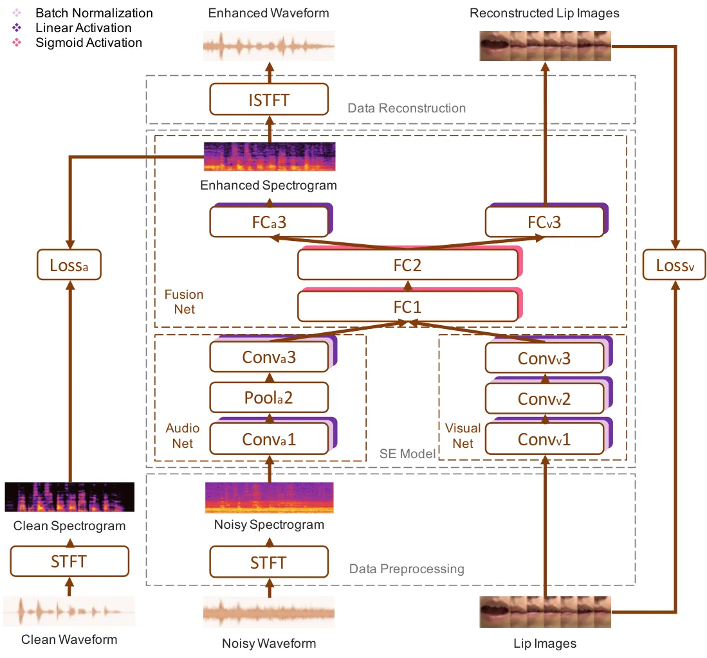

Fig. 1: The AVDCNN system \[74\].

In this section, we review several existing AVSE systems. In \[88\], a
fully connected network was used to jointly process audio and visual
inputs to perform SE. Since the fully connected architecture cannot
effectively process visual information, the AVSE system in \[88\] is
only slightly better than its audio-only SE counterpart. In order to
further improve the performance, a multimodal deep CNN SE (termed
AVDCNN) system \[74\] was subsequently proposed. As shown in Fig. 1
(ISTFT denotes inverse short time Fourier transform; FC denotes fully
connected layers; Conv denotes convolutional layers; Pool denotes
max-pooling layers), the AVDCNN system consists of several convolutional
layers to process audio and visual data. Experimental results show that
compared with the audio-only deep CNN system, the AVDCNN system can
effectively improve the SE performance. Later, Gabbay et al. proposed
another AVSE model, whose architecture is similar to AVDCNN, but the
visual part is not reconstructed in the output layer \[89\]. The
reconstruction of the visual output in AVDCNN can guide the SE model to
actually learn some useful information from the visual input, such as
silence or some consonants, rather than some random information.
According to our experience, the AVDCNN model with visual output
performed better than the AVDCNN model without visual output. In the
meantime, a looking-to-listen system was proposed, which uses estimated
complex masks to reconstruct enhanced spectral features \[90\]. In
\[91\], a variational AE model was used as the basis model to build the
AVSE system. The authors also investigated the possibility of using a
strong pre-trained model for visual feature extraction and performing SE
in an unsupervised manner.

Unlike audio-only SE systems, the above-mentioned AVSE systems require
additional visual input, which causes additional hardware and
computational costs. In addition, the use of facial or lip images may
cause privacy issues. The LAVSE system \[78\] has been proposed to deal
with these two issues by effectively reducing the size of visual input
and user identifiability. It uses an AE to extract meaningful and
compact representations of visual data as the input of the SE model to
reduce computational costs and appropriately solve the privacy problem
in facial information. The AE in the LAVSE system is pre-trained. In
\[78\], it has been shown that the AE-pre-trained framework is better
than the AE-co-trained framework. In addition, the combined loss of the
AE-co-trained framework consists of three losses: (1) the audio loss,
(2) the visual compressed feature loss, and (3) the visual image loss.
It takes time and computational cost to determine the best weights of
these three losses in the AE-co-trained framework through an exhaustive
search. The training process of the AE-pre-trained framework is
relatively easy because there are only two losses. Moreover, in the the
AE-pre-trained framework, since the AE is pre-trained in an unsupervised
learning manner, it can be trained on a richer unimodal dataset.

### II-B Data Quantization

Fig. 2: Single-Precision Floating-Point Format.

Quantization is a simple and effective way to reduce the size of data.
Fig. 2 shows the data format of single-precision floating-point in IEEE
754 \[92\]. There are 32 base-2 bits, including 1 sign bit, 8
exponential bits, and 23 mantissa bits. The decimal value of a
single-precision floating-point representation is calculated as

```math
\displaystyle value_{10} \displaystyle=(-1)^{S}\times 2^{(Exp_{10}-bias)}\times Man_{10}, \tag{1}
```

```math
\displaystyle S \displaystyle=s_{0},
```

```math
\displaystyle Exp_{2} \displaystyle=e_{1}e_{2}e_{3}e_{4}e_{5}e_{6}e_{7}e_{8},
```

```math
\displaystyle Exp_{10} \displaystyle=\sum_{i=1}^{8}{e_{i}\times 2^{(8-i)}},
```

```math
\displaystyle Man_{2} \displaystyle=m_{9}m_{10}...m_{31},
```

```math
\displaystyle Man_{10} \displaystyle=\sum_{i=9}^{31}{m_{i}\times 2^{(8-i)}},
```

where the subscripts $`2`$ and $`10`$ of $`value`$, $`Exp`$, and $`Man`$
denote base-2 and base-10, respectively. The sign bit determines whether
the value represented is positive ($`S=0`$) or negative ($`S=1`$). The
exponential bits represent a 2’s complement, which can store negative
values with a bias of 127 ($`2^{7}-1`$). The mantissa bits are the
significant figures. The decimal value of the 32-bit representation in
Fig. 2 is 0.20314788.

Obviously, the representation range of values is determined by the
exponential term, and the mantissa term accounts for the precision part.
Therefore, quantizing the mantissa bits does not change the range, but
only reduces the precision of the original value. Based on this
property, an exponent-only floating-point quantized neural network
(EOFP-QNN) has been proposed to reduce the mantissa bits of the SE model
parameters in \[80\]. Experimental results have confirmed that by
moderately reducing the mantissa bits, the size of the model parameters
can be reduced while the overall SE capability can be improved. In this
study, we followed the same idea, keeping only the sign and exponent
bits, and removing all mantissa bits to perform visual data compression.

## III Proposed iLAVSE System

As mentioned earlier, this study investigates three practical issues:
(1) the additional cost of processing visual data, (2) audio-visual data
asynchronization, and (3) low-quality visual data. We propose three
approaches to address these issues respectively: (1) visual data
compression, (2) compensation on audio-visual asynchronization, and (3)
zero-out training. By integrating the above three approaches with the
CRNN AVSE architecture, the proposed iLAVSE can perform SE well even
under unfavorable testing conditions. In this section, we first present
the overall system of iLAVSE. Then, we describe the three issues and our
solutions.

### III-A iLAVSE System

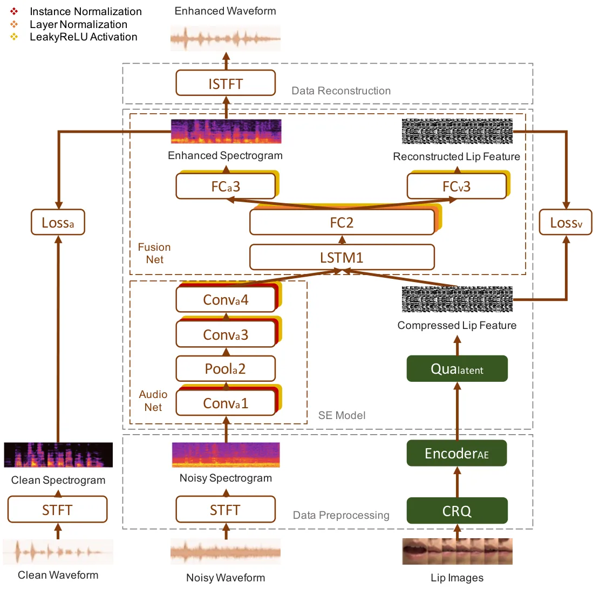

Fig. 3: The proposed iLAVSE system.

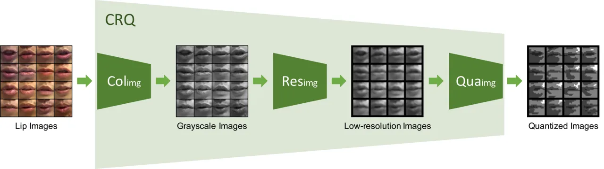

Fig. 4: The proposed CRQ module.

The proposed iLAVSE system is demonstrated in Fig. 3. As shown in the
figure, the iLAVSE system includes three stages: a data preprocessing
stage, a CRNN-based AVSE stage, and a data reconstruction stage.

We have implemented three data compression functions in iLAVSE, which
are outlined in green blocks in Fig. 3. CRQ is a three-unit data
compression module used to compress the visual image data. As shown in
Fig. 4, the CRQ module consists of Colimg, Resimg, and Quaimg, denoting
color channel reduction, resolution reduction, and bit quantization,
respectively. Qualatent stands for the bit quantization of the latent
feature extracted by EncoderAE, the encoder part of a pre-trained AE.
The AE is trained by using the CRQ processed lip images as the input and
the grayscale low-resolution images (cf. Fig. 4) of the original lip
images as the output in a frame-wise manner.

In the data preprocessing stage, the waveform of the noisy data is
transformed into log1p²² 2 Note that we choose the log1p feature \[93\]
because its projecting range can avoid some minimum values in the data.
If we take $`10^{-6}`$ for example and if log is applied, the projected
value is $`-6`$; but if log1p is applied, the projected value is $`0`$.
This characteristic enables the log1p feature to be easily normalized
and trained. spectral features ($`X`$) by using the short time Fourier
transform (STFT), while the visual image data ($`I`$) are compressed and
transformed into latent features ($`Z`$) by the CRQ module and
EncoderAE. The functions of CRQ and EncoderAE are as follows,

```math
\displaystyle CRQ(I_{i,n}) \displaystyle=Qua_{img}(Res_{img}(Col_{img}(I_{i,n}))), \tag{2}
```

```math
\displaystyle Z_{i,n} \displaystyle=Encoder_{AE}(CRQ(I_{i,n})),
```

where $`i\in\{1,...,K\}`$ denotes the $`i`$-th training utterance, and
$`K`$ is the number of the training utterances; $`n\in\{L,...,F-L\}`$
denotes the $`n`$-th sample frame, $`L`$ is the size of the concatenated
frames for a context window, and $`F`$ is the number of frames of the
$`i`$-th utterance.

In the CRNN AVSE stage, the audio spectral features $`X`$ pass through
an audio net composed of convolutional and pooling layers to extract the
audio latent features ($`A`$), and the Qualatent unit, which will be
described in Section III-B1, further quantizes the visual input $`Z`$ to
$`V`$ as

```math
\displaystyle A_{i,n} \displaystyle=Conv_{a}4(Conv_{a}3(Pool_{a}2(Conv_{a}1(X_{i,n-L:n+L})))), \tag{3}
```

```math
\displaystyle V_{i,n} \displaystyle=Qua_{latent}(Z_{i,n}).
```

The audio latent features $`A`$ and the quantized visual latent features
$`V`$ are concatenated as $`AV`$, which is then sent into the fusion net
and turned into $`F`$. Then, the fused features $`F`$ are decoded into
the audio spectral features ($`\hat{Y}`$) and the visual latent features
($`\hat{Z}`$) respectively through a linear layer. The process is
formulated as

```math
\displaystyle AV_{i,n} \displaystyle=[A_{i,n}^{T};V_{i,n-L:n+L}^{T}]^{T}, \tag{4}
```

```math
\displaystyle F_{i,n} \displaystyle=FC2(LSTM1(AV_{i,n})),
```

```math
\displaystyle\hat{Y}_{i,n} \displaystyle=FC_{a}3(F_{i,n}),
```

```math
\displaystyle\hat{Z}_{i,n} \displaystyle=FC_{v}3(F_{i,n}).
```

During testing, the audio spectral features ($`\hat{Y}`$) (with the
phase of the noisy speech) are reconstructed into the speech waveform
using the inverse STFT in the data reconstruction stage.

### III-B Three Practical Issues and Proposed Solutions

#### III-B1 Visual Data Compression

For AVSE systems, the main goal is to use visual data as an auxiliary
input to retrieve the clean speech signals from the distorted speech
signals. However, the size of visual data is generally much larger than
that of audio data, which may cause unfavorable hardware and
computational costs when implementing the AVSE system. Our previous work
has proven that visual data may not require very high precision, and the
original image sequence can be replaced by meaningful and compact
representations extracted by an AE \[78\]. In this study, we further
explore directly reducing the size of visual data by the CRQ compression
module. The AE is directly applied to the compressed image sequence to
extract a compact representation. The extracted representation is then
further compressed by Qualatent and sent to the CRNN-based AVSE stage in
iLAVSE.

##### Visual Feature Extraction by a CNN-based AE

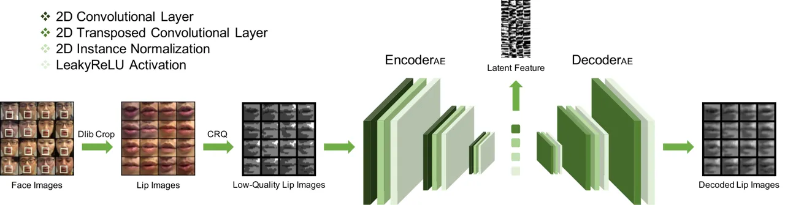

Fig. 5: The AE model for visual input data compression.

As mentioned earlier, iLAVSE uses the three visual data compression
units in the CRQ module, namely Colimg, Resimg, and Quaimg, to perform
color channel reduction, resolution reduction, and bit quantization,
respectively. The size of the original image sequence can be notably
reduced by the three units. The compressed visual data is then passed to
EncoderAE, and the latent representation is used as the visual
representation. As shown in Fig. 5, we use a 2D-convolution-layer-only
AE to process the CRQ processed visual input. For a given CRQ processed
visual input, the AE is pre-trained to reconstruct the grayscale
low-resolution image (cf. Fig. 4) of the original lip image.

Generally, captured images are saved in RGB (three channels) or
grayscale (one channel) format. Therefore, to make the iLAVSE system
applicable to different scenarios, we consider both RGB and grayscale
visual inputs to train the AE model. As a result, this AE model can
reconstruct RGB and grayscale images.

Furthermore, we use images with different resolutions to train the AE
model. Since the lip images are about 100 to 250 pixels square, we
designed three settings to reduce the resolution—64, 32, and 16 (pixels
square). When using a resolution of 64, for example, the original image
at sizes of 100 to 250 pixels square is resized to 64 pixels square.

For data quantization, we first quantize the values of an input image by
removing the mantissa bits in the floating-point representation. To
train the AE, we place the quantized and original images at the input
and output, respectively. In real-world applications, the AE model can
reconstruct the original visual data from the quantized version. That is
to say, the color channel and size of the input and output are the same,
but the number of bits is different.

##### Latent Feature Compression

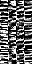

(a) 32-bit AE features.

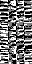

(b) EOFP 3-bit AE features.

Fig. 6: Original and quantized visual latent features.

Fig. 7: The distributions of visual features before and after applying
Qualatent.

After extracting the latent feature by passing the compressed images to
the AE, Qualatent in Fig. 3 can further reduce the number of bits of
each latent feature element. The quantized visual latent features are
then used in the CRNN AVSE stage. Fig. 6 shows the visual latent
features before and after the Qualatent module. In real-world
applications, the EncoderAE module and Qualatent unit can be installed
in a low-quality visual sensor, thereby improving the online computing
efficiency and greatly reducing the transmission costs.

To further confirm that the quantized latent representation can be used
to replace the original latent representation, we plotted the
distributions of the latent representations before and after applying
bit quantization in Fig. 7. The lighter green bins represent the feature
before Qualatent is applied, and the darker green bins represent the
feature after Qualatent is applied. We can see that the darker green
bins cover the range of the lighter green bins well, indicating that we
can use the quantized latent feature to replace the original latent
feature.

#### III-B2 Compensation of Audio-Visual Asynchronization

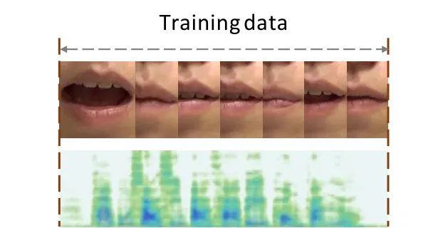

(a) Synchronous.

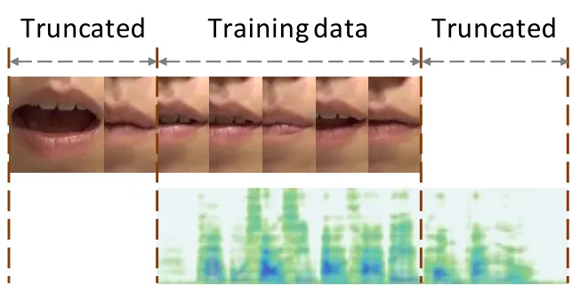

(b) Asynchronous.

Fig. 8: Synchronous and asynchronous audio and visual data.

Multimodal data asynchronization is a common issue in multimodal
learning. We also encountered this problem when implementing the AVSE
system. The ideal situation is that the audio and visual data are
precisely synchronized in time. Otherwise, the auxiliary visual
information may not be helpful or may even worsen the SE performance.
Fig. 8 shows the synchronous and asynchronous situations of audio and
visual data. Owing to audio-visual asynchronization, the video frames
are not aligned with the speech well. In this study, we propose a data
augmentation approach to alleviate this audio-visual asynchronization
issue. The main idea is to artificially simulate various asynchronous
audio-visual data to train the AVSE systems.

#### III-B3 Zero-Out Training

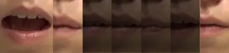

(a) Low-quality lip images.

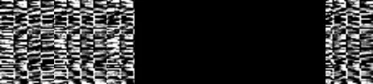

(b) Low-quality latent features.

Fig. 9: Low-quality visual data.

Because visual data are regarded as an auxiliary input to the AVSE
systems, a necessary requirement is that low-quality visual conditions
will not degrade the SE performance. In use with poor lighting
conditions, such as in a tunnel or at a night market, the quality of
video frames may be poor. In Fig. 9(a), which shows an example, where a
segment of frames (in the middle region) has very poor quality. Using
the entire video frames directly may degrade the AVSE performance. To
overcome this problem, we intend to let iLAVSE dynamically decide
whether video data should be used. More specifically, when the quality
of a segment of image frames is poor (which can be determined using an
additional light sensor or according to the result of lip detection),
iLAVSE can directly discard the visual information by replacing the
visual latent features of low-quality frames with zeros, as shown in
Fig. 9(b). In order to make iLAVSE have the ability to process audio
information alone, in the training phase, we prepare training data by
replacing the visual latent features of the visual frames of certain
segments with zeros. In this way, when the video quality is low, iLAVSE
can perform SE based on audio input only, without considering visual
information.

Note that this study only considers low-quality situations that occur in
consecutive frame segments, not in sporadic frames; this situation is
common in car-driving scenarios. We believe that the proposed zero-out
training method is suitable for other low-quality visual data scenarios,
because it is a common idea to set the visual input to zeros when the
video quality is poor. In the future, we will conduct experiments to
verify this idea in other real-world scenarios. In addition, the focus
of this study is to verify whether the proposed iLAVSE system can
function well even when some visual data are discarded. The criterion
that can best determine whether visual information should be discarded
will be our future work.

## IV Experiments

This section presents the experimental setup and results. Two
standardized evaluation metrics were used to evaluate the SE
performance: perceptual evaluation of speech quality (PESQ) \[94\] and
short-time objective intelligibility measure (STOI) \[95\]. PESQ was
developed to evaluate the quality of processed speech. The score ranges
from -0.5 to 4.5. A higher PESQ score indicates that the enhanced speech
has better speech quality. STOI was designed to evaluate the speech
intelligibility. The score typically ranges from 0 to 1. A higher STOI
value indicates better speech intelligibility.

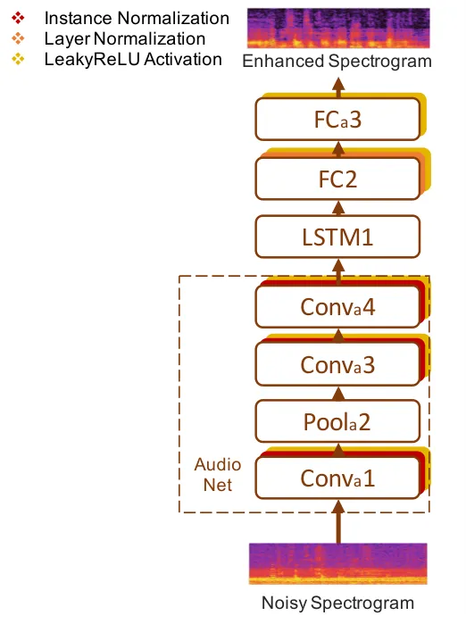

(a) Audio-only SE.

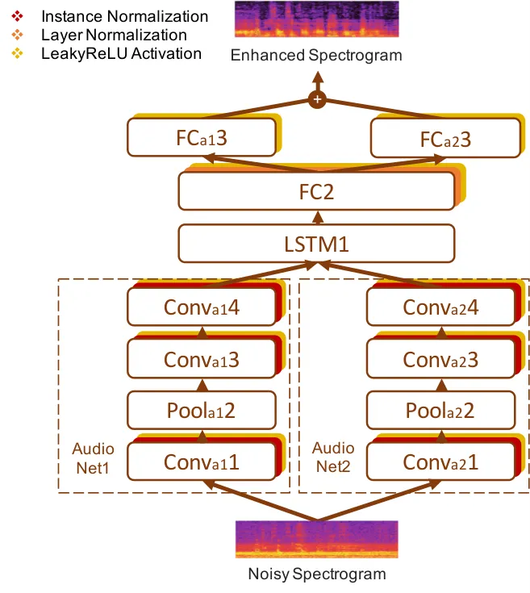

(b) Dual-path-audio-only SE.

Fig. 10: Architectures of two audio-only SE systems.

Two audio-only baseline SE systems were implemented for comparison.
Their model architectures are illustrated in Fig. 10. Fig. 10(a) is a
system with the visual part in the iLAVSE system deleted, and Fig. 10(b)
is a system with a dual-path audio model. The additional audio net in
Fig. 10(b) is to increase the number of model parameters to be the same
as in the iLAVSE model. This system tests whether additional
improvements can be achieved by simply increasing the number of model
parameters.

The loss function for training iLAVSE is based on the mean square error
computed from both the audio and visual parts,

```math
\displaystyle Loss_{a} \displaystyle=\frac{1}{KF}\sum_{i=1}^{K}\sum_{n=1}^{F}{\lvert\lvert\hat{Y}_{i,n}-Y_{i,n}\rvert\rvert}^{2}, \tag{5}
```

```math
\displaystyle Loss_{v} \displaystyle=\frac{1}{KF}\sum_{i=1}^{K}\sum_{n=1}^{F}{\lvert\lvert\hat{Z}_{i,n}-Z_{i,n}\rvert\rvert}^{2},
```

```math
\displaystyle Loss \displaystyle=Loss_{a}+\mu\times Loss_{v},
```

where $`\mu`$ is empirically determined as $`10^{-3}`$. For training the
two audio-only SE systems, $`Loss_{a}`$ is used.

In this study, all the SE models were implemented using the PyTorch
\[96\] library. The optimizer is Adam \[97\] with a learning rate of
$`5\times 10^{-5}`$. The training batch size was set to 32.

### IV-A Experimental Setup

In this section, the details of the dataset and the implementation steps
of iLAVSE and other SE systems are introduced.

#### IV-A1 Dataset

We evaluated the proposed system on the TMSV dataset³³ 3
https://bio-asplab.citi.sinica.edu.tw/Opensource.html#TMSV. The dataset
contains video recordings of 18 native speakers (13 males and 5
females), each speaking 320 utterances of Mandarin sentences, with the
script of the Taiwan Mandarin hearing in noise test \[98\]. Each
sentence has 10 Chinese characters, and the length of each utterance is
approximately 2–4 seconds. The utterances were recorded in a recording
studio with sufficient light, and the speakers were filmed from the
front view. The video was recorded at a resolution of 1920 pixels
$`\times`$ 1080 pixels at 50 frames per second. The audio was recorded
at a sampling rate of 48 kHz.

In this study, considering gender balance, we decided not to use all 18
speakers from TMSV. We selected the video files from 8 speakers (4 males
and 4 females) to form the training set. For each speaker, among the 320
utterances, the 1-st to the 200-th utterances were selected. The
utterances were artificially corrupted by 100 types of noise \[99\] at 5
different signal-to-noise ratio (SNR) levels, from -12 dB to 12 dB with
a step of 6 dB. This process yielded about 600 hours of noisy
utterances. Considering that 600 hours of training data would take too
much training time, we randomly sampled 12,000 noisy utterances as a
9-hour training set. The 201-st to 320-th video recordings of 2 other
speakers (1 male and 1 female) were used to form the testing set. Six
types of noise were selected, which are common in car-driving scenarios,
including baby cry, engine noise, background talkers, music, pink noise,
and street noise. We artificially generated noisy utterances by
contaminating the clean testing speech with these 6 types of noise at 4
low SNR levels, including -1, -4, -7, and -10 dB, which are around the
SNR levels mentioned in \[100\]. This process produced 5,760 testing
noisy utterances for a total of about 4 hours. The speakers, speech
contents, noise types, and SNR levels were all mismatched in the
training and testing sets.

#### IV-A2 Audio and Visual Feature Extraction

The recorded speech signals were downsampled to 16 kHz and mixed into
monaural waveforms. The speech waveforms were converted into
spectrograms with STFT. The window size of STFT was 512, corresponding
to 32 milliseconds. The hop length was 320, so the interval between each
frame was 20 milliseconds. The audio data was formatted at 50 frames per
second and was aligned with the video data. For each speech frame, the
log1p magnitude spectrum \[93\] was extracted, and the value was
normalized to zero mean and unit standard deviation. The normalization
process was conducted at the utterance level; that is, the mean and
standard deviation vectors were calculated on all frames of an
utterance. The length of the context window was 5, i.e., $`\pm`$2 frames
were concatenated to the central frame. Accordingly, the dimension of
the final frame-based audio feature vector was 257 $`\times`$ 5.

For each frame in the video, the contour of the lips was detected using
a 68-point facial landmark detector with Dlib \[101\], and the RGB
channels were retained. The extracted lip images were approximately 100
pixels square to 250 pixels square. The AE was trained on the lip images
in the training set. The latent representation (2048-dimensional) of AE
were used as the visual input to the CRNN-based AVSE stage. Same as the
audio feature, $`\pm`$2 frames were concatenated to the central frame.
Therefore, the dimension of the frame-based visual feature vector was
2048 $`\times`$ 5.

### IV-B Experimental Result

#### IV-B1 AVSE Versus Audio-Only SE

|                          | PESQ  | STOI  |
| ------------------------ | ----- | ----- |
| Noisy                    | 1.001 | 0.587 |
| AOSE                     | 1.282 | 0.616 |
| AOSE(DP)                 | 1.283 | 0.610 |
| AVDCNN                   | 1.337 | 0.641 |
| LAVSE(AE)                | 1.374 | 0.646 |
| LAVSE(AE+EOFP4bits)      | 1.358 | 0.643 |
| iLAVSE(CRQ)              | 1.387 | 0.639 |
| iLAVSE(CRQ+AE)           | 1.398 | 0.641 |
| iLAVSE(CRQ+AE+EOFP3bits) | 1.410 | 0.641 |

TABLE I: Average PESQ and STOI scores of the two audio-only SE systems
and the AVSE systems over SNRs of -1, -4, -7 and -10 dB.

The two audio-only SE systems shown in Fig. 10 were used as the
baselines. The results of the audio-only SE (denoted as AOSE) and
dual-path audio-only SE (denoted as AOSE(DP)) systems are shown in Table
I. As mentioned earlier, AOSE(DP) has a similar number of model
parameters to LAVSE. From the results in Table I, we note that AOSE and
AOSE(DP) yield similar performance in terms of PESQ and STOI. The result
suggests that the additional path with extra parameters cannot provide
improvements for the audio-only SE system in this task. Table I also
lists the results of the proposed iLAVSE and two existing AVSE systems,
namely AVDCNN \[74\] and LAVSE \[78\]. LAVSE(AE) denotes the LAVSE
system with AE, while LAVSE(AE+EOFP4bits) denotes the LAVSE system with
both AE and the latent feature quantization unit Qualatent for 4 bits of
EOFP. The proposed CRQ module can also be regarded as a coding method
that can reduce user identifiability in the image domain. The iLAVSE
system with CRQ but without AE is denoted as iLAVSE(CRQ), while the
iLAVSE system with CRQ and AE is denoted as iLAVSE(CRQ+AE). In addition,
iLAVSE(CRQ+AE+EOFP3bits) stands for the system including CRQ, AE, and
Qualatent for 3 bits of EOFP. The results show that the systems with
compression modules of CRQ and AE and the quantization unit Qualatent
can maintain SE performance comparable to LAVSE(AE). Compared to AOSE
and AOSE(DP), all the AVSE systems yield higher PESQ and STOI scores,
confirming the effectiveness of incorporating visual data into the SE
system.

#### IV-B2 Visual Data Compression

In this set of experiments, we examined the ability of iLAVSE to
incorporate compressed visual data. As shown in Fig. 3, the visual data
preprocessing is carried out by a CRQ module, which implements three
units: Colimg, Resimg, and Quaimg. Then, after the latent representation
is extracted by EncoderAE, Qualatent further quantizes the bits of the
latent representation. In other words, there are four units that perform
visual data reduction. We represent the entire reduction process as
{Colimg, Resimg, Quaimg, Qualatent} = {A, B, C, D}, where A is either
RGB or GRAY (for grayscale), B denotes the image resolution, C indicates
the image data quantization, and D stands for the latent feature
quantization.

|           | PESQ  |       | STOI  |       |
| --------- | ----- | ----- | ----- | ----- |
|           | R     | G     | R     | G     |
| AOSE(DP)  | 1.283 |       | 0.610 |       |
| iLAVSE 64 | 1.374 | 1.378 | 0.646 | 0.646 |
| iLAVSE 32 | 1.371 | 1.375 | 0.644 | 0.645 |
| iLAVSE 16 | 1.374 | 1.358 | 0.646 | 0.649 |

TABLE II: The performance of iLAVSE using lip images with reduced
channel numbers and resolutions, R: {RGB} and G: {GRAY}. The underlined
scores are the same as those of LAVSE in Table I because the iLAVSE with
the {RGB, 64} setup is equivalent to LAVSE.

We evaluated iLAVSE with different types of compressed visual data. The
results are listed in Table II. From the table, we first see that iLAVSE
outperforms AOSE(DP) in terms of PESQ and STOI with different compressed
visual data. Moreover, compared to LAVSE (the underlined scores), we
note that iLAVSE can still achieve comparable performance even though
the resolution of the visual data has been notably reduced. For example,
the {GRAY, 16} case in Table II strikes a good balance between the data
compression ratio of 48
(($`3\div 1)\times((64\times 64)\div(16\times 16)`$)) and the PESQ and
STOI scores. Therefore, we decided to use {GRAY, 16} as a representative
setup in the following discussion.

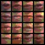

(a) {RGB, 16, 5bits(i)} input.

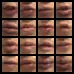

(b) {RGB, 16, 5bits(i)} output.

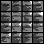

(c) {GRAY, 16, 5bits(i)} input.

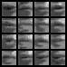

(d) {GRAY, 16, 5bits(i)} output.

Fig. 11: AE lip images in 5 bits (1 sign bit and 4 exponential bits).

|            | PESQ  |       | STOI  |       |
| ---------- | ----- | ----- | ----- | ----- |
| Total bits | R     | G     | R     | G     |
| 1          | 1.333 | 1.296 | 0.619 | 0.615 |
| 3          | 1.250 | 1.295 | 0.628 | 0.613 |
| 5          | 1.361 | 1.398 | 0.644 | 0.641 |
| 7          | 1.374 | 1.379 | 0.640 | 0.644 |
| 9          | 1.386 | 1.387 | 0.642 | 0.642 |
| 32         | 1.374 | 1.358 | 0.646 | 0.649 |

TABLE III: The performance of iLAVSE with or without image quantization
(the original image is with 32 bits), R: {RGB, 64} and G: {GRAY, 16}.
The underlined scores are the same as those of LAVSE in Table I.

Next, we investigated quantized images. The input and output
(reconstructed) images in RGB and GRAY are shown in the left and right
columns in Fig. 11, respectively. The original 32-bit images were
reduced to 5-bit images (1 sign bit and 4 exponential bits). From the
figures, we observe that the AE can reconstruct the quantized image
well. We also evaluated iLAVSE with the quantized images. The results
are shown in Table III. The PESQ and STOI scores reveal that when the
numerical precision of the input image is reduced to 5 bits (1 sign bit
and 4 exponential bits), iLAVSE still maintains satisfactory
performance. When the number of bits is further reduced, the PESQ and
STOI scores both decrease notably. Compared to LAVSE that uses raw
visual data, the overall compression ratio $`R_{comp}`$ of the CRQ
module from {RGB, 64, 32bits(i)} to {GRAY, 16, 5bits(i)} is 307.2 times,
which is calculated as follows,

```math
\displaystyle R_{comp} \displaystyle=R_{color}\times R_{res}\times R_{Qua}, \tag{6}
```

```math
\displaystyle R_{color} \displaystyle=\frac{3}{1},
```

```math
\displaystyle R_{res} \displaystyle=\frac{64^{2}}{16^{2}},
```

```math
\displaystyle R_{Qua} \displaystyle=\frac{32}{5},
```

```math
\displaystyle R_{comp} \displaystyle=\frac{3}{1}\times\frac{64^{2}}{16^{2}}\times\frac{32}{5}=307.2.
```

#### IV-B3 Latent Feature Quantization

In this set of experiments, we investigated the impact of the bit
quantization in the Qualatent unit on the visual latent representation.
We intended to use fewer bits to represent the original 32-bit latent
representation. The compressed representation was used as the visual
feature input of the AVSE model. In Fig. 6(a) and Fig. 6(b), the latent
representations of lip features before and after applying data
quantization (from 32 bits to 3 bits) are depicted. As can be seen from
the figures, the speaker identity cannot be fully recovered from the
encoded features. Since the original images cannot be reconstructed from
the compact latent features without the matched decoder and inverse EOFP
procedure, the user’s privacy can be protected in the AVSE stage,
thereby moderately addressing the privacy problem.

|            | PESQ  |       | STOI  |       |
| ---------- | ----- | ----- | ----- | ----- |
| Total bits | R     | G     | R     | G     |
| 1          | 1.365 | 1.374 | 0.642 | 0.642 |
| 3          | 1.337 | 1.410 | 0.642 | 0.641 |
| 5          | 1.343 | 1.413 | 0.643 | 0.641 |
| 7          | 1.357 | 1.391 | 0.643 | 0.641 |
| 9          | 1.362 | 1.373 | 0.643 | 0.643 |
| 32         | 1.374 | 1.398 | 0.646 | 0.641 |

TABLE IV: The performance of iLAVSE with or without latent quantization,
R: {RGB, 64, 32bits(i)} and G: {GRAY, 16, 5bits(i)} (1 sign bit + 4
exponential bits).

We further evaluated iLAVSE with latent representation quantization. The
number of bits was reduced from 32 to 1, 3, 5, 7 and 9 (1 sign bit and
0, 2, 4, 6, and 8 exponential bits). The results are listed in Table IV.
From the table, we can note that for different types of visual input,
latent representations with different levels of quantization provide
similar performance in terms of PESQ and STOI. For example, when
quantizing the latent representation to 3 bits, PESQ = 1.410 and STOI =
0.641 under the condition of {GRAY, 16, 5bits(i)}, which are much better
than the performance of AOSE(DP) (PESQ = 1.283 and STOI = 0.610) and
comparable to the performance of LAVSE (PESQ = 1.374 and STOI = 0.646).

#### IV-B4 Further Analysis

(a) PESQ.

(b) STOI.

Fig. 12: The performance of different SE systems at different SNR
levels. LAVSE: {RGB, 64, 32bits(i), 32bits(l)}, iLAVSE: {GRAY, 16,
5bits(i), 3bits(l)}.

In this set of experiments, we evaluated the SE systems compared in this
study with different SNR levels. For AVDCNN, we used the original
high-quality images as visual input. For LAVSE, we used the {RGB, 64,
32bits(i), 32bits(l)} setup. For iLAVSE, we used {GRAY, 16, 5bits(i),
3bits(l)}, where (i) and (l) denote the quantization unit applied to the
images and the latent features, respectively. The PESQ and STOI scores
for different SNR levels are shown in Fig. 12, where the x-axis
represents the SNR level. It can be seen from the figure that all four
SE systems have higher PESQ and STOI scores than the “Noisy” speech. In
addition, the iLAVSE system is always better than the other three SE
systems at different SNR levels in terms of PESQ, and maintains
satisfactory performance in terms of STOI. Through the results of -1 dB
and -10 dB, we can see that visual information becomes more useful for
SE tasks when the SNR decreases.

(a) PESQ.

(b) STOI.

Fig. 13: The performance of different SE systems on different
human-voiced noises. LAVSE: {RGB, 64, 32bits(i), 32bits(l)}, iLAVSE:
{GRAY, 16, 5bits(i), 3bits(l)}.

|      | PESQ     |        | STOI     |        |
| ---- | -------- | ------ | -------- | ------ |
| SNRs | AOSE(DP) | iLAVSE | AOSE(DP) | iLAVSE |
| Poor | 1.387    | 1.544  | 0.699    | 0.734  |
| Low  | 1.629    | 1.757  | 0.760    | 0.783  |
| Mild | 1.886    | 1.966  | 0.812    | 0.823  |

(a) Baby cry.

|      | PESQ     |        | STOI     |        |
| ---- | -------- | ------ | -------- | ------ |
| SNRs | AOSE(DP) | iLAVSE | AOSE(DP) | iLAVSE |
| Poor | 0.793    | 1.009  | 0.435    | 0.487  |
| Low  | 1.183    | 1.372  | 0.575    | 0.621  |
| Mild | 1.575    | 1.733  | 0.702    | 0.733  |

(b) Background talkers.

TABLE V: The performance of AOSE(DP) and iLAVSE on different
human-voiced noises at different SNR levels. Poor: -10db and -7db, Low:
-4 and -1db, Mild: 2db and 5db. iLAVSE: {GRAY, 16, 5bits(i), 3bits(l)}.

Fig. 13 details the results of two types of human-voiced noise, namely
baby cry and background talkers. Under these types of noise, visual
information becomes crucial in the SE task. Obviously, the AOSE(DP)
method cannot give higher STOI scores than the “Noisy” speech, while all
the AVSE methods outperform AOSE(DP). Even with the proposed compression
units, LAVSE and iLAVSE still maintain acceptable performance in terms
of both PESQ and STOI compared to AVDCNN. To further evaluate the
proposed iLAVSE system on human-voiced noises at more SNR levels, we
provide additional experimental results at mild SNR levels in Table V.
The results show that iLAVSE outperforms the AOSE(DP) baseline at all
SNR levels.

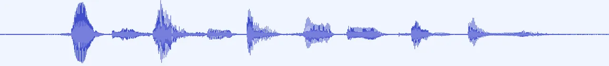

(a) Clean waveform.


(b) Clean spectrogram.

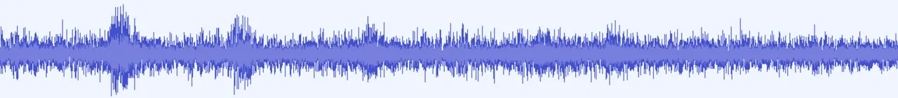

(c) Noisy waveform.


(d) Noisy spectrogram.

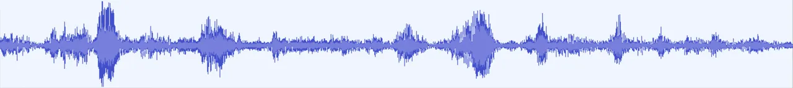

(e) AOSE(DP) waveform.


(f) AOSE(DP) spectrogram.

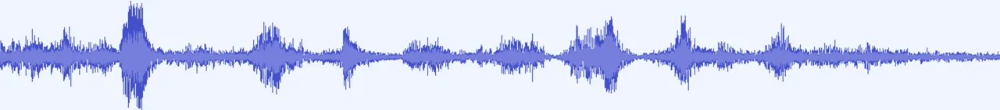

(g) LAVSE waveform.


(h) LAVSE spectrogram.

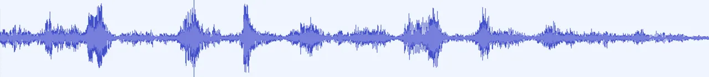

(i) iLAVSE waveform.


(j) iLAVSE spectrogram.

Fig. 14: The waveforms and spectrograms of an example speech utterance
under the condition of street noise at -7 dB. The vertical axis of the
waveform figure represents the normalized amplitude (-0.1$`\sim`$0.1),
and the vertical axis of the spectrogram figure represents the frequency
(0k$`\sim`$8k Hz). The horizontal axis is time. The example utterance is
3 seconds long.

We further examined the spectrogram and waveform of the “Noisy” speech
and the enhanced speech provided by AOSE(DP), LAVSE, and iLAVSE. An
example under the condition of street noise at -7 dB is shown in Fig. 14. The spectrogram and waveform of the clean speech are also plotted
for comparison. From the figure, we see that iLAVSE can suppress the
noise components in the noisy speech more effectively than AOSE(DP), and
thus confirming the effectiveness of using the visual information.
Furthermore, we note that the output plots of iLAVSE and LAVSE are very
similar, which suggests that iLAVSE can still provide satisfactory
performance even with compressed visual data.

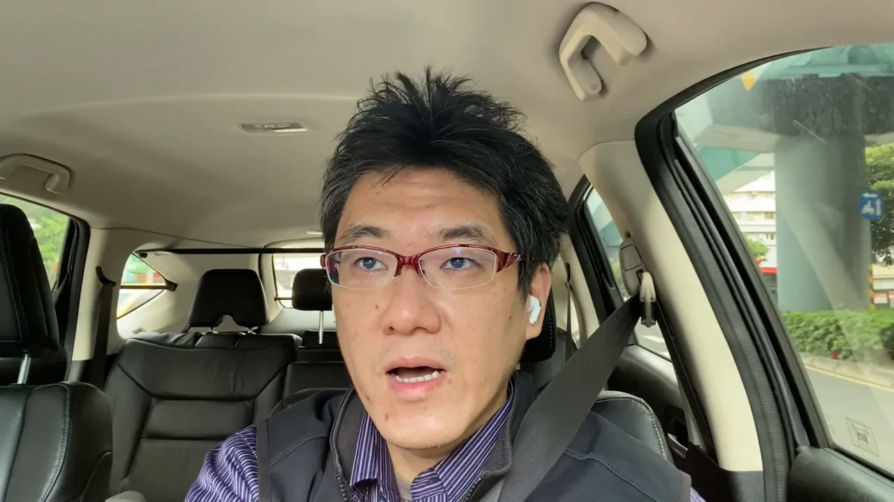

Fig. 15: The real-world car-driving scenario.

(a) SRMR.

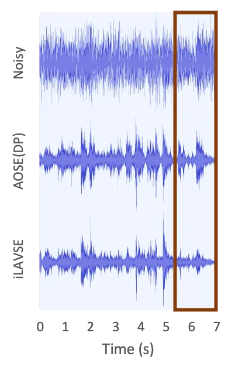

(b) Waveforms.

Fig. 16: The average SRMR scores and sample processed waveforms obtained
by AOSE(DP) and iLAVSE for the real-world videos. iLAVSE: {GRAY, 16,
5bits(i), 3bits(l)}.

We recorded 10 video clips in a real car-driving scenario, as
demonstrated in Fig. 15, with the background music and car-driving noise
as our real-world testing data. The recording device was iPhone 12 Pro
Max. Since there was no clean reference available in this set of
experiments, we used the speech-to-reverberation modulation energy ratio
(SRMR) \[102\], a non-intrusive modulation-spectral-representation-based
metric for speech assessment to evaluate the performance of AOSE(DP) and
iLAVSE. A higher SRMR score indicates better speech quality. The average
SRMR scores and sample processed waveforms obtained by AOSE(DP) and
iLAVSE for the real-world videos are shown in Fig. 16(a) and Fig. 16(b),
respectively. Fig. 16(a) shows that the iLAVSE system achieves higher
SRMR scores than the AOSE(DP) system and the original noisy speech. In
Fig. 16(b), the top, middle, and bottom panels are the waveforms of the
original noisy speech, AOSE-enhanced speech, and iLAVSE-enhanced speech,
respectively. In the area framed by the brown box at the end of the
speech, there is actually no speech, only background music. Obviously,
the closed lips can effectively help iLAVSE to remove the background
music, but the AOSE-enhanced speech still retains the background music.

#### IV-B5 Asynchronization Compensation

We simulated the audio-visual asynchronization condition by offsetting
the visual and audio data streams of each utterance in the time domain.
We designed 5 asynchronization conditions, i.e., 5 specific offset
ranges (OFR): \[-1, 1\], \[-2, 2\], \[-3, 3\], \[-4, 4\], and \[-5, 5\].
For example, for OFR = \[-1, 1\], the offset range is from -1 to 1. An
offset of -1, 0, or 1 frame (each frame = 20ms) was randomly selected
(with equal probability) and used to shift the audio stream, so that the
audio-visual asynchronization was -1, 0, or 1. In this way, we prepared
5 sets of training data with different degrees of audio-visual
asynchronization. For the testing set, we simulated the audio-visual
asynchronization condition using the fixed offsets in \[-5, 5\].
Therefore, the audio-visual data contained 11 different degrees of
asynchronization.

Because the iLAVSE model was trained with 5 different OFRs, namely \[-1,
1\], \[-2, 2\], \[-3, 3\], \[-4, 4\], and \[-5, 5\], we therefore
obtained 5 iLAVSE models, termed iLAVSE(OFR1), iLAVSE(OFR2),
iLAVSE(OFR3), iLAVSE(OFR4), and iLAVSE(OFR5). These 5 models were then
tested on the 11 different offsets (with a fixed offset in \[-5, 5\]).
The results are shown in Fig. 17. The results of Noisy, AOSE(DP), and
iLAVSE trained without audio-visual asynchronization (denoted as
iLAVSE(OFR0)) are also listed for comparison. All iLAVSE systems in this
experiment used the original visual data.

Please note that, in both figures, the central point (cf. Test Offset = 0) represents the audio-visual synchronous condition. A “Test Offset”
value away from the central point indicates a more severe audio-visual
asynchronous situation. “Test Offset = -5” and “Test Offset = 5” are the
most severe conditions, where the audio and visual signals are
misaligned for 5 frames (100 ms) in both cases.

From Fig. 17, we can note that when “Test Offset = 0”, iLAVSE(OFR0)
achieves the best performance. This is reasonable because in this case,
there is no asynchronous data in training and testing. When the
asynchronization condition becomes severe, iLAVSE(OFR5) achieves better
performance than other models. We also note that when the “Test Offset”
values lie in \[-3, 3\], iLAVSE(OFR5) always outperforms Noisy and
AOSE(DP). The results confirm the effectiveness of including
audio-visual asynchronous data (as augmented training data) to train the
iLAVSE system to overcome the asynchronization issue.

(a) PESQ.

(b) STOI.

Fig. 17: The PESQ and STOI scores of iLAVSE trained and tested with
different audio-visual asynchronous data.

#### IV-B6 Zero-Out Training

We simulated the low-quality visual data condition by applying a
low-quality percentage range (LPR) to the visual data. The low-quality
percentage (LP) determines the percentage of missing frames in the
visual data, and the LPR indicates the range of randomly assigned LPs
for each batch. For example, if LPR is set to 10, LP will be randomly
selected from 0% to 10%; if LP is set to 4% for a batch with a length of
150 frames, a sequence of 6 ($`150\times 4\%`$) frames of the visual
data will be replaced with zeros. In this experiment, we chose LPRs
$`\in`$ {0, 10, 20, 30, 40, 50, 60, 70, 80, 90, 100} for training, and
set LPs $`\in`$ {0, 10, 20, 30, 40, 50, 60, 70, 80, 90, 100} to test the
performance on specific percentages of missing visual data. The starting
point of the missing visual part was randomly assigned for each batch.

The iLAVSE models trained with the 11 different LPRs are denoted as
iLAVSE(LPR$`i`$), where $`i`$ = 0, …, 10. The training set of
iLAVSE(LPR0) did not contain missing visual data. A larger value of
$`i`$ in LPR$`i`$ indicates a more severe low-quality visual data
condition. The results are presented in Fig. 18, where the x-axis
represents the LP value used for testing. The results in the figure show
that without involving low-quality visual data in training
(iLAVSE(LPR0)), the performance drops rapidly when visual data loss
occurs in the testing data. The PESQ and STOI scores are even worse than
those of Noisy and AOSE(DP). On the other hand, the iLAVSE models
trained with low-quality visual data (even with low LPRs) are robust
against all LP testing conditions. When the LP of the testing data is
very high, the performance of iLAVSE converges to that of AOSE(DP),
which shows that the benefit from visual information becomes negligible.

(a) PESQ.

(b) STOI.

Fig. 18: The PESQ and STOI scores of iLAVSE trained with different LPRs
and tested on specific LP conditions.

## V Conclusion

In this paper, we proposed the iLAVSE system, which aims to address
three issues that may be encountered when developing practical AVSE
systems, namely the high cost of processing visual data, audio-visual
asynchronization, and low-quality visual data. The iLAVSE system
includes three stages: data preprocessing, AVSE based on CRNN, and data
reconstruction. The preprocessing stage uses the CRQ module and the AE
module to extract the compact latent representation as the visual input
of the AVSE stage. We used the data augmentation scheme and the zero-out
training approach to solve the problems of audio-visual asynchronization
and low-quality visual data, respectively. At present, due to the lack
of relevant facilities, we cannot test the proposed model on a real
low-resource computing platform. We can only compare the computing
resources required by the new and old models and perform simulation
experiments to verify our ideas. Our experimental results confirm that
iLAVSE can effectively deal with these three practical issues and
provide better SE performance than AOSE and related AVSE systems.
Therefore, we believe that the proposed iLAVSE system is robust under
adverse conditions and can be appropriately implemented in real-world
applications.

In the present study, we focus on the application of the iLAVSE system
in a car-driving scenario. In such a scenario, it is more common to
encounter poor lighting issues than other adverse conditions, such as
instance occlusion or noisy-image involvement, because a fixed camera
can be used to directly monitor the driver’s face. In other application
scenarios, we may use additional light sensors to signal the iLAVSE
system when to use audio information alone. In the future, we will
incorporate other neural network architectures, objective functions, and
compression techniques \[103, 104, 105\] into the proposed system. In
addition, we will further use the supplementary information provided by
visual data, combined with self-supervised and meta learning, to improve
the applicability of iLAVSE.

## Acknowledgements

This work was supported by the Ministry of Science and Technology
\[109-2221-E-001-016-, 109-2634-F-008-006-, 109-2218-E-011-010-,
110-2634-F-002-047\] and Academia Sinica Career Development Award
\[AS-CDA-106-M04\].

## References

- \[1\] A El-Solh, A Cuhadar, and Rafik A Goubran, “Evaluation of speech
  enhancement techniques for speaker identification in noisy
  environments,” in Proc. ISM 2007.
- \[2\] Jinyu Li, Li Deng, Reinhold Haeb-Umbach, and Yifan Gong, Robust
  automatic speech recognition: a bridge to practical applications,
  Academic Press, 2015.
- \[3\] Emmanuel Vincent, Tuomas Virtanen, and Sharon Gannot, Audio
  source separation and speech enhancement, John Wiley & Sons, 2018.
- \[4\] Junfeng Li, Lin Yang, Jianping Zhang, Yonghong Yan, Yi Hu,
  Masato Akagi, and Philipos C Loizou, “Comparative intelligibility
  investigation of single-channel noise-reduction algorithms for
  chinese, japanese, and english,” The Journal of the Acoustical Society
  of America, vol. 129, no. 5, pp. 3291–3301, 2011.
- \[5\] Junfeng Li, Shuichi Sakamoto, Satoshi Hongo, Masato Akagi, and
  Yôiti Suzuki, “Two-stage binaural speech enhancement with wiener
  filter for high-quality speech communication,” Speech Communication,
  vol. 53, no. 5, pp. 677–689, 2011.
- \[6\] Harry Levit, “Noise reduction in hearing aids: An overview,” J.
  Rehabil. Res. Develop., vol. 38, no. 1, pp. 111–121, 2001.
- \[7\] T Venema, “Compression for clinicians, chapter 7,” The many
  faces of compression.: Thomson Delmar Learning, 2006.
- \[8\] Eric W Healy, Masood Delfarah, Eric M Johnson, and DeLiang Wang,
  “A deep learning algorithm to increase intelligibility for
  hearing-impaired listeners in the presence of a competing talker and
  reverberation,” The Journal of the Acoustical Society of America, vol.
  145, no. 3, pp. 1378–1388, 2019.
- \[9\] Fei Chen, Yi Hu, and Meng Yuan, “Evaluation of noise reduction
  methods for sentence recognition by mandarin-speaking cochlear implant
  listeners,” Ear and hearing, vol. 36, no. 1, pp. 61–71, 2015.
- \[10\] Ying-Hui Lai, Fei Chen, Syu-Siang Wang, Xugang Lu, Yu Tsao, and
  Chin-Hui Lee, “A deep denoising autoencoder approach to improving the
  intelligibility of vocoded speech in cochlear implant simulation,”
  IEEE Transactions on Biomedical Engineering, vol. 64, no. 7, pp.
  1568–1578, 2016.
- \[11\] Pascal Scalart et al., “Speech enhancement based on a priori
  signal to noise estimation,” in Proc. ICASSP 1996.
- \[12\] Jingdong Chen, Jacob Benesty, Yiteng Arden Huang, and Eric J
  Diethorn, “Fundamentals of noise reduction,” in Springer Handbook of
  Speech Processing, pp. 843–872. Springer, 2008.
- \[13\] Eberhard Hänsler and Gerhard Schmidt, Topics in acoustic echo
  and noise control: selected methods for the cancellation of acoustical
  echoes, the reduction of background noise, and speech processing,
  Springer Science & Business Media, 2006.
- \[14\] John Makhoul, “Linear prediction: A tutorial review,”
  Proceedings of the IEEE, vol. 63, no. 4, pp. 561–580, 1975.
- \[15\] Thomas F Quatieri and Robert J McAulay, “Shape invariant
  time-scale and pitch modification of speech,” IEEE Transactions on
  Signal Processing, vol. 40, no. 3, pp. 497–510, 1992.
- \[16\] Thomas Lotter and Peter Vary, “Speech enhancement by MAP
  spectral amplitude estimation using a super-gaussian speech model,”
  EURASIP Journal on Advances in Signal Processing, vol. 2005, no. 7,
  pp. 354850, 2005.
- \[17\] Suhadi Suhadi, Carsten Last, and Tim Fingscheidt, “A
  data-driven approach to a priori snr estimation,” IEEE Transactions on
  Audio, Speech, and Language Processing, vol. 19, no. 1, pp.
  186–195, 2010.
- \[18\] Robert McAulay and Marilyn Malpass, “Speech enhancement using a
  soft-decision noise suppression filter,” IEEE Transactions on
  Acoustics, Speech, and Signal Processing, vol. 28, no. 2, pp.
  137–145, 1980.
- \[19\] Ulrik Kjems and Jesper Jensen, “Maximum likelihood based noise
  covariance matrix estimation for multi-microphone speech enhancement,”
  in Proc. EUSIPCO 2012.
- \[20\] R Frazier, Siamak Samsam, L Braida, and A Oppenheim,
  “Enhancement of speech by adaptive filtering,” in Proc. ICASSP 1976.
- \[21\] B Atal and M Schroeder, “Predictive coding of speech signals
  and subjective error criteria,” IEEE Transactions on Acoustics,
  Speech, and Signal Processing, vol. 27, no. 3, pp. 247–254, 1979.
- \[22\] Yariv Ephraim, “Statistical-model-based speech enhancement
  systems,” Proceedings of the IEEE, vol. 80, no. 10, pp.
  1526–1555, 1992.
- \[23\] Lawrence Rabiner and B Juang, “An introduction to hidden markov
  models,” IEEE ASSP Magazine, vol. 3, no. 1, pp. 4–16, 1986.
- \[24\] Yi Hu and Philipos C Loizou, “A subspace approach for enhancing
  speech corrupted by colored noise,” in Proc. ICASSP 2002.
- \[25\] Afshin Rezayee and Saeed Gazor, “An adaptive klt approach for
  speech enhancement,” IEEE Transactions on Speech and Audio Processing,
  vol. 9, no. 2, pp. 87–95, 2001.
- \[26\] Jia-Ching Wang, Yuan-Shan Lee, Chang-Hong Lin, Shu-Fan Wang,
  Chih-Hao Shih, and Chung-Hsien Wu, “Compressive sensing-based speech
  enhancement,” IEEE/ACM Transactions on Audio, Speech, and Language
  Processing, vol. 24, no. 11, pp. 2122–2131, 2016.
- \[27\] Julian Eggert and Edgar Korner, “Sparse coding and nmf,” in
  Proc. IJCNN 2004.
- \[28\] Yu-Hao Chin, Jia-Ching Wang, Chien-Lin Huang, Kuang-Yao Wang,
  and Chung-Hsien Wu, “Speaker identification using discriminative
  features and sparse representation,” IEEE Transactions on Information
  Forensics and Security, vol. 12, no. 8, pp. 1979–1987, 2017.
- \[29\] N. Mohammadiha, P. Smaragdis, and A. Leijon, “Supervised and
  unsupervised speech enhancement using nonnegative matrix
  factorization,” IEEE Transactions on Audio, Speech, and Language
  Processing, vol. 21, no. 10, pp. 2140–2151, 2013.
- \[30\] Emmanuel J Candès, Xiaodong Li, Yi Ma, and John Wright, “Robust
  principal component analysis?,” Journal of the ACM, vol. 58, no. 3,
  pp. 1–37, 2011.
- \[31\] Po-Sen Huang, Scott Deeann Chen, Paris Smaragdis, and Mark
  Hasegawa-Johnson, “Singing-voice separation from monaural recordings
  using robust principal component analysis,” in Proc. ICASSP 2012.
- \[32\] Olaf Ronneberger, Philipp Fischer, and Thomas Brox, “U-net:
  Convolutional networks for biomedical image segmentation,” in Proc.
  MICCAI 2015.
- \[33\] Kaiming He, Xiangyu Zhang, Shaoqing Ren, and Jian Sun, “Deep
  residual learning for image recognition,” in Proc. CVPR 2016.
- \[34\] Ashish Vaswani, Noam Shazeer, Niki Parmar, Jakob Uszkoreit,
  Llion Jones, Aidan N Gomez, Łukasz Kaiser, and Illia Polosukhin,
  “Attention is all you need,” in Proc. NIPS 2017.
- \[35\] Xiao-Lei Zhang and DeLiang Wang, “A deep ensemble learning
  method for monaural speech separation,” IEEE/ACM Transactions on
  Audio, Speech, and Language Processing, vol. 24, no. 5, pp.
  967–977, 2016.
- \[36\] Santiago Pascual, Antonio Bonafonte, and Joan Serrà, “Segan:
  Speech enhancement generative adversarial network,” in Proc.
  INTERSPEECH 2017.
- \[37\] Daniel Michelsanti and Zheng-Hua Tan, “Conditional generative
  adversarial networks for speech enhancement and noise-robust speaker
  verification,” in Proc. INTERSPEECH 2017.
- \[38\] Yi Luo and Nima Mesgarani, “Tasnet: time-domain audio
  separation network for real-time, single-channel speech separation,”
  in Proc. ICASSP 2018.
- \[39\] Yi Zhang, Qing Duan, Yun Liao, Junhui Liu, Ruiqiong Wu, and
  Bisen Xie, “Research on speech enhancement algorithm based on
  sa-unet,” in Proc. ICMCCE 2019.
- \[40\] Sirui Xu and Eric Fosler-Lussier, “Spatial and channel
  attention based convolutional neural networks for modeling noisy
  speech,” in Proc. ICASSP 2019.
- \[41\] Jaeyoung Kim, Mostafa El-Khamy, and Jungwon Lee, “T-gsa:
  Transformer with gaussian-weighted self-attention for speech
  enhancement,” in Proc. ICASSP 2020.
- \[42\] Yanxin Hu, Yun Liu, Shubo Lv, Mengtao Xing, Shimin Zhang, Yihui
  Fu, Jian Wu, Bihong Zhang, and Lei Xie, “Dccrn: Deep complex
  convolution recurrent network for phase-aware speech enhancement,” in
  Proc. INTERSPEECH 2020.
- \[43\] Chao-Han Yang, Jun Qi, Pin-Yu Chen, Xiaoli Ma, and Chin-Hui
  Lee, “Characterizing speech adversarial examples using self-attention
  u-net enhancement,” in Proc. ICASSP 2020.
- \[44\] Donald S Williamson, Yuxuan Wang, and DeLiang Wang, “Complex
  ratio masking for monaural speech separation,” IEEE/ACM Transactions
  on Audio, Speech, and language Processing, vol. 24, no. 3, pp.
  483–492, 2015.
- \[45\] DeLiang Wang and Jitong Chen, “Supervised speech separation
  based on deep learning: An overview,” IEEE/ACM Transactions on Audio,
  Speech, and Language Processing, vol. 26, no. 10, pp. 1702–1726, 2018.
- \[46\] Naijun Zheng and Xiao-Lei Zhang, “Phase-aware speech
  enhancement based on deep neural networks,” IEEE/ACM Transactions on
  Audio, Speech, and Language Processing, vol. 27, no. 1, pp.
  63–76, 2018.
- \[47\] Peter Plantinga, Deblin Bagchi, and Eric Fosler-Lussier,
  “Phonetic feedback for speech enhancement with and without parallel
  speech data,” in Proc. ICASSP 2020.
- \[48\] Sicheng Wang, Wei Li, Sabato Marco Siniscalchi, and Chin-Hui
  Lee, “A cross-task transfer learning approach to adapting deep speech
  enhancement models to unseen background noise using paired senone
  classifiers,” in Proc.ICASSP 2020.
- \[49\] Jun Qi, Hu Hu, Yannan Wang, Chao-Han Huck Yang, Sabato Marco
  Siniscalchi, and Chin-Hui Lee, “Exploring deep hybrid tensor-to-vector
  network architectures for regression based speech enhancement,” in
  Proc. INTERSPEECH 2020.
- \[50\] Guillaume Carbajal, Romain Serizel, Emmanuel Vincent, and Eric
  Humbert, “Joint nn-supported multichannel reduction of acoustic echo,
  reverberation and noise,” 2020.
- \[51\] Xugang Lu, Yu Tsao, Shigeki Matsuda, and Chiori Hori, “Speech
  enhancement based on deep denoising autoencoder.,” in Proc.
  INTERSPEECH 2013.
- \[52\] Bingyin Xia and Changchun Bao, “Wiener filtering based speech
  enhancement with weighted denoising auto-encoder and noise
  classification,” Speech Communication, vol. 60, pp. 13–29, 2014.
- \[53\] Ding Liu, Paris Smaragdis, and Minje Kim, “Experiments on deep
  learning for speech denoising,” in Proc. INTERSPEECH 2014.
- \[54\] Yong Xu, Jun Du, Li-Rong Dai, and Chin-Hui Lee, “A regression
  approach to speech enhancement based on deep neural networks,”
  IEEE/ACM Transactions on Audio, Speech and Language Processing, vol.
  23, no. 1, pp. 7–19, 2015.
- \[55\] Morten Kolbæk, Zheng-Hua Tan, and Jesper Jensen, “Speech
  intelligibility potential of general and specialized deep neural
  network based speech enhancement systems,” IEEE/ACM Transactions on
  Audio, Speech and Language Processing, vol. 25, no. 1, pp.
  153–167, 2017.
- \[56\] Szu-Wei Fu, Ting-Yao Hu, Yu Tsao, and Xugang Lu, “Complex
  spectrogram enhancement by convolutional neural network with
  multi-metrics learning,” in Proc. MLSP 2017.
- \[57\] Ashutosh Pandey and DeLiang Wang, “A new framework for
  cnn-based speech enhancement in the time domain,” IEEE/ACM
  Transactions on Audio, Speech, and Language Processing, vol. 27, no.
  7, pp. 1179–1188, 2019.
- \[58\] Paolo Campolucci, Aurelio Uncini, Francesco Piazza, and
  Bhaskar D Rao, “On-line learning algorithms for locally recurrent
  neural networks,” IEEE Transactions on Neural Networks, vol. 10, no.
  2, pp. 253–271, 1999.
- \[59\] Felix Weninger, Florian Eyben, and Björn Schuller,
  “Single-channel speech separation with memory-enhanced recurrent
  neural networks,” in Proc. ICASSP 2014.
- \[60\] Hakan Erdogan, John R Hershey, Shinji Watanabe, and Jonathan
  Le Roux, “Phase-sensitive and recognition-boosted speech separation
  using deep recurrent neural networks,” in Proc. ICASSP 2015.
- \[61\] Zhuo Chen, Shinji Watanabe, Hakan Erdogan, and John R Hershey,
  “Speech enhancement and recognition using multi-task learning of long
  short-term memory recurrent neural networks,” in Proc. INTERSPEECH 2015.
- \[62\] Felix Weninger, Hakan Erdogan, Shinji Watanabe, Emmanuel
  Vincent, Jonathan Le Roux, John R Hershey, and Björn Schuller, “Speech
  enhancement with lstm recurrent neural networks and its application to
  noise-robust asr,” in Proc. LVA/ICA 2015.
- \[63\] Lei Sun, Jun Du, Li-Rong Dai, and Chin-Hui Lee,
  “Multiple-target deep learning for lstm-rnn based speech enhancement,”
  in Proc. HSCMA 2017.
- \[64\] Natalia Neverova, Christian Wolf, Graham Taylor, and Florian
  Nebout, “Moddrop: adaptive multi-modal gesture recognition,” IEEE
  Transactions on Pattern Analysis and Machine Intelligence, vol. 38,
  no. 8, pp. 1692–1706, 2015.
- \[65\] Ahmed Hussen Abdelaziz, “Comparing fusion models for dnn-based
  audiovisual continuous speech recognition,” IEEE/ACM Transactions on
  Audio, Speech, and Language Processing, vol. 26, no. 3, pp.
  475–484, 2017.
- \[66\] Keisuke Kinoshita, Marc Delcroix, Atsunori Ogawa, and Tomohiro
  Nakatani, “Text-informed speech enhancement with deep neural
  networks,” in Proc. INTERSPEECH 2015.
- \[67\] Cheng Yu, Kuo-Hsuan Hung, Syu-Siang Wang, Yu Tsao, and
  Jeih-weih Hung, “Time-domain multi-modal bone/air conducted speech
  enhancement,” IEEE Signal Processing Letters, vol. 27, pp.
  1035–1039, 2020.
- \[68\] Alexandros Koumparoulis, Gerasimos Potamianos, Youssef Mroueh,
  and Steven J Rennie, “Exploring roi size in deep learning based
  lipreading,” in Proc. AVSP 2017.
- \[69\] Jian Wu, Yong Xu, Shi-Xiong Zhang, Lian-Wu Chen, Meng Yu, Lei
  Xie, and Dong Yu, “Time domain audio visual speech separation,” in
  Proc. ASRU 2019.
- \[70\] Daniel Michelsanti, Zheng-Hua Tan, Sigurdur Sigurdsson, and
  Jesper Jensen, “Deep-learning-based audio-visual speech enhancement in
  presence of lombard effect,” Speech Communication, vol. 115, pp.
  38–50, 2019.
- \[71\] Michael L Iuzzolino and Kazuhito Koishida, “Av (se) 2:
  Audio-visual squeeze-excite speech enhancement,” in Proc. ICASSP 2020.
- \[72\] Rongzhi Gu, Shi-Xiong Zhang, Yong Xu, Lianwu Chen, Yuexian Zou,
  and Dong Yu, “Multi-modal multi-channel target speech separation,”
  IEEE Journal of Selected Topics in Signal Processing, vol. 14, no. 3,
  pp. 530–541, 2020.
- \[73\] Ahmed Hussen Abdelaziz, Barry-John Theobald, Paul Dixon,
  Reinhard Knothe, Nicholas Apostoloff, and Sachin Kajareker, “Modality
  dropout for improved performance-driven talking faces,” in Proc. ICMI 2020.
- \[74\] Jen-Cheng Hou, Syu-Siang Wang, Ying-Hui Lai, Yu Tsao, Hsiu-Wen
  Chang, and Hsin-Min Wang, “Audio-visual speech enhancement using
  multimodal deep convolutional neural networks,” IEEE Transactions on
  Emerging Topics in Computational Intelligence, vol. 2, no. 2, pp.
  117–128, 2018.
- \[75\] Elham Ideli, Bruce Sharpe, Ivan V Bajić, and Rodney G Vaughan,
  “Visually assisted time-domain speech enhancement,” in Proc. GlobalSIP 2019.
- \[76\] Ahsan Adeel, Mandar Gogate, Amir Hussain, and William M
  Whitmer, “Lip-reading driven deep learning approach for speech
  enhancement,” IEEE Transactions on Emerging Topics in Computational
  Intelligence, pp. 1–10, 2019.
- \[77\] Daniel Michelsanti, Zheng-Hua Tan, Shi-Xiong Zhang, Yong Xu,
  Meng Yu, Dong Yu, and Jesper Jensen, “An overview of
  deep-learning-based audio-visual speech enhancement and separation,”
  arXiv preprint arXiv:2008.09586, 2020.
- \[78\] Shang-Yi Chuang, Yu Tsao, Chen-Chou Lo, and Hsin-Min Wang,
  “Lite audio-visual speech enhancement,” in Proc. INTERSPEECH 2020.
- \[79\] Shuang Wu, Guoqi Li, Feng Chen, and Luping Shi, “Training and
  inference with integers in deep neural networks,” .
- \[80\] Yi-Te Hsu, Yu-Chen Lin, Szu-Wei Fu, Yu Tsao, and Tei-Wei Kuo,
  “A study on speech enhancement using exponent-only floating point
  quantized neural network (eofp-qnn),” in Proc. SLT 2018.
- \[81\] David F McAllister, Robert D Rodman, Donald L Bitzer, and
  Andrew S Freeman, “Lip synchronization of speech,” in Audio-Visual
  Speech Processing: Computational & Cognitive Science Approaches, 1997.
- \[82\] Goranka Zoric and Igor S Pandzic, “A real-time lip sync system
  using a genetic algorithm for automatic neural network configuration,”
  in Proc. ICME 2005.
- \[83\] Etienne Marcheret, Gerasimos Potamianos, Josef Vopicka, and
  Vaibhava Goel, “Detecting audio-visual synchrony using deep neural
  networks,” in Proc. INTERSPEECH 2015.
- \[84\] Joon Son Chung and Andrew Zisserman, “Out of time: automated
  lip sync in the wild,” in Proc. ACCV 2016.
- \[85\] Tavi Halperin, Ariel Ephrat, and Shmuel Peleg, “Dynamic
  temporal alignment of speech to lips,” in Proc. ICASSP 2019.
- \[86\] Georgios Galatas, Gerasimos Potamianos, Alexandros Papangelis,
  and Fillia Makedon, “Audio visual speech recognition in noisy visual
  environments,” in Proc. PETRA 2011.
- \[87\] Darryl Stewart, Rowan Seymour, Adrian Pass, and Ji Ming,
  “Robust audio-visual speech recognition under noisy audio-video
  conditions,” IEEE transactions on cybernetics, vol. 44, no. 2, pp.
  175–184, 2013.
- \[88\] Jen-Cheng Hou, Syu-Siang Wang, Ying-Hui Lai, Jen-Chun Lin,
  Yu Tsao, Hsiu-Wen Chang, and Hsin-Min Wang, “Audio-visual speech
  enhancement using deep neural networks,” in Proc. APSIPA 2016.
- \[89\] Aviv Gabbay, Asaph Shamir, and Shmuel Peleg, “Visual speech
  enhancement,” in Proc. INTERSPEECH 2018.
- \[90\] Ariel Ephrat, Inbar Mosseri, Oran Lang, Tali Dekel, Kevin
  Wilson, Avinatan Hassidim, William T Freeman, and Michael Rubinstein,
  “Looking to listen at the cocktail party: a speaker-independent
  audio-visual model for speech separation,” ACM Transactions on
  Graphics, vol. 37, no. 4, pp. 1–11, 2018.
- \[91\] Mostafa Sadeghi, Simon Leglaive, Xavier Alameda-Pineda, Laurent
  Girin, and Radu Horaud, “Audio-visual speech enhancement using
  conditional variational auto-encoders,” IEEE/ACM Transactions on
  Audio, Speech, and Language Processing, vol. 28, pp. 1788–1800, 2020.
- \[92\] Institute of Electrical and Electronics Engineers, IEEE
  Standard for Binary Floating-point Arithmetic, ANSI/IEEE Std
  754-1985, 1985.
- \[93\] Yen-Ju Lu, Chien-Feng Liao, Xugang Lu, Jeih-weih Hung, and
  Yu Tsao, “Incorporating broad phonetic information for speech
  enhancement,” in Proc. INTERSPEECH 2020.
- \[94\] Antony W Rix, John G Beerends, Michael P Hollier, and Andries P
  Hekstra, “Perceptual evaluation of speech quality (pesq)-a new method
  for speech quality assessment of telephone networks and codecs,” in
  Proc. ICASSP 2001.
- \[95\] Cees H Taal, Richard C Hendriks, Richard Heusdens, and Jesper
  Jensen, “An algorithm for intelligibility prediction of time–frequency
  weighted noisy speech,” IEEE Transactions on Audio, Speech, and
  Language Processing, vol. 19, no. 7, pp. 2125–2136, 2011.
- \[96\] Adam Paszke, Sam Gross, Francisco Massa, Adam Lerer, James
  Bradbury, Gregory Chanan, Trevor Killeen, Zeming Lin, Natalia
  Gimelshein, Luca Antiga, et al., “Pytorch: An imperative style,
  high-performance deep learning library,” in Proc. NIPS 2019.
- \[97\] Diederik P Kingma and Jimmy Ba, “Adam: A method for stochastic
  optimization,” in Proc. ICLR 2015.
- \[98\] MW Huang, “Development of taiwan mandarin hearing in noise
  test,” Department of speech language pathology and audiology, National
  Taipei University of Nursing and Health Science, 2005.
- \[99\] Guoning Hu, “100 nonspeech environmental sounds,” 2004,
  Available:
  [http://web.cse.ohio-state.edu/pnl/corpus/HuNonspeech/HuCorpus.html](http://web.cse.ohio-state.edu/pnl/corpus/HuNonspeech/HuCorpus.html).
- \[100\] Jinsoo Park, Wooil Kim, David K Han, and Hanseok Ko, “Voice
  activity detection in noisy environments based on double-combined
  fourier transform and line fitting,” The Scientific World Journal,
  vol. 2014, pp. 146040, 2014.
- \[101\] Davis E. King, “Dlib-ml: A machine learning toolkit,” Journal
  of Machine Learning Research, vol. 10, pp. 1755–1758, 2009.
- \[102\] Tiago H Falk, Chenxi Zheng, and Wai-Yip Chan, “A non-intrusive
  quality and intelligibility measure of reverberant and dereverberated
  speech,” IEEE Transactions on Audio, Speech, and Language Processing,
  vol. 18, no. 7, pp. 1766–1774, 2010.
- \[103\] Jan Puzicha, Marcus Held, Jens Ketterer, Joachim M Buhmann,
  and Dieter W Fellner, “On spatial quantization of color images,” IEEE
  Transactions on Image Processing, vol. 9, no. 4, pp. 666–682, 2000.
- \[104\] RV Patil and KC Jondhale, “Edge based technique to estimate
  number of clusters in k-means color image segmentation,” in Proc.
  ICCSIT 2010.
- \[105\] M Emre Celebi, “Improving the performance of k-means for color
  quantization,” Image and Vision Computing, vol. 29, no. 4, pp.
  260–271, 2011.
