# Dense CNN with Self-Attention for Time-Domain Speech Enhancement

Ashutosh Pandey    and DeLiang Wang ^(†)^(†)thanks: This research was
supported in part by two NIDCD grants (R01DC012048 and R02DC015521) and
the Ohio Supercomputer Center.^(†)^(†)thanks: A. Pandey is with the
Department of Computer Science and Engineering, The Ohio State
University, Columbus, OH 43210 USA (e-mail:
pandey.99@osu.edu).^(†)^(†)thanks: D. L. Wang is with the Department of
Computer Science and Engineering and the Center for Cognitive and Brain
Sciences, The Ohio State University, Columbus, OH 43210 USA (e-mail:
dwang@cse.ohio-state.edu)

###### Abstract

Speech enhancement in the time domain is becoming increasingly popular
in recent years, due to its capability to jointly enhance both the
magnitude and the phase of speech. In this work, we propose a dense
convolutional network (DCN) with self-attention for speech enhancement
in the time domain. DCN is an encoder and decoder based architecture
with skip connections. Each layer in the encoder and the decoder
comprises a dense block and an attention module. Dense blocks and
attention modules help in feature extraction using a combination of
feature reuse, increased network depth, and maximum context aggregation.
Furthermore, we reveal previously unknown problems with a loss based on
the spectral magnitude of enhanced speech. To alleviate these problems,
we propose a novel loss based on magnitudes of enhanced speech and a
predicted noise. Even though the proposed loss is based on magnitudes
only, a constraint imposed by noise prediction ensures that the loss
enhances both magnitude and phase. Experimental results demonstrate that
DCN trained with the proposed loss substantially outperforms other
state-of-the-art approaches to causal and non-causal speech enhancement.

###### Index Terms: 

Speech enhancement, self-attention network, time-domain enhancement,
dense convolutional network, frequency-domain loss.

## I Introduction

Speech signal in a real-world environment is degraded by background
noise that reduces its intelligibility and quality for human listeners.
Further, it can severely degrade the performance of speech-based
applications, such as automatic speech recognition (ASR),
teleconferencing, and hearing-aids. Speech enhancement aims at improving
the intelligibility and quality of a speech signal by removing or
attenuating background noise. It is used as preprocessor in speech-based
applications to improve their performance in noisy environments.
Monaural (single-channel) speech enhancement provides a versatile and
cost-effective approach to the problem by utilizing recordings from a
single microphone. Single-channel speech enhancement in low
signal-to-noise ratio (SNR) conditions is considered a very challenging
problem. This study focuses on single-channel speech enhancement in the
time domain.

Traditional monaural speech enhancement approaches include spectral
subtraction, Wiener filtering and statistical model-based methods \[1\].
Speech enhancement has been extensively studied in recent years as a
supervised learning problem using deep neural networks (DNNs) since the
first study in \[2\].

Supervised approaches to speech enhancement generally convert a speech
signal to a time-frequency (T-F) representation, and extract input
features and training targets from it \[3\]. Training targets are either
masking based or mapping based \[4\]. Masking based targets, such as the
ideal ratio mask (IRM) \[4\] and phase sensitive mask \[5\], are based
on time-frequency relation between noisy and clean speech, whereas
mapping based targets \[6, 7\], such as spectral magnitude and log power
spectrum, are based on clean speech. Input features and training targets
are used to train a DNN that estimates targets from noisy features.
Finally, enhanced waveform is obtained by reconstructing a signal from
the estimated target.

Most of the T-F representation based methods aim to enhance only
spectral magnitudes and noisy phase is used unaltered for time-domain
signal reconstruction \[6, 7, 8, 9, 10, 11, 12, 13\]. This is mainly
because phase was considered not important for speech enhancement
\[14\], and exhibits no spectro-temporal structure amenable to
supervised learning \[15\]. A recent study, however, found that the
phase can play an important role in the quality of enhanced speech,
especially in low SNR conditions \[16\]. This has led researchers to
explore techniques to jointly enhance magnitude and phase \[15, 17, 18,
19\].

There are two approaches to jointly enhance magnitude and phase: complex
spectrogram enhancement and time-domain enhancement. In complex
spectrogram enhancement, the real and the imaginary part of the
complex-valued noisy STFT (short-time Fourier transform) is enhanced.
Based on training targets, complex spectrogram enhancement is further
categorized as complex ratio masking \[15\] and complex spectral mapping
\[17, 18, 19\].

Time-domain enhancement aims at directly predicting enhanced speech
samples from noisy speech samples, and in the process, magnitude and
phase are jointly enhanced \[20, 21, 22, 23, 24, 25, 26\]. Even though
complex spectrogram enhancement and time-domain enhancement have similar
objectives, time-domain enhancement has some advantages. First,
time-domain enhancement avoids the computations associated with the
conversion of a signal to and from the frequency domain. Second, since
the underlying DNN is trained from raw samples, it can potentially learn
to extract better features that are suited for the particular task of
speech enhancement. Finally, short-time processing based on a T-F
representation requires frame size to be greater than some threshold to
have sufficient spectral resolution, whereas in time-domain processing
frame size can be set to an arbitrary value. In \[27\] and \[28\], the
performance of a time-domain speaker separation network is substantially
improved by setting frame size to very small values. However, using a
smaller frame size requires more computations due to an increased number
of frames.

Self-attention is a widely utilized mechanism for sequence-to-sequence
tasks, such as machine translation \[29\], image generation \[30\] and
ASR \[31\]. First introduced in \[29\], self-attention is a mechanism
for selective context aggregation, where a given output in a sequence is
computed based on only a subset of the input sequence (attending on that
subset) that is helpful for the output prediction. It can be utilized
for any task that has sequential input and output. Self-attention can be
a helpful mechanism for speech enhancement because of the following
reason. A spoken utterance generally contains many repeating phones. In
a low SNR condition, a given phone can be present in both high and low
SNR regions in the utterance. This suggests that a speech enhancement
system based on self-attention can attend over phones in high SNR
regions to better reconstruct phones in low SNR regions. Recent studies
\[32\], \[33\], \[34\], and \[35\] have successfully employed
self-attention for speech enhancement with promising results.

In this work, we propose a dense convolutional network (DCN) with
self-attention for speech enhancement in the time domain. DCN is based
on an encoder-decoder architecture with skip connections \[24, 25, 26\].
Each of the layers in the encoder and the decoder comprises a dense
block \[36\] and an attention module. The dense block is used for better
feature extraction with feature reuse in a deeper network, and the
attention module is used for utterance level context aggregation. This
study is an extension of our previous work in \[26\], where dilated
convolutions are utilized inside a dense block for context aggregation.
We find attention to be superior to dilated convolutions for speech
enhancement. We use an attention module similar to the one proposed in
\[37\].

Furthermore, we find that the spectral magnitude (SM) loss proposed for
training of a time-domain network \[38\] obtains better objective
intelligibility and quality scores, but introduces a previously unknown
artifact in enhanced utterances. Also, it is inconsistent in terms of
SNR improvement. We propose a magnitude based loss to remove this
artifact and obtain consistent SNR improvement as a result. The proposed
loss function is based on spectral magnitudes of the enhanced speech and
a predicted noise. In case of perfect estimation, the proposed loss
reduces the possible number of phase values at a given T-F unit from
infinity to two, one of which corresponds to the clean phase, i.e, it
constrains the phase to be much closer to clean phase. We call this loss
phase constrained magnitude (PCM) loss.

The rest of the paper is organized as follows. We describe speech
enhancement in the time domain in Section II. DCN architecture and its
building blocks are explained in Section III. Section IV describes
different loss functions along with the proposed loss. Experimental
settings are given in Section V, and results are discussed in Section
VI. Concluding remarks are given in Section VII.

## II Speech Enhancement in the Time Domain

Given a clean speech signal $`\bm{s}`$ and a noise signal $`\bm{n}`$,
the noisy speech signal is modeled as

```math
\bm{y}=\bm{s}+\bm{n} \tag{1}
```

where {$`\bm{y}`$, $`\bm{s}`$, $`\bm{n}`$}
$`\in\mathbb{R}^{M\times 1}`$, and $`M`$ represents the number of
samples in the signal. The goal of a speech enhancement algorithm is to
get a close estimate, $`\widehat{\bm{s}}`$, of $`\bm{s}`$ given
$`\bm{y}`$.

Speech enhancement in the time domain aims at computing
$`\widehat{\bm{s}}`$ directly from $`\bm{y}`$ instead of using a T-F
representation of $`\bm{y}`$. We can formulate time-domain enhancement
using a DNN as

```math
\widehat{\bm{s}}=f_{\bm{\theta}}(\bm{y}) \tag{2}
```

where $`f_{\bm{\theta}}`$ denotes a function defining a DNN model
parametrized by $`\bm{\theta}`$. The DNN model $`f_{\bm{\theta}}`$ can
be any of the existing DDN architectures such as a feedforward,
recurrent, or convolutional neural network.

### II-A Frame-Level Processing

Generally, the input signal $`\bm{y}`$ is first chunked into overlapping
frames which is then processed as frame-level enhancement. Let
$`\bm{Y}\in\mathbb{R}^{T\times L}`$ denote the matrix containing frames
of signal $`\bm{y}`$, and $`\bm{y}_{t}\in\mathbb{R}^{L\times 1}`$ the
$`t^{th}`$ frame. $`\bm{y}_{t}`$ is defined as

```math
y_{t}[k]=y[(t-1)\cdot J+k],\ k=0,\cdots,L-1 \tag{3}
```

where $`T`$ is the number of frames, $`L`$ is the frame length, and
$`J`$ is the frame shift. $`T`$ is given by
$`\left\lceil\frac{M}{J}\right\rceil`$, where
$`\left\lceil\ \right\rceil`$ denotes the ceiling function. Note that
$`\bm{y}`$ is padded with zeros if $`M`$ is not divisible by $`J`$.
Frame-level processing using a DNN can be defined as

```math
\widehat{\bm{s}}_{t}=f_{\bm{\theta}}(\bm{y}_{t-K_{1}},\cdots,\bm{y}_{t-1},\bm{y}_{t},\bm{y_{t+1}},\cdots,\bm{y}_{t+K_{2}}) \tag{4}
```

where $`\widehat{\bm{s}}_{t}`$ is computed using $`\bm{y}_{t}`$,
$`K_{1}`$ past frames, and $`K_{2}`$ future frames.

### II-B Causal Speech Enhancement

A speech enhancement system is considered causal if the prediction for a
given frame is computed using only the current and the past frames. This
can be defined as

```math
\widehat{\bm{s}}_{t}=f_{\bm{\theta}}(\bm{y}_{t-K_{1}},\cdots,\bm{y}_{t-1},\bm{y}_{t}) \tag{5}
```

A causal speech enhancement system is required for real-time speech
enhancement.

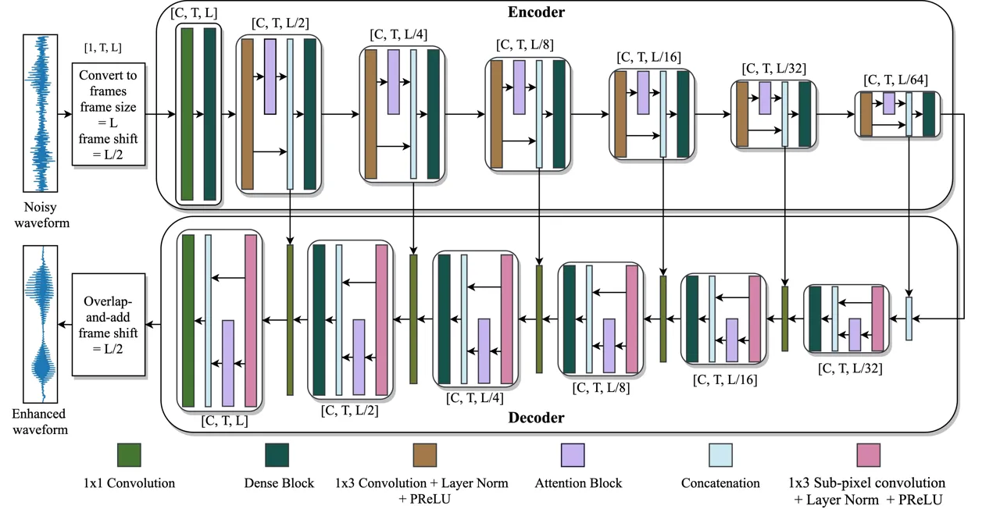

Fig. 1: Diagram of the proposed DCN model.

## III Dense Convolutional Network

A block diagram of DCN is shown in Fig. 1. The building blocks of DCN
are 2D convolution, sub-pixel convolution \[39\], layer normalization
\[40\], dense block \[36\], and self-attention module \[29\]. Next, we
describe these building blocks one by one.

### III-A 2-D Convolution

Formally, a 2-D discrete convolution operator $`*`$, which convolves a
signal $`\bm{Y}`$ of size $`T\times L`$ with a kernel $`\bm{K}`$ of size
$`m\times n`$ and stride $`(r,s)`$, is defined as

```math
(\bm{Y}*\bm{K})(i,j)=\sum_{u=0}^{m-1}\sum_{v=0}^{n-1}Y(r\cdot i+u,s\cdot j+v)\cdot K(u,v) \tag{6}
```

where $`i\in\{0,1\cdots,T-m\}`$ and $`j\in\{0,1,\cdots L-n\}`$. Note
that Eq. (6) is actually a correlation operator generally referred as
convolution in convolutional neural networks. Further, Eq. (6) defines
VALID convolution in which the kernel is placed only at the locations
where it does not cross the signal boundary, and as a result the output
size is reduced to $`(T-m+1)\times(L-n+1)`$. Fig. 2(a) illustrates the
position of kernel on four corners for VALID convolution. To obtain an
output of the same size as the input, the input is padded with zeros
around all the boundaries, and is known as SAME padding, which is shown
in Fig. 2(b).

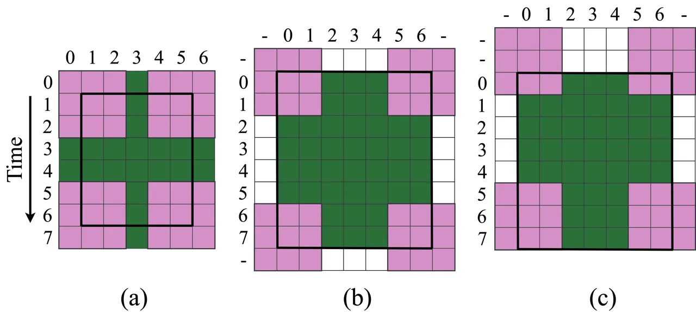

Fig. 2: Illustration of different types of convolution of an input of
size $`8\times 7`$ with a kernel of size $`3\times 3`$. (a) VALID
convolution, (b) Non-causal convolution with SAME padding. (c) Causal
convolution along time with SAME padding.

Causal convolution is a term used for convolution with time-series
signals, such as audio and video. A convolution is considered causal if
the output at $`t`$ is computed using inputs at time instances less than
or equal to $`t`$. For speech enhancement, the matrix $`\bm{Y}`$, which
stores the frames of speech signal,
$`\bm{y}_{0},\bm{y}_{1},\cdots,\bm{y}_{t},\cdots,\bm{y}_{T-1}`$, is a
time series. A non-causal convolution can be easily converted to a
causal one by padding extra zeros in the beginning ($`t<0`$). A causal
convolution is shown in Fig. 2(c). In general, a padding of length
$`m-1`$ is required for causal convolution with a kernel of size $`m`$
along the time dimension.

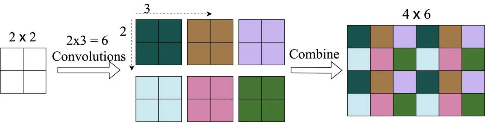

Fig. 3: An illustration of sub-pixel convolution for upsampling a 2D
signal by rate $`(2,3)`$.

### III-B Sub-pixel Convolution

First proposed in \[39\], a sub-pixel convolution is used to increase
the size of a signal (upsampling). It becomes increasingly popular as an
alternative to transposed convolution, as it avoids a well-known
checkerboard artifact in the output signal \[41\] and is computationally
efficient. For an upsampling rate $`(r,s)`$, sub-pixel convolution uses
$`r\cdot s`$ convolutions to obtain $`r\cdot s`$ different signals of
the same size as the input. The different convolutions in a sub-pixel
convolution are defined as

```math
\displaystyle\bm{S}_{0,0} \displaystyle=\text{Pad}(\bm{Y})*\bm{K}_{0,0} \tag{7}
```

```math
\displaystyle\bm{S}_{0,1} \displaystyle=\text{Pad}(\bm{Y})*\bm{K}_{0,1}
```

```math
\displaystyle\cdots
```

```math
\displaystyle\bm{S}_{r-1,s-1} \displaystyle=\text{Pad}(\bm{Y})*\bm{K}_{r-1,s-1}
```

where Pad denotes the SAME padding operation and $`\bm{K}_{i,j}`$
denotes a convolution kernel. $`\bm{S_{1,1}}`$, $`\bm{S_{1,2}}`$,
$`\cdots`$, and $`\bm{S_{r-1,s-1}}`$ are combined to obtain the
upsampled signal using the following equation,

```math
S(i,j)=S_{(i\%r),(j\%s)}(\left\lfloor i/r\right\rfloor,\left\lfloor j/s\right\rfloor) \tag{8}
```

where $`\%`$ denotes the remainder operator,
$`\left\lfloor\ \right\rfloor`$ the floor operator,
$`i\in\{0,1,\cdots,r\cdot T-1\}`$, and
$`j\in\{0,1,\cdots,s\cdot L-1\}`$. A diagram of sub-pixel convolution is
shown in Fig. 3.

### III-C Layer Normalization

Layer normalization is a technique proposed to improve generalization
and facilitate DNN training \[40\]. It is used as an alternative to
batch normalization, which is sensitive to training batch size. We use
the following layer normalization.

```math
\bm{y}^{norm}=\frac{\bm{y}-\mu_{y}}{\sqrt{\sigma^{2}_{y}+\epsilon}}\odot\bm{\gamma}+\bm{\beta} \tag{9}
```

where $`\mu_{y}`$ and $`\sigma_{y}^{2}`$, respectively, are scalars
representing mean and variance of $`\bm{y}`$. $`\bm{\gamma}`$ and
$`\bm{\beta}`$ are trainable variables of the same size as $`\bm{y}`$,
and $`-,+`$, and $`\odot`$ respectively denote element-wise subtraction,
addition and multiplication. $`\epsilon`$ is a small positive constant
to avoid division by zero. For an input of shape $`[C,T,L]`$ ($`C`$
channels, $`T`$ frames), normalization is performed over the last
dimension using $`\bm{\gamma}`$ and $`\bm{\beta}`$ that are shared
across channels and frames.

### III-D Dense Block

Densely connected convolutional networks were recently proposed in
\[36\]. A densely connected network is based on the idea of feature
reuse in which an output at a given layer is reused multiple times in
the subsequent layers. In other words, the input to a given layer is not
just the input from the previous layer but also the outputs from several
layers before the given layer. It has two major advantages. First, it
can avoid the vanishing gradient problem in DNNs because of the direct
connections of a given layer to the subsequent layers. Second, a thinner
(in terms of the number of channels) dense network is found to
outperform a wider normal network, and hence improves the parameter
efficiency of the network. Formally, a dense connection can be defined
as

```math
\bm{y}^{l}=g(\bm{y}^{l-1},\bm{y}^{l-2},\cdots,\bm{y}^{l-D}) \tag{10}
```

where $`\bm{y}^{l}`$ denotes the output at layer $`l`$, $`g`$ is the
function represented by a single layer in the network, and $`D`$ is the
depth of dense connections. DCN uses a dense block after each layer in
the encoder and the decoder. The proposed dense block is shown in Fig. 4. It consists of five convolutional layers with $`m\times 3`$
convolutions followed by layer normalization and parametric ReLU
nonlinearity \[42\]. We set $`m`$ to $`2`$ for causal and to $`3`$ for
non-causal convolution. The input to a given layer is formed by a
concatenation of the input to and the output of the previous layer. The
number of input channels in the successive layers increases linearly as
$`C,2C,3C,4C,5C`$. The output after each convolution has $`C`$ channels.

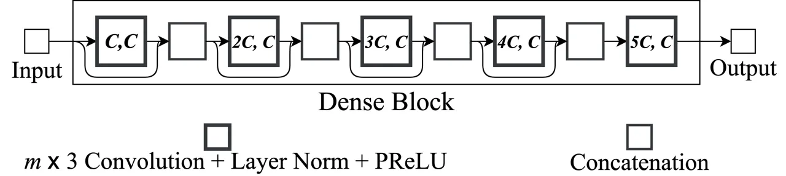

Fig. 4: The proposed dense block. $`X`$ and $`Y`$ in the pair $`(X,Y)`$
inside convolution box, respectively, denote the number of input and
output channels.

### III-E Self-attention Module

DCN uses self attention after downsampling in the encoder and upsampling
in the decoder. An attention mechanism comprises three key components:
query $`\bm{Q}`$, key $`\bm{K}`$, and value $`\bm{V}`$, where
$`\{\bm{K},\bm{Q}\}\in\mathbb{R}^{T\times I}`$ and
$`\bm{V}\in\mathbb{R}^{T\times J}`$. First, correlation scores of all
the rows in $`\bm{Q}`$ are computed with all the rows in $`\bm{K}`$
using the following equation.

```math
\bm{W}=\bm{Q}\bm{K}^{\mathbb{T}} \tag{11}
```

where $`\bm{K}^{\mathbb{T}}`$ denotes the transpose of $`\bm{K}`$ and
$`\bm{W}\in\mathbb{R}^{T\times T}`$. Next, correlation scores are
converted to probability values using a Softmax operation defined as

```math
\text{Softmax}(\bm{W})(i,j)=\frac{\exp^{W(i,j)}}{\sum_{j=0}^{T-1}\exp^{W(i,j)}} \tag{12}
```

Finally, the rows of $`\bm{V}`$ are linearly combined using weights in
$`\text{Softmax}(\bm{W})`$ to obtain the attention output.

```math
\bm{A}=\text{Softmax}(\bm{W})\bm{V} \tag{13}
```

An attention mechanism is called self-attention if $`\bm{Q}`$ and
$`\bm{K}`$ are computed from the same sequence. For example, given an
input sequence $`\bm{Y}`$, a self-attention layer can be implemented by
using a linear layer to compute $`\bm{Q},\bm{K},`$ and $`\bm{V}`$, and
then using Eqs. (11-13) to get the attention output.

The proposed self-attention module in DCN is shown in Fig. 5. First,
three different $`1\times 1`$ convolutions are used to transform an
input of shape $`[C,T,L]`$ to $`\bm{Q}`$ of shape $`[E,T,L]`$,
$`\bm{K}`$ of shape $`[E,T,L]`$, and $`\bm{V}`$ of shape $`[F,T,L]`$.
Next, $`\bm{Q},\bm{K}`$, and $`\bm{V}`$ are reshaped to obtain 2D
matrices. Finally, Eq. (11), Eq. (12), and Eq. (13) are applied to get
the 2D attention output, which is reshaped to get an output of shape
$`[F,T,L]`$. The proposed attention module is similar to the one in
\[37\] with one difference: we do not use linear layers to project
$`\bm{Q}`$ and $`\bm{K}`$ to lower dimensions. We find that the
performance is similar with and without linear layers.

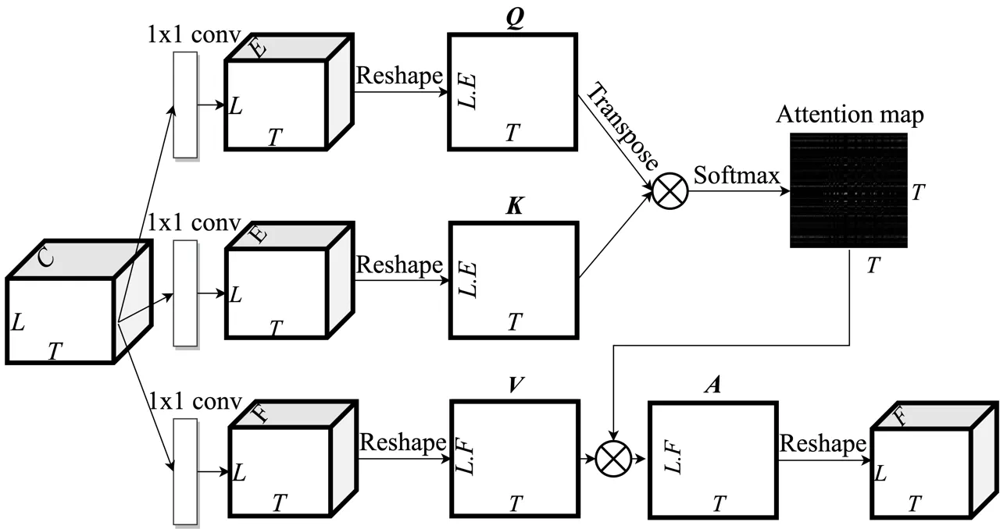

Fig. 5: Proposed self-attention module.

Causal attention can be implemented by applying a mask to $`\bm{W}`$
where entries above the main diagonal are set to negative infinity so
that the contribution from future frames in Eq. (12) becomes zero. This
can be defined as

```math
\bm{A}_{causal}=\text{Softmax}(\text{Mask}(\bm{W}))\bm{V} \tag{14}
```

where

```math
\text{Mask}(W)(i,j)=\begin{cases}W(i,j),&\text{if}\ i\leq j\\
-\infty,&\text{otherwise}\end{cases} \tag{15}
```

With the building blocks described, we now present the processing flow
of DCN. First, a given utterance $`\bm{y}`$ is chunked into frames of
size $`L`$, reshaped to a shape of $`[1,T,L]`$, and fed to the encoder.
The first layer in the encoder uses $`1\times 1`$ convolution to
increase the number of channels to $`C`$, and then is processed by a
dense block. The following $`6`$ layers in the encoder process their
input by one convolutional layer for downsampling, one attention module
and one dense block. The output of the attention module is concatenated
with its input along the channel dimension before feeding it to the
dense block. The output of the encoder is fed to the decoder. Each layer
in the decoder has one module for upsampling using sub-pixel
convolution, one attention module and one dense block. The output of the
decoder is concatenated with the output of the corresponding symmetric
layer in the encoder. The final layer in the decoder does not include a
dense block, and uses $`1\times 1`$ convolution to output a signal with
1 channel, which is subject to overlap-and-add to obtain the enhanced
utterance. Each convolution in DCN, except at the input and at the
output, is followed by layer normalization and parametric ReLU \[42\].

## IV Loss Functions

### IV-A Time-Domain Loss

An utterance level mean squared error (MSE) loss in the time domain is
defined as

```math
L_{T}(\bm{s},\bm{\widehat{s}})=\frac{1}{M}\sum_{k=0}^{M-1}(s[k]-\widehat{s}[k])^{2} \tag{16}
```

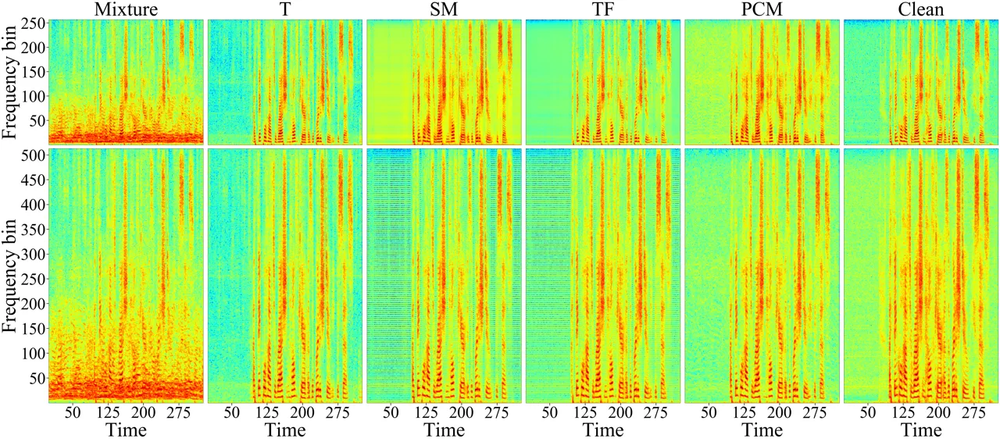

Fig. 6: Spectrograms of a sample utterance processed using DCN trained
with different loss functions. Frame size for STFT is $`32`$ ms in the
first row and $`64`$ ms in the second row.

### IV-B STFT Magnitude Loss

A loss based on STFT magnitude was proposed in \[24\], which was found
to be superior to the time-domain loss in terms of objective
intelligibility and quality scores, and a little worse in terms of
scale-invariant speech-to-distortion ratio (SI-SDR). The loss is defined
as

```math
\displaystyle L_{SM}(\bm{s},\bm{\widehat{s}})=\frac{1}{T\cdot F}\sum_{t=0}^{T-1}\sum_{f=0}^{F-1} \displaystyle[(|S_{r}(t,f)|+|S_{i}(t,f)|) \tag{17}
```

```math
\displaystyle- \displaystyle(|\widehat{S}_{r}(t,f)|+|\widehat{S}_{i}(t,f)|)]
```

where $`\bm{S}`$ and $`\bm{\widehat{S}}`$ respectively denote STFTs of
$`\bm{s}`$ and $`\bm{\widehat{s}}`$, $`T`$ is the number of time frames,
and $`F`$ is the number of frequency bins. Subscripts $`r`$ and $`i`$
respectively denote the real and the imaginary part of a complex
variable. $`L_{SM}`$ is a mean absolute error loss between the $`L_{1}`$
norm of clean and estimated STFT coefficients \[43\].

Even though $`L_{SM}`$ can obtain better objective scores, it has some
disadvantages. First, we find that it is not consistent in terms of SNR
improvement, as in some cases processed SNR is found to be worse than
unprocessed SNR. However, a consistent improvement is observed in
scale-invariant scores, such as SI-SNR and SI-SDR, suggesting that
enhanced utterances do not have an appropriate scale using $`L_{SM}`$,
which is a requirement for speech enhancement algorithms. Second, we
find that $`L_{SM}`$ introduces an unknown artifact in enhanced
utterances, which does not affect intelligibility and quality scores,
but this steady buzzing sound is annoying to human listeners.

We find that the introduced artifact is not visible in a spectrogram
with the same frequency resolution as in the STFT of $`L_{SM}`$.
However, it can be observed with a higher frequency resolution.
Spectrograms of a sample noisy utterance enhanced using DCN trained with
different loss functions is plotted in Fig. 6. The first row plots
spectrograms with frame size and frame shift equal to the ones used in
computation of $`L_{SM}`$, $`L_{TF}`$ (Eq. (18)), and $`L_{PCM}`$ (Eq.
(19)). The second row plots spectrograms with a frame size twice that in
the first row. We can see horizontal stripes in the second plot of
$`L_{SM}`$ and $`L_{TF}`$, which are not visible in the first row, and
these stripes correspond to the artifact in enhanced utterances. This
artifact is not present with the time-domain MSE loss or PCM loss
proposed in the study.

### IV-C Time-frequency Loss

Time-frequency loss, which was proposed in \[26\], is a combination of
$`L_{T}`$ and $`L_{SM}`$. It is defined as

```math
L_{TF}=\alpha\cdot L_{T}+(1-\alpha)\cdot L_{SM} \tag{18}
```

where $`\alpha`$ is a hyperparameter. We find that $`L_{TF}`$ can solve
the inconsistent SNR problem associated with $`L_{SM}`$ as it obtains
consistent SNR improvement similar to $`L_{T}`$. Additionally,
$`L_{TF}`$ preserves improvements in objective scores obtained using
$`L_{SM}`$. However, $`L_{TF}`$ is not able to remove the artifacts, as
shown in Fig. 6. We have explored different values of $`\alpha`$ in Eq.
(18) and find that the artifact is present for a wide range of
$`\alpha`$ values, and not straightforward to find a value that can
remove the artifacts while maintaining objective scores similar to
$`L_{SM}`$.

### IV-D Phase Constrained Magnitude Loss

We propose a new loss that is based on STFT magnitude but can alleviate
both the problems associated with $`L_{SM}`$. Given $`\bm{y}`$,
$`\bm{s}`$, and $`\bm{\widehat{s}}`$, a prediction for noise can be
defined as

```math
\bm{\widehat{n}}=\bm{y}-\bm{\widehat{s}} \tag{19}
```

Now, we can modify the objective of speech enhancement to match not only
the STFT magnitude of speech but that of the noise also. The PCM loss is
defined as

```math
\displaystyle L_{PCM}(\bm{s},\bm{\widehat{s}}) \displaystyle=\frac{1}{2}\cdot L_{SM}(\bm{s},\bm{\widehat{s}})+\frac{1}{2}\cdot L_{SM}(\bm{n},\bm{\widehat{n}}) \tag{20}
```

Even though one can play with relative contributions of speech and
noise, we find that the equal contribution in Eq. (20) obtains
consistent SNR improvement similar to $`L_{T}`$, removes artifacts
associated with $`L_{SM}`$, and achieves objective intelligibility and
quality scores similar to $`L_{SM}`$.

How can $`L_{PCM}`$ remove the artifact caused by $`L_{SM}`$? Let
$`y(t,f)`$, $`s(t,f)`$, and $`n(t,f)`$ respectively denote the STFT
coefficients at a given T-F unit of noisy speech, clean speech, and
noise. $`L_{SM}`$ aims at obtaining close estimates of $`|s(t,f)|`$
only, and there is an arbitrary number of perfect estimates of
$`|s(t,f)|`$ in the complex representation. This is illustrated in Fig.
7(a) with $`5`$ perfect estimates of $`|s(t,f)|`$ at the perimeter of a
circle with the radius of $`|s(t,f)|`$. $`L_{PCM}`$, on the other hand,
aims at getting good estimates of both $`|s(t,f)|`$ and $`|n(t,f)|`$,
and it has only two candidates for the perfect estimate as shown in Fig.
7(b). This implies that $`L_{PCM}`$ optimizes $`L_{SM}`$ with an
additional constraint on phase, hence the name PCM.

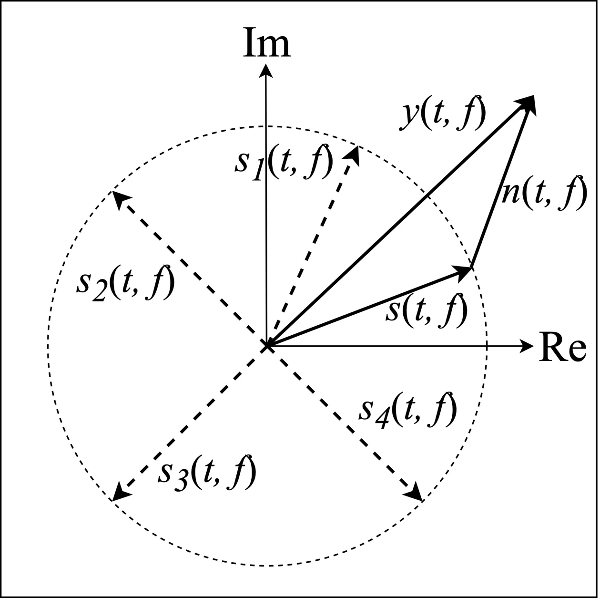

(a) $`L_{SM}`$

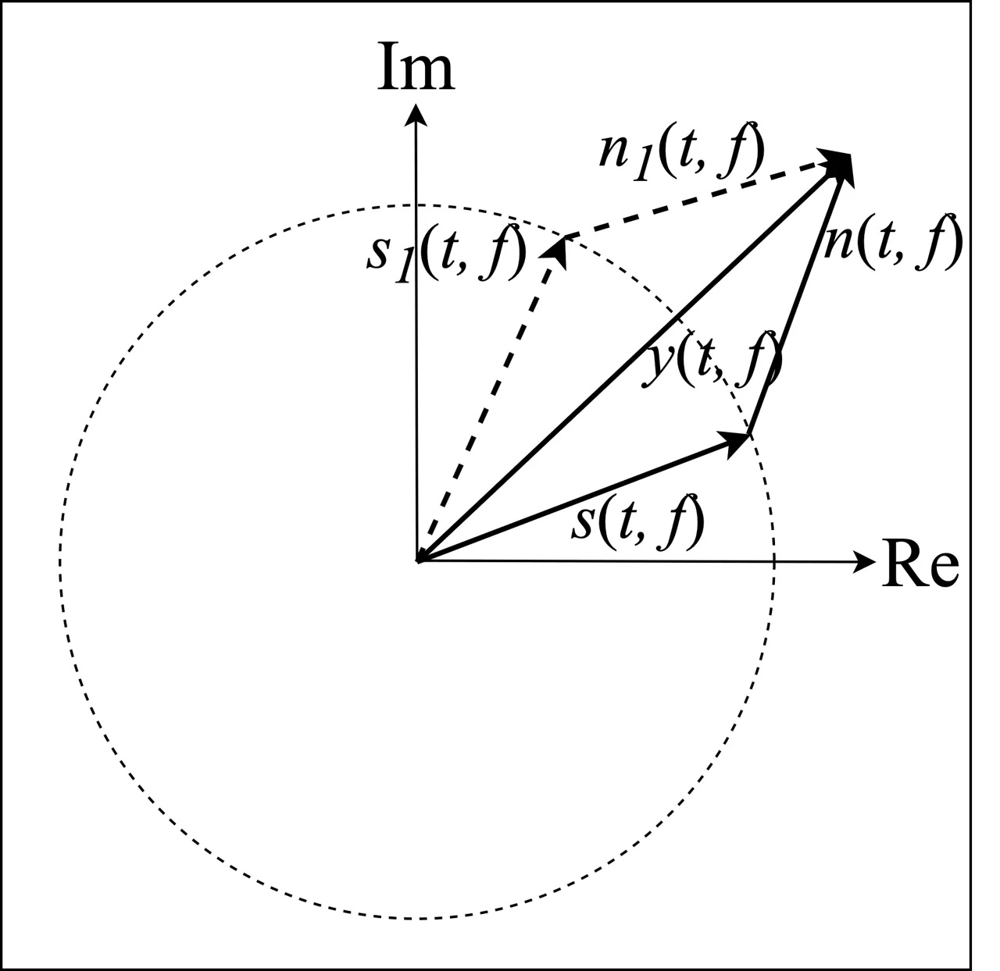

(b) $`L_{PCM}`$

Fig. 7: Differences between $`L_{SM}`$ and $`L_{PCM}`$ in Cartesian
(rectangular) coordinates. Re and Im respectively denote the real and
the imaginary axes in complex plane.

## V Experimental settings

### V-A Datasets

We evaluate all the models in a speaker- and noise-independent way on
the WSJ0 SI-84 dataset (WSJ) \[44\], which consists of $`7138`$
utterances from $`83`$ speakers ($`42`$ males and $`41`$ females).
Seventy seven speakers are used for training and remaining six are used
for evaluation. For training, we use 10000 non-speech sounds from a
sound effect library (available at www.sound-ideas.com) \[9\], and
generate $`320000`$ noisy utterances at SNRs uniformly sampled from
{$`-5`$ dB, $`-4`$ dB, $`-3`$ dB, $`-2`$ dB, $`-1`$ dB, $`0`$ dB}. For
the test set, we use babble and cafeteria noises from an Auditec CD
(available at http://www.auditec.com), and generate $`150`$ noisy
utterances for both the noises at SNRs of $`-5`$ dB, $`0`$ dB, and $`5`$
dB.

### V-B System Setup

All the utterances are resampled to $`16`$ kHz. We use
$`L=512,J=256,C=64,E=5,`$ and $`F=32`$. Inside a dense block, $`m`$ is
set to $`2`$ for causal and $`3`$ for non-causal DCN.

The Adam optimizer \[45\] is used for SGD (stochastic gradient descent)
based optimization with a batch size of $`4`$ utterances. All the models
are trained for 15 epochs using a learning rate schedule given in
\[26\]. We use PyTorch \[46\] to develop all the models, and utilize its
default settings for initialization. DCN and NC-DCN are trained using
two NVIDIA Volta V100 16GB GPUs and require one week of training. The
DataParallel module of PyTorch is used to distribute data to two GPUs.

### V-C Baseline Models

We compare DCN with different existing approaches to speech enhancement,
namely T-F masking, spectral mapping, complex spectral mapping, and
time-domain enhancement. For T-F masking, we train an IRM based
4-layered bidirectional long short-term memory (BLSTM) network \[12\]. A
gated residual network (GRN) proposed in \[13\] is used for spectral
mapping. For complex spectral mapping, we report results from a recently
proposed state-of-the-art gated convolutional recurrent network (GCRN)
\[19\]. We compare with both causal and non-causal GCRN. For time-domain
enhancement, we compare results with three different models:
auto-encoder CNN (AECNN) \[24\], temporal convolutional neural network
(TCNN) \[25\], and speech enhancement generative adversarial network
(SEGAN) \[20\]. SEGAN is trained with the time-domain loss as we find it
to be superior to adversarial training proposed in the original paper.

### V-D Evaluation Metrics

We use short-time objective intelligibility (STOI) \[47\], perceptual
evaluation of speech quality (PESQ) \[48\], and signal-to-noise ratio
(SNR) as the evaluation metrics, which are the standard metrics for
speech enhancement. STOI values typically range from $`0`$ to $`1`$,
which can be roughly interpreted as percent correct. PESQ values range
from $`-0.5`$ to $`4.5`$.

Metric STOI PESQ SNR Test noise Babble Cafeteria Babble Cafeteria Babble
Cafeteria Test SNR (dB) -5 0 5 Avg. -5 0 5 Avg. -5 0 5 Avg. -5 0 5 Avg.
-5 0 5 Avg. -5 0 5 Avg. Mix. $`\rightarrow`$ $`m\downarrow`$ Dil.
$`\downarrow`$ Att. $`\downarrow`$ 58.4 70.5 81.3 70.1 57.1 69.7 81.0
69.2 1.56 1.82 2.12 1.83 1.46 1.77 2.12 1.78 -5.0 0.0 5.0 0 -5.0 0.0 5.0
0.0 Causal 1 ✕ ✕ 76.7 88.0 93.2 86.0 76.4 87.8 92.9 85.7 1.90 2.39 2.76
2.35 2.02 2.49 2.84 2.45 5.5 9.9 13.4 9.6 6.5 10.4 13.4 10.1 2 ✕ ✕ 81.6
91.3 95.0 89.3 80.5 90.2 94.3 88.3 2.13 2.70 3.08 2.64 2.17 2.68 3.05
2.63 7.4 11.5 14.7 11.2 7.7 11.4 14.4 11.2 2 ✓ ✕ 83.5 91.9 95.2 90.2
81.4 90.5 94.5 88.8 2.23 2.75 3.12 2.70 2.21 2.70 3.07 2.66 7.7 11.8
15.0 11.5 7.9 11.5 14.5 11.3 2 ✓ ✓ 84.9 92.2 95.3 90.8 82.1 90.7 94.6
89.1 2.30 2.77 3.14 2.74 2.23 2.71 3.08 2.67 8.2 12.0 15.1 11.8 8.2 11.7
14.7 11.5 2 ✕ ✓ 85.3 92.3 95.4 91.0 82.3 90.8 94.7 89.3 2.34 2.81 3.17
2.77 2.24 2.72 3.09 2.68 8.5 12.1 15.1 11.9 8.2 11.7 14.7 11.5 1 ✕ ✓
83.9 91.8 95.2 90.3 81.0 90.3 94.5 88.6 2.23 2.72 3.09 2.68 2.15 2.62
3.01 2.59 7.9 11.8 15.0 11.6 7.9 11.5 14.5 11.3 Non-causal 3 ✕ ✕ 84.7
92.5 95.7 90.9 83.1 91.4 95.0 89.8 2.37 2.88 3.22 2.82 2.34 2.82 3.16
2.77 8.2 12.2 15.2 11.9 8.3 11.8 14.7 11.6 3 ✓ ✕ 86.6 92.9 95.7 91.7
84.1 91.7 95.0 90.3 2.53 2.96 3.24 2.91 2.44 2.88 3.19 2.84 9.1 12.5
15.3 12.3 8.7 12.0 14.8 11.8 3 ✓ ✓ 87.9 93.5 96.0 92.4 85.0 92.0 95.2
90.8 2.61 3.02 3.32 2.98 2.47 2.91 3.24 2.87 9.6 12.9 15.7 12.7 8.9 12.2
15.0 12.0 3 ✕ ✓ 87.9 93.5 96.1 92.5 85.0 92.1 95.3 90.8 2.61 3.04 3.33
2.99 2.45 2.91 3.23 2.86 9.6 12.9 15.8 12.8 8.9 12.3 15.1 12.1 1 ✕ ✓
83.7 91.5 95.2 90.1 80.1 89.8 94.3 88.1 2.24 2.71 3.09 2.68 2.13 2.59
2.98 2.57 8.3 12.0 15.2 11.8 7.8 11.4 14.6 11.3

TABLE I: Performance comparisons between different configurations of
dense block, dilation, and attention in DCN. Boldface indicates the best
score in a given condition.

Approach Causal? Real-time? Metric STOI PESQ Test Noise Babble Cafeteria
Babble Cafeteria Test SNR -5 db 0 dB 5 dB AVG -5 dB 0 dB 5 dB AVG -5 db
0 dB 5 dB AVG -5 dB 0 dB 5 dB AVG Mixture 58.4 70.5 81.3 70.1 57.1 69.7
81.0 69.2 1.56 1.82 2.12 1.83 1.46 1.77 2.12 1.78 a) ✕ ✕ BLSTM \[12\]
77.4 85.8 91.0 84.7 76.1 84.7 90.5 83.7 1.97 2.37 2.69 2.34 2.01 2.38
2.51 2.30 b) ✕ ✕ GRN \[13\] 80.2 88.9 93.4 87.5 79.4 88.0 92.9 86.8 2.16
2.63 2.97 2.59 2.23 2.62 2.96 2.60 c) ✓ ✓ GCRN \[19\] 82.4 90.9 94.8
89.4 79.1 89.3 94.0 87.5 2.17 2.70 3.07 2.65 2.10 2.60 2.99 2.56 ✕ ✕
NC-GCRN \[19\] 87.0 93.0 95.6 91.9 84.1 91.7 95.1 90.3 2.53 2.96 3.25
2.91 2.40 2.85 3.17 2.81 d) ✓ ✕ SEGAN-T \[20\] 81.5 90.3 94.1 88.6 79.8
89.5 93.5 87.6 2.11 2.62 2.97 2.57 2.15 2.61 2.94 2.57 ✓ ✕ AECNN-SM
\[24\] 82.6 91.5 95.1 89.7 81.1 90.7 94.5 88.8 2.21 2.80 3.17 2.73 2.23
2.76 3.12 2.70 ✓ ✓ TCNN \[25\] 82.8 91.3 94.8 89.6 80.6 89.8 94.0 88.1
2.18 2.70 3.06 2.65 2.14 2.62 2.98 2.58 ✓ ✓ DCN-T 85.3 92.3 95.4 91.0
82.3 90.8 94.7 89.3 2.34 2.81 3.17 2.77 2.24 2.72 3.09 2.68 ✓ ✓ DCN-SM
85.2 92.7 95.8 91.2 82.5 91.3 95.1 89.6 2.35 2.93 3.31 2.86 2.33 2.85
3.22 2.80 ✓ ✓ DCN-PCM 85.1 92.7 95.8 91.2 82.5 91.3 95.1 89.6 2.31 2.91
3.30 2.84 2.29 2.82 3.22 2.78 ✕ ✕ NC-DCN-T 87.9 93.5 96.1 92.5 85.0 92.1
95.3 90.8 2.61 3.04 3.33 2.99 2.45 2.91 3.23 2.86 ✕ ✕ NC-DCN-SM 89.1
94.2 96.5 93.3 85.8 92.9 95.8 91.5 2.75 3.19 3.46 3.13 2.61 3.07 3.37
3.02 ✕ ✕ NC-DCN-PCM 89.0 94.3 96.6 93.3 85.6 93.0 95.9 91.5 2.71 3.18
3.48 3.12 2.56 3.07 3.39 3.01

TABLE II: STOI and PESQ comparisons between DCN and the baseline models
of a) T-F masking, b) spectral mapping, c) complex-spectral mapping, and
d) time-domain enhancement.

## VI Results and Discussions

### VI-A Ablation Study

In this section, we present the findings of an ablation study performed
to analyze the effectiveness of different context-aggregation techniques
in DCN. There are $`3`$ components responsible for context-aggregation.
First, using $`m>1`$ in a dense block so that the receptive field of
convolution extends beyond one frame. Second, using an exponentially
increasing dilation rate in the layers of dense blocks, as proposed in
\[26\]. Third, the attention module proposed in this study (Section
III-E). STOI, PESQ, and SNR scores for causal and non-causal models
trained using $`L_{T}`$ are given in Table I.

We observe that when there is no context, i.e., $`m=1`$, no dilation,
and no attention, an average improvement of $`16.2\%`$ in STOI, $`0.59`$
in PESQ, and $`9.9`$ dB in SNR is obtained in causal enhancement.
Increasing $`m`$ to $`2`$ with causal convolution obtains further
improvement of $`3\%`$ in STOI, $`0.24`$ in PESQ, and $`1.3`$ dB in SNR.
Next, replacing causal convolutions with dilated and causal
convolutions, as in \[26\], obtains further improvement of $`0.7\%`$ in
STOI, $`0.05`$ in PESQ, and $`0.2`$ dB in SNR. Most of the improvements
due to dilated convolutions are at the negative SNR of $`-5`$ dB. This
suggests that a larger context is more helpful for speech enhancement in
low SNR conditions. Further, inserting attention module to the network
consistently improves objective scores with relatively larger
improvements at $`-5`$ dB. In summary, objective scores are improved by
progressively adding all the three components of context aggregation to
the model, and most of the improvements are obtained at $`-5`$ dB.

Next, we change the dilated convolutions to normal convolutions and
observe that objective scores either improve or remain similar. This
suggests that using dilated convolutions along with attention would be
redundant, since attention can utilize maximum available context. Thus
we can expect that $`m=1`$ with attention should be sufficient for
context aggregation. However, we find that reducing $`m`$ from $`2`$ to
$`1`$ degrades performance. Therefore, context aggregation using the
attention module along with some context with normal convolution is
important for optimal results. Also, we find $`m=3`$ to be worse than
$`m=2`$ (not reported here). A similar behavior is observed for
non-causal models, where $`m`$ is set to $`3`$ instead of $`2`$ to
maintain symmetry in context from past and future.

### VI-B Loss Comparisons

This section analyzes different loss functions, and illustrates
advantages of the proposed $`L_{PCM}`$. First, we reveal the
inconsistent SNR improvement issue with $`L_{SM}`$. Causal and
non-causal DCN are trained using $`L_{T}`$, $`L_{SM}`$, $`L_{TF}`$, and
$`L_{PCM}`$, and average STOI and PESQ scores over two test noises and
SNRs of $`-5`$ dB, $`-2`$ dB, $`0`$ dB, $`2`$ dB, and $`5`$ dB are
plotted in Fig. 8. We observe that $`L_{SM}`$, $`L_{TF}`$, and
$`L_{PCM}`$ obtain similar STOI scores, and they are better than
$`L_{T}`$. $`L_{T}`$, $`L_{TF}`$, and $`L_{PCM}`$ obtain similar SNR
scores, whereas $`L_{SM}`$ obtains similar SNR for a causal system but
significantly worse SNR (even worse than unprocessed) for the non-causal
system. We find that the SNR improvement of $`L_{SM}`$ is sensitive to
learning rate, initialization and model architecture, i.e., not
consistent. We also find that both $`L_{TF}`$ and $`L_{PCM}`$ obtain
consistent SNR improvement similar to $`L_{T}`$, suggesting that
$`L_{TF}`$ and $`L_{PCM}`$ can solve this issue without compromising
STOI and PESQ scores.

Next, we evaluate the effects of $`\alpha`$ in $`L_{TF}`$. Average STOI,
PESQ, and SNR scores of a dilation based model \[26\] are plotted in
Fig. 9 over two test noises and SNRs of $`-5`$ dB, $`-2`$ dB, $`0`$ dB,
$`2`$ dB, and $`5`$ dB. We use $`\alpha`$ values from {$`0.0`$, $`0.2`$,
$`0.4`$, $`0.6`$, $`0.8`$, $`1.0`$}. We can notice that for
$`\alpha<1`$, STOI and PESQ scores are similar. For $`\alpha=1`$, which
corresponds to $`L_{T}`$, STOI and PESQ results are worse. Similarly,
SNR scores are similar for $`\alpha>0`$ and worse for $`\alpha=0`$,
which corresponds to $`L_{SM}`$. These observations suggest that as long
as $`L_{SM}`$ is included in training, better STOI and PESQ results are
obtained. Similarly, as long as $`L_{T}`$ is included in training, a
consistent improvement in SNR is obtained.

We provide enhanced speech samples at
https://web.cse.ohio-state.edu/~wang.77/pnl/demo/PandeyDCN.html. The
artifact is observed with $`L_{SM}`$ and $`L_{TF}`$, but not with
$`L_{T}`$ and $`L_{PCM}`$. These comparisons suggest that $`L_{TF}`$ can
solve the inconsistent SNR issue, but is not able to remove the
artifact. Fig. 8 suggests that the proposed $`L_{PCM}`$ improves SNR
consistently and obtains STOI and PESQ similar to $`L_{SM}`$. As shown
in Fig. 6, the PCM loss removes the buzzing artifact present in the SM
and TF losses.

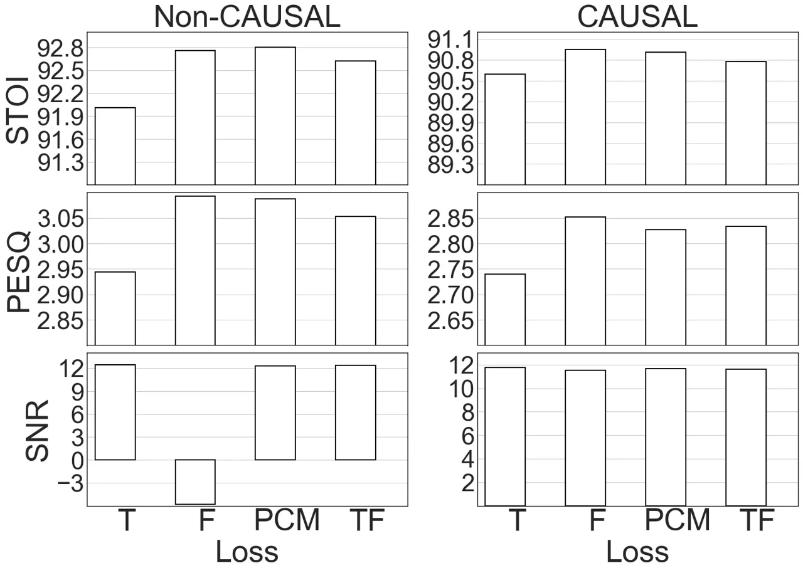

Fig. 8: STOI, PESQ and SNR comparisons between different loss functions.

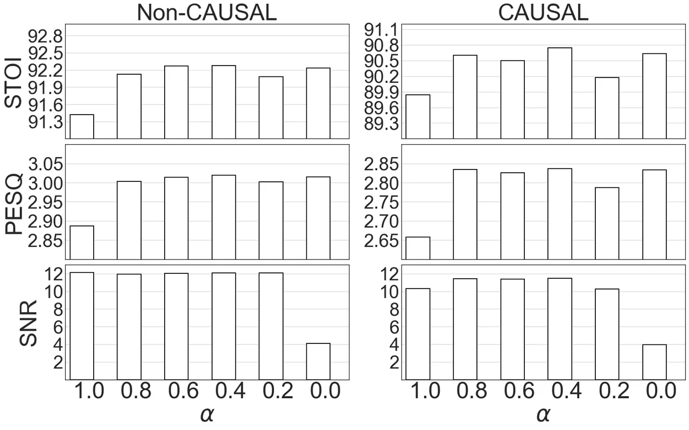

Fig. 9: Performance of $`L_{TF}`$ with different $`\alpha`$ values.

### VI-C Comparison with Baselines

In this section, we present results to demonstrate the superiority of
DCN over different approaches. DCN is compared with a BLSTM for T-F
masking \[12\], GRN \[13\] for spectral mapping, GCRN \[19\] for complex
spectral mapping, and SEGAN \[20\], AECNN \[24\], and TCNN for
time-domain enhancement. In our results, we call a system real-time if
it is causal and uses a frame size less than or equal to $`32`$ ms,
which is a general setting for real-time enhancement algorithms. The
STOI and PESQ scores over two test noises are given in Table II. We
denote non-causal DCN as NC-DCN and non-causal GCRN as NC-GCRN. DCN
trained with $`L_{X}`$ is denoted as DCN-X.

First, we observe that a frame based model with $`m=1`$, no dilation,
and no attention (Table I), outperforms BLSTM based T-F masking on
average. BLSTM is slightly better at $`-5`$ dB SNR. Note that BLSTM is a
non-causal system that utilizes a whole utterance for one frame
enhancement. This suggests that, even without any context information,
the proposed model is a highly effective network for speech enhancement
in the time domain.

Further, using $`m=2`$ with causal convolution makes it significantly
better than spectral mapping based non-causal GRN and time-domain SEGAN,
which is a causal network but uses a frame size of $`1`$ second, and
hence is not real-time. It is also similar or better than
complex-spectral mapping based causal GCRN for all cases but babble
noise at $`-5`$ dB. Similarly, using $`m=3`$ with non-causal convolution
makes it comparable to NC-GCRN, which is the best performing network in
the baseline models. It implies that the proposed network can outperform
all the baselines without any dilation and attention. Also, these
comparisons are done with the proposed network trained with $`L_{T}`$;
training with $`L_{PCM}`$ will obtain obtain even better performance
improvement over baselines.

Additionally, Table II reports STOI and PESQ numbers for DCN-T, DCN-SM,
and DCN-PCM. We can see that DCN-SM and DCN-PCM obtain similar scores,
which are better than DCN-T for all the cases except babble $`-5`$ dB,
where scores are similar for all the three losses.

Finally, we compare DCN-PCM, the best real-time version, with other
real-time baselines. For real-time systems, TCNN is the best baseline,
and DCN, on average, is better than TCNN by $`1.5\%`$ for STOI and
$`0.19`$ for PESQ. Similarly, we compare NC-DCN-PCM with NC-GCRN, the
best non-causal baseline system. NC-DCN, on average, outperforms NC-GCRN
by $`1.3\%`$ in STOI and $`0.21`$ in PESQ. The $`p`$ values for
statistical significance test between GCRN and DCN-PCM, and between
NC-GCRN and NC-DCN-PCM are found to be less than 0.0001 at all SNRs for
both STOI and PESQ, indicating statistically significant improvements.

### VI-D Attention Maps

The attention mechanism in DCN is meant to focus on the frames of an
utterance that can aid speech enhancement. In this section, we plot
attention scores of Eq. (13) for non-causal and causal DCN. Attention
scores for a sample utterance from the last layer of the encoder of DCN
are plotted in Fig. 10 and Fig. 11. The horizontal axis represents the
frame index of interest, and the vertical axis represents the frames
over which a given frame attends to. The spectrogram on top shows the
noisy speech and the one on the right clean one.

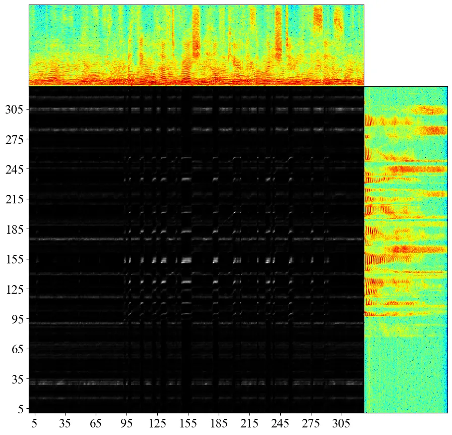

Fig. 10: Attention map of a sample utterance with non-causal DCN.

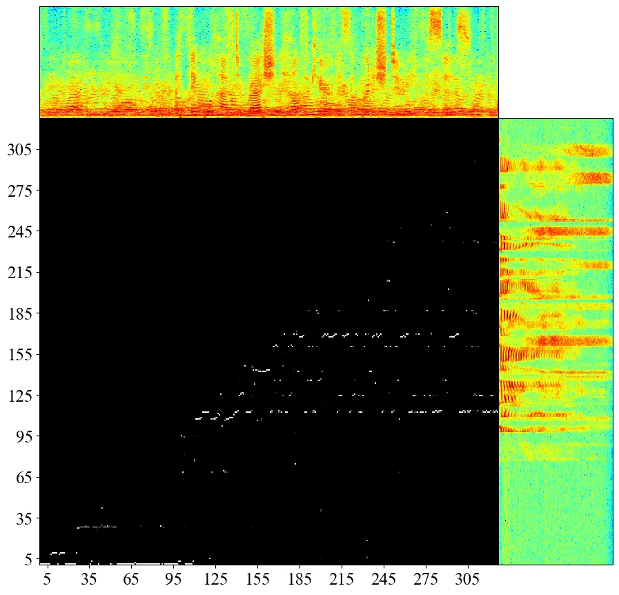

Fig. 11: Attention map of the same utterance as in Fig. 10 with causal
DCN.

For non-causal DCN, we observe that the most of the attention is paid to
the harmonic structure, i.e., on voiced speech, between frames $`125`$
and $`185`$. Also, there is some attention to two high-frequency sounds
towards the end of the utterance.

For causal DCN, since frames in the future are not available, the
attention on voiced sounds has shifted to earlier frames above frame
$`95`$. For high-frequency sounds, the two sounds towards the end of the
utterances that are used in non-causal case are not available, and hence
the attention is shifted to earlier high-frequency sounds between frames
$`155`$ and $`185`$. Also, attention in causal DCN is sharper than that
in non-casual DCN.

## VII Concluding Remarks

In this study, we have proposed a novel dense convolutional network with
self-attention for speech enhancement in the time domain. The proposed
DCN is based on an encoder-decoder structure with skip connections. The
encoder and decoder each consists of dense blocks and attention modules
that enhance feature extraction using a combination of feature reuse,
increased depth, and maximum context aggregation. We have evaluated
different configurations of DCN, and found that the attention mechanism
in conjunction with a normal convolution with a small receptive field,
i.e, no dilation, is helpful for time-domain enhancement. We have
developed causal and non-causal DCN, and have shown that DCN
substantially outperforms existing approaches to talker- and
noise-independent speech enhancement.

We have revealed some of the existing problems with a spectral magnitude
based loss. Even though magnitude based loss obtains better objective
intelligibility and quality scores, it is inconsistent in terms of SNR
improvement, and introduces an unknown artifact in enhanced utterances.
We have proposed a new phase constrained magnitude loss that combines
the two losses over STFT magnitudes of the enhanced speech and predicted
noise. The PCM loss solves the SNR and artifact issues while maintaining
the improvements in objective scores.

By visualizing attention maps, we have found that most of the attention
seems to be paid to voiced segments and some high-frequency regions.
Further, attended regions appear different for causal and non-causal
DCN, and attention is relatively sharper for causal speech enhancement.

DCN is trained on the WSJ corpus and evaluated on untrained WSJ
speakers. We have recently revealed that DNN-based speech enhancement
fails to generalize to untrained corpora, and better performance on a
trained corpus does not necessarily lead to a better performance on
untrained corpora \[49, 50\]. For future research, we plan to evaluate
DCN on untrained corpora, and explore techniques to improve cross-corpus
generalization.

## References

- \[1\] P. C. Loizou, _Speech Enhancement: Theory and Practice_,
  2nd ed. Boca Raton, FL, USA: CRC Press, 2013.
- \[2\] Y. Wang and D. L. Wang, “Towards scaling up classification-based
  speech separation,” _IEEE Transactions on Audio, Speech, and Language
  Processing_, vol. 21, pp. 1381–1390, 2013.
- \[3\] D. L. Wang and J. Chen, “Supervised speech separation based on
  deep learning: An overview,” _IEEE/ACM Transactions on Audio, Speech,
  and Language Processing_, vol. 26, pp. 1702–1726, 2018.
- \[4\] Y. Wang, A. Narayanan, and D. L. Wang, “On training targets for
  supervised speech separation,” _IEEE/ACM Transactions on Audio, Speech
  and Language Processing_, vol. 22, pp. 1849–1858, 2014.
- \[5\] H. Erdogan, J. R. Hershey, S. Watanabe, and J. Le Roux,
  “Phase-sensitive and recognition-boosted speech separation using deep
  recurrent neural networks,” in _ICASSP_, 2015, pp. 708–712.
- \[6\] X. Lu, Y. Tsao, S. Matsuda, and C. Hori, “Speech enhancement
  based on deep denoising autoencoder.” in _INTERSPEECH_, 2013, pp.
  436–440.
- \[7\] Y. Xu, J. Du, L.-R. Dai, and C.-H. Lee, “A regression approach
  to speech enhancement based on deep neural networks,” _IEEE/ACM
  Transactions on Audio, Speech and Language Processing_, vol. 23, pp.
  7–19, 2015.
- \[8\] F. Weninger, H. Erdogan, S. Watanabe, E. Vincent, J. Le Roux,
  J. R. Hershey, and B. Schuller, “Speech enhancement with LSTM
  recurrent neural networks and its application to noise-robust ASR,” in
  _International Conference on Latent Variable Analysis and Signal
  Separation_, 2015, pp. 91–99.
- \[9\] J. Chen, Y. Wang, S. E. Yoho, D. L. Wang, and E. W. Healy,
  “Large-scale training to increase speech intelligibility for
  hearing-impaired listeners in novel noises,” _The Journal of the
  Acoustical Society of America_, vol. 139, pp. 2604–2612, 2016.
- \[10\] S.-W. Fu, Y. Tsao, and X. Lu, “SNR-aware convolutional neural
  network modeling for speech enhancement.” in _INTERSPEECH_, 2016, pp.
  3768–3772.
- \[11\] S. R. Park and J. Lee, “A fully convolutional neural network
  for speech enhancement,” in _INTERSPEECH_, 2017, pp. 1993–1997.
- \[12\] J. Chen and D. L. Wang, “Long short-term memory for speaker
  generalization in supervised speech separation,” _The Journal of the
  Acoustical Society of America_, vol. 141.
- \[13\] K. Tan, J. Chen, and D. L. Wang, “Gated residual networks with
  dilated convolutions for monaural speech enhancement,” _IEEE/ACM
  Transactions on Audio, Speech, and Language Processing_, vol. 27, pp.
  189–198, 2018.
- \[14\] D. Wang and J. Lim, “The unimportance of phase in speech
  enhancement,” _IEEE Transactions on Acoustics, Speech, and Signal
  Processing_, vol. 30.
- \[15\] D. S. Williamson, Y. Wang, and D. L. Wang, “Complex ratio
  masking for monaural speech separation,” _IEEE/ACM Transactions on
  Audio, Speech and Language Processing_, vol. 24, pp. 483–492, 2016.
- \[16\] K. Paliwal, K. Wójcicki, and B. Shannon, “The importance of
  phase in speech enhancement,” _Speech Communication_, vol. 53, pp.
  465–494, 2011.
- \[17\] S.-W. Fu, T.-y. Hu, Y. Tsao, and X. Lu, “Complex spectrogram
  enhancement by convolutional neural network with multi-metrics
  learning,” in _Workshop on Machine Learning for Signal Processing_,
  2017, pp. 1–6.
- \[18\] A. Pandey and D. L. Wang, “Exploring deep complex networks for
  complex spectrogram enhancement,” in _ICASSP_, 2019, pp. 6885–6889.
- \[19\] K. Tan and D. L. Wang, “Learning complex spectral mapping with
  gated convolutional recurrent networks for monaural speech
  enhancement,” _IEEE/ACM Transactions on Audio, Speech, and Language
  Processing_, vol. 28, pp. 380–390, 2019.
- \[20\] S. Pascual, A. Bonafonte, and J. Serrà, “SEGAN: Speech
  enhancement generative adversarial network,” in _INTERSPEECH_, 2017,
  pp. 3642–3646.
- \[21\] D. Rethage, J. Pons, and X. Serra, “A wavenet for speech
  denoising,” in _ICASSP_, 2018, pp. 5069–5073.
- \[22\] K. Qian, Y. Zhang, S. Chang, X. Yang, D. Florêncio, and
  M. Hasegawa-Johnson, “Speech enhancement using bayesian wavenet,” in
  _INTERSPEECH_, 2017, pp. 2013–2017.
- \[23\] S.-W. Fu, T.-W. Wang, Y. Tsao, X. Lu, and H. Kawai, “End-to-end
  waveform utterance enhancement for direct evaluation metrics
  optimization by fully convolutional neural networks,” _IEEE/ACM
  Transactions on Audio, Speech, and Language Processing_, vol. 26, pp.
  1570–1584, 2018.
- \[24\] A. Pandey and D. L. Wang, “A new framework for CNN-based speech
  enhancement in the time domain,” _IEEE/ACM Transactions on Audio,
  Speech and Language Processing_, vol. 27, pp. 1179–1188, 2019.
- \[25\] ——, “TCNN: Temporal convolutional neural network for real-time
  speech enhancement in the time domain,” in _ICASSP_, 2019, pp.
  6875–6879.
- \[26\] ——, “Densely connected neural network with dilated convolutions
  for real-time speech enhancement in the time domain,” in _ICASSP_,
  2020, pp. 6629–6633.
- \[27\] Y. Luo and N. Mesgarani, “Conv-TasNet: Surpassing ideal
  time-frequency magnitude masking for speech separation,” _IEEE/ACM
  Transactions on Audio, Speech, and Language Processing_, vol. 27, pp.
  1256–1266, 2019.
- \[28\] Y. Luo, Z. Chen, and T. Yoshioka, “Dual-path RNN: Efficient
  long sequence modeling for time-domain single-channel speech
  separation,” in _ICASSP_, 2020, pp. 46–50.
- \[29\] A. Vaswani, N. Shazeer, N. Parmar, J. Uszkoreit, L. Jones,
  A. N. Gomez, Ł. Kaiser, and I. Polosukhin, “Attention is all you
  need,” in _NIPS_, 2017, pp. 5998–6008.
- \[30\] H. Zhang, I. Goodfellow, D. Metaxas, and A. Odena,
  “Self-attention generative adversarial networks,” in _ICML_, 2019, pp.
  7354–7363.
- \[31\] L. Dong, S. Xu, and B. Xu, “Speech-Transformer: a no-recurrence
  sequence-to-sequence model for speech recognition,” in _ICASSP_, 2018,
  pp. 5884–5888.
- \[32\] Y. Zhao, D. L. Wang, B. Xu, and T. Zhang, “Monaural speech
  dereverberation using temporal convolutional networks with self
  attention,” _IEEE/ACM Transactions on Audio, Speech, and Language
  Processing_, vol. 28, pp. 1598–1607, 2020.
- \[33\] R. Giri, U. Isik, and A. Krishnaswamy, “Attention wave-U-Net
  for speech enhancement,” in _WASPAA_, 2019, pp. 249–253.
- \[34\] J. Kim, M. El-Khamy, and J. Lee, “T-GSA: Transformer with
  Gaussian-weighted self-attention for speech enhancement,” in _ICASSP_,
  2020, pp. 6649–6653.
- \[35\] Y. Koizumi, K. Yaiabe, M. Delcroix, Y. Maxuxama, and
  D. Takeuchi, “Speech enhancement using self-adaptation and multi-head
  self-attention,” in _ICASSP_, 2020, pp. 181–185.
- \[36\] G. Huang, Z. Liu, L. Van Der Maaten, and K. Q. Weinberger,
  “Densely connected convolutional networks,” in _CVPR_, 2017, pp.
  4700–4708.
- \[37\] Y. Liu, B. Thoshkahna, A. Milani, and T. Kristjansson, “Voice
  and accompaniment separation in music using self-attention
  convolutional neural network,” _arXiv:2003.08954_, 2020.
- \[38\] A. Pandey and D. L. Wang, “A new framework for supervised
  speech enhancement in the time domain,” in _INTERSPEECH_, 2018, pp.
  1136–1140.
- \[39\] W. Shi, J. Caballero, F. Huszár, J. Totz, A. P. Aitken,
  R. Bishop, D. Rueckert, and Z. Wang, “Real-time single image and video
  super-resolution using an efficient sub-pixel convolutional neural
  network,” in _CVPR_, 2016, pp. 1874–1883.
- \[40\] J. L. Ba, J. R. Kiros, and G. E. Hinton, “Layer normalization,”
  _arXiv:1607.06450_, 2016.
- \[41\] A. Odena, V. Dumoulin, and C. Olah, “Deconvolution and
  checkerboard artifacts,” _Distill_, 2016. \[Online\]. Available:
  http://distill.pub/2016/deconv-checkerboard
- \[42\] K. He, X. Zhang, S. Ren, and J. Sun, “Delving deep into
  rectifiers: Surpassing human-level performance on imagenet
  classification,” in _ICCV_, 2015, pp. 1026–1034.
- \[43\] A. Pandey and D. L. Wang, “On adversarial training and loss
  functions for speech enhancement,” in _ICASSP_, 2018, pp. 5414–5418.
- \[44\] D. B. Paul and J. M. Baker, “The design for the wall street
  journal-based CSR corpus,” in _Workshop on Speech and Natural
  Language_, 1992, pp. 357–362.
- \[45\] D. Kingma and J. Ba, “Adam: A method for stochastic
  optimization,” in _ICLR_, 2015.
- \[46\] A. Paszke, S. Gross, S. Chintala, G. Chanan, E. Yang,
  Z. DeVito, Z. Lin, A. Desmaison, L. Antiga, and A. Lerer, “Automatic
  differentiation in pytorch,” 2017.
- \[47\] C. H. Taal, R. C. Hendriks, R. Heusdens, and J. Jensen, “An
  algorithm for intelligibility prediction of time–frequency weighted
  noisy speech,” _IEEE Transactions on Audio, Speech, and Language
  Processing_, vol. 19, pp. 2125–2136, 2011.
- \[48\] A. W. Rix, J. G. Beerends, M. P. Hollier, and A. P. Hekstra,
  “Perceptual evaluation of speech quality (PESQ) - a new method for
  speech quality assessment of telephone networks and codecs,” in
  _ICASSP_, 2001, pp. 749–752.
- \[49\] A. Pandey and D. L. Wang, “On cross-corpus generalization of
  deep learning based speech enhancement,” _IEEE/ACM Transactions on
  Audio, Speech, and Language Processing_, vol. 28, pp. 2489–2499, 2020.
- \[50\] ——, “Learning complex spectral mapping for speech enhancement
  with improved cross-corpus generalization,” in _INTERSPEECH_, 2020,
  pp. 4511–4515.
