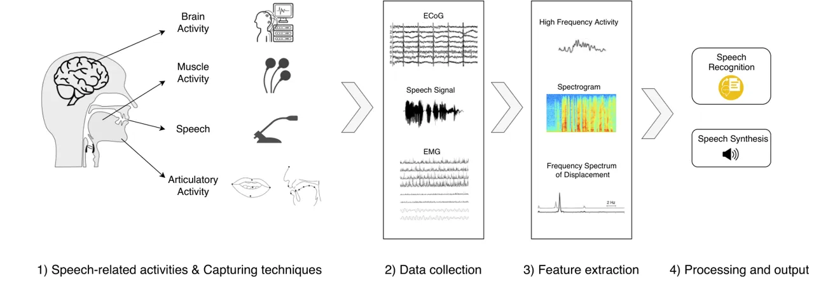
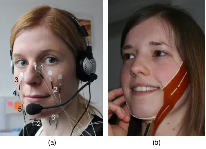
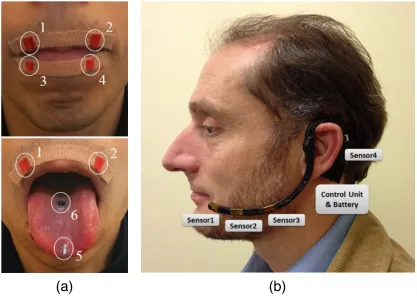

# Silent Speech Interfaces for Speech Restoration: A Review

Jose A. Gonzalez-Lopez    Alejandro Gomez-Alanis    Juan M. Martín-Doñas
   José L. Pérez-Córdoba    Angel M. Gomez ^(†)^(†)thanks: These authors
are with the Department of Signal Processing, Telematics and
Communications, University of Granada, 18071 Granada, Spain (email:
{joseangl,agomezalanis,mdjuamart,jlpc,amgg}@ugr.es).

###### Abstract

This review summarises the status of silent speech interface (SSI)
research. SSIs rely on non-acoustic biosignals generated by the human
body during speech production to enable communication whenever normal
verbal communication is not possible or not desirable. In this review,
we focus on the first case and present latest SSI research aimed at
providing new alternative and augmentative communication methods for
persons with severe speech disorders. SSIs can employ a variety of
biosignals to enable silent communication, such as electrophysiological
recordings of neural activity, electromyographic (EMG) recordings of
vocal tract movements or the direct tracking of articulator movements
using imaging techniques. Depending on the disorder, some sensing
techniques may be better suited than others to capture speech-related
information. For instance, EMG and imaging techniques are well suited
for laryngectomised patients, whose vocal tract remains almost intact
but are unable to speak after the removal of the vocal folds, but fail
for severely paralysed individuals. From the biosignals, SSIs decode the
intended message, using automatic speech recognition or speech synthesis
algorithms. Despite considerable advances in recent years, most
present-day SSIs have only been validated in laboratory settings for
healthy users. Thus, as discussed in this paper, a number of challenges
remain to be addressed in future research before SSIs can be promoted to
real-world applications. If these issues can be addressed successfully,
future SSIs will improve the lives of persons with severe speech
impairments by restoring their communication capabilities.

###### Index Terms: 

Silent speech interface, speech restoration, automatic speech
recognition, speech synthesis, deep neural networks, brain computer
interfaces, speech and language disorders, voice disorders,
electroencephalography, electromyography, electromagnetic
articulography.

## I Introduction

Speech is the most convenient and natural form of human communication.
Unfortunately, normal speech communication is not always possible. For
example, persons who suffer traumatic injuries, laryngeal cancer or
neurodegenerative disorders may lose the ability to speak. The
prevalence of this type of disability is significant, as evidenced by
several studies. For instance, in \[1\], the authors conclude that
approximately 0.4% of the European population have a speech impediment,
while a survey conducted in 2011 \[2\] concluded that 0.5% of persons in
Europe presented ‘difficulties’ with communication. The American
Speech-Language-Hearing Association (ASHA) reports that nearly 40
million U.S. citizens have communication disorders, costing the U.S.
approximately \$154-186 billion annually \[3\]. The World Health
Organization (WHO), in its World Report on Disability \[4\] derived from
a survey conducted in 70 countries, concluded that 3.6% of the
population had severe to extreme difficulty with participation in the
community, a condition which includes communication impairment as a
specific case.

Speech and language impairments have a profound impact on the lives of
people who suffer them, leading them to struggle with daily
communication routines. Besides, many service and health-care providers
are not trained to interact with speech-disabled persons, and feel
uncomfortable or ineffective in communicating with them, which
aggravates the stigmatisation of this population \[4\]. As a result,
people with speech impairments often develop feelings of personal
isolation and social withdrawal, which can lead to clinical depression
\[5, 6, 7, 8, 9, 10, 11\]. Furthermore, some of these persons also
develop feelings of loss of identity after losing their voice \[12\].
Communication impairment can also have important economic consequences
if they lead to occupational disability.

In the absence of clinical procedures for repairing the damage
originating speech impediments, various methods can be used to restore
communication. One such is assistive technology. The U.S. National
Institute on Deafness and Other Communication Disorders (NIDCD) defines
this as any device that helps a person with hearing loss or a voice,
speech or language disorder to communicate \[13\]. For the specific case
of communication disorders, devices used to supplement or replace speech
are known as augmentative and alternative communication (AAC) devices.
AAC devices are diverse and can range from simple paper and pencil
resources to picture boards or text-to-speech (TTS) software. From an
economic standpoint, the worldwide market for AAC devices is expected to
grow at an annual rate of 8.0% during the next five years, from \$225.8
million in 2019 to \$307.7 million in 2025 \[14\]. AAC users include
individuals with a variety of conditions, whether congenital (e.g.,
cerebral palsy, intellectual disability) or acquired (e.g.,
laryngectomy, neurodegenerative disease or traumatic brain injury) \[15,
16\].

In recent years, a promising new AAC approach has emerged: silent speech
interfaces (SSIs) \[17, 18, 19\]. SSIs are assistive devices to restore
oral communication by decoding speech from non-acoustic biosignals
generated during speech production. A well-known form of silent speech
communication is lip reading. A variety of sensing modalities have been
investigated to capture speech-related biosignals, such as vocal tract
imaging \[20, 21, 22\], electromagnetic articulography (magnetic tracing
of the speech articulator movements) \[23, 24, 25, 26, 27\], surface
electromyography (sEMG) \[28, 29, 30, 31\], which captures electrical
activity driving the facial muscles using surface electrodes, and
electroencephalography (EEG) \[32, 33, 34\], which captures neural
activity in anatomical regions of the brain involved in speech
production. The latter approach, involving the use of brain activity
recordings, is also known as a brain computer interface (BCI) \[35, 36,
37\]. Since SSIs enable speech communication without relying on the
acoustic signal, they offer a fundamentally new means of restoring
communication capabilities to persons with speech impairments. Apart
from clinical uses, other potential applications of this technology
include providing privacy, enabling telephone conversations to be held
without being overheard by bystanders and enhancing normal spoken
communication in noisy environments \[17, 38\]. These applications are
possible because biosignals are largely insensitive to environmental
noise and are independent of the acoustic speech signal (i.e., these
biosignals can be captured even when no vocalisation is performed).

SSIs have attracted increasing attention in recent years, as evidenced
by the special sessions organised on this topic at related conferences
\[39, 40, 41\] and by special issues of journals \[17, 42\]. These
events and publications supplement the existing literature in the
related research field of BCIs \[35, 36, 43, 44, 45, 46, 47, 48\]. In
this review, we present an overview of recent advances in the rapidly
evolving field of SSIs with special emphasis on a particular clinical
application: communication restoration for speech-disabled individuals.
The remainder of this paper is structured as follows. Section II first
summarises the speech and voice disorders that may affect spoken human
communication, describing their causes and effects, and examines methods
currently used to supplement and/or restore communication. Section III
then formally introduces SSIs and details the two main approaches
employed in decoding speech from biosignals. The sensing modalities that
have been proposed for capturing biosignals are described in Section IV,
which also provides an overview of previous research studies in which
these sensing technologies have been used. Section V discusses the
current challenges of SSI technology and areas for future improvement.
Finally, Section VI presents the main conclusions drawn from our
analysis.

## II Speech and language disorders

Human vocal communication is an extremely complex process involving
multiple organs, including the tongue, lips, jaw, vocal cords and lungs,
and requires precise coordination between these organs to produce
specific sounds conveying meaning (phones). Vocal communication,
however, can become difficult or even impossible when these organs, the
anatomical areas in the brain involved in speech production or the
neural pathways by which the brain controls the muscles are damaged or
altered.

Table I presents a summary of the main types of disorders affecting
spoken communication, their major causes and symptoms. As will be
discussed later in more detail, a SSI requires the acquisition of
biosignals generated by the human body from which speech can be decoded.
Depending on the specific disorder, some of the sensor technologies
described in Section IV may be better suited than others to capture such
biosignals. For instance, sensors aimed at capturing the electrical
activity in the language-related areas of the brain or the electrical
activity driving the facial muscles will be better suited for people
with dysarthria, who have difficulties moving and coordinating the lips
and tongue, than using sensors for articulator motion capture (e.g.,
video cameras). The information about the applicable sensor technologies
for each disorder is also shown in Table I.

| Disorder     | Causes                        | Symptoms                                    | Applicable sensor technologies |
| ------------ | ----------------------------- | ------------------------------------------- | ------------------------------ |
| Aphasia      | Brain injury caused by:       | Difficulties with:                          | Brain activity sensors         |
|              | \- Stroke                     | \- Understanding language                   |                                |
|              | \- Head trauma                | \- Speaking                                 |                                |
|              | \- Brain tumors               | \- Reading                                  |                                |
|              | \- Infections                 | \- Writing                                  |                                |
|              | \- Neurodegenerative diseases |                                             |                                |
| Apraxia      | Brain injury                  | Difficulties with:                          | Brain activity sensors         |
|              |                               | \- Moving and coordinating the articulators |                                |
|              |                               | \- Speak more slowly                        |                                |
|              |                               | \- Unable to speak (severe cases)           |                                |
| Dysarthria   | Brain injury                  | Difficulty with lip & tongue movements      | Brain activity sensors         |
|              |                               | Speech is:                                  | Muscle activity sensors        |
|              |                               | \- Slurred, mumbled or choppy               |                                |
|              |                               | \- Hard to understand                       |                                |
|              |                               | \- Monotone                                 |                                |
|              |                               | \- Very loud or quiet                       |                                |
| Laryngectomy | Laryngeal cancer              | Voice loss                                  | Brain activity sensors         |
|              | Severe neck injury            |                                             | Muscle activity sensors        |
|              |                               |                                             | Articulator motion capture     |

TABLE I: Summary of the main disorders affecting spoken communication,
their causes, effects and applicable sensor technologies to capture
biosignals during speech production for individuals with these
disorders.

In the rest of this section, we provide an overview of the different
types of speech, language and voice disorders, discuss their causes and
describe methods and devices currently available to help speech-impaired
people communicate, including previous investigations in which SSIs have
been used to restore communication.

### II-A Aphasia

Aphasia is a disorder that affects the comprehension and formulation of
language and is caused by damage to the areas of the brain involved in
language \[49\]. People with aphasia have difficulties with
understanding, speaking, reading or writing, but their intelligence is
normally unaffected. For instance, aphasic patients struggle in
retrieving the words they want to say, a condition known as _anomia_.
The opposite mental process, i.e., the transformation of messages heard
or read into an internal message, is also affected in aphasia. Aphasia
affects not only spoken but also written communication (reading/writing)
and visual language (e.g., sign languages) \[49\].

The major causes of aphasia are stroke, head injury, cerebral tumours or
neurodegenerative disorders such as Alzheimer’s disease (AD) \[50\].
Among these causes, strokes alone account for most new cases of aphasia
\[51\]. Elderly people are especially liable to develop aphasia because
the risk of stroke increases with age \[52\]. Aphasia affects the sexes
almost equally, although the incidence is slightly higher in women
\[53\].

The recommended treatment for aphasia is speech-language therapy (SLT)
\[54\]. This includes restorative therapy, aimed at improving or
restoring impaired communication capabilities, and compensatory therapy,
based on the use of alternative strategies (such as body language) or
communication aids to compensate for lost communication capabilities.
These communication aids range from simple communication boards, where
the patient points at the word, letter or pictogram required, to
speech-generating electronic devices known as voice-output communication
aids (VOCAs) \[55\]. These devices, however, are limited by their slow
communication rates and are inappropriate for deeply paralysed patients.

In recent years, BCIs have gained considerable attention as a promising
and radically new approach to restore communication to aphasic patients.
Thus, in \[56\] a pilot study was conducted in which five persons
diagnosed with post-stroke aphasia used a visual speller system for
communication. The system consisted of a 6 $`\times`$ 6 matrix shown on
a screen containing the alphabet letters and the digits 0 to 9. The
matrix columns and rows were flashed randomly and an intended target
cell was selected if P300 evoked potentials \[57\] were generated after
the corresponding row and column were flashed. All participants were
able to use the system with up to 100% accuracy when spelling individual
words. In \[58\], aphasic patients and healthy controls were compared
using a P300 visual speller. Although the controls achieved
significantly higher spelling accuracy than the aphasic subjects, these
patients were able to use the system successfully to communicate. These
BCI devices, however, are slow, cognitively demanding and unintuitive:
communication rates up to 10-12 words/min are reported in \[35\] and
mastering the control of these BCIs is an arduous task that can take
several months of practice. In contrast, SSIs have emerged as a more
natural and promising alternative to restore oral communication to
aphasic patients. Despite the literature on this topic is scarce, in
\[59\] the authors discussed the main considerations that should be
taken into account when designing a SSI-based systems for speech
rehabilitation in aphasia. The interested reader can find an in-depth
review of this topic in \[60\].

### II-B Apraxia and dysarthria

Apraxia and dysarthria are motor speech disorders \[61\] which are
characterised by difficulties in speech production. To speak, the brain
needs to plan the sequence of muscle movements that will result in the
desired speech signal and to coordinate these movements by sending
messages through the nerves to the relevant muscles. Unfortunately, this
process is impaired in some individuals. For instance, apraxia of speech
is caused by damage in the motor areas of the brain responsible for
planning or programming the articulator movements \[61\]. Unlike
aphasia, language skills are not impaired in persons with apraxia,
although it often coexists with aphasia and other speech and language
disorders. Dysarthria, on the other hand, is a motor speech disorder
characterised by poor control over the muscles due to central or
peripheral nervous system abnormalities. This often results in muscle
paralysis, weakness or incoordination \[62\]. Acoustically, dysarthric
speech sounds monotonous, slow and, more importantly, is significantly
less intelligible than normal speech \[63\].

Motor speech disorders account for a significant portion of the
communication disorders in SLT practice. In fact, dysarthria is the most
commonly acquired speech disorder, with an incidence of 170 cases per
100,000 population \[64, 65\]. Dysarthria occurs in about 25% of
post-stroke patients and 33% of patients with traumatic brain injury
\[61\]. The speech of patients with Parkinson’s disease (PD) is also
affected by speech disorders, with about 60% of them developing
dysarthria \[66, 61\]. This condition is also associated with other
neurodegenerative disorders, such as amyotrophic lateral sclerosis
(ALS), affecting more than 80% of these patients \[67\]. In the worst
case, ALS patients with locked-in syndrome \[68\], a condition in which
they are fully aware but suffer the complete paralysis of nearly all
voluntary muscles, are practically unable to move or communicate.
Apraxia is also common among patients with neurological conditions.
\[69\] reported that one third of left hemisphere stroke patients have
apraxia. This is also associated with dementia, occurring in about 35%
of patients with mild AD, 50% of those with moderate AD and 98% of those
who are severely affected \[70\].

Individuals with these speech disorders may need to use AAC aids to
compensate for communication deficits. Nevertheless, AAC aids requiring
physical control are not always a viable solution because these
disorders often co-occur with a physical disability. This makes SSIs an
attractive alternative to traditional AAC technology. Thus, recently,
several studies have investigated the use of SSIs for persons with motor
speech disorders. In \[71\], automatic speech recognition (ASR) from
electromyography (EMG) signals was investigated for dysarthric speakers.
Parallel data with audio and EMG signals were recorded for dysarthric
speakers while individual words were uttered. Then, ASR systems (see
Section III-A for an overview of this SSI approach) were independently
trained for each modality. Experimental results show that
speaker-independent ASR systems perform this task very poorly, whereas
speaker-dependent acoustic models tailored to each subject yield the
best scores, obtaining average word recognition accuracy of 95% for
audio-only, 85% for EMG data, and 96% for the combined modalities. One
limitation of speaker-dependent ASR systems is that they require large
amounts of data for training, which is not normally available in
practice. To address this issue, \[72\] investigated articulatory
normalisation, seeking to reduce the degree of variation in articulatory
patterns across different speakers as a prior step to training
speaker-independent ASR models. This technique was found to be highly
effective, especially when acoustic and articulatory data were combined
for speech recognition. To sum up, studies have demonstrated the
viability of performing silent speech recognition on articulatory data
captured from dysarthric speakers.

### II-C Voice disorders

The vocal folds, or vocal cords, are two folds of tissue inside the
larynx that play a major role in speech production. The rhythmic
vibration of the vocal folds produced by airflow from the lungs is what
creates the sound source (voice) in speech. This sound source is later
shaped by the mouth and the nasal cavity to create the different phones
in a language.

Voice disorders are experienced when there is a disturbance in the vocal
folds or any other organ involved in voice production, due to excessive
or improper use of the voice, from trauma to the larynx or from
neurological conditions such as PD \[73\]. Perceptually, voice disorders
are characterised by a hoarse voice (dysphonia) with altered pitch,
loudness or vocal quality. In severe cases, e.g., patients who have
their entire larynx removed to treat throat cancer (laryngectomy), voice
disorders can even provoke the complete loss of voice \[74, 75\]. The
reason for this is that the windpipe (trachea) is no longer connected to
the mouth and nose after the laryngectomy, and so these patients can no
longer produce the required sound to speak. Given the relatively high
incidence of laryngeal cancer (it accounts for 3% of all cancers \[76\]
with around 60% of laryngectomised patients surviving five years or more
\[77\]) and its devastating consequences, we focus on this disorder in
the rest of the section.

Currently, there are three main options for speaking after a total
laryngectomy: oesophageal speech, voice prosthesis and the electrolarynx
\[78\]. These three methods, however, are not without limitations
\[79\]. In general, substitute voices generated by these methods are not
agreeable, cannot be adequately modulated in terms of pitch and volume
and are difficult to understand \[80, 81\]. Moreover, women often
dislike their new voice, finding it masculine and disturbing, due to the
hoarse, deep nature of the sounds produced \[82\]. Furthermore,
tracheoesophageal speech requires frequent valve replacement (every 3-4
months) as the valve may fail after becoming colonised by biofilm
\[83\]. Oesophageal speech, on the other hand, is a skill that is
difficult to master, requiring intensive, prolonged SLT and only about a
third of the patients are able to master it \[84\]. Finally, the voice
generated by an electrolarynx sounds robotic and requires the patient to
hold an external device, pressing it against the neck \[24\]. The
drawbacks associated with each of these techniques negatively affect the
patient’s quality of life in terms of imperfect voice acceptance,
restricted communication and limited social interaction \[85, 82\].

In contrast, SSI-based speech restoration promises to overcome many of
the above issues. Thus, the possibility of recognising speech from
speech-related biosignals has been demonstrated for a variety of sensing
techniques, such as sEMG \[86, 87, 28, 30, 88, 79\], electromagnetic
articulography (EMA) \[89, 90\], permanent magnetic articulography (PMA)
\[24, 91, 92, 26, 93\], and imaging technologies based on video and
ultrasound \[94, 20, 95\]. Furthermore, direct speech generation from
the captured biosignals (see Section III-B) is another possibility,
having this approach the potential to restore the person’s own voice, if
enough recordings of the pre-laryngectomy voice are available for
training \[96\]. This second approach has been also validated for
various modalities, including sEMG \[97, 98, 99, 31, 100\], PMA \[25,
96, 101, 102, 103\], video-and-ultrasound \[104, 105, 106\] and Doppler
signals \[107\]. To sum up, the foundations have been laid for a future
SSI-based device for post-laryngectomy speech rehabilitation. However,
with some notable exceptions \[108, 79\], the above proposals have been
validated only for healthy users. In Section V, we discuss these and
other challenges that need to be addressed in the near future.

## III Silent speech interfaces

As briefly introduced above, SSIs are a new type of assistive technology
for restoring oral communication. These devices exploit the fact that,
in addition to the acoustic signal, other biosignals are generated
during speech production, by different organs. These biosignals are the
product of chemical, electrical, physical and biological processes that
take place during speech production. As illustrated in Fig. 1, these
processes include neural activity in the anatomical regions of the brain
involved in speech planning and articulator motor control, activity in
the peripheral nervous system providing motor control to the articulator
muscles, articulatory gestures such as mouth opening or tongue
movements, the vibration of the vocal folds (phonation) and pulmonary
activity of the lungs during breathing. Depending on the specific
disorder affecting the person, some of these processes might be
disrupted whereas others will continue as usual. Consequently, the
biosignals stemming from the unimpaired processes can be captured by
sensing technologies, as detailed in Section IV.



Fig. 1: Block diagram of a SSI-based communication system. First,
speech-related activities during speech production are monitored with
specialised sensing techniques (1). These activities produce a range of
speech-related biosignals (2). Signal processing techniques are then
used to extract a set of meaningful features from the biosignals (3).
Finally, speech is decoded from these features, by ASR or direct speech
synthesis (4). Figure adapted from \[18\].

As shown in Fig. 1, regardless of the type of biosignal considered, two
SSI approaches may be used to decode speech from this source \[18,
101\]: silent speech-to-text and direct speech synthesis. In the first
approach, speech recognition algorithms \[109, 110, 111\] trained on
silent speech data are used to decode speech from the feature vectors
extracted from the biosignals. TTS software \[112, 113\] can then be
used to synthesise speech from the decoded text if required. In the
second approach, audible speech is directly generated from the biosignal
features without an intermediate recognition step. Most commonly, deep
neural networks (DNNs) \[114, 115\] trained on time-aligned speech and
biosignal recordings (i.e., parallel data) are used to model the mapping
between the biosignals and the acoustic speech parameters. In the
following sections, these two SSI approaches are described in greater
detail.

### III-A Silent speech to text

The goal of this SSI approach is to convert speech-related biosignals
into text (i.e., into a sequence of written words
$`\mathbf{w}=(w_{1},\ldots,w_{K})`$). Normally, as illustrated in Fig.
1, ASR is not performed on the raw biosignals directly; instead, a more
compact and parsimonious representation known as feature vectors is
used. Thus, the raw biosignals are first pre-processed and converted
into a sequence of feature vectors
$`\mathbf{X}=({\bm{x}}_{1}^{\top},\ldots,{\bm{x}}_{T}^{\top})^{\top}`$,
where $`{\bm{x}}_{t}`$ represents the $`t`$-th feature vector of
dimension $`D_{x}`$ (i.e., column vector), and $`T`$ is the number of
frames into which the input biosignal is divided. The computation of
$`\mathbf{X}`$ depends on the type of biosignal. For instance,
Mel-frequency cepstral coefficients (MFCCs) have been widely used for
standard audio-based ASR, but other feature types need to be extracted
for different biosignals, such as image-specific features for lipreading
\[116\] or 3D coordinates of the speech articulators for EMA and PMA
systems \[89, 91\]. More details about specific biosignal features are
given in Section IV.

To determine the most likely sequence of words $`\mathbf{\hat{w}}`$ from
$`\mathbf{X}`$, the following optimisation problem must be solved

```math
\mathbf{\hat{w}}=\argmax_{\mathbf{w}}{p(\mathbf{w}\mid\mathbf{X})}\propto\argmax_{\mathbf{w}}{p(\mathbf{w})p(\mathbf{X}\mid\mathbf{w})}, \tag{1}
```

where $`p(\mathbf{w})`$ defines the probability of each word sequence
and is provided by a _language model_ that is independent of the type of
biosignal used, while the likelihood $`p(\mathbf{X}\mid\mathbf{w})`$ is
computed using _acoustic and pronunciation lexicon models_. Of these,
only the acoustic model depends on the specific biosignal, whereas the
lexicon and language models are biosignal agnostic. In the following, we
describe in more detail the problem of acoustic modelling for
silent-speech ASR. We refer the interested reader to \[109, 110, 111\]
for an introduction to ASR technology.

The term $`p(\mathbf{X}\mid\mathbf{w})`$ in (1) is what is known as the
acoustic model in the ASR literature. It provides the likelihood of
observing the sequence of feature vectors $`\mathbf{X}`$ under the
assumption of the word sequence $`\mathbf{w}`$. In state-of-the-art ASR
systems, each word $`w`$ is decomposed into a sequence of smaller
subword units, such as phones or triphones, in order to reduce the data
requirements when estimating the probabilities for systems with
thousands of words. It also enables multiple pronunciations for each
word. For this purpose, a dictionary is constructed with the phonetic
transcription of each word supported by the system. Acoustic modelling,
thus, is performed to estimate the probabilities of the observations for
each subword unit. Typically, each subword unit is modelled with a
hidden Markov model (HMM) \[109\] containing a fixed number of hidden
states (e.g., 3 or 5 states), with each state corresponding to a
stationary segment of the unit. Traditionally, each state emission
distribution is modelled with a Gaussian mixture model (GMM) \[117\],
although DNNs were recently shown to achieve state-of-the-art
performance in this task \[118\].

Under the above assumptions, the computation of
$`p(\mathbf{X}\mid\mathbf{w})`$ in (1) is carried out by marginalising
over all HMM state sequences corresponding to $`\mathbf{w}`$ as follows,

```math
p(\mathbf{X}\mid\mathbf{w})=\sum_{\mathbf{Q}}p(\mathbf{X}\mid\mathbf{Q})p(\mathbf{Q}\mid\mathbf{w}), \tag{2}
```

where $`\mathbf{Q}=(q_{1},\ldots,q_{T})`$ is an HMM state sequence,
$`p(\mathbf{X}\mid\mathbf{Q})\approx\prod_{t=1}^{T}p({\bm{x}}_{t}|q_{t})`$
and
$`p(\mathbf{Q}\mid\mathbf{w})\approx\prod_{t=1}^{T}p(q_{t}|q_{t}-1)`$,
assuming that the state sequence is a first-order Markov process
(dependence on $`\mathbf{w}`$ has been excluded, for convenience).

Basically, biosignal-based ASR can be undertaken by replacing the
front-end signal processing with techniques tailored to each specific
biosignal, while the back-end acoustic modelling remains unchanged. This
approach has been taken in several works, such as continuous phone-based
HMM recognition using sEMG signals \[119\] and isolated word recognition
using image features for lipreading \[116\]. However, subword units in
silent ASR tend to be harder to differentiate from other units than in
audio-based ASR. For instance, in visual speech recognition, phones with
a similar visual appearance but different acoustic characteristics are
hard to distinguish by their visual characteristics alone. To address
this issue, phones with similar articulatory properties are grouped to
increase system robustness. For instance, phones with a similar visual
appearance are grouped into viseme units, or by considering articulatory
gestures \[120\]. The main problem with this approach is the ambiguity
that may be caused by visemes, which has to be resolved by language
models. For EMG-based speech recognition, a data-driven approach called
bundle phonetic features was proposed in \[28\]. In general,
biosignal-based speech recognition has been addressed via syllables
\[121\] and by using both context-dependent and context-independent
phones \[33, 122\].

In addition, researchers have considered multimodal ASR, where multiple
sources of information (e.g., brain signals, EMG onset, sound and muscle
contraction) are combined to improve the recognition of spontaneous
speech and increase robustness to noise \[123\]. However, these sources
are not synchronous \[124\] due to the multi-step nature of speech motor
control and the complex relation between articulatory gestures and
speech sounds \[125\]. Research is ongoing to resolve this issue.

Finally, the most likely word sequence $`\mathbf{\hat{w}}`$ given the
sequence of feature vectors $`\mathbf{X}`$ is determined by searching
all possible state sequences. An efficient way to solve this problem is
to use the Viterbi algorithm \[126\], though several more efficient
alternatives have been proposed, in which the breadth-first search of
the Viterbi algorithm is replaced by a depth-first search \[127\].

### III-B Direct speech synthesis

Direct synthesis techniques are used to model the relationship between
speech-related biosignals and the acoustic speech waveform. In its most
common form, this relationship is conveniently represented as a mapping
$`{\bm{f}}:\mathcal{X}\rightarrow\mathcal{Y}`$ between the space
$`\mathcal{X}\in\mathbb{R}^{D_{x}}`$ of feature vectors extracted from
the biosignals and the space $`\mathcal{Y}\in\mathbb{R}^{D_{y}}`$ of
acoustic feature vectors as follows:

```math
{\bm{y}}_{t}={\bm{f}}({\bm{x}}_{t})+{\bm{\epsilon}}_{t}, \tag{3}
```

where $`{\bm{x}}_{t}`$ and $`{\bm{y}}_{t}`$ are, respectively, the
source and target feature vectors at time $`t`$ computed from the silent
speech and acoustic signals (more details about the computation of the
source vectors is provided in Section IV), and $`{\bm{\epsilon}}_{t}`$
is a zero-mean independent and identically distributed (i.i.d.) error
term.

Modelling the mapping function $`{\bm{f}}(\cdot)`$ in (3) presents some
challenging problems. This function is known to be non-linear \[128,
129\]. Moreover, for some types of biosignals, this mapping is
non-unique \[130, 129, 131\], that is, the same acoustic features may be
associated with multiple realisations of the biosignal. For instance,
ventriloquists are able to produce almost the same acoustics with
multiple vocal tract configurations. Another reason for this
non-uniqueness is that the sensing techniques frequently have a limited
spatial or temporal resolution and, as a result, the speech production
process is not properly captured and some information is lost.

Direct synthesis techniques can be classified as model-based or
data-driven. With model-based techniques, it is assumed that the mapping
in (3) can be described analytically using a closed-form mathematical
expression. In general, however, this assumption only holds for certain
articulator motion capture techniques, as those described in Section
IV-C. For these techniques, the mapping can be seen as a two-stage
process: (i) vocal tract shape estimation and (ii) speech synthesis.
Firstly, a low-dimensional representation of the vocal tract shape is
derived from the captured articulatory data. For instance, in \[132,
133, 134\], the control parameters of Maeda’s articulatory model¹¹ 1
Maeda’s model is a 2D geometrical model of the vocal tract shape
described using seven mid-sagittal control parameters: jaw opening,
tongue dorsum position, tongue dorsum shape, tongue apex position, lip
opening, lip protrusion and larynx height. \[135\] were derived from the
3D positions of the lips, incisors, tongue and velum captured with EMA
(see Section IV-C1 for an in-depth description of EMA). Secondly,
model-based techniques generate the corresponding speech signal by
simulating the airflow through the vocal tract model, a technique known
as articulatory speech synthesis \[136, 137, 112\]. Commonly, a digital
filter representing the vocal tract transfer function is computed and,
following the source-filter model of speech production \[136, 138,
139\], the acoustic waveform is finally synthesised by convolving the
vocal-tract filter impulse response with the glottal excitation signal,
which is normally approximated as white Gaussian noise for unvoiced
sounds or an impulse train for voiced sounds. More advanced articulatory
synthesis techniques have also been proposed, using realistic 3D vocal
tract geometries in conjunction with numerical acoustic modelling
techniques, such as the finite element method (FEM) \[140, 141, 142,
143\] or the digital waveguide mesh (DWM) \[144, 145, 146, 147\].

Although articulatory synthesis is the most natural and obvious way to
synthesise speech, physical simulation of the human vocal tract presents
some challenging problems. Firstly, the vocal tract model must be as
accurate as possible in order to generate high-quality speech acoustics.
On the other hand, the model should be simple enough to be implemented
on a digital computer and have reasonable computational requirements.
Unfortunately, these two conditions are often in conflict. For instance,
although they are capable of generating high-quality speech, the
computational load of the above-mentioned 3D FEM models of the vocal
tract is prohibitive. Thus, computational times of 70-80 hours are
reported in \[142\], in which vowels of 20 ms were synthesised with the
3D FEM model, while in a more recent work \[143\] the same authors
report an average time of six hours when simulating diphthongs with a
duration of 0.2 s (with different computer specifications).

Because of these issues, the most successful direct speech synthesis
techniques achieved so far in terms of speech quality are data-driven,
in which the mapping in (3) is described as a multivariate regression
problem. This mapping is usually modelled as a parametric function
$`{\bm{f}}({\bm{x}};\theta)`$, where $`\theta`$ are the function
parameters. In the _training stage_, the parameters are estimated using
a dataset with pairs of source and target vectors
$`\mathcal{D}=\{({\bm{x}}_{1},{\bm{y}}_{1}),\ldots,({\bm{x}}_{N},{\bm{y}}_{N})\}`$
derived from time-synchronous recordings of speech and biosignals
obtained while the subject’s voice is still intact or, at least, not
severely impaired. In this case, the target vectors represent a compact
acoustic parametrisation of the acoustic signal, such as MFCCs \[148\]
or line spectral pairs (LSPs) \[149\]. Once the $`\theta`$ parameters
have been estimated, the mapping function is deployed to restore the
subject’s voice by predicting the acoustic feature vectors from the
biosignal. The final acoustic signal is then synthesised from the
sequence of predicted acoustic feature vectors, using a high-quality
vocoder (e.g., STRAIGHT \[150\], WORLD \[151\] or neural vocoders \[152,
153\]).

Various supervised machine learning techniques have been investigated to
model the mapping function in (3). Non-parametric machine learning
techniques \[154, Ch. 18, p. 737\] such as shared Gaussian process
dynamic models \[155\], support vector regression \[156\] and a
concatenative unit-selection approach \[98, 31, 157\], have all been
applied to this task, but by far the most successful techniques are
those based on parametric methods. One such method is that of Gaussian
mixture regression, where the joint probability function of source and
target vectors is modelled by a GMM, as follows:

```math
p({\bm{z}})=\sum_{k=1}^{K}\pi^{k}\mathcal{N}({\bm{z}};{\bm{\mu}}^{k},{\bm{\Sigma}}^{k}), \tag{4}
```

where $`{\bm{z}}=({\bm{x}}^{\top},{\bm{y}}^{\top})^{\top}`$ denotes the
concatenation of the source and target feature vectors, $`k=1,\ldots,K`$
is the mixture component index, $`\pi^{k}=P(k)`$ denotes the prior
probability of the $`k`$-th component, and $`\mathcal{N}(\cdot)`$ is a
Gaussian distribution with mean vector $`{\bm{\mu}}^{k}`$ and covariance
matrix $`{\bm{\Sigma}}^{k}`$. In the training stage, the
expectation-maximisation (EM) algorithm \[158\] is used to optimise the
GMM parameters.

In the conversion stage, the acoustic features are predicted from the
source features by computing the mean of the posterior distribution
$`p({\bm{y}}|{\bm{x}}_{t})`$. This value can be computed analytically as
a linear combination of the posterior mean vectors of each Gaussian
component, as described in \[159, 25\]. This mapping algorithm has been
used extensively for direct synthesis with different sensing
technologies, such as PMA \[25, 101\], EMA \[160\], EMG \[97, 161, 31\]
and non-audible murmur (NAM) \[162, 163, 164\]. Unfortunately, this
algorithm presents the well-known issue that the trajectories of the
estimated speech parameters contain perceivable discontinuities due to
the frame-by-frame conversion process \[159\]. To overcome this
shortcoming \[165, 159\] proposed a trajectory-based conversion
algorithm taking into account the statistics of the static and dynamic
speech feature vectors. In particular, the joint distribution
$`p({\bm{x}},{\bm{y}},\bm{\Delta}{\bm{y}})`$ is modelled using a GMM,
where $`\bm{\Delta}{\bm{y}}_{t}={\bm{y}}_{t}-{\bm{y}}_{t-1}`$ are the
dynamic speech features (delta features) at frame $`t`$. In the
conversion stage, the most likely sequence of static speech feature
vectors is determined by solving the following optimisation problem:

```math
\hat{\bm{Y}}=\argmax_{\bm{Y}}p(\bm{W}\bm{Y}|\bm{X}), \tag{5}
```

where
$`\bm{X}=({\bm{x}}_{1}^{\top},{\bm{x}}_{2}^{\top},\ldots,{\bm{x}}_{T}^{\top})^{\top}`$
is the $`(D_{x}T)`$-dimensional sequence of source feature vectors,
$`\bm{Y}=({\bm{y}}_{1}^{\top},{\bm{y}}_{2}^{\top},\ldots,{\bm{y}}_{T}^{\top})^{\top}`$
is the $`(D_{y}T)`$-dimensional sequence of static speech feature
vectors to be determined, and $`\bm{W}`$ is a
$`(2D_{y}T)`$-by-$`(D_{y}T)`$ matrix representing the relationship
between static and dynamic feature vectors such as
$`\overline{\bm{Y}}=\bm{W}\bm{Y}`$, where
$`\overline{\bm{Y}}=({\bm{y}}_{1}^{\top},\bm{\Delta}{\bm{y}}_{1}^{\top},{\bm{y}}_{2}^{\top},\bm{\Delta}{\bm{y}}_{2}^{\top},\ldots,{\bm{y}}_{T}^{\top},\bm{\Delta}{\bm{y}}_{T}^{\top})^{\top}`$
is the $`(2D_{y}T)`$-dimensional sequence of static and dynamic speech
feature vectors. To solve the optimisation problem in (5), an iterative
EM-based algorithm was proposed in \[159\]. This algorithm, known as the
maximum-likelihood parameter generation (MLPG) algorithm, produces
better acoustics than the conventional GMM mapping described above
because speech dynamics are also taken into account.

Apart from GMMs, HMMs have also been used for articulatory-to-acoustic
conversion in the context of a multimodal SSI, comprising video and
ultrasound, with very promising results \[104, 105, 106\]. Another
popular modelling technique is that of DNNs \[115, 114\]. Several works
have reported evidence that DNNs outperform mapping approaches like GMMs
and HMMs in terms of conversion quality for EMG \[99, 166, 31\], PMA
\[101, 102\], and in the related field of statistical voice conversion
\[167, 168, 169\], thanks to their powerful discriminative capabilities.
For direct speech synthesis, various neural network architectures have
been investigated, including feed-forward neural networks \[99, 27,
101\], convolutional neural networks (CNNs) \[170, 171, 172\] and (one
of the most successful approaches) recurrent neural networks (RNNs)
\[173, 102, 103, 172\]. In \[101\] a comparison of different RNN models
for PMA-to-acoustic mapping was presented.

### III-C Comparison of the two SSI approaches

Each SSI approach has its advantages and disadvantages. Silent
speech-to-text has the advantage that speech might be more accurately
predicted from the biosignals, thanks to the language and pronunciation
lexicon models used in ASR systems. These models impose strong
constraints during speech decoding and may help recover some speech
features, such as voicing or manner of articulation, which are not well
captured by current sensing techniques \[20, 29, 174, 102\]. However,
the use of these models also means that this approach is unable to
recognise words that were not considered during training, such as words
in a foreign language. The direct speech synthesis approach, in
contrast, is not limited to a specific vocabulary and is
language-independent. A second limitation of the silent speech-to-text
approach is that the paralinguistic features of speech (e.g., speaker
identity or mood), which are important for human communication, are lost
after ASR, but could be recovered by direct synthesis techniques. Yet
another problem of silent speech-to-text is that, in practice, it is
difficult to record enough silent speech data to train a large
vocabulary ASR system²² 2 State-of-the-art DNN-based ASR systems require
hundreds of hours of carefully annotated speech data for training \[118,
175, 176\]., while direct synthesis systems require less training
material (usually just a few hours of training data) because modelling
the biosignal-to-speech mapping is arguably easier than training a
full-fledged speech recogniser.

Nevertheless, the greatest disadvantage of the silent speech-to-text
approach may be that it produces a disconnection between speech
production and the corresponding auditory feedback, due to the long
delay introduced by the ASR and TTS systems. In consequence, this
approach lacks the real-time capabilities (i.e., low latency) that a SSI
system for natural human speech communication would require. In this
regard, previous studies have estimated the maximum latency acceptable
for an ideal SSI system. In oral communication, 100 to 300 ms of
propagation delay causes slight hesitation on a partner’s response and
beyond 300 ms causes users to begin to back off to avoid interruption
\[177\]. Studies of delayed auditory feedback, in which subjects receive
delayed feedback of their voice, found disruptive effects on speech
production with feedback delays starting at 50 ms, while delays of 200
ms produced maximal disruption \[178, 179, 180\]. Altogether, these
results suggest an ideal latency of 50 ms for a SSI, though latency
values of up to 100 ms may still be acceptable. These low values can
only be achieved through direct speech synthesis. In this sense,
real-time SSI systems have been developed for sEMG \[181, 182\], PMA
\[183\] and EMA \[27\]. There is also the possibility that real-time
auditory feedback might enable the brain to assimilate the SSI as if it
were the person’s own voice, thus enabling the user to adapt her/his own
speaking patterns to produce better acoustics. In this regard, previous
BCI studies \[36, 184, 45\] have provided evidence of brain plasticity,
enabling the gradual assimilation of assistive devices by the areas in
the brain associated with motor control.

## IV Sensing techniques

As illustrated in Fig. 1, the first step of any SSI involves the
acquisition of some kind of biosignal, different from the acoustic wave.
These biosignals are the result of different activities (or processes)
taking place in the human body during speech production, which can range
from the movements of the articulators to neural activity in the brain.
Thus, the production of the speech signal requires the movement of the
different speech articulators (lips, tongue, palate, etc.) to shape the
vocal tract, as well as the glottis and lungs. Muscles are responsible
for these movements while the brain ultimately initiates, controls and
coordinates them.

To monitor the speech production process, sensing techniques are used to
acquire different types of biosignals related to this process. These
biosignals can be recorded at the origin of the speech production, via
sensing techniques for brain activity, or at the destination, by
monitoring the resulting muscle activity. Alternatively, we can focus on
the effects of muscle and brain activity and simply measure the
movements of the articulators. In this section, we describe the sensor
technology currently available and review previous SSI research on each
of the approaches proposed.

### IV-A Brain activity

Obtaining biosignals at the origin of speech production has the
advantage that a wider range of speech disorders and pathologies can
thus be addressed. Brain activity sensing techniques can potentially
assist not only persons with voice disorders but also those with
dysarthria or apraxia, or even some cases of aphasia. On the other hand,
the internal processes of the brain that are involved in speech
production are imperfectly understood, and recording brain activity at a
high spatiotemporal resolution is still problematic, at best.

#### IV-A1 Neuroanatomy of speech production

The neuroanatomy of language production and comprehension has been a
topic of intense investigation for more than 130 years \[185\].
Historically, the brain’s left superior temporal gyrus (STG) has been
identified as an important area for these cognitive processes. Studies
have shown that patients with lesions to this brain area present
deficits in language production and comprehension \[186\], and that a
complex cortical network extending through multiple areas of the brain
is involved in these processes \[187\].

This cortical network has recently been modelled by a dual-stream model
consisting of a ventral and a dorsal stream \[185\]. The ventral stream,
which involves structures in the superior (i.e., STG) and middle
portions of the temporal lobe, is related to speech processing for
comprehension, while the dorsal stream maps acoustic speech signals to
the frontal lobe articulatory networks, which are responsible for speech
production. This dorsal stream is strongly left-hemisphere dominant and
involves structures in the posterior dorsal and the posterior frontal
lobe, including Broca’s area, or inferior frontal gyrus (IFG), which is
critically involved in speech production \[188\].

In the posterior frontal lobe, the cortical control of articulation is
mediated by the ventral half of the lateral sensorimotor cortex or
ventral sensorimotor cortex (vSMC) \[189\]. This structure presents
neural projections to the motor cortex of the face and the vocal tract
and, by electrical stimulation, generates a somatotopic organisation of
the face and mouth \[190\]. However, focal stimulation of vSMC does not
evoke speech sounds, presumably because the production of phonemes and
syllables requires multiple articulator representations across the vSMC
network coordinated in a certain motor pattern \[190\]. This is
consistent with an established neurocomputational model of speech motor
control \[125\], in which intended speech sounds are represented in
terms of speech formant frequency trajectories. Projections from vSMC to
the primary motor cortex would transform the intended formant
frequencies into motor commands to the speech articulators. This would
be carried out in the same way as the desired three-dimensional spatial
positioning of a fingertip is transformed into the angles of the
corresponding articulation (shoulder, elbow, wrist, etc.) \[32\].

| Approach       | Sensing technique | Temporal resolution         | Spatial resolution          | Intrusiveness  | Portability  |
| -------------- | ----------------- | --------------------------- | --------------------------- | -------------- | ------------ |
| Haemodynamic   | fMRI              | Poor ($`\geq`$ 1 s)         | Good (1.5 - 2 mm)           | Non-intrusive  | Not portable |
|                | fNIRS             | Poor ($`\geq`$ 1 s)         | Medium (1 - 2 cm)           | Non-intrusive  | Moderate     |
| Electrodynamic | MEG               | Good ($`\geq`$ 1 ms)        | Good (1 - 2 mm)             | Non-intrusive  | Not portable |
|                | EEG               | Good ($`\geq`$ 1 ms)        | Poor ($`\approx`$ 10 cm²)   | Non-intrusive  | Moderate     |
|                | ECoG              | Good ($`\geq`$ 1 ms)        | Excellent (0.5 - 1 mm)      | Intrusive      | High         |
|                | LFP               | Excellent ($`\geq`$ 0.1 ms) | Excellent (5 -100 $`\mu`$m) | Very intrusive | High         |

TABLE II: Summary of sensor technologies available to monitor brain
activity.

#### IV-A2 Brain activity sensors

A range of sensors have been developed to capture neural activity during
cognitive tasks. As shown in Table II, these sensors essentially follow
two main approaches to measure brain activity. In the first, the sensors
measure the haemodynamic response (i.e., changes in blood oxygenation
due to neuron activation) at certain locations of the brain. In the
second, the sensors measure the electrodynamics in the brain, that is,
the electrical currents and fields caused by activations during
cognitive tasks.

Neuron activation requires the ions to be actively transferred across
the neuronal cell membranes. The energy needed for this task is obtained
through oxygen metabolism, which increases substantially during
functional activation. By means of blood perfusion through the
capillaries, oxygen is sent to the active neurons while the decrease in
tissue oxygenation is counteracted by neurovascular coupling \[191\], a
mechanism that regulates blood flow. This sequence of events produces
changes in blood oxygenation, which are reflected in the balance of
oxygenated (oxyHb) and deoxygenated (deoxyHb) haemoglobin, which is
known as the haemodynamic response (HDR). Various approaches can be
employed to measure HDR. For instance, oxyHb and deoxyHb haemoglobin
have different magnetic properties that can be detected non-invasively
by means of magnetic resonance imaging (MRI). Doing so provides a
three-dimensional high spatial resolution volume over the entire brain,
which makes the functional (fMRI) the de-facto standard in neuroimaging
\[192\]. However, fMRI requires expensive and heavy equipment, which
prevent this technique for being used as a wearable AAC device.
Functional near-infrared spectroscopy (fNIRS) is another non-invasive,
moderately-portable technique that detects changes in HDR, exploiting
the fact that differences in absorptivity between oxyHb and deoxyHb and
the transparency of biological tissue can be detected by means of
infrared light emissions in the 700–1000 nm range \[193\]. However, due
to the limited penetration of infrared light into cerebral tissue, fNIRS
imaging has a depth sensitivity of only about 0.75 mm below the brain
surface \[193\].

Methods based on the haemodynamic response are non-invasive and provide
an excellent spatial resolution. Their main weakness is the temporal
resolution, inherent to the neurovascular coupling, which is coarse and
lagged. Thus, after the triggering event, the response lags for at least
1-2 s, peaks for 4-8 s and then decays for several seconds until
homeostasis is restored \[193\]. However, through trial repetition in
which HDR responses are combined, the temporal resolution can be
improved to 1-2 s. In consequence, very few studies have considered
their possible use for speech recognition and have achieved very limited
success \[18\].

Neuronal activity also provokes electric currents that can be measured
in the extracellular medium. The synaptic transmembrane current, in the
form of a spike, is the major contributor to this extracellular signal,
although other sources can substantially shape it \[194\]. The
superimposition of these currents within a volume of brain tissue
generates electrical potentials and fields that can be recorded by
electrodes. Such recordings have a time resolution of less than a
millisecond, can be modelled reliably and are well understood \[195\].
When these potentials are recorded using non-invasive electrodes from
the scalp they are known as EEG; or as electrocorticography (ECoG) when
they are recorded from the cerebral cortex using invasive subdural grid
electrodes \[196\]; or as local field potentials (LFPs) when the
measurement is obtained at deeper locations by inserting electrodes or
probes \[194\]. Alternatively, currents generated by the neurons can be
measured non-invasively outside the skull as ultra-weak magnetic fields.
This technique, known as magnetoencephalography (MEG), provides a
relatively high spatiotemporal resolution ($`\sim`$1 ms, and 2–3 mm), as
magnetic signals are much less dependent on the conductivity of the
extracellular space than EEG \[197\]. Unfortunately, MEG requires
expensive superconducting quantum interference devices operating in
appropriate magnetically shielded rooms. Thus, MEG has been mostly used
in neuroimaging and studies, although recently some attempts have been
done in using this technique for silent speech recognition \[198\].

As a non-invasive technique, EEG is the longest-standing and most widely
used method for neural activity research \[199\]. However, signals at
EEG electrodes are severely spatiotemporally smoothed and show little
discernible relationship with the firing patterns of the contributing
neurons. This is due to the large number of neurons involved in the
recording and to the distorting and low-pass filter properties of the
soft and hard tissues that the signal must penetrate before reaching the
electrodes. Myoelectrical and environmental artefacts, as well as the
subject’s own movements, also distort the EEG signal. For these reasons,
EEG is mainly used for AAC, which relies on time-locked averages or
broad features of the neural firing signals, such as the P300
event-related potential, steady-state evoked or slow cortical
potentials, and sensorimotor rhythms \[48\].

Invasive techniques, such as ECoG and LFPs, despite the evident risks
they pose, seem a more promising alternative for chronic implantation as
the basis of a neural speech prosthesis \[196\]. One such device is a
probe designed at the University of Michigan \[200\], which is
constructed on a silicon wafer using a photolithography process to
pattern the interconnects and recording sites. This method allows
electrode-tip diameters as small as 2 $`\mu`$m to be created, and
facilitates controlled interelectrode spacing of 10 to 20 $`\mu`$m or
greater. In addition, a semiflexible ribbon cable allows the probes to
be suspended in the brain after they are inserted through the open dura.
A different approach is taken with the probe array designed at the
University of Utah \[201\], which is fabricated from a solid block of
silicon. Photolithography and thermomigration are used to define the
recording sites and a micromachining process is then applied to remove
all but a thin layer of silicon. During this process, eleven 1.5 mm-deep
cuts are made along one axis; the wafer is then rotated through 90
degrees, and another eleven cuts are made. This results in a 10
$`\times`$10 array of needles with lengths ranging from 1.0 to 1.5 mm on
a 4 $`\times`$4 mm square, which allows a large number of recordings to
be obtained in a compact volume of the cortex.

Another limitation of invasive techniques is that, as the electrode is
inserted, some neurons are ripped while others are sliced. Moreover,
blood vessels are damaged, provoking microhaemorrhages, initiating a
signalling cascade and giving rise to the formation of a tight cellular
sheath around the electrode after 6 to 12 weeks \[202\]. This sheath
eventually increases the impedance of the electrode, as the amount of
exposed surface is compromised, preventing it from registering
electrical activity. Despite this problem, some LFP sensors, designed
for longevity and signal stability, have been implanted successfully.
One such is the neurotrophic electrode tested in \[203\]. This electrode
uses a glass tip with a diameter of 50 to 100 microns which induces
neurites to grow through it (three or four months after implantation). A
disadvantage of this method is the fact that the number of wires in the
probe is severely limited (to a maximum of four). On the other hand, the
recordings last for the lifetime of the implant.

#### IV-A3 SSIs based on brain activity signals

BCIs have been used for more than two decades to restore communication
in severely paralysed individuals. Typical applications consist of a
display presenting keyboard letters or pictograms that the user selects
by forcing changes in their own electrophysiological activity. EEGs
signals, in their multiple variants (slow cortical potentials, P300
signal, sensorimotor rhythms, etc.) are commonly used to this end \[44,
36, 35, 48\]. Unfortunately, these systems are very slow (one word or
fewer per minute) and cognitively demanding, making conversational
speech impractical. They are also difficult to master and require
accurate sight. Conversely, SSIs present a more practical and natural
means of restoring speech communication abilities. Although much remains
to be done, recent brain-sensing devices are paving the way for the
introduction of these interfaces.

Despite the low spatial resolution of EEG, some attempts have been made
to synthesise speech from these signals. Thus, in \[204\], continuous
modulation of the sensorimotor rhythm is decoded into two-dimensional
feature vectors with the first two formant frequencies, enabling
real-time speech synthesis and feedback to the user. However, this
approach relies on the activation of large areas of the cortex by
imaging the movements of several limbs, and not by evoking speech
production. In particular, participants in this study were instructed to
imagining moving their right/left hand and feet when presented with
vowel stimuli. In another study \[205\], speech synthesis from EEG
signals recorded in parallel while the participants either read aloud
sentences or listen to pre-recorded utterances were investigated,
achieving similar results in both conditions. Alternatively, the silent
speech-to-text approach has also been investigated to decode speech from
EEG signals, but has encountered the same limitations of low spatial
resolution. Thee first attempts in this field were made by \[206\], who
proposed a word recogniser with a small vocabulary. Later attempts
focused on phoneme \[207\] and syllable \[208\] recognition but with a
very limited dataset (3 phonemes and 6 syllables, respectively).

In recent years, significant advances have been achieved, following the
use of invasive recording devices with better spatiotemporal resolution.
In \[209\], an HMM classifier was used to model the mapping between
continuous spoken phones and their ECoG representation. Following a
similar approach, a ‘brain-to-text’ system was presented in \[33\] to
decode speech from ECoG signals, which was able to achieve word and
phone error rates below 25% and 50%, respectively. More recently, in
\[210\], _seq2seq_ models were used to decode speech from ECoG signals,
achieving WERs as low as 3%. In \[47\], a pilot study showed that ECoG
recordings from temporal areas can be used to synthesise speech in real
time. Data were collected from a patient fitted with bilateral temporal
depth electrodes and three subdural strips placed on the cortex of the
left temporal lobe while sentences were read aloud. Broadband gamma
activity feature vectors extracted from the ECoG signals were mapped
onto a log-power spectra representation of the speech signal. A simple
sparse linear model was used to model this mapping. Although
experimental results showed that the synthesised waveforms were
unintelligible, broad aspects of the spectrogram were reconstructed and
a promising correlation between the true and reconstructed speech
feature vectors was observed.

In \[32\], a wireless BCI for real-time speech synthesis was proposed
and tested for vowel production. A permanent neurotrophic electrode
\[203\] was implanted in a peak activity region (revealed after a
pre-surgery fMRI scan) on the precentral gyrus of a 26-year-old male
volunteer who suffered from locked-in syndrome. To avoid wires passing
through the skin and to minimise the risk of infection, LFP signals were
wirelessly transmitted across the scalp. These were later amplified and
converted into frequency modulated radio signals. To decode speech,
neural signals were processed by a Kalman filter to drive the first and
second formant frequencies of a formant-based speech synthesiser (all
other parameters were fixed) \[32\]. The whole decoding process was
performed within 50 ms, enabling effective auditory feedback and
accelerating the patient’s learning process.

More recently, in \[34\], a direct speech synthesis system based on ECoG
was proposed. ECoG recordings were obtained by a high-density,
$`16\times 16`$ subdural electrode array placed over the left lateral
surface of the brain. Although the grid placement was decided on purely
clinical considerations (treatment for epilepsy), the study focused on
five patients for whom the sensors covered brain areas involved in
speech processing and production, namely the vSMC, STG and IFG areas.
Using time-synchronous ECoG-and-speech recordings from the patients
while texts were read aloud, a two-stage deep learning-based system was
trained to decode acoustic features from brain activity. In the first
stage, articulatory kinematic features related to the position of the
articulators were decoded by a neural network from ECoG. In the second
stage, a set of acoustic speech features (MFCCs, fundamental frequency
(F0) and voicing and glottal excitation gains) were decoded by a second
bidirectional RNN from the articulatory features predicted in the first
stage. Listening tests conducted over the resulting synthesised speech
signals revealed that, given a closed vocabulary (25 and 50 words),
listeners could readily identify and transcribe the speech signals. A
similar approach is followed in \[211\], where ECoG recordings from an
$`8\times 8`$ electrode grid placed over the ventral motor cortex, the
premotor cortex and the IFG, for a group of six patients, were
transformed into speech features (logMel spectrogram) using a CNN
trained with parallel data involving time-synchronous ECoG-and-speech
recordings. A second DNN was then used to synthesise speech from these
features. Experimental results showed that the intelligibility of the
decoded signals (measured through objective metrics) was over 50% in
some cases. Moreover, in \[157\], it was shown that TTS decoding
strategies can be applied to the same recordings, resulting in more
intelligible speech and enabling real-time implementation of the
synthesiser.

### IV-B Muscle activity

As shown in Fig. 1, during speech production the muscles in the face and
larynx are responsible for the movements that will eventually result in
the production of the acoustic signal. As mentioned above, the brain
controls the activation of these muscles by means of electrical signals
transmitted through the motor neurons of the peripheral nervous system.
These electrical signals cause muscles to contract and relax, thus
producing the required articulatory movements and gestures. EMG measures
the electrical potentials generated by depolarisation of the external
membrane of the muscle fibres in response to the stimulation of the
muscles by the motor neurons \[212\]. The EMG signal resulting from the
application of this technique is complex and dependent on the anatomical
and physiological properties of the muscles \[213\].

Two types of electrodes can be used for EMG signal acquisition: invasive
or non-invasive. Invasive methods involve intramuscular electrodes
(i.e., needles) inserted through the skin into the muscle. These methods
fundamentally measure localised action potentials, but this approach can
be problematic when the aim is to measure the characteristics and
behaviour of whole muscle signals, as is the case with SSIs. In
contrast, non-invasive methods employ superficial electrodes (i.e.,
sEMG) directly attached to the skin, as shown in Fig. 2. In this case,
the sEMG signal is a composite of all the action potentials of the
muscle fibres localised beneath the area covered by the sensor. Because
of this property and its non-invasiveness, sEMG is the preferred
technology in most SSI investigations. The characteristics of sEMG
signals are determined by the properties of the tissue separating the
signal generating sources from the surface electrodes. In particular,
biological tissue acts as a low pass filter affecting the frequency
content of the signal and the distance at which it can no longer be
detected.



Fig. 2: sEMG sensor devices. (a) Single electrodes. (b) Arrays of
electrodes. With the permission of \[214\].

#### IV-B1 EMG and speech production

In studies of speech production and related applications, EMG electrodes
are attached to the subject’s face, as illustrated in Fig. 2. Fig. 2a
shows a single electrode setup \[86, 215\] with electrodes connected to
certain muscle areas, whereas Fig. 2b shows an electrode array setup
\[216, 214\]. In the latter case, there are two electrode arrays, a
large one placed on the cheek and a small one under the chin. The
signals thus captured represent the potential differences between two
adjacent electrodes. Once amplified, these signals are ready for further
signal processing.

Since the speech signal is mainly produced by the activity of the tongue
and the facial muscles, the EMG signal patterns resulting from
measurements in these muscles provide a means of retrieving the speech
signal \[217\]. Moreover, this effect is maintained even when words are
spoken inaudibly, i.e., the acoustic signal is not produced \[218\].
This represents an important advantage of EMG-based SSI systems when it
comes to providing an alternative means of communication for persons
with voice disorders (such as laryngectomy patients) or some types of
speech disorders (e.g., dysarthria). Another advantage is that EMG
signals appear 60 ms before articulatory motion \[219, 87\], which is an
important feature for real-time EMG-to-speech conversion with low
latency.

Besides its application in SSIs (see next section), EMG is being used in
clinical rehabilitation (e.g., for the recovery of facial muscular
activity in patients with motor speech disorders \[220\] and other
articulatory disturbances \[221\]), assistance and as an input device
\[212\]. In particular, these previous studies have reported the
benefits of EMG biofeedback in therapy aimed at increasing muscle
activity of the oral articulators in dysarthric speakers with
neurological conditions \[222, 220, 223\]. EMG is also a useful tool for
speech production research \[224, 225\].

#### IV-B2 SSIs based on EMG signals

The first studies of EMG for speech recognition date back to the
mid-1980s. These initial studies were conducted on very small
vocabularies consisting of just a few words or commands \[226, 227, 228,
229\]. Thanks to this very limited vocabulary, the recognition accuracy
achieved in these works was high \[230, 218\]. Subsequently, EMG-based
speech recognition of complete sentences was addressed in \[87\] with an
acceptable recognition rate (~70% in a single-speaker setup). To enable
EMG-based speech recognition with large vocabularies, several subword
units were investigated in \[231, 87\], including a data-driven approach
known as _bundled phonetic features_ \[28, 232\], which models the
interdependences between phonetic features (voiced, alveolar, fricative,
etc.) using a decision-tree clustering algorithm. More recently, hybrid
EMG-DNN systems for EMG-based ASR were investigated in \[233\]. In
\[234\], transfer learning was found to be beneficial for silent speech
recognition from EMG signals by exploiting neural networks trained on a
image classification task as powerful feature extraction models. More
recently, in \[235\], an empirical study was conducted to investigate
the effect of the number of sEMG channels in silent speech recognition.

Direct speech synthesis from EMG signals has also progressed
considerably in recent years (see \[99, 181, 31, 182\]), following
advances in array sEMG sensors and deep learning. As mentioned above, a
particular advantage of EMG with respect to other techniques for
articulator motion capture is that EMG signals can be sensed ~60 ms
before the actual movements of the articulators. This rapidity
facilitates the development of real-time direct synthesis systems with
low latency \[181, 182\], so that the delay between the articulatory
gestures and the synthesised acoustic feedback is minimal. In \[182\], a
comprehensive study was carried out in which the influence of various
system parameters (DNN size, amount of training data, frame shift, etc.)
on the speech quality generated by a real-time direct synthesis system
was analysed using objective quality metrics.

Although significant progress has been made, SSI technology based on
sEMG still faces several issues, which are currently under intense
investigation. One such issue is the strong dependence of the results on
the training session. Although this effect can be reduced by using array
sEMG sensors (such that the relative position of the sensors is kept
constant), there are still differences between data captured in
different sessions \[31, 170\]. To address this issue, an unsupervised
adaptation technique was proposed in \[236\] allowing new data to be
incorporated with each data recording session. More recently, in \[88\],
a domain-adversarial training approach \[237\] was investigated to adapt
the front-end of EMG-based speech recognition systems to the target
session data in an unsupervised manner. Besides, discrepancies between
audible and silent speech articulation are also known to influence these
systems. In particular, in \[30\] it was shown that ASR performance is
severely degraded in mismatched conditions. Ultimately, this effect was
attributed to differences in the spectral content of the sEMG signals
captured for different modes of speaking. To address this issue, a
spectral mapping algorithm was proposed, aiming to transform sEMG data
obtained during silently mouthed speech, so that the transformed data
would resemble data obtained during audible speech articulation. After
applying this technique in combination with multi-style training, an
improvement of 14.3% in recognition rates was achieved, obtaining an
average word error rate (WER) of 34.7% for silently mouthed speech and
16.8% for audibly spoken speech. Another important issue that has yet to
be resolved is that of speaker independence. To date, most studies have
been carried out in a speaker-dependent fashion, meaning that the ASR
(or direct synthesis) models are trained using only data from the end
user. Enabling speaker independence would allow these models to be
trained more robustly, requiring fewer data from the end user. This is
further discussed in Section V-D.

### IV-C Articulator motion capture

Production of the acoustic speech signal requires the movement of
different speech articulators. Therefore, monitoring the movement of
these articulators is a straightforward approach enabling us to capture
meaningful biosignals for speech characterisation. In this subsection,
we describe different techniques for capturing articulatory movement,
using kinematic sensors attached to the vocal tract or by means of
imaging techniques to visualise these changes. As most of these
techniques do not capture glottal activity, they are best suited to
restore communication capabilities for persons with voice disorders,
such as laryngectomised patients.

#### IV-C1 Magnetic articulography

The techniques described in this section employ magnetic tracers
attached to the articulators and sense their movement by measuring the
changes in the magnetic field generated (or sensed) by these magnets.
There are two variants of this technique, EMA and PMA, which differ
according to where the generation and sensing of the magnetic field take
place. A comparative study of these variants can be found in \[238\].

The idea of EMA \[23, 239\] is to attach receiver coils to the main
articulators of the vocal tract. These coils are connected by wires
attached to external equipment that monitors articulatory activity.
Transmitter coils placed near the user’s head generate alternating
magnetic fields, making it possible to track the spatial position of the
coupled receiver coils. The advantages of this technique are its high
temporal resolution for modelling the articulatory dynamics and the
minimal feature pre-processing required (the captured data directly
provides the 3D Cartesian coordinates of the receiver coils and,
additionally, their velocity and acceleration). The major drawback is
the need for external non-portable transmitters and wired connections,
which limits its use to laboratory experiments.

EMA was used in \[240\] for automatic phoneme recognition without
additional audio information. A Carstens AG100 device simultaneously
tracked the vertical and horizontal coordinates in the mid-sagittal
plane of six receiver coils located at different points of the
oro-facial articulators. The EMA parameters were recorded at a sampling
frequency of 500 Hz. The articulatory parameters were fused using a
multi-stream HMM decision fusion. This study was conducted using a
French corpus of vowel-consonant-vowel (VCV) sequences and additional
short and long sentences. Finally, the system was evaluated using
different combinations of articulatory parameters and compared with the
use of the standalone audio signal or a combination of both audio and
EMA data. The recognition results obtained were found to be competitive.
DNNs were recently investigated in the context of EMA-based ASR. In
\[93\], bidirectional RNNs were used to capture long-range temporal
dependencies in the articulatory movements. Moreover, physiological and
data-driven normalisation techniques were considered for
speaker-independent silent speech recognition. A silent speech EMA
dataset was recorded from twelve healthy and two laryngectomised English
speakers. This approach provided state-of-the-art performance in
comparison with other ASR models.

EMA data have also been employed for speech synthesis. In \[160\], the
GMM-based conversion algorithms described in Section III-B were applied
to EMA-to-speech and speech-to-EMA (i.e., articulatory inversion) tasks
using the MOCHA database \[241\]. Experimental results demonstrated the
superiority of the MLPG-based mapping algorithm for both tasks compared
to conventional minimum mean squared error (MMSE)-based mapping. In
\[242\], an alternative modelling approach based on a tapped-delay input
line DNN was explored, seeking to improve EMA-to-speech mapping accuracy
by capturing more context information in the articulatory trajectory.
Subjective evaluation showed a strong preference for the DNN approach,
in comparison with previous GMM-based approaches. An extension to
bidirectional RNNs was proposed in \[243\] and an augmented input
representation was also investigated to deal with the known limitations
in data acquisition technology. One problem with the above approaches is
that they do not consider the differences in articulatory movements
between neutral and whispered speech. To address this issue, a
transformation function was investigated in \[244\] to reconstruct
neutral speech articulatory trajectories from whispered ones. The
results showed that an affine transformation can satisfactorily
approximate the relation between the two speaking modes. More recently,
in \[245\], pitch prediction (i.e., prediction of the speech voicing and
fundamental frequency) from EMA data captured by six coils placed on the
upper lip, the lower lip, the lower incisor, the tongue tip, the tongue
body, and the tongue dorsum was investigated, achieving surprisingly
good results despite EMA not capturing any information about the
vibrations of the vocal folds.

Besides their use in data-driven articulatory synthesis, EMA data have
also been employed in standard TTS systems as a means of improving the
naturalness of synthesised speech and enhancing system flexibility.
Thus, in \[246\], several approaches were investigated to integrate EMA
articulatory features into these systems. The accuracy and naturalness
of the predicted acoustic parameters were improved with the integration
of these articulatory features. Furthermore, this integration enabled a
degree of control over the acoustic parameter generation process.

The second variant of the technique for capturing articulator movement
using magnetic tracers is PMA \[24\]. In this technique, several small
permanent magnets are attached to a set of points in the vocal
articulators. The sum of the magnetic fields generated by these magnets
is measured by magnetic sensors placed outside the mouth, as shown in
Fig. 3. Among the advantages of PMA in comparison to EMA, it does not
require wired connections and the sensors are easy to place. This makes
the technique more comfortable for the user and facilitates portability.
Nevertheless, the data thus acquired are a composite of all the magnetic
fields generated by the magnets, and so their relation with the spatial
position of the magnetic tracers is less explicit in PMA. In
consequence, additional pre-processing is needed \[247\].



Fig. 3: PMA sensor device. (a) Placement of the magnetic pellets on the
tongue and lips. (b) Wearable sensor headset to measure articulator
movements. With the permission of \[101\].

The first attempt to develop a speech recognition system using PMA was
carried out in \[24\]. This paper proposed a simple system for
recognising isolated words based on the dynamic time warping (DTW)
algorithm. The PMA setup consisted of seven small magnets temporarily
attached to the user’s lips and tongue, together with a sensing system
of six dual-axis magnetic sensors incorporated into a pair of glasses. A
total of twelve outputs from these sensors were captured at a sample
rate of 4kHz. The user was asked to repeat a set of nine words and
thirteen phones. The patterns were recognised with an accuracy of 97%
for words and 94% for phonemes. A similar approach was followed in
\[91\], achieving recognition rates of over 90% for a 57-word
vocabulary. In \[92\], an HMM-based speech recognition system from PMA
data was described. The system was evaluated on recognition tasks both
for isolated words and for connected digits. Feed-forward DNNs for
PMA-based speech recognition were recently evaluated in \[248\], who
reported an average phoneme error rate of 37.3% and a WER of 32.1%.

Direct speech synthesis from PMA data was first evaluated in \[249\], in
which speech formants were estimated from articulatory data using a
simple linear model. In \[25\], a more complex model was investigated to
model the mapping between the articulatory and acoustic feature spaces.
A mixture of factor analysers (MFA) was used, approximating the mapping
function in a piece-wise linear fashion. During the conversion phase,
the acoustic parameters were estimated from the PMA feature vectors by
using the MMSE or the maximum likelihood estimation (MLE) estimation
procedures introduced in Section III-B. Recent studies, \[96, 101\],
have evaluated more complex models, such as GMMs, DNNs and RNNs, for the
PMA-to-speech task. Speech signals generated by these models were (on
average) ~75% intelligible (as measured by human listeners), but for
some participants intelligibility scores reached ~92%.

#### IV-C2 Palatography

Electropalatography (EPG) \[250\] is a technique for recording the
timing and location of tongue contacts with electrodes placed in a
pseudo-palate inside the mouth during speech production. The pattern of
palatal contacts provides information about the articulation of
different phones. Optopalatography (OPG) \[251\] is a similar technique
which uses optical distance sensors, making it possible to record the
tongue position and lip movements without requiring explicit contact
with the palate.

Most studies of these techniques have been conducted in the fields of
speech therapy and phonetic research. For instance, in \[252\], a
data-driven approach was used to map the speech signal onto EPG contact
information by means of principal component analysis (PCA) and support
vector machine (SVM). In \[253\], information about the articulation of
vowels and consonants was obtained by means of a new sensing technique
known as electro-optical stomatography (EOS), which combines the
advantages of EPG and OPG. This technique was later evaluated for vowel
recognition in \[254\], using EPG patterns and tongue contours as
features and a DNN-based classifier. This research was extended in
\[255, 256\] to enable the recognition of German command words. In
\[257\], EOS data were used to reconstruct the tongue contour using a
multiple linear regression model. A problem with OPG is that an error is
introduced if the tongue is not oriented perpendicular to the axes of
the optical sensors. To overcome this error, Stone et al. \[258\]
proposed a model of light propagation for arbitrary
source-reflector-detector setups which considered the complex reflective
properties of the tongue surface due to sub-surface scattering.

#### IV-C3 Imaging techniques

The use of video and imaging techniques is a simple, direct way to
obtain information about the movement of the external articulators, such
as the lips and jaw. Moreover, a variety of audio-visual data corpora
\[259, 22\] have been developed in recent years and are freely available
for research purposes. This has boosted the development of audio-visual
speech systems \[260, 261, 262\] for tasks such as recognition,
synthesis and enhancement. In addition, recent studies have explored the
use of visual-only information \[263, 264\], which provides only partial
information about the speech production process, and real-time MRI
(rtMRI) of the vocal tract \[265\], which enables the acquisition of 2D
magnetic resonance images at an appropriate temporal resolution
(typically, 5-50 frames per second) to examine vocal tract dynamics
during continuous speech production. The combination of video and
ultrasound imaging to capture the movement of the intraoral articulators
(the tongue, mainly) has achieved promising results in the context of
SSI research \[20, 18\]. Radar sensors have also been investigated in
the context of SSI research as a promising alternative to capture
articulator motion data \[266, 267\]. In this subsection, we focus on
imaging techniques that are suitable for speech recognition/synthesis in
the absence of the acoustic speech signal.

Ultrasound imaging was first used for speech synthesis in \[268\]. An
Acoustic Imaging Performa 30 Hz ultrasound machine, placed under the
user’s chin, was used for tracking tongue movement. This provided a
partial view of its surface in the mid-sagittal plane. A multilayer
perceptron (MLP) was then used to map the captured tongue contours to a
set of acoustic parameters driving a speech vocoder (see Section III-B).
In \[269\], a similar approach was followed but additional lip profile
information extracted from video was employed, and the resulting
articulatory features were mapped to LSP speech features. A new
approach, called Eigentongue decomposition, was proposed in \[270\],
improving upon previous approaches with respect to tongue contour
extraction from ultrasound images.

In \[20\], a segmental vocoder driven by ultrasound and optical images
of the tongue and lips was proposed. Visual features extracted from the
tongue and lips were used to train context-independent continuous HMMs
for each phonetic class. During the recognition stage, phonetic targets
were identified from these visual features and an audio-visual unit
dictionary was used for corpus-based speech synthesis. The speech
waveform was generated by concatenating acoustic segments with a
prosodic pattern using a harmonic plus noise model \[271\]. The system
was evaluated using an hour of continuous audio-visual speech obtained
from two speakers, achieving 60% correct phoneme recognition. Later, in
\[106\], a direct synthesis technique was employed, using an HMM-based
regression technique with full-covariance multivariate Gaussians and
dynamic features.

Recent advances in deep learning for image processing have paved the way
for the application of these techniques in SSI research. For instance,
in \[272\], a CNN was used to classify tongue gestures, obtained by
ultrasound imaging during speech production, into their corresponding
phonetic classes. CNNs for visual speech recognition were also evaluated
in \[95\]. A multimodal CNN was used to jointly process video and
ultrasound images in order to extract visual features for an HMM-GMM
acoustic model. This model achieved a recognition accuracy of 80.4% when
tested over the database developed in \[106\], which validated it for
visual speech recognition. Deep autoencoders were used in \[273, 274\]
to extract features from ultrasound images, achieving significant gains
in both silent ASR and direct synthesis. In \[275\], multitask learning
of speech recognition and synthesis parameters was evaluated in the
context of an ultrasound-based SSI system designed to enhance the
performance of individual tasks. The proposed method used a DNN-based
mapping which was trained to simultaneously optimise two loss functions:
an ASR loss, aiming at recognising phonetic units (corresponding to the
states of an HMM-DNN recogniser) from the input articulatory features;
and a speech synthesis loss, which predicted a set of acoustic
parameters from the input features. Using the proposed scheme, a
relative error rate reduction of about 7% was reported both for speech
recognition and for speech synthesis. Finally, convolutional recurrent
neural networks were recently employed in \[276, 277\] for tongue motion
prediction and feature extraction from ultrasound videos.

## V Current challenges and future research directions

SSIs have advanced considerably in recent years \[19\]. The studies
reviewed in the previous sections show that it is possible to decode
speech, even in real-time in some cases, for a wide range of
speech-related biosignals. Nevertheless, this technology is not yet
mature enough for useful purposes outside laboratory settings. In
particular, most SSIs have been validated only for healthy individuals,
and their viability as a clinical tool to assist speech-impaired persons
has yet to be determined. Furthermore, to the best of our knowledge,
none of the studies we reference report a means by which intelligible
speech can be consistently generated, in the context of a large
vocabulary and/or conversational speech. In addition, there remains the
problem of training data-driven direct synthesis techniques when no
acoustic data are available.

In order to move from the laboratory to real-world environments, several
challenges need to be addressed in future research, including:

- •
  The development of improved sensing techniques capable of recording
  biosignals with sufficient spatiotemporal resolution to enable the
  decoding of speech with minimal delay. The biosignals captured should
  provide sufficient information about the speech production process to
  enable the intended words to be decoded with high accuracy and,
  possibly also, to provide other important information, such as prosody
  or paralinguistics. As a clinical device, these sensing techniques
  must be safe for long-term implantation or, for non-invasive devices,
  sufficiently robust to be worn every day.
- •
  The development of robust, accurate algorithms for decoding speech
  from the biosignals, by automatic speech recognition or direct speech
  synthesis. These algorithms should be flexible enough to resolve
  diverse clinical scenarios, ranging from individuals with mild
  communication disorders from whom training material (biosignals and
  possibly speech recordings) can be easily obtained, to patients who
  are completely paralysed and from whom little or no data will be
  available. In these circumstances, _a priori_, data recording could be
  an exhausting process. Furthermore, direct synthesis algorithms should
  be capable of synthesising speech with high intelligibility and
  naturalness, ideally resembling the user’s own voice.
- •
  To date, most studies in this field have evaluated SSI systems
  _offline_, using pre-recorded data. However, future investigations
  will need to evaluate these systems under more challenging _online_
  scenarios, such as the _user-in-the-loop_ setup, in which users
  receive real-time acoustic feedback on their actions, so that both the
  users and the SSI can exploit this feedback to improve their
  performance. Furthermore, previous investigations in the related field
  of BCIs \[36\] have shown that brain plasticity enables prosthetic
  devices in such a user-in-the-loop scenario to be assimilated as if
  they were part of the subject’s own body. However, this assimilation
  has yet to be investigated for the case of SSI-based speech prosthetic
  devices.
- •
  As clinical devices intended for use as an alternative communication
  method for persons with communication deficits, it is still necessary
  to determine the role that SSIs will play in SLT practice.

In the following subsections, we discuss some key points regarding the
first three technical challenges outlined above. The fourth, the
clinical aspect of the question, lies beyond the scope of this paper.

### V-A Improved sensing techniques

Most of the sensing techniques described in Section IV have only been
validated in laboratory settings under controlled scenarios. Hence,
certain issues need to be addressed before final products can be made
available to the general public. First, while many techniques are
designed to allow some portability and to be generally non-invasive,
some problems remain. The equipment is not discreet and/or comfortable
enough to be used as a wearable in real-world practice \[26, 278\] and
may be insufficiently robust against sensor misalignment \[279, 280\].
Second, the linguistic information captured by these devices is often
limited. For example, sEMG has difficulty in capturing tongue motions,
while EMA/PMA cannot accurately model the phones articulated at the back
of the vocal tract due to practical problems that may arise in locating
sensors in this area (such as the gag reflex and the danger of the user
swallowing the sensors) \[174, 102\]. These problems might be overcome
by combining different types of sensors, each of which is focused on a
different region of the vocal tract, thus enabling a broader spectrum of
linguistic information to be obtained. Yet another issue is that of how
to capture and model supra-segmental features (i.e., prosodic features),
which play a key role in oral communication. Prosody is mainly
conditioned by the airflow and the vibration of the vocal folds, which
in the case of laryngectomised patients is not possible to recover. As a
result, most direct synthesis techniques generating a voice from sensed
articulatory movements can, at best, recover a monotonous voice with
limited pitch variations \[101, 281, 282\]. The use of complementary
information capable of restoring prosodic features is thus an important
area for future research.

Another key issue is the need to develop wireless sensors, thus
eliminating cumbersome wired connections. Although some sensors with
these communication capabilities can be found (e.g., wireless sEMG
sensors \[283, 284, 285\]), they have yet to achieve acceptable levels
of miniaturisation and robustness making them suitable for everyday use.
Another practical design question is the need to reduce energy
consumption and to increase sensor use time between battery charges. A
problem related to that of energy consumption is the need to establish
an efficient, low-power communication protocol. In this respect, various
alternatives have been proposed, such as Bluetooth Low Energy \[286\],
IEEE 802.15.6 \[287\] and LoRa \[288\].

While most of the above discussion is focused on non-invasive sensing
techniques, invasive techniques such as those employed in BCIs pose even
greater challenges. Apart from the issues mentioned above (portability,
wireless communication, energy consumption, etc.), a long-awaited
feature for BCI systems is the availability of biocompatible sensors
capable of providing long-term recordings from multiple cortical and
sub-cortical brain areas \[36\]. In order to precisely monitor the
complex electrical activity underlying speech-related cognitive
processes, neural probes with enormous spatial density, multiplexed
recording array integration and a minimal footprint are required. In
recent years, several neural probes have been developed in projects
addressing these issues, and the results obtained have surpassed
conventional medical neurotechnologies by many orders of magnitude. For
example, the NeuroGrid array is a recently developed ECoG-type array,
fabricated on flexible parylene substrates using photolithographic
methods, which covers a 10 mm x 9 mm area with 360 channels \[289\].
Alternatively, the Neuropixels probe \[290\] features 960 recording
electrodes on a single shank, measuring 10 mm by 70 $`\mu`$m, while the
Neuroseeker probe \[291\] contains 1344 electrodes on a shank of 50
$`\mu`$m x 100 $`\mu`$m and 8 mm long, providing the greatest number of
independent recording sites per probe to date. On the other hand,
Neuralink \[292\] offers 3072 recording channels enclosed in a package
of less than 23 mm x 18.5 mm, which is able to control 96 independent
probes with 192 electrodes each. In addition, a robot capable of
inserting six of these probes per minute with micron precision and
vasculature avoidance has been developed by the same company.

Stable, chronically-implanted probes can be achieved by minimising the
immune system’s reaction to the implant and by reducing the relative
shear motion at the probe-tissue interface. In this respect, mesh
electronic neural probes \[293\] feature a bending stiffness comparable
to that of brain tissue whilst offering sufficient macroporosity to
enable neurite interpenetration, thus preventing the accumulation of
pro-inflammatory signalling molecules. A radically different approach is
adopted in \[294\], where ‘living electrodes’ based on tissue
engineering are proposed. Although only a proof of concept has so far
been offered, the authors of this paper have developed axonal tracts _in
vitro_ which might be optically controlled _in vivo_. To date, these
novel electrode technologies \[295\] have only been tested on animals,
but eventually, the leap to humans will be made, making it possible to
record even single-unit spiking activity from individual neurons.

### V-B Training with non-parallel data

The data-driven direct synthesis techniques described in Section III-B
assume the availability of time-synchronised recordings of biosignal and
speech from the patient. This scenario, however, does not cover the
whole spectrum of clinical scenarios that might be found in real life.
For instance, for a given individual there may exist enough pre-recorded
speech data while no time-aligned biosignal recordings are available. On
the opposite side of the spectrum, there may be paralysed individuals
from whom no previous speech recordings are available, but who could
benefit from SSI technology to speak again.

To accommodate all of these scenarios, new training schemes must be
developed. Voice banking \[296, 297, 298\], i.e., capturing and storing
voices from voice donors so they can later be used to personalise TTS
systems, will certainly play a major role in the development of these
algorithms, providing the acoustic recordings necessary to train the
mappings. Once appropriate speech recordings are available (provided by
a voice donor or previously recorded by the user), biosignals covering
the same phonetic content as the speech recordings must be captured from
the end-user (asked to silently mouth during reproduction of the speech
recordings). Mappings could then be trained to translate the biosignals
into audio, as described in Section III-B. However, the direct
application of standard supervised machine learning techniques might not
be feasible if (as is highly likely) the recordings for the two
modalities have different durations. In this case, deep multi-view
time-warping algorithms \[299, 300, 301\] could be applied to align the
modalities and thus achieve effective mapping. As an alternative,
sequence-to-sequence mapping techniques \[302, 303\] represent another
interesting possibility to model the mapping in the absence of parallel
recordings. However, in general, the application of sequence-to-sequence
techniques would preclude real-time speech synthesis, as these
techniques normally process the whole sequence at once. Yet another
interesting alternative is to apply non-parallel adversarial neural
architectures based on the popular CycleGAN technique \[304\]. These
architectures, which have been successfully applied in the related field
of voice conversion \[305, 306\], make it possible to train mappings
when neither parallel data nor time alignment procedures are available.

The need to obtain time-synchronous audio recordings from the user could
be avoided by deploying model-based direct synthesis techniques rather
than data-driven approaches. The former, as discussed in Section III-B,
employ articulatory models to synthesise speech by simulating the
airflow through a physical model of the vocal tract. These techniques
are able to generate speech, provided that the shape of the vocal tract
can be easily recovered from the biosignals. This, however, is only the
case for certain types of articulator motion capture techniques (e.g.,
EMA \[307, 132, 133, 134\]). For other types of sensing techniques, the
application model-based direct synthesis techniques would imply, as a
prerequisite, training a mapping from the biosignals to an intermediate
representation with information about the articulator kinematics \[34\].

### V-C Online and incremental training algorithms

Current SSIs assume that the distribution of biosignal features will
remain unaltered during both training and evaluation, making them unable
to adapt to changes in patterns of use over time. However, these changes
are likely to occur, either as a deterioration of the user’s skills due
to progressive illness or with improvement, as the user gradually
masters the SSI with practice. In order to cope with these changes,
therefore, new training algorithms requiring little or no manual
intervention and minimal labelled data are needed. Reinforcement
learning algorithms \[154, Ch. 21\] \[308\] offer a promising
alternative to supervised learning algorithms, enabling the control of
SSIs to be continuously optimised in response to user feedback. These
algorithms have been applied in previous research into the online
control of robotic prosthesis \[309\] and in computational models
imitating vocal learning in infants \[310, 311\], with encouraging
results.

Besides coping with changes in use patterns over time, algorithms must
also be developed to enable incremental learning and control of SSIs. It
seems impractical (not to mention exhausting for the user) to suggest
that all the data required to train a full-fledged SSI device could be
recorded in a single session. A more realistic setup would be to record
enough training material to establish an initial system that is simple
enough for good performance to be expected (e.g., a system only able to
decode vowels or isolated words) but at the same time, one that is
genuinely useful. With this, we seek to avoid user frustration and early
abandonment of the SSI because it does not meet the user’s expectations
and communication needs \[65\]. From this initial system, we should aim
at creating a ‘virtuous circle’ whereby practice improves the user’s
control over the SSI, which in turn provides more data for SSI training.
When this SSI reaches peak performance, the functionality of the system
could be gradually expanded, e.g., to decode a richer vocabulary or to
work with continuous speech.

### V-D Robustness against inter- and intra-subject variability

Most of the SSI systems are speaker and session-dependent, meaning that
they are trained with data recorded for one particular subject in a
given recording session. While this approach may be reasonable for
systems with chronically implanted sensors, where the biosignal
distribution is not expected to vary greatly between different uses of
the system, inter-session variability will certainly affect systems
based on wearable sensors. Inter-session variability refers to changes
in the statistical distribution of the biosignal features as a result of
sensor repositioning between system training and use of the SSI, or
changes in the physical properties of the human body due to disease or
to external factors (such as the weather). Inter-session variability is
known to have a detrimental effect on the performance of SSI systems,
both for silent approaches ASR \[279, 236\] and for direct synthesis
\[280, 312\]. Various methods have been proposed to increase the
robustness of SSIs against this type of variability, including
feature-level adaptation \[280, 27\], model adaptation \[236, 312\],
multi-style training \[279\] or the use of a domain-adversarial loss
function to integrate session independence into neural network training
\[88\]. Despite these advances, session independence for SSIs using
wearable sensors is far from being fully achieved.

Another type of intra-subject variability is that of speaking mode
variations, which arise from differences in the cognitive and/or
physical processes involved in different ways of speaking. These
differences are reflected in the biosignals acquired, causing the
distribution of signal features to differ significantly among speaking
modes. In consequence, the performance of SSIs is degraded when training
is performed on data captured from a given speaking mode (e.g., audible
speech articulation) and evaluation is conducted on a different one
(e.g., silently mouthed speech). One of the simplest, yet most reliable
ways to counteract these differences is by training the system with data
from multiple speaking modes (i.e., multi-style training). For EMG-based
speech recognition, another technique that has proved useful is to use a
spectral mapping algorithm designed to reduce the mismatch between the
sEMG signals of audible and silent speech articulation \[161, 30\]. In
the case of SSIs based on brain activity signals, although audible
speech production and inner (imagined) speech are very different
cognitive processes, they share common neural mechanisms \[313, 314\].
However, in an experiment conducted in \[315\] in which models trained
with ECoG data captured during audible articulation were used to
reconstruct speech for the covert condition (i.e., inner speech
condition), it was shown that reconstruction accuracy was significantly
lower than for the matched condition. This performance reduction was
attributed to differences between the two speaking modes.

Inter-subject variability refers to differences due to anatomical
variability among subjects. These differences are reflected in the
speech and in the biosignals acquired from different subjects. Hence,
the direct application of a SSI trained for one subject to another will
result in many errors. Achieving speaker-independence, thus, is a major
and long-standing goal in SSI research, as this would allow new systems
to be bootstrapped requiring only a small fraction of training data from
the end-user. This issue is particularly relevant for persons with
moderate to severe speech impairments, for whom data collection can be
exhausting. While most of the SSIs proposed to date largely rely on
speaker-dependent models, some recent studies have investigated ways of
reducing across-subject variability. In \[316\], the normalisation of
EMA articulatory patterns across subjects was achieved through the
application of Procrustes matching, which is a bidimensional regression
technique for removing the translational, scaling and rotational effects
of spatial data. Following this articulatory normalisation, speech
recognition accuracy for a speaker-independent system trained with data
from multiple subjects improved significantly, from 68.63% to 95.90%,
becoming almost equivalent to a speaker-dependent system. Later, in
\[317, 93\], Procrustes matching was combined with speaker adaptive
training (SAT) to further improve the results. The experimental results
showed that, after applying Procrustes matching and SAT, recognition
accuracy for a speaker-independent system improved significantly, in
most cases outperforming a speaker-dependent baseline system. Another
approach that has proved successful in improving speaker-independence in
ASR systems is to use a domain-adversarial loss function during neural
network training \[318\], which causes the network to learn a
speaker-agnostic intermediate feature representation. Recently, in
\[319\], both supervised and unsupervised adaptation strategies were
investigated for enabling speaker-independency when decoding continuous
phrases from MEG signals. The results indicate that the adaptation
strategies improved significantly the recognition results.

Despite these advances, no significant achievements have been made
towards achieving speaker-independence in direct synthesis techniques.
Although some of the above-mentioned techniques could be applied to
obtain an input feature representation independent of the subject,
direct speech synthesis techniques would also benefit from adapting the
audio output to make it resemble the user’s own voice. This might be
achieved by means of speaker adaptation algorithms originally developed
for speech synthesis \[320, 321, 322\]. The aim of these techniques is
to adapt an average voice (or speaker-independent) model trained with
speech from multiple speakers to sound like a target speaker using a
small adaptation dataset from that speaker. To adapt such a model,
various techniques have been developed, such as maximum likelihood
linear regression (MLLR) based speaker adaptation \[323\] or, for
DNN-based parametric speech synthesis, augmenting the neural network
inputs with speaker-specific features (e.g., i-vectors \[324\]).

### V-E Validation in a clinical population

With few exceptions \[108, 93\], research outcomes in SSIs have been
validated only for healthy users. Although clinical populations have
participated in studies with implanted brain sensors, in most cases the
participants have had the sensors implanted to treat other neurological
conditions (e.g., refractory epilepsy). Furthermore, in these cases
sensor implantation was driven by clinical needs, with little or no
consideration for optimising sensor placement to cover the
language-processing areas in the brain.

In most cases, therefore, SSIs have been validated only for healthy
users. This is for several reasons: first, SSI development is still in
its infancy. Thus, many of the studies reviewed in this paper only seek
to show that speech can be decoded from a particular biosignal for
healthy individuals. Second, data recording is considerably harder for
patients with health conditions than for healthy individuals. In
particular, the synchronous recording of parallel audio-and-biosignal
data may not be feasible for persons with moderate to severe speech
impairments. As mentioned above, the non-availability of parallel
training data greatly hampers the use of direct synthesis techniques for
this population. Third, persons with speech impairments are likely to
display more variability than those with no such impairments. Thus,
biosignal variability as the impairment advances is another type of
intra-subject variability which should be considered in practical SSIs.
However, designing systems that are robust to such variability is no
easy task. Finally, difficulties may arise in recruiting patients for
the studies and in addressing the ethical questions involved.

### V-F Evaluation in more realistic scenarios

The vast majority of SSIs thus far proposed have been validated using
offline analyses with pre-recorded data. In these analyses, a
pre-recorded data corpus is used both for system training and for
evaluation. While the results of these offline analyses are useful for
optimising various system parameters (such as system latency, output
quality and system robustness), online analyses are needed in order to
evaluate system performance in real-world scenarios. Online analyses
assess the efficacy of the SSI while it is in active use, possibly while
the user is receiving real-time audio feedback. Ideally, the system
should be tested in real-life scenarios, over a prolonged period (i.e.,
longitudinal analysis) and with an adequate number of users presenting a
diversity of speech impairments at different stages of evolution.
Regarding the first point, most offline analyses reported to date have
been based on a pre-recorded list of words, commands or
phonetically-rich sentences. While this type of vocabulary-oriented
evaluation can provide insights into SSI accuracy for decoding different
phones, it does not reflect the fact that, in most cases, users will
employ the SSI to establish a goal-oriented dialogue (e.g., ordering
food in a restaurant or asking for help) \[325, 326\]. In these
situations, other factors come into play, such as contextual information
and visual clues (e.g., body language), which can help to resolve
confusion in word meaning during the dialogue \[183\].

### V-G Availability of public datasets

One of the factors that is slowing the development of SSI technology is
the lack of large datasets, which are required for developing speech
tools and are very time-consuming to collect. Accordingly, most studies
conducted in this field have used small datasets recorded by different
research groups, using in-house biosignal recording devices. This
diversity of approach has led to research fragmentation, making it
difficult to compare the technical and algorithmic advances of different
technologies.

To our knowledge, the only large database available, with the required
characteristics, is TORGO \[327\], which contains about 23 hours of
time-aligned acoustic and EMA articulatory signals obtained from eight
dysarthric speakers and seven controls. Although alternative datasets
exist, such as the MOCHA EMA articulatory database \[241\], the EMG-UKA
parallel speech-and-EMG corpus \[328\] and the Wisconsin X-ray microbeam
(XRMB) corpus \[329\], they only contain data for healthy speakers.
Certainly, data collected from healthy individuals can be used to
develop technology for speech-impaired people. However, this type of
data does not reflect the great variability that is present in
speech-impaired subjects arising from two main sources: (i) inter-person
variations according to the disorder and its severity; (ii) intra-person
variability as the disease progresses. Furthermore, it is always a
challenge to record a sufficient amount of data for persons with
neurological and physical disabilities.

## VI Concluding remarks

In this paper, we review recent attempts to decode speech from
non-acoustic biosignals generated during speech production, ranging from
capturing the movement of the speech articulators to recording brain
activity. We present a comprehensive list of sensing technologies
currently being considered for capturing biosignals, including invasive
and non-invasive (wearable) techniques. From these biosignals, speech
can be decoded by automatic speech recognition (ASR) or by direct speech
synthesis. A potential advantage of the latter approach is that it may
enable speech to be decoded in real time. This means that the direct
synthesis approach might be able to restore a person’s original voice,
while the ASR approach, at best, would be like having an interpreter.

Although researchers have shown that it is indeed possible to decode
speech from biosignals, the performance and robustness offered by
present-day SSIs remain insufficient for their large-scale use outside
laboratory settings. We highlight several crucial factors that are still
preventing the widespread implementation of this technology, including
the need for better sensors, for new training algorithms, for
non-parallel and zero-data scenarios, and for systems to be validated
for use in clinical populations. When these challenges are overcome,
SSIs could become a real communication option for persons with severe
communication deficits. We expect significant advances in all these
directions in the years to come.

## Acknowledgements

This work was funded by Agencia Estatal de Investigación (AEI) under the
grant PID2019-108040RB-C22/AEI/10.13039/501100011033. Jose A.
Gonzalez-Lopez holds a Juan de la Cierva-Incorporation Fellowship from
the Spanish Ministry of Science, Innovation and Universities
(IJCI-2017-32926).

## References

- \[1\] D. Dupré and A. Karjalainen, “Employment of disabled people in
  europe in 2002,” European Comission, Statistics in Focus
  KS-NK-03-026, 2003.
- \[2\] Eurostat, “Population by type of basic activity difficulty, sex
  and age (hlth_dp040),”
  [https://appsso.eurostat.ec.europa.eu/nui/show.do?dataset=hlth_dp040&lang=en](https://appsso.eurostat.ec.europa.eu/nui/show.do?dataset=hlth_dp040&lang=en),
  2011, accessed: 23-10-2019.
- \[3\] American Speech-Language-Hearing Association, “Quick facts about
  ASHA,”
  [https://www.asha.org/About/news/Quick-Facts/](https://www.asha.org/About/news/Quick-Facts/),
  2019, accessed: 23-10-2019.
- \[4\] World Health Organization, _World report on disability
  2011_. World Health Organization, 2011.
- \[5\] E. Smith, K. Verdolini, S. Gray, S. Nichols, J. Lemke,
  J. Barkmeier, H. Dove, and H. Hoffman, “Effect of voice disorders on
  quality of life,” _J. Med. Speech Lang. Pathol._, vol. 4, no. 4, pp.
  223–244, 1996.
- \[6\] T. Millard and L. C. Richman, “Different cleft conditions,
  facial appearance, and speech: relationship to psychological
  variables,” _Cleft Palate Craniofac. J._, vol. 38, no. 1, pp.
  68–75, 2001.
- \[7\] O. Hunt, D. Burden, P. Hepper, M. Stevenson, and C. Johnston,
  “Self-reports of psychosocial functioning among children and young
  adults with cleft lip and palate,” _Cleft Palate Craniofac. J._,
  vol. 43, no. 5, pp. 598–605, 2006.
- \[8\] J. S. Yaruss, “Assessing quality of life in stuttering treatment
  outcomes research,” _J. Fluency Disord._, vol. 35, no. 3, pp.
  190–202, 2010.
- \[9\] A. Byrne, M. Walsh, M. Farrelly, and K. O’Driscoll, “Depression
  following laryngectomy. A pilot study,” _Brit. J. Psychiat._, vol.
  163, no. 2, pp. 173–176, 1993.
- \[10\] D. S. A. Braz, M. M. Ribas, R. A. Dedivitis, I. N. Nishimoto,
  and A. P. B. Barros, “Quality of life and depression in patients
  undergoing total and partial laryngectomy,” _Clinics_, vol. 60, no. 2,
  pp. 135–142, 2005.
- \[11\] H. Danker, D. Wollbrück, S. Singer, M. Fuchs, E. Brähler, and
  A. Meyer, “Social withdrawal after laryngectomy,” _Eur. Arch.
  Otorhinolaryngol._, vol. 267, no. 4, pp. 593–600, 2010.
- \[12\] B. Shadden, “Aphasia as identity theft: Theory and practice,”
  _Aphasiology_, vol. 19, no. 3-5, pp. 211–223, 2005.
- \[13\] National Institute on Deafness and Other Communication
  Disorders, “Assistive devices for people with hearing, voice, speech,
  or language disorders,”
  [https://www.nidcd.nih.gov/health/assistive-devices-people-hearing-voice-speech-or-language-disorders](https://www.nidcd.nih.gov/health/assistive-devices-people-hearing-voice-speech-or-language-disorders),
  2011, accessed: 7-11-2019.
- \[14\] Markets and Research.BIZ, “Global speech generating devices
  market 2020 by manufacturers, regions, type and application, forecast
  to 2025,”
  [https://www.marketsandresearch.biz/report/37731/global-speech-generating-devices-market-2020-by-manufacturers-regions-type-and-application-forecast-to-2025](https://www.marketsandresearch.biz/report/37731/global-speech-generating-devices-market-2020-by-manufacturers-regions-type-and-application-forecast-to-2025),
  2020, accessed: 15-05-2020.
- \[15\] M. B. Huer and L. Lloyd, “AAC users’ perspectives on
  augmentative and alternative communication,” _Augment. Altern.
  Commun._, vol. 6, no. 4, pp. 242–249, 1990.
- \[16\] D. R. Beukelman, S. Fager, L. Ball, and A. Dietz, “AAC for
  adults with acquired neurological conditions: A review,” _Augment.
  Altern. Commun._, vol. 23, no. 3, pp. 230–242, 2007.
- \[17\] B. Denby, T. Schultz, K. Honda, T. Hueber, J. M. Gilbert, and
  J. S. Brumberg, “Silent speech interfaces,” _Speech Commun._, vol. 52,
  no. 4, pp. 270––287, 2010.
- \[18\] T. Schultz, M. Wand, T. Hueber, D. J. Krusienski, C. Herff, and
  J. S. Brumberg, “Biosignal-based spoken communication: A survey,”
  _IEEE/ACM Trans. Audio, Speech, Language Process._, vol. 25, no. 12,
  pp. 2257–2271, 2017.
- \[19\] B. Denby, S. Chen, Y. Zheng, K. Xu, Y. Yang, C. Leboullenger,
  and P. Roussel, “Recent results in silent speech interfaces,” _J.
  Acoust. Soc. Amer._, vol. 141, no. 5, pp. 3646–3646, 2017.
- \[20\] T. Hueber, E.-L. Benaroya, G. Chollet, B. Denby, G. Dreyfus,
  and M. Stone, “Development of a silent speech interface driven by
  ultrasound and optical images of the tongue and lips,” _Speech
  Commun._, vol. 52, no. 4, pp. 288–300, 2010.
- \[21\] M. Wand, J. Koutník, and J. Schmidhuber, “Lipreading with long
  short-term memory,” in _Proc. ICASSP_, 2016, pp. 6115–6119.
- \[22\] J. S. Chung, A. Senior, O. Vinyals, and A. Zisserman, “Lip
  reading sentences in the wild,” in _Proc. CVPR_. IEEE, 2017, pp.
  3444–3453.
- \[23\] P. W. Schönle, K. Gräbe, P. Wenig, J. Höhne, J. Schrader, and
  B. Conrad, “Electromagnetic articulography: Use of alternating
  magnetic fields for tracking movements of multiple points inside and
  outside the vocal tract,” _Brain Lang._, vol. 31, no. 1, pp.
  26–35, 1987.
- \[24\] M. J. Fagan, S. R. Ell, J. M. Gilbert, E. Sarrazin, and P. M.
  Chapman, “Development of a (silent) speech recognition system for
  patients following laryngectomy,” _Med. Eng. Phys._, vol. 30, no. 4,
  pp. 419–425, 2008.
- \[25\] J. A. Gonzalez, L. A. Cheah, J. M. Gilbert, J. Bai, S. R. Ell,
  P. D. Green, and R. K. Moore, “A silent speech system based on
  permanent magnet articulography and direct synthesis,” _Comput.
  Speech. Lang._, vol. 39, pp. 67–87, 2016.
- \[26\] L. A. Cheah, J. Bai, J. A. Gonzalez, J. M. Gilbert, S. R. Ell,
  P. D. Green, and R. K. Moore, “Preliminary evaluation of a silent
  speech interface based on intra-oral magnetic sensing,” in _Proc.
  Biodevices_, 2016, pp. 108–116.
- \[27\] F. Bocquelet, T. Hueber, L. Girin, C. Savariaux, and B. Yvert,
  “Real-time control of an articulatory-based speech synthesizer for
  brain computer interfaces,” _PLoS Comput. Biol._, vol. 12, no. 11, pp.
  1–28, 2016.
- \[28\] T. Schultz and M. Wand, “Modeling coarticulation in EMG-based
  continuous speech recognition,” _Speech Commun._, vol. 52, no. 4, pp.
  341––353, 2010.
- \[29\] M. Wand and T. Schultz, “Analysis of phone confusion in
  EMG-based speech recognition,” in _Proc. ICASSP_, 2011, pp. 757–760.
- \[30\] M. Wand, M. Janke, and T. Schultz, “Tackling speaking mode
  varieties in EMG-based speech recognition,” _IEEE Trans. Biomed.
  Eng._, vol. 61, no. 10, pp. 2515––2526, 2014.
- \[31\] M. Janke and L. Diener, “EMG-to-speech: Direct generation of
  speech from facial electromyographic signals,” _IEEE/ACM Trans. Audio,
  Speech, Language Process._, vol. 25, no. 12, pp. 2375–2385, 2017.
- \[32\] F. H. Guenther, J. S. Brumberg, E. J. Wright,
  A. Nieto-Castanon, J. A. Tourville, M. Panko, R. Law, S. A. Siebert,
  J. L. Bartels, D. S. Andreasen, P. Ehirim, H. Mao, and P. R. Kennedy,
  “A wireless brain-machine interface for real-time speech synthesis,”
  _PLoS ONE_, vol. 4, no. 12, pp. e8218–e8218, 2009.
- \[33\] C. Herff, D. Heger, A. de Pesters, D. Telaar, P. Brunner,
  G. Schalk, and T. Schultz, “Brain-to-text: decoding spoken phrases
  from phone representations in the brain,” _Front. Neurosci._, vol. 9,
  no. 217, p. 217, 2015.
- \[34\] G. K. Anumanchipalli, J. Chartier, and E. F. Chang, “Speech
  synthesis from neural decoding of spoken sentences,” _Nature_, vol.
  568, no. 7753, pp. 493–498, 2019.
- \[35\] J. R. Wolpaw, N. Birbaumer, D. J. McFarland, G. Pfurtscheller,
  and T. M. Vaughan, “Brain–computer interfaces for communication and
  control,” _Clin. Neurophysiol._, vol. 113, no. 6, pp. 767–791, 2002.
- \[36\] M. A. Lebedev and M. A. Nicolelis, “Brain-machine interfaces:
  past, present and future,” _Trends Neurosci._, vol. 29, no. 9, pp.
  536–546, 2006.
- \[37\] L. F. Nicolas-Alonso and J. Gomez-Gil, “Brain computer
  interfaces, a review,” _Sensors_, vol. 12, no. 2, pp. 1211–1279, 2012.
- \[38\] G. Krishna, C. Tran, J. Yu, and A. H. Tewfik, “Speech
  recognition with no speech or with noisy speech,” in _Proc. ICASSP_,
  2019, pp. 1090–1094.
- \[39\] Interspeech 2009, “Special session: Silent speech interfaces,”
  [https://www.isca-speech.org/archive/interspeech_2009/index.html#Sess019](https://www.isca-speech.org/archive/interspeech_2009/index.html#Sess019),
  2009, accessed: 28-01-2020.
- \[40\] Interspeech 2015, “Special session: Biosignal-based spoken
  communication,”
  [http://interspeech2015.org/program/special-sessions/](http://interspeech2015.org/program/special-sessions/),
  2015, accessed: 28-01-2020.
- \[41\] Interspeech 2018, “Special session: Novel paradigms for direct
  synthesis based on speech-related biosignals,”
  [https://interspeech2018.org/program-special-sessions.html](https://interspeech2018.org/program-special-sessions.html),
  2018, accessed: 28-01-2020.
- \[42\] T. Schultz, T. Hueber, D. J. Krusienski, and J. S. Brumberg,
  “Introduction to the special issue on biosignal-based spoken
  communication,” _IEEE/ACM Trans. Audio, Speech, Language Process._,
  vol. 25, no. 12, pp. 2254–2256, 2017.
- \[43\] N. Birbaumer and L. G. Cohen, “Brain–computer interfaces:
  communication and restoration of movement in paralysis,” _J.
  Physiol._, vol. 579, no. 3, pp. 621–636, 2007.
- \[44\] J. S. Brumberg, A. Nieto-Castanon, P. R. Kennedy, and F. H.
  Guenther, “Brain–computer interfaces for speech communication,”
  _Speech Commun._, vol. 52, no. 4, pp. 367–379, 2010.
- \[45\] M. Lebedev, “Brain-machine interfaces: An overview,” _Transl.
  Neurosci._, vol. 5, no. 1, pp. 99–110, 2014.
- \[46\] S. Chakrabarti, H. M. Sandberg, J. S. Brumberg, and D. J.
  Krusienski, “Progress in speech decoding from the electrocorticogram,”
  _Biomed. Eng. Lett._, vol. 5, no. 1, pp. 10–21, 2015.
- \[47\] C. Herff, G. Johnson, L. Diener, J. Shih, D. J. Krusienski, and
  T. Schultz, “Towards direct speech synthesis from ECoG: A pilot
  study,” in _Proc. IEEE EMBC_, 2016, pp. 1540–1543.
- \[48\] J. S. Brumberg, K. M. Pitt, A. Mantie-Kozlowski, and J. D.
  Burnison, “Brain-computer interfaces for augmentative and alternative
  communication: A tutorial,” _Am. J. Speech Lang. Pathol._, vol. 27,
  no. 1, pp. 1–12, 2018.
- \[49\] A. R. Damasio, “Aphasia,” _New Engl. J. Med._, vol. 326, no. 8,
  pp. 531–539, 1992.
- \[50\] M. L. Gorno-Tempini, A. E. Hillis, S. Weintraub, A. Kertesz,
  M. Mendez, S. F. Cappa, J. M. Ogar, J. D. Rohrer, S. Black, F. Boeve,
  Bradley F.Manes, N. Dronkers, R. Vandenberghe, K. Rascovsky,
  K. Patterson, B. Miller, D. Knopman, J. Hodges, M. M. Mesulam, and
  M. Grossman, “Classification of primary progressive aphasia and its
  variants,” _Neurology_, vol. 76, no. 11, pp. 1006–1014, 2011.
- \[51\] National Aphasia Association, “Aphasia fact sheet,”
  [https://www.aphasia.org/aphasia-resources/aphasia-factsheet/](https://www.aphasia.org/aphasia-resources/aphasia-factsheet/),
  2020, accessed: 04-02-2020.
- \[52\] T. Truelsen, B. Piechowski-Jóźwiak, R. Bonita, C. Mathers,
  J. Bogousslavsky, and G. Boysen, “Stroke incidence and prevalence in
  europe: a review of available data,” _Eur. J. Neurol._, vol. 13,
  no. 6, pp. 581–598, 2006.
- \[53\] M. Wallentin, “Sex differences in post-stroke aphasia rates are
  caused by age. a meta-analysis and database query,” _PLoS ONE_,
  vol. 13, no. 12, pp. 1–18, 2018.
- \[54\] National Health Service (NHS), “Aphasia treatment,”
  [https://www.nhs.uk/conditions/aphasia/treatment/](https://www.nhs.uk/conditions/aphasia/treatment/),
  2018, accessed: 04-02-2020.
- \[55\] D. R. Beukelman and P. Mirenda, _Augmentative and alternative
  communication: Supporting children and adults with complex
  communication needs_. Paul H. Brookes Publishing, 2013.
- \[56\] S. C. Kleih, L. Gottschalt, E. Teichlein, and F. X. Weilbach,
  “Toward a P300 based brain-computer interface for aphasia
  rehabilitation after stroke: Presentation of theoretical
  considerations and a pilot feasibility study,” _Front. Hum.
  Neurosci._, vol. 10, p. 547, 2016.
- \[57\] L. A. Farwell and E. Donchin, “Talking off the top of your
  head: toward a mental prosthesis utilizing event-related brain
  potentials,” _Electroencephalogr. Clin. Neurophysiol._, vol. 70,
  no. 6, pp. 510–523, 1988.
- \[58\] J. J. Shih, G. Townsend, D. J. Krusienski, K. D. Shih, R. M.
  Shih, K. Heggeli, T. Paris, and J. F. Meschia, “Comparison of
  checkerboard p300 speller vs. row-column speller in normal elderly and
  aphasic stroke population,” in _Proc. 5th Int. BCI Meeting_, 2013.
- \[59\] F. Bocquelet, T. Hueber, L. Girin, S. Chabardès, and B. Yvert,
  “Key considerations in designing a speech brain-computer interface,”
  _J. Physiol. Paris_, vol. 110, no. 4, Part A, pp. 392–401, 2016.
- \[60\] U. Chaudhary, N. Birbaumer, and A. Ramos-Murguialday,
  “Brain–computer interfaces for communication and rehabilitation,”
  _Nat. Rev. Neurol._, vol. 12, no. 9, p. 513, 2016.
- \[61\] J. R. Duffy, _Motor speech disorders: Substrates, differential
  diagnosis, and management_. Elsevier Mosby, 2012.
- \[62\] F. L. Darley, A. E. Aronson, and J. R. Brown, “Differential
  diagnostic patterns of dysarthria,” _J. Speech Lang. Hear. Res._,
  vol. 12, no. 2, pp. 246–269, 1969.
- \[63\] R. D. Kent, G. Weismer, J. F. Kent, H. K. Vorperian, and J. R.
  Duffy, “Acoustic studies of dysarthric speech: Methods, progress, and
  potential,” _J. Commun. Disord._, vol. 32, no. 3, pp. 141–186, 1999.
- \[64\] P. Enderby and J. Emerson, “Speech and language therapy: does
  it work?” _BMJ_, vol. 312, no. 7047, pp. 1655–1658, 1996.
- \[65\] H. Christensen, S. Cunningham, C. Fox, P. Green, and T. Hain,
  “A comparative study of adaptive, automatic recognition of disordered
  speech,” in _Proc. Interspeech_, 2012.
- \[66\] J. A. Logemann, H. B. Fisher, B. Boshes, and E. R. Blonsky,
  “Frequency and cooccurrence of vocal tract dysfunctions in the speech
  of a large sample of parkinson patients,” _J. Speech Hear. Disord._,
  vol. 43, no. 1, pp. 47–57, 1978.
- \[67\] B. Tomik and R. J. Guiloff, “Dysarthria in amyotrophic lateral
  sclerosis: A review,” _Amyotroph. Lateral. Scler._, vol. 11, no. 1-2,
  pp. 4–15, 2010.
- \[68\] E. Smith and M. Delargy, “Locked-in syndrome,” _BMJ_, vol. 330,
  no. 7488, pp. 406–409, 2005.
- \[69\] M. Donkervoort, J. Dekker, E. van den Ende, and J. C.
  Stehmann-Saris, “Prevalence of apraxia among patients with a first
  left hemisphere stroke in rehabilitation centres and nursing homes,”
  _Clin. Rehabil._, vol. 14, no. 2, pp. 130–136, 2000.
- \[70\] D. F. Edwards, R. K. Deuel, C. M. Baum, and J. C. Morris, “A
  quantitative analysis of apraxia in senile dementia of the alzheimer
  type: stage-related differences in prevalence and type,” _Dement.
  Geriatr. Cogn. Disord._, vol. 2, no. 3, pp. 142–149, 1991.
- \[71\] Y. Deng, R. Patel, J. Heaton, G. Colby, L. D. Gilmore,
  J. Cabrera, S. Roy, C. De Luca, and G. Meltzner, “Disordered speech
  recognition using acoustic and sEMG signals,” in _Proc. Interspeech_,
  2009, pp. 644–647.
- \[72\] S. Hahm, D. Heitzman, and J. Wang, “Recognizing dysarthric
  speech due to amyotrophic lateral sclerosis with across-speaker
  articulatory normalization,” in _Proc. SLPAT_, 2015, pp. 47–54.
- \[73\] American Speech-Language-Hearing Association, “Voice
  disorders,”
  [https://www.asha.org/PRPSpecificTopic.aspx?folderid=8589942600&section=Overview/](https://www.asha.org/PRPSpecificTopic.aspx?folderid=8589942600&section=Overview/),
  2020, accessed: 16-02-2020.
- \[74\] M. I. Singer, E. D. Blom, and R. C. Hamaker, “Further
  experience with voice restoration after total laryngectomy,” _Ann.
  Otol. Rhinol. Laryngol._, vol. 90, no. 5, pp. 498–502, 1981.
- \[75\] F. J. M. Hilgers and P. F. Schouwenburg, “A new low-resistance,
  self-retaining prosthesis (provox™) for voice rehabilitation after
  total laryngectomy,” _Laryngoscope_, vol. 100, no. 11, pp.
  1202–1207, 1990.
- \[76\] Cancer Research UK, “Head and neck cancers statistics,”
  [https://www.cancerresearchuk.org/health-professional/cancer-statistics/statistics-by-cancer-type/head-and-neck-cancers/](https://www.cancerresearchuk.org/health-professional/cancer-statistics/statistics-by-cancer-type/head-and-neck-cancers/),
  2018, accessed: 17-02-2020.
- \[77\] T. A. Papadas, E. C. Alexopoulos, A. Mallis, E. Jelastopulu,
  N. S. Mastronikolis, and P. Goumas, “Survival after laryngectomy: a
  review of 133 patients with laryngeal carcinoma,” _Eur. Arch.
  Otorhinolaryngol._, vol. 267, no. 7, pp. 1095–1101, 2010.
- \[78\] Cancer Research UK, “Speaking after a laryngectomy,”
  [https://www.cancerresearchuk.org/about-cancer/laryngeal-cancer/living-with/speaking-after-laryngectomy](https://www.cancerresearchuk.org/about-cancer/laryngeal-cancer/living-with/speaking-after-laryngectomy),
  2018, accessed: 17-02-2020.
- \[79\] A. Rameau, “Pilot study for a novel and personalized voice
  restoration device for patients with laryngectomy,” _Head Neck_,
  vol. 42, no. 5, pp. 839–845, 2020.
- \[80\] H. de Maddalena, H. Pfrang, R. Schohe, and H.-P. Zenner,
  “Intelligibility and psychosocial adjustment after laryngectomy using
  different voice rehabilitation methods,” _Laryngo Rhino. Otol._,
  vol. 70, no. 10, pp. 562–567, 1991.
- \[81\] J. L. Miralles and T. Cervera, “Voice intelligibility in
  patients who have undergone laryngectomies,” _J. Speech Lang. Hear.
  Res._, vol. 38, no. 3, pp. 564–571, 1995.
- \[82\] K. E. van Sluis, A. F. Kornman, L. van der Molen, M. W. M.
  van den Brekel, and G. Yaron, “Women’s perspective on life after total
  laryngectomy: a qualitative study,” _Int. J. Lang. Commun. Disord._,
  vol. n/a, no. n/a, pp. 1–12, 2019.
- \[83\] S. R. Ell, “Candida: the cancer of silastic,” _J. Laryngol.
  Otol._, vol. 110, no. 03, pp. 240–242, 1996.
- \[84\] N. Prakasan Nair, V. Sharma, A. Goyal, D. Kaushal, K. Soni,
  B. Choudhury, and S. K. Patro, “Voice rehabilitations in laryngectomy:
  History, present and future,” _Clin. Surg._, vol. 4, no. 2478, pp.
  1–3, 2019.
- \[85\] M. M. Carr, J. A. Schmidbauer, L. Majaess, and R. L. Smith,
  “Communication after laryngectomy: an assessment of quality of life,”
  _Otolaryngol. Head Neck Surg._, vol. 122, no. 1, pp. 39–43, 2000.
- \[86\] L. Maier-Hein, F. Metze, T. Schultz, and A. Waibel, “Session
  independent non-audible speech recognition using surface
  electromyography,” in _Proc. ASRU_, 2005, pp. 331 – 336.
- \[87\] S.-C. Jou, T. Schultz, M. Walliczek, F. Kraft, and A. Waibel,
  “Towards continuous speech recognition using surface
  electromyography,” in _Proc. Interspeech_, 2006, pp. 573–576.
- \[88\] M. Wand, T. Schultz, and J. Schmidhuber, “Domain-adversarial
  training for session independent EMG-based speech recognition,” in
  _Proc. Interspeech_, 2018, pp. 3167–3171.
- \[89\] A. A. Wrench and K. Richmond, “Continuous speech recognition
  using articulatory data,” in _Proc. ICSLP_, vol. 4, 2000, pp. 145–148.
- \[90\] J. Frankel and S. King, “ASR – articulatory speech
  recognition,” in _Proc. EUROSPEECH_, 2001, pp. 599–602.
- \[91\] J. M. Gilbert, S. I. Rybchenko, R. Hofe, S. R. Ell, M. J.
  Fagan, R. K. Moore, and P. Green, “Isolated word recognition of silent
  speech using magnetic implants and sensors,” _Med. Eng. Phys._,
  vol. 32, no. 10, pp. 1189–1197, 2010.
- \[92\] R. Hofe, S. R. Ell, M. J. Fagan, J. M. Gilbert, P. D. Green,
  R. K. Moore, and S. I. Rybchenko, “Small-vocabulary speech recognition
  using a silent speech interface based on magnetic sensing,” _Speech
  Commun._, vol. 55, no. 1, pp. 22–32, 2013.
- \[93\] M. Kim, B. Cao, T. Mau, and J. Wang, “Speaker-independent
  silent speech recognition from flesh-point articulatory movements
  using an LSTM neural network,” _IEEE/ACM Trans. Audio, Speech,
  Language Process._, vol. 25, no. 12, pp. 2323–2336, 2017.
- \[94\] T. Hueber, G. Chollet, B. Denby, G. Dreyfus, and M. Stone,
  “Phone recognition from ultrasound and optical video sequences for a
  silent speech interface,” in _Proc. Interspeech_, 2008, pp. 2032–2035.
- \[95\] E. Tatulli and T. Hueber, “Feature extraction using multimodal
  convolutional neural networks for visual speech recognition,” in
  _Proc. ICASSP_, 2017, pp. 2971–2975.
- \[96\] J. M. Gilbert, J. A. Gonzalez, L. A. Cheah, S. R. Ell,
  P. Green, R. K. Moore, and E. Holdsworth, “Restoring speech following
  total removal of the larynx by a learned transformation from sensor
  data to acoustics,” _J. Acoust. Soc. Amer._, vol. 141, no. 3, pp.
  EL307–EL313, 2017.
- \[97\] A. Toth, M. Wand, and T. Schultz, “Synthesizing speech from
  electromyography using voice transformation techniques,” in _Proc.
  Interspeech_, 2009, pp. 652–655.
- \[98\] M. Zahner, M. Janke, M. Wand, and T. Schultz, “Conversion from
  facial myoelectric signals to speech: a unit selection approach,” in
  _Proc. Interspeech_, 2014, pp. 1184–1188.
- \[99\] L. Diener, M. Janke, and T. Schultz, “Direct conversion from
  facial myoelectric signals to speech using deep neural networks,” in
  _Proc. IJCNN_, 2015, pp. 1–7.
- \[100\] L. Diener, S. Bredehoeft, and T. Schultz, “A comparison of
  EMG-to-speech conversion for isolated and continuous speech,” in
  _Proc. 13th ITG-Symposium Speech Communication_. VDE, 2018, pp. 66–70.
- \[101\] J. A. Gonzalez, L. A. Cheah, A. M. Gomez, P. D. Green, J. M.
  Gilbert, S. R. Ell, R. K. Moore, and E. Holdsworth, “Direct speech
  reconstruction from articulatory sensor data by machine learning,”
  _IEEE/ACM Trans. Audio, Speech, Language Process._, vol. 25, no. 12,
  pp. 2362–2374, 2017.
- \[102\] J. A. Gonzalez, L. A. Cheah, P. D. Green, J. M. Gilbert, S. R.
  Ell, R. K. Moore, and E. Holdsworth, “Evaluation of a silent speech
  interface based on magnetic sensing and deep learning for a
  phonetically rich vocabulary,” in _Proc. Interspeech_, 2017, pp.
  3986–3990.
- \[103\] B. Cao, M. J. Kim, J. R. Wang, J. P. H. van Santen, T. Mau,
  and J. Wang, “Articulation-to-speech synthesis using articulatory
  flesh point sensors’ orientation information,” in _Proc. Interspeech_,
  2018, pp. 3152–3156.
- \[104\] T. Hueber, E.-L. Benaroya, B. Denby, and G. Chollet,
  “Statistical mapping between articulatory and acoustic data for an
  ultrasound-based silent speech interface,” in _Proc. Interspeech_,
  2011, pp. 593–596.
- \[105\] T. Hueber, G. Bailly, and B. Denby, “Continuous
  articulatory-to-acoustic mapping using phone-based trajectory HMM for
  a silent speech interface,” in _Proc. Interspeech_, 2012, pp. 723–726.
- \[106\] T. Hueber and G. Bailly, “Statistical conversion of silent
  articulation into audible speech using full-covariance HMM,” _Comput.
  Speech. Lang._, vol. 36, pp. 274–293, 2016.
- \[107\] A. R. Toth, K. Kalgaonkar, B. Raj, and T. Ezzat, “Synthesizing
  speech from Doppler signals,” in _Proc. ICASSP_, 2010, pp. 4638–4641.
- \[108\] G. Meltzner, J. Heaton, Y. Deng, G. De Luca, S. H. Roy, and
  J. C. Kline, “Silent speech recognition as an alternative
  communication device for persons with laryngectomy,” _IEEE/ACM Trans.
  Audio, Speech, Language Process._, vol. 25, pp. 2386–2398, 2017.
- \[109\] L. R. Rabiner and B.-H. Juang, _Fundamentals of speech
  recognition_. Upper Saddle River, NJ, USA: Prentice-Hall, 1993.
- \[110\] X. Huang, A. Acero, and H.-W. Hon, _Spoken language
  processing: A guide to theory, algorithm, and system
  development_. Upper Saddle River, NJ, USA: Prentice-Hall, 2001.
- \[111\] D. Yu and L. Deng, _Automatic speech recognition: A deep
  learning approach_. Springer, 2014.
- \[112\] P. Taylor, _Text-to-speech synthesis_. Cambridge University
  Press, 2009.
- \[113\] H. Zen, K. Tokuda, and A. W. Black, “Statistical parametric
  speech synthesis,” _Speech Commun._, vol. 51, no. 11, pp.
  1039–1064, 2009.
- \[114\] Y. LeCun, Y. Bengio, and G. Hinton, “Deep learning,” _Nature_,
  vol. 521, no. 7553, p. 436, 2015.
- \[115\] J. Schmidhuber, “Deep learning in neural networks: An
  overview,” _Neural Networks_, vol. 61, pp. 85–117, 2015.
- \[116\] G. I. Chiou and J.-N. Hwang, “Lipreading from color video,”
  _IEEE Trans. Image Process._, vol. 6, no. 8, pp. 1192–1195, 1997.
- \[117\] L. Deng, P. Kenny, M. Lennig, V. Gupta, F. Seitz, and
  P. Mermelstein, “Phonemic hidden Markov models with continous mixture
  output densities for large vocabulary word recognition,” _IEEE Trans.
  Audio, Speech, Lang. Process._, vol. 39, no. 7, pp. 1677–1681, 1991.
- \[118\] G. Hinton, L. Deng, D. Yu, G. Dahl, A. Mohamed, N. Jaitly,
  A. Senior, V. Vanhoucke, P. Nguyen, T. Sainath, and B. Kingsbury,
  “Deep neural networks for acoustic modeling in speech recognition: The
  shared views of four research groups,” _IEEE Signal Process. Mag._,
  vol. 29, no. 6, pp. 82–97, 2012.
- \[119\] S.-C. S. Jou, T. Schultz, M. Walliczek, F. Kraft, and A. H.
  Waibel, “Towards continuous speech recognition using surface
  electromyography,” in _Proc. Interspeech_, 2006, pp. 573–576.
- \[120\] L. Cappelletta and N. Harte, “Viseme definitions comparison
  for visual-only speech recognition,” in _Proc. EUSIPCO_, 2011, pp.
  2109–2113.
- \[121\] E. López-Larraz, Ó. M. Mozos, J. M. Antelis, and J. Minguez,
  “Syllabe-based speech recognition using EMG,” in _Proc. IEEE EMBC_,
  2010, pp. 4699–4702.
- \[122\] T. Hueber, E.-L. Benaroya, G. Chollet, B. Denby, G. Dreyfus,
  and M. Stone, “Visuo-phonetic decoding using multi-stream and
  context-dependent models for an ultrasound-based silent speech
  interface,” in _Proc. Interspeech_, 2009, pp. 640–643.
- \[123\] S. King, J. Frankel, K. Livescu, E. McDermott, K. Richmond,
  and M. Wester, “Speech production knowledge in automatic speech
  recognition,” _J. Acoust. Soc. Amer._, vol. 121, no. 2, pp.
  723–742, 2007.
- \[124\] C. Bregler and Y. Konig, “”Eigenlips” for robust speech
  recognition,” 1994, pp. 669–672.
- \[125\] F. H. Guenther, S. S. Ghosh, and J. A. Tourville, “Neural
  modeling and imaging of the cortical interactions underlying syllable
  production,” _Brain Lang._, vol. 96, no. 3, pp. 280–301, 2006.
- \[126\] A. J. Viterbi, “Error bounds for convolutional codes and an
  asymptotically optimum decoding algorithm,” _IEEE Trans. Inf. Theory_,
  vol. 13, pp. 260–269, 1967.
- \[127\] H. Ney, R. Haeb-Umbach, B. H. Tran, and M. Oerder,
  “Improvements in beam search for 10000-word continuous speech
  recognition,” in _Proc. ICASSP_, 1992, pp. 9–12.
- \[128\] B. S. Atal, J. J. Chang, M. V. Mathews, and J. W. Tukey,
  “Inversion of articulatory‐to‐acoustic transformation in the vocal
  tract by a computer‐sorting technique,” _J. Acoust. Soc. Amer._,
  vol. 63, no. 5, pp. 1535–1555, 1978.
- \[129\] D. Neiberg, G. Ananthakrishnan, and O. Engwall, “The acoustic
  to articulation mapping: Non-linear or non-unique?” in _Proc.
  Interspeech_, 2008.
- \[130\] C. Qin and M. Carreira-Perpiñán, “An empirical investigation
  of the nonuniqueness in the acoustic-to-articulatory mapping,” in
  _Proc. Interspeech_, 2007, pp. 74–77.
- \[131\] G. Ananthakrishnan, O. Engwall, and D. Neiberg, “Exploring the
  predictability of non-unique acoustic-to-articulatory mappings,” _IEEE
  Trans. Audio, Speech, Lang. Process._, vol. 20, no. 10, pp.
  2672–2682, 2012.
- \[132\] A. Toutios, S. Ouni, and Y. Laprie, “Estimating the control
  parameters of an articulatory model from electromagnetic articulograph
  data,” _J. Acoust. Soc. Amer._, vol. 129, no. 5, pp. 3245–3257, 2011.
- \[133\] A. Toutios and S. Maeda, “Articulatory VCV synthesis from EMA
  data,” in _Proc. Interspeech_, 2012.
- \[134\] A. Toutios and S. Narayanan, “Articulatory synthesis of french
  connected speech from EMA data,” in _Proc. Interspeech_, 2013, pp.
  2738–2742.
- \[135\] S. Maeda, _Compensatory articulation during speech: Evidence
  from the analysis and synthesis of vocal-tract shapes using an
  articulatory model_. Springer Netherlands, 1990, pp. 131–149.
- \[136\] G. Fant, _Acoustic theory of speech production_. Walter de
  Gruyter, 1970.
- \[137\] P. Rubin, T. Baer, and P. Mermelstein, “An articulatory
  synthesizer for perceptual research,” _J. Acoust. Soc. Amer._,
  vol. 70, no. 2, pp. 321–328, 1981.
- \[138\] J. L. Flanagan, _Speech analysis synthesis and
  perception_. Springer-Verlag, 1972.
- \[139\] L. Rabiner and R. Schafer, _Digital processing of speech
  signals_. Prentice Hall, 1978.
- \[140\] T. J. Thomas, “A finite element model of fluid flow in the
  vocal tract,” _Comput. Speech. Lang._, vol. 1, no. 2, pp.
  131–151, 1986.
- \[141\] M. de Oliveira Rosa, J. C. Pereira, M. Grellet, and A. Alwan,
  “A contribution to simulating a three-dimensional larynx model using
  the finite element method,” _J. Acoust. Soc. Amer._, vol. 114, no. 5,
  pp. 2893–2905, 2003.
- \[142\] M. Arnela, R. Blandin, S. Dabbaghchian, O. Guasch, F. Alías,
  X. Pelorson, A. Van Hirtum, and O. Engwall, “Influence of lips on the
  production of vowels based on finite element simulations and
  experiments,” _J. Acoust. Soc. Amer._, vol. 139, no. 5, pp.
  2852–2859, 2016.
- \[143\] M. Arnela, S. Dabbaghchian, O. Guasch, and O. Engwall,
  “MRI-based vocal tract representations for the three-dimensional
  finite element synthesis of diphthongs,” _IEEE/ACM Trans. Audio,
  Speech, Language Process._, vol. 27, no. 12, pp. 2173–2182, 2019.
- \[144\] D. Murphy, A. Kelloniemi, J. Mullen, and S. Shelley, “Acoustic
  modeling using the digital waveguide mesh,” _IEEE Signal Process.
  Mag._, vol. 24, no. 2, pp. 55–66, 2007.
- \[145\] J. Mullen, D. M. Howard, and D. T. Murphy, “Real-time dynamic
  articulations in the 2-d waveguide mesh vocal tract model,” _IEEE
  Trans. Audio, Speech, Lang. Process._, vol. 15, no. 2, pp.
  577–585, 2007.
- \[146\] M. Speed, D. Murphy, and D. Howard, “Modeling the vocal tract
  transfer function using a 3D digital waveguide mesh,” _IEEE/ACM Trans.
  Audio, Speech, Language Process._, vol. 22, no. 2, pp. 453–464, 2013.
- \[147\] A. J. Gully, H. Daffern, and D. T. Murphy, “Diphthong
  synthesis ssing the dynamic 3D digital waveguide mesh,” _IEEE/ACM
  Trans. Audio, Speech, Language Process._, vol. 26, no. 2, pp.
  243–255, 2018.
- \[148\] T. Fukada, K. Tokuda, T. Kobayashi, and S. Imai, “An adaptive
  algorithm for mel-cepstral analysis of speech,” in _Proc. ICASSP_,
  1992, pp. 137–140.
- \[149\] I. V. McLoughlin, “Line spectral pairs,” _Signal Process._,
  vol. 88, no. 3, pp. 448–467, 2008.
- \[150\] H. Kawahara, I. Masuda-Katsuse, and A. De Cheveigne,
  “Restructuring speech representations using a pitch-adaptive
  time–frequency smoothing and an instantaneous-frequency-based F0
  extraction: Possible role of a repetitive structure in sounds,”
  _Speech Commun._, vol. 27, no. 3-4, pp. 187–207, 1999.
- \[151\] M. Morise, F. Yokomuri, and K. Ozawa, “WORLD: A vocoder-based
  high-quality speech synthesis system for real-time applications,”
  _IEICE T. Inf. Syst._, vol. E99.D, no. 7, pp. 1877–1884, 2016.
- \[152\] A. Tamamori, T. Hayashi, K. Kobayashi, K. Takeda, and T. Toda,
  “Speaker-dependent WaveNet vocoder,” in _Proc. Interspeech_, 2017, pp.
  1118–1122.
- \[153\] Y. Ai, H.-C. Wu, and Z.-H. Ling, “SampleRNN-based neural
  vocoder for statistical parametric speech synthesis,” in _Proc.
  ICASSP_, 2018, pp. 5659–5663.
- \[154\] S. J. Russell and P. Norvig, _Artificial intelligence: a
  modern approach (3rd edition)_. Pearson Education, 2010.
- \[155\] J. A. Gonzalez, P. D. Green, R. K. Moore, L. A. Cheah, and
  J. M. Gilbert, “A non-parametric articulatory-to-acoustic conversion
  system for silent speech using shared gaussian process dynamical
  models,” in _Proc. UK Speech_, 2015, p. 11.
- \[156\] A. Toutios and K. G. Margaritis, “A support vector approach to
  the acoustic-to-articulatory mapping,” in _Proc. Interspeech_, 2005,
  pp. 3221–3224.
- \[157\] C. Herff, L. Diener, M. Angrick, E. Mugler, M. C. Tate, M. A.
  Goldrick, D. J. Krusienski, M. W. Slutzky, and T. Schultz, “Generating
  natural, intelligible speech from brain activity in motor, premotor,
  and inferior frontal cortices,” _Front. Neurosci._, vol. 13, p.
  1267, 2019.
- \[158\] A. P. Dempster, N. M. Laird, and D. B. Rubin, “Maximum
  likelihood from incomplete data via the EM algorithm,” _J. R. Stat.
  Soc. Series B Stat. Methodol._, vol. 39, no. 1, pp. 1–22, 1977.
- \[159\] T. Toda, A. W. Black, and K. Tokuda, “Voice conversion based
  on maximum-likelihood estimation of spectral parameter trajectory,”
  _IEEE Trans. Audio, Speech, Lang. Process._, vol. 15, no. 8, pp.
  2222–2235, 2007.
- \[160\] ——, “Statistical mapping between articulatory movements and
  acoustic spectrum using a Gaussian mixture model,” _Speech Commun._,
  vol. 50, no. 3, pp. 215–227, 2008.
- \[161\] M. Janke, M. Wand, K. Nakamura, and T. Schultz, “Further
  investigations on EMG-to-speech conversion,” in _Proc. ICASSP_, 2012,
  pp. 365–368.
- \[162\] T. Toda and K. Shikano, “Nam-to-speech conversion with
  gaussian mixture models,” in _Proc. Interspeech_, 2005, pp. 1957–1960.
- \[163\] T. Toda, K. Nakamura, H. Sekimoto, and K. Shikano, “Voice
  conversion for various types of body transmitted speech,” in _Proc.
  ICASSP_, 2009, pp. 3601–3604.
- \[164\] T. Toda, M. Nakagiri, and K. Shikano, “Statistical voice
  conversion techniques for body-conducted unvoiced speech enhancement,”
  _IEEE Trans. Audio, Speech, Lang. Process._, vol. 20, no. 9, pp.
  2505–2517, 2012.
- \[165\] K. Tokuda, T. Yoshimura, T. Masuko, T. Kobayashi, and
  T. Kitamura, “Speech parameter generation algorithms for HMM-based
  speech synthesis,” in _Proc. ICASSP_, 2000, pp. 1315–1318.
- \[166\] M. Janke, “EMG-to-speech: Direct generation of speech from
  facial electromyographic signals,” PhD thesis, Karlsruhe Institute of
  Technology, 2016.
- \[167\] S. Desai, E. V. Raghavendra, B. Yegnanarayana, A. W. Black,
  and K. Prahallad, “Voice conversion using artificial neural networks,”
  in _Proc. ICASSP_, 2009, pp. 3893–3896.
- \[168\] S. H. Mohammadi and A. Kain, “Voice conversion using deep
  neural networks with speaker-independent pre-training,” in _Proc. IEEE
  SLT_. IEEE, 2014, pp. 19–23.
- \[169\] L.-H. Chen, Z.-H. Ling, L.-J. Liu, and L.-R. Dai, “Voice
  conversion using deep neural networks with layer-wise generative
  training,” _IEEE/ACM Trans. Audio, Speech, Language Process._,
  vol. 22, no. 12, pp. 1859–1872, 2014.
- \[170\] L. Diener, G. Felsch, M. Angrick, and T. Schultz,
  “Session-independent array-based EMG-to-speech conversion using
  convolutional neural networks,” in _Proc. 13th ITG-Symposium Speech
  Communication_, 2018, pp. 276–280.
- \[171\] N. Kimura, M. Kono, and J. Rekimoto, “Sottovoce: An ultrasound
  imaging-based silent speech interaction using deep neural networks,”
  in _Proc. ACM CHI_, 2019, p. 1–11.
- \[172\] E. M. Juanpere and T. G. Csapó, “Ultrasound-based silent
  speech interface using convolutional and recurrent neural networks,”
  _Acta Acust. United Ac._, vol. 105, no. 4, pp. 587–590, 2019.
- \[173\] Z.-C. Liu, Z.-H. Ling, and L.-R. Dai,
  “Articulatory-to-acoustic conversion with cascaded prediction of
  spectral and excitation features using neural networks,” in _Proc.
  Interspeech_, 2016, pp. 1502–1506.
- \[174\] J. A. Gonzalez, L. A. Cheah, J. Bai, S. R. Ell, J. M. Gilbert,
  R. K. Moore, and P. D. Green, “Analysis of phonetic similarity in a
  silent speech interface based on permanent magnetic articulography,”
  in _Proc. Interspeech_, 2014, pp. 1018–1022.
- \[175\] T. N. Sainath, O. Vinyals, A. Senior, and H. Sak,
  “Convolutional, long short-term memory, fully connected deep neural
  networks,” in _Proc. ICASSP_. IEEE, 2015, pp. 4580–4584.
- \[176\] C.-C. Chiu, T. Sainath, Y. Wu, R. Prabhavalkar, P. Nguyen,
  Z. Chen, A. Kannan, R. Weiss, K. Rao, E. Gonina, N. Jaitly, B. Li,
  J. Chorowski, and M. Bacchiani, “State-of-the-art speech recognition
  with sequence-to-sequence models,” in _Proc. ICASSP_, 2018, pp.
  4774–4778.
- \[177\] S. Na and S. Yoo, “Allowable propagation delay for VoIP calls
  of acceptable quality,” in _Proc. Int. Workshop Adv. Internet Services
  Appl._, 2002, pp. 47–55.
- \[178\] A. J. Yates, “Delayed auditory feedback,” _Psychol. Bull._,
  vol. 60, no. 3, p. 213, 1963.
- \[179\] A. Stuart, J. Kalinowski, M. P. Rastatter, and K. Lynch,
  “Effect of delayed auditory feedback on normal speakers at two speech
  rates,” _J. Acoust. Soc. Amer._, vol. 111, no. 5, pp. 2237–2241, 2002.
- \[180\] A. Stuart and J. Kalinowski, “Effect of delayed auditory
  feedback, speech rate, and sex on speech production,” _Percept. Mot.
  Skills_, vol. 120, no. 3, pp. 747–765, 2015.
- \[181\] L. Diener, C. Herff, M. Janke, and T. Schultz, “An initial
  investigation into the real-time conversion of facial surface EMG
  signals to audible speech,” in _Proc. IEEE EMBC_, vol. 2016, 2016, pp.
  888–891.
- \[182\] L. Diener and T. Schultz, “Investigating objective
  intelligibility in real-time EMG-to-speech conversion,” in _Proc.
  Interspeech_, 2018, pp. 3162–3166.
- \[183\] J. A. Gonzalez and P. D. Green, “A real-time silent speech
  system for voice restoration after total laryngectomy,” _Rev. Logop.
  Foniatr. Audiol._, vol. 38, no. 4, pp. 148–154, 2018.
- \[184\] G. Di Pino, E. Guglielmelli, and P. M. Rossini,
  “Neuroplasticity in amputees: Main implications on bidirectional
  interfacing of cybernetic hand prostheses,” _Prog. Neurobiol._,
  vol. 88, no. 2, pp. 114–126, 2009.
- \[185\] G. Hickok and D. Poeppel, “The cortical organization of speech
  processing,” _Nat. Rev. Neurosci._, vol. 8, p. 393, 2007, perspective.
- \[186\] H. Damasio and A. R. Damasio, “The anatomical basis of
  conduction aphasia,” _Brain_, vol. 103, no. 2, pp. 337–350, 1980.
- \[187\] C. J. Price, “A review and synthesis of the first 20 years of
  PET and fMRI studies of heard speech, spoken language and reading,”
  _NeuroImage_, vol. 62, no. 2, pp. 816–847, 2012.
- \[188\] A. Flinker, A. Korzeniewska, A. Y. Shestyuk, P. J.
  Franaszczuk, N. F. Dronkers, R. T. Knight, and N. E. Crone,
  “Redefining the role of Broca’s area in speech,” _Proc. Natl. Acad.
  Sci. U.S.A._, vol. 112, no. 9, pp. 2871–2875, 2015.
- \[189\] S. Brown, A. R. Laird, P. Q. Pfordresher, S. M. Thelen,
  P. Turkeltaub, and M. Liotti, “The somatotopy of speech: phonation and
  articulation in the human motor cortex,” _Brain Cogn._, vol. 70,
  no. 1, pp. 31–41, 2009.
- \[190\] K. E. Bouchard, N. Mesgarani, K. Johnson, and E. F. Chang,
  “Functional organization of human sensorimotor cortex for speech
  articulation,” _Nature_, vol. 495, no. 7441, pp. 327–332, 2013.
- \[191\] B. M. Ances, D. F. Wilson, J. H. Greenberg, and J. A. Detre,
  “Dynamic changes in cerebral blood flow, O2 tension, and calculated
  cerebral metabolic rate of O2 during functional activation using
  oxygen phosphorescence quenching,” _J. Cereb. Blood Flow Metab._,
  vol. 21, no. 5, pp. 511–516, 2001.
- \[192\] N. K. Logothetis, “What we can do and what we cannot do with
  fMRI,” _Nature_, vol. 453, no. 7197, pp. 869–878, 2008.
- \[193\] M. Strait and M. Scheutz, “What we can and cannot (yet) do
  with functional near infrared spectroscopy,” _Front. Neurosci._,
  vol. 8, p. 117, 2014.
- \[194\] G. Buzsáki, C. A. Anastassiou, and C. Koch, “The origin of
  extracellular fields and currents – EEG, ECoG, LFP and spikes,” _Nat.
  Rev. Neurosci._, vol. 13, no. 6, pp. 407–420, 2012.
- \[195\] B. Pesaran, M. Vinck, G. T. Einevoll, A. Sirota, P. Fries,
  M. Siegel, W. Truccolo, C. E. Schroeder, and R. Srinivasan,
  “Investigating large-scale brain dynamics using field potential
  recordings: analysis and interpretation,” _Nat. Neurosci._, vol. 21,
  no. 7, pp. 903–919, 2018.
- \[196\] Q. Rabbani, G. Milsap, and N. E. Crone, “The potential for a
  speech brain–computer interface using chronic electrocorticography,”
  _Neurotherapeutics_, vol. 16, no. 1, pp. 144–165, 2019.
- \[197\] M. Hämäläinen, R. Hari, R. J. Ilmoniemi, J. Knuutila, and
  O. V. Lounasmaa, “Magnetoencephalography—theory, instrumentation, and
  applications to noninvasive studies of the working human brain,” _Rev.
  Mod. Phys._, vol. 65, pp. 413–497, 1993.
- \[198\] D. Dash, P. Ferrari, and J. Wang, “Decoding imagined and
  spoken phrases from non-invasive neural (MEG) signals,” _Front.
  Neurosci._, vol. 14, p. 290, 2020.
- \[199\] E. Niedermeyer and F. L. da Silva, _Electroencephalography:
  basic principles, clinical applications, and related
  fields_. Lippincott Williams & Wilkins, 2005.
- \[200\] K. D. Wise, J. B. Angell, and A. Starr, “An integrated-circuit
  approach to extracellular microelectrodes,” _IEEE Trans. Biomed.
  Eng._, vol. BME-17, no. 3, pp. 238–247, 1970.
- \[201\] E. M. Maynard, C. T. Nordhausen, and R. A. Normann, “The Utah
  intracortical electrode array: a recording structure for potential
  brain-computer interfaces,” _Electroencephalogr. Clin. Neurophysiol._,
  vol. 102, no. 3, pp. 228–239, 1997.
- \[202\] A. B. Schwartz, “Cortical neural prosthetics,” _Annu. Rev.
  Neurosci._, vol. 27, no. 1, pp. 487–507, 2004.
- \[203\] J. Bartels, D. Andreasen, P. Ehirim, H. Mao, S. Seibert, E. J.
  Wright, and P. Kennedy, “Neurotrophic electrode: method of assembly
  and implantation into human motor speech cortex,” _J. Neurosci.
  Methods_, vol. 174, no. 2, pp. 168–176, 2008.
- \[204\] J. S. Brumberg, J. D. Burnison, and K. M. Pitt, “Using motor
  imagery to control brain-computer interfaces for communication,” in
  _Foundations of Augmented Cognition: Neuroergonomics and Operational
  Neuroscience_. Cham: Springer International Publishing, 2016, pp.
  14–25.
- \[205\] G. Krishna, C. Tran, Y. Han, M. Carnahan, and A. H. Tewfik,
  “Speech synthesis using EEG,” in _Proc. ICASSP_, 2020, pp. 1235–1238.
- \[206\] P. Suppes, Z.-L. Lu, and B. Han, “Brain wave recognition of
  words,” _Proc. Natl. Acad. Sci. U.S.A._, vol. 94, no. 26, pp.
  14 965–14 969, 1997.
- \[207\] C. S. DaSalla, H. Kambara, M. Sato, and Y. Koike,
  “Single-trial classification of vowel speech imagery using common
  spatial patterns,” _Neural Networks_, vol. 22, no. 9, pp.
  1334–1339, 2009.
- \[208\] M. D’Zmura, S. Deng, T. Lappas, S. Thorpe, and R. Srinivasan,
  “Toward EEG sensing of imagined speech,” in *Proc. Int. Conf.
  Human-Comput. Interact.* Springer, 2009, pp. 40–48.
- \[209\] F. Lotte, J. S. Brumberg, P. Brunner, A. Gunduz, A. L.
  Ritaccio, C. Guan, and G. Schalk, “Electrocorticographic
  representations of segmental features in continuous speech,” _Front.
  Hum. Neurosci._, vol. 9, pp. 97–97, 2015.
- \[210\] J. G. Makin, D. A. Moses, and E. F. Chang, “Machine
  translation of cortical activity to text with an encoder–decoder
  framework,” _Nat. Neurosci._, vol. 23, p. 575–582, 2020.
- \[211\] M. Angrick, C. Herff, E. Mugler, M. C. Tate, M. W. Slutzky,
  D. J. Krusienski, and T. Schultz, “Speech synthesis from ECoG using
  densely connected 3D convolutional neural networks,” _J. Neural Eng._,
  vol. 16, no. 3, p. 036019, 2019.
- \[212\] B. Rodríguez-Tapia, I. Soto, D. M. Martínez, and N. C.
  Arballo, “Myoelectric interfaces and related applications: Current
  state of EMG signal processing–A systematic review,” _IEEE Access_,
  vol. 8, pp. 7792–7805, 2020.
- \[213\] M. B. I. Raez, M. Hussain, and F. Mohd-Yasin, “Techniques of
  EMG signal analysis: Detection, processing, classification and
  applications,” _Biol. Proced. Online_, vol. 8, pp. 11–35, 2006.
- \[214\] L. Diener, M. Janke, and T. Schultz, “Direct conversion from
  facial myoelectric signals to speech using deep neural networks,” in
  _Proc. IJCNN_, 2015, pp. 1–7.
- \[215\] Y. Deng, J. T. Heaton, and G. S. Meltzner, “Towards a
  practical silent speech recognition system,” in _Proc. Interspeech_,
  2014, pp. 1164–1168.
- \[216\] M. Wand, C. Schulte, M. Janke, and T. Schultz, “Array-based
  electromyographic silent speech interface,” in _Proc. Biosignals_,
  2013, pp. 89–96.
- \[217\] A. Chan, K. Englehart, B. Hudgins, and D. Lovely,
  “Myo-electric signals to augment speech recognition,” _Med. Biol. Eng.
  Comput._, vol. 39, pp. 500–504, 2001.
- \[218\] C. Jorgensen, D. D. Lee, and S. Agabont, “Sub auditory speech
  recognition based on EMG signals,” in _Proc. IJCNN_, vol. 4, 2003, pp.
  3128–3133.
- \[219\] R. Netsell and B. Daniel, “Neural and mechanical response time
  for speech production,” _J. Speech Lang. Hear. Res._, vol. 17, pp.
  608–18, 1975.
- \[220\] A. Draizar, “Clinical EMG feedback in motor speech disorders,”
  _Arch. Phys. Med. Rehab._, vol. 65, no. 8, pp. 481–484, 1984.
- \[221\] B. Daniel and B. Guitar, “EMG feedback and recovery of facial
  and speech gestures following neural anastomosis,” _J. Speech Hear.
  Disord._, vol. 43, no. 1, pp. 9–20, 1978.
- \[222\] R. Netsell and C. S. Cleeland, “Modification of lip hypertonia
  in dysarthria using EMG feedback,” _J. Speech Hear. Disord._, vol. 38,
  no. 1, pp. 131–140, 1973.
- \[223\] R. E. Nemec and K. Cohen, “EMG biofeedback in the modification
  of hypertonia in spastic dysarthria: case report.” _Arch. Phys. Med.
  Rehab._, vol. 65, no. 2, pp. 103–104, 1984.
- \[224\] F. D. Minifie, J. H. Abbs, A. Tarlow, and M. Kwaterski, “EMG
  activity within the pharynx during speech production,” _J. Speech
  Lang. Hear. Res._, vol. 17, no. 3, pp. 497–504, 1974.
- \[225\] C. Blair and A. Smith, “EMG recording in human lip muscles:
  can single muscles be isolated?” _J. Speech Lang. Hear. Res._,
  vol. 29, no. 2, pp. 256–266, 1986.
- \[226\] N. Sugie and K. Tsunoda, “A speech prosthesis employing a
  speech synthesizer-vowel discrimination from perioral muscle
  activities and vowel production,” _IEEE Trans. Biomed. Eng._, vol.
  BME-32, no. 7, pp. 485–490, 1985.
- \[227\] M. S. Morse and E. M. O’Brien, “Research summary of a scheme
  to ascertain the availability of speech information in the myoelectric
  signals of neck and head muscles using surface electrodes,” _Comput.
  Biol. Med._, vol. 16, no. 6, pp. 399–410, 1986.
- \[228\] M. S. Morse, S. H. Day, B. Trull, and H. Morse, “Use of
  myoelectric signals to recognize speech,” in _Proc. IEEE EMBC_. IEEE,
  1989, pp. 1793–1794.
- \[229\] M. S. Morse, Y. N. Gopalan, and M. Wright, “Speech recognition
  using myoelectric signals with neural networks,” in _Proc. IEEE
  EMBC_. IEEE, 1991, pp. 1877–1878.
- \[230\] A. D. C. Chan, “Multi-expert automatic speech recognition
  system using myoelectric signals,” Ph.D. dissertation, 2003,
  aAINQ87627.
- \[231\] M. Walliczek, F. Kraft, S. Jou, T. Schultz, and A. Waibel,
  “Sub-word unit based non-audible speech recognition using surface
  electromyography,” in _Proc. ICSLP_, 2006, p. 1487– 1490.
- \[232\] M. Wand, “Advancing electromyographic continuous speech
  recognition: Signal preprocessing and modeling,” PhD thesis, Karlsruhe
  Institute of Technology, 2014.
- \[233\] M. Wand and J. Schmidhuber, “Deep neural network frontend for
  continuous EMG-based speech recognition,” in _Proc. Interspeech_,
  2016, pp. 3032–3036.
- \[234\] Y. Wang, M. Zhang, R. Wu, H. Gao, M. Yang, Z. Luo, and G. Li,
  “Silent speech decoding using spectrogram features based on
  neuromuscular activities,” _Brain Sci._, vol. 10, no. 7, 2020.
- \[235\] X. Wang, M. Zhu, H. Cui, Z. Yang, X. Wang, H. Zhang, C. Wang,
  H. Deng, S. Chen, and G. Li, “The effects of channel number on
  classification performance for sEMG-based speech recognition,” in
  _Proc. IEEE EMBC_, 2020, pp. 3102–3105.
- \[236\] M. Wand and T. Schultz, “Towards real-life application of
  EMG-based speech recognition by using unsupervised adaptation,” in
  _Proc. Interspeech_, 2014, pp. 1189–1193.
- \[237\] Y. Ganin and V. Lempitsky, “Unsupervised domain adaptation by
  backpropagation,” in _Proc. ICML_, 2015, pp. 1180–1189.
- \[238\] B. Cao, N. Sebkhi, T. Mau, O. Inan, and J. Wang, “Permanent
  magnetic articulograph (PMA) vs electromagnetic articulograph (EMA) in
  articulation-to-speech synthesis for silent speech interface,” in
  _Proc. SLPAT_, 2019, pp. 17–23.
- \[239\] J. Hummel, M. Figl, W. Birkfellner, M. Bax, R. Shahidi,
  C. Maurer Jr., and H. Bergmann, “Evaluation of a new electromagnetic
  tracking system using a standardized assessment protocol,” _Phys. Med.
  Biol._, vol. 51, no. 10, pp. N205–N210, 2006.
- \[240\] P. Heracleous, P. Heracleous, G. Bailly, and N. Hagita, “A
  pilot study on augmented speech communication based on
  electro-magnetic articulography,” _Pattern Recognit. Lett._, vol. 32,
  no. 8, pp. 1119–1125, 2011.
- \[241\] A. Wrench, “The MOCHA-TIMIT articulatory database,”
  [http://www.cstr.ed.ac.uk/artic/mocha.html](http://www.cstr.ed.ac.uk/artic/mocha.html),
  1999, accessed: 10-02-2020.
- \[242\] S. Aryal and R. Gutierrez-Osuna, “Data driven articulatory
  synthesis with deep neural networks,” _Comput. Speech. Lang._,
  vol. 36, pp. 260–273, 2016.
- \[243\] Z.-C. Liu, Z.-H. Ling, and L.-R. Dai,
  “Articulatory-to-acoustic conversion using BLSTM-RNNs with augmented
  input representation,” _Speech Commun._, vol. 99, pp. 161–172, 2018.
- \[244\] G. Nisha Meenakshi and P. K. Ghosh, “Reconstruction of
  articulatory movements during neutral speech from those during
  whispered speech,” _J. Acoust. Soc. Amer._, vol. 143, no. 6, pp.
  3352–3364, 2018.
- \[245\] S. Stone, P. Schmidt, and P. Birkholz, “Prediction of voicing
  and the F0 contour from electromagnetic articulography data for
  articulation-to-speech synthesis,” in _Proc. ICASSP_, 2020, pp.
  7329–7333.
- \[246\] Z.-H. Ling, K. Richmond, J. Yamagishi, and R.-H. Wang,
  “Integrating articulatory features into HMM-based parametric speech
  synthesis,” _IEEE Trans. Audio, Speech, Lang. Process._, vol. 17,
  no. 6, pp. 1171–1185, 2009.
- \[247\] N. Sebkhi, N. Sahadat, S. Hersek, A. Bhavsar, S. Siahpoushan,
  M. Ghoovanloo, and O. T. Inan, “A deep neural network-based permanent
  magnet localization for tongue tracking,” _IEEE Sens. J._, vol. 19,
  no. 20, pp. 9324–9331, 2019.
- \[248\] M. Kim, N. Sebkhi, B. Cao, M. Ghovanloo, and J. Wang,
  “Preliminary test of a wireless magnetic tongue tracking system for
  silent speech interface,” in _Proc. BioCAS_, 2018.
- \[249\] R. Hofe, S. R. Ell, M. J. Fagan, J. M. Gilbert, P. D. Green,
  R. K. Moore, and S. I. Rybchenko, “Speech synthesis parameter
  generation for the assistive silent speech interface MVOCA,” in _Proc.
  Interspeech_, 2011, pp. 3009–3012.
- \[250\] W. Hardcastle, W. Jones, C. Knight, A. Trudgeon, and
  G. Calder, “New developments in electropalatography: A
  state-of-the-art report,” _Clin. Linguist. Phonet._, vol. 3, no. 1,
  pp. 1–38, 1989.
- \[251\] A. Wrench, A. McIntosh, C. Watson, and W. Hardcastle,
  “Optopalatograph: real-time feedback of tongue movement in 3D,” in
  _Proc. ICSLP_, 1998.
- \[252\] A. Toutios and K. Margaritis, “Estimating electropalatographic
  patterns from the speech signal,” _Comput. Speech. Lang._, vol. 22,
  no. 4, pp. 346–359, 2008.
- \[253\] P. Birkholz and C. Neuschaefer-Rube, “Combined optical
  distance sensing and electropalatography to measure articulation,” in
  _Proc. Interspeech_, 2011, pp. 285–288.
- \[254\] P. Birkholz, P. Dächert, and C. Neuschaefer-Rube, “Advances in
  combined electro-optical palatography,” in _Proc. Interspeech_, 2012,
  pp. 702–705.
- \[255\] S. Stone and P. Birkholz, “Silent-speech command word
  recognition using electro-optical stomatography,” in _Proc.
  Interspeech_, 2016, pp. 2350–2351.
- \[256\] S. Stone and P. Birkholz, “Cross-speaker silent-speech command
  word recognition using electro-optical stomatography,” in _Proc.
  ICASSP_, 2020, pp. 7849–7853.
- \[257\] R. Mumtaz, S. Preus, C. Neuschaefer-Rube, C. Hey, R. Sader,
  and P. Birkholz, “Tongue contour reconstruction from optical and
  electrical palatography,” _IEEE Signal Process. Lett._, vol. 21,
  no. 6, pp. 658–662, 2014.
- \[258\] S. Stone and P. Birkholz, “Angle correction in
  optopalatographic tongue distance measurements,” _IEEE Sens. J._,
  vol. 17, no. 2, pp. 459–468, 2017.
- \[259\] M. Cooke, J. Barker, S. Cunningham, and X. Shao, “An
  audio-visual corpus for speech perception and automatic speech
  recognition,” _J. Acoust. Soc. Amer._, vol. 120, no. 5, pp.
  2421–2424, 2006.
- \[260\] A. K. Katsaggelos, S. Bahaadini, and R. Molina, “Audiovisual
  fusion: Challenges and new approaches,” _Proc. IEEE_, vol. 103, no. 9,
  pp. 1635–1653, 2015.
- \[261\] A. H. Abdelaziz, “Comparing fusion models for DNN-based
  audiovisual continuous speech recognition,” _IEEE/ACM Trans. Audio,
  Speech, Language Process._, vol. 26, no. 3, pp. 475–484, 2018.
- \[262\] T. Afouras, J. S. Chung, A. Senior, O. Vinyals, and
  A. Zisserman, “Deep audio-visual speech recognition,” _IEEE Trans.
  Pattern Anal. Mach. Intell._, 2018.
- \[263\] S. Petridis, Z. Li, and M. Pantic, “End-to-end visual speech
  recognition with LSTMs,” in _Proc. ICASSP_, 2017, pp. 2592–2596.
- \[264\] S. Petridis, J. Shen, D. Cetin, and M. Pantic, “Visual-only
  recognition of normal, whispered and silent speech,” in _Proc.
  ICASSP_, 2018, pp. 6219–6223.
- \[265\] K. van Leeuwen, P. Bos, S. Trebeschi, M. van Alphen,
  L. Voskuilen, L. Smeele, F. van der Heijden, and R. van Son,
  “CNN-based phoneme classifier from vocal tract MRI learns embedding
  consistent with articulatory topology,” in _Proc. Interspeech_, 2019,
  pp. 909–913.
- \[266\] S. Lee and J. Seo, “Word error rate comparison between single
  and double radar solutions for silent speech recognition,” in _Proc.
  ICCAS_, 2019, pp. 1211–1214.
- \[267\] K.-S. Lee, “Silent speech interface using ultrasonic Doppler
  sonar,” _IEICE T. Inf. Syst._, vol. 103, no. 8, pp. 1875–1887, 2020.
- \[268\] B. Denby and M. Stone, “Speech synthesis from real time
  ultrasound images of the tongue,” in _Proc. ICASSP_, 2004, pp.
  685–688.
- \[269\] B. Denby, Y. Oussar, G. Dreyfus, and M. Stone, “Prospects for
  a silent speech interface using ultrasound imaging,” in _Proc.
  ICASSP_, 2006, pp. 365–368.
- \[270\] T. Hueber, G. Aversano, G. Chollet, B. Denby, G. Dreyfus,
  Y. Oussar, P. Roussel, and M. Stone, “Eigentongue feature extraction
  for an ultrasound-based silent speech interface,” in _Proc. ICASSP_,
  2007, pp. 1245–1248.
- \[271\] Y. Stylianou, J. Laroche, and E. Moulines, “High-quality
  speech modification based on a harmonic + noise model,” in _Proc.
  EUROSPEECH_, 1995.
- \[272\] K. Xu, P. Roussel, T. G. Csapó, and B. Denby, “Convolutional
  neural network-based automatic classification of midsagittal tongue
  gestural targets using b-mode ultrasound images,” _J. Acoust. Soc.
  Amer._, vol. 141, no. 6, p. EL531, 2017.
- \[273\] Y. Ji, L. Liu, H. Wang, Z. Liu, Z. Niu, and B. Denby,
  “Updating the silent speech challenge benchmark with deep learning,”
  _Speech Commun._, vol. 98, pp. 42–50, 2018.
- \[274\] G. Gosztolya, Á. Pintér, L. Tóth, T. Grósz, A. Markó, and
  T. G. Csapó, “Autoencoder-based articulatory-to-acoustic mapping for
  ultrasound silent speech interfaces,” in _Proc. IJCNN_, 2019, pp. 1–8.
- \[275\] L. Tóth, G. Gosztolya, T. Grósz, A. Markó, and T. G. Csapó,
  “Multi-task learning of speech recognition and speech synthesis
  parameters for ultrasound-based silent speech interfaces,” in _Proc.
  Interspeech_, 2018, pp. 3172–3176.
- \[276\] C. Zhao, P. Zhang, J. Zhu, C. Wu, H. Wang, and K. Xu,
  “Predicting tongue motion in unlabeled ultrasound videos using
  convolutional LSTM neural networks,” in _Proc. ICASSP_, 2019, pp.
  5926–5930.
- \[277\] K. Xu, Y. Wu, and Z. Gao, “Ultrasound-based silent speech
  interface using sequential convolutional auto-encoder,” in _Proc. ACM
  Int. Conf. Multimedia_, 2019, p. 2194–2195.
- \[278\] H. Liu, W. Dong, Y. Li, F. Li, J. Geng, M. Zhu, T. Chen,
  H. Zhang, L. Sun, and C. Lee, “An epidermal sEMG tattoo-like patch as
  a new human–machine interface for patients with loss of voice,”
  _Microsyst. Nanoeng._, vol. 6, no. 1, pp. 1–13, 2020.
- \[279\] M. Wand and T. Schultz, “Session-independent EMG-based speech
  recognition,” in _Proc. Biosignals_, 2011, pp. 295–300.
- \[280\] J. A. Gonzalez, L. A. Cheah, J. M. Gilbert, J. Bai, S. R. Ell,
  P. D. Green, and R. K. Moore, “Direct speech generation for a silent
  speech interface based on permanent magnet articulography,” in _Proc.
  Biosignals_, 2016, pp. 96–105.
- \[281\] L. Diener, T. Umesh, and T. Schultz, “Improving fundamental
  frequency generation in EMG-to-speech conversion using a quantization
  approach,” in _Proc. ASRU_, 2019, pp. 682–689.
- \[282\] T. G. Csapó, M. S. Al-Radhi, G. Németh, G. Gosztolya,
  T. Grósz, L. Tóth, and A. Markó, “Ultrasound-based silent speech
  interface built on a continuous vocoder,” in _Proc. Interspeech_,
  2019, pp. 894–898.
- \[283\] “BTS bioengineering,”
  [http://www.btsbioengineering.com/](http://www.btsbioengineering.com/),
  2020, accessed: 12-05-2020.
- \[284\] “Delsys inc.”
  [http://www.delsys.com/](http://www.delsys.com/), 2020, accessed:
  15-05-2020.
- \[285\] “Shimmer,”
  [http://www.shimmersensing.com/](http://www.shimmersensing.com/),
  2020, accessed: 12-05-2020.
- \[286\] C. Gomez, J. Oller Bosch, and J. Paradells, “Overview and
  evaluation of bluetooth low energy: An emerging low-power wireless
  technology,” _Sensors_, vol. 12, pp. 11 734–53, 12 2012.
- \[287\] “IEEE standard for local and metropolitan area networks - part
  15.6: Wireless body area networks,” Institute of Electrical and
  Electronics Engineer (IEEE), Standard, 2012.
- \[288\] L. Vangelista, A. Zanella, and M. Zorzi, “Long-range IoT
  technologies: The dawn of LoRa (tm),” in _Proc. Future access enablers
  of ubiquitous and intelligent infrastructures_, 09 2015, pp. 51–58.
- \[289\] D. Khodagholy, J. N. Gelinas, T. Thesen, W. Doyle,
  O. Devinsky, G. G. Malliaras, and G. Buzsáki, “Neurogrid: recording
  action potentials from the surface of the brain,” _Nat. Neurosci._,
  vol. 18, pp. 310–315, 2014.
- \[290\] J. J. Jun, N. A. Steinmetz, J. H. Siegle, D. J. Denman,
  M. Bauza, B. Barbarits, A. K. Lee, C. A. Anastassiou, A. Andrei,
  Ç. Aydin, M. Barbic, T. J. Blanche, V. Bonin, J. Couto, B. Dutta,
  S. L. Gratiy, D. A. Gutnisky, M. Häusser, B. Karsh, P. Ledochowitsch,
  C. M. Lopez, C. Mitelut, S. Musa, M. Okun, M. Pachitariu, J. Putzeys,
  P. D. Rich, C. Rossant, W.-l. Sun, K. Svoboda, M. Carandini, K. D.
  Harris, C. Koch, J. O’Keefe, and T. D. Harris, “Fully integrated
  silicon probes for high-density recording of neural activity,”
  _Nature_, vol. 551, p. 232, 2017.
- \[291\] B. C. Raducanu, R. F. Yazicioglu, C. M. Lopez, M. Ballini,
  J. Putzeys, S. Wang, A. Andrei, V. Rochus, M. Welkenhuysen, N. v.
  Helleputte, S. Musa, R. Puers, F. Kloosterman, C. v. Hoof, R. Fiáth,
  I. Ulbert, and S. Mitra, “Time multiplexed active neural probe with
  1356 parallel recording sites,” _Sensors_, vol. 17, no. 10, pp.
  1–20, 2017.
- \[292\] E. Musk, “An integrated brain-machine interface platform with
  thousands of channels,” _J. Med. Internet Res._, vol. 21, no. 10, p.
  e16194, 2019.
- \[293\] G. Hong, X. Yang, T. Zhou, and C. M. Lieber, “Mesh
  electronics: a new paradigm for tissue-like brain probes,” _Curr.
  Opin. Neurobiol._, vol. 50, pp. 33–41, 2018.
- \[294\] D. O. Adewole, L. A. Struzyna, J. P. Harris, A. D. Nemes,
  J. C. Burrell, D. Petrov, R. H. Kraft, H. I. Chen, M. D. Serruya,
  J. A. Wolf, and D. K. Cullen, “Optically-controlled “living
  electrodes” with long-projecting axon tracts for a synaptic
  brain-machine interface,” _bioRxiv_, 2018.
- \[295\] G. Hong and C. M. Lieber, “Novel electrode technologies for
  neural recordings,” _Nat. Rev. Neurosci._, vol. 20, no. 6, pp.
  330–345, 2019.
- \[296\] J. Yamagishi, C. Veaux, S. King, and S. Renals, “Speech
  synthesis technologies for individuals with vocal disabilities: Voice
  banking and reconstruction,” _Acoust. Sci. Technol._, vol. 33, no. 1,
  pp. 1–5, 2012.
- \[297\] C. Veaux, J. Yamagishi, and S. King, “Towards personalised
  synthesised voices for individuals with vocal disabilities: Voice
  banking and reconstruction,” in _Proc. SLPAT_, 2013, pp. 107–111.
- \[298\] D. Erro, I. Hernaez, A. Alonso, D. García-Lorenzo, E. Navas,
  J. Ye, H. Arzelus, I. Jauk, N. Q. Hy, C. Magariños, R. Pérez-Ramón,
  M. Sulír, X. Tian, and X. Wang, “Personalized synthetic voices for
  speaking impaired: Website and app,” in _Proc. Interspeech_, 2015.
- \[299\] H. T. Vu, C. Carey, and S. Mahadevan, “Manifold warping:
  Manifold alignment over time,” in _Proc. 26th AAAI Conf. Artif.
  Intell._, 2012, pp. 1155–1161.
- \[300\] G. Trigeorgis, M. A. Nicolaou, B. W. Schuller, and
  S. Zafeiriou, “Deep canonical time warping for simultaneous alignment
  and representation learning of sequences,” _IEEE Trans. Pattern Anal.
  Mach. Intell._, vol. 40, no. 5, pp. 1128–1138, 2017.
- \[301\] T. Doan and T. Atsuhiro, “Deep multi-view learning from
  sequential data without correspondence,” in _Proc. IJCNN_, 2019, pp.
  1–8.
- \[302\] I. Sutskever, O. Vinyals, and Q. V. Le, “Sequence to sequence
  learning with neural networks,” in _Proc. NIPS_, 2014, pp. 3104–3112.
- \[303\] A. Vaswani, N. Shazeer, N. Parmar, J. Uszkoreit, L. Jones,
  A. N. Gomez, Ł. Kaiser, and I. Polosukhin, “Attention is all you
  need,” in _Proc. NIPS_, 2017, pp. 5998–6008.
- \[304\] J.-Y. Zhu, T. Park, P. Isola, and A. A. Efros, “Unpaired
  image-to-image translation using cycle-consistent adversarial
  networks,” in _Proc. ICCV_, 2017, pp. 2223–2232.
- \[305\] H. Kameoka, T. Kaneko, K. Tanaka, and N. Hojo, “Stargan-vc:
  Non-parallel many-to-many voice conversion using star generative
  adversarial networks,” in _Proc. IEEE SLT_, 2018, pp. 266–273.
- \[306\] F. Fang, J. Yamagishi, I. Echizen, and J. Lorenzo-Trueba,
  “High-quality nonparallel voice conversion based on cycle-consistent
  adversarial network,” in _Proc. ICASSP_, 2018, pp. 5279–5283.
- \[307\] Z. Al Bawab, L. Turicchia, R. Stern, and B. Raj, “Deriving
  vocal tract shapes from electromagnetic articulograph data via
  geometric adaptation and matching,” in _Proc. Interspeech_, 2009, pp.
  2051–2054.
- \[308\] V. Mnih, K. Kavukcuoglu, D. Silver, A. A. Rusu, J. Veness,
  M. G. Bellemare, A. Graves, M. Riedmiller, A. K. Fidjeland,
  G. Ostrovski, S. Petersen, C. Beattie, A. Sadik, I. Antonoglou,
  H. King, D. Kumaran, D. Wierstra, S. Legg, and D. Hassabis,
  “Human-level control through deep reinforcement learning,” _Nature_,
  vol. 518, no. 7540, pp. 529–533, 2015.
- \[309\] P. M. Pilarski, M. R. Dawson, T. Degris, F. Fahimi, J. P.
  Carey, and R. S. Sutton, “Online human training of a myoelectric
  prosthesis controller via actor-critic reinforcement learning,” in
  _Proc. ICORR_, 2011, pp. 1–7.
- \[310\] M. Murakami, B. Kröger, P. Birkholz, and J. Triesch, “Seeing
  \[u\] aids vocal learning: Babbling and imitation of vowels using a 3D
  vocal tract model, reinforcement learning, and reservoir computing,”
  in _Proc. ICDL-EpiRob_, 2015, pp. 208–213.
- \[311\] A. S. Warlaumont and M. K. Finnegan, “Learning to produce
  syllabic speech sounds via reward-modulated neural plasticity,” _PLoS
  ONE_, vol. 11, no. 1, pp. 1–30, 01 2016.
- \[312\] G. Gosztolya, T. Grósz, L. Tóth, A. Markó, and T. G. Csapó,
  “Applying DNN adaptation to reduce the session dependency of
  ultrasound tongue imaging-based silent speech interfaces,” _Acta
  Polytech. Hung._, vol. 17, no. 7, 2020.
- \[313\] A. Aleman, E. Formisano, H. Koppenhagen, P. Hagoort, E. H.
  de Haan, and R. S. Kahn, “The functional neuroanatomy of metrical
  stress evaluation of perceived and imagined spoken words,” _Cereb.
  Cortex._, vol. 15, no. 2, pp. 221–228, 2004.
- \[314\] S. Geva, P. S. Jones, J. T. Crinion, C. J. Price, J.-C. Baron,
  and E. A. Warburton, “The neural correlates of inner speech defined by
  voxel-based lesion–symptom mapping,” _Brain_, vol. 134, no. 10, pp.
  3071–3082, 2011.
- \[315\] S. Martin, P. Brunner, C. Holdgraf, H.-J. Heinze, N. E. Crone,
  J. Rieger, G. Schalk, R. T. Knight, and B. N. Pasley, “Decoding
  spectrotemporal features of overt and covert speech from the human
  cortex,” _Front. Neuroeng._, vol. 7, p. 14, 2014.
- \[316\] J. Wang, A. Samal, and J. R. Green, “Across-speaker
  articulatory normalization for speaker-independent silent speech
  recognition,” in _Proc. Interspeech_, 2014, pp. 1179–1183.
- \[317\] J. Wang and S. Hahm, “Speaker-independent silent speech
  recognition with across-speaker articulatory normalization and speaker
  adaptive training,” in _Proc. Interspeech_, 2015, pp. 2415–2419.
- \[318\] M. Wand and J. Schmidhuber, “Improving speaker-independent
  lipreading with domain-adversarial training,” _Proc. Interspeech_, pp.
  3662–3666, 2017.
- \[319\] D. Dash, A. Wisler, P. Ferrari, and J. Wang, “Towards a
  speaker independent speech-BCI using speaker adaptation,” in _Proc.
  Interspeech_, 2019, pp. 864–868.
- \[320\] J. Yamagishi and T. Kobayashi, “Average-voice-based speech
  synthesis using hsmm-based speaker adaptation and adaptive training,”
  _IEICE T. Inf. Syst._, vol. 90, no. 2, pp. 533–543, 2007.
- \[321\] J. Yamagishi, T. Kobayashi, Y. Nakano, K. Ogata, and
  J. Isogai, “Analysis of speaker adaptation algorithms for hmm-based
  speech synthesis and a constrained SMAPLR adaptation algorithm,” _IEEE
  Trans. Audio, Speech, Lang. Process._, vol. 17, no. 1, pp.
  66–83, 2009.
- \[322\] Z. Wu, P. Swietojanski, C. Veaux, S. Renals, and S. King, “A
  study of speaker adaptation for dnn-based speech synthesis,” in _Proc.
  Interspeech_, 2015, pp. 879–883.
- \[323\] C. J. Leggetter and P. C. Woodland, “Maximum likelihood linear
  regression for speaker adaptation of continuous density hidden Markov
  models,” _Comput. Speech. Lang._, vol. 9, no. 2, pp. 171–185, 1995.
- \[324\] G. Saon, H. Soltau, D. Nahamoo, and M. Picheny, “Speaker
  adaptation of neural network acoustic models using i-vectors,” in
  _Proc. ASRU_, 2013, pp. 55–59.
- \[325\] D. A. Moses, M. K. Leonard, J. G. Makin, and E. F. Chang,
  “Real-time decoding of question-and-answer speech dialogue using human
  cortical activity,” _Nat. Commun._, vol. 10, no. 1, pp. 1–14, 2019.
- \[326\] L. Li, J. Vasil, and S. Negoita, “Envisioning
  intention-oriented brain-to-speech decoding,” _J. Conscious Stud._,
  vol. 27, no. 1-2, pp. 71–93, 2020.
- \[327\] F. Rudzicz, A. K. Namasivayam, and T. Wolff, “The TORGO
  database of acoustic and articulatory speech from speakers with
  dysarthria,” _Lang. Resour. Eval._, vol. 46, no. 4, pp. 523–541, 2012.
- \[328\] M. Wand, M. Janke, and T. Schultz, “The EMG-UKA corpus for
  electromyographic speech processing,” in _Proc. Interspeech_, 2014.
- \[329\] J. R. Westbury, G. Turner, and J. Dembowski, “X-ray microbeam
  speech production database user’s handbook,” University of Wisconsin,
  Tech. Rep., 1994.
