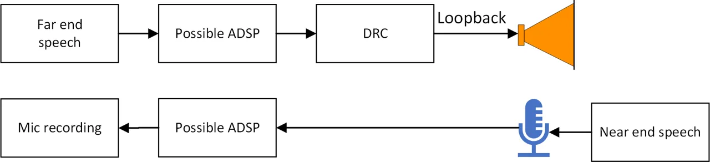
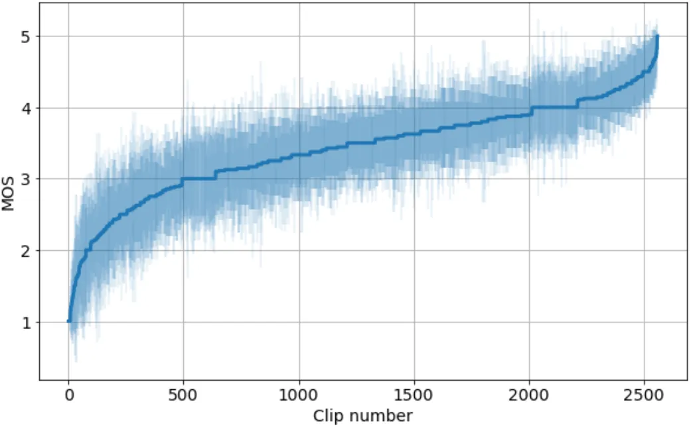
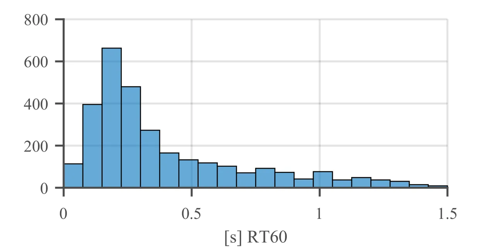
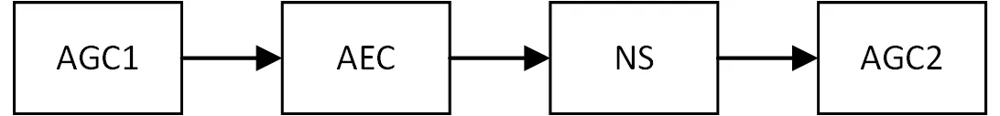
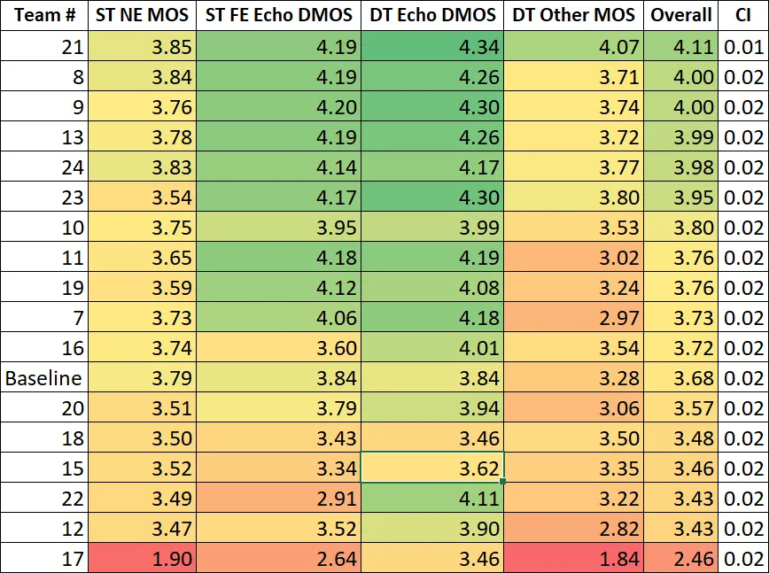
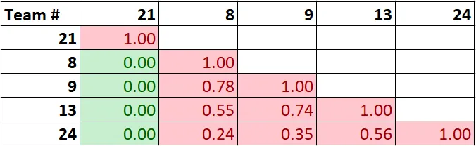
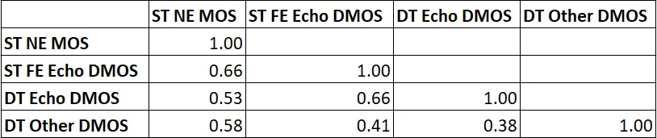
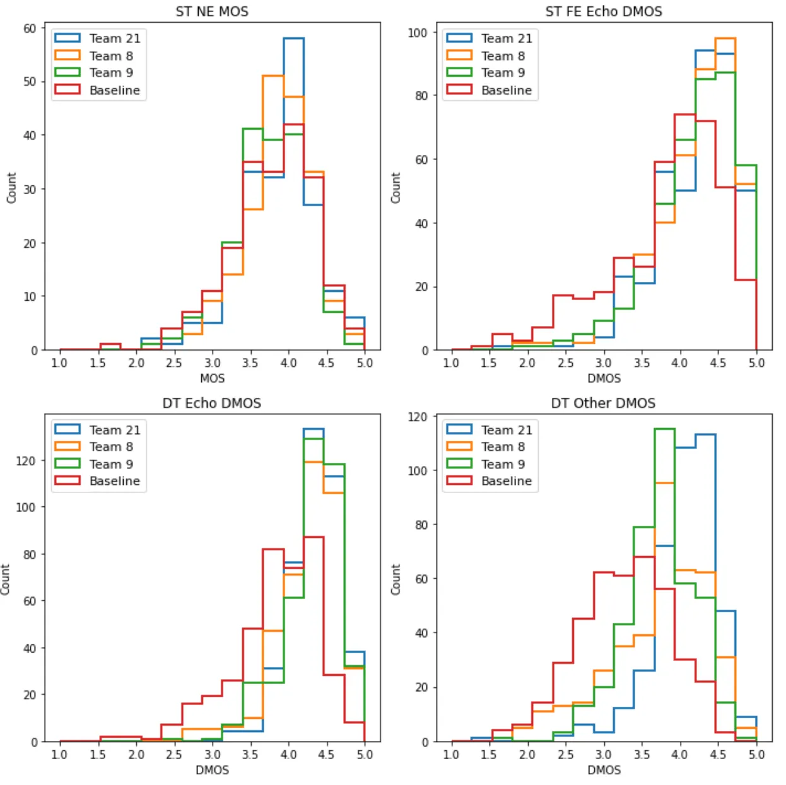

# ICASSP 2021 Acoustic Echo Cancellation Challenge: Datasets, Testing Framework, and Results

Kusha Sridhar, Ross Cutler, Ando Saabas, Tanel Parnamaa, Markus Loide,
Hannes Gamper, Sebastian Braun, Robert Aichner, Sriram Srinivasan

###### Abstract

The ICASSP 2021 Acoustic Echo Cancellation Challenge is intended to
stimulate research in the area of acoustic echo cancellation (AEC),
which is an important part of speech enhancement and still a top issue
in audio communication and conferencing systems. Many recent AEC studies
report good performance on synthetic datasets where the train and test
samples come from the same underlying distribution. However, the AEC
performance often degrades significantly on real recordings. Also, most
of the conventional objective metrics such as echo return loss
enhancement (ERLE) and perceptual evaluation of speech quality (PESQ) do
not correlate well with subjective speech quality tests in the presence
of background noise and reverberation found in realistic environments.
In this challenge, we open source two large datasets to train AEC models
under both single talk and double talk scenarios. These datasets consist
of recordings from more than 2,500 real audio devices and human speakers
in real environments, as well as a synthetic dataset. We open source two
large test sets, and we open source an online subjective test framework
for researchers to quickly test their results. The winners of this
challenge will be selected based on the average Mean Opinion Score (MOS)
achieved across all different single talk and double talk scenarios.

###### Index Terms: 

Acoustic Echo Cancellation, deep learning, single talk, double talk,
subjective test

^(†)^(†)address: ¹The University of Texas at Dallas, ²Microsoft Corp.

## 1 Introduction

With the growing popularity and need for working remotely, the use of
teleconferencing systems such as Microsoft Teams, Skype, WebEx, Zoom,
etc., has increased significantly. It is imperative to have good quality
calls to make the users’ experience pleasant and productive. The
degradation of call quality due to acoustic echoes is one of the major
sources of poor speech quality ratings in voice and video calls. While
_digital signal processing_ (DSP) based AEC models have been used to
remove these echoes during calls, their performance can degrade given
devices with poor physical acoustics design or environments outside
their design targets and lab-based tests. This problem becomes more
challenging during full-duplex modes of communication where echoes from
double talk scenarios are difficult to suppress without significant
distortion or attenuation \[1\].

With the advent of deep learning techniques, several supervised learning
algorithms for AEC have shown better performance compared to their
classical counterparts \[2, 3, 4\]. Some studies have also shown good
performance using a combination of classical and deep learning methods
such as using adaptive filters and _recurrent neural networks_ (RNNs)
\[4, 5\] but only on synthetic datasets. While these approaches provide
a good heuristic on the performance of AEC models, there has been no
evidence of their performance on real-world datasets with speech
recorded in diverse noise and reverberant environments. This makes it
difficult for researchers in the industry to choose a good model that
can perform well on a representative real-world dataset.

Most AEC publications use objective measures such as ERLE \[6\] and PESQ
\[7\]. ERLE is defined as:

```math
ERLE=10\log_{10}\frac{\mathbb{E}[y^{2}(n)]}{\mathbb{E}[\hat{y}^{2}(n)]} \tag{1}
```

where $`y(n)`$ is the microphone signal, and $`\hat{y}(n)`$ is the
enhanced speech. ERLE is only appropriate when measured in a quiet room
with no background noise and only for single talk scenarios (not double
talk). PESQ has also been shown to not have a high correlation to
subjective speech quality in the presence of background noise \[8\].
Using the datasets provided in this challenge we show the ERLE and PESQ
have a low correlation to subjective tests (Table 1). In order to use a
dataset with recordings in real environments, we can not use ERLE and
PESQ. A more reliable and robust evaluation framework is needed that
everyone in the research community can use, which we provide as part of
the challenge.

|      |      |      |
| ---- | ---- | ---- |
|      | PCC  | SRCC |
| ERLE | 0.31 | 0.23 |
| PESQ | 0.67 | 0.57 |

Table 1: Pearson and Spearman rank correlation between ERLE, PESQ and
P.808 Absolute Category Rating (ACR) results on single talk with delayed
echo scenarios (see Section 5).

This AEC challenge is designed to stimulate research in the AEC domain
by open sourcing a large training dataset, test set, and subjective
evaluation framework. We provide two new open source datasets for
training AEC models. The first is a real dataset captured using a
large-scale crowdsourcing effort. This dataset consists of real
recordings that have been collected from over 2,500 diverse audio
devices and environments. The second is a synthetic dataset with added
room impulse responses and background noise derived from \[9\]. An
initial test set was released for the researchers to use during
development and a blind test near the end which was used to decide the
final competition winners. We believe these datasets are not only the
first open source datasets for AEC’s, but ones that are large enough to
facilitate deep learning and representative enough for practical usage
in shipping telecommunication products.

The training dataset is described in Section 2, and the test set in
Section 3. We describe a DNN-based AEC method in Section 4. The online
subjective evaluation framework is discussed in Section 5. The challenge
rules are described in Section 6. The results of the challenge is
discussed in Section 7.

## 2 Training datasets

The challenge will include two new open source datasets, one real and
one synthetic. The datasets are available at
[https://github.com/microsoft/AEC-Challenge](https://github.com/microsoft/AEC-Challenge).

### 2.1 Real dataset

The first dataset was captured using a large-scale crowdsourcing effort.
This dataset consists of more than 2,500 different real environments,
audio devices, and human speakers in the following scenarios:

1.  1.  Far end single talk, no echo path change
2.  2.  Far end single talk, echo path change
3.  3.  Near end single talk, no echo path change
4.  4.  Double talk, no echo path change
5.  5.  Double talk, echo path change
6.  6.  Sweep signal for RT60 estimation

A total of 2,500 completed scenarios are provided in the dataset, with
an additional 1,000 partial scenarios for a total of 18K audio clips.
For the far end single talk case, there is only the loudspeaker signal
(far end) played back to the users and users remain silent (no near end
signal). For the near end single talk case, there is no far end signal
and users are prompted to speak, capturing the near end signal. For
double talk, both the far end and near end signals are active, where a
loudspeaker signal is played and users talk at the same time. Echo path
change was incorporated by instructing the users to move their device
around or bring themselves to move around the device. The near end
single talk speech quality is given in Figure 2. The RT60 distribution
for the dataset is estimated using a method by Karjalainen et al. \[10\]
and shown in Figure 3. The RT60 estimates can be used to sample the
dataset for training.

We use _Amazon Mechanical Turk_ as the crowdsourcing platform and wrote
a custom HIT application which includes a custom tool that raters
download and execute to record the six scenarios described above. The
dataset includes only Microsoft Windows devices. Each scenario includes
the microphone and loopback signal (see Figure 1). Even though our
application uses raw audio mode, the PC can still include Audio DSP on
the receive signal (e.g., equalization and Dynamic Range Compression
(DRC)); it can also include Audio DSP on the send signal, such as AEC
and noise suppression.



Figure 1: The custom recording application recorded the loopback and
microphone signals.

For clean speech far end signals, we use the speech segments from the
Edinburgh dataset \[11\]. This corpus consists of short single speaker
speech segments ($`1`$ to $`3`$ seconds). We used a _long short term
memory_ (LSTM) based gender detector to select an equal number of male
and female speaker segments. Further, we combined $`3`$ to $`5`$ of
these short segments to create clips of length between $`9`$ and $`15`$
seconds in duration. Each clip consists of a single gender speaker. We
create a gender-balanced far end signal source comprising of $`500`$
male and $`500`$ female clips. Recordings are saved at the maximum
sampling rate supported by the device and in 32-bit floating point
format; in the released dataset we down-sample to 16KHz and 16-bit using
automatic gain control to minimize clipping.

For noisy speech far end signals we use $`2000`$ clips from the near end
single talk scenario, gender balanced to include an equal number of male
and female voices.

For near end speech, the users were prompted to read sentences from
TIMIT \[12\] sentence list. Approximately 10 seconds of audio is
recorded while the users are reading.



Figure 2: Sorted near end single talk clip quality (P.808) with 95%
confidence intervals.

### 2.2 Synthetic dataset

The second dataset provides 10,000 synthetic scenarios, each including
single talk, double talk, near end noise, far end noise, and various
nonlinear distortion scenarios. Each scenario includes a far end speech,
echo signal, near end speech, and near end microphone signal clip. We
use 12,000 cases (100 hours of audio) from both the clean and noisy
speech datasets derived in \[9\] from the LibriVox project¹¹ 1
https://librivox.org as source clips to sample far end and near end
signals. The LibriVox project is a collection of public domain
audiobooks read by volunteers. \[9\] used the online subjective test
framework ITU-T P.808 to select audio recordings of good quality (4.3
$`\leq`$ MOS $`\leq`$ 5) from the LibriVox project. The noisy speech
dataset was created by mixing clean speech with noise clips sampled from
Audioset \[13\], Freesound²² 2 https://freesound.org and DEMAND \[14\]
databases at signal to noise ratios sampled uniformly from \[0, 40\] dB.

To simulate a far end signal, we pick a random speaker from a pool of
1,627 speakers, randomly choose one of the clips from the speaker, and
sample 10 seconds of audio from the clip. For the near end signal, we
randomly choose another speaker and take 3-7 seconds of audio which is
then zero-padded to 10 seconds. Of the selected far end and near end
speakers, 71% and 67% are male, respectively. To generate an echo, we
convolve a randomly chosen room impulse response from a large internal
database with the far end signal. The room impulse responses are
generated by using Project Acoustics technology³³ 3
https://www.aka.ms/acoustics and the RT60 ranges from 200 ms to 1200 ms.
In 80% of the cases, the far end signal is processed by a nonlinear
function to mimic loudspeaker distortion. For example, the
transformation can be clipping the maximum amplitude, using a sigmoidal
function as in \[15\], or applying learned distortion functions, the
details of which we will describe in a future paper. This signal gets
mixed with the near end signal at a signal to echo ratio uniformly
sampled from -10 dB to 10 dB. The far end and near end signals are taken
from the noisy dataset in 50% of the cases. The first 500 clips can be
used for validation as these have a separate list of speakers and room
impulse responses. Detailed metadata information can be found in the
repository.



Figure 3: Distribution of reverberation time (RT60).

## 3 Test set

Two test sets are included, one at the beginning of the challenge and a
blind test set near the end. Both consist of approximately 1000 real
world recordings and are partitioned into the following scenarios:

1.  1.  Clean, i.e. recordings with clean far end and near end (MOS$`>`$4
        based on P.808 ratings).
2.  2.  Noisy, i.e. recordings with both noisy far end and near end as
        described in Section 2.1, sampled randomly.

For both clean and noisy blind test set, all files were also listened
through by the organizers to filter out very poor recordings that would
not be usable for AEC evaluation. Additionally, some files with
especially difficult conditions were added to the noisy set (e.g. very
large sudden increase in delay between loopback and microphone).

## 4 Baseline AEC Method

We adapt a noise suppression model developed in \[16\] to the task of
echo cancellation. Specifically, a recurrent neural network with gated
recurrent units takes concatenated log power spectral features of the
microphone signal and far end signal as input, and outputs a spectral
suppression mask. The STFT is computed based on 20 ms frames with a hop
size of 10 ms, and a 320-point discrete Fourier transform. We use a
stack of two GRU layers followed by a fully-connected layer with a
sigmoid activation function. The estimated mask is point-wise multiplied
with the magnitude spectrogram of microphone signal to suppress the far
end signal. Finally, to resynthesize the enhanced signal, an inverse
short-time Fourier transform is used on the phase of the microphone
signal and the estimated magnitude spectrogram. We use a mean squared
error loss between the clean and enhanced magnitude spectrograms. The
Adam optimizer with a learning rate of 0.0003 is used to train the
model.

## 5 Online subjective evaluation framework

We have extended the open source P.808 Toolkit \[17\] with methods for
evaluating the echo impairments in subjective tests. We followed the
Third-party Listening Test B from ITU-T Rec. P.831 \[18\] and ITU-T Rec.
P.832 \[19\] and adapted them to our use case as well as for the
crowdsourcing approach based on the ITU-T Rec. P.808 \[20\] guidance.

A third-party listening test differs from the typical listening-only
tests (according to the ITU-T Rec. P.800) in the way that listeners hear
the recordings from the center of the connection rather in former one in
which the listener is positioned at one end of the connection \[18\].
Thus, the speech material should be recorded by having this concept in
mind. During the test session, we used different combinations of single-
and multi-scale ACR ratings depending on the speech sample under
evaluation. We distinguished between single talk and double talk
scenarios. For the near end single talk, we asked for the overall
quality, and for far end single talk we an used echo annoyance scale. In
the double talk scenario, we asked for an echo annoyance and impairments
of other degradations in two separate questions⁴⁴ 4 Question 1: How
would you judge the degradation from the echo of Person 1’s voice?
Question 2: How would you judge degradations (missing audio,
distortions, cut-outs) of Person 2’s voice?. Both impairments were rated
on the degradation category scale (from 1:Very annoying, to 5:
Imperceptible). The impairments scales leads to a Degradation Mean
Opinion Scores (DMOS).

The audio pipeline used in the challenge is shown in Figure 4. In the
first stage (AGC1) a traditional automatic gain control is used to
target a speech level of -24 dBFS. The output of AGC1 is saved in the
test set. The next stage is an AEC, which participants will process and
upload to the challenge CMT site. The next stage is a traditional noise
suppressor (DMOS $`<`$ 0.1 improvement) to reduce stationary noise.
Finally, a second AGC is run to ensure the speech level is still -24
dBFS.

The subjective test framework with AEC extension is available at
[https://github.com/microsoft/P.808](https://github.com/microsoft/P.808).



Figure 4: The audio processing pipeline used in the challenge.

## 6 AEC Challenge Rules and Schedule

### 6.1 Rules

This challenge is to benchmark the performance of real-time algorithms
with a real (not simulated) test set. Participants will evaluate their
AEC on a test set and submit the results (audio clips) for evaluation.
The requirements for each AEC used for submission are:

- •
  The AEC must take less than the stride time $`T_{s}`$ (in ms) to
  process a frame of size $`T`$ (in ms) on an Intel Core i5 quad-core
  machine clocked at 2.4 GHz or equivalent processors. For example,
  $`T_{s}=T/2`$ for 50% overlap between frames. The total algorithmic
  latency allowed including the frame size $`T`$, stride time $`T_{s}`$,
  and any look ahead must be $`\leq`$ 40ms. For example, for a real-time
  system that receives 20ms audio chunks, if you use a frame length of
  20ms with a stride of 10ms resulting in an algorithmic latency of
  30ms, then you satisfy the latency requirements. If you use a frame
  size of 32ms with a stride of 16ms resulting in an algorithmic latency
  of 48ms, then your method does not satisfy the latency requirements as
  the total algorithmic latency exceeds 40ms. If your frame size plus
  stride $`T_{1}=T+T_{s}`$ is less than 40ms, then you can use up to
  $`(40-T_{1})`$ms future information.
- •
  The AEC can be a deep model, a traditional signal processing
  algorithm, or a mix of the two. There are no restrictions on the AEC
  aside from the run time and algorithmic latency described above.
- •
  Submissions must follow instructions on
  [http://aec-challenge.azurewebsites.net](http://aec-challenge.azurewebsites.net)
- •
  Winners will be picked based on the subjective echo MOS evaluated on
  the blind test set using ITU-T P.808 framework described in Section 5.
- •
  The blind test set will be made available to the participants on
  October 2, 2020. Participants must send the results (audio clips)
  achieved by their developed models to the organizers. We will use the
  submitted clips to conduct ITU-T P.808 subjective evaluation and pick
  the winners based on the results. Participants are forbidden from
  using the blind test set to retrain or tune their models. They should
  not submit results using other AEC methods that they are not
  submitting to ICASSP 2021. Failing to adhere to these rules will lead
  to disqualification from the challenge.
- •
  Participants should report the computational complexity of their model
  in terms of the number of parameters and the time it takes to infer a
  frame on a particular CPU (preferably Intel Core i5 quad-core machine
  clocked at 2.4 GHz). Among the submitted proposals differing by less
  than 0.1 MOS, the lower complexity model will be given a higher
  ranking.
- •
  Each participating team must submit an ICASSP paper that summarizes
  the research efforts and provide all the details to ensure
  reproducibility. Authors may choose to report additional
  objective/subjective metrics in their paper.
- •
  Submitted papers will undergo the standard peer-review process of
  ICASSP 2021. The paper needs to be accepted to the conference for the
  participants to be eligible for the challenge.

### 6.2 Timeline

- •
  September 8, 2020: Release of the datasets.
- •
  October 2, 2020: Blind test set released to participants.
- •
  October 9, 2020: Deadline for participants to submit their results for
  objective and P.808 subjective evaluation on the blind test set.
- •
  October 16, 2020: Organizers will notify the participants about the
  results.
- •
  October 19, 2020: Regular paper submission deadline for ICASSP 2021.
- •
  January 22, 2021: Paper acceptance/rejection notification
- •
  January 25, 2021: Notification of the winners with winner
  instructions, including a prize claim deadline.

### 6.3 Support

Participants may email organizers at
[aec_challenge@microsoft.com](mailto:aec_challenge@microsoft.com) with
any questions related to the challenge or in need of any clarification
about any aspect of the challenge.

## 7 Results

We received 17 submissions for the challenge. Each team submitted
processed files from the blind test set with 500 noisy and 500 clean
recordings (see Section 3). We batched all submissions into three sets:

- •
  Nearend single talk files for MOS test (NE ST MOS).
- •
  Farend single talk files for Echo DMOS test (ST FE Echo DMOS).
- •
  Double talk files for Echo and Other degradation DMOS test (DT
  Echo/Other DMOS).

To obtain the final overall rating, we averaged the results from the
four questionnaires, weighting them equally. The final standings are
shown in Figure 5. The resulting scores show a wide variety in model
performance. The score differences in near end, echo and double talk
scenarios for individual models highlight the importance of evaluating
all scenarios, since in many cases, performance in one scenario comes at
a cost in another scenario. The overall Pearson correlation between the
four tests are given in Figure 7 (omitting the last place outlier, which
significantly skews the result).

For the top five teams, we ran an ANOVA test to determine statistical
significance (Figure 6). While the first place stands out as the clear
winner, the differences between places 2–5 were not statistically
significant, and per the challenge rules, places 2 and 3 are picked
based on the computational complexity of the models.



Figure 5: Final results of the challenge.



Figure 6: P-values of ANOVA test of the top 5 teams.



Figure 7: Pearson correlation coefficients between different tests.



Figure 8: MOS histograms of the top 3 models and baseline

Some models, including the winning entry, perform speech enhancement
(noise suppression) in addition to echo cancellation.
[http://aec-challenge.azurewebsites.net/](http://aec-challenge.azurewebsites.net/)
includes the results for clean and noisy subsets of data. The tables
highlight that models that do speech enhancement (noise suppression)
have a small overall advantage in tests. For example, the baseline
model, which does not do noise suppression, has a delta of -0.16 on
noisy NE ST when compared to the winning entry, but has a similar
performance on the clean NE ST data. In general, though, rankings do not
differ significantly between the two sets.

Histograms of MOS and DMOS values of top 3 submissions and baseline are
given in Figure 8.

## 8 Conclusions

The results of this challenge shows that deep learning models or hybrid
models can significantly outperform traditional DSP models, even when
given the low latency and low complexity requirements of the challenge.
This is encouraging as it is feasible that these new classes of AEC’s
can be integrated into products and improve the experience for billions
of users of audio telephony. It is our hope that the dataset, test set,
and test framework created for the challenge will accelerate research in
this area, as there is still improvement to be made.

A future area of research is to improve the overall score of the
subjective scores over the unweighted mean used in Figure 5.

## 9 Acknowledgements

The double talk survey implementation was written by Babak Naderi.

## References

- \[1\] “IEEE 1329-2010 Standard method for measuring transmission
  performance of handsfree telephone sets,” 2010.
- \[2\] A. Fazel, M. El-Khamy, and J. Lee, “CAD-AEC: Context-aware deep
  acoustic echo cancellation,” in ICASSP 2020 - 2020 IEEE International
  Conference on Acoustics, Speech and Signal Processing (ICASSP), 2020,
  pp. 6919–6923.
- \[3\] M. M. Halimeh and W. Kellermann, “Efficient multichannel
  nonlinear acoustic echo cancellation based on a cooperative strategy,”
  in ICASSP 2020 - 2020 IEEE International Conference on Acoustics,
  Speech and Signal Processing (ICASSP), 2020, pp. 461–465.
- \[4\] Lu Ma, Hua Huang, Pei Zhao, and Tengrong Su, “Acoustic echo
  cancellation by combining adaptive digital filter and recurrent neural
  network,” arXiv preprint arXiv:2005.09237, 2020.
- \[5\] Hao Zhang, Ke Tan, and DeLiang Wang, “Deep learning for joint
  acoustic echo and noise cancellation with nonlinear distortions.,” in
  INTERSPEECH, 2019, pp. 4255–4259.
- \[6\] “ITU-T recommendation G.168: Digital network echo cancellers,”
  Feb 2012.
- \[7\] “ITU-T recommendation P.862: Perceptual evaluation of speech
  quality (PESQ): An objective method for end-to-end speech quality
  assessment of narrow-band telephone networks and speech codecs,”
  Feb 2001.
- \[8\] A. R. Avila, H. Gamper, C. Reddy, R. Cutler, I. Tashev, and
  J. Gehrke, “Non-intrusive speech quality assessment using neural
  networks,” in ICASSP 2019 - 2019 IEEE International Conference on
  Acoustics, Speech and Signal Processing (ICASSP), 2019, pp. 631–635.
- \[9\] Chandan KA Reddy, Vishak Gopal, Ross Cutler, Ebrahim Beyrami,
  Roger Cheng, Harishchandra Dubey, Sergiy Matusevych, Robert Aichner,
  Ashkan Aazami, Sebastian Braun, et al., “The INTERSPEECH 2020 deep
  noise suppression challenge: Datasets, subjective testing framework,
  and challenge results,” arXiv preprint arXiv:2005.13981, 2020.
- \[10\] Matti Karjalainen, Poju Antsalo, Aki Mäkivirta, Timo Peltonen,
  and Vesa Välimäki, “Estimation of modal decay parameters from noisy
  response measurements,” J. Audio Eng. Soc, vol. 50, no. 11, pp.
  867, 2002.
- \[11\] Cassia Valentini-Botinhao, Xin Wang, Shinji Takaki, and Junichi
  Yamagishi, “Speech enhancement for a noise-robust text-to-speech
  synthesis system using deep recurrent neural networks.,” in
  Interspeech, 2016, pp. 352–356.
- \[12\] J. S. Garofolo, L. F. Lamel, W. M. Fisher, J. G. Fiscus, D. S.
  Pallett, and N. L. Dahlgren, “DARPA TIMIT acoustic phonetic continuous
  speech corpus CDROM,” 1993.
- \[13\] Jort F. Gemmeke, Daniel P.W. Ellis, Dylan Freedman, Aren
  Jansen, Wade Lawrence, R. Channing Moore, Manoj Plakal, and Marvin
  Ritter, “Audio set: An ontology and human-labeled dataset for audio
  events,” in 2017 IEEE International Conference on Acoustics, Speech
  and Signal Processing (ICASSP). IEEE, 2017, pp. 776–780.
- \[14\] Joachim Thiemann, Nobutaka Ito, and Emmanuel Vincent, “The
  diverse environments multi-channel acoustic noise database: A database
  of multichannel environmental noise recordings,” The Journal of the
  Acoustical Society of America, vol. 133, no. 5, pp. 3591–3591, 2013.
- \[15\] Chul Min Lee, Jong Won Shin, and Nam Soo Kim, “DNN-based
  residual echo suppression,” in Sixteenth Annual Conference of the
  International Speech Communication Association, 2015.
- \[16\] Yangyang Xia, Sebastian Braun, Chandan KA Reddy, Harishchandra
  Dubey, Ross Cutler, and Ivan Tashev, “Weighted speech distortion
  losses for neural-network-based real-time speech enhancement,” in
  ICASSP 2020-2020 IEEE International Conference on Acoustics, Speech
  and Signal Processing (ICASSP). IEEE, 2020, pp. 871–875.
- \[17\] Babak Naderi and Ross Cutler, “An open source implementation of
  ITU-T recommendation P.808 with validation,” arXiv preprint
  arXiv:2005.08138, 2020.
- \[18\] “ITU-T P.831 Subjective performance evaluation of network echo
  cancellers ITU-T P-series recommendations,” 1998.
- \[19\] ITU-T Recommendation P.832, Subjective performance evaluation
  of hands-free terminals, International Telecommunication Union,
  Geneva, 2000.
- \[20\] “ITU-T P.808 supplement 23 ITU-T coded-speech database
  supplement 23 to ITU-T P-series recommendations (previously ccitt
  recommendations),” 1998.
