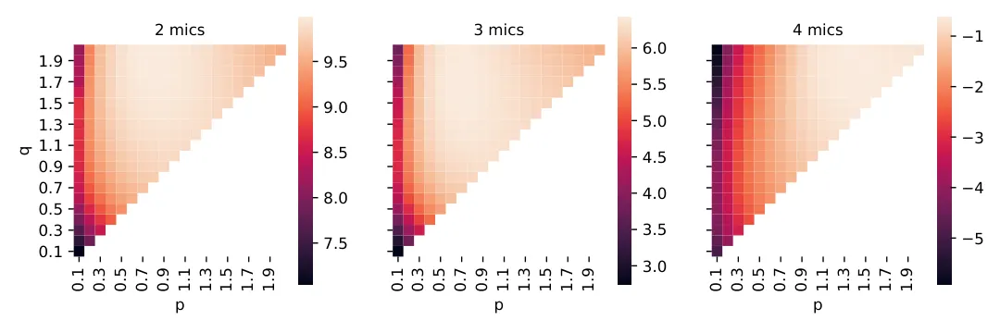
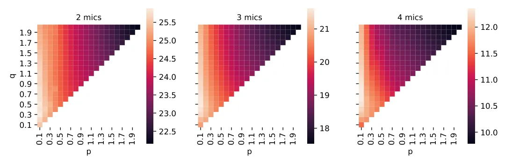
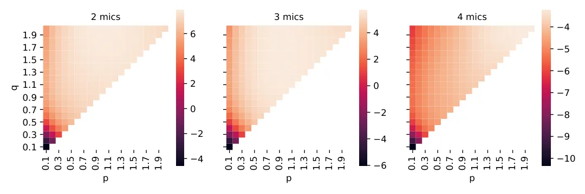
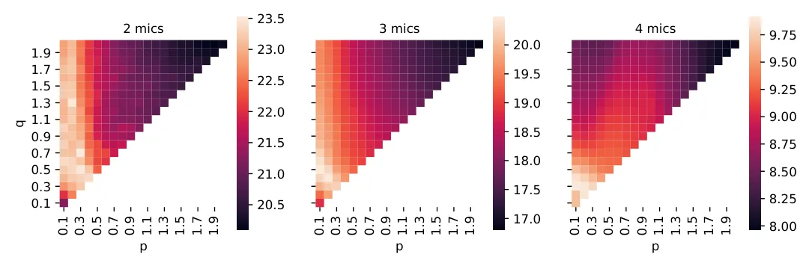
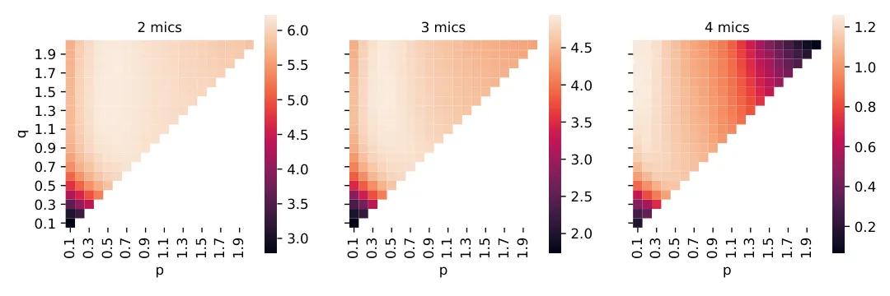
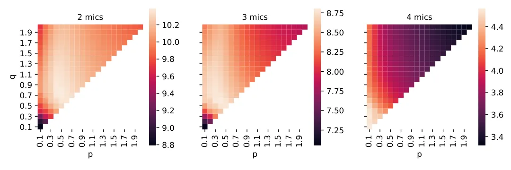

# Generalized Minimal Distortion Principle for Blind Source Separation

###### Abstract

We revisit the source image estimation problem from blind source
separation (BSS). We generalize the traditional minimum distortion
principle to maximum likelihood estimation with a model for the residual
spectrograms. Because residual spectrograms typically contain other
sources, we propose to use a mixed-norm model that lets us finely tune
sparsity in time and frequency. We propose to carry out the minimization
of the mixed-norm via majorization-minimization optimization, leading to
an iteratively reweighted least-squares algorithm. The algorithm
balances well efficiency and ease of implementation. We assess the
performance of the proposed method as applied to two well-known
determined BSS and one joint BSS-dereverberation algorithms. We find out
that it is possible to tune the parameters to improve separation by up
to $`2\text{\,}\mathrm{dB}`$, with no increase in distortion, and at
little computational cost. The method thus provides a cheap and easy way
to boost the performance of blind source separation.

Robin Scheibler

LINE Corporation, Japan

robin.scheibler@linecorp.com

Index Terms: blind source separation, scale ambiguity, minimal
distortion, sparsity inducing norms, MM algorithm

## 1 Introduction

Blind source separation (BSS) conveniently allows to separate a mixture
signal into its constitutional components without the need for prior
information \[1\]. A pioneering method of BSS is independent component
analysis (ICA) that only requires that the signal components be
statistically independent and non-Gaussian \[2\]. In its canonical form,
ICA tackles determined linear mixtures where the number of components is
the same as that of sensors. In this case, the separation task boils
down to finding a square demixing matrix making the output components
independent. The determined BSS problem suffers from two inherent
ambiguities. First, any permutation of the sources in the output is
equally acceptable. Second, the sources may be scaled arbitrarily. The
first problem is particularly problematic in frequency-domain BSS
(FD-BSS) \[3\], where sources extracted at each frequency must be
aligned. This can be done via clustering \[4\], or by considering the
joint distribution over frequencies as in independent vector analysis
(IVA) \[5, 6\].

Relatively less attention has been given to the scale ambiguity problem.
For FD-BSS on acoustic mixtures, the ambiguity is equivalent to an
arbitrary filtering of sources. Without a correction step, separated
sources typically do not sound natural at all. This can be addressed by
estimating source images, that is the source signal as perceived at the
microphone locations. There has been traditionally two ways of doing it.
First, the so-called projection back (PB) method makes use of the
linearity of determined BSS \[7\]. It relies on the observation that the
columns of the inverse of the demixing matrix are steering vectors for
the sources. This method may be unstable if the demixing matrix is
poorly conditioned, which is not frequent, but may happen for some
algorithms. The second method applies the minimal distortion principle
(MDP) to adjust the scale compared to the input microphone signal.
Exploiting the independence of the other signals, it finds the filter
minimizing the squared distance between the separated source and the
input signal. From a maximum likelihood point of view, this method
assumes a Gaussian distribution of the residual when computing the
distortion. However, the residual is in fact the sum of the other
sources and background noise. Due to the non-Gaussianity of sources, it
is unlikely to be Gaussian, leading to a sub-optimal choice for the
scaling filter. For example, residual sources may have some very large
components. A squared norm will try to reduce them, possibly at the cost
of the target source. For a detailed comparison and analysis of both
methods, see \[8\].

In this paper, we propose the generalized minimal distortion principle
(GMDP) that uses the maximum likelihood estimator (MLE) for the image
sources. We futher propose to instantiate GMDP based on sparsity
promoting mixed norms. The intuition for using such a measure of
distortion is that we want to allow the residual from minimal distortion
to have some large entries. The use of $`\ell_{p}`$-norms, and the
$`\ell_{1}`$-norm in particular, for this purpose has been popularized
by the LASSO algorithm \[9\] and the compressed sensing
literature \[10\]. Another way to understand the use of such norms is
via a generative model of the residual and maximum likelihood
estimation. For example, the $`\ell_{1}`$ norm corresponds to a Laplace
model. What we propose is to penalize the residual between the separated
source and the reference input signal using a mixed norm $`\ell_{p,q}`$,
for $`0<p\leq q\leq 2`$. The mixed norm allows to promote sparsity at
different rates across time and mixtures (i.e. time and frequency for
audio signals). Unlike the $`\ell_{2}`$-norm, there is no closed-form
solution for the mixed norm minimization. Instead we rely on
majorization-minimization (MM) whereas a surrogate function dominating
the objective is repeatedly minimized \[11\]. We construct the surrogate
function from an inequality previously used in the context of sound
field decomposition \[12\]. The final algorithm falls in the family of
iteratively reweighted least-squares (IRLS), that has been heavily
investigated in the context of sparse regression \[13, 14\]. We validate
the proposed GMDP via large numerical simulations of determined speech
separation. We investigate the performance for several BSS algorithms:
AuxIVA \[15\], ILRMA \[16\], and joint BSS and dereverberation
ILRMA-T \[17\]. We sweep values of $`0<p\leq q\leq 2`$ for different
number of sources and find that our approach outperforms both MDP and PB
in terms of standard BSS metrics. The code for the experiments is shared
at
[https://github.com/fakufaku/2020_interspeech_gdmp](https://github.com/fakufaku/2020_interspeech_gdmp).

The rest of this paper is as follows. Section 2 covers the conventional
BSS scaling strategies. Section 3 describes the proposed method. The
result of numerical experiments is shown in Section 5.

## 2 Background

The notation in this paper is as follows. We use lower and upper case
bold letters for vectors and matrices, respectively. Furthermore,
$`\bm{A}^{\top}`$ and $`\bm{A}^{\mathsf{H}}`$ denote the transpose and
conjugate transpose of matrix A, respectively. The Euclidean norm of
vector $`\bm{v}`$ is $`\|\bm{v}\|=(\bm{v}^{\mathsf{H}}\bm{v})^{1/2}`$.
The diagonal matrix with $`\bm{v}`$ on its diagonal is denoted
$`\operatorname{diag}(\bm{v})`$. Unless specified otherwise, indices k,
m, f, and n are for source, sensor, frequency, and time, respectively.
They always take the ranges from the corresponding capital letter, i.e.,
$`K`$, $`M`$, $`F`$, and $`N`$, respectively.

We consider FD-BSS with $`K`$ sources and $`M`$ sensors in the short
time Fourier transform (STFT) domain \[18\]. The sensor inputs are
described by the linear mixing model

```math
x_{mfn}=\sum_{k=1}^{K}h_{mkf}s_{kfn}+b_{mfn}, \tag{1}
```

where $`x_{mfn},s_{kfn}\in\mathbb{C}`$ are the $`m`$th sensor and
$`k`$th source signals, respectively at frequency $`f`$ and frame $`n`$,
and $`h_{mkf}\in\mathbb{C}`$ is the transfer function between the two.
The term $`b_{mfn}`$ optionally encompasses extra background noise and
model mismatch. We can conveniently group the sensor signals in the
vector $`\bm{x}_{fn}=[x_{1fn},\ldots,x_{Mfn}]^{\top}`$, and the sources
similarly in $`\bm{s}_{fn}`$ and $`\bm{b}_{fn}`$, respectively. Defining
the channel matrix as $`\bm{H}_{f}\in\mathbb{C}^{M\times K}`$ such that
$`(\bm{H}_{f})_{mk}=h_{mkf}`$, (1) can be written in the compact form

```math
\bm{x}_{fn}=\bm{H}_{f}\bm{s}_{fn}+\bm{b}_{fn},\hskip 9.24994pt\forall f,n. \tag{2}
```

Under this model, BSS algorithms may at best attempt to recover a source
vector estimate $`\bm{y}_{fn}`$ such that there is a mixing matrix
$`\bm{A}_{f}\in\mathbb{C}^{M\times K}`$ and

```math
\bm{x}_{fn}\approx\bm{A}_{f}\bm{y}_{fn},\hskip 9.24994pt\forall f,n. \tag{3}
```

The scale ambiguity is clear since for any non-singular diagonal matrix
$`\bm{D}`$, $`\bm{A}_{f}\bm{D}^{-1}`$ and $`\bm{D}\bm{y}_{fn}`$ form an
equally valid solution. To avoid this scaling ambiguity, the source
images are sought instead. These are the sources as measured at a sensor
location, e.g. the $`k`$th source at the $`m`$th sensor is
$`\hat{s}_{mkfn}=h_{mkf}s_{kfn}`$. When $`\bm{A}_{f}`$ is available,
then from its $`k`$th column $`\bm{a}_{kf}`$, the source images of the
$`k`$th source can be obtained

```math
\hat{\bm{y}}_{kfn}=\bm{a}_{fn}y_{kfn}, \tag{4}
```

so that $`\bm{x}_{fn}\approx\sum_{k}\hat{\bm{y}}_{fn}`$. Unfortunately,
$`\bm{A}_{f}`$ is typically not known and must also be estimated.

### 2.1 Projection Back

The so-called projection back technique is applicable when the number of
sources is the same as that of sensors, i.e. $`M=K`$, \[7\], and
$`b_{mfn}=0`$ in (1). In this case, the demixing is typically done by
estimating a square demixing matrix
$`\bm{W}_{f}\in\mathbb{C}^{M\times M}`$ so that

```math
\bm{y}_{fn}=\bm{W}_{f}\bm{x}_{fn},\hskip 9.24994pt\forall f,n. \tag{5}
```

In that case, it is clear that (3) holds with equality with
$`\bm{A}_{f}=\bm{W}^{-1}_{f}`$. Thus, the estimated source image is

```math
\hat{\bm{y}}_{fn}=\bm{A}_{f}\bm{e}_{k}y_{kfn}=\bm{W}_{f}^{-1}\bm{e}_{k}y_{kfn}. \tag{6}
```

where $`\bm{e}_{k}`$ is the $`i`$th column of the identity matrix. This
method is widely used in practice and works reasonably well, as long as
$`\bm{W}_{f}`$ is well-conditioned. This is usually the case as most BSS
algorithms either impose its orthogonality, e.g., \[19\], or penalize it
with a log-determinant term, e.g., \[15\].

### 2.2 Minimal Distortion Principle

In contrast, MDP finds the mixing weights that minimize the sum of
squared differences between the separated source and the microphone
inputs \[20, 21\], i.e., $`\hat{\bm{y}}_{fn}=\bm{a}_{kf}y_{kfn}`$, with

```math
\bm{a}_{kf}=\underset{\bm{a}\in\mathbb{C}^{M}}{\arg\min}\ \mathbb{E}\|\bm{x}_{fn}-\bm{a}y_{kfn}\|^{2}. \tag{7}
```

While derived originally from a different perspective, this source image
estimator is optimal in the maximum likelihood sense when sources are
uncorrelated and the background noise is Gaussian. Under the
uncorrelation assumption, one can show,

```math
\mathbb{E}\|\bm{x}_{fn}-\bm{a}y_{kfn}\|^{2}=\mathbb{E}\|\bm{h}_{kf}s_{kfn}-\bm{a}y_{kfn}\|^{2}+\text{const.}, \tag{8}
```

where $`\bm{h}_{kf}`$ is the $`k`$th column of $`\bm{H}_{f}`$. Thus, (7)
is indeed the MLE of $`\bm{a}_{kf}`$ if $`b_{mfn}`$ is Gaussian. The MDP
can be shown to be equivalent to PB under the uncorrelation
assumption \[8\]. However, it is more stable and can deal with
$`K\neq M`$. In practice, however, both assumptions for its optimality
are routinely violated. In multivariate source models, such as IVA,
uncorrelation is not required at all frequencies. In addition, the
background is typically not Gaussian. We address these limitations in
the next section.

## 3 Generalized Minimal Distortion Principle



(a) AuxIVA, SDR



(b) AuxIVA, SIR



(c) ILRMA, SDR



(d) ILRMA, SIR



(e) ILRMA-T, SDR



(f) ILRMA-T, SIR

Figure 1: Average SDR and SIR performance of GMDP. Bright and dark
colors indicate high and low performance, respectively.

Consider the residual signal, where the scaling factor $`a_{mkf}`$ is
assumed known such that $`h_{mkf}s_{kfn}=a_{mkf}y_{kfn}`$, then

```math
e_{mfn}=x_{mfn}-a_{mkf}y_{kfn}=\sum_{\ell\neq k}h_{mkf}s_{\ell fn}+b_{mfn}. \tag{9}
```

In other words, for the correct scaling factor, the residual is
identical to the mixing model (1) with the $`k`$th source removed. Note
that sources are typically assumed to have non-Gaussian distributions.
If their number is large, the central limit theorem may be invoked to
justify Gaussianity of $`e_{mfn}`$. However, the typical number of
sources in practice is small, e.g. two to four. In this case, the
residual is also expected to be non-Gaussian.

We propose a generalized minimal distortion principle (GMDP) with a
tunable error model. To allow modelling of inter-frequency and
inter-frame dependencies, we consider the residual spectrograms

```math
\bm{E}_{mk}(\bm{z})=\bm{X}_{m}-\operatorname{diag}(\bm{z})\bm{Y}_{k},\hskip 9.24994ptm=1,\ldots,M, \tag{10}
```

where $`(\bm{X}_{m})_{fn}=x_{mfn}`$, $`(\bm{Y}_{k})_{fn}=y_{kfn}`$, and
$`\bm{z}=[z_{1},\ldots,z_{F}]^{\top}`$. Then, the MLE of $`\bm{z}_{mk}`$
is

```math
\{\hat{\bm{z}}_{mk}\}_{m=1}^{M}=\underset{\bm{z}_{1},\ldots,\bm{z}_{M}\in\mathbb{C}^{F}}{\arg\min}\ -\log p_{e}\left(\{\bm{E}_{mk}(\bm{z}_{m})\}_{m=1}^{M}\right),
```

where $`p_{e}`$ is the probability density function corresponding to the
chosen error model. Note that
$`\hat{\bm{z}}_{mk}=[a_{mk1},\ldots,a_{mkF}]^{\top}`$.

While there are lots of possible choices for the error function,
inspired by the success of spherical contrast functions in IVA \[15\],
we propose to use $`p_{e}`$ such that

```math
-\log p_{e}(\{\bm{E}_{m}\}_{m=1}^{M})=\sum_{m=1}^{M}\|\bm{E}_{m}\|_{p,q}^{p}+\text{const}, \tag{11}
```

where the mixed $`\ell_{p,q}`$-norm is defined as

```math
\|\mathbf{E}\|_{p,q}=\left(\sum_{n}\left(\sum_{f}|e_{fn}|^{q}\right)^{\frac{p}{q}}\right)^{\frac{1}{p}}. \tag{12}
```

In Laplace AuxIVA \[15\], an $`\ell_{1,2}`$-norm is used with the effect
of promoting group sparsity in the frames. That is, active frames are
sparse, but within an active frame, frequencies are not sparse. Using an
$`\ell_{p,q}`$-norm, it is possible to optimize the desired sparsity of
both frames, and frequency components. This makes sense for speech and
music signals that are typically somewhat sparse in both due to
harmonics and non-stationarity.

## 4 Optimization with MM Algorithm

|                |      |       |       |       |       |          |       |          |       |             |       |            |       |
| -------------- | ---- | ----- | ----- | ----- | ----- | -------- | ----- | -------- | ----- | ----------- | ----- | ---------- | ----- |
|                |      | PB    |       | MDP   |       | GMDP/SDR |       | GMDP/SIR |       | GMDP/SIR-10 |       | GMDP/SDR-F |       |
| Algo.          | Mics | SDR   | SIR   | SDR   | SIR   | SDR      | SIR   | SDR      | SIR   | SDR         | SIR   | SDR        | SIR   |
| AuxIVA \[15\]  | 2    | 9.72  | 22.78 | 9.50  | 22.16 | 9.99     | 23.94 | 9.51     | 25.04 | 9.51        | 25.04 | 9.95       | 23.49 |
|                | 3    | 6.01  | 17.92 | 5.85  | 17.53 | 6.43     | 19.34 | 5.92     | 20.55 | 5.92        | 20.55 | 6.33       | 18.63 |
|                | 4    | -0.71 | 9.96  | -0.72 | 9.78  | -0.62    | 10.14 | -0.72    | 10.45 | -0.72       | 10.45 | -0.68      | 10.36 |
| ILRMA \[16\]   | 2    | 7.06  | 21.55 | 7.36  | 20.19 | 7.91     | 20.94 | 7.46     | 21.96 | 7.46        | 21.96 | 7.84       | 20.63 |
|                | 3    | 5.14  | 17.91 | 5.25  | 16.80 | 5.74     | 18.08 | 5.27     | 18.99 | 5.27        | 18.99 | 5.63       | 17.49 |
|                | 4    | -4.05 | 8.44  | -3.24 | 7.96  | -3.22    | 8.06  | -3.22    | 8.11  | -3.22       | 8.11  | -3.41      | 8.48  |
| ILRMA-T \[17\] | 2    | 5.99  | 10.02 | 5.87  | 9.84  | 6.23     | 10.26 | 6.09     | 10.39 | 6.14        | 10.38 | 6.21       | 10.28 |
|                | 3    | 4.44  | 8.00  | 4.35  | 7.84  | 4.94     | 8.62  | 4.66     | 8.81  | 4.81        | 8.77  | 4.94       | 8.64  |
|                | 4    | 0.32  | 3.37  | 0.07  | 3.32  | 1.26     | 4.19  | 0.19     | 4.56  | 1.23        | 4.22  | 1.18       | 3.88  |

Table 1: Average performance of different algorithms. SDR/SIR refer to
SI-SDR/SI-SIR \[22\] for AuxIVA and ILRMA, and to bss_eval’s
SDR/SIR \[23\] for ILRMA-T. This is due to the latter using the anechoic
signals as reference.

The scaling factor to obtain the source images under the proposed GMDP
are

```math
\hat{\bm{z}}_{mk}=\underset{\mathbf{z}\in\mathbb{C}^{F}}{\arg\min}\ \|\bm{E}_{mk}(\bm{z})\|_{p,q}^{p}. \tag{13}
```

Unlike the MDP, there is unfortunately no closed form solution for this
problem. Nevertheless, it can be efficiently tackled by an IRLS scheme
derived using the MM technique \[11\].

For the optimization of an objective $`f({\bm{\theta}})`$, the MM
technique introduces a surrogate
$`Q({\bm{\theta}},\hat{{\bm{\theta}}})`$ such that

```math
\displaystyle Q(\hat{{\bm{\theta}}},\hat{{\bm{\theta}}})=f(\hat{{\bm{\theta}}}),\ \text{and}\ Q({\bm{\theta}},\hat{{\bm{\theta}}})\geq f({\bm{\theta}}),\hskip 9.24994pt\forall{\bm{\theta}},\hat{{\bm{\theta}}}. \tag{14}
```

Then, the sequence of iterates

```math
\displaystyle{\bm{\theta}}_{t}=\underset{{\bm{\theta}}}{\arg\min}\ Q({\bm{\theta}},{\bm{\theta}}_{t-1}),\hskip 9.24994ptt=1,\ldots,T, \tag{15}
```

monotonically decreases the cost function since,

```math
f({\bm{\theta}}_{t-1})=Q({\bm{\theta}}_{t-1},{\bm{\theta}}_{t-1})\geq\underset{{\bm{\theta}}}{\min}\ Q({\bm{\theta}},{\bm{\theta}}_{t-1})\geq f({\bm{\theta}}_{t}).
```

To construct the surrogate, we use the following inequality,

```math
r^{q}\leq\frac{q}{2r_{0}^{2-q}}r^{2}+\text{const},\hskip 9.24994pt0<q\leq 2, \tag{16}
```

that is derived from an inequality for super-Gaussian sources \[24\] or
from concave-convex arguments \[12\]. For values of $`0<p\leq q\leq 2`$,
by applying (16) twice, we have

```math
\displaystyle Q(\bm{E}\;;\;\widehat{\bm{E}})=\sum_{n,f}w_{fn}(\widehat{\bm{E}})|e_{fn}|^{2}+C\geq\|\bm{E}\|_{p,q}^{p}, \tag{17}
```

where $`C`$ is a constant and with weights

```math
w_{fn}(\widehat{\bm{E}})=p\left(2\left(\sum\limits_{f^{\prime}=1}^{F}|\hat{e}_{f^{\prime}n}|^{q}\right)^{\left(1-\frac{p}{q}\right)}|\hat{e}_{fn}|^{2-q}\right)^{-1}. \tag{18}
```

Equality holds for $`\bm{E}=\widehat{\bm{E}}`$.

Finally, given the current iterate $`\bm{z}_{t}`$, the next iterate is
obtained by minimizing
$`Q(\bm{E}_{mk}(\bm{z})\;;\;\bm{E}_{mk}(\bm{z}_{t}))`$, i.e.,

```math
\mathbf{z}_{t+1}\leftarrow\frac{\sum_{n}w_{fn}(\mathbf{z}_{t})x_{fn}y^{*}_{fn}}{\sum_{n}w_{fn}(\mathbf{z}_{t})|y_{fn}|^{2}} \tag{19}
```

where $`w_{fn}(\mathbf{z})`$ is short for
$`w_{fn}(\bm{E}_{mk}(\bm{z}))`$.

## 5 Experiments

| Criteria |      | SDR   |       |       | SIR-$`10`$ |       |       | SDR-F |       |       |
| -------- | ---- | ----- | ----- | ----- | ---------- | ----- | ----- | ----- | ----- | ----- |
| Algo.    | Mics | $`p`$ | $`q`$ | $`N`$ | $`p`$      | $`q`$ | $`N`$ | $`p`$ | $`q`$ | $`N`$ |
| AuxIVA   | 2    | 0.8   | 1.9   | 4     | 0.4        | 0.8   | 9     | 1.1   | 1.7   | 4     |
|          | 3    | 0.7   | 1.6   | 5     | 0.3        | 1.0   | 8     | 1.1   | 1.7   | 4     |
|          | 4    | 1.4   | 1.8   | 3     | 1.1        | 1.5   | 4     | 1.1   | 1.7   | 4     |
| ILRMA    | 2    | 1.0   | 2.0   | 3     | 0.5        | 1.4   | 6     | 1.3   | 1.9   | 3     |
|          | 3    | 0.9   | 1.6   | 4     | 0.5        | 0.9   | 8     | 1.3   | 1.9   | 3     |
|          | 4    | 1.8   | 2.0   | 3     | 1.7        | 2.0   | 3     | 1.3   | 1.9   | 3     |
| ILRMA-T  | 2    | 0.6   | 1.5   | 5     | 0.5        | 0.8   | 10    | 0.4   | 1.5   | 6     |
|          | 3    | 0.4   | 1.6   | 6     | 0.3        | 0.9   | 10    | 0.4   | 1.5   | 6     |
|          | 4    | 0.1   | 1.7   | 8     | 0.1        | 1.1   | 10    | 0.4   | 1.5   | 6     |

Table 2: Best parameters for the proposed algorithm.

### 5.1 Setup

We use the pyroomacoustics package to simulate a hundred random rooms
with reverberation time ($`T_{60}`$) between $`60\text{\,}\mathrm{ms}`$
and $`500\text{\,}\mathrm{ms}`$ \[25\]. The microphone array is circular
with diameter chosen so that neighboring elements are
$`2\text{\,}\mathrm{cm}`$ apart, and is placed at random in the room.
The sources are placed at random but so that they fall within
$`[d_{\text{crit}},d_{\text{crit}}+1\,$\mathrm{m}$]`$ from the array.
Here, $`d_{\text{crit}}=0.057\sqrt{V/T_{60}}\,$\mathrm{m}$`$ is the
critical distance, with $`V`$ being the volume of the room \[26\]. The
source signals are speech utterances from the CMU Arctic database \[27,
28\].

We evaluate the effectiveness of GMDP on three determined BSS algorithms
(i.e. same number of sources and microphones): AuxIVA \[15\], IVA with
simple power based source model, ILRMA \[16\], IVA with non-negative
low-rank model ILRMA-T \[17\], joint BSS and dereverberation algorithm
with non-negative low-rank source model. Then, the source image are
further estimated with PB \[7\], MDP \[20\], and the proposed GMDP. For
GMDP, the values of $`p`$ and $`q`$ are further sweeped in increments of
0.1 in their range so that we can find the best parameters. AuxIVA and
ILRMA are evaluated in terms of scale invariant signal-to-distortion
ratio (SI-SDR) and signal-to-interference ratio (SI-SIR) \[22\] and the
clean reverberant microphone signals are used as reference. The
evaluation of ILRMA-T is different since it also dereverberates the
signals. We evaluate it with bss*eval \[23\] in terms of conventional
SDR and SIR, on the clean, anechoic microphone signals. The metric from
bss_eval forgives a 512 taps filter ($`32\text{\,}\mathrm{ms}`$ at
$`16\text{\,}\mathrm{kHz}`$), which accounts for the residual
reverberation. For GMDP, we run the MM algorithm for 100 iterations or
until $`\|\bm{z}*{t}-\bm{z}_{t-1}\|/\|\bm{z}_{t-1}\|\leq 0.01`$,
whichever comes first. The reference to compute the source images is the
first microphone.

### 5.2 Result

Fig. 1 shows the result of the parameter sweep for $`p`$ and $`q`$. The
heatmaps show high and low SDR/SIR with brighter and darker colors,
respectively. We observe that general trends of SDR and SIR are quite
different. SDR is poor for small values of $`p,q`$ and generally
improves going towards 2. On the contrary, SIR improves towards smaller
values. This is expected since SDR measures faithfulness to the
reference signal while SIR measures effectiveness of separation.

In Table 1, we compare the performance of PB and MDP to that of GMDP.
Since a balance between SDR and SIR needs to be found, we compare a few
strategies for picking the best $`p`$ and $`q`$. We first note that the
proposed method performs better for all strategies. GMDP/SDR chooses
$`p`$ and $`q`$ yielding the highest SDR. Under this choice, the SIR
gain tends to be modest. However, from Fig. 1 we also note that the SDR
changes little over a large range of parameter values. Thus, the
strategy GMDP/SIR chooses $`p`$ and $`q`$ yielding the largest SIR under
the constraint that the SDR is no less than that of MDP (i.e.,
$`p=q=2`$). In this case, the SIR increases by about
$`1\text{\,}\mathrm{dB}`$ to $`2\text{\,}\mathrm{dB}`$ for most
algorithms with no decrease of SDR. Now, in some cases, especially for
ILRMA-T, some parameters may lead to a large iteration count of the MM
algorithm. The GMDP/SIR-10 strategy is the same as the previous one, but
further limits the median iteration count to 10. This is achieved at
very little cost in either metrics. Finally, it may be of practical
interest to fix $`p`$ and $`q`$ independent of the channel count.
GMDP/SDR-F maximizes the average SDR over all channel counts. While
still improving over PB and MDP in most cases, the gain is more modest
and case-by-case choice of $`p`$ and $`q`$ seems necessary to obtain the
best performance. This makes sense since the spectrogram error
distribution varies according to the number of residual sources. Table 2
contains all the parameters used in this experiment and the median
number of iterations of the MM algorithm.

## 6 Conclusions

We proposed a new method for the estimation of source images from the
signals separated by BSS algorithms. The method generalizes the
traditional minimal distortion principle to maximum likelihood
estimation with a problem specific residual spectrogram model.
Concretely, we proposed to minimize a mixed-norm that allows to promote
sparsity at different rates in time and frequency. The optimization is
carried out by a simple MM algorithm that is both fast and
straightforward to implement. We demonstrate the effectiveness of the
method on several BSS and joint BSS-dereverberation algorithms. We show
that the proposed method allows to improve the separation by
$`1\text{\,}\mathrm{dB}`$ to $`2\text{\,}\mathrm{dB}`$ without
degradation in SDR and with minimal computational overhead. Finally, we
point out that the proposed method can be combined with further
post-processing using beamforming, as recently proposed \[29\].

## References

- \[1\] P. Comon and C. Jutten, _Handbook of blind source separation:
  independent component analysis and applications_, 1st ed. Oxford, UK:
  Academic Press/Elsevier, 2010.
- \[2\] P. Comon, “Independent component analysis, a new concept?”
  _Signal Processing_, vol. 36, no. 3, pp. 287–314, 1994.
- \[3\] P. Smaragdis, “Blind separation of convolved mixtures in the
  frequency domain,” _Neurocomputing_, vol. 22, no. 1-3, pp. 21–34,
  Nov. 1998.
- \[4\] H. Sawada, S. Araki, and S. Makino, “Measuring dependence of
  bin-wise separated signals for permutation alignment in
  frequency-domain BSS,” in _Proc. IEEE ISCAS_, New Orleans, LA, USA,
  May 2007, pp. 3247–3250.
- \[5\] T. Kim, H. T. Attias, S.-Y. Lee, and T.-W. Lee, “Blind source
  separation exploiting higher-order frequency dependencies,” _IEEE
  Trans. Audio, Speech, Language Process._, vol. 15, no. 1, pp. 70–79,
  Dec. 2006.
- \[6\] A. Hiroe, “Solution of permutation problem in frequency domain
  ICA, using multivariate probability density functions,” in _ASIACRYPT
  2016_. Berlin, Heidelberg: Springer Berlin Heidelberg, 2006, pp.
  601–608.
- \[7\] N. Murata, S. Ikeda, and A. Ziehe, “An approach to blind source
  separation based on temporal structure of speech signals,”
  _Neurocomputing_, vol. 41, no. 1-4, pp. 1–24, Oct. 2001.
- \[8\] Z. Koldovský and F. Nesta, “Performance analysis of source image
  estimators in blind source separation,” _IEEE Trans. Signal Process._,
  vol. 65, no. 16, pp. 4166–4176, Jun. 2017.
- \[9\] R. Tibshirani, “Regression shrinkage and selection via the
  lasso,” _J R STAT SOC B_, vol. 58, no. 1, pp. 267–288, Jan. 1996.
- \[10\] E. J. Candes and M. B. Wakin, “An introduction to compressive
  sampling,” _IEEE Signal Process. Mag._, vol. 25, no. 2, pp. 21–30,
  Mar. 2008.
- \[11\] K. Lange, _MM optimization algorithms_. SIAM, 2016.
- \[12\] N. Murata, S. Koyama, N. Takamune, and H. Saruwatari, “Sparse
  representation using multidimensional mixed-norm penalty with
  application to sound field decomposition,” _IEEE Trans. Signal
  Process._, vol. 66, no. 12, pp. 3327–3338, May 2018.
- \[13\] I. Daubechies, R. DeVore, M. Fornasier, and C. S. Güntürk,
  “Iteratively reweighted least squares minimization for sparse
  recovery,” _Communications on Pure and Applied Mathematics_, vol. 63,
  no. 1, pp. 1–38, Jan. 2010.
- \[14\] M. Kowalski, “Sparse regression using mixed norms,” _Appl
  Comput Harmon A_, vol. 27, no. 3, pp. 303–324, Nov. 2009.
- \[15\] N. Ono, “Stable and fast update rules for independent vector
  analysis based on auxiliary function technique,” in _Proc. IEEE
  WASPAA_, New Paltz, NY, USA, Oct. 2011, pp. 189–192.
- \[16\] D. Kitamura, N. Ono, H. Sawada, H. Kameoka, and H. Saruwatari,
  “Determined blind source separation unifying independent vector
  analysis and nonnegative matrix factorization,” _IEEE/ACM Trans. Audio
  Speech Lang. Process._, 2016.
- \[17\] R. Ikeshita, N. Ito, T. Nakatani, and H. Sawada, “A unifying
  framework for blind source separation based on a joint
  diagonalizability constraint,” in _Proc. IEEE EUSIPCO_, Sep. 2019.
- \[18\] J. Allen, “Short term spectral analysis, synthesis, and
  modification by discrete Fourier transform,” _IEEE Trans. Acoust.,
  Speech, Signal Process._, vol. 25, no. 3, pp. 235–238, Jun. 1977.
- \[19\] A. Hyvärinen, “Fast and robust fixed-point algorithms for
  independent component analysis,” _IEEE Trans. Neural Netw._, vol. 10,
  no. 3, pp. 626–634, May 1999.
- \[20\] K. Matsuoka and S. Nakashima, “Minimal distortion principle for
  blind source separation,” in _Proc. ICA_, San Diego, Dec. 2001, pp.
  722–727.
- \[21\] K. Matsuoka, “Minimal distortion principle for blind source
  separation,” in _Proc. SICE_, Osaka, Japan, Aug. 2002, pp. 2138–2143.
- \[22\] J. Le Roux, S. Wisdom, H. Erdogan, and J. R. Hershey, “SDR -
  half-baked or well done?” in _Proc. IEEE ICASSP_, Brighton, UK, May
  2019, pp. 626–630.
- \[23\] E. Vincent, R. Gribonval, and C. Fevotte, “Performance
  measurement in blind audio source separation,” _IEEE Trans. Audio,
  Speech, Language Process._, vol. 14, no. 4, pp. 1462–1469, Jun. 2006.
- \[24\] N. Ono and S. Miyabe, “Auxiliary-function-based independent
  component analysis for super-Gaussian sources,” _Proc. LVA/ICA_, vol.
  6365, no. 6, pp. 165–172, Sep. 2010.
- \[25\] R. Scheibler, E. Bezzam, and I. Dokmanić, “Pyroomacoustics: A
  Python package for audio room simulations and array processing
  algorithms,” in _Proc. IEEE ICASSP_, Calgary, CA, Apr. 2018, pp.
  351–355.
- \[26\] H. Kuttruff, _Room acoustics_. CRC Press, 2009.
- \[27\] J. Kominek and A. W. Black, “CMU ARCTIC databases for speech
  synthesis,” Language Technologies Institute, School of Computer
  Science, Carnegie Mellon University, Tech. Rep. CMU-LTI-03-177, 2003.
- \[28\] R. Scheibler, “CMU ARCTIC concatenated 15s,” Zenodo.
  \[Online\]. Available:
  [http://doi.org/10.5281/zenodo.3066489](http://doi.org/10.5281/zenodo.3066489)
- \[29\] S. Araki, N. Ono, K. Kinoshita, and M. Delcroix, “Projection
  back onto filtered observations for speech separation with distributed
  microphone array,” in _Proc. IEEE CAMSAP_, Le Gosier, Guadeloupe,
  Guadeloupe, Dec. 2019, pp. 291–295.
