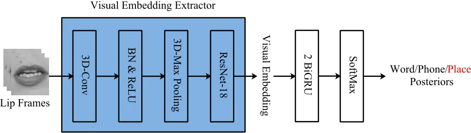
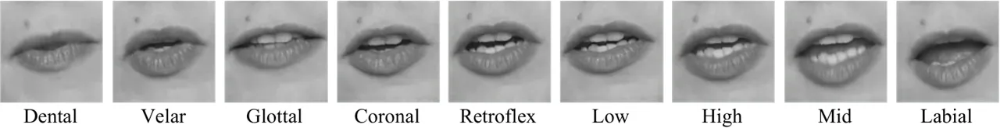
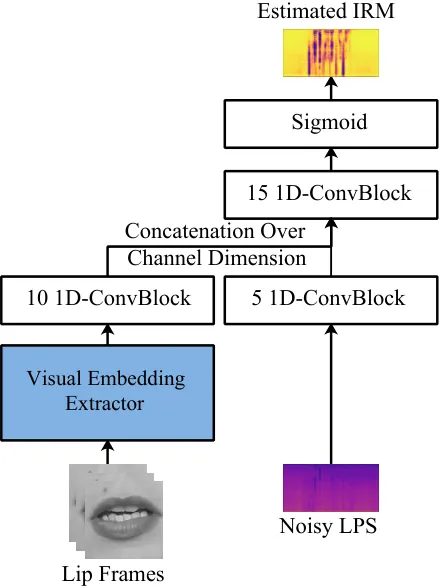
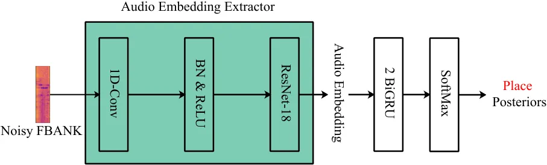
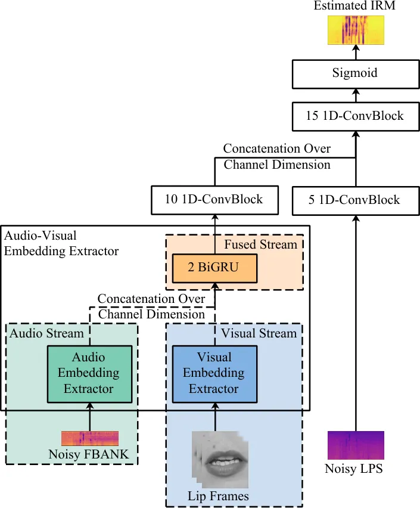
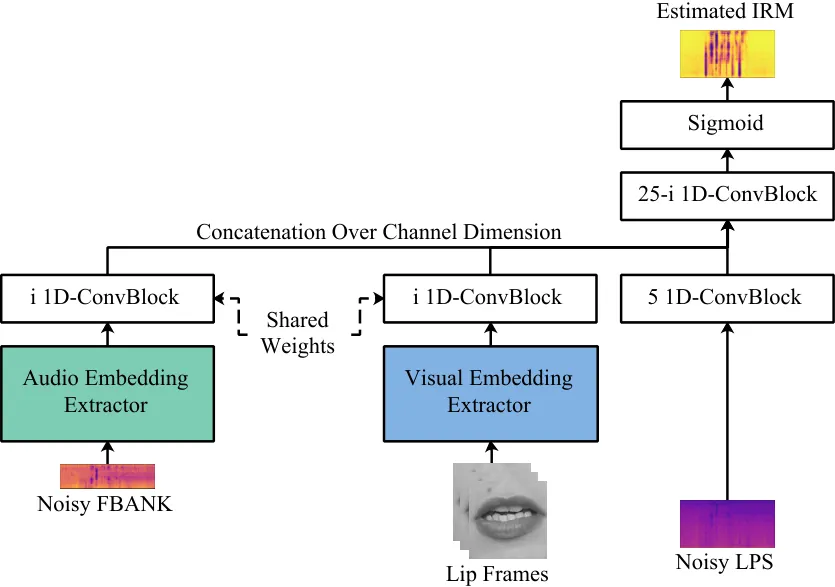
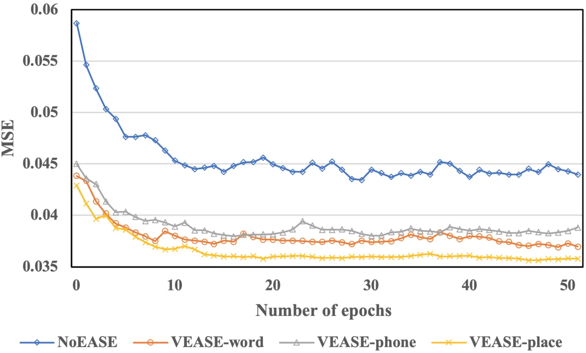
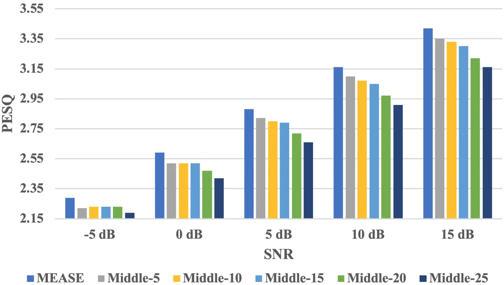
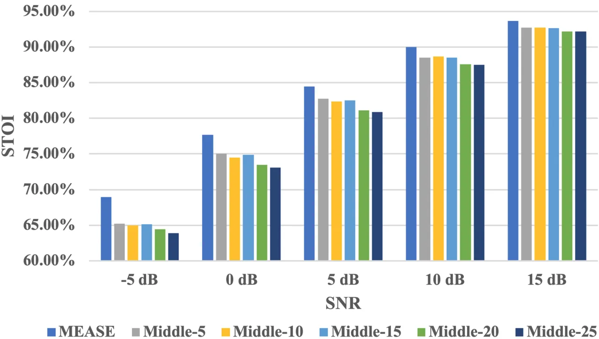

# Correlating Subword Articulation with Lip Shapes for Embedding Aware Audio-Visual Speech Enhancement

Journal: Neural Networks

Hang Chen Address: National Engineering Laboratory for Speech and
Language Information Processing, University of Science and Technology of
China, Hefei, Anhui, China    Jun Du Email: <jundu@ustc.edu.cn>
Corresponding author: Corresponding author Address: National Engineering
Laboratory for Speech and Language Information Processing, University of
Science and Technology of China, Hefei, Anhui, China    Yu Hu
Address: National Engineering Laboratory for Speech and Language
Information Processing, University of Science and Technology of China,
Hefei, Anhui, China    Li-Rong Dai Address: National Engineering
Laboratory for Speech and Language Information Processing, University of
Science and Technology of China, Hefei, Anhui, China    Bao-Cai Yin
Address: iFlytek Research, iFlytek Co., Ltd., Hefei, Anhui, China   
Chin-Hui Lee Address: School of Electrical and Computer Engineering,
Georgia Institute of Technology, Atlanta, GA, USA

###### Abstract

In this paper, we propose a visual embedding approach to improving
embedding aware speech enhancement (EASE) by synchronizing visual lip
frames at the phone and place of articulation levels. We first extract
visual embedding from lip frames using a pre-trained phone or
articulation place recognizer for visual-only EASE (VEASE). Next, we
extract audio-visual embedding from noisy speech and lip videos in an
information intersection manner, utilizing a complementarity of audio
and visual features for multi-modal EASE (MEASE). Experiments on the
TCD-TIMIT corpus corrupted by simulated additive noises show that our
proposed subword based VEASE approach is more effective than
conventional embedding at the word level. Moreover, visual embedding at
the articulation place level, leveraging upon a high correlation between
place of articulation and lip shapes, shows an even better performance
than that at the phone level. Finally the proposed MEASE framework,
incorporating both audio and visual embedding, yields significantly
better speech quality and intelligibility than those obtained with the
best visual-only and audio-only EASE systems.

###### Keywords: 

Speech enhancement, audio-visual, representation learning , deep
learning , universal attribute recognition

## 1 Introduction

Background noises greatly reduce the quality and intelligibility of the
speech signal, limiting the performance of speech-related applications
in real-world conditions (e.g. automatic speech recognition, dialogue
system and hearing aid, etc.). The goal of speech enhancement \[1\] is
to generate enhanced speech with better speech quality and clarity by
suppressing background noise components in noisy speech.

Conventional speech enhancement approaches, such as spectral subtraction
\[2\], Wiener filtering \[3\], minimum mean squared error (MMSE)
estimation \[4\], and the optimally-modified log-spectral amplitude
(OM-LSA) speech estimator \[5, 6\], have been extensively studied in the
past. Recently, deep learning technologies have been successfully used
for speech enhancement \[7, 8, 9\].

Human auditory system can track a single target voice source in
extremely noisy acoustic environment like a cocktail party, as known as
the cocktail party effect \[10\]. This fascinating nature motivates us
to utilize the discovery that humans perceive speech when designing
speech enhancement systems. McGurk effect \[11\] suggests a strong
influence of vision in human speech perception. More researches \[12,
13, 14, 15\] have shown visual cues such as facial/lip movements can
supplement acoustic information of the corresponding speaker, helping
speech perception, especially in noisy environments. Inspired by the
above discoveries, the speech enhancement method utilizing both audio
and visual signals, known as audio-visual speech enhancement (AVSE), has
been developed.

The AVSE methods can be traced back to \[16\] and following work, e.g.
\[17, 18, 19, 20, 21, 22\]. And recently numerous studies have attempted
to build deep neural network-based AVSE models. \[23\] employed a
video-to-speech method to construct T-F masks for speech enhancement. An
encoder-decoder architecture was used in \[24, 25\]. These methods were
merely demonstrated under constrained conditions (e.g. the utterances
consisted of a fixed set of phrases, or a small number of known
speakers). \[26\] proposed a deep AVSE network consisting of the
magnitude and phase sub-networks, which enhanced magnitude and phase,
respectively. \[27\] designed a model that conditioned on the facial
embedding of the source speaker and outputted the complex mask. \[28\]
proposed a time-domain AVSE framework based on Conv-tasnet \[29\]. These
methods all performed well in the situations of unknown speakers and
unknown noise types.

We briefly discuss the above-mentioned AVSE methods from following two
perspectives: visual embedding and audio-visual fusion method. Regrading
to the visual embedding, \[25, 23, 24\] made use of the image sequences
of the lip region. For discarding irrelevant variations between images,
such as illumination, \[27\] proposed using the face embedding obtained
from a pre-trained face recognizer and confirmed through ablation
experiments that the lip area played the most important role for
enhancement performance in the face area. Moreover, \[26, 28\] chose lip
embedding via the middle layer output in a pre-trained isolated word
recognition model.

In recent work, \[30\] adopted the phone as the classification target
instead of isolated word and provided a more useful visual embedding for
speech separation. In the term of audio-visual fusion method, most AVSE
methods focus on audio-visual fusion that happens at the middle layer of
the enhancement network in the fashion of channel-wise concatenation.

We can get some inspirations from these pioneering works. A useful
visual embedding should contain as much acoustic information in the
video as possible. But the acoustic information in video is very
limited, and there is also other information redundancy. In the current
classification-based embedding extracting framework, we can yield a more
robust and generalized visual embedding by reducing the information
redundancy and increasing the correlation between the classification
target and the visual acoustic information. Cutting out the lip area is
helpful for reducing the redundancy. While for the other one, finding a
classification target that is more relevant to lip movements is
informative.

The superset of speech information called speech attributes include a
series of fundamental speech sounds with their linguistic
interpretations, speaker characteristics, and emotional state etc
\[31\]. In contrast to phone models, a smaller number of universal
attribute units are needed for a complete characterization of any spoken
language \[32\]. The set of universal speech attributes used in related
works mainly consist of place and manner of articulation \[33, 34, 35\].
We propose that a higher correlation between the speech attribute and
the visual acoustic information can provide a more useful supervisory
signal in the stage of visual embedding extractor training.

One commonly accepted consensus in multimodal learning is that the data
of each mode obeys an independent distribution conditioned on the ground
truth label \[36, 37, 38, 39\]. Each mode captures features related to
ground truth tags from different aspects, so the information extracted
(labels excluded) is not necessarily related to the other. This shows
that the ground truth can be seen as “information intersection" between
all modes \[40\], i.e., the amount of agreement shared by all the
modalities. Specifically, in AVSE, there is a mismatch between the
information intersection and the ground truth label. The intersection of
audio modal (noisy speech) and video modal (lip video) is not clean
speech which is the ground truth.

In this work, we extend the previous AVSE framework to the embedding
aware speech enhancement (EASE) framework. The conventional AVSE methods
are regarded as special EASE methods, which only utilize visual
embedding extracted from lip frames, as known as visual-only EASE
(VEASE) methods. In EASE framework, we propose a VEASE model using a
novel visual embedding, which is the middle layer output in a
pre-trained universal place recognizer. We have the same dataset in the
stages of the embedding extractor training and the enhancement network
training. A more effective visual embedding is obtained by utilizing a
high correlation between the designed classification target, i.e., the
articulation place, and the visual acoustic information rather than
additional video data. Moreover, we present a novel multimodal EASE
(MEASE) model using multimodal embedding instead of unimodal embedding.
The visual embedding extractor in the VEASE model evolves into
audio-visual embedding extractor in the MEASE model. The enhancement
network takes not only the noisy speech but also the fused audio-visual
embedding as inputs, and outputs a ideal ratio mask. The fusion of audio
and visual embeddings occurs in the stage of embedding extractor
training and is supervised by their information intersection at the
articulation place label level.

The main contributions of this paper are:

1.  1.  We explore the effectiveness of different visual embeddings
        pre-trained for various classification targets on enhancement
        performance. A novel classification target, i.e., the articulation
        place, is proposed for training visual embedding extractor. The
        visual embedding utilizing a high correlation between the
        articulation place and the acoustic information in video achieves
        the better enhancement performance with no additional data used.
2.  2.  We verify the complementarity between audio and visual embeddings
        lies in different SNR levels, as well as different articulation
        places by ablation experiments. And based on the information
        intersection, we adopt a novel fusion method integrating visual and
        audio embeddings in the proposed MEASE model, which achieves better
        performance in all SNR levels and all articulation places.
3.  3.  We design experiments to study the effect of the stage when
        audio-visual fusion occurs on the quality and intelligibility of
        enhanced speech. And we observe that the early fusion of audio and
        visual embeddings achieves the better enhancement performance.

Concurrently and independently from us, a number of groups have proposed
various methods from above two perspectives for AVSE. \[41\] observed
serious performance degradations when these AVSE methods were applied
with a medium or high SNR ¹¹ 1 Performance degradation in \[41\] may
result from the changes in the network structure, but we have indeed
observed reduction in improvements from our results of comparative
experiment, as will be discussed in Section 4.4. and proposed a late
fusion-based approach to safely combine visual knowledge in speech
enhancement. This is the opposite of our work. \[42\] proposed a new
mechanism for audio-visual fusion. In this research, the fusion block
was adaptable to any middle layers of the enhancement network. This kind
of multiple fusion in the enhancement network was better than the
standard single channel-wise concatenation. However, their work differs
ours in that audio-visual integration still occurs in the middle of the
enhancement network.

The rest of the paper is structured as follows. In Section 2 we describe
the proposed VEASE method. The proposed MEASE method is presented in
Section 3. Section 4 has experimental setup including dataset, audio and
video preprocessing as well as compares experimental results. Finally,
we conclude this work and discuss future research directions in Section 5.

## 2 VEASE Model Utilizing Articulation Place Label

In this section, we elaborate our proposed VEASE model, including two
aspects, i.e., architecture and training process. The visual embedding
extractor is an important part of the VEASE model, which takes a
sequence of lip frames as input and outputs a compact vector for every
lip frame, known as visual embedding. The VEASE model takes both noisy
log-power spectra (LPS) features and visual embeddings as inputs, and
outputs ideal ratio mask. The details of the visual embedding extractor
and the VEASE model are elaborated in the following.

### 2.1 Architecture of Visual Embedding Extractor



Figure 1: Illustration of a visual embedding extractor (in color blue
for ease of cross-referencing in Figure 1, Figure 3, Figure 5 and Figure
6). For every lip frame, the extractor outputs a compact vector. We
train visual embedding extractor by using 3 different classification
labels, i.e., word, phone and place.

The visual embedding extractor $`f_{\rm V}`$ has a similar structure to
\[43, 44\], which is also used in previous AVSE studies \[26, 28\]. The
extractor consists of a spatiotemporal convolution followed by an
$`18`$-layer ResNet \[45\] which is the identity mapping version \[46\],
as shown in Figure 1. A spatiotemporal convolution consists of a
convolution layer with $`64`$ 3D-kernels of $`5\times 7\times 7`$
(time/width/height), a batch normalization, a ReLU activation and a
spatiotemporal max-pooling layer.

For a sequence of lip frames
$`V=\{V^{t}\in\mathbb{R}^{H\times W};t=0,1,\dots,T_{\rm V}-1\}`$, the
feature maps is extracted by the spatiotemporal convolution. Then, the
feature maps are passed through the $`18`$-layer ResNet. The spatial
dimensionality shrinks progressively in the ResNet until output becomes
a $`L_{\rm V}`$-dimensional vector per time step, known as the visual
embedding $`E_{\rm V}`$:

```math
\begin{split}E_{\rm V}&=\{E_{\rm V}^{t}\in\mathbb{R}^{L_{\rm V}};t=0,1,\dots,T_{\rm V}-1\}=f_{\rm V}(V)\\
&=\operatorname{ResNet-18}_{\rm V}(\operatorname{MaxPooling_{3D}}(\operatorname{BN}(\operatorname{ReLU}(\operatorname{Conv_{3D}}(V)))))\end{split} \tag{1}
```

where $`T_{\rm V}`$, $`H`$ and $`W`$ denote the number and the size of
lip frames, respectively. In this study, we use $`L_{\rm V}=256`$,
$`H=98`$ and $`W=98`$ by default.

The visual embedding extractor is trained with a classification backend
$`f^{\prime}_{\rm C}`$ in the right side of Figure 1, consisting of a
$`2`$-layer BiGRU, a fully connected layer followed by a SoftMax
activation. The output of the $`E_{\rm V}`$ is fed to
$`f^{\prime}_{\rm C}`$ and the posterior probability of each class
representing each segment of lip frames $`P_{\rm word}`$ is calculated
as follows:

```math
P_{\rm class}=f^{\prime}_{\rm C}(E_{\rm V})=\operatorname{SoftMax}(\operatorname{Mean}(\operatorname{FC}(\operatorname{BiGRU}(\operatorname{BiGRU}(E_{\rm V}))))), \tag{2}
```

where the class can be labeled as word, phone or place of articulation.

### 2.2 Word Based Visual Embedding Extraction

Conventional AVSE techniques \[26, 28\] often obtain the visual
embedding extractor discussed earlier based on an isolated word
classification task by using a lip reading dataset, such as the Lip
Reading in the Wild (LRW).

We build our baseline model, denoted as VEASE-word using the LRW corpus
consisting of up to $`1000`$ audio-visual speech segments extracted from
BBC TV broadcasts (News, Talk Shows, etc.), totaling around $`170`$
hours. There are $`500`$ target words and more than $`200`$ speakers.
The LRW dataset provides a word-level label for each audio-visual speech
segment, i.e., the real distribution of word
$`P_{\rm word}^{\rm truth}`$. We calculate the cross entropy (CE) loss
$`\mathcal{L}_{\rm CE}`$ between $`P_{\rm word}^{\rm truth}`$ and
$`P_{\rm word}`$:

```math
\mathcal{L}_{\rm CE}=\operatorname{CE}(P_{\rm word}^{\rm truth}\|P_{\rm word})=-\sum{P_{\rm word}^{\rm truth}\log P_{\rm word}}. \tag{3}
```

The objective function, $`\mathcal{L}_{\rm CE}`$, is minimized by using
Adam optimizer \[47\] for $`100`$ epochs and the mini-batch size is set
to $`64`$. The initial learning rate is set to $`0.0003`$ and is
decreased on log scale after $`30`$ epochs. Data augmentation is
performed during training, by applying random cropping ($`\pm 5`$
pixels) and horizontal flips, which is the same across all lip frames of
a sequence. The best model is selected by the highest frame-level
classification accuracy.

### 2.3 Phone Based Visual Embedding Extraction

The isolated word classification task usually requires a word-level
dataset which is not easy to collect in a large scale effort. To
alleviate this problem, we propose that the same data is used during
training visual embedding extractor and enhancement network with
different labels. Under the guidance of results in \[30\], we choose
context-independent (CI) phones consisting of $`39`$ units from CMU
dictionary as classification labels, denoted as VEASE-phone.

$`E_{\rm V}`$ is fed to a classification backend $`f_{\rm C}`$ which has
a same structure as $`f^{\prime}_{\rm C}`$ and outputs the posterior
probability of each CI-phone for each specific time frame
$`P_{\rm phone}=f_{\rm C}(E_{\rm V})=\operatorname{SoftMax}(\operatorname{FC}(\operatorname{BiGRU}(\operatorname{BiGRU}(E_{\rm V}))))`$.

The TCD-TIMIT dataset is a high quality audio-visual speech corpus
labeled at both the phonetic and the word level. We can directly get the
frame-level real distribution of CI-phone $`P_{\rm phone}^{\rm truth}`$.
The calculation of $`\mathcal{L}_{\rm CE}`$ between
$`P_{\rm phone}^{\rm truth}`$ and $`P_{\rm phone}`$ is similar to
Equation (3):

```math
\mathcal{L}_{\rm CE}=\operatorname{CE}(P_{\rm phone}^{\rm truth}\|P_{\rm phone})=-\sum{P_{\rm phone}^{\rm truth}\log P_{\rm phone}} \tag{4}
```

We use the same optimization process as in Section 2.2 to minimize
$`\mathcal{L}_{\rm CE}`$.

### 2.4 Articulation Place Based Visual Embedding Extraction



Figure 2: 9 lip shapes corresponding to utterance segments representing
9 articulation positions: all lip shapes come from a single speaker
starting with the lip closed. The lip shape changes greatly in High, Mid
and Labial than Dental, Velar and Glottal.

As discussed earlier, we believe there is a high correlation between
speech attributes and visual acoustic information. In order to verify
our idea, we check the lip shapes belonging to different places and
manners of articulation. We find that the influences of various
articulation places on the change of lip shape are different, i.e., the
lip shape changes greatly in some utterance segments belonging to
specific articulation place. An example is presented in Figure 2. In
contrast, we do not observe similar changes in the term of articulation
manner. Consequently we propose to train visual embedding extractor with
the articulation place label in this study, denoted as VEASE-place. We
adopt 10 units as in \[48, 49\] for articulation place set.

Compared with the phone, the category granularity of articulation place
is coarser. Thus, the classification model can achieve comparable
performance with lower complexity. And the articulation place has fewer
categories, which reduces the labeling costs. Moreover, the articulation
place label is believe to be more language-independent than phones,
which allows various languages to appear in training and testing.

The same classification backend $`f_{\rm C}`$ takes $`E_{\rm V}`$ as
input and outputs the posterior probability of each articulation place
class for each specific time frame $`P_{\rm place}`$.

|    Articulation place classes |    CI-phones                     |
| ----------------------------- | -------------------------------- |
|    Coronal                    |    d, l, n, s, t, z              |
|    High                       |    ch, ih, iy, jh, sh, uh, uw, y |
|    Dental                     |    dh, th                        |
|    Glottal                    |    hh                            |
|    Labial                     |    b, f, m, p, v, w              |
|    Low                        |    aa, ae, aw, ay, oy            |
|    Mid                        |    ah, eh, ey, ow                |
|    Retroflex                  |    er, r                         |
|    Velar                      |    g, k, ng                      |
|    Silence                    |    sil                           |

Table 1: The mapping between articulation place classes and CI-phones as
in \[48\].

$`P_{\rm phone}^{\rm truth}`$ is mapped into the frame-level real
distribution of articulation place $`P_{\rm place}^{\rm truth}`$ by
using Table 1. $`\mathcal{L}_{\rm CE}`$ between
$`P_{\rm place}^{\rm truth}`$ and $`P_{\rm place}`$ is calculated as
follows:

```math
\mathcal{L}_{\rm CE}=\operatorname{CE}(P_{\rm place}^{\rm truth}\|P_{\rm place})=-\sum{P_{\rm place}^{\rm truth}\log P_{\rm place}} \tag{5}
```

The optimization process to minimize $`\mathcal{L}_{\rm CE}`$ is same as
in that in Section 2.2.

### 2.5 VEASE Model



Figure 3: Illustration of the VEASE model. The VEASE model takes the
visual embeddings as the auxiliary inputs except regular noisy LPS
features. The visual embedding extractor is pre-trained separately with
classification backend, following the steps introduced in the
above-mentioned sections. In the training of the VEASE model, the visual
embedding extractor is kept frozen.

The VEASE model consists of three stacks of 1D-ConvBlocks and a frozen
visual embedding extractor, as shown in Figure 3. Each 1D-ConvBlock
includes a 1D convolution layer with a residual connection, a ReLU
activation, and a batch normalization, as in \[26\]. Some of the blocks
contain an extra up-sampling or down-sampling layer, because the number
of audio frames is different from that of the video frames.

Visual embedding $`E_{\rm V}`$ is processed by the stack $`s_{\rm E}`$
at the bottom left consisting of $`N_{\rm E}`$ 1D-ConvBlocks while noisy
log-power spectra (LPS) features
$`A_{\rm LPS}=\{A^{t}_{\rm LPS}\in\mathbb{R}^{F};t=0,1,\dots,T_{\rm A}-1\}`$
are processed by the stack $`s_{\rm LPS}`$ at the bottom right
consisting of $`N_{\rm LPS}`$ 1D-ConvBlocks:

```math
\displaystyle R_{\rm E} \displaystyle=s_{\rm E}(E_{\rm V})=\overbrace{\operatorname{ConvBlock_{1D}}(\cdots\operatorname{ConvBlock_{1D}}(E_{\rm V}))}^{N_{\rm E}} \tag{6}
```

```math
\displaystyle R_{\rm LPS} \displaystyle=s_{\rm LPS}(A_{\rm LPS})=\overbrace{\operatorname{ConvBlock_{1D}}(\cdots\operatorname{ConvBlock_{1D}}(A_{\rm LPS}))}^{N_{\rm LPS}} \tag{7}
```

where $`T_{\rm A}`$ and $`F`$ denote the number of time frames and
frequency bins for spectrogram, respectively. $`R_{\rm E}`$ and
$`R_{\rm LPS}`$ denote outputs of different stacks.

The $`R_{\rm E}`$ and $`R_{\rm LPS}`$ are then concatenated along the
channel dimension and fed to the top stack $`s_{\rm F}`$ consisting of
$`N_{\rm F}`$ 1D-ConvBlocks. The last convolution layer in the top stack
projects the output’s dimension into the same one of noisy magnitude
spectrogram. Then, the hidden representation is activated by a sigmoid
activation to obtain a magnitude mask
$`M\in\mathbb{R}^{T_{\rm A}\times F}`$:

```math
\begin{split}M&=\sigma(s_{\rm F}([R_{\rm E},R_{\rm LPS}]))\\
&=\sigma(\overbrace{\operatorname{ConvBlock_{1D}}(\cdots\operatorname{ConvBlock_{1D}}([R_{\rm E},R_{\rm LPS}]))}^{N_{\rm F}})\end{split} \tag{8}
```

The values of $`M`$ range from 0 to 1. In this study, we use
$`N_{\rm E}=10`$, $`N_{\rm LPS}=5`$ and $`N_{\rm F}=15`$ by default.

To show the effectiveness of embedding on enhancement performance, we
also design a competitive no-embedding version of the EASE model which
is stripped of the stack $`s_{\rm E}`$ at the bottom left and the frozen
visual embedding extractor, denoted as NoEASE model. The NoEASE model
computes $`M`$ only using the noisy LPS features as inputs:

```math
\displaystyle M=\sigma(s_{\rm F}(s_{\rm LPS}(A_{\rm LPS}))) \tag{9}
```

The ideal ratio mask (IRM) \[50\] is employed as the learning target,
which is widely used in monaural speech enhancement \[51\]. IRM
$`M_{\rm IRM}\in\mathbb{R}^{T_{\rm A}\times F}`$ is calculated as
follows:

```math
M_{\rm IRM}=\left(\frac{C_{\rm PS}}{C_{\rm PS}+D_{\rm PS}}\right)^{\frac{1}{2}} \tag{10}
```

where $`C_{\rm PS}\in\mathbb{R}^{T_{\rm A}\times F}`$ and
$`D_{\rm PS}\in\mathbb{R}^{T_{\rm A}\times F}`$ denote power
spectrograms of clean speech and noise, respectively.

The mean square error (MSE) $`\mathcal{L}_{\rm MSE}`$ between $`M`$ and
$`M_{\rm IRM}`$ is calculated as the loss function:

```math
\mathcal{L}_{\rm MSE}=\operatorname{MSE}(M,M_{\rm IRM})=\sum\|M-M_{\rm IRM}\|^{2}_{2} \tag{11}
```

We use Adam optimizer to train for $`100`$ epochs with early stopping
when there is no improvement on the validation loss for $`10`$ epochs.
The batch size is $`96`$. Initial learning rate is set to $`0.0001`$,
which is found by “LR range test" proposed in \[52\], and halved during
training if there is no improvement for $`3`$ epochs on the validation
loss. The best model is selected by the lowest validation loss.

## 3 Proposed MEASE Model

In this section, we elaborate our proposed MEASE model. The MEASE model
takes the fused audio-visual embedding as the auxiliary input instead of
the visual embedding. As described in Section 1, the MEASE model
utilizing a complementarity of audio and visual features in an
information intersection manner. In order to verify the complementarity
between audio and visual embeddings, we design an EASE model that
utilizes the audio embedding, denoted as AEASE model. The AEASE model
has a similar structure to the VEASE model with the main difference of
employing an audio embedding extractor instead of the visual embedding
extractor. For verifying the effectiveness of the information
intersection-based audio-visual fusion manner on enhancement
performance, we design an EASE model that utilizes the concatenation of
audio and visual embeddings, denoted as cMEASE model. The details of the
AEASE model, the MEASE model and the cMEASE model are elaborated in the
following.

### 3.1 AEASE model



Figure 4: Illustration of a audio embedding extractor (in color green
for ease of cross-referencing in Figure 4, Figure 5 and Figure 6). The
audio embedding extractor has the similar structure as the visual
embedding extractor in Section 2.1. The training of the audio embedding
extractor is same as that in Section 2.4.

The AEASE model has a similar structure to the VEASE model as shown in
Figure 3, with the main difference of employing a audio embedding
extractor, instead of the visual embedding extractor.

The audio embedding extractor $`f_{\rm A}`$ has a similar structure as
the visual embedding extractor in Section 2.1, as shown in Figure 4. The
3D-kernels in the spatiotemporal convolution are replaced by 1D-kernels
meanwhile the 3D-MaxPooling layer is dropped in this case as the audio
frame is a vector. We also use the ResNet-18 with the main difference of
employing 1D-kernels instead of 2D-kernels. Given noisy FBANK features
$`A_{\rm FBANK}\in\mathbb{R}^{T_{\rm A}\times F_{\rm mel}}`$, the audio
embeddings $`E_{\rm A}\in\mathbb{R}^{T_{\rm A}\times L_{\rm A}}`$ are
calculated as follows:

```math
\begin{split}E_{\rm A}&=\{E^{t}_{\rm A}\in\mathbb{R}^{L_{\rm A}};t=0,1,\dots,T_{\rm A}-1\}=f_{\rm A}(A_{\rm FBANK})\\
&=\operatorname{ResNet-18_{A}}(\operatorname{BN}(\operatorname{ReLU}(\operatorname{Conv_{1D}}(A_{\rm FBANK}))))\end{split} \tag{12}
```

where, $`F_{\rm mel}`$ and $`L_{\rm A}`$ are the number of triangular
filters set for FBANK features and the length of $`E^{t}_{\rm A}`$,
respectively. In this study, $`L_{\rm A}=L_{\rm V}=256`$ is used by
default.

We use the same training process to train the audio embedding extractor
as training the visual embedding extractor in Section 2.4. Adam
optimizer is used to minimize $`\mathcal{L}_{\rm CE}`$, which is
calculated by Equation (5). But $`P_{\rm place}`$ is computed by using
$`E_{\rm A}`$:

```math
P_{\rm place}=f_{C}(E_{\rm A}) \tag{13}
```

The AEASE model takes both $`A_{\rm LPS}`$ and $`E_{\rm A}`$ as inputs
and outputs $`M`$:

```math
\displaystyle M=\sigma(s_{\rm F}([s_{\rm E}(E_{\rm A}),s_{\rm LPS}(A_{\rm LPS})])) \tag{14}
```

The same optimization process as in Section 2.5 is also used to minimize
$`\mathcal{L}_{\rm MSE}`$, which is calculated by Equation (11).

### 3.2 MEASE Model



Figure 5: Illustration of the proposed MEASE model. The pervious visual
embedding extractor evolves to the audio-visual embedding extractor,
which consists of a visual stream (in blue), an audio stream (in green)
and a fused stream (in orange). The audio-visual embedding extractor
fuse the audio and visual embeddings in an information intersection
manner.

The most significant change in the MEASE model is that the visual
embedding extractor evolves into the audio-visual embedding extractor.
The audio-visual embedding extractor takes not only lip frames but also
noisy FBANK features as inputs and outputs the fused audio-visual
embedding which is learned under the supervision of the information
intersection, i.e., the articulation place label.

The audio-visual embedding extractor consists of visual, audio and fused
streams, as shown at the bottom left part of Figure 5. The visual stream
has the same structure as the visual embedding extractor in Section 2.1
while the audio stream has the same structure as the audio embedding
extractor in Section 3.1. $`V`$ and $`A_{\rm FBANK}`$ are processed by
visual and audio streams, respectively:

```math
\displaystyle E^{\rm V}_{\rm AV} \displaystyle=f_{\rm V}(V) \tag{15}
```

```math
\displaystyle E^{\rm A}_{\rm AV} \displaystyle=f_{\rm A}(A_{\rm FBANK}) \tag{16}
```

where $`E^{\rm V}_{\rm AV}\in\mathbb{R}^{T_{\rm V}\times L_{\rm V}}`$
and $`E^{\rm A}_{\rm AV}\in\mathbb{R}^{T_{\rm A}\times L_{\rm A}}`$
denotes the outputs of visual and audio streams, respectively. The
mismatch in the number of frames between $`E^{\rm V}_{\rm AV}`$ and
$`E^{\rm A}_{\rm AV}`$, i.e., $`T_{\rm A}\neq T_{\rm V}`$, is solved by
repeating a video frame for several audio frames:

```math
\tilde{E}^{\rm V}_{\rm AV}=\{\overbrace{E^{{\rm V},0}_{\rm AV},\cdots,E^{{\rm V},0}_{\rm AV}}^{T_{\rm A}/T_{\rm V}},E^{{\rm V},1}_{\rm AV}\cdots\} \tag{17}
```

The fused stream consisting of a $`2`$-layers BiGRU at the top takes
$`\tilde{E}^{\rm V}_{\rm AV}`$ and $`E^{\rm A}_{\rm AV}`$ as inputs and
outputs the audio-visual embedding
$`E_{\rm AV}\in\mathbb{R}^{T_{\rm A}\times L_{\rm AV}}`$:

```math
E_{\rm AV}=\{E^{t}_{\rm AV};t=0,1,\cdots,T_{\rm A}-1\}=\operatorname{BiGRU}(\operatorname{BiGRU}([\tilde{E}^{\rm V}_{\rm AV},E^{\rm A}_{\rm AV}])) \tag{18}
```

where $`L_{\rm AV}`$ is the length of $`E^{t}_{\rm AV}`$. In this paper,
we use $`L_{\rm AV}=L_{\rm A}+L_{\rm V}=512`$ by default.

We also use the same steps to minimize $`\mathcal{L}_{\rm CE}`$, which
is calculated by Equation (5), as these in Section 2.4. But
$`P_{\rm place}`$ is computed by using $`E_{\rm AV}`$:

```math
P_{\rm place}=f_{C}(E_{\rm AV}) \tag{19}
```

It is a remarkable fact that the audio-visual classification model can
achieve a better and faster convergence, by initializing visual and
audio streams with the independently pre-trained params.

The MEASE model takes both $`A_{\rm LPS}`$ and $`E_{\rm AV}`$ as inputs
and outputs $`M`$:

```math
\displaystyle M=\sigma(s_{\rm F}([s_{\rm E}(E_{\rm AV}),s_{\rm LPS}(A_{\rm LPS})])) \tag{20}
```

We use the same optimization process as in Section 2.5 to minimize
$`\mathcal{L}_{\rm MSE}`$, which is calculated by Equation (11).

### 3.3 cMEASE Model

By ablating the fused stream in Figure 5, another audio-visual
embedding,
$`cE_{\rm AV}\in\mathbb{R}^{T_{\rm A}\times(L_{\rm A}+L_{\rm V})}`$,
which is the concatenation of audio and visual embeddings, is designed:

```math
cE_{\rm AV}=[E_{\rm V},E_{\rm A}]=[f_{\rm V}(V),f_{\rm A}(A_{\rm FBANK})] \tag{21}
```

where $`f_{\rm A}`$ and $`f_{\rm V}`$ are trained independently,
following the steps introduced in Section 3.1 and Section 2.4,
respectively.

The cMEASE model takes both $`A_{\rm LPS}`$ and $`cE_{\rm AV}`$ as
inputs and outputs $`M`$:

```math
\displaystyle M=\sigma(s_{\rm F}([s_{\rm E}(cE_{\rm AV}),s_{\rm LPS}(A_{\rm LPS})])) \tag{22}
```

We use the same optimization process as in Section 2.5 to minimize
$`\mathcal{L}_{\rm MSE}`$, which is calculated by Equation (11).

### 3.4 Fusion Stage of Audio and Visual Embeddings



Figure 6: Illustration of the MEASE model with different fusion stages
of audio and visual embeddings.

To study the effect of the audio-visual fusion stage on enhancement
performance, we design a MEASE model that fuses visual and audio
embeddings at the $`i`$-th layer of the enhancement network, denoted as
Middle-i model, as shown in Figure 6. We change $`N_{\rm E}`$ with the
fixed sum of $`N_{\rm E}`$ and $`N_{\rm F}`$ and use the same stack to
process audio and visual embeddings, respectively:

```math
\displaystyle R_{E_{\rm V}}= \displaystyle s_{\rm E}(E_{\rm V})=\overbrace{\operatorname{ConvBlock_{1D}}(\cdots\operatorname{ConvBlock_{1D}}(E_{\rm V}))}^{N_{\rm E}=i} \tag{23}
```

```math
\displaystyle R_{E_{\rm A}}= \displaystyle s_{\rm E}(E_{\rm A})=\overbrace{\operatorname{ConvBlock_{1D}}(\cdots\operatorname{ConvBlock_{1D}}(E_{\rm A}))}^{N_{\rm E}=i} \tag{24}
```

```math
\displaystyle R_{\rm LPS}= \displaystyle s_{\rm LPS}(A_{\rm LPS})=\overbrace{\operatorname{ConvBlock_{1D}}(\cdots\operatorname{ConvBlock_{1D}}(A_{\rm LPS}))}^{N_{\rm LPS}} \tag{25}
```

```math
\displaystyle\begin{split}M=&\sigma(s_{\rm F}([R_{E_{\rm V}},R_{E_{\rm A}},R_{\rm LPS}]))\\
=&\sigma(\overbrace{\operatorname{ConvBlock_{1D}}(\cdots\operatorname{ConvBlock_{1D}}([R_{E_{\rm V}},R_{E_{\rm A}},R_{\rm LPS}]))}^{N_{\rm F}=25-i})\end{split} \tag{26}
```

where $`s_{\rm E}(\cdot)`$ in Equation (23) has the same params as that
in Equation (24), as well as $`E_{\rm A}`$ and $`E_{\rm V}`$ are
extracted by using $`f_{\rm A}`$ and $`f_{\rm V}`$ trained
independently. By modifying the value of $`i`$, we can make the fusion
take places at different stages without changing the network structure.

## 4 Experiments

### 4.1 Dataset

To evaluate the performance of our proposed method, we created a
simulation dataset of noisy speech based on the TCD-TIMIT audio-visual
corpus \[53\]. The TCD-TIMIT consisted of $`59`$ volunteer speakers with
around $`98`$ videos each, as well as $`3`$ lipspeakers who specially
were trained to speak in a way that helped the deaf understand their
visual speech. The speakers were recorded saying various sentences from
the TIMIT corpus \[54\] by using both front-facing and $`30`$-degree
cameras. However, the utterances of $`3`$ lipspeakers and $`30`$-degree
videos were not used in this paper. For testing the robustness to unseen
speaker condition, we divided these videos and audios into a
_train-clean_ set which consisted of $`57`$ speakers ($`31`$ male and
$`26`$ female) and a _test-clean_ set which consisted of $`2`$ speakers
($`1`$ male and $`1`$ female) who were not in the _train-clean_ set.

We chose the TCD-TIMIT dataset for two main reasons:

1.  1.  TCD-TIMIT was recorded in a controlled environment, and provided
        near-field signals collected by a microphone close to the mouth,
        which can ensure that the utterances do not contain background
        noise. While other large-scale in-the-wild audio-visual datasets,
        such as BBC-Oxford LipReading Sentences 2 (LRS2) dataset \[55\],
        AVSpeech dataset \[27\], etc, were collected from real-world sources
        using automated pipeline, and none of them was checked whether
        background noise exists.²² 2 We manually listen to the test and
        verification sets of the LRS2 dataset. We find more than half of
        sentences can be clearly perceived as noisy. When testing an
        enhancement system, if the ground truth contains background noise,
        the metrics will be severely distorted and cannot well measure the
        performance of the system.
2.  2.  The utterances consisted of various phrases in the TCD-TIMIT
        dataset, thus they were more suitable for actual scenarios than the
        utterances consisting of a fixed set of phrases in the GRID dataset
        \[56\]. The TCD-TIMIT dataset also contained phonetic-level
        transcriptions, which provided available labels for the embedding
        extractor training.

A total of $`115`$ noise types, including $`100`$ noise types in \[57\]
and $`15`$ homemade noise types, were adopted for training to improve
the robustness to unseen noise types. The $`5600`$ utterances from
_train-clean_ set were corrupted with the above-mentioned $`115`$ noise
types at five levels of SNRs, i.e., $`15`$ dB, $`10`$ dB, $`5`$ dB,
$`0`$ dB and $`-5`$ dB, to build an $`35`$-hour multi-condition training
set consisting of pairs of clean and noisy utterances. The other $`43`$
utterances from _train-clean_ set were corrupted with $`3`$ unseen noise
types at above-mentioned SNR levels to build a validation set, i.e.,
Destroyer Operations, Factory2 and F-16 Cockpit. The $`198`$ utterances
from _test-clean_ set were used to construct a test set for each
combination of $`3`$ other unseen noise type and above SNR levels, i.e.,
Destroyer Engine, Factory1 and Speech Babble. All unseen noise were
collected from the NOISEX-92 corpus \[58\]. The five levels of SNRs in
the training set were also adopted for testing and validating.

For audio preprocessing, all speech signals were resampled to $`16`$
kHz. A $`400`$-point short-time Fourier transform was used to compute
the spectra of each overlapping windowed frame. Here, a $`25`$-ms
Hanning window and a $`10`$-ms window shift were adopted. In our
experiments, $`201`$-dimensional LPS vectors were generated to train the
enhancement network and $`40`$-dimensional FBANK vectors were generated
to train the embedding extractor, i.e., $`F=201,F_{\rm mel}=40`$. Mean
and variance normalizations were applied to the noisy LPS and FBANK
vectors.

For video preprocessing, a given video clip was downsampled from
$`29.97`$ fps to $`25`$ fps, i.e., $`T_{A}=4\times T_{V}`$. For every
video frame, $`68`$ facial landmarks were extracted by using Dlib \[59\]
implementation of the face landmark estimator described in \[60\], then
we cropped a lip-centered window of size $`98\times 98`$ pixels by using
the $`20`$ lip landmarks from the $`68`$ facial landmarks. The frames
were transformed to grayscale and normalized with respect to the overall
mean and variance.

### 4.2 Evaluation Protocol

In this experiment, we mainly adopt Perceptual Evaluation of Speech
Quality (PESQ) \[61\] and Short-Time Objective Intelligibility (STOI)
\[62\] to evaluate models. Both metrics are commonly used to evaluate
the performance of speech enhancement system. PESQ, which is a speech
quality estimator, is designed to predict the mean opinion score of a
speech quality listening test for certain degradations. Moreover, to
show the improvement in speech intelligibility, we also calculated STOI.
The STOI score is typically between $`0`$ and $`1`$, and the PESQ score
is between $`-0.5`$ and $`4.5`$. For both metrics, higher scores
indicate better performance.

### 4.3 Results of VEASE Models Utilizing Different Visual Embeddings



Figure 7: A comparison of learning curves among NoEASE, VEASE-word
(LRW), VEASE-phone and VEASE-place on the validation set.

| Model       | PESQ     |      |      |      |      | STOI(in %) |       |       |       |       |
| ----------- | -------- | ---- | ---- | ---- | ---- | ---------- | ----- | ----- | ----- | ----- |
| SNR(in dB)  | -5       | 0    | 5    | 10   | 15   | -5         | 0     | 5     | 10    | 15    |
| Noisy       | $`1.70`$ | 1.97 | 2.26 | 2.56 | 2.86 | 54.34      | 65.11 | 75.33 | 84.48 | 90.88 |
| NoEASE      | 2.07     | 2.34 | 2.64 | 2.92 | 3.21 | 58.79      | 70.29 | 80.24 | 87.83 | 92.57 |
| VEASE-word  | 2.16     | 2.45 | 2.72 | 2.99 | 3.25 | 66.26      | 75.11 | 82.57 | 88.75 | 92.98 |
| VEASE-phone | 2.14     | 2.42 | 2.69 | 2.96 | 3.23 | 66.29      | 74.89 | 82.22 | 88.45 | 92.79 |
| VEASE-place | 2.21     | 2.47 | 2.73 | 3.00 | 3.26 | 66.57      | 75.27 | 82.64 | 88.80 | 92.96 |

Table 2: Average performance comparison of VEASE models with different
visual embeddings on the test set at different SNRs averaged over 3
unseen noise types.

In Section 2, we proposed two VEASE models with different visual
embeddings, i.e., VEASE-phone and VEASE-place. To compare their
effectiveness with the baseline model, i.e., VEASE-word (LRW), on
enhancement performance, a series of experiments were conducted for the
unprocessed system denoted as Noisy, NoEASE, VEASE-word (LRW),
VEASE-phone and VEASE-place. We present the learning curves of the MSEs
among NoEASE, VEASE-word (LRW) and VEASE-phone and VEASE-place on the
validation set in Figure 7. The corresponding evaluation metrics are
shown in Table 2. We evaluate the average performance of two measures at
different SNRs across $`3`$ unseen noise types.

Based on Figure 7 and Table 2, we find following observations.

1.  1.  The learning curves of the MSEs indicate that all VEASE models
        consistently generate smaller MSEs on the validation set than
        NoEASE. This result implies that the visual embedding is useful for
        speech enhancement. As shown in Table 2, all VEASE models yield
        improvements in PESQ and STOI over NoEASE in all SNRs. In
        particular, the improvement is more significant at low SNRs cases.
2.  2.  VEASE-word (LRW) consistently yields smaller MSE values and a slower
        convergence than VEASE-phone. This implies that the visual embedding
        in VEASE-word (LRW) is more useful but slow-fit for speech
        enhancement. In VEASE-word (LRW), visual embedding extractor is
        trained with a large amount of additional data, so it can obtain
        better generalization ability and provide visual embedding with more
        information. On the other side, the data mismatch between embedding
        learning and enhancement task brings information redundancy, which
        leads to a slower convergence. This observation is consistent with
        the comparison of the objective evaluation metrics on the test set
        shown in Table 2. And VEASE-phone does not perform better than
        VEASE-word (LRW) in any evaluation metrics.
3.  3.  VEASE-place clearly achieves a better and faster convergence than
        VEASE-phone and VEASE-word (LRW). This implies that VEASE-place
        provides more useful and quick-fit visual embedding for speech
        enhancement. By comparing the evaluation metrics in Table 2, we also
        observe that VEASE-place not only yields remarkable gains over
        VEASE-phone across all evaluation metrics and all SNR levels, but
        also outperforms VEASE-word (LRW) in most cases with only one
        exception for the STOI at $`15`$ dB SNR. And in that exceptional
        situation, the results are still close. These results suggest that
        our proposed VEASE-place model achieves a better generalization
        capability, while reducing mismatch between embedding learning and
        enhancement task.

Overall, the high correlation between the articulation place label and
the acoustic information in video is beneficial to the extraction of
visual embedding, which is useful for speech enhancement, even if no
requirement of additional data. Therefore, we select articulation place
as the default classification target in all subsequent experiments and
use VEASE to refer to VEASE-place in all subsequent sections.

### 4.4 Results of Proposed MEASE Model

| Model      | PESQ |      |      |      |      | STOI(in %) |       |       |       |       |
| ---------- | ---- | ---- | ---- | ---- | ---- | ---------- | ----- | ----- | ----- | ----- |
| SNR(in dB) | -5   | 0    | 5    | 10   | 15   | -5         | 0     | 5     | 10    | 15    |
| NoEASE     | 2.07 | 2.34 | 2.64 | 2.92 | 3.21 | 58.79      | 70.29 | 80.24 | 87.83 | 92.57 |
| VEASE      | 2.21 | 2.47 | 2.73 | 3.00 | 3.26 | 66.57      | 75.27 | 82.64 | 88.80 | 92.96 |
| AEASE      | 2.09 | 2.39 | 2.69 | 2.98 | 3.27 | 60.84      | 72.24 | 81.58 | 88.39 | 92.76 |
| cMEASE     | 2.27 | 2.55 | 2.81 | 3.08 | 3.34 | 67.60      | 76.26 | 83.26 | 89.13 | 93.12 |
| MEASE      | 2.29 | 2.59 | 2.88 | 3.16 | 3.42 | 68.96      | 77.64 | 84.43 | 89.99 | 93.64 |

Table 3: Average performance comparison of NoEASE model, VEASE model,
AEASE model, cMEASE model and MEASE model on the test set at different
SNRs averaged over 3 unseen noise types.

In this section, the goal is to examine the effectiveness of the
proposed MEASE model on enhancement performance, and obtain a better
understanding about the contribution of different parts of the MESAE
model. We present an average performance comparison between NoEASE,
VEASE, AEASE, cMEASE and MEASE in Table 3.

Paying attention to the last row in Table 3, we can observe that MEASE
shows significant improvements over VEASE across all evaluation metrics,
and larger gains are observed at high SNRs. By comparing the results of
VEASE with NoEASE, the improvement yielded by visual embedding decreases
as SNR increases, for example, the PESQ of VEASE increased from $`2.07`$
to $`2.21`$ at $`-5`$ dB SNR and from $`3.21`$ to $`3.26`$ at $`15`$ dB
SNR. This observation is consistent with that in \[41\]. In contrast,
MEASE shows stable improvements over NoEASE for high SNRs. For example,
the PESQ of MEASE increased from $`2.07`$ to $`2.29`$ at $`-5`$ dB SNR
and from $`3.21`$ to $`3.42`$ at $`15`$ dB SNR. All these results
indicate that MEASE is more robust against the change of noise level and
yields better generalization capability than VEASE.

Table 3 also shows the results of AEASE. By comparing its results with
NoEASE, we can observe that the improvement yielded by audio embedding
increases as SNR grows, for example, the PESQ of AEASE increased from
$`2.07`$ to $`2.09`$ at $`-5`$ dB SNR and from $`3.21`$ to $`3.27`$ at
$`15`$ dB SNR. This suggest that the complementarity between audio and
visual embeddings lies in the variation tendencies of metric improvement
with respect to SNR level. But directly comparing AEASE and VEASE on the
evaluation metrics as shown in Table 3, we can not observe that AEASE
performs better than VEASE at high SNRs, i.e., $`\operatorname{SNR}=5`$,
$`10`$ and $`15`$ dB, especially at $`5`$ dB SNR.

| SNR(in dB)                                                                                                                                                                                                                                                                                                                                                                                                                                                                                                                                                                                              | -5     |       |       |       | 0      |       |       |       | 5      |       |       |       |
| ------------------------------------------------------------------------------------------------------------------------------------------------------------------------------------------------------------------------------------------------------------------------------------------------------------------------------------------------------------------------------------------------------------------------------------------------------------------------------------------------------------------------------------------------------------------------------------------------------- | ------ | ----- | ----- | ----- | ------ | ----- | ----- | ----- | ------ | ----- | ----- | ----- |
|  | NoEASE | AEASE | VEASE | MEASE | NoEASE | AEASE | VEASE | MEASE | NoEASE | AEASE | VEASE | MEASE |
| Labial                                                                                                                                                                                                                                                                                                                                                                                                                                                                                                                                                                                                  | 1.28   | 1.38  | 1.58  | 1.76  | 1.57   | 1.75  | 1.81  | 2.06  | 2.05   | 2.18  | 2.23  | 2.50  |
| Mid                                                                                                                                                                                                                                                                                                                                                                                                                                                                                                                                                                                                     | 1.54   | 1.68  | 1.86  | 2.02  | 2.03   | 2.21  | 2.29  | 2.45  | 2.58   | 2.72  | 2.73  | 2.96  |
| High                                                                                                                                                                                                                                                                                                                                                                                                                                                                                                                                                                                                    | 1.38   | 1.52  | 1.65  | 1.81  | 1.79   | 1.95  | 1.99  | 2.17  | 2.28   | 2.39  | 2.42  | 2.62  |
| Low                                                                                                                                                                                                                                                                                                                                                                                                                                                                                                                                                                                                     | 1.63   | 1.89  | 2.00  | 2.29  | 2.17   | 2.48  | 2.46  | 2.69  | 2.84   | 2.99  | 2.93  | 3.20  |
| Retroflex                                                                                                                                                                                                                                                                                                                                                                                                                                                                                                                                                                                               | 1.46   | 1.66  | 1.75  | 2.00  | 1.95   | 2.15  | 2.12  | 2.32  | 2.44   | 2.57  | 2.54  | 2.77  |
| Coronal                                                                                                                                                                                                                                                                                                                                                                                                                                                                                                                                                                                                 | 1.59   | 1.74  | 1.80  | 1.93  | 1.92   | 2.07  | 2.05  | 2.23  | 2.30   | 2.39  | 2.35  | 2.56  |
| Glottal                                                                                                                                                                                                                                                                                                                                                                                                                                                                                                                                                                                                 | 1.02   | 1.22  | 1.36  | 1.70  | 1.42   | 1.71  | 1.59  | 1.92  | 1.95   | 2.10  | 2.05  | 2.30  |
| Velar                                                                                                                                                                                                                                                                                                                                                                                                                                                                                                                                                                                                   | 1.31   | 1.44  | 1.41  | 1.49  | 1.48   | 1.64  | 1.68  | 1.86  | 1.86   | 2.01  | 2.00  | 2.22  |
| Dental                                                                                                                                                                                                                                                                                                                                                                                                                                                                                                                                                                                                  | 0.94   | 1.22  | 1.25  | 1.64  | 1.32   | 1.62  | 1.36  | 2.05  | 1.98   | 2.21  | 1.98  | 2.44  |

Table 4: Average performances of different models on the test set at
different SNRs and different articulation places averaged over 3 unseen
noise types.

To further explore the complementarity between audio and visual
embeddings, we present an average performance comparison between
utterance segments belonging to different articulation places in Table 4. Because the utterance segment does not have actual semantics, we only
examine the average performance of PESQ at different SNRs across $`3`$
unseen noise types. Table 4 illustrates VEASE and AEASE play a major
role at different articulation places, respectively, at the same SNR
level. Even at high SNRs, VEASE still yields improvement than AEASE in
some articulation places. For example, VEASE’s PESQ values are $`2.23`$,
$`2.73`$, $`2.42`$, while AEASE’s PESQ values are $`2.18`$, $`2.72`$,
$`2.39`$ in Labial, Mid, High at $`5`$ dB SNR level. This result
explains why AEASE does not outperform VEASE at high SNR levels.
Relating to the lip shapes belonging to different articulation places,
as shown in Figure 2, we find VEASE yields greater improvement at
articulation places where the lip shapes change greatly, i.e., Labial,
Mid and High, while AEASE is on the contrary. Overall, we can conclude
that the complementarity between audio and visual embeddings lies in
different SNR levels, as well as different articulation places. More
specifically, in the cases that the SNR level is low and the
articulation place has high visual correlation, visual embedding
performs better. And audio embedding is better on articulation places
with low visual correlation at high SNR levels. Based on these
observations, our proposed MEASE model takes the advantages of visual
and audio embeddings, and achieves the best performance in all SNRs and
all articulation places.

The information intersection-based audio-visual fusion manner in the
MEASE model is our another contribution. From Table 3, we can observe
that MEASE consistently outperforms cMEASE over all SNR levels in terms
of all 2 measures, especially at high SNRs. This observation
demonstrates that the information intersection-based audio-visual fusion
method has better information integration capability for audio and
visual embeddings than channel-wise concatenation which is widely used
in previous works.

### 4.5 Results of Different Audio-Visual Fusion Stages



(a) PESQ



(b) STOI

Figure 8: Average performance comparison among different audio-visual
fusion stages for the PESQ/STOI measures at different SNRs averaged over
$`3`$ unseen noise types. The top figure shows the PESQ measure. The
bottom figure shows the STOI measure.

One of the most significant differences between our method and previous
methods is that the proposed MEASE model fuses audio and visual modes in
the stage of embedding extractor training. It is an early fusion while
previous methods fuse audio and visual modes in the middle of the
enhancement network, known as the middle fusion. For verifying the
effectiveness of the early fusion on enhancement performance, we design
an experimental comparative study described in Section 3.4 and conduct a
set of experiments using five different $`i`$, i.e.,
$`i=5,10,15,20,25`$.

As we can see from Figure 8, MEASE achieves the best results over all
models utilizing the middle fusion across all evaluation metrics for all
SNR levels. By comparing the results of different middle fusion-based
models, the variation tendencies of all objective metrics with respect
to different fusion stage get worse as the stage moves back. These
results suggest that early fusion strategy can better integrate useful
information for speech enhancement from both modalities than the
standard fusion which happens at the middle layer of enhancement
network.

## 5 Conclusion

In this study, we extend the previous audio-visual speech enhancement
(AVSE) framework to embedding aware speech enhancement (EASE). We first
propose visual embedding to enhance speech, leveraging upon the high
correlation between articulation place labels and acoustic information
in videos. Next, we propose multi-modal audio-visual embedding obtained
by fusing audio and visual embedding in the stage of embedding
extraction training under the supervision of their information
intersection at the articulation place label level.

Extensive experiments empirically validate that our proposed visual
embedding consistently yields improvements over the conventional
word-based approaches. And our proposed audio-visual embedding achieves
even greater performance improvements by utilizing the complementarity
of audio and visual embedding in a information intersection-based way,
with higher information integration capabilities and better speech
enhancement performance in early fusion.

Our future work will focus on how to use unsupervised or self-supervised
techniques to extract effective audio-visual embedding, in order to
achieve a comparable or better enhancement performance than the current
framework.

## 6 Acknowledgements

This work was supported by the National Natural Science Foundation of
China under Grant No.61671422.

## References

- \[1\] P. C. Loizou, Speech enhancement: theory and practice, CRC
  press, 2013.
- \[2\] S. Boll, Suppression of acoustic noise in speech using spectral
  subtraction, IEEE Transactions on acoustics, speech, and signal
  processing 27 (2) (1979) 113–120.
- \[3\] J. Lim, A. Oppenheim, All-pole modeling of degraded speech, IEEE
  Transactions on Acoustics, Speech, and Signal Processing 26 (3) (1978)
  197–210.
- \[4\] Y. Ephraim, D. Malah, Speech enhancement using a minimum
  mean-square error log-spectral amplitude estimator, IEEE transactions
  on acoustics, speech, and signal processing 33 (2) (1985) 443–445.
- \[5\] I. Cohen, B. Berdugo, Speech enhancement for non-stationary
  noise environments, Signal processing 81 (11) (2001) 2403–2418.
- \[6\] I. Cohen, Noise spectrum estimation in adverse environments:
  Improved minima controlled recursive averaging, IEEE Transactions on
  speech and audio processing 11 (5) (2003) 466–475.
- \[7\] Y. Xu, J. Du, L. Dai, C. Lee, A regression approach to speech
  enhancement based on deep neural networks, IEEE/ACM Transactions on
  Audio, Speech, and Language Processing 23 (1) (2015) 7–19.
- \[8\] A. Narayanan, D. Wang, Ideal ratio mask estimation using deep
  neural networks for robust speech recognition, in: 2013 IEEE
  International Conference on Acoustics, Speech and Signal Processing,
  2013, pp. 7092–7096.
- \[9\] D. Wang, J. Chen, Supervised speech separation based on deep
  learning: An overview, IEEE/ACM Transactions on Audio, Speech, and
  Language Processing 26 (10) (2018) 1702–1726.
- \[10\] E. C. Cherry, Some experiments on the recognition of speech,
  with one and with two ears, The Journal of the acoustical society of
  America 25 (5) (1953) 975–979.
- \[11\] H. McGurk, J. MacDonald, Hearing lips and seeing voices, Nature
  264 (5588) (1976) 746–748.
- \[12\] L. E. Bernstein, C. Benoît, For speech perception by humans or
  machines, three senses are better than one, in: Proceeding of Fourth
  International Conference on Spoken Language Processing. ICSLP’96,
  Vol. 3, IEEE, 1996, pp. 1477–1480.
- \[13\] A. MacLeod, Q. Summerfield, Quantifying the contribution of
  vision to speech perception in noise, British journal of audiology
  21 (2) (1987) 131–141.
- \[14\] D. W. Massaro, J. A. Simpson, Speech perception by ear and eye:
  A paradigm for psychological inquiry, Psychology Press, 2014.
- \[15\] L. D. Rosenblum, Speech perception as a multimodal phenomenon,
  Current Directions in Psychological Science 17 (6) (2008) 405–409.
- \[16\] L. Girin, G. Feng, J.-L. Schwartz, Noisy speech enhancement
  with filters estimated from the speaker’s lips, in: Fourth European
  Conference on Speech Communication and Technology, 1995, pp.
  1559–1562.
- \[17\] L. Girin, J.-L. Schwartz, G. Feng, Audio-visual enhancement of
  speech in noise, The Journal of the Acoustical Society of America
  109 (6) (2001) 3007–3020.
- \[18\] J. W. Fisher III, T. Darrell, W. T. Freeman, P. A. Viola,
  Learning joint statistical models for audio-visual fusion and
  segregation, in: Advances in neural information processing systems,
  2001, pp. 772–778.
- \[19\] S. Deligne, G. Potamianos, C. Neti, Audio-visual speech
  enhancement with avcdcn (audio-visual codebook dependent cepstral
  normalization), in: Sensor Array and Multichannel Signal Processing
  Workshop Proceedings, 2002, IEEE, 2002, pp. 68–71.
- \[20\] R. Goecke, G. Potamianos, C. Neti, Noisy audio feature
  enhancement using audio-visual speech data, in: 2002 IEEE
  International Conference on Acoustics, Speech, and Signal Processing,
  Vol. 2, IEEE, 2002, pp. II–2025.
- \[21\] J. R. Hershey, M. Casey, Audio-visual sound separation via
  hidden markov models, in: Advances in Neural Information Processing
  Systems, 2002, pp. 1173–1180.
- \[22\] A. H. Abdelaziz, S. Zeiler, D. Kolossa, Twin-hmm-based
  audio-visual speech enhancement, in: 2013 IEEE International
  Conference on Acoustics, Speech and Signal Processing, IEEE, 2013, pp.
  3726–3730.
- \[23\] A. Gabbay, A. Ephrat, T. Halperin, S. Peleg, Seeing through
  noise: Visually driven speaker separation and enhancement, in: 2018
  IEEE International Conference on Acoustics, Speech and Signal
  Processing (ICASSP), IEEE, 2018, pp. 3051–3055.
- \[24\] A. Gabbay, A. Shamir, S. Peleg, Visual speech enhancement,
  Proc. Interspeech 2018 (2018) 1170–1174.
- \[25\] J.-C. Hou, S.-S. Wang, Y.-H. Lai, Y. Tsao, H.-W. Chang, H.-M.
  Wang, Audio-visual speech enhancement using multimodal deep
  convolutional neural networks, IEEE Transactions on Emerging Topics in
  Computational Intelligence 2 (2) (2018) 117–128.
- \[26\] T. Afouras, J. S. Chung, A. Zisserman, The conversation: Deep
  audio-visual speech enhancement, in: Proc. Interspeech 2018, 2018, pp.
  3244–3248.
- \[27\] A. Ephrat, I. Mosseri, O. Lang, T. Dekel, K. Wilson,
  A. Hassidim, W. T. Freeman, M. Rubinstein, Looking to listen at the
  cocktail party: A speaker-independent audio-visual model for speech
  separation, ACM Trans. Graph. 37 (4).
- \[28\] E. Ideli, B. Sharpe, I. V. Bajić, R. G. Vaughan, Visually
  assisted time-domain speech enhancement, in: 2019 IEEE Global
  Conference on Signal and Information Processing (GlobalSIP), 2019, pp.
  1–5.
- \[29\] Y. Luo, N. Mesgarani, Conv-tasnet: Surpassing ideal
  time–frequency magnitude masking for speech separation, IEEE/ACM
  transactions on audio, speech, and language processing 27 (8) (2019)
  1256–1266.
- \[30\] J. Wu, Y. Xu, S.-X. Zhang, L.-W. Chen, M. Yu, L. Xie, D. Yu,
  Time domain audio visual speech separation, in: 2019 IEEE Automatic
  Speech Recognition and Understanding Workshop (ASRU), IEEE, 2019, pp.
  667–673.
- \[31\] C.-H. Lee, M. A. Clements, S. Dusan, E. Fosler-Lussier,
  K. Johnson, B.-H. Juang, L. R. Rabiner, An overview on automatic
  speech attribute transcription (asat), in: Eighth Annual Conference of
  the International Speech Communication Association, 2007, pp.
  1825–1828.
- \[32\] H. Li, B. Ma, C.-H. Lee, A vector space modeling approach to
  spoken language identification, IEEE Transactions on Audio, Speech,
  and Language Processing 15 (1) (2006) 271–284.
- \[33\] J. Li, Y. Tsao, C.-H. Lee, A study on knowledge source
  integration for candidate rescoring in automatic speech recognition,
  in: Proceedings.(ICASSP’05). IEEE International Conference on
  Acoustics, Speech, and Signal Processing, 2005., Vol. 1, IEEE, 2005,
  pp. I–837.
- \[34\] S. M. Siniscalchi, J. Reed, T. Svendsen, C.-H. Lee, Universal
  attribute characterization of spoken languages for automatic spoken
  language recognition, Computer Speech & Language 27 (1) (2013)
  209–227.
- \[35\] W. Li, S. M. Siniscalchi, N. F. Chen, C.-H. Lee, Improving
  non-native mispronunciation detection and enriching diagnostic
  feedback with dnn-based speech attribute modeling, in: 2016 IEEE
  International Conference on Acoustics, Speech and Signal Processing
  (ICASSP), IEEE, 2016, pp. 6135–6139.
- \[36\] A. Blum, T. Mitchell, Combining labeled and unlabeled data with
  co-training, in: Proceedings of the eleventh annual conference on
  Computational learning theory, 1998, pp. 92–100.
- \[37\] S. Dasgupta, M. L. Littman, D. A. McAllester, Pac
  generalization bounds for co-training, in: Advances in neural
  information processing systems, 2002, pp. 375–382.
- \[38\] B. Leskes, The value of agreement, a new boosting algorithm,
  in: International Conference on Computational Learning Theory,
  Springer, 2005, pp. 95–110.
- \[39\] D. D. Lewis, Naive (bayes) at forty: The independence
  assumption in information retrieval, in: European conference on
  machine learning, Springer, 1998, pp. 4–15.
- \[40\] X. Sun, Y. Xu, P. Cao, Y. Kong, L. Hu, S. Zhang, Y. Wang, Tcgm:
  An information-theoretic framework for semi-supervised multi-modality
  learning, arXiv preprint arXiv:2007.06793.
- \[41\] W. Wang, C. Xing, D. Wang, X. Chen, F. Sun, A robust
  audio-visual speech enhancement model, in: ICASSP 2020-2020 IEEE
  International Conference on Acoustics, Speech and Signal Processing
  (ICASSP), IEEE, 2020, pp. 7529–7533.
- \[42\] M. L. Iuzzolino, K. Koishida, Av (se) 2: Audio-visual
  squeeze-excite speech enhancement, in: ICASSP 2020-2020 IEEE
  International Conference on Acoustics, Speech and Signal Processing
  (ICASSP), IEEE, 2020, pp. 7539–7543.
- \[43\] T. Stafylakis, G. Tzimiropoulos, [Combining residual networks
  with lstms for
  lipreading](http://dx.doi.org/10.21437/Interspeech.2017-85), in: Proc.
  Interspeech 2017, 2017, pp. 3652–3656.
  [doi:10.21437/Interspeech.2017-85](http://dx.doi.org/10.21437/Interspeech.2017-85).  
  URL
  [http://dx.doi.org/10.21437/Interspeech.2017-85](http://dx.doi.org/10.21437/Interspeech.2017-85)
- \[44\] S. Petridis, T. Stafylakis, P. Ma, F. Cai, G. Tzimiropoulos,
  M. Pantic, End-to-end audiovisual speech recognition, in: 2018 IEEE
  International Conference on Acoustics, Speech and Signal Processing
  (ICASSP), IEEE, 2018, pp. 6548–6552.
- \[45\] K. He, X. Zhang, S. Ren, J. Sun, Deep residual learning for
  image recognition, in: Proceedings of the IEEE conference on computer
  vision and pattern recognition, 2016, pp. 770–778.
- \[46\] K. He, X. Zhang, S. Ren, J. Sun, Identity mappings in deep
  residual networks, in: European conference on computer vision,
  Springer, 2016, pp. 630–645.
- \[47\] D. P. Kingma, J. Ba, Adam: A method for stochastic
  optimization, CoRR abs/1412.6980.
- \[48\] S. M. Siniscalchi, C.-H. Lee, A study on integrating
  acoustic-phonetic information into lattice rescoring for automatic
  speech recognition, Speech communication 51 (11) (2009) 1139–1153.
- \[49\] C.-H. Lee, S. M. Siniscalchi, An information-extraction
  approach to speech processing: Analysis, detection, verification, and
  recognition, Proceedings of the IEEE 101 (5) (2013) 1089–1115.
- \[50\] C. Hummersone, T. Stokes, T. Brookes, On the ideal ratio mask
  as the goal of computational auditory scene analysis, in: Blind source
  separation, Springer, 2014, pp. 349–368.
- \[51\] Y. Wang, A. Narayanan, D. Wang, On training targets for
  supervised speech separation, IEEE/ACM transactions on audio, speech,
  and language processing 22 (12) (2014) 1849–1858.
- \[52\] L. N. Smith, Cyclical learning rates for training neural
  networks, in: 2017 IEEE Winter Conference on Applications of Computer
  Vision (WACV), IEEE, 2017, pp. 464–472.
- \[53\] N. Harte, E. Gillen, Tcd-timit: An audio-visual corpus of
  continuous speech, IEEE Transactions on Multimedia 17 (5) (2015)
  603–615.
- \[54\] J. S. Garofolo, L. F. Lamel, W. M. Fisher, J. G. Fiscus, D. S.
  Pallett, Darpa timit acoustic-phonetic continous speech corpus cd-rom.
  nist speech disc 1-1.1, STIN 93 (1993) 27403.
- \[55\] J. S. Chung, A. Senior, O. Vinyals, A. Zisserman, Lip reading
  sentences in the wild, in: 2017 IEEE Conference on Computer Vision and
  Pattern Recognition (CVPR), IEEE, 2017, pp. 3444–3453.
- \[56\] M. Cooke, J. Barker, S. Cunningham, X. Shao, An audio-visual
  corpus for speech perception and automatic speech recognition, The
  Journal of the Acoustical Society of America 120 (5) (2006) 2421–2424.
- \[57\] G. Hu, D. Wang, A tandem algorithm for pitch estimation and
  voiced speech segregation, IEEE Transactions on Audio, Speech, and
  Language Processing 18 (8) (2010) 2067–2079.
- \[58\] A. Varga, H. J. Steeneken, Assessment for automatic speech
  recognition: Ii. noisex-92: A database and an experiment to study the
  effect of additive noise on speech recognition systems, Speech
  communication 12 (3) (1993) 247–251.
- \[59\] D. E. King, Dlib-ml: A machine learning toolkit, The Journal of
  Machine Learning Research 10 (2009) 1755–1758.
- \[60\] V. Kazemi, J. Sullivan, One millisecond face alignment with an
  ensemble of regression trees, in: Proceedings of the IEEE conference
  on computer vision and pattern recognition, 2014, pp. 1867–1874.
- \[61\] A. W. Rix, J. G. Beerends, M. P. Hollier, A. P. Hekstra,
  Perceptual evaluation of speech quality (pesq)-a new method for speech
  quality assessment of telephone networks and codecs, in: 2001 IEEE
  International Conference on Acoustics, Speech, and Signal Processing.
  Proceedings (Cat. No. 01CH37221), Vol. 2, IEEE, 2001, pp. 749–752.
- \[62\] C. H. Taal, R. C. Hendriks, R. Heusdens, J. Jensen, An
  algorithm for intelligibility prediction of time–frequency weighted
  noisy speech, IEEE Transactions on Audio, Speech, and Language
  Processing 19 (7) (2011) 2125–2136.
