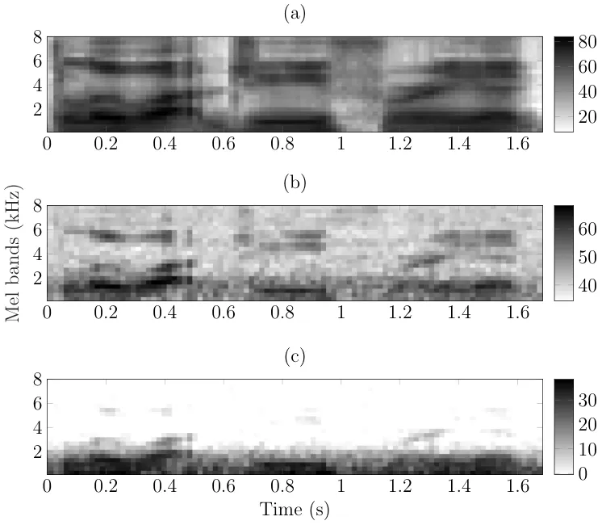

# Non-intrusive speech intelligibility prediction using automatic speech recognition derived measures

Mahdie Karbasi Affiliation: Institute of Communication Acoustics,
Faculty of Electrical Engineering and Information Technology, Ruhr
University Bochum, Universitätsstr. 150, 44801 Bochum, Germany    Stefan
Bleeck Affiliation: Institute of Sound and Vibration Research,
University of Southampton, SO17 1BJ, UK    Dorothea Kolossa¹

###### Abstract

The estimation of speech intelligibility is still far from being a
solved problem. Especially one aspect is problematic: most of the
standard models require a clean reference signal in order to estimate
intelligibility. This is an issue of some significance, as a reference
signal is often unavailable in practice. In this work, therefore a
non-intrusive speech intelligibility estimation framework is presented.
In it, human listeners’ performance in keyword recognition tasks is
predicted using intelligibility measures that are derived from models
trained for automatic speech recognition (ASR). One such ASR-based and
one signal-based measure are combined into a full framework, the
proposed _NO-Reference Intelligibility_ (Nori) estimator, which is
evaluated in predicting the performance of both normal-hearing and
hearing-impaired listeners in multiple noise conditions. It is shown
that the Nori framework even outperforms the widely used reference-based
(or intrusive) short-term objective intelligibility (STOI) measure in
most considered scenarios, while being applicable in fully blind
scenarios with no reference signal or transcription, creating
perspectives for online and personalized optimization of speech
enhancement systems.

## I Introduction

The intelligibility of a speech signal, defined as the percentage of
words or phonetic units that can be recognized by a human listener, is
dependent on a large number of factors, including the loudness of the
speech, ambient noise, characteristics of the transmission channel or
speaking style \[10\]. A complete description of all parameters is very
complex, and although there have been many (simplified) efforts to
predict speech intelligibility (SI) objectively, this has not been
achieved with equally high accuracy over different conditions such as
non-linearly distorted or reverberated speech. Also, modeling
hearing-impaired listeners and predicting their performance is still a
challenging task.

Speech intelligibility prediction methods can be divided into two
categories: _intrusive_ methods (reference-based approaches) require the
clean reference signal. _Non-intrusive_ (reference-free methods) predict
the intelligibility without the need for a clean reference signal.

Early work on intelligibility prediction exclusively used intrusive
methods, as this is conceptually much simpler. For instance, the
articulation index (AI) \[10\], the speech intelligibility index
(SII) \[2\], and the speech transmission index (STI) \[31\] were the
first methods developed. Both AI and SII work by first estimating the
SNRs within psychoacoustically motivated frequency bands, and then using
the weighted sum of those estimates as a measure of the speech
intelligibility. The speech transmission index (STI) is calculated using
the weighted average of reductions in temporal envelope modulation by
estimating the modulation frequency function. The speech-based envelope
power spectrum model (sEPSM) \[16\] and later the multi resolution sEPSM
(mr-sEMSP) \[17\] were introduced to overcome the drawbacks of STI in
predicting non-linearly distorted or reverberated speech.

An improved, and well-established intrusive measure for speech
intelligibility prediction today is the short-time objective
intelligibility (STOI) measure \[32\], which has become a common
benchmark in the field of speech processing \[11, 26\]. STOI is based on
the correlation between the test signal and the reference signal within
one-third octave frequency bands over short time segments. Regardless of
the reported high correlation between STOI and human speech recognition
performance in different acoustic scenarios, it does not perform well
for distorted (processed) speech or reverberant acoustic conditions.
Such distortions are especially a problem when assessing signal
processing algorithms that are used in hearing aids, as they introduce
further non-linear distortions, e.g. by compressing the dynamic range,
that lead to subsequently reduced speech intelligibility. To overcome
this, further studies have been conducted to improve the original STOI
metric to work in a wider range of conditions. For instance, the
Extended STOI (ESTOI) \[15\] was introduced to perform better in
scenarios with fluctuating noise. ESTOI is based on energy-normalized
short-time spectrograms that are orthogonally decomposed into subspaces
which are important for intelligibility.

While the correlation-based measures such as STOI are limited to
second-order statistics, it has been demonstrated that higher-order
statistics improve SI predictions by using the mutual information (MI)
between the test signal and reference  \[33, 14\]. Speech signals are
sparsely encoded in the time-frequency domain and in this
representation, the regions with higher energy of speech relative to the
masker are called _glimpses_. It has been shown that the reliable
glimpses, which have an adequate SNR, are contributing to the
intelligibility of speech \[4, 25\] and can be used to predict the
intelligibility instrumentally \[34, 35\].

Such methods provide an estimate of the average intelligibility over the
entire speech signal. Also, they usually require longer segments of
speech in order to achieve more accurate predictions of intelligibility.
Assessing the intelligibility of speech not at the signal level but at
the phoneme level has also attracted some recent attention. Ullmann
et al. \[36\] suggest to use the distance between the phoneme posterior
probabilities of the distorted and the reference signal, which are
estimated by a deep neural network (DNN). Huber et al. \[13\] introduce
the mean temporal distance between posteriograms as a predictor of human
listening effort.

All methods described so far are intrusive or reference-signal-based.
However, in many applications the clean signal is not available or not
practical to access. It is therefore important to also investigate
non-intrusive methods with the goal of predicting the intelligibility of
speech without the need for a reference signal. In recent work, Schädler
et al. \[29\] have chosen a non-intrusive approach to develop the
_framework for auditory discrimination experiments_ (FADE), which
predicts speech reception thresholds (SRTs) for a German matrix sentence
test. In FADE, reference HMMs are trained on specific target speech
tokens as well as noise types that are used in the testing phase. To
individualize FADE for hearing-impaired listeners, audiogram thresholds
and supra-threshold characteristics, (distortions), are used to estimate
the spectrogram that is employed during the process of the speech
feature extraction \[24\]. Another ASR-based framework has been
introduced by Spille et al. \[30\] to predict SRTs in different noisy
scenarios. They use a hybrid DNN/HMM structure to identify words from a
German matrix sentence test. Phone-based HMMs with context-dependent
triphone models are used for training. In addition to statistical
models, in another approach \[1\], a convolutional neural network has
been used to learn and predict the speech intelligibility
non-intrusively.

One issue that none of the described methods is conceptually able to
model is the question of prior knowledge. Humans can of course use
experience, knowledge about context and prior knowledge about the
characteristics of speech units (such as phonemes) when listening to
speech \[8\]. Therefore a complete objective model for SI and speech
quality must also take the phonetic contextual information into account.
Otherwise, for example comparing the processed speech only to a
signal-based reference might lead to unreasonably low intelligibility
estimates in scenarios where the speech is strongly modified or even
partially synthesized in the enhancement stage. With the goal of making
similar knowledge available to SI measures, a non-intrusive method has
been introduced by Karbasi et al. \[20\], Karbasi et al. \[21\] that
uses the distorted input speech and its correspondent transcription to
synthesize an estimated reference. In this method, the estimated
reference signal can be used in intrusive measures (such as STOI) to
predict intelligibility.

In addition to the above approaches to provide an estimate of the
_average_ intelligibility over the entire speech signal, there are also
so-called microscopic SI prediction models. These predict the
intelligibility of smaller units of speech, such as words or phonemes,
taking knowledge about the functioning of the human auditory process
into account \[18, 19\]. This allows for individual tailoring of the
process, for example by taking wider filter shapes or higher thresholds
into account. Microscopic methods promise to be more precise than
macroscopic models in predicting intelligibility and in diagnosing
problems due to specific phoneme confusions. However, they still need
further improvements to become more robust against variations of the
test scenarios in future work.

In order to utilize the advantage of microscopic methods in predicting
the intelligibility of small units of speech accurately and inspired by
previous work on non-intrusive methods, in this paper we investigate the
possibility of using automatic speech recognition to extract
non-intrusive measures to predict SI. As a secondary goal, we also
investigate the feasibility of incorporating hearing profiles and
predicting individual hearing-impaired listeners’ performance.

In previous work \[22\] we have presented a related, but simpler method
of microscopic SI prediction with limited applicability. In this paper,
we propose to improve the model using new objective measures. For this
purpose, we additionally include two ASR-based discriminance measures
for predicting the speech intelligibility from a microscopic
viewpoint \[23\] and we improve their computation to arrive at a fully
blind framework which only requires pre-trained reference models in its
computation. Specifically, its low-level intelligibility measures are
extracted utilizing an HMM-based ASR system. To create a full framework
for SI prediction, we combine our new model-based intelligibility
measures with a signal-based measure and add a neural-network-based
regression stage. We finally demonstrate that the ultimately proposed
_NO-Reference Intelligibility_ (Nori) framework outperforms traditional
methods and is broadly applicable, both under noisy conditions and for
modeling the perception of hearing-impaired listeners.

The proposed measures and the full Nori framework are explained in
detail in the following section. The data used for evaluation are
described in Section II.4, the experimental setup and the evaluations
will be presented and discussed in Sections III and IV.

## II Methods and Materials

An automatic speech recognizer delivers, in principle, the same output
measure, and it faces the same challenges as a human listener when it
comes to recognizing speech in a formalized intelligibility test. In
previous studies \[29, 28, 30\] it has been suggested to use ASR as a
predictor of intelligibility and to compare the results directly to the
results from human listeners. However, there are fundamental differences
between human and machine hearing.

Direct ASR-based predictions are restricted by the quality and the level
of detail of the model of the human hearing system, and it is currently
not possible to model human hearing accurately enough. Also, adding
specific details of human perception does not necessarily contribute to
better speech recognition performance: the recognition engine and
language models are also different between ASR and humans listeners.
Furthermore, ASRs are usually not trained to have the same performance
(high or low) as human listeners, but they rather try to achieve the
best performance overall. This leads to low correlations between the ASR
recognition output and the human listener performance in many
circumstances. In order to overcome this problem, we propose to proceed
differently in this paper: first, we will compute a set of ASR
discriminance scores (here called model-based measures)—which are
inspired by ASR confidence measures—and compare them in microscopic SI
prediction tasks in order to find the best-performing model-based
measure. In addition, we also compute signal-dependent (or
_signal-based_) measures, including blindly-estimated SNR, STOI, ESTOI,
mr-sEPSM, and the non-parametric estimation of MI using k-nearest
neighbors (MI-KNN) \[33\]. This allows for a detailed comparison between
the traditional and proposed approaches. Moreover, a blind estimator of
SNR can be included in our proposed non-intrusive SI prediction
framework. This leads to a vector-valued measure that is a combination
of the estimated SNR and the best-performing model-based measure. In a
second step, we combine each intelligibility measure with a subsequent
prediction stage, which maps the respective measure to the expected
human outcome in recognizing the speech units.

### II.1 Automatic speech recognition

At the first stage of this ASR system, speech-related features were
extracted. Here, the first 13 Mel frequency cepstral coefficients
(MFCCs), their first ($`\Delta`$) and second-order derivatives
($`\Delta\Delta`$) were used as features. Hamming-windowed frames with a
length of 25 ms and a frame shift of 10 ms were used for the MFCC
extraction algorithm. The sampling frequency was 25 kHz.

We are using a conventional, statistical model-based automatic speech
recognition (ASR) in all subsequent work. Similar to the procedure
developed previously in our lab \[23\], each word $`\nu`$ was modeled
using a linear left-to-right HMM. The number of states was chosen as
three times the number of phonemes of the word. A 2-mixture diagonal
covariance GMM was used to model the state output distribution of the
HMMs. In order to be able to compute confidence intervals, each
experiment was implemented with a 5-fold cross-validation to train and
test the ASR models 5 times on different splits of the dataset. For each
experiment and in each fold, the speech material was divided into
disjoint training (60%), development(20%), and test sets (20%). To
achieve the highest accuracy, noise-dependent models were trained
separately for each SNR. The development sets were only used to control
the progress of the training. In each fold, only the test set was used
to extract the ASR-based intelligibility measures.

### II.2 Model-based SI measures

There are many ASR-derived measures that can be used to estimate the
human recognition performance. Based on the central idea that the degree
of ASR uncertainty is related to the intelligibility level of the speech
signal, we investigate several statistical measures: the time alignment
difference (TAD) and the normalized likelihood difference (NLD) \[23\],
the entropy (H), the log-likelihood ratio (L) and the dispersion (D).

All of these measures are computed in parallel by the ASR system, which
can provide several hypotheses with an associated likelihood as the
recognized transcription of input speech. In contrast to the NLD and
TAD \[23\], which require ground-truth time alignments and
transcriptions of the signal, the newly proposed discriminative measures
are computed based only on the information provided by the ASR and do
not require any type of reference. Note that all measures in this paper
are extracted at the word level. However, the proposed framework is not
subject to any inherent constraints regarding the chosen speech units
and it can also be generalized to a phoneme-based framework in future
work.

In the following subsections, the details of the proposed method for
extracting the model-based intelligibility measures will be described.

#### II.2.1 Preprocessing

After applying feature extraction to the speech signal, the entire
sequence of feature vectors, i.e. the _observation sequence_
$`\mathbf{O}`$, is divided into segments, each corresponding to one
word. To perform this procedure, the word boundary information is
required. This can be done in two ways: if the reference word alignment
information is available, it can be employed directly to divide the
observation sequence into words. If not, the automatic speech recognizer
can be used to produce estimated word alignments through its recognition
(see Fig. 1). In order to produce these recognized alignments, the
trained HMM set and the grammar are used on the observation sequence in
a Viterbi algorithm, yielding not only the recognized word sequence, but
also the corresponding word boundaries. The Viterbi algorithm uses
dynamic programming to find the HMM state sequence that matches the
observation sequence best \[9\].

After these steps, the intelligibility measures for each segment of the
observation sequence $`\mathbf{O}^{n}`$ are calculated separately. In
the following sections, the segment index $`n`$ is dropped for simpler
notation, but note that all proposed measures are extracted given the
segmented observation $`\mathbf{O}^{n}`$ at the word level.

Figure 1: Block diagram of the preprocessing steps to produce
observation sequences.

#### II.2.2 Extracting intelligibility measures

We are considering 5 ASR-based measures, the dispersion, the entropy,
the likelihood ratio, the time alignment difference and the normalized
likelihood difference, which are introduced in detail below.

a\) Model-based dispersion represents the degree of uncertainty of the
ASR decoder in recognizing a speech signal. The dispersion of the speech
signal corresponding to a single word is computed \[7\] as

```math
\textrm{D}=\frac{2}{N(N-1)}\sum_{k=1}^{N}\sum_{l=k+1}^{N}\log\frac{P\big(\lambda_{k}|\mathbf{O}\big)}{P\big(\lambda_{l}|\mathbf{O}\big)}.\\
 \tag{1}
```

Here, $`P\big(\lambda_{k}|\mathbf{O}\big)`$ is the probability of the
word model $`\lambda_{k}`$ given the observation sequence $`\mathbf{O}`$
where the probabilities are sorted in descending order, with
$`P(\lambda_{k=1})`$ as the highest. $`N`$ is the number of best
hypotheses used to compute the dispersion.

In Eq. 1, the model probabilities $`P\big(\lambda_{k}|\mathbf{O}\big)`$
are required. Having one HMM per word $`k`$, it is possible to compute
the likelihood of the observation sequence given the word model,
$`P\big(\mathbf{O}|\lambda_{k}\big)`$, using the forward
algorithm \[27\], and to then obtain the model probability
$`P\big(\lambda_{k}|\mathbf{O}\big)`$ using Bayes’ theorem

```math
P\big(\lambda_{k}|\mathbf{O}\big)=\frac{P\big(\mathbf{O}|\lambda_{k}\big)P\big(\lambda_{k}\big)}{P\big(\mathbf{O}\big)}. \tag{2}
```

The prior probability of the models $`P\big(\lambda_{k}\big)`$ can be
acquired using a language model.

In our experiments we use a matrix test for evaluation. Since the prior
probability of each model $`P\big(\lambda_{\nu}\big)`$ is thus equal for
all possible words and since the probability of the observation sequence
$`P\big(\mathbf{O}\big)`$, is independent of $`\lambda`$, in this work,
Eq. (1) can be reformulated to

```math
\textrm{D}=\frac{2}{N(N-1)}\sum_{k=1}^{N}\sum_{l=k+1}^{N}\log\frac{P\big(\mathbf{O}|\lambda_{k}\big)}{P\big(\mathbf{O}|\lambda_{l}\big)}.\\
 \tag{3}
```

The steps required for extracting the HMM-based dispersion are shown in
Algorithm 1 as an overview. First, the likelihood of the observation
$`\mathbf{O}`$ is needed for all word models
$`\lambda_{\nu},\nu=1\dots V`$. These likelihoods need to be sorted in
descending order, of which the $`N`$ highest values are used in Eq. 3 to
compute the dispersion.

1: Compute the likelihood of $`\mathbf{O}`$, given all possible word
models for the word position $`n`$, using the forward algorithm:
$`P\big(\mathbf{O}|\lambda_{\nu}\big),\nu=1...V^{n};`$

2: Sort all probabilities $`P\big(\mathbf{O}^{n}|\lambda_{\nu}\big)`$ in
descending order;

3: Compute the dispersion for the $`N`$ highest probabilities, via
Eq. 3;

Algorithm 1 Compute the model-based dispersion for observation sequence
$`\mathbf{O}`$, corresponding to the word position $`n`$ in a sentence.

b\) The second measure proposed as a model-based intelligibility measure
is the entropy, which can also be considered as an indicator of the ASR
confidence. The entropy is computed for the segmented observation
$`\mathbf{O}`$ via

```math
\textrm{H}=\sum_{m=1}^{M}-P\big(\lambda_{m}|\mathbf{O}\big)\log{P\big(\lambda_{m}|\mathbf{O}\big)},\\
 \tag{4}
```

where $`M`$ is the number of all possible word models.

c\) The log-likelihood ratio $`L`$ \[22\] is the third proposed
model-based measure. $`L`$ indicates the decoder’s discrimination
between the first and second best model. Therefore, $`L`$ corresponds to
the dispersion measure where $`N=2`$. For comparison, the results of
intelligibility prediction using the $`L`$ measure are reported in
Section III.

d\) TAD and e) NLD are the final model-based measures. As introduced
in \[23\], TAD is defined as the difference between the recognized and
the ground-truth time alignments of the input signal. NLD is the
normalized likelihood difference between the first and second
most-likely models given the ground-truth transcription. Both measures
require knowledge about the ground truth transcription and time
alignments and can not be computed without a time-alignment and
transcription reference.

### II.3 Signal-based SI measures

In addition to the above model-based measures, the SNR is estimated as a
signal-dependent measure (S$`\widehat{\textrm{N}}`$R). To estimate the
SNR, the clean speech and noise signal powers are required. Here, the
Improved Minima Controlled Recursive Averaging (IMCRA) algorithm and the
Wiener filter are used to estimate the power of the clean signal,
$`\hat{\textrm{s}}(t)`$, and the noise, $`\hat{\textrm{n}}(t)`$, without
need for a reference. S$`\widehat{\textrm{N}}`$R is then calculated by

```math
\textrm{S}\widehat{\textrm{N}}\textrm{R}=10\log\frac{\sum_{t}\left(\hat{\textrm{s}}\left(t\right)\right)^{2}}{\sum_{t}\left(\hat{\textrm{n}}\left(t\right)\right)^{2}}.\\
 \tag{5}
```

As baseline intrusive measures, STOI, ESTOI, MI-KNN, and mr-sEPSM values
are also extracted and used for comparison. To compute these measures
(except S$`\widehat{\textrm{N}}`$R), the reference alignments have been
used to divide the signals into word units. We will investigate and
compare their performance to find the strongest baseline for our setup.
Note that none of these methods are explicitly designed to predict the
performance of hearing-impaired listeners, but we will use the
best-performing measure as the baseline in predicting the hearing
impaired listeners as well.

### II.4 Databases

We used three speech intelligibility databases to evaluate the
performance of the considered measures. These databases are all based on
the speech signals from the Grid corpus \[5\] and we used associated
intelligibility scores collected by listening tests with human subjects.
The Grid corpus originally contains clean speech signals and their time
alignments. In total, there are 34,000 clean speech signals in this
corpus, collected from 34 English speakers at the University of
Sheffield. Each Grid utterance is a semantically unpredictable 6-word
sentence with a fixed grammar:
Verb(4)-Color(4)-Preposition(4)-Letter(25)-Digit(10)-Adverb(4), where
the numbers in parentheses represent the number of available choices for
each word position.

#### II.4.1 The original Grid intelligibility database (DB1)

The first database (DB1) is a noisy version of the original Grid corpus,
the ’Grid speech intelligibility database’ \[3\]. It contains noisy
signals created by adding speech-shaped noise (SSN) to clean Grid
signals at 12 different SNRs from -14 dB up to 6 dB with steps of 2 dB,
plus one condition at 40 dB, labeled as ’clean’. Speech-shaped noise is
created as Gaussian noise shaped with a long-term average spectrum
identical to that of an averaged speech signal from the Grid corpus. DB1
also includes the listening test results from 20 normal-hearing
listeners (NHL). The participants’ responses to 2000 utterances and the
ground-truth transcription are provided for the keywords color, letter,
and digit.

#### II.4.2 The Grid intelligibility database with crowd-sourcing (DB2)

A second noisy version of Grid speech signals was used in addition,
referred to as DB2. The intelligibility scores in this database have
been collected by the authors in previous work \[20\]. In this database,
in addition to speech-shaped noise (SSN), tokens with white noise and
babble noise were also created, with the babble noise from the AURORA
database \[12\] containing a mixture of speech signals from a crowd of
both female and male English speakers.

To obtain human speech recognition results for the newly generated data,
separate listening tests were carried out for the signals of each noise
type in a large-scale listening experiment, using crowd-sourcing tests
at CrowdFlower, Inc. \[6\]. Every test participant was asked to
transcribe a set of 22 audio signals, containing different SNR
conditions, ranging from -10 dB to 6 dB in steps of 2 dB, where the
noise type was fixed for a given test set. In order to prevent memory
effects, we ensured that the same utterance was only utilized once
within a given test set.

Experimentation in a weakly controlled environment like crowd-sourcing
offers many benefits, specifically the potential large number of
participants that can be approached, but this comes at the price of
unknown variability in the sampling. In order to control quality of
responses, therefore, additional control steps are necessary to ensure
first that only participants are recruited who are qualified for the
task (e.g., they need to have sufficient language skills) and to ensure
that participants are concentrating during the tests. The English
proficiency was established in a self-reporting questionnaire at the
beginning, and to test concentration, each test set also contained 4
clean utterances. These were randomly interspersed between the actual
test signals. For the analysis, only results were used where at least
50% of the control utterances were correctly transcribed. Later analysis
demonstrated that the minimum accuracy of listeners who passed this
threshold, and were therefore used for further analysis, was above 70%.
The hearing status of listeners in DB2 was not tested, because it is
very difficult to measure or verify the listeners’ hearing ability in
crowd-sourcing experiments objectively.

The transcriptions were recorded using a multiple-choice experiment
using a web-based graphical user interface. Each contributor was allowed
to participate multiple times but restricted to 6 test sets.
Participants were payed \$0.01 for each utterance.

We collected the responses from 849 individual participants, who passed
the quality control during the test. This corresponds to an overall
number of 36,018 transcribed utterances in total.

#### II.4.3 The Grid intelligibility database for hearing-impaired listeners (DB3)

In order to evaluate the performance of the proposed measures in
predicting the performance of hearing-impaired listeners (HIL), an
additional intelligibility database was collected by conducting
listening tests with hearing-impaired participants at the University of
Southampton. The resulting third database (DB3) contains the same noisy
Grid tokens as DB1, but with hearing-impaired listeners’ intelligibility
scores.

All participants in this study were native English speakers and regular
users of hearing aids. During the test, they were not wearing the
hearing aid. First, pure tone audiometry (PTA) was performed to measure
the hearing thresholds. The better ear was used in the speech test. In
total, 9 listeners (3 female and 6 male) aged from 62 to 79 years took
part in this study and were paid for their participation. The study was
approved by the local ethics committee. Information of all participants
including their individual audiometric thresholds are listed in Tab. 1.
Speech from DB1 was presented, so the stimuli contained SSN at SNRs
ranging from -6 dB to 6 dB in steps of 2 dB plus the clean signals. The
stimuli were presented via circumaural headphones (Sennheiser HD380pro)
in a quiet room. The equipment was calibrated with clean speech to a
presentation level of 65 dB SPL using a sound level meter (Brüel&Kjær 2260) and artificial ear simulation (Brüel&Kjær 4153).

The participants were asked to repeat the Grid keywords (color, letter
and digit) after they had heard the whole sentence and the experimenter
recorded their answers for each keyword. A short training session was
performed prior to the main test in order to familiarize the
participants with the task and the stimuli.

Thresholds (dB HL) ID Age Gender Tested ear 0.25 0.5 1 2 4 8 (kHz) L1 73
Male Right 15 10 15 20 50 75 L2 79 Male Right 35 30 40 50 65 70 L3 66
Female Left 20 20 35 45 35 40 L4 72 Male Right 0 5 15 45 65 60 L5 62
Male Left 10 15 20 25 50 60 L6 65 Female Left 65 65 65 60 60 80 L7 72
Male Left 15 30 40 50 60 65 L8 72 Male Right 20 25 35 30 60 50 L9 65
Female Right 15 20 25 20 15 20

Table 1: Audiometric thresholds of the tested ears for each listener.

## III Experiments and results

Three sets of experiments were conducted to evaluate the performance of
the proposed intelligibility measures for different tasks:

1.  A.
    Microscopic prediction of intelligibility for NHLs,
2.  B.
    Macroscopic prediction of intelligibility for NHLs,
3.  C.
    Microscopic prediction of intelligibility for HILs.

The overall goal of the experiments was to predict the performance of
human listeners in keyword recognition tasks using ASR-driven measures
and to analyze their performance based on both microscopic and
macroscopic models. For comparison, the intrusive signal-based measures
STOI, ESTOI, MI-KNN and mr-sEPSM were also computed using the noisy
speech and its clean counterpart. For every noisy speech utterance in
each database considered in the current work, there is a clean
counterpart from the original Grid corpus. Those pairs are used in the
computation of intrusive measures.

### III.1 Microscopic SI prediction for normal-hearing listeners

For microscopic evaluation, the human listeners’ performance was
predicted using the estimated intelligibility measures as described in
detail below and the outcomes are reported as ’accuracy’ values, that
is, the percentage of words for which the model predicts the human
listener’s performance correctly, either as “recognized” or as “not
recognized”.

In order to obtain the predicted intelligibility, a mapping was
performed between the speech intelligibility measure under test and the
results of human speech recognition experiments, cf. Fig. 2. For that
purpose, a binary classification neural network (NN) was trained to
predict the human keyword recognition outcomes using the MATLAB
patternnet toolbox. A feed-forward network was employed using the cross
entropy as the cost function. The network had one hidden layer with 10
neurons. The input size was defined by the intelligibility measure(s)
used for training and testing. In our experiments, it was either one
scalar input, or two, in the case of Nori. The NN was trained using the
respective intelligibility measure for each token and its correspondent
label, taken from the listening test results. The binary label was
defined on the word level, depending on whether or not the word was
correctly recognized by the human listener. A 7-fold cross validation
was performed in this step so as to be able to compute confidence
intervals for the evaluation results. At each fold, 70% of data was used
for training the network, 15% for validation and 15% for evaluation. The
network was trained individually for each intelligibility measure, at
each noise condition and over all SNRs.

Figure 2: Block diagram of the mapping stage, including the training and
testing phase to map the intelligibility measure to actual prediction
values.

#### III.1.1 Preliminary experiments

Prior to the main evaluation, two pilot experiments were conducted,
using the data of DB1 only. In the first of theses, a pilot microscopic
experiment was conducted in order to obtain the best value for $`N`$ in
Eq. 1 was determined in a microscopic intelligibility prediction task,
with $`N`$ varying between 2 and 8 (Fig. 3). The best microscopic SI
prediction accuracy for the dispersion was achieved at $`N=5`$
hypothesis, and $`N=5`$ was thus selected for further processes. This
indicates that (at least for this dataset) the likelihood differences
between the 5 best hypotheses contain the highest amount of information
regarding the associated intelligibility, and adding more hypotheses
does not provide further benefit.

Figure 3: Accuracy of the measure dispersion, ($`D`$), for different
values of $`N`$.

In the second pilot experiment, the average accuracy of all proposed
model-based intelligibility measures was computed to pre-select the most
accurate model-based measure. The speech signal was divided into word
segments using true alignments for the intrusive measures. For the
non-intrusive measures, ASR-recognized alignments were used to divide
the signal. The results of the second pilot experiment are shown in
Tab. 2. Among all investigated measures, the dispersion ($`D`$) shows
the highest accuracy with 84.04% and 85.89%, using the recognized and
true alignments, respectively. Also, it can be seen that all measures
perform better using the true alignments than using the recognized ones.
As described above, $`D`$ is computed using the five highest model
likelihoods. In contrast, the entropy $`H`$ considers all possible model
likelihoods in estimating the decoder uncertainty and can contain
redundant information, leading to loss of accuracy. On the other hand,
the log-likelihood ratio $`L`$ takes only the two highest model
likelihoods into account and might therefore underestimate the amount of
uncertainty in the ASR. Also, the comparison between the results gained
by using the true alignments versus the recognized alignments shows that
using the correct time alignments has the biggest impact on the
performance of TAD. This outcome was expected, since TAD is computed
based on the time alignments, so the correctness of the time alignments
is important to its performance. On the other hand, the dispersion $`D`$
is less influenced by the correctness of alignment information.

$`NLD`$ $`TAD`$ $`D`$ $`H`$ $`L`$ True alignment 78.85 80.88 85.89 81.25
79.71 Recognized alignment 76.16 77.65 84.09 78.44 78.64

Table 2: Results of the 2nd pilot experiment, for the pre-selection of
metrics. These show the average accuracy of the proposed model-based
intelligibility measures in predicting the performance of 20
normal-hearing listeners from DB1 in the Grid keyword recognition task.
$`NLD`$= normalized likelihood difference, $`TAD`$= time alignment
difference, $`D`$= dispersion, $`H`$= entropy, $`L`$= log-likelihood
ratio

As a result of this preliminary assessment, we chose the dispersion
$`D`$ computed with the recognized alignments as the most appropriate
reference-free model-based measure for the remainder of this paper, and
in the following we compare its performance against signal-based
measures in various test scenarios under different noise conditions. In
total, in addition to the baseline intrusive methods, we investigated
three non-intrusive intelligibility measures: dispersion $`D`$,
estimated SNR (S$`\widehat{\textrm{N}}`$R) and a combination of $`D`$
and S$`\widehat{\textrm{N}}`$R (the combination in Nori).

#### III.1.2 Microscopic SI prediction results

In this section, intelligibility measures computed from the
normal-hearing listener databases DB1 and DB2 are used for evaluation.
All results are averaged over all listeners of each database. The
results are organized by the type of keyword in the sentence. Tab. 3
shows the accuracy of all considered measures for DB1. The keywords in
the Grid corpus are of three different types: colors, letters, and
digits. The keyword types differ with respect of their degree of
difficulty, mainly due to different perplexity (4 different choices for
colors vs. 25 letters and 10 digits) and duration. We expected the
highest intelligibility prediction accuracy for the color category,
since it also contains the longest words, which helps in the decoding
phase. The lowest intelligibility estimation accuracy was expected in
the letter category due to its high perplexity and because the letters
are relatively short, both contributing to a higher degree of
difficulty. Accuracy results in Tab. 3 show that the combined
(reference-free) Nori system delivers a slightly better performance than
the reference-based STOI, specifically in the letter and the digit
category. However, it is not statistically different than the
performance of STOI. On average, it can also be seen that the single
measures, dispersion $`D`$ or S$`\widehat{\textrm{N}}`$R alone, perform
less well. Apparently the information captured by $`D`$ and
S$`\widehat{\textrm{N}}`$R that are combined in the Nori framework , is
jointly improving the accuracy of intelligibility prediction - without
the need of a clean reference.

Among the intrusive measures, mr-sEPSM had the lowest accuracy in
predicting the performance of listeners in SSN. The extended version of
STOI (ESTOI) and the mutual information-based measure (MI-KNN) did not
achieve a higher accuracy than STOI in this microscopic evaluation.

Keyword type mr-sEPSM STOI ESTOI MI-KNN $`D`$ S$`\widehat{\textrm{N}}`$R
Nori Color 86.92 88.84 88.21 87.18 88.53 87.22 88.67 Letter 66.85 82.72
80.81 77.25 79.25 81.52 83.02 Digit 77.75 85.34 83.35 79.21 84.49 84.44
85.75 Average 77.17 85.63 84.12 81.21 84.09 84.39 85.81

Table 3: Average accuracy of all considered intelligibility measures in
predicting the performance of 20 normal-hearing listeners from DB1 in a
keyword recognition task, categorized by keyword type.

The intelligibility prediction performance of the methods is assessed by
computing their accuracy in predicting listening test results for
different SNRs. The results for STOI, as the best intrusive method, and
for all non-intrusive methods are shown in Fig. 4. All considered
measures perform worse at around -10 dB SNR. This corresponds roughly to
the human SRT, which is at -10.31 dB in DB1. This implies that (at least
using our methods) predicting the intelligibility of a speech signal is
most difficult at SNRs where human performance is around 50%. Accuracy
rises with higher SNRs as expected, but also rises for lower SNRs. STOI
is performing slightly better than D in almost all SNRs, except for
three low SNRs.For comparison, in addition to D, which is computed using
the recognized alignments, we also include a dispersion measure with
true alignment. It shows better performance at lower SNRs, but the
improvement is very small at higher SNRs. This proves the importance of
accurate word boundaries in computing the dispersion measure. The
dispersion computed with true alignment is still performing slightly
worse than STOI at higher SNRs. In SNRs from -6 down to -14 dB,
S$`\widehat{\textrm{N}}`$R shows lower accuracy than $`D`$. However, at
higher SNRs it performs slightly better. The Nori framework, taking
advantage of both measures—$`D`$ and S$`\widehat{\textrm{N}}`$R—is
performing well in all SNRs.

Figure 4: Accuracy of all considered intelligibility measures in
predicting the keyword recognition performance of all listeners in DB1
with SSN data, using a feed-forward NN in the mapping stage.

The above experiment was based on data from DB1, which contains only one
noise type (speech-shaped noise) at 12 different SNRs. Incorporating
more types of noise in speech distortion is important for a more
comprehensive evaluation of the proposed Nori method, since different
types of distortion can influence the accuracy of intelligibility
prediction methods differently.

Therefore, in the next experiment, the database DB2 was used for further
investigation of the proposed measures. DB2 consists of speech signals
distorted with three different noise types: speech-shaped noise, white
noise and babble noise, with listening tests collected by
crowd-sourcing, as detailed in Sec. II.4.2. The average accuracy of the
intelligibility measures is shown in Fig. 5. Here, the dispersion
measure $`D`$, solely and also in combination with
S$`\widehat{\textrm{N}}`$R, outperforms the STOI measure in all noise
conditions, especially in SSN and white noise. The combined Nori measure
shows the highest accuracy prediction among all tested measures.
Predicting intelligibility in white noise is the most difficult task;
all white noise results show lower accuracy in comparison to babble and
speech shaped noise. According to Fisher’s exact test, the accuracy
gained by using either $`D`$, or $`D`$+S$`\widehat{\textrm{N}}`$R in the
full Nori framework, is statistically significant over the use of the
STOI measure at a level of $`p<0.01`$ in conditions with SSN or white
noise. However, in babble noise, the accuracy achieved with the proposed
measures is not statistically different from that based on the STOI
measure.

Among all considered intrusive methods, STOI showed the best performance
on DB1. In the next experiment we therefore only evaluated and compared
our proposed measures against STOI as the best-performing intrusive
measure.

Figure 5: Average accuracy of all considered intelligibility measures in
three different noise types, SSN, white, and babble noise, in predicting
the performance of all listeners in DB2.

### III.2 Macroscopic SI prediction for normal-hearing listeners

In addition to the microscopic evaluation, we also analyzed the
correspondence between the predicted and the ground truth
intelligibility, i.e., the average human word recognition scores.

#### III.2.1 Experimental setup

As the intelligibility measures are extracted per keyword here, their
corresponding ground truth are binary data. However, for macroscopic
evaluation, a continuous distribution of the intelligibility scores is
required. In our databases, each file contains one Grid utterance and
each utterance contains 3 keywords. Before evaluation, the speech files
were randomly divided into segments consisting of 10 files. Then, all
measures, extracted per keyword in each segment, were averaged. This was
repeated for every SI measure and the same averaging process was also
applied to the corresponding human word recognition scores. This created
continuously-distributed data for macroscopic evaluation.

As evaluation metrics, the averaged normalized cross-correlation
coefficient (NCC), Kendall’s Tau ($`\tau`$), and the root mean square
error (RMSE) were used to compare the predicted intelligibility and
human word recognition scores across different SNRs. NCC and RMSE only
provide valid estimates when their input variables have a linear
relationship. However, it is possible to linearize the relationship
between the machine-derived and the human listening test results by
estimating a mapping function. To estimate such a function, both neural
networks and logistic function estimation were tested. Since the
logistic function had a lower accuracy than the neural network
regression, only the NN results are reported here. For NN training and
testing, fitnet, the MATLAB shallow neural network toolbox, was used
with the mean square error as its default cost function. A mapping
function was estimated for each intelligibility measure using a network
with one hidden layer with 10 neurons. For every measure and each noise
type, a separate mapping was estimated over all SNRs. Since utilizing a
mapping function can influence the final evaluation results, a metric
that does not require linearity, namely Kendall’s Tau, was also included
in the evaluation. Kendall’s Tau is computed between the rank ordering
within two data sets without requiring a mapping function. Similar to
the microscopic experiments, the network parameter estimation and
evaluation was performed in a 7-fold cross validation. This allowed us
to use all available data for evaluation and achieve more reliable
results. The results reported here are the average values of evaluation
metrics computed over the ones obtained for each fold.

This evaluation was performed with normal-hearing listener data from DB1
and DB2.

#### III.2.2 Macroscopic SI prediction results

In the following experiments, our intelligibility prediction, based on
all considered SI measures, is being compared to the human speech
recognition accuracy, given as the word correct score (WCS). The WCS is
computed by dividing the number of correctly recognized keywords by the
total number of keywords.

The amount of correlation between the intelligibility prediction and the
correspondent WCS (ground truth intelligibility) in all conditions taken
from DB1 and DB2 is shown in Fig. 6 in terms of NCC, $`\tau`$, and the
root mean square error (RMSE). The average performance evaluation shows
that $`D`$+S$`\widehat{\textrm{N}}`$R, as in the Nori framework, again
performs better than the individual measures $`D`$ and
S$`\widehat{\textrm{N}}`$R in terms of correlation and error.

The average performance of all tested intelligibility measures was also
evaluated, differentiating the three groups of noisy data present in
DB2, shown in Fig. 6. In the case of white and babble noise, Nori always
outperforms STOI in terms of all three evaluation metrics. For SSN, Nori
performs slightly worse than STOI, however, with the added benefit of
predicting the intelligibility non-intrusively. Similar results were
achieved using the SSN data from DB1. S$`\widehat{\textrm{N}}`$R has the
lowest performance under all noise conditions.

Figure 6: Comparison of intelligibility measures regarding their
predictive performance for listening tests. Noise types are SSN, babble,
and white noise from DB2 in terms of NCC (%), RMSE, and Kendall’s Tau
($`\tau`$).

Figure 7: Predicted SRTs using all considered intelligibility measures,
also introducing ASR recognition results, in comparison to the ground
truth SRT computed from the human listening test results . All SRT
values have been reported for four groups of speech data distorted by
SSN in DB1, SSN in DB2, white noise in DB2, and babble noise in DB2.

The speech reception threshold (SRT) – the SNR at which the speech
recognition accuracy is 50% – is another measure to describe the
intelligibility of a signal. It is computed based on the psychometric
function over many different SNRs but it does not provide detailed
information about the intelligibility of the signal at each SNR
separately. Fig. 7 shows the SRTs computed using the listening test data
collected in DB1 and DB2. The estimated SRTs in SSN show large
differences between DB1 (-10.1 dB) and DB2 (-6.9 dB). The listening
tests in DB1 have been conducted in a controlled environment with
normal-hearing listeners, while such a level of control was not possible
in the crowd-sourcing experiment. Therefore, some differences are
expected. The human results from DB2 show the highest SRT in babble
noise (at -4.8 dB), and the lowest in white noise (-8.8 dB). As
expected, babble noise is the most effective masker and white noise is
the least effective masker for human listeners. On the other hand,
predicting the human SRT is most difficult in white noise compared to
babble and SSN. Comparing the predicted SRTs in each noise type shows
that using the dispersion measure $`D`$ yields results closest to human
performance in conditions with SSN and white noise, where the ASR-based
prediction and STOI do not perform as well. For babble noise, the
predicted SRT of $`D`$ is slightly less accurate than that based on the
STOI and ASR values. Also, the results show that adding the estimated
S$`\widehat{\textrm{N}}`$R to $`D`$ does not improve prediction accuracy
in this case. Based on the results from SSN (DB1), it can be seen that
using ASR as a direct predictor overestimates the SRT and performs less
accurately than the other intelligibility measures in this case.

### III.3 Microscopic SI prediction for hearing-impaired listeners

In the final set of experiments, we investigated how well we can predict
whether an individual hearing-impaired listener will be able to
understand specific utterances or words.

In order to simulate individual hearing status, personalized features
were extracted \[24\] for the ASR-based SI measures. To do this, the
audiogram data was used to set thresholds in computing the logarithmic
Mel-scale spectrograms during the MFCC feature extraction, prior to
which, all speech signals in DB3 were amplified to the same hearing
level of presentation. An example of these personalized feature maps is
shown in Fig. 8. Shown is the the Mel scale spectrogram of (a) a clean
speech signal, (b) its equivalent representation at 4dB SNR, and (c) the
threshold-adapted version. It can be seen how raised hearing thresholds
cause loss of information, specifically at higher frequencies.

#### III.3.1 Experimental setup

The outcomes are reported as ’accuracy’ values, that is, the percentage
of words where the model predicts the HIL performance on a single word
correctly. Similar to the microscopic experiments on normal-hearing
listeners, a NN-based mapping was applied to the SI measures before
computing the accuracies. In this experiment, for each listener and
noise condition, a separate mapping NN was trained over all SNRs. For
the model-based measures, each listener was modeled separately, i.e.,
all HMMs and GMMs were trained for the specific listener. The
signal-based measures, STOI and S$`\widehat{\textrm{N}}`$R, however,
were computed without further processing to model the hearing loss.

#### III.3.2 Results for HI listeners

Intelligibility prediction results using STOI, $`D`$,
S$`\widehat{\textrm{N}}`$R, and $`D`$+S$`\widehat{\textrm{N}}`$R as
proposed in the Nori framework, are shown in Tab. 4. The results are
reported individually and also on average. They show that Nori
outperforms STOI on average and also individually for participants L2,
L6 and L9. For other HILs, Nori performs almost at the same level as
STOI.

In evaluations of the FADE framework \[29\], it has been shown that the
audiogram data is not sufficient for modeling the hearing impairment
effects on speech recognition results. In our experiments, however, they
have shown significant benefit for accurately predicting the speech
perception of HILs, even without employing a reference signal, even
despite the fact that our simple hearing impairment model only applies
raised thresholds and ignores all other potential problems of the
auditory system like widening filters or reduced temporal gap detection.
With access to further supra-threshold hearing loss information, the
feature extraction algorithm could, and should be adapted to achieve an
even better prediction of individual listener performance.



Figure 8: Short-time Mel-scale spectral representation of one speech
signal in different scenarios; (a) clean , (b) noisy, and (c)
threshold-adapted noisy spectrum.

HIL ID STOI $`D`$ S$`\widehat{\textrm{N}}`$R Nori L1 80.83 80.41 77.91
79.16 L2 70.00 66.04 66.04 73.12 L3 74.79 73.95 70.83 74.16 L4 74.58
76.25 68.12 74.58 L5 83.33 82.70 78.54 81.66 L6 65.35 70.53 61.42 69.82
L7 70.53 68.92 60.35 70.35 L8 77.50 72.32 72.85 74.82 L9 75.17 77.85
75.35 76.96 Mean 74.67 74.33 70.15 74.95

Table 4: Average accuracy in predicting the hearing-impaired listeners’
speech recognition performance.

## IV Discussion

We have introduced a novel reference-free approach to speech
intelligibility prediction, and we have evaluated its performance for
both normal-hearing and hearing-impaired listeners in various noise
conditions.

Our approach bases on an intelligibility measure that we derived from
the discriminability (or confidence) information within an automatic
speech recognition (ASR) system, namely the model-based dispersion
$`D`$. Given that speech intelligibility is affected by many internal
and external factors, we also took signal-based intelligibility
information into account. It has been shown in previous studies that the
SNR is one such indicator of speech intelligibility. Accordingly, we
combined the discriminability score $`D`$ with the estimated
S$`\widehat{\textrm{N}}`$R to provide an improved measure.

We showed that the resulting non-intrusive Nori method performs well in
predicting the performance of normal-hearing and hearing-impaired
listeners in a noisy keyword recognition task and that Nori can even
outperform the often-used reference-based STOI measure.

The results of evaluation with SSN data from DB1 (Fig. 4) show that this
approach increased prediction accuracy in most SNRs. The average
performance of all considered measures are statistically different from
each other at a level of $`p<0.05`$ (Table  3) with Nori outperforming
STOI in two out of three conditions. As shown in Fig. 4, predicting
speech intelligibility is most difficult when the word recognition rate
of listeners is around 50%, i.e., around the speech reception threshold
(SRT), where the slope of the psychometric function is steepest. Our
initial experiments demonstrate that if we provide the proposed method
with additional reference alignments to segment the speech to smaller
units, the ASR-based discriminance score $`D`$ becomes more accurate and
outperforms STOI, even without taking S$`\widehat{\textrm{N}}`$R into
consideration. Using the reference time alignments for speech
segmentation also helps the dispersion to be more accurate in lower SNRs
close to the SRT. This implies an expected benefit of further robustness
improvements in the ASR system, which will be one goal of future work.

The Nori framework has been developed to predict the intelligibility of
speech in smaller units like words. Among the considered keywords,
letters and digits are the shortest words with the highest perplexity,
which makes them the most difficult for ASR and also for other
instrumental measures to predict their intelligibility. An analysis
based on the word type shows that the proposed Nori framework is more
successful at word-level intelligibility prediction in comparison to
STOI in these most difficult cases of letters and digits (Tab. 3).

We also investigated the ability of Nori to predict individual
hearing-impaired listeners’ performance in various noise situations.
Although our hearing-impairment model is very simple and only involves
raised thresholds, Nori performs equivalently to STOI in some
conditions, and is even slightly superior on average. The prediction
accuracy may be improved further when including other supra-threshold
effects characterizing hearing impairment, like wider auditory filters
and temporal smearing. Note, however, that STOI, in contrast to Nori,
has not been explicitly designed for modeling hearing impaired
listening.

Overall, the proposed intelligibility estimate of the Nori framework is
computed non-intrusively and is successful in predicting the speech
intelligibility microscopically as well as macroscopically. Whilst the
well-known STOI measure requires a clean reference signal, our framework
only requires some time and data for training the ASR models.

The proposed method has been evaluated on the Grid corpus, a
small-vocabulary dataset with a matrix sentence test structure, and it
is hence applicable directly to other similar data. However, the
framework is not limited to matrix tests, but rather it can and should
be extended and used for the prediction of intelligibility at a phoneme
level in future work. Consequently, the framework is also extendable to
large-vocabulary scenarios. This application, however, would call for a
large-vocabulary speech dataset with a corresponding, large set of human
listening test results collected for evaluation.

## V Conclusion

The main goal of this work was to predict microscopic (i.e.
word-by-word) speech intelligibility in a non-intrusive manner, i.e.,
without access to any clean reference signal. The dispersion, extracted
as a discriminance measure from ASR models, together with the blindly
estimated S$`\widehat{\textrm{N}}`$R were introduced as non-intrusive
measures and embedded as predictors into the introduced Nori framework
for _NO-Reference Intelligibility_ estimation.

The evaluation is based on a large number of normal-hearing listeners’
data, showing that the Nori framework can outperform the STOI in
predicting NHL’s word recognition performance and it correlates well
with human data in terms of NCC, $`\tau`$ and RMSE in most conditions.
Overall, Nori performs accurately and can predict the word-level speech
intelligibility precisely, without the need for any extra information
like the clean reference signal during the prediction process.

Finally, it was shown that it is feasible to use the proposed measure in
predicting the performance of hearing-impaired listeners, reaching an
accuracy equivalent to that of STOI. However, to better model the
hearing impairments, it will be a goal of future work to take
supra-threshold effects into account in computing the font-end features
for the employed ASR models. To evaluate the framework with
large-vocabulary data, it will be necessary to collect larger databases
of real-life speech that are annotated with human listening results—a
task that, while difficult, is deemed by the authors to be vital to move
the field forward towards real-life on-line intelligibility
optimization.

Research in speech communication systems requires the ability to assess
speech intelligibility rapidly. Experiments with human listeners are
time-consuming and costly, and they are unrealistic for big-data and
learning-driven approaches and for on-line adaptation. Therefore,
estimated speech intelligibility needs to be available and reliable as a
stand-in measure. We have demonstrated here that reference-free
algorithms are a viable option for this purpose, which can considerably
widen the space for system optimization towards real-life and
user-adaptive speech enhancement.

###### Acknowledgements.

This research has received funding from the European Union’s Seventh
Framework Programme FP7/2007-2013/ under REA grant agreement
n^(∘)\[317521\]. The authors would like to thank Jon Barker for
providing a noisy version of the Grid database with comprehensive
listening test results.

## References

- \[1\] Andersen, A. H., de Haan, J. M., Tan, Z., and Jensen, J. (2018).
  “Nonintrusive speech intelligibility prediction using convolutional
  neural networks,” IEEE/ACM Trans. Audio, Speech, Language Process.
  26(10), 1925–1939.
- \[2\] ANSI/ASA, ed. (1997). S3.5 _Methods for the Calculation of the
  Speech Intelligibility Index_ (ANSI, New York, NY, USA).
- \[3\] Barker, J., and Cooke, M. (2007). “Modelling speaker
  intelligibility in noise,” Speech Communication 49(5), 402–417.
- \[4\] Cooke, M. (2006). “A glimpsing model of speech perception in
  noise,” J. Acoust. Soc. Am. 119(3), 1562–1573.
- \[5\] Cooke, M., Barker, J., Cunningham, S., and Shao, X. (2006). “An
  audio-visual corpus for speech perception and automatic speech
  recognition,” J. Acoust. Soc. Am. 120(5), 2421–2424.
- \[6\] CrowdFlower, Inc. (2016). “CrowdFlower”
  [http://www.crowdflower.com](http://www.crowdflower.com).
- \[7\] Estellers, V., Gurban, M., and Thiran, J.-P. (2011). “On dynamic
  stream weighting for audio-visual speech recognition,” IEEE/ACM Trans.
  Audio, Speech, Language Process. 20(4), 1145–1157.
- \[8\] Fingscheidt, T., and Bauer, P. (2013). “A phonetic reference
  paradigm for instrumental speech quality assessment of artificial
  speech bandwidth extension,” in _Proc. 4th International Workshop on
  Perceptual Quality of Systems_.
- \[9\] Forney, G. D. (1973). “The Viterbi algorithm,” Vol. 61, pp.
  268–278.
- \[10\] French, N., and Steinberg, J. (1947). “Factors governing the
  intelligibility of speech sounds,” J. Acoust. Soc. Am. 19(1), 90–119.
- \[11\] Gao, J., and Tew, A. (2015). “The segregation of spatialised
  speech in interference by optimal mapping of diverse cues,” in _Proc.
  ICASSP_, pp. 2095–2099.
- \[12\] Hirsch, H.-G., and Pearce, D. (2000). “The Aurora experimental
  framework for the performance evaluation of speech recognition systems
  under noisy conditions,” in _ASR2000-Automatic Speech Recognition:
  Challenges for the new Millenium ISCA Tutorial and Research Workshop
  (ITRW)_.
- \[13\] Huber, R., Spille, C., and Meyer, B. T. (2017). “Single-ended
  prediction of listening effort based on automatic speech recognition,”
  in _Proc. Interspeech_, pp. 1168–1172.
- \[14\] Jensen, J., and Taal, C. H. (2014). “Speech intelligibility
  prediction based on mutual information,” IEEE/ACM Trans. Audio,
  Speech, Language Process. 22(2), 430–440.
- \[15\] Jensen, J., and Taal, C. H. (2016). “An algorithm for
  predicting the intelligibility of speech masked by modulated noise
  maskers,” IEEE/ACM Trans. Audio, Speech, Language Process. 24(11),
  2009–2022.
- \[16\] Jørgensen, S., and Dau, T. (2011). “Predicting speech
  intelligibility based on the envelope power signal-to-noise ratio
  after modulation-frequency selective processing,” J. Acoust. Soc. Am.
  129(4), 2384–2384.
- \[17\] Jørgensen, S., Ewert, S. D., and Dau, T. (2013). “A
  multi-resolution envelope-power based model for speech
  intelligibility,” J. Acoust. Soc. Am. 134(1), 436–446.
- \[18\] Jürgens, T., and Brand, T. (2009). “Microscopic prediction of
  speech recognition for listeners with normal hearing in noise using an
  auditory model,” The Journal of the Acoustical Society of America
  126(5), 2635–2648.
- \[19\] Jürgens, T., Fredelake, S., Meyer, R. M., Kollmeier, B., and
  Brand, T. (2010). “Challenging the speech intelligibility index:
  macroscopic vs. microscopic prediction of sentence recognition in
  normal and hearing-impaired listeners,” in _Proc. Interspeech_, pp.
  2478–2481.
- \[20\] Karbasi, M., Abdelaziz, A. H., and Kolossa, D. (2016a).
  “Twin-HMM-based non-intrusive speech intelligibility prediction,” in
  _Proc. ICASSP_, pp. 624–628.
- \[21\] Karbasi, M., Abdelaziz, A. H., Meutzner, H., and Kolossa, D.
  (2016b). “Blind non-intrusive speech intelligibility prediction using
  twin-HMMs,” in _Proc. Interspeech_, pp. 625–629.
- \[22\] Karbasi, M., and Kolossa, D. (2015). “A microscopic approach to
  speech intelligibility prediction using auditory models,” in _Proc.
  DAGA 2015_, pp. 16–19.
- \[23\] Karbasi, M., and Kolossa, D. (2017). “ASR-based measures for
  microscopic speech intelligibility prediction,” in _Proc. 1st
  International Workshop on Challenges in Hearing Assistive Technology
  (CHAT-2017)_.
- \[24\] Kollmeier, B., Schädler, M. R., Warzybok, A., Meyer, B. T., and
  Brand, T. (2016). “Sentence recognition prediction for
  hearing-impaired listeners in stationary and fluctuation noise with
  FADE empowering the attenuation and distortion concept by Plomp with a
  quantitative processing model,” Trends in Hearing 20, 1–17.
- \[25\] Li, G., Lutman, M. E., Wang, S., and Bleeck, S. (2012).
  “Relationship between speech recognition in noise and sparseness,”
  International Journal of Audiology 51(2), 75–82.
- \[26\] Lightburn, L., and Brookes, M. (2015). “SOBM - a binary mask
  for noisy speech that optimises an objective intelligibility metric,”
  in _Proc. ICASSP_, pp. 5078–5082.
- \[27\] Rabiner, L. R. (1989). “A tutorial on hidden Markov models and
  selected applications in speech recognition,” Vol. 77, pp. 257–286.
- \[28\] Schädler, M. R., Warzybok, A., Ewert, S. D., and Kollmeier, B.
  (2016). “A simulation framework for auditory discrimination
  experiments: Revealing the importance of across-frequency processing
  in speech perception,” J. Acoust. Soc. Am. 139(5), 2708–2722.
- \[29\] Schädler, M. R., Warzybok, A., Hochmuth, S., and Kollmeier, B.
  (2015). “Matrix sentence intelligibility prediction using an automatic
  speech recognition system,” International Journal of Audiology
  54(sup2), 100–107.
- \[30\] Spille, C., Ewert, S. D., Kollmeier, B., and Meyer, B. T.
  (2018). “Predicting speech intelligibility with deep neural networks,”
  Computer Speech & Language 48, 51–66.
- \[31\] Steeneken, H. J., and Houtgast, T. (1980). “A physical method
  for measuring speech-transmission quality,” J. Acoust. Soc. Am. 67(1),
  318–326.
- \[32\] Taal, C., Hendriks, R., Heusdens, R., and Jensen, J. (2011).
  “An algorithm for intelligibility prediction of time-frequency
  weighted noisy speech,” IEEE/ACM Trans. Audio, Speech, Language
  Process. 19(7), 2125–2136.
- \[33\] Taghia, J., and Martin, R. (2014). “Objective intelligibility
  measures based on mutual information for speech subjected to speech
  enhancement processing,” IEEE/ACM Trans. Audio, Speech, Language
  Process. 22(1), 6–16.
- \[34\] Tang, Y. (2014). “Speech intelligibility enhancement and
  glimpse-based intelligibility models for known noise conditions,”
  Ph.D. thesis, Universidad del País Vasco.
- \[35\] Tang, Y., Cooke, M., Fazenda, B. M., and Cox, T. J. (2016). “A
  metric for predicting binaural speech intelligibility in stationary
  noise and competing speech maskers,” J. Acoust. Soc. Am. 140(3),
  1858–1870.
- \[36\] Ullmann, R., Doss, M. M., and Bourlard, H. (2015). “Objective
  speech intelligibility assessment through comparison of phoneme class
  conditional probability sequences,” in _Proc. ICASSP_, pp. 4924–4928.
