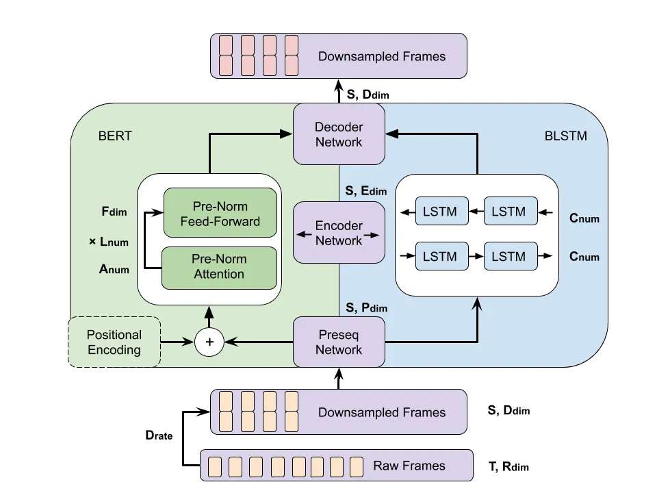
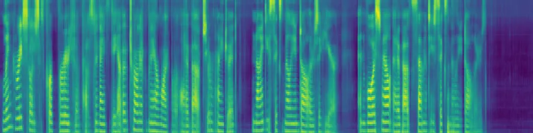
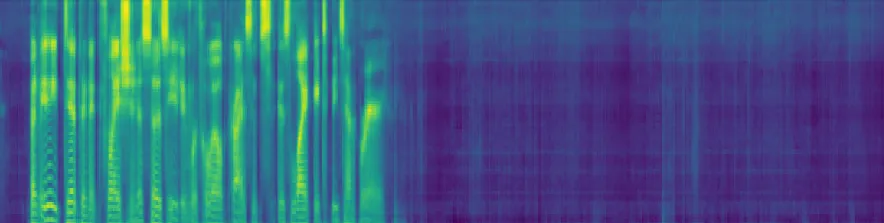
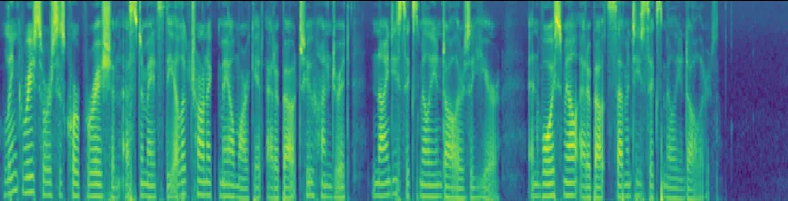
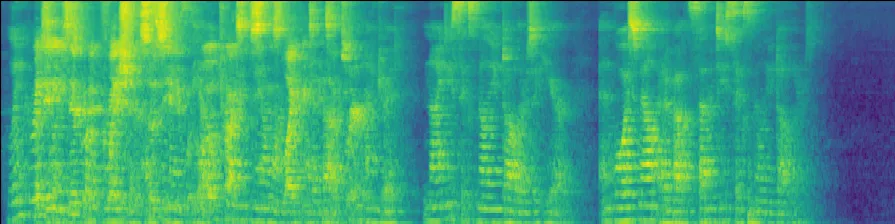

# BERT FOR JOINT MULTICHANNEL SPEECH DEREVERBERATION WITH SPATIAL-AWARE TASKS

Yang Jiao

###### Abstract

We propose a method for joint multichannel speech dereverberation with
two spatial-aware tasks: direction-of-arrival (DOA) estimation and
speech separation. The proposed method addresses involved tasks as a
sequence to sequence mapping problem, which is general enough for a
variety of front-end speech enhancement tasks. The proposed method is
inspired by the excellent sequence modeling capability of bi-directional
encoder representation from transformers (BERT). Instead of utilizing
explicit representations from pretraining in a self-supervised manner,
we utilizes transformer encoded hidden representations in a supervised
manner. Both multichannel spectral magnitude and spectral phase
information of varying length utterances are encoded. Experimental
result demonstrates the effectiveness of the proposed method.

###### Index Terms: 

Transformer Encoders, Speech Dereverberation, DOA, Speech Separation,
Microphone Arrays

^(†)^(†)address: University of Maryland, College Park, Maryland, USA  
yjiao1@umiacs.umd.edu

## 1 Introduction

Reverberation is inevitable in an enclosed room space where multipath
sound signals reflect at walls, floors and obstacles superpose at the
receiver \[1\]. This phenomenon degrades performance of indoor hearing
aid and automatic speech recognition (ASR) systems. While reverberation
falls into the category of convolutive noises, interfering speaker falls
into the category of additive noises \[2\]. Reverberated source
separation is more challenging than anechoic ones \[3\]. Besides speech
dereverberation and separation, DOA estimation is a highly-demanded task
under a multichannel setting. Again, the performance of conventional DOA
estimation method degrades with the presence of reverberation. False
spurs resulting from strong reverberation can always confuse
conventional methods such as SRP-PHAT \[4\] and MUSIC \[5\]. Those tasks
are widely studied separately; a joint approach is desirable and less
studied.

Recently, speech separation has been addressed with neural network in
time domain with TasNet \[6, 7\]. Tasnet is suitable for realtime
applications which favor low computation overhead and short processing
latency. Taking another track, a variety of speech enhancement tasks
have been extensively addressed with neural masks in the time frequency
domain\[8, 9, 10\]. Compared with time domain approaches, those methods
decouple spectral phases from spectral magnitudes. As a result, the
reconstruction of waveforms has been a nontrivial challenge. Our work
takes the time frequency domain track and models a complete utterance of
varying length. We utilize compact temporal-spectral features, allow
magnitudes and phases to be encoded; and address reconstruction with a
pretrained neural vocoder \[11\]. Customized transformer and attention
mechanism has also been studied in the speech enhancement context \[12,
13\]; however a method general enough for a variety of tasks is less
studied. We also keep the stacked transformer layers of moderate size,
comparable to a single layer BLSTM.

BERT, first proposed in natural language processing (NLP) \[14\] for
self-supervised representation learning, has achieved huge success in
improving a wide range of downstream tasks. BERT has been introduced to
self-supervised speech representation learning in \[15\]. Compared with
bi-directional long short-term memory (BLSTM), transformer network
allows flexible context range and enables integrating utterance-level
information. Transformer encoder is parallelizable, enabling deeper
network to be trained. We apply several techniques to adapt BERT from
NLP to speech, including downsampling \[16\], pre-sequence mapping
\[16\], prenorm \[17\] and T-GSA weighting\[12\].

In this paper, we consider two spatial-aware tasks jointly with
dereverberation. In the first task, there is no interfering speaker. The
model is trained to predict the DOA of the target speaker jointly with
the prediction of anechoic spectral magnitude. This setup is inspired by
\[18, 19, 20\], where it is shown that joint consideration of
voice-activity-detection (VAD) improves the performance of DOA
estimation. In the second task, the task speaker’s DOA is fixed; a
second speaker is present at different DOAs. The task is to predict
anechoic spectral magnitude for both target and the interference
speaker. The permutation confusion is implicitly resolved by the neural
network using the different spatial information of the speaker, thus no
permutation invariant training (PIT) \[21\] is applied.

## 2 PROBLEM FORMULATION

We consider a multiple channel speech dereverberation problem. In the
first task, the DOA of target signal $`x(t)`$ is denoted as $`\alpha`$.
The signal received at microphone $`m`$ in time frequency domain
$`Y_{m}`$ is given by

```math
Y_{m}(n,k)=H_{m}(n,k)\cdot X_{m}(n,k) \tag{1}
```

where $`m=1,...,C,n=1,...,T,k=1,...,K`$. $`H_{m}`$ and $`X_{m}`$
represent room transfer function from target speaker to microphone $`m`$
and target signal respectively. The goal is to estimate $`x(t)`$ and
$`\alpha`$ jointly.

In the second task, the signal received at microphone $`m`$ is given by

```math
\displaystyle Y_{m}(n,k) \displaystyle=H_{m}(n,k)\cdot X_{m}(n,k) \tag{2}
```

```math
\displaystyle+T_{m}(n,k)\cdot Z_{m}(n,k) \tag{3}
```

where $`T_{m}`$ and $`Z_{m}`$ represent room transfer function from the
interference speaker to microphone $`m`$ and interference signal
respectively. The interference signal in the time domain is denoted as
$`z(t)`$.

The goal is to estimate $`x(t)`$ and $`z(t)`$ jointly.

## 3 Proposed Method



Figure 1: Overview of proposed framework. On the left: BERT encoder in
green shade. On the right: BLSTM encoder in blue shade.

The system consists of following modules: downsample, preseq network,
sequential network, decoder, generator. In both tasks, the input tensor
$`Y\in{\mathbb{R}}^{C\times T\times F},F=160`$ is given by

```math
\displaystyle Y \displaystyle=concat(mag,phase) \tag{4}
```

```math
\displaystyle mag \displaystyle=logmel(Y_{m}(n,k=1,...,K)) \tag{5}
```

```math
\displaystyle phase \displaystyle=angle(Y_{m}(n,k=1,...,80)) \tag{6}
```

where
$`mag\in{\mathbb{R}}^{C\times T\times 80},phase\in{\mathbb{R}}^{C\times T\times 80}`$.
$`concat()`$ is along the last dimension, $`angle()`$ is taking the
phase of complex number, $`logmel()`$ is taking logarithm Melscale
spectrogram of $`80`$ bins.

The downsample operation stacks neighboring $`dr=3`$ frames to form a
super-frame, and shortens the original sequence by $`dr`$. Then, $`F`$
bins of $`C`$ channels are concatenated. Then, we obtain a tensor
$`Y^{\prime}`$ of size $`(T/dr,F\cdot dr\cdot C)`$ as input to the
preseq network and the rest of the network.

In the first task, the generator produces two tensors
$`doa\in{\mathbb{R}}^{T/dr\times cls},cls=72`$ and
$`mag^{\prime}\in{\mathbb{R}}^{T/dr\times F\cdot dr\cdot C}`$. The
prediction of DOA is obtained by voting over all frames. The loss to
train the network is given by

```math
\displaystyle{\mathcal{L}} \displaystyle=l_{2}(mag^{\prime},mag\_true) \tag{7}
```

```math
\displaystyle+cross\_entroy(doa,doa\_true) \tag{8}
```

```math
\displaystyle mag\_true \displaystyle=downsample(logmel(X_{m})) \tag{9}
```

where both $`l_{2}`$ loss and cross entropy loss is computed frame wise
and then summarized for optimization.

In the second task, the generator produces two tensors
$`mag0^{\prime}\in{\mathbb{R}}^{T/dr\times F\cdot dr\cdot C}`$ and
$`mag1^{\prime}\in{\mathbb{R}}^{T/dr\times F\cdot dr\cdot C}`$. The loss
to train the network is given by

```math
\displaystyle{\mathcal{L}} \displaystyle=l_{2}(mag0^{\prime},mag0\_true) \tag{10}
```

```math
\displaystyle+l_{2}(mag1^{\prime},mag1\_true) \tag{11}
```

```math
\displaystyle mag0\_true \displaystyle=downsample(logmel(X_{m})) \tag{12}
```

```math
\displaystyle mag1\_true \displaystyle=downsample(logmel(Z_{m})) \tag{13}
```

where $`mag0`$, $`mag1`$ stands for target speaker and interference
speaker respectively.

### 3.1 NETWORK SPECIFICATION

The preseq network is a fully-connected layer with nonlinearity that
operates on the last dimension of the input sequence $`Y^{\prime}`$. The
input is projected to a space that is suitable for direct addition with
positional encoding \[22\]

The sequential network is a stack of three transformer layers. We apply
a sinusoidal positional encoding since transformer layer is invariant to
input positions. We apply a prenorm variant of the transformer layer
\[17\], which doesn’t block the flow of gradient at the layer
normalization module.

The attention layer is a variant that only take the absolute value of
scores and apply exponentially decay weight to farther away frames. We
take initial value of $`\sigma=10`$ empirically \[12\].

Fig 1 illustrates a system diagram. The selection of hyperparameter is
summarized as
$`D_{rate}=3,F_{dim}=2048,L_{num}=3,A_{num}=8,D_{dim}=768,C_{num}=1024`$.

| Method   | T60 | Top5 1-Accuracy | Top5 MAE | Method | T60 | Top5 1-Accuracy | top5 MAE |
| -------- | --- | --------------- | -------- | ------ | --- | --------------- | -------- |
| SRP-PHAT | 0.3 | 52.10%          | 10.807   | MUSIC  | 0.3 | 61.34%          | 17.361   |
|          | 0.6 | 51.58%          | 14.863   |        | 0.6 | 63.16%          | 21.705   |
|          | 0.9 | 54.31%          | 15.112   |        | 0.9 | 65.52%          | 16.310   |

Table 1: Top-5 misclassification rate (1-Accuracy) and mean absolute
error (MAE) of SRP-PHAT and MUSIC.

| Speaker | T60 | Proposed | BLSTM  | Unprocessed | Speaker | T60 | Proposed | BLSTM  | Unprocessed |
| ------- | --- | -------- | ------ | ----------- | ------- | --- | -------- | ------ | ----------- |
| spk1    | 0.3 | 1.82/0   | 1.76/0 | 1.24/-7.38  | spk2    | 0.3 | 1.66/0   | 1.60/0 | 1.12/-5.88  |
|         | 0.6 | 1.66/0   | 1.60/0 | 1.14/-6.57  |         | 0.6 | 1.53/0   | 1.48/0 | 1.10/-5.39  |
|         | 0.9 | 1.53/0   | 1.49/0 | 1.12/-6.04  |         | 0.9 | 1.45/0   | 1.40/0 | 1.10/-6.64  |

Table 2: PESQ and SI-SDR (dB) of transformer based method, BLSTM based
method, unprocessed. Speaker 1 has a fixed DOA at 0 degree. Speaker 2
has a varying DOA from 30 to 330 degree.

| Type    | T30 | Unprocessed | No T-GSA | 0.2  | 1    | 10   | Type   | T30 | No T-GSA | 0.2  | 1    | 10   |
| ------- | --- | ----------- | -------- | ---- | ---- | ---- | ------ | --- | -------- | ---- | ---- | ---- |
| Default | 0.3 | 1.55        | 1.95     | 1.78 | 2.02 | 1.99 | Dense  | 0.3 | 1.83     | 1.78 | 1.97 | 2.01 |
| 15.22 M | 0.6 | 1.29        | 1.77     | 1.40 | 1.72 | 1.72 | 13.05M | 0.6 | 1.44     | 1.40 | 1.70 | 1.71 |
|         | 0.9 | 1.21        | 1.44     | 1.28 | 1.54 | 1.56 |        | 0.9 | 1.30     | 1.28 | 1.55 | 1.56 |

Table 3: PESQ of default and densely connected transformer layers of
different initial sigma values.

## 4 EXPERIMENTS

### 4.1 DATASET

To evaluate the proposed method, we create a synthetic dataset from the
3rd CHiME Challenge Dataset and a RIR simulator based on image-method
\[23\]. The 3rd CHiME Challenge Dataset \[24\] contains 7138 utterances
in ’tr05_org’, 410 utterances in ’dt05_bth’ and 330 utterances in
’et05_bth’, which are original clean WSJ0 data, booth recorded data and
booth recorded data respectively. For both tasks, the reverberation room
is of size \[4, 4, 2.5\] meters. We use a circular microphone array with
4 microphones, 1 meter radius, sitting at the center of the room. In the
first task, the position of the target speaker is uniformly sampled over
a circle of 1.5 meter radius, with a resolution of 5 degree. In the
second task, the position of the target speaker is fixed at degree 0;
the position of the interference speaker is uniformly sampled with a 30
degree resolution from 30 degree to 330 degree. We uniformly sample over
3 reverberation times \[0.3, 0.6, 0.9\] seconds. In the second task, the
SNR is 0dB by setting the maximum amplitude of both speakers the same.
Each utterances in the tr/dt/et set is convolved with a uniformly
sampled RIRs from all reverberation times and DOAs.

### 4.2 PREPROCESS, METRIC AND OPTIMIZATION

We apply STFT with a Hanning window of 1200 points, FFT of 2048 points
and a hop size of 300 points. The $`logmel()`$ function is operated over
80 to 7000 Hz with 80 mel bins. The feature is normalized to zero mean
and unit variance \[11\]. We use PESQ \[25\] and SI-SDR \[26\] to
evaluate our method. The network is trained with Adam optimizer. The
learning rate is warmed up over the first 1% of total 75k steps to a
maximum of 3e-4 and then linearly decayed to 0.

### 4.3 TASK 1

Table 4 compares different approaches at various reverberation times.
Mutiple-channel WPE \[27, 28\] is able to achieve the highest PESQ
across all approaches when the reverberation is not severe. For severe
reverberation, transformer and BLSTM based approaches outperform
multichannel WPE. For all conditions, transformer based approach
outperforms BLSTM based approach. Table 1 compares non-neural approaches
SRP-PHAT \[4\] and MUSIC \[5\] DOA estimation on the evaluation set
\[29\]. Neural transformer based approach misclassifies 1 out of 330
evaluation utterances. We can observe a significant performance
degradation on non-neural approaches. To count for false spikes due to
strong reverberation path, Top-5 metrics are listed along, which are
metrics that consider the best performance among the 5 most probable
DOAs given by the algorithm. The superior misclassification rate of
transformer based method indicates its effectiveness in extracting
spatial information under adverse conditions.

| T60 | Proposed | BLSTM  | WPE-1  | WPE-4  | Unproc     |
| --- | -------- | ------ | ------ | ------ | ---------- |
| 0.3 | 2.24/0   | 2.18/0 | 1.72/- | 2.82/- | 1.59/-5.34 |
| 0.6 | 2.03/0   | 1.95/0 | 1.32/- | 2.13/- | 1.28/-5.35 |
| 0.9 | 1.83/0   | 1.76/0 | 1.23/- | 1.57/- | 1.21/-5.86 |

Table 4: PESQ and SI-SDR (dB) of transformer based method, BLSTM based
method, WPE of single channel, WPE of 4 channels and unprocessed

### 4.4 TASK 2

Table 2 compares different approaches for the task of speech separation
at different reverberation times. Transformer based approach outperforms
BLSTM based method across all cases. For both metrics, we observe that
the presence of an interference speaker poses the task a much more
challenging one. To get a qualitative evaluation, we listen to the
transformer processed samples in the evaluation set. The interfering
speaker could not be heard and most degradation comes from
dereverberation and reconstruction. Figure 2 illustrates
log-mel-spectrogram before and after processing. Although the mixture
before processing provides only a smeared and superposed spectrogram,
the network is able to extract anechoic spectrogram from it for each
speaker.

|                                                             |
| ----------------------------------------------------------- |
|  |
| \(a\) speaker1 processed                                    |
|  |
| \(b\) speaker2 processed                                    |
|  |
| \(c\) speaker1 clean                                        |
|  |
| \(d\) speaker2 clean                                        |
|  |
| \(e\) mixture unprocessed                                   |

Figure 2: Log-mel spectrogram before and after applying proposed method.

### 4.5 SINGLE CHANNEL DEREVERBERATION

To better understand the transformer based approach, we evaluate its
performance on a single channel dereverberation task with different
initial sigma values. Table 3 compares different sigma initial values. A
larger value means the weight decays slower with distance and a larger
context window as a result. A larger initial sigma value outperforms
smaller values. The performance degrades when no weight is applied, due
to the difficulty in optimization when all frames are considered. The
performance also degrades when the initial signal value is smaller, when
too few frames are considered. We also consider a densely connected
transformer layer inspired by its CNN counterpart \[30\]. Comparable
performance is achieved with less parameters; same pattern of initial
sigma values is observed.

## 5 CONCLUSION

In this paper, we investigated multichannel dereverberation jointly with
direction-of-arrival (DOA) estimation or speech separation. We proposed
a transformer network that maps contaminated frames to clean frames.
Experiment results show that the transformer network is able to achieve
significantly better PESQ and SI-SDR after processing and has the
ability to perform task of DOA estimation or speech separation
simultaneously.

## References

- \[1\] Patrick A Naylor and Nikolay D Gaubitch, Speech dereverberation,
  Springer Science & Business Media, 2010.
- \[2\] Shoji Makino, Te-Won Lee, and Hiroshi Sawada, Blind speech
  separation, vol. 615, Springer, 2007.
- \[3\] Masahito Togami, “Joint training of deep neural networks for
  multi-channel dereverberation and speech source separation,” in ICASSP
  2020-2020 IEEE International Conference on Acoustics, Speech and
  Signal Processing (ICASSP). IEEE, 2020, pp. 3032–3036.
- \[4\] Joseph Hector DiBiase, A high-accuracy, low-latency technique
  for talker localization in reverberant environments using microphone
  arrays, Brown University Providence, RI, 2000.
- \[5\] Ralph Schmidt, “Multiple emitter location and signal parameter
  estimation,” IEEE transactions on antennas and propagation, vol. 34,
  no. 3, pp. 276–280, 1986.
- \[6\] Yi Luo and Nima Mesgarani, “Tasnet: time-domain audio separation
  network for real-time, single-channel speech separation,” in 2018 IEEE
  International Conference on Acoustics, Speech and Signal Processing
  (ICASSP). IEEE, 2018, pp. 696–700.
- \[7\] Yi Luo and Nima Mesgarani, “Conv-tasnet: Surpassing ideal
  time–frequency magnitude masking for speech separation,” IEEE/ACM
  transactions on audio, speech, and language processing, vol. 27, no.
  8, pp. 1256–1266, 2019.
- \[8\] Jahn Heymann, Lukas Drude, and Reinhold Haeb-Umbach, “Neural
  network based spectral mask estimation for acoustic beamforming,” in
  2016 IEEE International Conference on Acoustics, Speech and Signal
  Processing (ICASSP). IEEE, 2016, pp. 196–200.
- \[9\] Donald S Williamson, Yuxuan Wang, and DeLiang Wang, “Complex
  ratio masking for monaural speech separation,” IEEE/ACM transactions
  on audio, speech, and language processing, vol. 24, no. 3, pp.
  483–492, 2015.
- \[10\] Ke Tan and DeLiang Wang, “A convolutional recurrent neural
  network for real-time speech enhancement.,” in Interspeech, 2018, pp.
  3229–3233.
- \[11\] Ryuichi Yamamoto, Eunwoo Song, and Jae-Min Kim, “Parallel
  wavegan: A fast waveform generation model based on generative
  adversarial networks with multi-resolution spectrogram,” in ICASSP
  2020-2020 IEEE International Conference on Acoustics, Speech and
  Signal Processing (ICASSP). IEEE, 2020, pp. 6199–6203.
- \[12\] Jaeyoung Kim, Mostafa El-Khamy, and Jungwon Lee, “T-gsa:
  Transformer with gaussian-weighted self-attention for speech
  enhancement,” in ICASSP 2020-2020 IEEE International Conference on
  Acoustics, Speech and Signal Processing (ICASSP). IEEE, 2020, pp.
  6649–6653.
- \[13\] Xiang Hao, Changhao Shan, Yong Xu, Sining Sun, and Lei Xie, “An
  attention-based neural network approach for single channel speech
  enhancement,” in ICASSP 2019-2019 IEEE International Conference on
  Acoustics, Speech and Signal Processing (ICASSP). IEEE, 2019, pp.
  6895–6899.
- \[14\] Jacob Devlin, Ming-Wei Chang, Kenton Lee, and Kristina
  Toutanova, “Bert: Pre-training of deep bidirectional transformers for
  language understanding,” arXiv preprint arXiv:1810.04805, 2018.
- \[15\] Andy T Liu, Shu-wen Yang, Po-Han Chi, Po-chun Hsu, and Hung-yi
  Lee, “Mockingjay: Unsupervised speech representation learning with
  deep bidirectional transformer encoders,” in ICASSP 2020-2020 IEEE
  International Conference on Acoustics, Speech and Signal Processing
  (ICASSP). IEEE, 2020, pp. 6419–6423.
- \[16\] Ngoc-Quan Pham, Thai-Son Nguyen, Jan Niehues, Markus Müller,
  Sebastian Stüker, and Alexander Waibel, “Very deep self-attention
  networks for end-to-end speech recognition,” arXiv preprint
  arXiv:1904.13377, 2019.
- \[17\] Qiang Wang, Bei Li, Tong Xiao, Jingbo Zhu, Changliang Li,
  Derek F Wong, and Lidia S Chao, “Learning deep transformer models for
  machine translation,” arXiv preprint arXiv:1906.01787, 2019.
- \[18\] Wolfgang Mack, Ullas Bharadwaj, Soumitro Chakrabarty, and
  Emanuël AP Habets, “Signal-aware broadband doa estimation using
  attention mechanisms,” in ICASSP 2020-2020 IEEE International
  Conference on Acoustics, Speech and Signal Processing (ICASSP). IEEE,
  2020, pp. 4930–4934.
- \[19\] Wangyou Zhang, Ying Zhou, and Yanmin Qian, “Robust doa
  estimation based on convolutional neural network and time-frequency
  masking.,” in INTERSPEECH, 2019, pp. 2703–2707.
- \[20\] Reza Varzandeh, Kamil Adiloğlu, Simon Doclo, and Volker
  Hohmann, “Exploiting periodicity features for joint detection and doa
  estimation of speech sources using convolutional neural networks,” in
  ICASSP 2020-2020 IEEE International Conference on Acoustics, Speech
  and Signal Processing (ICASSP). IEEE, 2020, pp. 566–570.
- \[21\] Dong Yu, Morten Kolbæk, Zheng-Hua Tan, and Jesper Jensen,
  “Permutation invariant training of deep models for speaker-independent
  multi-talker speech separation,” in 2017 IEEE International Conference
  on Acoustics, Speech and Signal Processing (ICASSP). IEEE, 2017, pp.
  241–245.
- \[22\] Ashish Vaswani, Noam Shazeer, Niki Parmar, Jakob Uszkoreit,
  Llion Jones, Aidan N Gomez, Łukasz Kaiser, and Illia Polosukhin,
  “Attention is all you need,” in Advances in neural information
  processing systems, 2017, pp. 5998–6008.
- \[23\] Eric A Lehmann and Anders M Johansson, “Prediction of energy
  decay in room impulse responses simulated with an image-source model,”
  The Journal of the Acoustical Society of America, vol. 124, no. 1, pp.
  269–277, 2008.
- \[24\] Jon Barker, Ricard Marxer, Emmanuel Vincent, and Shinji
  Watanabe, “The third ‘chime’speech separation and recognition
  challenge: Dataset, task and baselines,” in 2015 IEEE Workshop on
  Automatic Speech Recognition and Understanding (ASRU). IEEE, 2015, pp.
  504–511.
- \[25\] Antony W Rix, John G Beerends, Michael P Hollier, and Andries P
  Hekstra, “Perceptual evaluation of speech quality (pesq)-a new method
  for speech quality assessment of telephone networks and codecs,” in
  2001 IEEE International Conference on Acoustics, Speech, and Signal
  Processing. Proceedings (Cat. No. 01CH37221). IEEE, 2001, vol. 2, pp.
  749–752.
- \[26\] Jonathan Le Roux, Scott Wisdom, Hakan Erdogan, and John R
  Hershey, “Sdr–half-baked or well done?,” in ICASSP 2019-2019 IEEE
  International Conference on Acoustics, Speech and Signal Processing
  (ICASSP). IEEE, 2019, pp. 626–630.
- \[27\] Lukas Drude, Jahn Heymann, Christoph Boeddeker, and Reinhold
  Haeb-Umbach, “Nara-wpe: A python package for weighted prediction error
  dereverberation in numpy and tensorflow for online and offline
  processing,” in Speech Communication; 13th ITG-Symposium. VDE, 2018,
  pp. 1–5.
- \[28\] Tomohiro Nakatani, Takuya Yoshioka, Keisuke Kinoshita, Masato
  Miyoshi, and Biing-Hwang Juang, “Speech dereverberation based on
  variance-normalized delayed linear prediction,” IEEE Transactions on
  Audio, Speech, and Language Processing, vol. 18, no. 7, pp.
  1717–1731, 2010.
- \[29\] Robin Scheibler, Eric Bezzam, and Ivan Dokmanić,
  “Pyroomacoustics: A python package for audio room simulation and array
  processing algorithms,” in 2018 IEEE International Conference on
  Acoustics, Speech and Signal Processing (ICASSP). IEEE, 2018, pp.
  351–355.
- \[30\] Gao Huang, Zhuang Liu, Laurens Van Der Maaten, and Kilian Q
  Weinberger, “Densely connected convolutional networks,” in Proceedings
  of the IEEE conference on computer vision and pattern recognition,
  2017, pp. 4700–4708.
