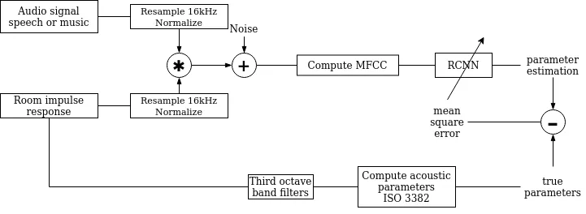
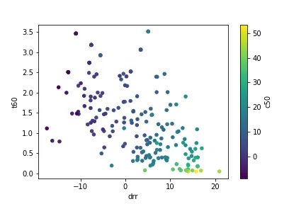
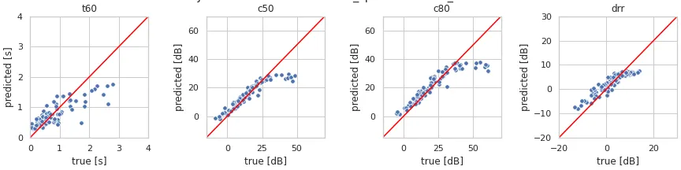

# JOINT BLIND ROOM ACOUSTIC CHARACTERIZATION FROM SPEECH AND MUSIC SIGNALS USING CONVOLUTIONAL RECURRENT NEURAL NETWORKS

Paul Callens    Milos Cernak

###### Abstract

Acoustic environment characterization opens doors for sound reproduction
innovations, smart EQing, speech enhancement, hearing aids, and
forensics. Reverberation time, clarity, and direct-to-reverberant ratio
are acoustic parameters that have been defined to describe reverberant
environments. They are closely related to speech intelligibility and
sound quality. As explained in the ISO3382 standard, they can be derived
from a room measurement called the Room Impulse Response (RIR). However,
measuring RIRs requires specific equipment and intrusive sound to be
played. The recent audio combined with machine learning suggests that
one could estimate those parameters blindly using speech or music
signals. We follow these advances and propose a robust end-to-end method
to achieve blind joint acoustic parameter estimation using speech and/or
music signals. Our results indicate that convolutional recurrent neural
networks perform best for this task, and including music in training
also helps improve inference from speech.

###### Index Terms: 

Room acoustics, Convolutional Recurrent neural network, RT60, C50, DRR

^(†)^(†)address: ¹École Polytechnique Fédérale de Lausanne (EPFL), 1015,
Lausanne, Switzerland  
²Logitech Europe S.A., 1015, Lausanne, Switzerland

## 1 INTRODUCTION

A source sound signal $`x(t)`$ coming from a speaker is subject to
reverberations and noise $`n(t)`$ when played in a room. The resulting
signal can be expressed as:

```math
y(t)=x(t)*h(t)+n(t)
```

with $`h(t)`$ the room impulse response (RIR). RIR can be measured with
the sine-sweep technique \[1\]. It consists of emitting a logarithmic
sine-sweep sound with a speaker to excite every frequency one after
another. A microphone picks up the direct and reverberant signals from
another spot in the room from which the room impulse response is
reconstructed.

Standard acoustic parameters \[2\] have been derived from the RIR to
describe the characteristics of a room with measures closer to human
perceptions. We focused on room characteristics that describe how
pleasant music will sound or speech will be intelligible: (i)
Reverberation time (RT60) is defined by the time it takes for the sound
energy to decay 60dB after the source is switched off; (ii) Clarity
(C50/C80) is measured by calculating the ratio between the early
reflections energy (up to 50/80ms) and the energy of the late response
from the decay curve; (iii) Direct-to-Reverberant Ratio (DRR), which,
similarly to C50, is a ratio of the direct sound energy over the later
energy, considering that the direct sound is included in the leading 2.5
milliseconds of the RIR.

Many attempts to characterize room acoustics were conducted in the last
decade. In 2015, the ACE challenge \[3\] was organized to stimulate
research and establish state of the art in the domain. The majority of
the proposed techniques were non-machine-learning based methods. In
2018, Gamper and Tashev used Convolutional Neural Networks (CNNs) and
Gammatone filterbanks to predict the average RT60 of a reverberant
signal \[4\], and outperformed the best ACE challenge method. Recent
work of Looney and Gaubitch \[5\] showed promising results in the joint
blind estimation of RT60, DRR, and Signal-to-Noise Ratio (SNR). The
majority of previous studies used the input speech signals only. Music
was considered only in a few other cases \[6, 7\].

Instead of room acoustic parameter prediction, some works try to
classify the rooms directly. For example, recent comparison \[8\] of
different deep neural network architectures: CNNs, Recurrent Neural
networks, and Convolutional-Recurrent Neural Networks (CRNNs) on the
classification of 7 separate rooms from the ACE challenge using
reverberant speech showed that the CRNN architecture performed the best.

All previous studies of blind acoustic environment characterization
explored mostly CNNs architectures. In this work, we try to find the
decay of a signal, and it makes sense considering the sequence aspect of
data, and thus using recurrent layers might be beneficial. Besides, we
aim to perform a joint estimation of RT60, C50, C80, and DRR parameters
and using individual or mixed input speech and music signals. To our
knowledge, using deep learning for acoustic room characterization from
music has not been studied.

The paper is structured as follows: Section 2 introduces the proposed
methods, Section 3 describes experimental setup, Section 4 presents the
results and Section 5 discusses the results and concludes the paper.



Figure 1: Overall acoustic parameter estimation pipeline.

## 2 Proposed methods

CRNN architectures have been used to estimate room acoustic parameters
from pre-processed reverberant and noisy audio inputs. The research
method consisted of 3 main steps: i) data preparation, ii) data pipeline
incl. input and output feature extraction and normalization, and iii)
designing and training neural networks.

### 2.1 Data preparation

The methods used to compute acoustic parameters from room impulse
responses have some limitations. In our analysis, some RT60 values were
too high to be real (over 10 seconds). These errors are probably due to
too high background noise. We thus discarded RIRs with reverberation
times above four seconds. In reality, four seconds is about the
reverberation of a church, which can be considered extreme.

All the audio samples are normalized, each using min-max normalization,
assuming that the min of an audio signal corresponds to silence and thus
should be zero: $`S_{norm}=S/max(|S|)`$.

The duration of input audio samples was a hard choice to make and
required many trials. We tried to find a good compromise between
computation time (that would get larger for longer signals), model
complexity, and evaluation score. After many tests, we decided to use
the 8 seconds chunks of the music and speech signals from our dataset,
as they were a good compromise for both music and speech. The beginning
of the RIR recordings was trimmed until the onset for more uniformity
within the dataset.

### 2.2 Data pipeline

Figure 1 shows the pre-processing pipeline. The true acoustic values are
extracted from the RIR recordings to give us true parameter values for
the network output. Besides, the audio signals are processed to simulate
reverberation and noise. Lastly, a spectral representation of the signal
is computed to be used as input for the neural networks.

The true acoustic parameters are computed as defined in the
International Standard of Room Acoustic Measurements, ISO3382 \[9\]. The
ISO standard suggests to perform a linear least-square fit to the -5dB
to -35dB. That yields RT30 (the time it takes for SPL to drop 30dB). It
is then extrapolated to RT60 by multiplying by a factor of 2. For each
parameter, frequency-dependent values were computed and then averaged.
To get frequency-dependent acoustic parameters, we applied a band-pass
filter to the RIR signals before deriving RT60, C50, C80, and DRR. The
center frequency bands for those filters were chosen by octaves
accordingly to ISO 266:1997 standard \[10\] between 125Hz and 4kHz. The
higher octave, 8kHz, would not allow applying a band-pass filter to
satisfy the Nyquist sampling criterion with 16kHz samples. Finally,
acoustic parameters were found for the following octave bands: 125, 250,
500, 1K, 2K, and 4K.

Figure 2 shows the distribution of the measured acoustic parameters from
our set of RIRs after it has been balanced. It also highlights the
correlation between T60, DRR, and C50, which can be interpreted as the
fact that a room with a high reverberation goes along with lower clarity
and direct-to-reverberant ratio; thus, the speech will be harder to
understand.



Figure 2: Distribution of the measured acoustic parameters

### 2.3 Evaluation metrics

Two metrics are computed to compare the models. The Mean Absolute
Percentage Error (MAPE) and the Root Mean Square Error (RMSE):

```math
\epsilon_{M}=\text{MAPE}=\frac{100\%}{n}\sum_{i=1}^{n}\left\lvert\frac{y_{pred}-y_{true}}{y_{true}}\right\rvert[\%]
```

```math
\epsilon_{R}=\text{RMSE}=\sqrt{\sum_{i=1}^{n}\frac{(y_{pred}-y_{true})^{2}}{N}}[s\text{ or }dB]
```

## 3 Experimental framework

### 3.1 Data

The dataset is composed of music and speech, collected from the MUSAN
dataset \[11\], and RIRs, gathered from online open-source libraries :
OpenAirLib \[12\], echo-thief \[13\], MIT IR Survey \[14\], and RWCP
\[15\]. Fifteen RIR measurements have also been made in-house for
testing purposes. From these same RIRs, acoustic parameters are computed
to be used as reference values for algorithm training. The MUSAN data is
split into 80/20% training and testing subsets, respectively. The 406
collected RIRs were split into 306 used for training and 100 for
testing.

All the data is normalized and downsampled to mono-channel 16kHz. The
speech and music audio files are trimmed to 8 seconds. Reverberation is
simulated by convolving speech and music with RIRs and adding noise.
Random Gaussian noise is added to the reverberant signal at the SNRs of
15, 10, 5, and 0 dB. Mel Frequency Cepstral Coefficients (MFCC) features
are computed from noisy reverberant audio and used as input for the
neural network. For our experiments, we used 25ms frame size and 10ms
frame steps. The MFCCs were obtained using Librosa \[16\].

### 3.2 Neural Network

Table 1 shows the architectures of the baseline and two proposed models.
The baseline \[5\] represents the state-of-the-art model for the joint
blind estimation of acoustic parameters, and the CRNN1 adds two more
recurrent layers. Both the baseline and CRNN1 use the ReLU activation
functions. The number of trainable parameters is rather high, and thus
we propose the CRNN2 model that has almost five times fewer parameters,
and is more suitable for embedded platforms.

|        |                                           |           |           |
| ------ | ----------------------------------------- | --------- | --------- |
|        | (size) / (kernel size, number of filters) |           |           |
| Model  | Baseline                                  | CRNN1     | CRNN2     |
| layers | \#1.66M                                   | \#1.74M   | \#369K    |
| 1      | C(5, 256)                                 | C(5, 256) | C(3, 64)  |
| 2      | C(5, 256)                                 | C(5, 256) | C(3, 128) |
| 3      | D(64)                                     | G(64)     | C(3, 128) |
| 4      | D(4)                                      | G(64)     | C(3, 128) |
| 5      | \-                                        | D(64)     | G(32)     |
| 6      | \-                                        | D(4)      | G(32)     |
| 7      | \-                                        | \-        | D(128)    |
| 8      | \-                                        | \-        | D(64)     |
| 9      | \-                                        | \-        | D(4)      |

Table 1: Model architectures of the baseline \[5\] and two our proposed
CRNNs. The output classes are RT60, C50, C80, and DRR. “C“ stands for
Conv2D, “G“ for GRU, and “D“ for Dense layers.

Batch normalization, dropout, and max pooling methods is used with the
Conv2D layers. The CRNN2 model uses the ELU activation function. To
optimize the training process of the all three models, batch training
with the size of 64, early stopping with patience set to 15, ADAM
optimizer \[17\] with the learning rate $`\alpha=0.001`$, and the mean
square error loss is implemented.

## 4 Results



Figure 3: Performance of the joint blind estimation on audio, mixed
speech and music, data.

Table 2 shows the evaluation of the joint blind estimators on the
training and testing speech signals. Both proposed models outperform the
baseline for the T60, C50, and C80 parameters. Except for the DRR
parameter, the CRNN2 performs in most cases the best.

|          | T60              |                  | C50              |                  | C80              |                  | DRR              |                  |
| -------- | ---------------- | ---------------- | ---------------- | ---------------- | ---------------- | ---------------- | ---------------- | ---------------- |
| Method   | $`\epsilon_{M}`$ | $`\epsilon_{R}`$ | $`\epsilon_{M}`$ | $`\epsilon_{R}`$ | $`\epsilon_{M}`$ | $`\epsilon_{R}`$ | $`\epsilon_{M}`$ | $`\epsilon_{R}`$ |
| Baseline | 65               | 0.4              | 41               | 6.7              | 34               | 8.5              | 116              | 3.0              |
| CRNN1    | 55               | 0.4              | 42               | 6.5              | 33               | 8.2              | 126              | 3.2              |
| CRNN2    | 54               | 0.4              | 41               | 6.5              | 32               | 8.2              | 120              | 3.1              |

Table 2: Speech estimation errors $`\epsilon_{M}`$ and $`\epsilon_{R}`$
obtained with the speech estimator.

Table 3 shows the evaluation of the joint blind estimators on the
training and testing music signals. The CRNN1 model outperforms the
baseline. In contrast to the speech evaluation, the CRNN2 performs
competitively for the music signals only to estimate clarity parameters.

Figure 3 shows the performance of the joint blind estimation on audio
(mixed speech and music) data. We see that the estimates degrade with
more challenging environments with stronger late reverberation. Table 4
shows the evaluation of the joint audio estimators on the speech
signals. Surprisingly, we see a significant positive effect of training
music and speech together; this system even outperforms the estimator
train on pure speech (Table 2).

|          | T60              |                  | C50              |                  | C80              |                  | DRR              |                  |
| -------- | ---------------- | ---------------- | ---------------- | ---------------- | ---------------- | ---------------- | ---------------- | ---------------- |
| Method   | $`\epsilon_{M}`$ | $`\epsilon_{R}`$ | $`\epsilon_{M}`$ | $`\epsilon_{R}`$ | $`\epsilon_{M}`$ | $`\epsilon_{R}`$ | $`\epsilon_{M}`$ | $`\epsilon_{R}`$ |
| Baseline | 139              | 0.6              | 93               | 11.9             | 85               | 14.5             | 197              | 5.2              |
| CRNN1    | 126              | 0.6              | 87               | 10.9             | 83               | 13.3             | 193              | 5.0              |
| CRNN2    | 152              | 0.6              | 80               | 12.0             | 72               | 14.6             | 208              | 5.7              |

Table 3: Music estimation errors $`\epsilon_{M}`$ and $`\epsilon_{R}`$
obtained with the music estimator.

|          | T60              |                  | C50              |                  | C80              |                  | DRR              |                  |
| -------- | ---------------- | ---------------- | ---------------- | ---------------- | ---------------- | ---------------- | ---------------- | ---------------- |
| Method   | $`\epsilon_{M}`$ | $`\epsilon_{R}`$ | $`\epsilon_{M}`$ | $`\epsilon_{R}`$ | $`\epsilon_{M}`$ | $`\epsilon_{R}`$ | $`\epsilon_{M}`$ | $`\epsilon_{R}`$ |
| Baseline | 63               | 0.4              | 48               | 6.9              | 45               | 8.9              | 132              | 3.3              |
| CRNN1    | 55               | 0.4              | 43               | 6.4              | 37               | 8.1              | 138              | 3.3              |
| CRNN2    | 50               | 0.3              | 42               | 6.4              | 34               | 8.0              | 127              | 3.2              |

Table 4: Speech estimation errors $`\epsilon_{M}`$ and $`\epsilon_{R}`$
obtained with the audio (trained on mixed speech + music) estimator.

### 4.1 Robustness to noise

All results reported in the previous section were averaged for all
considered SNRs. However, the performance was stable for all noise
conditions. For example, the T60 $`\epsilon_{M}`$ was 50, 49, 49, and
51, for the SNRs of \[15, 10, 5, 0\] dB, respectively.

## 5 Discussion and conclusion

We proposed an end-to-end method to blindly and jointly estimate four
acoustic parameters, namely reverberation time (RT60),
direct-to-reverberant ratio (DRR), and clarity (C50 and C80). Two kinds
of input signals were investigated: speech and music. Our explorations
focused on two novel aspects of the joint estimation of acoustic
parameters for room characterization. First, novel CRNN architectures
have been designed that outperform current state-of-the-art systems. Our
results showed that using recurrent layers is beneficial for the
explored task. Second, models were trained to estimate parameters using
music signals, which, contrary to speech signals, have not been subject
to many studies. Finally, we showed that combining music with the speech
signals in training improves the speech signals’ inference.

However, the results show that music is less suitable for parameter
estimation. One possible explanation is that the notes are tempered on a
specific scale. Contrary to speech, music played by instruments usually
does not stop sharply. Thus, fewer decay curves are available, which
makes the task harder. Moreover, reverberation is a widely used effect
in music production. This effect, used with moderation, generally has a
positive impact on our music experience. It is likely that this effect
added up with the convolution we applied to music signals, which
introduced bias in the estimations.

The music, speech, and RIR samples were carefully split for training and
testing, and a mixture of datasets has been used. This care was taken to
ensure the validity of the results and our algorithm’s robustness
against noise and unseen examples. However, the validity of impulse
response measurements can be discussed. The analysis of available
datasets containing multiple acoustic measurements for one room showed
that there could be considerable variations between acoustic parameter
values within the same room. Thus, our true values for acoustic
parameters are also subject to uncertainty, reflecting on the
estimations.

For this research, more than 160 models were trained, with more than 1TB
of audio data. During these explorations, some parameters have been
chosen by intuition and flair. In the future, we would like to focus on
the estimation of other characteristics of a room like its volume or the
speaker’s distance to the closest wall.

## 6 Acknowledgements

This work was realized during a six-month internship at Logitech.

## References

- \[1\] Angela Farina, “Simultaneous measurement of impulse response and
  distortion with a swept-sine technique,” Proc. AES 108th conv, Paris,
  France, 2000.
- \[2\] BS EN ISO 3382-1:2009, “Acoustics - Measurement of room acoustic
  parameters. Part 1:Performance spaces,” British Standard, 2009.
- \[3\] James Eaton, Nikolay D Gaubitch, Alastair H Moore, and Patrick A
  Naylor, “Estimation of room acoustic parameters: The ace challenge,”
  IEEE/ACM Transactions on Audio, Speech, and Language Processing, vol.
  24, no. 10, pp. 1681–1693, 2016.
- \[4\] Hannes Gamper and Ivan J Tashev, “Blind reverberation time
  estimation using a convolutional neural network,” in 2018 16th
  International Workshop on Acoustic Signal Enhancement (IWAENC). IEEE,
  2018, pp. 136–140.
- \[5\] David Looney and Nikolay D Gaubitch, “Joint estimation of
  acoustic parameters from single-microphone speech observations,” in
  ICASSP 2020-2020 IEEE International Conference on Acoustics, Speech
  and Signal Processing (ICASSP). IEEE, 2020, pp. 431–435.
- \[6\] Paul Kendrick, Trevor J Cox, Francis F Li, Yonggang Zhang, and
  Jonathon A Chambers, “Monaural room acoustic parameters from music and
  speech,” The Journal of the Acoustical Society of America, vol. 124,
  no. 1, pp. 278–287, 2008.
- \[7\] Nils Peters, Howard Lei, and Gerald Friedland, “Name that room:
  Room identification using acoustic features in a recording,” in
  Proceedings of the 20th ACM international conference on Multimedia,
  2012, pp. 841–844.
- \[8\] Constantinos Papayiannis, Christine Evers, and Patrick A Naylor,
  “End-to-end classification of reverberant rooms using dnns,” arXiv
  preprint arXiv:1812.09324, 2018.
- \[9\] International Standards Organization, “Acoustics—measurement of
  room acoustic parameters—part 1: Performance spaces (iso 3382-1:
  2009),” 2009.
- \[10\] ISO ISO, “266,” Acoustics–preferred frequencies for
  measurements, 1997.
- \[11\] David Snyder, Guoguo Chen, and Daniel Povey, “MUSAN: A Music,
  Speech, and Noise Corpus,” 10 2015.
- \[12\] Kenneth I. Brown, Matthew Paradis, and Damian T. Murphy,
  “OpenAirLib: A JavaScript library for the acoustics of spaces,” in
  142nd Audio Engineering Society International Convention 2017, AES
  2017, 2017.
- \[13\] Chris Warren, “EchoThief Impulse Response Library,”
  http://www.echothief.com/.
- \[14\] James Traer and Josh H. McDermott, “MIT IR survey dataset,” 2016.
- \[15\] Satoshi Nakamura, Kazuo Hiyane, Futoshi Asano, Takanobu
  Nishiura, and Takeshi Yamada, “Acoustical sound database in real
  environments for sound scene understanding and hands-free speech
  recognition,” in 2nd International Conference on Language Resources
  and Evaluation, LREC 2000, 2000.
- \[16\] Brian McFee, Colin Raffel, Dawen Liang, Daniel PW Ellis, Matt
  McVicar, Eric Battenberg, and Oriol Nieto, “librosa: Audio and music
  signal analysis in python,” in Proceedings of the 14th python in
  science conference, 2015, vol. 8, pp. 18–25.
- \[17\] Diederik P Kingma and Jimmy Ba, “Adam: A method for stochastic
  optimization,” arXiv preprint arXiv:1412.6980, 2014.
