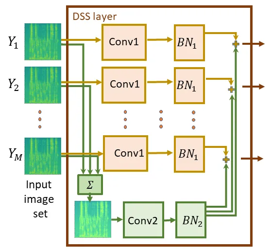

# Scene-Agnostic Multi-Microphone Speech Dereverberation

Yochai Yemini    Ethan Fetaya    Haggai Maron    Sharon Gannot

###### Abstract

\Acp

NN have been widely applied in speech processing tasks, and, in
particular, those employing microphone arrays. Nevertheless, most
existing NN architectures can only deal with fixed and position-specific
microphone arrays. In this paper, we present an NN architecture that can
cope with microphone arrays whose number and positions of the
microphones are unknown, and demonstrate its applicability in the speech
dereverberation task. To this end, our approach harnesses recent
advances in deep learning on set-structured data to design an
architecture that enhances the reverberant log-spectrum. We use noisy
and noiseless versions of a simulated reverberant dataset to test the
proposed architecture. Our experiments on the noisy data show that the
proposed scene-agnostic setup outperforms a powerful scene-aware
framework, sometimes even with fewer microphones. With the noiseless
dataset we show that, in most cases, our method outperforms the
position-aware network as well as the state-of-the-art WPE (WPE)
algorithm.

^(†)^(†)footnotetext: This project has received funding from the
European Union’s Horizon 2020 Research and Innovation Programme, Grant
Agreement No. 871245.

^(†)^(†)address: ¹Faculty of Engineering, Bar-Ilan University,
Ramat-Gan, 5290002, Israel  
²NVIDIA Research^(†)^(†)email:
{Yochai.Yemini,Ethan.Fetaya,Sharon.Gannot}@biu.ac.il,hmaron@nvidia.com

Index Terms: Speech dereverberation, deep neural network, deep sets,
microphone array

## 1 Introduction

As a sound wave propagates in an acoustic enclosure, it reflects from
the room’s facets and from the objects within the room. A microphone in
that room will capture both the direct path signal and the associated
reflections. This phenomenon, known as reverberation, negatively impacts
speech quality and, in severe cases, even its intelligibility \[1\],
posing difficulties to hearing impaired people as well as to ASR (ASR)
systems. With the soaring popularity of ASR based agents such as Amazon
Alexa, Microsoft Cortana, Google Assistant and Apple Siri, mitigating
reverberation is further incentivised.

In many cases, we have access to several audio signals that are captured
by different microphones. For example, any modern mobile-phone is
equipped with at least two microphones. Importantly, having access to
several recordings of the same audio signal enables algorithms to
reinforce spectral cues with spatial information, leading to better
results compared to the single microphone case. For approaches that
require a training stage, there may exist two main inconsistencies
between the training and test conditions with respect to: (1) the number
of microphones (2) the geometry and the position of the microphone
array.

In realistic scenes, the number of microphones can vary over time.
Usually, learning-based paradigms cannot straightforwardly accommodate
such modifications to the scene. In order to be invariant to the number
of microphones, several systems have to be trained, each for a specific
number of microphones. The relative positions of the microphones may
also change. In a _position-aware_ setup they are constant and known,
e.g. a fixed microphone array. In a _position-agnostic_ setup we do not
have any prior information on the relative positions of the microphones.
For example, this is the case when several different people capture the
same audio signal spontaneously at a concert or a lecture \[2\]. We dub
an algorithm which is both position-agnostic and invariant to the number
of microphones as _scene-agnostic_.

In general, traditional speech processing algorithms are designed to
deal with both scene-aware and scene-agnostic cases. In the context of
speech dereverberation, a plethora of methods exists \[3, 4\]. Several
approaches use an estimation scheme for filter coefficients. In the STFT
(STFT) domain, reverberation can be modelled as a convolution along
frames between the clean STFT and a reverberation filter, independently
for each frequency. In \[5\], the inverse of this filter is estimated by
minimising the WPE. In \[6\], the authors follow a iterative
expectation-maximization paradigm to directly estimate the reverberation
filters and to jointly dereverberate the signal using the Kalman filter
algorithm. A different approach \[7, 8\] deploys a late reverberation
analysis to devise a dereverberation system.

In this paper we tackle the more general scene-agnostic setup for NN
(NN)-based algorithms. We wish to harness the power of NN, while
circumventing their drawbacks. In the proposed scheme, the network takes
as an input several distorted audio signals represented as log-spectra
and predicts a single high quality spectrogram of the underlying audio
signal. The main challenge here is devising an NN architecture that is
suitable for the scenario at hand. There are two main requirements:
first, the architecture should be _invariant_ to the number and order
permutations of the signals; second, it should respect the fine details
of the spectrogram image, namely to be able to reconstruct its complex
structures such as the pitch and formants.

Previous approaches successfully dealt with only one of these
requirements: for example, the multi-microphone setup is often dealt
with by concatenating the per microphone STFT along the channel axis
\[9, 10, 11\]. This approach is useful when the array geometry is fixed.
However, permuting the indices within the array while maintaining the
positions or changing the respective geometry of the microphones and
their positions, will lead to a mismatch with respect to the training
data, and possible degradation in reconstruction quality. Another
critical setback that this architecture raises is its incompatibility to
a variable number of microphones. A recent line of studies has taken
steps to mitigate this problem by adopting the _Deep Sets_ \[12\]
paradigm for speech separation, e.g. \[13, 14\].

In this work, dereverberation is carried out via log-spectrum
enhancement while the phase remains unaltered, rendering the problem an
image-like estimation. To address both challenges mentioned above, we
leverage a recently suggested architecture for learning sets of
symmetric elements \[15\]. This framework captures both the set symmetry
and the intrinsic symmetries of each element in the set by replacing
convolution layers with DSS (DSS) layers.

To demonstrate the efficacy of our approach we provide an extensive
experimental evaluation on a new simulated dataset. We strive for making
this dataset publicly available, to encourage further research in the
field of scene-agnostic NNs. The new dataset comprises several realistic
scenarios that represent different positioning of the microphones in
various rooms and reverberation conditions.

## 2 Problem Formulation

Let $`x(t)`$ denote the anechoic signal in the discrete-time domain. The
reverberant signal can be described as the convolution between $`x(t)`$
and the reverberant RIR (RIR). Therefore, given a microphone array with
$`M`$ microphones, the received signal at each microphone is

```math
y_{i}(t)=\{x\ast h_{i}\}(t)+n_{i}(t),\quad i=1,2,\ldots,M \tag{1}
```

where $`h_{i}(t)`$ and $`n_{i}(t)`$ are the per microphone RIR and
low-level stationary noise, respectively. The objective is to estimate
$`x(t)`$ given the corrupted observations $`\{y_{i}(t)\}_{i=1}^{M}`$.

To achieve this goal, the signals are first transformed to the
log-spectrum representation. Let $`Y_{i}(n,k)`$ denote the log-spectrum
of $`y_{i}(t)`$, i.e. the log-absolute value of the STFT of $`y_{i}(t)`$
at the $`n`$-th frame and the $`k`$-th frequency bin, where
$`k=0,1,\ldots,K-1`$. Due to the symmetry of the DFT (DFT), only the
first $`K/2+1`$ frequency elements are considered. Denote $`F=K/2`$. For
brevity, the time and frequency indices will be omitted when they are
unnecessary for the clarity of the paper.

In this work, an NN is used to predict $`X`$, the log-spectrum of the
clean speech signal. After the enhanced log-spectrum is obtained, it is
transformed back to the time domain using the noisy phase of the STFT
from the microphone that recorded the signal with the largest power. We
have two requirements from the network. Firstly, for a specific value of
$`M`$, the network’s output must remain the same for any permutation of
$`\{Y_{i}\}_{i=1}^{M}`$. Secondly, we want a single network to be
capable of processing $`\{Y_{i}\}_{i=1}^{M}`$ for several values of
$`M`$.

Note that naïve concatenation of the multi-microphone input along the
feature axis of the network does not guarantee any sort of invariance,
neither with respect to the number of microphones nor their positions.
Therefore, we expect it to be less suitable for scene-agnostic
processing.



Figure 1: The DSS layer \[15\] used in this work, composed of a Siamese
network applied independently to each image and an aggregation branch,
realised as a sum operation. The Siamese network and the aggregation
branch use distinct convolution and BN layers.

## 3 Algorithm

The proposed method is inspired by several studies. It is based on
dereverberation via image deblurring in the log-spectrum domain \[16\]
using a U-net architecture \[17\] that estimates a clean spectrogram
directly from the reverberated one. This approach demonstrated promising
results, surpassing several baselines by a significant margin. We extend
it to the multi-microphone case by deploying the powerful burst image
deblurring framework \[18\], which takes in a set of blurry images and
outputs a clean image. A U-net architecture with DSS layers \[15\]
serves as our network of choice. The invariance property of the DSS
layer allows the network to process ad hoc distributed microphone
arrays, in addition to fixed geometry arrays. The DSS layers can be
coupled with other architectures, such as the one in \[19\].

Preprocessing: For a given set of reverberant time-domain samples
$`\{y_{i}(t)\}_{i=1}^{M}`$, a preprocessing step first normalises the
RMS (RMS) across all $`M`$ signals to a constant value of 0.1. Then, the
log-spectra images $`\{Y_{i}\}_{i=1}^{M}`$ are computed. The $`M`$
log-spectra are divided to slices of 256 frames each, resulting in
multiple slices of size $`M\times 1\times 256\times(F+1)`$, where the
second dimension signifies the feature axis. Since the highest frequency
alone does not carry much information, and for computational reasons, it
is not enhanced. The $`M`$ images of size $`1\times 256\times F`$ are
linearly mapped to the range $`[-1,1]`$, which makes learning faster and
more stable.

Network Architecture: Our network receives the
$`M\times 1\times 256\times F`$ input, and predicts an output of size
$`1\times 256\times F`$. After all slices have been enhanced, the
estimated log-spectrum $`\hat{X}`$ is constructed by concatenating the
enhanced slices along the time axis and then mapping the range
$`[-1,1]`$ back to the valid range of a spectrogram. Eventually, the
highest frequency is reattached. As mentioned, the proposed network is
based on a U-net network and DSS layers. Each DSS layer receives and
outputs a set of $`M`$ images (Fig. 1). Similarly to \[16\], the U-net
pools the spatial resolution of the input images to $`1\times 1`$, and
then unrolls it back to the original resolution of $`256\times F`$.

Most notably, this architecture can ingest different values of $`M`$
during training/test phases. This allows a single network to be
applicable to arrays with a varying number of microphones. For this
setup, the sum operation of the aggregation branch of the DSS layer is
replaced by mean.

Implementation Details: The following notations are used to describe the
network. A $`\textrm{D}_{d/u,n}`$ layer denotes a DSS layer that
comprises strided convolutions with a down/upsampling factor of 2 and
has $`n`$ filters. L and R mark a LeakyReLU activation with a negative
slope of 0.2 and a ReLU activation, respectively. All convolution layers
use $`4\times 4`$ kernels. The encoder’s layers are:  
$`\textrm{D}_{d,64}\textrm{L}\rightarrow\textrm{D}_{d,128}\textrm{L}\rightarrow\textrm{D}_{d,256}\textrm{L}\rightarrow\textrm{D}_{d,512}\textrm{L}\rightarrow\textrm{D}_{d,512}\textrm{L}\rightarrow\textrm{D}_{d,512}\textrm{L}\rightarrow\textrm{D}_{d,512}\textrm{L}\rightarrow\textrm{D}_{d,512}\textrm{L}`$
and the decoder’s architecture is
$`\textrm{D}_{u,512}\textrm{R}\rightarrow\textrm{D}_{u,512}\textrm{R}\rightarrow\textrm{D}_{u,512}\textrm{R}\rightarrow\textrm{D}_{u,512}\textrm{R}\rightarrow\textrm{D}_{u,256}\textrm{R}\rightarrow\textrm{R}_{u,128}\textrm{R}\rightarrow\textrm{D}_{u,64}\textrm{R}\rightarrow\textrm{D}_{u,1}\textrm{R}`$.
Skip connections are added between the encoder and decoder to form the
U-net part of the network. At the decoder’s output, the dimensions are
$`M\times 1\times 256\times F`$. In order to reach a set-based result, a
max pooling layer is applied along the set dimension \[18\],
highlighting the dominant features. Eventually the network terminates
with $`\textrm{CBR}\rightarrow\textrm{CT}`$, where C is a convolution
layer with stride 1 and a single output channel, B stands for a BN layer
and T is the Tanh activation.

|               |                |                  |                      |                  |
| ------------- | -------------- | ---------------- | -------------------- | ---------------- |
|               | Scene-Agnostic | CD$`\downarrow`$ | FWSegSNR$`\uparrow`$ | PESQ$`\uparrow`$ |
| reverberant   | \-             | 5.92             | -0.74                | 1.20             |
| 1 mic. \[16\] | ✗              | 3.37             | 8.64                 | 1.40             |
| 4 mics.       | ✗              | 3.06             | 9.98                 | 1.61             |
| 8 mics.       | ✗              | 2.94             | 10.35                | 1.74             |
| 4 mics.       | ✓              | 3.12             | 9.86                 | 1.64             |
| 4 mics.\*     | ✓              | 3.07             | 9.53                 | 1.69             |
| 8 mics.       | ✓              | 3.05             | 10.14                | 1.71             |
| 8 mics.\*     | ✓              | 3.01             | 10.35                | 1.71             |

(a) Far

|               |                |                  |                      |                  |
| ------------- | -------------- | ---------------- | -------------------- | ---------------- |
|               | Scene-Agnostic | CD$`\downarrow`$ | FWSegSNR$`\uparrow`$ | PESQ$`\uparrow`$ |
| reverberant   | \-             | 4.54             | 5.86                 | 1.71             |
| 1 mic. \[16\] | ✗              | 3.11             | 9.92                 | 1.64             |
| 4 mics.       | ✗              | 2.90             | 10.86                | 1.93             |
| 8 mics.       | ✗              | 2.77             | 11.40                | 2.12             |
| 4 mics.       | ✓              | 2.68             | 12.19                | 2.20             |
| 4 mics.\*     | ✓              | 2.55             | 12.19                | 2.35             |
| 8 mics.       | ✓              | 2.52             | 12.80                | 2.39             |
| 8 mics.\*     | ✓              | 2.54             | 12.78                | 2.38             |

(b) Near

|               |                |                  |                      |                  |
| ------------- | -------------- | ---------------- | -------------------- | ---------------- |
|               | Scene-Agnostic | CD$`\downarrow`$ | FWSegSNR$`\uparrow`$ | PESQ$`\uparrow`$ |
| reverberant   | \-             | 4.95             | 2.96                 | 1.52             |
| 1 mic. \[16\] | ✗              | 3.25             | 9.19                 | 1.53             |
| 4 mics.       | ✗              | 2.82             | 11.12                | 1.97             |
| 8 mics.       | ✗              | 2.64             | 11.94                | 2.21             |
| 4 mics.       | ✓              | 2.82             | 11.41                | 2.05             |
| 4 mics.\*     | ✓              | 2.77             | 11.07                | 2.09             |
| 8 mics.       | ✓              | 2.62             | 12.30                | 2.30             |
| 8 mics.\*     | ✓              | 2.61             | 12.33                | 2.29             |

(c) Random

|             |                |                  |                      |                  |
| ----------- | -------------- | ---------------- | -------------------- | ---------------- |
|             | Scene-Agnostic | CD$`\downarrow`$ | FWSegSNR$`\uparrow`$ | PESQ$`\uparrow`$ |
| reverberant | \-             | 4.82             | 3.5                  | 1.5              |
|    -        | \-             | \-               | \-                   | \-               |
| 4 mics.     | ✗              | 2.70             | 11.73                | 2.13             |
| 8 mics.     | ✗              | 2.66             | 11.89                | 2.22             |
| 4 mics.     | ✓              | 2.64             | 12.31                | 2.27             |
| 4 mics.\*   | ✓              | 2.59             | 11.92                | 2.30             |
| 8 mics.     | ✓              | 2.58             | 12.48                | 2.35             |
| 8 mics.\*   | ✓              | 2.58             | 12.43                | 2.34             |

(d) Winning Ticket

Table 1: Results for reverberant speech with a 20dB low-band noise for
the different scenarios. The asterisk symbol represents a scene-agnostic
architecture that was trained on both 4 and 8 microphones.

Unlike \[16\], we only use square filters and do not incorporate any GAN
(GAN) framework such as Pix2Pix \[20\]. Based on \[16\], it makes the
training more intricate while not resulting in substantial improvement.

We train using a loss that also incorporates the error in the spatial
gradients, similarly to \[18\]

```math
\textrm{GradLoss}(\mathbf{Z},\hat{\mathbf{Z}})=\frac{1}{10}||\mathbf{Z}-\hat{\mathbf{Z}}||_{2}^{2}+||\nabla\mathbf{Z}-\nabla\hat{\mathbf{Z}}||_{2}^{2}. \tag{2}
```

Here $`\hat{\mathbf{Z}}`$ and $`\mathbf{Z}`$ are the network’s
prediction and the target, respectively, and $`\nabla`$ denotes the
horizontal and vertical finite differences. The second term encourages
the edges of the output image to be similar to those of the target
image.

## 4 Experimental Study

Data: Since to our best knowledge no publicly available dataset targets
the derverberation task based on ad-hoc microphone arrays, we created
such a dataset to train and evaluate our network. The dataset comprises
four scenarios: (1) all microphones are far from the speaker (2) all
microphones are near the speaker (3) all microphones are randomly placed
(4) $`M-1`$ microphones are far from the speaker and another one is
close by. We refer to the latter case as the _Winning Ticket_ scenario,
since a successful technique will result in an enhanced signal which is
at least as good as the near-microphone signal. Two versions of the
dataset were generated; a noiseless variant which we call BIUREV, and a
noisy counterpart named BIUREV-N.

For each recording, the room’s length and width were drawn such that the
smaller dimension was in the range $`\mathcal{U}(4,7)`$ metres, where
$`\mathcal{U}`$ is a uniform distribution. Subsequently, an aspect ratio
was drawn from $`\mathcal{U}(1,1.5)`$. The height of the room had a
constant value of 2.7m. The reverberation time of the room ($`T_{60}`$)
was also randomly chosen as one of the values $`\{0.2,0.4,0.7,1\}`$
seconds. The sound source was placed at a height of 1.75m and the
microphones at 1.6m. The sound source and the microphones were at least
0.5m away from the walls.

The threshold distance that distinguishes the “near” and “far”
conditions is called the _critical distance_, denoted here by
$`d_{\textrm{crit}}`$. It is determined by the room’s volume and
$`T_{60}`$. The speaker-near microphone and speaker-far microphone
distances were drawn from $`\mathcal{U}(0.2,d_{\textrm{crit}})`$ and
$`\mathcal{U}(2d_{\textrm{crit}},3)`$, respectively. For the third
scenario, i.e. all-random placement, the distance for all microphones
was drawn from $`\mathcal{U}(0.2,3)`$. For BIUREV-N, noise signals at
SNR (SNR) of 20dB were independently added to each reveberant microphone
signal. It was generated by filtering white Gaussian noise with an
auto-regressive filter with order 1 to emphasize the lower frequency
band.

For training, 7861 reverberant speech recordings were generated with
random microphone positioning. Validation data comprised 742 utterances
for Near and Far conditions, and 1088 test utterances were generated for
each scenario. The rooms and positions varied from training to test.
Clean recordings, sampled at 16KHz, were taken from the REVERB Challenge
\[4\], and the RIR were generated using the gpuRIR package \[21\].

For calculating the STFT, a Hanning window with $`K=512`$ and 75%
overlap between successive frames were used for analysis and synthesis.
During training, slices of size $`256\times F`$ were randomly sampled
from the reverberant log-spectrum across the $`M`$ microphones together
with the corresponding slice from the clean spectrogram. In order to
confine the clean and noisy spectrograms to $`[-1,1]`$, the minimum and
maximum values over the entire training dataset were calculated before
the training stage. These values were also used to map the network’s
output back to the legitimate range of values of a clean spectrogram.

Experimental setup: We train and test our network on BIUREV and
BIUREV-N. For the more challenging noisy dataset, it is trained on eight
and four microphones together by randomly drawing the number of
microphones to be used for each mini-batch. Two additional DSS networks
were trained on eight and four microphones separately. For the BIUREV
dataset, only an eight microphones network was trained.

|             | Scene-Agnostic | CD$`\downarrow`$ | FWSegSNR$`\uparrow`$ | PESQ$`\uparrow`$ |
| ----------- | -------------- | ---------------- | -------------------- | ---------------- |
| reverberant | \-             | 4.72             | 4.54                 | 1.37             |
| 8 mics.     | ✗              | 2.45             | 12.10                | 2.15             |
| 8 mics.     | ✓              | 2.44             | 12.15                | 2.07             |
| WPE \[5\]   | ✓              | 3.36             | 8.32                 | 2.30             |

(a) Far

|             | Scene-Agnostic | CD$`\downarrow`$ | FWSegSNR$`\uparrow`$ | PESQ$`\uparrow`$ |
| ----------- | -------------- | ---------------- | -------------------- | ---------------- |
| reverberant | \-             | 3.35             | 10.40                | 1.84             |
| 8 mics.     | ✗              | 1.95             | 15.04                | 2.88             |
| 8 mics.     | ✓              | 1.76             | 15.86                | 3.07             |
| WPE \[5\]   | ✓              | 1.86             | 16.22                | 3.22             |

(b) Near

|             | Scene-Agnostic | CD$`\downarrow`$ | FWSegSNR$`\uparrow`$ | PESQ$`\uparrow`$ |
| ----------- | -------------- | ---------------- | -------------------- | ---------------- |
| reverberant | \-             | 4.4              | 5.65                 | 1.48             |
| 8 mics.     | ✗              | 2.04             | 13.96                | 2.73             |
| 8 mics.     | ✓              | 2.01             | 14.28                | 2.81             |
| WPE \[5\]   | ✓              | 2.95             | 10.15                | 2.54             |

(c) Random

|             | Scene-Agnostic | CD$`\downarrow`$ | FWSegSNR$`\uparrow`$ | PESQ$`\uparrow`$ |
| ----------- | -------------- | ---------------- | -------------------- | ---------------- |
| reverberant | \-             | 3.36             | 10.44                | 1.81             |
| 8 mics.     | ✗              | 2.02             | 13.94                | 2.80             |
| 8 mics.     | ✓              | 1.91             | 14.67                | 2.93             |
| WPE \[5\]   | ✓              | 1.84             | 16.32                | 3.22             |

(d) Winning Ticket

Table 2: Results for noiseless reverberant speech for the different
scenarios

Baselines and evaluation criteria: The criteria used for comparison are
CD (CD), PESQ (PESQ) and FWSegSNR (FWSegSNR).

For comparison on BIUREV-N, the two baselines are the powerful single
microphone paradigm \[16\] and its scene-aware microphone array
extension that concatenates the spectrograms in the feature dimension.
We used our own implementation of the network described in \[16\], and
trained it with GradLoss (2). Note that since each DSS layer uses two
convolution layers, our network has twice as many parameters compared to
\[16\]. For fairness, we made sure both networks used the same number of
parameters. Benchmarks for the corrupted speech were calculated on the
closest microphone. Single microphone enhancement was also applied to
the nearest microphone, except for the Winning Ticket scenario.

For BIUREV, the scene-specific network based on \[16\] was used, too. We
also compared the proposed architecture to another scene-agnostic
technique, i.e. WPE \[5\], which is not based on prior training. It did
not feature in the BIUREV-N performance test, since its result had a
significant level of noise at the output.

Discussion: Table 1 provides the quantitative results for BIUREV-N. The
scene-aware and scene-agnostic networks were tested on four and eight
microphones. As can be seen, for all scenarios and networks the
performance consistently improves with the number of microphones across
all benchmarks. Another important observation is that for most cases in
the scene-agnostic paradigm, the combined model trained on both eight
and four microphones is on par or even slightly better compared to the
respective models trained separately. In the Winning Ticket scenario,
substantial improvement is achieved with respect to the Far case.

The scene-agnostic networks are superior to the scene-aware ones across
all conditions, except for the Far case where they perform equally well.
Remarkably, in some cases using four microphones with the scene-agnostic
network leads to better scores than with eight microphones under the
scene-aware setup. We conjecture that the scene-aware setup still yields
competitive results since the phase data, which is closely related to
the speaker-microphone placement, is not incorporated in the
spectrograms.

Benchmarks for the BIUREV dataset are presented in Table 2. The
scene-agnostic and scene-aware networks showcase the same trend observed
for the noisy dataset in Table 1. For the Far condition the scene-aware
network results in equivalent performance with better PESQ score. For
all other cases, the proposed architecture emerges advantageous.

When compared to WPE, our network is favourable for Random and Far
scenarios. In the latter, WPE exhibits better PESQ, but due to its
relatively low FWSegSNR, the enhanced signal is still reverberated. For
Near condition, WPE obtains the best PESQ and FWSegSNR whereas the
scene-agnostic network leads in the CD criterion. In the case of Winning
Ticket, WPE achieves the best scores due to its mechanism. In WPE, the
reverberation in one microphone is estimated based on all microphones.
This means that for an eight-microphone array, WPE outputs eight
enhanced signals, and the best one is picked. In the Winning Ticket
case, the best signal is obtained from the near microphone signal.

Ultimately, the scene-agnostic architecture seems to be the most
successful and practical with respect to the baselines, for two reasons.
Conversely to WPE which is considerably susceptible to noise, it can
cope with noisy and noiseless cases. In addition, it can accommodate
different number of microphones in a single network unlike the
scene-aware baseline. Moreover, it results in better enhancement
quality. The interested reader is encouraged to listen to audio samples
of dereverberated recordings using the different methods.¹¹ 1
www.eng.biu.ac.il/gannot/speech-enhancement

## 5 Conclusion

We presented an NN architecture which is oblivious to the number and
positions of microphones in a microphone array. The suggested
architecture builds upon the Deep Sets framework and DSS layers. In
contrast, the common approach that concatenates the multi-microphone
signals across the channel axis assumes prior knowledge on the
constellation and therefore hinders its applicability to the
scene-agnostic setup. The new architecture was used to enhance
reverberant log-spectrum from multiple noisy observations, and tested on
novel datasets that carefully examine different facets of our paradigm.
The objective and subjective tests showed that even though the baselines
are extremely successful, the proposed method improves the performance
even with fewer microphones. Moreover, our method lends itself to
conveniently accommodate different number of microphones in a single
network, and generalises well for unseen combinations of microphones.

## References

- \[1\] A. Nábĕlek, T. Letowski, and F. Tucker, “Reverberant overlap -
  and self-masking in consonant identification,” The Journal of the
  Acoustical Society of America, vol. 86, pp. 1259--1265, Nov. 1989.
- \[2\] M. Kim and P. Smaragdis, “Collaborative audio enhancement using
  probabilistic latent component sharing,” in IEEE International
  Conference on Acoustics, Speech and Signal Processing (ICASSP), May
  2013, pp. 896–900.
- \[3\] P.A. Naylor and N.D. Gaubitch, Speech Dereverberation,
  Springer, 2010.
- \[4\] K. Kinoshita, M. Delcroix, S. Gannot, E. Habets, R. Haeb-Umbach,
  W. Kellermann, V. Leutnant, R. Maas, T. Nakatani, B. Raj, A. Sehr, and
  T. Yoshioka, “A summary of the REVERB challenge: State-of-the-art and
  remaining challenges in reverberant speech processing research,”
  EURASIP Journal on Advances in Signal Processing, vol. 7, pp. 1–19,
  12 2016.
- \[5\] M. Delcroix, T. Yoshioka, A. Ogawa, Y. Kubo, M. Fujimoto,
  N. Ito, K. Kinoshita, M. Espi, T. Hori, T. Nakatani, and A. Nakamura,
  “Linear prediction-based dereverberation with advanced speech
  enhancement and recognition technologies for the REVERB challenge,” in
  Proceedings of REVERB Challenge Workshop, 2014, vol. 1, pp. 1–8.
- \[6\] B. Schwartz, S. Gannot, and E. A. P. Habets, “Online speech
  dereverberation using Kalman filter and EM algorithm,” IEEE/ACM
  Transactions on Audio, Speech, and Language Processing, vol. 23, no.
  2, pp. 394–406, 2015.
- \[7\] B. Cauchi, I. Kodrasi, R. Rehr, S. Gerlach, A. Jukić,
  T. Gerkmann, S. Doclo, and S. Goetze, “Joint dereverberation and noise
  reduction using beamforming and a single-channel speech enhancement
  scheme,” in Proceedings of REVERB Challenge Workshop, May 2014.
- \[8\] O. Schwartz, S. Gannot, and E. A. P. Habets, “Multi-microphone
  speech dereverberation and noise reduction using relative early
  transfer functions,” IEEE/ACM Transactions on Audio, Speech, and
  Language Processing, vol. 23, no. 2, pp. 240–251, 2015.
- \[9\] Z. Wang and D. Wang, “Multi-microphone complex spectral mapping
  for speech dereverberation,” in IEEE International Conference on
  Acoustics, Speech and Signal Processing (ICASSP), 2020, pp. 486–490.
- \[10\] S. Chakrabarty and E. Habets, “Multi-speaker DOA estimation
  using deep convolutional networks trained with noise signals,” IEEE
  Journal of Selected Topics in Signal Processing, vol. 13, pp. 8–21,
  Feb. 2019.
- \[11\] S. E. Chazan, H. Hammer, G. Hazan, J. Goldberger, and
  S. Gannot, “Multi-microphone speaker separation based on deep DOA
  estimation,” in 27th European Signal Processing Conference (EUSIPCO),
  2019, pp. 1–5.
- \[12\] M. Zaheer, S. Kottur, S. Ravanbakhsh, B. Póczos, R. R
  Salakhutdinov, and A. J. Smola, “Deep sets,” in Advances in Neural
  Information Processing Systems 30 (NeurIPS), 2017, pp. 3391–3401.
- \[13\] Y. Luo, Z. Chen, N. Mesgarani, and T. Yoshioka, “End-to-end
  microphone permutation and number invariant multi-channel speech
  separation,” in IEEE International Conference on Acoustics, Speech and
  Signal Processing (ICASSP), 2020, pp. 6394–6398.
- \[14\] Dongmei Wang, Zhuo Chen, and Takuya Yoshioka, “Neural speech
  separation using spatially distributed microphones,” arXiv preprint
  arXiv:2004.13670, 2020.
- \[15\] H. Maron, O. Litany, G. Chechik, and E. Fetaya, “On learning
  sets of symmetric elements,” in International Conference on Machine
  Learning (ICLR), 2020.
- \[16\] O. Ernst, S. E. Chazan, S. Gannot, and J. Goldberger, “Speech
  dereverberation using fully convolutional networks,” in 26th European
  Signal Processing Conference (EUSIPCO), 2018, pp. 390–394.
- \[17\] O. Ronneberger, P. Fischer, and T. Brox, “U-net: Convolutional
  networks for biomedical image segmentation,” in Medical Image
  Computing and Computer-Assisted Intervention (MICCAI). 2015, vol. 9351
  of LNCS, pp. 234–241, Springer.
- \[18\] M. Aittala and F. Durand, “Burst image deblurring using
  permutation invariant convolutional neural networks,” in The European
  Conference on Computer Vision (ECCV), Sept. 2018.
- \[19\] Tuo Zhao, Yunxin Zhao, Shaojun Wang, and Mei Han, “Unet++-based
  multi-channel speech dereverberation and distant speech recognition,”
  in 2021 12th International Symposium on Chinese Spoken Language
  Processing (ISCSLP), 2021, pp. 1–5.
- \[20\] P. Isola, J. Zhu, T. Zhou, and A. A. Efros, “Image-to-image
  translation with conditional adversarial networks,” in IEEE Conference
  on Computer Vision and Pattern Recognition (CVPR), 2017, pp.
  5967–5976.
- \[21\] David Diaz-Guerra, Antonio Miguel, and Jose R. Beltran,
  “gpuRIR: A python library for room impulse response simulation with
  GPU acceleration,” Multimedia Tools and Applications, vol. 80, pp.
  5653–5671, 2021.
