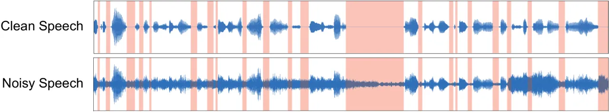
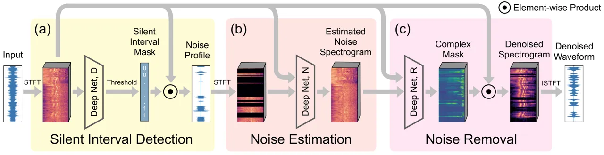
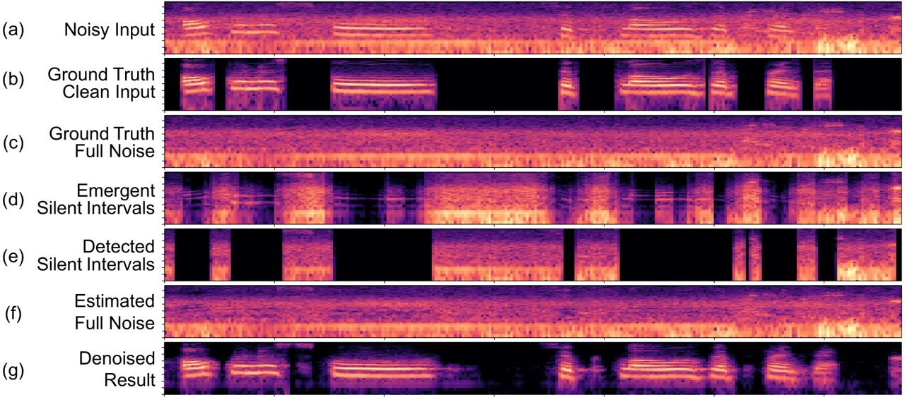
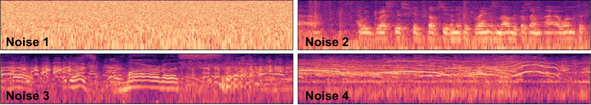
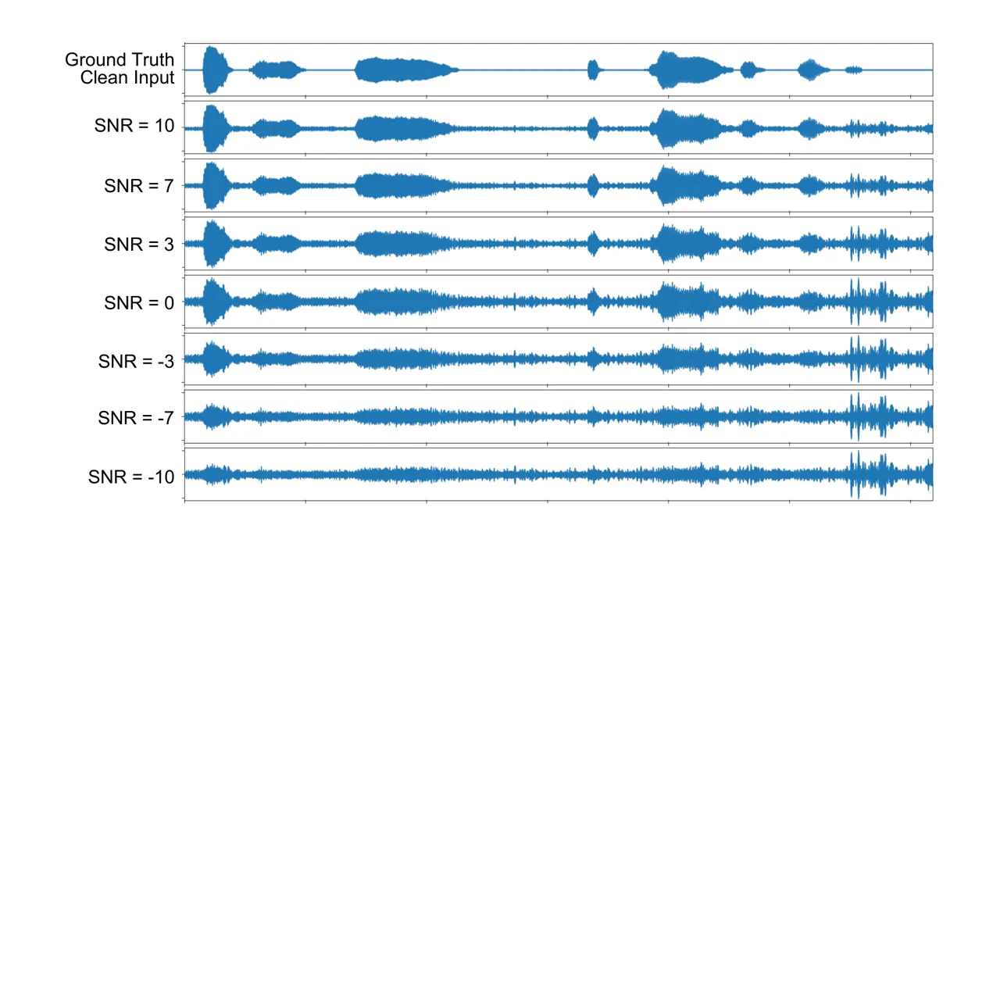
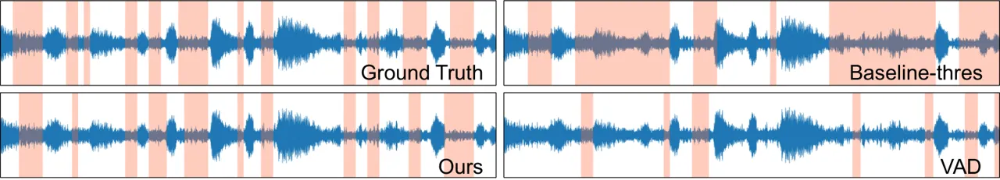

# Listening to Sounds of Silence for Speech Denoising

Ruilin Xu Affiliation: Columbia University, New York, USA    Rundi Wu
Affiliation: Columbia University, New York, USA    Yuko Ishiwaka
Affiliation: SoftBank Group Corp., Tokyo, Japan    Carl Vondrick
Affiliation: Columbia University, New York, USA    Changxi Zheng
Affiliation: Columbia University, New York, USA

###### Abstract

We introduce a deep learning model for speech denoising, a long-standing
challenge in audio analysis arising in numerous applications. Our
approach is based on a key observation about human speech: there is
often a short pause between each sentence or word. In a recorded speech
signal, those pauses introduce a series of time periods during which
only noise is present. We leverage these incidental _silent intervals_
to learn a model for automatic speech denoising given only mono-channel
audio. Detected silent intervals over time expose not just pure noise
but its time-varying features, allowing the model to learn noise
dynamics and suppress it from the speech signal. Experiments on multiple
datasets confirm the pivotal role of silent interval detection for
speech denoising, and our method outperforms several state-of-the-art
denoising methods, including those that accept only audio input (like
ours) and those that denoise based on audiovisual input (and hence
require more information). We also show that our method enjoys excellent
generalization properties, such as denoising spoken languages not seen
during training.

## 1 Introduction

Noise is everywhere. When we listen to someone speak, the audio signals
we receive are never pure and clean, always contaminated by all kinds of
noises—cars passing by, spinning fans in an air conditioner, barking
dogs, music from a loudspeaker, and so forth. To a large extent, people
in a conversation can effortlessly filter out these noises \[42\]. In
the same vein, numerous applications, ranging from cellular
communications to human-robot interaction, rely on speech denoising
algorithms as a fundamental building block.

Despite its vital importance, algorithmic speech denoising remains a
grand challenge. Provided an input audio signal, speech denoising aims
to separate the foreground (speech) signal from its additive background
noise. This separation problem is inherently ill-posed. Classic
approaches such as spectral subtraction \[7, 98, 6, 72, 79\] and Wiener
filtering \[80, 40\] conduct audio denoising in the spectral domain, and
they are typically restricted to stationary or quasi-stationary noise.
In recent years, the advance of deep neural networks has also inspired
their use in audio denoising. While outperforming the classic denoising
approaches, existing neural-network-based approaches use network
structures developed for general audio processing tasks \[56, 90, 100\]
or borrowed from other areas such as computer vision \[31, 26, 3, 36,
32\] and generative adversarial networks \[70, 71\]. Nevertheless,
beyond reusing well-developed network models as a black box, a
fundamental question remains: _What natural structures of speech can we
leverage to mold network architectures for better performance on speech
denoising?_

### 1.1 Key insight: time distribution of silent intervals

Motivated by this question, we revisit one of the most widely used audio
denoising methods in practice, namely the spectral subtraction
method \[7, 98, 6, 72, 79\]. Implemented in many commercial software
such as Adobe Audition \[39\], this classical method requires the user
to specify a time interval during which the foreground signal is absent.
We call such an interval a _silent interval_. A silent interval is a
time window that exposes pure noise. The algorithm then learns from the
silent interval the noise characteristics, which are in turn used to
suppress the additive noise of the entire input signal (through
subtraction in the spectral domain).

Yet, the spectral subtraction method suffers from two major
shortcomings: i) it requires user specification of a silent interval,
that is, not fully automatic; and ii) the single silent interval,
although undemanding for the user, is insufficient in presence of
_nonstationary_ noise—for example, a background music. Ubiquitous in
daily life, nonstationary noise has time-varying spectral features. The
single silent interval reveals the noise spectral features only in that
particular time span, thus inadequate for denoising the entire input
signal. The success of spectral subtraction pivots on the concept of
silent interval; so do its shortcomings.

In this paper, we introduce a deep network for speech denoising that
tightly integrates silent intervals, and thereby overcomes many of the
limitations of classical approaches. Our goal is not just to identify a
single silent interval, but to find as many as possible silent intervals
over time. Indeed, silent intervals in speech appear in abundance:
psycholinguistic studies have shown that there is almost always a pause
after each sentence and even each word in speech \[78, 21\]. Each pause,
however short, provides a silent interval revealing noise
characteristics local in time. All together, these silent intervals
assemble a time-varying picture of background noise, allowing the neural
network to better denoise speech signals, even in presence of
nonstationary noise (see Fig. 1).

In short, to interleave neural networks with established denoising
pipelines, we propose a network structure consisting of three major
components (see Fig. 2): i) one dedicated to silent interval detection,
ii) another that aims to estimate the full noise from those revealed in
silent intervals, akin to an inpainting process in computer
vision \[38\], and iii) yet another for cleaning up the input signal.



Figure 1: Silent intervals over time. (top) A speech signal has many
natural pauses. Without any noise, these pauses are exhibited as silent
intervals (highlighted in red). (bottom) However, most speech signals
are contaminated by noise. Even with mild noise, silent intervals become
overwhelmed and hard to detect. If robustly detected, silent intervals
can help to reveal the noise profile over time.

Summary of results. Our neural-network-based denoising model accepts a
single channel of audio signal and outputs the cleaned-up signal. Unlike
some of the recent denoising methods that take as input audiovisual
signals (i.e., both audio and video footage), our method can be applied
in a wider range of scenarios (e.g., in cellular communication). We
conducted extensive experiments, including ablation studies to show the
efficacy of our network components and comparisons to several
state-of-the-art denoising methods. We also evaluate our method under
various signal-to-noise ratios—even under strong noise levels that are
not tested against in previous methods. We show that, under a variety of
denoising metrics, our method consistently outperforms those methods,
including those that accept only audio input (like ours) and those that
denoise based on audiovisual input.

The pivotal role of silent intervals for speech denoising is further
confirmed by a few key results. Even without supervising on silent
interval detection, the ability to detect silent intervals naturally
emerges in our network. Moreover, while our model is trained on English
speech only, with no additional training it can be readily used to
denoise speech in other languages (such as Chinese, Japanese, and
Korean). Please refer to the supplementary materials for listening to
our denoising results.

## 2 Related Work



Figure 2: Our audio denoise network. Our model has three components: (a)
one that detects silent intervals over time, and outputs a noise profile
observed from detected silent intervals; (b) another that estimates the
full noise profile, and (c) yet another that cleans up the input signal.

#### Speech denoising.

Speech denoising \[53\] is a fundamental problem studied over several
decades. Spectral subtraction  \[7, 98, 6, 72, 79\] estimates the clean
signal spectrum by subtracting an estimate of the noise spectrum from
the noisy speech spectrum. This classic method was followed by
spectrogram factorization methods \[84\]. Wiener filtering \[80, 40\]
derives the enhanced signal by optimizing the mean-square error. Other
methods exploit pauses in speech, forming segments of low acoustic
energy where noise statistics can be more accurately measured \[13, 57,
86, 15, 75, 10, 11\]. Statistical model-based methods \[14, 34\] and
subspace algorithms \[12, 16\] are also studied.

Applying neural networks to audio denoising dates back to the 80s \[88,
69\]. With increased computing power, deep neural networks are often
used \[104, 106, 105, 47\]. Long short-term memory networks
(LSTMs) \[35\] are able to preserve temporal context information of the
audio signal \[52\], leading to strong results \[56, 90, 100\].
Leveraging generative adversarial networks (GANs) \[33\], methods such
as \[70, 71\] have adopted GANs into the audio field and have also
achieved strong performance.

Audio signal processing methods operate on either the raw waveform or
the spectrogram by Short-time Fourier Transform (STFT). Some work
directly on waveform \[23, 68, 59, 55\], and others use Wavenet \[91\]
for speech denoising \[74, 76, 30\]. Many other methods such as \[54,
94, 61, 99, 46, 107, 9\] work on audio signal’s spectrogram, which
contains both magnitude and phase information. There are works
discussing how to use the spectrogram to its best potential \[93, 67\],
while one of the disadvantages is that the inverse STFT needs to be
applied. Meanwhile, there also exist works \[51, 29, 28, 95, 19, 101,
60\] investigating how to overcome artifacts from time aliasing.

Speech denoising has also been studied in conjunction with computer
vision due to the relations between speech and facial features \[8\].
Methods such as \[31, 26, 3, 36, 32\] utilize different network
structures to enhance the audio signal to the best of their ability.
Adeel et al. \[1\] even utilize lip-reading to filter out the background
noise of a speech.

#### Deep learning for other audio processing tasks.

Deep learning is widely used for lip reading, speech recognition, speech
separation, and many audio processing or audio-related tasks, with the
help of computer vision \[64, 66, 5, 4\]. Methods such as \[50, 17, 65\]
are able to reconstruct speech from pure facial features. Methods such
as \[2, 63\] take advantage of facial features to improve speech
recognition accuracy. Speech separation is one of the areas where
computer vision is best leveraged. Methods such as \[25, 64, 18, 109\]
have achieved impressive results, making the previously impossible
speech separation from a single audio signal possible. Recently, Zhang
et al. \[108\] proposed a new operation called Harmonic Convolution to
help networks distill audio priors, which is shown to even further
improve the quality of speech separation.

## 3 Learning Speech Denoising

We present a neural network that harnesses the time distribution of
silent intervals for speech denoising. The input to our model is a
spectrogram of noisy speech \[103, 20, 83\], which can be viewed as a 2D
image of size $`T\times F`$ with two channels, where $`T`$ represents
the time length of the signal and $`F`$ is the number of frequency bins.
The two channels store the real and imaginary parts of STFT,
respectively. After learning, the model will produce another spectrogram
of the same size as the noise suppressed.

We first train our proposed network structure in an end-to-end fashion,
with only denoising supervision (Sec. 3.2); and it already outperforms
the state-of-the-art methods that we compare against. Furthermore, we
incorporate the supervision on silent interval detection (Sec. 3.3) and
obtain even better denoising results (see Sec. 4).



Figure 3: Example of intermediate and final results. (a) The spectrogram
of a noisy input signal, which is a superposition of a clean speech
signal (b) and a noise (c). The black regions in (b) indicate
ground-truth silent intervals. (d) The noise exposed by automatically
emergent silent intervals, i.e., the output of the silent interval
detection component when the entire network is trained without silent
interval supervision (recall Sec. 3.2). (e) The noise exposed by
detected silent intervals, i.e., the output of the silent interval
detection component when the network is trained with silent interval
supervision (recall Sec. 3.3). (f) The estimated noise profile using
subfigure (a) and (e) as the input to the noise estimation component.
(g) The final denoised spectrogram output.

### 3.1 Network structure

Classic denoising algorithms work in three general stages: silent
interval specification, noise feature estimation, and noise removal. We
propose to interweave learning throughout this process: we rethink each
stage with the help of a neural network, forming a new speech denoising
model. Since we can chain these networks together and estimate
gradients, we can efficiently train the model with large-scale audio
data. Figure 2 illustrates this model, which we describe below.

#### Silent interval detection.

The first component is dedicated to detecting silent intervals in the
input signal. The input to this component is the spectrogram of the
input (noisy) signal $`\bm{x}`$. The spectrogram $`\bm{s_{x}}`$ is first
encoded by a 2D convolutional encoder into a 2D feature map, which is in
turn processed by a bidirectional LSTM \[35, 81\] followed by two
fully-connected (FC) layers (see network details in Appendix A). The
bidirectional LSTM is suitable for processing time-series features
resulting from the spectrogram \[58, 41, 73, 18\], and the FC layers are
applied to the features of each time sample to accommodate variable
length input. The output from this network component is a vector
$`\mathsf{D}(\bm{s_{x}})`$. Each element of $`\mathsf{D}(\bm{s_{x}})`$
is a scalar in \[0,1\] (after applying the sigmoid function), indicating
a confidence score of a small time segment being silent. We choose each
time segment to have $`\nicefrac{{1}}{{30}}`$ second, small enough to
capture short speech pauses and large enough to allow robust prediction.

The output vector $`\mathsf{D}(\bm{s_{x}})`$ is then expanded to a
longer mask, which we denote as $`\bm{m}(\bm{x})`$. Each element of this
mask indicates the confidence of classifying each sample of the input
signal $`\bm{x}`$ as pure noise (see Fig. 3-e). With this mask, the
noise profile $`\tilde{\bm{x}}`$ exposed by silent intervals are
estimated by an element-wise product, namely
$`\tilde{\bm{x}}\coloneqq\bm{x}\odot\bm{m}(\bm{x})`$.

#### Noise estimation.

The signal $`\tilde{\bm{x}}`$ resulted from silent interval detection is
noise profile exposed only through a series of time windows (see
Fig. 3-e)—but not a complete picture of the noise. However, since the
input signal is a superposition of clean speech signal and noise, having
a complete noise profile would ease the denoising process, especially in
presence of nonstationary noise. Therefore, we also estimate the entire
noise profile over time, which we do with a neural network.

Inputs to this component include both the noisy audio signal $`\bm{x}`$
and the incomplete noise profile $`\tilde{\bm{x}}`$. Both are converted
by STFT into spectrograms, denoted as $`\bm{s_{x}}`$ and
$`\bm{s}_{\tilde{\bm{x}}}`$, respectively. We view the spectrograms as
2D images. And because the neighboring time-frequency pixels in a
spectrogram are often correlated, our goal here is conceptually akin to
the image inpainting task in computer vision \[38\]. To this end, we
encode $`\bm{s_{x}}`$ and $`\bm{s}_{\tilde{\bm{x}}}`$ by two separate 2D
convolutional encoders into two feature maps. The feature maps are then
concatenated in a channel-wise manner and further decoded by a
convolutional decoder to estimate the full noise spectrogram, which we
denote as $`\mathsf{N}(\bm{s_{x}},\bm{s}_{\tilde{\bm{x}}})`$. A result
of this step is illustrated in Fig. 3-f.

#### Noise removal.

Lastly, we clean up the noise from the input signal $`\bm{x}`$. We use a
neural network $`\mathsf{R}`$ that takes as input both the input audio
spectrogram $`\bm{s_{x}}`$ and the estimated full noise spectrogram
$`\mathsf{N}(\bm{s_{x}},\bm{s}_{\tilde{\bm{x}}})`$. The two input
spectrograms are processed individually by their own 2D convolutional
encoders. The two encoded feature maps are then concatenated together
before passing to a bidirectional LSTM followed by three fully connected
layers (see details in Appendix A). Like other audio enhancement
models \[18, 92, 96\], the output of this component is a vector with two
channels which form the real and imaginary parts of a complex ratio mask
$`\mathbf{c}\coloneqq\mathsf{R}\big(\bm{s_{x}},\mathsf{N}(\bm{s_{x}},\bm{s}_{\tilde{\bm{x}}})\big)`$
in frequency-time domain. In other words, the mask $`\mathbf{c}`$ has
the same (temporal and frequency) dimensions as $`\bm{s_{x}}`$.

In the final step, we compute the denoised spectrogram
$`\bm{s_{x}^{*}}`$ through element-wise multiplication of the input
audio spectrogram $`\bm{s_{x}}`$ and the mask $`\mathbf{c}`$ (i.e.,
$`\bm{s_{x}^{*}}=\bm{s_{x}}\odot\mathbf{c}`$). Finally, the cleaned-up
audio signal is obtained by applying the inverse STFT to
$`\bm{s_{x}^{*}}`$ (see Fig. 3-g).

### 3.2 Loss functions and training

Since a subgradient exists at every step, we are able to train our
network in an end-to-end fashion with stochastic gradient descent. We
optimize the following loss function:

```math
\mathcal{L}_{0}=\mathbb{E}_{\bm{x}\sim p(\bm{x})}\Big[\left\lVert\mathsf{N}(\bm{s_{x}},\bm{s}_{\tilde{\bm{x}}})-\bm{s}^{*}_{\bm{n}}\right\rVert_{2}+\beta\left\lVert\bm{s_{x}}\odot\mathsf{R}\big(\bm{s_{x}},\mathsf{N}(\bm{s_{x}},\bm{s}_{\tilde{\bm{x}}})\big)-\bm{s}^{*}_{\bm{x}}\right\rVert_{2}\Big], \tag{1}
```

where the notations $`\bm{s_{x}}`$, $`\bm{s}_{\tilde{\bm{x}}}`$,
$`\mathsf{N}(\cdot,\cdot)`$, and $`\mathsf{R}(\cdot,\cdot)`$ are defined
in Sec. 3.1; $`\bm{s}^{*}_{\bm{x}}`$ and $`\bm{s}^{*}_{\bm{n}}`$ denote
the spectrograms of the ground-truth foreground signal and background
noise, respectively. The first term penalizes the discrepancy between
estimated noise and the ground-truth noise, while the second term
accounts for the estimation of foreground signal. These two terms are
balanced by the scalar $`\beta`$ ($`\beta=1.0`$ in our experiments).

#### Natural emergence of silent intervals.

While producing plausible denoising results (see Sec. 4.4), the
end-to-end training process has no supervision on silent interval
detection: the loss function (1) only accounts for the recoveries of
noise and clean speech signal. But somewhat surprisingly, the ability of
detecting silent intervals automatically emerges as the output of the
first network component (see Fig. 3-d as an example, which visualizes
$`\bm{s}_{\tilde{\bm{x}}}`$). In other words, the network automatically
learns to detect silent intervals for speech denoising without this
supervision.

### 3.3 Silent interval supervision

As the model is learning to detect silent intervals on its own, we are
able to directly supervise silent interval detection to further improve
the denoising quality. Our first attempt was to add a term in (1) that
penalizes the discrepancy between detected silent intervals and their
ground truth. But our experiments show that this is not effective (see
Sec. 4.4). Instead, we train our network in two sequential steps.

First, we train the silent interval detection component through the
following loss function:

```math
\mathcal{L}_{1}=\mathbb{E}_{\bm{x}\sim p(\bm{x})}\Big[\ell_{\text{BCE}}\big(\bm{m}(\bm{x}),\bm{m}^{*}_{\bm{x}}\big)\Big], \tag{2}
```

where $`\ell_{\text{BCE}}(\cdot,\cdot)`$ is the binary cross entropy
loss, $`\bm{m}(\bm{x})`$ is the mask resulted from silent interval
detection component, and $`\bm{m}^{*}_{\bm{x}}`$ is the ground-truth
label of each signal sample being silent or not—the way of constructing
$`\bm{m}^{*}_{\bm{x}}`$ and the training dataset will be described in
Sec. 4.1.

Next, we train the noise estimation and removal components through the
loss function (1). This step starts by neglecting the silent detection
component. In the loss function (1), instead of using
$`\bm{s}_{\tilde{\bm{x}}}`$, the noise spectrogram exposed by the
estimated silent intervals, we use the noise spectrogram exposed by the
ground-truth silent intervals (i.e., the STFT of
$`\bm{x}\odot\bm{m}^{*}_{\bm{x}}`$). After training using such a loss
function, we fine-tune the network components by incorporating the
already trained silent interval detection component. With the silent
interval detection component fixed, this fine-tuning step optimizes the
original loss function (1) and thereby updates the weights of the noise
estimation and removal components.

## 4 Experiments

This section presents the major evaluations of our method, comparisons
to several baselines and prior works, and ablation studies. We also
refer the reader to the supplementary materials (including a
supplemental document and audio effects organized on an off-line
webpage) for the full description of our network structure,
implementation details, additional evaluations, as well as audio
examples.

### 4.1 Experiment setup

#### Dataset construction.

To construct training and testing data, we leverage publicly available
audio datasets. We obtain clean speech signals using AVSPEECH \[18\],
from which we randomly choose 2448 videos ($`4.5`$ hours of total
length) and extract their speech audio channels. Among them, we use 2214
videos for training and 234 videos for testing, so the training and
testing speeches are fully separate. All these speech videos are in
English, selected on purpose: as we show in supplementary materials, our
model trained on this dataset can readily denoise speeches in other
languages.



Figure 4: Noise gallery. We show four examples of noise from the noise
datasets. Noise 1) is a stationary (white) noise, and the other three
are not. Noise 2) is a monologue in a meeting. Noise 3) is party noise
from people speaking and laughing with background noise. Noise 4) is
street noise from people shouting and screaming with additional traffic
noise such as vehicles driving and honking.

We use two datasets, DEMAND \[89\] and Google’s AudioSet \[27\], as
background noise. Both consist of environmental noise, transportation
noise, music, and many other types of noises. DEMAND has been used in
previous denoising works (e.g., \[70, 30, 90\]). Yet AudioSet is much
larger and more diverse than DEMAND, thus more challenging when used as
noise. Figure 4 shows some noise examples. Our evaluations are conducted
on both datasets, separately.

Due to the linearity of acoustic wave propagation, we can superimpose
clean speech signals with noise to synthesize noisy input signals
(similar to previous works \[70, 30, 90\]). When synthesizing a noisy
input signal, we randomly choose a signal-to-noise ratio (SNR) from
seven discrete values: -10dB, -7dB, -3dB, 0dB, 3dB, 7dB, and 10dB; and
by mixing the foreground speech with properly scaled noise, we produce a
noisy signal with the chosen SNR. For example, a -10dB SNR means that
the power of noise is ten times the speech (see Fig. S1 in appendix).
The SNR range in our evaluations (i.e., \[-10dB, 10dB\]) is
significantly larger than those tested in previous works.

To supervise our silent interval detection (recall Sec. 3.3), we need
ground-truth labels of silent intervals. To this end, we divide each
clean speech signal into time segments, each of which lasts
$`\nicefrac{{1}}{{30}}`$ seconds. We label a time segment as silent when
the total acoustic energy in that segment is below a threshold. Since
the speech is clean, this automatic labeling process is robust.

Remarks on creating our own datasets. Unlike many previous models, which
are trained using existing datasets such as Valentini’s
VoiceBank-DEMAND \[90\], we choose to create our own datasets because of
two reasons. First, Valentini’s dataset has a noise SNR level in \[0dB,
15dB\], much narrower than what we encounter in real-world recordings.
Secondly, although Valentini’s dataset provides several kinds of
environmental noise, it lacks the richness of other types of structured
noise such as music, making it less ideal for denoising real-world
recordings (see discussion in Sec. 4.6).

#### Method comparison.

We compare our method with several existing methods that are also
designed for speech denoising, including both the classic approaches and
recently proposed learning-based methods. We refer to these methods as
follows: i) Ours, our model trained with silent interval supervision
(recall Sec. 3.3); ii) Baseline-thres, a baseline method that uses
acoustic energy threshold to label silent intervals (the same as our
automatic labeling approach in Sec. 4.1 but applied on noisy input
signals), and then uses our trained noise estimation and removal
networks for speech denoising. iii) Ours-GTSI, another reference method
that uses our trained noise estimation and removal networks, but
hypothetically uses the ground-truth silent intervals; iv) Spectral
Gating, the classic speech denoising algorithm based on spectral
subtraction \[79\]; v) Adobe Audition \[39\], one of the most widely
used professional audio processing software, and we use its
machine-learning-based noise reduction feature, provided in the latest
Adobe Audition CC 2020, with default parameters to batch process all our
test data; vi) SEGAN \[70\], one of the state-of-the-art audio-only
speech enhancement methods based on generative adversarial networks.
vii) DFL \[30\], a recently proposed speech denoising method based on a
loss function over deep network features; ¹¹ 1 This recent method is
designed for high-noise-level input, trained in an end-to-end fashion,
and as their paper states, is “particularly pronounced for the hardest
data with the most intrusive background noise”. viii) VSE \[26\], a
learning-based method that takes both video and audio as input, and
leverages both audio signal and mouth motions (from video footage) for
speech denoising. We could not compare with another audiovisual
method \[18\] because no source code or executable is made publicly
available.

For fair comparisons, we train all the methods (except Spectral Gating
which is not learning-based and Adobe Audition which is commercially
shipped as a black box) using the same datasets. For SEGAN, DFL, and
VSE, we use their source codes published by the authors. The audiovisual
denoising method VSE also requires video footage, which is available in
AVSPEECH.

### 4.2 Evaluation on speech denoising

#### Metrics.

Due to the perceptual nature of audio processing tasks, there is no
widely accepted single metric for quantitative evaluation and
comparisons. We therefore evaluate our method under six different
metrics, all of which have been frequently used for evaluating audio
processing quality. Namely, these metrics are: i) Perceptual Evaluation
of Speech Quality (PESQ) \[77\], ii) Segmental Signal-to-Noise Ratio
(SSNR) \[82\], iii) Short-Time Objective Intelligibility (STOI) \[87\],
iv) Mean opinion score (MOS) predictor of signal distortion
(CSIG) \[37\], v) MOS predictor of background-noise intrusiveness
(CBAK) \[37\], and vi) MOS predictor of overall signal quality
(COVL) \[37\].

Figure 5: Quantitative comparisons. We measure denoising quality under
six metrics (corresponding to columns). The comparisons are conducted
using noise from DEMAND and AudioSet separately. Ours-GTSI (in black)
uses ground-truth silent intervals. Although not a practical approach,
it serves as an upper-bound reference of all methods. Meanwhile, the
green bar in each plot indicates the metric score of the noisy input
without any processing.

Figure 6: Denoise quality w.r.t. input SNRs. Denoise results measured in
PESQ for each method w.r.t different input SNRs. Results measured in
other metrics are shown in Fig. S2 in Appendix.

#### Results.

We train two separate models using DEMAND and AudioSet noise datasets
respectively, and compare them with other models trained with the same
datasets. We evaluate the average metric values and report them in
Fig. 5. Under all metrics, our method consistently outperforms others.

We breakdown the performance of each method with respect to SNR levels
from -10dB to 10dB on both noise datasets. The results are reported in
Fig. 6 for PESQ (see Fig. S2 in the appendix for all metrics). In the
previous works that we compare to, no results under those low SNR levels
(at $`<0`$ dBs) are reported. Nevertheless, across all input SNR levels,
our method performs the best, showing that our approach is fairly robust
to both light and extreme noise.

From Fig. 6, it is worth noting that Ours-GTSI method performs even
better. Recall that this is our model but provided with ground-truth
silent intervals. While not practical (due to the need of ground-truth
silent intervals), Ours-GTSI confirms the importance of silent intervals
for denoising: a high-quality silent interval detection helps to improve
speech denoising quality.

### 4.3 Evaluation on silent interval detection

Due to the importance of silent intervals for speech denoising, we also
evaluate the quality of our silent interval detection, in comparison to
two alternatives, the baseline Baseline-thres and a Voice Activity
Detector (VAD) \[22\]. The former is described above, while the latter
classifies each time window of an audio signal as having human voice or
not \[48, 49\]. We use an off-the-shelf VAD \[102\], which is developed
by Google’s WebRTC project and reported as one of the best available.
Typically, VAD is designed to work with low-noise signals. Its inclusion
here here is merely to provide an alternative approach that can detect
silent intervals in more ideal situations.

We evaluate these methods using four standard statistic metrics: the
precision, recall, F1 score, and accuracy. We follow the standard
definitions of these metrics, which are summarized in Appendix C.1.
These metrics are based on the definition of positive/negative
conditions. Here, the positive condition indicates a time segment being
labeled as a silent segment, and the negative condition indicates a
non-silent label. Thus, the higher the metric values are, the better the
detection approach.

| Noise Dataset | Method         | Precision | Recall | F1    | Accuracy |
| ------------- | -------------- | --------- | ------ | ----- | -------- |
| DEMAND        | Baseline-thres | 0.533     | 0.718  | 0.612 | 0.706    |
|               | VAD            | 0.797     | 0.432  | 0.558 | 0.783    |
|               | Ours           | 0.876     | 0.866  | 0.869 | 0.918    |
| Audioset      | Baseline-thres | 0.536     | 0.731  | 0.618 | 0.708    |
|               | VAD            | 0.736     | 0.227  | 0.338 | 0.728    |
|               | Ours           | 0.794     | 0.822  | 0.807 | 0.873    |

Table 1: Results of silent interval detection. The metrics are measured
using our test signals that have SNRs from -10dB to 10dB. Definitions of
these metrics are summarized in Appendix C.1.

Table 1 shows that, under all metrics, our method is consistently better
than the alternatives. Between VAD and Baseline-thres, VAD has higher
precision and lower recall, meaning that VAD is overly conservative and
Baseline-thres is overly aggressive when detecting silent intervals (see
Fig. S3 in Appendix C.2). Our method reaches better balance and thus
detects silent intervals more accurately.

### 4.4 Ablation studies

| Noise Dataset | Method            | PESQ  | SSNR  | STOI  | CSIG  | CBAK  | COVL  |
| ------------- | ----------------- | ----- | ----- | ----- | ----- | ----- | ----- |
| DEMAND        | Ours w/o SID comp | 2.689 | 9.080 | 0.904 | 3.615 | 3.285 | 3.112 |
|               | Ours w/o NR comp  | 2.476 | 0.234 | 0.747 | 3.015 | 2.410 | 2.637 |
|               | Ours w/o SID loss | 2.794 | 6.478 | 0.903 | 3.466 | 3.147 | 3.079 |
|               | Ours w/o NE loss  | 2.601 | 9.070 | 0.896 | 3.531 | 3.237 | 3.027 |
|               | Ours Joint loss   | 2.774 | 6.042 | 0.895 | 3.453 | 3.121 | 3.068 |
|               | Ours              | 2.795 | 9.505 | 0.911 | 3.659 | 3.358 | 3.186 |
| Audioset      | Ours w/o SID comp | 2.190 | 5.574 | 0.802 | 2.851 | 2.719 | 2.454 |
|               | Ours w/o NR comp  | 1.803 | 0.191 | 0.623 | 2.301 | 2.070 | 1.977 |
|               | Ours w/o SID loss | 2.325 | 4.957 | 0.814 | 2.814 | 2.746 | 2.503 |
|               | Ours w/o NE loss  | 2.061 | 5.690 | 0.789 | 2.766 | 2.671 | 2.362 |
|               | Ours Joint loss   | 2.305 | 4.612 | 0.807 | 2.774 | 2.721 | 2.474 |
|               | Ours              | 2.304 | 5.984 | 0.816 | 2.913 | 2.809 | 2.543 |

Table 2: Ablation studies. We alter network components and training
loss, and evaluate the denoising quality under various metrics. Our
proposed approach performs the best.

In addition, we perform a series of ablation studies to understand the
efficacy of individual network components and loss terms (see
Appendix D.1 for more details). In Table 2, “Ours w/o SID loss” refers
to the training method presented in Sec. 3.2 (i.e., without silent
interval supervision). “Ours Joint loss” refers to the end-to-end
training approach that optimizes the loss function (1) with the
additional term (2). And “Ours w/o NE loss” uses our two-step training
(in Sec. 3.3) but without the loss term on noise estimation—that is,
without the first term in (1). In comparison to these alternative
training approaches, our two-step training with silent interval
supervision (referred to as “Ours”) performs the best. We also note that
“Ours w/o SID loss”—i.e., without supervision on silent interval
detection—already outperforms the methods we compared to in Fig. 5, and
“Ours” further improves the denoising quality. This shows the efficacy
of our proposed training approach.

We also experimented with two variants of our network structure. The
first one, referred to as “Ours w/o SID comp”, turns off silent interval
detection: the silent interval detection component always outputs a
vector with all zeros. The second, referred as “Ours w/o NR comp”, uses
a simple spectral subtraction to replace our noise removal component.
Table 2 shows that, under all the tested metrics, both variants perform
worse than our method, suggesting our proposed network structure is
effective.

Furthermore, we studied to what extent the accuracy of silent interval
detection affects the speech denoising quality. We show that as the
silent interval detection becomes less accurate, the denoising quality
degrades. Presented in details in Appendix D.2, these experiments
reinforce our intuition that silent intervals are instructive for speech
denoising tasks.

### 4.5 Comparison with state-of-the-art benchmark

Many state-of-the-art denoising methods, including MMSE-GAN \[85\],
Metric-GAN \[24\], SDR-PESQ \[43\], T-GSA \[44\], Self-adaptation
DNN \[45\], and RDL-Net \[62\], are all evaluated on Valentini’s
VoiceBank-DEMAND \[90\]. We therefore compare ours with those methods on
the same dataset. We note that DEMAND consists of audios with SNR in
\[0dB, 15dB\]. Its SNR range is much narrower than what our method (and
our training datasets) aims for (e.g., input signals with -10dB SNR).
Nevertheless, trained and tested under the same setting, our method is
highly competitive to the best of those methods under every metric, as
shown in Table 3. The metric scores therein for other methods are
numbers reported in their original papers.

| Method                 | PESQ | CSIG | CBAK | COVL | STOI |
| ---------------------- | ---- | ---- | ---- | ---- | ---- |
| Noisy Input            | 1.97 | 3.35 | 2.44 | 2.63 | 0.91 |
| WaveNet \[91\]         | –    | 3.62 | 3.24 | 2.98 | –    |
| SEGAN \[70\]           | 2.16 | 3.48 | 2.94 | 2.80 | 0.93 |
| DFL \[30\]             | 2.51 | 3.79 | 3.27 | 3.14 | –    |
| MMSE-GAN \[85\]        | 2.53 | 3.80 | 3.12 | 3.14 | 0.93 |
| MetricGAN \[24\]       | 2.86 | 3.99 | 3.18 | 3.42 | –    |
| SDR-PESQ \[43\]        | 3.01 | 4.09 | 3.54 | 3.55 | –    |
| T-GSA \[44\]           | 3.06 | 4.18 | 3.59 | 3.62 | –    |
| Self-adapt. DNN \[45\] | 2.99 | 4.15 | 3.42 | 3.57 | –    |
| RDL-Net \[62\]         | 3.02 | 4.38 | 3.43 | 3.72 | 0.94 |
| Ours                   | 3.16 | 3.96 | 3.54 | 3.53 | 0.98 |

Table 3: Comparisons on VoiceBank-DEMAND corpus.

### 4.6 Tests on real-world data

We also test our method against real-world data. Quantitative evaluation
on real-world data, however, is not easy because the evaluation of
nearly all metrics requires the corresponding ground-truth clean signal,
which is not available in real-world scenario. Instead, we collected a
good number of real-world audios, either by recording in daily
environments or by downloading online (e.g., from YouTube). These
real-world audios cover diverse scenarios: in a driving car, a café, a
park, on the street, in multiple languages (Chinese, Japanese, Korean,
German, French, etc.), with different genders and accents, and even with
singing songs. None of these recordings is cherry picked. We refer the
reader to our project website for the denoising results of all the
collected real-world recordings, and for the comparison of our method
with other state-of-the-art methods under real-world settings.

Furthermore, we use real-world data to test our model trained with
different datasets, including our own dataset (recall Sec. 4.1) and the
existing DEMAND \[90\]. We show that the network model trained by our
own dataset leads to much better noise reduction (see details in
Appendix E.2). This suggests that our dataset allows the denoising model
to better generalize to many real-world scenarios.

## 5 Conclusion

Speech denoising has been a long-standing challenge. We present a new
network structure that leverages the abundance of silent intervals in
speech. Even without silent interval supervision, our network is able to
denoise speech signals plausibly, and meanwhile, the ability to detect
silent intervals automatically emerges. We reinforce this ability. Our
explicit supervision on silent intervals enables the network to detect
them more accurately, thereby further improving the performance of
speech denoising. As a result, under a variety of denoising metrics, our
method consistently outperforms several state-of-the-art audio denoising
models.

#### Acknowledgments.

This work was supported in part by the National Science Foundation
(1717178, 1816041, 1910839, 1925157) and SoftBank Group.

## Broader Impact

High-quality speech denoising is desired in a myriad of applications:
human-robot interaction, cellular communications, hearing aids,
teleconferencing, music recording, filmmaking, news reporting, and
surveillance systems to name a few. Therefore, we expect our proposed
denoising method—be it a system used in practice or a foundation for
future technology—to find impact in these applications.

In our experiments, we train our model using English speech only, to
demonstrate its generalization property—the ability of denoising spoken
languages beyond English. Our demonstration of denoising Japanese,
Chinese, and Korean speeches is intentional: they are linguistically and
phonologically distant from English (in contrast to other English
“siblings” such as German and Dutch). Still, our model may bias in
favour of spoken languages and cultures that are closer to English or
that have frequent pauses to reveal silent intervals. Deeper
understanding of this potential bias requires future studies in tandem
with linguistic and sociocultural insights.

Lastly, it is natural to extend our model for denoising audio signals in
general or even signals beyond audio (such as Gravitational wave
denoising \[97\]). If successful, our model can bring in even broader
impacts. Pursuing this extension, however, requires a judicious
definition of “silent intervals”. After all, the notion of “noise” in a
general context of signal processing depends on specific applications:
noise in one application may be another’s signals. To train a neural
network that exploits a general notion of silent intervals, prudence
must be taken to avoid biasing toward certain types of noise.

## References

- \[1\] A. Adeel, M. Gogate, A. Hussain, and W. M. Whitmer. Lip-reading
  driven deep learning approach for speech enhancement. _IEEE
  Transactions on Emerging Topics in Computational Intelligence_, page
  1–10, 2019. ISSN 2471-285x. doi: 10.1109/tetci.2019.2917039. URL
  [http://dx.doi.org/10.1109/tetci.2019.2917039](http://dx.doi.org/10.1109/tetci.2019.2917039).
- \[2\] T. Afouras, J. S. Chung, A. Senior, O. Vinyals, and
  A. Zisserman. Deep audio-visual speech recognition. _IEEE Transactions
  on Pattern Analysis and Machine Intelligence_, pages 1–1, 2018.
- \[3\] T. Afouras, J. S. Chung, and A. Zisserman. The conversation:
  Deep audio-visual speech enhancement. In _Proc. Interspeech 2018_,
  pages 3244–3248, 2018. doi: 10.21437/Interspeech.2018-1400. URL
  [http://dx.doi.org/10.21437/Interspeech.2018-1400](http://dx.doi.org/10.21437/Interspeech.2018-1400).
- \[4\] R. Arandjelovic and A. Zisserman. Objects that sound. In
  _Proceedings of the European Conference on Computer Vision (ECCV)_,
  pages 435–451, 2018.
- \[5\] Y. Aytar, C. Vondrick, and A. Torralba. Soundnet: Learning sound
  representations from unlabeled video. In _Advances in neural
  information processing systems_, pages 892–900, 2016.
- \[6\] M. Berouti, R. Schwartz, and J. Makhoul. Enhancement of speech
  corrupted by acoustic noise. In _ICASSP ’79. IEEE International
  Conference on Acoustics, Speech, and Signal Processing_, volume 4,
  pages 208–211, 1979.
- \[7\] S. Boll. Suppression of acoustic noise in speech using spectral
  subtraction. _IEEE Transactions on Acoustics, Speech, and Signal
  Processing_, 27(2):113–120, 1979.
- \[8\] C. Busso and S. S. Narayanan. Interrelation between speech and
  facial gestures in emotional utterances: A single subject study. _IEEE
  Transactions on Audio, Speech, and Language Processing_,
  15(8):2331–2347, 2007.
- \[9\] J. Chen and D. Wang. Long short-term memory for speaker
  generalization in supervised speech separation. _Acoustical Society of
  America Journal_, 141(6):4705–4714, June 2017. doi: 10.1121/1.4986931.
- \[10\] I. Cohen. Noise spectrum estimation in adverse environments:
  improved minima controlled recursive averaging. _IEEE Transactions on
  Speech and Audio Processing_, 11(5):466–475, 2003.
- \[11\] I. Cohen and B. Berdugo. Noise estimation by minima controlled
  recursive averaging for robust speech enhancement. _IEEE Signal
  Processing Letters_, 9(1):12–15, 2002.
- \[12\] M. Dendrinos, S. Bakamidis, and G. Carayannis. Speech
  enhancement from noise: A regenerative approach. _Speech Commun._,
  10(1):45–67, Feb. 1991. ISSN 0167-6393. doi:
  10.1016/0167-6393(91)90027-q. URL
  [https://doi.org/10.1016/0167-6393(91)90027-Q](<https://doi.org/10.1016/0167-6393(91)90027-Q>).
- \[13\] G. Doblinger. Computationally efficient speech enhancement by
  spectral minima tracking in subbands. In _in Proc. Eurospeech_, pages
  1513–1516, 1995.
- \[14\] Y. Ephraim. Statistical-model-based speech enhancement systems.
  _Proceedings of the IEEE_, 80(10):1526–1555, 1992.
- \[15\] Y. Ephraim and D. Malah. Speech enhancement using a minimum
  mean-square error log-spectral amplitude estimator. _IEEE Transactions
  on Acoustics, Speech, and Signal Processing_, 33(2):443–445, 1985.
- \[16\] Y. Ephraim and H. L. Van Trees. A signal subspace approach for
  speech enhancement. _IEEE Transactions on Speech and Audio
  Processing_, 3(4):251–266, 1995.
- \[17\] A. Ephrat, T. Halperin, and S. Peleg. Improved speech
  reconstruction from silent video. In _2017 IEEE International
  Conference on Computer Vision Workshops (ICCVW)_, pages 455–462, 2017.
- \[18\] A. Ephrat, I. Mosseri, O. Lang, T. Dekel, K. Wilson,
  A. Hassidim, W. T. Freeman, and M. Rubinstein. Looking to listen at
  the cocktail party: A speaker-independent audio-visual model for
  speech separation. _ACM Transactions on Graphics_, 37(4):1–11,
  July 2018. ISSN 0730-0301. doi: 10.1145/3197517.3201357. URL
  [http://dx.doi.org/10.1145/3197517.3201357](http://dx.doi.org/10.1145/3197517.3201357).
- \[19\] H. Erdogan, J. R. Hershey, S. Watanabe, and J. Le Roux.
  Phase-sensitive and recognition-boosted speech separation using deep
  recurrent neural networks. In _2015 IEEE International Conference on
  Acoustics, Speech and Signal Processing (ICASSP)_, pages
  708–712, 2015.
- \[20\] J. L. Flanagan. _Speech Analysis Synthesis and Perception_.
  Springer-Verlag, 2nd edition, 1972. ISBN 9783662015629.
- \[21\] K. L. Fors. _Production and perception of pauses in speech_.
  PhD thesis, Department of Philosophy, Linguistics, and Theory of
  Science, University of Gothenburg, 2015.
- \[22\] D. K. Freeman, G. Cosier, C. B. Southcott, and I. Boyd. The
  voice activity detector for the pan-european digital cellular mobile
  telephone service. In _International Conference on Acoustics, Speech,
  and Signal Processing,_, pages 369–372 vol.1, 1989.
- \[23\] S.-W. Fu, Y. Tsao, X. Lu, and H. Kawai. Raw waveform-based
  speech enhancement by fully convolutional networks. _2017 Asia-Pacific
  Signal and Information Processing Association Annual Summit and
  Conference (APSIPA ASC)_, Dec. 2017. doi: 10.1109/apsipa.2017.8281993.
  URL
  [http://dx.doi.org/10.1109/APSIPA.2017.8281993](http://dx.doi.org/10.1109/APSIPA.2017.8281993).
- \[24\] S.-W. Fu, C.-F. Liao, Y. Tsao, and S.-D. Lin. Metricgan:
  Generative adversarial networks based black-box metric scores
  optimization for speech enhancement, 2019.
- \[25\] A. Gabbay, A. Ephrat, T. Halperin, and S. Peleg. Seeing through
  noise: Visually driven speaker separation and enhancement, 2017a.
- \[26\] A. Gabbay, A. Shamir, and S. Peleg. Visual speech enhancement,
  2017b.
- \[27\] J. F. Gemmeke, D. P. W. Ellis, D. Freedman, A. Jansen,
  W. Lawrence, R. C. Moore, M. Plakal, and M. Ritter. Audio set: An
  ontology and human-labeled dataset for audio events. In _Proc. IEEE
  ICASSP 2017_, New Orleans, LA, 2017.
- \[28\] T. Gerkmann, M. Krawczyk-Becker, and J. Le Roux. Phase
  processing for single-channel speech enhancement: History and recent
  advances. _IEEE Signal Processing Magazine_, 32(2):55–66, 2015.
- \[29\] F. G. Germain, G. J. Mysore, and T. Fujioka. Equalization
  matching of speech recordings in real-world environments. In _2016
  IEEE International Conference on Acoustics, Speech and Signal
  Processing (ICASSP)_, pages 609–613, 2016.
- \[30\] F. G. Germain, Q. Chen, and V. Koltun. Speech denoising with
  deep feature losses. In _Proc. Interspeech 2019_, pages
  2723–2727, 2019. doi: 10.21437/Interspeech.2019-1924. URL
  [http://dx.doi.org/10.21437/Interspeech.2019-1924](http://dx.doi.org/10.21437/Interspeech.2019-1924).
- \[31\] L. Girin, J.-L. Schwartz, and G. Feng. Audio-visual enhancement
  of speech in noise. _The Journal of the Acoustical Society of
  America_, 109(6):3007–3020, 2001. doi: 10.1121/1.1358887. URL
  [https://doi.org/10.1121/1.1358887](https://doi.org/10.1121/1.1358887).
- \[32\] M. Gogate, A. Adeel, K. Dashtipour, P. Derleth, and A. Hussain.
  Av speech enhancement challenge using a real noisy corpus, 2019.
- \[33\] I. J. Goodfellow, J. Pouget-Abadie, M. Mirza, B. Xu,
  D. Warde-Farley, S. Ozair, A. Courville, and Y. Bengio. Generative
  adversarial nets. In _Proceedings of the 27th International Conference
  on Neural Information Processing Systems - Volume 2_, Nips’14, page
  2672–2680, Cambridge, MA, USA, 2014. MIT Press.
- \[34\] H.-G. Hirsch and C. Ehrlicher. Noise estimation techniques for
  robust speech recognition. _1995 International Conference on
  Acoustics, Speech, and Signal Processing_, 1:153–156 vol.1, 1995.
- \[35\] S. Hochreiter and J. Schmidhuber. Long short-term memory.
  _Neural computation_, 9:1735–80, 12 1997. doi:
  10.1162/neco.1997.9.8.1735.
- \[36\] J.-C. Hou, S.-S. Wang, Y.-H. Lai, Y. Tsao, H.-W. Chang, and
  H.-m. Wang. Audio-visual speech enhancement using multimodal deep
  convolutional neural networks. _IEEE Transactions on Emerging Topics
  in Computational Intelligence_, 2, 03 2018. doi:
  10.1109/tetci.2017.2784878.
- \[37\] Y. Hu and P. Loizou. Evaluation of objective quality measures
  for speech enhancement. _Audio, Speech, and Language Processing, IEEE
  Transactions on_, 16:229–238, 02 2008. doi: 10.1109/tasl.2007.911054.
- \[38\] S. Iizuka, E. Simo-Serra, and H. Ishikawa. Globally and locally
  consistent image completion. _ACM Trans. Graph._, 36(4), July 2017.
  ISSN 0730-0301. doi: 10.1145/3072959.3073659. URL
  [https://doi.org/10.1145/3072959.3073659](https://doi.org/10.1145/3072959.3073659).
- \[39\] A. Inc. Adobe audition, 2020. URL
  [https://www.adobe.com/products/audition.html](https://www.adobe.com/products/audition.html).
- \[40\] Jae Lim and A. Oppenheim. All-pole modeling of degraded speech.
  _IEEE Transactions on Acoustics, Speech, and Signal Processing_,
  26(3):197–210, 1978.
- \[41\] N. Kalchbrenner, E. Elsen, K. Simonyan, S. Noury,
  N. Casagrande, E. Lockhart, F. Stimberg, A. van den Oord, S. Dieleman,
  and K. Kavukcuoglu. Efficient neural audio synthesis, 2018.
- \[42\] A. J. E. Kell and J. H. McDermott. Invariance to background
  noise as a signature of non-primary auditory cortex. _Nature
  Communications_, 10(1):3958, Sept. 2019. ISSN 2041-1723. doi:
  10.1038/s41467-019-11710-y. URL
  [https://doi.org/10.1038/s41467-019-11710-y](https://doi.org/10.1038/s41467-019-11710-y).
- \[43\] J. Kim, M. El-Kharmy, and J. Lee. End-to-end multi-task
  denoising for joint sdr and pesq optimization, 2019.
- \[44\] J. Kim, M. El-Khamy, and J. Lee. T-gsa: Transformer with
  gaussian-weighted self-attention for speech enhancement. In _ICASSP
  2020 - 2020 IEEE International Conference on Acoustics, Speech and
  Signal Processing (ICASSP)_, pages 6649–6653, 2020.
- \[45\] Y. Koizumi, K. Yatabe, M. Delcroix, Y. Masuyama, and
  D. Takeuchi. Speech enhancement using self-adaptation and multi-head
  self-attention, 2020.
- \[46\] A. Kumar and D. Florencio. Speech enhancement in multiple-noise
  conditions using deep neural networks. _Interspeech 2016_, Sept. 2016.
  doi: 10.21437/interspeech.2016-88. URL
  [http://dx.doi.org/10.21437/Interspeech.2016-88](http://dx.doi.org/10.21437/Interspeech.2016-88).
- \[47\] A. Kumar and D. A. F. Florêncio. Speech enhancement in
  multiple-noise conditions using deep neural networks. In
  _Interspeech_, 2016.
- \[48\] R. Le Bouquin Jeannes and G. Faucon. Proposal of a voice
  activity detector for noise reduction. _Electronics Letters_,
  30(12):930–932, 1994.
- \[49\] R. Le Bouquin Jeannes and G. Faucon. Study of a voice activity
  detector and its influence on a noise reduction system. _Speech
  Communication_, 16(3):245–254, 1995. ISSN 0167-6393. doi:
  https://doi.org/10.1016/0167-6393(94)00056-G. URL
  [http://www.sciencedirect.com/science/article/pii/016763939400056G](http://www.sciencedirect.com/science/article/pii/016763939400056G).
- \[50\] T. Le Cornu and B. Milner. Generating intelligible audio speech
  from visual speech. _IEEE/ACM Transactions on Audio, Speech, and
  Language Processing_, 25(9):1751–1761, 2017.
- \[51\] J. Le Roux and E. Vincent. Consistent wiener filtering for
  audio source separation. _IEEE Signal Processing Letters_,
  20(3):217–220, 2013.
- \[52\] Z. C. Lipton, J. Berkowitz, and C. Elkan. A critical review of
  recurrent neural networks for sequence learning, 2015.
- \[53\] P. C. Loizou. _Speech Enhancement: Theory and Practice_. CRC
  Press, Inc., Usa, 2nd edition, 2013. ISBN 1466504218.
- \[54\] X. Lu, Y. Tsao, S. Matsuda, and C. Hori. Speech enhancement
  based on deep denoising autoencoder. In _Interspeech_, 2013.
- \[55\] Y. Luo and N. Mesgarani. Conv-tasnet: Surpassing ideal
  time–frequency magnitude masking for speech separation. _IEEE/ACM
  Trans. Audio, Speech and Lang. Proc._, 27(8):1256–1266, Aug. 2019.
  ISSN 2329-9290. doi: 10.1109/taslp.2019.2915167. URL
  [https://doi.org/10.1109/TASLP.2019.2915167](https://doi.org/10.1109/TASLP.2019.2915167).
- \[56\] A. L. Maas, Q. V. Le, T. M. O’Neil, O. Vinyals, P. Nguyen, and
  A. Y. Ng. Recurrent neural networks for noise reduction in robust asr.
  In _Interspeech_, 2012.
- \[57\] R. Martin. Noise power spectral density estimation based on
  optimal smoothing and minimum statistics. _IEEE Transactions on Speech
  and Audio Processing_, 9(5):504–512, 2001.
- \[58\] S. Mehri, K. Kumar, I. Gulrajani, R. Kumar, S. Jain, J. Sotelo,
  A. Courville, and Y. Bengio. Samplernn: An unconditional end-to-end
  neural audio generation model, 2016.
- \[59\] M. Michelashvili and L. Wolf. Audio denoising with deep network
  priors, 2019.
- \[60\] J. A. Moorer. A note on the implementation of audio processing
  by short-term fourier transform. In _2017 IEEE Workshop on
  Applications of Signal Processing to Audio and Acoustics (WASPAA)_,
  pages 156–159, 2017.
- \[61\] A. Narayanan and D. Wang. Ideal ratio mask estimation using
  deep neural networks for robust speech recognition. In _2013 IEEE
  International Conference on Acoustics, Speech and Signal Processing_,
  pages 7092–7096, 2013.
- \[62\] M. Nikzad, A. Nicolson, Y. Gao, J. Zhou, K. K. Paliwal, and
  F. Shang. Deep residual-dense lattice network for speech
  enhancement, 2020.
- \[63\] K. Noda, Y. Yamaguchi, K. Nakadai, H. G. Okuno, and T. Ogata.
  Audio-visual speech recognition using deep learning. _Applied
  Intelligence_, 42(4):722–737, June 2015. ISSN 0924-669x. doi:
  10.1007/s10489-014-0629-7. URL
  [https://doi.org/10.1007/s10489-014-0629-7](https://doi.org/10.1007/s10489-014-0629-7).
- \[64\] A. Owens and A. A. Efros. Audio-visual scene analysis with
  self-supervised multisensory features. _Lecture Notes in Computer
  Science_, page 639–658, 2018. ISSN 1611-3349. doi:
  10.1007/978-3-030-01231-1\\39. URL
  [http://dx.doi.org/10.1007/978-3-030-01231-1%5F39](http://dx.doi.org/10.1007/978-3-030-01231-1%5F39).
- \[65\] A. Owens, P. Isola, J. McDermott, A. Torralba, E. H. Adelson,
  and W. T. Freeman. Visually indicated sounds. _2016 IEEE Conference on
  Computer Vision and Pattern Recognition (CVPR)_, June 2016a. doi:
  10.1109/cvpr.2016.264. URL
  [http://dx.doi.org/10.1109/CVPR.2016.264](http://dx.doi.org/10.1109/CVPR.2016.264).
- \[66\] A. Owens, J. Wu, J. H. McDermott, W. T. Freeman, and
  A. Torralba. Ambient sound provides supervision for visual learning.
  In _European conference on computer vision_, pages 801–816. Springer,
  2016b.
- \[67\] K. Paliwal, K. Wójcicki, and B. Shannon. The importance of
  phase in speech enhancement. _Speech Commun._, 53(4):465–494,
  Apr. 2011. ISSN 0167-6393. doi: 10.1016/j.specom.2010.12.003. URL
  [https://doi.org/10.1016/j.specom.2010.12.003](https://doi.org/10.1016/j.specom.2010.12.003).
- \[68\] A. Pandey and D. Wang. A new framework for supervised speech
  enhancement in the time domain. In _Proc. Interspeech 2018_, pages
  1136–1140, 2018. doi: 10.21437/Interspeech.2018-1223. URL
  [http://dx.doi.org/10.21437/Interspeech.2018-1223](http://dx.doi.org/10.21437/Interspeech.2018-1223).
- \[69\] S. Parveen and P. Green. Speech enhancement with missing data
  techniques using recurrent neural networks. In _2004 IEEE
  International Conference on Acoustics, Speech, and Signal Processing_,
  volume 1, pages I–733, 2004.
- \[70\] S. Pascual, A. Bonafonte, and J. Serrà. Segan: Speech
  enhancement generative adversarial network. In _Proc. Interspeech
  2017_, pages 3642–3646, 2017. doi: 10.21437/Interspeech.2017-1428. URL
  [http://dx.doi.org/10.21437/Interspeech.2017-1428](http://dx.doi.org/10.21437/Interspeech.2017-1428).
- \[71\] S. Pascual, J. Serrà, and A. Bonafonte. Towards generalized
  speech enhancement with generative adversarial networks. In _Proc.
  Interspeech 2019_, pages 1791–1795, 2019. doi:
  10.21437/Interspeech.2019-2688. URL
  [http://dx.doi.org/10.21437/Interspeech.2019-2688](http://dx.doi.org/10.21437/Interspeech.2019-2688).
- \[72\] L. ping Yang and Q.-J. Fu. Spectral subtraction-based speech
  enhancement for cochlear implant patients in background noise. _The
  Journal of the Acoustical Society of America_, 117 3 Pt
  1:1001–4, 2005.
- \[73\] H. Purwins, B. Li, T. Virtanen, J. Schluter, S.-Y. Chang, and
  T. Sainath. Deep learning for audio signal processing. _IEEE Journal
  of Selected Topics in Signal Processing_, 13(2):206–219, May 2019.
  ISSN 1941-0484. doi: 10.1109/jstsp.2019.2908700. URL
  [http://dx.doi.org/10.1109/JSTSP.2019.2908700](http://dx.doi.org/10.1109/JSTSP.2019.2908700).
- \[74\] K. Qian, Y. Zhang, S. Chang, X. Yang, D. Florêncio, and
  M. Hasegawa-Johnson. Speech enhancement using bayesian wavenet. In
  _Proc. Interspeech 2017_, pages 2013–2017, 2017. doi:
  10.21437/Interspeech.2017-1672. URL
  [http://dx.doi.org/10.21437/Interspeech.2017-1672](http://dx.doi.org/10.21437/Interspeech.2017-1672).
- \[75\] S. Rangachari, P. C. Loizou, and Yi Hu. A noise estimation
  algorithm with rapid adaptation for highly nonstationary environments.
  In _2004 IEEE International Conference on Acoustics, Speech, and
  Signal Processing_, volume 1, pages I–305, 2004.
- \[76\] D. Rethage, J. Pons, and X. Serra. A wavenet for speech
  denoising. In _2018 IEEE International Conference on Acoustics, Speech
  and Signal Processing (ICASSP)_, pages 5069–5073, 2018.
- \[77\] A. Rix, J. Beerends, M. Hollier, and A. Hekstra. Perceptual
  evaluation of speech quality (pesq): A new method for speech quality
  assessment of telephone networks and codecs. In _2001 IEEE
  International Conference on Acoustics, Speech, and Signal Processing.
  Proceedings (Cat. No.01CH37221)_, volume 2, pages 749–752 vol.2,
  02 2001. ISBN 0-7803-7041-4. doi: 10.1109/icassp.2001.941023.
- \[78\] S. R. Rochester. The significance of pauses in spontaneous
  speech. _Journal of Psycholinguistic Research_, 2(1):51–81, 1973.
- \[79\] T. Sainburg. Noise reduction in python using spectral gating.
  [https://github.com/timsainb/noisereduce](https://github.com/timsainb/noisereduce), 2019.
- \[80\] P. Scalart and J. V. Filho. Speech enhancement based on a
  priori signal to noise estimation. In _1996 IEEE International
  Conference on Acoustics, Speech, and Signal Processing Conference
  Proceedings_, volume 2, pages 629–632 vol. 2, 1996.
- \[81\] M. Schuster and K. Paliwal. Bidirectional recurrent neural
  networks. _Signal Processing, IEEE Transactions on_, 45:2673–2681,
  12 1997. doi: 10.1109/78.650093.
- \[82\] M. A. C. Schuyler R. Quackenbush, Thomas P. Barnwell.
  _Objective Measures Of Speech Quality_. Prentice Hall, Englewood
  Cliffs, NJ, 1988. ISBN 9780136290568.
- \[83\] E. Sejdic, I. Djurovic, and L. Stankovic. Quantitative
  performance analysis of scalogram as instantaneous frequency
  estimator. _IEEE Transactions on Signal Processing_,
  56(8):3837–3845, 2008.
- \[84\] P. Smaragdis, C. Févotte, G. J. Mysore, N. Mohammadiha, and
  M. Hoffman. Static and dynamic source separation using nonnegative
  factorizations: A unified view. _IEEE Signal Processing Magazine_,
  31(3):66–75, 2014.
- \[85\] M. H. Soni, N. Shah, and H. A. Patil. Time-frequency
  masking-based speech enhancement using generative adversarial network.
  In _2018 IEEE International Conference on Acoustics, Speech and Signal
  Processing (ICASSP)_, pages 5039–5043, 2018.
- \[86\] K. V. Sørensen and S. V. Andersen. Speech enhancement with
  natural sounding residual noise based on connected time-frequency
  speech presence regions. _EURASIP J. Adv. Signal Process_,
  2005:2954–2964, Jan. 2005. ISSN 1110-8657. doi: 10.1155/asp.2005.2954.
  URL
  [https://doi.org/10.1155/ASP.2005.2954](https://doi.org/10.1155/ASP.2005.2954).
- \[87\] C. Taal, R. Hendriks, R. Heusdens, and J. Jensen. A short-time
  objective intelligibility measure for time-frequency weighted noisy
  speech. In _2010 IEEE International Conference on Acoustics, Speech
  and Signal Processing_, pages 4214–4217, 04 2010. doi:
  10.1109/icassp.2010.5495701.
- \[88\] S. Tamura and A. Waibel. Noise reduction using connectionist
  models. In _ICASSP-88., International Conference on Acoustics, Speech,
  and Signal Processing_, pages 553–556 vol.1, 1988.
- \[89\] J. Thiemann, N. Ito, and E. Vincent. The diverse environments
  multi-channel acoustic noise database (demand): A database of
  multichannel environmental noise recordings. In _21st International
  Congress on Acoustics_, Montreal, Canada, June 2013. Acoustical
  Society of America. doi: 10.5281/zenodo.1227120. URL
  [https://hal.inria.fr/hal-00796707](https://hal.inria.fr/hal-00796707).
  The dataset itself is archived on Zenodo, with DOI
  10.5281/zenodo.1227120.
- \[90\] C. Valentini-Botinhao, X. Wang, S. Takaki, and J. Yamagishi.
  Investigating rnn-based speech enhancement methods for noise-robust
  text-to-speech. In _9th ISCA Speech Synthesis Workshop_, pages
  146–152, 2016. doi: 10.21437/ssw.2016-24. URL
  [http://dx.doi.org/10.21437/SSW.2016-24](http://dx.doi.org/10.21437/SSW.2016-24).
- \[91\] A. van den Oord, S. Dieleman, H. Zen, K. Simonyan, O. Vinyals,
  A. Graves, N. Kalchbrenner, A. W. Senior, and K. Kavukcuoglu. Wavenet:
  A generative model for raw audio. _ArXiv_, abs/1609.03499, 2016.
- \[92\] D. Wang and J. Chen. Supervised speech separation based on deep
  learning: An overview. _IEEE/ACM Transactions on Audio, Speech, and
  Language Processing_, 26(10):1702––1726, Oct. 2018. ISSN 2329-9304.
  doi: 10.1109/taslp.2018.2842159. URL
  [http://dx.doi.org/10.1109/TASLP.2018.2842159](http://dx.doi.org/10.1109/TASLP.2018.2842159).
- \[93\] D. Wang and Jae Lim. The unimportance of phase in speech
  enhancement. _IEEE Transactions on Acoustics, Speech, and Signal
  Processing_, 30(4):679–681, 1982.
- \[94\] Y. Wang and D. Wang. Cocktail party processing via structured
  prediction. In _Proceedings of the 25th International Conference on
  Neural Information Processing Systems - Volume 1_, Nips’12, page
  224–232, Red Hook, NY, USA, 2012. Curran Associates Inc.
- \[95\] Y. Wang and D. Wang. A deep neural network for time-domain
  signal reconstruction. In _2015 IEEE International Conference on
  Acoustics, Speech and Signal Processing (ICASSP)_, pages
  4390–4394, 2015.
- \[96\] Y. Wang, A. Narayanan, and D. Wang. On training targets for
  supervised speech separation. _IEEE/ACM Transactions on Audio, Speech,
  and Language Processing_, 22(12):1849–1858, 2014.
- \[97\] W. Wei and E. Huerta. Gravitational wave denoising of binary
  black hole mergers with deep learning. _Physics Letters B_,
  800:135081, 2020.
- \[98\] M. R. Weiss, E. Aschkenasy, and T. W. Parsons. Study and
  development of the intel technique for improving speech
  intelligibility. Technical report nsc-fr/4023, Nicolet Scientific
  Corporation, 1974.
- \[99\] F. Weninger, J. R. Hershey, J. Le Roux, and B. Schuller.
  Discriminatively trained recurrent neural networks for single-channel
  speech separation. In _2014 IEEE Global Conference on Signal and
  Information Processing (GlobalSIP)_, pages 577–581, 2014.
- \[100\] F. Weninger, H. Erdogan, S. Watanabe, E. Vincent, J. Roux,
  J. R. Hershey, and B. Schuller. Speech enhancement with lstm recurrent
  neural networks and its application to noise-robust asr. In
  _Proceedings of the 12th International Conference on Latent Variable
  Analysis and Signal Separation - Volume 9237_, Lva/ica 2015, page
  91–99, Berlin, Heidelberg, 2015. Springer-Verlag. ISBN 9783319224817.
  doi: 10.1007/978-3-319-22482-4\\11. URL
  [https://doi.org/10.1007/978-3-319-22482-4%5F11](https://doi.org/10.1007/978-3-319-22482-4%5F11).
- \[101\] D. S. Williamson and D. Wang. Time-frequency masking in the
  complex domain for speech dereverberation and denoising. _IEEE/ACM
  Transactions on Audio, Speech, and Language Processing_,
  25(7):1492–1501, 2017.
- \[102\] J. Wiseman. py-webrtcvad.
  [https://github.com/wiseman/py-webrtcvad](https://github.com/wiseman/py-webrtcvad), 2019.
- \[103\] L. Wyse. Audio spectrogram representations for processing with
  convolutional neural networks, 2017.
- \[104\] Y. Xu, J. Du, L. Dai, and C. Lee. An experimental study on
  speech enhancement based on deep neural networks. _IEEE Signal
  Processing Letters_, 21(1):65–68, 2014.
- \[105\] Y. Xu, J. Du, L. Dai, and C. Lee. A regression approach to
  speech enhancement based on deep neural networks. _IEEE/ACM
  Transactions on Audio, Speech, and Language Processing_,
  23(1):7–19, 2015.
- \[106\] Y. Xu, J. Du, Z. Huang, L.-R. Dai, and C.-H. Lee.
  Multi-objective learning and mask-based post-processing for deep
  neural network based speech enhancement. In _Interspeech_, 2015.
- \[107\] X. Zhang and D. Wang. A deep ensemble learning method for
  monaural speech separation. _IEEE/ACM Transactions on Audio, Speech,
  and Language Processing_, 24(5):967–977, 2016.
- \[108\] Z. Zhang, Y. Wang, C. Gan, J. Wu, J. B. Tenenbaum,
  A. Torralba, and W. T. Freeman. Deep audio priors emerge from harmonic
  convolutional networks. In _International Conference on Learning
  Representations_, 2020. URL
  [https://openreview.net/forum?id=rygjHxrYDB](https://openreview.net/forum?id=rygjHxrYDB).
- \[109\] H. Zhao, C. Gan, A. Rouditchenko, C. Vondrick, J. McDermott,
  and A. Torralba. The sound of pixels. In _Proceedings of the European
  Conference on Computer Vision (ECCV)_, pages 570–586, 2018.

Supplementary Document

Listening to Sounds of Silence for Speech Denoising

## Appendix A Network Structure and Training Details

We now present the details of our network structure and training
configurations.

The silent interval detection component of our model is composed of 2D
convolutional layers, a bidirectional LSTM, and two FC layers. The
parameters of the convolutional layers are shown in  Table S1. Each
convolutional layer is followed by a batch normalization layer with a
ReLU activation function. The hidden size of bidirectional LSTM is
$`100`$. The two FC layers, interleaved with a ReLU activation function,
have hidden size of $`100`$ and $`1`$, respectively.

|             |       |       |       |       |       |       |        |        |       |        |        |        |
| ----------- | ----- | ----- | ----- | ----- | ----- | ----- | ------ | ------ | ----- | ------ | ------ | ------ |
|             | conv1 | conv2 | conv3 | conv4 | conv5 | conv6 | conv7  | conv8  | conv9 | conv10 | conv11 | conv12 |
| Num Filters | 48    | 48    | 48    | 48    | 48    | 48    | 48     | 48     | 48    | 48     | 48     | 8      |
| Filter Size | (1,7) | (7,1) | (5,5) | (5,5) | (5,5) | (5,5) | (5,5)  | (5,5)  | (5,5) | (5,5)  | (5,5)  | (1,1)  |
| Dilation    | (1,1) | (1,1) | (1,1) | (2,1) | (4,1) | (8,1) | (16,1) | (32,1) | (1,1) | (2,2)  | (4,4)  | (1,1)  |
| Stride      | 1     | 1     | 1     | 1     | 1     | 1     | 1      | 1      | 1     | 1      | 1      | 1      |

Table S1: Convolutional layers in the silent interval detection
component.

The noise estimation component of our model is fully convolutional,
consisting of two encoders and one decoder. The two encoders process the
noisy signal and the incomplete noise profile, respectively; they have
the same architecture (shown in Table S2) but different weights. The two
feature maps resulted from the two encoders are concatenated in a
channel-wise manner before feeding into the decoder. In Table S2, every
layer, except the last one, is followed by a batch normalization layer
together with a ReLU activation function. In addition, there is skip
connections between the $`2`$nd and $`14`$-th layer and between the
$`4`$-th and $`12`$-th layer.

|             | Encoder |     |     |     | Decoder |     |     |     |     |     |     |     |     |     |     |     |     |
| ----------- | ------- | --- | --- | --- | ------- | --- | --- | --- | --- | --- | --- | --- | --- | --- | --- | --- | --- |
| ID          | 1       | 2   | 3   |     | 4       | 5   | 6   | 7   | 8   | 9   | 10  | 11  | 12  | 13  | 14  | 15  | 16  |
| Layer Type  | C       | C   | C   |     | C       | C   | C   | C   | C   | C   | C   | C   | TC  | C   | TC  | C   | C   |
| Num Filters | 64      | 128 | 128 |     | 256     | 256 | 256 | 256 | 256 | 256 | 256 | 256 | 128 | 128 | 64  | 64  | 2   |
| Filter Size | 5       | 5   | 5   |     | 3       | 3   | 3   | 3   | 3   | 3   | 3   | 3   | 3   | 3   | 3   | 3   | 3   |
| Dilation    | 1       | 1   | 1   |     | 1       | 1   | 2   | 4   | 8   | 16  | 1   | 1   | 1   | 1   | 1   | 1   | 1   |
| Stride      | 1       | 2   | 1   |     | 2       | 1   | 1   | 1   | 1   | 1   | 1   | 1   | 2   | 1   | 2   | 1   | 1   |

Table S2: Architecture of noise estimation component. ‘C’ indicates a
convolutional layer, and ‘TC’ indicates a transposed convolutional
layer.

The noise removal component of our model is composed of two 2D
convolutional encoders, a bidirectional LSTM, and three FC layers. The
two convolutional encoders take as input the input audio spectrogram
$`\bm{s_{x}}`$ and the estimated full noise spectrogram
$`\mathsf{N}(\bm{s_{x}},\bm{s}_{\tilde{\bm{x}}})`$, respectively. The
first encoder has the network architecture listed in Table S3, and the
second has the same architecture but with half of the number of filters
at each convolutional layer. Moreover, the bidirectional LSTM has the
hidden size of 200, and the three FC layers have the hidden size of 600,
600, and $`2F`$, respectively, where $`F`$ is the number of frequency
bins in the spectrogram. In terms of the activation function, ReLU is
used after each layer except the last layer, which uses sigmoid.

|             |       |       |       |       |       |       |        |        |       |       |       |       |         |         |       |
| ----------- | ----- | ----- | ----- | ----- | ----- | ----- | ------ | ------ | ----- | ----- | ----- | ----- | ------- | ------- | ----- |
|             | C1    | C2    | C3    | C4    | C5    | C6    | C7     | C8     | C9    | C10   | C11   | C12   | C13     | C14     | C15   |
| Num Filters | 96    | 96    | 96    | 96    | 96    | 96    | 96     | 96     | 96    | 96    | 96    | 96    | 96      | 96      | 8     |
| Filter Size | (1,7) | (7,1) | (5,5) | (5,5) | (5,5) | (5,5) | (5,5)  | (5,5)  | (5,5) | (5,5) | (5,5) | (5,5) | (5,5)   | (5,5)   | (1,1) |
| Dilation    | (1,1) | (1,1) | (1,1) | (2,1) | (4,1) | (8,1) | (16,1) | (32,1) | (1,1) | (2,2) | (4,4) | (8,8) | (16,16) | (32,32) | (1,1) |
| Stride      | 1     | 1     | 1     | 1     | 1     | 1     | 1      | 1      | 1     | 1     | 1     | 1     | 1       | 1       | 1     |

Table S3: Convolutional encoder for the noise removal component of our
model. Each convolutional layer is followed by a batch normalization
layer with ReLU as the activation function.

#### Training details.

We use PyTorch platform to implement our speech denoising model, which
is then trained with the Adam optimizer. In our end-to-end training
without silent interval supervision (referred to as “Ours w/o SID loss”
in Sec. 4; also recall Sec. 3.2), we run the Adam optimizer for 50
epochs with a batch size of 20 and a learning rate of 0.001. When the
silent interval supervision is incorporated (recall Sec. 3.3), we first
train the silent interval detection component with the following setup:
run the Adam optimizer for 100 epochs with a batch size of 15 and a
learning rate of 0.001. Afterwards, we train the noise estimation and
removal components using the same setup as the end-to-end training of
“Ours w/o SID loss”.

## Appendix B Data Processing Details

Our model is designed to take as input a mono-channel audio clip of an
arbitrary length. However, when constructing the training dataset, we
set each audio clip in the training dataset to have the same 2-second
length, to enable batching at training time. To this end, we split each
original audio clip from AVSPEECH, DEMAND, and AudioSet into 2-second
long clips. All audio clips are then downsampled at 16kHz before
converting into spectrograms using STFT. To perform STFT, the Fast
Fourier Transform (FFT) size is set to 510, the Hann window size is set
to 28ms, and the hop length is set to 11ms. As a result, each 2-second
clip yields a (complex-valued) spectrogram with a resolution
$`256\times 178`$, where $`256`$ is the number of frequency bins, and
178 is the temporal resolution. At inference time, our model can still
accept audio clips with arbitrary length.

Both our clean speech dataset and noise datasets are first split into
training and test sets, so that no audio clips in training and testing
are from the same original audio source—they are fully separate.

To supervise our silent interval detection, we label the clean audio
signals in the following way. We first normalize each audio clip so that
its magnitude is in the range \[-1,1\], that is, ensuring the largest
waveform magnitude at -1 or 1. Then, the clean audio clip is divided
into segments of length $`\nicefrac{{1}}{{30}}`$ seconds. We label a
time segment as a “silent” segment (i.e., label 0) if its average
waveform energy in that segment is below 0.08. Otherwise, it is labeled
as a “non-silent” segment (i.e., label 1).



Figure S1: Constructed noisy audio based on different SNR levels. The
first row shows the waveform of the ground truth clean input.

Figure S2: Denoise quality under different input SNRs. Here we expand
Fig. 6 of the main text, including the evaluations under all six metrics
described in Sec. 4.2.

## Appendix C Evaluation on Silent Interval Detection

### C.1 Metrics

We now provide the details of the metrics used for evaluating our silent
interval detection (i.e., results in Table 1 of the main text).
Detecting silent intervals is a binary classification task, one that
classifies every time segment as being silent (i.e., a positive
condition) or not (i.e., a negative condition). Recall that the
confusion matrix in a binary classification task is as follows:

|           |          | Actual              |                     |
| --------- | -------- | ------------------- | ------------------- |
|           |          | Positive            | Negative            |
| Predicted | Positive | True Positive (TP)  | False Positive (FP) |
|           | Negative | False Negative (FN) | True Negative (TN)  |

Table S4: Confusion matrix

In our case, we have the following conditions:

- •
  A true positive (TP) sample is a correctly predicted silent segment.
- •
  A true negative (TN) sample is a correctly predicted non-silent
  segment.
- •
  A false positive (FP) sample is a non-silent segment predicted as
  silent.
- •
  A false negative (FN) sample is a silent segment predicted as
  non-silent.

The four metrics used in Table 1 follow the standard definitions in
statistics, which we review here:

```math
\begin{split}\textrm{precision}&=\frac{N_{\textsf{TP}}}{N_{\textsf{TP}}+N_{\textsf{FP}}},\\
\textrm{recall}&=\frac{N_{\textsf{TP}}}{N_{\textsf{TP}}+N_{\textsf{FN}}},\\
\textrm{F1}&=2\cdot\frac{\textrm{precision}\cdot\textrm{{recall}}}{\textrm{precision}+\textrm{recall}},\textrm{ and }\\
\textrm{accuracy}&=\frac{N_{\textsf{TP}}+N_{\textsf{TN}}}{N_{\textsf{TP}}+N_{\textsf{TN}}+N_{\textsf{FP}}+N_{\textsf{FN}}},\end{split} \tag{S1}
```

where $`N_{\textsf{TP}}`$, $`N_{\textsf{TN}}`$, $`N_{\textsf{FP}}`$, and
$`N_{\textsf{FN}}`$ indicate the numbers of true positive, true
negative, false positive, and false negative predictions among all
tests. Intuitively, _recall_ indicates the ability of correctly finding
all true silent intervals, _precision_ measures how much proportion of
the labeled silent intervals are truly silent. _F1_ score takes both
precision and recall into account, and produces their harmonic mean. And
_accuracy_ is the ratio of correct predictions among all predictions.

### C.2 An Example of Silent Interval Detection



Figure S3: An example of silent interval detection results. Provided an
input signal whose SNR is 0dB (top-left), we show the silent intervals
(in red) detected by three approaches: our method, Baseline-thres, and
VAD. We also show ground-truth silent intervals in top-left.

In Fig. S3, we present an example of silent interval detection results
in comparison to two alternative methods. The two alternatives,
described in Sec. 4.3, are referred to as Baseline-thres and VAD,
respectively. Figure S3 echos the quantitative results in Table 1: VAD
tends to be overly conservative, even in the presence of mild noise; and
many silent intervals are ignored. On the other hand, Baseline-thres
tends to be too aggressive; it produces many false intervals. In
contrast, our silent interval detection maintains a better balance, and
thus predicts more accurately.

## Appendix D Ablation Studies and Analysis

### D.1 Details of Ablation Studies

In Sec. 4.4 and Table 2, the ablation studies are set up in the
following way.

- •
  “Ours” refers to our proposed network structure and training method
  that incorporates silent interval supervision (recall Sec. 3.3).
  Details are described in Appendix A.
- •
  “Ours w/o SID loss” refers to our proposed network structure but
  optimized by the training method in Sec. 3.2 (i.e. an end-to-end
  training without silent interval supervision). This ablation study is
  to confirm that silent interval supervision indeed helps to improve
  the denoising quality.
- •
  “Ours Joint loss” refers to our proposed network structure optimized
  by the end-to-end training approach that optimizes the loss
  function (1) with the additional term (2). In this end-to-end
  training, silent interval detection is also supervised through the
  loss function. This ablation study is to confirm that our two-step
  training (Sec. 3.3) is more effective.
- •
  “Ours w/o NE loss” uses our two-step training (in Sec. 3.3) but
  without the loss term on noise estimation—that is, without the first
  term in (1). This ablation study is to examine the necessity of the
  loss term on noise estimation for better denoising quality.
- •
  “Ours w/o SID comp” turns off silent interval detection: the silent
  interval detection component always outputs a vector with all zeros.
  As a result, the input noise profile to the noise estimation component
  $`\mathsf{N}`$ is made precisely the same as the original noisy
  signal. This ablation study is to examine the effect of silent
  intervals for speech denoising.
- •
  “Ours w/o NR comp” uses a simple spectral subtraction to replace our
  noise removal component; the other components remain unchanged. This
  ablation studey is to examine the efficacy of our noise removal
  component.

### D.2 The Influence of Silent Interval Detection on Denoising Quality

A key insight of our neural-network-based denoising model is the
leverage of silent interval distribution over time. The experiments
above have confirmed the efficacy of our silent interval detection for
better speech denoising. We now report additional experiments, aiming to
gain some empirical understanding of how the quality of silent interval
prediction would affect speech denoising quality.

|       |          |       |       |       |       |
| ----- | -------- | ----- | ----- | ----- | ----- |
| Shift | No Shift | 1/30  | 1/10  | 1/5   | 1/2   |
| PESQ  | 2.471    | 1.932 | 1.317 | 1.169 | 1.094 |

(a) Effect of shifting silent intervals.

|        |           |       |       |       |       |
| ------ | --------- | ----- | ----- | ----- | ----- |
| Shrink | No Shrink | 20%   | 40%   | 60%   | 80%   |
| PESQ   | 2.471     | 2.361 | 2.333 | 2.283 | 2.249 |

(b) Effect of shrinking silent intervals.

Table S5: Results on how silent interval detection quality affects the
speech denoising quality.

First, starting with ground-truth silent intervals, we shift them on the
time axis by $`\nicefrac{{1}}{{30}}`$, $`\nicefrac{{1}}{{10}}`$,
$`\nicefrac{{1}}{{5}}`$, and $`\nicefrac{{1}}{{2}}`$ seconds. As the
shifted time amount increases, more time segments become incorrectly
labeled: both the numbers of false positive labels (i.e., non-silent
time segments labeled silent) and false negative labels (i.e., silent
time segments are labeled non-silent) increase. After each shift, we
feed the silent interval labels to our noise estimation and removal
components and measure the denoising quality under the PESQ score.

In the second experiment, we again start with ground-truth silent
intervals; but instead of shifting them, we shrink each silent interval
toward its center by $`20\%`$, $`40\%`$, $`60\%`$, and $`80\%`$. As the
silent intervals become more shrunken, fewer time segments are labeled
as silent. In other words, only the number of false negative predictions
increases. Similar to the previous experiment, after each shrink, we use
the silent interval labels in our speech denoising pipeline, and
meausure the PESQ score.

The results of both experiments are reported in Table S5. As we shrink
the silent intervals, the denoising quality drops gently. In contrast,
even a small amount of shift causes a clear drop of denoising quality.
These results suggest that in comparison to false negative predictions,
false positive predictions affect the denoising quality more negatively.
On the one hand, reasonably conservative predictions may leave certain
silent time segments undetected (i.e., introducing some false negative
labels), but the detected silent intervals indeed reveal the noise
profile. On the other hand, even a small amount of false positive
predictions causes certain non-silent time segments to be treated as
silent segments, and thus the observed noise profile through the
detected silent intervals would be tainted by foreground signals.

## Appendix E Evaluation of Model Performance

### E.1 Generalization Across Datasets

To evaluate the generalization ability of our model, we performed
_three_ cross-dataset tests reported in Table S6. The experiments are
set up in the following way.

- •
  “Test i”: We train our model on our own AVSPEECH+Audioset (AA) dataset
  but evaluate on Valentini’s VoiceBank-DEMAND (VD) testset. The result
  is shown in the first row of the “Test i” section in Table S6. In
  comparison, the second row shows the result of training on VD and
  testing on VD.
- •
  “Test ii”: We train our model on our own AA dataset but evaluate on
  our second AVSPEECH+DEMAND (AD) testset. The result is shown in the
  first row of the “Test ii” section in Table S6. In comparison, the
  second row shows the result of training on AD and testing on AD.
- •
  “Test iii”: We train our model on our own AD dataset but evaluate on
  AA testset. The result is shown in the first row of the “Test iii”
  section of the table. In comparison, the second row shows the result
  of training on AA and testing on AA.

The small degradation in each cross-dataset test demonstrates the great
generalization ability of our method. We could not directly compare the
generalization ability of our model with existing methods, as no
previous work reported cross-dataset evaluation results.

| Test     | Trainset | Testset | PESQ | CSIG | CBAK | COVL | STOI |
| -------- | -------- | ------- | ---- | ---- | ---- | ---- | ---- |
| Test i   | AA       | VD      | 3.00 | 3.78 | 3.08 | 3.34 | 0.98 |
|          | VD       | VD      | 3.16 | 3.96 | 3.54 | 3.53 | 0.98 |
| Test ii  | AA       | AD      | 2.65 | 3.48 | 3.21 | 3.01 | 0.90 |
|          | AD       | AD      | 2.80 | 3.66 | 3.36 | 3.17 | 0.91 |
| Test iii | AD       | AA      | 2.12 | 2.71 | 2.65 | 2.34 | 0.79 |
|          | AA       | AA      | 2.30 | 2.91 | 2.81 | 2.54 | 0.82 |

Table S6: Generalization across datasets.

### E.2 Generalization on Real-world Data

We conduct experiments to understand the extent to which the model
trained with different datasets can generalize to real-world data. We
train two versions of our model using our AVSPEECH+Audioset dataset and
Valentini’s VoiceBank-DEMAND, respectively (denoted as “Model AA” and
“Model VD”, respectively, in Table S7), and use them to denoise our
collected real-world recordings. For the denoised real-world audios, we
measure the noise level reduction in detected silent intervals. This
measurement is doable, since it requires no knowledge of noise-free
ground-truth audios. As shown in Table S7, in terms of noise reduction,
the model trained with our own AA dataset outperforms the one trained
with the public VoiceBank-DEMAND dataset by a significant amount for all
tested real-world recordings. On average, it produces 22.3 dB noise
reduction in comparison to 12.6 dB, suggesting that our dataset allows
the denoising model to better generalize to many real-world scenarios.

| Real-world Recording | Model AA noise reduction (dB) | Model VD noise reduction (dB) |
| -------------------- | ----------------------------- | ----------------------------- |
| Song Excerpt 1       | 22.38                         | 9.22                          |
| Song Excerpt 2       | 21.16                         | 17.65                         |
| Chinese              | 18.99                         | 15.65                         |
| Japanese             | 16.95                         | 9.39                          |
| Korean               | 25.90                         | 9.76                          |
| German               | 14.54                         | 7.29                          |
| French               | 21.95                         | 17.16                         |
| Spanish 1            | 33.34                         | 11.00                         |
| Spanish 2            | 31.66                         | 14.09                         |
| Female 1             | 17.64                         | 7.79                          |
| Female 2             | 30.21                         | 8.64                          |
| Female 3             | 19.15                         | 6.70                          |
| Male 1               | 24.81                         | 14.44                         |
| Male 2               | 24.92                         | 13.35                         |
| Male 3               | 13.10                         | 10.99                         |
| Multi-person 1       | 32.00                         | 21.60                         |
| Multi-person 2       | 15.10                         | 15.07                         |
| Multi-person 3       | 18.71                         | 10.68                         |
| Street Interview     | 20.54                         | 18.94                         |
| AVERAGE              | 22.27                         | 12.60                         |

Table S7: Real-world recording noise reduction comparison.
