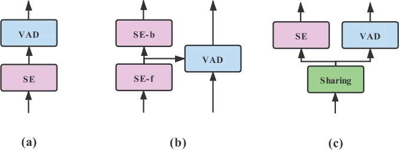
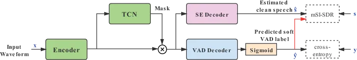
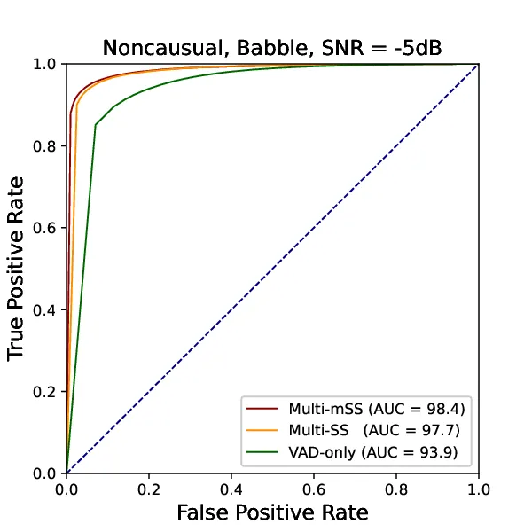
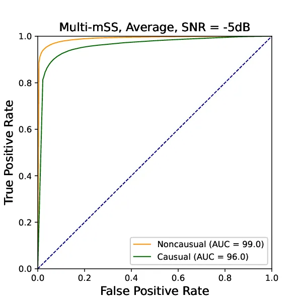
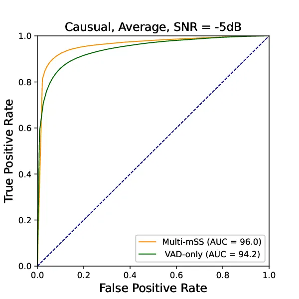

# Speech enhancement aided end-to-end multi-task learning for voice activity detection

Xu Tan    Xiao-Lei Zhang

###### Abstract

Robust voice activity detection (VAD) is a challenging task in low
signal-to-noise (SNR) environments. Recent studies show that speech
enhancement is helpful to VAD, but the performance improvement is
limited. To address this issue, here we propose a speech enhancement
aided end-to-end multi-task model for VAD. The model has two decoders,
one for speech enhancement and the other for VAD. The two decoders share
the same encoder and speech separation network. Unlike the direct
thought that takes two separated objectives for VAD and speech
enhancement respectively, here we propose a new joint optimization
objective—VAD-masked scale-invariant source-to-distortion ratio
(mSI-SDR). mSI-SDR uses VAD information to mask the output of the speech
enhancement decoder in the training process. It makes the VAD and speech
enhancement tasks jointly optimized not only at the shared encoder and
separation network, but also at the objective level. It also satisfies
real-time working requirement theoretically. Experimental results show
that the multi-task method significantly outperforms its single-task VAD
counterpart. Moreover, mSI-SDR outperforms SI-SDR in the same multi-task
setting.

###### Index Terms: 

voice activity detection, speech enhancement, multi-task, end-to-end,
deep learning

^(†)^(†)address: CIAIC, School of Marine Science and Technology,
Northwestern Polytechnical University, China

## 1 Introduction

Voice activity detection (VAD) aims to differentiate speech segments
from noise segments in an audio recording. It is an important front-end
for many speech-related applications, such as speech recognition and
speaker recognition. In recent years, deep learning based VAD have
brought significant performance improvement \[1, 2, 3, 4, 5, 6, 7, 8\].
Particulary, the end-to-end VAD, which takes time-domain signals
directly into deep networks, is a recent research trend\[9, 10, 11\].

Although deep learning based VAD has shown its effectiveness, it is of
long-time interests that how to further improve its performance in low
signal-to-noise ratio (SNR) environments. A single VAD seems hard to
meet the requirement. A natural thought is to bring speech enhancement
(SE) into VAD. Several previous works have pursued this direction. The
earliest method \[12\] uses a deep-learning-based speech enhancement
network to initialize VAD. In \[13\], the authors uses a speech
enhancement network to first denoise speech, and then uses the denoised
speech as the input of VAD, where the enhancement network and VAD are
jointly fine-tuned (Fig. 1a). Similar ideas can be found in \[14\] too.



Figure 1: Three typical architectures of speech enhancement aided VAD in
literature.



Figure 2: Structure of the proposed end-to-end multi-task model. The red
line denotes important information flow in the objective.

Later on, it is observed that using the enhancement result as the input
of VAD may do harm to VAD when the performance of the SE module is poor
\[15\]. Based on the observations, several work uses advanced speech
enhancement methods to extract denoised features for VAD (Fig. 1b). Lee
et al. \[16\] used U-Net to estimate clean speech spectra and noise
spectra simultaneously, and then used the enhanced speech spectrogram to
conduct VAD directly by thresholding. Jung et al. \[17\] used the output
and latent variable of a denoising variational autoencoder-based SE
module as the input of VAD. Xu et al. \[15\] concatenated the noisy
acoustic feature and an enhanced acoustic feature extracted from a
convolutional-recurrent-network-based SE as the input of a
residual-convolutional neural-network-based VAD.

Besides, Zhuang et al. \[18\] proposed multi-objective networks to
jointly train SE and VAD for boosting both of their performance (Fig.
1c), where VAD and SE share the same network and have different loss
functions. However, the performance improvement of VAD is limited. Here,
we believe that the joint training strategy is promising, it is just
unexplored deeply yet.

In this paper, we propose an end-to-end multi-task joint training model
to improve the performance of VAD in adverse acoustic environments.
Specifically, we employ Conv-TasNet \[19\] as the backbone network.
Then, we make SE and VAD share the same encoder and temporal
convolutional network (TCN). Finally, we use two decoders for generating
enhanced speech and speech likelihood ratios respectively. The novelties
of the method are as follows

- •
  To our knowledge, we propose the first end-to-end multitask model for
  VAD, where SE is used as an auxiliary task.
- •
  We propose a novel loss function, named VAD-masked scale-invariant
  source-to-distortion ratio (mSI-SDR), at the SE decoder. It uses the
  the ground-truth and predicted VAD labels to mask the speech
  enhancement output. It makes the network structure different from the
  three classes of models in Fig. 1.

Besides, the proposed method also inherits the merit of low latency from
Conv-TasNet. Experimental results demonstrate the effectiveness of the
proposed end-to-end multi-task model as well as the advantage of the
proposed mSI-SDR objective.

## 2 End-to-end multi-task model with mSI-SDR

### 2.1 Notation

Given an audio signal of $`T`$ samples, denoted as
$`\mathbf{x}\in\mathbb{R}^{1\times T}`$, which is a mixture of clean
speech $`\mathbf{s}`$ and noise $`\mathbf{n}`$, i.e.
$`\mathbf{x}=\mathbf{s}+\mathbf{n}`$. Suppose $`\mathbf{x}`$ can be
partitioned into $`N`$ frames. Usually, we transform the time-domain
representation into a time-frequency representation
$`\{\mathbf{w}_{i}\}_{i=1}^{N}`$. VAD first generates a soft prediction
of $`\mathbf{w}_{i}`$, denoted as $`\hat{y}_{i}`$, and then compares
$`\hat{y}_{i}`$ with a decision threshold for generating a hard
decision, where $`i`$ denotes the $`i`$-th frame and
$`\hat{y}_{i}\in[0,1]`$ is a soft prediction of the ground-truth label
$`y_{i}\in\{0,1\}`$. Speech enhancement aims to generate an estimate of
$`\mathbf{s}`$, denoted as $`\hat{\mathbf{s}}`$, from $`\mathbf{x}`$.

### 2.2 Network architecture

As shown in Fig. 2, the proposed end-to-end multi-task model conducts
speech enhancement and VAD simultaneously. It follows the architecture
of Conv-TasNet \[19\], which contains three parts—an encoder, a
separation network, and two decoders. The two tasks share the same
encoder and separation network. Each task has its individual decoder.
The decoder for speech enhancement generates the enhanced speech
$`\hat{\mathbf{s}}`$, while the decoder for VAD generates soft
predictions $`\hat{y}`$.

The encoder is mainly a one-dimension convolutional layer with a kernel
size of $`L`$ and stride $`L/2`$. It transforms the input noisy audio
signal $`\mathbf{x}\in\mathbb{R}^{1\times T}`$ to a feature map
$`\mathbf{W}\in\mathbb{R}^{N\times K}`$, where $`N`$ and $`K`$ are the
dimension and number of the feature vectors respectively. The TCN speech
separation module estimates a mask
$`\mathbf{M}\in\mathbb{R}^{N\times K}`$ from $`\mathbf{W}`$, and applies
$`\mathbf{M}`$ to $`\mathbf{W}`$ by an element-wise multiplication,
which gets the denoised feature map
$`\mathbf{D}\in\mathbb{R}^{N\times K}`$, i.e.
$`\mathbf{D}=\mathbf{M}\odot\mathbf{W}`$ where $`\odot`$ denotes the
element-wise multiplication.

The decoders are two independent one-dimensional transposed convolution
layers. Each of them conducts an opposite dimensional transform to the
encoder. Both of the decoders take $`\mathbf{D}`$ as the input. They
generate the estimated clean speech
$`\mathbf{\hat{s}}\in\mathbb{R}^{1\times T}`$ and VAD scores
respectively. To generate probability-like soft decision scores for VAD,
a sigmoid function is used to constrain the output of the VAD decoder
between $`0`$ and $`1`$, which outputs
$`\mathbf{\hat{y}}=[\hat{y}_{1},\ldots,\hat{y}_{T}]\in{[0,1]}^{1\times T}`$.

### 2.3 Objective function and optimization

The end-to-end multi-task model uses the following joint loss:

```math
L=\lambda\ell_{\rm vad}+(1-\lambda)\ell_{\rm enhance} \tag{1}
```

where $`\ell_{\rm vad}`$ and $`\ell_{\rm enhance}`$ are the loss
components for VAD and speech enhancement respectively, and
$`\lambda\in(0,1)`$ is a hyperparameter to balance the two components.
We use the cross-entropy minimization as $`\ell_{\rm vad}`$. Because
SI-SDR \[19\] is frequently used as the optimization objective of
end-to-end speech separation, a conventional thought of multitask
learning is to optimize SI-SDR and cross-entropy jointly. However, the
two decoders in this strategy are optimized independently, which do not
benefit VAD and speech enhancement together. As we know, VAD and speech
enhancement share many common properties. For example, the earliest
ideal-binary-masking based speech enhancement can be regarded as VAD
applied to each frequency band \[20\].

To benefit the advantages of VAD and speech enhancement together, we
propose a new speech enhancement loss, named mSI-SDR, as
$`\ell_{\rm enhance}`$ for the multi-task training. We present mSI-SDR
in detail as follows.

mSI-SDR is revised from the conventional SI-SDR. SI-SDR is designed to
solve the scale-dependent problem in the signal-to-distortion ratio
\[21\]:

```math
{\mbox{SI-SDR}}=10\log_{10}\dfrac{||\mathbf{e}_{target}||^{2}}{||\mathbf{e}_{res}||^{2}}=10\log_{10}\dfrac{||\alpha\mathbf{s}||^{2}}{||\alpha\mathbf{s}-\hat{\mathbf{s}}||^{2}} \tag{2}
```

where $`\mathbf{s}`$ is the referenced signal, $`\hat{\mathbf{s}}`$ is
the estimated signal, and
$`\alpha=\dfrac{\hat{\mathbf{s}}^{T}\mathbf{s}}{||\mathbf{s}||^{2}}`$
denotes the scaling factor.

mSI-SDR introduces the VAD labels and predictions into SI-SDR:

```math
\ell_{\rm enhance}={\mbox{mSI-SDR}}=10\log_{10}\dfrac{||\beta\mathbf{s}||^{2}}{||\beta\mathbf{s}-\hat{\mathbf{s}}^{*}||^{2}} \tag{3}
```

where

```math
\hat{\mathbf{s}}^{*}=\hat{\mathbf{s}}+\hat{\mathbf{s}}\odot(\mathbf{y}+\hat{\mathbf{y}}) \tag{4}
```

$`\beta=\dfrac{\hat{\mathbf{s}}^{*T}\mathbf{s}}{||\mathbf{s}||^{2}}`$,
and $`\mathbf{y}=[y_{1},\ldots,y_{T}]`$ is the ground-truth VAD label.
From (3), we see that mSI-SDR takes the enhanced speech, clean speech,
ground-truth VAD labels, and predicted VAD labels into consideration.

Equation (4) is important in benefitting VAD and SE together. It makes
$`\ell_{\rm enhance}`$ focus on enhancing the voice active part of the
signal. More importantly, when optimizing the joint loss function by
gradient descent, the updating process of the VAD decoder depends on
both $`\ell_{\rm vad}`$ and $`\ell_{\rm enhance}`$, which makes VAD use
the two kinds of references sufficiently.

## 3 Experiments

### 3.1 Experimental setup

Wall Street Journal (WSJ0) \[22\] dataset was used as the source of
clean speech. It contains 12776 utterances from 101 speakers for
training, 1206 utterances from 10 speakers for validation, and 651
utterances from 8 speakers for evaluation. Only 20% of the audio
recordings is silence. To alleviate the class imbalanced problem, we
added silent segments of 0.5 and 1 second to the front and end of each
audio recording respectively. The noise source for training and
development is a large-scale noise library containing over 20000 noise
segments. The noise source for test is five unseen noises, where the
bus, caffe, pedestrians, and street noise are from CHiME-3 dataset
\[23\], and the babble noise is from the NOISEX-92 noise corpus \[24\].
The SNR level of each noisy speech recording in the training and
development sets was selected randomly from the range of $`[-5,5]`$ dB.
The SNR levels of the test sets were set to $`-5`$dB, 0dB, and 5dB
respectively. The noise sources between training, development, and test
do not overlap. All signals were resampled to 16 kHz. The ground-truth
VAD labels were obtained by applying Ramirez VAD \[25\] with
human-defined smoothing rules to the clean speech. This method was
proved to be reasonable for generating ground-truth labels \[4, 15,
17\].

[TABLE]

Table 1: Performance of the Multi-mSS, Multi-SS, and VAD-only models for
VAD.

We denote the proposed method as the multi-task model with mSI-SDR loss
(Multi-mSS). For the model training, each training audio recording was
cropped into several 4-second segments. The mini-batch size was set to 8. The Adam optimizer \[26\] was used. The initial learning rate was set
to $`1e^{-3}`$ and will be halved if the performance on the validation
set has no improvement in 3 consecutive epochs. The minimum learning
rate was set to $`1e^{-8}`$. The weight decay was set to $`1e^{-5}`$.
The training was stopped if not performance improvement was observed in
6 consecutive epochs. The specific parameter setting of the end-to-end
network follow the default setting of Conv-Tasnet \[19\] with $`L=32`$.

To compare with Multi-mSS, we trained a multi-task model with SI-SDR
loss (Multi-SS) and a VAD-only single-task model denoted as VAD-only
model. Multi-SS has exactly the same network structure as Multi-mSS. The
objective of its SE decoder was set to SI-SDR. The VAD-only model
removes the SE decoder and uses the VAD loss $`\ell_{vad}`$ as the
optimization objective. We used the receiver-operating-characteristic
(ROC) curve, area under the ROC curve (AUC), and equal error rate (EER)
as the evaluation metrics for VAD. We took the signal of every 10ms as
an observation for the calculation of AUC and EER. We used the
perceptual evaluation of speech quality (PESQ), short-time objective
intelligibility (STOI) \[27\], and scale-invariant source-to-distortion
ratio (SI-SDR) \[21\] as the evaluation metrics for speech enhancement.

### 3.2 Results



Figure 3: ROC curve comparison in the babble noise at $`-5`$ dB.



(a)



(b)

Figure 4: ROC curve comparison in causual configurations.

Comparison between Multi-mSS and the VAD-only model: The comparison
result between the proposed Multi-mSS and the VAD-only model is shown in
Table 1. From the table, we see that Multi-mSS outperforms the VAD-only
model in all noise environments and SNR conditions in terms of both AUC
and EER. The relative performance improvement is enlarged when the SNR
level becomes low. For example, Multi-mSS provides a relative AUC
improvement of 73.77% over the VAD-only model, and a relative EER
reduction of 59.83% over the latter in the babble noise at $`-5`$ dB.
When the SNR is increased to 5 dB, the relative improvement is reduced
to 50.00% and 37.23% respectively.

From the table, we also notice that the advantage of Multi-mSS is
obvious in difficult noisy environments. Specifically, The relative EER
reduction in the babble, caffe and pedestrains environments is 55.38%,
38.02% and 35.11% respectively. In contrast, the relative EER reduction
in the bus and street environments is only 21.12% and 26.13%. One can
see that the babble, caffe and pedestrains environments are
speech-shaped ones, which have similar distributions with the targeted
speech.

Although our goal is to improve the performance of VAD, we also list the
comparison of Multi-mSS and the SE-only single-task model (denoted as
SE-only model) on SE performance here as a reference. The result in
Table 2 shows that the performance of the speech enhancement task was
not greatly affected.

|         |           |         |        |        |
| ------- | --------- | ------- | ------ | ------ |
| Metrics | Model     | SNR(dB) |        |        |
|         |           | -5dB    | 0dB    | 5dB    |
| PESQ    | Multi-mSS | 2.422   | 2.848  | 3.151  |
|         | Multi-SS  | 2.404   | 2.856  | 3.168  |
|         | SE-only   | 2.457   | 2.906  | 3.224  |
| STOI    | Multi-mSS | 0.898   | 0.950  | 0.972  |
|         | Multi-SS  | 0.897   | 0.950  | 0.973  |
|         | SE-only   | 0.898   | 0.950  | 0.973  |
| SI-SDR  | Multi-mSS | 9.705   | 13.176 | 16.105 |
|         | Multi-SS  | 9.829   | 13.529 | 16.674 |
|         | SE-only   | 9.873   | 13.577 | 16.721 |

Table 2: Average performance of the Multi-mSS, Multi-SS, and SE-only
models for speech enhancement.

Comparison between Multi-mSS and Multi-SS: Table 1 also shows the
comparison result between Multi-mSS and Multi-SS. From the table, we see
that Muli-mSS produces at least comparable performance to Muli-SS in all
environments. Particularly, Multi-mSS provides a relative AUC
improvement of 30.43% and a relative EER reduction of 16.87% over
Multi-SS in the most difficult environment—babble noise at $`-5`$ dB,
where the ROC curves of the three comparison methods are further drawn
in Fig. 3.

Comparison with causual configurations: We also evaluated the comparison
methods with the same causal configurations as \[19\]. Specifically, we
first replaced the global layer normalization with cumulative layer
normalization, and then used causal dilated convolution in TCN. This
makes the comparison methods work in real time with a minimum delay of
about 2ms. Fig. 4 shows the average ROC curves of the comparison methods
over all 5 noisy conditions at $`-5`$ dB. From Fig. 4a, we see that the
causal Multi-mSS does not suffer much performance degradation from the
noncausal Multi-mSS. From Fig. 4b, we see that the causal Multi-mSS
outperforms the causal VAD-only model significantly, which is consistent
to the conclusion in the noncausal configurations.

## 4 conclusions

In this paper, we have proposed an end-to-end multi-task model with a
novel loss funtion named VAD-masked scale-invariant source-to-distortion
ratio (mSI-SDR) to increase robustness of the VAD system in low SNR
environments. mSI-SDR takes the VAD information into the optimization of
the SE decoder, which makes the two tasks jointly optimized not only at
the encoder and separation networks, but also at the objective level.An
additional merit is that it theoretically satisfies real-time
applications. Experimental results show that the proposed method
outperforms the VAD-only model in all noise conditions, especially the
low SNR environments and that with much human voice interference.
Moreover, mSI-SDR yields better performance than SI-SDR in the
multi-task setting. In the future, we will evaluate the proposed method
in more complicated scenarios and compare it with the state-of-the-art
VAD in the system level \[28\].

## References

- \[1\] Xiao-Lei Zhang and Ji Wu, “Deep belief networks based voice
  activity detection,” IEEE/ACM TASLP, vol. 21, no. 4, pp.
  697–710, 2012.
- \[2\] Thad Hughes and Keir Mierle, “Recurrent neural networks for
  voice activity detection,” in in ICASSP, 2013. IEEE, 2013, pp.
  7378–7382.
- \[3\] Samuel Thomas, Sriram Ganapathy, George Saon, and Hagen Soltau,
  “Analyzing convolutional neural networks for speech activity detection
  in mismatched acoustic conditions,” in ICASSP, 2014. IEEE, 2014, pp.
  2519–2523.
- \[4\] Xiao-Lei Zhang and DeLiang Wang, “Boosting contextual
  information for deep neural network based voice activity detection,”
  IEEE/ACM TASLP, vol. 24, no. 2, pp. 252–264, 2015.
- \[5\] Jaeseok Kim, Heejin Choi, Jinuk Park, Juntae Kim, and Minsoo
  Hahn, “Voice activity detection based on multi-dilated convolutional
  neural network,” in ICMSCE, 2018, 2018, p. 98–102.
- \[6\] J. Kim and M. Hahn, “Voice activity detection using an adaptive
  context attention model,” IEEE Signal Processing Letters, vol. 25, no.
  8, pp. 1181–1185, 2018.
- \[7\] S. Chang, B. Li, G. Simko, T. N. Sainath, A. Tripathi, A. van
  den Oord, and O. Vinyals, “Temporal modeling using dilated convolution
  and gating for voice-activity-detection,” in ICASSP, 2018, 2018, pp.
  5549–5553.
- \[8\] Tharindu Fernando, Sridha Sridharan, Mitchell McLaren, Darshana
  Priyasad, Simon Denman, and Clinton Fookes, “Temporarily-Aware Context
  Modeling Using Generative Adversarial Networks for Speech Activity
  Detection,” IEEE/ACM TASLP, vol. 28, pp. 1159–1169, 2020.
- \[9\] Ruben Zazo, Tara N. Sainath, Gabor Simko, and Carolina Parada,
  “Feature learning with raw-waveform cldnns for voice activity
  detection,” in Interspeech 2016, 2016.
- \[10\] Ido Ariav and Israel Cohen, “An End-to-End Multimodal Voice
  Activity Detection Using WaveNet Encoder and Residual Networks,” IEEE
  Journal on Selected Topics in Signal Processing, vol. 13, no. 2, pp.
  265–274, 2019.
- \[11\] Cheng Yu, Kuo-Hsuan Hung, I-Fan Lin, Szu-Wei Fu, Yu Tsao, and
  Jeih weih Hung, “Waveform-based voice activity detection exploiting
  fully convolutional networks with multi-branched encoders,” arXiv
  preprint arXiv:2006.11139, 2020.
- \[12\] Xiao-Lei Zhang and Ji Wu, “Denoising deep neural networks based
  voice activity detection,” in ICASSP, 2013. IEEE, 2013, pp. 853–857.
- \[13\] Qing Wang, Jun Du, Xiao Bao, Zi Rui Wang, Li Rong Dai, and
  Chin Hui Lee, “A universal VAD based on jointly trained deep neural
  networks,” in Interspeech, 2015, vol. 2015-Janua, pp. 2282–2286, 2015.
- \[14\] Ruixi Lin, Charles Costello, Charles Jankowski, and Vishwas
  Mruthyunjaya, “Optimizing voice activity detection for noisy
  conditions,” in Interspeech, 2019, vol. 2019-September, pp.
  2030–2034, 2019.
- \[15\] Tianjiao Xu, Hui Zhang, and Xueliang Zhang, “Joint training
  ResCNN-based voice activity detection with speech enhancement,” in
  APSIPA ASC, 2019, pp. 1157–1162, 2019.
- \[16\] Geon Woo Lee and Hong Kook Kim, “Multi-task learning U-Net for
  single-channel speech enhancement and mask-based voice activity
  detection,” Applied Sciences (Switzerland), vol. 10, no. 9, 2020.
- \[17\] Youngmoon Jung, Younggwan Kim, Yeunju Choi, and Hoirin Kim,
  “Joint learning using denoising variational autoencoders for voice
  activity detection,” in Interspeech, 2018, vol. 2018-Septe, no.
  January 2019, pp. 1210–1214, 2018.
- \[18\] Yimeng Zhuang, Sibo Tong, Maofan Yin, Yanmin Qian, and Kai Yu,
  “Multi-task joint-learning for robust voice activity detection,” in
  ISCSLP, 2016, , no. 1, 2017.
- \[19\] Yi Luo and Nima Mesgarani, “Conv-TasNet: Surpassing Ideal
  Time-Frequency Magnitude Masking for Speech Separation,” IEEE/ACM
  TASLP, vol. 27, no. 8, pp. 1256–1266, 2019.
- \[20\] Y. Wang, K. Han, and D. Wang, “Exploring monaural features for
  classification-based speech segregation,” IEEE/ACM TASLP, vol. 21, no.
  2, pp. 270–279, 2013.
- \[21\] Jonathan Le Roux, Scott Wisdom, Hakan Erdogan, and John R.
  Hershey, “SDR - Half-baked or Well Done?,” in ICASSP, 2019, vol.
  2019-May, pp. 626–630, 2019.
- \[22\] Douglas B Paul and Janet Baker, “The design for the wall street
  journal-based csr corpus,” in Speech and Natural Language: Proceedings
  of a Workshop Held at Harriman, New York, February 23-26, 1992, 1992.
- \[23\] Jon Barker, Ricard Marxer, Emmanuel Vincent, and Shinji
  Watanabe, “The third ‘chime’speech separation and recognition
  challenge: Dataset, task and baselines,” in 2015 IEEE Workshop on
  Automatic Speech Recognition and Understanding (ASRU). IEEE, 2015, pp.
  504–511.
- \[24\] Andrew Varga and Herman JM Steeneken, “Assessment for automatic
  speech recognition: Ii. noisex-92: A database and an experiment to
  study the effect of additive noise on speech recognition systems,”
  Speech communication, vol. 12, no. 3, pp. 247–251, 1993.
- \[25\] Javier Ramírez, José C Segura, Carmen Benítez, Luz García, and
  Antonio Rubio, “Statistical voice activity detection using a multiple
  observation likelihood ratio test,” IEEE Signal Processing Letters,
  vol. 12, no. 10, pp. 689–692, 2005.
- \[26\] Diederik P Kingma and Jimmy Ba, “Adam: A method for stochastic
  optimization,” arXiv preprint arXiv:1412.6980, 2014.
- \[27\] Cees H Taal, Richard C Hendriks, Richard Heusdens, and Jesper
  Jensen, “A short-time objective intelligibility measure for
  time-frequency weighted noisy speech,” in ICASSP, 2010. IEEE, 2010,
  pp. 4214–4217.
- \[28\] Juntae Kim, “Voice activity detection toolkit website,”
  https://github.com/jtkim-kaist/VAD, 2018.
