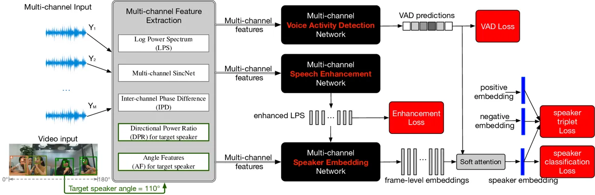
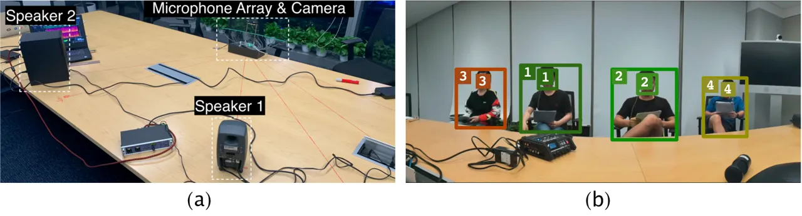

# Multi-Channel Speaker Verification for Single and Multi-talker Speech

Saurabh Kataria    Shi-Xiong Zhang    Dong Yu ^(†)^(†)thanks: ^(\*)This
work was done while Saurabh Kataria was a research intern at Tencent AI
Lab, USA. \$†\$These authors contributed equally.

###### Abstract

To improve speaker verification in real scenarios with interference
speakers, noise, and reverberation, we propose to bring together
advancements made in multi-channel speech features. Specifically, we
combine _spectral_, _spatial_, and _directional_ features, which
includes inter-channel phase difference, multi-channel _sinc_
convolutions, directional power ratio features, and angle features. To
maximally leverage supervised learning, our framework is also equipped
with multi-channel speech enhancement and voice activity detection. On
all simulated, replayed, and real recordings, we observe large and
consistent improvements at various degradation levels. On real
recordings of multi-talker speech, we achieve a 36% relative reduction
in equal error rate w.r.t. single-channel baseline. We find the
improvements from speaker-dependent _directional_ features more
consistent in multi-talker conditions than clean. Lastly, we investigate
if the learned multi-channel speaker embedding space can be made more
discriminative through a contrastive loss-based fine-tuning. With a
simple choice of Triplet loss, we observe a further 8.3% relative
reduction in EER.

^(†)^(†)address: ¹Center for Language and Speech Processing, Johns
Hopkins University, Baltimore, MD, USA  
²Tencent AI Lab, Bellevue, WA, USA^(†)^(†)email: skatari1@jh.edu,
auszhang@tencent.com, dyu@tencent.com

Index Terms: multi-channel speaker verification, multi-talker,
overlapped speech, speech separation, joint learning

## 1 Introduction

Speech devices are getting equipped with multi-channel and multi-modal
information, in turn improving spatial ambiguity and directivity \[1,
2\]. Such information is fused at various levels: feature, embedding, or
score \[3\]. This is shown beneficial for Automatic Speech
Recognition \[4\], Speaker Recognition \[5\], Speech Enhancement \[6\],
and Source Separation \[7\].

Several _spectral_, _spatial_, and _directional_ features \[1\] are
proposed for multi-channel version of such problems. In \[8\], authors
use multi-channel _sinc_ convolution filters and show the importance of
phase for time-domain multi-channel speech enhancement. Source
Separation work of \[9\] proposed multi-channel Deep Clustering which
employs IPD (IPD) and asserts that spatial features are helpful even for
arbitrary mic configurations. \[6\] improved over IPD features through
ICD (ICD) features by directly learning on multi-channel temporal data.
In \[10\], authors showed the effectiveness of AF (AF) \[11\] for
targeted speech extraction.

MCSV (MCSV) is an under-explored problem with no common benchmarks
except CHiME-5  \[12\]. It is pursued mostly using pre-processing
techniques like dereverberation and mask-based beamforming. In \[13\],
authors combined WPE (WPE) dereverberation and MVDR (MVDR) beamforming
for MCSV. In \[14\], authors search for optimal beamformer among
variants of IRM (IRM) based MVDR and GEV (GEV) beamformers. \[15\]
showed the utility of multi-channel speech enhancement for MCSV. \[5\]
found that multi-channel T-F (T-F) representations are superior to
single-channel especially when 3D convolutions are used instead of 2D in
a deep multi-channel input based CNN (CNN).

We believe prior works are not comprehensive in terms of leveraging all
available information. For example, they do not investigate if spatial
and location clues of sound sources can help speaker verification. \[9\]
noted that linear beamformer filtering cannot capture multi-channel
non-linear information. Towards building a _complete_ multi-channel
speaker embedding system, we propose to incorporate various
multi-channel features and learn a multi-channel CNN embedding network
in conjunction with joint (multi-channel) enhancement and VAD (VAD).
Specifically, we pursue text-independent wide-band *informed* \[16\]
(opposed to *blind* \[17\]) MCSV.

Our contributions are: (1) we provide the first study to compare and
combine various multi-channel _spectral_, _spatial_, and _directional_
speech features for robust MCSV, and report consistent improvements on
real far-field data; (2) we devise a comprehensive location-aware
speaker verification setup with joint enhancement, VAD, and realistic
single and multi-talker test scenarios; (3) we demonstrate that this
multi-channel system performance can be improved via contrastive
fine-tuning.

## 2 Multi-Channel Speaker Verification

### 2.1 Proposed Multi-Task Supervised Learning Framework

To maximally exploit supervised learning, we devise a multi-task
framework that jointly optimizes three multi-channel tasks: speaker
embedding learning, voice activity detection, and speech enhancement.
Thanks to simulation, we utilize ground truth labels for the latter two
tasks. Using the initial single-channel clean speech, we compute its
energy VAD and the spectrogram as targets for the two tasks
respectively. Loss for complete framework is
$`\mathcal{L}_{\text{all}}=\mathcal{L}_{\text{BASE}}+\lambda_{\text{enh}}\mathcal{L}_{\text{enh}}`$,
where
$`\mathcal{L}_{\text{BASE}}=\mathcal{L}_{\text{emb}}+\lambda_{\text{VAD}}\mathcal{L}_{\text{VAD}}`$,
and $`\lambda_{\text{VAD}}`$, $`\lambda_{\text{enh}}`$ are
regularization weights for VAD and enhancement task respectively. They
are set to 0.1 and 0.0005. $`\mathcal{L}_{\text{emb}}`$ is CE (CE) loss,
$`\mathcal{L}_{\text{VAD}}`$ is frame-wise BCE (BCE) loss,
$`\mathcal{L}_{\text{enh}}`$ is spectrogram-domain MAE (MAE) loss, and
$`\mathcal{L}_{\text{BASE}}`$ is the loss for the BASE model which is a
single-channel joint speaker embedding and VAD system without the speech
enhancement module.

Fig.1 illustrates our proposal. Note that the input features for the
three tasks are identical but their outputs are combined later. Our
methodology is to _incrementally_ incorporate various multi-channel
features on top of the BASE system in order to maximize speaker
recognition performance. We do not investigate feature fusion schemes
and simply concatenate all features along the _channel dimension_ of the
input layer of CNN. We hope to observe the complementary effect of such
features \[9\] since some of them may under-perform in adverse
scenarios. For e.g., under heavy reverberations, IPDs get degraded.
Hence, we are interested in a MCSV system which is robust and
generalizes well. To explore this, we choose a Mandarin test set that is
language-mismatched with the train set (English) and is corrupt with
reverberations, background noises, and speaker interferences. Since
there is no MCSV work directly comparable to our setup, for the
baseline, we use the standard single-channel 80-D LMFB (LMFB) features
(BASE system).



Figure 1: Schematic of the proposed multi-channel speaker verification
based on multi-channel features. In practice, face and body detection in
video can provide locations of each speaker but not who is speaking or
when.

### 2.2 Large-Margin Contrastive Fine-Tuning

We investigate if the learned multi-channel speaker embedding space can
be made more discriminative using contrastive loss-based
post-processing. We are inspired by \[18\], which proposed to switch
from CE loss to Triplet loss towards the end of speaker embedding
training for superior generalization. On the pre-trained multi-channel
model, we minimize
$`\mathcal{L}_{\text{triplet}}=f_{\beta}(d(a,p)-d(a,n)+m)`$, where
$`f_{\beta}(x)=\beta^{-1}\log(1+\exp(\beta x))`$,
$`\mathcal{L}_{\text{triplet}}`$ refers to the contrastive (Triplet)
loss, $`f_{\beta}(\cdot)`$ is the softplus function (smooth version of
hinge function \[19\]), $`\beta`$ is a non-negative constant, and $`d`$
is the Euclidean distance function. In the Triplet loss
terminology \[18\], $`a`$ is an _anchor_ example, $`p`$ is a _positive_
example, $`n`$ is a _negative_ example, and $`m`$ is the _margin_. $`a`$
and $`p`$ belong to the same class while $`n`$ belongs to a different
class. For triplet formation, we follow the _hardest_ mining
strategy \[19\]. It refers to choosing _hardest positive_ and _hardest
negative_ example for each anchor with $`d`$ as the criterion. For this,
the training batch must contain multiple examples per speaker. We follow
_PK sampling_ i.e. choose $`K`$ examples per $`P`$ unique speakers. We
are particularly interested in _large margins_ in this formulation.

## 3 Multi-Channel Features

Inter-Channel Phase Difference: IPD is a common _spatial_ feature which
measures the phase difference between complex STFT (STFT) of signals at
two different microphones.

```math
{\tt{IPD}}_{(i,j),tf}=\angle\left(\frac{{Y}_{i,tf}}{{Y}_{j,tf}}\right),i,j=1\dots M,j\neq i. \tag{1}
```

Here, $`M`$ is the number of microphones in the array, $`i,j`$ are
microphone indices, $`(t,f)`$ is the current T-F bin, and $`{Y}`$ is the
STFT. Note that this gives us $`M(M-1)`$ pairs but we later choose only
a pre-defined small subset. Cosine and sine of IPD are extensively used
in prior works \[6, 7, 9\] and they are referred to as cosIPD and
sinIPD.

Directional Power Ratio (DPR): We adopt _directional_ features from
\[20\] based on the output power of multi-look fixed beamformers and
direction beam of target speaker $`\theta_{p}`$. For a set of direction
grid of beams $`\{\theta_{1},\dots,\theta_{P}\}`$ and the corresponding
filters $`\mathbf{w}_{f}(\theta_{p})`$,

```math
{\tt{DPR}}_{tf}(\theta_{p})=\frac{\left\|\mathbf{w}_{f}^{\sf H}(\theta_{p})\mathbf{Y}_{tf}\right\|_{2}^{2}}{\sum_{p=1}^{P}\left\|\mathbf{w}_{f}^{\sf H}(\theta_{p})\mathbf{Y}_{tf}\right\|_{2}^{2}}, \tag{2}
```

where Y is the mixed multi-channel complex spectrum. The DPR features
quantify how well a T-F bin is represented by a signal from a direction
beam $`\theta_{p}`$.

Angle Features: We adopt the Angle Features (AF) from \[2\]. The AF is
formed according to the angle $`\theta`$ of a target speaker and
measures the cosine distance between the steering vector and IPD:

```math
\displaystyle\centering A_{tf}(\theta_{t}) \displaystyle={\underset{(i,j)}{\sum}}{\left<\mathbf{e}^{{\tt TPD}_{(i,j),tf}},\mathbf{e}^{{\tt IPD}_{(i,j),tf}}\right>} \tag{3}
```

```math
\displaystyle{\tt TPD}_{(i,j),tf} \displaystyle=2\pi\varDelta_{ij}\cos{(\theta_{t})}f/(c\cdot f_{s})
```

Vector $`\mathbf{e}^{(\cdot)}=[\cos(\cdot),\sin(\cdot)]^{\sf T}`$,
$`{\tt TPD}_{(i,j),tf}`$ (Target-dependent Phase Difference) is the
phase delay between microphones $`i`$ and $`j`$ for a plane wave with
frequency $`f`$. The plane wave is travelling from an angle
$`\theta_{t}`$ (target speaker’s angle at time $`t`$),
$`\varDelta_{ij}`$ is the distance between the $`i,j`$ microphone pair,
$`c`$ is the sound velocity and $`f_{s}`$ is sampling rate. In the
training stage, the angle of target speaker $`\theta`$ is known as
multi-channel audios were generated by simulation. In practice, the
angle of the target speaker $`\theta_{t}`$ can be estimated by the face
tracking system \[21\] or audio-based source localization \[22\].
Details of angle estimation are beyond the scope of this work and were
discussed in \[23\].

Multi-Channel SincNet Features: A _sinc_ convolution layer \[24\] learns
data-dependent 1-D filters. We extend such layer to multi-channel input
as done in multi-channel speech enhancement work of \[8\]. We learn
$`C_{\text{sinc}}=257`$ filters so that the resultant feature dimension
is compatible with other features. $`i`$-th _sinc_ filter
$`\mathbf{s}_{i,t}`$ is windowed and subsequently convolved with
time-domain signal of every channel and given by:

```math
\displaystyle\mathbf{s}_{i,t} \displaystyle=2f_{i,\text{low}}\operatorname{sinc}\left(2\pi f_{i,\text{low}}t\right)-2f_{i,\text{high}}\operatorname{sinc}\left(2\pi f_{i,\text{high}}t\right) \tag{4}
```

$`f_{i,\text{low}}`$ and $`f_{i,\text{high}}`$ are learnable low and
high cutoff frequency parameters \[8\] and $`t`$ is the temporal index.
We propose to use the resultant features, _MultChanSinc_, as an
alternative to LPS+IPD since it combines _spectral_ and _spatial_
information. For fair comparison, we provide _MultChanSinc_ same channel
information as the IPD.

## 4 Experiments

Our study is device-specific and is performed with a 15-channel
non-uniform linear microphone array with spacing
7-6-5-4-3-2-1-1-2-3-4-5-6-7 in cm and a 180-degree camera. The proposed
multi-channel speaker verification system was evaluated under four
far-field conditions — 1) simulated single-talker speech, 2) simulated
multi-talker speech, 3) replayed recordings of multi-talker speech, and 4) real recording of multi-talker speech.

For simulated single and multi-talker setups, test data is originally
single-channel 16KHz and is simulated to 15-channel. The details of the
simulation can be found in the Alg. 1 of \[2\]. The evaluation data
consists of clean internal Mandarin corpus (36 hrs, 364 speakers). For
data augmentation, we use a large internal noise and RIR (RIR) corpus
which contains 700 noise files and 3000 RIRs. The RIRs are multi-channel
signals simulated in various virtual room configurations. They are also
similarly split to create disjoint training, validation, and evaluation
data. We constrain all sound sources (target speaker, interference
speaker, noise sources) to the azimuth angle range of
$`(0\degree,180\degree)`$. For DPR features, we choose the spatial
resolution of 10°and hence $`P=10`$ in Eq. 2. Ignoring spatial ambiguity
issue \[6\], we keep the angle between the target and interference
speaker unconstrained. The position of all sources is static. Only one
interference speaker is allowed with probability $`p_{\text{tar}}`$. For
training and validation, SNRs (SNRs) $`\in\{-3,0,6,12,18\}`$ dB, SIRs
(SIRs) $`\in\{0,3,6\}`$ dB, and $`p_{\text{tar}}=0.15`$. For evaluation
on simulated data, we create 10,000 one-vs-one trials with equal number
of target and non-target trials, with SNRs $`\in\{-2,2,4,8,10,14\}`$ dB,
SIRs $`\in\{2,4\}`$ dB, and $`p_{\text{tar}}=0.2`$.

For the replayed multi-talker test set, 2500 (1h) utterances from 364
speakers are recorded in a 10×5×3 m³ meeting room. As shown in
Fig. 2 (a), two loudspeakers are used to replay different utterances of
the internal Mandarin corpus simultaneously to generate overlapped
speech. We create 5,000 one-vs-one trials with an equal number of target
and non-target trials for replayed data. For the real recording of the
multi-talker test set, 10h partially overlapped speech from 50 speakers
in 100 debate meetings are recorded in several meeting rooms. Each
speaker has recorded 3-5 single-talker utterances using the same
multi-channel device, as enrollment. We create another 5,000 one-vs-one
trials from segmented real recording data. This multi-channel
audio-visual data of real debate meetings will be released in the near
future \[23\].



Figure 2: (a) Replayed recording of multi-talker speech. (b) Real
recording of multi-talker speech with 15-channel microphone array and
180-degree camera.

To construct training data, we first combine a portion of
VoxCeleb \[25\] (450 hrs, 7285 speakers) and a small amount of internal
Mandarin data (50 hrs, 2265 speakers). This gives us approximately 500
hrs and 9550 speakers which is then split in 9:1 for training and
validation data. All STFT based features are extracted with 512-point
DFT (DFT), 25ms analysis window, and 10ms shift. For IPD computation, we
experiment with two sets of mic pairs:  
v0: (0,7), (2,7), (3,11), (5,9), (11,5), (9,3)  
v1: (0,2), (3,5), (6,8), (9,11), (12,14), (1,4), (5,8), (9,12)  
When features like DPR and AF use target speaker location only, they are
referred to as “DPR(1)” and “AF(1)”. When interference speaker location
is also used, we term them “DPR(2)” and “AF(2)”. When interference
speaker is absent, interference noise source location is used instead.

For the speaker embedding network, we use the standard ResNet-34
architecture with TAP (TAP) of embeddings  \[26\]. For the speech
enhancement network, we use the multi-channel TasNet with 4 TCN (TCN)
blocks. Each TCN block is stacked by 8 Dilated 1-D ConvBlock with
exponentially increased dilation factors $`2^{0},2^{1},....,2^{7}`$.
Each dilated 1-D ConvBlock consists of a 1$`\times`$1 convolutional
layer, a depth-wise separable convolution layer (D–Conv) \[27\], with
PReLU \[28\] activation function, and normalization added between each
two convolution layers. Skip connection is added in each dilated 1-D
ConvBlock. The early fusion method \[29\] was adopted to combine LPS,
IPD, and AF features before feeding into a TCN block. For VAD network,
we use a 2-layer BLSTM (BLSTM). We do Adam optimization with initial LR
(LR) of 0.0075, batch size of 240, 8 epochs, and a simple LR scheduler
(decrease by 50% when validation loss does not improve). For contrastive
fine-tuning experiments, $`K=4`$ for _PK sampling_, $`P=60`$ (since
batch size is 240), $`\beta=1`$ for softplus function, and LR is 0.01
with similar scheduling as before. Our 512-D speaker embeddings
(extracted from the penultimate layer of ResNet) are compared using a
simple cosine similarity backend \[18\] and results are reported in
terms of validation accuracy, EER (EER), and minDCF (minDCF) with the
target prior probability of 0.05. The lower the EER and minDCF, the
better.

## 5 Results

|                                                       |     |     |         |                    |        |                          |        |                       |        |                     |        |     |     |      |      |       |      |       |      |       |      |       |
| ----------------------------------------------------- | --- | --- | ------- | ------------------ | ------ | ------------------------ | ------ | --------------------- | ------ | ------------------- | ------ | --- | --- | ---- | ---- | ----- | ---- | ----- | ---- | ----- | ---- | ----- |
|                                                       |     |     |         | simulated (single) |        | simulated (multi-talker) |        | replay (multi-talker) |        | real (multi-talker) |        |     |     |      |      |       |      |       |      |       |      |       |
| Input Features                                        | Enh | VAD | val Acc | EER (%)            | minDCF | EER (%)                  | minDCF | EER (%)               | minDCF | EER (%)             | minDCF |     |     |      |      |       |      |       |      |       |      |       |
| single channel LMFB                                   | ✗   | ✓   | 62.3    | 13.9               | 0.747  | 24.9                     | 0.921  | 28.4                  | 0.968  | 19.3                | 0.848  |     |     |      |      |       |      |       |      |       |      |       |
| single channel LPS                                    | ✗   | ✓   | 64.0    | 12.7               | 0.660  | 21.5                     | 0.875  | 25.0                  | 0.952  | 18.6                | 0.839  |     |     |      |      |       |      |       |      |       |      |       |
| \topruleMultChanSinc                                  |     |     |         |                    |        |                          |        |                       |        |                     |        | ✗   | ✓   | 66.6 | 12.1 | 0.654 | 23.0 | 0.902 | 26.6 | 0.917 | 17.7 | 0.834 |
| LPS + cosIPDv0                                        | ✗   | ✓   | 66.4    | 10.5               | 0.645  | 19.9                     | 0.840  | 22.2                  | 0.884  | 15.2                | 0.784  |     |     |      |      |       |      |       |      |       |      |       |
| LPS + cosIPDv1                                        | ✗   | ✓   | 67.2    | 15.2               | 0.713  | 23.9                     | 0.846  | 25.9                  | 0.887  | 17.4                | 0.831  |     |     |      |      |       |      |       |      |       |      |       |
| LPS + cosIPDv0 + DPR(1)                               | ✗   | ✓   | 69.1    | 13.7               | 0.755  | 20.0                     | 0.900  | 22.1                  | 0.933  | 15.0                | 0.752  |     |     |      |      |       |      |       |      |       |      |       |
| LPS + cosIPDv0 + AF(1)                                | ✗   | ✓   | 71.0    | 14.2               | 0.740  | 19.1                     | 0.818  | 20.7                  | 0.882  | 14.5                | 0.746  |     |     |      |      |       |      |       |      |       |      |       |
| LPS + cosIPDv0 + DPR(1) + AF(1)                       | ✗   | ✓   | 70.9    | 12.0               | 0.658  | 16.9                     | 0.818  | 18.1                  | 0.866  | 14.1                | 0.725  |     |     |      |      |       |      |       |      |       |      |       |
| LPS + cosIPDv0 + DPR(1) + AF(1)                       | ✓   | ✓   | 70.6    | 10.5               | 0.611  | 16.4                     | 0.807  | 17.7                  | 0.860  | 12.9                | 0.717  |     |     |      |      |       |      |       |      |       |      |       |
| LPS + cosIPDv0 + DPR(2) + AF(2)                       | ✓   | ✓   | 71.7    | \-                 | \-     | 16.3                     | 0.812  | 17.5                  | 0.858  | 12.6                | 0.715  |     |     |      |      |       |      |       |      |       |      |       |
| LPS + cosIPDv0 + DPR(2) + AF(2)                       | ✓   | ✗   | 73.5    | \-                 | \-     | 17.4                     | 0.822  | 18.3                  | 0.862  | 14.2                | 0.739  |     |     |      |      |       |      |       |      |       |      |       |

Table 1: The results of multi-channel systems on four test sets,
including simulated far-field single talker speech, simulated
multi-talker speech, replayed recording of multi-talker speech, real
recording of multi-talker speech. “-” marks clean testing conditions
when DPR(2), AF(2) cannot be computed due to non-existence of
inteference sources. Enh and VAD indicate if enhancement and VAD module
are present respectively. val acc (in %) is the corresponding system
validation accuracy. “DPR(2)” and “AF(2)” means the locations of both
target and interference speaker are used.

### 5.1 The benefit of multi-channel features over single-channel features for Speaker Verification

In Table 1, we evaluate our multi-channel system on four testing
scenarios. First, we observe that 257-D LPS (LPS) features are better
than the baseline 80-D LMFBs perhaps due to higher dimensionality. In
clean conditions, _MultChanSinc_ features are better than single-channel
features but perform worse or equivalent to LPS in noisy conditions.
This suggests that these features might not be robust to noise or are
sensitive to its hyper-parameters. LPS+cosIPD are conventional choice of
features for MCSV and we find them superior to _MultChanSinc_ in our
case. By experimenting with two choices of microphone pairs, we observe
that this choice is important and perhaps can even be learned. We find
v0 to be much superior to v1 even though the latter is a bigger set.
They also achieve the best clean condition EER. Adding beamformer
features (DPR) hurt in clean condition while roughly maintaining
performance in other cases. This is possibly because these features fail
to complement other features under our simple feature fusion scheme. The
trend is similar for Angle Features (AF) although they seem superior to
DPR features. When both types of _directional_ features are combined, we
observe complementary behavior and non-target _cancellation ability_.
When speech enhancement is introduced, we observe consistent and
significant gains. Using interference source location gives us the best
system which outperforms in almost all noisy conditions. We expect this
improvement to be higher when the number of sources is more than
(current) two. We also observed that sinIPD features do not deliver more
information to the system (not listed here). Finally, from the ablation
experiment (last row), we can see the importance of VAD in our joint
learning system.

A critical observation is that progressively incorporating more
information in our methodology leads to consistent improvement in
validation accuracy, i.e. better speaker identification accuracy, but
the generalization performances measured by speaker verification tasks
vary. Finally, we note that combining the LPS + cosIPDv0 + DPR + AF
features has almost closed the performance gap between the real
recording of multi-talker speech (12.6%) and single-talker speech
(10.5%).

### 5.2 Multi-channel system evaluation on various SNR, SIR

In Table 2, we evaluate few key feature combinations on specific (SNR,
SIR) pairs. We note that the trend of consistent improvement with the
addition of features holds true especially in challenging conditions
(low SNR, low SIR). On one cleaner condition (SIR=6, SNR=15),
_directional_ features are worse than _spatial_ features. This suggests
the sub-optimality of our feature concatenation scheme for _directional_
features. We also observe that the performance of multi-channel features
is always better than single-channel and even in high SNR, high SIR
conditions. Combining _spectral_, _spatial_, and _directional_ features
in low SNR=-2 dB gives almost identical performance for both SIR=0 and
SIR=6. This demonstrates the strong ability of our system to handle
interference speakers.

|                                    |     |     |             |      |      |             |      |      |     |     |      |      |      |      |      |      |
| ---------------------------------- | --- | --- | ----------- | ---- | ---- | ----------- | ---- | ---- | --- | --- | ---- | ---- | ---- | ---- | ---- | ---- |
|                                    |     |     | SIR=0, SNR= |      |      | SIR=6, SNR= |      |      |     |     |      |      |      |      |      |      |
| Input Features                     | Enh | VAD | -2          | 5    | 15   | -2          | 5    | 15   |     |     |      |      |      |      |      |      |
| single channel LMFB                | ✗   | ✓   | 32.0        | 24.6 | 20.6 | 30.8        | 22.8 | 18.1 |     |     |      |      |      |      |      |      |
| single channel LPS                 | ✗   | ✓   | 27.4        | 21.6 | 18.0 | 26.2        | 20.1 | 16.7 |     |     |      |      |      |      |      |      |
| \topruleLPS+cosIPD                 |     |     |             |      |      |             |      |      | ✗   | ✓   | 26.1 | 19.9 | 16.1 | 24.9 | 18.4 | 14.5 |
| LPS+cosIPD+DPR(1)+AF(1)            | ✗   | ✓   | 23.8        | 17.1 | 15.8 | 22.1        | 17.3 | 15.4 |     |     |      |      |      |      |      |      |
| LPS+cosIPD+DPR(1)+AF(1)            | ✓   | ✓   | 19.7        | 16.5 | 14.9 | 19.2        | 16.2 | 14.1 |     |     |      |      |      |      |      |      |

Table 2: The detailed results of simulated multi-talker speech on
different SIRs and SNRs.

### 5.3 Contrastive fine-tuning of the multi-channel system

We also investigate if one of our best multi-channel systems in Table 1
(LPS + cosIPDv0 + DPR(1) + AF(1)) can be fine-tuned to improve
verification performance by a simple choice of contrastive loss: Triplet
Loss. By experimenting with various values of margin $`m`$, we obtain
large improvements in clean as well as noisy conditions. This suggests
that softmax training leaves some scope of improvement in embedding
space. $`m=2`$ gives the best results contrary to small values like 0.1
and 0.2 used in previous works \[18, 30\]. For simulated single and
multi-talker tests, compared to the single-channel baseline of Table 1,
we reduce EER from 16.9% to 15.5%. Hence, we demonstrate that MCSV
performance can be improved via a better design of input feature space
as well as target embedding space.

|                                         |                           |        |                          |        |      |       |      |       |
| --------------------------------------- | ------------------------- | ------ | ------------------------ | ------ | ---- | ----- | ---- | ----- |
|                                         | simulated (single-talker) |        | simulated (multi-talker) |        |      |       |      |       |
|                                         | EER (%)                   | minDCF | EER (%)                  | minDCF |      |       |      |       |
| no fine-tuning                          | 12.0                      | 0.658  | 16.9                     | 0.818  |      |       |      |       |
| \toprule                      $`m=0.3`$ |                           |        |                          |        | 11.0 | 0.705 | 16.8 | 0.813 |
| $`m=1`$                                 | 10.2                      | 0.697  | 16.4                     | 0.834  |      |       |      |       |
| $`\mathbf{m=2}`$                        | 10.5                      | 0.680  | 15.5                     | 0.780  |      |       |      |       |
| $`m=3`$                                 | 11.3                      | 0.693  | 16.4                     | 0.827  |      |       |      |       |

Table 3: Fine-tuning the multi-channel system, LPS + cosIPDv0 + DPR(1) +
AF(1) with VAD, using different Triplet margin $`m`$.

## 6 Conclusion

To advance robust location-aware multi-channel Speaker Verification, we
tackle the problem of designing better input features as well as
embedding space. For the former task, we explored various combinations
of _spectral_, _spatial_, and _directional_ features to find that
single-channel baseline can be vastly improved under all testing
conditions with combinations of _spectral_ and _spatial_ features. We
find the benefit of adding _directional_ features more prominent in
multi-talker conditions while an analysis showed that further
exploration is required to improve our simple feature concatenation
scheme. Overall, we observe 36% relative reduction in Equal Error Rate
(EER) on real recordings. We also show that the discriminativity of
speaker embedding space can be significantly improved via a contrastive
loss-based fine-tuning of our multi-channel system. In the future, we
can investigate (1) feature fusion learning schemes; (2) robustness to
sound source(s) location information (modality robustness
problem \[2\]); and (3) explore more multi-channel features like
Inter-channel Convolution Differences (ICD) \[6\].

## References

- \[1\] Z. Chen, X. Xiao, T. Yoshioka, H. Erdogan, J. Li, and Y. Gong,
  “Multi-channel overlapped speech recognition with location guided
  speech extraction network,” in _2018 IEEE Spoken Language Technology
  Workshop (SLT)_. IEEE, 2018, pp. 558–565.
- \[2\] R. Gu, S.-X. Zhang, Y. Xu, L. Chen, Y. Zou, and D. Yu,
  “Multi-modal multi-channel target speech separation,” _IEEE Journal of
  Selected Topics in Signal Processing_, 2020.
- \[3\] L. MOŠNER, “Far-field speaker verification incorporating
  multichannel processing,” _BRNO UNIVERSITY OF TECHNOLOGY
  thesis_, 2020.
- \[4\] T. N. Sainath, R. J. Weiss, K. W. Wilson, B. Li, A. Narayanan,
  E. Variani, M. Bacchiani, I. Shafran, A. Senior, K. Chin _et al._,
  “Multichannel signal processing with deep neural networks for
  automatic speech recognition,” _IEEE/ACM Transactions on Audio,
  Speech, and Language Processing_, vol. 25, no. 5, pp. 965–979, 2017.
- \[5\] D. Cai, X. Qin, and M. Li, “Multi-channel training for
  end-to-end speaker recognition under reverberant and noisy
  environment.” in _INTERSPEECH_, 2019, pp. 4365–4369.
- \[6\] R. Gu, S.-X. Zhang, L. Chen, Y. Xu, M. Yu, D. Su, Y. Zou, and
  D. Yu, “Enhancing end-to-end multi-channel speech separation via
  spatial feature learning,” in _ICASSP 2020-2020 IEEE International
  Conference on Acoustics, Speech and Signal Processing (ICASSP)_. IEEE,
  2020, pp. 7319–7323.
- \[7\] Z.-Q. Wang and D. Wang, “Combining spectral and spatial features
  for deep learning based blind speaker separation,” _IEEE/ACM
  Transactions on Audio, Speech, and Language Processing_, vol. 27,
  no. 2, pp. 457–468, 2018.
- \[8\] C.-L. Liu, S.-W. Fu, Y.-J. Li, J.-W. Huang, H.-M. Wang, and
  Y. Tsao, “Multichannel speech enhancement by raw waveform-mapping
  using fully convolutional networks,” _IEEE/ACM Transactions on Audio,
  Speech, and Language Processing_, vol. 28, pp. 1888–1900, 2020.
- \[9\] Z.-Q. Wang, J. Le Roux, and J. R. Hershey, “Multi-channel deep
  clustering: Discriminative spectral and spatial embeddings for
  speaker-independent speech separation,” in _2018 IEEE International
  Conference on Acoustics, Speech and Signal Processing (ICASSP)_. IEEE,
  2018, pp. 1–5.
- \[10\] A. S. Subramanian, C. Weng, M. Yu, S.-X. Zhang, Y. Xu,
  S. Watanabe, and D. Yu, “Far-field location guided target speech
  extraction using end-to-end speech recognition objectives,” in _ICASSP
  2020-2020 IEEE International Conference on Acoustics, Speech and
  Signal Processing (ICASSP)_. IEEE, 2020, pp. 7299–7303.
- \[11\] Z.-Q. Wang and D. Wang, “On spatial features for supervised
  speech separation and its application to beamforming and robust asr,”
  in _2018 IEEE International Conference on Acoustics, Speech and Signal
  Processing (ICASSP)_. IEEE, 2018, pp. 5709–5713.
- \[12\] D. Garcia-Romero, D. Snyder, S. Watanabe, G. Sell, A. McCree,
  D. Povey, and S. Khudanpur, “Speaker recognition benchmark using the
  chime-5 corpus.” in _INTERSPEECH_, 2019, pp. 1506–1510.
- \[13\] J.-Y. Yang and J.-H. Chang, “Joint optimization of neural
  acoustic beamforming and dereverberation with x-vectors for robust
  speaker verification.” in _INTERSPEECH_, 2019, pp. 4075–4079.
- \[14\] H. Taherian, Z.-Q. Wang, and D. Wang, “Deep learning based
  multi-channel speaker recognition in noisy and reverberant
  environments,” in _Interspeech_, 2019.
- \[15\] H. Taherian, Z.-Q. Wang, J. Chang, and D. Wang, “Robust speaker
  recognition based on single-channel and multi-channel speech
  enhancement,” _IEEE/ACM Transactions on Audio, Speech, and Language
  Processing_, vol. 28, pp. 1293–1302, 2020.
- \[16\] M. Delcroix, K. Zmolikova, K. Kinoshita, A. Ogawa, and
  T. Nakatani, “Single channel target speaker extraction and recognition
  with speaker beam,” in _2018 IEEE International Conference on
  Acoustics, Speech and Signal Processing (ICASSP)_. IEEE, 2018, pp.
  5554–5558.
- \[17\] D. Yu, M. Kolbæk, Z.-H. Tan, and J. Jensen, “Permutation
  invariant training of deep models for speaker-independent multi-talker
  speech separation,” in _2017 IEEE International Conference on
  Acoustics, Speech and Signal Processing (ICASSP)_. IEEE, 2017, pp.
  241–245.
- \[18\] C. Li, X. Ma, B. Jiang, X. Li, X. Zhang, X. Liu, Y. Cao,
  A. Kannan, and Z. Zhu, “Deep speaker: an end-to-end neural speaker
  embedding system,” _arXiv preprint arXiv:1705.02304_, vol. 650, 2017.
- \[19\] A. Hermans, L. Beyer, and B. Leibe, “In defense of the triplet
  loss for person re-identification,” _arXiv preprint
  arXiv:1703.07737_, 2017.
- \[20\] R. Gu, L. Chen, S.-X. Zhang, J. Zheng, Y. Xu, M. Yu, D. Su,
  Y. Zou, and D. Yu, “Neural spatial filter: Target speaker speech
  separation assisted with directional information,” in _Proc.
  Interspeech_, 2019.
- \[21\] D. E. King, “Dlib-ml: A machine learning toolkit,” _Journal of
  Machine Learning Research_, vol. 10, pp. 1755–1758, 2009.
- \[22\] A. S. S. et. al., “Directional ASR: A new paradigm for E2E
  multi-speaker speech recognition with source localization,” in
  _ICASSP_. IEEE, submitted.
- \[23\] S.-X. Zhang, Y. Xu, M. Yu, J. Yu, M. Jin, D. Su, and D. Yu,
  “$`\mathbf{M}^{3}`$: Multi-Modal Multi-channel dataset for cocktail
  party problems,” _to be released_, 2021.
- \[24\] M. Ravanelli and Y. Bengio, “Speaker recognition from raw
  waveform with sincnet,” in _2018 IEEE Spoken Language Technology
  Workshop (SLT)_. IEEE, 2018, pp. 1021–1028.
- \[25\] A. Nagrani, J. S. Chung, W. Xie, and A. Zisserman, “Voxceleb:
  Large-scale speaker verification in the wild,” _Computer Speech &
  Language_, vol. 60, p. 101027, 2020.
- \[26\] Y. Jung, Y. Choi, and H. Kim, “Self-adaptive soft voice
  activity detection using deep neural networks for robust speaker
  verification,” in _2019 IEEE Automatic Speech Recognition and
  Understanding Workshop (ASRU)_. IEEE, 2019, pp. 365–372.
- \[27\] F. Chollet, “Xception: Deep learning with depthwise separable
  convolutions,” in _Proceedings of the IEEE conference on computer
  vision and pattern recognition_, 2017, pp. 1251–1258.
- \[28\] K. He, X. Zhang, S. Ren, and J. Sun, “Delving deep into
  rectifiers: Surpassing human-level performance on imagenet
  classification,” in _Proceedings of the IEEE international conference
  on computer vision_, 2015, pp. 1026–1034.
- \[29\] R. Gu, J. Wu, S.-X. Zhang, L. Chen, Y. Xu, M. Yu, D. Su,
  Y. Zou, and D. Yu, “End-to-end multi-channel speech separation,”
  _arXiv_, pp. arXiv–1905, 2019.
- \[30\] H. Bredin, “Tristounet: triplet loss for speaker turn
  embedding,” in _2017 IEEE international conference on acoustics,
  speech and signal processing (ICASSP)_. IEEE, 2017, pp. 5430–5434.
