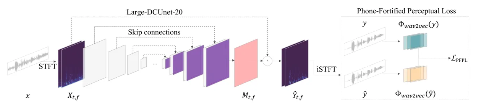

# Improving Perceptual Quality by Phone-Fortified Perceptual Loss using Wasserstein Distance for Speech Enhancement

Tsun-An Hsieh    Cheng Yu    Szu-Wei Fu    Xugang Lu    Yu Tsao

###### Abstract

Speech enhancement (SE) aims to improve speech quality and
intelligibility, which are both related to a smooth transition in speech
segments that may carry linguistic information, e.g. phones and
syllables. In this study, we propose a novel phone-fortified perceptual
loss (PFPL) that takes phonetic information into account for training SE
models. To effectively incorporate the phonetic information, the PFPL is
computed based on latent representations of the wav2vec model, a
powerful self-supervised encoder that renders rich phonetic information.
To more accurately measure the distribution distances of the latent
representations, the PFPL adopts the Wasserstein distance as the
distance measure. Our experimental results first reveal that the PFPL is
more correlated with the perceptual evaluation metrics, as compared to
signal-level losses. Moreover, the results showed that the PFPL can
enable a deep complex U-Net SE model to achieve highly competitive
performance in terms of standardized quality and intelligibility
evaluations on the Voice Bank–DEMAND dataset.

^(†)^(†)address: ¹Research Center for Information Technology Innovation,
Academia Sinica, Taiwan  
²National Institute of Information and Communications Technology,
Japan^(†)^(†)email: {tahsieh, chengyu_citi, jasonfu,
yu.tsao}@citi.sinica.edu.tw, xugang.lu@nict.go.jp

Index Terms: Speech enhancement, perceptual loss, contrastive predictive
coding, representation learning, self-supervised learning

## 1 Introduction

In real-world speech-related applications, speech signals may be
contaminated by environmental noise, and thus constrain the achievable
performance on target tasks. To address this issue, speech enhancement
(SE) has been studied for decades. Numerous signal processing-based
methods \[1, 2, 3, 4\] have been proposed. These methods are based on
the assumed statistical properties of speech and noise signals.
Unfortunately, SE performance may drop drastically when these
assumptions are unfulfilled. With recent advances in neural network (NN)
models, SE performance has increased notably. Well-known NN models, such
as deep denoising autoencoder (DDAE) \[5\], deep neural networks (DNNs)
\[6\], recurrent neural networks (RNNs) \[7\], long short-term memory
(LSTM) \[8\], convolutional neural networks (CNNs) \[9\], fully
convolutional networks (FCNs) \[10, 11\], convolutional recurrent neural
networks (CRNNs) \[12\], and generative adversarial networks (GANs)
\[13, 14, 15, 16, 17, 18, 19\] have made notable improvements over
traditional signal processing-based SE methods.

For these NN-based SE approaches, designing a suitable objective
function is a crucial factor. Traditionally, point-wise distances are
often used to form the objective functions. Point-wise distances, such
as $`L^{1}`$ and/or $`L^{2}`$ norms between paired noisy-clean speech
signals, attempt to recover information on a signal level. Recent
studies have revealed that objective functions based on point-wise
distances may not fully reflect the perceptual difference between noisy
and clean speech signals. As the purpose of SE is to recover speech
quality and intelligibility, objective functions that consider
perceptual metrics have been investigated for NN-based SE. In some
studies, perceptual metrics were modified to their differentiable
alternatives for convenient gradient calculations to optimize the NN
parameters. Some notable works are the perceptual evaluation-based loss
function \[20\], joint source-to-distortion ratio (SDR) perceptual
evaluation for speech quality optimization \[21\], and modified
short-time objective intelligibility (STOI) loss functions for network
optimization \[10, 22, 23\]. Along this line, several studies focus on
training NN models with target metrics for SE tasks \[24\], as well as
with GAN approaches like HiFi-GAN \[18\] and MetricGAN \[19\]. Another
class of approaches focused on building loss functions in the spaces
mapped by certain pre-trained classifiers. For example, in style
transfer studies of computer vision, \[25\] proposed training
feed-forward networks based on perceptual loss. In \[26\], the authors
proposed utilizing an acoustic scene (AS) recognition network’s latent
spaces for the loss function, termed deep feature loss (DFL). For
further improvement over DFL, \[27\] proposed the perceptual ensemble
regularization loss (PERL) as a variant of DFL that gathers several
pre-trained models related to speech or acoustic tasks, achieving
state-of-the-art performance in terms of quality. Despite the success,
it remains unclear how acoustic event (AE) or AS classifiers benefit SE.

In this paper, we propose a novel phone-fortified perceptual loss (PFPL)
for training SE models. The PFPL modifies the original DFL in two
aspects. First, the PFPL intends to consider the phonetic information
embedded in the speech signals. Therefore, rather than using the AS
recognition models, the PFPL is computed based on the latent
representations of the wav2vec model \[28\], a powerful self-supervised
encoder that renders rich phonetic information. Second, as the distance
used in the original DFL ignores the geometry of the distributions of
the latent representations, PFPL adopts the Wasserstein distance \[29\]
as the distance measure. In this way, the SE training can be seen as an
optimal transport problem that transforms the distributions of noisy
speech to that of clean speech. Experimental results first confirmed
that the PFPL can enable a deep complex U-Net SE model to achieve highly
competitive performance on the Voice Bank–DEMAND dataset. A series of
ablation studies investigated the effectiveness of individual parts in
the PFPL.



Figure 1: A demonstration of the proposed network. The enhancement model
estimates a cRM by the noisy spectrum, and consequently produces an
enhanced spectrum. The PFPL then compares the semantic difference of
clean speech and the enhanced one.

## 2 Related Works

In this section, we first present DFL and PERL, which was mentioned in
the previous section, with a more detailed discussion in Section 2.1. We
then review the perceptual metrics approximated with trained networks.
Such a network can work as a discriminator in a GAN or a stand-alone
metric. Last but not least, we review methods that maximize the mutual
information between contexts in Section 2.3.

### 2.1 DFL and PERL

The idea to incorporate AS recognition in SE was first proposed in DFL
\[26\]. According to \[18\], the latent features from a pre-trained
recognition network (used for machine perception) are used to
approximate human perception (SE, in this case). Analogous to DFL,
\[27\] extend the idea to ensemble of six types of pre-trained networks,
including AE classifiers and speech encoders. In spite of that PERL-AE
uses AE classifier alone and yields the best result, it remains
unexplainable due to the complication of characteristics in AEs, which
are too difficult to be analyzed.

### 2.2 MetricGAN and HiFi-GAN

MetricGAN \[19\] applies a discriminator (also called Quality-Net
\[30\]) to approximate the behavior of the evaluation functions of
interest. The predicted score can also be treated as a special case of
perceptual loss, with an embedding dimension equal to 1. Due to the
limited dimensions, Quality-Net is easily fooled by the speech generated
by the updated generator. Therefore, MetricGAN needs to alternatively
train between the generator and the discriminator which slows down its
efficiency. HiFi-GAN \[18\] incorporates the idea of GAN and deep
feature loss. However, its deep feature loss is based on the
discriminator, which may not be highly related to human perception.

### 2.3 Contrastive Predictive Coding (CPC) and wav2vec

Recent studies of representation learning have shown capabilities in
extracting representative features without supervision. For instance,
CPC \[31\] is an self-supervised method that proposes to extract
task-agnostic features from high-dimensional data. It was the
contrastive loss that helps capture features which maximize the amount
of underlying shared information of the observation and its latent
representation. As a result, self-supervised methods that can extract
features with phonetic information from speech signals drew our
attention. We then focus on speech-related applications that utilizes
representation learning approaches.

The self-supervised automatic speech recognition (ASR) wav2vec \[28\],
utilizing the CPC technique, has shown great performance in recognition
accuracy and thus fits our interests. In practice, speech signals are
first encoded with an encoder network that extracts features rich in
phonetic information. An ASR decoder is then trained based on these
features as inputs.

### 2.4 Wasserstein Distance

The Wasserstein distance \[29\] is a measurement of two probability
distributions on a metric space $`(\mathcal{M},d)`$ with
$`d:\mathcal{M}\times\mathcal{M}\rightarrow\mathbb{R}`$ a metric on
$`\mathcal{M}`$. The Wasserstein distance of two densities $`\mu`$ and
$`\nu`$ is defined as:

```math
\displaystyle\mathcal{W}_{p}(\mu,\nu)\coloneqq\left(\inf_{\gamma\in\Gamma(\mu,\nu)}\int_{\mathcal{M}\times\mathcal{M}}d(x,y)^{p}{\rm d}\gamma(x,y)\right)^{\frac{1}{p}} \tag{1}
```

where $`\Gamma(\mu,\nu)`$ denotes a set of all possible measures (or
couplings) on $`\mathcal{M}\times\mathcal{M}`$ with marginals $`\mu`$
and $`\nu`$. Here, $`\gamma(x,y)`$ is the coupling, that is, a joint
distribution of marginals $`\mu`$ and $`\nu`$, representing any possible
transport plan from $`\mu`$ to $`\nu`$. Comparing to $`L^{p}`$ distances
that only regard the amount of mass transported, Eq. (1) shows that
Wasserstein distance additionally takes the transport method into
account.

## 3 Proposed framework

In this section, we start with introducing a complex U-Net adopted,
which was widely utilized in several studies \[32, 33, 34\] that has
been confirmed to achieve promising results. In the followings, we will
describe the PFPL, which is a perceptual loss incorporated with
Wasserstein distance in detail.

### 3.1 Model Architecture

Inspired by the deep complex U-Net (DCUnet) in \[34\], we designed a
modified framework that estimates complex ratio masks (cRM) for a noisy
complex spectrum with a different normalization mechanism. More
specifically, as shown in Fig. 1, a noisy speech signal is first
converted to a complex spectrum through short-time Fourier transform
(STFT), and the enhancement model generates a cRM. Subsequently, the
noisy spectrum is multiplied by the cRM in a point-wise manner to derive
the final enhanced spectrum, which is transformed to a waveform by
inverse STFT (iSTFT). Here, according to \[34\], a scheme that produces
cRM with a complex neural network (cRM$`\mathbb{C}`$n) is used in this
work, and we take the Large-DCUnet-20 as a reference architecture for
our enhancement model. As a number of previous works \[35, 36\] have
indicated that instance normalization outperforms batch normalization on
generation tasks by preserving the independence of samples in a
mini-batch, we substitute the batch normalization layers with instance
normalization layers. To describe the enhancement process precisely,
given the noisy input speech signal $`x`$, the noisy spectrum
$`X_{t,f}`$ is produced by STFT, such that $`X_{t,f}=\mathrm{STFT}(x)`$.
Then, the enhancement model generates a cRM $`M_{t,f}`$ to produce the
enhanced spectrum that $`\hat{Y}_{t,f}=M_{t,f}\cdot X_{t,f}`$, and
transforms it to the enhanced waveform $`\hat{y}`$ by iSTFT.

### 3.2 Phone-Fortified Perceptual Loss

For training SE models, point-wise loss functions are commonly used in
either time domain or time-frequency domain. Despite that these
approaches have achieved promising results, point-wise losses remain
numerically inconsistent with perceptual evaluations such as PESQ or
STOI. Unlike point-wise losses that measure distances in the signal
level, the perceptual loss is devised to measure the distance in the
latent space \[25\].

The design of perceptual losses requires an appropriate feature
extractor. In the SE scenario, the estimates of a system are speech
signals. It is thus our desire to carry out loss computation that is
able to preserve attributes in speech signals (i.e., phones, speaker
characteristics, etc.) in the training stage. Some proposed a supervised
pre-trained encoder for loss computation, like \[26\]. However, these
methods can suffer from the drawback of one-hot encoding in which the
correlations between categories were ignored since the labels are in an
orthogonal (high-dimensional) space \[37\]. As a consequence, the
correlations between phones could be underestimated and thus restrict
the capability of preserving attributes. Hence, we employ wav2vec, a
self-supervised encoder, to compute the PFPL in a non-orthogonal
(low-dimensional) space that is more capable of preserving attributes.
Owing to the fact that speech signals carry linguistic information
(e.g., phones, syllables, etc.) more often than noises do, we prefer to
use models that generate features which are representative for phonetic
information. Meanwhile, note that CNNs are known for the
shift-invariance, which is analogous to the perceptual evaluation of
speech quality (PESQ) \[38\] which is insensitive to shifts in a
short-time. As stated above, we believe the CNN-based wav2vec encoder
(denoted as $`\Phi_{\textit{wav2vec}}`$) is suitable for the design of
our loss function.

In contrast to previous works on perceptual loss that utilize
activations in multiple layers, we merely extract the final outputs for
efficiency. Formally, as the densities remain unknown, we define the
PFPL by the Kantorovich–Rubinstein \[39\] dual form of Wasserstein
distance:

```math
\displaystyle\mathcal{L}_{\mathrm{PFPL}}(y,\hat{y})\coloneqq\left\|y-\hat{y}\right\|_{1}+\sup_{f\in\mathcal{F}}\mathbb{E}_{\mu}\left[f(c)\right]-\mathbb{E}_{\nu}\left[f(\hat{c})\right] \tag{2}
```

where $`c=\Phi_{\textit{wav2vec}}(y)`$ and
$`\hat{c}=\Phi_{\textit{wav2vec}}(\hat{y})`$ are the features of the
clean speech $`y`$ and the enhanced speech $`\hat{y}`$, respectively.
Here, $`\mu`$ and $`\nu`$ are the densities of $`c`$ and $`\hat{c}`$ in
the latent space, and $`f`$ is a function belonging to a set
$`\mathcal{F}:\{f:\mathbb{R}^{n}\to\mathbb{R}^{n}|\|f(x_{1})-f(x_{2})\|\leq 1\|x_{1}-x_{2}\|,\forall x_{1},x_{2}\in\mathbb{R}^{n}\}`$
of all 1-Lipschitz functions. For the given paired enhanced speech and
clean speech, the PFPL minimizes the distance between the distributions
of the estimates and the corresponding targets in a space of phonetic
representations. Please note Eq. (2) that the PFPL includes an mean
absolute error (MAE) loss to measure the signal-level difference. The
effect of the MAE loss will be discussed in Section 4.5.

Figure 2: t-SNE analysis on wav2vec encoded feature map. (a) Feature map
of five phone classes. (b) Feature map of clean and noisy utterances.

## 4 Experiments

In this section, we begin with the selected dataset and the evaluation
metrics that were used as a standard benchmark. Next, we provide
visualizations that demonstrate that the features generated by the PFPL
are correlated with PESQ and STOI. Finally, it is shown that the
proposed modification achieves competitive performance in terms of
qualities and intelligibility.

### 4.1 Voice Bank–DEMAND Dataset

To compare our proposed SE system with other recent approaches, the
Voice Bank–DEMAND dataset \[40, 41\] was used for evaluation. In this
dataset, utterances recorded by 28 speakers out of a total 30 speakers
were used for training, and the utterances from the remaining 2 speakers
were used for testing. In the training set, noisy mixtures were
synthesized using 10 types of noise at 4 different SNR levels, ranging
from 0 dB to 15 dB, and 5 types of unseen noises, ranging from 2.5 dB to
17.5 dB were added to the testing set.

Figure 3: Illustration the correlations of PESQ and STOI to different
losses. To quantify how much a loss is correlated to a metric, we note
the Pearson correlation coefficient in the parentheses. The higher
absolute value of PCC indicates higher correlation.

### 4.2 Evaluation Metrics

Following prior works evaluated on the Voice Bank–DEMAND dataset, we
used five metrics, which were CSIG, CBAK, COVL, introduced in \[42\],
PESQ, and STOI to measure the performance of the proposed method. CSIG,
CBAK, and COVL demonstrate the signal distortion, background
intrusiveness, and the overall quality with the same scale of mean
opinion score, respectively. PESQ and STOI quantify the perceptual
quality and the intelligibility of a speech signal. All of the
above-mentioned metrics are better with higher scores.

### 4.3 Regarding SE as an Optimal Transport Problem

As mentioned in Section 3.2, latent representations of wav2vec render
rich phonetic information. Fig. 2(a) demonstrates a t-SNE analysis of
five phones, which are properly separated, confirming that the latent
representations generated by wav2vec carry rich phonetic information.
Fig. 2(b) shows that most of the noisy and clean speech are highly
distinguishable in the latent space. Based on the observations from Fig.
2, we can consider the training procedure of SE as an optimal transport
problem that aims to search for a transformation mapping the
distributions of noisy speech signals to that of the clean ones. Based
on this concept, we decide to replace the $`L^{p}`$ distance and use the
Wasserstein distance as the distance measure to compute the perceptual
loss for the PFPL.

|                     |      |      |      |      |      |
| ------------------- | ---- | ---- | ---- | ---- | ---- |
| Model               | PESQ | CSIG | CBAK | COVL | STOI |
| Noisy               | 1.97 | 3.35 | 2.44 | 2.63 | 0.92 |
| Wiener \[3\]        | 2.22 | 3.23 | 2.68 | 2.67 | –    |
| SEGAN \[13\]        | 2.16 | 3.48 | 2.94 | 2.80 | 0.93 |
| DFL \[26\]          | –    | 3.86 | 3.33 | 3.22 | –    |
| DFL^($`{\dagger}`$) | 2.58 | 3.80 | 2.72 | 3.19 | 0.93 |
| MetricGAN \[19\]    | 2.86 | 3.99 | 3.18 | 3.42 | 0.94 |
| HiFi-GAN \[18\]     | 2.94 | 4.07 | 3.07 | 3.49 | –    |
| SDR-PESQ \[21\]     | 3.01 | 4.09 | 3.54 | 3.55 | –    |
| T-GSA \[43\]        | 3.06 | 4.18 | 3.59 | 3.62 | –    |
| PERL-wav2vec \[27\] | 2.92 | 4.16 | 3.37 | 3.54 | 0.94 |
| PFP                 | 3.15 | 4.18 | 3.60 | 3.67 | 0.95 |

- $`{\dagger}`$
  [https://github.com/francoisgermain/SpeechDenoisingWithDeepFeatureLosses.git](https://github.com/francoisgermain/SpeechDenoisingWithDeepFeatureLosses.git).

Table 1: Our proposed method versus some well performing methods with
respect to different metrics. DFL^($`{\dagger}`$) shows the results from
the official source code and released parameters.

### 4.4 Correlation of Perceptual Metrics to Losses

To analyze the relation between perceptual metrics and other losses, we
compared several different losses to the corresponding metric scores on
the testing set. Here, we illustrate the correlations of PESQ and STOI
to five losses including, MAE, mean squared error (MSE), weighted
source-to-distortion ratio (wSDR), DFL, and the proposed PFPL. Each
point represents an utterance. From Fig. 3, we note that MAE and MSE
have similar correlations to PESQ and STOI, and the four groups of
points of wSDR represent the four SNR levels in the testing set. For the
first three losses, there is no obvious correlation to the two metrics.
However, the more obvious tendencies are that DFL and PFPL correlate to
PESQ and STOI. Here, the Pearson correlation coefficient (PCC) is
utilized to quantify the correlation between metrics and losses. The
PCCs of losses are shown inside the parentheses in Fig. 3. The PCC of
PFPL is much higher than all the other metrics’ being compared. From
Table 1 and Table 2, although DFL is more correlated with PESQ than the
other three signal-level metrics, it has similar results to wSDR, MAE,
and MSE. Because the PFPL measures how different the features are in
terms of phonetic information salient to the human auditory system, it
is reasonable that the PFPL is highly correlated with PESQ and STOI.

### 4.5 Ablation Study on the PFPL

In Table 1, we compare prior approaches using GAN-based methods and
specialized losses for auditory perception. Our approach achieved the
highest PESQ score among all the compared methods. To understand PFPL,
we compare several losses with the same model structure and conduct an
ablation study on the PFPL. In Table 1, PFPL-$`\mathcal{W}`$ denotes
PFPL using the $`L^{p}`$ distance, and PFPL-$`\mathcal{W}`$-MAE denotes
PFPL-$`\mathcal{W}`$ without using the MAE loss. From Table 2,
point-wise losses (wSDR, MSE, and MAE) yield lower PESQ but higher CBAK
comparing to the perceptual loss alone (i.e., PFPL-$`\mathcal{W}`$-MAE).
The low CBAK performance is caused by the point-wise difference ignored
during training. This problem can be solved by adding MAE (i.e., the
first term in Eq. (2)) to the objective function, and accordingly
PFPL-$`\mathcal{W}`$ yields an improved CBAK score from 3.05 to 3.52.
Finally, by comparing PFPL and PFPL-$`\mathcal{W}`$, the effect of the
Wasserstein distance is confirmed, and our best results in terms of
quality and intelligibility is attained by PFPL.

| Loss                     | PESQ | CSIG | CBAK | COVL | STOI |
| ------------------------ | ---- | ---- | ---- | ---- | ---- |
| wSDR \[34\]              | 2.58 | 3.00 | 3.18 | 2.76 | 0.93 |
| MSE                      | 2.60 | 3.31 | 3.19 | 2.94 | 0.93 |
| MAE                      | 2.62 | 3.47 | 3.20 | 3.02 | 0.93 |
| PFPL-$`\mathcal{W}`$-MAE | 3.09 | 4.22 | 3.05 | 3.67 | 0.94 |
| PFPL-$`\mathcal{W}`$     | 3.11 | 4.15 | 3.52 | 3.64 | 0.95 |
| PFPL                     | 3.15 | 4.18 | 3.60 | 3.67 | 0.95 |

Table 2: Comparison of the ablations of PFPL and the point-wise losses
with respect to evaluation metrics.

## 5 Conclusion

In this paper, we have proposed a novel PFPL loss for training SE
models. The PFPL is derived based on the latent representations of the
wav2vec model, which carry rich phonetic information. Meanwhile, the
PFPL uses the Wasserstein distance as the distance measure. Accordingly,
the SE training can be seen as an optimal transport problem that aims to
move the latent representation distributions of noisy speech to that of
clean speech. The experimental results first revealed that the PFPL has
very high correlations with perceptual metrics as compared to other
related loss functions. Moreover, the SE model trained with the PFPL
outperforms several well-known and related works in terms of
standardized evaluation metrics.

## References

- \[1\] S. Boll, “Suppression of acoustic noise in speech using spectral
  subtraction,” _IEEE TASSP_, vol. 27, no. 2, pp. 113–120, 1979.
- \[2\] J. Lim and A. Oppenheim, “Enhancement and bandwidth compression
  of noisy speech,” _Proceedings of the IEEE_, vol. 67, no. 12, pp.
  1586–1604, 1979.
- \[3\] K. Paliwal and A. Basu, “A speech enhancement method based on
  kalman filtering,” in _Proc. ICASSP_, 1987.
- \[4\] P. Loizou, _Speech enhancement: theory and practice_. CRC
  press, 2013.
- \[5\] X. Lu, Y. Tsao, S. Matsuda, and C. Hori, “Speech enhancement
  based on deep denoising autoencoder.” in _Proc. Interspeech_, vol.
  2013, 2013, pp. 436–440.
- \[6\] Y. Xu, J. Du, L.-R. Dai, and C.-H. Lee, “A regression approach
  to speech enhancement based on deep neural networks,” _IEEE/ACM
  TASLP_, vol. 23, no. 1, pp. 7–19, 2014.
- \[7\] F. Weninger, F. Eyben, and B. Schuller, “Single-channel speech
  separation with memory-enhanced recurrent neural networks,” in _Proc.
  ICASSP_, 2014.
- \[8\] F. Weninger, H. Erdogan, S. Watanabe, E. Vincent, J. L. Roux,
  J. Hershey, and B. Schuller, “Speech enhancement with lstm recurrent
  neural networks and its application to noise-robust asr,” in _Proc.
  LVA/ICA_, 2015.
- \[9\] H. Zhao, S. Zarar, I. Tashev, and C.-H. Lee,
  “Convolutional-recurrent neural networks for speech enhancement,” in
  _Proc. ICASSP_, 2018.
- \[10\] S.-W. Fu, T.-W. Wang, Y. Tsao, X. Lu, and H. Kawai, “End-to-end
  waveform utterance enhancement for direct evaluation metrics
  optimization by fully convolutional neural networks,” _IEEE/ACM
  TASLP_, vol. 26, no. 9, pp. 1570–1584, 2018.
- \[11\] A. Pandey and D. Wang, “Tcnn: Temporal convolutional neural
  network for real-time speech enhancement in the time domain,” in
  _Proc. ICASSP_, 2019.
- \[12\] K. Tan and D. Wang, “A convolutional recurrent neural network
  for real-time speech enhancement.” in _Proc. Interspeech_, 2018.
- \[13\] S. S. Pascual, A. Bonafonte, and J. Serrà, “Segan: Speech
  enhancement generative adversarial network,” in _Proc.
  Interspeech_, 2017.
- \[14\] M. Soni, N. Shah, and H. Patil, “Time-frequency masking-based
  speech enhancement using generative adversarial network,” in _Proc.
  ICASSP_, 2018.
- \[15\] A. Pandey and D. Wang, “On adversarial training and loss
  functions for speech enhancement,” in _Proc. ICASSP_, 2018.
- \[16\] D. Baby and S. Verhulst, “Sergan: Speech enhancement using
  relativistic generative adversarial networks with gradient penalty,”
  in _Proc. ICASSP_, 2019.
- \[17\] S. Qin and T. Jiang, “Improved wasserstein conditional
  generative adversarial network speech enhancement,” _EURASIP Journal
  on Wireless Communications and Networking_, vol. 2018, no. 1, p.
  181, 2018.
- \[18\] J. Su, Z. Jin, and A. Finkelstein, “Hifi-gan: High-fidelity
  denoising and dereverberation based on speech deep features in
  adversarial networks,” _Proc. Interspeech_, 2020.
- \[19\] S.-W. Fu, C.-F. Liao, Y. Tsao, and S.-D. Lin, “Metricgan:
  Generative adversarial networks based black-box metric scores
  optimization for speech enhancement,” in _Proc. ICML_, 2019.
- \[20\] J. Martín-Doñas, A. Gomez, J. Gonzalez, and A. Peinado, “A deep
  learning loss function based on the perceptual evaluation of the
  speech quality,” _IEEE Signal processing letters_, vol. 25, no. 11,
  pp. 1680–1684, 2018.
- \[21\] J. Kim, M. El-Kharmy, and J. Lee, “End-to-end multi-task
  denoising for joint sdr and pesq optimization,” _arXiv preprint
  arXiv:1901.09146_, 2019.
- \[22\] M. Kolbæk, Z.-H. Tan, and J. Jensen, “Monaural speech
  enhancement using deep neural networks by maximizing a short-time
  objective intelligibility measure,” in _Proc. ICASSP_, 2018.
- \[23\] Y. Zhao, B. Xu, R. Giri, and T. Zhang, “Perceptually guided
  speech enhancement using deep neural networks,” in _Proc.
  ICASSP_, 2018.
- \[24\] S.-W. Fu, C.-F. Liao, and Y. Tsao, “Learning with learned loss
  function: Speech enhancement with quality-net to improve perceptual
  evaluation of speech quality,” _IEEE Signal Processing Letters_,
  vol. 27, pp. 26–30, 2019.
- \[25\] J. Johnson, A. Alahi, and F.-F. Li, “Perceptual losses for
  real-time style transfer and super-resolution,” in _Proc. ECCV_, 2016.
- \[26\] F. Germain, Q. Chen, and V. Koltun, “Speech denoising with deep
  feature losses,” _Proc. Interspeech_, 2019.
- \[27\] S. Kataria, J. Villalba, and N. Dehak, “Perceptual loss based
  speech denoising with an ensemble of audio pattern recognition and
  self-supervised models,” in _Proc. ICASSP_, 2021.
- \[28\] S. Schneider, A. Baevski, R. Collobert, and M. Auli, “wav2vec:
  Unsupervised pre-training for speech recognition,” _Proc.
  Interspeech_, 2019.
- \[29\] I. Olkin and F. Pukelsheim, “The distance between two random
  vectors with given dispersion matrices,” _Linear Algebra and its
  Applications_, vol. 48, pp. 257–263, 1982.
- \[30\] S.-W. Fu, Y. Tsao, H.-T. Hwang, and H.-M. Wang, “Quality-net:
  An end-to-end non-intrusive speech quality assessment model based on
  blstm,” _Proc. Interspeech_, 2018.
- \[31\] A. Oord, Y. Li, and O. Vinyals, “Representation learning with
  contrastive predictive coding,” _arXiv preprint
  arXiv:1807.03748_, 2018.
- \[32\] J. Yao and A. Al-Dahle, “Coarse-to-fine optimization for speech
  enhancement.” in _Proc. Interspeech_, 2019.
- \[33\] Y. Hu, T. Liu, S. Lv, M. Xing, S. Zhang, Y. Fu, J. Wu,
  B. Zhang, and L. Xie, “Dccrn: Deep complex convolution recurrent
  network for phase-aware speech enhancement,” _arXiv preprint
  arXiv:2008.00264_, 2020.
- \[34\] H.-S. Choi, J.-H. Kim, J. Huh, A. Kim, J.-W. Ha, and K. Lee,
  “Phase-aware speech enhancement with deep complex u-net,” in _Proc.
  ICLR_, 2018.
- \[35\] D. Ulyanov, A. Vedaldi, and V. Lempitsky, “Instance
  normalization: The missing ingredient for fast stylization,” _arXiv
  preprint arXiv:1607.08022_, 2016.
- \[36\] X. Huang and S. J. Belongie, “Arbitrary style transfer in
  real-time with adaptive instance normalization.” in _Proc.
  ICCV_, 2017.
- \[37\] P. Rodríguez, M. A. Bautista, J. Gonzalez, and S. Escalera,
  “Beyond one-hot encoding: Lower dimensional target embedding,” _Image
  and Vision Computing_, vol. 75, pp. 21–31, 2018.
- \[38\] A. W. Rix, J. G. Beerends, M. P. Hollier, and A. P. Hekstra,
  “Perceptual evaluation of speech quality (PESQ)-a new method for
  speech quality assessment of telephone networks and codecs,” in _Proc.
  ICASSP_, 2001.
- \[39\] C. Villani, _Optimal transport – Old and new_. Springer Science
  & Business Media, 2008, vol. 338, pp. xxii+973.
- \[40\] C. Veaux, J. Yamagishi, and S. King, “The voice bank corpus:
  Design, collection and data analysis of a large regional accent speech
  database,” in _Proc. O-COCOSDA/CASLRE_, 2013.
- \[41\] J. Thiemann, N. Ito, and E. Vincent, “Demand: a collection of
  multi-channel recordings of acoustic noise in diverse environments,”
  in _Proc. Meetings Acoust_, 2013.
- \[42\] Y. Hu and P. Loizou, “Evaluation of objective quality measures
  for speech enhancement,” _IEEE TSAP_, vol. 16, pp. 229–238, 2008.
- \[43\] J. Kim, M. El-Khamy, and J. Lee, “T-gsa: Transformer with
  gaussian-weighted self-attention for speech enhancement,” in _Proc.
  ICASSP_, 2020.
