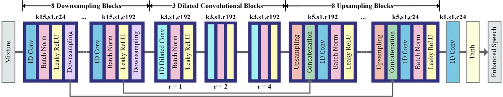
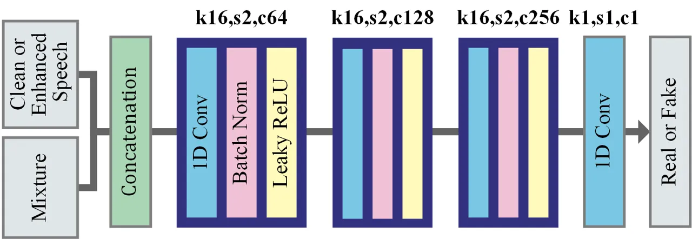
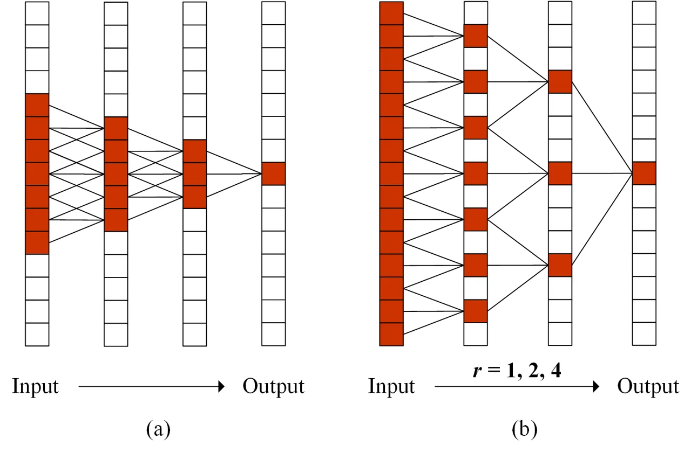
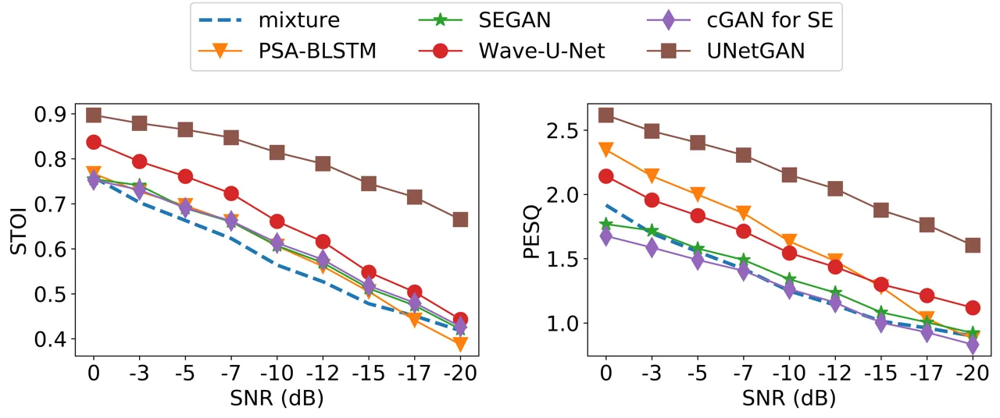

# UNetGAN: A Robust Speech Enhancement Approach in Time Domain for Extremely Low Signal-to-noise Ratio Condition

###### Abstract

Speech enhancement at extremely low signal-to-noise ratio (SNR)
condition is a very challenging problem and rarely investigated in
previous works. This paper proposes a robust speech enhancement approach
(UNetGAN) based on U-Net and generative adversarial learning to deal
with this problem. This approach consists of a generator network and a
discriminator network, which operate directly in the time domain. The
generator network adopts a U-Net like structure and employs dilated
convolution in the bottleneck of it. We evaluate the performance of the
UNetGAN at low SNR conditions (up to -20dB) on the public benchmark. The
result demonstrates that it significantly improves the speech quality
and substantially outperforms the representative deep learning models,
including SEGAN, cGAN fo SE, Bidirectional LSTM using phase-sensitive
spectrum approximation cost function (PSA-BLSTM) and Wave-U-Net
regarding Short-Time Objective Intelligibility (STOI) and Perceptual
evaluation of speech quality (PESQ).

Xiang Hao, Xiangdong Su\*, Zhiyu Wang, Hui Zhang and Batushiren

Inner Mongolia Key Laboratory of Mongolian Information Processing
Technology  
College of Computer Science, Inner Mongolia Univeristy, Hohhot, China

haoxiangsnr@gmail.com, cssxd@imu.edu.cn

Index Terms: speech enhancement, U-Net, adversarial learning, low
signal-to-noise ratio, time domain

## 1 Introduction

Speech enhancement is to separate the target speech from the background
noise interference \[1\]. It intends to improve the speech quality to
optimize related signal processing systems, e.g., hearing
prosthesis \[2\], mobile telecommunication \[3\], and automatic speech
recognition \[4\], and so on. This problem has been widely studied for a
long time, and a large number of methods were proposed \[5\] \[6\].
However, few of these methods pay attention to speech enhancement at low
signal-to-noise ratio (SNR) condition which is more important and
challenging than that at high SNR condition. There are many
communication scenarios at extremely low SNR condition. For examples,
workers communicating with the walkie-talkie in a metal cutting factory,
mechanics communication with wireless headset when test a helicopter,
and so on. Even in some noisy environments, people can only use gestures
to communicate, because the sound collected by the microphone has
serious noise, which makes the counterpart unable to hear clearly.
Speech enhancement for low SNR determines whether the speeches can be
heard clearly and understood accurately while that at high SNR only
makes the speech more comfortable for listeners. From this point of
view, speech enhancement at low SNR is more important than at high SNR.

This paper integrates U-Net and dilated convolution operation \[7\] into
generative adversarial network (GAN) \[8\] based framework and proposes
a speech enhancement approach (named UNetGAN) for extremely low SNR
condition. Our motivation is as follows. At first, speech enhancement
can be seen as a special type of speech separation, which separates the
clean speech from the mixture. Among the deep learning based models of
speech separation, Wave U-Net \[9\], a U-Net operates in the time
domain, achieves state-of-the-art performance while requires no
preprocessing. Second, GAN can improve the performance of the generator
network through play a min-max game between the generator network and
discriminator network. Its effectiveness in speech enhancement is also
proved in the work \[10\]. Third, dilated convolution can expand the
receptive field size and take large temporal contexts into
account \[11\].

The proposed UNetGAN consists of a generator network and a discriminator
network, which operates in the time domain and is trained in an
adversarial way. The generator network adopts a U-Net like structure, in
which dilated convolution is used between the downsampling and
upsampling blocks. The discriminator network is a conventional
convolution neural network, involving batch normalization \[12\] and
leaky rectified linear unit (Leaky ReLU) \[13\]. Once trained, the
generator can be used for speech enhancement.

Our approach is evaluated at extremely low SNR conditions (up to -20dB)
on the public dataset. Comparison is also made between the proposed
approach and other representative speech enhancement approaches based on
deep learning, including SEGAN \[14\], cGAN for SE \[15\], bidirectional
LSTM using phase-sensitive spectrum approximation cost function
(PSA-BLSTM) \[16\], and Wave-U-Net \[9\]. Experiment results demonstrate
that our approach significantly improves the speech quality and
substantially outperforms other approaches in terms of Short-Time
Objective Intelligibility (STOI) \[17\] and Perceptual evaluation of
speech quality (PESQ) \[18\].

Although Pascual et al. \[14\] first used GAN in the time domain (named
SEGAN) for speech enhancement, there are two critical differences
between SEGAN and our approach. First, the network structure in our
approach is different from that in SEGAN. Second, our approach operates
directly in the time domain while SEGAN applies a high-frequency
preemphasis filter to the input data. There is another GAN-based speech
enhancement approach is proposed by Michelsanti et al. \[15\]. Except
the difference in network structure, it operates in the frequency domain
while our approach operates in the time domain. Our approach also differ
from the following speech enhancement approaches, which are based on
fully convolutional neural network \[19\] \[20\] \[21\] and
U-Net \[22\] \[23\] \[24\]. We introduce U-Net into GAN-based
architecture and takes adversarial learning to train it. It also means
the loss function of the U-Net in our approach are different from that
in the above approaches.



Figure 1: The generator of UNetGAN. $`k`$, $`s`$ and $`c`$ represent
kernel size, stride and channel number of 1D convolution, respectively.
$`r`$ represents dilated rate of 1D dilated convolution.

There are two main advantages of the proposed approach. First and
foremost, our approach significantly improves the speech quality and
achieves state-of-the-art performance at extremely low SNR conditions.
Second, our approach employs adversarial learning to improve the U-Net
in the time domain and applies dilated convolution to enlarge the
receptive field size. Third, our approach works end-to-end.



Figure 2: The discriminator of UNetGAN. $`k`$, $`s`$ and $`c`$ represent
kernel size, stride and channel number of 1D convolution, respectively.

## 2 Approach

### 2.1 Architecture

This paper proposes a conditional GAN (cGAN) \[25\] based approach to
perform speech enhancement, which consists of two components: a
generator network and a discriminator network. The generator adopts
U-Net like structure and dilated convolution operation. The
discriminator is a conventional CNN, involving batch normalization and
Leaky ReLU activation. Both of these two networks operate directly in
the time domain. The discriminator $`D`$ is trained to classify the
speeches as either being from the training data (real, close to 1) or
the generator $`G`$ (fake, close to 0). It is conditioned on the mixture
$`x`$ and maps the clean speech $`y`$ or the enhanced speech $`\hat{y}`$
to the real data distribution: $`D(x,y)`$ or
$`D(x,\hat{y})\rightarrow(0,1)`$. The generator $`G`$ maps from the
mixture $`x`$ to the enhanced speech $`\hat{y}`$:
$`G(x)\rightarrow\hat{y}`$, trying to confuse the discriminator $`D`$.
They play a min-max game. The objective can be expressed as:

```math
\text{arg}\,\underset{G}{\text{min}}\,\underset{D}{\text{max}}(\mathbb{E}_{x,y}[logD(x,y)]+\mathbb{E}_{x,\hat{y}}[log(1-D(x,\hat{y})])
```

where G tries to minimize this objective against the adversarial D tries
to maximize it.

The detailed structure of the generator is shown in Fig. 1. The
downsampling (DS) and the upsampling (US) parts are similar to that
described in \[9\] except several dilated convolution blocks are added
between them. At first, the mixture $`x`$ is converted into an
increasing number of higher-level features on coarser time scales using
a series of DS blocks. Next, these features are processed by three
successive dilated convolution blocks to incorporate larger context.
Subsequently, the features are combined with the earlier local,
high-resolution features using US blocks through skip connection,
yielding multi-scale features which are used for making predictions.

The DS blocks in the generator have eight levels in total. Each
successive level operates at half the time resolution as the previous
one while the number of channels increased gradually at an interval of
twenty-four. Each DS block here takes 1D convolution, followed by batch
normalization, Leaky ReLU and downsampling. The parameters of 1D
convolution can be found above each DS block in Fig. 1, in which $`k`$,
$`s`$ and $`c`$ represent kernel size, stride and channel number of 1D
convolution, respectively. It performs same padding to produce the
output of the same time resolution as the input. Batch normalization is
used to ensure network performance and stability. We use Leaky ReLU as
activation function except for the final layer, which uses Tanh.
Decimate discards features for every other time step to halve the time
resolution. In the dilated convolutional blocks, we use three successive
dilated convolution operations with different dilated rate ($`r=1,2,4`$)
to gradually extract the features at the desirable resolutions. The
resulting feature maps are used as the input of the US blocks. The
details of dilated convolution are described in Section 2.2. In the US
blocks, upsampling performs linear interpolation in the time direction
by a factor of two. The channel number at each level decrease at an
interval of twenty-four.

The discriminator is illustrated in Fig. 2. The clean speech or the
enhanced speech is concatenated with the mixture, and transformed to an
increasing number of feature maps using 1D convolution, batch
normalization and Leaky ReLU. After the three convolution blocks, the
feature maps eventually are compressed into a high-level representation.

These two networks are trained alternately. For the fixed generator
$`G`$, the discriminator $`D`$ is trained to distinguish between the
clean speeches and the enhanced speeches. When the discriminator is
optimal, it can be frozen and the generator $`G`$ can continue to be
trained to reduce the accuracy of the discriminator.

### 2.2 Dilated Convolution

As mentioned above, the dilated convolution is used in the generator
network. This operation was originally developed for wavelet
transform \[26\] and later called dilated convolution in \[7\]. It
inflates the kernel by inserting spaces between the kernel elements. It
allows us to enlarge the receptive field size to incorporate larger
context \[27\]. For a 1-D input signal $`x[i]`$, the output $`y[i]`$ of
dilated convolution on it with a filter $`w[k]`$ of length $`K`$ is
defined as:

```math
y[i]=\sum_{k=1}^{K}x[i+r\cdot k]w[k] \tag{1}
```

where $`r`$ is the dilated rate. When $`r=1`$, the dilated convolution
is the same as the conventional convolution.

Figure 3 illustrates the conventional convolution and the dilated
convolution ($`r=1,2,4`$) on 1-D signals, in which $`stride=1`$,
$`kernel~size=3`$. Fig. 3(a) shows that the receptive field size is
seven after the three sequential convolution operations, which is linear
with the number of layers. When using exponentially increasing dilated
rates ($`r=1,2,4`$), as in Fig. 3(b), the receptive field size
exponentially increases to 15. The dilated convolution blocks in our
model use the same exponentially increasing dilated rate ($`r=1,2,4`$)
as Fig. 3(b), which ensures that the size of receptive field increases
exponentially.



Figure 3: (a) A three layers CNN using 1D conventional convolution
operation. (b) A three layers CNN using 1D dilated convolution operation
with exponentially increasing dilated rate ($`r=1,2,4`$).

### 2.3 Loss Function

The task of training a neural network is one of finding good parameters
in an iterative process, in which the loss function plays a central role
through gradient backpropagation for parameter adjustments. Previous
works about U-Net \[9\] \[28\] use mean-square error (MSE) as the loss
function and obtain good performances, proving the effectiveness of MSE.
GAN-based networks usually employ adversarial loss as the loss function
to ensure the generated results in line with expectations. The generator
gradually improves with the decrease of the adversarial loss. Our
approach integrates MSE and adversarial loss as the loss function of the
generator network, as Eq. 2.

```math
\mathcal{L}_{G}=\underbrace{\mathbb{E}_{x}[log(1-D(x,G(x)))]}_{Adversarial~Loss}+\lambda\underbrace{\mathbb{E}_{x,y}[y-G(x)]^{2}}_{MSE} \tag{2}
```

where $`x`$ is the mixture, $`y`$ is the clean speech in the training
dataset, and $`\lambda`$ is the weight of MSE which is determined
through the validation experiment.

The discriminator is still unchanged. That is, it is responsible for
mapping the clean speech $`y`$ to true and the enhanced speech $`G(x)`$
to false conditioned on the mixture $`x`$. Thus, its loss function can
be written as Eq. 3.

```math
\mathcal{L}_{D}=-\mathbb{E}_{x}[log(1-D(x,G(x)))]-\mathbb{E}_{x,y}[logD(x,y)] \tag{3}
```

## 3 Experiment

### 3.1 Dataset and metrics

To evaluate the proposed approach, the TIMIT corpus \[29\] and NOISEX-92
corpus \[30\] are used in the experiment. The TIMIT corpus is used as
the clean database and the NOISEX-92 corpus is used as interference. We
randomly selected $`750`$ utterances from the TIMIT and divided them
into three parts: the training part ($`600`$ utterances), the validation
part ($`50`$ utterances) and the test part ($`100`$ utterances).

With respect to the training set, we selected babble, factoryfloor1,
destroyerengine and destroyerops from NOISEX-92 corpus. The first 2
minutes of each noise are mixed with the clean speech in the training
part at one of 4 SNRs (0dB, -5dB, -10dB, -15dB). In total, this yields
$`9600`$ training samples, each of which consists of a mixture and its
corresponding clean speech. Beside the noises in the training set, we
selected factoryfloor2 (from NOISEX-92 corpus) to evaluate
generalization performance. The last 2 minutes of each noise are mixed
with the test utterances at one of 9 SNRs (0dB, -3dB, -5dB, -7dB, -10dB,
-12dB, -15dB, -17dB, -20dB), resulting in $`4500`$ test samples. The
validation set is built in the same way as the test set, which includes
$`2250`$ samples. The sampling rate of all samples is $`16\,000`$ Hz.
The noise is divided into two sections to ensure that the test noise is
not repeated in the training set.

We use STOI and PESQ score to measure speech intelligibility and
quality, respectively.

### 3.2 Training

As mentioned, each sample consists of a mixture and its corresponding
clean speech. All samples vary in length. In each training epoch, we
randomly sample continuous 16384 time frames from the mixture and the
clean speech respectively, and input them into the networks of UNetGAN.
We use the Adam optimizer \[31\] with $`\text{leaning rate}=0.0002`$,
decay rates $`\beta_{1}=0.9`$ and $`\beta_{2}=0.999`$. We set batch size
to $`150`$ and negative slope of Leaky ReLU to $`0.1`$. The $`\lambda`$
in Eq. 2 is set according to the validation experiment, which equals
$`20`$ in the best model.

We perform gradient descent on the generator $`G`$ and the discriminator
$`D`$ alternatively to optimize both of them. Generator loss shows some
oscillatory behavior initially and gradually converges after $`900`$
epochs. It approximates to $`0.771`$ eventually.

|       |          |       |       |       |       |        |       |       |       |       |       |       |       |       |        |       |       |       |       |
| ----- | -------- | ----- | ----- | ----- | ----- | ------ | ----- | ----- | ----- | ----- | ----- | ----- | ----- | ----- | ------ | ----- | ----- | ----- | ----- |
| Noise | Target   | STOI  |       |       |       |        |       |       |       |       | PESQ  |       |       |       |        |       |       |       |       |
|       |          | Seen  |       |       |       | Unseen |       |       |       |       | Seen  |       |       |       | Unseen |       |       |       |       |
|       |          | 0dB   | -5dB  | -10dB | -15dB | -3dB   | -7dB  | -12dB | -17dB | -20dB | 0dB   | -5dB  | -10dB | -15dB | -3dB   | -7dB  | -12dB | -17dB | -20dB |
| N1    | Mixture  | 0.735 | 0.635 | 0.531 | 0.440 | 0.676  | 0.593 | 0.492 | 0.412 | 0.378 | 1.863 | 1.483 | 1.158 | 0.915 | 1.629  | 1.343 | 1.049 | 0.874 | 0.833 |
|       | Enhanced | 0.903 | 0.879 | 0.840 | 0.780 | 0.890  | 0.866 | 0.818 | 0.749 | 0.695 | 2.659 | 2.467 | 2.226 | 1.975 | 2.550  | 2.380 | 2.129 | 1.870 | 1.722 |
| N2    | Mixture  | 0.755 | 0.650 | 0.551 | 0.475 | 0.692  | 0.609 | 0.517 | 0.452 | 0.426 | 1.783 | 1.507 | 1.309 | 1.188 | 1.609  | 1.405 | 1.249 | 1.163 | 1.132 |
|       | Enhanced | 0.897 | 0.874 | 0.841 | 0.793 | 0.884  | 0.862 | 0.824 | 0.766 | 0.716 | 2.517 | 2.339 | 2.146 | 1.918 | 2.413  | 2.266 | 2.063 | 1.811 | 1.651 |
| N3    | Mixture  | 0.755 | 0.665 | 0.566 | 0.477 | 0.703  | 0.626 | 0.528 | 0.449 | 0.415 | 1.935 | 1.540 | 1.190 | 0.928 | 1.696  | 1.390 | 1.078 | 0.867 | 0.762 |
|       | Enhanced | 0.910 | 0.888 | 0.853 | 0.802 | 0.898  | 0.876 | 0.835 | 0.775 | 0.723 | 2.751 | 2.572 | 2.354 | 2.091 | 2.651  | 2.485 | 2.252 | 1.983 | 1.810 |
| N4    | Mixture  | 0.721 | 0.610 | 0.507 | 0.432 | 0.654  | 0.566 | 0.473 | 0.411 | 0.390 | 1.775 | 1.392 | 1.100 | 0.859 | 1.547  | 1.262 | 0.963 | 0.820 | 0.792 |
|       | Enhanced | 0.897 | 0.869 | 0.830 | 0.774 | 0.882  | 0.855 | 0.810 | 0.745 | 0.691 | 2.656 | 2.458 | 2.230 | 1.980 | 2.541  | 2.368 | 2.131 | 1.869 | 1.701 |
| N5    | Mixture  | 0.830 | 0.755 | 0.664 | 0.567 | 0.787  | 0.720 | 0.625 | 0.530 | 0.481 | 2.231 | 1.851 | 1.487 | 1.183 | 2.004  | 1.701 | 1.354 | 1.083 | 0.972 |
|       | Enhanced | 0.876 | 0.813 | 0.708 | 0.575 | 0.843  | 0.775 | 0.657 | 0.540 | 0.500 | 2.502 | 2.179 | 1.806 | 1.425 | 2.313  | 2.030 | 1.653 | 1.285 | 1.137 |

Table 1: STOI and PESQ of UNetGAN at different SNRs and different
noises. N1, N2, N3, N4, N5 are babble, factoryfloor1, destroyerengine,
destroyerops and factoryfloor2, respectively.

### 3.3 Baseline Approaches

This paper compares UNetGAN with following approaches, including
GAN-based approach in the time domain (SEGAN \[14\]), GAN-based approach
in the frequency domain (cGAN for SE \[15\]), BiLSTM-based approach
using time-frequency mask (PSA-BLSTM \[16\]) and U-Net based approach in
the time domain (Wave-U-Net \[9\]).

- •
  SEGAN: SEGAN is a GAN-based speech enhancement approach, which
  operates at the waveform level. It applies a high-frequency
  preemphasis filter to all input speeches. We use the same
  implementation \[32\] as SEGAN and keep its default parameters
  unchanged.
- •
  cGAN for SE: cGAN for SE make use of the pix2pix framework proposed by
  Isola et al. \[33\] to learn a mapping from the spectrogram of noisy
  speech to the enhanced counterpart. We adopt the same preprocessing
  method and implementation as mentioned in \[15\].
- •
  PSA-BLSTM: PSA-BLSTM is a bidirectional LSTM network for speech
  enhancement, using a phase-sensitive spectrum approximation (PSA) cost
  function. We reimplement the model and use the same hyperparameter as
  that in \[16\].
- •
  Wave-U-Net: Wave-U-Net is an adaptation of the U-Net architecture to
  the one-dimensional time domain to perform end-to-end audio source
  separation. We use the implementation on \[34\] and its default
  parameters.

### 3.4 Result and Discussion

|                     |               |               |
| ------------------- | ------------- | ------------- |
|     Method          |     STOI      |     PESQ      |
|     Mixture         |     0.576     |     1.317     |
|     SEGAN           |     0.586     |     1.303     |
|     cGAN for SE     |     0.590     |     1.220     |
|     PSA-BLSTM       |     0.646     |     1.820     |
|     Wave-U-Net      |     0.654     |     1.584     |
|     UNetGAN         |     0.802     |     2.140     |

Table 2: The average performances of UNetGAN and the baseline approaches
on the test set.



Figure 4: Illustration of the average performances of UNetGAN and the
baseline approaches at different SNRs.

Table 1 presents the enhanced speech and the mixture from 0dB to -20dB
in terms of STOI and PESQ. The “Mixture” lines in the table represent
the mixture, and the “Enhanced” lines represent the enhanced speeches
using UNetGAN. The “Seen” columns mean the SNR conditions exist in the
training set while the “Unseen” columns indicate the SNR conditions that
do not exist in the training set. The noise N1, N2, N3, N4, N5 are
babble, factoryfloor1, destroyerengine, destroyerops and factoryfloor2,
respectively. Among them, factoryfloor2 is not used in the model
training section.

In Table 1, there are significant improvements of STOI and PESQ after
speech enhancement at all conditions. The SNRs lower than -5dB are
generally considered as extremely low SNR conditions.The average
improvement on STOI and PESQ are $`39.16\text{\,}\mathrm{\%}`$ and
$`62.55\text{\,}\mathrm{\%}`$, respectively. This indicates that our
approach is very effective. At “Seen” SNR conditions, the average
improvement on STOI and PESQ are $`34.74\text{\,}\mathrm{\%}`$ and
$`57.80\text{\,}\mathrm{\%}`$. The corresponding improvments at “Unseen”
conditions are $`43.16\text{\,}\mathrm{\%}`$ and
$`67.01\text{\,}\mathrm{\%}`$, reflecting the stability of UNetGAN. The
average improvement on unseen noise “factoryfloor2” achieves a
$`5.55\text{\,}\mathrm{\%}`$ STOI and a $`18.33\text{\,}\mathrm{\%}`$
PESQ, proving that UNetGAN possess a good generalization ability.

Table 2 lists the performances of UNetGAN and the baseline approaches on
the test set. Among the baseline approaches, Wave-U-Net gets the highest
STOI ($`12.54\text{\,}\mathrm{\%}`$ higher than the mixture) and
PSA-BLSTM obtains the highest PESQ ($`31.13\text{\,}\mathrm{\%}`$ higher
than the mixture). UNetGAN gains a $`39.16\text{\,}\mathrm{\%}`$
improvement on STOI and a $`62.55\text{\,}\mathrm{\%}`$ improvement on
PESQ comparing with the mixture. It is obviously that UNetGAN performs
far better than any other baseline approach. Although both Wave-U-Net
and UNetGAN use U-Net like structures, the dilated convolution
operation, adversarial learning and well-defined structure contribute to
the excellent performance of UNetGAN.

Figure 4 illustrates STOI and PESQ of UNetGAN and the baseline
approaches at different SNRs. It suggests that UNetGAN performs much
better than others at above all SNRs. In Fig. 4, as the SNR decreases,
all the baselines gradually approach the mixture on STOI and PESQ. It
means that the effect of these approaches are very limited when SNR is
very low. On the contrary, our method exhibits strong robustness at
extremely low SNRs.

## 4 Conclusion

Speech enhancement at low SNR condition is a challenging task.
Concerning the performance of U-Net in voice separation and the effect
of GAN in network training, this paper integrated U-Net into GAN-based
framework and proposed a end-to-end speech enhancement approach for
extremely low SNR condition. We also used dilated convolution operation
to enlarge the receptive field size in feature extraction. Our approach
achieves state-of-the-art performance and significantly outperforms
SEGAN, cGAN for SE, PSA-BLSTM and Wave-U-Net. The average improvement on
STOI and PESQ achieves $`39.16\text{\,}\mathrm{\%}`$ and
$`62.55\text{\,}\mathrm{\%}`$ respectively. Experiment also proves that
our models are robust to unseen low SNR conditions and noises. To our
best knowledge, this papar is the first time that explores speech
enhancement at extremly low SNR conditions (up to $`-20`$dB).

## References

- \[1\] P. C. Loizou, _Speech Enhancement: Theory and Practice_,
  2nd ed. Boca Raton, FL, USA: CRC Press, Inc., 2013.
- \[2\] G. H. Saunders and J. M. Kates, “Speech intelligibility
  enhancement using hearing-aid array processing,” _The Journal of the
  Acoustical Society of America_, vol. 102, no. 3, pp. 1827–1837, 1997.
- \[3\] R. P. Granovetter, M. J. Sinclair, Z. Zhang, and Z. Liu, “Method
  and apparatus for multi-sensory speech enhancement on a mobile
  device,” Oct. 16 2007, uS Patent 7,283,850.
- \[4\] F. Weninger, H. Erdogan, S. Watanabe, E. Vincent, J. Le Roux,
  J. R. Hershey, and B. Schuller, “Speech Enhancement with LSTM
  Recurrent Neural Networks and its Application to Noise-Robust ASR,” in
  _Latent Variable Analysis and Signal Separation_, E. Vincent,
  A. Yeredor, Z. Koldovský, and P. Tichavský, Eds. Cham: Springer
  International Publishing, 2015, pp. 91–99.
- \[5\] D. Wang and J. Chen, “Supervised speech separation based on deep
  learning: An overview,” _IEEE/ACM Transactions on Audio, Speech, and
  Language Processing_, vol. 26, no. 10, pp. 1702–1726, 2018.
- \[6\] E. Vincent, T. Virtanen, and S. Gannot, _Audio source separation
  and speech enhancement_. John Wiley & Sons, 2018.
- \[7\] F. Yu and V. Koltun, “Multi-scale context aggregation by dilated
  convolutions,” in _ICLR_, 2016.
- \[8\] I. Goodfellow, J. Pouget-Abadie, M. Mirza, B. Xu,
  D. Warde-Farley, S. Ozair, A. Courville, and Y. Bengio, “Generative
  adversarial nets,” in _Advances in neural information processing
  systems_, 2014, pp. 2672–2680.
- \[9\] D. Stoller, S. Ewert, and S. Dixon, “Wave-U-Net: A Multi-Scale
  Neural Network for End-to-End Audio Source Separation,” Jun. 2018,
  arXiv: 1806.03185.
- \[10\] A. Pandey and D. Wang, “On adversarial training and loss
  functions for speech enhancement,” in _2018 IEEE International
  Conference on Acoustics, Speech and Signal Processing (ICASSP)_. IEEE,
  2018, pp. 5414–5418.
- \[11\] L.-C. Chen, G. Papandreou, I. Kokkinos, K. Murphy, and A. L.
  Yuille, “Deeplab: Semantic image segmentation with deep convolutional
  nets, atrous convolution, and fully connected crfs,” _IEEE
  transactions on pattern analysis and machine intelligence_, vol. 40,
  no. 4, pp. 834–848, 2018.
- \[12\] S. Ioffe and C. Szegedy, “Batch normalization: Accelerating
  deep network training by reducing internal covariate shift,” in
  _Proceedings of the 32Nd International Conference on International
  Conference on Machine Learning - Volume 37_, ser. ICML’15. JMLR.org,
  2015, pp. 448–456.
- \[13\] B. Xu, N. Wang, T. Chen, and M. Li, “Empirical evaluation of
  rectified activations in convolutional network,” _arXiv preprint
  arXiv:1505.00853_, 2015.
- \[14\] S. Pascual, A. Bonafonte, and J. Serrà, “Segan: Speech
  enhancement generative adversarial network,” in _Proc. Interspeech
  2017_, 2017, pp. 3642–3646.
- \[15\] D. Michelsanti and Z.-H. Tan, “Conditional generative
  adversarial networks for speech enhancement and noise-robust speaker
  verification,” in _Proc. Interspeech 2017_. ISCA, 2017, pp. 2008–2012.
- \[16\] H. Erdogan, J. R. Hershey, S. Watanabe, and J. Le Roux,
  “Phase-sensitive and recognition-boosted speech separation using deep
  recurrent neural networks,” in _2015 IEEE International Conference on
  Acoustics, Speech and Signal Processing (ICASSP)_, April 2015, pp.
  708–712.
- \[17\] C. H. Taal, R. C. Hendriks, R. Heusdens, and J. Jensen, “A
  short-time objective intelligibility measure for time-frequency
  weighted noisy speech,” in _2010 IEEE International Conference on
  Acoustics, Speech and Signal Processing_. IEEE, 2010, pp. 4214–4217.
- \[18\] A. W. Rix, J. G. Beerends, M. P. Hollier, and A. P. Hekstra,
  “Perceptual evaluation of speech quality (pesq)-a new method for
  speech quality assessment of telephone networks and codecs,” in _IEEE
  International Conference on Acoustics, Speech, and Signal
  Processing, 2001. Proceedings_, Conference Proceedings, pp. 749–752
  vol.2.
- \[19\] F. Longueira and S. Keene, “A Fully Convolutional Neural
  Network Approach to End-to-End Speech Enhancement,” Jul. 2018, arXiv:
  1807.07959.
- \[20\] S. Fu, Y. Tsao, X. Lu, and H. Kawai, “Raw waveform-based speech
  enhancement by fully convolutional networks,” in _2017 Asia-Pacific
  Signal and Information Processing Association Annual Summit and
  Conference (APSIPA ASC)_, Dec 2017, pp. 006–012.
- \[21\] S.-W. Fu, T.-W. Wang, Y. Tsao, X. Lu, and H. Kawai, “End-to-end
  waveform utterance enhancement for direct evaluation metrics
  optimization by fully convolutional neural networks,” _IEEE/ACM
  Transactions on Audio, Speech and Language Processing (TASLP)_,
  vol. 26, no. 9, pp. 1570–1584, 2018.
- \[22\] A. Jansson, E. Humphrey, N. Montecchio, R. Bittner, A. Kumar,
  and T. Weyde, “Singing voice separation with deep U-Net convolutional
  networks,” 2017.
- \[23\] T. Grzywalski and S. Drgas, “Using recurrences in time and
  frequency within U-net architecture for speech enhancement,” Nov.
  2018, arXiv: 1811.06805.
- \[24\] A. Pandey and D. Wang, “A new framework for supervised speech
  enhancement in the time domain,” in _Proceedings of Interspeech_,
  2018, pp. 1136–1140.
- \[25\] M. Mirza and S. Osindero, “Conditional Generative Adversarial
  Nets,” Nov. 2014, arXiv: 1411.1784.
- \[26\] M. Holschneider, R. Kronland-Martinet, J. Morlet, and
  P. Tchamitchian, “A real-time algorithm for signal analysis with the
  help of the wavelet transform,” in _Wavelets_. Springer, 1990, pp.
  286–297.
- \[27\] P. Wang, P. Chen, Y. Yuan, D. Liu, Z. Huang, X. Hou, and
  G. Cottrell, “Understanding convolution for semantic segmentation,” in
  _2018 IEEE Winter Conference on Applications of Computer Vision
  (WACV)_. IEEE, 2018, pp. 1451–1460.
- \[28\] O. Ronneberger, P. Fischer, and T. Brox, “U-net: Convolutional
  networks for biomedical image segmentation,” in _International
  Conference on Medical image computing and computer-assisted
  intervention_. Springer, 2015, pp. 234–241.
- \[29\] J. S. Garofolo, L. F. Lamel, W. M. Fisher, J. G. Fiscus, and
  D. S. Pallett, “Darpa timit acoustic-phonetic continous speech corpus
  cd-rom. nist speech disc 1-1.1,” _NASA STI/Recon technical report n_,
  vol. 93, 1993.
- \[30\] A. Varga and H. J. Steeneken, “Assessment for automatic speech
  recognition: Ii. noisex-92: A database and an experiment to study the
  effect of additive noise on speech recognition systems,” _Speech
  communication_, vol. 12, no. 3, pp. 247–251, 1993.
- \[31\] D. Kingma and J. Ba, “Adam: A method for stochastic
  optimization,” _International Conference on Learning Representations_,
  12 2014.
- \[32\] S. DSP, “Speech Enhancement Generative Adversarial Network in
  TensorFlow: santi-pdp/segan,” Mar. 2019. \[Online\]. Available:
  [https://github.com/santi-pdp/segan](https://github.com/santi-pdp/segan)
- \[33\] P. Isola, J.-Y. Zhu, T. Zhou, and A. A. Efros, “Image-to-image
  translation with conditional adversarial networks,” in _Computer
  Vision and Pattern Recognition (CVPR), 2017 IEEE Conference on_, 2017.
- \[34\] D. Stoller, “Implementation of the Wave-U-Net for audio source
  separation: f90/Wave-U-Net,” Mar. 2019, original-date:
  2018-04-24T16:48:57Z. \[Online\]. Available:
  [https://github.com/f90/Wave-U-Net](https://github.com/f90/Wave-U-Net)
