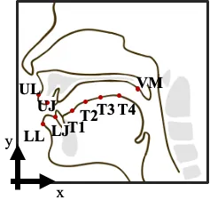
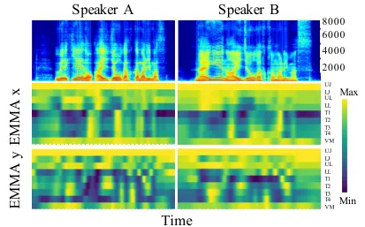
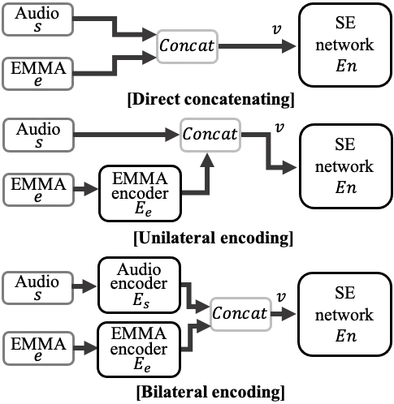
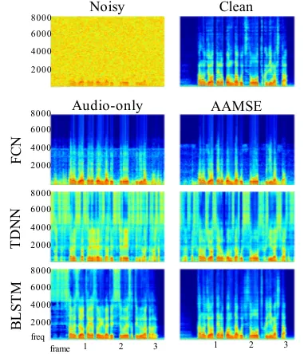
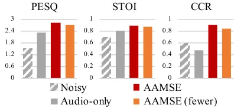

# A Study of Incorporating Articulatory Movement Information in Speech Enhancement

Yu-Wen Chen¹, Kuo-Hsuan Hung¹, Shang-Yi Chuang¹, Jonathan Sherman¹,
Xugang Lu², Yu Tsao¹ Affiliation: ¹Research Center for Information
Technology Innovation, Academia Sinica, Taiwan Affiliation: ²National
Institute of Information and Communications Technology, Japan

###### Abstract

Although deep learning algorithms are widely used for improving speech
enhancement (SE) performance, the performance remains limited under
highly challenging conditions, such as unseen noise or noise signals
having low signal-to-noise ratios (SNRs). This study provides a pilot
investigation on a novel multimodal audio-articulatory-movement SE
(AAMSE) model to enhance SE performance under such challenging
conditions. Articulatory movement features and acoustic signals were
used as inputs to waveform-mapping-based and spectral-mapping-based SE
systems with three fusion strategies. In addition, an ablation study was
conducted to evaluate SE performance using a limited number of
articulatory movement sensors. Experimental results confirm that, by
combining the modalities, the AAMSE model notably improves the SE
performance in terms of speech quality and intelligibility, as compared
to conventional audio-only SE baselines.

###### Index Terms: 

articulatory movement, multimodal learning, neural network, speech
enhancement

## I Introduction

Speech enhancement (SE) aims to improve speech quality and
intelligibility by reducing noise components within distorted speech
signals. SE is commonly used as a pre-processing method in various
speech-related applications, such as automatic speech recognition (ASR)
\[1, 2, 3\], speaker recognition \[4\], and hearing aids \[5, 6\].
Recently, neural-network (NN)-based SE methods are increasingly
discussed in the research field. The deep denoising autoencoder \[7, 8,
9\], fully connected neural network \[10, 11, 12\], convolutional neural
network \[13, 14, 15\], long short-term memory model \[16, 17, 18\], and
attention-mechanism-based models \[19, 20, 21, 22\] are well-known SE
methods that use NN models as the core architecture.

NN-based SE methods often only use audio signals as the input. However,
the contingent weak point is that the SE performance decreases
drastically when encountering unknown noise or very low signal-to-noise
ratio (SNR) conditions. Hence, audio-visual multimodal SE systems were
developed to address this issue \[23, 24\]. However, visual data have
several limitations - only the external vocal tract (lips) are
considered, greater storage and processing capacities are required, and
unseen video conditions (capture quality/lighting, obstructions, facial
angles, sudden movements, etc.) will limit performance similar to unseen
audio - the same weakness it attempted to improve. Conversely,
articulatory features such as broad phone class (BPC) and articulatory
movements are robust to environmental changes. \[25\] has shown that
using BPC can improve the SE performance. Also, recent studies have
confirmed that articulatory movements provide useful and complementary
information to acoustic signals and, hence, can be used to synthesize
speech signals \[26, 27\].

This study serves as a pilot investigation of the situation wherein both
articulatory movements and acoustic signals are available, while
acoustic signals might be distorted. Combining articulatory movements
and acoustic sensors can be used to facilitate effective vocal
communication in extremely noisy circumstances (sports events,
factories, crowded places) with no visual data available.

In this study, the electromagnetic midsagittal articulography (EMMA)
method was used to collect articulatory movements. Note that EMMA is
just one particular way to collect articulatory movements. In recent
years, numerous in-mouth sensors, such as smart palate systems \[28,
29\], smart dental braces \[30\], and in-mouth monitoring \[31\], have
been developed to collect articulatory features. Therefore, we are
certain that in-mouth sensors will have increased practical usage in the
future, and the results of this study can be applied to articulatory
movements collected from various devices.

The EMMA technology captures articulatory movements by inducing current
in sensors placed on articulators (tongues or lips) using an
electromagnetic field. Wei _et al._ \[32\] and Chen _et al._ \[33\]
studied the contribution of articulators to speech. Hiroya _et al._
\[34\] used an HMM-based speech production model to estimate the
articulatory movements from speech acoustics. However, to the best of
our knowledge, the use of articulatory movements as an additional
feature in SE systems has not been tested yet.

We test audio-articulatory-movement SE (AAMSE) models with three fusion
strategies on both waveform-mapping-based and spectral-mapping-based SE
systems. Experimental results showed that the proposed AAMSE models
outperformed the baseline audio-only SE models and achieved higher
intelligibility even at low SNR levels.

The remainder of this paper is organized as follows. Section II
introduces the related works of this study. Section III presents the
proposed articulatory movement features and AAMSE frameworks. Section IV
provides the experimental details and results. Finally, Section V
presents the conclusion of this study.

## II Related works

The AAMSE was implemented on one waveform-mapping-based and two
spectral-mapping-based SE systems. Fully convolutional neural networks
(FCN) have been confirmed as an effective waveform-mapping-based SE
model \[14\]. In this study, we integrate the articulatory movements in
the time domain with this model. We also implement two
spectral-mapping-based models: the time delay neural network (TDNN)
\[35\] and bi-directional long short-term memory networks (BLSTM). The
two models both consider the temporal relation within speech signals.
The TDNN is a fully connected feed-forward neural network that has been
proven robust in handling temporal dependencies. The BLSTM network
considers both forward and backward sequences of inputs and has feedback
connections. Hence, the BLSTM can extend attention over arbitrary time
intervals and is suitable to process time series data, such as speech
signals and articulatory movements.

For the waveform-mapping-based systems, SE directly processes speech
waveforms. For the spectral-mapping-based systems, short-time Fourier
transform (STFT) and inverse STFT are applied to transform speech
between waveforms and spectral features, where only the magnitude
components are enhanced, while the phase components are borrowed from
the original noisy speech.

## III Proposed AAMSE

In this section, we first explain the EMMA signals used as articulatory
movement data, followed by introducing the proposed AAMSE system with
three fusion strategies.

### III-A Characteristics of the articulatory movement data



Fig. 1: Positions of the EMMA sensors.

We used the EMMA collected by NTT, Tokyo, Japan \[36\] in this study.
The sensor coils of the EMMA were placed on the upper lip (UL), lower
lip (LL), upper jaw (UJ), lower jaw (LJ), tongue tip (T1), tongue blade
(T2), tongue dorsum (T3), tongue rear (T4), and the velum (VM), as shown
in Fig. 1). The EMMA records the Cartesian coordinates of each sensor
point at a sampling rate of 250 Hz. Fig. 2 shows the speech spectrograms
and the EMMA signals of two speakers speaking the same utterance. Both
the spectrograms and EMMA signals display similar patterns, indicating
that these resultant signals are highly dependent on the pronunciation.



Fig. 2: Visualization of the EMMA data.

### III-B Three fusion strategies of the AAMSE



Fig. 3: The three fusion strategies. The encoders and SE networks are
FCN, TDNN, or BLSTM.

The aim of using SE is to convert a noisy speech signal $`s`$ into an
enhanced speech signal $`\hat{x}`$ that is close to the clean speech
signal $`x`$. We define $`s`$ as: $`s=x+n`$, where $`n`$ represents the
noise signal.

The AAMSE is a multimodal problem. We reason that combining the physical
characteristic of an audio signal and an articulatory movement, which is
sound intensity and trajectory of the organs in the vocal tract,
respectively, can improve the performance over the single audio modality
considering they both carry speech information. We tested three fusion
strategies: (1) direct concatenating, (2) unilateral encoding, and (3)
bilateral encoding to integrate audio signals and articulatory movement
data. Fig. 3 illustrates the structure of the three fusion strategies.
The audio and EMMA signals are denoted by $`s`$ and $`e`$, respectively,
and $`v`$ is the input of the SE model. The aim was to find an audio
encoder $`E_{s}`$, an EMMA encoder $`E_{e}`$, and a SE network $`En`$
such that the enhanced signal $`\hat{x}=En(v)`$ was as close as possible
to the clean signal $`x`$.

- •
  Direct concatenating:

  ```math
  v=Concat(s,e) \tag{1}
  ```

- •
  Unilateral encoding:

  ```math
  v=Concat(s,E_{e}(e)) \tag{2}
  ```

- •
  Bilateral encoding:

  ```math
  v=Concat(E_{s}(s),E_{e}(e)) \tag{3}
  ```

The EMMA encoder $`E_{e}`$, audio encoder $`E_{s}`$, and SE network
$`En`$ are built by FCN, TDNN, or BLSTM. That is, we test three fusion
strategies under three model structures with a total of nine
combinations of the AAMSE architecture.

## IV Experiments

### IV-A Experimental setup

The EMMA dataset comprises articulatory and speech signals from three
speakers providing 354 utterances each. The two signals were recorded
simultaneously at sampling rates of 250 Hz and 16 kHz for EMMA and
speech, respectively. The training and testing sets included 304 and 50
utterances, respectively, from each speaker. Additionally, 100 different
noise samples \[37\] were used to prepare the noisy training data using
eight different SNR levels ($`\pm`$ 1 dB, $`\pm`$ 4 dB, $`\pm`$ 7 dB,
and $`\pm`$ 10 dB). Each clean utterance in the training data was
contaminated with five randomly selected noises at the eight SNR levels.
Similarly, each clean utterance in the testing data was corrupted with
seven new noises (car noise, engine noise, pink noise, white noise,
background talkers, and two types of street noises) at six different SNR
levels (-8, -5, -2, 0, 2, and 5 dB).

The experimental results were evaluated using PESQ \[38\] and STOI
\[39\] methods for speech quality and intelligibility, respectively. The
further verified the results on a pre-trained ASR system \[40\] and
calculated the character correct rate (CCR) using the Levenshtein
distance function \[41\].

### IV-B Implementation details

The structural parameters of the waveform-mapping-based and
spectral-mapping-based SE systems are listed in Table I. All
waveform-mapping-based FCN \[14\] models were trained with L2 loss and
Adam optimizer \[42\] at a learning rate of 0.001. For the
spectral-mapping-based models, we used STFT with a window size of 512,
hop length of 128, and log1p magnitude spectrograms \[43\] as the audio
input feature. All spectral-mapping-based TDNN \[35\] and BLSTM models
were trained with L1 loss and Adam optimizer \[42\] at a learning rate
of 0.0001. For each SE model, we keep the same SE network structure
under the audio-only condition and the audio-articulatory-movement
condition with the fusion strategy of direct concatenating.

[TABLE]

TABLE I: Waveform-mapping-based and spectral-mapping-based SE system
structures. In waveform-mapping-based FCN \[14\], $`f`$ and $`k`$ are
the number of the output filters and kernel size, respectively. In
spectral-mapping-based TDNN \[35\] and BLSTM, the numbers in the
brackets represent the output size.

### IV-C Experimental results

The spectrograms of the enhanced audio signals in Fig. 4 show distortion
reduction in all the models. Also, as observed in the silent region, the
AAMSE models show improved results than the audio-only SE baselines.



Fig. 4: Spectrograms of the audio signals.

|      |       |            |       |       |
| ---- | ----- | ---------- | ----- | ----- |
|      | Noisy | Audio-only |       |       |
|      |       | FCN        | TDNN  | BLSTM |
| PESQ | 1.530 | 2.311      | 2.064 | 2.329 |
| STOI | 0.686 | 0.814      | 0.738 | 0.801 |

TABLE II: PESQ and STOI of different audio-only SE models.

The PESQ and STOI of the original noisy speech and audio-only baselines
are listed in Table II. All waveform-mapping-based and
spectral-mapping-based audio-only SE systems yielded higher scores than
the original noisy speech. Tables III and IV present the average scores
(white part) and improvement (gray part, compared to audio-only models)
in the PESQ and STOI metrics. All AAMSE models achieved higher scores
than the audio-only SE models, except the FCN with unilateral encoding
owing to the information loss due to channel reduction. Because SE is an
audio-dominant task, we set the EMMA channel number to less than or
equal to the number of audio channels. The unilateral EMMA encoder
encoded EMMA signals from 18 channels to a single channel of the same
size as the audio signals. Conversely, the bilateral EMMA encoder
encoded EMMA signals in 18 channels without channel reduction.

[TABLE]

TABLE III: PESQ of different SE models (noisy=1.530).

[TABLE]

TABLE IV: STOI of different SE models (noisy=0.686).

Fig. 5 shows the SE improvement ability of the best audio-only SE model
(BLSTM) and best AAMSE model (BLSTM with unilateral encoding) compared
to that of the original noisy signals at different SNR levels. The
performance of both models improved in terms of PESQ and STOI, whereas
the AAMSE model outperformed the audio-only SE model. The CCR of the
audio-only SE model decreased, as reported in \[44\], while that of the
AAMSE model increased, indicating that the articulatory movement
features tend to provide more information regarding intelligibility. We
tested the performance of the BLSTM with unilateral encoding with four
less invasive sensors (i.e., UL, LL, LJ, and T1). The experimental
results, as observed in Fig. 6, showed that the AAMSE (fewer) model
achieves better performance than the audio-only SE model, indicating
that a lesser combination of articulatory movement features may be
sufficient for SE tasks.

Fig. 5: The SE improvement of the best audio-only SE model (BLSTM) and
the best AAMSE model (BLSTM with unilateral encoding) at different SNRs.



Fig. 6: Average scores of different SE systems.

## V Conclusion

In this study, we proposed AAMSE to enhance SE performance by
incorporating articulatory movement information with acoustic signals.
The experimental results showed that articulatory movements effectively
improved SE performance, especially at low SNR levels. The contributions
of this study are twofold: First, we confirmed the effectiveness of
incorporating articulatory movements into SE systems. Second, we
verified that the extra articulatory features can provide useful
information for SE tasks even with only four sensors. The results of
this study are promising and serve as a useful guide for designing
articulatory movement data collection devices. Furthermore, we believe
that the proposed AAMSE can be realized in challenging situations where
speech signals are highly distorted.

## VI Acknowledgement

The authors would like to thank the NTT Communication Science
Laboratories for permitting us to use their articulatory data.

## References

- \[1\] A. El-Solh, A. Cuhadar, and R. A. Goubran, “Evaluation of speech
  enhancement techniques for speaker identification in noisy
  environments,” in _Proc. ISM 2007_.
- \[2\] J. Li, L. Deng, R. Haeb-Umbach, and Y. Gong, _Robust automatic
  speech recognition: a bridge to practical applications_. Academic
  Press, 2015.
- \[3\] E. Vincent, T. Virtanen, and S. Gannot, _Audio source separation
  and speech enhancement_. John Wiley & Sons, 2018.
- \[4\] D. Michelsanti and Z.-H. Tan, “Conditional generative
  adversarial networks for speech enhancement and noise-robust speaker
  verification,” in _Proc. Interspeech 2017_.
- \[5\] H. Levit, “Noise reduction in hearing aids: An overview,” _J.
  Rehabil. Res. Develop._, vol. 38, no. 1, pp. 111–121, 2001.
- \[6\] E. W. Healy, M. Delfarah, E. M. Johnson, and D. Wang, “A deep
  learning algorithm to increase intelligibility for hearing-impaired
  listeners in the presence of a competing talker and reverberation,”
  _The Journal of the Acoustical Society of America_, vol. 145, no. 3,
  pp. 1378–1388, 2019.
- \[7\] X. Lu, Y. Tsao, S. Matsuda, and C. Hori, “Speech enhancement
  based on deep denoising autoencoder,” in _Proc. Interspeech 2013_.
- \[8\] B. Xia and C. Bao, “Wiener filtering based speech enhancement
  with weighted denoising auto-encoder and noise classification,”
  _Speech Communication_, vol. 60, pp. 13–29, 2014.
- \[9\] P. G. Shivakumar and P. G. Georgiou, “Perception optimized deep
  denoising autoencoders for speech enhancement,” in _Proc. Interspeech
  2016_.
- \[10\] D. Liu, P. Smaragdis, and M. Kim, “Experiments on deep learning
  for speech denoising,” in _Proc. Interspeech 2014_.
- \[11\] Y. Xu, J. Du, L.-R. Dai, and C.-H. Lee, “A regression approach
  to speech enhancement based on deep neural networks,” _IEEE/ACM
  Transactions on Audio, Speech and Language Processing (TASLP)_,
  vol. 23, no. 1, pp. 7–19, 2015.
- \[12\] M. Kolbæk, Z.-H. Tan, and J. Jensen, “Speech intelligibility
  potential of general and specialized deep neural network based speech
  enhancement systems,” _IEEE/ACM Transactions on Audio, Speech and
  Language Processing_, vol. 25, no. 1, pp. 153–167, 2017.
- \[13\] L. Hui, M. Cai, C. Guo, L. He, W.-Q. Zhang, and J. Liu,
  “Convolutional maxout neural networks for speech separation,” in
  _Proc. ISSPIT 2015_.
- \[14\] S.-W. Fu, Y. Tsao, X. Lu, and H. Kawai, “Raw waveform-based
  speech enhancement by fully convolutional networks,” in _Proc. APSIPA
  2017_.
- \[15\] A. Pandey and D. Wang, “A new framework for cnn-based speech
  enhancement in the time domain,” _IEEE/ACM Transactions on Audio,
  Speech, and Language Processing_, vol. 27, no. 7, pp. 1179–1188, 2019.
- \[16\] F. Weninger, H. Erdogan, S. Watanabe, E. Vincent, J. Le Roux,
  J. R. Hershey, and B. Schuller, “Speech enhancement with lstm
  recurrent neural networks and its application to noise-robust asr,” in
  _Proc. LVA/ICA 2015_.
- \[17\] Z. Chen, S. Watanabe, H. Erdogan, and J. R. Hershey, “Speech
  enhancement and recognition using multi-task learning of long
  short-term memory recurrent neural networks,” in _Proc. Interspeech
  2015_.
- \[18\] L. Sun, J. Du, L.-R. Dai, and C.-H. Lee, “Multiple-target deep
  learning for lstm-rnn based speech enhancement,” in _Proc. HSCMA
  2017_.
- \[19\] J. Kim, M. El-Khamy, and J. Lee, “T-gsa: Transformer with
  gaussian-weighted self-attention for speech enhancement,” in _Proc.
  ICASSP 2020_.
- \[20\] Y. Koizumi, K. Yaiabe, M. Delcroix, Y. Maxuxama, and
  D. Takeuchi, “Speech enhancement using self-adaptation and multi-head
  self-attention,” in _Proc. ICASSP 2020_.
- \[21\] C.-H. Yang, J. Qi, P.-Y. Chen, X. Ma, and C.-H. Lee,
  “Characterizing speech adversarial examples using self-attention u-net
  enhancement,” in _Proc. ICASSP 2020_.
- \[22\] S.-W. Fu, C.-F. Liao, T.-A. Hsieh, K.-H. Hung, S.-S. Wang,
  C. Yu, H.-C. Kuo, R. E. Zezario, Y.-J. Li, S.-Y. Chuang _et al._,
  “Boosting objective scores of a speech enhancement model by metricgan
  post-processing,” in _Proc. APSIPA 2020_.
- \[23\] J.-C. Hou, S.-S. Wang, Y.-H. Lai, J.-C. Lin, Y. Tsao, H.-W.
  Chang, and H.-M. Wang, “Audio-visual speech enhancement using deep
  neural networks,” in _Proc. APSIPA 2016_.
- \[24\] J.-C. Hou, S.-S. Wang, Y.-H. Lai, Y. Tsao, H.-W. Chang, and
  H.-M. Wang, “Audio-visual speech enhancement using multimodal deep
  convolutional neural networks,” _IEEE Transactions on Emerging Topics
  in Computational Intelligence_, vol. 2, no. 2, pp. 117–128, 2018.
- \[25\] Y.-J. Lu, C.-Y. Chang, Y. Tsao, and J.-w. Hung, “Speech
  enhancement guided by contextual articulatory information,” _arXiv
  preprint arXiv:2011.07442_, 2020.
- \[26\] F. Bocquelet, T. Hueber, L. Girin, P. Badin, and B. Yvert,
  “Robust articulatory speech synthesis using deep neural networks for
  bci applications,” in _Proc. Interspeech 2014_.
- \[27\] F. Taguchi and T. Kaburagi, “Articulatory-to-speech conversion
  using bi-directional long short-term memory,” in _Proc. Interspeech
  2018_.
- \[28\] R. Fabus, L. Raphael, S. Gatzonis, K. Dondorf, K. Giardina,
  S. Cron, and B. Badke, “Preliminary case studies investigating the use
  of electropalatography (epg) manufactured by completespeech® as a
  biofeedback tool in intervention,” _International Journal of
  Linguistics and Communication_, vol. 3, no. 1, pp. 11–23, 2015.
- \[29\] S. M. Zin, S. M. Rasib, F. M. Suhaimi, and M. Mariatti, “The
  technology of tongue and hard palate contact detection: a review,”
  _Biomedical engineering online_, vol. 20, no. 1, pp. 1–19, 2021.
- \[30\] A. T. Kutbee, R. R. Bahabry, K. O. Alamoudi, M. T. Ghoneim,
  M. D. Cordero, A. S. Almuslem, A. Gumus, E. M. Diallo, J. M. Nassar,
  A. M. Hussain _et al._, “Flexible and biocompatible high-performance
  solid-state micro-battery for implantable orthodontic system,” _npj
  Flexible Electronics_, vol. 1, no. 1, pp. 1–8, 2017.
- \[31\] D. Ma, C. Mason, and S. S. Ghoreishizadeh, “A wireless system
  for continuous in-mouth ph monitoring,” in _Proc. BioCAS 2017_.
- \[32\] J. Wei, Y. Ji, J. Zhang, Q. Fang, W. Lu, K. Honda, and X. Lu,
  “Study of articulators’ contribution and compensation during speech by
  articulatory speech recognition,” _Multimedia Tools and Applications_,
  vol. 77, no. 14, pp. 18 849–18 864, 2018.
- \[33\] Y.-W. Chen, K.-H. Hung, S.-Y. Chuang, J. Sherman, W.-C. Huang,
  X. Lu, and Y. Tsao, “Ema2s: An end-to-end multimodal
  articulatory-to-speech system,” in _Proc. ISCAS 2021_.
- \[34\] S. Hiroya and M. Honda, “Estimation of articulatory movements
  from speech acoustics using an hmm-based speech production model,”
  _IEEE Transactions on Speech and Audio Processing_, vol. 12, no. 2,
  pp. 175–185, 2004.
- \[35\] V. Peddinti, D. Povey, and S. Khudanpur, “A time delay neural
  network architecture for efficient modeling of long temporal
  contexts,” in _Proc. Interspeech 2015_.
- \[36\] T. Okadome and M. Honda, “Generation of articulatory movements
  by using a kinematic triphone model,” _The Journal of the Acoustical
  Society of America_, vol. 110, no. 1, pp. 453–463, 2001.
- \[37\] G. Hu, “100 nonspeech environmental sounds,” 2004 (accessed
  October 18, 2020),
  http://web.cse.ohio-state.edu/pnl/corpus/HuNonspeech/HuCorpus.html.
- \[38\] A. W. Rix, J. G. Beerends, M. P. Hollier, and A. P. Hekstra,
  “Perceptual evaluation of speech quality (pesq)-a new method for
  speech quality assessment of telephone networks and codecs,” in _Proc.
  ICASSP 2001_.
- \[39\] C. H. Taal, R. C. Hendriks, R. Heusdens, and J. Jensen, “An
  algorithm for intelligibility prediction of time–frequency weighted
  noisy speech,” _IEEE Transactions on Audio, Speech, and Language
  Processing_, vol. 19, no. 7, pp. 2125–2136, 2011.
- \[40\] A. Zhang, “Speech recognition (version 3.8),” 2017 (accessed
  October 18, 2020), https://github.com/Uberi/speech_recognition#readme.
- \[41\] V. I. Levenshtein, “Binary codes capable of correcting
  deletions, insertions, and reversals,” in _Soviet physics doklady_,
  vol. 10, no. 8, 1966, pp. 707–710.
- \[42\] D. P. Kingma and J. Ba, “Adam: A method for stochastic
  optimization,” in _Proc. ICLR 2015_.
- \[43\] S.-Y. Chuang, Y. Tsao, C.-C. Lo, and H.-M. Wang, “Lite
  audio-visual speech enhancement,” in _Proc. Interspeech 2020_.
- \[44\] C. Donahue, B. Li, and R. Prabhavalkar, “Exploring speech
  enhancement with generative adversarial networks for robust speech
  recognition,” in _Proc. ICASSP 2018_.
