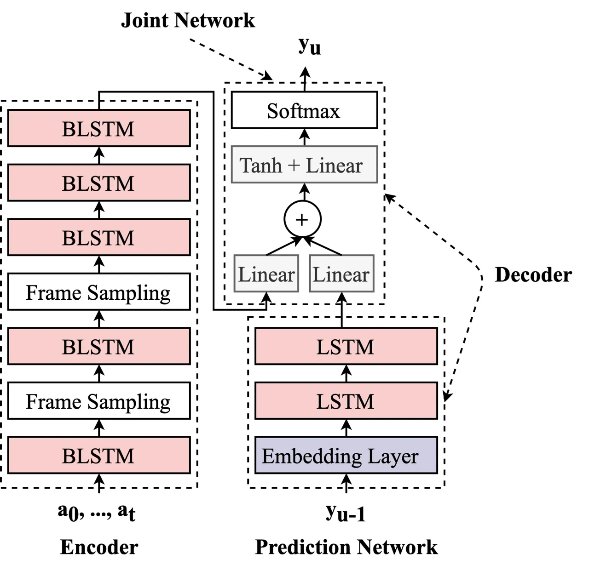
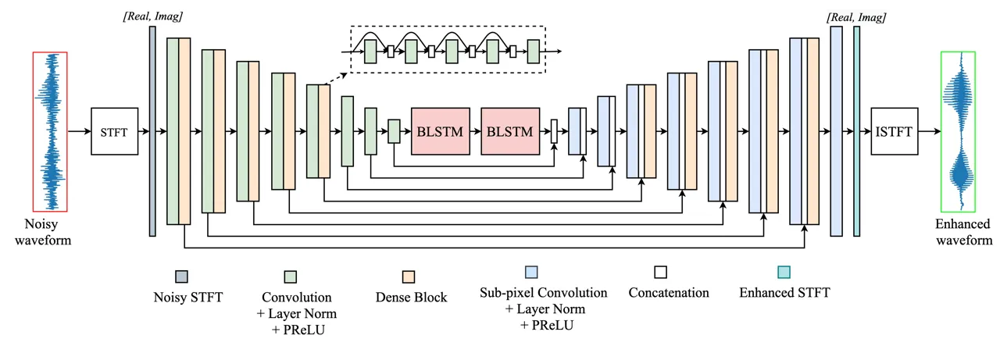
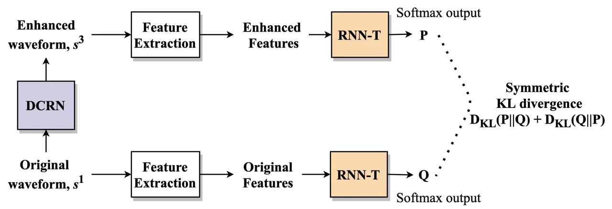
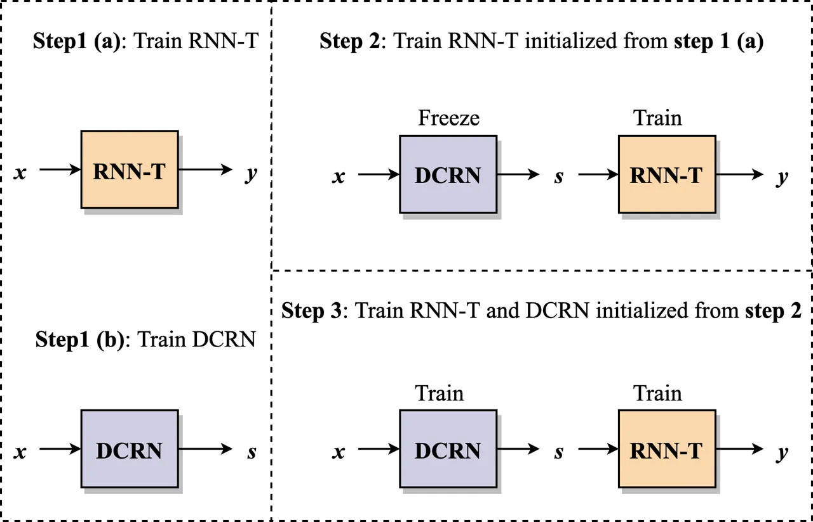
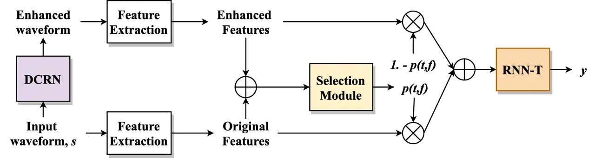

# Dual Application of Speech enhancement for automatic speech recognition

Ashutosh Pandey    Chunxi Liu    Yun Wang    Yatharth Saraf
^(†)^(†)thanks: \$†\$ Work was done when Ashutosh was an intern at
Facebook.

###### Abstract

In this work, we exploit speech enhancement for improving a recurrent
neural network transducer (RNN-T) based ASR system. We employ a dense
convolutional recurrent network (DCRN) for complex spectral mapping
based speech enhancement, and find it helpful for ASR in two ways: a
data augmentation technique, and a preprocessing frontend. In using it
for ASR data augmentation, we exploit a KL divergence based consistency
loss that is computed between the ASR outputs of original and enhanced
utterances. In using speech enhancement as an effective ASR frontend, we
propose a three-step training scheme based on model pretraining and
feature selection. We evaluate our proposed techniques on a challenging
social media English video dataset, and achieve an average relative
improvement of 11.2% with speech enhancement based data augmentation,
8.3% with enhancement based preprocessing, and 13.4% when combining
both.

###### Index Terms: 

speech enhancement, speech recognition, recurrent neural network
transducer, complex spectral mapping, consistency loss

^(†)^(†)address: ¹The Ohio State University, USA  ²Facebook AI, USA  
pandey.99@osu.edu  {chunxiliu,yunwang,ysaraf}@fb.com

## 1 Introduction

Thus far we have seen a great deal of interest in automatic speech
recognition (ASR) technologies, e.g., transcribing social media videos
and enabling video captioning in both real-world high- and low-resource
scenarios \[1, 2, 3, 4, 5\]. End-to-end ASR models \[6, 7, 8\] - that
use a single neural network to transduce audio into word sequences -
have been shown preferable in both (i) accuracy, i.e. as top performing
models in various benchmarks \[3, 9\], and (ii) training process which
enables single-step learning from scratch. Thus in this work, we aim to
exploit recurrent neural network transducer (RNN-T) \[6\] for
transcribing heterogeneous social media videos.

A series of past efforts have been focused on improving RNN-T training,
e.g., encoder and decoder pretraining \[10, 11\], training optimization
and criterion \[12, 13\], etc. However, background noise and room
reverberation in real world environment can still severely degrade ASR
performance \[14, 15\]. In practical settings, the most popular approach
to noise robust ASR is multi-channel speech enhancement that exploits
spatial correlation between signals recorded using different microphones
\[16, 17\]. However, using multiple microphones is expensive and not
always feasible. For example, social media videos are generally recorded
using single microphones.

Critical to the fact - why ASR systems based on single-channel speech
enhancement can only obtain limited performance improvements - is mainly
the observation that, processing artifacts introduced by single channel
speech enhancement can dominate the benefits obtained by noise reduction
\[18, 19\]. Recently, Wang et al. \[17\] proposed a complex spectral
mapping based speech enhancement system that shows significant ASR
improvements via both single channel and multi-channel speech
enhancement. Similarly, Kinoshita et al. \[20\] have shown that using a
time-domain speech enhancement can significantly improve ASR
performance. Thus, presumably the recent success in applying speech
enhancement to ASR is attributed to the joint enhancement of both
magnitude and phase, which introduces less distortions compared to the
magnitude-only enhancement systems.

Given the growing interest in RNN-T based ASR, to date little attempt
has been made to increase its noise robustness. Specially, to our best
knowledge, there is no pre-existing work that exploits single-channel
speech enhancement for improving RNN-T based ASR. Thus in this work, we
exploit a complex spectral mapping based speech enhancement system
toward this end. We use a dense convolutional recurrent network (DCRN)
as an enhancement model similar to \[17\].

First, we present that, by enhancing the ASR training data, speech
enhancement can work effectively as an ASR training data augmentation
technique. We also note that when applying speech synthesis to
augmenting ASR training data in \[21\], promoting consistent predictions
in response to real and synthesized speech has been shown to provide
substantial ASR performance gains. Thus, similar to \[21\], we also
exploit a consistency criterion - an additional KL divergence loss
between the RNN-T outputs in response to original and enhanced speech.

Secondly, we propose a multi (three)-step training scheme to combine
DCRN and RNN-T, where speech enhancement plays a key role - as a
preprocessing frontend - in facilitating ASR. First step is to learn an
RNN-T ASR model on original utterances while DCRN on clean and noisy
speech pairs. In step 2, initialize ASR model with the RNN-T learned in
1st step, and perform RNN-T training on the enhanced utterances
generated by the learned DCRN. Finally, in step 3, DCRN and RNN-T are
jointly fine-tuned with the ASR RNN-T criterion.

Note that the processing artifacts resulted from speech enhancement can
make the enhanced speech suboptimal for subsequent ASR modeling. We thus
examine making a selective use of both original and enhanced speech. We
propose a trainable selection module that learns to interpolate original
and enhanced features. Specifically, the selection module is trained via
ASR criterion to output probability scores in each time-frequency (T-F)
bin, and the scores are used to provide a weighted combination of
original and enhanced features.

Lastly, to combine the proposed data augmentation and preprocessing, we
show that the RNN-T trained from data augmentation can be further
improved using steps 2 and 3 of the above three-step training scheme.
Meanwhile, we continue to exploit the KL divergence based consistency
criterion between the enhanced versions of (i) the original speech and
(ii) the original speech mixed with noise.

We evaluate our proposed methods on a challenging task of transcribing
English social media videos. We achieve an average relative word error
rate reduction (WERR) of 11.2% when using speech enhancement for data
augmentation, 8.3% via preprocessing, and 13.4% when combining the both.

The rest of the paper is organized as follows. Section 2 describes the
proposed techniques in this study. Experimental settings, results and
comparisons are discussed in Section 3. Section 4 concludes the paper.

## 2 Modeling Approaches

The proposed system in this study has two components: RNN-T for ASR and
DCRN for speech enhancement. In this section, we first briefly describe
RNN-T based ASR and then complex spectral mapping based speech
enhancement. Next, we provide a detailed description of the proposed
DCRN and its dual application for ASR.

### 2.1 RNN-T

A speech utterance can be represented as an acoustic feature vector
sequence $`\bm{a}=(\bm{a}_{1}\ldots\bm{a}_{T}`$), where
$`\bm{a}_{t}\in\mathbb{R}^{d}`$ and $`T`$ is the number of frames in
$`\bm{a}`$. Similarly, denoting a grapheme set or a wordpiece inventory
as $`\mathcal{Y}`$, a transcription can be represented as a sequence
$`\bm{y}=(y_{1}\ldots y_{U})`$ of length $`U`$, where
$`y_{u}\in\mathcal{Y}`$. ASR can be formulated as a sequence-to-sequence
problem where input sequence is $`\bm{a}`$, and output sequence is
$`\bm{y}`$ corresponding to its transcription. We define
$`\bar{\mathcal{Y}}`$ as $`\mathcal{Y}\cup\{\emptyset\}`$, where
$`\emptyset`$ is the blank label.

An RNN-T model parameterizes the alignment probability using an encoder
network (i.e. transcription network in \[6\]), a prediction network and
a joint network. The encoder performs a mapping operation, denoted as
$`f^{\text{enc}}`$, which converts $`\bm{a}`$ into an another sequence
of representations
$`\bm{h}^{\text{enc}}=(\bm{h}_{1}^{\text{enc}}\ldots\bm{h}^{\text{enc}}_{T})`$:

```math
\bm{h}^{\text{enc}}=f^{\text{enc}}(\bm{a}) \tag{1}
```

A prediction network $`f^{\text{pred}}`$, based on RNN or its variants,
takes as input both its state vector and the previous non-blank output
label $`y_{u-1}`$ predicted by the model, to produce the new
representation $`\bm{h}^{\text{pre}}_{u}`$ as

```math
\textbf{h}^{\text{pred}}_{1:u}=f^{\text{pred}}(y_{0:(u-1)}) \tag{2}
```

where $`u`$ is output label index and $`y_{0}`$ is the blank label. The
joint network $`f^{\text{join}}`$ is a feed-forward network that
combines encoder output $`\bm{h}^{\text{enc}}_{t}`$ and prediction
network output $`\bm{h}^{\text{pre}}_{u}`$ to compute logits
$`\bm{z}_{t,u}`$ as

```math
\bm{z}_{t,u}=f^{\text{join}}(\bm{h}^{\text{enc}}_{t},\bm{h}^{\text{pred}}_{u}) \tag{3}
```

```math
\begin{split}P(y_{u}|\bm{x}_{1:t},y_{1:(u-1)})=\text{Softmax}(\bm{z}_{t,u})\end{split} \tag{4}
```

such that the logits go through Softmax function and produce a posterior
distribution of the next output label over $`\bar{\mathcal{Y}}`$.
Finally, an RNN-T loss is computed using the negative log posterior

```math
\mathcal{L}^{\text{\tiny{RNN-T}}}(\theta)=-\log P(\bm{y}|\bm{a}) \tag{5}
```

where $`\theta`$ denotes the model parameters. Note that the encoder is
seen as an acoustic model, and the combination of prediction and joint
network is interpreted as a decoder.

Specifically in this work, we use an RNN-T architectures shown in Figure
1, which consists of a 5-layer BLSTM encoder and 2-layer LSTM decoder.
The joint network combines the encoder and decoder outputs using linear
layers as:

```math
\bm{z}_{t,u}=\text{Linear}(\text{Tanh}(\text{Linear}(\bm{h}_{t}^{\text{enc}})+\text{Linear}(\bm{h}_{u}^{\text{pred}}))) \tag{6}
```



Figure 1: The RNN-T ASR architecture used in this study.

### 2.2 Speech Enhancement Using Complex Spectral Mapping

Given a clean speech signal $`\bm{s}`$ and a noise signal $`\bm{n}`$,
noisy speech signal $`\bm{x}`$ is defined as

```math
\bm{x}=\bm{s}+\bm{n} \tag{7}
```

where $`\{\bm{x},\bm{s},\bm{n}\}\in\mathbb{R}^{M\times 1}`$, and $`M`$
is the number of samples. The objective of speech enhancement is to get
a close estimate $`\bm{\hat{s}}`$ of $`\bm{s}`$ given $`\bm{x}`$. In
short-time Fourier transform (STFT) domain, we get

```math
\bm{X}=\bm{S}+\bm{N} \tag{8}
```

where $`\{\bm{X},\bm{Y},\bm{N}\}\in\mathbb{C}^{T\times F}`$, $`T`$ is
the number of frames and $`F`$ is the number of frequency bins. In
Cartesian coordinates, a complex-valued STFT, such as $`\bm{X}`$, is
represented as

```math
\bm{X}=\Re(\bm{X})+i\cdot\Im(\bm{X}) \tag{9}
```

where $`\Re(\bm{X})`$ and $`\Im(\bm{X})`$ respectively are the real and
the imaginary components of $`\bm{X}`$. In complex spectral mapping, a
real-valued DNN is employed to jointly predict the real and the
imaginary components of $`\bm{S}`$ from the real and the imaginary
components of $`\bm{X}`$.

```math
\begin{split}[\Re(\bm{\hat{S}}),\Im(\bm{\hat{S}})]&=M_{\phi}([\Re(\bm{X}),\Im(\bm{X})])\end{split} \tag{10}
```

where $`M_{\phi}`$ denotes a speech enhancement model parameterized by
$`\phi`$. Real and imaginary components are concatenated along the
frequency dimension when processed using LSTMs or linear layers \[22,
23, 24\] and stacked to form the channel dimension when processed using
convolutional layers \[25, 26\].

Finally, inverse STFT (ISTFT) is used to get the enhanced waveform.

```math
\bm{\hat{s}}=\text{ISTFT}(\bm{\hat{S}})=\text{ISTFT}(\Re(\bm{\hat{S}})+i\cdot\Im(\bm{\hat{S}})) \tag{11}
```

Next, we describe DCRN used in this study for complex spectral mapping.



Figure 2: The proposed DCRN model for complex spectral mapping.

### 2.3 Dense Convolutional Recurrent Network

The proposed DCRN architecture is shown in Fig. 2. It is a 1D UNet
architecture similar to \[17\], which was proposed for robust ASR using
single and multichannel speech enhancement. It consists of an encoder
for downsampling, a decoder for upsampling, and two BLSTM layers between
the encoder and the decoder for context aggregation over sequence of
frames. Outputs from encoder layers are concatenated to the outputs from
corresponding symmetric layers in decoder (along the channel axis).
Downsampling in encoder is performed using convolutions with a stride of
2 along the frequency dimension, and upsampling in decoder is performed
by using sub-pixel convolutions as in \[27\].

Additionally, five layers in the encoder and five layers in the decoder
are followed by a dense block. The dense block consists of five
convolutional layers in which the input to a given layer is the
concatenation of the outputs from all the previous layers in the block.
The number of output channels after each convolution in a dense block is
same as the number of channels in the input of dense block.

The input to DCRN is $`\bm{X}`$ of shape $`[BatchSize,2,T,F]`$ and
output is $`\hat{\bm{S}}`$ of shape $`[BatchSize,2,T,F]`$, where the
real and the imaginary parts are stacked to form the channel axis. All
the convolutions use filters of size $`3\times 3`$ except at the input
and the output, which use filters of size $`5\times 5`$. BLSTM layers
use state size of 512 in both directions. The number of channels and the
number of frequency bins in the outputs of the successive layers in the
encoder and the decoder are $`(2,257)`$ (input), $`(32,128)`$,
$`(32,64)`$, $`(32,32)`$, $`(32,16)`$, $`(64,8)`$, $`(128,4)`$,
$`(256,2)`$, $`(512,1)`$, $`(256,2)`$, $`(128,4)`$, $`(64,8)`$,
$`(32,16)`$, $`(32,32)`$, $`(32,64)`$, $`(32,128)`$, $`(2,257)`$
(output).

### 2.4 Dual Application of DCRN

We explore speech enhancement using DCRN as a data augmentation
technique and as a preprocessing frontend. Next, we describe these two
techniques.

#### 2.4.1 Data augmentation

Given an ASR data set $`D`$ consisting of speech signal and target
sequence pairs $`\{\bm{s}_{k},\bm{y}_{k}\}`$ where $`k=1,2,\dots,N`$,
and $`N`$ is the number of data samples. We can obtain different
versions of $`\bm{s}_{k}`$ for training in the following manner.

```math
\displaystyle\bm{s}^{1} \displaystyle=\bm{s} \tag{12}
```

```math
\displaystyle\bm{s}^{2} \displaystyle=\bm{s}+\bm{n} \tag{13}
```

```math
\displaystyle\bm{s}^{3} \displaystyle=\bm{\hat{s}}=M_{\phi}(\bm{s}) \tag{14}
```

```math
\displaystyle\bm{s}^{4} \displaystyle=\bm{\hat{s}}^{2}=M_{\phi}(\bm{s}+\bm{n}) \tag{15}
```

where $`\bm{n}`$ is a noise signal added online during training, and we
have dropped subscript $`k`$ for convenience. An ASR system can be
trained on original speech $`\bm{s}^{1}`$, speech with noise
$`\bm{s}^{2}`$, enhanced speech $`\bm{s}^{3}`$, and enhanced version of
speech with additive noise $`\bm{s}^{4}`$. Note that original speech in
the social media dataset used in this study includes background noise,
and we further add noise to it for noise based data augmentation.



Figure 3: An illustrative diagram of the KL divergence loss computation
for pair $`\{\bm{s}^{1},\bm{s}^{3}\}`$.

Further, since $`\bm{s}^{1},\bm{s}^{2}`$, $`\bm{s}^{3}`$, and
$`\bm{s}^{4}`$ are different versions of a speech, we can use a KL
divergence based consistency loss between their corresponding ASR
outputs to make ASR model invariant to these variations. A similar idea
of KL loss was used for speech synthesis based data augmentation in
\[21\]. Given a pair $`\{\bm{s}^{i},\bm{s}^{j}\}`$, we define KL
divergence loss as following

```math
\begin{split}\mathcal{L}^{\text{KL}}(\bm{s}^{i},\bm{s}^{j})=\frac{1}{T}\sum_{t=1}^{T}&[D_{\mathrm{KL}}(P(\bm{y}_{t}|\bm{s}^{i})\|P(\bm{y}_{t}|\bm{s}^{j}))\\
&+D_{\mathrm{KL}}(P(\bm{y}_{t}|\bm{s}^{j})\|P(\bm{y}_{t}|\bm{s}^{i}))]\end{split} \tag{16}
```

Note that RNN-T training computes each output posterior over both time
index $`t`$ and label index $`u`$ as in Eq. 4, and we average the KL
loss across label indices, while omitting the label index $`u`$ in Eq.
16 for clarity.

Thus the total training loss is defined as

```math
\begin{split}\mathcal{L}(\bm{s}^{i},\bm{s}^{j})=\ &0.5\cdot\log P(\bm{y}|\bm{s}^{i})+0.5\cdot\log P(\bm{y}|\bm{s}^{j})\\
&+\lambda_{\mathrm{aux}}\mathcal{L}^{\text{KL}}(\bm{s}^{i},\bm{s}^{j})\end{split} \tag{17}
```

where $`\lambda_{\mathrm{aux}}`$ is a hyperparameter determined using
validation set. An illustrative diagram to compute KL loss between pair
$`\bm{s}^{1}`$ and $`\bm{s}^{3}`$ is shown in Fig. 3.

#### 2.4.2 Preprocessing

For preprocessing, RNN-T is evaluated over test utterances enhanced
using DCRN. We find that training RNN-T using enhanced utterance does
not obtain better results. Instead, we train RNN-T with DCRN in three
steps. First, RNN-T is trained using original utterances to get the
baseline model, and DCRN is trained for speech enhancement using pairs
of clean and noisy speech. Next, RNN-T is trained on enhanced utterances
initialized using parameters from the baseline model. Finally, RNN-T and
DCRN are jointly trained using a smaller learning rate. A schematic
diagram of the three steps of RNN-T training with DCRN is given in Fig. 4.



Figure 4: Three-step training of RNN-T and DCRN.

#### 2.4.3 Selection Module

Speech enhancement generally introduces processing artifacts that can
outweigh the gain obtained from noise reduction. We propose a trainable
selection module that can learn to select between enhanced and original
features to improve ASR performance. A schematic diagram of selection
module is shown in Fig. 5. It outputs a probability value, $`p(t,f)`$
for each time-frequency bin that represents the reliability of original
features for ASR. We use $`1-p(t,f)`$ as the reliability score of
enhanced features for ASR. The final acoustic feature, $`\bm{\bar{a}}`$,
is computed as

```math
\bar{a}(t,f)=p(t,f)\cdot a(t,f)+(1-p(t,f))\cdot\hat{a}(t,f) \tag{18}
```

Selection module uses a linear layer with 128 hidden units at the input,
which is followed by 2 BLSTM layers with state size 128 in both
directions, and a linear layer at the output. To train selection module,
we utilize pre-trained DCRN and RNN-T. First, DCRN and RNN-T are fixed
to only train selection module using ASR loss. Next, RNN-T and selection
module are jointly trained with fixed DCRN using a smaller learning
rate.



Figure 5: The proposed selection module.

## 3 Experiments

### 3.1 Data

We evaluate our proposed methods on an in-house English video dataset.
The dataset is sampled from public social media videos and de-identified
before transcription. These videos contain a diverse range of acoustic
conditions, speakers, accents and topics. The test set contains two
types of videos, _clean_ and _noisy_. Train, validation and test data
sizes are given in Table 1.

Language Train Valid Test clean noisy English 2K 5.2 5.1 10.2

Table 1: Train, validation and test data duration in hours.

Enhancement models are trained with a separate set of 1K hour clean
audios, which are obtained also from the in-house English video dataset.
Training utterances are generated using SNRs uniformly sampled from \[-5
dB, 5 dB\]. Enhancement models are evaluated at SNRs of -5 dB, 0 dB and
5 dB using 1000 utterances not used during training.

For generating noisy mixtures, we use non-speech classes from AudioSet
\[28\]. For training RNN-T with additive noise based data augmentation,
noises are randomly added to utterances with a probability of 0.5 at
SNRs uniformly sampled from \[0 dB, 25 dB\]. For training RNN-T with
enhancement based data augmentation, a given batch is randomly processed
using DCRN with a probability of 0.5.

### 3.2 Experimental Settings

All speech utterances are resampled to 16 kHz and normalized to the
range $`[-1,1]`$. DCRN uses STFT with a frame size of 32 ms and frame
shift of 10 ms. ASR features are extracted using 80 dimensional log
Mel-filterbanks with a frame size of 16 ms and a frame shift of 10 ms.
An utterance level mean and variance normalization is applied to Log-Mel
features.

We apply the additional frequency and time masking as in SpecAugment
\[29\]. RNN-T output labels consist of a blank label and 255 word pieces
generated by the unigram language model algorithm from SentencePiece
toolkit \[30\].

All the models are trained using Adam optimizer \[31\] using a tri-stage
learning rate schedule proposed in \[29\]. We use first 2 epochs for
warm up and then divide remaining epochs in 3 equal parts. First part is
trained with constant learning rate and the last 2 parts are trained
using decaying learning rate, where minimum learning rate is 4e-6 and
peak learning rate is 4e-4. Training in the third step of Fig. 4 uses a
constant learning rate of 4e-6.

RNN-T model used BLSTM encoder layers of 800 hidden units, and a 2-layer
LSTM decoder of 160 hidden units. Linear layers after encoder and
decoder in the joint network use 1024 hidden units. Output after the
first and second BLSTM layer in encoder are subsampled by a factor of
two along the time dimension. The selection module uses two BLSTM layers
of state size 128 and linear layers at input and output. $`p(t,f)`$ is
computed using Sigmoidal nonlinearity at output.

STOI (%) SI-SNR test SNR -5 dB 0 dB 5 dB -5 dB 0 dB 5 dB original +
noise 57.3 68.6 78.9 -5.0 0.0 5.0 BLSTM 75.1 82.6 87.4 6.6 9.8 12.1 DCRN
76.9 84.3 88.7 6.5 9.1 10.6

Table 2: STOI and SI-SNR comparisons between DCRN and BLSTM.

Clean Noisy Average Baseline RNN-T 14.8 19.4 WERR + noise 14.1 18.6
4.4% + noise + $`L_{KL}(\bm{s}^{1},\bm{s}^{2})`$ 13.8 18.3 6.2% + SE
14.3 18.9 3.0% + SE + $`L_{KL}(\bm{s}^{1},\bm{s}^{3})`$ 13.9 18.4 5.6%

- noise + SE 13.7 18.0 7.3% + noise + SE +
  $`L_{KL}(\bm{s}^{(1,2)},\bm{s}^{(3,4)})`$ 13.0 17.4 11.2%

Table 3: WER and WERR comparisons between different data augmentation
techniques on top of baseline. SE denotes speech enhancement and
$`L_{KL}`$ denotes training with KL divergence loss.

\# params. Clean Noisy Average (a) RNN-T 90 M 14.8 19.4 WERR RNN-T +
DCRN_fixed 103 M 15.0 19.9 -2.0% (b) (a) + DCRN_fixed 14.1 18.8 3.9% (c)
(b) + fine tunning 13.5 18.0 8.0% (c) + selection 13.4 18.0 8.3%
RNN-T_large 105 M 14.1 18.6 4.4%

Table 4: WER comparisons between different training schemes. Model ids,
such as a) and b) in the first column are used in the second column to
denote the initialization model. DCRN_fixed denotes non-trainable DCRN.

Clean Noisy Average Baseline RNN-T 14.8 19.4 WERR (a) + noise + SE +
$`L_{KL}(\bm{s}^{(1,2)},\bm{s}^{(3,4)})`$ 13.0 17.4 11.2% (b) (a) + DCRN
12.7 17.2 12.8% (c) (b) + selection 12.7 17.2 12.8% (d) (a) + DCRN +
$`L_{KL}(\bm{s}^{3},\bm{s}^{4})`$ 12.6 17.2 13.1% (e) (a) + DCRN +
selection + $`L_{KL}(\bm{s}^{3},\bm{s}^{4})`$ 12.6 17.1 13.4%

Table 5: WER results in combining data augmentation and preprocessing.

### 3.3 Evaluation Metrics

We compare enhancement models in terms of short-time objective
intelligibility (STOI) \[32\] and scale-invariant signal-to-noise ratio
(SI-SNR) \[33\].

We evaluate ASR models in terms of word error rate (WER). In each
comparison, we first compute the relative WER reduction (WERR) on
_clean_/_noisy_ as a percentage, and then take the unweighted average of
two percentages, which we refer to as an average WERR.

### 3.4 Results and Comparisons

First, we compare DCRN with a BLSTM model which is shown in \[24\] to
improve cross-corpus generalization \[34\] . As in Table 2, DCRN is
consistently better than BLSTM in terms of STOI for all SNR conditions,
while BLSTM is better in terms of SI-SNR. In this work, we proceed with
DCRN for ASR experiments.

Next, ASR results with data augmentation are shown in Table 3, where
$`L_{KL}(\bm{s}^{(1,2)},\bm{s}^{(3,4)})`$ denotes training uniformly
using either $`L_{KL}(\bm{s}^{1},\bm{s}^{3})`$ or
$`L_{KL}(\bm{s}^{2},\bm{s}^{4})`$. We observe that using additive noise
as data augmentation can obtain better WER on both test sets with an
average WERR of 4.4%. Next, training with an additional KL loss as in
Eq. 16 improves it to 6.2%.

Using speech enhancement as data augmentation obtains an average WERR of
3.0%, and adding KL loss achieves 5.6%. Finally, using both noise and
speech enhancement based data augmentation along with
$`L_{KL}(\bm{s}^{(1,2)},\bm{s}^{(3,4)})`$ obtains the best WERR 11.2%.
We also experimented with KL loss between all possible pairs, but the
results were similar.

Next, we evaluate the ASR performance using DCRN as a preprocessing
frontend. Results are given in Table 4 along with the respective total
model parameters . First, we observe that training RNN-T from scratch on
enhanced utterances degrades the performance. However, when we
initialize RNN-T training with a model learned on original utterances
(Step 2 in Fig. 4), we observe consistent improvements. The average WERR
in this case is 3.9%. Additionally, when we fine tune DCRN with RNN-T
using a small learning rate of 4e-6 (Step 3 in Fig. 4), average WERR
improves to 8.0%. Further, adding selection module slightly improves
performance on clean test set and provides an average WERR of 8.3%.
Since RNN-T with DCRN has more parameters than the vanilla RNN-T
baseline, we build a larger RNN-T model by increasing encoder layers
from 5 to 6, which has the total parameters comparable to DCRN + RNN-T.
RNN-T_large obtains 4.4% WERR. Also, the number of parameters in
selection module is negligible compared to RNN-T + DCRN, so we have
reported the same number of parameters in these two cases.

Finally, we combine data augmentation and preprocessing techniques by
initializing the RNN-T training with a model trained using data
augmentation (last row in Table 3). We follow step 2 and step 3 of the
three-step training scheme in this case, where the initialization model
in step 2 is obtained from training with data augmentation. The results
are given in Table 5. An average WERR of 12.8% is observed in this case.
Also, we can exploit KL loss in this case by using
$`L_{KL}(\bm{s}^{3},\bm{s}^{4})`$. Note that we can not use other types
of pairs for KL loss because in this case RNN-T requires training on
enhanced utterances. We obtain best WERR of 13.4% by combining data
augmentation with preprocessing, which includes selection module and
uses $`L_{KL}(\bm{s}^{3},\bm{s}^{4})`$ during training step 2 and step 3.

## 4 Conclusions

In this work, we have explored a complex spectral mapping based speech
enhancement system to improve ASR performance. Our key finding is that
using additive noise and speech enhancement as data augmentation -
paired with a proposed KL divergence criterion between the ASR outputs
of original and enhanced utterances - obtains significant performance
improvements. Further, we have found that using a stepwise training of
speech enhancement and ASR system can also improve WER substantially.
Also, we have observed additional improvements by combining both speech
enhancement based data augmentation and preprocessing techniques.

## References

- \[1\] H. Liao, E. McDermott, and A. Senior, “Large scale deep neural
  network acoustic modeling with semi-supervised training data for
  YouTube video transcription,” in ASRU, 2013.
- \[2\] H. Soltau, H. Liao, and H. Sak, “Neural speech recognizer:
  Acoustic-to-word LSTM model for large vocabulary speech recognition,”
  INTERSPEECH, 2017.
- \[3\] C.-C. Chiu, W. Han, Y. Zhang, R. Pang, S. Kishchenko, P. Nguyen,
  A. Narayanan, H. Liao, S. Zhang, A. Kannan, et al., “A comparison of
  end-to-end models for long-form speech recognition,” in ASRU, 2019.
- \[4\] C. Liu, Q. Zhang, X. Zhang, K. Singh, Y. Saraf, and G. Zweig,
  “Multilingual graphemic hybrid ASR with massive data augmentation,” in
  Workshop on Spoken Language Technologies for Under-resourced languages
  and Collaboration and Computing for Under-Resourced Languages, 2020.
- \[5\] D.-R. Liu, C. Liu, F. Zhang, G. Synnaeve, Y. Saraf, and
  G. Zweig, “Contextualizing ASR lattice rescoring with hybrid pointer
  network language model,” in INTERSPEECH, 2020.
- \[6\] A. Graves, “Sequence transduction with recurrent neural
  networks,” arXiv preprint arXiv:1211.3711, 2012.
- \[7\] W. Chan, N. Jaitly, Q. Le, and O. Vinyals, “Listen, attend and
  spell: A neural network for large vocabulary conversational speech
  recognition,” in ICASSP, 2016.
- \[8\] H. Sak, M. Shannon, K. Rao, and F. Beaufays, “Recurrent neural
  aligner: An encoder-decoder neural network model for sequence to
  sequence mapping,” in INTERSPEECH, 2017.
- \[9\] J. Li, Y. Wu, Y. Gaur, C. Wang, R. Zhao, and S. Liu, “On the
  comparison of popular end-to-end models for large scale speech
  recognition,” arXiv preprint arXiv:2005.14327, 2020.
- \[10\] K. Rao, H. Sak, and R. Prabhavalkar, “Exploring architectures,
  data and units for streaming end-to-end speech recognition with
  rnn-transducer,” in ASRU, 2017.
- \[11\] H. Hu, R. Zhao, J. Li, L. Lu, and Y. Gong, “Exploring
  pre-training with alignments for rnn transducer based end-to-end
  speech recognition,” in ICASSP, 2020.
- \[12\] J. Li, R. Zhao, H. Hu, and Y. Gong, “Improving RNN transducer
  modeling for end-to-end speech recognition,” in ASRU, 2019.
- \[13\] C. Weng, C. Yu, J. Cui, C. Zhang, and D. Yu, “Minimum bayes
  risk training of RNN-transducer for end-to-end speech recognition,”
  arXiv preprint arXiv:1911.12487, 2019.
- \[14\] D. Wang and J. Chen, “Supervised speech separation based on
  deep learning: An overview,” IEEE/ACM Transactions on Audio, Speech,
  and Language Processing, vol. 26, no. 10, pp. 1702–1726, 2018.
- \[15\] R. Haeb-Umbach, S. Watanabe, T. Nakatani, M. Bacchiani,
  B. Hoffmeister, M. L. Seltzer, H. Zen, and M. Souden, “Speech
  processing for digital home assistants: Combining signal processing
  with deep-learning techniques,” IEEE Signal processing magazine, vol.
  36, no. 6, pp. 111–124, 2019.
- \[16\] J. Heymann, L. Drude, C. Boeddeker, P. Hanebrink, and
  R. Haeb-Umbach, “Beamnet: End-to-end training of a
  beamformer-supported multi-channel asr system,” in ICASSP, 2017, pp.
  5325–5329.
- \[17\] Z.-Q. Wang, P. Wang, and D. Wang, “Complex spectral mapping for
  single-and multi-channel speech enhancement and robust ASR,” IEEE/ACM
  Transactions on Audio, Speech, and Language Processing, vol. 28, pp.
  1778–1787, 2020.
- \[18\] L. D. Jahn Heymann and R. Haeb-Umbach, “Wide residual BLSTM
  network with discriminative speaker adaptation for robust speech
  recognition,” in Workshop on Speech Processing in Everyday
  Environments (CHiME’16), 2016, pp. 12–17.
- \[19\] P. Wang, K. Tan, et al., “Bridging the gap between monaural
  speech enhancement and recognition with distortion-independent
  acoustic modeling,” IEEE/ACM Transactions on Audio, Speech, and
  Language Processing, vol. 28, pp. 39–48, 2019.
- \[20\] K. Kinoshita, T. Ochiai, M. Delcroix, and T. Nakatani,
  “Improving noise robust automatic speech recognition with
  single-channel time-domain enhancement network,” in ICASSP, 2020, pp.
  7009–7013.
- \[21\] G. Wang, A. Rosenberg, Z. Chen, Y. Zhang, B. Ramabhadran,
  Y. Wu, and P. Moreno, “Improving speech recognition using consistent
  predictions on synthesized speech,” in ICASSP, 2020.
- \[22\] D. S. Williamson, Y. Wang, and D. Wang, “Complex ratio masking
  for monaural speech separation,” IEEE/ACM Transactions on Audio,
  Speech, and Language Processing, vol. 24, no. 3, pp. 483–492, 2015.
- \[23\] A. Pandey and D. Wang, “Exploring deep complex networks for
  complex spectrogram enhancement,” in ICASSP, 2019, pp. 6885–6889.
- \[24\] A. Pandey and D. Wang, “Learning complex spectral mapping for
  speech enhancement with improved cross-corpus generalization,” in
  INTERSPEECH, 2020, pp. 4511–4515.
- \[25\] S.-W. Fu, T.-y. Hu, Y. Tsao, and X. Lu, “Complex spectrogram
  enhancement by convolutional neural network with multi-metrics
  learning,” in MLSP, 2017, pp. 1–6.
- \[26\] K. Tan and D. Wang, “Learning complex spectral mapping with
  gated convolutional recurrent networks for monaural speech
  enhancement,” IEEE/ACM Transactions on Audio, Speech, and Language
  Processing, vol. 28, pp. 380–390, 2019.
- \[27\] A. Pandey and D. Wang, “Densely connected neural network with
  dilated convolutions for real-time speech enhancement in the time
  domain,” in ICASSP, 2020, pp. 6629–6633.
- \[28\] J. F. Gemmeke, D. P. Ellis, D. Freedman, A. Jansen,
  W. Lawrence, R. C. Moore, M. Plakal, and M. Ritter, “Audio Set: An
  ontology and human-labeled dataset for audio events,” in ICASSP, 2017,
  pp. 776–780.
- \[29\] D. S. Park, W. Chan, Y. Zhang, C.-C. Chiu, B. Zoph, E. D.
  Cubuk, and Q. V. Le, “SpecAugment: A simple data augmentation method
  for automatic speech recognition,” INTERSPEECH, 2019.
- \[30\] T. Kudo and J. Richardson, “Sentencepiece: A simple and
  language independent subword tokenizer and detokenizer for neural text
  processing,” arXiv preprint arXiv:1808.06226, 2018.
- \[31\] D. P. Kingma and J. Ba, “Adam: A method for stochastic
  optimization,” in ICLR, 2015.
- \[32\] C. H. Taal, R. C. Hendriks, R. Heusdens, and J. Jensen, “An
  algorithm for intelligibility prediction of time–frequency weighted
  noisy speech,” IEEE Transactions on Audio, Speech, and Language
  Processing, vol. 19, no. 7, pp. 2125–2136, 2011.
- \[33\] J. Le Roux, S. Wisdom, H. Erdogan, and J. R. Hershey,
  “SDR–half-baked or well done?,” in ICASSP, 2019, pp. 626–630.
- \[34\] A. Pandey and D. Wang, “On cross-corpus generalization of deep
  learning based speech enhancement,” IEEE/ACM Transactions on Audio,
  Speech, and Language Processing, vol. 28, pp. 2489–2499, 2020.
