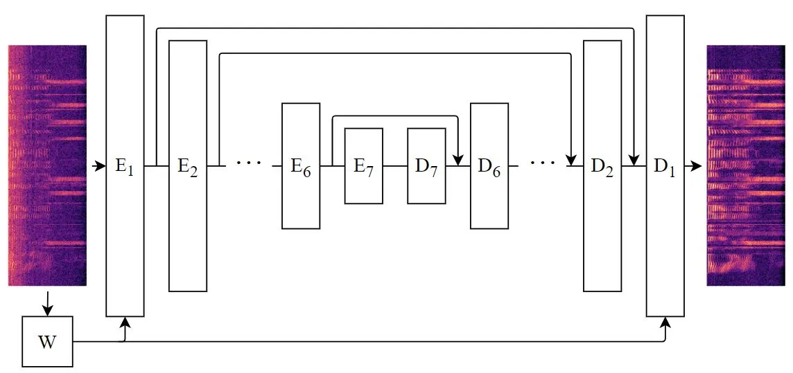
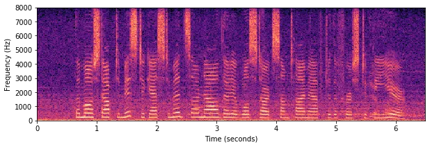
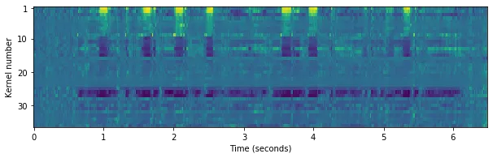

# Frequency Gating: Improved Convolutional Neural Networks for Speech Enhancement in the Time-Frequency Domain

\authorblockNKoen Oostermeijer\authorrefmark1, Qing Wang\authorrefmark1
and Jun Du\authorrefmark1 \authorblockA\authorrefmark1University of
Science and Technology of China, Hefei, China  
E-mails: keen@mail.ustc.edu.cn, {qingwang2, jundu}@ustc.edu.cn

###### Abstract

One of the strengths of traditional convolutional neural networks (CNNs)
is their inherent translational invariance. However, for the task of
speech enhancement in the time-frequency domain, this property cannot be
fully exploited due to a lack of invariance in the frequency direction.
In this paper we propose to remedy this inefficiency by introducing a
method, which we call Frequency Gating, to compute multiplicative
weights for the kernels of the CNN in order to make them frequency
dependent. Several mechanisms are explored: temporal gating, in which
weights are dependent on prior time frames, local gating, whose weights
are generated based on a single time frame and the ones adjacent to it,
and frequency-wise gating, where each kernel is assigned a weight
independent of the input data. Experiments with an autoencoder neural
network with skip connections show that both local and frequency-wise
gating outperform the baseline and are therefore viable ways to improve
CNN-based speech enhancement neural networks. In addition, a loss
function based on the extended short-time objective intelligibility
score (ESTOI) is introduced, which we show to outperform the standard
mean squared error (MSE) loss function.

Keywords: speech enhancement, frequency gating, CNN, ESTOI

## 1 Introduction

The goal of speech enhancement is to clean an audio signal of an
utterance from any corrupting background noise. In more formal terms,
one seeks to increase the speech-to-noise ratio (SNR) to the point where
the noise cannot be distinguished anymore and only the speech is heard.

Due to its applications in telecommunications and hearing aids, this has
been an active area of research for many years. Classical speech
enhancement algorithms include spectral subtraction methods \[1\],
Wiener filtering \[2\], MMSE (minimum mean-square error) and OM-LSA
(optimally modified log-spectral amplitude) estimation \[3, 4\], as well
as subspace methods \[5, 6\].

Early applications of deep learning-based methods for speech enhancement
employed fully connected neural networks (FNNs) \[7, 8, 9, 10\] and
recurrent neural networks (RNNs), in particular long short-term memory
networks (LSTMs) \[11, 12, 13\]. Later, convolutional neural
network-based methods (CNN) were introduced, first in the time-frequency
domain \[14, 15, 16\] and then in the time domain, for instance
Denoising WaveNet \[17\], an adaption of the eponymous WaveNet, and
SEGAN \[18, 19, 20\], which used a generative adversarial network (GAN)
\[21\].

### 1.1 Related work

In the time-frequency domain there are relatively few many-to-many frame
(multiple time-frames as input and output) CNN-based methods, as most
many-to-many methods operate in the time domain and most CNN-based
methods in the time-frequency domain are many-to-one (single time-frame
outputs).

Those that do make use of a many-to-many frame architecture include the
following: In \[22\], the authors used a vanilla 24-layer CNN to
estimate an ideal ratio mask (IRM). A similar idea is explored in
\[23\], in which a more sophisticated architecture with batch
normalisation \[24\] and skip connections \[25\] was used to directly
estimate LPS features \[26\]. EHNet \[27\] employed a number of
convolutional layers to generate a multiple feature maps, which are
concatenated and fed into an RNN layer to better exploit temporal
structures. The authors of \[28\] adapted U-net \[29\] for phase
sensitive speech enhancement. They achieved this by constructing layers
that are able to handle complex numbers. Finally, we mention \[30\], a
GAN-based method.



Figure 1: Speech Enhancement Autoencoder. The components W,
$`\text{E}_{i}`$ and $`\text{D}_{i}`$ denote the weighting, encoder and
decoder layers respectively

### 1.2 Contributions

Most of the time-frequency domain CNN architectures use kernels that
span the whole frequency range in a sliding window fashion, or use large
kernels with large strides in the frequency direction. We believe this
to be a fundamental drawback, which we seek to amend by proposing a CNN
autoencoder architecture with a frequency gating mechanism.

In chapter two we will substantiate this claim and go into detail on the
reasoning behind our architecture. In addition to that, we also
introduce a new loss function in chapter three. Chapter four is
dedicated to describing our experiments, the results of which are
presented in chapter five and discussed in chapter six.

To summarise, our main contributions are as follows:

1.  1.  A new frequency gating mechanism is introduced to improve CNN-based
        speech enhancement in the time-frequency domain.
2.  2.  We design a CNN-based autoencoder network for speech enhancement.
3.  3.  We also introduce a new loss function, based on ESTOI.
4.  4.  We show that these yield significantly better results over our
        baselines.

## 2 Denoising CNNs

One of the hallmarks of CNNs is their inherent translational invariance;
their ability to detect patterns is independent of where they are
located in the input. This is beneficial for tasks such as image
recognition and denoising, where it is assumed that features are not
constrained to occur in certain regions of the image. However, for
speech enhancement in the time-frequency domain this assumption cannot
be expected to hold. While there is invariance in the temporal
direction, patterns such as overtones in speech and the pinkness of
noises break frequency invariance.

Previously, most networks dealt with this by having input kernels that
have a height equal to the number of frequencies \[14, 15, 16\].
However, such large kernels require a considerable amount of computation
and thereby restrict the architecture and capabilities of the network.
Consequently, these networks only estimate a single time-frame at a
time.

In this paper, we investigate another option, instead of tall kernels,
we use smaller kernels and introduce a frequency gating layer, tasked
with computing frequency-dependent weights for the individual kernels.
At each time step, this layer outputs for each kernel of the first and
last convolutional layer and for each bin in the frequency direction a
multiplicative weight between 0 and 1.

We explore three options of computing these weights: frequency bin
weighting, local weighting and temporal weighting. Frequency bin
weighting assigns kernel weights to each frequency, independent of the
input. This explicitly breaks frequential invariance. The local and
temporal weighting methods on the other hand generate a set of kernel
weights per time frame, based on the whole frequency range of a single
time frame and its neighbours, and all previous time frames
respectively. This is explained in more detail in section IV.

The main network, tasked with denoising the utterance, takes a
two-dimensional input of noisy log-power spectrum (LPS) features and
outputs the corresponding enhanced LPS features of the same shape
\[26\].

It has an hourglass-shaped mirrored encoder-decoder structure with
symmetric skip-connections, as illustrated in Fig. 1. Each of the layers
consists of a convolutional layer, a batch normalisation layer \[24\]
and a ReLU non-linearity. The convolutional layers are transposed in the
decoder and the output layer is without batch normalisation and
non-linearity.

It has no pooling layers and is therefore fully connected in the CNN
sense. Autoencoding CNNs enjoy several properties that are desirable for
the task at hand: As opposed to recurrent layers, the calculations of
the convolutional layers are completely parallelisable, increasing
computational speed. Furthermore, the fact that the the network is
many-to-many frame, means the network is better adapted at learning
contextual information. The symmetric structure of the network allows
for a straightforward use of skip connections, which has already been
proved successful in raw audio-to-raw audio speech enhancement \[18\] as
well as image denoising \[29\]. These skip connections increase the
expressive power of the network by letting information bypass the
bottleneck and ease the flow of gradients, thereby improving the
learning capacity of the network.

## 3 Loss Functions

Speech enhancement algorithms are often trained using a mean squared
error (MSE) loss function. However, it has been shown that in most cases
this approach is suboptimal \[31\]. This is due to the fact that the
quality metrics of interest are perceptual scores such as Perceptual
Evaluation of Speech Quality (PESQ) \[32\] and Short-Time Objective
Intelligibility Measure (STOI) \[33\], which do not correlate perfectly
with MSE. These metrics are sensitive to perceptually important effects
such as differences in loudness, threshold effects and correlations,
which the MSE loss fails to capture \[34\].

Since PESQ and STOI are calculated using discontinuous functions, they
are unsuited to be used as loss functions directly. Several approaches
have been proposed to bridge this gap. One popular method is to use a
GAN \[18\]. The idea is that the discriminator is able to learn features
of realistic speech and transfer this knowledge to the generator, which
serves as the speech enhancement network. Another procedure is to
augment the MSE loss function with symmetric and asymmetric loudness
disturbance terms as a way to approximate the PESQ function \[34\]. In
\[35\] the authors train a neural network to estimate PESQ values. Its
weights are then frozen and used in the second training stage to
optimise for PESQ indirectly.

### 3.1 ESTOI

In this paper, we propose a loss function based on ESTOI (Extended
Short-Time Objective Intelligibility) \[36\]. This has been done
previously in \[31\], but for time-domain algorithms for which the data
had been preprocessed using a voice activity detector. We have altered
it to make it suitable for LPS features and more stable in situations
with potentially a large proportion of silent frames.

ESTOI was introduced to remedy STOIs inability to capture the
(un)intelligibility of speech distorted by temporally highly modulated
noise. Like STOI, ESTOI is calculated using one-third octave frequency
bands: let $`S(k,m)`$ be the short-time Fourier transform (STFT) of a
signal $`s(n)`$ of which the silent frames have been removed. Here the
indices $`k=1,\dots,K`$ and $`m=1,\dots,M`$ denote the frequency bin and
the time frame respectively. The one-third octave bands are then
obtained by summing over the bin energies:

```math
\displaystyle S_{j}(m)=\sqrt{\sum_{k=k_{l}(j)}^{k_{u}(j)}|S(k,m)|^{2}}, \tag{1}
```

where $`k_{l}(j)`$ and $`k_{u}(j)`$ are the lower and upper index of
frequency band $`j=1,\dots,J`$ respectively. These are cut up into
segments $`\{\bar{S}(N),\bar{S}(N+1),\dots,\bar{S}(M)\}`$ of length N:

```math
\displaystyle\bar{S}(m)=\begin{bmatrix}S_{1}(m-N+1)&\dots&S_{1}(m)\\
\vdots&\ddots&\vdots\\
S_{J}(m-N+1)&\dots&S_{J}(m)\end{bmatrix} \tag{2}
```

and subsequently normalised, first row-wise and then column-wise. Here,
row-wise normalisation is defined for the $`j`$th row of $`\bar{S}(m)`$,
$`\bar{s}_{j}(m)=[S_{1}(m-N+1),\dots,S_{1}(m)]^{T}`$ as

```math
\displaystyle\tilde{s}_{j}(m)=\frac{\bar{s}_{j}(m)-\mu_{\bar{s}_{j}(m)}}{||\bar{s}_{j}(m)-\mu_{\bar{s}_{j}(m)}||_{2}}, \tag{3}
```

where $`\mu_{\bar{s}_{j}(m)}`$ is the average of the element of the
vector $`\bar{s}_{j}(m)`$. Column-wise normalisation is done in a
similar manner.

The row and column-wise normalised matrix of the clean speech
$`\tilde{C}(m)`$ and of the enhanced speech $`\tilde{N}(m)`$ are then
used to obtain the ESTOI measure:

```math
\displaystyle d_{\text{ESTOI}}=\frac{1}{N(M-N+1)}\sum_{m=1}^{M-N+1}\text{Tr}\left(\tilde{C}(m)^{T}\tilde{N}(m)\right). \tag{4}
```

Note that since this is a correlation function, it ranges from $`-1`$ to
$`1`$, with $`d_{\text{ESTOI}}=1`$ corresponding to perfect speech
enhancement.



Figure 2: Spectrogram of an utterance corrupted by SNR = 5 noise.



Figure 3: Centred kernel activations, corresponding to Fig. 2.

### 3.2 $`\text{E}^{2}`$STOI

To relieve the previously mentioned complications, we have extended
ESTOI in three ways. First, during the beginning of training,
transforming normalised LPS features back to absolute STFT features
proved to be unstable. To ameliorate this we clip the data after it has
been transformed into absolute STFT features to lie within the range
$`[0,1]`$.

Second, instead of removing silent frames from the dataset directly,
silent frames are masked during the computation of the loss. Samples
with too few non-silent frames remaining are then discarded. We found
that this often left us with an insufficient number of remaining frames
to justify splitting up the data into segments. Therefore, to improve
stability we refrained from doing so. In the normalisation procedure
only the remaining frames were considered.

Finally, we have added an MSE loss function for two reasons. Firstly
because ESTOI is invariant under rescalings of the power spectra of the
inputs and secondly our $`\text{E}^{2}`$STOI loss function only takes
non-silent frames into account. The MSE loss function handles both these
blind spots.

Hence, consider again an absolute power spectrum, clipped to the range
$`[0,1]`$. The mask is the set of frames for which the energy condition
is fulfilled:

```math
\displaystyle I=\left\{m\left|\sum_{k=1}^{K}H(|S(k,m)|)>\theta\right\}\right., \tag{5}
```

here $`H`$ is the Heaviside step function and $`\theta`$ is the energy
threshold, which was set to $`\theta=0.01`$ in our experiments. The mask
is used to filter the one-third octave frequency band features (Eq. 2),

```math
\displaystyle\underline{S}=\begin{bmatrix}S_{1}(l_{1})&\dots&S_{1}(l_{L})\\
\vdots&\ddots&\vdots\\
S_{J}(l_{1})&\dots&S_{J}(l_{L})\end{bmatrix},l_{i}\in I,l_{i}<l_{j}\forall i<j, \tag{6}
```

where $`L=|I|`$ is the cardinality of $`I`$, i.e. the number of
non-silent frames.

Next the masked STFT power spectrum $`\underline{S}`$ is normalised in
fashion similar to Eq. 3, with a mean of

```math
\displaystyle\mu_{\underline{s}_{j}(m)}=\frac{1}{L}\sum_{m\in I}S_{j}(m). \tag{7}
```

Then, $`d_{\text{E}^{2}\text{STOI}}`$ is computed using STFT power
spectra of the clean and the enhanced utterances, similar to Eq.4. An
MSE loss function is added to yield the final expression for our
$`\text{E}^{2}\text{STOI}`$ loss function:

```math
\displaystyle\mathcal{L}_{\text{E}^{2}\text{STOI}}=-d_{\text{E}^{2}\text{STOI}}+\lambda\mathcal{L}_{\text{MSE}}. \tag{8}
```

Experiments showed that for $`\lambda=1/3`$ the magnitude of the
gradients of both loss functions on the right-hand side are of equal
magnitude.

## 4 Experiments

### 4.1 Dataset

The models are trained and evaluated on speech from the WSJ0 corpus
\[37\], split into two groups of mutually exclusive speakers, resulting
in a 13 hour training dataset and 42 minutes testing dataset. In
constructing the training data samples, there is a 50% overlap between
consecutive samples.

The noise is taken from the DEMAND dataset \[38\]. For training we opted
for the Metro, Square, Café, Station, Restaurant, Meeting, Hallway,
Park, Field and Washing noises and testing was done using River, Cafeter
and Traffic. In this paper, we have considered three SNR levels, -5 dB,
0 dB and 5 dB.

These waveforms were sampled at 16 kHz and short-time Fourier
transformed using a 512 sample (32 msec) frame length and frame shift of
256 samples, resulting in 257 frequency bins, ranging from 0 to 8 kHz.
From these, LPS features were extracted and normalised using speech
only, as this gave slightly better results than to normalise it with
noisy speech. They were split up into samples of length 40. We found
that for this sample length a minimum number of non-silent frames of 10
worked well.

### 4.2 Architectural Specifications

The first and last three layers have a kernel size of $`(5\times 5)`$
and all other layers $`(3\times 3)`$. The first and last layers have a
stride of one, whereas the other layers have a stride of two in the
frequency direction and one in the time direction. For our inputs of
height 257, the bottleneck representation has height 2. All
convolutional layers are zero-padded to ensure the samples stay the same
duration.

The number of channels of the encoder are 1, $`\rho`$, $`\rho`$,
$`\rho`$, $`2\rho`$, $`2\rho`$, $`3\rho`$ and $`4\rho`$, which is
reversed for the decoder, $`\rho`$ is a scale factor that we set to
rescale the networks to make them the same size.

#### 4.2.1 Frequency bin weighting

The frequency-wise bin weighting layer assigns each kernel of the input
and output layers a frequency dependent weight
$`\sigma\left(\alpha_{k}x/257+\beta_{k}\right)`$ where $`x`$ ranges from
3 to 255, the frequency bin numbers the kernels are applied to. The
parameters $`\alpha_{k}`$ and $`\beta_{k}`$ and $`k`$ denote the kernel
index and $`\sigma(\cdot)`$ is the sigmoid function. Note that this only
adds $`2\rho`$ extra parameters to the main network.

#### 4.2.2 Local weighting

For the local weighting, a convolutional layer with kernels sized
$`(257\times 3)`$ is used. Each kernel assigns a weight to one of the
kernels of the input and output layers, which is also transformed using
a sigmoid function.

#### 4.2.3 Temporal weighting

An LSTM layer is used to generate the weights for the temporal weighting
layer. Its outputs are linearly transformed to lie within the range
$`[0,1]`$.

These versions of frequency gating are benchmarked against the
previously discussed speech enhancement autoencoder without frequency
gating. To give a fair comparison the benchmark and the one with
frequency-wise weighting have a scale factor $`\rho=37`$, giving them
732823 and 732897 parameters respectively, while local and temporal
weighting use a smaller scale factor: $`\rho=36`$, resulting in 721657
and 736345 parameters respectively.

Moreover, we have implemented 2D-RFCNN \[22\] and an LSTM with 2048
hidden cells as further comparison.

## 5 Results

The results of our experiments are shown in Tables I, II and III,
corresponding to River, Cafeteer and Traffic noise respectively.

### 5.1 Efficacy Speech Enhancement CNN-based Autoencoder

For all noise types and SNR levels every version of our CNN-based
autoencoder architecture (bottom five rows in Tables I, II and III)
yields significantly better results than the 2D-RFCNN and LSTM networks.
For example, compared with the LSTM network, our CNN-based model without
frequency gating achieved on average a 1.4 STOI and 0.15 PESQ
improvement.

### 5.2 Efficacy Frequency Gating Layer

It can be seen that the frequency bin weighting method (“Freq.-wise”)
outperforms the benchmark (“No weight”) on a majority of tasks (fifteen
out of eighteen) and performs equally well on two of them. Especially on
the PESQ metric tasks it provides all of the best results and on the
traffic noise it performs best for every single task. Local weighting
(“Local”) yields best results for almost all (eight of nine) of the STOI
metric tasks, but does not give better results for the PESQ tasks.
Finally, temporal weighting (“Temporal”) does not result in substantial
improvements.

### 5.3 Efficacy $`\text{E}^{2}`$STOI

To provide a fair comparison, we have tested the frequency bin weighting
method, which performed best among the frequency gating networks, with
an MSE loss function (“Freq.-wise (MSE)”). By doing so, we can see the
improvements of the $`\text{E}^{2}`$STOI loss function (“Freq.-wise”)
over the standard MSE loss function. The experiments show that for the
vast majority (seventeen out of eighteen tasks) the $`\text{E}^{2}`$STOI
loss function is the better loss function.

### 5.4 Weighting Layer

To demonstrate how the frequency gating principle works, we have taken
an SNR = 5 utterance and applied the trained local weighting layer to
it. Fig. 2 shows the utterance and Fig. 3 centred kernel weights. The
first nine kernels are activated by the eight high-energy patterns in
the high frequency regions, whereas the next six kernels are deactivated
here. Kernels 17 to 24 are always activated, regardless of any patterns
in the input. Furthermore, we can see several kernels that deactivate
when there is speech activity.

Moreover, inspecting the $`\alpha_{k}`$ parameters of the frequency bin
weighting layer shows that 21 of those are positive while 16 are
negative. This means that the majority of the kernel weights get
decrease the higher the frequency.

|                  | SNR = -5 |      | SNR = 0 |      | SNR = 5 |      |
| ---------------- | -------- | ---- | ------- | ---- | ------- | ---- |
|                  | STOI     | PESQ | STOI    | PESQ | STOI    | PESQ |
| Noisy            | 63.6     | 1.60 | 78.5    | 1.91 | 88.3    | 2.26 |
| 2D-RFCNN         | 64.2     | 1.63 | 79.5    | 2.00 | 89.4    | 2.37 |
| LSTM             | 67.8     | 1.73 | 80.3    | 2.06 | 89.2    | 2.44 |
| No weight        | 67.7     | 1.80 | 81.4    | 2.15 | 90.2    | 2.53 |
| Temporal         | 68.8     | 1.72 | 82.2    | 2.07 | 90.2    | 2.43 |
| Local            | 69.4     | 1.77 | 82.4    | 2.11 | 90.5    | 2.47 |
| Freq.-wise       | 68.3     | 1.81 | 81.9    | 2.16 | 90.4    | 2.55 |
| Freq.-wise (MSE) | 66.3     | 1.71 | 80.5    | 2.06 | 89.5    | 2.46 |

Table 1: River noise; STOI(%) and PESQ comparison

|                  | SNR = -5 |      | SNR = 0 |      | SNR = 5 |      |
| ---------------- | -------- | ---- | ------- | ---- | ------- | ---- |
|                  | STOI     | PESQ | STOI    | PESQ | STOI    | PESQ |
| Noisy            | 50.5     | 1.54 | 68.6    | 1.87 | 83.0    | 2.22 |
| 2D-RFCNN         | 52.3     | 1.58 | 70.1    | 1.93 | 84.5    | 2.31 |
| LSTM             | 53.9     | 1.65 | 71.3    | 2.00 | 84.7    | 2.37 |
| No weight        | 54.1     | 1.75 | 72.7    | 2.11 | 86.0    | 2.47 |
| Temporal         | 54.6     | 1.72 | 72.8    | 2.08 | 85.8    | 2.44 |
| Local            | 55.3     | 1.74 | 73.5    | 2.10 | 86.4    | 2.46 |
| Freq.-wise       | 54.2     | 1.76 | 72.6    | 2.11 | 86.1    | 2.49 |
| Freq.-wise (MSE) | 54.6     | 1.74 | 73.1    | 2.10 | 86.1    | 2.47 |

Table 2: Cafeteer noise; STOI(%) and PESQ comparison

|                  | SNR = -5 |      | SNR = 0 |      | SNR = 5 |      |
| ---------------- | -------- | ---- | ------- | ---- | ------- | ---- |
|                  | STOI     | PESQ | STOI    | PESQ | STOI    | PESQ |
| Noisy            | 71.6     | 1.78 | 84.0    | 2.15 | 92.0    | 2.54 |
| 2D-RFCNN         | 73.2     | 1.87 | 85.3    | 2.26 | 92.7    | 2.65 |
| LSTM             | 76.2     | 1.98 | 86.0    | 2.37 | 92.1    | 2.74 |
| No weight        | 79.4     | 2.18 | 89.1    | 2.59 | 94.7    | 2.97 |
| Temporal         | 78.9     | 2.07 | 88.7    | 2.48 | 94.5    | 2.86 |
| Local            | 79.6     | 2.14 | 89.1    | 2.55 | 94.7    | 2.93 |
| Freq.-wise       | 79.6     | 2.20 | 89.1    | 2.60 | 94.9    | 3.00 |
| Freq.-wise (MSE) | 79.3     | 2.09 | 88.8    | 2.51 | 94.3    | 2.90 |

Table 3: Traffic noise; STOI(%) and PESQ comparison

## 6 Conclusion and Discussion

Our CNN-based autoencoder design proved to be very effective,
outperforming our baselines by a large margin. Furthermore, it was shown
that frequency gating can significantly improve CNN-based speech
enhancement networks at only a small cost. Frequency-wise weighting
resulted in the best overall improvement, while only adding a relatively
small amount of parameters to the network, an increase of about
$`10^{-4}`$% in the number of parameters in our case. Local weighting
gave the best improvements for STOI, but did not show as many
improvements compared to the benchmark when it came to PESQ. We
hypothesise that this is at least partly due to the fact that optimised
for $`\text{E}^{2}`$STOI, which is closely related to STOI. A loss
function more strongly correlated with PESQ could yield better results.
Furthermore, it was shown that the weights do indeed serve their
intended purpose and adapted to different patterns in the frequency
range. Temporal weighting, however, did not show any improvement.
Finally, the $`\text{E}^{2}`$STOI loss function also yielded significant
improvements.

## References

- \[1\] Steven Boll. Suppression of acoustic noise in speech using
  spectral subtraction. IEEE Transactions on acoustics, speech, and
  signal processing, 27(2):113–120, 1979.
- \[2\] Jae Soo Lim and Alan V Oppenheim. Enhancement and bandwidth
  compression of noisy speech. Proceedings of the IEEE,
  67(12):1586–1604, 1979.
- \[3\] Yariv Ephraim and David Malah. Speech enhancement using a
  minimum-mean square error short-time spectral amplitude estimator.
  IEEE Transactions on acoustics, speech, and signal processing,
  32(6):1109–1121, 1984.
- \[4\] Israel Cohen and Baruch Berdugo. Speech enhancement for
  non-stationary noise environments. Signal processing,
  81(11):2403–2418, 2001.
- \[5\] Markos Dendrinos, Stelios Bakamidis, and George Carayannis.
  Speech enhancement from noise: A regenerative approach. Speech
  Communication, 10(1):45–57, 1991.
- \[6\] Yariv Ephraim and Harry L Van Trees. A signal subspace approach
  for speech enhancement. IEEE Transactions on speech and audio
  processing, 3(4):251–266, 1995.
- \[7\] Shinichi Tamura and Alex Waibel. Noise reduction using
  connectionist models. In ICASSP-88., International Conference on
  Acoustics, Speech, and Signal Processing, pages 553–554, 1988.
- \[8\] Yong Xu, Jun Du, Li-Rong Dai, and Chin-Hui Lee. An experimental
  study on speech enhancement based on deep neural networks. IEEE Signal
  processing letters, 21(1):65–68, 2013.
- \[9\] Ding Liu, Paris Smaragdis, and Minje Kim. Experiments on deep
  learning for speech denoising. In Fifteenth Annual Conference of the
  International Speech Communication Association, 2014.
- \[10\] Yong Xu, Jun Du, Li-Rong Dai, and Chin-Hui Lee. A regression
  approach to speech enhancement based on deep neural networks. IEEE/ACM
  Transactions on Audio, Speech, and Language Processing,
  23(1):7–19, 2014.
- \[11\] Shahla Parveen and Phil Green. Speech enhancement with missing
  data techniques using recurrent neural networks. In 2004 IEEE
  International Conference on Acoustics, Speech, and Signal Processing,
  volume 1, pages I–733. IEEE, 2004.
- \[12\] Felix Weninger, Hakan Erdogan, Shinji Watanabe, Emmanuel
  Vincent, Jonathan Le Roux, John R Hershey, and Björn Schuller. Speech
  enhancement with lstm recurrent neural networks and its application to
  noise-robust asr. In International Conference on Latent Variable
  Analysis and Signal Separation, pages 91–99. Springer, 2015.
- \[13\] Martin Wöllmer, Zixing Zhang, Felix Weninger, Björn Schuller,
  and Gerhard Rigoll. Feature enhancement by bidirectional lstm networks
  for conversational speech recognition in highly non-stationary noise.
  In 2013 IEEE International Conference on Acoustics, Speech and Signal
  Processing, pages 6822–6826. IEEE, 2013.
- \[14\] Se Rim Park and Jinwon Lee. A fully convolutional neural
  network for speech enhancement. arXiv preprint arXiv:1609.07132, 2016.
- \[15\] Szu-Wei Fu, Yu Tsao, and Xugang Lu. Snr-aware convolutional
  neural network modeling for speech enhancement. In Interspeech, pages
  3768–3772, 2016.
- \[16\] Tomas Kounovsky and Jiri Malek. Single channel speech
  enhancement using convolutional neural network. In 2017 IEEE
  International Workshop of Electronics, Control, Measurement, Signals
  and their Application to Mechatronics (ECMSM), pages 1–5. IEEE, 2017.
- \[17\] Dario Rethage, Jordi Pons, and Xavier Serra. A wavenet for
  speech denoising. In 2018 IEEE International Conference on Acoustics,
  Speech and Signal Processing (ICASSP), pages 5069–5073. IEEE, 2018.
- \[18\] Santiago Pascual, Antonio Bonafonte, and Joan Serra. Segan:
  Speech enhancement generative adversarial network. arXiv preprint
  arXiv:1703.09452, 2017.
- \[19\] Deepak Baby. isegan: Improved speech enhancement generative
  adversarial networks. arXiv preprint arXiv:2002.08796, 2020.
- \[20\] Huy Phan, Ian V McLoughlin, Lam Pham, Oliver Y Chén, Philipp
  Koch, Maarten De Vos, and Alfred Mertins. Improving gans for speech
  enhancement. arXiv preprint arXiv:2001.05532, 2020.
- \[21\] Ian Goodfellow, Jean Pouget-Abadie, Mehdi Mirza, Bing Xu, David
  Warde-Farley, Sherjil Ozair, Aaron Courville, and Yoshua Bengio.
  Generative adversarial nets. In Advances in neural information
  processing systems, pages 2672–2680, 2014.
- \[22\] Yan-Hui Tu, Jun Du, and Chin-Hui Lee. 2d-to-2d mask estimation
  for speech enhancement based on fully convolutional neural network. In
  ICASSP 2020-2020 IEEE International Conference on Acoustics, Speech
  and Signal Processing (ICASSP), pages 6664–6668. IEEE, 2020.
- \[23\] Dayana Ribas, Jorge Llombart, Antonio Miguel, and Luis Vicente.
  Deep speech enhancement for reverberated and noisy signals using wide
  residual networks. arXiv preprint arXiv:1901.00660, 2019.
- \[24\] Sergey Ioffe and Christian Szegedy. Batch normalization:
  Accelerating deep network training by reducing internal covariate
  shift. arXiv preprint arXiv:1502.03167, 2015.
- \[25\] Kaiming He, Xiangyu Zhang, Shaoqing Ren, and Jian Sun. Deep
  residual learning for image recognition. In Proceedings of the IEEE
  conference on computer vision and pattern recognition, pages
  770–778, 2016.
- \[26\] Jun Du and Qiang Huo. A speech enhancement approach using
  piecewise linear approximation of an explicit model of environmental
  distortions. In Ninth annual conference of the international speech
  communication association, 2008.
- \[27\] Han Zhao, Shuayb Zarar, Ivan Tashev, and Chin-Hui Lee.
  Convolutional-recurrent neural networks for speech enhancement. In
  2018 IEEE International Conference on Acoustics, Speech and Signal
  Processing (ICASSP), pages 2401–2405. IEEE, 2018.
- \[28\] Bahareh Tolooshams, Ritwik Giri, Andrew H Song, Umut Isik, and
  Arvindh Krishnaswamy. Channel-attention dense u-net for multichannel
  speech enhancement. In ICASSP 2020-2020 IEEE International Conference
  on Acoustics, Speech and Signal Processing (ICASSP), pages 836–840.
  IEEE, 2020.
- \[29\] Olaf Ronneberger, Philipp Fischer, and Thomas Brox. U-net:
  Convolutional networks for biomedical image segmentation. In
  International Conference on Medical image computing and
  computer-assisted intervention, pages 234–241. Springer, 2015.
- \[30\] Neil Shah, Hemant A Patil, and Meet H Soni. Time-frequency
  mask-based speech enhancement using convolutional generative
  adversarial network. In 2018 Asia-Pacific Signal and Information
  Processing Association Annual Summit and Conference (APSIPA ASC),
  pages 1246–1251. IEEE, 2018.
- \[31\] Morten Kolbæk, Zheng-Hua Tan, Søren Holdt Jensen, and Jesper
  Jensen. On loss functions for supervised monaural time-domain speech
  enhancement. IEEE/ACM Transactions on Audio, Speech, and Language
  Processing, 28:825–838, 2020.
- \[32\] ITU-T Recommendation. Perceptual evaluation of speech quality
  (pesq): An objective method for end-to-end speech quality assessment
  of narrow-band telephone networks and speech codecs. Rec. ITU-T P.
  862, 2001.
- \[33\] Cees H Taal, Richard C Hendriks, Richard Heusdens, and Jesper
  Jensen. An algorithm for intelligibility prediction of time–frequency
  weighted noisy speech. IEEE Transactions on Audio, Speech, and
  Language Processing, 19(7):2125–2136, 2011.
- \[34\] Juan Manuel Martín-Doñas, Angel Manuel Gomez, Jose A Gonzalez,
  and Antonio M Peinado. A deep learning loss function based on the
  perceptual evaluation of the speech quality. IEEE Signal processing
  letters, 25(11):1680–1684, 2018.
- \[35\] Szu-Wei Fu, Chien-Feng Liao, and Yu Tsao. Learning with learned
  loss function: Speech enhancement with quality-net to improve
  perceptual evaluation of speech quality. IEEE Signal Processing
  Letters, 27:26–30, 2019.
- \[36\] Jesper Jensen and Cees H Taal. An algorithm for predicting the
  intelligibility of speech masked by modulated noise maskers. IEEE/ACM
  Transactions on Audio, Speech, and Language Processing,
  24(11):2009–2022, 2016.
- \[37\] John Garofalo, David Graff, Doug Paul, and David Pallett. Csr-i
  (wsj0) complete. Linguistic Data Consortium, Philadelphia, 2007.
- \[38\] Joachim Thiemann, Nobutaka Ito, and Emmanuel Vincent. DEMAND: a
  collection of multi-channel recordings of acoustic noise in diverse
  environments, June 2013. Supported by Inria under the Associate Team
  Program VERSAMUS.
