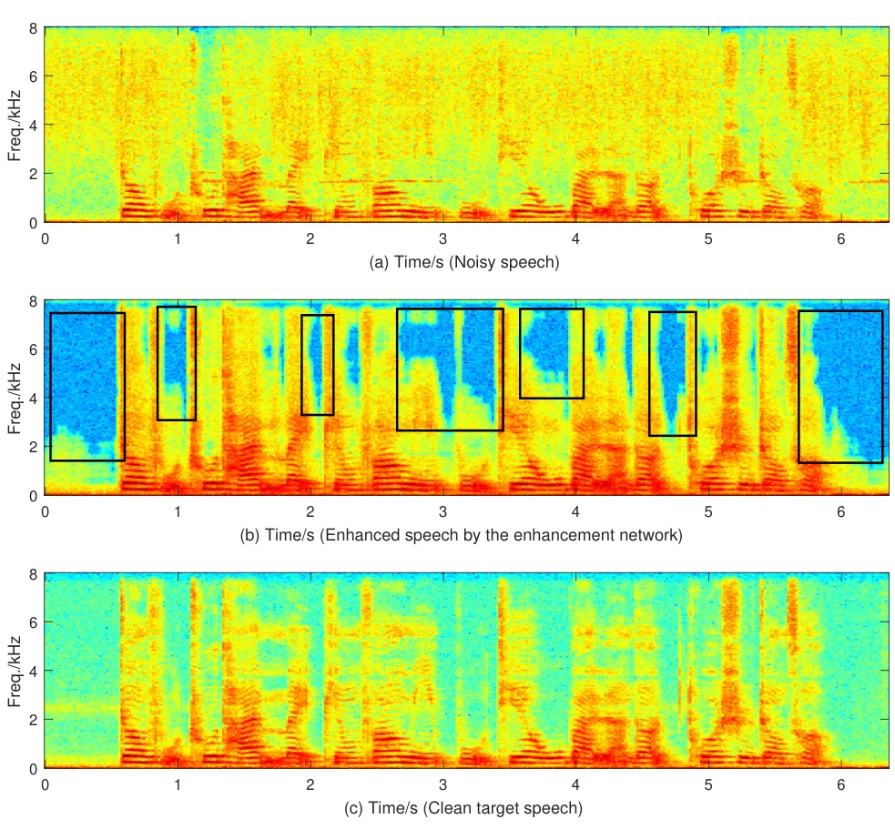
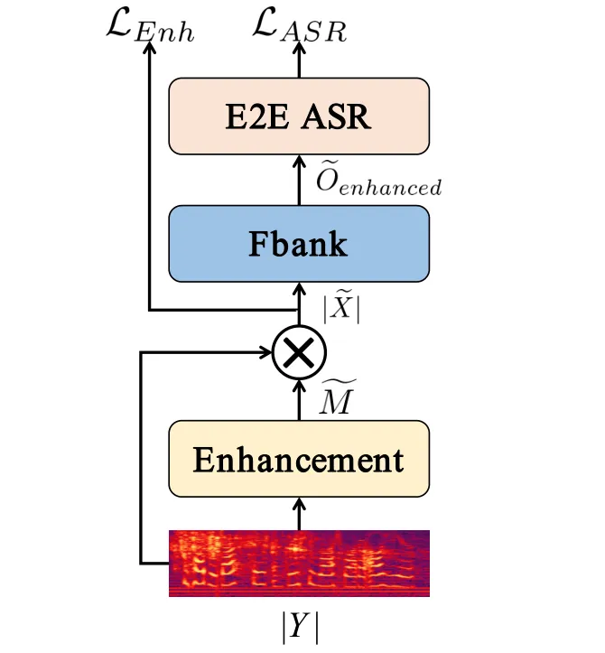
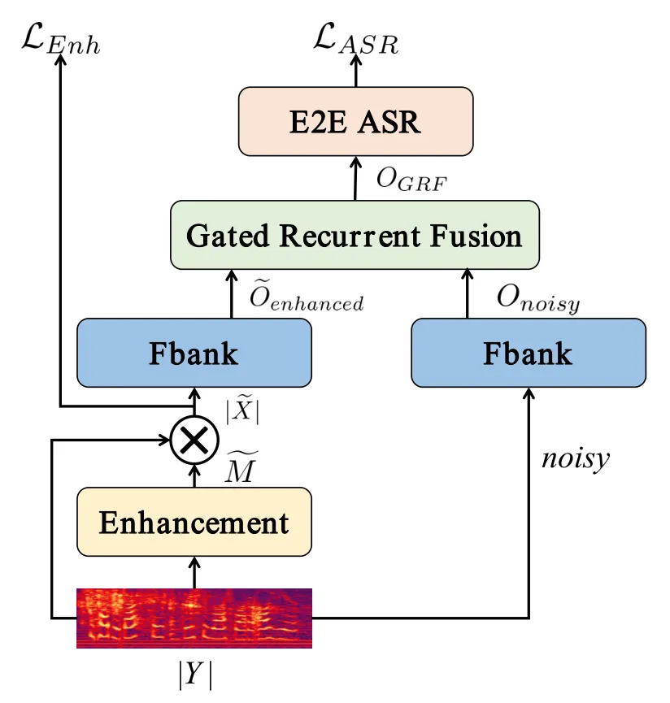

# Gated Recurrent Fusion with Joint Training Framework for Robust End-to-End Speech Recognition

Cunhang Fan    Jiangyan Yi    Jianhua Tao    Zhengkun Tian    Bin Liu   
and Zhengqi Wen ^(†)^(†)thanks: This work is supported by the National
Key Research & Development Plan of China (No.2017YFC0820602) and the
National Natural Science Foundation of China (NSFC) (No.61425017,
No.61831022, No.61773379, No.61771472), and Inria-CAS Joint Research
Project (No.173211KYSB20170061)._(Corresponding authors: Jiangyan Yi and
Jianhua Tao.)_^(†)^(†)thanks: The authors are with the National
Laboratory of Pattern Recognition, Institute of Automation, Chinese
Academy of Sciences, Beijing 100190, China. Cunhang Fan, Jianhua Tao and
Zhengkun Tian are also with the School of Artificial Intelligence,
University of Chinese Academy of Sciences, Beijing 100190, China.
Jianhua Tao is also with the CAS Center for Excellence in Brain Science
and Intelligence Technology, Beijing 100190, China.
(e-mail:cunhang.fan@nlpr.ia.ac.cn, jiangyan.yi@nlpr.ia.ac.cn,
jhtao@nlpr.ia.ac.cn, zhengkun.tian@nlpr.ia.ac.cn, liubin@nlpr.ia.ac.cn,
zqwen@nlpr.ia.ac.cn)

###### Abstract

The joint training framework for speech enhancement and recognition
methods have obtained quite good performances for robust end-to-end
automatic speech recognition (ASR). However, these methods only utilize
the enhanced feature as the input of the speech recognition component,
which are affected by the speech distortion problem. In order to address
this problem, this paper proposes a gated recurrent fusion (GRF) method
with joint training framework for robust end-to-end ASR. The GRF
algorithm is used to dynamically combine the noisy and enhanced
features. Therefore, the GRF can not only remove the noise signals from
the enhanced features, but also learn the raw fine structures from the
noisy features so that it can alleviate the speech distortion. The
proposed method consists of speech enhancement, GRF and speech
recognition. Firstly, the mask based speech enhancement network is
applied to enhance the input speech. Secondly, the GRF is applied to
address the speech distortion problem. Thirdly, to improve the
performance of ASR, the state-of-the-art speech transformer algorithm is
used as the speech recognition component. Finally, the joint training
framework is utilized to optimize these three components,
simultaneously. Our experiments are conducted on an open-source Mandarin
speech corpus called AISHELL-1. Experimental results show that the
proposed method achieves the relative character error rate (CER)
reduction of 10.04% over the conventional joint enhancement and
transformer method only using the enhanced features. Especially for the
low signal-to-noise ratio (0 dB), our proposed method can achieves
better performances with 12.67% CER reduction, which suggests the
potential of our proposed method.

###### Index Terms: 

Robust end-to-end speech recognition, speech transformer, speech
enhancement, gated recurrent fusion, speech distortion.

## I Introduction

There are many methods for automatic speech recognition (ASR) systems,
such as GMM-HMM and deep neural network (DNN) based acoustic models \[1,
2, 3, 4\]. Recently, end-to-end speech recognition methods \[5, 6, 7, 8,
9, 10, 11\] have made significantly breakthroughs. Although these ASR
methods have made a lot of progresses on clean speech signals, the
performance could be dramatically degraded in the noisy and
reverberation environments. In realistic environments, recorded speech
signals are always interfered by various background noises and
reverberations. Therefore, improving the robustness of ASR is very
important. This paper focuses on boosting the noise robustness of
end-to-end speech recognition.

In order to boost the noise robustness of ASR, there are three
mainstream methods. The first mainstream method is adding the speech
enhancement component at the front-end of ASR. Speech enhancement
methods include spectral subtraction \[12\], Wiener filtering \[13\] and
deep neural network (DNN) based speech enhancement methods \[14, 15, 16,
17, 18, 19\]. However, speech enhancement optimizes their models to
estimate the target speech, which is different from the speech
recognition part. Therefore, speech enhancement methods fail to optimize
towards the final objective, which leads to a suboptimal solution
\[20\]. In addition, the enhanced speech by these speech enhancement
methods usually generates over-smoothed speech, which is the reason of
speech distortion after speech enhancement. The speech distortion can
degrade the performance of ASR \[21\]. Therefore, the performance of
this approach is highly dependent on the performance of the enhancement
front-end \[22\].

The second mainstream method uses the multi-condition training (MCT) to
boost the noise robustness of ASR. MCT uses different kinds of data
(clean and noisy speech) to train the speech recognition model. However,
the complexity and computing costs of MCT are increased. In addition, it
gives unimpressive performance on the unmatched conditions \[23\] and
the performance is also affected by the speech distortion \[24\]. In
order to alleviate speech distortion problem, the enhancement front-end
enhances both training and test set first, and ASR model is trained with
the enhanced data. It can improve the ASR performance in some degree,
but it still highly depends on the performance of the enhancement
front-end. Different from the MCT method, the SpecAugment \[25\]
directly applies the data augmentation to the input features of neural
networks (i.e., filter bank coefficients). The SpecAugment is used only
during the training, which consists of three spectrogram deformations:
time warping, time and frequency masking. Although the SpecAugment can
improve the performance of end-to-end ASR, it needs to be improved on
the noisy condition.

The third mainstream method is the joint training methods \[21, 26, 27,
28\]. These methods apply the joint training framework to optimize the
speech enhancement and recognition, simultaneously. The reason is that
speech enhancement and speech recognition are not two independent tasks
and they can clearly benefit from each other. In order to boost noise
robustness of end-to-end ASR, in \[26\], authors propose a joint
adversarial enhancement training method. They utilize the joint training
framework to optimize the mask based enhancement network and attention
based encoder-decoder speech recognition network. However, this method
only uses the enhanced feature as the input of speech recognition, which
is still affected by the speech distortion problem. In addition, in the
noisy AISHELL-1 \[29\] dataset, the character error rate (CER) of this
method is still more than 50%, which needs to be improved. As for the
end-to-end speech recognition, speech transformer \[7, 8, 9, 10\] models
have shown impressive performance and acquired state-of-the-art results.
Self-attention network \[30\] is one of the key components of speech
transformer and it is more powerful to model long-term dependencies than
recurrent neural networks (RNNs) based sequence to sequence models.
Therefore, applying the joint training of enhancement and speech
transformer can further improve the performance of robust end-to-end
ASR.

In \[19\], a one-pass robust speech recognition method is proposed. It
combines the noisy and enhanced features by a gating mechanism. Although
it can improve the robust of ASR, the enhancement and speech recognition
are trained separately instead of the joint training algorithm. In
addition, the simple gate mechanism can not make full use of the
sequence information so that it can not fuse the noisy and enhanced
features very well.

Fig. 1 illustrates the spectrogram example of a test speech sample. From
Fig. 1 we can find that the spectrogram of the enhanced speech by the
enhancement network has significant leaks (marked in Fig. 1 (b) by block
boxes), which leads to the speech distortion. There are significant
leaks in these black boxes. This is because that the noise is dominant
in these T-F bins, which drowns the target speech. Therefore, the
enhancement network deals with these T-F bins as the noise signals and
removes most of the information. These leaks lose so much very important
speech information, for example: formants. Although the enhancement
network can remove noise signals in some degree, these leaks are unknown
for the speech recognition system and lose so much speech information.
These are the reasons why speech distortion damages the performance of
speech recognition.

In this paper, we propose a gated recurrent fusion (GRF) with joint
training framework for robust end-to-end ASR. In order to address the
speech distortion problem, motivated by \[31, 32\], the GRF is utilized
to dynamically combine the noisy and enhanced features. Therefore, the
GRF can offset these leaks from the noisy features. In addition, GRF can
reduce the noise from the enhanced features. So the GRF aims to learn to
adaptively select and fuse the relevant information from noisy and
enhanced features by making full use of the gate and memory modules. The
GRF can extract more appropriate and robust speech features. In
addition, we apply the joint training algorithm to optimize the
enhancement and speech recognition. The state-of-the-art end-to-end ASR
method speech transformer with self-attention method is used as the
speech recognition component. Specifically, the proposed joint training
method includes three parts: speech enhancement, gated recurrent fusion
and speech recognition. With the joint optimization of enhancement and
recognition, the proposed model is expected to learn more robust
representations suitable for the recognition task automatically.

To summarize, the main contribution of this paper is two-fold. Firstly,
to address the speech distortion problem, the gated recurrent fusion
algorithm is utilized to dynamically fuse the noisy and enhanced
features. Secondly, to the best of our knowledge, it is the first time
to apply the speech transformer and single channel speech enhancement
for the joint training framework. Our experiments are conducted on
AISHELL-1 Mandarin dataset. Experimental results show that the proposed
method achieves the relative CER reduction of 10.02% over the
conventional joint enhancement and transformer method using the enhanced
features only. Especially for the low signal-to-noise ratios, our
proposed method can achieve better performance.

The rest of this paper is organized as follows. Section $`\rm II`$
presents the conventional joint training method for robust ASR. Section
$`\rm III`$ introduces our proposed joint training method with gated
recurrent fusion algorithm. The experimental setup is stated in section
$`\rm IV`$. Section $`\rm V`$ shows experimental results. Section
$`\rm VI`$ shows the discussions. Section $`\rm VII`$ draws conclusions.



Fig. 1: The spectrogram example of a test speech sample. (a) The noisy
speech. (b) The enhanced speech by the enhancement network, which is
without the joint training. (c) The clean target speech.

## II Conventional joint training method



Fig. 2: The schematic diagram of conventional joint training method for
robust end-to-end ASR.

Fig. 2 illustrates the schematic diagram of conventional joint training
method for robust end-to-end ASR. It usually consists of a enhancement
network and an end-to-end ASR network.

Speech enhancement aims to remove the noise signals and estimate the
target clean speech from noisy input. The noisy speech can be
represented as:

```math
y(t)=x(t)+n(t) \tag{1}
```

where $`y(t)`$, $`x(t)`$ and $`n(t)`$ denote the noisy, clean and noise
signals, respectively. We apply the $`Y(t,f)`$, $`X(t,f)`$ and
$`N(t,f)`$ as the corresponding short-time Fourier transformation (STFT)
of noisy, clean and noise signals, which still satisfy this relation:

```math
Y(t,f)=X(t,f)+N(t,f) \tag{2}
```

where $`(t,f)`$ denotes the index of time-frequency (T-F) bins. We drop
the $`(t,f)`$ in the rest of this paper.

The noisy magnitude spectrum $`|Y|`$ is used as the input feature. The
conventional joint training robust end-to-end ASR system can be
represented as follows:

```math
|\widetilde{X}|=\rm Enhancement(|Y|) \tag{3}
```

```math
\widetilde{O}_{enhanced}=\rm Fbank(|\widetilde{X}|) \tag{4}
```

```math
\mathcal{L}_{ASR}=-lnP(S^{*}|\widetilde{O}_{enhanced}) \tag{5}
```

where, the $`\rm Enhancement(\cdot)`$ denotes the speech enhancement
function, which aims to estimate the clean target speech from the noisy
input $`|Y|`$. $`|\widetilde{X}|`$ is the enhanced speech. The
$`\rm Fbank(\cdot)`$ denotes the function to extract Fbank features,
which transforms the $`|\widetilde{X}|`$ to
$`\widetilde{O}_{enhanced}`$. The $`\mathcal{L}_{ASR}`$ is the loss
function of end-to-end ASR. The posterior probabilities
$`P(S^{*}|\widetilde{O}_{enhanced})`$ of output labels $`S^{*}`$ are
estimated from the enhanced Fbank features $`\widetilde{O}_{enhanced}`$.

As for the conventional joint training method, it includes two parts:
the speech enhancement component and the speech recognition component.
Firstly, the noisy and clean parallel data are used to train the speech
enhancement model. Secondly, only the enhanced speech is utilized as the
input feature of speech recognition model. Finally, the total loss of
enhancement and speech recognition is applied to optimize the whole
model. Therefore, the enhancement and ASR models can be jointly trained.
However, this method only applies the enhanced feature as the input of
speech recognition model, which is still affected by the speech
distortion problem in some degree.

## III Our proposed joint training method

Fig. 3 illustrates the schematic diagram of our proposed gated recurrent
fusion (GRF) with joint training framework for robust end-to-end ASR. It
includes a mask-based speech enhancement network, a GRF network and an
end-to-end ASR network. Firstly, the noisy magnitude spectrum $`|Y|`$ is
enhanced by the speech enhancement network. Secondly, the GRF is applied
to extract GRF representations. Then these GRF representations are used
as the input of end-to-end ASR network. Finally, we use a jointly
compositional scheme to optimize the whole model, whose parameters are
updated by stochastic gradient descent.



Fig. 3: The schematic diagram of our proposed joint training method for
robust end-to-end ASR. To further alleviate speech distortion problem,
our proposed method applies the gated recurrent fusion algorithm to
combine the noisy and enhanced features.

Specifically, we use the state-of-the-art end-to-end ASR method speech
transformer as the end-to-end speech recognition component. In addition,
to address the speech distortion problem, the GRF component is utilized
to dynamically combine the noisy and enhanced features. Therefore, these
GRF representations can learn the raw fine structures from the noisy
features to alleviate the speech distortion. Meanwhile, they can also
remove the noise signals from the enhanced features.

(a) The overall schematic diagram of GRF

(b) GRF block

Fig. 4: (a) The overall schematic diagram of GRF, which fuses the noisy
and enhanced features to address the speech distortion problem. (b) The
schematic diagram of GRF block.

### III-A Mask-based enhancement network

As for speech separation task, it is well known that mask-based speech
separation can obtain a better result \[33, 34, 35, 36, 37, 38\].
Similarly, we apply the mask $`M`$ for speech enhancement.

The main task of mask-based speech enhancement network is to estimate
the target mask for each T-F bin. Then the estimated mask is applied to
the noisy input to acquire the clean target speech. Because the Fbank
features have nothing to do with the phase spectrums. In this paper, we
utilize the ideal amplitude mask (IAM) \[39\] rather than the phase
sensitive mask (PSM) \[40\] for speech enhancement. The IAM is defined
as follows:

```math
M_{IAM}=\frac{|X|}{|Y|} \tag{6}
```

For training, we use the spectrum approximation (SA) as the training
objective function. Therefore, the loss function of speech enhancement
$`\mathcal{L}_{Enh}`$ can be defined as follows:

```math
\mathcal{L}_{Enh}=\frac{1}{TF}\sum||\widetilde{M}\odot{|Y|}-|X|||_{F}^{2} \tag{7}
```

where, $`\widetilde{M}`$ is the estimated mask. The $`\odot`$ denotes
point-wise matrix multiplication. At the test stage, when the estimated
mask $`|\widetilde{M}|`$ is acquired by the trained enhancement network,
we can estimate the enhanced magnitude spectrum $`|\widetilde{X}|`$ by
multiplying the $`|\widetilde{M}|`$ the noisy spectrum $`|Y|`$:

```math
|\widetilde{X}|=\widetilde{M}\odot{|Y|} \tag{8}
```

After the enhancement component, the Fbank features can be extracted
from the STFT features by using the log Mel filterbank.

The enhanced and noisy Fbank features can be extracted as the follows:

```math
\widetilde{O}_{enhanced}=log(Mel(|\widetilde{X}|)) \tag{9}
```

```math
{O}_{noisy}=log(Mel(|Y|)) \tag{10}
```

where $`\widetilde{O}_{enhanced}`$ and $`{O}_{noisy}`$ denote the
enhanced and noisy Fbank features, respectively. $`Mel(\cdot)`$ is the
operation of Mel matrix multiplication. From Eq. 9 and Eq. 10 we can
know that the Fbank feature extraction procedure used as a layer of
network is differentiable.

### III-B Gated recurrent fusion network

The conventional joint training method \[26\] only uses the enhanced
features for the speech recognition component, which is still affected
by the speech distortion problem. In order to address this problem and
extract more robust features for ASR, we apply the gated recurrent
fusion algorithm \[31\] to combine the noisy and enhanced features.
Therefore, the raw fine structures from the noisy features can be
learned to alleviate the speech distortion. In addition, noise signals
can be also removed from the enhanced features.

As for the GRF network, we firstly use two parallel bidirectional
long-short term memory (BLSTM) $`B(\cdot)`$ networks to extract deep
representations for enhanced ($`\widetilde{O}_{enhanced}`$) and noisy
($`{O}_{noisy}`$) Fbank features, respectively. We denote them as
$`{\bm{\beta}}_{enhanced}`$ (for enhanced representations) and
$`\bm{\beta}_{noisy}`$ (for noisy representations):

```math
{\bm{\beta}}_{enhanced}=B(\widetilde{O}_{enhanced}) \tag{11}
```

```math
\bm{\beta}_{noisy}=B({O}_{noisy}) \tag{12}
```

We apply the GRF to fuse the noisy and enhanced features. The gate
structure in gated recurrent unit (GRU) \[41\] enables the selective
fusion of multi-modal features. In this paper, we extend the GRU as our
GRF block and modify it to fit the feature fusion.

Fig. 4(a) shows the overall schematic diagram of GRF and Fig. 4(b) shows
the schematic diagram of GRF block. As shown in Fig. 4(b), at first step
(left), GRF block takes one of the noisy features $`\bm{\beta}_{noisy}`$
as input. The outputs of this step will be used as the hidden state.
Then, in the second step (right), GRF block applies the enhanced
features $`{\bm{\beta}}_{enhanced}`$ as input. These two steps reuse the
GRF block and share the same set of parameters. The GRF block consists
of a reset gate, a update gate, a adaptive memory and a selective
fusion. Next, we will utilize the first step with noisy feature
$`\bm{\beta}_{noisy}`$ as an example to explain in detail the principle
and work flow of the GRF block.

At the first step of fusion between noisy features
$`\bm{\beta}_{noisy}`$ and enhanced features
$`{\bm{\beta}}_{enhanced}`$, that is p = 1, we randomly initialize the
hidden state $`h_{0}`$.

Reset Gate As for the reset gate, at step p, the hidden state $`h_{p}`$
and the noisy input $`\bm{\beta}_{noisy}`$ together to decide the status
of the reset gate r by

```math
\textbf{{r}}=\sigma(W_{r},(\bm{\beta}_{noisy},h_{p})) \tag{13}
```

where $`\sigma`$ denotes the sigmoid function, $`W_{r}`$ is the weight
of reset gate.

Update Gate The update gate z is also decided by the hidden state
$`h_{p}`$ and noisy input $`\bm{\beta}_{noisy}`$.

```math
\textbf{{z}}=\sigma(W_{z},(\bm{\beta}_{noisy},h_{p})) \tag{14}
```

where $`W_{z}`$ is the weight of update gate.

Adaptive Memory As for adaptive memory, through the element-wise product
$`\odot`$, the reset gate r determines how much information in the past
needs to be “memorized”.

```math
h_{p}^{{}^{\prime}}=\textbf{{r}}\odot{h_{p}} \tag{15}
```

```math
h_{p}^{c}=tanh(W_{h}(\bm{\beta}_{noisy},h_{p}^{{}^{\prime}})) \tag{16}
```

where $`h_{p}^{c}`$ acts similarly to the memory cell in the LSTM and
helps the GRF block to remember long term information within the
multi-stage fusion.

Selective Fusion The selective fusion aims to combine the noisy input
$`\bm{\beta}_{noisy}`$ and the hidden state $`h_{p}`$. The fusion result
at step $`p`$ is

```math
h_{q}=\textbf{{z}}\odot{h_{p}}+(1-\textbf{{z}})\odot{h_{p}^{c}} \tag{17}
```

In this way, the forget gate z and the input gate $`(1-\textbf{{z}})`$
are linked. That is, if the previous information is ignored with a
weight of z, then the information for the current input $`h_{p}^{c}`$
would be selected with a weight of $`(1-\textbf{{z}})`$.

For the one GRF stage, at step 1, we randomly initialize the hidden
state. Then the noisy input $`\bm{\beta}_{noisy}`$ is fed into the GRF
block to acquire the output $`h_{1}`$. Next, at step 2, the same
structure and parameters are reused in the GRF block. The input hidden
state is replaced by h1, and the input is replaced by the enhanced
features $`\bm{\beta}_{enhanced}`$, which is shown in Fig. 4(b).

In this paper, we use the 4-stage GRF. After the 4-stage GRF, we can
acquire the fusion features: $`f^{GRF}=h_{p}`$. Finally, these fusion
features $`f^{GRF}`$, noisy and enhanced deep representations
$`\bm{\beta}_{noisy}`$ and $`\bm{\beta}_{enhanced}`$ are used as the GRF
features $`O_{GRF}`$:

```math
O_{GRF}=\rm Concat(\bm{\beta}_{noisy},\emph{f}^{GRF},\bm{\beta}_{enhanced}) \tag{18}
```

These GRF features $`O_{GRF}`$ are used as the input of end-to-end ASR
speech transformer.

### III-C Speech transformer network

In this paper, we apply the state-of-the-art end-to-end ASR method
speech transformer with self-attention as our speech recognition
component. In this subsection, the end-to-end speech recognition by
speech transformer is described.

Different from the RNNs, speech transformer utilizes the scaled
dot-product attention to map the input sequence, which consists of three
inputs queries $`Q`$, keys $`K`$, and values $`V`$ with dimension
$`d_{q}`$, $`d_{k}`$ and $`d_{v}`$. The outputs of scaled dot-product
attention can be defined as follows:

```math
\rm Attention(Q,K,V)=\rm softmax(\frac{QK^{T}}{\sqrt{d_{k}}})V \tag{19}
```

The multi-head attention (MHA) is defined as follows:

```math
\rm MHA(Q,K,V)=\rm Concat(head_{1},...,head_{h})W_{i}^{O} \tag{20}
```

```math
\rm where\ head_{i}=Attention(QW_{i}^{Q},KW_{i}^{K},VW_{i}^{V}) \tag{21}
```

Where the projections are parameter matrices
$`W_{i}^{Q}\in{\mathbb{R}^{d_{m}\times{d_{q}}}},W_{i}^{K}\in{\mathbb{R}^{d_{m}\times{d_{k}}}},W_{i}^{V}\in{\mathbb{R}^{d_{m}\times{d_{v}}}}`$
and $`W_{i}^{O}\in{\mathbb{R}^{hd_{v}\times{d_{m}}}}`$. $`h`$ is the
number of heads.

The position-wise feed forward network (FFN) includes two linear
transformations and a ReLU activation function in between.

```math
FFN(x)=max(0,xW_{1}+b_{1})W_{2}+b_{2} \tag{22}
```

where $`x`$, $`W_{1}\in{\mathbb{R}^{d_{m}\times{d_{f}}}}`$,
$`b_{1}\in{\mathbb{R}^{d_{m}}}`$,
$`W_{2}\in{\mathbb{R}^{d_{f}\times{d_{m}}}}`$ and
$`b_{2}\in{\mathbb{R}^{d_{m}}}`$ are learnable parameters. In oder to
make full use of the order of sequence, the sine and consine positional
embedding are applied \[30\].

Based on the cross-entropy criterion, the loss function of end-to-end
speech recognition is defined as follows:

```math
\mathcal{L}_{ASR}=-lnP(S^{*}|O_{GRF}) \tag{23}
```

where $`S^{*}`$ is the ground truth of a whole sequence of output
labels.

### III-D Joint training

The proposed system consists of three parts: the speech enhancement
network, the gated recurrent fusion network and speech transformer
network. By the joint training, these three parts are optimized
simultaneously. It means that the parameters of these three parts are
updated by stochastic gradient descent.

The loss function of the joint training is defined as follows:

```math
\mathcal{L}=\mathcal{L}_{ASR}+\alpha\mathcal{L}_{Enh} \tag{24}
```

Where the hyperparameter $`\alpha`$ controls enhancement loss
$`\mathcal{L}_{Enh}`$.

## IV Experiments and Results

### IV-A Dataset

Our experiments are conducted on an open-source Mandarin speech corpus
called AISHELL-1 \[29\]. The AISHELL-1 consists of 400 speakers and over
170 hours of Mandarin speech data. The dataset includes three sets:
training set, development set and test set. The training set contains
about 150 hours with 120,098 utterances recorded by 340 speakers (161
males and 179 females). The development set contains about 10 hours with
14,326 utterance recorded by 40 speakers (12 males and 28 females) and
test set contains about 5 hours with 7,176 utterances recorded by 20
speakers (13 males and 7 females). For each speaker, around 360
utterances (about 26 minutes of speech) are released. Table I shows the
summary of all subsets in the AISHELL-1. The sampling rate of AISHELL-1
is 16000 Hz.

The noisy training set is generated by selecting each utterance from the
AISHELL-1 training set. They are mixed with 100 Nonspeech Sounds noise
database ¹¹ 1
http://web.cse.ohio-state.edu/pnl/corpus/HuNonspeech/HuCorpus.html at
signal-to-noise ratios (SNRs) randomly sampled between \[0dB, 20dB\].
For the test and development set, the 100 Nonspeech noises and NOISE-92
corpus noises \[42\] are used to mix with the clean test set of
AISHELL-1 with 5 different SNRs each 0dB, 5dB, 10dB, 15dB and 20dB. We
also test our model on the development set and the configurations of it
are the same as the test set. Detailed configurations are listed in
Table II.

| Subset      | Duration(hrs) | \#Sentences | \#Male | \#Female |
| ----------- | ------------- | ----------- | ------ | -------- |
| Training    | 150           | 120098      | 161    | 179      |
| Development | 10            | 14326       | 12     | 28       |
| Test        | 5             | 7200        | 13     | 7        |

TABLE I: The data structure of Mandarin speech corpus AISHELL-1. “hrs“
means the hours of each set.

[TABLE]

TABLE II: The data structure of our training set for the speech
enhancement, MCT and the joint training methods.

### IV-B Experimental setup

For speech enhancement network, the 257-dim amplitude spectrum of the
noisy speech are used as input features, which are computed by using a
STFT with 32 ms length hamming window and 16 ms window shift. To acquire
a quite better enhancement performance, three BLSTM layers with 512
nodes are used as the speech enhancement network. And a linear layer
with the ReLU activation function is connected to the last BLSTM layer
(mask layer), whose output size is equal to the input size. The aim of
the ReLU activation function is to estimate the amplitude mask of the
clean target speech. In addition, the enhancement network contains
random dropouts with a dropout rate 0.5.

The Fbank extraction network is a linear layer to convert the STFT
features to Fbank features, which operates $`257\times 80`$ matrix
multiplication. After the matrix multiplication, we also do the
logarithmic operation. The dimension of the Fbank features is 80. From
the Eq. 9 and Eq. 10 we can know that the Fbank feature extraction
procedure used as a layer of network is differentiable. Therefore, the
enhancement network and end-to-end ASR can be jointly trained.

For gated recurrent fusion network, we firstly utilize two parallel
BLSTM networks with two layers and 320 nodes to extract
$`{\bm{\beta}}_{enhanced}`$ (for enhanced representations) and
$`{\bm{\beta}}_{noisy}`$ (for noisy representations). The GRF network
also contains random dropouts with a dropout rate 0.5. Finally, a linear
layer with the ReLU activation function is connected to the GRF
representations $`{O}_{GRF}`$, whose output size is 320. Therefore, the
dimension of the GRF representations $`{O}_{GRF}`$ is 320.

For speech transformer network, we use 6 self-attention blocks as
encoder and 6 self-attention blocks as prediction network. We take
$`(d_{k},h,d_{f})=(512,4,1024)`$. Before the Transformer encoder, the
GRF representations $`{O}_{GRF}`$ are encoded by two convolutional
neural network (CNN) blocks. The CNN layers have a kernel size of
$`3\times 3`$. We chose 4232 characters (including ’blank’ and ’unk’
labels) as output labels.

As for the SpecAugment, we set the time mask with 15 and frequency mask
with 27.

All our models optimized in the same method as \[9\]. And we set warm up
steps to 8000 and the factor of learning rate to 0.5. During decoding,
we use beam search with width of 5 for all the experiments. Our models
are implemented using Pytorch deep learning framework ²² 2 Available
online at https://pytorch.org/.

Before joint training the whole model, the enhancement component is
initialized by the speech enhancement network and the ASR model is
initialized by the model trained by clean data.

| Model name                   | Annotations                                                                                                                                                                    |
| ---------------------------- | ------------------------------------------------------------------------------------------------------------------------------------------------------------------------------ |
| E2E_ASR-clean                | Speech transformer system trained by clean data.                                                                                                                               |
| E2E_ASR-SpecAugment          | Speech transformer system trained by SpecAugment algorithm.                                                                                                                    |
| E2E_ASR-MCT                  | Speech transformer system trained by multi-condition training (MCT) algorithm.                                                                                                 |
| E2E_ASR-MCT-SpecAugment      | Speech transformer system trained by SpecAugment and MCT algorithm, simultaneously                                                                                             |
| Joint-Enhance-E2E_ASR        | The model is trained by applying the conventional joint training method, which only uses the enhanced features as the input of speech transformer.                             |
| Joint-Enhance-E2E_ASR-concat | The model is trained by the joint training framework, which uses the concatenated $`{\bm{\beta}}_{enhanced}`$ and $`{\bm{\beta}}_{noisy}`$ as the input of speech transformer. |
| Joint-Enhance-E2E_ASR-GRF    | The model is trained by the joint training framework, which applies the GRF to fuse the noisy and enhanced features.                                                           |

TABLE III: The annotations of different models.

|                         |                            |       |       |       |       |       |       |
| ----------------------- | -------------------------- | ----- | ----- | ----- | ----- | ----- | ----- |
| Speech transformer      | CER Results(%) on Test Set |       |       |       |       |       |       |
| 0dB                     | 5dB                        | 10dB  | 15dB  | 20dB  | AVG.  | clean |       |
| E2E_ASR-clean           | 107.03                     | 72.71 | 45.49 | 26.37 | 18.01 | 53.33 | 10.74 |
| E2E_ASR-SpecAugment     | 68.44                      | 43.74 | 25.89 | 14.97 | 11.59 | 32.55 | 8.78  |
| E2E_ASR-MCT             | 27.92                      | 19.13 | 14.72 | 11.96 | 10.36 | 16.71 | 9.64  |
| E2E_ASR-MCT-SpecAugment | 24.43                      | 16.85 | 14.11 | 11.16 | 9.66  | 15.14 | 9.30  |

TABLE IV: CER results of speech transformer system trained by clean
data, SpecAugment and multi-condition training (MCT) without the
enhancement on the test set.

|                         |                                   |       |       |       |       |       |       |
| ----------------------- | --------------------------------- | ----- | ----- | ----- | ----- | ----- | ----- |
| Speech transformer      | CER Results(%) on Development Set |       |       |       |       |       |       |
|                         | 0dB                               | 5dB   | 10dB  | 15dB  | 20dB  | AVG.  | clean |
| E2E_ASR-clean           | 98.30                             | 62.64 | 37.15 | 21.81 | 14.76 | 46.81 | 9.10  |
| E2E_ASR-SpecAugment     | 63.01                             | 38.07 | 21.56 | 13.51 | 10.36 | 29.24 | 7.96  |
| E2E_ASR-MCT             | 25.26                             | 16.11 | 12.16 | 10.09 | 9.22  | 14.55 | 8.51  |
| E2E_ASR-MCT-SpecAugment | 21.76                             | 14.44 | 11.13 | 9.92  | 9.24  | 13.28 | 8.44  |

TABLE V: CER results of speech transformer system trained by clean data,
SpecAugment and MCT without the enhancement on the development set.

|                         |                                     |       |       |       |       |       |       |
| ----------------------- | ----------------------------------- | ----- | ----- | ----- | ----- | ----- | ----- |
| Speech transformer      | CER Results(%) on Enhanced Test Set |       |       |       |       |       |       |
|                         | 0dB                                 | 5dB   | 10dB  | 15dB  | 20dB  | AVG.  | clean |
| E2E_ASR-clean           | 44.11                               | 29.85 | 20.12 | 14.75 | 12.51 | 24.06 | 14.23 |
| E2E_ASR-SpecAugment     | 34.82                               | 22.22 | 15.50 | 11.45 | 10.02 | 18.64 | 11.21 |
| E2E_ASR-MCT             | 28.74                               | 18.82 | 14.18 | 11.63 | 10.37 | 16.63 | 12.73 |
| E2E_ASR-MCT-SpecAugment | 27.04                               | 18.01 | 13.88 | 10.80 | 9.56  | 15.74 | 11.38 |

TABLE VI: CER results of speech transformer system trained by clean
data, SpecAugment and MCT on the enhanced test set. The clean and noisy
test data all are enhanced by the speech enhancement model to remove the
noise signals.

|                         |                                            |       |       |       |       |       |       |
| ----------------------- | ------------------------------------------ | ----- | ----- | ----- | ----- | ----- | ----- |
| Speech transformer      | CER Results(%) on Enhanced Development Set |       |       |       |       |       |       |
|                         | 0dB                                        | 5dB   | 10dB  | 15dB  | 20dB  | AVG.  | clean |
| E2E_ASR-clean           | 37.81                                      | 24.13 | 16.36 | 12.34 | 10.60 | 20.21 | 11.84 |
| E2E_ASR-SpecAugment     | 30.62                                      | 18.87 | 12.82 | 10.19 | 9.15  | 16.31 | 9.95  |
| E2E_ASR-MCT             | 24.32                                      | 15.52 | 11.34 | 9.95  | 9.00  | 14.01 | 10.99 |
| E2E_ASR-MCT-SpecAugment | 23.37                                      | 14.92 | 11.21 | 9.77  | 9.17  | 13.67 | 10.13 |

TABLE VII: CER results of speech transformer system trained by clean
data, SpecAugment and MCT on the enhanced development set.

In the following results, the character error rate (CER) is applied to
quantify the system performance. ”clean” refers to the original clean
AISHELL-1 test and development set. ”0dB, 5dB, 10dB, 15dB and 20dB”
denote the different SNR conditions of the test and development set.
”AVG.” means the average result of these SNRs.

Speech transformer method is more powerful to model long-term
dependencies than RNNs-based sequence to sequence models. In addition,
it is the state-of-the-art method for end-to-end speech recognition.
Therefore, we apply the speech transformer as end-to-end ASR model for
all of the speech recognition component.

### IV-C Evaluation of the end-to-end ASR without the enhancement

Table IV and Table V show the results of speech transformer trained by
clean data, SpecAugment and MCT on the test and development set,
respectively. We use the clean and noisy test data (without enhancement
for the test and development data) to test the ASR models. The
E2E_ASR-clean means that only the clean data is applied to train the
speech transformer model. The E2E_ASR-SpecAugment denotes that the
speech transformer model is trained by SpecAugment algorithm. And the
E2E_ASR-MCT denotes that the speech transformer model is trained by the
multi-condition training method, which uses both the clean and generated
noisy speech data. The E2E_ASR-MCT-SpecAugment denotes that the speech
transformer model is trained by the MCT and SpecAugment algorithm,
simultaneously. Table III shows the annotations of different models.

|                         |                                          |       |       |       |       |       |       |
| ----------------------- | ---------------------------------------- | ----- | ----- | ----- | ----- | ----- | ----- |
| Speech transformer      | CER Results(%) on Test Set with SNR Data |       |       |       |       |       |       |
|                         | 0dB                                      | 5dB   | 10dB  | 15dB  | 20dB  | AVG.  | clean |
| E2E_ASR-clean           | 99.91                                    | 68.33 | 42.82 | 24.84 | 17.39 | 50.11 | 10.73 |
| E2E_ASR-SpecAugment     | 64.41                                    | 40.44 | 23.97 | 14.36 | 11.30 | 30.55 | 8.73  |
| E2E_ASR-MCT             | 26.44                                    | 18.44 | 14.41 | 11.77 | 10.32 | 16.17 | 9.68  |
| E2E_ASR-MCT-SpecAugment | 23.25                                    | 16.34 | 13.77 | 11.00 | 9.57  | 14.70 | 9.34  |

TABLE VIII: CER results of speech transformer system trained by clean
data, SpecAugment and MCT on the test set with SNR to fuse the original
and enhanced data.

|                         |                                                 |       |       |       |       |       |       |
| ----------------------- | ----------------------------------------------- | ----- | ----- | ----- | ----- | ----- | ----- |
| Speech transformer      | CER Results(%) on Development Set with SNR Data |       |       |       |       |       |       |
|                         | 0dB                                             | 5dB   | 10dB  | 15dB  | 20dB  | AVG.  | clean |
| E2E_ASR-clean           | 92.28                                           | 57.44 | 34.47 | 20.61 | 14.06 | 43.67 | 9.12  |
| E2E_ASR-SpecAugment     | 58.74                                           | 35.17 | 20.01 | 12.89 | 10.25 | 27.35 | 7.96  |
| E2E_ASR-MCT             | 24.01                                           | 15.50 | 11.94 | 10.04 | 9.17  | 14.11 | 8.50  |
| E2E_ASR-MCT-SpecAugment | 20.62                                           | 13.93 | 10.99 | 9.89  | 9.20  | 12.91 | 8.44  |

TABLE IX: CER results of speech transformer system trained by clean
data, SpecAugment and MCT on the development set with SNR to fuse the
original and enhanced data.

From Table IV and Table V we can find that on the noisy condition, the
E2E_ASR-clean performs poorly, which demonstrates the necessity of the
robust end-to-end ASR investigation. Although E2E_ASR-SpecAugment can
acquire a better performance on the clean condition, it is still
performs poorly on the noisy condition. However, as for the E2E_ASR-MCT,
it significantly improves the system robustness. Compared with the
E2E_ASR-clean, the E2E_ASR-MCT obtains 68.67% relative reduction on the
noisy ”AVG.” condition. Especially on the low SNR condition, which means
the noisy speech is dominated by the noise signals, the E2E_ASR-MCT can
acquire significantly better results than the E2E_ASR-clean. This is
because that the multi-condition training method is trained by both the
clean and noisy speech data, which masks the E2E_ASR-MCT more robust
than the E2E_ASR-clean. In addition, the SpecAugment algorithm can
improve the performance of ASR on the clean condition. However, on the
noisy condition, the performance of it is worse than the E2E_ASR-MCT.
When the MCT and SpecAugment algorithm are applied simultaneously, we
can find that the performance of ASR can be improved.

In addition, from Table IV and Table V we can also find that the
E2E_ASR-MCT is even better than E2E_ASR-clean on the “clean“ test set
condition. Compared with the E2E_ASR-clean, the E2E_ASR-MCT obtains
5.21% relative reduction. The reason is that although the test set of
AISHELL-1 is quite clean, the recorded speech signals may consist of
slight noise because of the background environment. The E2E_ASR-MCT
model contains both various noise distributions and clean data
distributions. Therefore, the performance of E2E_ASR-MCT is better than
the E2E_ASR-clean for the clean test set.

### IV-D Evaluation of the effect of speech enhancement for end-to-end ASR

According to the Section III-A, we train the mask-based enhancement
network, which aims to remove the noise signals. The enhanced features
in test and development sets are fed into the well-trained E2E_ASR-clean
and E2E_ASR-MCT network to predict the final label sequence. These
results are shown in the Table VI and Table VII.

From Table VI and Table VII we can make several observations. Firstly,
the speech enhancement component can significantly improve the system
robustness for E2E_ASR-clean, which confirms the effectiveness of
combining the speech enhancement with end-to-end ASR framework. Compared
with the without enhancement condition, the speech enhancement can
obtain 54.88% relative reduction for E2E_ASR-clean on the noisy ”AVG.”
test set condition. The reason is that the enhanced speech can removed
most of the noise signals so that the enhancement can reduce the
influences of noise. As for this condition, although the speech
distortion still damages the performance of ASR, the noise signals are
more harmful to the speech recognition. Therefore, the speech
enhancement can improve the performance of E2E_ASR-clean.

Secondly, as for the E2E_ASR-MCT, the performance of enhancement is
comparable to the method of without enhancement condition for the noisy
test set. For example, as for the test set, the enhancement CER of
E2E_ASR-MCT is 16.63% on the noisy ”AVG.” condition and the without
enhancement CER is 16.71%. This is because that the E2E_ASR-MCT is more
robust than E2E_ASR-clean. The denoising seems not as important as
E2E_ASR-clean. On this condition, the improvement of denoising makes up
the damage of speech distortion. In addition, the
E2E_ASR-MCT-SpecAugment on the enhanced test set have a higher WER than
on the non-enhanced test set. This is because that the
E2E_ASR-MCT-SpecAugment is more robust than the other methods for the
noisy data. When we use the enhanced data to test models, the denoising
is not so important for the E2E ASR-MCT-SpecAugment, but the speech
distortion has damage for it.

|                                 |                            |       |       |       |       |       |       |
| ------------------------------- | -------------------------- | ----- | ----- | ----- | ----- | ----- | ----- |
| Models                          | CER Results(%) on Test Set |       |       |       |       |       |       |
| 0dB                             | 5dB                        | 10dB  | 15dB  | 20dB  | AVG.  | clean |       |
| Joint-Enhance-E2E_ASR           | 25.17                      | 17.87 | 14.18 | 11.83 | 10.63 | 15.84 | 10.18 |
| Joint-Enhance-E2E_ASR-concat    | 23.65                      | 16.63 | 13.37 | 11.19 | 10.15 | 14.91 | 9.72  |
| Joint-Enhance-E2E_ASR-GRF (our) | 21.98                      | 15.87 | 13.09 | 10.70 | 9.98  | 14.25 | 9.48  |

TABLE X: CER results of speech transformer system using the joint
training method on the test set.

|                                 |                                   |       |       |       |      |       |      |
| ------------------------------- | --------------------------------- | ----- | ----- | ----- | ---- | ----- | ---- |
| Models                          | CER Results(%) on Development Set |       |       |       |      |       |      |
| 0dB                             | 5dB                               | 10dB  | 15dB  | 20dB  | AVG. | clean |      |
| Joint-Enhance-E2E_ASR           | 22.14                             | 14.42 | 11.70 | 10.27 | 9.54 | 13.60 | 8.88 |
| Joint-Enhance-E2E_ASR-concat    | 20.61                             | 13.35 | 10.59 | 9.40  | 8.94 | 12.56 | 8.45 |
| Joint-Enhance-E2E_ASR-GRF (our) | 19.76                             | 12.71 | 9.93  | 9.09  | 8.74 | 12.03 | 8.18 |

TABLE XI: CER results of speech transformer system using the joint
training method on the development set.

Finally, for the clean test set condition, the performances of both
E2E_ASR-clean, E2E_ASR-SpecAugment and E2E_ASR-MCT are degraded after
the speech enhancement. Specifically, after the speech enhancement, the
E2E_ASR-clean CER increases from 10.74% to 14.23% on the noisy ”AVG.”
condition. For the E2E_ASR-MCT, it increases from 9.64% to 12.73%.
Because the SNR of clean test set is very high, which means that the
speech includes very little even no noise. So the denoising is
unnecessary. However, the speech distortion could dramatically degrade
the speech recognition performance. Therefore, after the speech
enhancement, end-to-end ASR performances are damaged for the clean test
set. These results confirm the importance of addressing the speech
distortion problem. In addition, the enhancement and end-to-end ASR
network are separately trained by the different objectives and the
enhanced process may introduce unseen distortions that degrades the
performance. This is the reason that we propose the gated recurrent
fusion features with the joint enhancement and speech transformer
training method to improve the robustness of end-to-end ASR.

### IV-E Evaluation of the SNR test data between the original and enhanced data

Table VIII and Table IX show the oracle experimental results that apply
the SNR to fuse the original and enhanced data.

```math
f_{SNR}=20log_{10}(\frac{y}{\widetilde{y}}) \tag{25}
```

where $`y`$ is the original data and $`\widetilde{y}`$ is the enhanced
data, $`f_{SNR}`$ denotes the SNR fusion data. We set the SNR 20 dB
(between the original and enhanced data). From Table VIII and Table IX
we can find that when the SNR data is applied, all the ASR performances
are improved on the clean condition. These results indicate that the SNR
between the original and enhanced data can alleviate the speech
distortion in some degree. However, on the noisy condition, most of the
performances of ASR models are worse than the only enhanced test data
(compared with Table VI and Table VII). This is because that the SNR
test data can produce noise to the waves, which is harmful to ASR.

As for the E2E_ASR-MCT-SpecAugment, compared with Table VI and
Table VII, we can find that it’s performances can be improved on both
clean and noisy conditions. Specifically, when the SNR test data is
applied, the E2E_ASR-MCT-SpecAugment increases from 11.38% to 9.34% and
15.74% to 14.70% on clean and noisy ”AVG.” conditions. These results
show the effectiveness of E2E_ASR-MCT-SpecAugment method.

### IV-F Evaluation of the joint enhancement and speech transformer training method for robustness end-to-end ASR

In order to address the speech distortion problem, we propose to apply
the joint enhancement and speech transformer training method with gated
recurrent fusion features for robust end-to-end ASR. Table X and
Table XI show the CER results of speech transformer system using the
joint training method on the test and development sets, respectively.
The “Joint-Enhance-E2E*ASR” means applying the conventional joint
training method, which only uses the enhanced features as the input of
speech transformer. The “Joint-Enhance-E2E_ASR-concat” means using the
concatenated $`{\bm{\beta}}*{enhanced}`$ and $`{\bm{\beta}}_{noisy}`$ as
the input of speech transformer. “Joint-Enhance-E2E_ASR-GRF” is our
proposed method, which utilizes the GRF representations $`{O}_{GRF}`$ as
nput of speech transformer. For all of the joint training methods, we
set the hyperparameter of enhancement loss $`\mathcal{L}\_{Enh}`$
$`\alpha=1.0`$ in Eq. 24.

From Table X and Table XI we can make several observations. Firstly, the
joint enhancement and speech transformer training method can improve the
performance of end-to-end ASR, which demonstrates the effectiveness of
the joint training method. For example, compared with the E2E_ASR-MCT
with enhancement method (in Table VI), the Joint-Enhance-E2E_ASR method
can reduce the CER from 16.63% to 15.84% on the noisy ”AVG.” condition.
Especially on the low SNR=0 condition, the CER can be further reduced
from 28.74% to 25.17%. The Joint-Enhance-E2E_ASR method simultaneously
optimizes the speech enhancement and speech recognition by the joint
training algorithm. This is because that speech enhancement and speech
recognition are not two independent tasks and they can clearly benefit
from each other. Therefore, the Joint-Enhance-E2E_ASR method can acquire
better results on the noisy conditions than E2E_ASR-MCT.

Secondly, although the Joint-Enhance-E2E_ASR method can improve the
robustness of end-to-end ASR, it degrades the system performance for the
clean test set compared with the E2E_ASR-MCT without enhancement (in
Table IV). It increases the CER from 9.64% to 10.18% with 5.30% relative
increase. This indicates that only using the enhanced features as the
input of speech transformer for joint training method can also be
affected by the speech distortion problem in some degree. Therefore, the
performance of the Joint-Enhance-E2E_ASR method for the clean test set
is worse than the E2E_ASR-MCT without enhancement.

Thirdly, when the noisy and enhanced features are fused by a deep
method, the end-to-end ASR performance of joint training method can be
further improved. Instead of using the gated recurrent fusion features,
we fuse the deep noisy $`{\bm{\beta}}_{noisy}`$ and enhanced features
$`{\bm{\beta}}_{enhanced}`$ by concatenate operation:

```math
\widetilde{O}_{concat}=\{{\bm{\beta}}_{enhanced};{\bm{\beta}}_{noisy}\} \tag{26}
```

Then the $`\widetilde{O}_{concat}`$ is used as the input of speech
transformer. This method is denoted as Joint-Enhance-E2E_ASR-concat.
Compared with the conventional Joint-Enhance-E2E_ASR method, the
Joint-Enhance-E2E_ASR-concat obtains 5.87% and 7.65% relative reduction
on ”AVG.” test and development set condition. In addition, for the clean
test set, the performance of Joint-Enhance-E2E_ASR-concat is comparable
to the E2E_ASR-MCT method. These results indicate that combining the
noisy and enhanced features can not only boost the robustness of
end-to-end ASR, but also alleviate the speech distortion problem.

Finally, our proposed gated recurrent fusion algorithm with joint
enhancement and speech transformer training method
Joint-Enhance-E2E_ASR-GRF can significantly improve the performance of
end-to-end speech recognition. Specifically, the performance of
Joint-Enhance-E2E_ASR-GRF all is better than
Joint-Enhance-E2E_ASR-concat method no matter what conditions. In
addition, compared with the E2E_ASR-MCT without enhancement method, our
proposed Joint-Enhance-E2E_ASR-GRF method obtains 14.72% relative
reduction on ”AVG.” test set condition. Note that, our proposed method
can obtain a better performance in the low SNRs. For example, when SNR
is 0 dB, Joint-Enhance-E2E_ASR-GRF can reduce the CER from 27.92% to
21.98% with 21.28% relative reduction. Compared with the
Joint-Enhance-E2E_ASR method, our proposed Joint-Enhance-E2E_ASR-GRF
method acquires 10.04% and 11.54% relative reduction on ”AVG.” test and
development set condition. These results suggest the potential of our
proposed method. From the clean test condition results we can find that
when the gated recurrent fusion features are used, the performance of
end-to-end speech recognition even gets the better performance than the
E2E_ASR-clean and E2E_ASR-MCT methods. This result indicates that our
proposed method could alleviate the speech distortion problem very well.

### IV-G Evaluation of the model parameters

Table XII shows the number of parameters of different models. ”Speech
Enhancement” means the component parameters of speech enhancement.
”Speech Transformer” denotes the parameters of standard speech
transformer model. ”Speech Transformer(concat)” is the ASR component
parameters of Joint-Enhance-E2E_ASR-concat model. ”Speech
Transformer(GRF)” means the ASR component parameters of our proposed
Joint-Enhance-E2E_ASR-GRF model.

From Table XII, we can find that the number of parameters of our
proposed model are more than the standard speech transformer model. The
main reason is that our proposed model has another BLSTM with two
layers, which lead to more parameters. In addition, compared with the
”Speech Transformer(concat)”, the ”Speech Transformer(GRF)” has more
about 1.02 millions parameters. These parameters mainly come from the
GRF algorithm.

In order to discuss the computational complexity of the GRF algorithm,
we also compute the training time of Joint-Enhance-E2E_ASR-concat and
Joint-Enhance-E2E_ASR-GRF. Specifically, the training time of each
utterance of Joint-Enhance-E2E_ASR-concat is 0.622s and the
Joint-Enhance-E2E_ASR-GRF is 0.746s. Therefore, compared with the
Joint-Enhance-E2E_ASR-concat, the Joint-Enhance-E2E_ASR-GRF has more
1.02 millions parameters and 0.124s training time, which indicates that
the computational complexity of GRF algorithm is not so high.

| Model                      | Parameters(Million) |
| -------------------------- | ------------------- |
| Speech Enhancement         | 16.02               |
| Speech Transformer         | 25.40               |
| Speech Transformer(concat) | 39.76               |
| Speech Transformer(GRF)    | 40.78               |

TABLE XII: The number of parameters of different models.

## V Discussions

The above experimental results show that our proposed joint enhancement
and speech transformer method with gated recurrent fusion features could
boost the robustness of end-to-end speech recognition and obtain a quite
good performance. In addition, it could alleviate the speech distortion
problem very well. Some interesting observations can be made as follows.

On the noisy condition, the joint enhancement and speech transformer
method can obtain a better performance for end-to-end robust speech
recognition than the E2E_ASR-SpecAugment and E2E_ASR-MCT methods.
E2E_ASR-SpecAugment and E2E_ASR-MCT only apply the end-to-end ASR loss
function to optimize the model, which deal with the speech enhancement
and speech recognition as two independent tasks. These methods are
affected by the speech distortion problem and highly dependent on the
performance of the enhancement front-end. However, the speech
enhancement and speech recognition are not two independent tasks and
they can clearly benefit from each other. Our proposed
Joint-Enhance-E2E_ASR method simultaneously optimizes the enhancement
and speech recognition by the joint training algorithm. Therefore, the
Joint-Enhance-E2E_ASR is more robust than E2E_ASR-MCT. In addition, the
Joint-Enhance-E2E_ASR could alleviate the speech distortion problem in
some degree.

These gated recurrent fusion representations of enhanced and noisy
features are effective to address the speech distortion problem. From
Fig. 1 we can find that because of the leaks by the enhancement network,
so much of important speech information is lost. The GRF aims to offset
these leaks by fusing the noisy and enhanced data. Compared with the
Joint-Enhance-E2E_ASR method, which only uses the enhanced features as
the input of end-to-end ASR, our proposed Joint-Enhance-E2E_ASR-GRF
method can acquire a better performance. In addition, our proposed
Joint-Enhance-E2E_ASR-GRF method even obtains better result on the clean
condition than the E2E_ASR-clean and E2E_ASR-MCT methods. The reason is
that these GRF representations are extracted by the gated recurrent
module, which can dynamically fuse the enhanced and noisy features.
Therefore, these GRF representations can learn the raw fine structures
from the noisy features so that they can alleviate the speech
distortion. Meanwhile, they can also remove the noise signals from the
enhanced features. So they are more appropriate and robust features for
the end-to-end speech recognition.

In summary, our proposed the joint enhancement and speech transformer
training method with gated recurrent fusion representations can
effectively boost the robustness of end-to-end speech recognition. In
addition, it can address the speech distortion problem very well.

## VI Conclusion

In this paper, we propose a joint enhancement and speech transformer
training method with gated recurrent fusion for robust end-to-end speech
recognition. The joint training compositional scheme is used to
simultaneously optimize the enhancement and speech recognition. In
addition, in order to address the speech distortion problem and extract
more robust features for end-to-end ASR, we apply the gated recurrent
fusion algorithm to combine the noisy and enhanced features. Experiments
on Mandarin AISHELL-1 demonstrate that our proposed method is effective
for the robust end-to-end ASR and can solve the speech distortion
problem very well. In future, we will explore the time domain speech
enhancement to acquire a better enhanced speech and obtain greater
performance improvement for our proposed method.

## References

- \[1\] G. Hinton, L. Deng, D. Yu, G. E. Dahl, A.-r. Mohamed, N. Jaitly,
  A. Senior, V. Vanhoucke, P. Nguyen, T. N. Sainath _et al._, “Deep
  neural networks for acoustic modeling in speech recognition: The
  shared views of four research groups,” _IEEE Signal processing
  magazine_, vol. 29, no. 6, pp. 82–97, 2012.
- \[2\] W. Xiong, L. Wu, F. Alleva, J. Droppo, X. Huang, and A. Stolcke,
  “The microsoft 2017 conversational speech recognition system,” in
  _2018 IEEE international conference on acoustics, speech and signal
  processing (ICASSP)_. IEEE, 2018, pp. 5934–5938.
- \[3\] G. Saon, G. Kurata, T. Sercu, K. Audhkhasi, S. Thomas,
  D. Dimitriadis, X. Cui, B. Ramabhadran, M. Picheny, L.-L. Lim
  _et al._, “English conversational telephone speech recognition by
  humans and machines,” _Proc. Interspeech 2017_, pp. 132–136, 2017.
- \[4\] B. Li, T. N. Sainath, A. Narayanan, J. Caroselli, M. Bacchiani,
  A. Misra, I. Shafran, H. Sak, G. Pundak, K. K. Chin _et al._,
  “Acoustic modeling for google home.” in _Interspeech_, 2017, pp.
  399–403.
- \[5\] A. Graves and N. Jaitly, “Towards end-to-end speech recognition
  with recurrent neural networks,” in _International conference on
  machine learning_, 2014, pp. 1764–1772.
- \[6\] J. K. Chorowski, D. Bahdanau, D. Serdyuk, K. Cho, and Y. Bengio,
  “Attention-based models for speech recognition,” in _Advances in
  neural information processing systems_, 2015, pp. 577–585.
- \[7\] L. Dong, S. Xu, and B. Xu, “Speech-transformer: a no-recurrence
  sequence-to-sequence model for speech recognition,” in _2018 IEEE
  International Conference on Acoustics, Speech and Signal Processing
  (ICASSP)_. IEEE, 2018, pp. 5884–5888.
- \[8\] D. Povey, H. Hadian, P. Ghahremani, K. Li, and S. Khudanpur, “A
  time-restricted self-attention layer for asr,” in _2018 IEEE
  International Conference on Acoustics, Speech and Signal Processing
  (ICASSP)_. IEEE, 2018, pp. 5874–5878.
- \[9\] J. Salazar, K. Kirchhoff, and Z. Huang, “Self-attention networks
  for connectionist temporal classification in speech recognition,” in
  _ICASSP 2019-2019 IEEE International Conference on Acoustics, Speech
  and Signal Processing (ICASSP)_. IEEE, 2019, pp. 7115–7119.
- \[10\] S. Karita, N. E. Y. Soplin, S. Watanabe, M. Delcroix, A. Ogawa,
  and T. Nakatani, “Improving transformer-based end-to-end speech
  recognition with connectionist temporal classification and language
  model integration,” _Proc. Interspeech 2019_, pp. 1408–1412, 2019.
- \[11\] Z. Tian, J. Yi, J. Tao, Y. Bai, and Z. Wen, “Self-attention
  transducers for end-to-end speech recognition,” _Proc. Interspeech
  2019_, pp. 4395–4399, 2019.
- \[12\] S. Boll, “Suppression of acoustic noise in speech using
  spectral subtraction,” _IEEE Transactions on acoustics, speech, and
  signal processing_, vol. 27, no. 2, pp. 113–120, 1979.
- \[13\] P. Scalart _et al._, “Speech enhancement based on a priori
  signal to noise estimation,” in _1996 IEEE International Conference on
  Acoustics, Speech, and Signal Processing Conference Proceedings_,
  vol. 2. IEEE, 1996, pp. 629–632.
- \[14\] P. Vincent, H. Larochelle, Y. Bengio, and P.-A. Manzagol,
  “Extracting and composing robust features with denoising
  autoencoders,” in _Proceedings of the 25th international conference on
  Machine learning_, 2008, pp. 1096–1103.
- \[15\] A. Narayanan and D. Wang, “Ideal ratio mask estimation using
  deep neural networks for robust speech recognition,” in _2013 IEEE
  International Conference on Acoustics, Speech and Signal
  Processing_. IEEE, 2013, pp. 7092–7096.
- \[16\] Y. Wang, A. Narayanan, and D. Wang, “On training targets for
  supervised speech separation,” _IEEE/ACM transactions on audio,
  speech, and language processing_, vol. 22, no. 12, pp.
  1849–1858, 2014.
- \[17\] S. Pascual, A. Bonafonte, and J. Serrà, “Segan: Speech
  enhancement generative adversarial network,” _Proc. Interspeech 2017_,
  pp. 3642–3646, 2017.
- \[18\] C. Fan, B. Liu, J. Tao, J. Yi, Z. Wen, and Y. Bai, “Noise prior
  knowledge learning for speech enhancement via gated convolutional
  generative adversarial network,” in _2019 Asia-Pacific Signal and
  Information Processing Association Annual Summit and Conference
  (APSIPA)_. IEEE, 2019, pp. 662–666.
- \[19\] M. Fujimoto and H. Kawai, “One-pass single-channel noisy speech
  recognition using a combination of noisy and enhanced features,”
  _Proc. Interspeech 2019_, pp. 486–490, 2019.
- \[20\] M. L. Seltzer, “Bridging the gap: Towards a unified framework
  for hands-free speech recognition using microphone arrays,” in _2008
  Hands-Free Speech Communication and Microphone Arrays_. IEEE, 2008,
  pp. 104–107.
- \[21\] Z.-Q. Wang and D. Wang, “A joint training framework for robust
  automatic speech recognition,” _IEEE/ACM Transactions on Audio,
  Speech, and Language Processing_, vol. 24, no. 4, pp. 796–806, 2016.
- \[22\] K. Han, Y. Wang, D. Wang, W. S. Woods, I. Merks, and T. Zhang,
  “Learning spectral mapping for speech dereverberation and denoising,”
  _IEEE/ACM Transactions on Audio, Speech, and Language Processing_,
  vol. 23, no. 6, pp. 982–992, 2015.
- \[23\] F. Li, P. S. Nidadavolu, and H. Hermansky, “A long, deep and
  wide artificial neural net for robust speech recognition in unknown
  noise,” in _Fifteenth Annual Conference of the International Speech
  Communication Association_, 2014.
- \[24\] M. L. Seltzer, D. Yu, and Y. Wang, “An investigation of deep
  neural networks for noise robust speech recognition,” in _2013 IEEE
  international conference on acoustics, speech and signal
  processing_. IEEE, 2013, pp. 7398–7402.
- \[25\] D. S. Park, W. Chan, Y. Zhang, C. Chiu, B. Zoph, E. D. Cubuk,
  and Q. V. Le, “Specaugment: A simple data augmentation method for
  automatic speech recognition,” _Proc. Interspeech 2019_, pp.
  2613–2617, 2019.
- \[26\] B. Liu, S. Nie, S. Liang, W. Liu, M. Yu, L. Chen, S. Peng, and
  C. Li, “Jointly adversarial enhancement training for robust end-to-end
  speech recognition,” _Proc. Interspeech 2019_, pp. 491–495, 2019.
- \[27\] B. Liu, S. Nie, Y. Zhang, D. Ke, S. Liang, and W. Liu,
  “Boosting noise robustness of acoustic model via deep adversarial
  training,” in _2018 IEEE International Conference on Acoustics, Speech
  and Signal Processing (ICASSP)_. IEEE, 2018, pp. 5034–5038.
- \[28\] X. Chang, W. Zhang, Y. Qian, J. L. Roux, and S. Watanabe,
  “End-to-end multi-speaker speech recognition with transformer,” _arXiv
  preprint arXiv:2002.03921_, 2020.
- \[29\] H. Bu, J. Du, X. Na, B. Wu, and H. Zheng, “Aishell-1: An
  open-source mandarin speech corpus and a speech recognition baseline,”
  in _2017 20th Conference of the Oriental Chapter of the International
  Coordinating Committee on Speech Databases and Speech I/O Systems and
  Assessment (O-COCOSDA)_. IEEE, 2017, pp. 1–5.
- \[30\] A. Vaswani, N. Shazeer, N. Parmar, J. Uszkoreit, L. Jones,
  A. N. Gomez, Ł. Kaiser, and I. Polosukhin, “Attention is all you
  need,” in _Advances in neural information processing systems_, 2017,
  pp. 5998–6008.
- \[31\] Y. Liu, J. Li, Q. Yan, X. Yuan, C. Zhao, I. Reid, and
  C. Cadena, “3d gated recurrent fusion for semantic scene completion,”
  _arXiv preprint arXiv:2002.07269_, 2020.
- \[32\] C. Fan, J. Tao, B. Liu, J. Yi, and Z. Wen, “Gated recurrent
  fusion of spatial and spectral features for multi-channel speech
  separation with deep embedding representations,” _Proc. Interspeech
  2020_, pp. 3321–3325, 2020.
- \[33\] D. Wang and J. Chen, “Supervised speech separation based on
  deep learning: an overview,” _IEEE/ACM Transactions on Audio, Speech,
  and Language Processing_, 2018.
- \[34\] C. Fan, B. Liu, J. Tao, J. Yi, and Z. Wen, “Discriminative
  learning for monaural speech separation using deep embedding
  features,” _Proc. Interspeech 2019_, pp. 4599–4603, 2019.
- \[35\] C. Fan, B. Liu, J. Tao, Z. Wen, J. Yi, and Y. Bai,
  “Utterance-level permutation invariant training with discriminative
  learning for single channel speech separation,” in _ISCSLP_. IEEE,
  2018, pp. 26–30.
- \[36\] C. Fan, B. Liu, J. Tao, J. Yi, and Z. Wen, “Spatial and
  spectral deep attention fusion for multi-channel speech separation
  using deep embedding features,” _arXiv preprint
  arXiv:2002.01626_, 2020.
- \[37\] C. Fan, J. Tao, B. Liu, J. Yi, Z. Wen, and X. Liu, “End-to-end
  post-filter for speech separation with deep attention fusion
  features,” _IEEE/ACM Transactions on Audio, Speech, and Language
  Processing_, vol. 28, pp. 1303–1314, 2020.
- \[38\] ——, “Deep attention fusion feature for speech separation with
  end-to-end post-filter method,” _arXiv preprint
  arXiv:2002.01626_, 2020.
- \[39\] M. Kolbæk, D. Yu, Z.-H. Tan, and J. Jensen, “Multitalker speech
  separation with utterance-level permutation invariant training of deep
  recurrent neural networks,” _IEEE/ACM Transactions on Audio, Speech,
  and Language Processing_, vol. 25, no. 10, pp. 1901–1913, 2017.
- \[40\] H. Erdogan, J. R. Hershey, S. Watanabe, and J. Le Roux,
  “Phase-sensitive and recognition-boosted speech separation using deep
  recurrent neural networks,” in _2015 IEEE International Conference on
  Acoustics, Speech and Signal Processing (ICASSP)_. IEEE, 2015, pp.
  708–712.
- \[41\] K. Cho, B. Van Merriënboer, C. Gulcehre, D. Bahdanau,
  F. Bougares, H. Schwenk, and Y. Bengio, “Learning phrase
  representations using rnn encoder-decoder for statistical machine
  translation,” _arXiv preprint arXiv:1406.1078_, 2014.
- \[42\] A. Varga and H. J. Steeneken, “Assessment for automatic speech
  recognition: Ii. noisex-92: A database and an experiment to study the
  effect of additive noise on speech recognition systems,” _Speech
  communication_, vol. 12, no. 3, pp. 247–251, 1993.

|                                                                                |                                                                                                                                                                                                                                                                                                                                                                                                                               |
| ------------------------------------------------------------------------------ | ----------------------------------------------------------------------------------------------------------------------------------------------------------------------------------------------------------------------------------------------------------------------------------------------------------------------------------------------------------------------------------------------------------------------------- |
| ![[Uncaptioned image]](arxiv-2011-04249v1--2f7ea8c62b64.figures/figure-4.webp) | Cunhang Fan received the B.S. degree from the Beijing University of Chemical Technology (BUCT), Beijing, China, in 2016. He is currently working toward the Ph.D degree with the National Laboratory of Pattern Recognition (NLPR), Institute of Automation, Chinese Academy of Sciences (CASIA), Beijing, China. His current research interests include speech enhancement, speech recognition and speech signal processing. |

|                                                                                |                                                                                                                                                                                                                                                                                                                                                                                                                                                                                                                                                                                                                    |
| ------------------------------------------------------------------------------ | ------------------------------------------------------------------------------------------------------------------------------------------------------------------------------------------------------------------------------------------------------------------------------------------------------------------------------------------------------------------------------------------------------------------------------------------------------------------------------------------------------------------------------------------------------------------------------------------------------------------ |
| ![[Uncaptioned image]](arxiv-2011-04249v1--2f7ea8c62b64.figures/figure-5.webp) | Jiangyan Yi received the Ph.D. degree from the University of Chinese Academy of Sciences, Beijing, China, in 2018, and the M.A. degree fromthe Graduate School of Chinese Academy of Social Sciences, Beijing, China, in 2010. She was a Senior R&D Engineer with Alibaba Group during 2011 to 2014. She is currently an Assistant Professor with the National Laboratory of Pattern Recognition, Institute of Automation, Chinese Academy of Sciences, Beijing, China. Her current research interests include speech processing, speech recognition, distributed computing, deep learning, and transfer learning. |

|                                                                                |                                                                                                                                                                                                                                                                                                                                                                                                                                                                                                                                                                                                                                                                                                                                                                                                                                                                                                                                                                                                                                                                                         |
| ------------------------------------------------------------------------------ | --------------------------------------------------------------------------------------------------------------------------------------------------------------------------------------------------------------------------------------------------------------------------------------------------------------------------------------------------------------------------------------------------------------------------------------------------------------------------------------------------------------------------------------------------------------------------------------------------------------------------------------------------------------------------------------------------------------------------------------------------------------------------------------------------------------------------------------------------------------------------------------------------------------------------------------------------------------------------------------------------------------------------------------------------------------------------------------- |
| ![[Uncaptioned image]](arxiv-2011-04249v1--2f7ea8c62b64.figures/figure-6.webp) | Jianhua Tao (Senior Member, IEEE) received the M.S. degree from Nanjing University, Nanjing, China, in 1996, and the Ph.D. degree from Tsinghua University, Beijing, China, in 2001. He is currently a Professor with NLPR, Institute of Automation, Chinese Academy of Sciences, Beijing, China. He has authored or coauthored more than 300 papers on major journals and proceedings including the IEEE TASLP, IEEE TAFFC, IEEE TIP, IEEE TSMCB, Information Fusion, etc. His current research interests include speech recognition and synthesis, affective computing, and pattern recognition. He is the Board Member of ISCA, the chairperson of ISCA SIG-CSLP, the Chair or Program Committee Member for several major conferences, including Interspeech, ICPR, ACII, ICMI, ISCSLP, etc. He was the subject editor for the Speech Communication, and is an Associate Editor for Journal on Multimodal User Interface and International Journal on Synthetic Emotions. He was the recipient of several awards from the important conferences, including Interspeech, NCMMSC, etc. |

|                                                                                |                                                                                                                                                                                                                                                                                                                  |
| ------------------------------------------------------------------------------ | ---------------------------------------------------------------------------------------------------------------------------------------------------------------------------------------------------------------------------------------------------------------------------------------------------------------- |
| ![[Uncaptioned image]](arxiv-2011-04249v1--2f7ea8c62b64.figures/figure-7.webp) | Zhengkun Tian received the B.S. degree from Tianjin University, Tianjin, China, in 2017. He is currently working toward the Ph.D. degree with the University of Chinese Academy of Sciences, Beijing, China. His current research interests include speech recognition, speaker verification and identification. |

|                                                                                |                                                                                                                                                                                                                                                                                                                                                                                                                                                                                                                                                     |
| ------------------------------------------------------------------------------ | --------------------------------------------------------------------------------------------------------------------------------------------------------------------------------------------------------------------------------------------------------------------------------------------------------------------------------------------------------------------------------------------------------------------------------------------------------------------------------------------------------------------------------------------------- |
| ![[Uncaptioned image]](arxiv-2011-04249v1--2f7ea8c62b64.figures/figure-8.webp) | Bin Liu received his the B.S. degree and the M.S. degree from Beijing institute of technology (BIT), Beijing, in 2007 and 2009 respectively. He received Ph.D. degree from the National Laboratory of Pattern Recognition, Institute of Automation, Chinese Academy of Sciences, Beijing, in 2015. He is currently an Associate Professor in the National Laboratory of Pattern Recognition, Institute of Automation, Chinese Academy of Sciences, Beijing. His current research interests include affective computing and audio signal processing. |

|                                                                                |                                                                                                                                                                                                                                                                                                                                                                                                                                                               |
| ------------------------------------------------------------------------------ | ------------------------------------------------------------------------------------------------------------------------------------------------------------------------------------------------------------------------------------------------------------------------------------------------------------------------------------------------------------------------------------------------------------------------------------------------------------- |
| ![[Uncaptioned image]](arxiv-2011-04249v1--2f7ea8c62b64.figures/figure-9.webp) | Zhengqi Wen received the B.S. degree from the University of Science and Technology of China, Hefei, China, in 2008, and the Ph.D. degree from the Chinese Academy of Sciences, Beijing, China, in 2013. He is currently an Associate Professor with the National Laboratory of Pattern Recognition, Institute of Automation, Chinese Academy of Sciences. His current research interests include speech processing, speech recognition, and speech synthesis. |
