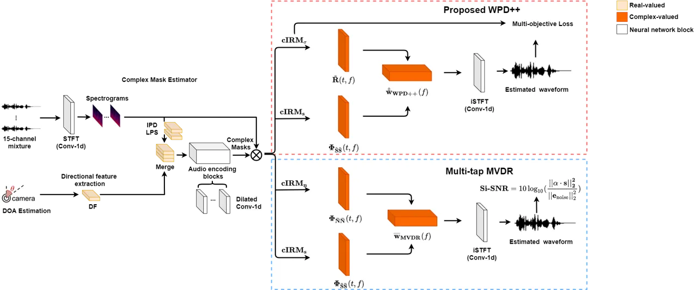
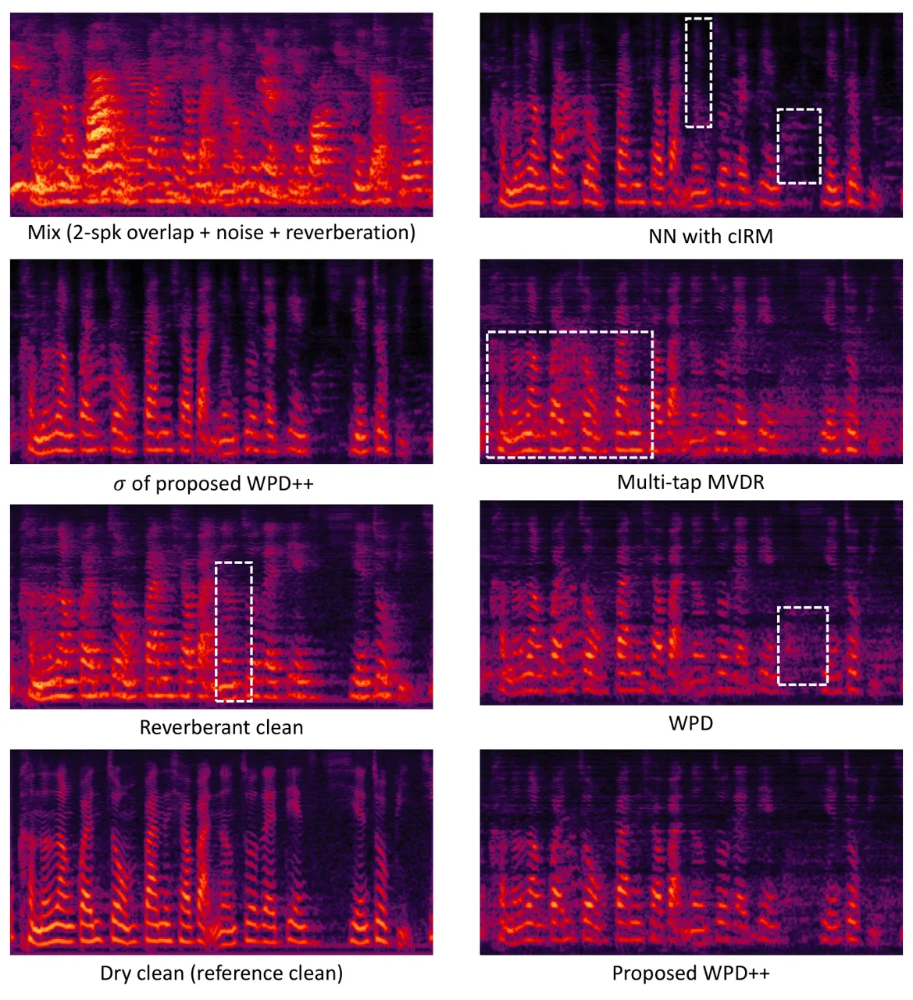

# WPD++: An improved neural beamformer for simultaneous speech separation and dereverberation

Zhaoheng Ni    Yong Xu    Meng Yu    Bo Wu    Shixiong Zhang    Dong Yu
   Michael I Mandel ^(†)^(†)thanks: ^(⋆) This work was done while Z. Ni
was a research intern at Tencent AI Lab, Bellevue, USA.

###### Abstract

This paper aims at eliminating the interfering speakers’ speech,
additive noise, and reverberation from the noisy multi-talker speech
mixture that benefits automatic speech recognition (ASR) backend. While
the recently proposed Weighted Power minimization Distortionless
response (WPD) beamformer can perform separation and dereverberation
simultaneously, the noise cancellation component still has the potential
to progress. We propose an improved neural WPD beamformer called “WPD++”
by an enhanced beamforming module in the conventional WPD and a
multi-objective loss function for the joint training. The beamforming
module is improved by utilizing the spatio-temporal correlation. A
multi-objective loss, including the complex spectra domain
scale-invariant signal-to-noise ratio (C-Si-SNR) and the magnitude
domain mean square error (Mag-MSE), is properly designed to make
multiple constraints on the enhanced speech and the desired power of the
dry clean signal. Joint training is conducted to optimize the
complex-valued mask estimator and the WPD++ beamformer in an end-to-end
way. The results show that the proposed WPD++ outperforms several
state-of-the-art beamformers on the enhanced speech quality and word
error rate (WER) of ASR.

###### Index Terms: 

Beamforming, speech separation, dereverberation, WPD, MVDR, multi-tap
MVDR

^(†)^(†)address: ¹City University of New York, New York, NY, USA  
²Tencent AI Lab, Bellevue, WA, USA      ³Tencent AI lab, Shenzhen, China

## 1 Introduction

Solving the cocktail party problem \[1, 2\] remains a challenging task
due to the low signal-to-noise ratio of the signal, reverberation, and
the presence of multiple talkers. Recently, Neural Network (NN) based
approaches show great potential in the speech separation task \[3, 4, 5,
6, 7\]. Those methods have high objective measure scores in terms of
some objective metrics, however, it may inevitably introduce some
non-linear speech distortion that downgrades the speech recognition
performance \[8, 9\]. On the other hand, beamforming techniques \[10,
11\], e.g., minimum variance distortionless response (MVDR) \[12\],
could extract the distortionless speech from the target direction.
Time-frequency (T-F) mask based beamforming approaches were successfully
used for speech enhancement \[13, 14, 15, 16, 17, 18, 9\].

Simultaneous speech separation and dereverberation for the target
speaker is the goal of this work. Weighted prediction error (WPE) \[19,
20\] could remove the late reverberation. WPE followed by an MVDR
beamformer was popularly used for speech separation, dereverberation,
and ASR in the REVERB challenge \[21\] and the CHiME challenges \[22,
23\]. Nakatani et al. \[24, 25\] unified the WPE and the weighted
minimum power distortionless response (wMPDR) beamforming together into
a single convolutional beamformer (WPD) for both speech dereverberation
and enhancement. A mask-based WPD \[26\] was proposed in a pipeline way
where the T-F masks were estimated via a DNN, but the parameters of WPD
were updated recursively. Zhang et al. \[27\] used the ASR loss to
jointly optimize the real-valued mask estimator, WPD, and the acoustic
model. However, the quality of the enhanced speech was not evaluated
with the ASR loss only in \[27\]. Furthermore, the generalization
capability is always limited by the small far-field ASR dataset.

In this work, We propose an improved neural WPD beamformer method called
“WPD++” that optimizes the neural network and the beamformer
simultaneously. We jointly train the neural networks and WPD by
utilizing the waveform level loss function. The enhanced speech is also
evaluated on a general-purpose industry ASR engine to demonstrate the
generalization capability of our enhancement model. Inspired by the
multi-tap MVDR \[9\], we improve the beamforming module in the
conventional WPD by utilizing the spatio-temporal correlation to further
strengthen the denoising capability of WPD. An additional novelty is
that complex-valued masks, rather than the commonly used real-valued
masks \[27, 26\], are estimated to calculate the covariance matrices of
WPD++.

Another challenge we address is the loss function for the simultaneous
speech separation and dereverberation. Although the time domain Si-SNR
\[3\] loss function could generate better performance for speech
separation, it leads to worse performance for speech dereverberation
\[28, 29\]. One possible reason is that Si-SNR is too sensitive to the
sample shift which is quite common in the convolutive reverberation. To
alleviate this problem, we propose a multi-objective loss function to
optimize the whole system in an end-to-end way. The multi-objective loss
function includes magnitude domain mean square error (Mag-MSE) on the
estimated dry clean power and a newly defined complex spectra domain
Si-SNR (C-Si-SNR) on the final predicted waveform.

Our contributions in this paper are described in three parts. First, we
propose a “WPD++” method where the spatio-temporal correlation is
utilized to enhance the beamforming component of the conventional WPD.
Secondly, we jointly train the complex-valued mask estimator and “WPD++”
in an end-to-end way. The third contribution is that a multi-objective
loss function is proposed to alleviate the limitation of the Si-SNR loss
for the simultaneous speech separation and dereverberation.

The paper is organized as follows. In Sec. 2, the neural spatio-temporal
MVDR and the proposed “WPD++” are illustrated. Sec. 3 presents the
introduced multi-objective loss function. Experimental setup and results
are described in Sec. 4. Finally, conclusions are given in Sec. 5.

## 2 Spatio-Temporal Neural Beamforming

Given a multi-channel speech mixture $`y\in\mathbb{R}^{M\times N}`$,
where $`M`$ is the number of channels and $`N`$ is the number of the
sampling points. The waveform signal $`y`$ can be transformed to the
time-frequency signal $`\bf{Y}\in\mathbb{C}^{M\times F\times T}`$ by
using Short Time Fourier Transform (STFT), where $`F`$ is the number of
frequency bins and $`T`$ is the number of frames. A beamformer aims at
weighting sum the multi-channel signal into an enhanced signal
$`\bf{S}\in\mathbb{C}^{F\times T}`$. The predicted signal
$`\hat{\bf{S}}(t,f)`$ at frame $`t`$ and frequency bin $`f`$ can be
modeled as:

```math
\hat{\bf{S}}(t,f)={\bf{w}^{\mathsf{H}}}(f){\bf{Y}}(t,f) \tag{1}
```

where $`{\bf{w}}\in\mathbb{C}^{M\times F}`$ is the weight matrix of the
beamformer.

### 2.1 Complex-valued mask based spatio-temporal MVDR

One solution to the MVDR beamformer which is based on reference channel
selection \[30, 31\] is,

```math
\textbf{w}_{\text{MVDR}}(f)=\frac{{{\bf{\Phi}_{\textbf{NN}}^{-1}}(f){\bf{\Phi}_{\textbf{SS}}}}(f)}{\text{Trace}({{{\bf{\Phi}_{\textbf{NN}}^{-1}}(f)\bf{\Phi}_{\textbf{SS}}}(f))}}\bf{u} \tag{2}
```

where $`\bf{\Phi}_{\textbf{NN}}`$ and $`\bf{\Phi}_{\textbf{SS}}`$ are
the covariance matrices of the noise and speech respectively. $`\bf{u}`$
is a one-hot vector representing the selected reference channel.
Conventional mask-based MVDR applied the estimated real-valued ratio
mask \[15, 16\] to estimate $`\bf{\Phi}_{\text{NN}}`$ and
$`\bf{\Phi}_{\text{SS}}`$. Here we estimate the complex-valued IRM
(cIRM) \[32\] to boost the performance. cIRM is defined as

```math
\textbf{cIRM}=\frac{\bf{Y}_{r}\bf{S}_{r}+\bf{Y}_{i}\bf{S}_{i}}{\bf{Y}_{r}^{2}+\bf{Y}_{i}^{2}}+j*\frac{\bf{Y}_{r}\bf{S}_{i}-\bf{Y}_{i}\bf{S}_{r}}{\bf{Y}_{r}^{2}+\bf{Y}_{i}^{2}}=\frac{\bf{S}}{\bf{Y}} \tag{3}
```

where the subscript $`r`$ and $`i`$ denote the real part and imaginary
part of the STFT spectra respectively. Note that cIRM is jointly trained
in our framework by using the time domain loss, there is no need to do
any scale compression. Then the estimated signal could be estimated as,

```math
\hat{\bf{S}}=\textbf{cIRM}*\bf{Y}\\
=(\bf{cIRM}_{r}+j*\textbf{cIRM}_{i})*(\bf{Y}_{r}+j*\bf{Y}_{i}) \tag{4}
```

where $`\hat{\bf{S}}\in\mathbb{C}^{T\times F\times M}`$ is the estimated
multi-channel STFT for the target speech and \* denotes the complex
multiplication. The covariance matrix $`{\bf{\Phi}_{\text{SS}}}`$ of the
target speech could be obtained as,

```math
{\bf{\Phi}_{\text{SS}}}(f)=\frac{\sum_{t=1}^{T}{\hat{\bf{S}}(t,f)\hat{\bf{S}}^{\mathsf{H}}(t,f)}}{\sum_{t=1}^{T}{\text{cIRM}^{\mathsf{H}}(t,f)\text{cIRM}(t,f)}} \tag{5}
```

Xu et al. \[9\] further proposed a multi-tap MVDR method that estimates
the covariance matrices by using the correlation of the neighbouring
frames besides using the cross-channel correlation. The multi-tap
expansion of the mixture is defined as
$`\overline{\bf{Y}}(t,f)=[\bf{Y}^{\mathsf{T}}(t,f),\bf{Y}^{\mathsf{T}}(t-1,f),...,\bf{Y}^{\mathsf{T}}(t-L+1,f)]^{\mathsf{T}}\in\mathbb{C}^{ML\times 1}`$.
Note that the future taps would also be used if the system could be
non-causal. The corresponding $`\overline{\bf{S}}`$,
$`\overline{\bf{N}}`$ and $`\overline{\textbf{cIRM}}`$ could be defined
in the same way. Then the spatio-temporal covariance matrix of the
target speech is calculated as

```math
\Phi_{\bar{\bf{S}}\bar{\bf{S}}}=\frac{\sum_{t=1}^{T}{\overline{\bf{S}}(t,f)\overline{\bf{S}}^{\mathsf{H}}(t,f)}}{\sum_{t=1}^{T}{\text{cIRM}^{\mathsf{H}}(t,f)\text{cIRM}(t,f)}} \tag{6}
```

The spatio-temporal covariance matrix of
$`\Phi_{\bar{\text{N}}\bar{\text{N}}}`$ can be estimated in a similar
way by replacing the speech mask $`\textbf{cIRM}_{s}`$ with the noise
mask $`\textbf{cIRM}_{n}`$. Similar to Eq. (2), the multi-tap MVDR
solution \[9\] is

```math
{\overline{\textbf{w}}_{\text{MVDR}}}(f)=\frac{{{\bf{\Phi^{-1}_{\bar{\text{N}}\bar{\text{N}}}}}(f)}{\bf{\Phi_{\bar{\text{S}}\bar{\text{S}}}}}(f)}{\text{Trace}({{\bf{\Phi^{-1}_{\bar{\text{N}}\bar{\text{N}}}}}(f)}{{\bf{\Phi_{\bar{\text{S}}\bar{\text{S}}}}}(f)})}{\bar{\bf{u}}}~~~,~~~~~{\bar{\bf{w}}}(f)\in\mathbb{C}^{ML\times 1} \tag{7}
```

where $`\bar{\bf{u}}`$ is an expanded one-hot vector of $`\bf{u}`$ with
padding zeros in the tail. The enhanced speech of the multi-tap MVDR
\[9\] can be obtained as,

```math
\hat{\bf{S}}(t,f)=\overline{\textbf{w}}^{\sf H}(f)\overline{\bf{Y}}(t,f) \tag{8}
```

However, the multi-tap MVDR in \[9\] was only designed and evaluated for
the speech separation without dereverberation. In this work,
simultaneous speech separation and dereverberation will be handled.
Furthermore, we thoroughly investigate that the spatio-temporal
correlation could be used to boost the performance of other beamformers,
e.g., WPD.



Figure 1: The overview of the proposed jointly trained complex-valued
mask based WPD++ and the multi-tap MVDR systems.

### 2.2 Proposed neural “WPD++” method

The noisy speech can be decomposed into three parts:

```math
{\bf{Y}}(t,f)={\bf{D}}(t,f)+{\bf{G}}(t,f)+{\bf{N}}(t,f), \tag{9}
```

```math
{\bf{D}}(t,f)=\sum_{\tau=0}^{b-1}{{\bf{A}}({\tau},f){\bf{S}}({t-\tau},f)}, \tag{10}
```

```math
{\bf{G}}(t,f)=\sum_{\tau=b}^{L}{{\bf{A}}({\tau},f){\bf{S}}({t-\tau},f)}, \tag{11}
```

where $`\bf{D}`$ refers to the direct signal and early reflections,
$`\bf{G}`$ refers to late reflections, and $`\bf{N}`$ refers to noises.
$`b`$ is a frame index that could divide the reverberation into
$`\bf{D}`$ and $`\bf{G}`$. If the desired signal is the direct path or
the dry clean signal, then $`b`$ could be one. $`\bf{A}`$ denotes the
acoustic transfer function. WPD \[25, 24\] aims at preserving the
desired signal $`\bf{D}`$ while reducing $`\bf{G}`$ and $`\bf{N}`$.

The conventional WPD beamformer can be defined as

```math
{\hat{\overline{\textbf{w}}}}_{\text{WPD}}(f)=\frac{\textbf{R}^{-1}(f)\overline{\textbf{v}}(f)}{\overline{\textbf{v}}^{H}(f)\textbf{R}^{-1}(f)\overline{\textbf{v}}(f)} \tag{12}
```

where $`\overline{\bf{v}}=[\bf{v},0,0,...,0]^{T}`$ is the column vector
containing the steering vector $`\bf{v}`$ and padding zeros. $`\bf{R}`$
is a spatio-temporal covariance matrix of the multi-tap multi-channel
mixture signal $`\bf{Y}`$. $`\bf{R}`$ is weighted by the power of the
target dry clean speech and defined as

```math
\textbf{R}(f)=\sum_{t}{\frac{\overline{\bf{Y}}(t,f)\overline{\bf{Y}}^{\mathsf{H}}(t,f)}{{\bf{\sigma}^{2}}(t,f)}} \tag{13}
```

where $`\bf{\sigma}^{2}(t)=|\bf{D}^{(q)}(t)|^{2}`$ is the time-varing
power of the desired signal. $`q`$ denotes the reference microphone
channel. Conventional WPD in \[24\] iteratively estimate
$`\bf{\sigma}(t)`$ and v. We apply a separate complex-valued mask for
estimating $`\bf{\sigma}`$:

```math
\bf{\sigma}=|\textbf{cIRM}_{\sigma}*\bf{Y}^{(q)}| \tag{14}
```

The steering vector $`\bf(v)`$ requires Eigenvalue decomposition which
is not stable in neural network joint training \[27\]. Zhang et al.
\[27\] modified the original formula to avoid using the steering vector
explicitly.

```math
{\hat{\overline{\textbf{w}}}}_{\text{WPD}}(f)=\frac{\textbf{R}^{-1}(f)({\bf{\Phi}_{\bar{\bf{S}}\bar{\bf{S}}}}(f))}{\text{Trace}({\textbf{R}^{-1}(f)({\bf{\Phi}_{\bar{\bf{S}}\bar{\bf{S}}}}(f))})}\overline{\bf{u}} \tag{15}
```

The $`\bf{\Phi}_{{\bar{\bf{S}}\overline{\bf{S}}}}`$ is similar to the
one (Eq. (6)) defined in the multi-tap MVDR beamformer. Normally the
conventional WPE or WPD for the dereverberation would skip the
neighbouring frames (a.k.a, a prediction delay) to avoid potential
distortion on the speech of the current frame \[19, 24\]. Given that the
prediction delay exists, it only could estimate the desired signal with
early reflections. However, the goal of our neural WPD++ model is to
predict the direct path signal (a.k.a., dry clean) rather than the early
reflections. On the other hand, neighbouring frames could benefit the
beamforming for denoising and separation in spatio-temporal MVDR \[9\],
considering that the speech is highly correlated among neighbouring
frames. The following WPD experiments with oracle mask in Sec. 4 will
show that neighbouring frames actually also help the wMPDR beamforming
module in WPD. Furthermore, our proposed complex-valued mask based
“WPD++” framework is jointly trained in an end-to-end way with the
waveform level loss function. Hence the networks will automatically find
the trade-off about how to use the neighbouring frames effectively. With
the help of the highly correlated neighbouring frames, the “WPD++”
beamforming weights are derived as:

```math
{\hat{\tilde{\textbf{w}}}}_{\text{WPD++}}(f)=\frac{\tilde{\bf{R}}^{-1}(f)({\bf{\Phi}_{\tilde{\bf{S}}\tilde{\bf{S}}}}(f))}{\text{Trace}({\tilde{\bf{R}}^{-1}(f)({\bf{\Phi}_{\tilde{\bf{S}}\tilde{\bf{S}}}}(f))})}\tilde{\textbf{u}} \tag{16}
```

Different from the conventional WPD, we include the neighbouring frames
in $`\tilde{\bf{R}}`$ and
$`{\bf{\Phi}_{\tilde{\bf{S}}\tilde{\bf{S}}}}`$. Note that future
neighbouring frames, which is also highly correlated with current frame,
would be considered if the system could be non-causal. Another
difference is that an utterance-level $`\bf{\sigma}`$-normalization is
introduced to further normalize $`\tilde{\textbf{R}}`$,

```math
\tilde{\bf{R}}(f)=\frac{\sum_{t}(\frac{1}{{\bf{\sigma}^{2}}(t,f)}){\tilde{\bf{Y}}({t,f})}{{\tilde{\bf{Y}}^{\mathsf{H}}({t,f})}}}{{\sum_{t}(\frac{1}{{\bf{\sigma}^{2}}(t,f)})}} \tag{17}
```

where $`(\frac{1}{\bf{\sigma}^{2}(t,f)})`$ could be regarded as a “mask”
in the conventional mask based covariance matrix (e.g., Eq. 6).
Intuitively, this “mask” would be larger with smaller $`\bf{\sigma}`$.
It acts like a noise mask for the “WPD++” solution in Eq. (16).

## 3 Multi-objective loss function for neural “WPD++” joint training

Although Si-SNR \[3\] works well for speech separation, it leads to
worse performance for speech dereverberation \[28, 29\]. We design a
multi-objective loss function for jointly training our proposed neural
WPD++ model. The Si-SNR \[3\] loss function is defined as

```math
\textbf{Si-SNR}=10\log_{10}(\frac{||\alpha\cdot\bf{s}||^{2}_{2}}{||\textbf{e}_{\text{noise}}||^{2}_{2}}) \tag{18}
```

where $`\alpha=\frac{<\hat{\bf{s}},\bf{s}>}{||\bf{s}||_{2}^{2}}`$,
$`\textbf{e}_{\text{noise}}=\hat{\bf{s}}-\alpha\cdot\bf{s}`$, $`\bf{s}`$
and $`\hat{\bf{s}}`$ are the dry clean waveform and the estimated
waveform respectively.

The time-domain Si-SNR requires the estimated signal and the target
signal are aligned perfectly. Thus it is very sensitive to the
time-domain sample shift. However, the frame-level STFT might be less
sensitive to the sample shift considering that the window size of STFT
is always up to 512 samples for a 16kHz sample rate. Hence, we propose a
complex-domain Si-SNR loss function that is less sensitive to the sample
shift. Given the STFT of the estimation $`\hat{\bf{S}}`$ and the target
reference $`\bf{S}`$, the function can be defined as:

```math
\textbf{C-Si-SNR}=10\log_{10}(\frac{||\alpha\cdot\bf{S}||^{2}_{2}}{||\textbf{E}_{\text{noise}}||^{2}_{2}}) \tag{19}
```

```math
\alpha=\frac{<[\hat{\bf{S}}_{r},\hat{\bf{S}}_{i}],[\bf{S}_{r},\bf{S}_{i}]>}{||[\bf{S}_{r},\bf{S}_{i}]||_{2}^{2}}, \tag{20}
```

```math
\textbf{E}_{\text{noise}}=[\hat{\bf{S}}_{r},\hat{\bf{S}}_{i}]-\alpha\cdot[\bf{S}_{r},\bf{S}_{i}], \tag{21}
```

where the real and imaginary components of $`\bf{S}`$ and
$`\hat{\bf{S}}`$ are concatenated respectively for calculating C-Si-SNR.
This guarantees the scale of the real and imaginary components are at
the same level.

We also introduce the spectral MSE loss function which minimizes the
difference between the estimated magnitude and the target magnitude. The
spectral MSE loss is defined as:

```math
\textbf{Mag-MSE}=\sum_{t}^{T}\sum_{f}^{F}{||{\bf{S}}(t,f)-{\hat{\bf{S}}}(t,f)||^{2}_{2}} \tag{22}
```

As the accurate estimation of the magnitude of the desired signal
$`\bf{\sigma}`$ (defined in Eq. (14)) is the key to success of the WPD
or WPD++ algorithm, a combo loss is designed for the prediction of
$`\bf{\sigma}`$,

```math
\textbf{Combo-loss}=\gamma\cdot\textbf{Mag-MSE}+\beta\cdot\textbf{Si-SNR}+\textbf{C-Si-SNR} \tag{23}
```

where $`\gamma`$ and $`\beta`$ are used to weight the contribution among
different losses. We empirically set $`\gamma`$ as 0.3 and $`\beta`$ as
1.0 to make the losses on the same scale. C-Si-SNR loss only is used to
optimize the final beamformed signal of WPD++.

## 4 Experimental setup and results

### 4.1 Experimental setup and dataset

Dilated CNN-based Mask estimator: We validate our proposed system and
other methods on a multi-channel target speaker separation framework.
Figure 1 describes the systems we use. The 15-element non-uniform linear
microphone array is co-located with the 180 wide-angle camera. A rough
Direction of Arrival (DOA) of the target speaker can be estimated from
the location of the target speaker’s face in the whole camera view. We
apply the location guided directional feature (DF) proposed by \[33\]
that aims at calculating the cosine similarity between the target
steering vector and the inter-channel phase difference (IPD) features.
Besides the DF, we apply a $`1\times 1`$ Conv-1d CNN with the fixed STFT
kernel to extract the Fourier Transform of the 15-channel speech
mixture. Then we extract the log-power spectra (LPS) and interaural
phase difference (IPD) features from the STFTs. The LPS, IPDs, and DF
are merged and fed into a bunch of dilated 1D-CNNs to predict the
complex-valued masks (as shown in Fig. 1). The 1-D dilated CNN based
structure is similar to the ones used in the Conv-TasNet \[3\]. The mask
estimator structure is the same for all the methods. Before estimating
the corresponding covariance matrices, we apply the spatio-temporal
padding to the estimated STFT. Then we estimate the beamforming weights
of MVDR, WPD, and WPD++ and finally obtain the estimated waveforms.

Dataset: The 200 hours clean Mandarin audio-visual dataset was collected
from Youtube. The multi-channel signals are generated by convolving
speech with room impulse responses (RIRs) simulated by the image-source
method \[34\]. The signal-to-interference ratio (SIR) is ranging from -6
to 6 dB. Also, noise with 18-30 dB SNR is added to all the multi-channel
mixtures. The dataset is divided into 190000, 15000 and 500
multi-channel mixtures for training, validation, and testing. For the
STFT conducted on the 16kHz waveform, we use 512 (32ms) as the Hann
window size and 256 (16ms) as the hop size. The LPS is computed from the
first channel of the noisy speech. In addition to the objective
Perceptual Evaluation of Speech Quality (PESQ) \[35\] of the enhanced
speech, we care more about whether the predicted speech could achieve a
good ASR performance with an industry ASR engine for real applications.
Hence, an Tencent industry general-purpose mandarin speech recognition
API \[36\] is used to evaluate the word error rate (WER).

Training hyper-parameters: The networks are trained in a chunk-wise mode
with a 4-second chunk size, using Adam optimizer with early stopping.
The initial learning rate is set to 1e-3. Gradient clip norm with 10 is
applied to stabilize the jointly trained MVDR \[9\], multi-tap MVDR
\[9\], WPD \[24\] and WPD++ (Proposed). PyTorch 1.1.0 is used.

| Method | Used frame tap(s) to calculate $`{\bf{\Phi}}(t)`$ | WER (%) |
| ------ | ------------------------------------------------- | ------- |
| MVDR   | t                                                 | 13.28   |
| MVDR   | t-1, t                                            | 11.90   |
| MVDR   | t-1, t, t+1                                       | 10.50   |
| WPD    | t                                                 | 11.54   |
| WPD    | t-3, t                                            | 10.22   |
| WPD    | t-4, t-3, t                                       | 11.02   |
| WPD++  | t-1, t                                            | 10.50   |
| WPD++  | t-1, t, t+1                                       | 9.48    |
| WPD++  | t-3, t-1, t, t+1                                  | 9.63    |
| WPD++  | t-3\[0:6\], t-4\[0:6\], t-1, t, t+1               | 9.70    |

Table 1: The WER performances of several neural beamforming systems
using the oracle cIRM masks. As for a reference, the WERs of the dry
clean speech and the reverberant clean speech are 7.15% and 8.26%,
respectively. There are 15 microphone channels for each frame.

### 4.2 Results and discussions

#### 4.2.1 Evaluations for the spatio-temporal beamformers with oracle complex-valued masks

To validate the capability of the proposed method, we firstly use the
oracle target speech and noise cIRMs (i.e., calculated with oracle
target speech and oracle noise in Eq. (3)) to compare the performances
of different system settings. Table 1 shows the WER results of multi-tap
MVDR, WPD, and the proposed WPD++ beamformers. Xu et al. \[9\]
demonstrated that the neighbouring frames could improve the denoising
performance of MVDR considering that the MVDR could use the
spatio-temporal correlation. The experiments here with the oracle masks
also prove that the performance of MVDR could be boosted by using
neighbouring frames (even future frames) besides using the spatial
cross-channel correlation. For example, the multi-tap MVDR could get
10.50% WER which is lower than the 13.28% WER of MVDR.

Conventional WPD \[24\] skips the neighbouring previous frames to
predict the early reflections. As observed in Zhang et al.’s work
\[27\], WPD needs less previous frame taps when more microphones are
available (15 linear non-uniform microphones are used in this work.).
This is also aligned with our results that the WPD leads to worse
performance when additional tap (i.e., $`t-4`$) is used.

Table 1 also shows the WPD++ beamforming achieves the best performance
with $`[t-1,t,t+1]`$ frame taps. It demonstrates that the
spatio-temporal correlation could also improve the performance of WPD.
Note that our goal in this paper is to predict the direct path speech
(or the dry clean speech), hence we can use the tap $`t-1`$. The future
tap $`t+1`$ also helps to improve the performance of WPD++. This is
because the future frame tap also highly correlates with the current
frame $`t`$ given that the system could be non-causal. With the help of
the spatio-temporal correlation, WPD++ could outperform the multi-tap
MVDR \[9\] and the conventional WPD \[24\] and obtain the lowest WER
with 9.48%. Additional temporal taps do not benefit the WPD++ model
considering that $`[t-1:t+1]`$ taps have already been used with
15-channel for each frame. Another reason is that the Tencent ASR API
\[36\] is robust to some mild reverberation but not robust to
interfering speech. The neighbouring frames could help more on the
denoising function of the beamformer module in WPD++ considering that up
to three competing speakers’ speech might exist in our task.

|     |                                                                    |                                                |           |           |            |                |      |      |      |              |
| --- | ------------------------------------------------------------------ | ---------------------------------------------- | --------- | --------- | ---------- | -------------- | ---- | ---- | ---- | ------------ |
| ID  | Systems/Metrics                                                    | PESQ $`\in[-0.5,4.5]`$     Reference=Dry Clean |           |           |            |                |      |      |      | WER ($`\%`$) |
|     |                                                                    | Angle between target and others                |           |           |            | \# of speakers |      |      |      |              |
|     |                                                                    | 0-15^(∘)                                       | 15-45^(∘) | 45-90^(∘) | 90-180^(∘) | 1spk           | 2spk | 3spk | Avg. | Avg.         |
| 1   | Dry clean (reference)                                              | 4.50                                           | 4.50      | 4.50      | 4.50       | 4.50           | 4.50 | 4.50 | 4.50 | 7.15         |
| 2   | Reverberant clean speech                                           | 2.78                                           | 2.74      | 2.78      | 2.68       | 2.75           | 2.75 | 2.77 | 2.75 | 8.26         |
| 3   | Noisy Mixture (interfering speech + reverberation + noise)         | 1.60                                           | 1.58      | 1.68      | 1.68       | 2.54           | 1.70 | 1.51 | 1.76 | 55.14        |
| 4   | Purely NN with cIRM, Si-SNR loss                                   | 2.22                                           | 2.36      | 2.52      | 2.44       | 3.01           | 2.43 | 2.25 | 2.46 | 26.38        |
| 5   | MVDR with cIRM \[9\]                                               | 2.29                                           | 2.52      | 2.72      | 2.59       | 3.09           | 2.59 | 2.36 | 2.59 | 16.43        |
| 6   | Multi-tap MVDR with cIRM (\[t-1:t+1\] taps) \[9\]                  | 2.32                                           | 2.54      | 2.75      | 2.59       | 3.09           | 2.61 | 2.39 | 2.61 | 14.40        |
| 7   | WPD (\[t, t-3\] tap) \[27\], est: C-Si-SNR, $`\sigma`$: Combo-loss | 2.34                                           | 2.59      | 2.81      | 2.71       | 3.23           | 2.67 | 2.42 | 2.68 | 14.20        |
| 8   | Prop. WPD++, single mask, Si-SNR                                   | 2.06                                           | 2.36      | 2.53      | 2.48       | 2.98           | 2.41 | 2.16 | 2.43 | 22.14        |
| 9   | Prop. WPD++ , Si-SNR                                               | 2.19                                           | 2.45      | 2.63      | 2.56       | 3.04           | 2.51 | 2.27 | 2.52 | 19.74        |
| 10  | Prop. WPD++, C-Si-SNR                                              | 2.19                                           | 2.45      | 2.67      | 2.61       | 3.09           | 2.53 | 2.27 | 2.54 | 18.78        |
| 11  | Prop. WPD++, est: C-Si-SNR, $`\sigma`$: C-Si-SNR+Mag-MSE           | 2.35                                           | 2.62      | 2.80      | 2.69       | 3.07           | 2.66 | 2.46 | 2.67 | 13.86        |
| 12  | Prop. WPD++, est: Si-SNR, $`\sigma`$: Combo-loss                   | 2.36                                           | 2.62      | 2.81      | 2.70       | 3.09           | 2.67 | 2.46 | 2.67 | 13.51        |
| 13  | Prop. WPD++, same as 14, use $`\sigma`$ as final est speech        | 2.23                                           | 2.40      | 2.56      | 2.53       | 3.01           | 2.47 | 2.28 | 2.50 | 25.50        |
| 14  | Prop. WPD++, est: C-Si-SNR, $`\sigma`$: Combo-loss                 | 2.47                                           | 2.71      | 2.89      | 2.76       | 3.18           | 2.76 | 2.55 | 2.76 | 12.04        |

Table 2: PESQ and WER results for different purely NN-based or neural
beamformer based speech separation and dereverberation systems using the
predicted complex-valued masks across different scenarios.



Figure 2: Spectrograms generated by different methods.

#### 4.2.2 Evaluations for neural beamformer systems with predicted complex-valued masks

Based on the comparisons in the oracle experiments (shown in Table 1),
we choose the best temporal setting $`[t-1,t,t+1]`$ for the proposed
neural WPD++ beamformer. Table 2 shows that the proposed neural WPD++
beamformer (ID-14) with C-Si-SNR loss for the estimated signal (denoted
as “est”) and the combo-loss for $`\sigma`$ (i.e., the magnitude of the
dry clean speech which is defined in Eq. (14).) achieves the best PESQ
(2.76 on average) and lowest WER (12.04%). Compared to the best
multi-tap MVDR system (ID-6) and the best conventional WPD system
(ID-7), the proposed neural WPD++ method (ID-14) could get relative
16.4% and 15.2% WER reduction, respectively. In detail, the proposed
neural WPD++ method (ID-14) obtains a higher PESQ score on a small angle
and more competing speakers cases by comparing it with the conventional
WPD method (ID-7). For example, the PESQ for the angle smaller than
15-degree case could be improved from 2.34 to 2.47. Another example is
that ID-14 could increase the PESQ from 2.42 to 2.55 for the three
competing speakers’ case. These observations illustrate that the
proposed neural beamformer could have more capability to reduce
interfering speech by using highly correlated neighbouring frames. The
purely NN based system (ID-4) does not work well, especially for the WER
of ASR performance. This is because the purely NN-based method
inevitably introduces some non-linear distortion \[8, 9\] which is
harmful to the ASR.

ID-9 estimates the masks for
$`\bf{\Phi}_{\tilde{\bf{S}}\tilde{\bf{S}}}`$ and $`\tilde{\bf{R}}`$
separately and achieves 2.4% absolute improvement than ID-8 that uses a
single shared mask. It indicates that two different cIRMs for
$`\bf{\Phi}_{\tilde{\bf{S}}\tilde{\bf{S}}}`$ and $`\tilde{\bf{R}}`$ are
essential. ID-11 adds the Mag-MSE loss (defined in Eq. (22)) to estimate
$`\sigma`$ and improves the performance by 4.9% comparing with ID-10. By
comparing ID-11 and ID-14, the proposed Combo-loss (defined in Eq. (23))
reduces the WER by an absolute 1.82%. This emphasises the importance of
the proper $`\bf{\sigma}`$ estimation to the proposed neural WPD++. By
comparing ID-14 and ID-12, the results show the C-Si-SNR loss function
on “est” achieves better performance than the Si-SNR loss function. For
example, ID-14 could reduce the WER from 13.51% to 12.04% and increase
the PESQ from 2.67 to 2.76 by comapring to ID-12. In ID-13, we also
extract the $`\textbf{cIRM}_{\sigma}`$ from ID-14 and multiply it with
the first channel speech mixture to get the estimated speech. We observe
that $`\bf{\sigma}`$ could also generate enhanced speech after jointly
trained with WPD++. Although ID-13 is worse than the final output of
WPD++ (ID-14), ID-13 is better than the purely NN system (ID-4) with
higher PESQ (2.50) and lower WER (25.50%). This is because ID-13 is also
a purely NN system but jointly trained with WPD++. Almost all of the
purely NN systems could inevitably introduce non-linear distortion which
is harmful to the ASR system \[8, 9\].

Fig. 2 visualizes the spectrograms of the speech mixture,
$`\bf{\sigma}`$, reverberant clean speech, dry clean speech, and the
outputs of different systems, respectively¹¹ 1 Listening demos
(including real-world recording results) are available at
[https://nateanl.github.io/2020/11/05/wpd++/](https://nateanl.github.io/2020/11/05/wpd++/).
All methods have some dereverberation capabilities since the
“reverberation tail” effect is reduced in the spectrograms. Some
distortions could be observed in the purely NN-based method (shown in
the white dashed rectangle). More residual noise could be seen in the
multi-tap MVDR and WPD spectrograms.

## 5 Conclusions and Future work

For the simultaneous speech separation and dereverberation, we propose a
neural “WPD++” beamformer that enhances the beamforming module of the
conventional WPD beamformer by adding spatio-temporal correlation. The
proposed multi-objective loss function achieves better performance than
the Si-SNR loss function in terms of PESQ and WER metrics, which
indicates an accurate estimation of $`\bf{\sigma}`$ is the key to
success of WPD or WPD++. The final jointly trained complex-valued mask
based WPD++ beamformer achieves relative 16.4% and 15.2% WER reductions
by comparing with the multi-tap MVDR and the conventional WPD. Compared
to the purely NN system, the neural WPD++ beamformer reduces most of the
non-linear distortion which is harmful to the ASR. In our future work,
we will further improve the neural beamformer and design a better loss
function that fits for the dereverberation task.

## References

- \[1\] Simon Haykin and Zhe Chen, “The cocktail party problem,” Neural
  computation, vol. 17, no. 9, pp. 1875–1902, 2005.
- \[2\] DeLiang Wang and Guy J Brown, Computational auditory scene
  analysis: Principles, algorithms, and applications, Wiley-IEEE
  press, 2006.
- \[3\] Yi Luo and Nima Mesgarani, “Conv-tasnet: Surpassing ideal
  time–frequency magnitude masking for speech separation,” IEEE/ACM
  transactions on audio, speech, and language processing, vol. 27, no.
  8, pp. 1256–1266, 2019.
- \[4\] Yuzhou Liu, Masood Delfarah, and DeLiang Wang, “Deep CASA for
  talker-independent monaural speech separation,” in ICASSP 2020-2020
  IEEE International Conference on Acoustics, Speech and Signal
  Processing (ICASSP). IEEE, 2020, pp. 6354–6358.
- \[5\] Liwen Zhang, Ziqiang Shi, Jiqing Han, Anyan Shi, and Ding Ma,
  “FurcaNeXt: End-to-end monaural speech separation with dynamic gated
  dilated temporal convolutional networks,” in International Conference
  on Multimedia Modeling. Springer, 2020, pp. 653–665.
- \[6\] Yi Luo, Zhuo Chen, and Takuya Yoshioka, “Dual-path RNN:
  efficient long sequence modeling for time-domain single-channel speech
  separation,” in ICASSP 2020-2020 IEEE International Conference on
  Acoustics, Speech and Signal Processing (ICASSP). IEEE, 2020, pp.
  46–50.
- \[7\] Neil Zeghidour and David Grangier, “Wavesplit: End-to-end speech
  separation by speaker clustering,” arXiv preprint
  arXiv:2002.08933, 2020.
- \[8\] Jun Du, Qing Wang, Tian Gao, Yong Xu, Li-Rong Dai, and Chin-Hui
  Lee, “Robust speech recognition with speech enhanced deep neural
  networks,” in Fifteenth Annual Conference of the International Speech
  Communication Association, 2014.
- \[9\] Yong Xu, Meng Yu, Shi-Xiong Zhang, Lianwu Chen, Chao Weng,
  Jianming Liu, and Dong Yu, “Neural spatio-temporal beamformer for
  target speech separation,” Interspeech, 2020.
- \[10\] Jacob Benesty, Jingdong Chen, and Emanuël AP Habets, Speech
  enhancement in the STFT domain, Springer Science & Business
  Media, 2011.
- \[11\] Jacob Benesty, Jingdong Chen, and Yiteng Huang, Microphone
  array signal processing, vol. 1, Springer Science & Business
  Media, 2008.
- \[12\] Emanuël Anco Peter Habets, Jacob Benesty, Israel Cohen, Sharon
  Gannot, and Jacek Dmochowski, “New insights into the MVDR beamformer
  in room acoustics,” IEEE Transactions on Audio, Speech, and Language
  Processing, vol. 18, no. 1, pp. 158–170, 2009.
- \[13\] Takuya Higuchi, Nobutaka Ito, Takuya Yoshioka, and Tomohiro
  Nakatani, “Robust MVDR beamforming using time-frequency masks for
  online/offline asr in noise,” in 2016 IEEE International Conference on
  Acoustics, Speech and Signal Processing (ICASSP). IEEE, 2016, pp.
  5210–5214.
- \[14\] Jahn Heymann, Lukas Drude, and Reinhold Haeb-Umbach, “Neural
  network based spectral mask estimation for acoustic beamforming,” in
  2016 IEEE International Conference on Acoustics, Speech and Signal
  Processing (ICASSP). IEEE, 2016, pp. 196–200.
- \[15\] Jahn Heymann, Lukas Drude, Christoph Boeddeker, Patrick
  Hanebrink, and Reinhold Haeb-Umbach, “Beamnet: End-to-end training of
  a beamformer-supported multi-channel asr system,” in 2017 IEEE
  International Conference on Acoustics, Speech and Signal Processing
  (ICASSP). IEEE, 2017, pp. 5325–5329.
- \[16\] Hakan Erdogan, John R Hershey, Shinji Watanabe, Michael I
  Mandel, and Jonathan Le Roux, “Improved mvdr beamforming using
  single-channel mask prediction networks.,” in Interspeech, 2016, pp.
  1981–1985.
- \[17\] Xiong Xiao, Shengkui Zhao, Douglas L Jones, Eng Siong Chng, and
  Haizhou Li, “On time-frequency mask estimation for MVDR beamforming
  with application in robust speech recognition,” in 2017 IEEE
  International Conference on Acoustics, Speech and Signal Processing
  (ICASSP). IEEE, 2017, pp. 3246–3250.
- \[18\] Yong Xu, Chao Weng, Like Hui, Jianming Liu, Meng Yu, Dan Su,
  and Dong Yu, “Joint training of complex ratio mask based beamformer
  and acoustic model for noise robust asr,” in ICASSP 2019-2019 IEEE
  International Conference on Acoustics, Speech and Signal Processing
  (ICASSP). IEEE, 2019, pp. 6745–6749.
- \[19\] Tomohiro Nakatani, Takuya Yoshioka, Keisuke Kinoshita, Masato
  Miyoshi, and Biing-Hwang Juang, “Blind speech dereverberation with
  multi-channel linear prediction based on short time fourier transform
  representation,” in 2008 IEEE International Conference on Acoustics,
  Speech and Signal Processing. IEEE, 2008, pp. 85–88.
- \[20\] Keisuke Kinoshita, Marc Delcroix, Haeyong Kwon, Takuma Mori,
  and Tomohiro Nakatani, “Neural network-based spectrum estimation for
  online WPE dereverberation.,” in Interspeech, 2017, pp. 384–388.
- \[21\] Keisuke Kinoshita, Marc Delcroix, Sharon Gannot, Emanuël AP
  Habets, Reinhold Haeb-Umbach, Walter Kellermann, Volker Leutnant,
  Roland Maas, Tomohiro Nakatani, Bhiksha Raj, et al., “A summary of the
  REVERB challenge: state-of-the-art and remaining challenges in
  reverberant speech processing research,” EURASIP Journal on Advances
  in Signal Processing, vol. 2016, no. 1, pp. 7, 2016.
- \[22\] Shinji Watanabe, Michael Mandel, Jon Barker, and Emmanuel
  Vincent, “CHiME-6 challenge: Tackling multispeaker speech recognition
  for unsegmented recordings,” arXiv preprint arXiv:2004.09249, 2020.
- \[23\] Christoph Boeddeker, Tomohiro Nakatani, Keisuke Kinoshita, and
  Reinhold Haeb-Umbach, “Jointly optimal dereverberation and
  beamforming,” in ICASSP 2020-2020 IEEE International Conference on
  Acoustics, Speech and Signal Processing (ICASSP). IEEE, 2020, pp.
  216–220.
- \[24\] Tomohiro Nakatani and Keisuke Kinoshita, “Maximum likelihood
  convolutional beamformer for simultaneous denoising and
  dereverberation,” in 2019 27th European Signal Processing Conference
  (EUSIPCO). IEEE, 2019, pp. 1–5.
- \[25\] Tomohiro Nakatani, Christoph Boeddeker, Keisuke Kinoshita,
  Rintaro Ikeshita, Marc Delcroix, and Reinhold Haeb-Umbach, “Jointly
  optimal denoising, dereverberation, and source separation,” arXiv
  preprint arXiv:2005.09843, 2020.
- \[26\] Tomohiro Nakatani, Riki Takahashi, Tsubasa Ochiai, Keisuke
  Kinoshita, Rintaro Ikeshita, Marc Delcroix, and Shoko Araki,
  “DNN-supported mask-based convolutional beamforming for simultaneous
  denoising, dereverberation, and source separation,” in ICASSP
  2020-2020 IEEE International Conference on Acoustics, Speech and
  Signal Processing (ICASSP). IEEE, 2020, pp. 6399–6403.
- \[27\] Wangyou Zhang, Aswin Shanmugam Subramanian, Xuankai Chang,
  Shinji Watanabe, and Yanmin Qian, “End-to-end far-field speech
  recognition with unified dereverberation and beamforming,” arXiv
  preprint arXiv:2005.10479, 2020.
- \[28\] Yi Luo and Nima Mesgarani, “Real-time single-channel
  dereverberation and separation with time-domain audio separation
  network.,” in Interspeech, 2018, pp. 342–346.
- \[29\] Ke Tan, Yong Xu, Shi-Xiong Zhang, Meng Yu, and Dong Yu,
  “Audio-visual speech separation and dereverberation with a two-stage
  multimodal network,” IEEE Journal of Selected Topics in Signal
  Processing, 2020.
- \[30\] A Shanmugam Subramanian, X Wang, S Watanabe, T Taniguchi,
  D Tran, and Y Fujita, “An investigation of end-to-end multichannel
  speech recognition for reverberant and mismatch conditions,” arXiv
  preprint arXiv:1904.09049, 2019.
- \[31\] Emanuël AP Habets and Jacob Benesty, “A two-stage beamforming
  approach for noise reduction and dereverberation,” IEEE Transactions
  on Audio, Speech, and Language Processing, vol. 21, no. 5, pp.
  945–958, 2013.
- \[32\] Donald S Williamson, Yuxuan Wang, and DeLiang Wang, “Complex
  ratio masking for monaural speech separation,” IEEE/ACM transactions
  on audio, speech, and language processing, vol. 24, no. 3, pp.
  483–492, 2015.
- \[33\] Zhuo Chen, Xiong Xiao, Takuya Yoshioka, Hakan Erdogan, Jinyu
  Li, and Yifan Gong, “Multi-channel overlapped speech recognition with
  location guided speech extraction network,” in 2018 IEEE Spoken
  Language Technology Workshop (SLT). IEEE, 2018, pp. 558–565.
- \[34\] Emanuel AP Habets, “Room impulse response generator,”
  Technische Universiteit Eindhoven, Tech. Rep, vol. 2, no. 2.4, pp.
  1, 2006.
- \[35\] Antony W Rix, John G Beerends, Michael P Hollier, and Andries P
  Hekstra, “Perceptual evaluation of speech quality (PESQ)-a new method
  for speech quality assessment of telephone networks and codecs,” in
  2001 IEEE International Conference on Acoustics, Speech, and Signal
  Processing. Proceedings (Cat. No. 01CH37221). IEEE, 2001, vol. 2, pp.
  749–752.
- \[36\] “Tencent ASR,”
  [https://ai.qq.com/product/aaiasr.shtml](https://ai.qq.com/product/aaiasr.shtml).
