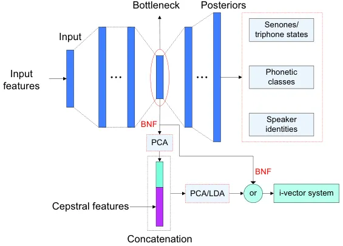
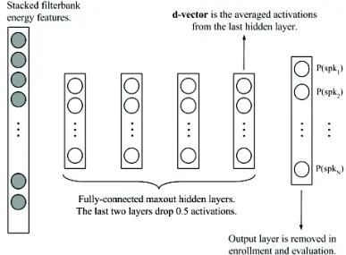
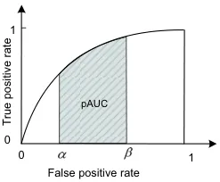
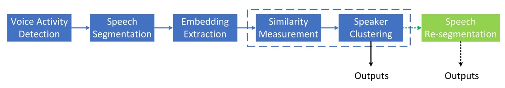
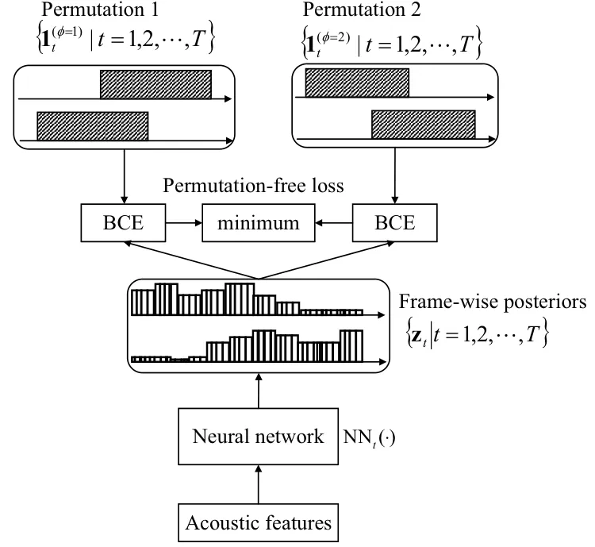
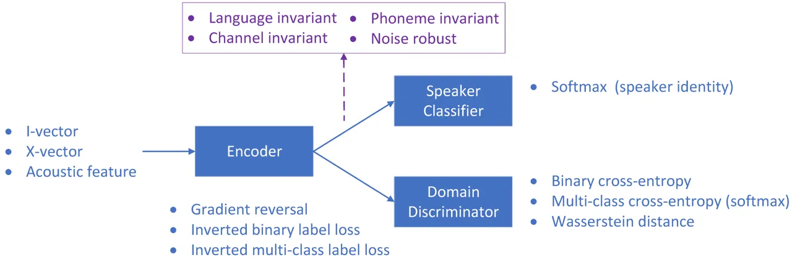
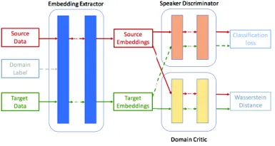
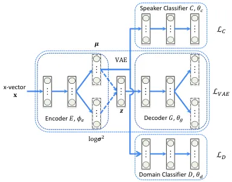
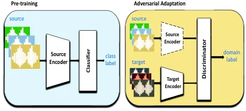
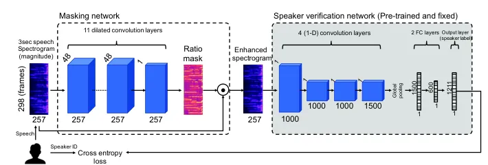

# Speaker Recognition Based on Deep Learning: An Overview

Zhongxin Bai Email: <zxbai@mail.nwpu.edu.cn>    Xiao-Lei Zhang
Email: <xiaolei.zhang@nwpu.edu.cn> Address: Center of Intelligent
Acoustics and Immersive Communications (CIAIC) and the School of Marine
Science and Technology,  
Northwestern Polytechnical University, Xi’an, Shaanxi 710072, China.

###### Abstract

Speaker recognition is a task of identifying persons from their voices.
Recently, deep learning has dramatically revolutionized speaker
recognition. However, there is lack of comprehensive reviews on the
exciting progress. In this paper, we review several major subtasks of
speaker recognition, including speaker verification, identification,
diarization, and robust speaker recognition, with a focus on
deep-learning-based methods. Because the major advantage of deep
learning over conventional methods is its representation ability, which
is able to produce highly abstract embedding features from utterances,
we first pay close attention to deep-learning-based speaker feature
extraction, including the inputs, network structures, temporal pooling
strategies, and objective functions respectively, which are the
fundamental components of many speaker recognition subtasks. Then, we
make an overview of speaker diarization, with an emphasis of recent
supervised, end-to-end, and online diarization. Finally, we survey
robust speaker recognition from the perspectives of domain adaptation
and speech enhancement, which are two major approaches of dealing with
domain mismatch and noise problems. Popular and recently released
corpora are listed at the end of the paper.

###### Keywords: 

Speaker recognition, speaker verification, speaker identification,
speaker diarization, robust speaker recognition, deep learning

## 1 Introduction

It is known that a speaker’s voice contains personal traits of the
speaker, given the unique pronunciation organs and speaking manner of
the speaker, e.g. the unique vocal tract shape, larynx size, accent, and
rhythm \[1\]. Therefore, it is possible to identify a speaker from
his/her voice automatically via a computer. This technology is termed as
automatic speaker recognition, which is the core topic of this paper. We
do not discuss speaker recognition by humans. Speaker recognition is a
fundamental task of speech processing, and finds its wide applications
in real-world scenarios. For example, it is used for the voice-based
authentication of personal smart devices, such as cellular phones,
vehicles, and laptops. It guarantees the transaction security of bank
trading and remote payment. It has been widely applied to forensics for
investigating a suspect to be guilty or non-guilty \[1, 2, 3\], or
surveillance and automatic identity tagging \[4\]. It is important in
audio-based information retrieval for broadcast news, meeting recordings
and telephone calls. It can also serve as a frontend of automatic speech
recognition (ASR) for improving the transcription performance of
multi-speaker conversations.

Figure 1: Flowcharts of speaker verification, speaker identification,
and speaker diarization. Fig. A describes speaker verification, which is
a task of verifying whether a test utterance and an enrollment utterance
are uttered by the same speaker via comparing the similarity score of
the utterances with a pre-defined threshold. Fig. B describes speaker
identification, which is a task of determining the speaker identity of a
test utterance from a set of speakers. If the utterance must be produced
from the set of the speakers, then it is a closed set identification
problem; otherwise, it is an open set problem. Fig. C describes speaker
diarization, which addresses the problem of “who spoke when”, i.e.,
partitioning a conversation recording into several speech recordings,
each of which belongs to a single speaker.

The research on speaker recognition can be dated back to at least 1960s
\[5\]. In the following forty years, many advanced technologies promoted
the development of speaker recognition. For example, a number of
acoustic features (e.g. the linear predictive cepstral coefficients, the
perceptual linear prediction coefficient, and the mel-frequency cepstral
coefficients) and template models (e.g. vector quantization, and dynamic
time warping) have been applied, see \[1\] for the details. Later on,
\[6\] proposed the Gaussian mixture model based universal background
model (GMM-UBM), which has been the foundation of speaker recognition
for more than ten years since year 2000. Several representative models
based on GMM-UBM have been developed, including the applications of
support vector machines \[7\] and joint factor analysis \[8\]. Among the
models, the GMM-UBM/i-vector frontend \[9\] with probabilistic linear
discriminant analysis (PLDA) backend \[10, 11\] provided the
state-of-the-art performance for several years, until the new era of
deep learning based speaker recognition.

Recently, motivated by the powerful feature extraction capability of
deep neural networks (DNNs), a lot of deep learning based speaker
recognition methods were proposed \[12, 13, 14\] right after the great
success of deep learning based speech recognition, which significantly
boosts the performance of speaker recognition to a new level, even in
wild environments \[15, 16\].

In this survey article, we give a comprehensive overview to the deep
learning based speaker recognition methods in terms of the vital
subtasks and research topics, including speaker verification,
identification, diarization, and robust speaker recognition. By doing
the survey, we hope to provide a useful resource for the speaker
recognition community. The main contributions of this paper are
summarized as follows:

- 1.  We summarize deep learning based speaker feature extraction techniques
      for speaker verification and identification, from the aspects of
      inputs, network structures, temporal pooling strategies, and objective
      functions which are also the fundamental components of many other
      speaker recognition subtasks beyond speaker verification and
      identification.
- 2.  We make an overview to the deep learning based speaker diarization,
      with an emphasis of recent supervised, end-to-end, and online
      diarization.
- 3.  We survey robust speaker recognition from the perspectives of domain
      adaptation and speech enhancement, which are two major approaches to
      deal with domain mismatch and noise problems.

In the last two decades, many excellent overviews on speaker recognition
have been published. This paper is fundamentally different from previous
overviews. First, this paper focuses on the recently development of deep
learning based speaker recognition techniques, while most previous
overviews are based on traditional speaker recognition methods \[1, 17,
4, 18, 19, 20, 21\]. Although \[22, 23\] summarized deep learning based
speaker recognition methods in certain aspects, our paper summarizes
different subtasks and topics from new perspectives. Specifically,
\[22\] presents an overview to the potential threats of adversarial
attacks to speaker verification as well as the spoofing countermeasures,
which is not the focus of this overview. We provide a broad and
comprehensive overview to a wide aspects of speaker verification,
speaker diarization, domain adaptation, most of which have not been
mentioned in \[23\].

This article is targeted at three categories of readers: The beginners
who wish to study speaker recognition, the researchers who want to learn
the whole picture of speaker recognition based on deep learning, and the
engineers who need to understand or implement specific algorithms for
their speaker recognition related products. In addition, we assume that
the readers have basic knowledge of speech signal processing, machine
leaning and pattern recognition.

The rest of the survey is organized as follows. In Section 2, we give a
general overview and define some notations. In Sections 3 to 10, we
survey the deep learning based speaker recognition methods in various
aspects. In Section 11, we summarize some speaker recognition challenges
and publicly available data. Finally, we conclude this article in
Section 12.

## 2 Overview and scope

This overview summarizes four major research branches of speaker
recognition, which are speaker verification, identification,
diarization, and robust speaker recognition respectively. The flowcharts
of the first three branches are described in Fig. 1, while robust
speaker recognition deals with the challenges of noise and domain
mismatch problems. The contents of the overview are organized in Fig. 2,
which are described briefly as follows.

Figure 2: Overview of deep learning based speaker recognition.

Speaker verification aims at verifying whether an utterance is
pronounced by a hypothesized speaker based on his/her pre-recorded
utterances. Speaker verification algorithms can be categorized into
stage-wise and end-to-end ones. A stage-wise speaker verification system
usually consists of a front-end for the extraction of speaker features
and a back-end for the similarity calculation of speaker features. The
front-end transforms an utterance in time domain or time-frequency
domain into a high-dimensional feature vector. It accounts for the
recent advantage of the deep learning based speaker recognition. We
survey the research on the front-end comprehensively in Sections 3 to 7.
The back-end first calculates a similarity score between enrollment and
test speaker features and then compare the score with a threshold:

```math
f(\mathbf{x}^{e},\mathbf{x}^{t};\mathbf{w})\mathop{\gtrless}\limits_{H_{1}}^{H_{0}}\xi \tag{1}
```

where $`f(\cdot)`$ denotes a function for calculating the similarity,
$`\mathbf{w}`$ stands for the parameters of the back-end,
$`\mathbf{x}^{e}`$ and $`\mathbf{x}^{t}`$ are the enrollment and test
speaker features respectively, $`\xi`$ is the threshold, $`H_{0}`$
represents the hypothesis of $`\mathbf{x}^{e}`$ and $`\mathbf{x}^{t}`$
belonging to the same speaker, and $`H_{1}`$ is the opposite hypothesis
of $`H_{0}`$. One of the major responsibilities of the back-end is to
compensate the channel variability and reduce interferences, e.g.
language mismatch. Because most back-ends aim at alleviating the
interferences, which belongs to the problem of robust speaker
recognition, we put the overview of the back-ends in Section 10.

In contrast to the stage-wise techniques, end-to-end speaker
verification takes a pair of speech utterances as the input, and
produces their similarity score directly. Because a fundamental
difference between the end-to-end speaker verification and the deep
embedding techniques in the stage-wise speaker verification is the loss
function, we mainly summarize the loss functions of the end-to-end
speaker verification in Section 8.

Speaker identification aims at detecting the speaker identity of a test
utterance $`\mathbf{x}^{t}`$ from an enrollment database
$`\{\mathbf{x}_{k}^{e}|k=1,2,\cdots,K\}`$ by¹¹ 1 Although some work used
all speakers in a given database for both training and test which is
essentially regarded as a close-set speaker classification problem
\[15\], most real world speaker recognition systems must be able to
“enroll” and “test” new speakers dynamically.:

```math
k^{*}=\arg\max_{k}\{f(\mathbf{x}^{e}_{1},\mathbf{x}^{t};\mathbf{w}),f(\mathbf{x}^{e}_{2},\mathbf{x}^{t};\mathbf{w}),\cdots,f(\mathbf{x}^{e}_{K},\mathbf{x}^{t};\mathbf{w})\} \tag{2}
```

where $`K>1`$ denotes the number of the enrollment speakers. If
$`\mathbf{x}^{t}`$ can never be out of the $`K`$ registered speakers,
then the speaker identification problem is a closed set problem;
otherwise, it is an open set problem. Comparing (1) with (2), we see
that speaker verification is a special case of the open set speaker
identification problem with $`K=1`$, therefore, it is possible that the
fundamental techniques of speaker identification and verification are
similar, as what we have observed in \[24, 25, 26, 27, 28\]. Taking this
point into consideration, we make a joint overview to speaker
verification and identification with an emphasis on the former.

Speaker diarization addresses the problem of “who spoke when”, which is
a process of partitioning a conversation recording into several speech
recordings, each of which belongs to a single speaker. As shown in Fig.
2, a conventional framework of speaker diarization is stage-wise with
multiple modules. Although the stage-wise speaker verification and
diarization share some common modules, e.g. voice activity detection and
speaker feature extraction, they have many differences. First, speaker
verification assumes that each utterance belongs to a single speaker,
while the number of speakers of a conversation in speaker diarization
changes case by case. Moreover, speaker verification has an explicit
registration/enrollment procedure, while speaker diarization intends to
detect speakers on-the-fly without an enrollment procedure. At last,
overlapped speech is one of the biggest challenges of speaker
diarization, while speaker verification usually assumes that the
enrollment or test utterance contains a single speaker only. Therefore,
we focus on reviewing the work on the above distinguished properties of
the stage-wise speaker diarization in Section 9. Recently, end-to-end
speaker diarization, which outputs the diarization result directly,
attracted much attention. Online speaker diarization, which meets the
requirement of real-world applications, is also an emerging direction.
Furthermore, multimodal speaker diarization, which integrates speech
with video or text signals, was also studied extensively. We review the
aforementioned end-to-end, online, and multimodal speaker diarization
techniques in Section 9.

Besides, speech is easily contaminated by additive noise, reverberation,
channel distortions. Therefore, robust speaker recognition is also one
of the main topics. It mainly includes speech enhancement and domain
adaptation techniques, which will be summarized in detail in Section 10.
At last, we survey benchmark corpora in Section 11.

To summarize, the aforementioned contents will be organized as listed in
Table 1. The notations are summarized in Table 2.

|               |                                                            |
| ------------- | ---------------------------------------------------------- |
| Sections      | Contents                                                   |
| 1, 2          | Introduction and brief overview.                           |
| 3, 4, 5, 6, 7 | Speaker feature extraction.                                |
| 8             | The loss functions of the end-to-end speaker verification. |
| 9             | Speaker diarization.                                       |
| 10            | Robust speaker recognition.                                |
| 11            | Benchmark corpora.                                         |
| 12            | Conclusions and discussions.                               |

Table 1: Organization of the contents of this paper.

|                                    |                                                         |
| ---------------------------------- | ------------------------------------------------------- |
| Notation                           | Description                                             |
| $`\mathbb{R}`$                     | Set of real numbers                                     |
| $`\mathbb{R}^{d}`$                 | Set of $`d`$-dimensional real-valued vectors            |
| $`\mathbb{R}^{d_{1}\times d_{2}}`$ | Set of $`d_{1}\times d_{2}`$ real-valued matrices       |
| $`\mathcal{Y}`$                    | Set of acoustic features                                |
| $`\mathcal{H}`$                    | Set of the last frame-level hidden layer’s outputs      |
| $`\mathcal{E}`$                    | Set of embeddings                                       |
| $`\mathcal{X}`$                    | Set of the inputs to loss functions                     |
| $`\mathcal{L}`$                    | The symbol of loss functions                            |
| $`\mathbf{y}`$                     | A frame acoustic feature                                |
| $`\mathbf{h}`$                     | A hidden feature of the last frame-level layer’s output |
| $`\mathbf{e}`$                     | An embedding feature of the embedding layer’s output    |
| $`\mathbf{x}`$                     | An input feature to loss functions                      |
| $`\mathbf{u}`$                     | An output of the temporal pooling layer                 |
| $`t,\,T`$                          | Index and total number of frames in an utterance        |
| $`i,\,I`$                          | Index and total number of the utterance                 |
| $`j,\,J`$                          | Index and total number of speakers in the training set  |
| $`\|\cdot\|`$                      | The $`\ell_{2}`$ norm                                   |
| $`\odot`$                          | The Hadamard product                                    |
| $`\delta(\cdot)`$                  | Indicator function                                      |
| $`(\cdot)^{T}`$                    | The transform of matrix or vector                       |

Table 2: Summary of the notations in this paper.

## 3 Speaker feature extraction with DNN/i-vector

In this section, we first introduce two main streams of the deep
learning based improvement to the i-vector framework in Section 3.1, and
then comprehensively review the two streams in Sections 3.2 and 3.3
respectively. Finally, we make some discussions to the DNN/i-vector in
Section 3.4.

![](data:image/svg+xml;base64,PHN2ZyB4bWxucz0iaHR0cDovL3d3dy53My5vcmcvMjAwMC9zdmciIHZlcnNpb249IjEuMSIgd2lkdGg9IjEwMC4wMCIgaGVpZ2h0PSIxMDAuMDAiIG92ZXJmbG93PSJ2aXNpYmxlIj48ZyB0cmFuc2Zvcm09InRyYW5zbGF0ZSgwLDEwMC4wMCkgc2NhbGUoMSwtMSkiPjxnIHRyYW5zZm9ybT0idHJhbnNsYXRlKC00NDAuMDIsLTYuOTIpIj48ZyB0cmFuc2Zvcm09InRyYW5zbGF0ZSgwLDEwLjc2KSBzY2FsZSgxLC0xKSI+PGZvcmVpZ25vYmplY3Qgd2lkdGg9IjYuMTEiIGhlaWdodD0iOC4zNyIgb3ZlcmZsb3c9InZpc2libGUiPjxtYXRoIG1vZGU9ImlubGluZSIgdGV4PSJcdXBhcnJvdyIgdGV4dD0idXBhcnJvdyIgeG1sOmlkPSJTMy5GMy5waWMxLm0xIj4KICAgICAgICAgICAgICA8eG1hdGggeG1sOmlkPSJTMy5GMy5waWMxLm0xLjEiPgogICAgICAgICAgICAgICAgPHhtdG9rIGZvbnRzaXplPSI5MCUiIG5hbWU9InVwYXJyb3ciIHJvbGU9IkFSUk9XIj7ihpE8L3htdG9rPgogICAgICAgICAgICAgIDwveG1hdGg+CiAgICAgICAgICAgIDwvbWF0aD48L2ZvcmVpZ25vYmplY3Q+PC9nPjwvZz48ZyB0cmFuc2Zvcm09InRyYW5zbGF0ZSgtNDYzLjU0LC0yMC43NikiPjxnIHRyYW5zZm9ybT0idHJhbnNsYXRlKDAsMTQuMDgpIHNjYWxlKDEsLTEpIj48Zm9yZWlnbm9iamVjdCB3aWR0aD0iNzkuNzAiIGhlaWdodD0iMTAuNzYiIG92ZXJmbG93PSJ2aXNpYmxlIj48bWF0aCBtb2RlPSJpbmxpbmUiIHRleD0iXHtcb21lZ2Ffe2N9LFxibXtcbXV9X3tjfSxcYm17XFNpZ21hfV97Y31cfV97Yz0xfV57Q30iIHRleHQ9Iigoc2V0QChvbWVnYSBfIGMsIG11IF8gYywgU2lnbWEgXyBjKSkgXyAoYyA9IDEpKSBeIEMiIHhtbDppZD0iUzMuRjMucGljMS5tMiI+CiAgICAgICAgICAgICAgPHhtYXRoIHhtbDppZD0iUzMuRjMucGljMS5tMi40Ij4KICAgICAgICAgICAgICAgIDx4bWFwcCB4bWw6aWQ9IlMzLkYzLnBpYzEubTIuNC4xIj4KICAgICAgICAgICAgICAgICAgPHhtdG9rIHJvbGU9IlNVUEVSU0NSSVBUT1AiIHNjcmlwdHBvcz0icG9zdDEiPjwveG10b2s+CiAgICAgICAgICAgICAgICAgIDx4bWFwcCB4bWw6aWQ9IlMzLkYzLnBpYzEubTIuNC4xLjIiPgogICAgICAgICAgICAgICAgICAgIDx4bXRvayByb2xlPSJTVUJTQ1JJUFRPUCIgc2NyaXB0cG9zPSJwb3N0MSI+PC94bXRvaz4KICAgICAgICAgICAgICAgICAgICA8eG1kdWFsIHhtbDppZD0iUzMuRjMucGljMS5tMi40LjEuMi4yIj4KICAgICAgICAgICAgICAgICAgICAgIDx4bWFwcCB4bWw6aWQ9IlMzLkYzLnBpYzEubTIuNC4xLjIuMi4xIj4KICAgICAgICAgICAgICAgICAgICAgICAgPHhtdG9rIG1lYW5pbmc9InNldCI+PC94bXRvaz4KICAgICAgICAgICAgICAgICAgICAgICAgPHhtcmVmIGlkcmVmPSJTMy5GMy5waWMxLm0yLjEiIHhtbDppZD0iUzMuRjMucGljMS5tMi40LjEuMi4yLjEuMiI+PC94bXJlZj4KICAgICAgICAgICAgICAgICAgICAgICAgPHhtcmVmIGlkcmVmPSJTMy5GMy5waWMxLm0yLjIiIHhtbDppZD0iUzMuRjMucGljMS5tMi40LjEuMi4yLjEuMyI+PC94bXJlZj4KICAgICAgICAgICAgICAgICAgICAgICAgPHhtcmVmIGlkcmVmPSJTMy5GMy5waWMxLm0yLjMiIHhtbDppZD0iUzMuRjMucGljMS5tMi40LjEuMi4yLjEuNCI+PC94bXJlZj4KICAgICAgICAgICAgICAgICAgICAgIDwveG1hcHA+CiAgICAgICAgICAgICAgICAgICAgICA8eG13cmFwIHhtbDppZD0iUzMuRjMucGljMS5tMi40LjEuMi4yLjIiPgogICAgICAgICAgICAgICAgICAgICAgICA8eG10b2sgcm9sZT0iT1BFTiIgc3RyZXRjaHk9ImZhbHNlIj57PC94bXRvaz4KICAgICAgICAgICAgICAgICAgICAgICAgPHhtYXBwIHhtbDppZD0iUzMuRjMucGljMS5tMi4xIj4KICAgICAgICAgICAgICAgICAgICAgICAgICA8eG10b2sgcm9sZT0iU1VCU0NSSVBUT1AiIHNjcmlwdHBvcz0icG9zdDEiPjwveG10b2s+CiAgICAgICAgICAgICAgICAgICAgICAgICAgPHhtdG9rIGZvbnQ9Iml0YWxpYyIgZm9udHNpemU9IjkwJSIgbmFtZT0ib21lZ2EiIHJvbGU9IlVOS05PV04iPs+JPC94bXRvaz4KICAgICAgICAgICAgICAgICAgICAgICAgICA8eG10b2sgZm9udD0iaXRhbGljIiBmb250c2l6ZT0iNjMlIiByb2xlPSJVTktOT1dOIj5jPC94bXRvaz4KICAgICAgICAgICAgICAgICAgICAgICAgPC94bWFwcD4KICAgICAgICAgICAgICAgICAgICAgICAgPHhtdG9rIGZvbnRzaXplPSI5MCUiIHJvbGU9IlBVTkNUIj4sPC94bXRvaz4KICAgICAgICAgICAgICAgICAgICAgICAgPHhtYXBwIHhtbDppZD0iUzMuRjMucGljMS5tMi4yIj4KICAgICAgICAgICAgICAgICAgICAgICAgICA8eG10b2sgcm9sZT0iU1VCU0NSSVBUT1AiIHNjcmlwdHBvcz0icG9zdDEiPjwveG10b2s+CiAgICAgICAgICAgICAgICAgICAgICAgICAgPHhtdG9rIGZvbnQ9ImJvbGQgaXRhbGljIiBmb250c2l6ZT0iOTAlIiBuYW1lPSJtdSIgcm9sZT0iVU5LTk9XTiI+zrw8L3htdG9rPgogICAgICAgICAgICAgICAgICAgICAgICAgIDx4bXRvayBmb250PSJpdGFsaWMiIGZvbnRzaXplPSI2MyUiIHJvbGU9IlVOS05PV04iPmM8L3htdG9rPgogICAgICAgICAgICAgICAgICAgICAgICA8L3htYXBwPgogICAgICAgICAgICAgICAgICAgICAgICA8eG10b2sgZm9udHNpemU9IjkwJSIgcm9sZT0iUFVOQ1QiPiw8L3htdG9rPgogICAgICAgICAgICAgICAgICAgICAgICA8eG1hcHAgeG1sOmlkPSJTMy5GMy5waWMxLm0yLjMiPgogICAgICAgICAgICAgICAgICAgICAgICAgIDx4bXRvayByb2xlPSJTVUJTQ1JJUFRPUCIgc2NyaXB0cG9zPSJwb3N0MSI+PC94bXRvaz4KICAgICAgICAgICAgICAgICAgICAgICAgICA8eG10b2sgZm9udD0iYm9sZCIgZm9udHNpemU9IjkwJSIgbmFtZT0iU2lnbWEiIHJvbGU9IlVOS05PV04iPs6jPC94bXRvaz4KICAgICAgICAgICAgICAgICAgICAgICAgICA8eG10b2sgZm9udD0iaXRhbGljIiBmb250c2l6ZT0iNjMlIiByb2xlPSJVTktOT1dOIj5jPC94bXRvaz4KICAgICAgICAgICAgICAgICAgICAgICAgPC94bWFwcD4KICAgICAgICAgICAgICAgICAgICAgICAgPHhtdG9rIHJvbGU9IkNMT1NFIiBzdHJldGNoeT0iZmFsc2UiPn08L3htdG9rPgogICAgICAgICAgICAgICAgICAgICAgPC94bXdyYXA+CiAgICAgICAgICAgICAgICAgICAgPC94bWR1YWw+CiAgICAgICAgICAgICAgICAgICAgPHhtYXBwIHhtbDppZD0iUzMuRjMucGljMS5tMi40LjEuMi4zIj4KICAgICAgICAgICAgICAgICAgICAgIDx4bXRvayBmb250c2l6ZT0iNjMlIiBtZWFuaW5nPSJlcXVhbHMiIHJvbGU9IlJFTE9QIj49PC94bXRvaz4KICAgICAgICAgICAgICAgICAgICAgIDx4bXRvayBmb250PSJpdGFsaWMiIGZvbnRzaXplPSI2MyUiIHJvbGU9IlVOS05PV04iPmM8L3htdG9rPgogICAgICAgICAgICAgICAgICAgICAgPHhtdG9rIGZvbnRzaXplPSI2MyUiIG1lYW5pbmc9IjEiIHJvbGU9Ik5VTUJFUiI+MTwveG10b2s+CiAgICAgICAgICAgICAgICAgICAgPC94bWFwcD4KICAgICAgICAgICAgICAgICAgPC94bWFwcD4KICAgICAgICAgICAgICAgICAgPHhtdG9rIGZvbnQ9Iml0YWxpYyIgZm9udHNpemU9IjYzJSIgcm9sZT0iVU5LTk9XTiI+QzwveG10b2s+CiAgICAgICAgICAgICAgICA8L3htYXBwPgogICAgICAgICAgICAgIDwveG1hdGg+CiAgICAgICAgICAgIDwvbWF0aD48L2ZvcmVpZ25vYmplY3Q+PC9nPjwvZz48ZyB0cmFuc2Zvcm09InRyYW5zbGF0ZSgtMTE3LjYxLC02LjkyKSI+PGcgdHJhbnNmb3JtPSJ0cmFuc2xhdGUoMCwxMC43Nikgc2NhbGUoMSwtMSkiPjxmb3JlaWdub2JqZWN0IHdpZHRoPSI2LjExIiBoZWlnaHQ9IjguMzciIG92ZXJmbG93PSJ2aXNpYmxlIj48bWF0aCBtb2RlPSJpbmxpbmUiIHRleD0iXHVwYXJyb3ciIHRleHQ9InVwYXJyb3ciIHhtbDppZD0iUzMuRjMucGljMS5tMyI+CiAgICAgICAgICAgICAgPHhtYXRoIHhtbDppZD0iUzMuRjMucGljMS5tMy4xIj4KICAgICAgICAgICAgICAgIDx4bXRvayBmb250c2l6ZT0iOTAlIiBuYW1lPSJ1cGFycm93IiByb2xlPSJBUlJPVyI+4oaRPC94bXRvaz4KICAgICAgICAgICAgICA8L3htYXRoPgogICAgICAgICAgICA8L21hdGg+PC9mb3JlaWdub2JqZWN0PjwvZz48L2c+PGcgdHJhbnNmb3JtPSJ0cmFuc2xhdGUoLTEyMS43NywtMjAuNzYpIj48ZyB0cmFuc2Zvcm09InRyYW5zbGF0ZSgwLDE0LjA4KSBzY2FsZSgxLC0xKSI+PGZvcmVpZ25vYmplY3Qgd2lkdGg9IjQ2Ljc2IiBoZWlnaHQ9IjEwLjc2IiBvdmVyZmxvdz0idmlzaWJsZSI+PG1hdGggbW9kZT0iaW5saW5lIiB0ZXg9Ilx7XG1hdGhiZntUfV97Y31cfV97Yz0xfV57Q30iIHRleHQ9Iigoc2V0QChUIF8gYykpIF8gKGMgPSAxKSkgXiBDIiB4bWw6aWQ9IlMzLkYzLnBpYzEubTQiPgogICAgICAgICAgICAgIDx4bWF0aCB4bWw6aWQ9IlMzLkYzLnBpYzEubTQuMiI+CiAgICAgICAgICAgICAgICA8eG1hcHAgeG1sOmlkPSJTMy5GMy5waWMxLm00LjIuMSI+CiAgICAgICAgICAgICAgICAgIDx4bXRvayByb2xlPSJTVVBFUlNDUklQVE9QIiBzY3JpcHRwb3M9InBvc3QxIj48L3htdG9rPgogICAgICAgICAgICAgICAgICA8eG1hcHAgeG1sOmlkPSJTMy5GMy5waWMxLm00LjIuMS4yIj4KICAgICAgICAgICAgICAgICAgICA8eG10b2sgcm9sZT0iU1VCU0NSSVBUT1AiIHNjcmlwdHBvcz0icG9zdDEiPjwveG10b2s+CiAgICAgICAgICAgICAgICAgICAgPHhtZHVhbCB4bWw6aWQ9IlMzLkYzLnBpYzEubTQuMi4xLjIuMiI+CiAgICAgICAgICAgICAgICAgICAgICA8eG1hcHAgeG1sOmlkPSJTMy5GMy5waWMxLm00LjIuMS4yLjIuMSI+CiAgICAgICAgICAgICAgICAgICAgICAgIDx4bXRvayBtZWFuaW5nPSJzZXQiPjwveG10b2s+CiAgICAgICAgICAgICAgICAgICAgICAgIDx4bXJlZiBpZHJlZj0iUzMuRjMucGljMS5tNC4xIiB4bWw6aWQ9IlMzLkYzLnBpYzEubTQuMi4xLjIuMi4xLjIiPjwveG1yZWY+CiAgICAgICAgICAgICAgICAgICAgICA8L3htYXBwPgogICAgICAgICAgICAgICAgICAgICAgPHhtd3JhcCB4bWw6aWQ9IlMzLkYzLnBpYzEubTQuMi4xLjIuMi4yIj4KICAgICAgICAgICAgICAgICAgICAgICAgPHhtdG9rIHJvbGU9Ik9QRU4iIHN0cmV0Y2h5PSJmYWxzZSI+ezwveG10b2s+CiAgICAgICAgICAgICAgICAgICAgICAgIDx4bWFwcCB4bWw6aWQ9IlMzLkYzLnBpYzEubTQuMSI+CiAgICAgICAgICAgICAgICAgICAgICAgICAgPHhtdG9rIHJvbGU9IlNVQlNDUklQVE9QIiBzY3JpcHRwb3M9InBvc3QxIj48L3htdG9rPgogICAgICAgICAgICAgICAgICAgICAgICAgIDx4bXRvayBmb250PSJib2xkIiBmb250c2l6ZT0iOTAlIiByb2xlPSJVTktOT1dOIj5UPC94bXRvaz4KICAgICAgICAgICAgICAgICAgICAgICAgICA8eG10b2sgZm9udD0iaXRhbGljIiBmb250c2l6ZT0iNjMlIiByb2xlPSJVTktOT1dOIj5jPC94bXRvaz4KICAgICAgICAgICAgICAgICAgICAgICAgPC94bWFwcD4KICAgICAgICAgICAgICAgICAgICAgICAgPHhtdG9rIHJvbGU9IkNMT1NFIiBzdHJldGNoeT0iZmFsc2UiPn08L3htdG9rPgogICAgICAgICAgICAgICAgICAgICAgPC94bXdyYXA+CiAgICAgICAgICAgICAgICAgICAgPC94bWR1YWw+CiAgICAgICAgICAgICAgICAgICAgPHhtYXBwIHhtbDppZD0iUzMuRjMucGljMS5tNC4yLjEuMi4zIj4KICAgICAgICAgICAgICAgICAgICAgIDx4bXRvayBmb250c2l6ZT0iNjMlIiBtZWFuaW5nPSJlcXVhbHMiIHJvbGU9IlJFTE9QIj49PC94bXRvaz4KICAgICAgICAgICAgICAgICAgICAgIDx4bXRvayBmb250PSJpdGFsaWMiIGZvbnRzaXplPSI2MyUiIHJvbGU9IlVOS05PV04iPmM8L3htdG9rPgogICAgICAgICAgICAgICAgICAgICAgPHhtdG9rIGZvbnRzaXplPSI2MyUiIG1lYW5pbmc9IjEiIHJvbGU9Ik5VTUJFUiI+MTwveG10b2s+CiAgICAgICAgICAgICAgICAgICAgPC94bWFwcD4KICAgICAgICAgICAgICAgICAgPC94bWFwcD4KICAgICAgICAgICAgICAgICAgPHhtdG9rIGZvbnQ9Iml0YWxpYyIgZm9udHNpemU9IjYzJSIgcm9sZT0iVU5LTk9XTiI+QzwveG10b2s+CiAgICAgICAgICAgICAgICA8L3htYXBwPgogICAgICAgICAgICAgIDwveG1hdGg+CiAgICAgICAgICAgIDwvbWF0aD48L2ZvcmVpZ25vYmplY3Q+PC9nPjwvZz48ZyB0cmFuc2Zvcm09InRyYW5zbGF0ZSgtNTE2LjEyLC01LjUzKSI+PGcgdHJhbnNmb3JtPSJ0cmFuc2xhdGUoMCwxMC43Nikgc2NhbGUoMSwtMSkiPjxmb3JlaWdub2JqZWN0IHdpZHRoPSI2LjExIiBoZWlnaHQ9IjguMzciIG92ZXJmbG93PSJ2aXNpYmxlIj48bWF0aCBtb2RlPSJpbmxpbmUiIHRleD0iXHVwYXJyb3ciIHRleHQ9InVwYXJyb3ciIHhtbDppZD0iUzMuRjMucGljMS5tNSI+CiAgICAgICAgICAgICAgPHhtYXRoIHhtbDppZD0iUzMuRjMucGljMS5tNS4xIj4KICAgICAgICAgICAgICAgIDx4bXRvayBmb250c2l6ZT0iOTAlIiBuYW1lPSJ1cGFycm93IiByb2xlPSJBUlJPVyI+4oaRPC94bXRvaz4KICAgICAgICAgICAgICA8L3htYXRoPgogICAgICAgICAgICA8L21hdGg+PC9mb3JlaWdub2JqZWN0PjwvZz48L2c+PGcgdHJhbnNmb3JtPSJ0cmFuc2xhdGUoLTUyNS44MSwtMjAuNzYpIj48ZyB0cmFuc2Zvcm09InRyYW5zbGF0ZSgwLDE0LjYxKSBzY2FsZSgxLC0xKSI+PGZvcmVpZ25vYmplY3Qgd2lkdGg9IjUwLjc0IiBoZWlnaHQ9IjExLjI5IiBvdmVyZmxvdz0idmlzaWJsZSI+PG1hdGggbW9kZT0iaW5saW5lIiB0ZXg9Ilx7XG1hdGhiZnt5fV97dH1eeyhpKX1cfV97dD0xfV57VH0iIHRleHQ9Iigoc2V0QCgoeSBfIHQpIF4gaSkpIF8gKHQgPSAxKSkgXiBUIiB4bWw6aWQ9IlMzLkYzLnBpYzEubTYiPgogICAgICAgICAgICAgIDx4bWF0aCB4bWw6aWQ9IlMzLkYzLnBpYzEubTYuMyI+CiAgICAgICAgICAgICAgICA8eG1hcHAgeG1sOmlkPSJTMy5GMy5waWMxLm02LjMuMSI+CiAgICAgICAgICAgICAgICAgIDx4bXRvayByb2xlPSJTVVBFUlNDUklQVE9QIiBzY3JpcHRwb3M9InBvc3QxIj48L3htdG9rPgogICAgICAgICAgICAgICAgICA8eG1hcHAgeG1sOmlkPSJTMy5GMy5waWMxLm02LjMuMS4yIj4KICAgICAgICAgICAgICAgICAgICA8eG10b2sgcm9sZT0iU1VCU0NSSVBUT1AiIHNjcmlwdHBvcz0icG9zdDEiPjwveG10b2s+CiAgICAgICAgICAgICAgICAgICAgPHhtZHVhbCB4bWw6aWQ9IlMzLkYzLnBpYzEubTYuMy4xLjIuMiI+CiAgICAgICAgICAgICAgICAgICAgICA8eG1hcHAgeG1sOmlkPSJTMy5GMy5waWMxLm02LjMuMS4yLjIuMSI+CiAgICAgICAgICAgICAgICAgICAgICAgIDx4bXRvayBtZWFuaW5nPSJzZXQiPjwveG10b2s+CiAgICAgICAgICAgICAgICAgICAgICAgIDx4bXJlZiBpZHJlZj0iUzMuRjMucGljMS5tNi4xIiB4bWw6aWQ9IlMzLkYzLnBpYzEubTYuMy4xLjIuMi4xLjIiPjwveG1yZWY+CiAgICAgICAgICAgICAgICAgICAgICA8L3htYXBwPgogICAgICAgICAgICAgICAgICAgICAgPHhtd3JhcCB4bWw6aWQ9IlMzLkYzLnBpYzEubTYuMy4xLjIuMi4yIj4KICAgICAgICAgICAgICAgICAgICAgICAgPHhtdG9rIHJvbGU9Ik9QRU4iIHN0cmV0Y2h5PSJmYWxzZSI+ezwveG10b2s+CiAgICAgICAgICAgICAgICAgICAgICAgIDx4bWFwcCB4bWw6aWQ9IlMzLkYzLnBpYzEubTYuMSI+CiAgICAgICAgICAgICAgICAgICAgICAgICAgPHhtdG9rIHJvbGU9IlNVUEVSU0NSSVBUT1AiIHNjcmlwdHBvcz0icG9zdDEiPjwveG10b2s+CiAgICAgICAgICAgICAgICAgICAgICAgICAgPHhtYXBwIHhtbDppZD0iUzMuRjMucGljMS5tNi4xLjIiPgogICAgICAgICAgICAgICAgICAgICAgICAgICAgPHhtdG9rIHJvbGU9IlNVQlNDUklQVE9QIiBzY3JpcHRwb3M9InBvc3QxIj48L3htdG9rPgogICAgICAgICAgICAgICAgICAgICAgICAgICAgPHhtdG9rIGZvbnQ9ImJvbGQiIGZvbnRzaXplPSI5MCUiIHJvbGU9IlVOS05PV04iPnk8L3htdG9rPgogICAgICAgICAgICAgICAgICAgICAgICAgICAgPHhtdG9rIGZvbnQ9Iml0YWxpYyIgZm9udHNpemU9IjYzJSIgcm9sZT0iVU5LTk9XTiI+dDwveG10b2s+CiAgICAgICAgICAgICAgICAgICAgICAgICAgPC94bWFwcD4KICAgICAgICAgICAgICAgICAgICAgICAgICA8eG1kdWFsIHhtbDppZD0iUzMuRjMucGljMS5tNi4xLjMiPgogICAgICAgICAgICAgICAgICAgICAgICAgICAgPHhtcmVmIGlkcmVmPSJTMy5GMy5waWMxLm02LjIiIHhtbDppZD0iUzMuRjMucGljMS5tNi4xLjMuMSI+PC94bXJlZj4KICAgICAgICAgICAgICAgICAgICAgICAgICAgIDx4bXdyYXAgeG1sOmlkPSJTMy5GMy5waWMxLm02LjEuMy4yIj4KICAgICAgICAgICAgICAgICAgICAgICAgICAgICAgPHhtdG9rIGZvbnRzaXplPSI2MyUiIHJvbGU9Ik9QRU4iIHN0cmV0Y2h5PSJmYWxzZSI+KDwveG10b2s+CiAgICAgICAgICAgICAgICAgICAgICAgICAgICAgIDx4bXRvayBmb250PSJpdGFsaWMiIGZvbnRzaXplPSI2MyUiIHJvbGU9IlVOS05PV04iIHhtbDppZD0iUzMuRjMucGljMS5tNi4yIj5pPC94bXRvaz4KICAgICAgICAgICAgICAgICAgICAgICAgICAgICAgPHhtdG9rIGZvbnRzaXplPSI2MyUiIHJvbGU9IkNMT1NFIiBzdHJldGNoeT0iZmFsc2UiPik8L3htdG9rPgogICAgICAgICAgICAgICAgICAgICAgICAgICAgPC94bXdyYXA+CiAgICAgICAgICAgICAgICAgICAgICAgICAgPC94bWR1YWw+CiAgICAgICAgICAgICAgICAgICAgICAgIDwveG1hcHA+CiAgICAgICAgICAgICAgICAgICAgICAgIDx4bXRvayByb2xlPSJDTE9TRSIgc3RyZXRjaHk9ImZhbHNlIj59PC94bXRvaz4KICAgICAgICAgICAgICAgICAgICAgIDwveG13cmFwPgogICAgICAgICAgICAgICAgICAgIDwveG1kdWFsPgogICAgICAgICAgICAgICAgICAgIDx4bWFwcCB4bWw6aWQ9IlMzLkYzLnBpYzEubTYuMy4xLjIuMyI+CiAgICAgICAgICAgICAgICAgICAgICA8eG10b2sgZm9udHNpemU9IjYzJSIgbWVhbmluZz0iZXF1YWxzIiByb2xlPSJSRUxPUCI+PTwveG10b2s+CiAgICAgICAgICAgICAgICAgICAgICA8eG10b2sgZm9udD0iaXRhbGljIiBmb250c2l6ZT0iNjMlIiByb2xlPSJVTktOT1dOIj50PC94bXRvaz4KICAgICAgICAgICAgICAgICAgICAgIDx4bXRvayBmb250c2l6ZT0iNjMlIiBtZWFuaW5nPSIxIiByb2xlPSJOVU1CRVIiPjE8L3htdG9rPgogICAgICAgICAgICAgICAgICAgIDwveG1hcHA+CiAgICAgICAgICAgICAgICAgIDwveG1hcHA+CiAgICAgICAgICAgICAgICAgIDx4bXRvayBmb250PSJpdGFsaWMiIGZvbnRzaXplPSI2MyUiIHJvbGU9IlVOS05PV04iPlQ8L3htdG9rPgogICAgICAgICAgICAgICAgPC94bWFwcD4KICAgICAgICAgICAgICA8L3htYXRoPgogICAgICAgICAgICA8L21hdGg+PC9mb3JlaWdub2JqZWN0PjwvZz48L2c+PGcgdHJhbnNmb3JtPSJ0cmFuc2xhdGUoLTMxLjgzLC01LjUzKSI+PGcgdHJhbnNmb3JtPSJ0cmFuc2xhdGUoMCwxMC43Nikgc2NhbGUoMSwtMSkiPjxmb3JlaWdub2JqZWN0IHdpZHRoPSI2LjExIiBoZWlnaHQ9IjguMzciIG92ZXJmbG93PSJ2aXNpYmxlIj48bWF0aCBtb2RlPSJpbmxpbmUiIHRleD0iXHVwYXJyb3ciIHRleHQ9InVwYXJyb3ciIHhtbDppZD0iUzMuRjMucGljMS5tNyI+CiAgICAgICAgICAgICAgPHhtYXRoIHhtbDppZD0iUzMuRjMucGljMS5tNy4xIj4KICAgICAgICAgICAgICAgIDx4bXRvayBmb250c2l6ZT0iOTAlIiBuYW1lPSJ1cGFycm93IiByb2xlPSJBUlJPVyI+4oaRPC94bXRvaz4KICAgICAgICAgICAgICA8L3htYXRoPgogICAgICAgICAgICA8L21hdGg+PC9mb3JlaWdub2JqZWN0PjwvZz48L2c+PGcgdHJhbnNmb3JtPSJ0cmFuc2xhdGUoLTM0LjU5LC0yMC43NikiPjxnIHRyYW5zZm9ybT0idHJhbnNsYXRlKDAsMTEuMjkpIHNjYWxlKDEsLTEpIj48Zm9yZWlnbm9iamVjdCB3aWR0aD0iMTkuMTMiIGhlaWdodD0iMTEuMjkiIG92ZXJmbG93PSJ2aXNpYmxlIj48bWF0aCBtb2RlPSJpbmxpbmUiIHRleD0iXGJte1x1cHNpbG9ufV57KGkpfSIgdGV4dD0idXBzaWxvbiBeIGkiIHhtbDppZD0iUzMuRjMucGljMS5tOCI+CiAgICAgICAgICAgICAgPHhtYXRoIHhtbDppZD0iUzMuRjMucGljMS5tOC4yIj4KICAgICAgICAgICAgICAgIDx4bWFwcCB4bWw6aWQ9IlMzLkYzLnBpYzEubTguMi4xIj4KICAgICAgICAgICAgICAgICAgPHhtdG9rIHJvbGU9IlNVUEVSU0NSSVBUT1AiIHNjcmlwdHBvcz0icG9zdDEiPjwveG10b2s+CiAgICAgICAgICAgICAgICAgIDx4bXRvayBmb250PSJib2xkIGl0YWxpYyIgZm9udHNpemU9IjkwJSIgbmFtZT0idXBzaWxvbiIgcm9sZT0iVU5LTk9XTiI+z4U8L3htdG9rPgogICAgICAgICAgICAgICAgICA8eG1kdWFsIHhtbDppZD0iUzMuRjMucGljMS5tOC4yLjEuMyI+CiAgICAgICAgICAgICAgICAgICAgPHhtcmVmIGlkcmVmPSJTMy5GMy5waWMxLm04LjEiIHhtbDppZD0iUzMuRjMucGljMS5tOC4yLjEuMy4xIj48L3htcmVmPgogICAgICAgICAgICAgICAgICAgIDx4bXdyYXAgeG1sOmlkPSJTMy5GMy5waWMxLm04LjIuMS4zLjIiPgogICAgICAgICAgICAgICAgICAgICAgPHhtdG9rIGZvbnRzaXplPSI2MyUiIHJvbGU9Ik9QRU4iIHN0cmV0Y2h5PSJmYWxzZSI+KDwveG10b2s+CiAgICAgICAgICAgICAgICAgICAgICA8eG10b2sgZm9udD0iaXRhbGljIiBmb250c2l6ZT0iNjMlIiByb2xlPSJVTktOT1dOIiB4bWw6aWQ9IlMzLkYzLnBpYzEubTguMSI+aTwveG10b2s+CiAgICAgICAgICAgICAgICAgICAgICA8eG10b2sgZm9udHNpemU9IjYzJSIgcm9sZT0iQ0xPU0UiIHN0cmV0Y2h5PSJmYWxzZSI+KTwveG10b2s+CiAgICAgICAgICAgICAgICAgICAgPC94bXdyYXA+CiAgICAgICAgICAgICAgICAgIDwveG1kdWFsPgogICAgICAgICAgICAgICAgPC94bWFwcD4KICAgICAgICAgICAgICA8L3htYXRoPgogICAgICAgICAgICA8L21hdGg+PC9mb3JlaWdub2JqZWN0PjwvZz48L2c+PGcgdHJhbnNmb3JtPSJ0cmFuc2xhdGUoLTE5Ni40OSwtNS41MykiPjxnIHRyYW5zZm9ybT0idHJhbnNsYXRlKDAsMTAuNzYpIHNjYWxlKDEsLTEpIj48Zm9yZWlnbm9iamVjdCB3aWR0aD0iNi4xMSIgaGVpZ2h0PSI4LjM3IiBvdmVyZmxvdz0idmlzaWJsZSI+PG1hdGggbW9kZT0iaW5saW5lIiB0ZXg9Ilx1cGFycm93IiB0ZXh0PSJ1cGFycm93IiB4bWw6aWQ9IlMzLkYzLnBpYzEubTkiPgogICAgICAgICAgICAgIDx4bWF0aCB4bWw6aWQ9IlMzLkYzLnBpYzEubTkuMSI+CiAgICAgICAgICAgICAgICA8eG10b2sgZm9udHNpemU9IjkwJSIgbmFtZT0idXBhcnJvdyIgcm9sZT0iQVJST1ciPuKGkTwveG10b2s+CiAgICAgICAgICAgICAgPC94bWF0aD4KICAgICAgICAgICAgPC9tYXRoPjwvZm9yZWlnbm9iamVjdD48L2c+PC9nPjxnIHRyYW5zZm9ybT0idHJhbnNsYXRlKC0yMjUuNTQsLTIwLjc2KSI+PGcgdHJhbnNmb3JtPSJ0cmFuc2xhdGUoMCwxNC42MSkgc2NhbGUoMSwtMSkiPjxmb3JlaWdub2JqZWN0IHdpZHRoPSI5OC41NiIgaGVpZ2h0PSIxMS4yOSIgb3ZlcmZsb3c9InZpc2libGUiPjxtYXRoIG1vZGU9ImlubGluZSIgdGV4PSJce05fe2N9XnsoaSl9LFxtYXRoYmZ7Zn1fe2N9XnsoaSl9LFxtYXRoYmZ7XHdpZGV0aWxkZXtmfX1fe2N9XnsoaSl9XH1fe2M9MX1ee0N9IiB0ZXh0PSIoKHNldEAoKE4gXyBjKSBeIGksIChmIF8gYykgXiBpLCAoKHdpZGV0aWxkZUAoZikpIF8gYykgXiBpKSkgXyAoYyA9IDEpKSBeIEMiIHhtbDppZD0iUzMuRjMucGljMS5tMTAiPgogICAgICAgICAgICAgIDx4bWF0aCB4bWw6aWQ9IlMzLkYzLnBpYzEubTEwLjciPgogICAgICAgICAgICAgICAgPHhtYXBwIHhtbDppZD0iUzMuRjMucGljMS5tMTAuNy4xIj4KICAgICAgICAgICAgICAgICAgPHhtdG9rIHJvbGU9IlNVUEVSU0NSSVBUT1AiIHNjcmlwdHBvcz0icG9zdDEiPjwveG10b2s+CiAgICAgICAgICAgICAgICAgIDx4bWFwcCB4bWw6aWQ9IlMzLkYzLnBpYzEubTEwLjcuMS4yIj4KICAgICAgICAgICAgICAgICAgICA8eG10b2sgcm9sZT0iU1VCU0NSSVBUT1AiIHNjcmlwdHBvcz0icG9zdDEiPjwveG10b2s+CiAgICAgICAgICAgICAgICAgICAgPHhtZHVhbCB4bWw6aWQ9IlMzLkYzLnBpYzEubTEwLjcuMS4yLjIiPgogICAgICAgICAgICAgICAgICAgICAgPHhtYXBwIHhtbDppZD0iUzMuRjMucGljMS5tMTAuNy4xLjIuMi4xIj4KICAgICAgICAgICAgICAgICAgICAgICAgPHhtdG9rIG1lYW5pbmc9InNldCI+PC94bXRvaz4KICAgICAgICAgICAgICAgICAgICAgICAgPHhtcmVmIGlkcmVmPSJTMy5GMy5waWMxLm0xMC4xIiB4bWw6aWQ9IlMzLkYzLnBpYzEubTEwLjcuMS4yLjIuMS4yIj48L3htcmVmPgogICAgICAgICAgICAgICAgICAgICAgICA8eG1yZWYgaWRyZWY9IlMzLkYzLnBpYzEubTEwLjMiIHhtbDppZD0iUzMuRjMucGljMS5tMTAuNy4xLjIuMi4xLjMiPjwveG1yZWY+CiAgICAgICAgICAgICAgICAgICAgICAgIDx4bXJlZiBpZHJlZj0iUzMuRjMucGljMS5tMTAuNSIgeG1sOmlkPSJTMy5GMy5waWMxLm0xMC43LjEuMi4yLjEuNCI+PC94bXJlZj4KICAgICAgICAgICAgICAgICAgICAgIDwveG1hcHA+CiAgICAgICAgICAgICAgICAgICAgICA8eG13cmFwIHhtbDppZD0iUzMuRjMucGljMS5tMTAuNy4xLjIuMi4yIj4KICAgICAgICAgICAgICAgICAgICAgICAgPHhtdG9rIHJvbGU9Ik9QRU4iIHN0cmV0Y2h5PSJmYWxzZSI+ezwveG10b2s+CiAgICAgICAgICAgICAgICAgICAgICAgIDx4bWFwcCB4bWw6aWQ9IlMzLkYzLnBpYzEubTEwLjEiPgogICAgICAgICAgICAgICAgICAgICAgICAgIDx4bXRvayByb2xlPSJTVVBFUlNDUklQVE9QIiBzY3JpcHRwb3M9InBvc3QxIj48L3htdG9rPgogICAgICAgICAgICAgICAgICAgICAgICAgIDx4bWFwcCB4bWw6aWQ9IlMzLkYzLnBpYzEubTEwLjEuMiI+CiAgICAgICAgICAgICAgICAgICAgICAgICAgICA8eG10b2sgcm9sZT0iU1VCU0NSSVBUT1AiIHNjcmlwdHBvcz0icG9zdDEiPjwveG10b2s+CiAgICAgICAgICAgICAgICAgICAgICAgICAgICA8eG10b2sgZm9udD0iaXRhbGljIiBmb250c2l6ZT0iOTAlIiByb2xlPSJVTktOT1dOIj5OPC94bXRvaz4KICAgICAgICAgICAgICAgICAgICAgICAgICAgIDx4bXRvayBmb250PSJpdGFsaWMiIGZvbnRzaXplPSI2MyUiIHJvbGU9IlVOS05PV04iPmM8L3htdG9rPgogICAgICAgICAgICAgICAgICAgICAgICAgIDwveG1hcHA+CiAgICAgICAgICAgICAgICAgICAgICAgICAgPHhtZHVhbCB4bWw6aWQ9IlMzLkYzLnBpYzEubTEwLjEuMyI+CiAgICAgICAgICAgICAgICAgICAgICAgICAgICA8eG1yZWYgaWRyZWY9IlMzLkYzLnBpYzEubTEwLjIiIHhtbDppZD0iUzMuRjMucGljMS5tMTAuMS4zLjEiPjwveG1yZWY+CiAgICAgICAgICAgICAgICAgICAgICAgICAgICA8eG13cmFwIHhtbDppZD0iUzMuRjMucGljMS5tMTAuMS4zLjIiPgogICAgICAgICAgICAgICAgICAgICAgICAgICAgICA8eG10b2sgZm9udHNpemU9IjYzJSIgcm9sZT0iT1BFTiIgc3RyZXRjaHk9ImZhbHNlIj4oPC94bXRvaz4KICAgICAgICAgICAgICAgICAgICAgICAgICAgICAgPHhtdG9rIGZvbnQ9Iml0YWxpYyIgZm9udHNpemU9IjYzJSIgcm9sZT0iVU5LTk9XTiIgeG1sOmlkPSJTMy5GMy5waWMxLm0xMC4yIj5pPC94bXRvaz4KICAgICAgICAgICAgICAgICAgICAgICAgICAgICAgPHhtdG9rIGZvbnRzaXplPSI2MyUiIHJvbGU9IkNMT1NFIiBzdHJldGNoeT0iZmFsc2UiPik8L3htdG9rPgogICAgICAgICAgICAgICAgICAgICAgICAgICAgPC94bXdyYXA+CiAgICAgICAgICAgICAgICAgICAgICAgICAgPC94bWR1YWw+CiAgICAgICAgICAgICAgICAgICAgICAgIDwveG1hcHA+CiAgICAgICAgICAgICAgICAgICAgICAgIDx4bXRvayBmb250c2l6ZT0iOTAlIiByb2xlPSJQVU5DVCI+LDwveG10b2s+CiAgICAgICAgICAgICAgICAgICAgICAgIDx4bWFwcCB4bWw6aWQ9IlMzLkYzLnBpYzEubTEwLjMiPgogICAgICAgICAgICAgICAgICAgICAgICAgIDx4bXRvayByb2xlPSJTVVBFUlNDUklQVE9QIiBzY3JpcHRwb3M9InBvc3QxIj48L3htdG9rPgogICAgICAgICAgICAgICAgICAgICAgICAgIDx4bWFwcCB4bWw6aWQ9IlMzLkYzLnBpYzEubTEwLjMuMiI+CiAgICAgICAgICAgICAgICAgICAgICAgICAgICA8eG10b2sgcm9sZT0iU1VCU0NSSVBUT1AiIHNjcmlwdHBvcz0icG9zdDEiPjwveG10b2s+CiAgICAgICAgICAgICAgICAgICAgICAgICAgICA8eG10b2sgZm9udD0iYm9sZCIgZm9udHNpemU9IjkwJSIgcm9sZT0iVU5LTk9XTiI+ZjwveG10b2s+CiAgICAgICAgICAgICAgICAgICAgICAgICAgICA8eG10b2sgZm9udD0iaXRhbGljIiBmb250c2l6ZT0iNjMlIiByb2xlPSJVTktOT1dOIj5jPC94bXRvaz4KICAgICAgICAgICAgICAgICAgICAgICAgICA8L3htYXBwPgogICAgICAgICAgICAgICAgICAgICAgICAgIDx4bWR1YWwgeG1sOmlkPSJTMy5GMy5waWMxLm0xMC4zLjMiPgogICAgICAgICAgICAgICAgICAgICAgICAgICAgPHhtcmVmIGlkcmVmPSJTMy5GMy5waWMxLm0xMC40IiB4bWw6aWQ9IlMzLkYzLnBpYzEubTEwLjMuMy4xIj48L3htcmVmPgogICAgICAgICAgICAgICAgICAgICAgICAgICAgPHhtd3JhcCB4bWw6aWQ9IlMzLkYzLnBpYzEubTEwLjMuMy4yIj4KICAgICAgICAgICAgICAgICAgICAgICAgICAgICAgPHhtdG9rIGZvbnRzaXplPSI2MyUiIHJvbGU9Ik9QRU4iIHN0cmV0Y2h5PSJmYWxzZSI+KDwveG10b2s+CiAgICAgICAgICAgICAgICAgICAgICAgICAgICAgIDx4bXRvayBmb250PSJpdGFsaWMiIGZvbnRzaXplPSI2MyUiIHJvbGU9IlVOS05PV04iIHhtbDppZD0iUzMuRjMucGljMS5tMTAuNCI+aTwveG10b2s+CiAgICAgICAgICAgICAgICAgICAgICAgICAgICAgIDx4bXRvayBmb250c2l6ZT0iNjMlIiByb2xlPSJDTE9TRSIgc3RyZXRjaHk9ImZhbHNlIj4pPC94bXRvaz4KICAgICAgICAgICAgICAgICAgICAgICAgICAgIDwveG13cmFwPgogICAgICAgICAgICAgICAgICAgICAgICAgIDwveG1kdWFsPgogICAgICAgICAgICAgICAgICAgICAgICA8L3htYXBwPgogICAgICAgICAgICAgICAgICAgICAgICA8eG10b2sgZm9udHNpemU9IjkwJSIgcm9sZT0iUFVOQ1QiPiw8L3htdG9rPgogICAgICAgICAgICAgICAgICAgICAgICA8eG1hcHAgeG1sOmlkPSJTMy5GMy5waWMxLm0xMC41Ij4KICAgICAgICAgICAgICAgICAgICAgICAgICA8eG10b2sgcm9sZT0iU1VQRVJTQ1JJUFRPUCIgc2NyaXB0cG9zPSJwb3N0MSI+PC94bXRvaz4KICAgICAgICAgICAgICAgICAgICAgICAgICA8eG1hcHAgeG1sOmlkPSJTMy5GMy5waWMxLm0xMC41LjIiPgogICAgICAgICAgICAgICAgICAgICAgICAgICAgPHhtdG9rIHJvbGU9IlNVQlNDUklQVE9QIiBzY3JpcHRwb3M9InBvc3QxIj48L3htdG9rPgogICAgICAgICAgICAgICAgICAgICAgICAgICAgPHhtYXBwIHhtbDppZD0iUzMuRjMucGljMS5tMTAuNS4yLjIiPgogICAgICAgICAgICAgICAgICAgICAgICAgICAgICA8eG10b2sgbmFtZT0id2lkZXRpbGRlIiByb2xlPSJPVkVSQUNDRU5UIj5+PC94bXRvaz4KICAgICAgICAgICAgICAgICAgICAgICAgICAgICAgPHhtdG9rIGZvbnQ9ImJvbGQiIGZvbnRzaXplPSI5MCUiIHJvbGU9IlVOS05PV04iPmY8L3htdG9rPgogICAgICAgICAgICAgICAgICAgICAgICAgICAgPC94bWFwcD4KICAgICAgICAgICAgICAgICAgICAgICAgICAgIDx4bXRvayBmb250PSJpdGFsaWMiIGZvbnRzaXplPSI2MyUiIHJvbGU9IlVOS05PV04iPmM8L3htdG9rPgogICAgICAgICAgICAgICAgICAgICAgICAgIDwveG1hcHA+CiAgICAgICAgICAgICAgICAgICAgICAgICAgPHhtZHVhbCB4bWw6aWQ9IlMzLkYzLnBpYzEubTEwLjUuMyI+CiAgICAgICAgICAgICAgICAgICAgICAgICAgICA8eG1yZWYgaWRyZWY9IlMzLkYzLnBpYzEubTEwLjYiIHhtbDppZD0iUzMuRjMucGljMS5tMTAuNS4zLjEiPjwveG1yZWY+CiAgICAgICAgICAgICAgICAgICAgICAgICAgICA8eG13cmFwIHhtbDppZD0iUzMuRjMucGljMS5tMTAuNS4zLjIiPgogICAgICAgICAgICAgICAgICAgICAgICAgICAgICA8eG10b2sgZm9udHNpemU9IjYzJSIgcm9sZT0iT1BFTiIgc3RyZXRjaHk9ImZhbHNlIj4oPC94bXRvaz4KICAgICAgICAgICAgICAgICAgICAgICAgICAgICAgPHhtdG9rIGZvbnQ9Iml0YWxpYyIgZm9udHNpemU9IjYzJSIgcm9sZT0iVU5LTk9XTiIgeG1sOmlkPSJTMy5GMy5waWMxLm0xMC42Ij5pPC94bXRvaz4KICAgICAgICAgICAgICAgICAgICAgICAgICAgICAgPHhtdG9rIGZvbnRzaXplPSI2MyUiIHJvbGU9IkNMT1NFIiBzdHJldGNoeT0iZmFsc2UiPik8L3htdG9rPgogICAgICAgICAgICAgICAgICAgICAgICAgICAgPC94bXdyYXA+CiAgICAgICAgICAgICAgICAgICAgICAgICAgPC94bWR1YWw+CiAgICAgICAgICAgICAgICAgICAgICAgIDwveG1hcHA+CiAgICAgICAgICAgICAgICAgICAgICAgIDx4bXRvayByb2xlPSJDTE9TRSIgc3RyZXRjaHk9ImZhbHNlIj59PC94bXRvaz4KICAgICAgICAgICAgICAgICAgICAgIDwveG13cmFwPgogICAgICAgICAgICAgICAgICAgIDwveG1kdWFsPgogICAgICAgICAgICAgICAgICAgIDx4bWFwcCB4bWw6aWQ9IlMzLkYzLnBpYzEubTEwLjcuMS4yLjMiPgogICAgICAgICAgICAgICAgICAgICAgPHhtdG9rIGZvbnRzaXplPSI2MyUiIG1lYW5pbmc9ImVxdWFscyIgcm9sZT0iUkVMT1AiPj08L3htdG9rPgogICAgICAgICAgICAgICAgICAgICAgPHhtdG9rIGZvbnQ9Iml0YWxpYyIgZm9udHNpemU9IjYzJSIgcm9sZT0iVU5LTk9XTiI+YzwveG10b2s+CiAgICAgICAgICAgICAgICAgICAgICA8eG10b2sgZm9udHNpemU9IjYzJSIgbWVhbmluZz0iMSIgcm9sZT0iTlVNQkVSIj4xPC94bXRvaz4KICAgICAgICAgICAgICAgICAgICA8L3htYXBwPgogICAgICAgICAgICAgICAgICA8L3htYXBwPgogICAgICAgICAgICAgICAgICA8eG10b2sgZm9udD0iaXRhbGljIiBmb250c2l6ZT0iNjMlIiByb2xlPSJVTktOT1dOIj5DPC94bXRvaz4KICAgICAgICAgICAgICAgIDwveG1hcHA+CiAgICAgICAgICAgICAgPC94bWF0aD4KICAgICAgICAgICAgPC9tYXRoPjwvZm9yZWlnbm9iamVjdD48L2c+PC9nPjwvZz48L3N2Zz4=)

Figure 3: The traditional GMM/i-vector framework. The term MFCC denotes
Mel-frequency cepstral coefficent.

### 3.1 From GMM/i-vector to DNN/i-vector

The performance of the conventional GMM-UBM based speaker recognition is
largely affected by the speaker and channel variations of utterances. To
address this issue, \[9\] proposed to reduce the high-dimensional
GMM-UBM supervectors into low-dimensional vectors, named i-vectors by
factor analysis. The GMM/i-vector system eliminates the within-speaker
and channel variabilities effectively, which leads to significant
performance improvement.

The GMM/i-vector system is shown in Fig. 3. We assume that
$`\mathcal{Y}=\{\mathbf{y}_{t}^{(i)}\in\mathbb{R}^{d_{1}}|t=1,2,\cdots,T\}`$
represents the $`i`$th ($`i=1,2,\cdots,I`$ ) utterance of $`T`$
successive Mel-frequency cepstral coefficent (MFCC) frames, and
$`\Omega=\{\omega_{c}\in\mathbb{R},\bm{\mu}_{c}\in\mathbb{R}^{d_{1}},\bm{\Sigma}_{c}\in\mathbb{R}^{d_{1}\times d_{1}}|c=1,2,\cdots,C\}`$
($`\omega_{c}\geq 0`$ for all $`c`$, and $`\sum_{c=1}^{C}\omega_{c}=1`$)
denotes a GMM-UBM model where $`C`$ is the total number of components
and $`\omega_{c}`$, $`\bm{\mu}_{c}`$ and $`\bm{\Sigma}_{c}`$ are the
weight, mean, and covariance matrix of the $`c`$th component
respectively. Then, $`\mathbf{y}_{t}^{(i)}`$ is assumed to be generated
by the following distribution \[12, 29\]:

```math
\mathbf{y}_{t}^{(i)}\sim\sum_{c=1}^{C}\omega_{c}N(\bm{\mu}_{c}+\mathbf{T}_{c}\bm{\upsilon}^{(i)},\bm{\Sigma}_{c}) \tag{3}
```

where $`\{\mathbf{T}_{c}\}_{c=1}^{C}`$ is a so called total variability
subspace, $`\bm{\upsilon}^{(i)}`$ is a segment-specific standard
normal-distributed latent vector. The i-vector used to represent the
speech signal is the maximum a posterior (MAP) point estimate of the
latent vector $`\bm{\upsilon}^{(i)}`$, and it can be regarded as a kind
of “speaker embedding’’²² 2 In this paper, the ’embedding’ denotes the
problem of learning a vector space where speakers are “embedded”. The
i-vectors, d-vectors (introduced in Section 4.1.1), and x-vectors
(introduced in Section 4.1.2) are different embedding models for
learning the vector spaces..

Given a speech segment, the following sufficient statistics can be
accumulated from the GMM-UBM:

```math
N_{c}^{(i)}=\sum_{t=1}^{T}p(c|\mathbf{y}_{t}^{(i)}) \tag{4}
```

```math
\mathbf{f}_{c}^{(i)}=\sum_{t=1}^{T}p(c|\mathbf{y}_{t}^{(i)})\mathbf{y}_{t}^{(i)} \tag{5}
```

```math
\mathbf{S}_{c}^{(i)}=\sum_{t=1}^{T}p(c|\mathbf{y}_{t}^{(i)})\mathbf{y}_{t}^{(i)}(\mathbf{y}_{t}^{(i)})^{T} \tag{6}
```

where
$`p(c|\mathbf{y}_{t}^{(i)})=\frac{\omega_{c}N(\mathbf{y}_{t}^{(i)};\bm{\mu}_{c},\bm{\Sigma}_{c})}{\sum_{c^{\prime}=1}^{C}\omega_{c}N(\mathbf{y}_{t}^{(i)};\bm{\mu}_{c^{\prime}},\bm{\Sigma}_{c^{\prime}})}`$
denotes the posterior probability of $`\mathbf{y}_{t}^{(i)}`$ against
the $`c`$th Gaussian component. These sufficient statistics are all that
are needed to train the subspace $`\{\mathbf{T}_{c}\}_{c=1}^{C}`$ and
extract the i-vector $`\bm{\upsilon}^{(i)}`$ \[12\]. See \[9, 30\] for
the details of training $`\mathbf{T}_{c}`$ and estimating the i-vectors.

Motivated by the success of deep learning for speech recognition, many
efforts have been made to replace the GMM-UBM module of the GMM/i-vector
system by DNN, which can be categorized to two main
streams—DNN-UBM/i-vector and DNN based bottleneck feature
(DNN-BNF)/i-vector. The two main streams will be presented in detail in
the following two subsections, with selected references summarized in
Table 3.

|                  |                                                                                                                 |
| ---------------- | --------------------------------------------------------------------------------------------------------------- |
| Approaches       | References                                                                                                      |
| DNN-UBM/i-vector | \[12\] \[31\] \[32\] \[33\] \[34\] \[35\] \[36\] \[37\] \[38\] \[39\] \[40\] \[41\] \[42\] \[43\] \[44\] \[45\] |
| DNN-BNF/i-vector | \[46\] \[32\] \[36\] \[39\] \[41\] \[47\] \[48\] \[49\] \[50\]                                                  |

Table 3: Two main streams of the DNN/i-vector techniques.

Figure 4: DNN-UBM/i-vector (from \[12\]). The posteriors are produced
from the DNN acoustic model of an automatic speech recognition (ASR)
system that is trained with, e.g. Logmel filterbank features. On the
contrary, the sufficient statistics are computed from a speaker
verification (SV) system that is trained with, e.g. MFCC which is not
necessarily the same as the features for ASR. That is to say, one does
not have to find a feature that works well for both ASR and SV in this
framework.

### 3.2 DNN-UBM/i-vector

From (4), (5), and (6), one can see that only the posteriors of speech
frames are needed to collect sufficient statistics for producing the
i-vectors. Thus, we can use any probabilistic models beyond GMM-UBM to
produce the posteriors theoretically \[12\]. Motivated by this insight,
\[12\] proposed the DNN-UBM/i-vector framework (Fig.4) which takes a DNN
acoustic model trained for ASR, denoted as DNN-UBM, to generate the
posterior probabilities instead of GMM-UBM.

Specifically, DNN-UBM uses a set of senones
$`\mathcal{Q}=\{Q_{c}|c=1,2,\cdots,C\}`$, e.g., the tied-triphone
states, to mimic the mixture components of the GMM-UBM. It first trains
a DNN-based ASR acoustic model to align each training frame with a
senone, and then generates the posterior probabilities of each frame
over the senones from the softmax output layer of the DNN acoustic
model. The posteriors can be directly applied to (4), (5) and (6) to
extract the DNN-UBM based i-vector. Due to the strong representation
ability of DNN over GMM, DNN-UBM/i-vector yields 30% relative equal
error rate (EER) reduction over GMM/i-vector on the telephone condition
of the 2012 NIST speaker recognition evaluation (SRE) \[12\]. Later on,
the authors in \[33, 39, 43\] further analyzed the performance of the
DNN-UBM/i-vector in microphone and noisy conditions.

A lot of further studies bloomed the DNN-UBM/i-vector related
techniques. For example, \[36, 41\] proposed to use a single ASR-DNN for
both the speaker and language recognition tasks simultaneously.
Additionally, \[38\] employed a time delay deep neural network (TDNN),
which was originally applied to speech recognition, to compute the
posteriors. It achieved the state-of-the-art performance on the NIST
SRE10 corpus at the time. As a third instance, \[45\] replaced the
feedforward DNN by a long short-term memory (LSTM) recurrent neural
network (RNN). The last but not all, \[44\] studied a number of open
issues relating to performance, computational complexity, and
applicability of different types of DNNs.

The advantage of the DNN acoustic model may be brought by its strong
ability in modeling content-related phonetic states explicitly, which
not only generates highly compact representation of data but also
provides precise frame alignment. This advantage is particularly
apparent in text-dependent speaker verification \[40, 31, 34, 32, 35\].
However, this comes at the cost of greatly increased computational
complexity over the traditional GMM-UBM/i-vector systems \[38, 51\],
since that a DNN usually has more parameters than GMM. In addition, the
training of the DNN based acoustic model requires a large number of
labeled training data.

To overcome the computational complexity, a supervised GMM-UBM was also
investigated based on the DNN acoustic model \[38\]. In specific, a GMM
is obtained by:

```math
\begin{split}\gamma_{ct}^{(i)}=&p(c|\mathbf{\overline{y}}_{t}^{(i)})\\
\omega_{c}=&\sum_{i,t}\gamma_{ct}^{(i)}\\
\bm{\mu}_{c}=&\frac{\sum_{i,t}\gamma_{ct}^{(i)}\mathbf{y}_{t}^{(i)}}{\sum_{i,t}\gamma_{ct}^{(i)}}\\
\bm{\Sigma}_{c}=&\frac{\sum_{i,t}\gamma_{ct}^{(i)}\mathbf{y}_{t}^{(i)}(\mathbf{y}_{t}^{(i)})^{T}}{\sum_{i,t}\gamma_{ct}^{(i)}}-\bm{\mu}_{c}\bm{\mu}_{c}^{T}\\
\end{split} \tag{7}
```

where $`\mathbf{\overline{y}}_{t}^{(i)}`$ and $`\mathbf{y}_{t}^{(i)}`$
denote the acoustic features for ASR and speaker recognition
respectively, and $`p(c|\mathbf{\overline{y}}_{t}^{(i)})`$ is the
posterior probability corresponding to the $`c`$th senones. By this way,
the supervised-GMM maintains the training computational complexity of
the traditional unsupervised-GMM, with a 20% relative EER reduction on
the NIST SRE10 corpus \[38\]. Similar idea was also studied in \[12\],
though no performance improvement over the baseline is observed.
Although the supervised-GMM reduces the training computational
complexity, training the DNN acoustic model still needs a large amount
of labeled training data.

### 3.3 DNN-BNF/i-vector

The fundamental idea of DNN-BNF/i-vector is to extract a compact feature
from the bottleneck layer of a DNN as the input of the factor analysis,
where the bottleneck layer is a special hidden layer of the DNN that has
much less hidden units than the other hidden layers. In practice,
DNN-BNF/i-vector has many variants, as we have summarized in Fig. 5.
Like DNN-UBM/i-vector, the deep model in DNN-BNF/i-vector is mainly
trained to discriminate senones \[32, 39, 47, 48, 36, 41\] or phonemes
\[49, 50\].

The input of the factor analysis can be either the bottleneck feature
(BNF) produced from the bottleneck layer, a concatenation of BNF with
other acoustic feature \[49, 50\], or a post-processed feature by
principal components analysis (PCA) or linear discriminant analysis
(LDA) \[49, 50\]. One can find that no matter whether we apply BNF alone
\[41\] or concatenate it with other acoustic features \[39\],
DNN-BNF/i-vector can significantly outperform the conventional
GMM/i-vector, which indicates the effectiveness of the framework \[36\].



Figure 5: The DNN-BNF/i-vector framework. The framework is a
summarization of related work. The term “PCA”, “LDA”, and “BNF” are
short for principal components analysis, linear discriminant analysis,
and bottleneck feature respectively.

However, it is unclear why a deep model trained to discriminate phonemes
or senones can produce speaker-sensitive BNF. To address this issue, the
authors of \[47\] assumed that speaker information is traded for dense
phonetic information when the bottleneck layer moves toward the DNN
output layer. Under this hypothesis, they experimentally analyzed the
role of BNF by placing the bottleneck layer at different depths of the
DNN. They found that, if the training and test conditions match, the
closer the bottleneck layer is to the output layer, the better the
performance is; otherwise, the bottleneck layer should be placed around
the middle of the DNN. The authors of \[48\] explored whether weakening
the accuracy of the acoustic model on speech recognition yields better
BNF for speaker recognition. They analyzed the speaker recognition
performance in different respects of the acoustic model, including
under-trained DNN, different inputs, and different feature normalization
strategies. Results indicate that high speech recognition performance in
terms of phonetic accuracy does not necessarily imply increased speaker
recognition accuracy. In addition, \[46\] proposed to take speaker
identity as the training target, under the conjecture that this training
target should be able to improve the robustness of the phonetic
variability of BNF.

### 3.4 Discussion to the DNN/i-vector

|                   |           |                            |       |          |                    |
| ----------------- | --------- | -------------------------- | ----- | -------- | ------------------ |
| Comparisons       |           | Test dataset \[condition\] | EER   |          |                    |
| Main models       | Baselines |                            | Main  | Baseline | Relative reduction |
| DNN-UBM \[12\]    | GMM-UBM   | NIST SRE12 C2              | 1.39% | 1.81%    | 23%                |
| DNN-UBM \[12\]    | GMM-UBM   | NIST SRE12 C5              | 1.92% | 2.55%    | 25%                |
| TDNN-UBM\[38\]    | GMM-UBM   | NIST SRE10 C5              | 1.20% | 2.42%    | 50%                |
| Sup-GMM-UBM\[38\] | GMM-UBM   | NIST SRE10 C5              | 1.94% | 2.42%    | 20%                |
| BNF \[36\]        | MFCC      | In-domain DAC13            | 2.00% | 2.71%    | 26%                |
| BNF \[36\]        | MFCC      | Out-domain DAC13           | 2.79% | 6.18%    | 55%                |

Table 4: Comparison results between DNN/i-vector and GMM/i-vector. Each
row denotes a comparison. The last three columns list the EER of the
main models, the EER of the baselines, and the relative EER reductions,
respectively. The results across rows are not comparable, since they are
collected from different references, and their comparisons are not
apple-to-apple comparisons.

It is known that a major difference between DNN-UBM and GMM-UBM is that
DNN-UBM is a discriminant model, while GMM-UBM is a generative one.
DNN-UBM is more powerful than GMM-UBM in modeling a complicated data
distribution \[12, 38\]. Moreover, the DNN acoustic model is trained to
align each speech frame to its corresponding senone in a supervised
fashion. Its output nodes have a clear physical explanation. It mines
the pronunciation characteristics of speakers. On the contrary, GMM-UBM
is trained by the expectation-maximum algorithm in an unsupervised
manner. Its mixtures have no inherent meaning. Although DNN-UBM/i-vector
needs labeled training data and heavier computation power than GMM-UBM,
it does yield excellent performance. In addition, many corpora are also
developed for the demand of training strong DNN, which will be reviewed
in Section 11.

To demonstrate general performance differences of DNN/i-vector and
GMM/i-vector, some carefully selected experimental results from
literatures are listed in Table 4. Compared to the GMM-UBM/i-vector
baseline, one can find that DNN-UBM/i-vector achieves more than 20%
relative EER reduction over GMM-UBM/i-vector. In addition, the
supervised GMM-UBM in (7) can also get 20% relative improvement
according to the fourth row. Finally, from the last two rows, one can
see that, when taking DNN-BNF and MFCC as the input features of the
GMM-UBM/i-vector respectively, the former achieves better performance
than the latter.

It should be note that, as far as we know, different test conditions may
yield slightly different conclusions from those in Table 4. However, to
our knowledge, the results in the table can be a representative of the
research trend.

## 4 Speaker feature extraction with deep embedding

In this section, we first introduce two representative deep
embeddings—d-vector and x-vector in Section 4.1 with some discussions in
Section 4.2, and then identify their key components in Section 4.3,
which provide a taxonomy to existing algorithms.

### 4.1 Two seminal work of deep embeddings

#### 4.1.1 Frame-level embedding — d-vector

D-vector is one of the earliest DNN-based embeddings \[13\]. The core
idea of d-vector is to assign the ground-truth speaker identity of a
training utterance as the labels of the training frames belonging to the
utterance in the training stage, which transforms the model training as
a classification problem. As shown in Fig. 6, d-vector expands each
training frame with its context, and employs a maxout DNN to classify
the frames of a training utterance to the speaker identity of the
utterance, where the DNN takes softmax as the output layer to minimize
the cross-entropy loss between the ground-truth labels of the frames and
the network output.

In the test stage, d-vector takes the output activation of each frame
from the last hidden layer of the DNN as the deep embedding feature of
the frame, and averages the deep embedding features of all frames of an
utterance as a new compact representation of the utterance, named
d-vector. An underlying hypothesis of d-vector is that the compact
representation space produced from a development set may generalize well
to unseen speakers in the test stage.



Figure 6: Diagram of the d-vector framework (from \[13\]).

#### 4.1.2 Segment-level embedding — x-vector

Figure 7: Diagram of the DNN model for extracting x-vectors (from
\[51\]). Note that segment-level embeddings (e.g., $`\mathbf{a}`$ or
$`\mathbf{b}`$) can be extracted from any layer of the network after the
statistics pooling layer \[51\]. \[14\] where the name “x-vector” comes
from uses the embedding a as the speaker feature.

X-vector \[51, 14\] is an important evolution of d-vector that evolves
speaker recognition from frame-by-frame speaker labels to
utterance-level speaker labels with an aggregation process. The network
structure of x-vector is shown in Fig. 7. It first extracts frame-level
embeddings of speech frames by time-delay layers, then concatenates the
mean and standard deviation of the frame-level embeddings of an
utterance as a segment-level (a.k.a., utterance-level) feature by a
statistical pooling layer, and finally classifies the segment-level
feature to its speaker by a standard feedforward network. The time-delay
layers, statistical pooling layer, and feedforward network are jointly
trained. X-vector is defined as the segment-level speaker embedding
produced from the second to last hidden layer of the feedforward
network, i.e. the variable $`\mathbf{a}`$ in Fig. 7.

The authors in \[14\] found that data augmentation is important in
improving the performance of x-vector. We will introduce the data
augmentation techniques in Section 10.3.

### 4.2 Discussion to the speaker embedding

|                  |                           |                           |                          |               |                             |
| ---------------- | ------------------------- | ------------------------- | ------------------------ | ------------- | --------------------------- |
| Model name       | Type                      | Training strategy         | Label for model training | Back-end name | Label for back-end training |
| GMM-UBM/i-vector | Generative/Generative     | Unsupervised/Unsupervised | ✗/ ✗                     | PLDA          | Speaker identity            |
| DNN-UBM/i-vector | Discriminative/Generative | Supervised /Unsupervised  | Phonetic labels/✗        | PLDA          | Speaker identity            |
| DNN-BNF/i-vector | Discriminative/Generative | Supervised/Unsupervised   | Phonetic labels /✗       | PLDA          | Speaker identity            |
| D-vector         | Discriminative            | Supervised                | Speaker identity         | Cosine        | ✗                           |
| X-vector         | Discriminative            | Supervised                | Speaker identity         | PLDA          | Speaker identity            |

Table 5: Characteristics of different speaker embeddings and their
favorite back-ends.

Similar to the i-vector, the d-vector and x-vector are also a kind of
speaker embedding, which discriminatively embeds speakers into a vector
space by using DNNs. We call this type of speaker embedding as deep
speaker embedding, or deep embedding for short. The main characteristics
between different speaker embeddings are summarized in Table 5. Compared
to the traditional GMM-UBM/i-vector, the deep embedding is a
discriminant model and trained in a supervised fashion. Compared to
DNN-UBM, its training data does not need phonetic-level labels.
Therefore, the training of the deep embedding is much simpler than that
of DNN-UBM and DNN-BNF. In addition, the deep embedding is a new
framework, while DNN-UBM/i-vector and DNN-BNF/i-vector are hybrid ones.

|                                 |                  |                                                               |                     |                    |                    |
| ------------------------------- | ---------------- | ------------------------------------------------------------- | ------------------- | ------------------ | ------------------ |
| Comparison methods              |                  | Test dataset \[condition\]                                    | EER                 |                    |                    |
| Deep embedding                  | Baseline         |                                                               | Deep embedding      | Baseline           | Relative reduction |
| d-vector \[13\]                 | GMM-UBM/i-vector | Google data                                                   | 4.54%               | 2.83%              | -37%               |
| d-vector+i-vector \[13\]        | GMM-UBM/i-vector | Google data \[clean , noisy\]                                 | —–                  | —–                 | \[14% , 25%\]      |
| embedding a+b (in Fig.7) \[51\] | GMM-UBM/i-vector | NIST SRE10 \[10s-10s , 60s \]                                 | \[7.9% , 2.9%\]     | \[11.0% , 2.3% \]  | \[28% , -21% \]    |
| embedding a+b (in Fig.7) \[51\] | GMM-UBM/i-vector | NIST SRE16 \[Cantonese , Tagalog \]                           | \[6.5% , 16.3% \]   | \[8.3% , 17.6% \]  | \[22% , 7%\]       |
| x-vector (embedding a) \[14\]   | GMM-UBM/i-vector | SITW Core \[ PLDA and extractor aug. , Incl. VoxCeleb\]       | \[ 6.00% , 4.16% \] | \[ 8.04% , 7.45%\] | \[25%, 44%\]       |
| x-vector (embedding a) \[14\]   | GMM-UBM/i-vector | SRE16 Cantonese \[ PLDA and extractor aug. , Incl. VoxCeleb\] | \[ 5.86%, 5.71% \]  | \[ 8.95% , 9.23%\] | \[ 34%, 38%\]      |

Table 6: Selected results on deep embedding in literature. Each row
represents a comparison. The results across rows are not comparable.

Some experimental results on deep embedding are listed in Table 6. From
the table, one can find that, the d-vector alone yields higher EER than
the i-vector. When fusing the d-vector and i-vector, the combined system
achieves 14% and 25% relative EER reduction in clean and noisy test
conditions respectively over the i-vector. The “embedding a+b” model,
which is the predecessor of the x-vector, achieves lower EER than the
GMM-UBM/i-vector baseline on the 10-second short utterances of NIST
SRE10, and higher EER than the latter on the 60-second long utterances
of NIST SRE10. With enlarged training data and data augmentation, the
x-vector achieves significant performance improvement over the
GMM-UBM/i-vector.

Fig. 8 shows the number of the related papers. We observe the following
phenomena. First, the d-vector and DNN-UBM/i-vector was proposed both in
2014, where the former achieved better performance at the time. Second,
the research on DNN/i-vector was mainly conducted in the first few years
after its appearance, and then became less studied. Third, the research
on deep embedding becomes bloom along with its performance improvement
after that the x-vector achieved the state-of-the-art performance. At
present, the deep embedding is the trend of speaker recognition, which
has been developed in several aspects as summarized in the following
subsection.

![](data:image/svg+xml;base64,PHN2ZyB4bWxucz0iaHR0cDovL3d3dy53My5vcmcvMjAwMC9zdmciIHZlcnNpb249IjEuMSIgd2lkdGg9IjEwMC4wMCIgaGVpZ2h0PSIxMDAuMDAiIG92ZXJmbG93PSJ2aXNpYmxlIj48ZyB0cmFuc2Zvcm09InRyYW5zbGF0ZSgwLDEwMC4wMCkgc2NhbGUoMSwtMSkiPjxnIHRyYW5zZm9ybT0idHJhbnNsYXRlKC0yMzUuMjMsNzEuOTUpIj48ZyB0cmFuc2Zvcm09InNjYWxlKDEsLTEpIj48dGV4dCBmb250PSJib2xkIiBmb250c2l6ZT0iNzAlIiB4bWw6aWQ9IlM0LkY4LnBpYzEuMS4xLjEiPmQtdmVjdG9yIDxjaXRlIGNsYXNzPSJsdHhfY2l0ZW1hY3JvX2NpdGUiPls8YmlicmVmIGJpYnJlZnM9InZhcmlhbmkyMDE0ZGVlcCIgc2VwYXJhdG9yPSIsIiBzaG93PSJOdW1iZXIiIHl5c2VwYXJhdG9yPSIsIj48L2JpYnJlZj5dPC9jaXRlPjwvdGV4dD48L2c+PC9nPjxnIHRyYW5zZm9ybT0idHJhbnNsYXRlKC0yMzMuODUsNTguMTIpIj48ZyB0cmFuc2Zvcm09InRyYW5zbGF0ZSgwLDEwLjc2KSBzY2FsZSgxLC0xKSI+PGZvcmVpZ25vYmplY3Qgd2lkdGg9IjYuMTEiIGhlaWdodD0iOC4zNyIgb3ZlcmZsb3c9InZpc2libGUiPjxtYXRoIG1vZGU9ImlubGluZSIgdGV4PSJcdXBhcnJvdyIgdGV4dD0idXBhcnJvdyIgeG1sOmlkPSJTNC5GOC5waWMxLm0xIj4KICAgICAgICAgICAgICAgIDx4bWF0aCB4bWw6aWQ9IlM0LkY4LnBpYzEubTEuMSI+CiAgICAgICAgICAgICAgICAgIDx4bXRvayBmb250c2l6ZT0iOTAlIiBuYW1lPSJ1cGFycm93IiByb2xlPSJBUlJPVyI+4oaRPC94bXRvaz4KICAgICAgICAgICAgICAgIDwveG1hdGg+CiAgICAgICAgICAgICAgPC9tYXRoPjwvZm9yZWlnbm9iamVjdD48L2c+PC9nPjxnIHRyYW5zZm9ybT0idHJhbnNsYXRlKC0yNDYuMyw4My4wMikiPjxnIHRyYW5zZm9ybT0ic2NhbGUoMSwtMSkiPjx0ZXh0IGZvbnQ9ImJvbGQiIGZvbnRzaXplPSI3MCUiIHhtbDppZD0iUzQuRjgucGljMS4yLjEuMSI+RE5OLVVCTS9pLXZlY3RvciA8Y2l0ZSBjbGFzcz0ibHR4X2NpdGVtYWNyb19jaXRlIj5bPGJpYnJlZiBiaWJyZWZzPSJsZWkyMDE0bm92ZWwiIHNlcGFyYXRvcj0iLCIgc2hvdz0iTnVtYmVyIiB5eXNlcGFyYXRvcj0iLCI+PC9iaWJyZWY+XTwvY2l0ZT48L3RleHQ+PC9nPjwvZz48ZyB0cmFuc2Zvcm09InRyYW5zbGF0ZSgtMjQ0LjkxLDczLjM0KSI+PGcgdHJhbnNmb3JtPSJ0cmFuc2xhdGUoMCwxMC43Nikgc2NhbGUoMSwtMSkiPjxmb3JlaWdub2JqZWN0IHdpZHRoPSI2LjExIiBoZWlnaHQ9IjguMzciIG92ZXJmbG93PSJ2aXNpYmxlIj48bWF0aCBtb2RlPSJpbmxpbmUiIHRleD0iXHVwYXJyb3ciIHRleHQ9InVwYXJyb3ciIHhtbDppZD0iUzQuRjgucGljMS5tMiI+CiAgICAgICAgICAgICAgICA8eG1hdGggeG1sOmlkPSJTNC5GOC5waWMxLm0yLjEiPgogICAgICAgICAgICAgICAgICA8eG10b2sgZm9udHNpemU9IjkwJSIgbmFtZT0idXBhcnJvdyIgcm9sZT0iQVJST1ciPuKGkTwveG10b2s+CiAgICAgICAgICAgICAgICA8L3htYXRoPgogICAgICAgICAgICAgIDwvbWF0aD48L2ZvcmVpZ25vYmplY3Q+PC9nPjwvZz48ZyB0cmFuc2Zvcm09InRyYW5zbGF0ZSgtMTEwLjcsMTQ1LjI5KSI+PGcgdHJhbnNmb3JtPSJzY2FsZSgxLC0xKSI+PHRleHQgZm9udD0iYm9sZCIgZm9udHNpemU9IjcwJSIgeG1sOmlkPSJTNC5GOC5waWMxLjMiPngtdmVjdG9yIDxjaXRlIGNsYXNzPSJsdHhfY2l0ZW1hY3JvX2NpdGUiPls8YmlicmVmIGJpYnJlZnM9InNueWRlcjIwMTh4IiBzZXBhcmF0b3I9IiwiIHNob3c9Ik51bWJlciIgeXlzZXBhcmF0b3I9IiwiPjwvYmlicmVmPl08L2NpdGU+IDwvdGV4dD48L2c+PC9nPjxnIHRyYW5zZm9ybT0idHJhbnNsYXRlKC0xNTcuNzQsODkuOTQpIj48ZyB0cmFuc2Zvcm09InNjYWxlKDEsLTEpIj48dGV4dCBmb250PSJib2xkIiBmb250c2l6ZT0iNzAlIiB4bWw6aWQ9IlM0LkY4LnBpYzEuNCI+RW1iZWRkaW5nIDxjaXRlIGNsYXNzPSJsdHhfY2l0ZW1hY3JvX2NpdGUiPls8YmlicmVmIGJpYnJlZnM9InNueWRlcjIwMTdkZWVwIiBzZXBhcmF0b3I9IiwiIHNob3c9Ik51bWJlciIgeXlzZXBhcmF0b3I9IiwiPjwvYmlicmVmPl08L2NpdGU+PC90ZXh0PjwvZz48L2c+PGcgdHJhbnNmb3JtPSJ0cmFuc2xhdGUoLTEyNS45Miw3NC43MikiPjxnIHRyYW5zZm9ybT0idHJhbnNsYXRlKDAsMTAuNzYpIHNjYWxlKDEsLTEpIj48Zm9yZWlnbm9iamVjdCB3aWR0aD0iNi4xMSIgaGVpZ2h0PSI4LjM3IiBvdmVyZmxvdz0idmlzaWJsZSI+PG1hdGggbW9kZT0iaW5saW5lIiB0ZXg9Ilx1cGFycm93IiB0ZXh0PSJ1cGFycm93IiB4bWw6aWQ9IlM0LkY4LnBpYzEubTMiPgogICAgICAgICAgICAgICAgPHhtYXRoIHhtbDppZD0iUzQuRjgucGljMS5tMy4xIj4KICAgICAgICAgICAgICAgICAgPHhtdG9rIGZvbnRzaXplPSI5MCUiIG5hbWU9InVwYXJyb3ciIHJvbGU9IkFSUk9XIj7ihpE8L3htdG9rPgogICAgICAgICAgICAgICAgPC94bWF0aD4KICAgICAgICAgICAgICA8L21hdGg+PC9mb3JlaWdub2JqZWN0PjwvZz48L2c+PGcgdHJhbnNmb3JtPSJ0cmFuc2xhdGUoLTg5Ljk0LDEzMS40NSkiPjxnIHRyYW5zZm9ybT0idHJhbnNsYXRlKDAsMTAuNzYpIHNjYWxlKDEsLTEpIj48Zm9yZWlnbm9iamVjdCB3aWR0aD0iNi4xMSIgaGVpZ2h0PSI4LjM3IiBvdmVyZmxvdz0idmlzaWJsZSI+PG1hdGggbW9kZT0iaW5saW5lIiB0ZXg9Ilx1cGFycm93IiB0ZXh0PSJ1cGFycm93IiB4bWw6aWQ9IlM0LkY4LnBpYzEubTQiPgogICAgICAgICAgICAgICAgPHhtYXRoIHhtbDppZD0iUzQuRjgucGljMS5tNC4xIj4KICAgICAgICAgICAgICAgICAgPHhtdG9rIGZvbnRzaXplPSI5MCUiIG5hbWU9InVwYXJyb3ciIHJvbGU9IkFSUk9XIj7ihpE8L3htdG9rPgogICAgICAgICAgICAgICAgPC94bWF0aD4KICAgICAgICAgICAgICA8L21hdGg+PC9mb3JlaWdub2JqZWN0PjwvZz48L2c+PC9nPjwvc3ZnPg==)

Figure 8: Statistics of the published papers on DNN/i-vector and deep
embedding cited by this article.

### 4.3 Four key components of deep embedding

Motivated by the seminal work d-vector and x-vector, many deep embedding
techniques were proposed, most of which are composed of four key
components—network input, network structure, temporal pooling, and
training objective. These components include but not limited to the
following contents:

- 1.  Network inputs and structures: The network input can be categorized
      into two classes—raw wave signals in time domain and acoustic features
      in time-frequency domain, including spectrogram, Mel-filterbanks
      (f-bank), and MFCC. The network structure is diverse, which is rooted
      essentially at DNN, RNN/LSTM, and CNN. Because the network input and
      structure were jointly designed case by case in practice, we will
      jointly summarize them in Section 5.
- 2.  Temporal pooling: Temporal pooling represents the transition layer of
      a neural network that transforms frame-level embedding features to
      utterance-level embedding features. The temporal pooling strategies
      consist of two classes—statistical pooling and learning based pooling.
      We will introduce them in Section 6.
- 3.  Objective functions: Objective functions affect the effectiveness of
      speaker recognition much. Both d-vector and x-vector adopt softmax as
      the output layer and take the cross-entropy minimization as the
      objective function, which may not be optimal. Recently, many
      objectives were designed to further improve the performance. We will
      survey the objective functions in Section 7.

## 5 Deep embedding: network structures and inputs

|             |                                                                                                                           |                 |                                          |
| ----------- | ------------------------------------------------------------------------------------------------------------------------- | --------------- | ---------------------------------------- |
| Inputs      | CNN                                                                                                                       | LSTM            | Hybrid structures                        |
| Wave        | Others \[52, 53\].                                                                                                        | ——              | CNN-LSTM \[54, 55\]; CNN-GRU \[56, 57\]. |
| Spectrogram | ResNet \[58, 59, 60, 61\]; VGGNet \[15, 24\]; Inception-resnet-v1 \[62, 63\].                                             | ——              | CNN-GRU \[64\]                           |
| F-bank      | TDNN \[14, 65, 66, 67\]; ResNet \[68, 69, 70, 71\]; VGGNet \[72\]; Inception-resnet-v1 \[63, 73, 74\]; Others \[75, 76\]. | \[77, 78, 79\]. | BLSTM-ResNet \[80\], TDNN-LSTM \[81\]    |
| MFCC        | TDNN \[82, 51, 83, 84, 85, 86, 87, 88, 67, 89, 90, 91\]; ResNet \[92\]; Others \[93, 94\].                                | ——              | TDNN-LSTM \[95\]                         |

Table 7: A brief summary of the inputs and neural network structures in
deep speaker feature extraction.

Although deep neural networks can be divided roughly into DNN, CNN, and
RNN/LSTM structures, the network structure and input for speaker
recognition are quite flexible. Each component of a network has many
candidates. For example, the hidden layer of a neural network may be a
standard convolutional layer \[72\], a dilated convolution layer \[93\],
a LSTM layer \[54\], a gated recurrent unit (GRU) layer \[56\], a
multi-head attention layer, a fully-connected layer, and even a
combination of these different layers \[54, 56\], etc. The activation
functions can be Sigmoid, Rectified Linear Unit (ReLU), Leaky ReLU, or
Parametric Rectified Linear Unit (PReLU) etc. Besides, the topology of a
network and connection mode between layers are all variables. Even the
number of layers and number of hidden units at a layer can also affect
the performance. To prevent enumerating the networks case by case, here
we first review some commonly used networks for the speaker feature
extraction, and then briefly review their inputs.

Time delay neural network (TDNN) \[51\]: TDNN takes a one-dimensional
convolution structure along the time axis as a feature extractor \[96\].
It is adopted by the well known x-vector, as shown in Fig. 7. Due to the
success of the x-vector \[14, 82\], TDNN becomes one of the most popular
structures for speaker recognition. For example, \[83\] introduced
phonetic information to the TDNN architecture based embedding extractor.
\[97\] trained a TDNN embedding extractor without speaker labels via
self-supervised training. \[65, 66\] explored the effectiveness of the
orthogonality regularization by TDNN. Generally, TDNN has been
frequently used as a framework to study other key components of the deep
embedding models, such as the temporal pooling layers \[84, 85\] and
objective functions \[86, 87, 88\].

The TDNN structure has also been intensively improved. For instance, an
extended TDNN architecture (E-TDNN) was introduced in \[82\], which
greatly outperforms the x-vector baseline \[14\]. It adopts a slightly
wider temporal context than TDNN, and interleaves affine layers in
between the convolutional layers \[98\]. \[99\] developed a factorized
TDNN (F-TDNN) to reduce the number of parameters. It factorizes the
weight matrix of each TDNN layer into the product of two low-rank
matrices. It further constrains the first low-rank matrix to be
semi-orthogonal under the assumption that the semi-orthogonal constraint
prevents information loss. The application of F-TDNN to deep embedding
was also investigated \[89, 98, 100\]. Some other parameter reduction
works can be found in \[101, 102\]. Recently, \[90\] integrated TDNN
with statistics pooling at each layer for compensating the variation of
temporal context in the frame-level transforms. Similarly, \[81, 95\]
inserted LSTM layers into TDNN to capture the temporal information for
remedying the weakness of TDNN whose time delay layers focus on local
patterns only. \[91\] alleviated the mismatch problem between training
and evaluation by incorporating Bayesian neural networks into TDNN.

Residual networks (ResNet) \[103\]: it is another popular structure in
speaker embedding. Its trunk architecture is a 2-dimensional CNN with
convolutions in both the time and frequency domains. Some work directly
used the standard ResNet as their speaker feature extractors \[68, 58,
59, 69\]. Some other work employed ResNet as a backbone and modified it
for specific purposes or applications \[60, 92, 80, 61, 70, 71\]. For
example, to reduce the number of parameters, \[60\] modified the
standard ResNet-34 to a thin ResNet by cutting down the number of
channels in each residual block. The authors in \[80\] combined
bi-directional LSTM (BLSTM) and ResNet into a unified architecture,
where the BLSTM is used to model long temporal contexts. The authors in
\[92\] incorporated a so-called “squeeze-and-excitation” block into
ResNet.

Raw wave neural networks \[52, 53, 54, 55, 56, 57, 104, 105\]: some work
takes raw waves in the time domain as the input, which aims to extract
learnable acoustic features instead of handcrafted features. For
example, \[52\] applied CNN to capture raw speech signal. The
experimental results indicate that the filters of the first convolution
layer give emphasis to speaker information in low frequency regions. The
authors in \[53\] believed that the first layer is critical for the
waveform-based CNNs, since it not only deals with high-dimensional
inputs, but suffers more from the gradient vanishing problem than the
other layers. Therefore, they proposed a SincNet architecture based on
parametrized sinc functions, where only low and high cutoff frequencies
of band-pass filters are learned from data \[53\]. In \[55\], the
authors thought that the difficulty of processing raw audio signals by
DNN is mainly caused by the fluctuating scales of the signals. To
stabilize the scales, they employed a convolutional layer, named
pre-emphasis layer, to mimic the well-known signal pre-emphasis
technique $`p(t)=s(t)-\alpha s(t-1)`$. They also made several
improvements to the original raw wave network \[56, 57, 104\] which
results in excellent performance. \[105\] designed a Wav2Spk
architecture to learn speaker embeddings from waveforms, where the
traditional MFCC extraction, voice activity detection, and cepstral mean
and variance normalization are replaced by a feature encoder, a temporal
gating unit and an instance normalization scheme respectively. Wav2Spk
performs better than the convention x-vector network.

Other neural networks: in addition to TDNN and ResNet, many other
well-known neural network architectures have also been applied to
speaker recognition, including VGGNet \[72, 24, 15\],
Inception-resnet-v1 \[62, 63, 73, 74\], BERT \[106\], and Transformer
\[107\]. Besides, recurrent neural networks, such as LSTM and gated
recurrent units, are often used for text-dependent speaker verification
\[77, 78, 79\]. The CNN models can also be improved by inserting LSTM or
gated recurrent units into the backbone networks \[54, 55, 56, 57, 64,
80, 81, 95\]. Finally, apart from the above handcrafted neural
architectures, neural architecture search was also recently applied to
speaker recognition \[108, 109\].

Neural network inputs: Table 7 provides a summary to the common inputs
and neural networks for the deep embedding based speaker feature
extraction. From the table, one can see that CNN-based neural networks
and f-bank/MFCC acoustic features are becoming popular, while some
2-dimensional convolution structures, e.g. ResNet, use spectrogram as
the input feature. In addition to the above common inputs, such as MFCC,
spectrum and mel-filterbanks, \[110\] recently presented an extensive
re-assessment of 14 acoustic feature extractors. They found that the
acoustic features equipped with the techniques of spectral centroids,
group delay function, and integrated noise suppression provide promising
alternatives to MFCC.

### 5.1 Discussion to the networks

|                    |            |                                 |       |          |                    |
| ------------------ | ---------- | ------------------------------- | ----- | -------- | ------------------ |
| Comparison methods |            | Test dataset \[condition\]      | EER   |          |                    |
| Main models        | Baselines  |                                 | Main  | Baseline | Relative reduction |
| E-TDNN(10M)        | TDNN(8.5M) | SITW EVAL CORE (16 kHz systems) | 2.74% | 3.40%    | 19%                |
| F-TDNN(9M)         | TDNN(8.5M) | SITW EVAL CORE (16 kHz systems) | 2.39% | 3.40%    | 30%                |
| F-TDNN(17M)        | TDNN(8.5M) | SITW EVAL CORE (16 kHz systems) | 1.89% | 3.40%    | 44%                |
| ResNet(8M)         | TDNN(8.5M) | SITW EVAL CORE (16 kHz systems) | 3.01% | 3.40%    | 11%                |

Table 8: Selected examples of the effect of neural network structures on
performance (from \[111\]).

The network structure plays a key role on performance. For example, as
shown in Table 8, E-TDNN and F-TDNN significantly reduced EER on the
SITW dataset \[16\], where F-TDNN achieves more than 40% relative EER
reduction over the original TDNN. Although this promotion is not
consistent across all datasets \[111\], it demonstrates the importance
of the network structure on performance.

For the acoustic features, the delta and double-delta features are
helpful in statistical model based speaker recognition, e.g. the
GMM-UBM/i-vector. However, they are not very effective in convolution
and time-delay neural networks. This may be caused by that, the
statistical model needs the delta and double-delta operations to capture
the time dependency between frames, while the neural networks are able
to achieve this goal intrinsically.

Although the deep embedding networks have achieved a great success, in
our view, the following aspects can be further studied. First, the raw
wave networks did not attract much attention. The mainstream of speaker
recognition still adopts handcrafted features, which may lose useful
information, e.g. the phase information, and finally may result in
suboptimal performance as what we have observed in speech separation.
Second, the model size and inference efficiency, which is important for
the devices with limited computation source, e.g. edge or mobile
devices, have not been fully studied. The topic was just recently
investigated in \[107, 102, 112\].

## 6 Deep embedding: Temporal pooling layers

As shown in Fig. 7, the temporal pooling layer is a bridge between the
frame-level and utterance-level hidden layers. Given a speech segment,
we assume that the input and output of the temporal pooling layer are
$`\mathcal{H}=\{\mathbf{h}_{t}\in\mathbb{R}^{d_{2}}|t=1,2,\cdots,T\}`$
and $`\mathbf{u}`$, respectively, where $`\mathbf{h}_{t}`$ denotes the
$`t`$th frame-level speaker feature produced from the frame-level hidden
layers. In this section, we introduce a number of temporal pooling
functions.

### 6.1 Average pooling

Average pooling \[62, 24, 69, 73\] is the most common pooling function:

```math
\mathbf{u}=\frac{1}{T}\sum_{t=1}^{T}\mathbf{h}_{t} \tag{8}
```

### 6.2 Statistics pooling

Statistics pooling \[51, 14\] calculates both the statistic mean
$`\mathbf{m}`$ and standard deviation $`\mathbf{d}`$ of $`\mathcal{H}`$:

```math
\mathbf{m}=\frac{1}{T}\sum_{t=1}^{T}\mathbf{h}_{t} \tag{9}
```

```math
\mathbf{d}=\sqrt{\frac{1}{T}\sum_{t=1}^{T}\mathbf{h}_{t}\odot\mathbf{h}_{t}-\mathbf{m}\odot\mathbf{m}}\\
 \tag{10}
```

where $`\odot`$ denotes the Hadamard product. The output of the
statistics pooling layer is a concatenation of $`\mathbf{m}`$ and
$`\mathbf{d}`$, i.e. $`\mathbf{u}=[\mathbf{m}^{T},\mathbf{d}^{T}]^{T}`$.

### 6.3 Self-attention-based pooling

Obviously, (8), (9), and (10) assume that all elements of
$`\mathcal{H}`$ contribute equally to $`\mathbf{u}`$. However, the
assumption may not be true, since that the frames may not provide equal
speaker-discriminative information. To address this issue, many works
applied self attention mechanisms for weighted statistics pooling
layers. Specifically, the attention can be broadly interpreted as a
vector of importance weights³³ 3
https://lilianweng.github.io/lil-log/2018/06/24/attention-attention.html,
which allows a neural network to focus on a specific portion of its
input. Further more, the self attention computes attentive weights
within a single sequence.

In the following two subsections, we first present a general self
attention framework which produces weighted means and standard
deviations of the input from a self-attentive scoring function in
Section 6.3.1, and then list a number of specific self-attention-based
pooling methods under the framework in Section 6.3.2.

#### 6.3.1 A self attention pooling framework

Without loss of generality, self-attentive scoring is defined as:

```math
\big\{f_{\rm Att}^{(k)}(\cdot)|k=1,2,\cdots,K\big\} \tag{11}
```

where $`f_{\rm Att}^{(k)}(\cdot)`$ is usually referred as one-head, and
$`K`$ is the total number of heads. If $`K\geq 2`$, the self attention
mechanism is usually called multi-head self attention which allows the
model to jointly attend to information from different representation
subspaces \[113\]; otherwise, it degenerates into a single-head one.
Although $`f_{\rm Att}^{(k)}(\cdot)`$ has many different
implementations, many of the implementations share similar forms with
the structured self-attentive function \[114\] which obtains the
importance weights by:

```math
f_{\rm Att}^{(k)}(\mathbf{h}_{t})=\mathbf{v}^{(k)^{T}}{\rm tanh}(\mathbf{W}^{(k)}\mathbf{h}_{t}+\mathbf{g}^{(k)})+b^{(k)},\quad k=1,2,\cdots,K \tag{12}
```

where $`\mathbf{W}^{(k)}\in\mathbb{R}^{d_{3}\times d_{2}}`$,
$`\mathbf{g}^{(k)}\in\mathbb{R}^{d_{3}}`$,
$`\mathbf{v}^{(k)}\in\mathbb{R}^{d_{3}}`$ and $`b^{(k)}\in\mathbb{R}`$
are learnable parameters of the $`k`$th scoring function. Suppose
$`s_{t}^{(k)}=f_{\rm Att}^{(k)}(\mathbf{h}_{t})`$,
$`\quad k=1,2,\cdots,K`$, then the importance weights for the
frame-level feature $`\mathbf{h}_{t}`$ are obtained by normalizing
$`s_{t}^{(k)}`$ with a softmax function:

```math
\alpha_{t}^{(k)}=\frac{{\rm exp}\big(s_{t}^{(k)}\big)}{\sum_{t^{\prime}}^{T}{\rm exp}\big(s_{t^{\prime}}^{(k)}\big)},\quad k=1,2,\cdots,K \tag{13}
```

where the normalization guarantees that the weights satisfy
$`0\leq\alpha_{t}^{(k)}\leq 1`$ and
$`\sum_{t=1}^{T}\alpha_{t}^{(k)}=1`$. Finally, the weighted mean and
standard deviation produced from the $`k`$th self-attentive scoring
function can be derived as follows:

```math
\widetilde{\mathbf{m}}^{(k)}=\sum_{t=1}^{T}\alpha_{t}^{(k)}\mathbf{h}_{t},\quad k=1,2,\cdots,K \tag{14}
```

```math
\widetilde{\mathbf{d}}^{(k)}=\sqrt{\sum_{t=1}^{T}\alpha_{t}^{(k)}\mathbf{h}_{t}\odot\mathbf{h}_{t}-\mathbf{\widetilde{m}}^{(k)}\odot\mathbf{\widetilde{m}}^{(k)}},\quad k=1,2,\cdots,K \tag{15}
```

Finally, $`\widetilde{\mathbf{m}}^{(k)}`$ and
$`\widetilde{\mathbf{d}}^{(k)}`$ are used to calculate an
utterance-level representation as described in the following subsection.

#### 6.3.2 Attention pooling methods

Under the above attention framework, this subsection categorizes
existing self-attention based pooling layers into the following six
classes, where all methods take (12) as the self-attentive scoring
function and take (13) as the normalization function, unless otherwise
stated.

- 1.  Single-head attentive average pooling \[72, 115, 77\]: \[72\] takes a
      fully-connected layer as $`f_{\rm Att}(\cdot)`$. \[115\] adopts the
      cosine function to compute attention scores:

  ```math
  s_{t}=f_{\rm Att}(\mathbf{h}_{t},\mathbf{r})=\frac{\mathbf{h}_{t}^{T}\mathbf{r}}{\|\mathbf{h}_{t}\|_{2}\|\mathbf{r}\|_{2}} \tag{16}
  ```

  where $`\mathbf{r}`$ is a nonlinearly transformed i-vector from the
  same utterance as $`\mathbf{h}`$. Obviously, the attention weights in
  (16) are determined by both the frame-level $`\mathbf{h}_{t}`$ and the
  utterance-level information $`\mathbf{r}`$. In \[77\], several
  attentive functions similar to (12) are investigated.

  The output of the single-head attentive average pooling is set to the
  weighted mean:

  ```math
  \mathbf{u}=\mathbf{\widetilde{m}}^{(1)}. \tag{17}
  ```

- 2.  Single-head attentive statistics pooling \[85\]: It uses a single-head
      attention function, i.e. $`K=1`$. Its output is a concatenation of
      both the weighted mean and weighted standard deviation:

  ```math
  \mathbf{u}=[\widetilde{\mathbf{m}}^{(1)^{T}},\widetilde{\mathbf{d}}^{(1)^{T}}]^{T}. \tag{18}
  ```

- 3.  Single-head Baum-Welch statistics attention mechanism based statistics
      pooling \[116\]: To overcome the weakness of (12) which cannot fully
      mine the inner relationship between an utterance and its frames,
      \[116\] integrated the Baum-Welch statistics into the attention
      mechanism:

  ```math
  s_{t}=\mathbf{v}^{T}{\rm tanh}(\mathbf{K}\mathbf{q}_{t}+\mathbf{g}) \tag{19}
  ```

  where $`\mathbf{K}`$ is named the key matrix and $`\mathbf{q}_{t}`$ is
  a query vector calculated by:

  ```math
  \mathbf{q}_{t}=f(\mathbf{h}_{t}^{(-1)}) \tag{20}
  ```

  where $`f(\cdot)`$ is a nonlinear function, and
  $`\mathbf{h}_{t}^{(-1)}`$ denotes the output of a penultimate
  frame-level hidden layer. The key matrix $`\mathbf{K}`$ is calculated
  from the Baum-Welch statistics. Specifically, \[116\] first calculates
  the normalized first order statistics $`\mathbf{f}_{c}`$ from the
  $`c`$th component of a GMM-UBM model $`\Omega`$ (see (5)), and then
  conducts the following nonlinear transform:

  ```math
  \mathbf{f}_{c}^{\prime}=\mathbf{V}_{2}{\rm tanh}(\mathbf{V}_{1}\mathbf{f}_{c}+\mathbf{g}),\quad\forall c=1,\ldots,C \tag{21}
  ```

  where $`\mathbf{V}_{1}`$, $`\mathbf{V}_{2}`$ and $`\mathbf{g}`$ are
  the parameters of DNN. Finally, it concatenates
  $`\mathbf{F}^{\prime}=[\mathbf{f}_{1}^{\prime},\mathbf{f}_{2}^{\prime},\cdots,\mathbf{f}_{C}^{\prime}]`$
  and the trainable matrix $`\mathbf{W}`$ as the key matrix:

  ```math
  \mathbf{K}=[\mathbf{F}^{\prime},\mathbf{W}]^{T} \tag{22}
  ```

  After obtaining $`s_{t}`$, $`\mathbf{u}`$ is obtained in the same way
  as (18).

- 4.  Global multi-head attentive average pooling: It first applies a
      $`K`$-head ($`K\geq 2`$) attention function to $`\mathcal{H}`$ by
      (12). Then, the attentive weights and weighted means are calculated by
      (13) and (14) respectively \[68\]. Finally, the output of the pooling
      layer $`\mathbf{u}`$ is the concatenation of the weighted means:

  ```math
  \mathbf{u}=[\widetilde{\mathbf{m}}^{(1)^{T}},\widetilde{\mathbf{m}}^{(2)^{T}},\cdots,\widetilde{\mathbf{m}}^{(K)^{T}}]^{T} \tag{23}
  ```

  It can be seen that $`\mathbf{u}\in\mathbb{R}^{Kd_{2}}`$. Similar
  ideas can also be found in \[84, 117\]. \[84\] also added an
  additional penalty term into the objective function to enlarge the
  diversity between the heads.

- 5.  Sub-vectors based multi-head attentive average pooling \[118\]: It
      first splits $`\mathbf{h}_{t}`$ into $`K`$ ($`K\geq 2`$)
      non-overlapping homogeneous sub-vectors
      $`\mathbf{h}_{t}=[\mathbf{h}_{t}^{(1)^{T}},\mathbf{h}_{t}^{(2)^{T}},\cdots,\mathbf{h}_{t}^{(K)^{T}}]^{T}`$,
      where $`\mathbf{h}_{t}^{(k)}\in\mathbb{R}^{d_{2}/K}`$. Then, it
      applies single-head attention to each of the sub-vectors
      $`\mathcal{H}^{(k)}=\{\mathbf{h}_{t}^{(k)}\in\mathbb{R}^{d_{2}/K}|t=1,2,\cdots,T\}`$.
      Finally, it obtains the sub-pooling outputs by:

  ```math
  \mathbf{u}^{(k)}=\sum_{t=1}^{T}\alpha_{t}^{(k)}\mathbf{h}_{t}^{(k)},\quad k=1,2,\cdots,K \tag{24}
  ```

  It can be seen that $`\mathbf{u}^{(k)}\in\mathbb{R}^{d_{2}/K}`$. The
  output of the pooling layer is a concatenation of the sub-pooling
  outputs:

  ```math
  \mathbf{u}=[\mathbf{u}^{(1)^{T}},\mathbf{u}^{(2)^{T}},\cdots,\mathbf{u}^{(K)^{T}}]^{T}. \tag{25}
  ```

- 6.  Multi-resolution multi-head attentive average pooling \[68\]: Because
      the speaker characteristics are obtained through the aggregation of
      the attentive weights reweighted frame-level features, \[68\] proposed
      to control the resolution of the attentive weights with a temperature
      parameter. They modify the softmax function as:

  ```math
  \alpha_{t}=\frac{{\rm exp}(s_{t}/E)}{\sum_{t^{\prime}=1}^{T}{\rm exp}(s_{t^{\prime}}/E)} \tag{26}
  ```

  where $`E`$ is the temperature parameter. It is obvious that
  increasing $`E`$ makes the distribution of $`\alpha_{t}`$ less sharp,
  i.e. lower resolution. By incorporating the above intuition, the
  weighting equation (13) is changed to:

  ```math
  \alpha_{t}^{(k)}=\frac{{\rm exp}\big(s_{t}^{(k)}/E_{k}\big)}{\sum_{t^{\prime}}^{T}{\rm exp}\big(s_{t^{\prime}}^{(k)}/E_{k}\big)} \tag{27}
  ```

  where $`E_{k}\geq 1`$ is a temperature hyperparameter of the $`k`$th
  head. Finally, the output $`\mathbf{u}`$ is calculated in a similar
  way with that of the global multi-head attentive average pooling
  except that $`\alpha_{t}^{(k)}`$ is replaced by (27).

It is clear that the above attentive pooling methods all employ scalar
attention weights for each frame-level vector. \[119\] further proposed
a vector-based attentive pooling method, which adopts vectorial
attention weights for each frame-level vector.

### 6.4 NetVLAD $`\&`$ GhostVLAD pooling

In \[60\], the authors applied a dictionary-based NetVLAD layer to
aggregate features across time, which can be intuitively regarded as
trainable discriminative clustering: every frame-level descriptor will
be softly assigned to different clusters, making the residuals encoded
as the output feature \[60\].

Figure 9: Diagram of the NetVLAD pooling layer (from \[120\]).

Specifically, as shown in Fig. 9, suppose that the input of the NetVLAD
layer is a three-dimensional tensor
$`\mathbf{H}^{(W\times H)\times D}`$, where $`W`$, $`H`$ and $`D`$
depend on the speech length, the dimensions of the spectrum frequency
bins, and the number of convolution kernels respectively. By only
retaining the third dimension, $`\mathbf{H}`$ can be converted to $`N`$
one-dimensional tensors, i.e.
$`\overline{\mathcal{H}}=\{\overline{\mathbf{h}}_{n}\in\mathbb{R}^{D}|n=1,2,\cdots,N\}`$
where $`N=W\times H`$. As shown in Fig. 9, the NetVLAD pooling layer
consists of the following four steps \[120\]:

1.  1.  Calculate a matrix $`\mathbf{U}\in\mathbb{R}^{D\times M}`$ from
        $`\overline{\mathcal{H}}`$ by:

    ```math
    \mathbf{U}(:,m)=\sum_{n=1}^{N}\beta_{m}(\mathbf{\overline{h}}_{n})(\mathbf{\overline{h}}_{n}-\mathbf{o}_{m}) \tag{28}
    ```

    where $`M`$ is the number of the chosen clusters
    $`\mathcal{O}=\{\mathbf{o}_{m}\in\mathbb{R}^{D}|m=1,2,\cdots,M\}`$,
    and $`\beta_{m}(\mathbf{\overline{h}}_{n})`$ is an assignment weight
    calculated by:

    ```math
    \beta_{m}(\mathbf{\overline{h}}_{n})=\frac{{\rm exp}\big(\mathbf{w}_{m}^{T}\mathbf{\overline{h}}_{n}+b_{m}\big)}{\sum_{m^{\prime}=1}^{M}{\rm exp}\big(\mathbf{w}_{m^{\prime}}^{T}\mathbf{\overline{h}}_{n}+b_{m^{\prime}}\big)} \tag{29}
    ```

    with $`\{\mathbf{w}_{m}\}`$, $`\{b_{m}\}`$ and
    $`\{\mathbf{o}_{m}\}`$ as the parameters of the network.

2.  2.  Normalize $`\mathbf{U}`$ by $`\ell_{2}`$-norm column-wisely. This
        step is termed as the intra-normalization.
3.  3.  Convert the normalized $`\mathbf{U}`$ into a vector:

    ```math
    \mathbf{u}=[\mathbf{U}(:,1)^{T},\mathbf{U}(:,2)^{T},\cdots,\mathbf{U}(:,M)^{T}]^{T} \tag{30}
    ```

4.  4.  Normalize $`\mathbf{u}`$ by $`\ell_{2}`$-norm to generate an
        $`M\times D`$ dimensional output vector. This step is termed as the
        $`\ell_{2}`$-normalization.

In addition, \[60\] also applied a variant of NetVLAD, named GhostVLAD.
The main difference between them is that some of the clusters in the
GhostVLAD layer, named “ghost clusters”, are not included in the final
concatenation, and hence do not contribute to the final representation.
When aggregating the frame-level features, the contribution of the noisy
and undesirable sections of a speech segment to the normal VLAD clusters
will be effectively down-weighted, since that larger weights are
assigned to the “ghost cluster”. See \[121\] for the details.

### 6.5 Learnable dictionary encoding pooling

Motivated by GMM-UBM, \[122\] proposed a learnable dictionary encoding
(LDE) pooling layer which models the distribution of the frame-level
features $`\mathcal{H}`$ by a dictionary. The dictionary learns a set of
dictionary component centers
$`\mathcal{\overline{O}}=\big\{\mathbf{\overline{o}}_{m}\in\mathbb{R}^{d_{2}}|m=1,2,\cdots,M\big\}`$,
and assigns weights to the frame-level features by:

```math
\overline{\beta}_{tm}=\frac{{\rm exp}(-\tau_{m}||\mathbf{h}_{t}-\mathbf{\overline{o}}_{m}||^{2})}{\sum_{m^{\prime}=1}^{M}{\rm exp}(-\tau_{m^{\prime}}||\mathbf{h}_{t}-\mathbf{\overline{o}}_{m^{\prime}}||^{2})} \tag{31}
```

where the smoothing factor $`\tau_{m}`$ for each dictionary center
$`\mathbf{\overline{o}}_{m}`$ is learnable. The aggregated output of the
pooling layer with respect to the center $`\mathbf{\overline{o}}_{m}`$
is:

```math
\mathbf{u}_{m}=\frac{\sum_{t=1}^{T}\overline{\beta}_{tm}(\mathbf{h}_{t}-\overline{\mathbf{o}}_{m})}{\sum_{t=1}^{T}\overline{\beta}_{tm}} \tag{32}
```

In order to facilitate the derivation, (32) is simplified to:

```math
\mathbf{u}_{m}=\frac{\sum_{t=1}^{T}\overline{\beta}_{tm}(\mathbf{h}_{t}-\overline{\mathbf{o}}_{m})}{T} \tag{33}
```

Finally, the output of the pooling layer is
$`\mathbf{u}=[\mathbf{u}_{1}^{T},\mathbf{u}_{2}^{T},\cdots,\mathbf{u}_{M}^{T}]^{T}`$.

### 6.6 Spatial pyramid pooling

In order to handle variable-length utterances, \[63\] incorporated a
Spatial Pyramid Pooling operation into a CNN-based network, which can
directly produce fixed-length feature vectors from variable-length
utterances.

As shown in Fig. 10, the spatial pyramid pooling layer outputs a fixed
length vector by first dividing the input feature maps into
$`1\times 1`$, $`2\times 2`$, and $`3\times 3`$ small patches and then
performing average pooling over these patches. An exceptional advantage
of the spatial pyramid pooling layer is that it maintains spatial
information of the last frame-level feature maps by making average
pooling in each local small patches.

\[123\] further extracted embeddings from the divided small patches via
a parameter-sharing LDE layer instead of applying the averaging pooling
on them.

Figure 10: Spatial pyramid pooling (from \[63\]).

### 6.7 Other temporal pooling functions

There are many other successful pooling methods. For example, \[93\]
proposed a cross-convolutional-layer pooling method to capture the
first-order statistics for modelling long-term speaker characteristics.
\[124\] reported a total variability model based pooling layer. \[79\]
connected the last output of LSTM to the loss function for an
utterance-level speaker representation. Apart from the single-scale
aggregation methods in Sections 6.1 to 6.6 which generate the pooling
output from the last frame-level layer, multiscale aggregation methods
have also been proposed \[81, 125, 126, 127, 128\] which utilize
multiscale features from different frame-level layers to generate the
pooling output.

### 6.8 Discussion to the temporal pooling layers

Because temporal pooling layers behave fundamentally different in
different datasets, network structures, or loss functions, it is
difficult to conclude which one is the best. To our knowledge, temporal
pooling functions with learnable parameters achieved better (at least
competitive) results than the simple pooling layers such as the average
pooling and statistical pooling in most cases, with a weakness of higher
computational complexity than the latter. Some examples are listed in
Table 9.

|                    |            |                            |       |          |                    |
| ------------------ | ---------- | -------------------------- | ----- | -------- | ------------------ |
| Comparison methods |            | Test dataset \[condition\] | EER   |          |                    |
| Main models        | Baselines  |                            | Main  | Baseline | Relative reduction |
| Attention\[84\]    | Average    | SRE16 Cantonese            | 5.81% | 7.33%    | 21%                |
| NetVLAD \[60\]     | Average    | VoxCeleb1 test set         | 3.57% | 10.48%   | 66%                |
| GhostVLAD \[60\]   | Average    | VoxCeleb1 test set         | 3.22% | 10.48%   | 69%                |
| LDE \[111\]        | Statistics | SITW                       | 2.50% | 3.01%    | 17%                |

Table 9: Experimental results of different temporal pooling functions
selected from literature. Each row represents a comparison. The results
across rows are not comparable.

## 7 Deep embedding: Classification-based objective functions

The objective function largely determines the performance of a neural
network. Deep-embedding-based speaker recognition systems usually adopt
classification-based objective functions. Before reviewing the objective
functions, we first summarize the deep-embedding-based speaker
recognition as the following multi-class classification problem.

Let $`\mathcal{X}=\{(\mathbf{x}_{n},l_{n})|n=1,2,\cdots,N\}`$ denote the
training samples in a mini-batch⁴⁴ 4 DNN is often trained using a
mini-batch data in an iteration, where
$`\mathbf{x}_{n}\in\mathbb{R}^{d_{4}}`$ represents the input of the last
fully connected layer, $`l_{n}\in\{1,2,\cdots,J\}`$ is the class label
of $`\mathbf{x}_{n}`$ with $`J`$ as the number of speakers in the
training set, and $`N`$ is the batch size. In addition,
$`\mathbf{W}=[\mathbf{w}_{1},\mathbf{w}_{2},\cdots,\mathbf{w}_{J}]`$ and
$`\mathbf{b}=[b_{1},b_{2},\cdots,b_{J}]`$ denote the weight matrix and
bias vector of the last fully connected layer respectively.

In this section, we comprehensively summarize the classification based
objective functions. Without loss of generality, the “loss
function”,“cost function” and “objective function” are equivalent in
this article.

### 7.1 The variants of softmax loss

As shown in Section 4, both the d-vector and x-vector extractors take
the minimum cross entropy as the objective function, and take softmax as
the output layer. For short, we denote the objective function as the
Softmax loss⁵⁵ 5 Following \[129\], we define the softmax loss as a
combination of the last fully connected layer, softmax function, and
cross-entropy loss function.. For a multiclass classification problem,
the cross-entropy error function over $`\mathcal{X}`$ can be calculated
as:

```math
L=-\frac{1}{N}\sum_{n=1}^{N}{\sum_{j=1}^{J}t_{nj}{\rm log}p_{nj}} \tag{34}
```

where $`[t_{n1},t_{n2},\cdots,t_{nJ}]`$ is a one-hot vector encoded from
the label $`l_{n}`$, in other words, $`t_{nj}`$ equals to 1 if and only
if sample $`\mathbf{x}_{n}`$ belongs to class $`j`$. $`p_{nj}`$ is the
posterior probability of $`\mathbf{x}_{n}`$ belonging to class $`j`$. It
is produced from neural networks with the following Softmax function:

```math
p_{nj}=\frac{{\rm exp}{(\mathbf{w}_{j}^{T}\mathbf{x}_{n}+b_{j}})}{\sum_{j=1}^{J}{\rm exp}{(\mathbf{w}_{j}^{T}\mathbf{x}_{n}+b_{j}})} \tag{35}
```

Combining (34) and (35) derives an equivalent form of the Softmax loss:

```math
\mathcal{L}_{\rm S}=-\frac{1}{N}\sum_{n=1}^{N}{\rm log}\frac{{\rm exp}{(\mathbf{w}_{l_{n}}^{T}\mathbf{x}_{n}+b_{l_{n}}})}{\sum_{j=1}^{J}{\rm exp}{(\mathbf{w}_{j}^{T}\mathbf{x}_{n}+b_{j}})} \tag{36}
```

Softmax loss is the most common objective function for deep embedding.
However, from (36), one can see that Softmax loss is only good at
maximizing the between-class distance, but does not have an explicit
constraint on minimizing the within-class variance. Therefore, the
performance of deep embedding has much room of improvement. Here we
present some representative variants of Softmax loss as follows.

- 1.  Angular softmax (ASoftmax) loss \[130, 131, 122\]: Because the inner
      product between $`\mathbf{w}_{j}`$ and $`\mathbf{x}_{n}`$ in (36) can
      be rewritten as:

  ```math
  \mathbf{w}_{j}^{T}\mathbf{x}_{n}=\|\mathbf{w}_{j}\|\,\|\mathbf{x}_{n}\|{\rm cos}(\theta_{j,n}) \tag{37}
  ```

  where $`\theta_{j,n}(0\leq\theta_{j,n}\leq\pi)`$ denotes the angle
  between $`\mathbf{w}_{j}`$ and $`\mathbf{x}_{n}`$, Softmax loss can be
  rewritten as:

  ```math
  \mathcal{L}_{\rm S}=-\frac{1}{N}\sum_{n=1}^{N}{\rm log}\frac{{\rm exp}{\big(\|\mathbf{w}_{l_{n}}\|\,\|\mathbf{x}_{n}\|{\rm cos}(\theta_{l_{n},n})+b_{l_{n}}}\big)}{\sum_{j=1}^{J}{\rm exp}{\big(\|\mathbf{w}_{j}\|\,\|\mathbf{x}_{n}\|{\rm cos}(\theta_{j,n})+b_{j}}\big)} \tag{38}
  ```

  If we further set the bias terms to zero, normalize the weights at the
  forward propagation stage, and add a margin to the angle:

  ```math
  b_{j}=0,\quad\|\mathbf{w}_{j}\|=1,\quad\psi(\theta_{l_{n},n})=(-1)^{a}{\rm cos}(m_{1}\theta_{l_{n},n})-2a \tag{39}
  ```

  then, we explicitly constrain the learned features to have a small
  intra-speaker variation, where $`m_{1}\geq 1`$ is an integer margin
  hyperparameter,
  $`\theta_{l_{n},n}\in[\frac{a\pi}{m_{1}},\frac{(a+1)\pi}{m_{1}}]`$,
  and $`a\in\{0,1,\cdots,m_{1}-1\}`$. The intuition behind the angle
  function $`\psi(\theta_{l_{n},n})`$ is illustrated in Fig. 11. Then,
  we obtain ASoftmax loss as follows:

  ```math
  \begin{split}&\mathcal{L}_{\rm AS}=\\
  &-\frac{1}{N}\sum_{n=1}^{N}{\rm log}\frac{{\rm exp}{\big(\|\mathbf{x}_{n}\|\psi(\theta_{l_{n},n})})}{{\rm exp}{\big(\|\mathbf{x}_{n}\|\psi(\theta_{l_{n},n})})+\sum_{j=1,j\neq l_{n}}^{J}{\rm exp}{\big(\|\mathbf{x}_{n}\|{\rm cos}(\theta_{j,n})}\big)}\end{split} \tag{40}
  ```

  Note that, because $`m_{1}`$ is limited to a positive integer instead
  of a real number, the margin is not flexible enough.

  ![](data:image/svg+xml;base64,PHN2ZyB4bWxucz0iaHR0cDovL3d3dy53My5vcmcvMjAwMC9zdmciIHZlcnNpb249IjEuMSIgd2lkdGg9IjEwMC4wMCIgaGVpZ2h0PSIxMDAuMDAiIG92ZXJmbG93PSJ2aXNpYmxlIj48ZyB0cmFuc2Zvcm09InRyYW5zbGF0ZSgwLDEwMC4wMCkgc2NhbGUoMSwtMSkiPjxnIHRyYW5zZm9ybT0idHJhbnNsYXRlKC0yMjQuMTYsNTUuMzUpIj48ZyB0cmFuc2Zvcm09InNjYWxlKDEsLTEpIj48dGV4dCBmb250PSJib2xkIiBmb250c2l6ZT0iOTAlIiB4bWw6aWQ9IlM3LkYxMS5waWMxLjEiPuKAlOKAlCA8L3RleHQ+PC9nPjwvZz48ZyB0cmFuc2Zvcm09InRyYW5zbGF0ZSgtMTkzLjcyLDU1LjM1KSI+PGcgdHJhbnNmb3JtPSJ0cmFuc2xhdGUoMCwxMi4zNSkgc2NhbGUoMSwtMSkiPjxmb3JlaWdub2JqZWN0IHdpZHRoPSIxMjUuNzkiIGhlaWdodD0iOS4wMyIgb3ZlcmZsb3c9InZpc2libGUiPjxtYXRoIG1vZGU9ImlubGluZSIgdGV4PSJccHNpX3sxfShcdGhldGFfe2xfe259LG59KT17XHJtIGNvc30obV97MX1cdGhldGFfe2xfe259LG59KSIgdGV4dD0icHNpIF8gMSAqIHRoZXRhIF8gKGxpc3RAKGwgXyBuLCBuKSkgPSBjb3NAKG0gXyAxICogdGhldGEgXyAobGlzdEAobCBfIG4sIG4pKSkiIHhtbDppZD0iUzcuRjExLnBpYzEubTEiPgogICAgICAgICAgICAgICAgICAgICAgPHhtYXRoIHhtbDppZD0iUzcuRjExLnBpYzEubTEuNyI+CiAgICAgICAgICAgICAgICAgICAgICAgIDx4bWFwcCB4bWw6aWQ9IlM3LkYxMS5waWMxLm0xLjcuMSI+CiAgICAgICAgICAgICAgICAgICAgICAgICAgPHhtdG9rIGZvbnRzaXplPSI5MCUiIG1lYW5pbmc9ImVxdWFscyIgcm9sZT0iUkVMT1AiPj08L3htdG9rPgogICAgICAgICAgICAgICAgICAgICAgICAgIDx4bWFwcCB4bWw6aWQ9IlM3LkYxMS5waWMxLm0xLjcuMS4yIj4KICAgICAgICAgICAgICAgICAgICAgICAgICAgIDx4bXRvayBtZWFuaW5nPSJ0aW1lcyIgcm9sZT0iTVVMT1AiPuKBojwveG10b2s+CiAgICAgICAgICAgICAgICAgICAgICAgICAgICA8eG1hcHAgeG1sOmlkPSJTNy5GMTEucGljMS5tMS43LjEuMi4yIj4KICAgICAgICAgICAgICAgICAgICAgICAgICAgICAgPHhtdG9rIHJvbGU9IlNVQlNDUklQVE9QIiBzY3JpcHRwb3M9InBvc3QxIj48L3htdG9rPgogICAgICAgICAgICAgICAgICAgICAgICAgICAgICA8eG10b2sgZm9udD0iaXRhbGljIiBmb250c2l6ZT0iOTAlIiBuYW1lPSJwc2kiIHJvbGU9IlVOS05PV04iPs+IPC94bXRvaz4KICAgICAgICAgICAgICAgICAgICAgICAgICAgICAgPHhtdG9rIGZvbnRzaXplPSI2MyUiIG1lYW5pbmc9IjEiIHJvbGU9Ik5VTUJFUiI+MTwveG10b2s+CiAgICAgICAgICAgICAgICAgICAgICAgICAgICA8L3htYXBwPgogICAgICAgICAgICAgICAgICAgICAgICAgICAgPHhtZHVhbCB4bWw6aWQ9IlM3LkYxMS5waWMxLm0xLjcuMS4yLjMiPgogICAgICAgICAgICAgICAgICAgICAgICAgICAgICA8eG1yZWYgaWRyZWY9IlM3LkYxMS5waWMxLm0xLjEiIHhtbDppZD0iUzcuRjExLnBpYzEubTEuNy4xLjIuMy4xIj48L3htcmVmPgogICAgICAgICAgICAgICAgICAgICAgICAgICAgICA8eG13cmFwIHhtbDppZD0iUzcuRjExLnBpYzEubTEuNy4xLjIuMy4yIj4KICAgICAgICAgICAgICAgICAgICAgICAgICAgICAgICA8eG10b2sgZm9udHNpemU9IjkwJSIgcm9sZT0iT1BFTiIgc3RyZXRjaHk9ImZhbHNlIj4oPC94bXRvaz4KICAgICAgICAgICAgICAgICAgICAgICAgICAgICAgICA8eG1hcHAgeG1sOmlkPSJTNy5GMTEucGljMS5tMS4xIj4KICAgICAgICAgICAgICAgICAgICAgICAgICAgICAgICAgIDx4bXRvayByb2xlPSJTVUJTQ1JJUFRPUCIgc2NyaXB0cG9zPSJwb3N0MSI+PC94bXRvaz4KICAgICAgICAgICAgICAgICAgICAgICAgICAgICAgICAgIDx4bXRvayBmb250PSJpdGFsaWMiIGZvbnRzaXplPSI5MCUiIG5hbWU9InRoZXRhIiByb2xlPSJVTktOT1dOIj7OuDwveG10b2s+CiAgICAgICAgICAgICAgICAgICAgICAgICAgICAgICAgICA8eG1kdWFsIHhtbDppZD0iUzcuRjExLnBpYzEubTEuMS4zIj4KICAgICAgICAgICAgICAgICAgICAgICAgICAgICAgICAgICAgPHhtYXBwIHhtbDppZD0iUzcuRjExLnBpYzEubTEuMS4zLjEiPgogICAgICAgICAgICAgICAgICAgICAgICAgICAgICAgICAgICAgIDx4bXRvayBtZWFuaW5nPSJsaXN0Ij48L3htdG9rPgogICAgICAgICAgICAgICAgICAgICAgICAgICAgICAgICAgICAgIDx4bXJlZiBpZHJlZj0iUzcuRjExLnBpYzEubTEuMiIgeG1sOmlkPSJTNy5GMTEucGljMS5tMS4xLjMuMS4yIj48L3htcmVmPgogICAgICAgICAgICAgICAgICAgICAgICAgICAgICAgICAgICAgIDx4bXJlZiBpZHJlZj0iUzcuRjExLnBpYzEubTEuMyIgeG1sOmlkPSJTNy5GMTEucGljMS5tMS4xLjMuMS4zIj48L3htcmVmPgogICAgICAgICAgICAgICAgICAgICAgICAgICAgICAgICAgICA8L3htYXBwPgogICAgICAgICAgICAgICAgICAgICAgICAgICAgICAgICAgICA8eG13cmFwIHhtbDppZD0iUzcuRjExLnBpYzEubTEuMS4zLjIiPgogICAgICAgICAgICAgICAgICAgICAgICAgICAgICAgICAgICAgIDx4bWFwcCB4bWw6aWQ9IlM3LkYxMS5waWMxLm0xLjIiPgogICAgICAgICAgICAgICAgICAgICAgICAgICAgICAgICAgICAgICAgPHhtdG9rIHJvbGU9IlNVQlNDUklQVE9QIiBzY3JpcHRwb3M9InBvc3QyIj48L3htdG9rPgogICAgICAgICAgICAgICAgICAgICAgICAgICAgICAgICAgICAgICAgPHhtdG9rIGZvbnQ9Iml0YWxpYyIgZm9udHNpemU9IjYzJSIgcm9sZT0iVU5LTk9XTiI+bDwveG10b2s+CiAgICAgICAgICAgICAgICAgICAgICAgICAgICAgICAgICAgICAgICA8eG10b2sgZm9udD0iaXRhbGljIiBmb250c2l6ZT0iNDUlIiByb2xlPSJVTktOT1dOIj5uPC94bXRvaz4KICAgICAgICAgICAgICAgICAgICAgICAgICAgICAgICAgICAgICA8L3htYXBwPgogICAgICAgICAgICAgICAgICAgICAgICAgICAgICAgICAgICAgIDx4bXRvayBmb250c2l6ZT0iNjMlIiByb2xlPSJQVU5DVCI+LDwveG10b2s+CiAgICAgICAgICAgICAgICAgICAgICAgICAgICAgICAgICAgICAgPHhtdG9rIGZvbnQ9Iml0YWxpYyIgZm9udHNpemU9IjYzJSIgcm9sZT0iVU5LTk9XTiIgeG1sOmlkPSJTNy5GMTEucGljMS5tMS4zIj5uPC94bXRvaz4KICAgICAgICAgICAgICAgICAgICAgICAgICAgICAgICAgICAgPC94bXdyYXA+CiAgICAgICAgICAgICAgICAgICAgICAgICAgICAgICAgICA8L3htZHVhbD4KICAgICAgICAgICAgICAgICAgICAgICAgICAgICAgICA8L3htYXBwPgogICAgICAgICAgICAgICAgICAgICAgICAgICAgICAgIDx4bXRvayBmb250c2l6ZT0iOTAlIiByb2xlPSJDTE9TRSIgc3RyZXRjaHk9ImZhbHNlIj4pPC94bXRvaz4KICAgICAgICAgICAgICAgICAgICAgICAgICAgICAgPC94bXdyYXA+CiAgICAgICAgICAgICAgICAgICAgICAgICAgICA8L3htZHVhbD4KICAgICAgICAgICAgICAgICAgICAgICAgICA8L3htYXBwPgogICAgICAgICAgICAgICAgICAgICAgICAgIDx4bWFwcCB4bWw6aWQ9IlM3LkYxMS5waWMxLm0xLjcuMS4zIj4KICAgICAgICAgICAgICAgICAgICAgICAgICAgIDx4bXRvayBmb250c2l6ZT0iOTAlIiByb2xlPSJVTktOT1dOIj5jb3M8L3htdG9rPgogICAgICAgICAgICAgICAgICAgICAgICAgICAgPHhtZHVhbCB4bWw6aWQ9IlM3LkYxMS5waWMxLm0xLjcuMS4zLjIiPgogICAgICAgICAgICAgICAgICAgICAgICAgICAgICA8eG1yZWYgaWRyZWY9IlM3LkYxMS5waWMxLm0xLjQiIHhtbDppZD0iUzcuRjExLnBpYzEubTEuNy4xLjMuMi4xIj48L3htcmVmPgogICAgICAgICAgICAgICAgICAgICAgICAgICAgICA8eG13cmFwIHhtbDppZD0iUzcuRjExLnBpYzEubTEuNy4xLjMuMi4yIj4KICAgICAgICAgICAgICAgICAgICAgICAgICAgICAgICA8eG10b2sgZm9udHNpemU9IjkwJSIgcm9sZT0iT1BFTiIgc3RyZXRjaHk9ImZhbHNlIj4oPC94bXRvaz4KICAgICAgICAgICAgICAgICAgICAgICAgICAgICAgICA8eG1hcHAgeG1sOmlkPSJTNy5GMTEucGljMS5tMS40Ij4KICAgICAgICAgICAgICAgICAgICAgICAgICAgICAgICAgIDx4bXRvayBtZWFuaW5nPSJ0aW1lcyIgcm9sZT0iTVVMT1AiPuKBojwveG10b2s+CiAgICAgICAgICAgICAgICAgICAgICAgICAgICAgICAgICA8eG1hcHAgeG1sOmlkPSJTNy5GMTEucGljMS5tMS40LjIiPgogICAgICAgICAgICAgICAgICAgICAgICAgICAgICAgICAgICA8eG10b2sgcm9sZT0iU1VCU0NSSVBUT1AiIHNjcmlwdHBvcz0icG9zdDEiPjwveG10b2s+CiAgICAgICAgICAgICAgICAgICAgICAgICAgICAgICAgICAgIDx4bXRvayBmb250PSJpdGFsaWMiIGZvbnRzaXplPSI5MCUiIHJvbGU9IlVOS05PV04iPm08L3htdG9rPgogICAgICAgICAgICAgICAgICAgICAgICAgICAgICAgICAgICA8eG10b2sgZm9udHNpemU9IjYzJSIgbWVhbmluZz0iMSIgcm9sZT0iTlVNQkVSIj4xPC94bXRvaz4KICAgICAgICAgICAgICAgICAgICAgICAgICAgICAgICAgIDwveG1hcHA+CiAgICAgICAgICAgICAgICAgICAgICAgICAgICAgICAgICA8eG1hcHAgeG1sOmlkPSJTNy5GMTEucGljMS5tMS40LjMiPgogICAgICAgICAgICAgICAgICAgICAgICAgICAgICAgICAgICA8eG10b2sgcm9sZT0iU1VCU0NSSVBUT1AiIHNjcmlwdHBvcz0icG9zdDEiPjwveG10b2s+CiAgICAgICAgICAgICAgICAgICAgICAgICAgICAgICAgICAgIDx4bXRvayBmb250PSJpdGFsaWMiIGZvbnRzaXplPSI5MCUiIG5hbWU9InRoZXRhIiByb2xlPSJVTktOT1dOIj7OuDwveG10b2s+CiAgICAgICAgICAgICAgICAgICAgICAgICAgICAgICAgICAgIDx4bWR1YWwgeG1sOmlkPSJTNy5GMTEucGljMS5tMS40LjMuMyI+CiAgICAgICAgICAgICAgICAgICAgICAgICAgICAgICAgICAgICAgPHhtYXBwIHhtbDppZD0iUzcuRjExLnBpYzEubTEuNC4zLjMuMSI+CiAgICAgICAgICAgICAgICAgICAgICAgICAgICAgICAgICAgICAgICA8eG10b2sgbWVhbmluZz0ibGlzdCI+PC94bXRvaz4KICAgICAgICAgICAgICAgICAgICAgICAgICAgICAgICAgICAgICAgIDx4bXJlZiBpZHJlZj0iUzcuRjExLnBpYzEubTEuNSIgeG1sOmlkPSJTNy5GMTEucGljMS5tMS40LjMuMy4xLjIiPjwveG1yZWY+CiAgICAgICAgICAgICAgICAgICAgICAgICAgICAgICAgICAgICAgICA8eG1yZWYgaWRyZWY9IlM3LkYxMS5waWMxLm0xLjYiIHhtbDppZD0iUzcuRjExLnBpYzEubTEuNC4zLjMuMS4zIj48L3htcmVmPgogICAgICAgICAgICAgICAgICAgICAgICAgICAgICAgICAgICAgIDwveG1hcHA+CiAgICAgICAgICAgICAgICAgICAgICAgICAgICAgICAgICAgICAgPHhtd3JhcCB4bWw6aWQ9IlM3LkYxMS5waWMxLm0xLjQuMy4zLjIiPgogICAgICAgICAgICAgICAgICAgICAgICAgICAgICAgICAgICAgICAgPHhtYXBwIHhtbDppZD0iUzcuRjExLnBpYzEubTEuNSI+CiAgICAgICAgICAgICAgICAgICAgICAgICAgICAgICAgICAgICAgICAgIDx4bXRvayByb2xlPSJTVUJTQ1JJUFRPUCIgc2NyaXB0cG9zPSJwb3N0MiI+PC94bXRvaz4KICAgICAgICAgICAgICAgICAgICAgICAgICAgICAgICAgICAgICAgICAgPHhtdG9rIGZvbnQ9Iml0YWxpYyIgZm9udHNpemU9IjYzJSIgcm9sZT0iVU5LTk9XTiI+bDwveG10b2s+CiAgICAgICAgICAgICAgICAgICAgICAgICAgICAgICAgICAgICAgICAgIDx4bXRvayBmb250PSJpdGFsaWMiIGZvbnRzaXplPSI0NSUiIHJvbGU9IlVOS05PV04iPm48L3htdG9rPgogICAgICAgICAgICAgICAgICAgICAgICAgICAgICAgICAgICAgICAgPC94bWFwcD4KICAgICAgICAgICAgICAgICAgICAgICAgICAgICAgICAgICAgICAgIDx4bXRvayBmb250c2l6ZT0iNjMlIiByb2xlPSJQVU5DVCI+LDwveG10b2s+CiAgICAgICAgICAgICAgICAgICAgICAgICAgICAgICAgICAgICAgICA8eG10b2sgZm9udD0iaXRhbGljIiBmb250c2l6ZT0iNjMlIiByb2xlPSJVTktOT1dOIiB4bWw6aWQ9IlM3LkYxMS5waWMxLm0xLjYiPm48L3htdG9rPgogICAgICAgICAgICAgICAgICAgICAgICAgICAgICAgICAgICAgIDwveG13cmFwPgogICAgICAgICAgICAgICAgICAgICAgICAgICAgICAgICAgICA8L3htZHVhbD4KICAgICAgICAgICAgICAgICAgICAgICAgICAgICAgICAgIDwveG1hcHA+CiAgICAgICAgICAgICAgICAgICAgICAgICAgICAgICAgPC94bWFwcD4KICAgICAgICAgICAgICAgICAgICAgICAgICAgICAgICA8eG10b2sgZm9udHNpemU9IjkwJSIgcm9sZT0iQ0xPU0UiIHN0cmV0Y2h5PSJmYWxzZSI+KTwveG10b2s+CiAgICAgICAgICAgICAgICAgICAgICAgICAgICAgIDwveG13cmFwPgogICAgICAgICAgICAgICAgICAgICAgICAgICAgPC94bWR1YWw+CiAgICAgICAgICAgICAgICAgICAgICAgICAgPC94bWFwcD4KICAgICAgICAgICAgICAgICAgICAgICAgPC94bWFwcD4KICAgICAgICAgICAgICAgICAgICAgIDwveG1hdGg+CiAgICAgICAgICAgICAgICAgICAgPC9tYXRoPjwvZm9yZWlnbm9iamVjdD48L2c+PC9nPjxnIHRyYW5zZm9ybT0idHJhbnNsYXRlKC0yMjQuMTYsMzAuNDQpIj48ZyB0cmFuc2Zvcm09InNjYWxlKDEsLTEpIj48dGV4dCBjb2xvcj0iI0ZGMDAwMCIgZm9udD0iYm9sZCIgZm9udHNpemU9IjkwJSIgeG1sOmlkPSJTNy5GMTEucGljMS4yIj7igJTigJQ8L3RleHQ+PC9nPjwvZz48ZyB0cmFuc2Zvcm09InRyYW5zbGF0ZSgtMTkzLjcyLDMwLjQ0KSI+PGcgdHJhbnNmb3JtPSJ0cmFuc2xhdGUoMCwxMi4zNSkgc2NhbGUoMSwtMSkiPjxmb3JlaWdub2JqZWN0IHdpZHRoPSIxODAuMjYiIGhlaWdodD0iOS4wMyIgb3ZlcmZsb3c9InZpc2libGUiPjxtYXRoIG1vZGU9ImlubGluZSIgdGV4PSJccHNpX3syfShcdGhldGFfe2xfe259LG59KT0oLTEpXnthfXtccm0gY29zfShtX3sxfVx0aGV0YV97bF97bn0sbn0pLTJhIiB0ZXh0PSJwc2kgXyAyICogdGhldGEgXyAobGlzdEAobCBfIG4sIG4pKSA9ICgtIDEpIF4gYSAqIGNvcyAqIG0gXyAxICogdGhldGEgXyAobGlzdEAobCBfIG4sIG4pKSAtIDIgKiBhIiB4bWw6aWQ9IlM3LkYxMS5waWMxLm0yIj4KICAgICAgICAgICAgICAgICAgICAgIDx4bWF0aCB4bWw6aWQ9IlM3LkYxMS5waWMxLm0yLjgiPgogICAgICAgICAgICAgICAgICAgICAgICA8eG1hcHAgeG1sOmlkPSJTNy5GMTEucGljMS5tMi44LjEiPgogICAgICAgICAgICAgICAgICAgICAgICAgIDx4bXRvayBmb250c2l6ZT0iOTAlIiBtZWFuaW5nPSJlcXVhbHMiIHJvbGU9IlJFTE9QIj49PC94bXRvaz4KICAgICAgICAgICAgICAgICAgICAgICAgICA8eG1hcHAgeG1sOmlkPSJTNy5GMTEucGljMS5tMi44LjEuMiI+CiAgICAgICAgICAgICAgICAgICAgICAgICAgICA8eG10b2sgbWVhbmluZz0idGltZXMiIHJvbGU9Ik1VTE9QIj7igaI8L3htdG9rPgogICAgICAgICAgICAgICAgICAgICAgICAgICAgPHhtYXBwIHhtbDppZD0iUzcuRjExLnBpYzEubTIuOC4xLjIuMiI+CiAgICAgICAgICAgICAgICAgICAgICAgICAgICAgIDx4bXRvayByb2xlPSJTVUJTQ1JJUFRPUCIgc2NyaXB0cG9zPSJwb3N0MSI+PC94bXRvaz4KICAgICAgICAgICAgICAgICAgICAgICAgICAgICAgPHhtdG9rIGZvbnQ9Iml0YWxpYyIgZm9udHNpemU9IjkwJSIgbmFtZT0icHNpIiByb2xlPSJVTktOT1dOIj7PiDwveG10b2s+CiAgICAgICAgICAgICAgICAgICAgICAgICAgICAgIDx4bXRvayBmb250c2l6ZT0iNjMlIiBtZWFuaW5nPSIyIiByb2xlPSJOVU1CRVIiPjI8L3htdG9rPgogICAgICAgICAgICAgICAgICAgICAgICAgICAgPC94bWFwcD4KICAgICAgICAgICAgICAgICAgICAgICAgICAgIDx4bWR1YWwgeG1sOmlkPSJTNy5GMTEucGljMS5tMi44LjEuMi4zIj4KICAgICAgICAgICAgICAgICAgICAgICAgICAgICAgPHhtcmVmIGlkcmVmPSJTNy5GMTEucGljMS5tMi4xIiB4bWw6aWQ9IlM3LkYxMS5waWMxLm0yLjguMS4yLjMuMSI+PC94bXJlZj4KICAgICAgICAgICAgICAgICAgICAgICAgICAgICAgPHhtd3JhcCB4bWw6aWQ9IlM3LkYxMS5waWMxLm0yLjguMS4yLjMuMiI+CiAgICAgICAgICAgICAgICAgICAgICAgICAgICAgICAgPHhtdG9rIGZvbnRzaXplPSI5MCUiIHJvbGU9Ik9QRU4iIHN0cmV0Y2h5PSJmYWxzZSI+KDwveG10b2s+CiAgICAgICAgICAgICAgICAgICAgICAgICAgICAgICAgPHhtYXBwIHhtbDppZD0iUzcuRjExLnBpYzEubTIuMSI+CiAgICAgICAgICAgICAgICAgICAgICAgICAgICAgICAgICA8eG10b2sgcm9sZT0iU1VCU0NSSVBUT1AiIHNjcmlwdHBvcz0icG9zdDEiPjwveG10b2s+CiAgICAgICAgICAgICAgICAgICAgICAgICAgICAgICAgICA8eG10b2sgZm9udD0iaXRhbGljIiBmb250c2l6ZT0iOTAlIiBuYW1lPSJ0aGV0YSIgcm9sZT0iVU5LTk9XTiI+zrg8L3htdG9rPgogICAgICAgICAgICAgICAgICAgICAgICAgICAgICAgICAgPHhtZHVhbCB4bWw6aWQ9IlM3LkYxMS5waWMxLm0yLjEuMyI+CiAgICAgICAgICAgICAgICAgICAgICAgICAgICAgICAgICAgIDx4bWFwcCB4bWw6aWQ9IlM3LkYxMS5waWMxLm0yLjEuMy4xIj4KICAgICAgICAgICAgICAgICAgICAgICAgICAgICAgICAgICAgICA8eG10b2sgbWVhbmluZz0ibGlzdCI+PC94bXRvaz4KICAgICAgICAgICAgICAgICAgICAgICAgICAgICAgICAgICAgICA8eG1yZWYgaWRyZWY9IlM3LkYxMS5waWMxLm0yLjIiIHhtbDppZD0iUzcuRjExLnBpYzEubTIuMS4zLjEuMiI+PC94bXJlZj4KICAgICAgICAgICAgICAgICAgICAgICAgICAgICAgICAgICAgICA8eG1yZWYgaWRyZWY9IlM3LkYxMS5waWMxLm0yLjMiIHhtbDppZD0iUzcuRjExLnBpYzEubTIuMS4zLjEuMyI+PC94bXJlZj4KICAgICAgICAgICAgICAgICAgICAgICAgICAgICAgICAgICAgPC94bWFwcD4KICAgICAgICAgICAgICAgICAgICAgICAgICAgICAgICAgICAgPHhtd3JhcCB4bWw6aWQ9IlM3LkYxMS5waWMxLm0yLjEuMy4yIj4KICAgICAgICAgICAgICAgICAgICAgICAgICAgICAgICAgICAgICA8eG1hcHAgeG1sOmlkPSJTNy5GMTEucGljMS5tMi4yIj4KICAgICAgICAgICAgICAgICAgICAgICAgICAgICAgICAgICAgICAgIDx4bXRvayByb2xlPSJTVUJTQ1JJUFRPUCIgc2NyaXB0cG9zPSJwb3N0MiI+PC94bXRvaz4KICAgICAgICAgICAgICAgICAgICAgICAgICAgICAgICAgICAgICAgIDx4bXRvayBmb250PSJpdGFsaWMiIGZvbnRzaXplPSI2MyUiIHJvbGU9IlVOS05PV04iPmw8L3htdG9rPgogICAgICAgICAgICAgICAgICAgICAgICAgICAgICAgICAgICAgICAgPHhtdG9rIGZvbnQ9Iml0YWxpYyIgZm9udHNpemU9IjQ1JSIgcm9sZT0iVU5LTk9XTiI+bjwveG10b2s+CiAgICAgICAgICAgICAgICAgICAgICAgICAgICAgICAgICAgICAgPC94bWFwcD4KICAgICAgICAgICAgICAgICAgICAgICAgICAgICAgICAgICAgICA8eG10b2sgZm9udHNpemU9IjYzJSIgcm9sZT0iUFVOQ1QiPiw8L3htdG9rPgogICAgICAgICAgICAgICAgICAgICAgICAgICAgICAgICAgICAgIDx4bXRvayBmb250PSJpdGFsaWMiIGZvbnRzaXplPSI2MyUiIHJvbGU9IlVOS05PV04iIHhtbDppZD0iUzcuRjExLnBpYzEubTIuMyI+bjwveG10b2s+CiAgICAgICAgICAgICAgICAgICAgICAgICAgICAgICAgICAgIDwveG13cmFwPgogICAgICAgICAgICAgICAgICAgICAgICAgICAgICAgICAgPC94bWR1YWw+CiAgICAgICAgICAgICAgICAgICAgICAgICAgICAgICAgPC94bWFwcD4KICAgICAgICAgICAgICAgICAgICAgICAgICAgICAgICA8eG10b2sgZm9udHNpemU9IjkwJSIgcm9sZT0iQ0xPU0UiIHN0cmV0Y2h5PSJmYWxzZSI+KTwveG10b2s+CiAgICAgICAgICAgICAgICAgICAgICAgICAgICAgIDwveG13cmFwPgogICAgICAgICAgICAgICAgICAgICAgICAgICAgPC94bWR1YWw+CiAgICAgICAgICAgICAgICAgICAgICAgICAgPC94bWFwcD4KICAgICAgICAgICAgICAgICAgICAgICAgICA8eG1hcHAgeG1sOmlkPSJTNy5GMTEucGljMS5tMi44LjEuMyI+CiAgICAgICAgICAgICAgICAgICAgICAgICAgICA8eG10b2sgZm9udHNpemU9IjkwJSIgbWVhbmluZz0ibWludXMiIHJvbGU9IkFERE9QIj4tPC94bXRvaz4KICAgICAgICAgICAgICAgICAgICAgICAgICAgIDx4bWFwcCB4bWw6aWQ9IlM3LkYxMS5waWMxLm0yLjguMS4zLjIiPgogICAgICAgICAgICAgICAgICAgICAgICAgICAgICA8eG10b2sgbWVhbmluZz0idGltZXMiIHJvbGU9Ik1VTE9QIj7igaI8L3htdG9rPgogICAgICAgICAgICAgICAgICAgICAgICAgICAgICA8eG1hcHAgeG1sOmlkPSJTNy5GMTEucGljMS5tMi44LjEuMy4yLjIiPgogICAgICAgICAgICAgICAgICAgICAgICAgICAgICAgIDx4bXRvayByb2xlPSJTVVBFUlNDUklQVE9QIiBzY3JpcHRwb3M9InBvc3QxIj48L3htdG9rPgogICAgICAgICAgICAgICAgICAgICAgICAgICAgICAgIDx4bWR1YWwgeG1sOmlkPSJTNy5GMTEucGljMS5tMi44LjEuMy4yLjIuMiI+CiAgICAgICAgICAgICAgICAgICAgICAgICAgICAgICAgICA8eG1yZWYgaWRyZWY9IlM3LkYxMS5waWMxLm0yLjQiIHhtbDppZD0iUzcuRjExLnBpYzEubTIuOC4xLjMuMi4yLjIuMSI+PC94bXJlZj4KICAgICAgICAgICAgICAgICAgICAgICAgICAgICAgICAgIDx4bXdyYXAgeG1sOmlkPSJTNy5GMTEucGljMS5tMi44LjEuMy4yLjIuMi4yIj4KICAgICAgICAgICAgICAgICAgICAgICAgICAgICAgICAgICAgPHhtdG9rIGZvbnRzaXplPSI5MCUiIHJvbGU9Ik9QRU4iIHN0cmV0Y2h5PSJmYWxzZSI+KDwveG10b2s+CiAgICAgICAgICAgICAgICAgICAgICAgICAgICAgICAgICAgIDx4bWFwcCB4bWw6aWQ9IlM3LkYxMS5waWMxLm0yLjQiPgogICAgICAgICAgICAgICAgICAgICAgICAgICAgICAgICAgICAgIDx4bXRvayBmb250c2l6ZT0iOTAlIiBtZWFuaW5nPSJtaW51cyIgcm9sZT0iQURET1AiPi08L3htdG9rPgogICAgICAgICAgICAgICAgICAgICAgICAgICAgICAgICAgICAgIDx4bXRvayBmb250c2l6ZT0iOTAlIiBtZWFuaW5nPSIxIiByb2xlPSJOVU1CRVIiPjE8L3htdG9rPgogICAgICAgICAgICAgICAgICAgICAgICAgICAgICAgICAgICA8L3htYXBwPgogICAgICAgICAgICAgICAgICAgICAgICAgICAgICAgICAgICA8eG10b2sgZm9udHNpemU9IjkwJSIgcm9sZT0iQ0xPU0UiIHN0cmV0Y2h5PSJmYWxzZSI+KTwveG10b2s+CiAgICAgICAgICAgICAgICAgICAgICAgICAgICAgICAgICA8L3htd3JhcD4KICAgICAgICAgICAgICAgICAgICAgICAgICAgICAgICA8L3htZHVhbD4KICAgICAgICAgICAgICAgICAgICAgICAgICAgICAgICA8eG10b2sgZm9udD0iaXRhbGljIiBmb250c2l6ZT0iNjMlIiByb2xlPSJVTktOT1dOIj5hPC94bXRvaz4KICAgICAgICAgICAgICAgICAgICAgICAgICAgICAgPC94bWFwcD4KICAgICAgICAgICAgICAgICAgICAgICAgICAgICAgPHhtdG9rIGZvbnRzaXplPSI5MCUiIHJvbGU9IlVOS05PV04iPmNvczwveG10b2s+CiAgICAgICAgICAgICAgICAgICAgICAgICAgICAgIDx4bWR1YWwgeG1sOmlkPSJTNy5GMTEucGljMS5tMi44LjEuMy4yLjQiPgogICAgICAgICAgICAgICAgICAgICAgICAgICAgICAgIDx4bXJlZiBpZHJlZj0iUzcuRjExLnBpYzEubTIuNSIgeG1sOmlkPSJTNy5GMTEucGljMS5tMi44LjEuMy4yLjQuMSI+PC94bXJlZj4KICAgICAgICAgICAgICAgICAgICAgICAgICAgICAgICA8eG13cmFwIHhtbDppZD0iUzcuRjExLnBpYzEubTIuOC4xLjMuMi40LjIiPgogICAgICAgICAgICAgICAgICAgICAgICAgICAgICAgICAgPHhtdG9rIGZvbnRzaXplPSI5MCUiIHJvbGU9Ik9QRU4iIHN0cmV0Y2h5PSJmYWxzZSI+KDwveG10b2s+CiAgICAgICAgICAgICAgICAgICAgICAgICAgICAgICAgICA8eG1hcHAgeG1sOmlkPSJTNy5GMTEucGljMS5tMi41Ij4KICAgICAgICAgICAgICAgICAgICAgICAgICAgICAgICAgICAgPHhtdG9rIG1lYW5pbmc9InRpbWVzIiByb2xlPSJNVUxPUCI+4oGiPC94bXRvaz4KICAgICAgICAgICAgICAgICAgICAgICAgICAgICAgICAgICAgPHhtYXBwIHhtbDppZD0iUzcuRjExLnBpYzEubTIuNS4yIj4KICAgICAgICAgICAgICAgICAgICAgICAgICAgICAgICAgICAgICA8eG10b2sgcm9sZT0iU1VCU0NSSVBUT1AiIHNjcmlwdHBvcz0icG9zdDEiPjwveG10b2s+CiAgICAgICAgICAgICAgICAgICAgICAgICAgICAgICAgICAgICAgPHhtdG9rIGZvbnQ9Iml0YWxpYyIgZm9udHNpemU9IjkwJSIgcm9sZT0iVU5LTk9XTiI+bTwveG10b2s+CiAgICAgICAgICAgICAgICAgICAgICAgICAgICAgICAgICAgICAgPHhtdG9rIGZvbnRzaXplPSI2MyUiIG1lYW5pbmc9IjEiIHJvbGU9Ik5VTUJFUiI+MTwveG10b2s+CiAgICAgICAgICAgICAgICAgICAgICAgICAgICAgICAgICAgIDwveG1hcHA+CiAgICAgICAgICAgICAgICAgICAgICAgICAgICAgICAgICAgIDx4bWFwcCB4bWw6aWQ9IlM3LkYxMS5waWMxLm0yLjUuMyI+CiAgICAgICAgICAgICAgICAgICAgICAgICAgICAgICAgICAgICAgPHhtdG9rIHJvbGU9IlNVQlNDUklQVE9QIiBzY3JpcHRwb3M9InBvc3QxIj48L3htdG9rPgogICAgICAgICAgICAgICAgICAgICAgICAgICAgICAgICAgICAgIDx4bXRvayBmb250PSJpdGFsaWMiIGZvbnRzaXplPSI5MCUiIG5hbWU9InRoZXRhIiByb2xlPSJVTktOT1dOIj7OuDwveG10b2s+CiAgICAgICAgICAgICAgICAgICAgICAgICAgICAgICAgICAgICAgPHhtZHVhbCB4bWw6aWQ9IlM3LkYxMS5waWMxLm0yLjUuMy4zIj4KICAgICAgICAgICAgICAgICAgICAgICAgICAgICAgICAgICAgICAgIDx4bWFwcCB4bWw6aWQ9IlM3LkYxMS5waWMxLm0yLjUuMy4zLjEiPgogICAgICAgICAgICAgICAgICAgICAgICAgICAgICAgICAgICAgICAgICA8eG10b2sgbWVhbmluZz0ibGlzdCI+PC94bXRvaz4KICAgICAgICAgICAgICAgICAgICAgICAgICAgICAgICAgICAgICAgICAgPHhtcmVmIGlkcmVmPSJTNy5GMTEucGljMS5tMi42IiB4bWw6aWQ9IlM3LkYxMS5waWMxLm0yLjUuMy4zLjEuMiI+PC94bXJlZj4KICAgICAgICAgICAgICAgICAgICAgICAgICAgICAgICAgICAgICAgICAgPHhtcmVmIGlkcmVmPSJTNy5GMTEucGljMS5tMi43IiB4bWw6aWQ9IlM3LkYxMS5waWMxLm0yLjUuMy4zLjEuMyI+PC94bXJlZj4KICAgICAgICAgICAgICAgICAgICAgICAgICAgICAgICAgICAgICAgIDwveG1hcHA+CiAgICAgICAgICAgICAgICAgICAgICAgICAgICAgICAgICAgICAgICA8eG13cmFwIHhtbDppZD0iUzcuRjExLnBpYzEubTIuNS4zLjMuMiI+CiAgICAgICAgICAgICAgICAgICAgICAgICAgICAgICAgICAgICAgICAgIDx4bWFwcCB4bWw6aWQ9IlM3LkYxMS5waWMxLm0yLjYiPgogICAgICAgICAgICAgICAgICAgICAgICAgICAgICAgICAgICAgICAgICAgIDx4bXRvayByb2xlPSJTVUJTQ1JJUFRPUCIgc2NyaXB0cG9zPSJwb3N0MiI+PC94bXRvaz4KICAgICAgICAgICAgICAgICAgICAgICAgICAgICAgICAgICAgICAgICAgICA8eG10b2sgZm9udD0iaXRhbGljIiBmb250c2l6ZT0iNjMlIiByb2xlPSJVTktOT1dOIj5sPC94bXRvaz4KICAgICAgICAgICAgICAgICAgICAgICAgICAgICAgICAgICAgICAgICAgICA8eG10b2sgZm9udD0iaXRhbGljIiBmb250c2l6ZT0iNDUlIiByb2xlPSJVTktOT1dOIj5uPC94bXRvaz4KICAgICAgICAgICAgICAgICAgICAgICAgICAgICAgICAgICAgICAgICAgPC94bWFwcD4KICAgICAgICAgICAgICAgICAgICAgICAgICAgICAgICAgICAgICAgICAgPHhtdG9rIGZvbnRzaXplPSI2MyUiIHJvbGU9IlBVTkNUIj4sPC94bXRvaz4KICAgICAgICAgICAgICAgICAgICAgICAgICAgICAgICAgICAgICAgICAgPHhtdG9rIGZvbnQ9Iml0YWxpYyIgZm9udHNpemU9IjYzJSIgcm9sZT0iVU5LTk9XTiIgeG1sOmlkPSJTNy5GMTEucGljMS5tMi43Ij5uPC94bXRvaz4KICAgICAgICAgICAgICAgICAgICAgICAgICAgICAgICAgICAgICAgIDwveG13cmFwPgogICAgICAgICAgICAgICAgICAgICAgICAgICAgICAgICAgICAgIDwveG1kdWFsPgogICAgICAgICAgICAgICAgICAgICAgICAgICAgICAgICAgICA8L3htYXBwPgogICAgICAgICAgICAgICAgICAgICAgICAgICAgICAgICAgPC94bWFwcD4KICAgICAgICAgICAgICAgICAgICAgICAgICAgICAgICAgIDx4bXRvayBmb250c2l6ZT0iOTAlIiByb2xlPSJDTE9TRSIgc3RyZXRjaHk9ImZhbHNlIj4pPC94bXRvaz4KICAgICAgICAgICAgICAgICAgICAgICAgICAgICAgICA8L3htd3JhcD4KICAgICAgICAgICAgICAgICAgICAgICAgICAgICAgPC94bWR1YWw+CiAgICAgICAgICAgICAgICAgICAgICAgICAgICA8L3htYXBwPgogICAgICAgICAgICAgICAgICAgICAgICAgICAgPHhtYXBwIHhtbDppZD0iUzcuRjExLnBpYzEubTIuOC4xLjMuMyI+CiAgICAgICAgICAgICAgICAgICAgICAgICAgICAgIDx4bXRvayBtZWFuaW5nPSJ0aW1lcyIgcm9sZT0iTVVMT1AiPuKBojwveG10b2s+CiAgICAgICAgICAgICAgICAgICAgICAgICAgICAgIDx4bXRvayBmb250c2l6ZT0iOTAlIiBtZWFuaW5nPSIyIiByb2xlPSJOVU1CRVIiPjI8L3htdG9rPgogICAgICAgICAgICAgICAgICAgICAgICAgICAgICA8eG10b2sgZm9udD0iaXRhbGljIiBmb250c2l6ZT0iOTAlIiByb2xlPSJVTktOT1dOIj5hPC94bXRvaz4KICAgICAgICAgICAgICAgICAgICAgICAgICAgIDwveG1hcHA+CiAgICAgICAgICAgICAgICAgICAgICAgICAgPC94bWFwcD4KICAgICAgICAgICAgICAgICAgICAgICAgPC94bWFwcD4KICAgICAgICAgICAgICAgICAgICAgIDwveG1hdGg+CiAgICAgICAgICAgICAgICAgICAgPC9tYXRoPjwvZm9yZWlnbm9iamVjdD48L2c+PC9nPjxnIHRyYW5zZm9ybT0idHJhbnNsYXRlKC0yMDcuNTYsLTE2LjYpIj48ZyB0cmFuc2Zvcm09InNjYWxlKDEsLTEpIj48dGV4dCBmb250PSJib2xkIGl0YWxpYyIgZm9udHNpemU9IjkwJSIgeG1sOmlkPSJTNy5GMTEucGljMS4zIj53aXRoPHRleHQgZm9udD0idXByaWdodCIgeG1sOmlkPSJTNy5GMTEucGljMS4zLjEiPiAgPC90ZXh0PjwvZz48ZyB0cmFuc2Zvcm09InRyYW5zbGF0ZSgwLDEyLjM1KSBzY2FsZSgxLC0xKSI+PGZvcmVpZ25vYmplY3Qgd2lkdGg9IjE5OC43MiIgaGVpZ2h0PSI5LjAzIiBvdmVyZmxvdz0idmlzaWJsZSI+PG1hdGggbW9kZT0iaW5saW5lIiB0ZXg9Im1fezF9XHRoZXRhX3tsX3tufSxufSIgdGV4dD0ibSBfIDEgKiB0aGV0YSBfIChsaXN0QChsIF8gbiwgbikpIiB4bWw6aWQ9IlM3LkYxMS5waWMxLm0zIj4KICAgICAgICAgICAgICAgICAgICAgIDx4bWF0aCB4bWw6aWQ9IlM3LkYxMS5waWMxLm0zLjMiPgogICAgICAgICAgICAgICAgICAgICAgICA8eG1hcHAgeG1sOmlkPSJTNy5GMTEucGljMS5tMy4zLjEiPgogICAgICAgICAgICAgICAgICAgICAgICAgIDx4bXRvayBtZWFuaW5nPSJ0aW1lcyIgcm9sZT0iTVVMT1AiPuKBojwveG10b2s+CiAgICAgICAgICAgICAgICAgICAgICAgICAgPHhtYXBwIHhtbDppZD0iUzcuRjExLnBpYzEubTMuMy4xLjIiPgogICAgICAgICAgICAgICAgICAgICAgICAgICAgPHhtdG9rIHJvbGU9IlNVQlNDUklQVE9QIiBzY3JpcHRwb3M9InBvc3QxIj48L3htdG9rPgogICAgICAgICAgICAgICAgICAgICAgICAgICAgPHhtdG9rIGZvbnQ9Iml0YWxpYyIgZm9udHNpemU9IjkwJSIgcm9sZT0iVU5LTk9XTiI+bTwveG10b2s+CiAgICAgICAgICAgICAgICAgICAgICAgICAgICA8eG10b2sgZm9udHNpemU9IjYzJSIgbWVhbmluZz0iMSIgcm9sZT0iTlVNQkVSIj4xPC94bXRvaz4KICAgICAgICAgICAgICAgICAgICAgICAgICA8L3htYXBwPgogICAgICAgICAgICAgICAgICAgICAgICAgIDx4bWFwcCB4bWw6aWQ9IlM3LkYxMS5waWMxLm0zLjMuMS4zIj4KICAgICAgICAgICAgICAgICAgICAgICAgICAgIDx4bXRvayByb2xlPSJTVUJTQ1JJUFRPUCIgc2NyaXB0cG9zPSJwb3N0MSI+PC94bXRvaz4KICAgICAgICAgICAgICAgICAgICAgICAgICAgIDx4bXRvayBmb250PSJpdGFsaWMiIGZvbnRzaXplPSI5MCUiIG5hbWU9InRoZXRhIiByb2xlPSJVTktOT1dOIj7OuDwveG10b2s+CiAgICAgICAgICAgICAgICAgICAgICAgICAgICA8eG1kdWFsIHhtbDppZD0iUzcuRjExLnBpYzEubTMuMy4xLjMuMyI+CiAgICAgICAgICAgICAgICAgICAgICAgICAgICAgIDx4bWFwcCB4bWw6aWQ9IlM3LkYxMS5waWMxLm0zLjMuMS4zLjMuMSI+CiAgICAgICAgICAgICAgICAgICAgICAgICAgICAgICAgPHhtdG9rIG1lYW5pbmc9Imxpc3QiPjwveG10b2s+CiAgICAgICAgICAgICAgICAgICAgICAgICAgICAgICAgPHhtcmVmIGlkcmVmPSJTNy5GMTEucGljMS5tMy4xIiB4bWw6aWQ9IlM3LkYxMS5waWMxLm0zLjMuMS4zLjMuMS4yIj48L3htcmVmPgogICAgICAgICAgICAgICAgICAgICAgICAgICAgICAgIDx4bXJlZiBpZHJlZj0iUzcuRjExLnBpYzEubTMuMiIgeG1sOmlkPSJTNy5GMTEucGljMS5tMy4zLjEuMy4zLjEuMyI+PC94bXJlZj4KICAgICAgICAgICAgICAgICAgICAgICAgICAgICAgPC94bWFwcD4KICAgICAgICAgICAgICAgICAgICAgICAgICAgICAgPHhtd3JhcCB4bWw6aWQ9IlM3LkYxMS5waWMxLm0zLjMuMS4zLjMuMiI+CiAgICAgICAgICAgICAgICAgICAgICAgICAgICAgICAgPHhtYXBwIHhtbDppZD0iUzcuRjExLnBpYzEubTMuMSI+CiAgICAgICAgICAgICAgICAgICAgICAgICAgICAgICAgICA8eG10b2sgcm9sZT0iU1VCU0NSSVBUT1AiIHNjcmlwdHBvcz0icG9zdDIiPjwveG10b2s+CiAgICAgICAgICAgICAgICAgICAgICAgICAgICAgICAgICA8eG10b2sgZm9udD0iaXRhbGljIiBmb250c2l6ZT0iNjMlIiByb2xlPSJVTktOT1dOIj5sPC94bXRvaz4KICAgICAgICAgICAgICAgICAgICAgICAgICAgICAgICAgIDx4bXRvayBmb250PSJpdGFsaWMiIGZvbnRzaXplPSI0NSUiIHJvbGU9IlVOS05PV04iPm48L3htdG9rPgogICAgICAgICAgICAgICAgICAgICAgICAgICAgICAgIDwveG1hcHA+CiAgICAgICAgICAgICAgICAgICAgICAgICAgICAgICAgPHhtdG9rIGZvbnRzaXplPSI2MyUiIHJvbGU9IlBVTkNUIj4sPC94bXRvaz4KICAgICAgICAgICAgICAgICAgICAgICAgICAgICAgICA8eG10b2sgZm9udD0iaXRhbGljIiBmb250c2l6ZT0iNjMlIiByb2xlPSJVTktOT1dOIiB4bWw6aWQ9IlM3LkYxMS5waWMxLm0zLjIiPm48L3htdG9rPgogICAgICAgICAgICAgICAgICAgICAgICAgICAgICA8L3htd3JhcD4KICAgICAgICAgICAgICAgICAgICAgICAgICAgIDwveG1kdWFsPgogICAgICAgICAgICAgICAgICAgICAgICAgIDwveG1hcHA+CiAgICAgICAgICAgICAgICAgICAgICAgIDwveG1hcHA+CiAgICAgICAgICAgICAgICAgICAgICA8L3htYXRoPgogICAgICAgICAgICAgICAgICAgIDwvbWF0aD48L2ZvcmVpZ25vYmplY3Q+PC9nPjxnIHRyYW5zZm9ybT0idHJhbnNsYXRlKDAsMTIuMzUpIHNjYWxlKDEsLTEpIj48Zm9yZWlnbm9iamVjdCB3aWR0aD0iMTk4LjcyIiBoZWlnaHQ9IjkuMDMiIG92ZXJmbG93PSJ2aXNpYmxlIj48bWF0aCBtb2RlPSJpbmxpbmUiIHRleD0ibV97MX09NCIgdGV4dD0ibSBfIDEgPSA0IiB4bWw6aWQ9IlM3LkYxMS5waWMxLm00Ij4KICAgICAgICAgICAgICAgICAgICAgICAgICA8eG1hdGggeG1sOmlkPSJTNy5GMTEucGljMS5tNC4xIj4KICAgICAgICAgICAgICAgICAgICAgICAgICAgIDx4bWFwcCB4bWw6aWQ9IlM3LkYxMS5waWMxLm00LjEuMSI+CiAgICAgICAgICAgICAgICAgICAgICAgICAgICAgIDx4bXRvayBmb250PSJtZWRpdW0iIG1lYW5pbmc9ImVxdWFscyIgcm9sZT0iUkVMT1AiPj08L3htdG9rPgogICAgICAgICAgICAgICAgICAgICAgICAgICAgICA8eG1hcHAgeG1sOmlkPSJTNy5GMTEucGljMS5tNC4xLjEuMiI+CiAgICAgICAgICAgICAgICAgICAgICAgICAgICAgICAgPHhtdG9rIHJvbGU9IlNVQlNDUklQVE9QIiBzY3JpcHRwb3M9InBvc3QxIj48L3htdG9rPgogICAgICAgICAgICAgICAgICAgICAgICAgICAgICAgIDx4bXRvayBmb250PSJtZWRpdW0gaXRhbGljIiByb2xlPSJVTktOT1dOIj5tPC94bXRvaz4KICAgICAgICAgICAgICAgICAgICAgICAgICAgICAgICA8eG10b2sgZm9udD0ibWVkaXVtIiBmb250c2l6ZT0iNzAlIiBtZWFuaW5nPSIxIiByb2xlPSJOVU1CRVIiPjE8L3htdG9rPgogICAgICAgICAgICAgICAgICAgICAgICAgICAgICA8L3htYXBwPgogICAgICAgICAgICAgICAgICAgICAgICAgICAgICA8eG10b2sgZm9udD0ibWVkaXVtIiBtZWFuaW5nPSI0IiByb2xlPSJOVU1CRVIiPjQ8L3htdG9rPgogICAgICAgICAgICAgICAgICAgICAgICAgICAgPC94bWFwcD4KICAgICAgICAgICAgICAgICAgICAgICAgICA8L3htYXRoPgogICAgICAgICAgICAgICAgICAgICAgICA8L21hdGg+PC9mb3JlaWdub2JqZWN0PjwvZz48ZyB0cmFuc2Zvcm09InRyYW5zbGF0ZSgwLDEyLjM1KSBzY2FsZSgxLC0xKSI+PGZvcmVpZ25vYmplY3Qgd2lkdGg9IjE5OC43MiIgaGVpZ2h0PSI5LjAzIiBvdmVyZmxvdz0idmlzaWJsZSI+PG1hdGggbW9kZT0iaW5saW5lIiB0ZXg9Ilx0aGV0YV97bF97bn0sbn1caW5bMCxccGldIiB0ZXh0PSJ0aGV0YSBfIChsaXN0QChsIF8gbiwgbikpIGVsZW1lbnQtb2YgZGVsaW1pdGVkLVtdQChjbG9zZWQtaW50ZXJ2YWxAKDAsIHBpKSkiIHhtbDppZD0iUzcuRjExLnBpYzEubTUiPgogICAgICAgICAgICAgICAgICAgICAgICAgIDx4bWF0aCB4bWw6aWQ9IlM3LkYxMS5waWMxLm01LjYiPgogICAgICAgICAgICAgICAgICAgICAgICAgICAgPHhtYXBwIHhtbDppZD0iUzcuRjExLnBpYzEubTUuNi4xIj4KICAgICAgICAgICAgICAgICAgICAgICAgICAgICAgPHhtdG9rIGZvbnQ9Im1lZGl1bSIgbWVhbmluZz0iZWxlbWVudC1vZiIgbmFtZT0iaW4iIHJvbGU9IlJFTE9QIj7iiIg8L3htdG9rPgogICAgICAgICAgICAgICAgICAgICAgICAgICAgICA8eG1hcHAgeG1sOmlkPSJTNy5GMTEucGljMS5tNS42LjEuMiI+CiAgICAgICAgICAgICAgICAgICAgICAgICAgICAgICAgPHhtdG9rIHJvbGU9IlNVQlNDUklQVE9QIiBzY3JpcHRwb3M9InBvc3QxIj48L3htdG9rPgogICAgICAgICAgICAgICAgICAgICAgICAgICAgICAgIDx4bXRvayBmb250PSJtZWRpdW0gaXRhbGljIiBuYW1lPSJ0aGV0YSIgcm9sZT0iVU5LTk9XTiI+zrg8L3htdG9rPgogICAgICAgICAgICAgICAgICAgICAgICAgICAgICAgIDx4bWR1YWwgeG1sOmlkPSJTNy5GMTEucGljMS5tNS42LjEuMi4zIj4KICAgICAgICAgICAgICAgICAgICAgICAgICAgICAgICAgIDx4bWFwcCB4bWw6aWQ9IlM3LkYxMS5waWMxLm01LjYuMS4yLjMuMSI+CiAgICAgICAgICAgICAgICAgICAgICAgICAgICAgICAgICAgIDx4bXRvayBtZWFuaW5nPSJsaXN0Ij48L3htdG9rPgogICAgICAgICAgICAgICAgICAgICAgICAgICAgICAgICAgICA8eG1yZWYgaWRyZWY9IlM3LkYxMS5waWMxLm01LjEiIHhtbDppZD0iUzcuRjExLnBpYzEubTUuNi4xLjIuMy4xLjIiPjwveG1yZWY+CiAgICAgICAgICAgICAgICAgICAgICAgICAgICAgICAgICAgIDx4bXJlZiBpZHJlZj0iUzcuRjExLnBpYzEubTUuMiIgeG1sOmlkPSJTNy5GMTEucGljMS5tNS42LjEuMi4zLjEuMyI+PC94bXJlZj4KICAgICAgICAgICAgICAgICAgICAgICAgICAgICAgICAgIDwveG1hcHA+CiAgICAgICAgICAgICAgICAgICAgICAgICAgICAgICAgICA8eG13cmFwIHhtbDppZD0iUzcuRjExLnBpYzEubTUuNi4xLjIuMy4yIj4KICAgICAgICAgICAgICAgICAgICAgICAgICAgICAgICAgICAgPHhtYXBwIHhtbDppZD0iUzcuRjExLnBpYzEubTUuMSI+CiAgICAgICAgICAgICAgICAgICAgICAgICAgICAgICAgICAgICAgPHhtdG9rIHJvbGU9IlNVQlNDUklQVE9QIiBzY3JpcHRwb3M9InBvc3QyIj48L3htdG9rPgogICAgICAgICAgICAgICAgICAgICAgICAgICAgICAgICAgICAgIDx4bXRvayBmb250PSJtZWRpdW0gaXRhbGljIiBmb250c2l6ZT0iNzAlIiByb2xlPSJVTktOT1dOIj5sPC94bXRvaz4KICAgICAgICAgICAgICAgICAgICAgICAgICAgICAgICAgICAgICA8eG10b2sgZm9udD0ibWVkaXVtIGl0YWxpYyIgZm9udHNpemU9IjUwJSIgcm9sZT0iVU5LTk9XTiI+bjwveG10b2s+CiAgICAgICAgICAgICAgICAgICAgICAgICAgICAgICAgICAgIDwveG1hcHA+CiAgICAgICAgICAgICAgICAgICAgICAgICAgICAgICAgICAgIDx4bXRvayBmb250PSJtZWRpdW0iIGZvbnRzaXplPSI3MCUiIHJvbGU9IlBVTkNUIj4sPC94bXRvaz4KICAgICAgICAgICAgICAgICAgICAgICAgICAgICAgICAgICAgPHhtdG9rIGZvbnQ9Im1lZGl1bSBpdGFsaWMiIGZvbnRzaXplPSI3MCUiIHJvbGU9IlVOS05PV04iIHhtbDppZD0iUzcuRjExLnBpYzEubTUuMiI+bjwveG10b2s+CiAgICAgICAgICAgICAgICAgICAgICAgICAgICAgICAgICA8L3htd3JhcD4KICAgICAgICAgICAgICAgICAgICAgICAgICAgICAgICA8L3htZHVhbD4KICAgICAgICAgICAgICAgICAgICAgICAgICAgICAgPC94bWFwcD4KICAgICAgICAgICAgICAgICAgICAgICAgICAgICAgPHhtZHVhbCB4bWw6aWQ9IlM3LkYxMS5waWMxLm01LjYuMS4zIj4KICAgICAgICAgICAgICAgICAgICAgICAgICAgICAgICA8eG1hcHAgeG1sOmlkPSJTNy5GMTEucGljMS5tNS42LjEuMy4xIj4KICAgICAgICAgICAgICAgICAgICAgICAgICAgICAgICAgIDx4bXRvayBtZWFuaW5nPSJkZWxpbWl0ZWQtW10iPjwveG10b2s+CiAgICAgICAgICAgICAgICAgICAgICAgICAgICAgICAgICA8eG1yZWYgaWRyZWY9IlM3LkYxMS5waWMxLm01LjMiIHhtbDppZD0iUzcuRjExLnBpYzEubTUuNi4xLjMuMS4yIj48L3htcmVmPgogICAgICAgICAgICAgICAgICAgICAgICAgICAgICAgIDwveG1hcHA+CiAgICAgICAgICAgICAgICAgICAgICAgICAgICAgICAgPHhtd3JhcCB4bWw6aWQ9IlM3LkYxMS5waWMxLm01LjYuMS4zLjIiPgogICAgICAgICAgICAgICAgICAgICAgICAgICAgICAgICAgPHhtdG9rIGZvbnQ9Im1lZGl1bSIgcm9sZT0iT1BFTiIgc3RyZXRjaHk9ImZhbHNlIj5bPC94bXRvaz4KICAgICAgICAgICAgICAgICAgICAgICAgICAgICAgICAgIDx4bWR1YWwgeG1sOmlkPSJTNy5GMTEucGljMS5tNS4zIj4KICAgICAgICAgICAgICAgICAgICAgICAgICAgICAgICAgICAgPHhtYXBwIHhtbDppZD0iUzcuRjExLnBpYzEubTUuMy4xIj4KICAgICAgICAgICAgICAgICAgICAgICAgICAgICAgICAgICAgICA8eG10b2sgbWVhbmluZz0iY2xvc2VkLWludGVydmFsIj48L3htdG9rPgogICAgICAgICAgICAgICAgICAgICAgICAgICAgICAgICAgICAgIDx4bXJlZiBpZHJlZj0iUzcuRjExLnBpYzEubTUuNCIgeG1sOmlkPSJTNy5GMTEucGljMS5tNS4zLjEuMiI+PC94bXJlZj4KICAgICAgICAgICAgICAgICAgICAgICAgICAgICAgICAgICAgICA8eG1yZWYgaWRyZWY9IlM3LkYxMS5waWMxLm01LjUiIHhtbDppZD0iUzcuRjExLnBpYzEubTUuMy4xLjMiPjwveG1yZWY+CiAgICAgICAgICAgICAgICAgICAgICAgICAgICAgICAgICAgIDwveG1hcHA+CiAgICAgICAgICAgICAgICAgICAgICAgICAgICAgICAgICAgIDx4bXdyYXAgeG1sOmlkPSJTNy5GMTEucGljMS5tNS4zLjIiPgogICAgICAgICAgICAgICAgICAgICAgICAgICAgICAgICAgICAgIDx4bXRvayBmb250PSJtZWRpdW0iIG1lYW5pbmc9IjAiIHJvbGU9Ik5VTUJFUiIgeG1sOmlkPSJTNy5GMTEucGljMS5tNS40Ij4wPC94bXRvaz4KICAgICAgICAgICAgICAgICAgICAgICAgICAgICAgICAgICAgICA8eG10b2sgZm9udD0ibWVkaXVtIiByb2xlPSJQVU5DVCI+LDwveG10b2s+CiAgICAgICAgICAgICAgICAgICAgICAgICAgICAgICAgICAgICAgPHhtdG9rIGZvbnQ9Im1lZGl1bSBpdGFsaWMiIG5hbWU9InBpIiByb2xlPSJVTktOT1dOIiB4bWw6aWQ9IlM3LkYxMS5waWMxLm01LjUiPs+APC94bXRvaz4KICAgICAgICAgICAgICAgICAgICAgICAgICAgICAgICAgICAgPC94bXdyYXA+CiAgICAgICAgICAgICAgICAgICAgICAgICAgICAgICAgICA8L3htZHVhbD4KICAgICAgICAgICAgICAgICAgICAgICAgICAgICAgICAgIDx4bXRvayBmb250PSJtZWRpdW0iIHJvbGU9IkNMT1NFIiBzdHJldGNoeT0iZmFsc2UiPl08L3htdG9rPgogICAgICAgICAgICAgICAgICAgICAgICAgICAgICAgIDwveG13cmFwPgogICAgICAgICAgICAgICAgICAgICAgICAgICAgICA8L3htZHVhbD4KICAgICAgICAgICAgICAgICAgICAgICAgICAgIDwveG1hcHA+CiAgICAgICAgICAgICAgICAgICAgICAgICAgPC94bWF0aD4KICAgICAgICAgICAgICAgICAgICAgICAgPC9tYXRoPjwvZm9yZWlnbm9iamVjdD48L2c+PC9nPjxnIHRyYW5zZm9ybT0idHJhbnNsYXRlKDYuOTIsMi43NykiPjxnIHRyYW5zZm9ybT0idHJhbnNsYXRlKDAsMTEuNjkpIHNjYWxlKDEsLTEpIj48Zm9yZWlnbm9iamVjdCB3aWR0aD0iNjAuNDQiIGhlaWdodD0iOC4zNyIgb3ZlcmZsb3c9InZpc2libGUiPjxtYXRoIG1vZGU9ImlubGluZSIgdGV4PSJcbGVmdGFycm93IG1fezF9XHRoZXRhX3tsX3tufSxufSIgdGV4dD0iYWJzZW50IGxlZnRhcnJvdyBtIF8gMSAqIHRoZXRhIF8gKGxpc3RAKGwgXyBuLCBuKSkiIHhtbDppZD0iUzcuRjExLnBpYzEubTYiPgogICAgICAgICAgICAgICAgICAgICAgPHhtYXRoIHhtbDppZD0iUzcuRjExLnBpYzEubTYuMyI+CiAgICAgICAgICAgICAgICAgICAgICAgIDx4bWFwcCB4bWw6aWQ9IlM3LkYxMS5waWMxLm02LjMuMSI+CiAgICAgICAgICAgICAgICAgICAgICAgICAgPHhtdG9rIGZvbnRzaXplPSI5MCUiIG5hbWU9ImxlZnRhcnJvdyIgcm9sZT0iQVJST1ciPuKGkDwveG10b2s+CiAgICAgICAgICAgICAgICAgICAgICAgICAgPHhtdG9rIG1lYW5pbmc9ImFic2VudCI+PC94bXRvaz4KICAgICAgICAgICAgICAgICAgICAgICAgICA8eG1hcHAgeG1sOmlkPSJTNy5GMTEucGljMS5tNi4zLjEuMyI+CiAgICAgICAgICAgICAgICAgICAgICAgICAgICA8eG10b2sgbWVhbmluZz0idGltZXMiIHJvbGU9Ik1VTE9QIj7igaI8L3htdG9rPgogICAgICAgICAgICAgICAgICAgICAgICAgICAgPHhtYXBwIHhtbDppZD0iUzcuRjExLnBpYzEubTYuMy4xLjMuMiI+CiAgICAgICAgICAgICAgICAgICAgICAgICAgICAgIDx4bXRvayByb2xlPSJTVUJTQ1JJUFRPUCIgc2NyaXB0cG9zPSJwb3N0MSI+PC94bXRvaz4KICAgICAgICAgICAgICAgICAgICAgICAgICAgICAgPHhtdG9rIGZvbnQ9Iml0YWxpYyIgZm9udHNpemU9IjkwJSIgcm9sZT0iVU5LTk9XTiI+bTwveG10b2s+CiAgICAgICAgICAgICAgICAgICAgICAgICAgICAgIDx4bXRvayBmb250c2l6ZT0iNjMlIiBtZWFuaW5nPSIxIiByb2xlPSJOVU1CRVIiPjE8L3htdG9rPgogICAgICAgICAgICAgICAgICAgICAgICAgICAgPC94bWFwcD4KICAgICAgICAgICAgICAgICAgICAgICAgICAgIDx4bWFwcCB4bWw6aWQ9IlM3LkYxMS5waWMxLm02LjMuMS4zLjMiPgogICAgICAgICAgICAgICAgICAgICAgICAgICAgICA8eG10b2sgcm9sZT0iU1VCU0NSSVBUT1AiIHNjcmlwdHBvcz0icG9zdDEiPjwveG10b2s+CiAgICAgICAgICAgICAgICAgICAgICAgICAgICAgIDx4bXRvayBmb250PSJpdGFsaWMiIGZvbnRzaXplPSI5MCUiIG5hbWU9InRoZXRhIiByb2xlPSJVTktOT1dOIj7OuDwveG10b2s+CiAgICAgICAgICAgICAgICAgICAgICAgICAgICAgIDx4bWR1YWwgeG1sOmlkPSJTNy5GMTEucGljMS5tNi4zLjEuMy4zLjMiPgogICAgICAgICAgICAgICAgICAgICAgICAgICAgICAgIDx4bWFwcCB4bWw6aWQ9IlM3LkYxMS5waWMxLm02LjMuMS4zLjMuMy4xIj4KICAgICAgICAgICAgICAgICAgICAgICAgICAgICAgICAgIDx4bXRvayBtZWFuaW5nPSJsaXN0Ij48L3htdG9rPgogICAgICAgICAgICAgICAgICAgICAgICAgICAgICAgICAgPHhtcmVmIGlkcmVmPSJTNy5GMTEucGljMS5tNi4xIiB4bWw6aWQ9IlM3LkYxMS5waWMxLm02LjMuMS4zLjMuMy4xLjIiPjwveG1yZWY+CiAgICAgICAgICAgICAgICAgICAgICAgICAgICAgICAgICA8eG1yZWYgaWRyZWY9IlM3LkYxMS5waWMxLm02LjIiIHhtbDppZD0iUzcuRjExLnBpYzEubTYuMy4xLjMuMy4zLjEuMyI+PC94bXJlZj4KICAgICAgICAgICAgICAgICAgICAgICAgICAgICAgICA8L3htYXBwPgogICAgICAgICAgICAgICAgICAgICAgICAgICAgICAgIDx4bXdyYXAgeG1sOmlkPSJTNy5GMTEucGljMS5tNi4zLjEuMy4zLjMuMiI+CiAgICAgICAgICAgICAgICAgICAgICAgICAgICAgICAgICA8eG1hcHAgeG1sOmlkPSJTNy5GMTEucGljMS5tNi4xIj4KICAgICAgICAgICAgICAgICAgICAgICAgICAgICAgICAgICAgPHhtdG9rIHJvbGU9IlNVQlNDUklQVE9QIiBzY3JpcHRwb3M9InBvc3QyIj48L3htdG9rPgogICAgICAgICAgICAgICAgICAgICAgICAgICAgICAgICAgICA8eG10b2sgZm9udD0iaXRhbGljIiBmb250c2l6ZT0iNjMlIiByb2xlPSJVTktOT1dOIj5sPC94bXRvaz4KICAgICAgICAgICAgICAgICAgICAgICAgICAgICAgICAgICAgPHhtdG9rIGZvbnQ9Iml0YWxpYyIgZm9udHNpemU9IjQ1JSIgcm9sZT0iVU5LTk9XTiI+bjwveG10b2s+CiAgICAgICAgICAgICAgICAgICAgICAgICAgICAgICAgICA8L3htYXBwPgogICAgICAgICAgICAgICAgICAgICAgICAgICAgICAgICAgPHhtdG9rIGZvbnRzaXplPSI2MyUiIHJvbGU9IlBVTkNUIj4sPC94bXRvaz4KICAgICAgICAgICAgICAgICAgICAgICAgICAgICAgICAgIDx4bXRvayBmb250PSJpdGFsaWMiIGZvbnRzaXplPSI2MyUiIHJvbGU9IlVOS05PV04iIHhtbDppZD0iUzcuRjExLnBpYzEubTYuMiI+bjwveG10b2s+CiAgICAgICAgICAgICAgICAgICAgICAgICAgICAgICAgPC94bXdyYXA+CiAgICAgICAgICAgICAgICAgICAgICAgICAgICAgIDwveG1kdWFsPgogICAgICAgICAgICAgICAgICAgICAgICAgICAgPC94bWFwcD4KICAgICAgICAgICAgICAgICAgICAgICAgICA8L3htYXBwPgogICAgICAgICAgICAgICAgICAgICAgICA8L3htYXBwPgogICAgICAgICAgICAgICAgICAgICAgPC94bWF0aD4KICAgICAgICAgICAgICAgICAgICA8L21hdGg+PC9mb3JlaWdub2JqZWN0PjwvZz48L2c+PC9nPjwvc3ZnPg==)

  Figure 11: Illustration of the angle function of the ASoftmax loss.
  Obviously, the angle $`\theta_{l_{n},n}`$ in the training stage is in
  $`[0,\pi]`$. If we simply multiply an integer margin $`m_{1}`$ to
  $`\theta_{l_{n},n}`$, then the angle function $`\psi_{1}(\cdot)`$ is
  monotonic when $`\theta_{l_{n},n}\in[0,\frac{\pi}{m_{1}}]`$ only.
  Therefore, in practice, $`\psi_{1}(\cdot)`$ is generalized to
  $`\psi_{2}(\cdot)`$ to ensure that the angle function is monotonically
  decreasing when $`\theta\in[0,\pi]`$.

- 2.  Additive margin softmax (AMSoftmax) loss \[60, 132, 58\]: It is a
      revision of ASoftmax loss by replacing $`\psi(\theta_{l_{n},n})`$ in
      (40) with $`({\rm cos}(\theta_{l_{n},n})-m_{2})`$, and normalizing
      $`\|\mathbf{x}_{n}\|=1`$:

  ```math
  \begin{split}&\mathcal{L}_{\rm AMS}=\\
  &-\frac{1}{N}\sum_{n=1}^{N}{\rm log}\frac{{\rm exp}{\big(\tau({\rm cos}(\theta_{l_{n},n})-m_{2})}\big)}{{\rm exp}{\big(\tau({\rm cos}(\theta_{l_{n},n})-m_{2})\big)}+\sum_{j=1,j\neq l_{n}}^{J}{\rm exp}{\big(\tau({\rm cos}(\theta_{j,n})})\big)}\end{split} \tag{41}
  ```

  where $`\tau`$ is a scaling factor for preventing gradients too small
  during the training process \[88\]. In addition, \[133\] also proposed
  a dynamic-additive margin softmax, where $`m_{2}`$ is replaced by a
  dynamic margin for each training sample.

- 3.  Additive angular margin softmax (AAMSoftmax) \[88, 134\]: It replaces
      $`({\rm cos}(\theta_{l_{n},n})-m_{2})`$ in (41) by
      $`{\rm cos}(\theta_{l_{n},n}+m_{3})`$:

  ```math
  \begin{split}&\mathcal{L}_{\rm AAMS}=\\
  &-\frac{1}{N}\sum_{n=1}^{N}{\rm log}\frac{{\rm exp}{\big(\tau({\rm cos}(\theta_{l_{n},n}+m_{3}))}\big)}{{\rm exp}{\big(\tau({\rm cos}(\theta_{l_{n},n}+m_{3}))\big)}+\sum_{j=1,j\neq l_{n}}^{J}{\rm exp}{\big(\tau({\rm cos}(\theta_{j,n})})\big)}\end{split} \tag{42}
  ```

To further improve the convergence speed and accuracy, \[135\] recently
proposed a parameter adaptation method which adapts the scaling factor
$`\tau`$ and margin $`m_{3}`$ at each iteration.

Compared to Softmax, both ASoftmax, AMSoftmax, and AAMSoftmax benefit
from the following two aspects: first, the learned features are
angularly distributed, which matches with the cosine similarity scoring
back-end; second, they introduce an angle, i.e. a cosine margin, to
quantitatively control the decision boundary between training speakers
for minimizing the within-class variance. More information can be found
in \[129, 136, 137, 138\].

### 7.2 Regularization for Softmax loss and its variants

As illustrated in Section 7.1, the learned feature by the Softmax loss
is not discriminative enough. To address this issue, an alterative way
is to combine the Softmax loss with some regularizers \[129\]:

```math
\mathcal{L}=\mathcal{L}_{\rm S}+\lambda\mathcal{L}_{\rm Regular} \tag{43}
```

where $`\lambda`$ is a hyperparameter for balancing the Softmax loss
$`\mathcal{L}_{\rm S}`$ and the regularizer
$`\mathcal{L}_{\rm Regular}`$. Besides, the regularizer is also
applicable to other Softmax variants.

Because the embedding layer that produces the embedding speaker features
is not always the last hidden layer, e.g. the x-vector in Fig.7, the
regularizer was sometimes added to the embedding layer. For clarity, we
define the output of the embedding layer as
$`\mathcal{E}=\{(\mathbf{e}_{n},l_{n})|n=1,2,\cdots,N\}`$ , where
$`\mathbf{e}_{n}\in\mathbb{R}^{d_{5}}`$. Here we introduce some
regularizers as follows:

- 1.  Center loss \[122, 73, 139\]: It is a typical regularizer for Softmax
      loss. It explicitly minimizes the within-class variance by:

  ```math
  \mathcal{L}_{\rm C}=\frac{1}{2}\sum_{n=1}^{N}\|\mathbf{e}_{n}-\mathbf{c}_{l_{n}}\|^{2} \tag{44}
  ```

  where $`\mathbf{c}_{l_{n}}\in\mathbb{R}^{d_{5}}`$ denotes the
  $`l_{n}`$th class center of the elements in $`\mathcal{E}`$. At each
  training iteration, the centers are updated as follows \[73\]:

  ```math
  \mathbf{c}_{j}^{t+1}=\mathbf{c}_{j}^{t}-\epsilon\Delta\mathbf{c}_{j}^{t} \tag{45}
  ```

  ```math
  \Delta\mathbf{c}_{j}=\frac{\sum_{n=1}^{N}\delta(l_{n}=j)\cdot(\mathbf{c}_{j}-\mathbf{e}_{n})}{1+\sum_{n=1}^{N}\delta(l_{n}=j)} \tag{46}
  ```

  where $`\epsilon\in[0,1]`$ controls the learning rate of the centers,
  the superscript “$`t`$” represents the number of iterations, and
  $`\delta(\cdot)`$ is an indicator function. If the condition of the
  indicator function, i.e. $`l_{n}=j`$, is satisfied, then $`\delta=1`$;
  otherwise, $`\delta=0`$.

  The center loss is usually combined with Softmax loss:

  ```math
  \mathcal{L}=\mathcal{L}_{\rm S}+\lambda\mathcal{L}_{\rm C} \tag{47}
  ```

  See \[140\] for more information about the center loss.

- 2.  Ring loss \[134\]: It restricts $`\|\mathbf{e}_{n}\|`$ to be close to
      a target value $`R`$ for AMSoftmax loss:

  ```math
  \mathcal{L}=\mathcal{L}_{\rm AMS}+\lambda\times\frac{1}{N}\sum_{n=1}^{N}(\|\mathbf{e}_{n}\|-R)^{2} \tag{48}
  ```

  where the target norm $`R`$ is optimized during the network training.
  Equation (48) essentially applies a normalization constraint to the
  features.

- 3.  Minimum hyperspherical energy criterion \[134\]: It enforces the
      weights of the output layer to distribute evenly on a hypersphere:

  ```math
  \mathcal{L}=\mathcal{L}_{\rm AMS}+\frac{\lambda}{N(J-1)}\sum_{n=1}^{N}\sum_{j=1,j\neq l_{n}}^{J}h(\|\hat{\mathbf{w}}_{l_{n}}-\hat{\mathbf{w}}_{j}\|) \tag{49}
  ```

  where $`\hat{\mathbf{w}}_{l_{n}}`$ and $`\hat{\mathbf{w}}_{j}`$ are
  the $`\ell_{2}`$-normalized $`\mathbf{w}_{l_{n}}`$ and
  $`\mathbf{w}_{j}`$ respectively, and $`h(z)=\frac{1}{z^{2}}`$ is a
  decreasing function. Intuitively, the minimum hyperspherical energy
  based regularizer enlarges the inter-class separability.

- 4.  Gaussian prior \[87\]: To reduce information leak, \[87\] introduced a
      Gaussian prior to the output of the embedding layer, which results in
      the following objective function:

  ```math
  \mathcal{L}=\mathcal{L}_{\rm S}+\lambda\sum_{j}\sum_{\mathbf{e}_{n}\in\varepsilon(j)}\|\mathbf{e}_{n}-\mathbf{w}_{j}\| \tag{50}
  ```

  where $`\varepsilon(j)`$ is the set of the utterances belonging to the
  $`j`$th speaker, $`\mathbf{e}_{n}`$ represents the x-vector,
  $`\mathbf{w}_{j}`$ represents the parameters of the last layer
  corresponding to the output unit of speaker $`j`$.

- 5.  Triplet loss \[141\]: Because Softmax loss does not explicitly reduce
      intra-class variance, triplet loss was introduced to directly bring
      samples from the same class closer than the samples from different
      classes. Formally, the triplet loss weighted Softmax loss is written
      as:

  ```math
  \mathcal{L}=\lambda\mathcal{L}_{\rm S}+(1-\lambda)\mathcal{L}_{\rm Triplet} \tag{51}
  ```

  where $`\mathcal{L}_{\rm Triplet}`$ denotes the triplet loss, which
  will be introduced in Section 8.

There are also many other regularization approaches. For example, \[58\]
added a Hilbert-Schmidt independence criterion based constraint to the
embedding layer for regularizing AMSoftmax loss
$`\mathcal{L}_{\rm AMS}`$. See \[58\] for the details.

### 7.3 Multi-task learning for deep embedding

Phonetic information is important in improving the performance of
speaker recognition. As illustrated in Section 3, one way to incorporate
phonetic information into the i-vector-based systems is to employ an ASR
acoustic model, e.g. the DNN-UBM/i-vector or the DNN-BNF/i-vector. As
for the deep-embedding-based speaker recognition, the phonetic
information was usually incorporated by multi-task learning. For
example, \[142, 143\] trained a deep embedding network to discriminate
the speaker identity and text phrases simultaneously. The training
objective is to minimize:

```math
{\rm CE}([\bm{l}_{1},\bm{l}_{2}],[\bm{l}_{1}^{\prime},\bm{l}_{2}^{\prime}])={\rm CE}_{1}(\bm{l}_{1},\bm{l}_{1}^{\prime})+{\rm CE}_{2}(\bm{l}_{2},\bm{l}_{2}^{\prime}) \tag{52}
```

where $`{\rm CE}_{1}`$ and $`{\rm CE}_{2}`$ are two cross-entropy
criteria for speaker and text phrase respectively. $`\bm{l}_{1}`$ and
$`\bm{l}_{2}`$ indicate the true labels for speakers and text
individually, and $`\bm{l}_{1}^{\prime}`$ and $`\bm{l}_{2}^{\prime}`$
are the two outputs of the network respectively. Some similar ideas can
also be found in \[144\].

Although the text content may be a harmful source to text-independent
speaker recognition, some positive results were observed with the
multi-task learning. The authors in \[83\] added phonetic information to
the frame-level layers of the x-vector extractor with an auxiliary ASR
acoustic model by multi-task learning. The authors in \[145\]
conjectured that the phonetic information is helpful for frame-level
feature learning, however, it is useless in utterance-level speaker
embeddings. They experimentally verified their assumptions by multitask
learning and adversarial training, where the phonetic information was
used as positive and negative effects respectively.

Besides the phonetic information mining, some multi-task learning
approaches intend to improve the performance of the auxiliary and main
tasks together. For example, \[146\] proposed a collaborative learning
approach based on multi-task recurrent neural model to improve the
performance of both speech and speaker recognition. \[147\] proposed a
multitask DNN structure to denoise i-vectors and classify speakers
simultaneously. Considering that the acoustic and speaker domains are
complementary, \[148\] recently proposed a multi-task network that
performs keyword spotting and speaker verification simultaneously to
fully utilize the interrelated domain information.

### 7.4 Discussion to the classification-based loss functions

Because speaker verification is an open set recognition task, the deep
embedding space produced from a training dataset with a limited number
of speakers is required to generalize well to unseen test speakers.
Therefore, it is the speaker discriminative ability of the embedding
rather than the classification accuracy that is important, which
accounts for the motivation why many classification-based loss functions
are designed to minimize the within-class variance by adding a margin or
a regularizer into the Softmax loss.

From the experimental results in literature, one can concluded that the
design of loss functions is very important to performance. At present,
nearly all stat-of-the-art deep embedding systems replaced the
traditional Softmax by its variants, especially AMSoftmax and
AAMSoftmax. In addition, the Softmax loss, its variants and regularizers
are not mutually exclusive. For instance, the regularization terms (48)
and (49) were originally added to AMSoftmax \[134\].

## 8 End-to-end speaker verification: Verification-based objective functions

An emerging direction of speaker recognition is end-to-end speaker
verification. It is able to produce the similarity score of a pair of
utterances in a test trial directly. The main difference between deep
embedding and end-to-end speaker verification is the objective function.
Therefore, in this section, we mainly review the verification-based loss
functions, and skip the other components that are similar to deep
embedding, e.g. the network structures or temporal pooling layers.

Here we emphasize that the borderline between the classification-based
deep embedding and verification-based end-to-end speaker verification is
unclear in literature. Some work also called the end-to-end speaker
verification systems as deep embedding extractors. The main reason for
this confusion is that, although the end-to-end speaker verification
systems have different objective functions and training strategies from
the deep embedding extractors, they need to extract utterance-level
speaker embeddings from the hidden layers as the input of some
independent back-ends, e.g. PLDA, in the test stage, so as to achieve
the state-of-the-art performance. Despite the confusion usage of the
terms in literature, here we clearly regard the speaker verification
systems whose loss functions yield similarity scores from training
trials as end-to-end speaker verification.

In this section, we focus on summarizing verification-based objective
functions, each of which needs to address the following three core
issues:

- 1.  How to design a training loss that pushes DNN towards our desired
      direction: As shown in Fig. 1, speaker verification can be viewed as a
      binary classification problem of whether a pair of utterances are from
      the same speaker. A natural solution to this problem is to train a
      binary classifier in an end-to-end fashion from a large number of
      manually constructed pairs of training utterances, i.e. training
      trials. The training loss of the binary classifier largely determines
      the effectiveness of the classifier.
- 2.  How to define a similarity metric between a pair of utterances: The
      similarity of a pair of utterances is calculated from the embeddings
      of the utterances at the output layer where a proper similarity metric
      for evaluating the similarity between the embeddings boosts the
      performance.
- 3.  How to select and construct training trials from an exponentially
      large number of training trials: Because the number of all possible
      training trials is at least the square of the number of training
      utterances, and also because many of the training trials are less
      informative, we need to select or even construct some informative
      training trials instead of using all training trials.

### 8.1 Pairwise loss

Pairwise loss is a kind of training loss of the end-to-end speaker
verification where each training trial contributes to the accumulation
of the training objective value independently. Suppose there is a set of
pairwise training trials as
$`\mathcal{X}_{\rm pair}=\{(\mathbf{x}_{n}^{e},\mathbf{x}_{n}^{t};l_{n})|n=1,2,\cdots,N\}`$
where $`\mathbf{x}_{n}^{e}`$ and $`\mathbf{x}_{n}^{t}`$ denote a pair of
speaker embedding features at the output layer, and $`l_{n}\in\{0,1\}`$
is the ground-truth label. If $`\mathbf{x}_{n}^{e}`$ and
$`\mathbf{x}_{n}^{t}`$ belong to the same speaker, then $`l_{n}=1`$;
otherwise, $`l_{n}=0`$.

Binary cross-entropy loss is the most common pairwise loss \[79, 77,
149, 150, 64, 151\]:

```math
\mathcal{L}_{\rm BCE}=-\sum_{n=1}^{N}{\bigg[}l_{n}{\rm ln}\Big(p(\mathbf{x}_{n}^{e},\mathbf{x}_{n}^{t})\Big)+\eta(1-l_{n}){\rm ln}\Big(1-p(\mathbf{x}_{n}^{e},\mathbf{x}_{n}^{t})\Big){\bigg]} \tag{53}
```

where $`\eta`$ is a balance factor between positive ($`l_{n}=1`$) and
negative ($`l_{n}=0`$) trials, and
$`p(\mathbf{x}^{e}_{n},\mathbf{x}^{t}_{n})`$ denotes the acceptance
probability, i.e. the probability of $`\mathbf{x}^{e}_{n}`$ and
$`\mathbf{x}^{t}_{n}`$ belonging to the same speaker. The reason why
there needs a balance factor is that the number of the negative trials
is usually much larger than that of positive trials. The difference
between the variants of the binary cross-entropy loss is on the
calculation method of $`p(\mathbf{x}^{e}_{n},\mathbf{x}^{t}_{n})`$ which
is summarized as follows:

- 1.  In \[79, 77\], the authors applied sigmoid function to cosine
      similarity:

  ```math
  \begin{split}&p(\mathbf{x}^{e}_{n},\mathbf{x}^{t}_{n})=\frac{1}{1+{\rm exp}{\big(-wS(\mathbf{x}^{e}_{n},\mathbf{x}^{t}_{n})-b}\big)}\\
  &S(\mathbf{x}^{e}_{n},\mathbf{x}^{t}_{n})=\frac{\mathbf{x}^{e^{T}}_{n}\mathbf{x}^{t}_{n}}{\|\mathbf{x}^{e}_{n}\|\,\|\mathbf{x}^{t}_{n}\|}\end{split} \tag{54}
  ```

  where $`w`$ and $`b`$ are two learnable parameters, and $`-b/w`$
  corresponds to the verification threshold. Some similar idea can also
  be found in \[149\].

- 2.  In \[150\], the authors further introduced a PLDA-like similarity
      metric:

  ```math
  \begin{split}&p(\mathbf{x}^{e}_{n},\mathbf{x}^{t}_{n})=\frac{1}{1+{\rm exp}{\big(-S(\mathbf{x}^{e}_{n},\mathbf{x}^{t}_{n}))}}\\
  &S(\mathbf{x}^{e}_{n},\mathbf{x}^{t}_{n})={(\mathbf{x}^{e}_{n})}^{T}\mathbf{x}^{t}_{n}-{(\mathbf{x}^{e}_{n})}^{T}\mathbf{S}\mathbf{x}^{e}_{n}-{(\mathbf{x}^{t}_{n})}^{T}\mathbf{S}\mathbf{x}^{t}_{n}+b\end{split} \tag{55}
  ```

  where $`\mathbf{S}`$ and $`b`$ are learnable parameters. Another
  similar PLDA-based similarity metric was proposed in \[151\].

- 3.  The third calculation method is to learn a score from a joint vector
      $`{\mathbf{x}^{e,t}_{n}}`$ by \[64\]:

  ```math
  \begin{split}&p(\mathbf{x}^{e}_{n},\mathbf{x}^{t}_{n})=\frac{1}{1+{\rm exp}{\big(-s^{e,t}_{n})}}\\
  &s^{e,t}_{n}=S(\mathbf{x}^{e,t}_{n})\end{split} \tag{56}
  ```

  where $`s^{e,t}_{n}`$ is a scalar produced from a fully-connected
  feedforward neural network $`S(\cdot)`$, and
  $`{\mathbf{x}^{e,t}_{n}}`$ is a joint vector of
  $`{\mathbf{x}^{e}_{n}}`$ and $`{\mathbf{x}^{t}_{n}}`$ produced by a
  sequence-to-sequence attention mechanism \[64\]. Similar ideas can
  also be found in \[152\].

The training trials of the aforementioned end-to-end speaker
verification are constructed from two utterances. To reduce the
variability of the training trials, some work \[79, 77, 149\] obtains
the embedding of the enrollment speech $`\mathbf{x}_{n}^{e}`$ from an
average of a small amount of utterances.

Contrastive loss \[59, 58\] is another commonly used pairwise loss:

```math
\mathcal{L}_{\rm C}=\frac{1}{2N}\sum_{n=1}^{N}\Big(l_{n}d_{n}^{2}+(1-l_{n}){\rm max}(\rho-d_{n},0)^{2}\Big) \tag{57}
```

where $`d_{n}`$ denotes the Euclidean distance between
$`\mathbf{x}_{n}^{e}`$ and $`\mathbf{x}_{n}^{t}`$, and $`\rho`$ is a
manually-defined margin. Unfortunately, training an end-to-end network
with the contrastive loss is notoriously difficult. In order to avoid
bad local minima in the early training stage, \[59\] proposed to first
pre-train a speaker embedding system using Softmax loss, and then
fine-tune the system with the contrastive loss. \[78\] proposed a
generalization of the contrastive loss as follows:

```math
L_{\rm GC}=\sum_{n=1}^{N}\Big(l_{n}\big(1-p(\mathbf{x}^{e}_{n},\mathbf{x}^{t}_{n})\big)+(1-l_{n})\mathop{\mathop{\rm max}_{\mathbf{x}^{e}_{n}\in\{\mathbf{c}_{j^{\prime}}\}_{j^{\prime}=1}^{J^{\prime}}}}p(\mathbf{x}^{e}_{n},\mathbf{x}^{t}_{n}){\Big)} \tag{58}
```

where $`p(\mathbf{x}^{e}_{n},\mathbf{x}^{t}_{n})`$ is the same as (54),
and $`\mathbf{c}_{j^{\prime}}`$ with
$`j^{\prime}=1,2,\ldots,J^{\prime}`$ is the speaker centroid of the
$`j`$th speaker in a mini-batch which is obtained by averaging the
utterances that belong to the $`j^{\prime}`$th speaker.

Besides the above two common training losses, some other loss functions
are as follows. In \[125\], the authors proposed a discriminant analysis
loss $`\mathcal{L}_{\rm DALoss}`$ to learn discriminative embeddings:

```math
\mathcal{L}_{\rm DALoss}=\eta_{1}\mathcal{L}_{\rm intra}+\eta_{2}\mathcal{L}_{\rm inter} \tag{59}
```

where $`\eta_{1}`$ and $`\eta_{2}`$ are the weights of the two loss
items, and $`\mathcal{L}_{\rm intra}`$ and $`\mathcal{L}_{\rm inter}`$
are described as follows. $`\mathcal{L}_{\rm intra}`$ represents the
intra-speaker variabilities which is defined as:

```math
\mathcal{L}_{\rm intra}=\sum_{j^{\prime}=1}^{J^{\prime}}\frac{C^{j^{\prime}}}{\sum_{k=1}^{C^{j^{\prime}}}\frac{1}{d_{k}(\mathbf{x}_{n_{1}}^{j^{\prime}},\mathbf{x}_{n_{2}}^{j^{\prime}})}} \tag{60}
```

where $`j^{\prime}=1,2,\cdots,J^{\prime}`$ denotes the index of the
training speaker in each mini-batch, and
$`d_{k}(\mathbf{x}_{n_{1}}^{j^{\prime}},\mathbf{x}_{n_{2}}^{j^{\prime}})`$
denotes the $`k`$th largest squared Euclidean distance between the
embeddings of the $`j^{\prime}`$th speaker. The overall cost is the mean
of the first $`C^{j^{\prime}}`$th largest distances within each speaker.
$`\mathcal{L}_{\rm inter}`$ represents the inter-speaker variabilities:

```math
\mathcal{L}_{\rm inter}={\rm max}(0,\zeta-{\rm min}(d(\widetilde{\mathbf{x}}^{j^{\prime}_{1}},\widetilde{\mathbf{x}}^{j^{\prime}_{2}}))) \tag{61}
```

where $`\mathbf{\widetilde{x}}^{j_{1}^{\prime}}`$ and
$`\mathbf{\widetilde{x}}^{j_{2}^{\prime}}`$ denote the centers of the
feature vectors of the $`j_{1}^{\prime}`$th and $`j_{2}^{\prime}`$th
speakers respectively with
$`j_{1}^{\prime}\neq j_{2}^{\prime}\in\{1,2,\cdots,J^{\prime}\}`$,
$`d(\cdot)`$ denotes the distance (e.g. the squared Euclidean distance),
and $`\zeta`$ denotes a margin. Thus, minimizing
$`\mathcal{L}_{\rm inter}`$ is equivalent to maximizing the distances
between the centers to be larger than the minimum margin $`\zeta`$.

In \[153\], the authors proposed to minimize both the empirical false
alarm rate $`P_{\rm fa}`$ and miss detection rate $`P_{\rm miss}`$:

```math
\mathcal{L}=\eta_{1}\cdot{P}_{\rm fa}(\xi)+\eta_{2}\cdot{P}_{\rm miss}(\xi) \tag{62}
```

```math
P_{\rm miss}(\xi)=\frac{\sum_{n=1}^{N}l_{n}\ \delta\Big(S(\mathbf{x}^{e}_{n},\mathbf{x}^{t}_{n})<\xi\Big)}{\sum_{n=1}^{N}\delta(l_{n}=1)} \tag{63}
```

```math
P_{\rm fa}(\xi)=\frac{\sum_{n=1}^{N}(1-l_{n})\ \delta\Big(S(\mathbf{x}^{e}_{n},\mathbf{x}^{t}_{n})>\xi\Big)}{\sum_{n=1}^{N}\delta(l_{n}=0)} \tag{64}
```

where $`\delta(\cdot)`$ denotes an indicator function, $`\xi`$ denotes a
decision threshold which is optimized with the neural network, and
$`\eta_{1}`$ and $`\eta_{2}`$ are two tunable hyperparameters. The score
$`S(\mathbf{x}^{e}_{n},\mathbf{x}^{t}_{n})`$ is obtained from the output
linear layer of the neural network, where the number of units of the
output layer equals to the number of the speakers in the training data.
Specifically, it uses a batch of input vectors
$`\{\mathbf{x}_{i}\}_{i=1}^{I}`$ and the parameters
$`\{\mathbf{w}_{j},b_{j}\}_{j=1}^{J}`$ of the output linear layer to
construct training trials in a mini-batch:

```math
S(\mathbf{x}^{e}_{n},\mathbf{x}^{t}_{n})={(\mathbf{x}^{e}_{n})}^{T}\mathbf{x}^{t}_{n}+b_{n}^{e}, \tag{65}
```

where
$`(\mathbf{x}^{e}_{n},b_{n}^{e})\in\{\mathbf{w}_{j},b_{j}\}_{j=1}^{J}`$
and $`\mathbf{x}^{t}_{n}\in\{\mathbf{x}_{i}\}_{i=1}^{I}`$. To make (63)
and (64) differentiable, the indicator function $`\delta(z>0)`$ is
relaxed to a sigmoid function $`\sigma(z)=1/(1+{\rm exp}{(-z)})`$.

### 8.2 Triplet loss

Triplet loss is a kind of training loss that each training sample that
contributes to the accumulation of the training objective value
independently is constructed from three utterances. A triplet training
sample consists of three utterances, including an anchor utterance, a
positive utterance that is produced from the same speaker as the anchor
utterance, and a negative utterance from a different speaker. Suppose
the speaker features of a training sample produced from the top hidden
layer are $`\mathbf{x}^{a}`$ (anchor), $`\mathbf{x}^{p}`$ (positive),
and $`\mathbf{x}^{n}`$ (negative), respectively. We denote the training
set as
$`\mathcal{X}_{\rm trip}=\{(\mathbf{x}_{n}^{a},\mathbf{x}_{n}^{p},\mathbf{x}_{n}^{n})|n=1,2,\cdots,N\}`$.

Triplet loss designs a margin-based loss to push the positive utterance
$`\mathbf{x}_{n}^{p}`$ closer to the anchor $`\mathbf{x}_{n}^{a}`$ than
the negative utterance $`\mathbf{x}_{n}^{n}`$ in a trial as shown in
Fig. 12. For any training sample in $`\mathcal{X}_{\rm trip}`$, we
require:

```math
s_{n}^{an}-s_{n}^{ap}+\zeta\leq 0 \tag{66}
```

where, without loss of generality, $`s_{n}^{an}`$ denotes the cosine
similarity between $`\mathbf{x}^{a}`$ and $`\mathbf{x}^{n}`$,
$`s_{n}^{ap}`$ denotes the cosine similarity between $`\mathbf{x}^{a}`$
and $`\mathbf{x}^{p}`$, and $`\zeta\in\mathbb{R}^{+}`$ is a
manually-defined safety margin between positive and negative pairs. Note
that $`s_{n}^{an}`$ and $`s_{n}^{ap}`$ could be the scores of any
similarity measurement instead of merely the cosine similarity. Given
(66), the triplet loss is defined as:

```math
\mathcal{L}_{\rm trip}=\sum_{n=1}^{N}{\rm max}(0,s_{n}^{an}-s_{n}^{ap}+\zeta) \tag{67}
```

Cosine similarity \[69\] and squared Euclidean distance \[62, 154, 155\]
are the most common similarity metric for the triplet loss. Before
calculating the similarities, each speaker embedding in the training
samples needs to be length-normalized. It is easy to prove that the two
similarity metrics are equivalent \[63, 156\] after the length
normalization. Besides the two similarity metrics, the authors in
\[157\] proposed several distance functions to explore phonetic
information for text-dependent speaker verification. They first compute
the Euclidean distance between any pair of frame-level hidden
representations of the two input utterances
$`\mathcal{H}_{1}=\{\mathbf{h}_{1,t_{1}}|t_{1}=1,2,\cdots,T_{1}\}`$ and
$`\mathcal{H}_{2}=\{\mathbf{h}_{2,t_{2}}|t_{2}=1,2,\cdots,T_{2}\}`$ via
$`\mathbf{D}=\{d(\mathbf{h}_{1,t_{1}},\mathbf{h}_{2,t_{2}})|t_{1}=1,2,\cdots,T_{1},t_{2}=1,2,\cdots,T_{2}\}\in\mathbb{R}^{T_{1},T_{2}}`$.
Then, they integrate the $`T_{1}\times T_{2}`$ frame-level Euclidean
distances into an utterance-level similarity score of
$`\mathcal{H}_{1}`$ and $`\mathcal{H}_{2}`$ by, e.g. the attention
mechanism.

Figure 12: Triplet loss based on cosine similarity (from \[69\]).

Given a training set, we can see that the number of all possible triplet
training samples is cubically larger than the number of training
utterances. It is neither efficient nor effective to enumerate all
possible triplets \[155\], and only those that violate the constraint of
$`s_{n}^{an}-s_{n}^{ap}+\zeta\leq 0`$ contributes to the training
process. Therefore, how to select informative triplet training samples
is fundamental to the effectiveness of the model training. In practice,
the “hard negative” sampling strategy is popular \[155\]. It consists of
the following two steps at each epoch:

1.  1.  Randomly sample $`m`$ utterances from each of the $`M`$ speakers of
        the training set, which constructs $`Mm(m-1)/2`$ anchor-positive
        pairs.
2.  2.  For each of the anchor-positive pairs, randomly choose one negative
        utterance that satisfies $`s_{n}^{an}-s_{n}^{ap}+\zeta>0`$ from the
        $`(M-1)m`$ negative candidates.

Several variants of the “hard negative” sampling were proposed as well.
For example, \[62\] changed the first step by randomly selecting a small
number of speakers from the speaker pool instead of from all speakers.
In \[154\], the authors divided training speakers into different groups
and constructed each triplet training sample from a single group.
Besides the “hard negative” sampling, the “semi-hard” negative sample
selection \[158, 141\] and softmax pre-training \[69\] are all used to
stabilize the training process of the triplet loss.

### 8.3 Quadruplet loss

Quadruplet loss is a kind of training loss for end-to-end speaker
verification where each training sample that contributes to the
accumulation of the training objective value independently is
constructed from four utterances. Suppose there are a positive pairwise
training set
$`\mathcal{X}_{\rm same}=\{(\mathbf{x}_{n_{1}}^{e},\mathbf{x}_{n_{1}}^{t})|n_{1}=1,2,\cdots,N_{1}\}`$
and a negative pairwise training set
$`\mathcal{X}_{\rm diff}=\{(\mathbf{x}_{n_{2}}^{e},\mathbf{x}_{n_{2}}^{t})|n_{2}=1,2,\cdots,N_{2}\}`$
respectively, where $`\mathbf{x}_{n_{1}}^{e}`$ and
$`\mathbf{x}_{n_{1}}^{t}`$ are from the same speaker while
$`\mathbf{x}_{n_{2}}^{e}`$ and $`\mathbf{x}_{n_{2}}^{t}`$ are from
different speakers. We have
$`\mathcal{X}_{\rm same}\cup\mathcal{X}_{\rm diff}=\mathcal{X}_{\rm pair}`$.
Currently, the quadruplet loss is formulated as the maximization of the
partial interested area under the ROC curve (pAUC) \[86\].



Figure 13: Illustration of the ROC curve, AUC, and pAUC (from \[86\]).

The maximization of pAUC is to maximize an interested gray area of Fig.
13 that is defined by two hyperparameters $`\alpha`$ and $`\beta`$. It
has the following three steps:

1.  1) 
    Rank the similarity scores of all pairwise trials in
    $`\mathcal{X}_{\rm diff}`$ in descending order, and selecting those
    elements that rank between the
    $`(\lceil N_{2}\times\alpha\rceil+1)`$-th to
    $`\lfloor N_{2}\times\beta\rfloor`$-th positions to construct
    $`\mathcal{X}_{\rm diff}^{\prime}=\{(\mathbf{x}_{n_{3}}^{e},\mathbf{x}_{n_{3}}^{t})|n_{3}=1,2,\cdots,N_{3}\}`$
    where
    $`N_{3}=\lfloor N_{2}\times\beta\rfloor-(\lceil N_{2}\times\alpha\rceil+1)`$.
2.  2) 
    Calculate pAUC on $`\mathcal{X}_{\rm same}`$ and
    $`\mathcal{X}_{\rm diff}^{\prime}`$:

    ```math
    {\rm pAUC}=1-\frac{1}{N_{1}N_{3}}\sum_{n_{1}=1}^{N_{1}}\sum_{n_{3}=1}^{N_{3}}\Big(\delta(s_{n_{1}}<s_{n_{3}})+\frac{1}{2}\delta(s_{n_{1}}=s_{n_{3}})\Big) \tag{68}
    ```

    where $`\delta(\cdot)`$ denotes the indicator function, and
    $`s_{n_{1}}`$ and $`s_{n_{3}}`$ denote the cosine similarity of the
    pairwise trials in $`\mathcal{X}_{\rm same}`$ and
    $`\mathcal{X}_{\rm diff}^{\prime}`$ respectively.

3.  3) 
    Relax the indicator function by the hinge loss which reformulates
    (68) to:

    ```math
    \mathcal{L}_{\rm pAUC}=\frac{1}{N_{1}N_{3}}\sum_{n_{1}=1}^{N_{1}}\sum_{n_{3}=1}^{N_{3}}{\rm max}\Big(0,\zeta-\big(s_{n_{1}}-s_{n_{3}})\big)\Big)^{2} \tag{69}
    ```

    where $`\zeta`$ is a margin hyperparameter.

It can be seen clearly that (69) is a quadruplet loss, since that
$`(s_{n_{1}}-s_{n_{3}})`$ is calculated from four utterances.

\[86\] proposed two training sample construction methods. The first one
is named random sampling. For a mini-batch, it first randomly chooses a
mini-batch number of speakers, then randomly selects two utterances for
each of the selected speaker, and finally generates the training trials
of the batch by pairing all the selected utterances. The second one is
named class-center learning. Before training, it first assigns a class
center to each speaker in the training set. Then, for each training
iteration, it generates the training trials of a mini-batch by pairing
each of the class centers with each of the utterances in the batch,
where the class centers are updated together with the DNN parameters.

The pAUC based loss has several advantages: (i) it directly optimizes
the detection error tradeoff (DET) curve which is the major evaluation
metric of speaker verification \[156\]; (ii) it naturally overcomes the
class-imbalanced problem; (iii) it is able to select difficult
quadruplet training samples by setting $`\alpha=0`$ and $`\beta`$ to a
small value, e.g. 0.01; (iv) triplet training samples is a subset of
quadruplet training samples when given the same training utterances
\[156\]. Actually the pAUC should be calculated on the entire dataset,
however, due to the limited computation resource, (68) is an empirical
approximation to it within a mini-batch. Therefore, a large batch size
is usually set to reduce the approximation error as much as possible.
Fortunately, experimental results demonstrate that a good approximation
can be obtained with a batch size of no larger than 512.

### 8.4 Prototypical network loss

In \[25\], the prototypical network loss \[159\], which was originally
proposed for few-shot learning, was applied to speaker embedding models.
Suppose that a mini-batch contains a support set of $`N`$ labeled
samples $`\mathcal{S}=\{(\mathbf{x}_{n},l_{n})|n=1,2,\cdots,N\}`$ where
$`l_{n}\in\{1,2,\cdots,J\}`$ is the label of the sample
$`\mathbf{x}_{n}`$, and $`\mathcal{S}_{j}`$ denotes the set of all
samples of class $`j`$. Then, the prototype of each class is the mean
vector of the support points belonging to the class:

```math
\mathbf{c}_{j}=\frac{1}{|\mathcal{S}_{j}|}\sum_{(\mathbf{x}_{n},l_{n})\in\mathcal{S}_{j}}\mathbf{x}_{n},\quad j=1,2,\cdots,J \tag{70}
```

Given a query set
$`\mathcal{Q}=\{(\mathbf{x}_{q},l_{q})|q=1,2,\cdots,Q\}`$ with
$`l_{q}\in\{1,2,\cdots,J\}`$, the prototypical network loss classifies
each query point $`\mathbf{x}_{q}`$ against $`J`$ prototypes
$`\{\mathbf{c}_{j}|j=1,2,\cdots,J\}`$ via a softmax function:

```math
\mathcal{L}_{\rm PNL}=-\sum_{(\mathbf{x}_{q},l_{q})\in Q}{\rm log}\frac{{\rm exp}\Big(-d\big(\mathbf{x}_{q},\mathbf{c}_{l_{q}}\big)\Big)}{\sum_{j\prime=1}^{J}{\rm exp}\Big(-d\big(\mathbf{x}_{q},\mathbf{c}_{j\prime}\big)\Big)} \tag{71}
```

where $`d(\cdot)`$ denotes the squared Euclidean distance.

For each mini-batch, \[25\] first randomly selects a number of speakers
from the training speaker pool, and then randomly chooses a support set
and a query set for each of the selected speakers, where the samples of
the support set and query set do not overlap. Similar works were also
conducted in \[160, 161, 162\].

Before \[25\], \[78\] proposed a generalized end-to-end loss based on
the softmax function, which shares a similar idea with the prototypical
network loss except that it uses a single set as both the support and
query sets. In addition, \[163\] recently proposed an AM-Centroid loss
which replaced the weights of the AAMSoftmax loss function with speaker
centroids proposed in \[78\]. This loss function aims to overcome the
weakness of the AAMSoftmax loss based deep networks whose number of
parameters at the output layer grows linearly with the number of
training speakers.

### 8.5 Other end-to-end loss functions

Some loss functions cannot be categorized to the above categories. For
example, given learnable speaker bases $`\{\mathbf{w}_{j}\}_{j}^{J}`$
and a mini-batch of utterances $`\{(\mathbf{x}_{n},l_{n})\}_{n}^{N}`$
where $`l_{n}\in\{1,2,\cdots,J\}`$, \[164\] proposed a between-class
variation based loss $`\mathcal{L}_{\rm BC}`$,

```math
\mathcal{L}_{\rm BC}=\sum_{j_{2}=1}^{J}\sum_{j_{1}=1,j_{1}\neq j_{2}}^{J}\frac{\mathbf{w}_{j_{1}}^{T}\mathbf{w}_{j_{2}}}{\|\mathbf{w}_{j_{1}}\|\ \|\mathbf{w}_{j_{2}}\|} \tag{72}
```

and a hard negative mining loss $`\mathcal{L}_{\rm H}`$,

```math
\mathcal{L}_{\rm H}=\sum_{n=1}^{N}\sum_{\mathbf{w}_{h}\in{\rm Hard}_{n}}\!\!{\rm log}\Big(1+{\rm exp}\big(S(\mathbf{w}_{h},\mathbf{x}_{n})-S(\mathbf{w}_{l_{n}},\mathbf{x}_{n})\big)\Big) \tag{73}
```

where $`\mathbf{x}_{n}`$ denotes the nth utterance,
$`\mathbf{w}_{l_{n}}`$ denotes the basis that $`\mathbf{x}_{n}`$ belongs
to, $`S(\cdot)`$ is the cosine similarity, and $`{\rm Hard}_{n}`$ is a
set of so-called hard negative speaker bases of $`\mathbf{x}_{n}`$ which
correspond to the top $`H`$ largest values in
$`\{S(\mathbf{w}_{j},\mathbf{x}_{n})|{j\neq l_{n}},j=1,2,\cdots,J\}`$.

### 8.6 Discussion to the verification-based loss functions

The verification-based loss functions are fundamentally different from
the classification-based loss functions in at least the following
aspects. First, speaker verification is essentially an open-set metric
learning problem instead of a closed set classification problem. The
verification-based losses are consistent with the test pipeline, which
directly outputs verification scores.

Second, the output layers of the verification-based losses are very
small and irrelevant to the number of training speakers, which is an
important advantage of the verification-based methods over
classification-based methods. Specifically, the number of parameters of
a classification-based network at the output layer grows linearly with
the increase of the number of training speakers, which make the network
large-scale and easily overfit to the training data. For example, if a
training set consists of 50000 speakers and if the top hidden layer of a
classification network has 512 hidden units, then the output layer of
the network contains 25.6 million parameters. On the contrary, the
verification-based systems do not suffer the aforementioned weakness.
Aware of this issue, \[163\] tried to solve the parameter explosion
problem by drawing lessons from the prototypical network loss.

The main weakness of the verification-based systems is that they are
harder to train than the classification-based systems, since that they
need to construct a large number of training trials and then select
those that contributes significantly to the effectiveness of the
systems, while the classification-based systems just classify each
training utterance to its corresponding speaker. To overcome this
weakness, many sample selection strategies for selecting
highly-informative trials have been developed, such as the hard negative
sampling in the triplet loss and the pAUC optimization in the quadruplet
loss. Because the highly-informative trials are dynamically changing
during the training process, the optimization process is not very stable
and consistent. Some unstable examples include the triplet loss or pAUC
maximization with the random sampling strategy. Fortunately, this
weakness can be alleviated by constructing trials with speaker centroids
via, e.g. the class-center learning \[86\].

In respect of the performance, although the classification-based systems
outperformed the verification-based systems once, recently results shown
that the latter can achieve competitive performance with the former
\[86, 162\].

A remark: the term “end-to-end” in this section intends to make a
difference from the embedding systems in Section 7. However, the term in
many other speech processing tasks, which takes raw wave signals as the
input and directly output decisions, is broader than the concept here.
From the broader concept of “end-to-end”, an end-to-end speaker
verification system needs to further integrate additional procedures,
including the voice activity detection, cepstral mean and variance
normalization, into the network. It also has to prevent using additional
back-ends, such as PLDA \[105\].

## 9 Speaker diarization

In this section, we overview four kinds of speaker diarization
technologies—stage-wise diarization, end-to-end diarization, online
diarization, and multimodal diarization, where the stage-wise
diarization has been studied for a long time, while the last three are
emerging directions.

### 9.1 Stage-wise speaker diarization



Figure 14: Diagram of the stage-wise speaker diarization, where speech
re-segmentation is an optional module.

Stage-wise speaker diarization is composed of multiple independent
modules. As shown in Fig. 14, most stage-wise speaker diarization
systems consist of four modules—voice activity detection, speech
segmentation, speaker feature extraction, and speaker clustering. Some
systems also have an optional re-segmentation module. This subsection
briefly reviews deep learning based methods for each module. Voice
activity detection detects speech in an audio recording and removes
non-speech regions. Although it is an important module, it is usually
studied independently. Therefore, we focus on reviewing the other
modules.

#### 9.1.1 Speech segmentation

Speech segmentation splits speech into multiple speaker-homogeneous
segments where each segment belongs to a single speaker. It usually can
be categorized to two classes—uniform segmentation and speaker change
detection (SCD). Uniform segmentation divides a long audio stream into
short segments evenly by a sliding window \[165, 166, 167, 168, 169\].
For example, a 1.5 seconds sliding window with 0.75 second overlap is a
common setting of uniform segmentation.

SCD partitions an audio recording according to the detected speaker
change points, which results in non-uniform segments. Generally, it
first partitions an audio recording into small segments, then computes
the similarity between the two adjacent speech segments in terms of the
distance between their representations, and finally decides whether the
two adjacent segments are produced from the same speaker by thresholding
the distance or finding a local extremum in the consecutive distance
stream \[155\]. A common method for segmenting the audio recording into
short segments is to use a sliding window \[155, 170\]. Recently, an ASR
based segmentation \[171, 172\] is also employed.

Conventional SCD algorithms usually adopt common handcrafted features,
e.g. MFCC, as the acoustic representation \[173, 174\]. An important
advantage of the conventional methods is that only the step of tuning
the threshold needs some experience, while the other parts do not need
training \[175\]. Recently, the deep speaker embedding features are used
as the representation of speech segments instead of conventional
handcrafted features \[170, 176, 155, 171, 172\].

To calculate the similarity between two adjacent segments, Euclidean
distance \[155\] and cosine similarity \[170\] are two common similarity
measurements. Some methods also feed two \[172, 176\] or more \[171\]
consecutive embeddings together into a pre-trained DNN to predict the
similarity between two adjacent segments. Recently, some work formulates
SCD as a sequence labeling task, which directly predicts if there is a
change point in a speech segment \[175, 177, 178\].

To summarize, on one side, the uniform segmentation is simple and works
fine in many cases, which is the choice of many real-world diarization
systems \[165, 179, 171\]; on the other side, the research on SCD is
important not only for speaker diarization but also for many other
applications, such as the closed captioning of broadcast television for
hearing-impaired people \[171\].

#### 9.1.2 Speaker feature extraction

The speaker feature extraction module in diarization shares similar
technologies with speaker verification. Both of them map speech segments
into speaker embeddings by i-vector \[179\], DNN-UBM/i-vector \[180\],
x-vector \[167, 181, 182, 183\], or some other deep embedding extractors
\[184, 169, 185\]. See Sections 3 to 8 for the details. Here we only
review some embedding methods that utilize additional information for
speaker diarization. The authors in \[186\] incorporated acoustic
conditions, such as the distances between speakers and microphones in a
meeting or the channel conditions of different speakers in a telephone
conversation, into the speaker embeddings, given the fact that the
acoustic conditions provide discriminative information for diarization.
\[187\] utilized a graph neural network to refine speaker embeddings,
where the local structural information between speech segments is
utilized as additional information.

#### 9.1.3 Speaker clustering

Given the segment-level embedding features of an audio recording,
speaker clustering aims to partition the speech segments into several
groups, each of which belongs to a single speaker. It first defines a
similarity measurement for evaluating the similarity of two segments,
and then conducts clustering according to the similarity scores. Popular
similarity measurements include cosine similarity \[169\] and PLDA-bases
similarity \[167, 179\]. Recently, some deep-learning-based similarity
measurements were also introduced, such as the LSTM-based scoring
\[188\], self-attentive similarity measurement strategies \[189\], and
joint training of speaker embedding and PLDA scoring \[166\]. Common
clustering algorithms include k-means \[169\], agglomerative
hierarchical clustering \[167\], spectral clustering \[188, 169\],
Bayesian Hidden Markov Model based clustering \[181, 182, 183\] etc.
Recently, Zhang \[190\] proposed a non-neural-network deep model, named
multilayer bootstrap networks, and applied it to speaker clustering
\[191, 192\], which demonstrates competitive performance to the common
speaker clustering algorithms. However, these clustering algorithms are
unsupervised, which is difficult to utilize manually-labeled training
data, e.g. the time-stamped speaker ground truth \[193\].

To address the problem, some work formulated speaker clustering as a
semi-supervised learning problem \[194, 195\]. Specifically, \[194\]
built a new DNN iteratively from a pre-trained speaker separation DNN
for the speaker clustering of each audio file. In \[195\], the authors
proposed an active-learning-based speaker clustering algorithm, which
needs some involvement of human labor during the clustering process.

Some work formulated speaker clustering as a supervised learning problem
\[193, 196, 197\]. Specifically, \[193\] and \[196\] defined the speaker
labels of training data according to their first appearance in the
training data. As shown in Fig. 15, given a sequence of speech segments
$`\mathcal{E}=\{(\mathbf{e}_{n},l_{n})|n=1,2,\cdots,N\}`$ where
$`l_{n}\in\{\rm A,B,C,D,E,\cdots\}`$ is the ground truth label of the
$`n`$th segment with each capital letter representing a speaker, the
training label of the sequence $`\hat{l}_{n}\in\{1,2,3,4,5,\cdots\}`$ is
tagged with positive integers in the order of the speaker appearance in
the sequence. For example, the training labels of the two sequences
$`[\rm E,A,C,A,E,E,C]`$ and $`[\rm A,C,A,B,B,C,D,B,D]`$ are tagged as
$`[\rm 1,2,3,2,1,1,3]`$ and $`[\rm 1,2,1,3,3,2,4,3,4]`$ respectively.
Under this labeling manner, \[193\] trained a parameter-sharing RNN
clustering model in a supervised way by multiple-instance-learning. They
further integrated the RNN with a distance-dependent Chinese restaurant
process to address the difficult problem of the unknown number of
speakers. An improvement to \[193\] was further presented in \[197\].
Additionally, the clustering procedure was also modeled by a
discriminative sequence-to-sequence neural network \[196\].

Figure 15: Two examples of the training label sequence definition of the
supervised clustering in \[196\] (from \[196\]).

#### 9.1.4 Speech re-segmentation

Re-segmentation is an optional step after the speaker clustering. It
refines speech boundaries between the speech segments.
Variational-Bayesian refinement \[198, 167, 199\] is the most famous
conventional method. Recently, deep learning based re-segmentation
methods were also developed. For example, following the successful
application of the RNN to voice activity detection and SCD, \[200\]
proposed to address re-segmentation with LSTM.

#### 9.1.5 Speech overlap detection

Most stage-wise speaker diarization systems simply assume that only one
person is speaking at any time. In other words, they do not consider the
speech overlap problem. However, speech overlap is one of the most
important factors that hinder the diarization performance \[167, 201,
202, 165\], since it happens frequently in practice, e.g. a fast
multi-speaker conversation. There have been several traditional studies
on overlap detection for speaker diarization \[203, 204, 205, 206\].
Recently, some deep learning based speech overlap detection methods were
also proposed \[207, 208\]. Specifically, \[207\] first addressed the
overlapped speech detection as a sequence labeling problem by an
LSTM-based architecture, and then assigned the detected overlap regions
to two speakers by a simple yet effective overlap-aware re-segmentation
module. In \[208\], a region proposal network was first used to detect
overlapped speech, and then removed the highly overlapped segments in
the post-processing stage. In addition to the above methods, end-to-end
speaker diarization, which will be reviewed in the next section, is
another way to deal with the speech overlap problem.

### 9.2 End-to-end speaker diarization

Because conventional clustering algorithms are unsupervised, it cannot
minimize the diarization error rate directly \[209\] and is difficult to
deal with the speech overlap problem \[209\]. Moreover, because each
module of the stage-wise speaker diarization in Fig. 14 is optimized
independently, the performance is difficult to be boosted. Although
several semi-supervised and supervised speaker clustering methods have
recently been proposed, the potential of deep neural networks, which are
mainly used to extract speaker embeddings in the stage-wise speaker
diarization, has not been fully explored yet. To address these problems,
\[210, 211, 209\] proposed an end-to-end diarization method by
formulating speaker diarization as a multi-label classification problem.



Figure 16: End-to-end neural diarization with the permutation-free loss
for two-speaker diarization (from \[209\]).

As shown in Fig. 16, given an acoustic feature sequence of an audio
recording
$`\mathcal{Y}=\{\mathbf{y}_{t}\in\mathbb{R}^{d_{1}}|t=1,2,\cdots,T\}`$,
speaker diarization estimates the speaker label sequence
$`L=\{\bm{l}_{t}|t=1,2,\cdots,T\}`$, where
$`\bm{l}_{t}=\{l_{t,j}\in\{0,1\}|j=1,2,\cdots,J\}`$ denotes a joint
activity of a total number of $`J`$ speakers at time $`t`$. This
multi-label formulation can represent speaker overlap regions properly.
For example, $`l_{t,j}=l_{t,j^{\prime}}=1`$ with $`j\neq j^{\prime}`$
represents that the speech of the speakers $`j`$ and $`j^{\prime}`$
overlaps at time $`t`$. With the assumption that each speaker is present
independently, the frame-wise posteriors are estimated by a neural
network as follows \[209\]:

```math
\!\!\mathbf{z}_{t}=[P(l_{t,1}|\mathcal{Y}),P(l_{t,2}|\mathcal{Y}),\cdots,P(l_{t,J}|\mathcal{Y})]={\rm NN}_{t}(\mathcal{Y})\in(0,1)^{J} \tag{74}
```

where $`{\rm NN}_{t}(\cdot)`$ denotes a neural network, which was
implemented by a BLSTM \[211\], or a self-attention based neural network
\[210\].

However, a difficult problem for the end-to-end speaker diarization is
the speaker-label permutation ambiguity problem when aligning the ground
truth label with the speech recording in preparing the training data.
For example, given an audio recording with three speakers A, B and C. If
the ground-truth label of the recording is “AAABBC” , then the encoded
labels “111223” and “222113” are equally correct, making the neural
network hard to define a unique training label sequence \[212\]. To cope
with this problem, as shown in Fig. 16, a neural network is trained to
minimize the permutation-invariant training (PIT) loss between the
output $`\mathbf{z}_{t}`$ and the reference speaker label
$`\mathbf{1}_{t}\in\{0,1\}^{J}`$ \[210, 211, 209\]:

```math
\mathcal{L}^{PF}=\frac{1}{TJ}\mathop{{\rm min}}_{\phi\in{\rm perm}(J)}\sum_{t}{\rm BCE}(\mathbf{1}_{t}^{\phi},\mathbf{z}_{t}) \tag{75}
```

where $`{\rm perm}(J)`$ is the set of all possible permutations of the
speaker identifiers $`\{1,2\cdots,J\}`$, and $`\mathbf{1}_{t}^{\phi}`$
is the $`\phi`$-th permutation of the ground-truth label sequence, and
$`{\rm BCE}(\cdot,\cdot)`$ is the binary cross entropy between the label
and the network output.

Under the multi-label classification framework (74), the end-to-end
diarization system is unable to deal with the test scenario where the
number of speakers is larger than the maximum number of speakers in any
of the training conversations. Here we bravely call this problem the
fixed speaker capacity issue for short. To this end, the end-to-end
diarization framework is less flexible than the stage-wise methods which
can handle any number of speakers in a test conversation \[213\]. To
enlarge the speaker capacity, the number of the output nodes of the
neural network (74) tends to be set large. Unfortunately, the
computational resource for training with the PIT loss will be
exponentially increased along with the increase of the number of the
output nodes. To deal with this contradiction, \[212\] proposed an
optimal mapping loss, which directly computes the best match between the
output speaker sequence and the ground-truth speaker sequence through a
so-called Hungarian algorithm. It reduces the computational complexity
to polynomial time, and meanwhile yields similar performance as the PIT
loss. It should be noted that, the fixed speaker capacity issue remains
unsolved in the optimal mapping loss.

Figure 17: Diagrams of the conventional end-to-end neural diarization
(EEND) method with fixed speaker numbers in \[209\], and the
speaker-wise conditional end-to-end neural diarization (SC-EEND) method
(from \[214\]).

To address the fixed speaker capacity issue, \[214\] proposed a
speaker-wise conditional end-to-end (SC-EEND) speaker diarization
method. As shown in Fig. 17, it uses an encoder-decoder architecture to
decode each speaker’s speech activity iteratively conditioned on the
estimated historical speech activities. Although the SC-EEND method
achieves increased speaker counting accuracy, it is difficult to handle
more than four speakers \[214\], since it still has to deal with the PIT
problem during decoding. Besides, they also proposed an encoder-decoder
based attractor calculation method, where a flexible number of speaker
attractors are calculated from a speech embedding sequence \[213\].
However, the speaker capacity of the method remains limited, due to the
PIT loss which determines the assignment of the attractors to the
training speakers.

### 9.3 Online speaker diarization

Most state-of-the-art speaker diarization systems work in an offline
manner. Online speaker diarization, which outputs the diarization result
right after the audio segment arrives, is not an easy task, since that
future information is unavailable when analyzing the current segment
\[215\]. In history, a number of online speaker diarization and speaker
tracking solutions have been reported \[216, 217\]. Here we focus on the
deep learning based ones, which can be categorized to stage-wise online
diarization and end-to-end online diarization methods.

In respect of the stage-wise online diarization, \[193\] replaced the
commonly used clustering module with a trainable unbounded
interleaved-state RNN to make prediction in an online fashion, and it
was further improved by introducing a sample mean loss \[197\].
Additionally, a transformer-based discriminative neural clustering model
proposed in \[196\] can also perform online diarization. However,
although it is possible to transfer the online clustering to end-to-end
speaker diarization, these methods still suffer from the assumption that
only one speaker is present in a single segment \[215, 212\].

In respect of the end-to-end online diarization, \[215\] extended the
self-attention-based end-to-end speaker diarization method in Fig. 16 to
an online version, with a speaker-tracing mechanism that is important
for the success of the online diarization. Specifically, a
straightforward online extension to the framework in Fig. 16 is to
perform diarization independently for each chunked recording. However,
it is observed that the extension degrades the diarization error rate,
due to the speaker permutation inconsistency across the chunk,
especially for the short-duration chunks. To overcome this weakness,
they applied a speaker-tracing buffer to record the speaker permutation
information determined in previous chunks for a correct speaker-tracing
in the following chunk. Because this method is limited to two-speaker
diarization, more flexible speaker online end-to-end diarization methods
need to be further explored \[215\]. In addition, \[218\] presented an
all-neural approach to simultaneously conduct speaker counting,
diarization, and source separation in a block-online manner, where a
speaker-tracing mechanism is also employed to avoid the permutation
inconsistency problem across time chunks.

### 9.4 Multimodal speaker diarization

Although speaker diarization is conventionally an audio-only task, the
linguistic content carried by speech signals \[219\] and the speaker
behaviors, e.g., the movement of lips, recorded by videos \[220\] offer
valuable supplementary cues to the detection of active speakers. To
incorporate the aforementioned knowledge, multimodal speaker diarization
is emerging. Here we summarize some work as follows.

The first class is audio-linguistic speaker diarization, \[221\]
integrated lexical cues and acoustic cues together by a gated recurrent
unit-based sequence-to-sequence model, which improves the diarization
performance by exploring linguistic variability deeply. The
effectiveness of using both the linguistic and acoustic cues for
diarization has been manifested further in structured scenarios \[222,
219\] where the speakers are assumed to produce distinguishable
linguistic patterns. For instance, a teacher is likely to speak in a
more didactic style while a student tends to be more inquisitive; a
doctor is likely to inquire on symptoms and prescribe while a patient
describe symptoms, etc. Another emerging direction is audio-visual
speaker diarization. In \[220\], the authors proposed a self-supervised
audio-video synchronization learning method for the scenario where there
lacks massive labeled data. The authors in \[223\] proposed an iterative
audio-visual approach which first enrolls speaker models using
audio-visual correspondence, and then combines the enrolled models
together with the visual information to determine the active speaker. In
addition, microphone arrays provide important spatial information as
well. For example, \[224\] recently combined d-vectors with the spatial
information produced from beamforming for the multimodal speaker
diarization.

## 10 Robust speaker recognition

|     |                                                         |                                                                                                                         |                                         |
| --- | ------------------------------------------------------- | ----------------------------------------------------------------------------------------------------------------------- | --------------------------------------- |
|     | Variable factors                                        | Instantiation                                                                                                           | References                              |
| 1.  | Source and target mappings $`M_{s}`$ and $`M_{t}`$      | Shared parameters $`M_{s}=M_{t}=M`$, or unshared parameters $`M_{s}\neq M_{t}`$.                                        | \[225, 226, 227, 228\]; \[229\]         |
| 2.  | Domain discriminator loss $`\mathcal{L}_{{\rm adv}D}`$  | Binary cross-entropy, multi-class cross-entropy, or Wasserstein distance.                                               | \[225\]; \[230\]; \[231\]               |
| 3.  | Adversarial loss $`\mathcal{L}_{{\rm adv}M}`$           | The gradient reversal layer, or the GAN loss function.                                                                  | \[225, 226, 232\]; \[233, 229\]         |
| 4.  | Input feature $`\mathbf{X}_{s}`$ and $`\mathbf{X}_{t}`$ | Utterance-level speaker features (e.g. i-vector and x-vector), or frame-level acoustic features (e.g. MFCC and F-bank). | \[225, 234\] ; \[226, 232\]             |
| 5.  | Adaptation target                                       | Channel invariant, language invariant, phoneme invariant, noise robust, or short utterance compensation.                | \[225\];\[232\];\[235\];\[230\];\[236\] |

Table 10: Summary of adversarial-training-based domain adaptation
methods.

Along with the rapid progress of speaker recognition, the frontier turns
to “recognition in the wild” \[15, 16, 201\], where lots of domain
mismatch and noisy problems arise. To overcome these difficulties, many
domain adaptation and noise reduction methods were proposed. In this
section, we comprehensively review these robust speaker recognition
methods, including domain adaptation in Section 10.1, speech enhancement
preprocessing in Section 10.2, and data augmentation techniques in
Section 10.3.

### 10.1 Domain adaptation

Over the past few years, speaker recognition has achieved great success
due to the application of deep learning and large amount of labeled
speech data. However, because collecting and annotating data for every
new application is extremely expensive and time-consuming, sufficient
training data may not be always available. For example, although
large-scale labeled English databases are publicly available, Cantonese
databases may be scarce \[237\]. Hence, it is needed to improve the
performance of low-resource speaker recognition by using the large
amount of auxiliary data. However, there are many distribution mismatch
or domain shift problems between the low-resource data and auxiliary
data, including different languages, phonemes, recording equipments,
etc., which hinder the effectiveness of the auxiliary data. Fortunately,
the mismatch problem can be alleviated by domain adaptation techniques.

Without loss of generality, the domain of interest is called the target
domain, and the domain with sufficient labeled training data is called
the source domain. The data distributions of the target domain and
source domain are denoted as $`p_{t}(\mathbf{x},y)`$ and
$`p_{s}(\mathbf{x},y)`$ respectively, where
$`p_{s}(\mathbf{x},y)\neq p_{t}(\mathbf{x},y)`$. Domain adaptation uses
large amount of labeled data in the source domain to solve the problems
in the target domain. If the training data in the target domain is
manually labeled, then the domain adaptation is supervised; otherwise,
it is unsupervised. This paper focuses on the unsupervised domain
adaptation, since it is more common and technically more challenging
than the supervised domain adaptation in speaker recognition.

Domain adaptation has long been a significant topic in speaker
recognition. It received much attention after the domain adaptation
challenge in 2013⁶⁶ 6
https://www.clsp.jhu.edu/workshops/13-workshop/speaker-and-language-recognition/.
Over the past years, lots of supervised \[238, 239, 240\] and
unsupervised \[241, 242, 243, 244, 245, 246, 247, 240, 248, 249\]
shallow domain adaptation methods based on the well known i-vector/PLDA
pipline have been developed. Among them, the adaptation is usually
accomplished at the back-end, including the methods of compensating the
domain mismatch in the i-vector space by an independent module before
LDA and PLDA \[250, 241, 242, 243\], and conducting domain adaptation at
LDA \[244, 251\] or PLDA \[238, 245, 239, 246, 247, 240, 248\]. Although
the methods are quite effective, here we do not discuss their details,
as this article focuses on deep learning based ones.

Recently, many deep learning based domain adaptation methods were
proposed. Following the categorization of the domain adaptation
techniques \[252, 253\], this paper categorize the deep-learning-based
domain adaptation in speaker recognition into the following three
classes:

- 1.  Adversarial-training-based domain adaptation: It seeks to minimize an
      approximate domain discrepancy distance through an adversarial
      objective with a domain discriminator.
- 2.  Reconstruction-based domain adaptation: It assumes that the data
      reconstruction of the source or target samples can be helpful for
      improving the performance of domain adaptation.
- 3.  Discrepancy-based domain adaptation: It aligns the statistical
      distribution shift between the source and target domains using some
      mechanisms.

#### 10.1.1 Adversarial-training-based domain adaptation

![](data:image/svg+xml;base64,PHN2ZyB4bWxucz0iaHR0cDovL3d3dy53My5vcmcvMjAwMC9zdmciIHZlcnNpb249IjEuMSIgd2lkdGg9IjEwMC4wMCIgaGVpZ2h0PSIxMDAuMDAiIG92ZXJmbG93PSJ2aXNpYmxlIj48ZyB0cmFuc2Zvcm09InRyYW5zbGF0ZSgwLDEwMC4wMCkgc2NhbGUoMSwtMSkiPjxnIHRyYW5zZm9ybT0idHJhbnNsYXRlKC0yMjkuNjksMTM0LjIyKSI+PGcgdHJhbnNmb3JtPSJ0cmFuc2xhdGUoMCw5LjU2KSBzY2FsZSgxLC0xKSI+PGZvcmVpZ25vYmplY3Qgd2lkdGg9IjE4LjczIiBoZWlnaHQ9IjguMjQiIG92ZXJmbG93PSJ2aXNpYmxlIj48bWF0aCBtb2RlPSJpbmxpbmUiIHRleD0iTV97c30iIHRleHQ9Ik0gXyBzIiB4bWw6aWQ9IlMxMC5GMTgucGljMS5tMSI+CiAgICAgICAgICAgICAgICAgIDx4bWF0aCB4bWw6aWQ9IlMxMC5GMTgucGljMS5tMS4xIj4KICAgICAgICAgICAgICAgICAgICA8eG1hcHAgeG1sOmlkPSJTMTAuRjE4LnBpYzEubTEuMS4xIj4KICAgICAgICAgICAgICAgICAgICAgIDx4bXRvayByb2xlPSJTVUJTQ1JJUFRPUCIgc2NyaXB0cG9zPSJwb3N0MSI+PC94bXRvaz4KICAgICAgICAgICAgICAgICAgICAgIDx4bXRvayBmb250PSJpdGFsaWMiIGZvbnRzaXplPSI5MCUiIHJvbGU9IlVOS05PV04iPk08L3htdG9rPgogICAgICAgICAgICAgICAgICAgICAgPHhtdG9rIGZvbnQ9Iml0YWxpYyIgZm9udHNpemU9IjYzJSIgcm9sZT0iVU5LTk9XTiI+czwveG10b2s+CiAgICAgICAgICAgICAgICAgICAgPC94bWFwcD4KICAgICAgICAgICAgICAgICAgPC94bWF0aD4KICAgICAgICAgICAgICAgIDwvbWF0aD48L2ZvcmVpZ25vYmplY3Q+PC9nPjwvZz48ZyB0cmFuc2Zvcm09InRyYW5zbGF0ZSgtMjI5LjY5LDM3LjM2KSI+PGcgdHJhbnNmb3JtPSJ0cmFuc2xhdGUoMCw5LjU2KSBzY2FsZSgxLC0xKSI+PGZvcmVpZ25vYmplY3Qgd2lkdGg9IjE3LjgwIiBoZWlnaHQ9IjguMjQiIG92ZXJmbG93PSJ2aXNpYmxlIj48bWF0aCBtb2RlPSJpbmxpbmUiIHRleD0iTV97dH0iIHRleHQ9Ik0gXyB0IiB4bWw6aWQ9IlMxMC5GMTgucGljMS5tMiI+CiAgICAgICAgICAgICAgICAgIDx4bWF0aCB4bWw6aWQ9IlMxMC5GMTgucGljMS5tMi4xIj4KICAgICAgICAgICAgICAgICAgICA8eG1hcHAgeG1sOmlkPSJTMTAuRjE4LnBpYzEubTIuMS4xIj4KICAgICAgICAgICAgICAgICAgICAgIDx4bXRvayByb2xlPSJTVUJTQ1JJUFRPUCIgc2NyaXB0cG9zPSJwb3N0MSI+PC94bXRvaz4KICAgICAgICAgICAgICAgICAgICAgIDx4bXRvayBmb250PSJpdGFsaWMiIGZvbnRzaXplPSI5MCUiIHJvbGU9IlVOS05PV04iPk08L3htdG9rPgogICAgICAgICAgICAgICAgICAgICAgPHhtdG9rIGZvbnQ9Iml0YWxpYyIgZm9udHNpemU9IjYzJSIgcm9sZT0iVU5LTk9XTiI+dDwveG10b2s+CiAgICAgICAgICAgICAgICAgICAgPC94bWFwcD4KICAgICAgICAgICAgICAgICAgPC94bWF0aD4KICAgICAgICAgICAgICAgIDwvbWF0aD48L2ZvcmVpZ25vYmplY3Q+PC9nPjwvZz48ZyB0cmFuc2Zvcm09InRyYW5zbGF0ZSgtMTA2LjU0LDM3LjM2KSI+PGcgdHJhbnNmb3JtPSJ0cmFuc2xhdGUoMCw4LjI0KSBzY2FsZSgxLC0xKSI+PGZvcmVpZ25vYmplY3Qgd2lkdGg9IjEwLjQ5IiBoZWlnaHQ9IjguMjQiIG92ZXJmbG93PSJ2aXNpYmxlIj48bWF0aCBtb2RlPSJpbmxpbmUiIHRleD0iRCIgdGV4dD0iRCIgeG1sOmlkPSJTMTAuRjE4LnBpYzEubTMiPgogICAgICAgICAgICAgICAgICA8eG1hdGggeG1sOmlkPSJTMTAuRjE4LnBpYzEubTMuMSI+CiAgICAgICAgICAgICAgICAgICAgPHhtdG9rIGZvbnQ9Iml0YWxpYyIgZm9udHNpemU9IjkwJSIgcm9sZT0iVU5LTk9XTiI+RDwveG10b2s+CiAgICAgICAgICAgICAgICAgIDwveG1hdGg+CiAgICAgICAgICAgICAgICA8L21hdGg+PC9mb3JlaWdub2JqZWN0PjwvZz48L2c+PGcgdHJhbnNmb3JtPSJ0cmFuc2xhdGUoLTEwNi41NCwxMzQuMjIpIj48ZyB0cmFuc2Zvcm09InRyYW5zbGF0ZSgwLDguMjQpIHNjYWxlKDEsLTEpIj48Zm9yZWlnbm9iamVjdCB3aWR0aD0iOS41NiIgaGVpZ2h0PSI4LjI0IiBvdmVyZmxvdz0idmlzaWJsZSI+PG1hdGggbW9kZT0iaW5saW5lIiB0ZXg9IkMiIHRleHQ9IkMiIHhtbDppZD0iUzEwLkYxOC5waWMxLm00Ij4KICAgICAgICAgICAgICAgICAgPHhtYXRoIHhtbDppZD0iUzEwLkYxOC5waWMxLm00LjEiPgogICAgICAgICAgICAgICAgICAgIDx4bXRvayBmb250PSJpdGFsaWMiIGZvbnRzaXplPSI5MCUiIHJvbGU9IlVOS05PV04iPkM8L3htdG9rPgogICAgICAgICAgICAgICAgICA8L3htYXRoPgogICAgICAgICAgICAgICAgPC9tYXRoPjwvZm9yZWlnbm9iamVjdD48L2c+PC9nPjxnIHRyYW5zZm9ybT0idHJhbnNsYXRlKC0zMDQuNDEsMTQxLjE0KSI+PGcgdHJhbnNmb3JtPSJ0cmFuc2xhdGUoMCwxMC42Mykgc2NhbGUoMSwtMSkiPjxmb3JlaWdub2JqZWN0IHdpZHRoPSIzNy4wNiIgaGVpZ2h0PSI4LjI0IiBvdmVyZmxvdz0idmlzaWJsZSI+PG1hdGggbW9kZT0iaW5saW5lIiB0ZXg9IlxtYXRoYmZ7WH1fe3N9LFlfe3N9IiB0ZXh0PSJsaXN0QChYIF8gcywgWSBfIHMpIiB4bWw6aWQ9IlMxMC5GMTgucGljMS5tNSI+CiAgICAgICAgICAgICAgICAgIDx4bWF0aCB4bWw6aWQ9IlMxMC5GMTgucGljMS5tNS4zIj4KICAgICAgICAgICAgICAgICAgICA8eG1kdWFsIHhtbDppZD0iUzEwLkYxOC5waWMxLm01LjMuMSI+CiAgICAgICAgICAgICAgICAgICAgICA8eG1hcHAgeG1sOmlkPSJTMTAuRjE4LnBpYzEubTUuMy4xLjEiPgogICAgICAgICAgICAgICAgICAgICAgICA8eG10b2sgbWVhbmluZz0ibGlzdCI+PC94bXRvaz4KICAgICAgICAgICAgICAgICAgICAgICAgPHhtcmVmIGlkcmVmPSJTMTAuRjE4LnBpYzEubTUuMSIgeG1sOmlkPSJTMTAuRjE4LnBpYzEubTUuMy4xLjEuMiI+PC94bXJlZj4KICAgICAgICAgICAgICAgICAgICAgICAgPHhtcmVmIGlkcmVmPSJTMTAuRjE4LnBpYzEubTUuMiIgeG1sOmlkPSJTMTAuRjE4LnBpYzEubTUuMy4xLjEuMyI+PC94bXJlZj4KICAgICAgICAgICAgICAgICAgICAgIDwveG1hcHA+CiAgICAgICAgICAgICAgICAgICAgICA8eG13cmFwIHhtbDppZD0iUzEwLkYxOC5waWMxLm01LjMuMS4yIj4KICAgICAgICAgICAgICAgICAgICAgICAgPHhtYXBwIHhtbDppZD0iUzEwLkYxOC5waWMxLm01LjEiPgogICAgICAgICAgICAgICAgICAgICAgICAgIDx4bXRvayByb2xlPSJTVUJTQ1JJUFRPUCIgc2NyaXB0cG9zPSJwb3N0MSI+PC94bXRvaz4KICAgICAgICAgICAgICAgICAgICAgICAgICA8eG10b2sgZm9udD0iYm9sZCIgZm9udHNpemU9IjkwJSIgcm9sZT0iVU5LTk9XTiI+WDwveG10b2s+CiAgICAgICAgICAgICAgICAgICAgICAgICAgPHhtdG9rIGZvbnQ9Iml0YWxpYyIgZm9udHNpemU9IjYzJSIgcm9sZT0iVU5LTk9XTiI+czwveG10b2s+CiAgICAgICAgICAgICAgICAgICAgICAgIDwveG1hcHA+CiAgICAgICAgICAgICAgICAgICAgICAgIDx4bXRvayBmb250c2l6ZT0iOTAlIiByb2xlPSJQVU5DVCI+LDwveG10b2s+CiAgICAgICAgICAgICAgICAgICAgICAgIDx4bWFwcCB4bWw6aWQ9IlMxMC5GMTgucGljMS5tNS4yIj4KICAgICAgICAgICAgICAgICAgICAgICAgICA8eG10b2sgcm9sZT0iU1VCU0NSSVBUT1AiIHNjcmlwdHBvcz0icG9zdDEiPjwveG10b2s+CiAgICAgICAgICAgICAgICAgICAgICAgICAgPHhtdG9rIGZvbnQ9Iml0YWxpYyIgZm9udHNpemU9IjkwJSIgcm9sZT0iVU5LTk9XTiI+WTwveG10b2s+CiAgICAgICAgICAgICAgICAgICAgICAgICAgPHhtdG9rIGZvbnQ9Iml0YWxpYyIgZm9udHNpemU9IjYzJSIgcm9sZT0iVU5LTk9XTiI+czwveG10b2s+CiAgICAgICAgICAgICAgICAgICAgICAgIDwveG1hcHA+CiAgICAgICAgICAgICAgICAgICAgICA8L3htd3JhcD4KICAgICAgICAgICAgICAgICAgICA8L3htZHVhbD4KICAgICAgICAgICAgICAgICAgPC94bWF0aD4KICAgICAgICAgICAgICAgIDwvbWF0aD48L2ZvcmVpZ25vYmplY3Q+PC9nPjwvZz48ZyB0cmFuc2Zvcm09InRyYW5zbGF0ZSgtMjk3LjUsNDguNDMpIj48ZyB0cmFuc2Zvcm09InRyYW5zbGF0ZSgwLDkuNTYpIHNjYWxlKDEsLTEpIj48Zm9yZWlnbm9iamVjdCB3aWR0aD0iMTUuMjgiIGhlaWdodD0iOC4yNCIgb3ZlcmZsb3c9InZpc2libGUiPjxtYXRoIG1vZGU9ImlubGluZSIgdGV4PSJcbWF0aGJme1h9X3t0fSIgdGV4dD0iWCBfIHQiIHhtbDppZD0iUzEwLkYxOC5waWMxLm02Ij4KICAgICAgICAgICAgICAgICAgPHhtYXRoIHhtbDppZD0iUzEwLkYxOC5waWMxLm02LjEiPgogICAgICAgICAgICAgICAgICAgIDx4bWFwcCB4bWw6aWQ9IlMxMC5GMTgucGljMS5tNi4xLjEiPgogICAgICAgICAgICAgICAgICAgICAgPHhtdG9rIHJvbGU9IlNVQlNDUklQVE9QIiBzY3JpcHRwb3M9InBvc3QxIj48L3htdG9rPgogICAgICAgICAgICAgICAgICAgICAgPHhtdG9rIGZvbnQ9ImJvbGQiIGZvbnRzaXplPSI5MCUiIHJvbGU9IlVOS05PV04iPlg8L3htdG9rPgogICAgICAgICAgICAgICAgICAgICAgPHhtdG9rIGZvbnQ9Iml0YWxpYyIgZm9udHNpemU9IjYzJSIgcm9sZT0iVU5LTk9XTiI+dDwveG10b2s+CiAgICAgICAgICAgICAgICAgICAgPC94bWFwcD4KICAgICAgICAgICAgICAgICAgPC94bWF0aD4KICAgICAgICAgICAgICAgIDwvbWF0aD48L2ZvcmVpZ25vYmplY3Q+PC9nPjwvZz48ZyB0cmFuc2Zvcm09InRyYW5zbGF0ZSgtMzM0Ljg2LDg1Ljc5KSI+PGcgdHJhbnNmb3JtPSJ0cmFuc2xhdGUoMCwxMi4wOSkgc2NhbGUoMSwtMSkiPjxmb3JlaWdub2JqZWN0IHdpZHRoPSI4NC44OCIgaGVpZ2h0PSI5LjAzIiBvdmVyZmxvdz0idmlzaWJsZSI+PG1hdGggbW9kZT0iaW5saW5lIiB0ZXg9InBfe3N9KFxtYXRoYmZ7eH0seSlcIVwhXG5lcVwhXCFwX3t0fShcbWF0aGJme3h9LHkpIiB0ZXh0PSJwIF8gcyAqIHZlY3RvckAoeCwgeSkgbm90LWVxdWFscyBwIF8gdCAqIHZlY3RvckAoeCwgeSkiIHhtbDppZD0iUzEwLkYxOC5waWMxLm03Ij4KICAgICAgICAgICAgICAgICAgPHhtYXRoIHhtbDppZD0iUzEwLkYxOC5waWMxLm03LjUiPgogICAgICAgICAgICAgICAgICAgIDx4bWFwcCB4bWw6aWQ9IlMxMC5GMTgucGljMS5tNy41LjEiPgogICAgICAgICAgICAgICAgICAgICAgPHhtdG9rIGZvbnRzaXplPSI5MCUiIG1lYW5pbmc9Im5vdC1lcXVhbHMiIG5hbWU9Im5lcSIgcm9sZT0iUkVMT1AiIHJwYWRkaW5nPSItMy4wcHQiPuKJoDwveG10b2s+CiAgICAgICAgICAgICAgICAgICAgICA8eG1hcHAgeG1sOmlkPSJTMTAuRjE4LnBpYzEubTcuNS4xLjIiPgogICAgICAgICAgICAgICAgICAgICAgICA8eG10b2sgbWVhbmluZz0idGltZXMiIHJvbGU9Ik1VTE9QIj7igaI8L3htdG9rPgogICAgICAgICAgICAgICAgICAgICAgICA8eG1hcHAgeG1sOmlkPSJTMTAuRjE4LnBpYzEubTcuNS4xLjIuMiI+CiAgICAgICAgICAgICAgICAgICAgICAgICAgPHhtdG9rIHJvbGU9IlNVQlNDUklQVE9QIiBzY3JpcHRwb3M9InBvc3QxIj48L3htdG9rPgogICAgICAgICAgICAgICAgICAgICAgICAgIDx4bXRvayBmb250PSJpdGFsaWMiIGZvbnRzaXplPSI5MCUiIHJvbGU9IlVOS05PV04iPnA8L3htdG9rPgogICAgICAgICAgICAgICAgICAgICAgICAgIDx4bXRvayBmb250PSJpdGFsaWMiIGZvbnRzaXplPSI2MyUiIHJvbGU9IlVOS05PV04iPnM8L3htdG9rPgogICAgICAgICAgICAgICAgICAgICAgICA8L3htYXBwPgogICAgICAgICAgICAgICAgICAgICAgICA8eG1kdWFsIHhtbDppZD0iUzEwLkYxOC5waWMxLm03LjUuMS4yLjMiPgogICAgICAgICAgICAgICAgICAgICAgICAgIDx4bWFwcCB4bWw6aWQ9IlMxMC5GMTgucGljMS5tNy41LjEuMi4zLjEiPgogICAgICAgICAgICAgICAgICAgICAgICAgICAgPHhtdG9rIG1lYW5pbmc9InZlY3RvciI+PC94bXRvaz4KICAgICAgICAgICAgICAgICAgICAgICAgICAgIDx4bXJlZiBpZHJlZj0iUzEwLkYxOC5waWMxLm03LjEiIHhtbDppZD0iUzEwLkYxOC5waWMxLm03LjUuMS4yLjMuMS4yIj48L3htcmVmPgogICAgICAgICAgICAgICAgICAgICAgICAgICAgPHhtcmVmIGlkcmVmPSJTMTAuRjE4LnBpYzEubTcuMiIgeG1sOmlkPSJTMTAuRjE4LnBpYzEubTcuNS4xLjIuMy4xLjMiPjwveG1yZWY+CiAgICAgICAgICAgICAgICAgICAgICAgICAgPC94bWFwcD4KICAgICAgICAgICAgICAgICAgICAgICAgICA8eG13cmFwIHhtbDppZD0iUzEwLkYxOC5waWMxLm03LjUuMS4yLjMuMiI+CiAgICAgICAgICAgICAgICAgICAgICAgICAgICA8eG10b2sgZm9udHNpemU9IjkwJSIgcm9sZT0iT1BFTiIgc3RyZXRjaHk9ImZhbHNlIj4oPC94bXRvaz4KICAgICAgICAgICAgICAgICAgICAgICAgICAgIDx4bXRvayBmb250PSJib2xkIiBmb250c2l6ZT0iOTAlIiByb2xlPSJVTktOT1dOIiB4bWw6aWQ9IlMxMC5GMTgucGljMS5tNy4xIj54PC94bXRvaz4KICAgICAgICAgICAgICAgICAgICAgICAgICAgIDx4bXRvayBmb250c2l6ZT0iOTAlIiByb2xlPSJQVU5DVCI+LDwveG10b2s+CiAgICAgICAgICAgICAgICAgICAgICAgICAgICA8eG10b2sgZm9udD0iaXRhbGljIiBmb250c2l6ZT0iOTAlIiByb2xlPSJVTktOT1dOIiB4bWw6aWQ9IlMxMC5GMTgucGljMS5tNy4yIj55PC94bXRvaz4KICAgICAgICAgICAgICAgICAgICAgICAgICAgIDx4bXRvayBmb250c2l6ZT0iOTAlIiByb2xlPSJDTE9TRSIgcnBhZGRpbmc9Ii0zLjBwdCIgc3RyZXRjaHk9ImZhbHNlIj4pPC94bXRvaz4KICAgICAgICAgICAgICAgICAgICAgICAgICA8L3htd3JhcD4KICAgICAgICAgICAgICAgICAgICAgICAgPC94bWR1YWw+CiAgICAgICAgICAgICAgICAgICAgICA8L3htYXBwPgogICAgICAgICAgICAgICAgICAgICAgPHhtYXBwIHhtbDppZD0iUzEwLkYxOC5waWMxLm03LjUuMS4zIj4KICAgICAgICAgICAgICAgICAgICAgICAgPHhtdG9rIG1lYW5pbmc9InRpbWVzIiByb2xlPSJNVUxPUCI+4oGiPC94bXRvaz4KICAgICAgICAgICAgICAgICAgICAgICAgPHhtYXBwIHhtbDppZD0iUzEwLkYxOC5waWMxLm03LjUuMS4zLjIiPgogICAgICAgICAgICAgICAgICAgICAgICAgIDx4bXRvayByb2xlPSJTVUJTQ1JJUFRPUCIgc2NyaXB0cG9zPSJwb3N0MSI+PC94bXRvaz4KICAgICAgICAgICAgICAgICAgICAgICAgICA8eG10b2sgZm9udD0iaXRhbGljIiBmb250c2l6ZT0iOTAlIiByb2xlPSJVTktOT1dOIj5wPC94bXRvaz4KICAgICAgICAgICAgICAgICAgICAgICAgICA8eG10b2sgZm9udD0iaXRhbGljIiBmb250c2l6ZT0iNjMlIiByb2xlPSJVTktOT1dOIj50PC94bXRvaz4KICAgICAgICAgICAgICAgICAgICAgICAgPC94bWFwcD4KICAgICAgICAgICAgICAgICAgICAgICAgPHhtZHVhbCB4bWw6aWQ9IlMxMC5GMTgucGljMS5tNy41LjEuMy4zIj4KICAgICAgICAgICAgICAgICAgICAgICAgICA8eG1hcHAgeG1sOmlkPSJTMTAuRjE4LnBpYzEubTcuNS4xLjMuMy4xIj4KICAgICAgICAgICAgICAgICAgICAgICAgICAgIDx4bXRvayBtZWFuaW5nPSJ2ZWN0b3IiPjwveG10b2s+CiAgICAgICAgICAgICAgICAgICAgICAgICAgICA8eG1yZWYgaWRyZWY9IlMxMC5GMTgucGljMS5tNy4zIiB4bWw6aWQ9IlMxMC5GMTgucGljMS5tNy41LjEuMy4zLjEuMiI+PC94bXJlZj4KICAgICAgICAgICAgICAgICAgICAgICAgICAgIDx4bXJlZiBpZHJlZj0iUzEwLkYxOC5waWMxLm03LjQiIHhtbDppZD0iUzEwLkYxOC5waWMxLm03LjUuMS4zLjMuMS4zIj48L3htcmVmPgogICAgICAgICAgICAgICAgICAgICAgICAgIDwveG1hcHA+CiAgICAgICAgICAgICAgICAgICAgICAgICAgPHhtd3JhcCB4bWw6aWQ9IlMxMC5GMTgucGljMS5tNy41LjEuMy4zLjIiPgogICAgICAgICAgICAgICAgICAgICAgICAgICAgPHhtdG9rIGZvbnRzaXplPSI5MCUiIHJvbGU9Ik9QRU4iIHN0cmV0Y2h5PSJmYWxzZSI+KDwveG10b2s+CiAgICAgICAgICAgICAgICAgICAgICAgICAgICA8eG10b2sgZm9udD0iYm9sZCIgZm9udHNpemU9IjkwJSIgcm9sZT0iVU5LTk9XTiIgeG1sOmlkPSJTMTAuRjE4LnBpYzEubTcuMyI+eDwveG10b2s+CiAgICAgICAgICAgICAgICAgICAgICAgICAgICA8eG10b2sgZm9udHNpemU9IjkwJSIgcm9sZT0iUFVOQ1QiPiw8L3htdG9rPgogICAgICAgICAgICAgICAgICAgICAgICAgICAgPHhtdG9rIGZvbnQ9Iml0YWxpYyIgZm9udHNpemU9IjkwJSIgcm9sZT0iVU5LTk9XTiIgeG1sOmlkPSJTMTAuRjE4LnBpYzEubTcuNCI+eTwveG10b2s+CiAgICAgICAgICAgICAgICAgICAgICAgICAgICA8eG10b2sgZm9udHNpemU9IjkwJSIgcm9sZT0iQ0xPU0UiIHN0cmV0Y2h5PSJmYWxzZSI+KTwveG10b2s+CiAgICAgICAgICAgICAgICAgICAgICAgICAgPC94bXdyYXA+CiAgICAgICAgICAgICAgICAgICAgICAgIDwveG1kdWFsPgogICAgICAgICAgICAgICAgICAgICAgPC94bWFwcD4KICAgICAgICAgICAgICAgICAgICA8L3htYXBwPgogICAgICAgICAgICAgICAgICA8L3htYXRoPgogICAgICAgICAgICAgICAgPC9tYXRoPjwvZm9yZWlnbm9iamVjdD48L2c+PC9nPjxnIHRyYW5zZm9ybT0idHJhbnNsYXRlKC0xNTQuOTcsODUuNzkpIj48ZyB0cmFuc2Zvcm09InRyYW5zbGF0ZSgwLDEyLjA5KSBzY2FsZSgxLC0xKSI+PGZvcmVpZ25vYmplY3Qgd2lkdGg9IjEyMy42NyIgaGVpZ2h0PSI5LjAzIiBvdmVyZmxvdz0idmlzaWJsZSI+PG1hdGggbW9kZT0iaW5saW5lIiB0ZXg9InAoTV97c30oXG1hdGhiZntYfV97c30pKVwhXCFcYXBwcm94XCFcIXAoTV97dH0oXG1hdGhiZntYfV97dH0pKSIgdGV4dD0icEAoTSBfIHMgKiBYIF8gcykgYXBwcm94aW1hdGVseS1lcXVhbHMgcEAoTSBfIHQgKiBYIF8gdCkiIHhtbDppZD0iUzEwLkYxOC5waWMxLm04Ij4KICAgICAgICAgICAgICAgICAgPHhtYXRoIHhtbDppZD0iUzEwLkYxOC5waWMxLm04LjNhIj4KICAgICAgICAgICAgICAgICAgICA8eG1hcHAgeG1sOmlkPSJTMTAuRjE4LnBpYzEubTguM2EuMSI+CiAgICAgICAgICAgICAgICAgICAgICA8eG10b2sgZm9udHNpemU9IjkwJSIgbWVhbmluZz0iYXBwcm94aW1hdGVseS1lcXVhbHMiIG5hbWU9ImFwcHJveCIgcm9sZT0iUkVMT1AiIHJwYWRkaW5nPSItMy4wcHQiPuKJiDwveG10b2s+CiAgICAgICAgICAgICAgICAgICAgICA8eG1hcHAgeG1sOmlkPSJTMTAuRjE4LnBpYzEubTguM2EuMS4yIj4KICAgICAgICAgICAgICAgICAgICAgICAgPHhtdG9rIGZvbnQ9Iml0YWxpYyIgZm9udHNpemU9IjkwJSIgcm9sZT0iVU5LTk9XTiI+cDwveG10b2s+CiAgICAgICAgICAgICAgICAgICAgICAgIDx4bWR1YWwgeG1sOmlkPSJTMTAuRjE4LnBpYzEubTguM2EuMS4yLjIiPgogICAgICAgICAgICAgICAgICAgICAgICAgIDx4bXJlZiBpZHJlZj0iUzEwLkYxOC5waWMxLm04LjEiIHhtbDppZD0iUzEwLkYxOC5waWMxLm04LjNhLjEuMi4yLjEiPjwveG1yZWY+CiAgICAgICAgICAgICAgICAgICAgICAgICAgPHhtd3JhcCB4bWw6aWQ9IlMxMC5GMTgucGljMS5tOC4zYS4xLjIuMi4yIj4KICAgICAgICAgICAgICAgICAgICAgICAgICAgIDx4bXRvayBmb250c2l6ZT0iOTAlIiByb2xlPSJPUEVOIiBzdHJldGNoeT0iZmFsc2UiPig8L3htdG9rPgogICAgICAgICAgICAgICAgICAgICAgICAgICAgPHhtYXBwIHhtbDppZD0iUzEwLkYxOC5waWMxLm04LjEiPgogICAgICAgICAgICAgICAgICAgICAgICAgICAgICA8eG10b2sgbWVhbmluZz0idGltZXMiIHJvbGU9Ik1VTE9QIj7igaI8L3htdG9rPgogICAgICAgICAgICAgICAgICAgICAgICAgICAgICA8eG1hcHAgeG1sOmlkPSJTMTAuRjE4LnBpYzEubTguMS4zIj4KICAgICAgICAgICAgICAgICAgICAgICAgICAgICAgICA8eG10b2sgcm9sZT0iU1VCU0NSSVBUT1AiIHNjcmlwdHBvcz0icG9zdDEiPjwveG10b2s+CiAgICAgICAgICAgICAgICAgICAgICAgICAgICAgICAgPHhtdG9rIGZvbnQ9Iml0YWxpYyIgZm9udHNpemU9IjkwJSIgcm9sZT0iVU5LTk9XTiI+TTwveG10b2s+CiAgICAgICAgICAgICAgICAgICAgICAgICAgICAgICAgPHhtdG9rIGZvbnQ9Iml0YWxpYyIgZm9udHNpemU9IjYzJSIgcm9sZT0iVU5LTk9XTiI+czwveG10b2s+CiAgICAgICAgICAgICAgICAgICAgICAgICAgICAgIDwveG1hcHA+CiAgICAgICAgICAgICAgICAgICAgICAgICAgICAgIDx4bWR1YWwgeG1sOmlkPSJTMTAuRjE4LnBpYzEubTguMS40Ij4KICAgICAgICAgICAgICAgICAgICAgICAgICAgICAgICA8eG1yZWYgaWRyZWY9IlMxMC5GMTgucGljMS5tOC4yIiB4bWw6aWQ9IlMxMC5GMTgucGljMS5tOC4xLjQuMSI+PC94bXJlZj4KICAgICAgICAgICAgICAgICAgICAgICAgICAgICAgICA8eG13cmFwIHhtbDppZD0iUzEwLkYxOC5waWMxLm04LjEuNC4yIj4KICAgICAgICAgICAgICAgICAgICAgICAgICAgICAgICAgIDx4bXRvayBmb250c2l6ZT0iOTAlIiByb2xlPSJPUEVOIiBzdHJldGNoeT0iZmFsc2UiPig8L3htdG9rPgogICAgICAgICAgICAgICAgICAgICAgICAgICAgICAgICAgPHhtYXBwIHhtbDppZD0iUzEwLkYxOC5waWMxLm04LjIiPgogICAgICAgICAgICAgICAgICAgICAgICAgICAgICAgICAgICA8eG10b2sgcm9sZT0iU1VCU0NSSVBUT1AiIHNjcmlwdHBvcz0icG9zdDEiPjwveG10b2s+CiAgICAgICAgICAgICAgICAgICAgICAgICAgICAgICAgICAgIDx4bXRvayBmb250PSJib2xkIiBmb250c2l6ZT0iOTAlIiByb2xlPSJVTktOT1dOIj5YPC94bXRvaz4KICAgICAgICAgICAgICAgICAgICAgICAgICAgICAgICAgICAgPHhtdG9rIGZvbnQ9Iml0YWxpYyIgZm9udHNpemU9IjYzJSIgcm9sZT0iVU5LTk9XTiI+czwveG10b2s+CiAgICAgICAgICAgICAgICAgICAgICAgICAgICAgICAgICA8L3htYXBwPgogICAgICAgICAgICAgICAgICAgICAgICAgICAgICAgICAgPHhtdG9rIGZvbnRzaXplPSI5MCUiIHJvbGU9IkNMT1NFIiBzdHJldGNoeT0iZmFsc2UiPik8L3htdG9rPgogICAgICAgICAgICAgICAgICAgICAgICAgICAgICAgIDwveG13cmFwPgogICAgICAgICAgICAgICAgICAgICAgICAgICAgICA8L3htZHVhbD4KICAgICAgICAgICAgICAgICAgICAgICAgICAgIDwveG1hcHA+CiAgICAgICAgICAgICAgICAgICAgICAgICAgICA8eG10b2sgZm9udHNpemU9IjkwJSIgcm9sZT0iQ0xPU0UiIHJwYWRkaW5nPSItMy4wcHQiIHN0cmV0Y2h5PSJmYWxzZSI+KTwveG10b2s+CiAgICAgICAgICAgICAgICAgICAgICAgICAgPC94bXdyYXA+CiAgICAgICAgICAgICAgICAgICAgICAgIDwveG1kdWFsPgogICAgICAgICAgICAgICAgICAgICAgPC94bWFwcD4KICAgICAgICAgICAgICAgICAgICAgIDx4bWFwcCB4bWw6aWQ9IlMxMC5GMTgucGljMS5tOC4zYS4xLjMiPgogICAgICAgICAgICAgICAgICAgICAgICA8eG10b2sgZm9udD0iaXRhbGljIiBmb250c2l6ZT0iOTAlIiByb2xlPSJVTktOT1dOIj5wPC94bXRvaz4KICAgICAgICAgICAgICAgICAgICAgICAgPHhtZHVhbCB4bWw6aWQ9IlMxMC5GMTgucGljMS5tOC4zYS4xLjMuMiI+CiAgICAgICAgICAgICAgICAgICAgICAgICAgPHhtcmVmIGlkcmVmPSJTMTAuRjE4LnBpYzEubTguMyIgeG1sOmlkPSJTMTAuRjE4LnBpYzEubTguM2EuMS4zLjIuMSI+PC94bXJlZj4KICAgICAgICAgICAgICAgICAgICAgICAgICA8eG13cmFwIHhtbDppZD0iUzEwLkYxOC5waWMxLm04LjNhLjEuMy4yLjIiPgogICAgICAgICAgICAgICAgICAgICAgICAgICAgPHhtdG9rIGZvbnRzaXplPSI5MCUiIHJvbGU9Ik9QRU4iIHN0cmV0Y2h5PSJmYWxzZSI+KDwveG10b2s+CiAgICAgICAgICAgICAgICAgICAgICAgICAgICA8eG1hcHAgeG1sOmlkPSJTMTAuRjE4LnBpYzEubTguMyI+CiAgICAgICAgICAgICAgICAgICAgICAgICAgICAgIDx4bXRvayBtZWFuaW5nPSJ0aW1lcyIgcm9sZT0iTVVMT1AiPuKBojwveG10b2s+CiAgICAgICAgICAgICAgICAgICAgICAgICAgICAgIDx4bWFwcCB4bWw6aWQ9IlMxMC5GMTgucGljMS5tOC4zLjMiPgogICAgICAgICAgICAgICAgICAgICAgICAgICAgICAgIDx4bXRvayByb2xlPSJTVUJTQ1JJUFRPUCIgc2NyaXB0cG9zPSJwb3N0MSI+PC94bXRvaz4KICAgICAgICAgICAgICAgICAgICAgICAgICAgICAgICA8eG10b2sgZm9udD0iaXRhbGljIiBmb250c2l6ZT0iOTAlIiByb2xlPSJVTktOT1dOIj5NPC94bXRvaz4KICAgICAgICAgICAgICAgICAgICAgICAgICAgICAgICA8eG10b2sgZm9udD0iaXRhbGljIiBmb250c2l6ZT0iNjMlIiByb2xlPSJVTktOT1dOIj50PC94bXRvaz4KICAgICAgICAgICAgICAgICAgICAgICAgICAgICAgPC94bWFwcD4KICAgICAgICAgICAgICAgICAgICAgICAgICAgICAgPHhtZHVhbCB4bWw6aWQ9IlMxMC5GMTgucGljMS5tOC4zLjQiPgogICAgICAgICAgICAgICAgICAgICAgICAgICAgICAgIDx4bXJlZiBpZHJlZj0iUzEwLkYxOC5waWMxLm04LjQiIHhtbDppZD0iUzEwLkYxOC5waWMxLm04LjMuNC4xIj48L3htcmVmPgogICAgICAgICAgICAgICAgICAgICAgICAgICAgICAgIDx4bXdyYXAgeG1sOmlkPSJTMTAuRjE4LnBpYzEubTguMy40LjIiPgogICAgICAgICAgICAgICAgICAgICAgICAgICAgICAgICAgPHhtdG9rIGZvbnRzaXplPSI5MCUiIHJvbGU9Ik9QRU4iIHN0cmV0Y2h5PSJmYWxzZSI+KDwveG10b2s+CiAgICAgICAgICAgICAgICAgICAgICAgICAgICAgICAgICA8eG1hcHAgeG1sOmlkPSJTMTAuRjE4LnBpYzEubTguNCI+CiAgICAgICAgICAgICAgICAgICAgICAgICAgICAgICAgICAgIDx4bXRvayByb2xlPSJTVUJTQ1JJUFRPUCIgc2NyaXB0cG9zPSJwb3N0MSI+PC94bXRvaz4KICAgICAgICAgICAgICAgICAgICAgICAgICAgICAgICAgICAgPHhtdG9rIGZvbnQ9ImJvbGQiIGZvbnRzaXplPSI5MCUiIHJvbGU9IlVOS05PV04iPlg8L3htdG9rPgogICAgICAgICAgICAgICAgICAgICAgICAgICAgICAgICAgICA8eG10b2sgZm9udD0iaXRhbGljIiBmb250c2l6ZT0iNjMlIiByb2xlPSJVTktOT1dOIj50PC94bXRvaz4KICAgICAgICAgICAgICAgICAgICAgICAgICAgICAgICAgIDwveG1hcHA+CiAgICAgICAgICAgICAgICAgICAgICAgICAgICAgICAgICA8eG10b2sgZm9udHNpemU9IjkwJSIgcm9sZT0iQ0xPU0UiIHN0cmV0Y2h5PSJmYWxzZSI+KTwveG10b2s+CiAgICAgICAgICAgICAgICAgICAgICAgICAgICAgICAgPC94bXdyYXA+CiAgICAgICAgICAgICAgICAgICAgICAgICAgICAgIDwveG1kdWFsPgogICAgICAgICAgICAgICAgICAgICAgICAgICAgPC94bWFwcD4KICAgICAgICAgICAgICAgICAgICAgICAgICAgIDx4bXRvayBmb250c2l6ZT0iOTAlIiByb2xlPSJDTE9TRSIgc3RyZXRjaHk9ImZhbHNlIj4pPC94bXRvaz4KICAgICAgICAgICAgICAgICAgICAgICAgICA8L3htd3JhcD4KICAgICAgICAgICAgICAgICAgICAgICAgPC94bWR1YWw+CiAgICAgICAgICAgICAgICAgICAgICA8L3htYXBwPgogICAgICAgICAgICAgICAgICAgIDwveG1hcHA+CiAgICAgICAgICAgICAgICAgIDwveG1hdGg+CiAgICAgICAgICAgICAgICA8L21hdGg+PC9mb3JlaWdub2JqZWN0PjwvZz48L2c+PGcgdHJhbnNmb3JtPSJ0cmFuc2xhdGUoLTQ4LjQzLDE0MS4xNCkiPjxnIHRyYW5zZm9ybT0idHJhbnNsYXRlKDAsOS45Nikgc2NhbGUoMSwtMSkiPjxmb3JlaWdub2JqZWN0IHdpZHRoPSIxOS45MyIgaGVpZ2h0PSI4LjI0IiBvdmVyZmxvdz0idmlzaWJsZSI+PG1hdGggbW9kZT0iaW5saW5lIiB0ZXg9IlxtYXRoY2Fse0x9X3tccm0gY2xzfSIgdGV4dD0iTCBfIGNscyIgeG1sOmlkPSJTMTAuRjE4LnBpYzEubTkiPgogICAgICAgICAgICAgICAgICA8eG1hdGggeG1sOmlkPSJTMTAuRjE4LnBpYzEubTkuMSI+CiAgICAgICAgICAgICAgICAgICAgPHhtYXBwIGNvbG9yPSIjRkYwMEZGIiB4bWw6aWQ9IlMxMC5GMTgucGljMS5tOS4xLjEiPgogICAgICAgICAgICAgICAgICAgICAgPHhtdG9rIHJvbGU9IlNVQlNDUklQVE9QIiBzY3JpcHRwb3M9InBvc3QxIj48L3htdG9rPgogICAgICAgICAgICAgICAgICAgICAgPHhtdG9rIGZvbnQ9ImNhbGlncmFwaGljIiBmb250c2l6ZT0iOTAlIiByb2xlPSJVTktOT1dOIj5MPC94bXRvaz4KICAgICAgICAgICAgICAgICAgICAgIDx4bXRvayBmb250c2l6ZT0iNjMlIiByb2xlPSJVTktOT1dOIj5jbHM8L3htdG9rPgogICAgICAgICAgICAgICAgICAgIDwveG1hcHA+CiAgICAgICAgICAgICAgICAgIDwveG1hdGg+CiAgICAgICAgICAgICAgICA8L21hdGg+PC9mb3JlaWdub2JqZWN0PjwvZz48L2c+PGcgdHJhbnNmb3JtPSJ0cmFuc2xhdGUoLTE4NC4wMywxNDEuMTQpIj48ZyB0cmFuc2Zvcm09InRyYW5zbGF0ZSgwLDEyLjA5KSBzY2FsZSgxLC0xKSI+PGZvcmVpZ25vYmplY3Qgd2lkdGg9IjQ0LjUwIiBoZWlnaHQ9IjkuMDMiIG92ZXJmbG93PSJ2aXNpYmxlIj48bWF0aCBtb2RlPSJpbmxpbmUiIHRleD0iTV97c30oXG1hdGhiZntYfV97c30pIiB0ZXh0PSJNIF8gcyAqIFggXyBzIiB4bWw6aWQ9IlMxMC5GMTgucGljMS5tMTAiPgogICAgICAgICAgICAgICAgICA8eG1hdGggeG1sOmlkPSJTMTAuRjE4LnBpYzEubTEwLjIiPgogICAgICAgICAgICAgICAgICAgIDx4bWFwcCB4bWw6aWQ9IlMxMC5GMTgucGljMS5tMTAuMi4xIj4KICAgICAgICAgICAgICAgICAgICAgIDx4bXRvayBtZWFuaW5nPSJ0aW1lcyIgcm9sZT0iTVVMT1AiPuKBojwveG10b2s+CiAgICAgICAgICAgICAgICAgICAgICA8eG1hcHAgeG1sOmlkPSJTMTAuRjE4LnBpYzEubTEwLjIuMS4yIj4KICAgICAgICAgICAgICAgICAgICAgICAgPHhtdG9rIHJvbGU9IlNVQlNDUklQVE9QIiBzY3JpcHRwb3M9InBvc3QxIj48L3htdG9rPgogICAgICAgICAgICAgICAgICAgICAgICA8eG10b2sgZm9udD0iaXRhbGljIiBmb250c2l6ZT0iOTAlIiByb2xlPSJVTktOT1dOIj5NPC94bXRvaz4KICAgICAgICAgICAgICAgICAgICAgICAgPHhtdG9rIGZvbnQ9Iml0YWxpYyIgZm9udHNpemU9IjYzJSIgcm9sZT0iVU5LTk9XTiI+czwveG10b2s+CiAgICAgICAgICAgICAgICAgICAgICA8L3htYXBwPgogICAgICAgICAgICAgICAgICAgICAgPHhtZHVhbCB4bWw6aWQ9IlMxMC5GMTgucGljMS5tMTAuMi4xLjMiPgogICAgICAgICAgICAgICAgICAgICAgICA8eG1yZWYgaWRyZWY9IlMxMC5GMTgucGljMS5tMTAuMSIgeG1sOmlkPSJTMTAuRjE4LnBpYzEubTEwLjIuMS4zLjEiPjwveG1yZWY+CiAgICAgICAgICAgICAgICAgICAgICAgIDx4bXdyYXAgeG1sOmlkPSJTMTAuRjE4LnBpYzEubTEwLjIuMS4zLjIiPgogICAgICAgICAgICAgICAgICAgICAgICAgIDx4bXRvayBmb250c2l6ZT0iOTAlIiByb2xlPSJPUEVOIiBzdHJldGNoeT0iZmFsc2UiPig8L3htdG9rPgogICAgICAgICAgICAgICAgICAgICAgICAgIDx4bWFwcCB4bWw6aWQ9IlMxMC5GMTgucGljMS5tMTAuMSI+CiAgICAgICAgICAgICAgICAgICAgICAgICAgICA8eG10b2sgcm9sZT0iU1VCU0NSSVBUT1AiIHNjcmlwdHBvcz0icG9zdDEiPjwveG10b2s+CiAgICAgICAgICAgICAgICAgICAgICAgICAgICA8eG10b2sgZm9udD0iYm9sZCIgZm9udHNpemU9IjkwJSIgcm9sZT0iVU5LTk9XTiI+WDwveG10b2s+CiAgICAgICAgICAgICAgICAgICAgICAgICAgICA8eG10b2sgZm9udD0iaXRhbGljIiBmb250c2l6ZT0iNjMlIiByb2xlPSJVTktOT1dOIj5zPC94bXRvaz4KICAgICAgICAgICAgICAgICAgICAgICAgICA8L3htYXBwPgogICAgICAgICAgICAgICAgICAgICAgICAgIDx4bXRvayBmb250c2l6ZT0iOTAlIiByb2xlPSJDTE9TRSIgc3RyZXRjaHk9ImZhbHNlIj4pPC94bXRvaz4KICAgICAgICAgICAgICAgICAgICAgICAgPC94bXdyYXA+CiAgICAgICAgICAgICAgICAgICAgICA8L3htZHVhbD4KICAgICAgICAgICAgICAgICAgICA8L3htYXBwPgogICAgICAgICAgICAgICAgICA8L3htYXRoPgogICAgICAgICAgICAgICAgPC9tYXRoPjwvZm9yZWlnbm9iamVjdD48L2c+PC9nPjxnIHRyYW5zZm9ybT0idHJhbnNsYXRlKC0xODQuMDMsNDguNDMpIj48ZyB0cmFuc2Zvcm09InRyYW5zbGF0ZSgwLDEyLjA5KSBzY2FsZSgxLC0xKSI+PGZvcmVpZ25vYmplY3Qgd2lkdGg9IjQyLjY0IiBoZWlnaHQ9IjkuMDMiIG92ZXJmbG93PSJ2aXNpYmxlIj48bWF0aCBtb2RlPSJpbmxpbmUiIHRleD0iTV97dH0oXG1hdGhiZntYfV97dH0pIiB0ZXh0PSJNIF8gdCAqIFggXyB0IiB4bWw6aWQ9IlMxMC5GMTgucGljMS5tMTEiPgogICAgICAgICAgICAgICAgICA8eG1hdGggeG1sOmlkPSJTMTAuRjE4LnBpYzEubTExLjIiPgogICAgICAgICAgICAgICAgICAgIDx4bWFwcCB4bWw6aWQ9IlMxMC5GMTgucGljMS5tMTEuMi4xIj4KICAgICAgICAgICAgICAgICAgICAgIDx4bXRvayBtZWFuaW5nPSJ0aW1lcyIgcm9sZT0iTVVMT1AiPuKBojwveG10b2s+CiAgICAgICAgICAgICAgICAgICAgICA8eG1hcHAgeG1sOmlkPSJTMTAuRjE4LnBpYzEubTExLjIuMS4yIj4KICAgICAgICAgICAgICAgICAgICAgICAgPHhtdG9rIHJvbGU9IlNVQlNDUklQVE9QIiBzY3JpcHRwb3M9InBvc3QxIj48L3htdG9rPgogICAgICAgICAgICAgICAgICAgICAgICA8eG10b2sgZm9udD0iaXRhbGljIiBmb250c2l6ZT0iOTAlIiByb2xlPSJVTktOT1dOIj5NPC94bXRvaz4KICAgICAgICAgICAgICAgICAgICAgICAgPHhtdG9rIGZvbnQ9Iml0YWxpYyIgZm9udHNpemU9IjYzJSIgcm9sZT0iVU5LTk9XTiI+dDwveG10b2s+CiAgICAgICAgICAgICAgICAgICAgICA8L3htYXBwPgogICAgICAgICAgICAgICAgICAgICAgPHhtZHVhbCB4bWw6aWQ9IlMxMC5GMTgucGljMS5tMTEuMi4xLjMiPgogICAgICAgICAgICAgICAgICAgICAgICA8eG1yZWYgaWRyZWY9IlMxMC5GMTgucGljMS5tMTEuMSIgeG1sOmlkPSJTMTAuRjE4LnBpYzEubTExLjIuMS4zLjEiPjwveG1yZWY+CiAgICAgICAgICAgICAgICAgICAgICAgIDx4bXdyYXAgeG1sOmlkPSJTMTAuRjE4LnBpYzEubTExLjIuMS4zLjIiPgogICAgICAgICAgICAgICAgICAgICAgICAgIDx4bXRvayBmb250c2l6ZT0iOTAlIiByb2xlPSJPUEVOIiBzdHJldGNoeT0iZmFsc2UiPig8L3htdG9rPgogICAgICAgICAgICAgICAgICAgICAgICAgIDx4bWFwcCB4bWw6aWQ9IlMxMC5GMTgucGljMS5tMTEuMSI+CiAgICAgICAgICAgICAgICAgICAgICAgICAgICA8eG10b2sgcm9sZT0iU1VCU0NSSVBUT1AiIHNjcmlwdHBvcz0icG9zdDEiPjwveG10b2s+CiAgICAgICAgICAgICAgICAgICAgICAgICAgICA8eG10b2sgZm9udD0iYm9sZCIgZm9udHNpemU9IjkwJSIgcm9sZT0iVU5LTk9XTiI+WDwveG10b2s+CiAgICAgICAgICAgICAgICAgICAgICAgICAgICA8eG10b2sgZm9udD0iaXRhbGljIiBmb250c2l6ZT0iNjMlIiByb2xlPSJVTktOT1dOIj50PC94bXRvaz4KICAgICAgICAgICAgICAgICAgICAgICAgICA8L3htYXBwPgogICAgICAgICAgICAgICAgICAgICAgICAgIDx4bXRvayBmb250c2l6ZT0iOTAlIiByb2xlPSJDTE9TRSIgc3RyZXRjaHk9ImZhbHNlIj4pPC94bXRvaz4KICAgICAgICAgICAgICAgICAgICAgICAgPC94bXdyYXA+CiAgICAgICAgICAgICAgICAgICAgICA8L3htZHVhbD4KICAgICAgICAgICAgICAgICAgICA8L3htYXBwPgogICAgICAgICAgICAgICAgICA8L3htYXRoPgogICAgICAgICAgICAgICAgPC9tYXRoPjwvZm9yZWlnbm9iamVjdD48L2c+PC9nPjxnIHRyYW5zZm9ybT0idHJhbnNsYXRlKC00OC40Myw0OC40MykiPjxnIHRyYW5zZm9ybT0idHJhbnNsYXRlKDAsMTEuMjkpIHNjYWxlKDEsLTEpIj48Zm9yZWlnbm9iamVjdCB3aWR0aD0iMzAuMjkiIGhlaWdodD0iOC4yNCIgb3ZlcmZsb3c9InZpc2libGUiPjxtYXRoIG1vZGU9ImlubGluZSIgdGV4PSJcbWF0aGNhbHtMfV97e1xybSBhZHZ9X3tEfX0iIHRleHQ9IkwgXyBhZHYgXyBEIiB4bWw6aWQ9IlMxMC5GMTgucGljMS5tMTIiPgogICAgICAgICAgICAgICAgICA8eG1hdGggeG1sOmlkPSJTMTAuRjE4LnBpYzEubTEyLjEiPgogICAgICAgICAgICAgICAgICAgIDx4bWFwcCBjb2xvcj0iI0ZGMDBGRiIgeG1sOmlkPSJTMTAuRjE4LnBpYzEubTEyLjEuMSI+CiAgICAgICAgICAgICAgICAgICAgICA8eG10b2sgcm9sZT0iU1VCU0NSSVBUT1AiIHNjcmlwdHBvcz0icG9zdDEiPjwveG10b2s+CiAgICAgICAgICAgICAgICAgICAgICA8eG10b2sgZm9udD0iY2FsaWdyYXBoaWMiIGZvbnRzaXplPSI5MCUiIHJvbGU9IlVOS05PV04iPkw8L3htdG9rPgogICAgICAgICAgICAgICAgICAgICAgPHhtYXBwIHhtbDppZD0iUzEwLkYxOC5waWMxLm0xMi4xLjEuMyI+CiAgICAgICAgICAgICAgICAgICAgICAgIDx4bXRvayByb2xlPSJTVUJTQ1JJUFRPUCIgc2NyaXB0cG9zPSJwb3N0MiI+PC94bXRvaz4KICAgICAgICAgICAgICAgICAgICAgICAgPHhtdG9rIGZvbnRzaXplPSI2MyUiIHJvbGU9IlVOS05PV04iPmFkdjwveG10b2s+CiAgICAgICAgICAgICAgICAgICAgICAgIDx4bXRvayBmb250PSJpdGFsaWMiIGZvbnRzaXplPSI0NSUiIHJvbGU9IlVOS05PV04iPkQ8L3htdG9rPgogICAgICAgICAgICAgICAgICAgICAgPC94bWFwcD4KICAgICAgICAgICAgICAgICAgICA8L3htYXBwPgogICAgICAgICAgICAgICAgICA8L3htYXRoPgogICAgICAgICAgICAgICAgPC9tYXRoPjwvZm9yZWlnbm9iamVjdD48L2c+PC9nPjxnIHRyYW5zZm9ybT0idHJhbnNsYXRlKC00OC40MywzMC40NCkiPjxnIHRyYW5zZm9ybT0idHJhbnNsYXRlKDAsMTEuMjkpIHNjYWxlKDEsLTEpIj48Zm9yZWlnbm9iamVjdCB3aWR0aD0iMzEuNjEiIGhlaWdodD0iOC4yNCIgb3ZlcmZsb3c9InZpc2libGUiPjxtYXRoIG1vZGU9ImlubGluZSIgdGV4PSJcbWF0aGNhbHtMfV97e1xybSBhZHZ9X3tNfX0iIHRleHQ9IkwgXyBhZHYgXyBNIiB4bWw6aWQ9IlMxMC5GMTgucGljMS5tMTMiPgogICAgICAgICAgICAgICAgICA8eG1hdGggeG1sOmlkPSJTMTAuRjE4LnBpYzEubTEzLjEiPgogICAgICAgICAgICAgICAgICAgIDx4bWFwcCBjb2xvcj0iI0ZGMDBGRiIgeG1sOmlkPSJTMTAuRjE4LnBpYzEubTEzLjEuMSI+CiAgICAgICAgICAgICAgICAgICAgICA8eG10b2sgcm9sZT0iU1VCU0NSSVBUT1AiIHNjcmlwdHBvcz0icG9zdDEiPjwveG10b2s+CiAgICAgICAgICAgICAgICAgICAgICA8eG10b2sgZm9udD0iY2FsaWdyYXBoaWMiIGZvbnRzaXplPSI5MCUiIHJvbGU9IlVOS05PV04iPkw8L3htdG9rPgogICAgICAgICAgICAgICAgICAgICAgPHhtYXBwIHhtbDppZD0iUzEwLkYxOC5waWMxLm0xMy4xLjEuMyI+CiAgICAgICAgICAgICAgICAgICAgICAgIDx4bXRvayByb2xlPSJTVUJTQ1JJUFRPUCIgc2NyaXB0cG9zPSJwb3N0MiI+PC94bXRvaz4KICAgICAgICAgICAgICAgICAgICAgICAgPHhtdG9rIGZvbnRzaXplPSI2MyUiIHJvbGU9IlVOS05PV04iPmFkdjwveG10b2s+CiAgICAgICAgICAgICAgICAgICAgICAgIDx4bXRvayBmb250PSJpdGFsaWMiIGZvbnRzaXplPSI0NSUiIHJvbGU9IlVOS05PV04iPk08L3htdG9rPgogICAgICAgICAgICAgICAgICAgICAgPC94bWFwcD4KICAgICAgICAgICAgICAgICAgICA8L3htYXBwPgogICAgICAgICAgICAgICAgICA8L3htYXRoPgogICAgICAgICAgICAgICAgPC9tYXRoPjwvZm9yZWlnbm9iamVjdD48L2c+PC9nPjxnIHRyYW5zZm9ybT0idHJhbnNsYXRlKC0xNzIuOTYsLTEzLjg0KSI+PGcgdHJhbnNmb3JtPSJzY2FsZSgxLC0xKSI+PHRleHQgY29sb3I9IiNGRjAwRkYiIGZvbnQ9ImJvbGQiIGZvbnRzaXplPSI5MCUiIHhtbDppZD0iUzEwLkYxOC5waWMxLjEiPkdyYWRpZW50IGRlc2NlbnQ8L3RleHQ+PC9nPjwvZz48ZyB0cmFuc2Zvcm09InRyYW5zbGF0ZSgtMTcyLjk2LDE5My43MikiPjxnIHRyYW5zZm9ybT0ic2NhbGUoMSwtMSkiPjx0ZXh0IGNvbG9yPSIjRkYwMEZGIiBmb250PSJib2xkIiBmb250c2l6ZT0iOTAlIiB4bWw6aWQ9IlMxMC5GMTgucGljMS4yIj5HcmFkaWVudCBkZXNjZW50PC90ZXh0PjwvZz48L2c+PGcgdHJhbnNmb3JtPSJ0cmFuc2xhdGUoLTI4My42NiwyLjc3KSI+PGcgdHJhbnNmb3JtPSJzY2FsZSgxLC0xKSI+PHRleHQgY29sb3I9IiNGRjAwMDAiIGZvbnQ9ImJvbGQiIGZvbnRzaXplPSI5MCUiIHhtbDppZD0iUzEwLkYxOC5waWMxLjMiPm9yIDwvdGV4dD48L2c+PGcgdHJhbnNmb3JtPSJ0cmFuc2xhdGUoMCwxMC43Nikgc2NhbGUoMSwtMSkiPjxmb3JlaWdub2JqZWN0IHdpZHRoPSIxMjUuNTMiIGhlaWdodD0iOC4zNyIgb3ZlcmZsb3c9InZpc2libGUiPjxtYXRoIG1vZGU9ImlubGluZSIgdGV4PSJNX3tzfVxuZXEgTV97dH0iIHRleHQ9Ik0gXyBzIG5vdC1lcXVhbHMgTSBfIHQiIHhtbDppZD0iUzEwLkYxOC5waWMxLm0xNCI+CiAgICAgICAgICAgICAgICAgIDx4bWF0aCB4bWw6aWQ9IlMxMC5GMTgucGljMS5tMTQuMSI+CiAgICAgICAgICAgICAgICAgICAgPHhtYXBwIGNvbG9yPSIjRkYwMDAwIiB4bWw6aWQ9IlMxMC5GMTgucGljMS5tMTQuMS4xIj4KICAgICAgICAgICAgICAgICAgICAgIDx4bXRvayBmb250c2l6ZT0iOTAlIiBtZWFuaW5nPSJub3QtZXF1YWxzIiBuYW1lPSJuZXEiIHJvbGU9IlJFTE9QIj7iiaA8L3htdG9rPgogICAgICAgICAgICAgICAgICAgICAgPHhtYXBwIHhtbDppZD0iUzEwLkYxOC5waWMxLm0xNC4xLjEuMiI+CiAgICAgICAgICAgICAgICAgICAgICAgIDx4bXRvayByb2xlPSJTVUJTQ1JJUFRPUCIgc2NyaXB0cG9zPSJwb3N0MSI+PC94bXRvaz4KICAgICAgICAgICAgICAgICAgICAgICAgPHhtdG9rIGZvbnQ9Iml0YWxpYyIgZm9udHNpemU9IjkwJSIgcm9sZT0iVU5LTk9XTiI+TTwveG10b2s+CiAgICAgICAgICAgICAgICAgICAgICAgIDx4bXRvayBmb250PSJpdGFsaWMiIGZvbnRzaXplPSI2MyUiIHJvbGU9IlVOS05PV04iPnM8L3htdG9rPgogICAgICAgICAgICAgICAgICAgICAgPC94bWFwcD4KICAgICAgICAgICAgICAgICAgICAgIDx4bWFwcCB4bWw6aWQ9IlMxMC5GMTgucGljMS5tMTQuMS4xLjMiPgogICAgICAgICAgICAgICAgICAgICAgICA8eG10b2sgcm9sZT0iU1VCU0NSSVBUT1AiIHNjcmlwdHBvcz0icG9zdDEiPjwveG10b2s+CiAgICAgICAgICAgICAgICAgICAgICAgIDx4bXRvayBmb250PSJpdGFsaWMiIGZvbnRzaXplPSI5MCUiIHJvbGU9IlVOS05PV04iPk08L3htdG9rPgogICAgICAgICAgICAgICAgICAgICAgICA8eG10b2sgZm9udD0iaXRhbGljIiBmb250c2l6ZT0iNjMlIiByb2xlPSJVTktOT1dOIj50PC94bXRvaz4KICAgICAgICAgICAgICAgICAgICAgIDwveG1hcHA+CiAgICAgICAgICAgICAgICAgICAgPC94bWFwcD4KICAgICAgICAgICAgICAgICAgPC94bWF0aD4KICAgICAgICAgICAgICAgIDwvbWF0aD48L2ZvcmVpZ25vYmplY3Q+PC9nPjxnIHRyYW5zZm9ybT0idHJhbnNsYXRlKDAsMTAuNzYpIHNjYWxlKDEsLTEpIj48Zm9yZWlnbm9iamVjdCB3aWR0aD0iMTI1LjUzIiBoZWlnaHQ9IjguMzciIG92ZXJmbG93PSJ2aXNpYmxlIj48bWF0aCBtb2RlPSJpbmxpbmUiIHRleD0iTV97c309TV97dH0iIHRleHQ9Ik0gXyBzID0gTSBfIHQiIHhtbDppZD0iUzEwLkYxOC5waWMxLm0xNSI+CiAgICAgICAgICAgICAgICAgICAgPHhtYXRoIHhtbDppZD0iUzEwLkYxOC5waWMxLm0xNS4xIj4KICAgICAgICAgICAgICAgICAgICAgIDx4bWFwcCB4bWw6aWQ9IlMxMC5GMTgucGljMS5tMTUuMS4xIj4KICAgICAgICAgICAgICAgICAgICAgICAgPHhtdG9rIGZvbnQ9Im1lZGl1bSIgbWVhbmluZz0iZXF1YWxzIiByb2xlPSJSRUxPUCI+PTwveG10b2s+CiAgICAgICAgICAgICAgICAgICAgICAgIDx4bWFwcCB4bWw6aWQ9IlMxMC5GMTgucGljMS5tMTUuMS4xLjIiPgogICAgICAgICAgICAgICAgICAgICAgICAgIDx4bXRvayByb2xlPSJTVUJTQ1JJUFRPUCIgc2NyaXB0cG9zPSJwb3N0MSI+PC94bXRvaz4KICAgICAgICAgICAgICAgICAgICAgICAgICA8eG10b2sgZm9udD0ibWVkaXVtIGl0YWxpYyIgcm9sZT0iVU5LTk9XTiI+TTwveG10b2s+CiAgICAgICAgICAgICAgICAgICAgICAgICAgPHhtdG9rIGZvbnQ9Im1lZGl1bSBpdGFsaWMiIGZvbnRzaXplPSI3MCUiIHJvbGU9IlVOS05PV04iPnM8L3htdG9rPgogICAgICAgICAgICAgICAgICAgICAgICA8L3htYXBwPgogICAgICAgICAgICAgICAgICAgICAgICA8eG1hcHAgeG1sOmlkPSJTMTAuRjE4LnBpYzEubTE1LjEuMS4zIj4KICAgICAgICAgICAgICAgICAgICAgICAgICA8eG10b2sgcm9sZT0iU1VCU0NSSVBUT1AiIHNjcmlwdHBvcz0icG9zdDEiPjwveG10b2s+CiAgICAgICAgICAgICAgICAgICAgICAgICAgPHhtdG9rIGZvbnQ9Im1lZGl1bSBpdGFsaWMiIHJvbGU9IlVOS05PV04iPk08L3htdG9rPgogICAgICAgICAgICAgICAgICAgICAgICAgIDx4bXRvayBmb250PSJtZWRpdW0gaXRhbGljIiBmb250c2l6ZT0iNzAlIiByb2xlPSJVTktOT1dOIj50PC94bXRvaz4KICAgICAgICAgICAgICAgICAgICAgICAgPC94bWFwcD4KICAgICAgICAgICAgICAgICAgICAgIDwveG1hcHA+CiAgICAgICAgICAgICAgICAgICAgPC94bWF0aD4KICAgICAgICAgICAgICAgICAgPC9tYXRoPjwvZm9yZWlnbm9iamVjdD48L2c+PC9nPjwvZz48L3N2Zz4=)

Figure 18: A unified framework of adversarial-training-based domain
adaptation.



![](data:image/svg+xml;base64,PHN2ZyB4bWxucz0iaHR0cDovL3d3dy53My5vcmcvMjAwMC9zdmciIHZlcnNpb249IjEuMSIgd2lkdGg9IjEwMC4wMCIgaGVpZ2h0PSIxMDAuMDAiIG92ZXJmbG93PSJ2aXNpYmxlIj48ZyB0cmFuc2Zvcm09InRyYW5zbGF0ZSgwLDEwMC4wMCkgc2NhbGUoMSwtMSkiPjxnIHRyYW5zZm9ybT0idHJhbnNsYXRlKC0yMTguNjIsNTUuMzUpIj48ZyB0cmFuc2Zvcm09InRyYW5zbGF0ZSgwLDguMjQpIHNjYWxlKDEsLTEpIj48Zm9yZWlnbm9iamVjdCB3aWR0aD0iMTAuNDkiIGhlaWdodD0iOC4yNCIgb3ZlcmZsb3c9InZpc2libGUiPjxtYXRoIG1vZGU9ImlubGluZSIgdGV4PSJEIiB0ZXh0PSJEIiB4bWw6aWQ9IlMxMC5GMTkucGljMS5tMSI+CiAgICAgICAgICAgICAgICAgIDx4bWF0aCB4bWw6aWQ9IlMxMC5GMTkucGljMS5tMS4xIj4KICAgICAgICAgICAgICAgICAgICA8eG10b2sgZm9udD0iaXRhbGljIiBmb250c2l6ZT0iOTAlIiByb2xlPSJVTktOT1dOIj5EPC94bXRvaz4KICAgICAgICAgICAgICAgICAgPC94bWF0aD4KICAgICAgICAgICAgICAgIDwvbWF0aD48L2ZvcmVpZ25vYmplY3Q+PC9nPjwvZz48ZyB0cmFuc2Zvcm09InRyYW5zbGF0ZSgtMjE4LjYyLDEyMC4zOCkiPjxnIHRyYW5zZm9ybT0idHJhbnNsYXRlKDAsOC4yNCkgc2NhbGUoMSwtMSkiPjxmb3JlaWdub2JqZWN0IHdpZHRoPSI5LjU2IiBoZWlnaHQ9IjguMjQiIG92ZXJmbG93PSJ2aXNpYmxlIj48bWF0aCBtb2RlPSJpbmxpbmUiIHRleD0iQyIgdGV4dD0iQyIgeG1sOmlkPSJTMTAuRjE5LnBpYzEubTIiPgogICAgICAgICAgICAgICAgICA8eG1hdGggeG1sOmlkPSJTMTAuRjE5LnBpYzEubTIuMSI+CiAgICAgICAgICAgICAgICAgICAgPHhtdG9rIGZvbnQ9Iml0YWxpYyIgZm9udHNpemU9IjkwJSIgcm9sZT0iVU5LTk9XTiI+QzwveG10b2s+CiAgICAgICAgICAgICAgICAgIDwveG1hdGg+CiAgICAgICAgICAgICAgICA8L21hdGg+PC9mb3JlaWdub2JqZWN0PjwvZz48L2c+PGcgdHJhbnNmb3JtPSJ0cmFuc2xhdGUoLTM0NS45Myw4OC41NikiPjxnIHRyYW5zZm9ybT0idHJhbnNsYXRlKDAsOC4yNCkgc2NhbGUoMSwtMSkiPjxmb3JlaWdub2JqZWN0IHdpZHRoPSIxMy4xNSIgaGVpZ2h0PSI4LjI0IiBvdmVyZmxvdz0idmlzaWJsZSI+PG1hdGggbW9kZT0iaW5saW5lIiB0ZXg9Ik0iIHRleHQ9Ik0iIHhtbDppZD0iUzEwLkYxOS5waWMxLm0zIj4KICAgICAgICAgICAgICAgICAgPHhtYXRoIHhtbDppZD0iUzEwLkYxOS5waWMxLm0zLjEiPgogICAgICAgICAgICAgICAgICAgIDx4bXRvayBmb250PSJpdGFsaWMiIGZvbnRzaXplPSI5MCUiIHJvbGU9IlVOS05PV04iPk08L3htdG9rPgogICAgICAgICAgICAgICAgICA8L3htYXRoPgogICAgICAgICAgICAgICAgPC9tYXRoPjwvZm9yZWlnbm9iamVjdD48L2c+PC9nPjwvZz48L3N2Zz4=)

Figure 19: Domain-adversarial neural network (DANN) architecture with
$`M_{s}=M_{t}=M`$.

Before presenting the literature, we first build a unified framework of
adversarial-training-based domain adaptation for speaker recognition by
drawing lessons from \[253\]. As shown in Fig. 18, the framework
consists of:

- 1.  $`\mathbf{X}_{s}`$ and $`Y_{s}`$ drawn from $`p_{s}(\mathbf{x},y)`$
      are the source features and speaker labels, and $`\mathbf{X}_{t}`$
      drawn from $`p_{t}(\mathbf{x},y)`$ are the target features without
      labels;
- 2.  $`M_{s}`$ and $`M_{t}`$ are the feature mappings for the source and
      target domains respectively;
- 3.  $`C`$ is a classifier for discriminating speakers in the source
      domain.
- 4.  $`D`$ is a domain discriminator for discriminating the source domain
      and target domain.

The adversarial adaptation methods aim at learning $`M_{s}`$ and
$`M_{t}`$ for minimizing the distance between the empirical source and
target data distributions in the feature space, i.e. making
$`p(M_{s}(\mathbf{X}_{s}))\approx p(M_{t}(\mathbf{X}_{t}))`$. After the
adaptation, the recognition models trained on $`M_{s}(\mathbf{X}_{s})`$
can be directly applied to the target domain.

In the training stage, $`M_{s}`$ and $`C`$ are jointly trained using the
standard supervised loss:

```math
\begin{split}(\hat{M_{s}},\hat{C})&={\rm arg}\mathop{{\rm min}}_{M_{s},C}\mathcal{L}_{\rm cls}(\mathbf{X}_{s},Y_{s};M_{s},C)\\
&=-\mathbb{E}_{(\mathbf{x}_{s},y_{s})\sim(\mathbf{X}_{s},Y_{s})}\sum_{j=1}^{J}\mathbb{I}_{[j=y_{s}]}{\rm log}[C(M_{s}(\mathbf{x}_{s}))]\end{split} \tag{76}
```

where $`J`$ is the number of speakers, and $`\mathcal{L}_{\rm cls}`$ is
either the standard softmax or its variants described in Section 7,
which ensures that the outputs of $`M_{s}`$ are speaker-discriminative.
To minimize the difference between the source and target
representations, the adversarial adaptation methods conduct the
following two steps alternatively for $`D`$ and $`M_{t}`$:

```math
\hat{D}={\rm arg}\mathop{{\rm min}}_{D}\mathcal{L}_{{\rm adv}_{D}}(\mathbf{X}_{s},\mathbf{X}_{t};\hat{M_{s}},\hat{M_{t}},D) \tag{77}
```

```math
\hat{M_{t}}={\rm arg}\mathop{{\rm min}}_{M_{t}}\mathcal{L}_{{\rm adv}_{M}}(\mathbf{X}_{s},\mathbf{X}_{t};\hat{M_{s}},M_{t},\hat{D}) \tag{78}
```

where the symbols with hat, such as $`\hat{M_{s}}`$, denote that they
are fixed during the alternative optimization.

By alternatively minimizing (77) and (78), $`D`$ and $`M_{t}`$ play an
adversarial game: $`D`$ is optimized to predict the domain labels of
$`M_{s}(\mathbf{X}_{s})`$ and $`M_{t}(\mathbf{X}_{t})`$, while $`M_{t}`$
is trained to make the prediction as incorrect as possible. When the
training process converges, we have
$`p(M_{s}(\mathbf{X}_{s}))\approx p(M_{t}(\mathbf{X}_{t}))`$ since that
$`D`$ is unable to discriminate $`M_{s}(\mathbf{X}_{s})`$ and
$`M_{t}(\mathbf{X}_{t})`$. In addition, because the output of $`M_{s}`$
is speaker-discriminative which is ensured by the speaker classifier
$`C`$, the output of $`M_{t}`$ is supposed to be speaker-discriminative
too. For clarity, the manual label requirement in (76), (77), and (78)
are summarized in Table 11.

|                                 |                              |                              |               |
| ------------------------------- | ---------------------------- | ---------------------------- | ------------- |
| Losses                          | Target domain speaker labels | Source domain speaker labels | Domain labels |
| $`\mathcal{L}_{\rm cls}`$       | ✓                            | ✗                            | ✗             |
| $`\mathcal{L}_{{\rm adv}_{D}}`$ | ✗                            | ✗                            | ✓             |
| $`\mathcal{L}_{{\rm adv}_{M}}`$ | ✗                            | ✗                            | ✓             |

Table 11: The manual label requirement in the loss functions (76), (77),
and (78). The domain labels can be any factors that are needed to be
mitigated, including the types of channels, languages, phonemes, noise,
etc.

Different implementations of the framework in Fig. 18 are summarized in
Table 10 which will be reviewed in detail as follows.

One of the most popular domain-adversarial neural network (DANN)
architectures in literature is shown in Fig. 19 \[254\]. It consists of
an encoder $`M`$, a speaker classifier $`C`$, and a domain discriminator
$`D`$. It follows the framework in Fig. 18 with a constraint
$`M_{s}=M_{t}=M`$. Its training alternates the following steps:

1.  1) 
    The encoder is optimized by merging (76) and (78):
    $`\hat{M}={\rm arg}\mathop{{\rm min}}_{M}{\large[}\mathcal{L}_{\rm cls}(\mathbf{X}_{s},Y_{s};M,\hat{C})+\lambda\mathcal{L}_{{\rm adv}_{M}}(\mathbf{X}_{s},\mathbf{X}_{t};M,\hat{D}){\large]}`$,
    where $`\lambda`$ is a balance factor.
2.  2) 
    The speaker classifier is obtained by minimizing (76):
    $`\hat{C}={\rm arg}\mathop{{\rm min}}_{C}\mathcal{L}_{\rm cls}(\mathbf{X}_{s},Y_{s};\hat{M},C)`$.
3.  3) 
    The domain discriminator is obtained by minimizing (77):
    $`\hat{D}={\rm arg}\mathop{{\rm min}}_{D}\mathcal{L}_{{\rm adv}_{D}}(\mathbf{X}_{s},\mathbf{X}_{t};\hat{M},D)`$.

After training, the encoder is responsible for extracting
domain-invariant and speaker-discriminative speaker features, while the
speaker classifier and domain discriminator will be discarded.

The domain-adversarial architecture has been used to explore
channel-invariant \[225, 226, 227, 228\], language-invariant \[232, 233,
231, 234, 255\], phoneme-invariant \[235, 145\], noise-robust \[230,
256, 257\] speaker features, etc. Here we present them briefly as
follows.

Figure 20: Channel-invariant domain adaptation (from \[226\]). The
classifier is trained in the same way as the ordinary x-vector. The
discriminator is trained on concatenated pairs of within-speaker pairs.
The blue arrows represent the forward propagation. The red arrows
represent the backward propagation of gradients.

\[225\] applied DANN to learn a channel invariant feature extractor from
the i-vector subspace. It takes the binary cross-entropy loss as the
loss function of $`\mathcal{L}_{{\rm adv}_{D}}`$ to train the
discriminator $`D`$. It adds a gradient reversal layer between the
encoder and the discriminator to realize a minimax game
$`\mathcal{L}_{{\rm adv}_{M}}=-\mathcal{L}_{{\rm adv}_{D}}`$. \[226\]
developed a similar framework with Fig. 19 on an x-vector extractor. The
framework produces speaker features that are invariant to the
granularity of the recording channels. Instead of predicting the
concrete domain labels, its domain discriminator predicts whether a pair
of speaker embeddings that comes from the same speaker belong to the
same recording in a Siamese fashion, see Fig. 20 for the above process.
There is also a gradient reversal layer between then x-vector extractor
and the domain discriminator. \[227\] also proposed a similar work to
suppress the channel variability.

In addition to the channel mismatch problem, language mismatch is
another challenge in speaker recognition. In \[232\], the authors
applied the domain-adversarial architecture directly to acoustic
features for a language invariant feature extractor, where the binary
cross-entropy loss and a gradient reversal layer are applied to (77) and
(78) respectively. In \[233\], they further replaced the gradient
reversal layer with a generative adversarial network (GAN) loss, a.k.a.
inverted-label loss. Specifically, $`\mathcal{L}_{{\rm adv}_{D}}`$ still
adopts the binary cross-entropy loss, while
$`\mathcal{L}_{{\rm adv}_{M}}`$ fools the domain discriminator by
inverting the domain labels instead of using a gradient reversal layer,
i.e.:

```math
\begin{split}\mathcal{L}&{}_{{\rm adv}_{D}}(\mathbf{X}_{s},\mathbf{X}_{t};\hat{M},D)=\\
&-\mathbb{E}_{\mathbf{x}_{s}\sim\mathbf{X}_{s}}[{\rm log}(D(\hat{M}(\mathbf{x}_{s})))]-\mathbb{E}_{\mathbf{x}_{t}\sim\mathbf{X}_{t}}[{\rm log}(1-D(\hat{M}(\mathbf{x}_{t})))]\end{split} \tag{79}
```

```math
\begin{split}\mathcal{L}&{}_{{\rm adv}_{M}}(\mathbf{X}_{s},\mathbf{X}_{t};M,\hat{D})=\\
&-\mathbb{E}_{\mathbf{x}_{s}\sim\mathbf{X}_{s}}[{\rm log}(1-\hat{D}(M(\mathbf{x}_{s})))]-\mathbb{E}_{\mathbf{x}_{t}\sim\mathbf{X}_{t}}[{\rm log}(\hat{D}(M(\mathbf{x}_{t})))]\end{split} \tag{80}
```

where $`\mathcal{L}_{{\rm adv}_{D}}`$ tags the data from the source
domain as “1” and the data from the target domain as “0”, and
$`\mathcal{L}_{{\rm adv}_{M}}`$ takes the opposite domain labels. This
objective has the same fixed-point properties as the gradient reversal
layer but provides stronger gradients to the encoder than the latter
\[233, 253\].



Figure 21: End-to-end adversarial language adaptation (from \[231\]).

The authors in \[231\] trained a language-invariant embedding extractor
in an end-to-end fashion, where the embedding extractor is a standard
TDNN based x-vector extractor (Fig. 21). They utilized the discriminator
to estimate the empirical Wasserstein distance between the source and
target samples, and optimized the feature extractor network to minimize
the distance in an adversarial manner.



Figure 22: Variational domain adversarial neural network (from \[234\]).

\[234\] added an additional variational autoencoder (VAE) branch to the
standard DANN structure of Fig. 19 for a language-invariant feature
extractor as shown in Fig. 22, where the state-of-the-art x-vector was
used as the input. The VAE branch performs like a variational
regularization which constrains the learned features to be Gaussian. As
we know, Gaussian distribution is essential for the effectiveness of the
standard PLDA backend. In \[255\], they further replaced the VAE with an
information-maximized VAE, which not only retains the variational
regularization but also inclines to preserve more speaker discriminative
information than the VAE.

For text-independent speaker recognition, phonetic information is
sometimes harmful, given the fact that it is difficult to ensure shared
phonetic coverage across short enrollment and test utterances. However,
for long recordings, phonetic information and even more higher level
cues, such as word usages, actually differentiates speakers. Quest for
such high-level speaker features was an active area of research in about
two decades ago. Recently, some studies also investigated its effect on
text-independent speaker recognition in the era of deep learning. For
example, \[145\] applied multi-task learning on frame-level layers to
enhance the phonetic information in the frame-level features, and used
the adversarial training on segment-level layers to learn
phoneme-independent representations. Finally, both operations result in
improved performance. \[235\] concluded that phonetic information should
be suppressed in text-independent speaker recognition working with
frame-wise or extremely short utterances.

Additive noise is one of the most serious interferences of speaker
recognition. To explore a noise-robust feature extractor, many works
resorted to DANN. For instance, \[230\] used a multi-class cross entropy
loss as the loss function of a noise discriminator to train a
noise-condition-invariant feature extractor. \[256\] applied the
adversarial training to learn a feature extractor that are invariant to
two kinds of conditions—different environments and different SNRs, where
the different environments are represented as a categorical variable and
the range of SNRs is formulated as a continuous variable.

\[257\] applied an unsupervised adversarial invariance (UAI)
architecture to disentangle speaker-discriminative information. As shown
in Fig. 23, the encoder generates two latent representations
$`\mathbf{h}_{1}`$ and $`\mathbf{h}_{2}`$ from the x-vector
$`\mathbf{x}`$, where $`\mathbf{h}_{1}`$ only contains the
speaker-discriminative information, and $`\mathbf{h}_{2}`$ contains all
other information of $`\mathbf{x}`$. This was implemented by optimizing
the encoder, predictor and decoder together, where the predictor aims to
predict speaker labels $`\hat{\mathbf{y}}`$ from $`\mathbf{h}_{1}`$, and
the decoder aims to recover $`\hat{\mathbf{x}}`$ from a concatenation of
$`\mathbf{h}_{2}`$ and a noise corrupted version of $`\mathbf{h}_{1}`$,
denoted as $`\mathbf{h}_{1}^{\prime}`$. In order to further encourage
the “disentanglement”, a minimax game between the disentanglers and the
encoder was conducted, where the disentanglers tries to reconstructs the
two latent representations from each other, while the encoder is
optimized against the disentanglers. An important merit of UAI over DANN
is that the adversarial game does not need domain labels.

![](data:image/svg+xml;base64,PHN2ZyB4bWxucz0iaHR0cDovL3d3dy53My5vcmcvMjAwMC9zdmciIHZlcnNpb249IjEuMSIgd2lkdGg9IjEwMC4wMCIgaGVpZ2h0PSIxMDAuMDAiIG92ZXJmbG93PSJ2aXNpYmxlIj48ZyB0cmFuc2Zvcm09InRyYW5zbGF0ZSgwLDEwMC4wMCkgc2NhbGUoMSwtMSkiPjxnIHRyYW5zZm9ybT0idHJhbnNsYXRlKC0zMDcuMTgsMTQ2LjY3KSI+PGcgdHJhbnNmb3JtPSJ0cmFuc2xhdGUoMCw1LjMxKSBzY2FsZSgxLC0xKSI+PGZvcmVpZ25vYmplY3Qgd2lkdGg9IjcuNDQiIGhlaWdodD0iNS4zMSIgb3ZlcmZsb3c9InZpc2libGUiPjxtYXRoIG1vZGU9ImlubGluZSIgdGV4PSJcbWF0aGJme3h9IiB0ZXh0PSJ4IiB4bWw6aWQ9IlMxMC5GMjMucGljMS5tMSI+CiAgICAgICAgICAgICAgICAgIDx4bWF0aCB4bWw6aWQ9IlMxMC5GMjMucGljMS5tMS4xIj4KICAgICAgICAgICAgICAgICAgICA8eG10b2sgY29sb3I9IiNGRkZGRkYiIGZvbnQ9ImJvbGQiIGZvbnRzaXplPSI5MCUiIHJvbGU9IlVOS05PV04iPng8L3htdG9rPgogICAgICAgICAgICAgICAgICA8L3htYXRoPgogICAgICAgICAgICAgICAgPC9tYXRoPjwvZm9yZWlnbm9iamVjdD48L2c+PC9nPjxnIHRyYW5zZm9ybT0idHJhbnNsYXRlKC0xNjguODEsMTg0LjAzKSI+PGcgdHJhbnNmb3JtPSJ0cmFuc2xhdGUoMCw5LjcwKSBzY2FsZSgxLC0xKSI+PGZvcmVpZ25vYmplY3Qgd2lkdGg9IjEzLjY4IiBoZWlnaHQ9IjguMzciIG92ZXJmbG93PSJ2aXNpYmxlIj48bWF0aCBtb2RlPSJpbmxpbmUiIHRleD0iXG1hdGhiZntofV97MX0iIHRleHQ9ImggXyAxIiB4bWw6aWQ9IlMxMC5GMjMucGljMS5tMiI+CiAgICAgICAgICAgICAgICAgIDx4bWF0aCB4bWw6aWQ9IlMxMC5GMjMucGljMS5tMi4xIj4KICAgICAgICAgICAgICAgICAgICA8eG1hcHAgeG1sOmlkPSJTMTAuRjIzLnBpYzEubTIuMS4xIj4KICAgICAgICAgICAgICAgICAgICAgIDx4bXRvayByb2xlPSJTVUJTQ1JJUFRPUCIgc2NyaXB0cG9zPSJwb3N0MSI+PC94bXRvaz4KICAgICAgICAgICAgICAgICAgICAgIDx4bXRvayBmb250PSJib2xkIiBmb250c2l6ZT0iOTAlIiByb2xlPSJVTktOT1dOIj5oPC94bXRvaz4KICAgICAgICAgICAgICAgICAgICAgIDx4bXRvayBmb250c2l6ZT0iNjMlIiBtZWFuaW5nPSIxIiByb2xlPSJOVU1CRVIiPjE8L3htdG9rPgogICAgICAgICAgICAgICAgICAgIDwveG1hcHA+CiAgICAgICAgICAgICAgICAgIDwveG1hdGg+CiAgICAgICAgICAgICAgICA8L21hdGg+PC9mb3JlaWdub2JqZWN0PjwvZz48L2c+PGcgdHJhbnNmb3JtPSJ0cmFuc2xhdGUoLTE2OC44MSwxMTAuNykiPjxnIHRyYW5zZm9ybT0idHJhbnNsYXRlKDAsOS43MCkgc2NhbGUoMSwtMSkiPjxmb3JlaWdub2JqZWN0IHdpZHRoPSIxMy42OCIgaGVpZ2h0PSI4LjM3IiBvdmVyZmxvdz0idmlzaWJsZSI+PG1hdGggbW9kZT0iaW5saW5lIiB0ZXg9IlxtYXRoYmZ7aH1fezJ9IiB0ZXh0PSJoIF8gMiIgeG1sOmlkPSJTMTAuRjIzLnBpYzEubTMiPgogICAgICAgICAgICAgICAgICA8eG1hdGggeG1sOmlkPSJTMTAuRjIzLnBpYzEubTMuMSI+CiAgICAgICAgICAgICAgICAgICAgPHhtYXBwIHhtbDppZD0iUzEwLkYyMy5waWMxLm0zLjEuMSI+CiAgICAgICAgICAgICAgICAgICAgICA8eG10b2sgcm9sZT0iU1VCU0NSSVBUT1AiIHNjcmlwdHBvcz0icG9zdDEiPjwveG10b2s+CiAgICAgICAgICAgICAgICAgICAgICA8eG10b2sgZm9udD0iYm9sZCIgZm9udHNpemU9IjkwJSIgcm9sZT0iVU5LTk9XTiI+aDwveG10b2s+CiAgICAgICAgICAgICAgICAgICAgICA8eG10b2sgZm9udHNpemU9IjYzJSIgbWVhbmluZz0iMiIgcm9sZT0iTlVNQkVSIj4yPC94bXRvaz4KICAgICAgICAgICAgICAgICAgICA8L3htYXBwPgogICAgICAgICAgICAgICAgICA8L3htYXRoPgogICAgICAgICAgICAgICAgPC9tYXRoPjwvZm9yZWlnbm9iamVjdD48L2c+PC9nPjxnIHRyYW5zZm9ybT0idHJhbnNsYXRlKC0xNDEuMTQsMTIxLjc3KSI+PGcgdHJhbnNmb3JtPSJ0cmFuc2xhdGUoMCwxMS4wMykgc2NhbGUoMSwtMSkiPjxmb3JlaWdub2JqZWN0IHdpZHRoPSIxMy42OCIgaGVpZ2h0PSI5LjcwIiBvdmVyZmxvdz0idmlzaWJsZSI+PG1hdGggbW9kZT0iaW5saW5lIiB0ZXg9IlxtYXRoYmZ7aH1fezF9XntccHJpbWV9IiB0ZXh0PSIoaCBfIDEpIF4gcHJpbWUiIHhtbDppZD0iUzEwLkYyMy5waWMxLm00Ij4KICAgICAgICAgICAgICAgICAgPHhtYXRoIHhtbDppZD0iUzEwLkYyMy5waWMxLm00LjEiPgogICAgICAgICAgICAgICAgICAgIDx4bWFwcCB4bWw6aWQ9IlMxMC5GMjMucGljMS5tNC4xLjEiPgogICAgICAgICAgICAgICAgICAgICAgPHhtdG9rIHJvbGU9IlNVUEVSU0NSSVBUT1AiIHNjcmlwdHBvcz0icG9zdDEiPjwveG10b2s+CiAgICAgICAgICAgICAgICAgICAgICA8eG1hcHAgeG1sOmlkPSJTMTAuRjIzLnBpYzEubTQuMS4xLjIiPgogICAgICAgICAgICAgICAgICAgICAgICA8eG10b2sgcm9sZT0iU1VCU0NSSVBUT1AiIHNjcmlwdHBvcz0icG9zdDEiPjwveG10b2s+CiAgICAgICAgICAgICAgICAgICAgICAgIDx4bXRvayBmb250PSJib2xkIiBmb250c2l6ZT0iOTAlIiByb2xlPSJVTktOT1dOIj5oPC94bXRvaz4KICAgICAgICAgICAgICAgICAgICAgICAgPHhtdG9rIGZvbnRzaXplPSI2MyUiIG1lYW5pbmc9IjEiIHJvbGU9Ik5VTUJFUiI+MTwveG10b2s+CiAgICAgICAgICAgICAgICAgICAgICA8L3htYXBwPgogICAgICAgICAgICAgICAgICAgICAgPHhtdG9rIGZvbnRzaXplPSI2MyUiIG5hbWU9InByaW1lIiByb2xlPSJTVVBPUCI+4oCyPC94bXRvaz4KICAgICAgICAgICAgICAgICAgICA8L3htYXBwPgogICAgICAgICAgICAgICAgICA8L3htYXRoPgogICAgICAgICAgICAgICAgPC9tYXRoPjwvZm9yZWlnbm9iamVjdD48L2c+PC9nPjxnIHRyYW5zZm9ybT0idHJhbnNsYXRlKC0xOS4zNywxMTAuNykiPjxnIHRyYW5zZm9ybT0idHJhbnNsYXRlKDAsOS41Nikgc2NhbGUoMSwtMSkiPjxmb3JlaWdub2JqZWN0IHdpZHRoPSI3LjQ0IiBoZWlnaHQ9IjkuNTYiIG92ZXJmbG93PSJ2aXNpYmxlIj48bWF0aCBtb2RlPSJpbmxpbmUiIHRleD0iXGhhdHtcbWF0aGJme3h9fSIgdGV4dD0iaGF0QCh4KSIgeG1sOmlkPSJTMTAuRjIzLnBpYzEubTUiPgogICAgICAgICAgICAgICAgICA8eG1hdGggeG1sOmlkPSJTMTAuRjIzLnBpYzEubTUuMSI+CiAgICAgICAgICAgICAgICAgICAgPHhtYXBwIHhtbDppZD0iUzEwLkYyMy5waWMxLm01LjEuMSI+CiAgICAgICAgICAgICAgICAgICAgICA8eG10b2sgbmFtZT0iaGF0IiByb2xlPSJPVkVSQUNDRU5UIiBzdHJldGNoeT0iZmFsc2UiPl48L3htdG9rPgogICAgICAgICAgICAgICAgICAgICAgPHhtdG9rIGZvbnQ9ImJvbGQiIGZvbnRzaXplPSI5MCUiIHJvbGU9IlVOS05PV04iPng8L3htdG9rPgogICAgICAgICAgICAgICAgICAgIDwveG1hcHA+CiAgICAgICAgICAgICAgICAgIDwveG1hdGg+CiAgICAgICAgICAgICAgICA8L21hdGg+PC9mb3JlaWdub2JqZWN0PjwvZz48L2c+PGcgdHJhbnNmb3JtPSJ0cmFuc2xhdGUoLTE5LjM3LDE4NC4wMykiPjxnIHRyYW5zZm9ybT0idHJhbnNsYXRlKDAsOS41Nikgc2NhbGUoMSwtMSkiPjxmb3JlaWdub2JqZWN0IHdpZHRoPSI3LjQ0IiBoZWlnaHQ9IjkuNTYiIG92ZXJmbG93PSJ2aXNpYmxlIj48bWF0aCBtb2RlPSJpbmxpbmUiIHRleD0iXGhhdHtcbWF0aGJme3l9fSIgdGV4dD0iaGF0QCh5KSIgeG1sOmlkPSJTMTAuRjIzLnBpYzEubTYiPgogICAgICAgICAgICAgICAgICA8eG1hdGggeG1sOmlkPSJTMTAuRjIzLnBpYzEubTYuMSI+CiAgICAgICAgICAgICAgICAgICAgPHhtYXBwIHhtbDppZD0iUzEwLkYyMy5waWMxLm02LjEuMSI+CiAgICAgICAgICAgICAgICAgICAgICA8eG10b2sgbmFtZT0iaGF0IiByb2xlPSJPVkVSQUNDRU5UIiBzdHJldGNoeT0iZmFsc2UiPl48L3htdG9rPgogICAgICAgICAgICAgICAgICAgICAgPHhtdG9rIGZvbnQ9ImJvbGQiIGZvbnRzaXplPSI5MCUiIHJvbGU9IlVOS05PV04iPnk8L3htdG9rPgogICAgICAgICAgICAgICAgICAgIDwveG1hcHA+CiAgICAgICAgICAgICAgICAgIDwveG1hdGg+CiAgICAgICAgICAgICAgICA8L21hdGg+PC9mb3JlaWdub2JqZWN0PjwvZz48L2c+PGcgdHJhbnNmb3JtPSJ0cmFuc2xhdGUoLTE5LjM3LDU5LjUpIj48ZyB0cmFuc2Zvcm09InRyYW5zbGF0ZSgwLDEwLjg5KSBzY2FsZSgxLC0xKSI+PGZvcmVpZ25vYmplY3Qgd2lkdGg9IjEzLjE1IiBoZWlnaHQ9IjkuNTYiIG92ZXJmbG93PSJ2aXNpYmxlIj48bWF0aCBtb2RlPSJpbmxpbmUiIHRleD0iXGhhdHtcbWF0aGJme2h9fV97MX0iIHRleHQ9IihoYXRAKGgpKSBfIDEiIHhtbDppZD0iUzEwLkYyMy5waWMxLm03Ij4KICAgICAgICAgICAgICAgICAgPHhtYXRoIHhtbDppZD0iUzEwLkYyMy5waWMxLm03LjEiPgogICAgICAgICAgICAgICAgICAgIDx4bWFwcCB4bWw6aWQ9IlMxMC5GMjMucGljMS5tNy4xLjEiPgogICAgICAgICAgICAgICAgICAgICAgPHhtdG9rIHJvbGU9IlNVQlNDUklQVE9QIiBzY3JpcHRwb3M9InBvc3QxIj48L3htdG9rPgogICAgICAgICAgICAgICAgICAgICAgPHhtYXBwIHhtbDppZD0iUzEwLkYyMy5waWMxLm03LjEuMS4yIj4KICAgICAgICAgICAgICAgICAgICAgICAgPHhtdG9rIG5hbWU9ImhhdCIgcm9sZT0iT1ZFUkFDQ0VOVCIgc3RyZXRjaHk9ImZhbHNlIj5ePC94bXRvaz4KICAgICAgICAgICAgICAgICAgICAgICAgPHhtdG9rIGZvbnQ9ImJvbGQiIGZvbnRzaXplPSI5MCUiIHJvbGU9IlVOS05PV04iPmg8L3htdG9rPgogICAgICAgICAgICAgICAgICAgICAgPC94bWFwcD4KICAgICAgICAgICAgICAgICAgICAgIDx4bXRvayBmb250c2l6ZT0iNjMlIiBtZWFuaW5nPSIxIiByb2xlPSJOVU1CRVIiPjE8L3htdG9rPgogICAgICAgICAgICAgICAgICAgIDwveG1hcHA+CiAgICAgICAgICAgICAgICAgIDwveG1hdGg+CiAgICAgICAgICAgICAgICA8L21hdGg+PC9mb3JlaWdub2JqZWN0PjwvZz48L2c+PGcgdHJhbnNmb3JtPSJ0cmFuc2xhdGUoLTE5LjM3LDE3Ljk5KSI+PGcgdHJhbnNmb3JtPSJ0cmFuc2xhdGUoMCwxMC44OSkgc2NhbGUoMSwtMSkiPjxmb3JlaWdub2JqZWN0IHdpZHRoPSIxMy4xNSIgaGVpZ2h0PSI5LjU2IiBvdmVyZmxvdz0idmlzaWJsZSI+PG1hdGggbW9kZT0iaW5saW5lIiB0ZXg9IlxoYXR7XG1hdGhiZntofX1fezJ9IiB0ZXh0PSIoaGF0QChoKSkgXyAyIiB4bWw6aWQ9IlMxMC5GMjMucGljMS5tOCI+CiAgICAgICAgICAgICAgICAgIDx4bWF0aCB4bWw6aWQ9IlMxMC5GMjMucGljMS5tOC4xIj4KICAgICAgICAgICAgICAgICAgICA8eG1hcHAgeG1sOmlkPSJTMTAuRjIzLnBpYzEubTguMS4xIj4KICAgICAgICAgICAgICAgICAgICAgIDx4bXRvayByb2xlPSJTVUJTQ1JJUFRPUCIgc2NyaXB0cG9zPSJwb3N0MSI+PC94bXRvaz4KICAgICAgICAgICAgICAgICAgICAgIDx4bWFwcCB4bWw6aWQ9IlMxMC5GMjMucGljMS5tOC4xLjEuMiI+CiAgICAgICAgICAgICAgICAgICAgICAgIDx4bXRvayBuYW1lPSJoYXQiIHJvbGU9Ik9WRVJBQ0NFTlQiIHN0cmV0Y2h5PSJmYWxzZSI+XjwveG10b2s+CiAgICAgICAgICAgICAgICAgICAgICAgIDx4bXRvayBmb250PSJib2xkIiBmb250c2l6ZT0iOTAlIiByb2xlPSJVTktOT1dOIj5oPC94bXRvaz4KICAgICAgICAgICAgICAgICAgICAgIDwveG1hcHA+CiAgICAgICAgICAgICAgICAgICAgICA8eG10b2sgZm9udHNpemU9IjYzJSIgbWVhbmluZz0iMiIgcm9sZT0iTlVNQkVSIj4yPC94bXRvaz4KICAgICAgICAgICAgICAgICAgICA8L3htYXBwPgogICAgICAgICAgICAgICAgICA8L3htYXRoPgogICAgICAgICAgICAgICAgPC9tYXRoPjwvZm9yZWlnbm9iamVjdD48L2c+PC9nPjwvZz48L3N2Zz4=)

Figure 23: A brief diagram of unsupervised adversarial invariance.

In addition to DANN where $`M_{s}=M_{t}=M`$, another kind of
adversarial-training-based domain adaptation methods trains an encoder
for each domain, i.e. $`M_{s}\neq M_{t}`$. Adversarial discriminative
domain adaptation (ADDA) shown in Fig. 24 is such a representative
approach \[253\]. In \[229\], the authors applied ADDA to learn an
asymmetric mapping that adapts the target domain encoder to the source
domain encoder, where the two domains are in different languages.



![](data:image/svg+xml;base64,PHN2ZyB4bWxucz0iaHR0cDovL3d3dy53My5vcmcvMjAwMC9zdmciIHZlcnNpb249IjEuMSIgd2lkdGg9IjEwMC4wMCIgaGVpZ2h0PSIxMDAuMDAiIG92ZXJmbG93PSJ2aXNpYmxlIj48ZyB0cmFuc2Zvcm09InRyYW5zbGF0ZSgwLDEwMC4wMCkgc2NhbGUoMSwtMSkiPjxnIHRyYW5zZm9ybT0idHJhbnNsYXRlKC0yMjguMzEsMTIwLjM4KSI+PGcgdHJhbnNmb3JtPSJ0cmFuc2xhdGUoMCw4LjI0KSBzY2FsZSgxLC0xKSI+PGZvcmVpZ25vYmplY3Qgd2lkdGg9IjkuNTYiIGhlaWdodD0iOC4yNCIgb3ZlcmZsb3c9InZpc2libGUiPjxtYXRoIG1vZGU9ImlubGluZSIgdGV4PSJDIiB0ZXh0PSJDIiB4bWw6aWQ9IlMxMC5GMjQucGljMS5tMSI+CiAgICAgICAgICAgICAgICAgIDx4bWF0aCB4bWw6aWQ9IlMxMC5GMjQucGljMS5tMS4xIj4KICAgICAgICAgICAgICAgICAgICA8eG10b2sgY29sb3I9IiNGRjAwMDAiIGZvbnQ9Iml0YWxpYyIgZm9udHNpemU9IjkwJSIgcm9sZT0iVU5LTk9XTiI+QzwveG10b2s+CiAgICAgICAgICAgICAgICAgIDwveG1hdGg+CiAgICAgICAgICAgICAgICA8L21hdGg+PC9mb3JlaWdub2JqZWN0PjwvZz48L2c+PGcgdHJhbnNmb3JtPSJ0cmFuc2xhdGUoLTIyOC4zMSwxMjAuMzgpIj48ZyB0cmFuc2Zvcm09InRyYW5zbGF0ZSgwLDguMjQpIHNjYWxlKDEsLTEpIj48Zm9yZWlnbm9iamVjdCB3aWR0aD0iOS41NiIgaGVpZ2h0PSI4LjI0IiBvdmVyZmxvdz0idmlzaWJsZSI+PG1hdGggbW9kZT0iaW5saW5lIiB0ZXg9IkMiIHRleHQ9IkMiIHhtbDppZD0iUzEwLkYyNC5waWMxLm0yIj4KICAgICAgICAgICAgICAgICAgPHhtYXRoIHhtbDppZD0iUzEwLkYyNC5waWMxLm0yLjEiPgogICAgICAgICAgICAgICAgICAgIDx4bXRvayBjb2xvcj0iI0ZGMDAwMCIgZm9udD0iaXRhbGljIiBmb250c2l6ZT0iOTAlIiByb2xlPSJVTktOT1dOIj5DPC94bXRvaz4KICAgICAgICAgICAgICAgICAgPC94bWF0aD4KICAgICAgICAgICAgICAgIDwvbWF0aD48L2ZvcmVpZ25vYmplY3Q+PC9nPjwvZz48ZyB0cmFuc2Zvcm09InRyYW5zbGF0ZSgtMjc2Ljc0LDExMC43KSI+PGcgdHJhbnNmb3JtPSJ0cmFuc2xhdGUoMCw5LjU2KSBzY2FsZSgxLC0xKSI+PGZvcmVpZ25vYmplY3Qgd2lkdGg9IjE4LjczIiBoZWlnaHQ9IjguMjQiIG92ZXJmbG93PSJ2aXNpYmxlIj48bWF0aCBtb2RlPSJpbmxpbmUiIHRleD0iTV97c30iIHRleHQ9Ik0gXyBzIiB4bWw6aWQ9IlMxMC5GMjQucGljMS5tMyI+CiAgICAgICAgICAgICAgICAgIDx4bWF0aCB4bWw6aWQ9IlMxMC5GMjQucGljMS5tMy4xIj4KICAgICAgICAgICAgICAgICAgICA8eG1hcHAgY29sb3I9IiNGRjAwMDAiIHhtbDppZD0iUzEwLkYyNC5waWMxLm0zLjEuMSI+CiAgICAgICAgICAgICAgICAgICAgICA8eG10b2sgcm9sZT0iU1VCU0NSSVBUT1AiIHNjcmlwdHBvcz0icG9zdDEiPjwveG10b2s+CiAgICAgICAgICAgICAgICAgICAgICA8eG10b2sgZm9udD0iaXRhbGljIiBmb250c2l6ZT0iOTAlIiByb2xlPSJVTktOT1dOIj5NPC94bXRvaz4KICAgICAgICAgICAgICAgICAgICAgIDx4bXRvayBmb250PSJpdGFsaWMiIGZvbnRzaXplPSI2MyUiIHJvbGU9IlVOS05PV04iPnM8L3htdG9rPgogICAgICAgICAgICAgICAgICAgIDwveG1hcHA+CiAgICAgICAgICAgICAgICAgIDwveG1hdGg+CiAgICAgICAgICAgICAgICA8L21hdGg+PC9mb3JlaWdub2JqZWN0PjwvZz48L2c+PGcgdHJhbnNmb3JtPSJ0cmFuc2xhdGUoLTI3Ni43NCwxMTAuNykiPjxnIHRyYW5zZm9ybT0idHJhbnNsYXRlKDAsOS41Nikgc2NhbGUoMSwtMSkiPjxmb3JlaWdub2JqZWN0IHdpZHRoPSIxOC43MyIgaGVpZ2h0PSI4LjI0IiBvdmVyZmxvdz0idmlzaWJsZSI+PG1hdGggbW9kZT0iaW5saW5lIiB0ZXg9Ik1fe3N9IiB0ZXh0PSJNIF8gcyIgeG1sOmlkPSJTMTAuRjI0LnBpYzEubTQiPgogICAgICAgICAgICAgICAgICA8eG1hdGggeG1sOmlkPSJTMTAuRjI0LnBpYzEubTQuMSI+CiAgICAgICAgICAgICAgICAgICAgPHhtYXBwIGNvbG9yPSIjRkYwMDAwIiB4bWw6aWQ9IlMxMC5GMjQucGljMS5tNC4xLjEiPgogICAgICAgICAgICAgICAgICAgICAgPHhtdG9rIHJvbGU9IlNVQlNDUklQVE9QIiBzY3JpcHRwb3M9InBvc3QxIj48L3htdG9rPgogICAgICAgICAgICAgICAgICAgICAgPHhtdG9rIGZvbnQ9Iml0YWxpYyIgZm9udHNpemU9IjkwJSIgcm9sZT0iVU5LTk9XTiI+TTwveG10b2s+CiAgICAgICAgICAgICAgICAgICAgICA8eG10b2sgZm9udD0iaXRhbGljIiBmb250c2l6ZT0iNjMlIiByb2xlPSJVTktOT1dOIj5zPC94bXRvaz4KICAgICAgICAgICAgICAgICAgICA8L3htYXBwPgogICAgICAgICAgICAgICAgICA8L3htYXRoPgogICAgICAgICAgICAgICAgPC9tYXRoPjwvZm9yZWlnbm9iamVjdD48L2c+PC9nPjxnIHRyYW5zZm9ybT0idHJhbnNsYXRlKC0yMDcuNTYsODkuOTQpIj48ZyB0cmFuc2Zvcm09InRyYW5zbGF0ZSgwLDkuOTYpIHNjYWxlKDEsLTEpIj48Zm9yZWlnbm9iamVjdCB3aWR0aD0iMTkuOTMiIGhlaWdodD0iOC4yNCIgb3ZlcmZsb3c9InZpc2libGUiPjxtYXRoIG1vZGU9ImlubGluZSIgdGV4PSJcbWF0aGNhbHtMfV97XHJtIGNsc30iIHRleHQ9IkwgXyBjbHMiIHhtbDppZD0iUzEwLkYyNC5waWMxLm01Ij4KICAgICAgICAgICAgICAgICAgPHhtYXRoIHhtbDppZD0iUzEwLkYyNC5waWMxLm01LjEiPgogICAgICAgICAgICAgICAgICAgIDx4bWFwcCBjb2xvcj0iI0ZGMDAwMCIgeG1sOmlkPSJTMTAuRjI0LnBpYzEubTUuMS4xIj4KICAgICAgICAgICAgICAgICAgICAgIDx4bXRvayByb2xlPSJTVUJTQ1JJUFRPUCIgc2NyaXB0cG9zPSJwb3N0MSI+PC94bXRvaz4KICAgICAgICAgICAgICAgICAgICAgIDx4bXRvayBmb250PSJjYWxpZ3JhcGhpYyIgZm9udHNpemU9IjkwJSIgcm9sZT0iVU5LTk9XTiI+TDwveG10b2s+CiAgICAgICAgICAgICAgICAgICAgICA8eG10b2sgZm9udHNpemU9IjYzJSIgcm9sZT0iVU5LTk9XTiI+Y2xzPC94bXRvaz4KICAgICAgICAgICAgICAgICAgICA8L3htYXBwPgogICAgICAgICAgICAgICAgICA8L3htYXRoPgogICAgICAgICAgICAgICAgPC9tYXRoPjwvZm9yZWlnbm9iamVjdD48L2c+PC9nPjxnIHRyYW5zZm9ybT0idHJhbnNsYXRlKC0yMDcuNTYsODkuOTQpIj48ZyB0cmFuc2Zvcm09InRyYW5zbGF0ZSgwLDkuOTYpIHNjYWxlKDEsLTEpIj48Zm9yZWlnbm9iamVjdCB3aWR0aD0iMTkuOTMiIGhlaWdodD0iOC4yNCIgb3ZlcmZsb3c9InZpc2libGUiPjxtYXRoIG1vZGU9ImlubGluZSIgdGV4PSJcbWF0aGNhbHtMfV97XHJtIGNsc30iIHRleHQ9IkwgXyBjbHMiIHhtbDppZD0iUzEwLkYyNC5waWMxLm02Ij4KICAgICAgICAgICAgICAgICAgPHhtYXRoIHhtbDppZD0iUzEwLkYyNC5waWMxLm02LjEiPgogICAgICAgICAgICAgICAgICAgIDx4bWFwcCBjb2xvcj0iI0ZGMDAwMCIgeG1sOmlkPSJTMTAuRjI0LnBpYzEubTYuMS4xIj4KICAgICAgICAgICAgICAgICAgICAgIDx4bXRvayByb2xlPSJTVUJTQ1JJUFRPUCIgc2NyaXB0cG9zPSJwb3N0MSI+PC94bXRvaz4KICAgICAgICAgICAgICAgICAgICAgIDx4bXRvayBmb250PSJjYWxpZ3JhcGhpYyIgZm9udHNpemU9IjkwJSIgcm9sZT0iVU5LTk9XTiI+TDwveG10b2s+CiAgICAgICAgICAgICAgICAgICAgICA8eG10b2sgZm9udHNpemU9IjYzJSIgcm9sZT0iVU5LTk9XTiI+Y2xzPC94bXRvaz4KICAgICAgICAgICAgICAgICAgICA8L3htYXBwPgogICAgICAgICAgICAgICAgICA8L3htYXRoPgogICAgICAgICAgICAgICAgPC9tYXRoPjwvZm9yZWlnbm9iamVjdD48L2c+PC9nPjxnIHRyYW5zZm9ybT0idHJhbnNsYXRlKC02NS4wMywxMzUuNikiPjxnIHRyYW5zZm9ybT0idHJhbnNsYXRlKDAsOC4yNCkgc2NhbGUoMSwtMSkiPjxmb3JlaWdub2JqZWN0IHdpZHRoPSIxMC40OSIgaGVpZ2h0PSI4LjI0IiBvdmVyZmxvdz0idmlzaWJsZSI+PG1hdGggbW9kZT0iaW5saW5lIiB0ZXg9IkQiIHRleHQ9IkQiIHhtbDppZD0iUzEwLkYyNC5waWMxLm03Ij4KICAgICAgICAgICAgICAgICAgPHhtYXRoIHhtbDppZD0iUzEwLkYyNC5waWMxLm03LjEiPgogICAgICAgICAgICAgICAgICAgIDx4bXRvayBjb2xvcj0iI0ZGMDAwMCIgZm9udD0iaXRhbGljIiBmb250c2l6ZT0iOTAlIiByb2xlPSJVTktOT1dOIj5EPC94bXRvaz4KICAgICAgICAgICAgICAgICAgPC94bWF0aD4KICAgICAgICAgICAgICAgIDwvbWF0aD48L2ZvcmVpZ25vYmplY3Q+PC9nPjwvZz48ZyB0cmFuc2Zvcm09InRyYW5zbGF0ZSgtNjUuMDMsMTM1LjYpIj48ZyB0cmFuc2Zvcm09InRyYW5zbGF0ZSgwLDguMjQpIHNjYWxlKDEsLTEpIj48Zm9yZWlnbm9iamVjdCB3aWR0aD0iMTAuNDkiIGhlaWdodD0iOC4yNCIgb3ZlcmZsb3c9InZpc2libGUiPjxtYXRoIG1vZGU9ImlubGluZSIgdGV4PSJEIiB0ZXh0PSJEIiB4bWw6aWQ9IlMxMC5GMjQucGljMS5tOCI+CiAgICAgICAgICAgICAgICAgIDx4bWF0aCB4bWw6aWQ9IlMxMC5GMjQucGljMS5tOC4xIj4KICAgICAgICAgICAgICAgICAgICA8eG10b2sgY29sb3I9IiNGRjAwMDAiIGZvbnQ9Iml0YWxpYyIgZm9udHNpemU9IjkwJSIgcm9sZT0iVU5LTk9XTiI+RDwveG10b2s+CiAgICAgICAgICAgICAgICAgIDwveG1hdGg+CiAgICAgICAgICAgICAgICA8L21hdGg+PC9mb3JlaWdub2JqZWN0PjwvZz48L2c+PGcgdHJhbnNmb3JtPSJ0cmFuc2xhdGUoLTExMC43LDEyNC41MykiPjxnIHRyYW5zZm9ybT0idHJhbnNsYXRlKDAsOS41Nikgc2NhbGUoMSwtMSkiPjxmb3JlaWdub2JqZWN0IHdpZHRoPSIxOC43MyIgaGVpZ2h0PSI4LjI0IiBvdmVyZmxvdz0idmlzaWJsZSI+PG1hdGggbW9kZT0iaW5saW5lIiB0ZXg9Ik1fe3N9IiB0ZXh0PSJNIF8gcyIgeG1sOmlkPSJTMTAuRjI0LnBpYzEubTkiPgogICAgICAgICAgICAgICAgICA8eG1hdGggeG1sOmlkPSJTMTAuRjI0LnBpYzEubTkuMSI+CiAgICAgICAgICAgICAgICAgICAgPHhtYXBwIGNvbG9yPSIjRkYwMDAwIiB4bWw6aWQ9IlMxMC5GMjQucGljMS5tOS4xLjEiPgogICAgICAgICAgICAgICAgICAgICAgPHhtdG9rIHJvbGU9IlNVQlNDUklQVE9QIiBzY3JpcHRwb3M9InBvc3QxIj48L3htdG9rPgogICAgICAgICAgICAgICAgICAgICAgPHhtdG9rIGZvbnQ9Iml0YWxpYyIgZm9udHNpemU9IjkwJSIgcm9sZT0iVU5LTk9XTiI+TTwveG10b2s+CiAgICAgICAgICAgICAgICAgICAgICA8eG10b2sgZm9udD0iaXRhbGljIiBmb250c2l6ZT0iNjMlIiByb2xlPSJVTktOT1dOIj5zPC94bXRvaz4KICAgICAgICAgICAgICAgICAgICA8L3htYXBwPgogICAgICAgICAgICAgICAgICA8L3htYXRoPgogICAgICAgICAgICAgICAgPC9tYXRoPjwvZm9yZWlnbm9iamVjdD48L2c+PC9nPjxnIHRyYW5zZm9ybT0idHJhbnNsYXRlKC0xMTAuNywxMjQuNTMpIj48ZyB0cmFuc2Zvcm09InRyYW5zbGF0ZSgwLDkuNTYpIHNjYWxlKDEsLTEpIj48Zm9yZWlnbm9iamVjdCB3aWR0aD0iMTguNzMiIGhlaWdodD0iOC4yNCIgb3ZlcmZsb3c9InZpc2libGUiPjxtYXRoIG1vZGU9ImlubGluZSIgdGV4PSJNX3tzfSIgdGV4dD0iTSBfIHMiIHhtbDppZD0iUzEwLkYyNC5waWMxLm0xMCI+CiAgICAgICAgICAgICAgICAgIDx4bWF0aCB4bWw6aWQ9IlMxMC5GMjQucGljMS5tMTAuMSI+CiAgICAgICAgICAgICAgICAgICAgPHhtYXBwIGNvbG9yPSIjRkYwMDAwIiB4bWw6aWQ9IlMxMC5GMjQucGljMS5tMTAuMS4xIj4KICAgICAgICAgICAgICAgICAgICAgIDx4bXRvayByb2xlPSJTVUJTQ1JJUFRPUCIgc2NyaXB0cG9zPSJwb3N0MSI+PC94bXRvaz4KICAgICAgICAgICAgICAgICAgICAgIDx4bXRvayBmb250PSJpdGFsaWMiIGZvbnRzaXplPSI5MCUiIHJvbGU9IlVOS05PV04iPk08L3htdG9rPgogICAgICAgICAgICAgICAgICAgICAgPHhtdG9rIGZvbnQ9Iml0YWxpYyIgZm9udHNpemU9IjYzJSIgcm9sZT0iVU5LTk9XTiI+czwveG10b2s+CiAgICAgICAgICAgICAgICAgICAgPC94bWFwcD4KICAgICAgICAgICAgICAgICAgPC94bWF0aD4KICAgICAgICAgICAgICAgIDwvbWF0aD48L2ZvcmVpZ25vYmplY3Q+PC9nPjwvZz48ZyB0cmFuc2Zvcm09InRyYW5zbGF0ZSgtMTEwLjcsNjIuMjcpIj48ZyB0cmFuc2Zvcm09InRyYW5zbGF0ZSgwLDkuNTYpIHNjYWxlKDEsLTEpIj48Zm9yZWlnbm9iamVjdCB3aWR0aD0iMTcuODAiIGhlaWdodD0iOC4yNCIgb3ZlcmZsb3c9InZpc2libGUiPjxtYXRoIG1vZGU9ImlubGluZSIgdGV4PSJNX3t0fSIgdGV4dD0iTSBfIHQiIHhtbDppZD0iUzEwLkYyNC5waWMxLm0xMSI+CiAgICAgICAgICAgICAgICAgIDx4bWF0aCB4bWw6aWQ9IlMxMC5GMjQucGljMS5tMTEuMSI+CiAgICAgICAgICAgICAgICAgICAgPHhtYXBwIGNvbG9yPSIjRkYwMDAwIiB4bWw6aWQ9IlMxMC5GMjQucGljMS5tMTEuMS4xIj4KICAgICAgICAgICAgICAgICAgICAgIDx4bXRvayByb2xlPSJTVUJTQ1JJUFRPUCIgc2NyaXB0cG9zPSJwb3N0MSI+PC94bXRvaz4KICAgICAgICAgICAgICAgICAgICAgIDx4bXRvayBmb250PSJpdGFsaWMiIGZvbnRzaXplPSI5MCUiIHJvbGU9IlVOS05PV04iPk08L3htdG9rPgogICAgICAgICAgICAgICAgICAgICAgPHhtdG9rIGZvbnQ9Iml0YWxpYyIgZm9udHNpemU9IjYzJSIgcm9sZT0iVU5LTk9XTiI+dDwveG10b2s+CiAgICAgICAgICAgICAgICAgICAgPC94bWFwcD4KICAgICAgICAgICAgICAgICAgPC94bWF0aD4KICAgICAgICAgICAgICAgIDwvbWF0aD48L2ZvcmVpZ25vYmplY3Q+PC9nPjwvZz48ZyB0cmFuc2Zvcm09InRyYW5zbGF0ZSgtMTEwLjcsNjIuMjcpIj48ZyB0cmFuc2Zvcm09InRyYW5zbGF0ZSgwLDkuNTYpIHNjYWxlKDEsLTEpIj48Zm9yZWlnbm9iamVjdCB3aWR0aD0iMTcuODAiIGhlaWdodD0iOC4yNCIgb3ZlcmZsb3c9InZpc2libGUiPjxtYXRoIG1vZGU9ImlubGluZSIgdGV4PSJNX3t0fSIgdGV4dD0iTSBfIHQiIHhtbDppZD0iUzEwLkYyNC5waWMxLm0xMiI+CiAgICAgICAgICAgICAgICAgIDx4bWF0aCB4bWw6aWQ9IlMxMC5GMjQucGljMS5tMTIuMSI+CiAgICAgICAgICAgICAgICAgICAgPHhtYXBwIGNvbG9yPSIjRkYwMDAwIiB4bWw6aWQ9IlMxMC5GMjQucGljMS5tMTIuMS4xIj4KICAgICAgICAgICAgICAgICAgICAgIDx4bXRvayByb2xlPSJTVUJTQ1JJUFRPUCIgc2NyaXB0cG9zPSJwb3N0MSI+PC94bXRvaz4KICAgICAgICAgICAgICAgICAgICAgIDx4bXRvayBmb250PSJpdGFsaWMiIGZvbnRzaXplPSI5MCUiIHJvbGU9IlVOS05PV04iPk08L3htdG9rPgogICAgICAgICAgICAgICAgICAgICAgPHhtdG9rIGZvbnQ9Iml0YWxpYyIgZm9udHNpemU9IjYzJSIgcm9sZT0iVU5LTk9XTiI+dDwveG10b2s+CiAgICAgICAgICAgICAgICAgICAgPC94bWFwcD4KICAgICAgICAgICAgICAgICAgPC94bWF0aD4KICAgICAgICAgICAgICAgIDwvbWF0aD48L2ZvcmVpZ25vYmplY3Q+PC9nPjwvZz48ZyB0cmFuc2Zvcm09InRyYW5zbGF0ZSgtNDQuMjgsODkuOTQpIj48ZyB0cmFuc2Zvcm09InRyYW5zbGF0ZSgwLDExLjI5KSBzY2FsZSgxLC0xKSI+PGZvcmVpZ25vYmplY3Qgd2lkdGg9IjMwLjI5IiBoZWlnaHQ9IjguMjQiIG92ZXJmbG93PSJ2aXNpYmxlIj48bWF0aCBtb2RlPSJpbmxpbmUiIHRleD0iXG1hdGhjYWx7TH1fe3tccm0gYWR2fV97RH19IiB0ZXh0PSJMIF8gYWR2IF8gRCIgeG1sOmlkPSJTMTAuRjI0LnBpYzEubTEzIj4KICAgICAgICAgICAgICAgICAgPHhtYXRoIHhtbDppZD0iUzEwLkYyNC5waWMxLm0xMy4xIj4KICAgICAgICAgICAgICAgICAgICA8eG1hcHAgY29sb3I9IiNGRjAwMDAiIHhtbDppZD0iUzEwLkYyNC5waWMxLm0xMy4xLjEiPgogICAgICAgICAgICAgICAgICAgICAgPHhtdG9rIHJvbGU9IlNVQlNDUklQVE9QIiBzY3JpcHRwb3M9InBvc3QxIj48L3htdG9rPgogICAgICAgICAgICAgICAgICAgICAgPHhtdG9rIGZvbnQ9ImNhbGlncmFwaGljIiBmb250c2l6ZT0iOTAlIiByb2xlPSJVTktOT1dOIj5MPC94bXRvaz4KICAgICAgICAgICAgICAgICAgICAgIDx4bWFwcCB4bWw6aWQ9IlMxMC5GMjQucGljMS5tMTMuMS4xLjMiPgogICAgICAgICAgICAgICAgICAgICAgICA8eG10b2sgcm9sZT0iU1VCU0NSSVBUT1AiIHNjcmlwdHBvcz0icG9zdDIiPjwveG10b2s+CiAgICAgICAgICAgICAgICAgICAgICAgIDx4bXRvayBmb250c2l6ZT0iNjMlIiByb2xlPSJVTktOT1dOIj5hZHY8L3htdG9rPgogICAgICAgICAgICAgICAgICAgICAgICA8eG10b2sgZm9udD0iaXRhbGljIiBmb250c2l6ZT0iNDUlIiByb2xlPSJVTktOT1dOIj5EPC94bXRvaz4KICAgICAgICAgICAgICAgICAgICAgIDwveG1hcHA+CiAgICAgICAgICAgICAgICAgICAgPC94bWFwcD4KICAgICAgICAgICAgICAgICAgPC94bWF0aD4KICAgICAgICAgICAgICAgIDwvbWF0aD48L2ZvcmVpZ25vYmplY3Q+PC9nPjwvZz48ZyB0cmFuc2Zvcm09InRyYW5zbGF0ZSgtNDQuMjgsODkuOTQpIj48ZyB0cmFuc2Zvcm09InRyYW5zbGF0ZSgwLDExLjI5KSBzY2FsZSgxLC0xKSI+PGZvcmVpZ25vYmplY3Qgd2lkdGg9IjMwLjI5IiBoZWlnaHQ9IjguMjQiIG92ZXJmbG93PSJ2aXNpYmxlIj48bWF0aCBtb2RlPSJpbmxpbmUiIHRleD0iXG1hdGhjYWx7TH1fe3tccm0gYWR2fV97RH19IiB0ZXh0PSJMIF8gYWR2IF8gRCIgeG1sOmlkPSJTMTAuRjI0LnBpYzEubTE0Ij4KICAgICAgICAgICAgICAgICAgPHhtYXRoIHhtbDppZD0iUzEwLkYyNC5waWMxLm0xNC4xIj4KICAgICAgICAgICAgICAgICAgICA8eG1hcHAgY29sb3I9IiNGRjAwMDAiIHhtbDppZD0iUzEwLkYyNC5waWMxLm0xNC4xLjEiPgogICAgICAgICAgICAgICAgICAgICAgPHhtdG9rIHJvbGU9IlNVQlNDUklQVE9QIiBzY3JpcHRwb3M9InBvc3QxIj48L3htdG9rPgogICAgICAgICAgICAgICAgICAgICAgPHhtdG9rIGZvbnQ9ImNhbGlncmFwaGljIiBmb250c2l6ZT0iOTAlIiByb2xlPSJVTktOT1dOIj5MPC94bXRvaz4KICAgICAgICAgICAgICAgICAgICAgIDx4bWFwcCB4bWw6aWQ9IlMxMC5GMjQucGljMS5tMTQuMS4xLjMiPgogICAgICAgICAgICAgICAgICAgICAgICA8eG10b2sgcm9sZT0iU1VCU0NSSVBUT1AiIHNjcmlwdHBvcz0icG9zdDIiPjwveG10b2s+CiAgICAgICAgICAgICAgICAgICAgICAgIDx4bXRvayBmb250c2l6ZT0iNjMlIiByb2xlPSJVTktOT1dOIj5hZHY8L3htdG9rPgogICAgICAgICAgICAgICAgICAgICAgICA8eG10b2sgZm9udD0iaXRhbGljIiBmb250c2l6ZT0iNDUlIiByb2xlPSJVTktOT1dOIj5EPC94bXRvaz4KICAgICAgICAgICAgICAgICAgICAgIDwveG1hcHA+CiAgICAgICAgICAgICAgICAgICAgPC94bWFwcD4KICAgICAgICAgICAgICAgICAgPC94bWF0aD4KICAgICAgICAgICAgICAgIDwvbWF0aD48L2ZvcmVpZ25vYmplY3Q+PC9nPjwvZz48ZyB0cmFuc2Zvcm09InRyYW5zbGF0ZSgtNDQuMjgsNjIuMjcpIj48ZyB0cmFuc2Zvcm09InRyYW5zbGF0ZSgwLDExLjI5KSBzY2FsZSgxLC0xKSI+PGZvcmVpZ25vYmplY3Qgd2lkdGg9IjMxLjYxIiBoZWlnaHQ9IjguMjQiIG92ZXJmbG93PSJ2aXNpYmxlIj48bWF0aCBtb2RlPSJpbmxpbmUiIHRleD0iXG1hdGhjYWx7TH1fe3tccm0gYWR2fV97TX19IiB0ZXh0PSJMIF8gYWR2IF8gTSIgeG1sOmlkPSJTMTAuRjI0LnBpYzEubTE1Ij4KICAgICAgICAgICAgICAgICAgPHhtYXRoIHhtbDppZD0iUzEwLkYyNC5waWMxLm0xNS4xIj4KICAgICAgICAgICAgICAgICAgICA8eG1hcHAgY29sb3I9IiNGRjAwMDAiIHhtbDppZD0iUzEwLkYyNC5waWMxLm0xNS4xLjEiPgogICAgICAgICAgICAgICAgICAgICAgPHhtdG9rIHJvbGU9IlNVQlNDUklQVE9QIiBzY3JpcHRwb3M9InBvc3QxIj48L3htdG9rPgogICAgICAgICAgICAgICAgICAgICAgPHhtdG9rIGZvbnQ9ImNhbGlncmFwaGljIiBmb250c2l6ZT0iOTAlIiByb2xlPSJVTktOT1dOIj5MPC94bXRvaz4KICAgICAgICAgICAgICAgICAgICAgIDx4bWFwcCB4bWw6aWQ9IlMxMC5GMjQucGljMS5tMTUuMS4xLjMiPgogICAgICAgICAgICAgICAgICAgICAgICA8eG10b2sgcm9sZT0iU1VCU0NSSVBUT1AiIHNjcmlwdHBvcz0icG9zdDIiPjwveG10b2s+CiAgICAgICAgICAgICAgICAgICAgICAgIDx4bXRvayBmb250c2l6ZT0iNjMlIiByb2xlPSJVTktOT1dOIj5hZHY8L3htdG9rPgogICAgICAgICAgICAgICAgICAgICAgICA8eG10b2sgZm9udD0iaXRhbGljIiBmb250c2l6ZT0iNDUlIiByb2xlPSJVTktOT1dOIj5NPC94bXRvaz4KICAgICAgICAgICAgICAgICAgICAgIDwveG1hcHA+CiAgICAgICAgICAgICAgICAgICAgPC94bWFwcD4KICAgICAgICAgICAgICAgICAgPC94bWF0aD4KICAgICAgICAgICAgICAgIDwvbWF0aD48L2ZvcmVpZ25vYmplY3Q+PC9nPjwvZz48ZyB0cmFuc2Zvcm09InRyYW5zbGF0ZSgtNDQuMjgsNjIuMjcpIj48ZyB0cmFuc2Zvcm09InRyYW5zbGF0ZSgwLDExLjI5KSBzY2FsZSgxLC0xKSI+PGZvcmVpZ25vYmplY3Qgd2lkdGg9IjMxLjYxIiBoZWlnaHQ9IjguMjQiIG92ZXJmbG93PSJ2aXNpYmxlIj48bWF0aCBtb2RlPSJpbmxpbmUiIHRleD0iXG1hdGhjYWx7TH1fe3tccm0gYWR2fV97TX19IiB0ZXh0PSJMIF8gYWR2IF8gTSIgeG1sOmlkPSJTMTAuRjI0LnBpYzEubTE2Ij4KICAgICAgICAgICAgICAgICAgPHhtYXRoIHhtbDppZD0iUzEwLkYyNC5waWMxLm0xNi4xIj4KICAgICAgICAgICAgICAgICAgICA8eG1hcHAgY29sb3I9IiNGRjAwMDAiIHhtbDppZD0iUzEwLkYyNC5waWMxLm0xNi4xLjEiPgogICAgICAgICAgICAgICAgICAgICAgPHhtdG9rIHJvbGU9IlNVQlNDUklQVE9QIiBzY3JpcHRwb3M9InBvc3QxIj48L3htdG9rPgogICAgICAgICAgICAgICAgICAgICAgPHhtdG9rIGZvbnQ9ImNhbGlncmFwaGljIiBmb250c2l6ZT0iOTAlIiByb2xlPSJVTktOT1dOIj5MPC94bXRvaz4KICAgICAgICAgICAgICAgICAgICAgIDx4bWFwcCB4bWw6aWQ9IlMxMC5GMjQucGljMS5tMTYuMS4xLjMiPgogICAgICAgICAgICAgICAgICAgICAgICA8eG10b2sgcm9sZT0iU1VCU0NSSVBUT1AiIHNjcmlwdHBvcz0icG9zdDIiPjwveG10b2s+CiAgICAgICAgICAgICAgICAgICAgICAgIDx4bXRvayBmb250c2l6ZT0iNjMlIiByb2xlPSJVTktOT1dOIj5hZHY8L3htdG9rPgogICAgICAgICAgICAgICAgICAgICAgICA8eG10b2sgZm9udD0iaXRhbGljIiBmb250c2l6ZT0iNDUlIiByb2xlPSJVTktOT1dOIj5NPC94bXRvaz4KICAgICAgICAgICAgICAgICAgICAgIDwveG1hcHA+CiAgICAgICAgICAgICAgICAgICAgPC94bWFwcD4KICAgICAgICAgICAgICAgICAgPC94bWF0aD4KICAgICAgICAgICAgICAgIDwvbWF0aD48L2ZvcmVpZ25vYmplY3Q+PC9nPjwvZz48L2c+PC9zdmc+)

Figure 24: Adversarial discriminative domain adaptation (ADDA) approach
(from \[229\]). Note that the source encoder is fixed during the
adversarial adaptation stage.

From the view of the framework in Fig. 18, ADDA is trained by the
following two successive steps:

1.  1) 
    Pre-train a source domain encoder $`M_{s}`$ and a speaker classifier
    $`C`$ with the labeled source data by (76).
2.  2) 
    Fix the source domain encoder $`M_{s}`$, and perform adversarial
    training on the target encoder $`M_{t}`$ and domain discriminator
    $`D`$ by alternatively minimizing $`\mathcal{L}_{{\rm adv}_{D}}`$
    and $`\mathcal{L}_{{\rm adv}_{M}}`$ via (77) and (78) respectively.
    The domain discriminator $`D`$ minimizes the binary cross-entropy
    loss, i.e.
    $`\mathcal{L}_{{\rm adv}_{D}}=-\mathbb{E}_{\mathbf{x}_{s}\sim\mathbf{X}_{s}}[{\rm log}(D(\hat{M}_{s}(\mathbf{x}_{s})))]-\mathbb{E}_{\mathbf{x}_{t}\sim\mathbf{X}_{t}}[{\rm log}(1-D(\hat{M}_{t}(\mathbf{x}_{t})))]`$.
    The target encoder $`M_{t}`$ minimizes an inverted label loss, i.e.
    $`\mathcal{L}_{{\rm adv}_{M}}=-\mathbb{E}_{\mathbf{x}_{t}\sim\mathbf{X}_{t}}[{\rm log}(\hat{D}(M_{t}(\mathbf{x}_{t})))]`$⁷⁷
    7 Different from (80), the constant part
    $`-\mathbb{E}_{\mathbf{x}_{s}\sim\mathbf{X}_{s}}[{\rm log}(1-\hat{D}(\hat{M}_{s}(\mathbf{x}_{s})))]`$
    was removed from $`\mathcal{L}_{{\rm adv}_{M}}`$, given that
    $`M_{s}`$ is fixed..

In the test stage, the data from the target domain is first mapped to
the shared feature space by the target domain encoder, and then
classified by a back-end classifier trained in the source domain, e.g.
PLDA.

In order to compensate the unreliability of short utterances, \[236\]
proposed to compensate short utterances by long utterances using GAN.
Specifically, it uses a generator to generate compensated i-vectors from
short-utterance i-vectors, and uses a discriminator to determine whether
an i-vector is generated by the generator or extracted from a long
utterance. Similarly, \[258\] addressed the problem by adversely
learning a mapping function that maps short embedding features to
enhanced embedding features.

Despite of the success of the adversarial-training-based domain
adaptation, its training is not easy in practice. For example, DANN
learns a common encoder for both domains, which may make the
optimization poorly conditioned, since a single encoder has to handle
features from two separate domains \[253\]. Although ADDA is able to
learn domain specific encoders, its target domain has no labels. As a
result, without shared weights between the encoders, it may quickly fall
into a degenerate solution if not properly initialized \[253\]. To
remedy this weakness, a pre-trained source encoder is used to initialize
the target encoder, leaving the source encoder fixed during the
adversarial training \[253, 229\]. Besides, many training difficulties
observed in related areas, such as image processing, have been
encountered in speaker recognition as well, though seldom discussed in
depth.

#### 10.1.2 Reconstruction-based domain adaptation

In the machine learning community, CycleGAN, which was originally
proposed for image-to-image translation \[259\], is one of the most
common reconstruction-based domain adaptation methods \[252\]. Recently,
it was introduced to speaker recognition \[260, 261, 262\].

Figure 25: The cycle GAN architecture (from \[259\]).

As shown in Fig. 25, CycleGAN comprises two generators and two
discriminators. The generator $`G`$ transforms the feature $`X`$ in a
domain to the feature $`Y`$ in another domain, producing an
approximation of $`Y`$, i.e. $`\hat{Y}=G(X)`$. The discriminator
$`D_{Y}`$, which aligns with $`G`$, discriminates between $`\hat{Y}`$
and $`Y`$. The other generator-discriminator pair, i.e. $`F`$ and
$`D_{X}`$, is intended to transfer features from $`Y`$ to $`X`$. The
generators and discriminators are trained using a cycle consistency loss
and a combination of two adversarial losses, where the cycle consistency
loss measures how well the original input is reconstructed after a
sequence of two generators, i.e. $`F(G(X))\approx X`$ or
$`G(F(Y))\approx Y`$. Because of the adversarial and cycle
reconstruction mechanisms of CycleGAN, it has an outstanding advantage
that its training needs neither speaker labels nor paired data between
the source and target domains.

At the acoustic feature level, \[260\] explored a domain adaptation
approach by learning feature mappings between a microphone domain and a
telephone domain using CycleGAN. It maps the acoustic features from the
target domain (microphone) back to the source domain (telephone), and
conducts speaker recognition using the system trained in the source
domain. In \[261\], they further investigated the effectiveness of
CycleGAN in low resource scenarios where the target domain only has
limited amount of data. They found that, the adaptation system trained
on limited amount of target domain data performs slightly better than
the adaptation system trained on a larger amount of target domain data,
when some noise was added to the data. In \[262\], they developed a
CycleGAN-based feature enhancement approach in the log-filter bank space
to improve the performance of speaker verification in noisy and
reverberant environments.

Besides CycleGAN, the encoder-decoder structure is another popular
reconstruction-based domain adaptation method in machine learning
\[252\]. As for speaker recognition, \[263\] combined an autoencoder
with a denoising autoencoder to adapt resource-rich source domain data
to the target domain.

#### 10.1.3 Discrepancy-based domain adaptation

Discrepancy-based domain adaptation aligns the statistical distribution
shift between the source and target domains by using some statistic
criteria, including maximum mean discrepancy (MMD), correlation
alignment (CORAL), Kullback-Leibler divergence, etc. For speaker
verification, those criteria has been widely studied in shallow domain
adaptation models \[243, 246\]. Recently, some of them were also
introduced to the deep learning based adaptation approaches.
Specifically, \[264\] added a MMD based loss to the reconstruction loss
of an autoencoder to train a domain-invariant encoder for multi-source
adaptation of i-vectors. In \[265, 266\], they further proposed a
nuisance-attribute autoencoder based on MMD. In \[267\], they proposed a
multi-level deep neural network adaptation method using MMD and
consistency regularization.

### 10.2 Speech enhancement and de-reverberation preprocessing

Speech is always distorted by noise and reverberation in real-world
scenarios. A natural choice of coping with these distortions for speaker
recognition is to add a speech enhancement or de-reverberation
preprocessing module. Recently, deep learning based speech enhancement
and de-reverberation techniques \[268\] have been applied to speaker
recognition, which can be roughly divided into three categories, i.e.
masking-based \[269, 270, 271, 272, 273\], mapping-based \[274, 275,
276, 277, 278\], and GAN-based \[279\] techniques. It should be note
that this section only reviews some general concepts and provides useful
cues without considering the details of the speech enhancement
techniques, since it is out the scope of this paper. More details can be
found in speech enhancement related papers \[268\].

Masking-based speech enhancement has received a lot of attention and
shown impressive performance in speech quality and speech
intelligibility. It uses a DNN to estimate a time-frequency mask of
noisy speech, and then uses the mask to recover the corresponding clean
speech. In \[269, 270, 271\], the authors applied masking-based speech
enhancement techniques as an independently noise reduction module for
speaker recognition. In \[272\], the authors jointly optimized speech
separation and speaker verification networks together. Besides, \[273\]
designed a VoiceID loss which jointly optimize a pre-trained speaker
embedding system and a speech enhancement network where the speaker
embedding system is fixed during the joint optimization, as shown in
Fig. 26.



Figure 26: Flow chart of the VoiceID loss (from \[273\]).

DNN-based autoencoder, which maps noisy speech directly to its clean
counterpart, is another speech enhancement method for speaker
recognition. \[274\] trained an autoencoder to map the log magnitude
spectrum of noisy speech to its clean counterpart by minimizing the mean
squared error, which demonstrated its effectiveness on the
text-dependent GMM-MAP and text-independent i-vector systems. The
authors of \[275\] explored a similar noise reduction method with
\[274\], and applied it to an x-vector system \[276\]. In \[277\], the
authors enhanced both the amplitude feature and the phase feature, where
they used MFCC as the amplitude feature, and modified group delay
cepstral coefficients as the phase feature. They concluded that
simultaneous enhancing the amplitude and phase features is more
effective than enhancing their individual components alone. Apart from
the simplest feedforward DNN, more complicated LSTM based speech
enhancement methods were also explored \[278\].

Besides the masking and mapping based speech enhancement, GAN-based
speech enhancement methods for speaker recognition were also developed.
In specific, \[279\] used conditional GANs to learn a mapping from a
noisy spectrum to its enhanced counterpart. The conditional GAN consists
of a generator and a discriminator which are trained in an adversarial
manner. The generator enhances the noisy spectrum; the discriminator
aims to distinguish the enhanced spectrum from their clean counterpart
using the noisy spectrum as a condition. In addition, \[280\] proposed a
noise robust bottleneck feature extraction method based on adversarial
training.

In addition to the above speech enhancement methods for speaker
recognition, speech de-reverberation has also been studied in speaker
recognition \[281, 282, 283\]. Recently, far-field and multi-channel
speaker recognition also attracted much attention \[284, 285, 286,
287\].

### 10.3 Data augmentation for robust speaker recognition

Large-scale multi-condition training is an effective way to improve the
generalization of speaker recognition in noisy environments.
Particularly, we have observed that the performance of deep speaker
embedding systems appear to be highly dependent on the amount of
training data. One way to prepare large-scale noisy training data is
data augmentation. In \[14\], the authors employed additive noises and
reverberation to the original training data for the data augmentation of
x-vectors, which has shown to be very effective. \[288\] applied a mixup
learning strategy to improve the generalization of x-vector extractors.
To improve the performance of speaker verification for children with
limited data, \[289\] made speed and pitch perturbation as well as voice
conversion to increase the amount of training data. Besides, \[290\]
validated the effectiveness of spectral augmentation, which was
originally proposed for speech recognition, for deep speaker embeddings.

### 10.4 Other robust methods

Apart from the aforementioned methods, some other robust speaker
recognition methods are as follows. For example, \[291\] optimized a
deep feature loss for feature-domain enhancement of x-vector extractors.
\[292\] designed a new loss function for noise-robust speaker
recognition. \[70\] proposed an orthogonal vector pooling strategy to
remove unwanted factors. There are also many robust back-ends for
speaker verification \[293, 294, 295, 296, 297\].

## 11 Datasets

|                        |                    |                                                               |                             |                |                                                |                    |                                            |                                      |
| ---------------------- | ------------------ | ------------------------------------------------------------- | --------------------------- | -------------- | ---------------------------------------------- | ------------------ | ------------------------------------------ | ------------------------------------ |
| Dataset                | Year               | Condition                                                     | Language                    | Sample rate    | Application                                    | Speakers           | Data amount                                | Annotation method                    |
| NIST SRE \[298\]       | 1996 $`\sim`$ 2020 | Clean, noisy                                                  | Multilingual                | —              | Text-independent SR                            | —                  | —                                          | Hand annotated                       |
| VoxCeleb1 \[15\]       | 2017               | Multi-media (wild)                                            | Mostly English              | 16kHZ          | Text-independent SV and SI                     | 1,251 (690 males)  | 153,516 utterances, 352 hours              | Automated pipeline                   |
| VoxCeleb2 \[59\]       | 2018               | Multi-media (wild)                                            | Multilingual Mostly English | —              | Text-independent SV and SI                     | 6,112 (3761 males) | 1,128,246 utterances, 2,442 hours          | Automated pipeline                   |
| SITW \[16\]            | 2016               | Multi-media (wild)                                            | —                           | 16kHZ          | Text-independent single and multi-speaker SV   | 299 (203 males)    | 2,800 utterances                           | Hand annotated                       |
| RSR2015 \[299\]        | 2015               | Smart-phones and tablets (quite)                              | English                     | 16 kHZ         | Text-dependent SV                              | 300 (157 males)    | 196,844 files, 151 hours                   | Hand annotated                       |
| RedDots \[300\]        | 2015               | Mobile devices (through internet)                             | English                     | —              | Fixed phrase, free speech and text-prompted SV | 45                 | —                                          | Manual, automatic, or semi-automatic |
| VOICES \[301, 302\]    | 2018               | Far-field microphones (noisy room)                            | English                     | 48 kHZ         | Text-independent SV and SI                     | 300                | 374,688 files, 1440 hours                  | Hand annotated                       |
| Librispeech\[303\]     | 2015               | —                                                             | English                     | 16 kHz         | ASR and SR                                     | Over 9,000         | 1000 hours                                 | Manually annotated                   |
| CN-CELEB\[304\]        | 2019               | Multi-media (wild)                                            | Chinese                     | —              | Text-independent SV                            | 1000               | 130,109 utterances, 274 hours              | Automated pipeline with human check  |
| BookTubeSpeech \[305\] | 2020               | Multi-media                                                   | —                           | —              | Text-independent SV                            | 8450               | —                                          | Automatic pipeline                   |
| Hi-MIA \[306\]         | 2020               | Microphone arrays (rooms, far-field)                          | Chinese, English            | 16kHZ, 44.1kHz | Text-dependent SV                              | 340 (175 male)     | More than 3,936,003 utterance, 1,561 hours | Hand annotated                       |
| FFSVC 2020 \[307\]     | 2020               | Close-talk cellphone, far-field microphone arrays (far-field) | Mandarin                    | 16kHZ, 48kHZ   | Text-dependent and text-independent SV         | —                  | —                                          | Hand annotated                       |
| DIHARD1 \[201\]        | 2018               | Single channel (wild)                                         | English (most), Mandarin    | 16kHZ          | Speaker diarization                            | —                  | 40 hours                                   | Hand annotated                       |
| DIHARD2 \[308\]        | 2019               | Single channel and multichannel (wild)                        | English (most), Mandarin    | 16kHZ          | Speaker diarization                            | —                  | 503 files, 339.95 hours                    | Hand annotated                       |
| AMI \[309\]            | 2005               | Multi-modal                                                   | English                     | —              | Speaker diarization                            | —                  | 100 hours                                  | Hand annotated                       |

Table 12: Popular databases and challenges for speaker recognition. The
term “wild” denotes that the audio is acquired across unconstrained
conditions. The term “quite” denotes that the data were recorded indoor
under a typical office environment. The term “SV”,“SI” and “SR” are the
abbreviations of “speaker verification”, “speaker identification” and
“speaker recognition” respectively.

In this section, we make an overview to existing challenges, and
datasets for speaker recognition.

Table 12 summarizes the brief information of most common and some
recently developed datasets. The recording methods of the databases are
briefly introduced as follows.

- 1.  NIST SRE: The National Institute of Standards and Technology (NIST) of
      America has successfully conducted 15 Speaker Recognition Evaluations
      (SREs) in the past 20 years. It is the largest and most popular
      challenge in speaker recognition. More information can be found in
      \[298, 310\].
- 2.  VoxCeleb1,2: The VoxCeleb dataset was collected by a fully automated
      pipeline based on computer vision techniques from open-source media.
      The pipeline obtains videos from YouTube, performs active speaker
      verification using a two-stream synchronization CNN, and confirms the
      identity of the speaker using CNN based facial recognition \[15, 59\].
- 3.  SITW: The speakers in the wild (SITW) database contains hand-annotated
      speech samples from open-source media for the purpose of benchmarking
      text-independent speaker recognition technology on single and
      multi-speaker audio acquired across unconstrained conditions \[16\].
- 4.  RSR2015: The RSR2015 database were recorded indoor under a typical
      office environment with six mobile devices (five smart-phones and one
      tablet) \[299\].
- 5.  RedDots: The RedDots project used a mobile app as the recording
      front-end. Speakers recorded their voices offline and later on
      uploaded the recordings to an Apache web server when Internet
      connection was available \[300\].
- 6.  VOICES: The voices obscured in complex environmental settings (VOICES)
      corpus was recorded in furnished rooms with background noise played in
      conjunction with foreground speech selected from the LibriSpeech
      corpus. The displayed noises includes television, music, or
      overlapping speech from multiple speakers (referred to as babble)
      \[301, 302\].
- 7.  LibriSpeech: While intended created for speech recognition rather than
      verification or diarization, LibriSpeech does include labels of
      speaker identities and is thus useful for speaker recognition \[303,
      305\].
- 8.  CN-CELEB: CN-CELEB was collected following a two-stage strategy:
      firstly the authors used an automated pipeline to extract potential
      segments of the Person of Interest from “bilibili.com”, and then they
      applied a human check to remove incorrect segments \[304\].
- 9.  BookTubeSpeech: The BookTubeSpeech was collected by an automatic
      pipeline from BookTube videos \[305\].
- 10. Hi-MIA: Hi-MIA database was designed for far-field scenarios.
      Recordings were captured by multiple microphone arrays located in
      different directions and distance to the speaker and a high-fidelity
      close-talking microphone \[306\].
- 11. FFSVC 2020: The far-field speaker verification challenge 2020
      (FFSVC20) is designed to boost the speaker verification research with
      special focus on far-field distributed microphone arrays under noisy
      conditions in real scenarios \[311, 307\].
- 12. DIHARD1,2: The DIHARD challenge intended to improve the robustness of
      diarization systems to variation in recording equipment, noise
      conditions, and conversational domain \[201, 308\].
- 13. AMI: The AMI meeting corpus is a multi-modal data set consisting of
      100 hours of meeting recordings, and it was recorded using a wide
      range of devices including close-talking and far-field microphones,
      individual and room-view video cameras, projection, a whiteboard, and
      individual pens, all of which produce output signals that are
      synchronized with each other \[309\].

## 12 Conclusions and discussions

This paper has provided a comprehensive overview of the deep learning
based speaker recognition. We have analysed the relationship between
different subtasks, including speaker verification, identification, and
diarization, and summarized some common difficulties. Based on the
analysis, we summarized the subtasks from three widely studied core
issues—speaker feature extraction, speaker diarization, and robust
speaker recognition. For speaker feature extraction, we reviewed two
kinds of hybrid structures, which are DNN-UBM/i-vector and
DNN-BNF/i-vector. In addition, the overview of the state-of-the-art deep
speaker embedding were made in respect of four key components, which are
the inputs, network structures, temporal pooling strategies, and loss
functions respectively. Particularly, we reviewed the loss functions of
the end-to-end speaker verification for feature learning from the
perspective of different training sample construction methods. For
speaker diarization, we reviewed stage-wise diarization, supervised
end-to-end diarization, online diarization, and multimodal diarization.
For robust speaker recognition, we surveyed three kinds of deep learning
based domain adaptation methods as well as several speech preprocessing
methods, which deal with the domain mismatch and back-ground noise
respectively. Some popular and recently developed datasets were
summarized as well. To conclude, deep learning has boosted the
performance of speaker recognition to a new high level. We make our best
to summarize the recent rapid progress of the deep learning based
speaker recognition, hopefully this provides a knowledge resource and
further blooms the research community.

Although the deep learning based speaker recognition has achieved a
great success, many issues remain to be addressed. Here we list some
open problems from the perspectives of network training, loss functions,
real-world diarization, and domain adaptation respectively. For the
network training, most speaker feature extraction methods need handcraft
acoustic features as the input, which may not be optimal. The
state-of-the-art deep models have a large number of parameters, which
are difficult to be applied to portable devices. The network training
also needs large amounts of labeled training data and heavy computation
resources. For the loss functions, although so many loss functions have
been proposed, there is lack of strong theoretical base for the success
of the loss functions, nor theoretical guidance that could lead to
better loss functions. Although the verification losses for the
end-to-end speaker verification meet the verification process tightly,
their potentials have not been fully developed yet. For the real-world
diarization, from the recent DIHARD challenges, one can see that speaker
diarization is still a hard problem. In a real-world conversation, a
speech recording may be contaminated by serious speech overlap and
strong background noise. Some technically difficult problems, such as
the unknown number of speakers and rapid speaker changes, also hinder
the performance of speaker diarization in real-world applications
severely. Finally, although many domain adaptation algorithms have been
proposed, especially those based on adversarial learning, they have not
made landmark progress compared to traditional shallow adaptation
methods, e.g. the PLDA based adaptation, which needs further efforts.

## 13 Acknowledgement

The authors are grateful to Prof. DeLiang Wang, the Co-Editor-in-Chief,
and the anonymous reviewers for their valuable comments, which helped
greatly improve the quality of the paper. The authors would also like to
thank our colleagues Meng-Zhen Li and Rui Wang for their helpful
discussions.

## References

- \[1\] T. Kinnunen, H. Li, An overview of text-independent speaker
  recognition: From features to supervectors, Speech communication
  52 (1) (2010) 12–40.
- \[2\] J. P. Campbell, W. Shen, W. M. Campbell, R. Schwartz, J.-F.
  Bonastre, D. Matrouf, Forensic speaker recognition, IEEE Signal
  Processing Magazine 26 (2) (2009) 95–103.
- \[3\] C. Champod, D. Meuwly, The inference of identity in forensic
  speaker recognition, Speech communication 31 (2-3) (2000) 193–203.
- \[4\] R. Togneri, D. Pullella, An overview of speaker identification:
  Accuracy and robustness issues, IEEE circuits and systems magazine
  11 (2) (2011) 23–61.
- \[5\] S. Pruzansky, M. V. Mathews, Talker-recognition procedure based
  on analysis of variance, The Journal of the Acoustical Society of
  America 36 (11) (1964) 2041–2047.
- \[6\] D. A. Reynolds, T. F. Quatieri, R. B. Dunn, Speaker verification
  using adapted gaussian mixture models, Digital signal processing
  10 (1-3) (2000) 19–41.
- \[7\] W. M. Campbell, D. E. Sturim, D. A. Reynolds, Support vector
  machines using GMM supervectors for speaker verification, IEEE signal
  processing letters 13 (5) (2006) 308–311.
- \[8\] P. Kenny, G. Boulianne, P. Ouellet, P. Dumouchel, Joint factor
  analysis versus eigenchannels in speaker recognition, IEEE
  Transactions on Audio, Speech, and Language Processing 15 (4) (2007)
  1435–1447.
- \[9\] N. Dehak, P. J. Kenny, R. Dehak, P. Dumouchel, P. Ouellet,
  Front-end factor analysis for speaker verification, IEEE Transactions
  on Audio, Speech, and Language Processing 19 (4) (2010) 788–798.
- \[10\] P. Kenny, Bayesian speaker verification with heavy-tailed
  priors., in: Odyssey, Vol. 14, 2010.
- \[11\] D. Garcia-Romero, C. Y. Espy-Wilson, Analysis of i-vector
  length normalization in speaker recognition systems, in: Twelfth
  annual conference of the international speech communication
  association, 2011.
- \[12\] Y. Lei, N. Scheffer, L. Ferrer, M. McLaren, A novel scheme for
  speaker recognition using a phonetically-aware deep neural network,
  in: 2014 IEEE International Conference on Acoustics, Speech and Signal
  Processing (ICASSP), IEEE, 2014, pp. 1695–1699.
- \[13\] E. Variani, X. Lei, E. McDermott, I. L. Moreno,
  J. Gonzalez-Dominguez, Deep neural networks for small footprint
  text-dependent speaker verification, in: 2014 IEEE International
  Conference on Acoustics, Speech and Signal Processing (ICASSP), IEEE,
  2014, pp. 4052–4056.
- \[14\] D. Snyder, D. Garcia-Romero, G. Sell, D. Povey, S. Khudanpur,
  X-vectors: Robust DNN embeddings for speaker recognition, in: 2018
  IEEE International Conference on Acoustics, Speech and Signal
  Processing (ICASSP), IEEE, 2018, pp. 5329–5333.
- \[15\] A. Nagrani, J. S. Chung, A. Zisserman, VoxCeleb: A large-scale
  speaker identification dataset, Proc. Interspeech 2017 (2017)
  2616–2620.
- \[16\] M. McLaren, L. Ferrer, D. Castan, A. Lawson, The speakers in
  the wild (SITW) speaker recognition database., in: Interspeech, 2016,
  pp. 818–822.
- \[17\] J. H. Hansen, T. Hasan, Speaker recognition by machines and
  humans: A tutorial review, IEEE Signal processing magazine
  32 (6) (2015) 74–99.
- \[18\] D. A. Reynolds, An overview of automatic speaker recognition
  technology, in: 2002 IEEE International Conference on Acoustics,
  Speech, and Signal Processing, Vol. 4, IEEE, 2002, pp. IV–4072.
- \[19\] A. Fazel, S. Chakrabartty, An overview of statistical pattern
  recognition techniques for speaker verification, IEEE Circuits and
  Systems Magazine 11 (2) (2011) 62–81.
- \[20\] Z. Wu, N. Evans, T. Kinnunen, J. Yamagishi, F. Alegre, H. Li,
  Spoofing and countermeasures for speaker verification: A survey,
  speech communication 66 (2015) 130–153.
- \[21\] X. Anguera, S. Bozonnet, N. Evans, C. Fredouille, G. Friedland,
  O. Vinyals, Speaker diarization: A review of recent research, IEEE
  Transactions on Audio, Speech, and Language Processing 20 (2) (2012)
  356–370.
- \[22\] R. K. Das, X. Tian, T. Kinnunen, H. Li, The attacker’s
  perspective on automatic speaker verification: An overview, arXiv
  preprint arXiv:2004.08849.
- \[23\] A. Irum, A. Salman, Speaker verification using deep neural
  networks: A review, International Journal of Machine Learning and
  Computing 9 (1) (2019) 20–25.
- \[24\] S. Yadav, A. Rai, Learning discriminative features for speaker
  identification and verification., in: Interspeech, 2018, pp.
  2237–2241.
- \[25\] J. Wang, K.-C. Wang, M. T. Law, F. Rudzicz, M. Brudno,
  Centroid-based deep metric learning for speaker recognition, in:
  ICASSP 2019-2019 IEEE International Conference on Acoustics, Speech
  and Signal Processing (ICASSP), IEEE, 2019, pp. 3652–3656.
- \[26\] R. Ji, X. Cai, X. Bo, An end-to-end text-independent speaker
  identification system on short utterances, Proc. Interspeech
  2018 (2018) 3628–3632.
- \[27\] Q. Hong, C. Wu, H. Wang, C. Huang, Combining deep embeddings of
  acoustic and articulatory features for speaker identification, in:
  ICASSP 2020 - 2020 IEEE International Conference on Acoustics, Speech
  and Signal Processing (ICASSP), 2020, pp. 7589–7593.
- \[28\] N. Flemotomos, D. Dimitriadis, A memory augmented architecture
  for continuous speaker identification in meetings, in: ICASSP 2020 -
  2020 IEEE International Conference on Acoustics, Speech and Signal
  Processing (ICASSP), 2020, pp. 6524–6528.
- \[29\] D. Snyder, X-vectors: Robust neural embeddings for speaker
  recognition, Ph.D. thesis, Johns Hopkins University (2020).
- \[30\] P. Kenny, P. Ouellet, N. Dehak, V. Gupta, P. Dumouchel, A study
  of interspeaker variability in speaker verification, IEEE Transactions
  on Audio, Speech, and Language Processing 16 (5) (2008) 980–988.
- \[31\] S. Dey, S. Madikeri, M. Ferras, P. Motlicek, Deep neural
  network based posteriors for text-dependent speaker verification, in:
  2016 IEEE International Conference on Acoustics, Speech and Signal
  Processing (ICASSP), IEEE, 2016, pp. 5050–5054.
- \[32\] H. Zeinali, L. Burget, H. Sameti, O. Glembek, O. Plchot, Deep
  neural networks and hidden markov models in i-vector-based
  text-dependent speaker verification., in: Odyssey, 2016, pp. 24–30.
- \[33\] Y. Lei, L. Ferrer, M. McLaren, N. Scheffer, A deep neural
  network speaker verification system targeting microphone speech, in:
  Fifteenth Annual Conference of the International Speech Communication
  Association, 2014.
- \[34\] S. Dey, P. Motlicek, S. Madikeri, M. Ferras, Exploiting
  sequence information for text-dependent speaker verification, in: 2017
  IEEE International Conference on Acoustics, Speech and Signal
  Processing (ICASSP), Ieee, 2017, pp. 5370–5374.
- \[35\] H. Zeinali, H. Sameti, L. Burget, et al., Text-dependent
  speaker verification based on i-vectors, neural networks and hidden
  markov models, Computer Speech & Language 46 (2017) 53–71.
- \[36\] F. Richardson, D. Reynolds, N. Dehak, Deep neural network
  approaches to speaker and language recognition, IEEE signal processing
  letters 22 (10) (2015) 1671–1675.
- \[37\] P. Kenny, T. Stafylakis, P. Ouellet, V. Gupta, M. J. Alam, Deep
  neural networks for extracting Baum-Welch statistics for speaker
  recognition., in: Odyssey, Vol. 2014, 2014, pp. 293–298.
- \[38\] D. Snyder, D. Garcia-Romero, D. Povey, Time delay deep neural
  network-based universal background models for speaker recognition, in:
  2015 IEEE Workshop on Automatic Speech Recognition and Understanding
  (ASRU), IEEE, 2015, pp. 92–97.
- \[39\] M. McLaren, Y. Lei, L. Ferrer, Advances in deep neural network
  approaches to speaker recognition, in: 2015 IEEE international
  conference on acoustics, speech and signal processing (ICASSP), IEEE,
  2015, pp. 4814–4818.
- \[40\] L. Chen, K. A. Lee, B. Ma, W. Guo, H. Li, L.-R. Dai,
  Phone-centric local variability vector for text-constrained speaker
  verification, in: Sixteenth Annual Conference of the International
  Speech Communication Association, 2015.
- \[41\] F. Richardson, D. A. Reynolds, N. Dehak, A unified deep neural
  network for speaker and language recognition, in: Sixteenth Annual
  Conference of the International Speech Communication
  Association, 2015.
- \[42\] S. O. Sadjadi, S. Ganapathy, J. W. Pelecanos, The IBM 2016
  speaker recognition system, arXiv preprint arXiv:1602.07291.
- \[43\] M. McLaren, Y. Lei, N. Scheffer, L. Ferrer, Application of
  convolutional neural networks to speaker recognition in noisy
  conditions, in: Fifteenth Annual Conference of the International
  Speech Communication Association, 2014.
- \[44\] D. Garcia-Romero, A. McCree, Insights into deep neural networks
  for speaker recognition, in: Sixteenth Annual Conference of the
  International Speech Communication Association, 2015.
- \[45\] H. Zheng, S. Zhang, W. Liu, Exploring robustness of DNN/RNN for
  extracting speaker Baum-Welch statistics in mismatched conditions, in:
  Sixteenth Annual Conference of the International Speech Communication
  Association, 2015.
- \[46\] S. H. Ghalehjegh, R. C. Rose, Deep bottleneck features for
  i-vector based text-independent speaker verification, in: 2015 IEEE
  Workshop on Automatic Speech Recognition and Understanding (ASRU),
  IEEE, 2015, pp. 555–560.
- \[47\] M. McLaren, L. Ferrer, A. Lawson, Exploring the role of
  phonetic bottleneck features for speaker and language recognition, in:
  2016 IEEE International Conference on Acoustics, Speech and Signal
  Processing (ICASSP), IEEE, 2016, pp. 5575–5579.
- \[48\] A. Lozano-Diez, A. Silnova, P. Matejka, O. Glembek, O. Plchot,
  J. Pesan, L. Burget, J. Gonzalez-Rodriguez, Analysis and optimization
  of bottleneck features for speaker recognition., in: Odyssey, 2016,
  pp. 352–357.
- \[49\] C.-T. Do, C. Barras, V.-B. Le, A. Sarkar, Augmenting short-term
  cepstral features with long-term discriminative features for speaker
  verification of telephone data, in: INTERSPEECH, 2013, pp. 3562–3566.
- \[50\] A. K. Sarkar, C.-T. Do, V.-B. Le, C. Barras, Combination of
  cepstral and phonetically discriminative features for speaker
  verification, IEEE Signal Processing Letters 21 (9) (2014) 1040–1044.
- \[51\] D. Snyder, D. Garcia-Romero, D. Povey, S. Khudanpur, Deep
  neural network embeddings for text-independent speaker verification.,
  in: Interspeech, 2017, pp. 999–1003.
- \[52\] H. Muckenhirn, M. M. Doss, S. Marcell, Towards directly
  modeling raw speech signal for speaker verification using CNNs, in:
  2018 IEEE International Conference on Acoustics, Speech and Signal
  Processing (ICASSP), IEEE, 2018, pp. 4884–4888.
- \[53\] M. Ravanelli, Y. Bengio, Speaker recognition from raw waveform
  with sincnet, in: 2018 IEEE Spoken Language Technology Workshop (SLT),
  IEEE, 2018, pp. 1021–1028.
- \[54\] J.-w. Jung, H.-s. Heo, I.-h. Yang, H.-j. Shim, H.-j. Yu,
  Avoiding speaker overfitting in end-to-end DNNs using raw waveform for
  text-independent speaker verification, Proc. Interspeech 2018 (2018)
  3583–3587.
- \[55\] J.-W. Jung, H.-S. Heo, I.-H. Yang, H.-J. Shim, H.-J. Yu, A
  complete end-to-end speaker verification system using deep neural
  networks: From raw signals to verification result, in: 2018 IEEE
  International Conference on Acoustics, Speech and Signal Processing
  (ICASSP), IEEE, 2018, pp. 5349–5353.
- \[56\] J.-w. Jung, H.-S. Heo, J.-h. Kim, H.-j. Shim, H.-J. Yu, RawNet:
  Advanced end-to-end deep neural network using raw waveforms for
  text-independent speaker verification, Proc. Interspeech 2019 (2019)
  1268–1272.
- \[57\] J.-w. Jung, H.-S. Heo, H.-j. Shim, H.-J. Yu, Short utterance
  compensation in speaker verification via cosine-based teacher-student
  learning of speaker embeddings, in: 2019 IEEE Automatic Speech
  Recognition and Understanding Workshop (ASRU), IEEE, 2019, pp.
  335–341.
- \[58\] Y.-Q. Yu, L. Fan, W.-J. Li, Ensemble additive margin softmax
  for speaker verification, in: ICASSP 2019-2019 IEEE International
  Conference on Acoustics, Speech and Signal Processing (ICASSP), IEEE,
  2019, pp. 6046–6050.
- \[59\] J. S. Chung, A. Nagrani, A. Zisserman, VoxCeleb2: Deep speaker
  recognition, Proc. Interspeech 2018 (2018) 1086–1090.
- \[60\] W. Xie, A. Nagrani, J. S. Chung, A. Zisserman, Utterance-level
  aggregation for speaker recognition in the wild, in: ICASSP 2019-2019
  IEEE International Conference on Acoustics, Speech and Signal
  Processing (ICASSP), IEEE, 2019, pp. 5791–5795.
- \[61\] S. Yadav, A. Rai, Frequency and temporal convolutional
  attention for text-independent speaker recognition, in: ICASSP 2020 -
  2020 IEEE International Conference on Acoustics, Speech and Signal
  Processing (ICASSP), 2020, pp. 6794–6798.
- \[62\] C. Zhang, K. Koishida, End-to-end text-independent speaker
  verification with triplet loss on short utterances., in: Interspeech,
  2017, pp. 1487–1491.
- \[63\] C. Zhang, K. Koishida, J. H. Hansen, Text-independent speaker
  verification based on triplet convolutional neural network embeddings,
  IEEE/ACM Transactions on Audio, Speech, and Language Processing
  26 (9) (2018) 1633–1644.
- \[64\] Y. Zhang, M. Yu, N. Li, C. Yu, J. Cui, D. Yu, Seq2seq
  attentional siamese neural networks for text-dependent speaker
  verification, in: ICASSP 2019-2019 IEEE International Conference on
  Acoustics, Speech and Signal Processing (ICASSP), IEEE, 2019, pp.
  6131–6135.
- \[65\] Y. Zhu, B. Mak, Orthogonal training for text-independent
  speaker verification, in: ICASSP 2020 - 2020 IEEE International
  Conference on Acoustics, Speech and Signal Processing (ICASSP), 2020,
  pp. 6584–6588.
- \[66\] Y. Zhu, B. Mak, Orthogonality regularizations for end-to-end
  speaker verification, in: Proc. Odyssey 2020 The Speaker and Language
  Recognition Workshop, 2020, pp. 17–23.
- \[67\] D. Garcia-Romero, A. McCree, D. Snyder, G. Sell, JHU-HLTCOE
  System for the Voxsrc Speaker Recognition Challenge, in: ICASSP 2020 -
  2020 IEEE International Conference on Acoustics, Speech and Signal
  Processing (ICASSP), 2020, pp. 7559–7563.
- \[68\] Z. Wang, K. Yao, X. Li, S. Fang, Multi-resolution multi-head
  attention in deep speaker embedding, in: ICASSP 2020 - 2020 IEEE
  International Conference on Acoustics, Speech and Signal Processing
  (ICASSP), 2020, pp. 6464–6468.
- \[69\] C. Li, X. Ma, B. Jiang, X. Li, X. Zhang, X. Liu, Y. Cao,
  A. Kannan, Z. Zhu, Deep speaker: an end-to-end neural speaker
  embedding system, arXiv preprint arXiv:1705.02304.
- \[70\] I. Kim, K. Kim, J. Kim, C. Choi, Deep speaker representation
  using orthogonal decomposition and recombination for speaker
  verification, in: ICASSP 2019-2019 IEEE International Conference on
  Acoustics, Speech and Signal Processing (ICASSP), IEEE, 2019, pp.
  6126–6130.
- \[71\] D. Garcia-Romero, G. Sell, A. Mccree, MagNetO: X-vector
  magnitude estimation network plus offset for improved speaker
  recognition, in: Proc. Odyssey 2020 The Speaker and Language
  Recognition Workshop, 2020, pp. 1–8.
- \[72\] G. Bhattacharya, M. J. Alam, P. Kenny, Deep speaker embeddings
  for short-duration speaker verification., in: Interspeech, 2017, pp.
  1517–1521.
- \[73\] N. Li, D. Tuo, D. Su, Z. Li, D. Yu, Deep discriminative
  embeddings for duration robust speaker verification., in: Interspeech,
  2018, pp. 2262–2266.
- \[74\] R. Li, N. Li, D. Tuo, M. Yu, D. Su, D. Yu, Boundary
  discriminative large margin cosine loss for text-independent speaker
  verification, in: ICASSP 2019-2019 IEEE International Conference on
  Acoustics, Speech and Signal Processing (ICASSP), IEEE, 2019, pp.
  6321–6325.
- \[75\] A. Torfi, J. Dawson, N. M. Nasrabadi, Text-independent speaker
  verification using 3d convolutional neural networks, in: 2018 IEEE
  International Conference on Multimedia and Expo (ICME), IEEE, 2018,
  pp. 1–6.
- \[76\] L. Li, Y. Chen, Y. Shi, Z. Tang, D. Wang, Deep speaker feature
  learning for text-independent speaker verification, Proc. Interspeech
  2017 (2017) 1542–1546.
- \[77\] F. R. rahman Chowdhury, Q. Wang, I. L. Moreno, L. Wan,
  Attention-based models for text-dependent speaker verification, in:
  2018 IEEE International Conference on Acoustics, Speech and Signal
  Processing (ICASSP), IEEE, 2018, pp. 5359–5363.
- \[78\] L. Wan, Q. Wang, A. Papir, I. L. Moreno, Generalized end-to-end
  loss for speaker verification, in: 2018 IEEE International Conference
  on Acoustics, Speech and Signal Processing (ICASSP), IEEE, 2018, pp.
  4879–4883.
- \[79\] G. Heigold, I. Moreno, S. Bengio, N. Shazeer, End-to-end
  text-dependent speaker verification, in: 2016 IEEE International
  Conference on Acoustics, Speech and Signal Processing (ICASSP), IEEE,
  2016, pp. 5115–5119.
- \[80\] Y. Zhao, T. Zhou, Z. Chen, J. Wu, Improving deep CNN networks
  with long temporal context for text-independent speaker verification,
  in: ICASSP 2020 - 2020 IEEE International Conference on Acoustics,
  Speech and Signal Processing (ICASSP), 2020, pp. 6834–6838.
- \[81\] Y. Tang, G. Ding, J. Huang, X. He, B. Zhou, Deep speaker
  embedding learning with multi-level pooling for text-independent
  speaker verification, in: ICASSP 2019-2019 IEEE International
  Conference on Acoustics, Speech and Signal Processing (ICASSP), IEEE,
  2019, pp. 6116–6120.
- \[82\] D. Snyder, D. Garcia-Romero, G. Sell, A. McCree, D. Povey,
  S. Khudanpur, Speaker recognition for multi-speaker conversations
  using x-vectors, in: ICASSP 2019-2019 IEEE International Conference on
  Acoustics, Speech and Signal Processing (ICASSP), IEEE, 2019, pp.
  5796–5800.
- \[83\] Y. Liu, L. He, J. Liu, M. T. Johnson, Speaker embedding
  extraction with phonetic information, Proc. Interspeech 2018 (2018)
  2247–2251.
- \[84\] Y. Zhu, T. Ko, D. Snyder, B. Mak, D. Povey, Self-attentive
  speaker embeddings for text-independent speaker verification., in:
  Interspeech, 2018, pp. 3573–3577.
- \[85\] K. Okabe, T. Koshinaka, K. Shinoda, Attentive statistics
  pooling for deep speaker embedding, Proc. Interspeech 2018 (2018)
  2252–2256.
- \[86\] Z. Bai, X.-L. Zhang, J. Chen, Partial AUC optimization based
  deep speaker embeddings with class-center learning for
  text-independent speaker verification, in: ICASSP 2020-2020 IEEE
  International Conference on Acoustics, Speech and Signal Processing
  (ICASSP), IEEE, 2020, pp. 6819–6823.
- \[87\] L. Li, Z. Tang, Y. Shi, D. Wang, Gaussian-constrained training
  for speaker verification, in: ICASSP 2019-2019 IEEE International
  Conference on Acoustics, Speech and Signal Processing (ICASSP), IEEE,
  2019, pp. 6036–6040.
- \[88\] X. Xiang, S. Wang, H. Huang, Y. Qian, K. Yu, Margin matters:
  Towards more discriminative deep neural network embeddings for speaker
  recognition, in: 2019 Asia-Pacific Signal and Information Processing
  Association Annual Summit and Conference (APSIPA ASC), IEEE, 2019, pp.
  1652–1656.
- \[89\] J. Villalba, N. Chen, D. Snyder, D. Garcia-Romero, A. McCree,
  G. Sell, J. Borgstrom, F. Richardson, S. Shon, F. Grondin, et al.,
  State-of-the-art speaker recognition for telephone and video speech:
  the JHU-MIT submission for NIST SRE18, Proc. Interspeech 2019 (2019)
  1488–1492.
- \[90\] Q. Hong, C. Wu, H. Wang, C. Huang, Statistics pooling time
  delay neural network based on x-vector for speaker verification, in:
  ICASSP 2020 - 2020 IEEE International Conference on Acoustics, Speech
  and Signal Processing (ICASSP), 2020, pp. 6849–6853.
- \[91\] X. Li, J. Zhong, J. Yu, S. Hu, X. Wu, X. Liu, H. Meng, Bayesian
  x-vector: Bayesian neural network based x-vector system for speaker
  verification, in: Proc. Odyssey 2020 The Speaker and Language
  Recognition Workshop, 2020, pp. 365–371.
- \[92\] J. Zhou, T. Jiang, Z. Li, L. Li, Q. Hong, Deep speaker
  embedding extraction with channel-wise feature responses and additive
  supervision softmax loss function, Proc. Interspeech 2019 (2019)
  2883–2887.
- \[93\] Z. Gao, Y. Song, I. McLoughlin, W. Guo, L. Dai, An improved
  deep embedding learning method for short duration speaker
  verification, Proc. Interspeech 2018 (2018) 3578–3582.
- \[94\] Y. Jiang, Y. Song, I. McLoughlin, Z. Gao, L. Dai, An effective
  deep embedding learning architecture for speaker verification, Proc.
  Interspeech 2019 (2019) 4040–4044.
- \[95\] C.-P. Chen, S.-Y. Zhang, C.-T. Yeh, J.-C. Wang, T. Wang, C.-L.
  Huang, Speaker characterization using TDNN-LSTM based speaker
  embedding, in: ICASSP 2019-2019 IEEE International Conference on
  Acoustics, Speech and Signal Processing (ICASSP), IEEE, 2019, pp.
  6211–6215.
- \[96\] V. Peddinti, D. Povey, S. Khudanpur, A time delay neural
  network architecture for efficient modeling of long temporal contexts,
  in: Sixteenth Annual Conference of the International Speech
  Communication Association, 2015.
- \[97\] T. Stafylakis, J. Rohdin, O. Plchot, P. Mizera, L. Burget,
  Self-supervised speaker embeddings, Proc. Interspeech 2019 (2019)
  2863–2867.
- \[98\] D. Garcia-Romero, A. McCree, D. Snyder, G. Sell, JHU-HLTCOE
  system for the voxsrc speaker recognition challenge, in: ICASSP
  2020-2020 IEEE International Conference on Acoustics, Speech and
  Signal Processing (ICASSP), IEEE, 2020, pp. 7559–7563.
- \[99\] D. Povey, G. Cheng, Y. Wang, K. Li, H. Xu, M. Yarmohammadi,
  S. Khudanpur, Semi-orthogonal low-rank matrix factorization for deep
  neural networks., in: Interspeech, 2018, pp. 3743–3747.
- \[100\] D. Snyder, J. Villalba, N. Chen, D. Povey, G. Sell, N. Dehak,
  S. Khudanpur, The JHU speaker recognition system for the VOiCES 2019
  challenge., in: INTERSPEECH, 2019, pp. 2468–2472.
- \[101\] Y.-Q. Yu, W.-J. Li, Densely connected time delay neural
  network for speaker verification, in: Proc. Interspeech 2020, 2020,
  pp. 921–925.
- \[102\] M. Georges, J. Huang, T. Bocklet, Compact speaker embedding:
  lrx-vector, in: Proc. Interspeech 2020, 2020, pp. 3236–3240.
- \[103\] K. He, X. Zhang, S. Ren, J. Sun, Deep residual learning for
  image recognition, in: Proceedings of the IEEE conference on computer
  vision and pattern recognition, 2016, pp. 770–778.
- \[104\] J. weon Jung, S. bin Kim, H. jin Shim, J. ho Kim, H.-J. Yu,
  Improved rawnet with feature map scaling for text-independent speaker
  verification using raw waveforms, in: Proc. Interspeech 2020, 2020,
  pp. 1496–1500.
- \[105\] W. Lin, M.-W. Mak, Wav2Spk: A simple DNN architecture for
  learning speaker embeddings from waveforms, in: Proc. Interspeech
  2020, 2020, pp. 3211–3215.
- \[106\] S. Ling, J. Salazar, Y. Liu, K. Kirchhoff, BERTphone:
  Phonetically-aware encoder representations for utterance-level speaker
  and language recognition, in: Proc. Odyssey 2020 The Speaker and
  Language Recognition Workshop, 2020, pp. 9–16.
- \[107\] P. Safari, M. India, J. Hernando, Self-attention encoding and
  pooling for speaker recognition, in: Proc. Interspeech 2020, 2020, pp.
  941–945.
- \[108\] S. Ding, T. Chen, X. Gong, W. Zha, Z. Wang, Autospeech: Neural
  architecture search for speaker recognition, in: Proc. Interspeech
  2020, 2020, pp. 916–920.
- \[109\] X. Qu, J. Wang, J. Xiao, Evolutionary algorithm enhanced
  neural architecture search for text-independent speaker verification,
  in: Proc. Interspeech 2020, 2020, pp. 961–965.
- \[110\] X. Liu, M. Sahidullah, T. Kinnunen, A comparative
  re-assessment of feature extractors for deep speaker embeddings, in:
  Proc. Interspeech 2020, 2020, pp. 3221–3225.
- \[111\] J. Villalba, N. Chen, D. Snyder, D. Garcia-Romero, A. McCree,
  G. Sell, J. Borgstrom, L. P. García-Perera, F. Richardson, R. Dehak,
  et al., State-of-the-art speaker recognition with neural network
  embeddings in NIST SRE18 and speakers in the wild evaluations,
  Computer Speech & Language 60 (2020) 101026.
- \[112\] J. A. C. Nunes, D. Macêdo, C. Zanchettin, Am-mobilenet1d: A
  portable model for speaker recognition, arXiv preprint
  arXiv:2004.00132.
- \[113\] A. Vaswani, N. Shazeer, N. Parmar, J. Uszkoreit, L. Jones,
  A. N. Gomez, Ł. Kaiser, I. Polosukhin, Attention is all you need, in:
  Advances in neural information processing systems, 2017, pp.
  5998–6008.
- \[114\] Z. Lin, M. Feng, C. N. d. Santos, M. Yu, B. Xiang, B. Zhou,
  Y. Bengio, A structured self-attentive sentence embedding, arXiv
  preprint arXiv:1703.03130.
- \[115\] G. Bhattacharya, M. J. Alam, V. Gupta, P. Kenny, Deeply fused
  speaker embeddings for text-independent speaker verification., in:
  Interspeech, 2018, pp. 3588–3592.
- \[116\] B. Gu, W. Guo, L. Dai, J. Du, An improved deep neural network
  for modeling speaker characteristics at different temporal scales, in:
  ICASSP 2020 - 2020 IEEE International Conference on Acoustics, Speech
  and Signal Processing (ICASSP), 2020, pp. 6814–6818.
- \[117\] T. Zhou, Y. Zhao, J. Li, Y. Gong, J. Wu, CNN with phonetic
  attention for text-independent speaker verification, in: 2019 IEEE
  Automatic Speech Recognition and Understanding Workshop (ASRU), IEEE,
  2019, pp. 718–725.
- \[118\] M. India, P. Safari, J. Hernando, Self multi-head attention
  for speaker recognition, Proc. Interspeech 2019 (2019) 4305–4309.
- \[119\] Y. Wu, C. Guo, H. Gao, X. Hou, J. Xu, Vector-based attentive
  pooling for text-independent speaker verification, in: Proc.
  Interspeech 2020, 2020, pp. 936–940.
- \[120\] R. Arandjelovic, P. Gronat, A. Torii, T. Pajdla, J. Sivic,
  NetVLAD: CNN architecture for weakly supervised place recognition, in:
  Proceedings of the IEEE conference on computer vision and pattern
  recognition, 2016, pp. 5297–5307.
- \[121\] Y. Zhong, R. Arandjelović, A. Zisserman, GhostVLAD for
  set-based face recognition, in: Asian Conference on Computer Vision,
  Springer, 2018, pp. 35–50.
- \[122\] W. Cai, J. Chen, M. Li, Exploring the encoding layer and loss
  function in end-to-end speaker and language recognition system, in:
  Proc. Odyssey 2018 The Speaker and Language Recognition Workshop,
  2018, pp. 74–81.
- \[123\] Y. Jung, Y. Kim, H. Lim, Y. Choi, H. Kim, Spatial pyramid
  encoding with convex length normalization for text-independent speaker
  verification, in: Proc. Interspeech 2019, 2019, pp. 4030–4034.
- \[124\] R. Travadi, S. Narayanan, Total variability layer in deep
  neural network embeddings for speaker verification, IEEE Signal
  Processing Letters 26 (6) (2019) 893–897.
- \[125\] Z. Gao, Y. Song, I. McLoughlin, P. Li, Y. Jiang, L. Dai,
  Improving aggregation and loss function for better embedding learning
  in end-to-end speaker verification system, Proc. Interspeech
  2019 (2019) 361–365.
- \[126\] S. Seo, D. J. Rim, M. Lim, D. Lee, H. Park, J. Oh, C. Kim,
  J.-H. Kim, Shortcut connections based deep speaker embeddings for
  end-to-end speaker verification system., in: INTERSPEECH, 2019, pp.
  2928–2932.
- \[127\] A. Hajavi, A. Etemad, A deep neural network for short-segment
  speaker recognition, in: Proc. Interspeech 2019, 2019, pp. 2878–2882.
- \[128\] Y. Jung, S. M. Kye, Y. Choi, M. Jung, H. Kim, Improving
  multi-scale aggregation using feature pyramid module for robust
  speaker verification of variable-duration utterances, in: Proc.
  Interspeech 2020, 2020, pp. 1501–1505.
- \[129\] W. Liu, Y. Wen, Z. Yu, M. Li, B. Raj, L. Song, Sphereface:
  Deep hypersphere embedding for face recognition, in: Proceedings of
  the IEEE conference on computer vision and pattern recognition, 2017,
  pp. 212–220.
- \[130\] Z. Huang, S. Wang, K. Yu, Angular softmax for short-duration
  text-independent speaker verification., in: Interspeech, 2018, pp.
  3623–3627.
- \[131\] S. Novoselov, A. Shulipa, I. Kremnev, A. Kozlov,
  V. Shchemelinin, On deep speaker embeddings for text-independent
  speaker recognition, in: Proc. Odyssey 2018 The Speaker and Language
  Recognition Workshop, 2018, pp. 378–385.
- \[132\] M. Hajibabaei, D. Dai, Unified hypersphere embedding for
  speaker recognition, arXiv preprint arXiv:1807.08312.
- \[133\] D. Zhou, L. Wang, K. A. Lee, Y. Wu, M. Liu, J. Dang, J. Wei,
  Dynamic margin softmax loss for speaker verification, in: Proc.
  Interspeech 2020, 2020, pp. 3800–3804.
- \[134\] Y. Liu, L. He, J. Liu, Large margin softmax loss for speaker
  verification, Proc. Interspeech 2019 (2019) 2873–2877.
- \[135\] M. Rybicka, K. Kowalczyk, On parameter adaptation in
  softmax-based cross-entropy loss for improved convergence speed and
  accuracy in dnn-based speaker recognition, in: Proc. Interspeech 2020,
  2020, pp. 3805–3809.
- \[136\] F. Wang, J. Cheng, W. Liu, H. Liu, Additive margin softmax for
  face verification, IEEE Signal Processing Letters 25 (7) (2018)
  926–930.
- \[137\] H. Wang, Y. Wang, Z. Zhou, X. Ji, D. Gong, J. Zhou, Z. Li,
  W. Liu, Cosface: Large margin cosine loss for deep face recognition,
  in: Proceedings of the IEEE Conference on Computer Vision and Pattern
  Recognition, 2018, pp. 5265–5274.
- \[138\] J. Deng, J. Guo, N. Xue, S. Zafeiriou, Arcface: Additive
  angular margin loss for deep face recognition, in: Proceedings of the
  IEEE Conference on Computer Vision and Pattern Recognition, 2019, pp.
  4690–4699.
- \[139\] S. Wang, Z. Huang, Y. Qian, K. Yu, Discriminative neural
  embedding learning for short-duration text-independent speaker
  verification, IEEE/ACM Transactions on Audio, Speech, and Language
  Processing 27 (11) (2019) 1686–1696.
- \[140\] Y. Wen, K. Zhang, Z. Li, Y. Qiao, A discriminative feature
  learning approach for deep face recognition, in: European conference
  on computer vision, Springer, 2016, pp. 499–515.
- \[141\] A. Jati, R. Peri, M. Pal, T. J. Park, N. Kumar, R. Travadi,
  P. G. Georgiou, S. Narayanan, Multi-task discriminative training of
  hybrid DNN-TVM model for speaker verification with noisy and far-field
  speech., in: INTERSPEECH, 2019, pp. 2463–2467.
- \[142\] N. Chen, Y. Qian, K. Yu, Multi-task learning for
  text-dependent speaker verification, in: Sixteenth annual conference
  of the international speech communication association, 2015.
- \[143\] Y. Liu, Y. Qian, N. Chen, T. Fu, Y. Zhang, K. Yu, Deep feature
  for text-dependent speaker verification, Speech Communication
  73 (2015) 1–13.
- \[144\] S. Dey, T. Koshinaka, P. Motlicek, S. Madikeri, DNN based
  speaker embedding using content information for text-dependent speaker
  verification, in: 2018 IEEE International Conference on Acoustics,
  Speech and Signal Processing (ICASSP), IEEE, 2018, pp. 5344–5348.
- \[145\] S. Wang, J. Rohdin, L. Burget, O. Plchot, Y. Qian, K. Yu, On
  the usage of phonetic information for text-independent speaker
  embedding extraction, Proc. Interspeech 2019 (2019) 1148–1152.
- \[146\] Z. Tang, L. Li, D. Wang, R. Vipperla, Collaborative joint
  training with multitask recurrent model for speech and speaker
  recognition, IEEE/ACM Transactions on Audio, Speech, and Language
  Processing 25 (3) (2016) 493–504.
- \[147\] Q. Yao, M.-W. Mak, SNR-invariant multitask deep neural
  networks for robust speaker verification, IEEE Signal Processing
  Letters 25 (11) (2018) 1670–1674.
- \[148\] M. Jung, Y. Jung, J. Goo, H. Kim, Multi-task network for
  noise-robust keyword spotting and speaker verification using CTC-based
  soft VAD and global query attention, in: Proc. Interspeech 2020, 2020,
  pp. 931–935.
- \[149\] S.-X. Zhang, Z. Chen, Y. Zhao, J. Li, Y. Gong, End-to-end
  attention based text-dependent speaker verification, in: 2016 IEEE
  Spoken Language Technology Workshop (SLT), IEEE, 2016, pp. 171–178.
- \[150\] D. Snyder, P. Ghahremani, D. Povey, D. Garcia-Romero,
  Y. Carmiel, S. Khudanpur, Deep neural network-based speaker embeddings
  for end-to-end speaker verification, in: 2016 IEEE Spoken Language
  Technology Workshop (SLT), IEEE, 2016, pp. 165–170.
- \[151\] J. Rohdin, A. Silnova, M. Diez, O. Plchot, P. Matějka,
  L. Burget, End-to-end DNN based speaker recognition inspired by
  i-vector and plda, in: 2018 IEEE International Conference on
  Acoustics, Speech and Signal Processing (ICASSP), IEEE, 2018, pp.
  4874–4878.
- \[152\] H.-s. Heo, J.-w. Jung, I.-h. Yang, S.-h. Yoon, H.-j. Yu, Joint
  training of expanded end-to-end dnn for text-dependent speaker
  verification., in: INTERSPEECH, 2017, pp. 1532–1536.
- \[153\] V. Mingote, A. Miguel, D. Ribas, A. O. Giménez, E. Lleida,
  Optimization of false acceptance/rejection rates and decision
  threshold for end-to-end text-dependent speaker verification systems.,
  in: INTERSPEECH, 2019, pp. 2903–2907.
- \[154\] Z. Huang, S. Wang, Y. Qian, Joint i-vector with end-to-end
  system for short duration text-independent speaker verification, in:
  2018 IEEE International Conference on Acoustics, Speech and Signal
  Processing (ICASSP), IEEE, 2018, pp. 4869–4873.
- \[155\] H. Bredin, Tristounet: triplet loss for speaker turn
  embedding, in: 2017 IEEE international conference on acoustics, speech
  and signal processing (ICASSP), IEEE, 2017, pp. 5430–5434.
- \[156\] Z. Bai, X.-L. Zhang, J. Chen, Speaker verification by partial
  AUC optimization with mahalanobis distance metric learning, IEEE/ACM
  Transactions on Audio, Speech, and Language Processing 28 (2020)
  1533–1548.
- \[157\] S. Dey, S. R. Madikeri, P. Motlicek, End-to-end text-dependent
  speaker verification using novel distance measures., in: Interspeech,
  2018, pp. 3598–3602.
- \[158\] F. Schroff, D. Kalenichenko, J. Philbin, Facenet: A unified
  embedding for face recognition and clustering, in: Proceedings of the
  IEEE conference on computer vision and pattern recognition, 2015, pp.
  815–823.
- \[159\] J. Snell, K. Swersky, R. Zemel, Prototypical networks for
  few-shot learning, in: Advances in neural information processing
  systems, 2017, pp. 4077–4087.
- \[160\] P. Anand, A. K. Singh, S. Srivastava, B. Lall, Few shot
  speaker recognition using deep neural networks, arXiv preprint
  arXiv:1904.08775.
- \[161\] J. S. Chung, J. Huh, S. Mun, M. Lee, H.-S. Heo, S. Choe,
  C. Ham, S. Jung, B.-J. Lee, I. Han, In defence of metric learning for
  speaker recognition, in: Proc. Interspeech 2020, 2020, pp. 2977–2981.
- \[162\] S. M. Kye, Y. Jung, H. B. Lee, S. J. Hwang, H. Kim,
  Meta-learning for short utterance speaker recognition with imbalance
  length pairs, in: Proc. Interspeech 2020, 2020, pp. 2982–2986.
- \[163\] Y. Wei, J. Du, H. Liu, Angular margin centroid loss for
  text-independent speaker recognition, in: Proc. Interspeech 2020,
  2020, pp. 3820–3824.
- \[164\] H.-S. Heo, J. weon Jung, I.-H. Yang, S.-H. Yoon, H. jin Shim,
  H.-J. Yu, End-to-end losses based on speaker basis vectors and
  all-speaker hard negative mining for speaker verification, in: Proc.
  Interspeech 2019, 2019, pp. 4035–4039.
- \[165\] Q. Lin, W. Cai, L. Yang, J. Wang, J. Zhang, M. Li, DIHARD II
  is still hard: Experimental results and discussions from the
  DKU-LENOVO team, in: Proc. Odyssey 2020 The Speaker and Language
  Recognition Workshop, 2020, pp. 102–109.
- \[166\] D. Garcia-Romero, D. Snyder, G. Sell, D. Povey, A. McCree,
  Speaker diarization using deep neural network embeddings, in: 2017
  IEEE International Conference on Acoustics, Speech and Signal
  Processing (ICASSP), IEEE, 2017, pp. 4930–4934.
- \[167\] G. Sell, D. Snyder, A. McCree, D. Garcia-Romero, J. Villalba,
  M. Maciejewski, V. Manohar, N. Dehak, D. Povey, S. Watanabe, et al.,
  Diarization is hard: Some experiences and lessons learned for the JHU
  team in the inaugural DIHARD challenge., in: Interspeech, Vol. 2018,
  2018, pp. 2808–2812.
- \[168\] M. Pal, M. Kumar, R. Peri, T. J. Park, S. Hyun Kim, C. Lord,
  S. Bishop, S. Narayanan, Speaker diarization using latent space
  clustering in generative adversarial network, in: ICASSP 2020 - 2020
  IEEE International Conference on Acoustics, Speech and Signal
  Processing (ICASSP), 2020, pp. 6504–6508.
- \[169\] Q. Wang, C. Downey, L. Wan, P. A. Mansfield, I. L. Moreno,
  Speaker diarization with LSTM, in: 2018 IEEE International Conference
  on Acoustics, Speech and Signal Processing (ICASSP), IEEE, 2018, pp.
  5239–5243.
- \[170\] R. Wang, M. Gu, L. Li, M. Xu, T. F. Zheng, Speaker
  segmentation using deep speaker vectors for fast speaker change
  scenarios, in: 2017 IEEE International Conference on Acoustics, Speech
  and Signal Processing (ICASSP), IEEE, 2017, pp. 5420–5424.
- \[171\] H. Aronowitz, W. Zhu, Context and uncertainty modeling for
  online speaker change detection, in: ICASSP 2020 - 2020 IEEE
  International Conference on Acoustics, Speech and Signal Processing
  (ICASSP), 2020, pp. 8379–8383.
- \[172\] L. Sarı, S. Thomas, M. Hasegawa-Johnson, M. Picheny,
  Pre-training of speaker embeddings for low-latency speaker change
  detection in broadcast news, in: ICASSP 2019-2019 IEEE International
  Conference on Acoustics, Speech and Signal Processing (ICASSP), IEEE,
  2019, pp. 6286–6290.
- \[173\] S. Chen, P. Gopalakrishnan, et al., Speaker, environment and
  channel change detection and clustering via the bayesian information
  criterion, in: Proc. DARPA broadcast news transcription and
  understanding workshop, Vol. 8, Virginia, USA, 1998, pp. 127–132.
- \[174\] M. A. Siegler, U. Jain, B. Raj, R. M. Stern, Automatic
  segmentation, classification and clustering of broadcast news audio,
  in: Proc. DARPA speech recognition workshop, Vol. 1997, 1997.
- \[175\] R. Yin, H. Bredin, C. Barras, Speaker change detection in
  broadcast TV using bidirectional long short-term memory networks,
  Proc. Interspeech 2017 (2017) 3827–3831.
- \[176\] A. Jati, P. G. Georgiou, An unsupervised neural prediction
  framework for learning speaker embeddings using recurrent neural
  networks., in: INTERSPEECH, 2018, pp. 1131–1135.
- \[177\] Z. Zajíc, M. Hrúz, L. Müller, Speaker diarization using
  convolutional neural network for statistics accumulation refinement.,
  in: INTERSPEECH, 2017, pp. 3562–3566.
- \[178\] M. Hrúz, Z. Zajíc, Convolutional neural network for speaker
  change detection in telephone speaker diarization system, in: 2017
  IEEE International Conference on Acoustics, Speech and Signal
  Processing (ICASSP), IEEE, 2017, pp. 4945–4949.
- \[179\] G. Sell, D. Garcia-Romero, Speaker diarization with PLDA
  i-vector scoring and unsupervised calibration, in: 2014 IEEE Spoken
  Language Technology Workshop (SLT), IEEE, 2014, pp. 413–417.
- \[180\] G. Sell, D. Garcia-Romero, A. McCree, Speaker diarization with
  i-vectors from DNN senone posteriors, in: Sixteenth Annual Conference
  of the International Speech Communication Association, 2015.
- \[181\] M. Diez, L. Burget, S. Wang, J. Rohdin, J. Cernockỳ, Bayesian
  HMM based x-vector clustering for speaker diarization., in:
  INTERSPEECH, 2019, pp. 346–350.
- \[182\] F. Landini, S. Wang, M. Diez, L. Burget, P. Matějka,
  K. Žmolíková, L. Mošner, A. Silnova, O. Plchot, O. Novotný,
  H. Zeinali, J. Rohdin, BUT system for the second dihard speech
  diarization challenge, in: ICASSP 2020 - 2020 IEEE International
  Conference on Acoustics, Speech and Signal Processing (ICASSP), 2020,
  pp. 6529–6533.
- \[183\] M. Diez, L. Burget, F. Landini, S. Wang, H. Černocký,
  Optimizing bayesian hmm based x-vector clustering for the second
  dihard speech diarization challenge, in: ICASSP 2020 - 2020 IEEE
  International Conference on Acoustics, Speech and Signal Processing
  (ICASSP), 2020, pp. 6519–6523.
- \[184\] S. H. Yella, A. Stolcke, A comparison of neural network
  feature transforms for speaker diarization, in: Sixteenth Annual
  Conference of the International Speech Communication
  Association, 2015.
- \[185\] G. Sun, C. Zhang, P. C. Woodland, Speaker diarisation using 2d
  self-attentive combination of embeddings, in: ICASSP 2019-2019 IEEE
  International Conference on Acoustics, Speech and Signal Processing
  (ICASSP), IEEE, 2019, pp. 5801–5805.
- \[186\] Y. Higuchi, M. Suzuki, G. Kurata, Speaker embeddings
  incorporating acoustic conditions for diarization, in: ICASSP 2020 -
  2020 IEEE International Conference on Acoustics, Speech and Signal
  Processing (ICASSP), 2020, pp. 7129–7133.
- \[187\] J. Wang, X. Xiao, J. Wu, R. Ramamurthy, F. Rudzicz, M. Brudno,
  Speaker diarization with session-level speaker embedding refinement
  using graph neural networks, in: ICASSP 2020 - 2020 IEEE International
  Conference on Acoustics, Speech and Signal Processing (ICASSP), 2020,
  pp. 7109–7113.
- \[188\] Q. Lin, R. Yin, M. Li, H. Bredin, C. Barras, LSTM based
  similarity measurement with spectral clustering for speaker
  diarization, Proc. Interspeech 2019 (2019) 366–370.
- \[189\] Q. Lin, Y. Hou, M. Li, Self-attentive similarity measurement
  strategies in speaker diarization, in: Proc. Interspeech 2020, 2020,
  pp. 284–288.
- \[190\] X.-L. Zhang, Multilayer bootstrap networks, Neural Networks
  103 (2018) 29–43.
- \[191\] X.-L. Zhang, Universal background sparse coding and multilayer
  bootstrap network for speaker clustering., in: INTERSPEECH, 2016, pp.
  1858–1862.
- \[192\] M.-Z. Li, X.-L. Zhang, An investigation of speaker clustering
  algorithms in adverse acoustic environments, in: 2018 Asia-Pacific
  Signal and Information Processing Association Annual Summit and
  Conference (APSIPA ASC), IEEE, 2018, pp. 1462–1466.
- \[193\] A. Zhang, Q. Wang, Z. Zhu, J. Paisley, C. Wang, Fully
  supervised speaker diarization, in: ICASSP 2019-2019 IEEE
  International Conference on Acoustics, Speech and Signal Processing
  (ICASSP), IEEE, 2019, pp. 6301–6305.
- \[194\] R. Milner, T. Hain, DNN-based speaker clustering for speaker
  diarisation, in: Proceedings of the Annual Conference of the
  International Speech Communication Association, INTERSPEECH,
  Sheffield, 2016, pp. 2185–2189.
- \[195\] C. Yu, J. H. Hansen, Active learning based constrained
  clustering for speaker diarization, IEEE/ACM Transactions on Audio,
  Speech, and Language Processing 25 (11) (2017) 2188–2198.
- \[196\] Q. Li, F. L. Kreyssig, C. Zhang, P. C. Woodland,
  Discriminative neural clustering for speaker diarisation, arXiv
  preprint arXiv:1910.09703.
- \[197\] E. Fini, A. Brutti, Supervised online diarization with sample
  mean loss for multi-domain data, in: ICASSP 2020 - 2020 IEEE
  International Conference on Acoustics, Speech and Signal Processing
  (ICASSP), 2020, pp. 7134–7138.
- \[198\] G. Sell, D. Garcia-Romero, Diarization resegmentation in the
  factor analysis subspace, in: 2015 IEEE International Conference on
  Acoustics, Speech and Signal Processing (ICASSP), IEEE, 2015, pp.
  4794–4798.
- \[199\] M. Diez, L. Burget, P. Matejka, Speaker diarization based on
  bayesian HMM with eigenvoice priors., in: Odyssey, 2018, pp. 147–154.
- \[200\] R. Yin, H. Bredin, C. Barras, Neural speech turn segmentation
  and affinity propagation for speaker diarization, Proc. Interspeech
  2018 (2018) 1393–1397.
- \[201\] N. Ryant, K. Church, C. Cieri, A. Cristia, J. Du,
  S. Ganapathy, M. Liberman, First DIHARD challenge evaluation plan,
  2018, tech. Rep.
- \[202\] N. Ryant, K. Church, C. Cieri, A. Cristia, J. Du,
  S. Ganapathy, M. Liberman, Second dihard challenge evaluation plan,
  Linguistic Data Consortium, Tech. Rep.
- \[203\] S. Otterson, M. Ostendorf, Efficient use of overlap
  information in speaker diarization, in: 2007 IEEE Workshop on
  Automatic Speech Recognition & Understanding (ASRU), IEEE, 2007, pp.
  683–686.
- \[204\] K. Boakye, B. Trueba-Hornero, O. Vinyals, G. Friedland,
  Overlapped speech detection for improved speaker diarization in
  multiparty meetings, in: 2008 IEEE International Conference on
  Acoustics, Speech and Signal Processing, IEEE, 2008, pp. 4353–4356.
- \[205\] M. Huijbregts, D. A. van Leeuwen, F. Jong, Speech overlap
  detection in a two-pass speaker diarization system.
- \[206\] S. H. Yella, H. Bourlard, Overlapping speech detection using
  long-term conversational features for speaker diarization in meeting
  room conversations, IEEE/ACM Transactions on Audio, Speech, and
  Language Processing 22 (12) (2014) 1688–1700.
- \[207\] L. Bullock, H. Bredin, L. P. Garcia-Perera, Overlap-aware
  diarization: Resegmentation using neural end-to-end overlapped speech
  detection, in: ICASSP 2020 - 2020 IEEE International Conference on
  Acoustics, Speech and Signal Processing (ICASSP), 2020, pp. 7114–7118.
- \[208\] Z. Huang, S. Watanabe, Y. Fujita, P. García, Y. Shao,
  D. Povey, S. Khudanpur, Speaker diarization with region proposal
  network, in: ICASSP 2020 - 2020 IEEE International Conference on
  Acoustics, Speech and Signal Processing (ICASSP), 2020, pp. 6514–6518.
- \[209\] Y. Fujita, S. Watanabe, S. Horiguchi, Y. Xue, K. Nagamatsu,
  End-to-end neural diarization: Reformulating speaker diarization as
  simple multi-label classification, arXiv preprint arXiv:2003.02966.
- \[210\] Y. Fujita, N. Kanda, S. Horiguchi, Y. Xue, K. Nagamatsu,
  S. Watanabe, End-to-end neural speaker diarization with
  self-attention, in: 2019 IEEE Automatic Speech Recognition and
  Understanding Workshop (ASRU), IEEE, 2019, pp. 296–303.
- \[211\] Y. Fujita, N. Kanda, S. Horiguchi, K. Nagamatsu, S. Watanabe,
  End-to-end neural speaker diarization with permutation-free
  objectives, Proc. Interspeech 2019 (2019) 4300–4304.
- \[212\] Q. Lin, T. Li, L. Yang, J. Wang, M. Li, Optimal mapping loss:
  A faster loss for end-to-end speaker diarization, in: Proc. Odyssey
  2020 The Speaker and Language Recognition Workshop, 2020, pp. 125–131.
- \[213\] S. Horiguchi, Y. Fujita, S. Watanabe, Y. Xue, K. Nagamatsu,
  End-to-end speaker diarization for an unknown number of speakers with
  encoder-decoder based attractors, in: Proc. Interspeech 2020, 2020,
  pp. 269–273.
- \[214\] Y. Fujita, S. Watanabe, S. Horiguchi, Y. Xue, J. Shi,
  K. Nagamatsu, Neural speaker diarization with speaker-wise chain rule,
  arXiv preprint arXiv:2006.01796.
- \[215\] Y. Xue, S. Horiguchi, Y. Fujita, S. Watanabe, K. Nagamatsu,
  Online end-to-end neural diarization with speaker-tracing buffer,
  arXiv preprint arXiv:2006.02616.
- \[216\] J. Patino, R. Yin, H. Delgado, H. Bredin, A. Komaty,
  G. Wisniewski, C. Barras, N. W. Evans, S. Marcel, Low-latency speaker
  spotting with online diarization and detection., in: Odyssey, 2018,
  pp. 140–146.
- \[217\] D. Dimitriadis, P. Fousek, Developing on-line speaker
  diarization system., in: INTERSPEECH, 2017, pp. 2739–2743.
- \[218\] T. von Neumann, K. Kinoshita, M. Delcroix, S. Araki,
  T. Nakatani, R. Haeb-Umbach, All-neural online source separation,
  counting, and diarization for meeting analysis, in: ICASSP 2019-2019
  IEEE International Conference on Acoustics, Speech and Signal
  Processing (ICASSP), IEEE, 2019, pp. 91–95.
- \[219\] N. Flemotomos, P. Georgiou, S. Narayanan, Linguistically aided
  speaker diarization using speaker role information, in: Proc. Odyssey
  2020 The Speaker and Language Recognition Workshop, 2020, pp. 117–124.
- \[220\] Y. Ding, Y. Xu, S. Zhang, Y. Cong, L. Wang, Self-supervised
  learning for audio-visual speaker diarization, in: ICASSP 2020 - 2020
  IEEE International Conference on Acoustics, Speech and Signal
  Processing (ICASSP), 2020, pp. 4367–4371.
- \[221\] T. J. Park, P. Georgiou, Multimodal speaker segmentation and
  diarization using lexical and acoustic cues via sequence to sequence
  neural networks, Proc. Interspeech 2018 (2018) 1373–1377.
- \[222\] L. El Shafey, H. Soltau, I. Shafran, Joint speech recognition
  and speaker diarization via sequence transduction, Proc. Interspeech
  2019 (2019) 396–400.
- \[223\] J. S. Chung, B.-J. Lee, I. Han, Who said that?: Audio-visual
  speaker diarisation of real-world meetings, Proc. Interspeech
  2019 (2019) 371–375.
- \[224\] W. Kang, B. C. Roy, W. Chow, Multimodal speaker diarization of
  real-world meetings using d-vectors with spatial features, in: ICASSP
  2020 - 2020 IEEE International Conference on Acoustics, Speech and
  Signal Processing (ICASSP), 2020, pp. 6509–6513.
- \[225\] Q. Wang, W. Rao, S. Sun, L. Xie, E. S. Chng, H. Li,
  Unsupervised domain adaptation via domain adversarial training for
  speaker recognition, in: 2018 IEEE International Conference on
  Acoustics, Speech and Signal Processing (ICASSP), IEEE, 2018, pp.
  4889–4893.
- \[226\] C. Luu, P. Bell, S. Renals, Channel adversarial training for
  speaker verification and diarization, in: ICASSP 2020 - 2020 IEEE
  International Conference on Acoustics, Speech and Signal Processing
  (ICASSP), 2020, pp. 7094–7098.
- \[227\] Z. Chen, S. Wang, Y. Qian, K. Yu, Channel invariant speaker
  embedding learning with joint multi-task and adversarial training, in:
  ICASSP 2020 - 2020 IEEE International Conference on Acoustics, Speech
  and Signal Processing (ICASSP), 2020, pp. 6574–6578.
- \[228\] X. Fang, L. Zou, J. Li, L. Sun, Z.-H. Ling, Channel
  adversarial training for cross-channel text-independent speaker
  recognition, in: ICASSP 2019-2019 IEEE International Conference on
  Acoustics, Speech and Signal Processing (ICASSP), IEEE, 2019, pp.
  6221–6225.
- \[229\] W. Xia, J. Huang, J. H. Hansen, Cross-lingual text-independent
  speaker verification using unsupervised adversarial discriminative
  domain adaptation, in: ICASSP 2019-2019 IEEE International Conference
  on Acoustics, Speech and Signal Processing (ICASSP), IEEE, 2019, pp.
  5816–5820.
- \[230\] J. Zhou, T. Jiang, L. Li, Q. Hong, Z. Wang, B. Xia, Training
  multi-task adversarial network for extracting noise-robust speaker
  embedding, in: ICASSP 2019-2019 IEEE International Conference on
  Acoustics, Speech and Signal Processing (ICASSP), IEEE, 2019, pp.
  6196–6200.
- \[231\] J. Rohdin, T. Stafylakis, A. Silnova, H. Zeinali, L. Burget,
  O. Plchot, Speaker verification using end-to-end adversarial language
  adaptation, in: ICASSP 2019-2019 IEEE International Conference on
  Acoustics, Speech and Signal Processing (ICASSP), IEEE, 2019, pp.
  6006–6010.
- \[232\] G. Bhattacharya, J. Alam, P. Kenny, Adapting end-to-end neural
  speaker verification to new languages and recording conditions with
  adversarial training, in: ICASSP 2019-2019 IEEE International
  Conference on Acoustics, Speech and Signal Processing (ICASSP), IEEE,
  2019, pp. 6041–6045.
- \[233\] G. Bhattacharya, J. Monteiro, J. Alam, P. Kenny, Generative
  adversarial speaker embedding networks for domain robust end-to-end
  speaker verification, in: ICASSP 2019-2019 IEEE International
  Conference on Acoustics, Speech and Signal Processing (ICASSP), IEEE,
  2019, pp. 6226–6230.
- \[234\] Y. Tu, M.-W. Mak, J.-T. Chien, Variational domain adversarial
  learning for speaker verification, Proc. Interspeech 2019 (2019)
  4315–4319.
- \[235\] N. Tawara, A. Ogawa, T. Iwata, M. Delcroix, T. Ogawa,
  Frame-level phoneme-invariant speaker embedding for text-independent
  speaker recognition on extremely short utterances, in: ICASSP 2020 -
  2020 IEEE International Conference on Acoustics, Speech and Signal
  Processing (ICASSP), 2020, pp. 6799–6803.
- \[236\] J. Zhang, N. Inoue, K. Shinoda, I-vector transformation using
  conditional generative adversarial networks for short utterance
  speaker verification, Proc. Interspeech 2018 (2018) 3613–3617.
- \[237\] S. O. Sadjadi, T. Kheyrkhah, A. Tong, C. S. Greenberg, D. A.
  Reynolds, E. Singer, L. P. Mason, J. Hernandez-Cordero, The 2016 NIST
  speaker recognition evaluation., in: Interspeech, 2017, pp. 1353–1357.
- \[238\] D. Garcia-Romero, A. McCree, Supervised domain adaptation for
  i-vector based speaker recognition, in: 2014 IEEE International
  Conference on Acoustics, Speech and Signal Processing (ICASSP), IEEE,
  2014, pp. 4047–4051.
- \[239\] Q. Wang, H. Yamamoto, T. Koshinaka, Domain adaptation using
  maximum likelihood linear transformation for plda-based speaker
  verification, in: 2016 IEEE International Conference on Acoustics,
  Speech and Signal Processing (ICASSP), IEEE, 2016, pp. 5110–5114.
- \[240\] Q. Wang, K. Okabe, K. A. Lee, T. Koshinaka, A generalized
  framework for domain adaptation of plda in speaker recognition, in:
  ICASSP 2020-2020 IEEE International Conference on Acoustics, Speech
  and Signal Processing (ICASSP), IEEE, 2020, pp. 6619–6623.
- \[241\] A. Kanagasundaram, D. Dean, S. Sridharan, Improving out-domain
  PLDA speaker verification using unsupervised inter-dataset variability
  compensation approach, in: 2015 IEEE International Conference on
  Acoustics, Speech and Signal Processing (ICASSP), IEEE, 2015, pp.
  4654–4658.
- \[242\] A. Misra, J. H. Hansen, Maximum-likelihood linear
  transformation for unsupervised domain adaptation in speaker
  verification, IEEE/ACM Transactions on Audio, Speech, and Language
  Processing 26 (9) (2018) 1549–1558.
- \[243\] M. J. Alam, G. Bhattacharya, P. Kenny, Speaker verification in
  mismatched conditions with frustratingly easy domain adaptation., in:
  Odyssey, 2018, pp. 176–180.
- \[244\] O. Glembek, J. Ma, P. Matějka, B. Zhang, O. Plchot, L. Bürget,
  S. Matsoukas, Domain adaptation via within-class covariance correction
  in i-vector based speaker recognition systems, in: 2014 IEEE
  international conference on acoustics, speech and signal processing
  (ICASSP), IEEE, 2014, pp. 4032–4036.
- \[245\] D. Garcia-Romero, A. McCree, S. Shum, N. Brummer, C. Vaquero,
  Unsupervised domain adaptation for i-vector speaker recognition, in:
  Proceedings of Odyssey: The Speaker and Language Recognition Workshop,
  Vol. 8, 2014.
- \[246\] K. A. Lee, Q. Wang, T. Koshinaka, The CORAL+ algorithm for
  unsupervised domain adaptation of PLDA, in: ICASSP 2019-2019 IEEE
  International Conference on Acoustics, Speech and Signal Processing
  (ICASSP), IEEE, 2019, pp. 5821–5825.
- \[247\] J. Villalba, E. Lleida, Unsupervised adaptation of plda by
  using variational bayes methods, in: 2014 IEEE International
  Conference on Acoustics, Speech and Signal Processing (ICASSP), IEEE,
  2014, pp. 744–748.
- \[248\] S. H. Shum, D. A. Reynolds, D. Garcia-Romero, A. McCree,
  Unsupervised clustering approaches for domain adaptation in speaker
  recognition systems, in: Proceedings of Odyssey: The Speaker and
  Language Recognition Workshop, 2014, pp. 265–272.
- \[249\] P.-M. Bousquet, M. Rouvier, On robustness of unsupervised
  domain adaptation for speaker recognition., in: INTERSPEECH, 2019, pp.
  2958–2962.
- \[250\] H. Aronowitz, Inter dataset variability compensation for
  speaker recognition, in: 2014 IEEE International Conference on
  Acoustics, Speech and Signal Processing (ICASSP), IEEE, 2014, pp.
  4002–4006.
- \[251\] M. McLaren, D. Van Leeuwen, Source-normalized LDA for robust
  speaker recognition using i-vectors from multiple speech sources, IEEE
  Transactions on Audio, Speech, and Language Processing 20 (3) (2011)
  755–766.
- \[252\] M. Wang, W. Deng, Deep visual domain adaptation: A survey,
  Neurocomputing 312 (2018) 135–153.
- \[253\] E. Tzeng, J. Hoffman, K. Saenko, T. Darrell, Adversarial
  discriminative domain adaptation, in: Proceedings of the IEEE
  conference on computer vision and pattern recognition, 2017, pp.
  7167–7176.
- \[254\] Y. Ganin, V. Lempitsky, Unsupervised domain adaptation by
  backpropagation, in: International conference on machine learning,
  2015, pp. 1180–1189.
- \[255\] Y. Tu, M. Mak, J. Chien, Information maximized variational
  domain adversarial learning for speaker verification, in: ICASSP
  2020 - 2020 IEEE International Conference on Acoustics, Speech and
  Signal Processing (ICASSP), 2020, pp. 6449–6453.
- \[256\] Z. Meng, Y. Zhao, J. Li, Y. Gong, Adversarial speaker
  verification, in: ICASSP 2019-2019 IEEE International Conference on
  Acoustics, Speech and Signal Processing (ICASSP), IEEE, 2019, pp.
  6216–6220.
- \[257\] R. Peri, M. Pal, A. Jati, K. Somandepalli, S. Narayanan,
  Robust speaker recognition using unsupervised adversarial invariance,
  in: ICASSP 2020 - 2020 IEEE International Conference on Acoustics,
  Speech and Signal Processing (ICASSP), 2020, pp. 6614–6618.
- \[258\] K. Liu, H. Zhou, Text-independent speaker verification with
  adversarial learning on short utterances, in: ICASSP 2020 - 2020 IEEE
  International Conference on Acoustics, Speech and Signal Processing
  (ICASSP), 2020, pp. 6569–6573.
- \[259\] J.-Y. Zhu, T. Park, P. Isola, A. A. Efros, Unpaired
  image-to-image translation using cycle-consistent adversarial
  networks, in: Proceedings of the IEEE international conference on
  computer vision, 2017, pp. 2223–2232.
- \[260\] P. S. Nidadavolu, J. Villalba, N. Dehak, Cycle-GANS for domain
  adaptation of acoustic features for speaker recognition, in: ICASSP
  2019-2019 IEEE International Conference on Acoustics, Speech and
  Signal Processing (ICASSP), IEEE, 2019, pp. 6206–6210.
- \[261\] P. S. Nidadavolu, S. Kataria, J. Villalba, N. Dehak,
  Low-resource domain adaptation for speaker recognition using
  cycle-gans, in: 2019 IEEE Automatic Speech Recognition and
  Understanding Workshop (ASRU), IEEE, 2019, pp. 710–717.
- \[262\] P. S. Nidadavolu, S. Kataria, J. Villalba, P. García-Perera,
  N. Dehak, Unsupervised feature enhancement for speaker verification,
  in: ICASSP 2020 - 2020 IEEE International Conference on Acoustics,
  Speech and Signal Processing (ICASSP), 2020, pp. 7599–7603.
- \[263\] S. Shon, S. Mun, W. Kim, H. Ko, Autoencoder based domain
  adaptation for speaker recognition under insufficient channel
  information, Proc. Interspeech 2017 (2017) 1014–1018.
- \[264\] W.-W. Lin, M.-W. Mak, L. Li, J.-T. Chien, Reducing domain
  mismatch by maximum mean discrepancy based autoencoders., in: Odyssey,
  2018, pp. 162–167.
- \[265\] W.-w. Lin, M.-W. Mak, J.-T. Chien, Multisource i-vectors
  domain adaptation using maximum mean discrepancy based autoencoders,
  IEEE/ACM Transactions on Audio, Speech, and Language Processing
  26 (12) (2018) 2412–2422.
- \[266\] W. Lin, M.-W. Mak, Y. Tu, J.-T. Chien, Semi-supervised
  nuisance-attribute networks for domain adaptation, in: ICASSP
  2019-2019 IEEE International Conference on Acoustics, Speech and
  Signal Processing (ICASSP), IEEE, 2019, pp. 6236–6240.
- \[267\] W. Lin, M. Mak, N. Li, D. Su, D. Yu, Multi-level deep neural
  network adaptation for speaker verification using MMD and consistency
  regularization, in: ICASSP 2020 - 2020 IEEE International Conference
  on Acoustics, Speech and Signal Processing (ICASSP), 2020, pp.
  6839–6843.
- \[268\] D. Wang, J. Chen, Supervised speech separation based on deep
  learning: An overview, IEEE/ACM Transactions on Audio, Speech, and
  Language Processing 26 (10) (2018) 1702–1726.
- \[269\] X. Zhao, Y. Wang, D. Wang, Robust speaker identification in
  noisy and reverberant conditions, IEEE/ACM Transactions on Audio,
  Speech, and Language Processing 22 (4) (2014) 836–845.
- \[270\] M. Kolbœk, Z.-H. Tan, J. Jensen, Speech enhancement using long
  short-term memory based recurrent neural networks for noise robust
  speaker verification, in: 2016 IEEE Spoken Language Technology
  Workshop (SLT), IEEE, 2016, pp. 305–311.
- \[271\] J. Chang, D. Wang, Robust speaker recognition based on
  DNN/i-Vectors and speech separation, in: 2017 IEEE International
  Conference on Acoustics, Speech and Signal Processing (ICASSP), IEEE,
  2017, pp. 5415–5419.
- \[272\] F. Zhao, H. Li, X. Zhang, A robust text-independent speaker
  verification method based on speech separation and deep speaker, in:
  ICASSP 2019-2019 IEEE International Conference on Acoustics, Speech
  and Signal Processing (ICASSP), IEEE, 2019, pp. 6101–6105.
- \[273\] S. Shon, H. Tang, J. Glass, VoiceID loss: Speech enhancement
  for speaker verification, Proc. Interspeech 2019 (2019) 2888–2892.
- \[274\] O. Plchot, L. Burget, H. Aronowitz, P. Matejka, Audio
  enhancing with DNN autoencoder for speaker recognition, in: 2016 IEEE
  International Conference on Acoustics, Speech and Signal Processing
  (ICASSP), IEEE, 2016, pp. 5090–5094.
- \[275\] O. Novotny, O. Plchot, P. Matejka, O. Glembek, On the use of
  DNN autoencoder for robust speaker recognition, arXiv preprint
  arXiv:1811.02938.
- \[276\] O. Novotnỳ, O. Plchot, O. Glembek, L. Burget, et al., Analysis
  of DNN speech signal enhancement for robust speaker recognition,
  Computer Speech & Language 58 (2019) 403–421.
- \[277\] Z. Oo, Y. Kawakami, L. Wang, S. Nakagawa, X. Xiao,
  M. Iwahashi, DNN-based amplitude and phase feature enhancement for
  noise robust speaker identification., in: INTERSPEECH, 2016, pp.
  2204–2208.
- \[278\] L. Sun, J. Du, C. Jiang, X. Zhang, S. He, B. Yin, C.-H. Lee,
  Speaker diarization with enhancing speech for the first DIHARD
  challenge., in: Interspeech, 2018, pp. 2793–2797.
- \[279\] D. Michelsanti, Z.-H. Tan, Conditional generative adversarial
  networks for speech enhancement and noise-robust speaker verification,
  Proc. Interspeech 2017 (2017) 2008–2012.
- \[280\] H. Yu, Z.-H. Tan, Z. Ma, J. Guo, Adversarial network
  bottleneck features for noise robust speaker verification, Proc.
  Interspeech 2017 (2017) 1492–1496.
- \[281\] P. Guzewich, S. A. Zahorian, Improving speaker verification
  for reverberant conditions with deep neural network dereverberation
  processing., in: INTERSPEECH, 2017, pp. 171–175.
- \[282\] L. Mošner, P. Matějka, O. Novotnỳ, J. H. Černockỳ,
  Dereverberation and beamforming in far-field speaker recognition, in:
  2018 IEEE International Conference on Acoustics, Speech and Signal
  Processing (ICASSP), IEEE, 2018, pp. 5254–5258.
- \[283\] L. Mošner, O. Plchot, P. Matějka, O. Novotný, J. Černocký,
  Dereverberation and beamforming in robust far-field speaker
  recognition, in: Proc. Interspeech 2018, 2018, pp. 1334–1338.
- \[284\] X. Qin, D. Cai, M. Li, Far-field end-to-end text-dependent
  speaker verification based on mixed training data with transfer
  learning and enrollment data augmentation., in: INTERSPEECH, 2019, pp.
  4045–4049.
- \[285\] H. Taherian, Z.-Q. Wang, D. Wang, Deep learning based
  multi-channel speaker recognition in noisy and reverberant
  environments., in: Interspeech, 2019, pp. 4070–4074.
- \[286\] D. Cai, X. Qin, M. Li, Multi-channel training for end-to-end
  speaker recognition under reverberant and noisy environment., in:
  INTERSPEECH, 2019, pp. 4365–4369.
- \[287\] H. Taherian, Z.-Q. Wang, J. Chang, D. Wang, Robust speaker
  recognition based on single-channel and multi-channel speech
  enhancement, IEEE/ACM Transactions on Audio, Speech, and Language
  Processing 28 (2020) 1293–1302.
- \[288\] Y. Zhu, T. Ko, B. Mak, Mixup learning strategies for
  text-independent speaker verification, Proc. Interspeech 2019 (2019)
  4345–4349.
- \[289\] S. Shahnawazuddin, W. Ahmad, N. Adiga, A. Kumar, In-domain and
  out-of-domain data augmentation to improve children’s speaker
  verification system in limited data scenario, in: ICASSP 2020 - 2020
  IEEE International Conference on Acoustics, Speech and Signal
  Processing (ICASSP), 2020, pp. 7554–7558.
- \[290\] S. Wang, J. Rohdin, O. Plchot, L. Burget, K. Yu, J. Černocký,
  Investigation of specaugment for deep speaker embedding learning, in:
  ICASSP 2020 - 2020 IEEE International Conference on Acoustics, Speech
  and Signal Processing (ICASSP), 2020, pp. 7139–7143.
- \[291\] S. Kataria, P. S. Nidadavolu, J. Villalba, N. Chen,
  P. García-Perera, N. Dehak, Feature enhancement with deep feature
  losses for speaker verification, in: ICASSP 2020 - 2020 IEEE
  International Conference on Acoustics, Speech and Signal Processing
  (ICASSP), 2020, pp. 7584–7588.
- \[292\] D. Cai, W. Cai, M. Li, Within-sample variability-invariant
  loss for robust speaker recognition under noisy environments, in:
  ICASSP 2020 - 2020 IEEE International Conference on Acoustics, Speech
  and Signal Processing (ICASSP), 2020, pp. 6469–6473.
- \[293\] O. Ghahabi, J. Hernando, Deep learning backend for single and
  multisession i-vector speaker recognition, IEEE/ACM Transactions on
  Audio, Speech, and Language Processing 25 (4) (2017) 807–817.
- \[294\] G. Bhattacharya, J. Alam, P. Kenn, V. Gupta, Modelling speaker
  and channel variability using deep neural networks for robust speaker
  verification, in: 2016 IEEE Spoken Language Technology Workshop (SLT),
  IEEE, 2016, pp. 192–198.
- \[295\] I.-H. Yang, H.-S. Heo, S.-H. Yoon, H.-J. Yu, Applying
  compensation techniques on i-vectors extracted from short-test
  utterances for speaker verification using deep neural network, in:
  2017 IEEE International Conference on Acoustics, Speech and Signal
  Processing (ICASSP), IEEE, 2017, pp. 5490–5494.
- \[296\] S. Mahto, H. Yamamoto, T. Koshinaka, i-vector transformation
  using a novel discriminative denoising autoencoder for noise-robust
  speaker recognition., in: INTERSPEECH, 2017, pp. 3722–3726.
- \[297\] J. Guo, N. Xu, K. Qian, Y. Shi, K. Xu, Y. Wu, A. Alwan, Deep
  neural network based i-vector mapping for speaker verification using
  short utterances, Speech Communication 105 (2018) 92–102.
- \[298\] C. S. Greenberg, L. P. Mason, S. O. Sadjadi, D. A. Reynolds,
  Two decades of speaker recognition evaluation at the national
  institute of standards and technology, Computer Speech & Language
  60 (2020) 101032.
- \[299\] A. Larcher, K. A. Lee, B. Ma, H. Li, Text-dependent speaker
  verification: Classifiers, databases and RSR2015, Speech Communication
  60 (2014) 56–77.
- \[300\] K. A. Lee, A. Larcher, G. Wang, P. Kenny, N. Brümmer, D. v.
  Leeuwen, H. Aronowitz, M. Kockmann, C. Vaquero, B. Ma, et al., The
  RedDots data collection for speaker recognition, in: Sixteenth Annual
  Conference of the International Speech Communication
  Association, 2015.
- \[301\] C. Richey, M. A. Barrios, Z. Armstrong, C. Bartels, H. Franco,
  M. Graciarena, A. Lawson, M. K. Nandwana, A. Stauffer, J. van Hout,
  et al., Voices obscured in complex environmental settings (voices)
  corpus, in: Proc. Interspeech 2018, 2018, pp. 1566–1570.
- \[302\] M. K. Nandwana, J. Van Hout, M. McLaren, C. Richey, A. Lawson,
  M. A. Barrios, The voices from a distance challenge 2019 evaluation
  plan, arXiv preprint arXiv:1902.10828.
- \[303\] V. Panayotov, G. Chen, D. Povey, S. Khudanpur, Librispeech: an
  asr corpus based on public domain audio books, in: 2015 IEEE
  International Conference on Acoustics, Speech and Signal Processing
  (ICASSP), IEEE, 2015, pp. 5206–5210.
- \[304\] Y. Fan, J. W. Kang, L. T. Li, K. C. Li, H. L. Chen, S. T.
  Cheng, P. Y. Zhang, Z. Y. Zhou, Y. Q. Cai, D. Wang, CN-Celeb: A
  challenging chinese speaker recognition dataset, in: ICASSP 2020 -
  2020 IEEE International Conference on Acoustics, Speech and Signal
  Processing (ICASSP), 2020, pp. 7604–7608.
- \[305\] M. Pham, Z. Li, J. Whitehill, Toward better speaker
  embeddings: Automated collection of speech samples from unknown
  distinct speakers, in: ICASSP 2020 - 2020 IEEE International
  Conference on Acoustics, Speech and Signal Processing (ICASSP), 2020,
  pp. 7089–7093.
- \[306\] X. Qin, H. Bu, M. Li, HI-MIA: A far-field text-dependent
  speaker verification database and the baselines, in: ICASSP 2020 -
  2020 IEEE International Conference on Acoustics, Speech and Signal
  Processing (ICASSP), 2020, pp. 7609–7613.
- \[307\] X. Qin, M. Li, H. Bu, R. K. Das, W. Rao, S. Narayanan, H. Li,
  The FFSVC 2020 evaluation plan, arXiv preprint arXiv:2002.00387.
- \[308\] N. Ryant, K. Church, C. Cieri, A. Cristia, J. Du,
  S. Ganapathy, M. Liberman, The second DIHARD diarization challenge:
  Dataset, task, and baselines, Proc. Interspeech 2019 (2019) 978–982.
- \[309\] J. Carletta, S. Ashby, S. Bourban, M. Flynn, M. Guillemot,
  T. Hain, J. Kadlec, V. Karaiskos, W. Kraaij, M. Kronenthal, et al.,
  The AMI meeting corpus: A pre-announcement, in: International workshop
  on machine learning for multimodal interaction, Springer, 2005, pp.
  28–39.
- \[310\] J. Gonzalez-Rodriguez, Evaluating automatic speaker
  recognition systems: An overview of the nist speaker recognition
  evaluations (1996-2014), Loquens.
- \[311\] X. Qin, M. Li, H. Bu, W. Rao, R. K. Das, S. Narayanan, H. Li,
  The INTERSPEECH 2020 far-field speaker verification challenge, arXiv
  preprint arXiv:2005.08046.
