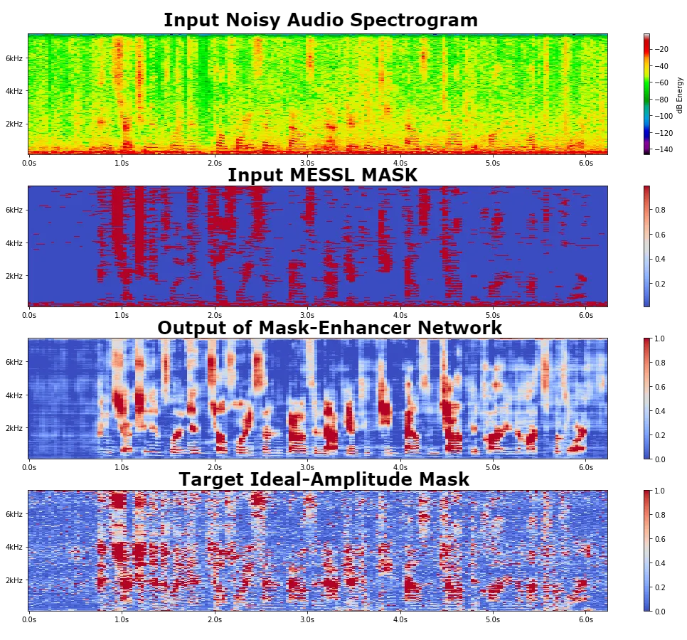

# Enhancement of Spatial Clustering-Based Time-Frequency Masks using LSTM Neural Networks

Felix Grezes, Zhaoheng Ni, Viet Anh Trinh, Michael Mandel

###### Abstract

Recent works have shown that Deep Recurrent Neural Networks using the
LSTM architecture can achieve strong single-channel speech enhancement
by estimating time-frequency masks. However, these models do not
naturally generalize to multi-channel inputs from varying microphone
configurations. In contrast, spatial clustering techniques can achieve
such generalization but lack a strong signal model. Our work proposes a
combination of the two approaches. By using LSTMs to enhance spatial
clustering based time-frequency masks, we achieve both the signal
modeling performance of multiple single-channel LSTM-DNN speech
enhancers and the signal separation performance and generality of
multi-channel spatial clustering. We compare our proposed system to
several baselines on the CHiME-3 dataset. We evaluate the quality of the
audio from each system using SDR from the BSS_eval toolkit and PESQ. We
evaluate the intelligibility of the output of each system using word
error rate from a Kaldi automatic speech recognizer.

###### Index Terms: 

Speech Enhancement, Microphone Array, LSTM, Spatial Clustering,
Beamforming

^(†)^(†)address: ¹The Graduate Center, City University of New York  
²Brooklyn College, City University of New York  
{fgrezes,zni,vtrinh}@gradcenter.cuny.edu, mim@sci.brooklyn.cuny.edu

## 1 Introduction

With speech recognition techniques approaching human performance on
noise-free audio with a close-talking microphone \[1\], recent research
has focused on the more difficult task of speech recognition in
far-field, noisy environments. This task requires robust speech
enhancement capabilities.

One approach to speech enhancement is spatial clustering, which groups
together spectrogram points coming from the same spatial location \[2\].
This information can be used to drive beamforming, which linearly
combines multiple microphone channels into an estimate of the original
signal that is optimal under some test-time criterion \[3\]. This
optimality is typically based on properties of the signals or the
spatial configuration of the recordings at test time, with no training
ahead of time.

Another approach is to use a signal models trained using neural
networks. Recent work on deep recurrent neural networks using the LSTM
architecture \[4\] can achieve significant single-channel noise
reduction \[5, 6\], and so there is interest in using trainable
deep-learning models to perform beamforming. This is especially useful
for optimizing beamformers directly for automatic speech recognition
\[7, 8\], although such optimization must happen at training time on a
large corpus of training data. Such models have difficulty generalizing
across microphone arrays, including differences in number of microphones
and array geometries, such as occurs between the AMI corpus \[9, 10\]
and the CHIME challenge \[11\].

In contrast to deep learning-based beamforming, spatial clustering is an
unsupervised method for performing source separation, so it easily
adapts across microphone arrays \[12, 13, 14\]. Such methods group
spectrogram points based on similarities in spatial properties, but are
typically not able to take advantage of signal models, such as models of
speech or noise.

Developed by Mandel et al. \[12\], Model-based EM Source Separation and
Localization (MESSL) is a system that computes time-frequency
spectrogram masks for source separation as a byproduct of estimating the
spatial location of the sources. It does so using the expectation
maximization (EM) algorithm, iteratively refining the estimates of the
spatial parameters of the audio sources and the spectrogram regions
dominated by each source.

While MESSL utilizes spatial information to separate multiple sources,
it does not model the content of the original signals. This is an
advantage when separating unknown sources, but performance can be
improved when a model of the target source is available. The goal of
this paper is to augment the capabilities of MESSL by adding a speech
signal model based on neural networks trained to enhance the masks
produced by MESSL.

In this paper we describe a novel method of combining single-channel
LSTM-RNN-based speech enhancement into MESSL. We train a distinct LSTM
model that uses the single-channel noisy audio to enhance the masks
produced my MESSL. To show how these methods enhance the speech of the
CHiME-3 outdoor 6-channel audio, compared to baselines, we report the
enhancement performance measured by PESQ score \[15\], the SDR, SIR, and
SAR scores from BSS Eval toolkit \[16\], as well as the WER as reported
by the Kaldi toolkit \[17\] trained on a separate corpus, the indoor
8-channel AMI corpus.

|                                             |                               |                                  |                |
| ------------------------------------------- | ----------------------------- | -------------------------------- | -------------- | --- | ------------------ | --- | -------------------- |
|                                             | Training Targets              |                                  | Loss Functions |
| Ideal Amplitude (IA) Masks                  | $`m_{ia}(\omega,t)`$$`\,=\,`$ | $`                               | s(\omega,t)    | /   | y(\omega,t)        | `$  | Binary Cross Entropy |
| Phase Sensitive (PA) Masks                  | $`m_{ps}(\omega,t)`$$`\,=\,`$ | $`\cos(\theta\_{\omega,t})\frac{ | s(\omega,t)    | }{  | y(\omega,t)        | }`$ | Binary Cross Entropy |
| Magnitude Spectrum (MS) Approximation       | $`m_{ma}(\omega,t)`$$`\,=\,`$ | $`                               | s(\omega,t)    | `$  | Mean-Squared Error |
| Phase-sensitive Spectrum (PS) Approximation | $`m_{pa}(\omega,t)`$$`\,=\,`$ | $`\cos(\theta\_{\omega,t})       | s(\omega,t)    | `$  | Mean-Squared Error |

Table 1: Training Targets and their Associated Loss Function

Figure 1: Multi-channel Spatial Clustering Based Time-Frequency Mask
Enhancement System

## 2 Related Work

Recently, Nugraha et al. \[18\] also studied multi-channel source
separation using deep feedforward neural networks, using a multi-channel
Gaussian model to combine the source spectrograms, to take advantage of
the spatial information present in the microphone array. They explore
the efficacy of different loss functions and other model
hyper-parameters. One of their findings is that the standard mean-square
error loss function performed close to the best. In contrast to our work
they do not use spatial information that beamforming can give.

Pfeifenberger et al. \[19\] proposed an optimal multi-channel filter
which relies solely on speech presence probability. This speech-noise
mask is predicted using a 2-layer feedforward neural network using
features based on the leading eigenvector of the spatial covariance
matrix of short time segments. Using a single eigenvector makes the
input to the DNN independent of the number of microphones, and thus
adaptable to new microphone configurations. It is trained on the
simulated noisy data portion of CHIME-3. They show that this filter
improves the PESQ score of the audio. This approach uses an early fusion
of the microphone channels before they are processed by the DNN, as
opposed to our late fusion after the DNN processes each channel.

Heymann et al \[20, 21\] also study the combination of multi-channel
beamforming with single-channel neural network model. Similar to ours,
the proposed model consists of a bidirectional LSTM layer, followed by
feedforward layers, in their case three. Of particular note is the
companion paper by Boeddeker et al. \[22\], which derives the derivative
of an eigenvalue problem involving complex-valued eigenvectors, allowing
their system to propagate errors in the final SNR through the
beamforming and back to the single-channel DNNs. While we do not
optimize our system in this end-to-end manner, the combination of MESSL
with the per-channel DNNs may provide advantages in modeling the spatial
information.

This paper builds upon previous work by the authors in \[23\] and
\[24\], in which we propose two other methods of improving MESSL: a
naive combination of the MESSL mask with the masks produced by a LSTM
network trained to enhance noisy spectrograms, and using the LSTM-based
masks to initialize the EM algorithm of MESSL. This previous work also
describes a novel supervised-mvdr beamforming technique to obtain
cleaner references for the CHiME-3 dataset.

## 3 Methods

### 3.1 Training the Networks to Enhance the MESSL Masks

To improve the quality of the binary masks produced by MESSL, we trained
LSTM neural networks to enhance a MESSL mask when passing this mask and
its associated noisy spectrogram through the network. We tested four
different training targets: ideal amplitude (IA) masks, phase sensitive
(PA) masks, magnitude spectrum (MS) approximations and phase-sensitive
(PS) spectrum approximations , based on work by Erdogan et al. \[25\],
as shown in Table 1.

The LSTM operates on single-channel recordings. Each channel in the
multi-channel recording is processed independently and in parallel by
the LSTM, following \[26\]. In the single-channel setting, the
short-time Fourier transform of the recorded noisy signal,
$`y(\omega,t)`$ is assumed to be

```math
\displaystyle y(\omega,t)=s(\omega,t)+n(\omega,t) \tag{1}
```

where $`s(\omega,t)`$ is the (possibly reverberant) target speech and
$`n(\omega,t)`$ is non-stationary additive noise. For the purposes of
defining the targets and cost functions in Table 1, let

```math
\displaystyle\theta_{\omega,t}=\angle s(\omega,t)-\angle y(\omega,t) \tag{2}
```

i.e., the phase difference between the target clean spectrogram and the
input noisy spectrogram. In each case the network was configured to
output a $`[0,1]`$ valued mask $`\hat{m}(\omega,t)`$ for each frame of
the input noisy spectrogram.

For the masks targets, the network was trained to minimize the binary
cross-entropy loss, while for the spectrum approximations targets the
network was trained to minimize the mean-squared error. While in theory
phase-sensitive masks may have negative values, causing problems with
the cross-entropy loss function, in practice these were rare enough that
we simply clipped those values to be 0.

For each training target type, we explored various hyper-parameter
combinations: single or double bi-directional LSTM layers of size 256,
512, 1024 or 2048; merging of the bi-directional forward and backward
outputs by summing, multiplying, averaging or concatenating; using a
sigmoid or hard sigmoid (a piece-wise linear approximation of sigmoid
that is faster to compute) for the output layer activation function. The
exploration was done by randomly generating a network from the above 64
combinations and training it until the loss on the development set
no-longer improved. For each training type, we report our best
configuration in Table 2.

The spectrogram inputs were converted from a linear to decibel scale,
and normalized to mean 0 and variance 1 at each frequency bin. The MESSL
binary masks were passed through the logit function. To perform the
computation and training of our LSTM neural networks, we used the KERAS
python library \[27\], built upon the Tensorflow library \[28\].

Figure 2 gives an example of how one of our networks has learned how to
use the noisy spectrogram to refine a mask produced by MESSL.



Figure 2: An example of the MA-trained Mask-Enhancer network using the
noisy spectrogram from channel 1 in utterance F01_050C0103_BUS in the
development set and its MESSL mask to produce an enhanced time-frequency
mask.

### 3.2 Enhancement of the MESSL Mask

A flowchart illustrating the framework of our methods is shown in
Figure 1. We extract six spectrograms from six-channel audio files using
short-time Fourier transform (STFT). The window size is 1024 (64ms at
16kHz). We then use one of our models described above to enhance the
mask produced by MESSL, using the six different channel spectrograms.
Those six enhanced masks are combined into one by taking the maximum. We
tried different ways of combining the MESSL mask and LSTM enhanced mask
(average, maximum, minimum, or LSTM output only) into a final mask. A
comparison of these combination methods is given in Table 3 Then we use
this final mask to estimate noise spatial covariances and perform
mask-driven MVDR beamforming. We apply the same mask as a post filter
onto the corresponding beamformed spectrogram and get the enhanced audio
using the inversed short-time Fourier transform. This audio is then used
to evaluate the quality of the model using the PESQ, SDR and WER
metrics.

## 4 Experiments and Results

### 4.1 The CHiME-3 Corpus

The CHiME-3 corpus features both live and simulated, 6-channel single
speaker recordings from 12 different speakers (6 male, 6 female), in 4
different noisy environments: café, street junction, public transport
and pedestrian area. In our work, we used the official data split, with
1600 real noisy utterances in the training set for training, 1640 real
noisy utterances in the development set for validation. We did not use
the simulated data to train our models. We tested our models on the
proposed 2640 utterances in the test set, which contains audio both from
real noisy recordings and simulated noisy recordings. In order to
perform speech recognition, we used the Kaldi toolkit trained on the AMI
corpus, which features 8 microphones, recording overlapping speech in
meeting rooms. These differences provide an additional challenge, but
are essential to evaluating the generalization abilities of our model.

### 4.2 Supervised MVDR Speech Reference

Because the real subset of the CHiME-3 recordings were spoken in a noisy
environment, it is not possible to provide a true clean reference signal
for them. Instead, an additional microphone was placed close to the
talker’s mouth to serve as a reference. While this reference has a
higher signal-to-noise ratio than the main microphones, it is not noise
free. In addition, because it is mounted close to the mouth, it contains
sounds that are not desired in a clean output and actually could hurt
ASR performance, namely pops, lip smacks, and other mouth noises. In
order to obtain a cleaner reference signal, we use the close mic signal
as a frequency-dependent voice activity detector to control the MVDR
beamforming of the signals from the array microphones, as described in
\[24\].

### 4.3 Evaluation Metrics

We evaluate the performance of our enhancement system in terms of both
speech quality and intelligibility to a speech recognizer. For quality,
we use the Signal-to-Distortion Ratio (SDR) from the BSS_Eval toolkit
\[16\] and the Perceptual Evaluation of Speech Quality (PESQ) score
\[29\]. PESQ is measured in units of mean opinion score (MOS) between 0
and 5, higher being better. For SDR, we used the source-based (not
spatial image-based) scoring. For the simulated data, the reference
signals were given by the booth recordings of CHiME-3. For the real
data, the reference signals were given by the supervised MVDR for the
target speech, and the approximation of the noise signals of the
individual microphone channels were computed by subtracting the
reference. Since we have no real ground truth audio for the real
dataset, the SDR scores reported on that dataset should be taken with a
grain of salt. SDR is measured in decibels, with higher values being
better. PESQ is fairly accurate at predicting subjective quality scores
for speech enhancement, but has the advantage for CHiME-3 of not
requiring a reference for the noise sources. The supervised MVDR signal
served as the speech reference for PESQ.

We also evaluate the enhanced speech by Word Error Rate (WER) using
Kaldi automatic speech recognizer. We train our Kaldi recognizer on AMI
corpus. The training and test sets differ significantly in the number of
microphones, array geometry, amount of reverberation, microphone array
distance, amount and type of noise, speaking style, and
vocabulary\[30\]. After the training and testing setup, we can evaluate
the performance of our enhancement system in reducing the mismatch
between training and testing data. WER is measured in percent, with
lower values being better.

### 4.4 Baseline system

As a baseline, we use our own implementation of the method of Souden et
al. \[31\]. This approach generalizes improved minima-controlled
recursive averaging \[32\] to multichannel signals to estimate the
speech presence probability. This speech presence probability is then
used to estimate the spatial covariance matrix of the noise, which is
used to compute an MVDR beamformer.

### 4.5 Results

As detailed in section 3.1, we explored various architectures for each
training target. We report the best architecture configurations in
Table 1, as measured by the loss on the CHiME-3 dev set.

[TABLE]

Table 2: Best hyper-parameter settings found for each training target.
Multiple layer sizes indicates multiple layers.

As detailed in section 3.2, we then tried various methods of combining
the enhanced masks with the MESSL masks, from the best networks for each
training target. As shown in Table 3, we found that averaging the
enhanced masks given by the model trained on ideal-amplitude targets
produced the best results on the dev set.

|     |      | Avg  | Min  | Max  | LSTM |
| --- | ---- | ---- | ---- | ---- | ---- |
| IA  | Dev  | 19.3 | 19.7 | 21.3 | 20.1 |
|     | Test | 32.6 | 32.3 | 33.1 | 32.0 |
| PS  | Dev  | 24.4 | 19.7 | 19.5 | 51.0 |
|     | Test | 39.9 | 32.3 | 32.1 | 84.8 |
| MA  | Dev  | 29.1 | 19.7 | 20.0 | 69.6 |
|     | Test | 45.3 | 32.3 | 32.4 | 85.7 |
| PA  | Dev  | 20.1 | 19.7 | 20.0 | 33.7 |
|     | Test | 34.1 | 32.3 | 32.1 | 64.8 |

Table 3: Comparison of WER for different methods of combining the
enhanced mask with the MESSL mask, using the best performing model for
each training target. (see Table 2).

Finally, we fully evaluated our best model (IA, Avg) using the PESQ, SDR
and WER metrics. The comparison to the baselines is shown in Tables 4
and 5. Compared to the method of Souden et al. \[31\], our mask-enhancer
method achieves better scores across all three metrics and on both the
dev and test dataset, over both the real and simulated data set, with
one exception for the SDR score over the simulated test set. Compared to
MESSL, our method improves the PESQ scores over the dev and test
dataset, while achieving similar WER scores.

|               |            |      |          |      |
| ------------- | ---------- | ---- | -------- | ---- |
|               | PESQ (MOS) |      | SDR (dB) |      |
| (SIMU data)   | Dev        | Test | Dev      | Test |
| MESSL \[12\]  | 3.18       | 3.10 | 6.00     | 2.38 |
| Souden \[31\] | 2.31       | 2.44 | 3.92     | 4.35 |
| Mask Enhancer | 3.15       | 3.13 | 6.24     | 2.57 |

Table 4: Results of PESQ and SDR comparing the best performing system
from Table 3 with several baselines, over the simulated portion of the
CHiME-3 eval and test data.

|               |            |      |          |      |         |      |
| ------------- | ---------- | ---- | -------- | ---- | ------- | ---- |
|               | PESQ (MOS) |      | SDR (dB) |      | WER (%) |      |
| (REAL data)   | Dev        | Test | Dev      | Test | Dev     | Test |
| MESSL \[12\]  | 2.65       | 2.37 | 6.42     | 5.38 | 19.7    | 32.3 |
| Souden \[31\] | 2.14       | 2.05 | 3.21     | 2.37 | 37.4    | 52.3 |
| Mask Enhancer | 2.73       | 2.47 | 7.07     | 5.97 | 19.3    | 32.6 |

Table 5: Results of all metrics comparing the best performing system
from Table 3 with several baselines, over the real portion of the
CHiME-3 eval and test data.

## 5 Conclusion and Future Work

In this paper we propose a novel method to adapt parallel single-channel
LSTM-based enhancement to multi-channel audio, combining the
speech-signal modeling power of the LSTM neural network with the spatial
clustering power of MESSL, further enhancing the audio. We show that
this method can help MESLL improve the quality of audio, with similar
intelligibility.

Our future work will continue to explore different ways of integrating
the LSTM speech-signal model with MESSL. Preliminary results show that
the spatial information is more valuable than the single-channel speech
information with respect to WER. To further test this hypothesis,the
next step is to integrate a mask cleaning LSTM model in each loop of
MESSL’s EM algorithm, i.e use the mask enhancer model to clean the MESSL
masks before the estimation of the spatial parameters.

## 6 Acknowledgements

This material is based upon work supported by the Alfred P Sloan
foundation and the National Science Foundation (NSF) under Grant No.
IIS-1409431. Any opinions, findings, and conclusions or recommendations
expressed in this material are those of the author(s) and do not
necessarily reflect the views of the NSF.

## References

- \[1\] Wayne Xiong, Jasha Droppo, Xuedong Huang, Frank Seide, Mike
  Seltzer, Andreas Stolcke, Dong Yu, and Geoffrey Zweig, “Achieving
  human parity in conversational speech recognition,” Tech. Rep.,
  February 2017.
- \[2\] Michael I Mandel, Shoko Araki, and Tomohiro Nakatani,
  “Multichannel clustering and classification approaches,” in Audio
  Source Separation and Speech Enhancement, Emmanuel Vincent, Tuomas
  Virtanen, and Sharon Gannot, Eds., chapter 12. Wiley, 2017, To appear.
- \[3\] Michael Brandstein and Darren Ward, Microphone arrays: signal
  processing techniques and applications, Springer Science & Business
  Media, 2013.
- \[4\] Sepp Hochreiter and Jürgen Schmidhuber, “Long short-term
  memory,” Neural computation, vol. 9, no. 8, pp. 1735–1780, 1997.
- \[5\] A. Graves, A. r. Mohamed, and G. Hinton, “Speech recognition
  with deep recurrent neural networks,” in 2013 IEEE International
  Conference on Acoustics, Speech and Signal Processing, May 2013, pp.
  6645–6649.
- \[6\] Felix Weninger, Hakan Erdogan, Shinji Watanabe, Emmanuel
  Vincent, Jonathan Le Roux, John R Hershey, and Björn Schuller, “Speech
  enhancement with lstm recurrent neural networks and its application to
  noise-robust asr,” in International Conference on Latent Variable
  Analysis and Signal Separation. Springer, 2015, pp. 91–99.
- \[7\] Xiong Xiao, Shinji Watanabe, Hakan Erdogan, Liang Lu, John
  Hershey, Michael L Seltzer, Guoguo Chen, Yu Zhang, Michael Mandel, and
  Dong Yu, “Deep beamforming networks for multi-channel speech
  recognition,” in Proceedings of the IEEE International Conference on
  Acoustics, Speech, and Signal Processing. mar 2016, pp. 5745–5749,
  IEEE.
- \[8\] T. N. Sainath, R. J. Weiss, A. Senior, K. W. Wilson, and
  O. Vinyals, “Learning the speech front-end with raw waveform cldnns,” 2015.
- \[9\] Jean Carletta, “Unleashing the killer corpus: experiences in
  creating the multi-everything ami meeting corpus,” Language Resources
  and Evaluation, vol. 41, no. 2, pp. 181–190, 2007.
- \[10\] S. Renals, T. Hain, and H. Bourlard, “Recognition and
  understanding of meetings the ami and amida projects,” in 2007 IEEE
  Workshop on Automatic Speech Recognition Understanding (ASRU), Dec
  2007, pp. 238–247.
- \[11\] Jon Barker, Ricard Marxer, Emmanuel Vincent, and Shinji
  Watanabe, “The third chime speech separation and recognition
  challenge: Dataset, task and baselines,” in Automatic Speech
  Recognition and Understanding (ASRU), 2015 IEEE Workshop on. IEEE,
  2015, pp. 504–511.
- \[12\] M. I. Mandel, R. J. Weiss, and D. P. W. Ellis, “Model-based
  expectation-maximization source separation and localization,” IEEE
  Transactions on Audio, Speech, and Language Processing, vol. 18, no.
  2, pp. 382–394, Feb 2010.
- \[13\] Hiroshi Sawada, Shoko Araki, and Shoji Makino, “Underdetermined
  convolutive blind source separation via frequency bin-wise clustering
  and permutation alignment,” IEEE Transactions on Audio, Speech, and
  Language Processing, vol. 19, no. 3, pp. 516–527, 2011.
- \[14\] Deblin Bagchi, Michael I Mandel, Zhongqiu Wang, Yanzhang He,
  Andrew Plummer, and Eric Fosler-Lussier, “Combining spectral feature
  mapping and multi-channel model-based source separation for
  noise-robust automatic speech recognition,” in Proceedings of the IEEE
  Workshop on Automatic Speech Recognition and Understanding, 2015.
- \[15\] Antony W Rix, John G Beerends, Michael P Hollier, and Andries P
  Hekstra, “Perceptual evaluation of speech quality (pesq)-a new method
  for speech quality assessment of telephone networks and codecs,” in
  Acoustics, Speech, and Signal Processing, 2001.
  Proceedings.(ICASSP’01). 2001 IEEE International Conference on. IEEE,
  2001, vol. 2, pp. 749–752.
- \[16\] Emmanuel Vincent, Rémi Gribonval, and Cédric Févotte,
  “Performance measurement in blind audio source separation,” IEEE
  transactions on audio, speech, and language processing, vol. 14, no.
  4, pp. 1462–1469, 2006.
- \[17\] Daniel Povey, Arnab Ghoshal, Gilles Boulianne, Lukas Burget,
  Ondrej Glembek, Nagendra Goel, Mirko Hannemann, Petr Motlicek, Yanmin
  Qian, Petr Schwarz, Jan Silovsky, Georg Stemmer, and Karel Vesely,
  “The kaldi speech recognition toolkit,” in IEEE 2011 Workshop on
  Automatic Speech Recognition and Understanding. Dec. 2011, IEEE Signal
  Processing Society, IEEE Catalog No.: CFP11SRW-USB.
- \[18\] Aditya Arie Nugraha, Antoine Liutkus, and Emmanuel Vincent,
  “Multichannel audio source separation with deep neural networks,”
  IEEE/ACM Transactions on Audio, Speech, and Language Processing, vol.
  24, no. 9, pp. 1652–1664, 2016.
- \[19\] Lukas Pfeifenberger, Matthias Zohrer, and Franz Pernkopf,
  “Dnn-based speech mask estimation for eigenvector beamforming,” in
  Acoustics, Speech and Signal Processing (ICASSP), 2017 IEEE
  International Conference on. 2017, IEEE SigPort.
- \[20\] Jahn Heymann, Lukas Drude, and Reinhold Haeb-Umbach, “Neural
  network based spectral mask estimation for acoustic beamforming,” in
  Acoustics, Speech and Signal Processing (ICASSP), 2016 IEEE
  International Conference on. IEEE, 2016, pp. 196–200.
- \[21\] Jahn Heymann, Lukas Drude, Christoph Boeddeker, Patrick
  Hanebrink, and Reinhold Haeb-Umbach, “Beamnet: End-to-end training of
  a beamformer-supported multi-channel asr system,” in Acoustics, Speech
  and Signal Processing (ICASSP), 2017 IEEE International Conference
  on, 2017.
- \[22\] Christoph Boeddeker, Patrick Hanebrink, Jahn Heymann, Drude
  Lukas, and Reinhold Haeb-Umbach, “Optimizing neural-network supported
  acoustic beamforming by algorithmic differentiation,” in Acoustics,
  Speech and Signal Processing (ICASSP), 2017 IEEE International
  Conference on, 2017.
- \[23\] Michael I Mandel and Jon P Barker, “Multichannel spatial
  clustering for robust far-field automatic speech recognition in
  mismatched conditions,” in Proceedings of Interspeech, 2016, pp.
  1991–1995.
- \[24\] Felix Grezes, Ni Zhaoheng, Trinh Viet Anh, and Michael Mandel,
  “Combining spatial clustering with lstm speech models for multichannel
  speech enhancement,” in Interspeech, 2017, Submitted.
- \[25\] Hakan Erdogan, John R Hershey, Shinji Watanabe, and Jonathan
  Le Roux, “Phase-sensitive and recognition-boosted speech separation
  using deep recurrent neural networks,” in Acoustics, Speech and Signal
  Processing (ICASSP), 2015 IEEE International Conference on. IEEE,
  2015, pp. 708–712.
- \[26\] Hakan Erdogan, John R Hershey, Shinji Watanabe, Michael Mandel,
  and Jonathan Le Roux, “Improved mvdr beamforming using single-channel
  mask prediction networks,” in Proc. INTERSPEECH, 2016.
- \[27\] François Chollet, “Keras,”
  https://github.com/fchollet/keras, 2015.
- \[28\] Martín Abadi and et al, “TensorFlow: Large-scale machine
  learning on heterogeneous systems,” 2015, Software available from
  tensorflow.org.
- \[29\] Philipos C Loizou, Speech Enhancement: Theory and Practice
  (Signal Processing and Communications), CRC, 2007.
- \[30\] Michael I Mandel and Jon P Barker, “Multichannel spatial
  clustering for robust far-field automatic speech recognition in
  mismatched conditions,” Interspeech 2016, pp. 1991–1995, 2016.
- \[31\] Mehrez Souden, Jingdong Chen, Jacob Benesty, and Sofiene Affes,
  “An integrated solution for online multichannel noise tracking and
  reduction,” IEEE Transactions on Audio, Speech, and Language
  Processing, vol. 19, no. 7, pp. 2159–2169, 2011.
- \[32\] Israel Cohen and Baruch Berdugo, “Noise estimation by minima
  controlled recursive averaging for robust speech enhancement,” IEEE
  signal processing letters, vol. 9, no. 1, pp. 12–15, 2002.
